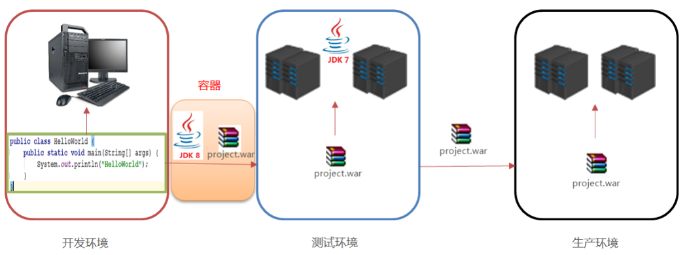
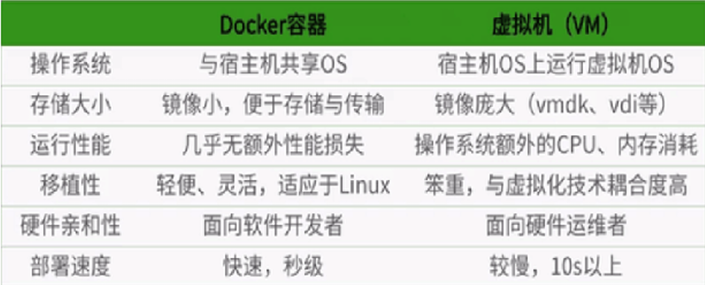
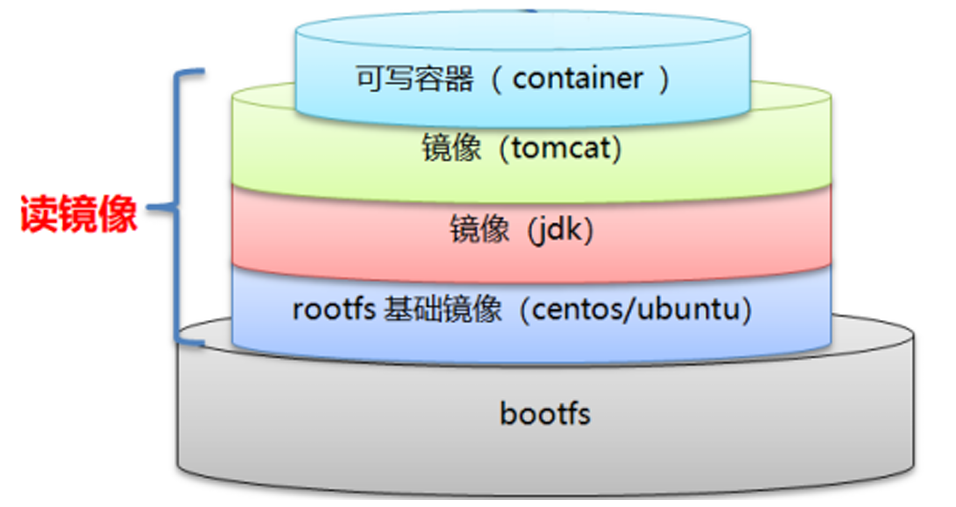
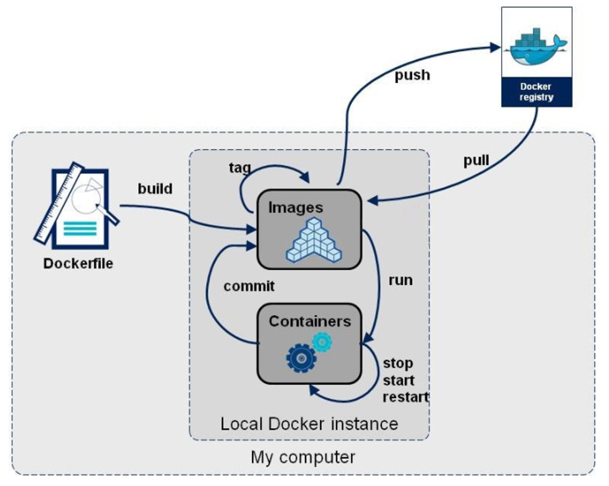
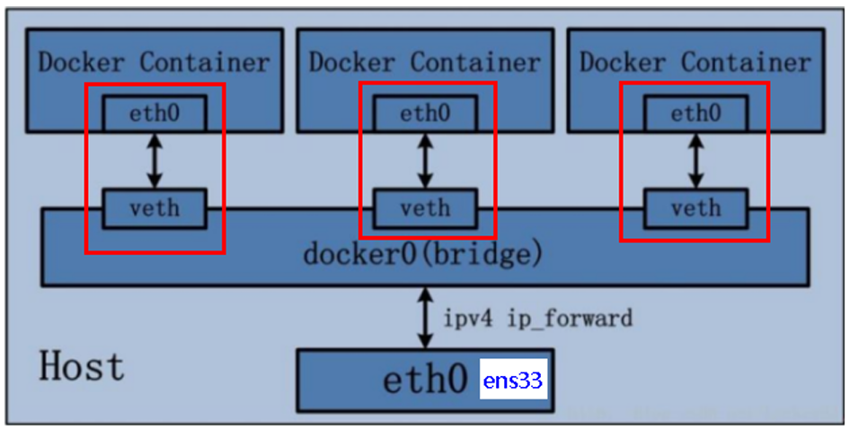
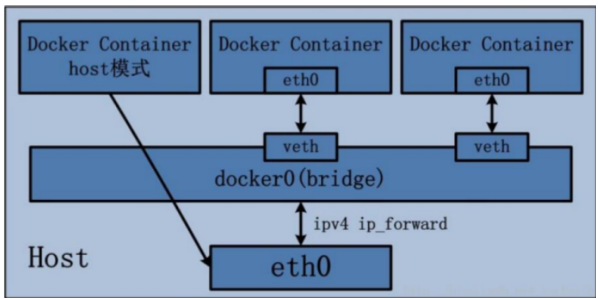
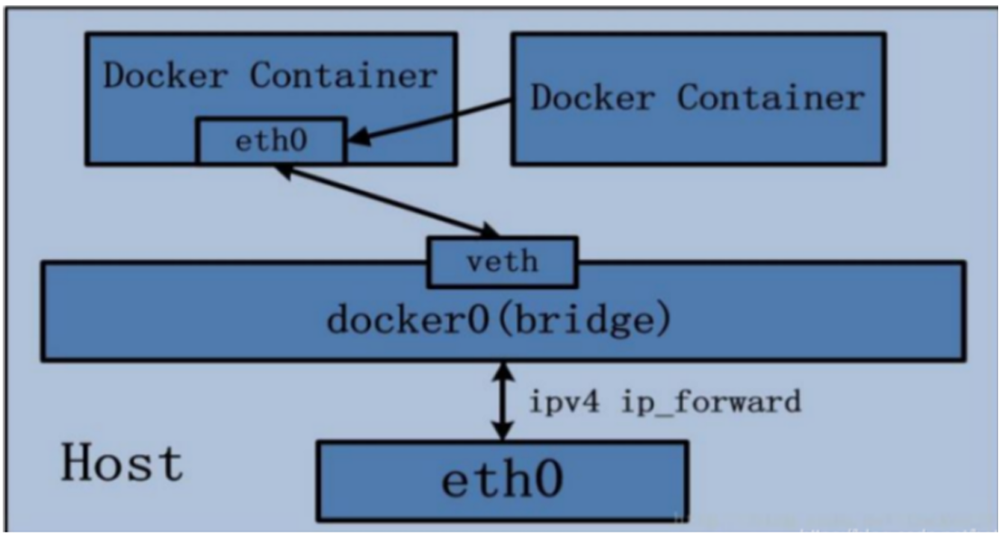

# Docker 容器

## 第一章：Docker 基础

### 一、Docker 概述

#### （1）为什么要学 Docker

我们写的代码会接触到好几个环境：开发环境、测试环境以及生产环境。在实施的过程中，经常会出现 一些问题。比如我们开发环境使用的是 jdk1.8 的版本，而测试环境还是用 的 jdk1.7 的版本。如果我们 在开发环境上编写的代码，放在测试环境上面运行，由于开发环境的差异，代码测试可能会出现意想不 到的错误，这就是我们所说的代码的”水土不服”。 

我们需要如何确保应用能够在这些环境中运行和通过质量检测？并且在部署过程中不出现令人头疼的版本、配置问题，也无需重新编写代码和进行故障修复？ 答案就是使用容器。Docker之所以发展如此迅速，也是因为它对此给出了一个标准化的解决方案-----系 统平滑移植，容器虚拟化技术。 环境配置相当麻烦，换一台机器，就要重来一次，费力费时。很多人想到，能不能从根本上解决问题，软件可以带环境安装？也就是说，安装的时候，把原始环境一模一样地复制过来。开发人员利用  Docker 可以消除协作编码时“在我的机器上可正常工作”的问题。



之前在服务器配置一个应用的运行环境，要安装各种软件，就拿现在大型的电商项目环境来说， Java/RabbitMQ/MySQL/JDBC 驱动包等。安装和配置这些东西有多麻烦就不说了，它还不能跨平台。假如我们是在 Windows 上安装的这些环境，到了 Linux 又得重新装。况且就算不跨操作系统，换另一台同样操作系统的服务器，要移植应用也是非常麻烦的。 传统上认为，软件编码开发/测试结束后，所产出的成果即是程序或是能够编译执行的二进制字节码等 （java为例）。而为了让这些程序可以顺利执行，开发团队也得准备完整的部署文件，让维运团队得以部 署应用程式，开发需要清楚的告诉运维部署团队，用的全部配置文件+所有软件环境。不过，即便如 此，仍然常常发生部署失败的状况。Docker 的出现使得 Docker 得以打破过去「程序即应用」的观念。 透过镜像（images）将作业系统核心除外，运作应用程式所需要的系统环境，由下而上打包，达到应用程 式跨平台间的无缝接轨运作。

#### （2）Docker 简介

Docker是基于Go语言实现的云开源项目。Docker 的主要目标是 “Build，Ship and Run Any App,Anywhere”，也就是通过对应用组件的封装、分发、部署、运行等生命周期的管理，使用户的 APP（可以是一个WEB应用或数据库应用等等）及其运行环境能够做到“一次镜像，处处运行”。 

Linux容器技术的出现就解决了这样一个问题，而 Docker 就是在它的基础上发展过来的。将应用打成 镜像，通过镜像成为运行在Docker容器上面的实例，而 Docker容器在任何操作系统上都是一致的，这就实现了跨平台、跨服务器。只需要一次配置好环境，换到别的机子上就可以一键部署好，大大简化了操作。

Docker 解决了运行环境和配置问题的软件容器，方便做持续集成并有助于整体发布的容器虚拟化技术。

#### （3）Docker 与虚拟机的区别

##### 1. 传统虚拟机

虚拟机（virtual machine）就是带环境安装的一种解决方案。它可以在一种操作系统里面运行另一种操作系统，比如在 Windows10 系统里面运行 Linux 系统 CentOS7。应用程序对此毫无感知，因为虚拟机看上去跟真实系统一模一样，而对于底层系统来说，虚拟机就是一个普通文件，不需要了就删掉，对其他部分毫无影响。这类虚拟机完美的运行了另一套系统，能够使应用程序，操作系统和硬件三者之间的逻辑不变。

传统的虚拟机技术基于安装在主操作系统上的虚拟机管理系统(入virtual box、vmware等)，在虚拟机上再安装操作系统，最后在操作系统里面安装部署各种应用。

传统的虚拟机也有一些缺点：资源占用多、冗余步骤多、启动慢。

##### 2. 容器化虚拟技术

由于前面虚拟机存在某些缺点，Linux 发展出了另一种虚拟化技术：Linux容器（Linux Containers，缩写为 LXC）。 Linux容器是与系统其他部分隔离开的一系列进程，从另一个镜像运行，并由该镜像提供支持进程所需 的全部文件。容器提供的镜像包含了应用的所有依赖项，因而在从开发到测试再到生产的整个过程中，它都具有可移植性和一致性。 Linux 容器不是模拟一个完整的操作系统而是对进程进行隔离。有了容器，就可以将软件运行所需的所有资源打包到一个隔离的容器中。容器与虚拟机不同，不需要捆绑一整套操作系统，只需要软件工作所 需的库资源和设置 。系统因此而变得高效轻量并保证部署在任何环境中的软件都能始终如一地运行。

Docker 容器是在操作系统层面上实现虚拟化，直接复用本地主机的操作系统。而传统虚拟机直接在硬件层面实现虚拟化。与传统的虚拟机相比，Docker 体现的优势是启动速度快，占用体积小。

**比较了 Docker 和传统虚拟化方式的不同之处：**

- 传统虚拟机技术是虚拟出一套硬件后，在其上运行一个完整操作系统，在该系统上再运行所需应用进程；
- 容器内的应用进程直接运行于宿主的内核，容器内没有自己的内核且也没有进行硬件虚拟。因此容器要比传统虚拟机更为轻便；
- 每个容器之间互相隔离，每个容器有自己的文件系统 ，容器之间进程不会相互影响，能区分计算资源。

#### （4）Docker 的优势

**一次构建处处运行：**

- 更快速的应用交付和部署：

	传统的应用开发完成后，需要提供一堆安装程序和配置说明文档，安装部署后需根据配置文档进行繁杂的配置才能正常运行。Docker化之后只需要交付少量容器镜像文件，在正式生产环境加载镜像并运行即可，应用安装配置在镜像里已经内置好，大大节省部署配置和测试验证时间。

- 更便捷的升级和扩缩容：

	随着微服务架构和Docker的发展，大量的应用会通过微服务方式架构，应用的开发构建将变成搭乐高积木一样，每个 Docker 容器将变成一块“积木”，应用的升级将变得非常容易。当现有的容器不足以支撑业务处理时，可通过镜像运行新的容器进行快速扩容，使应用系统的扩容从原先的天级变成分钟级甚至秒级。

- 更简单的系统运维：

	应用容器化运行后，生产环境运行的应用可与开发、测试环境的应用高度一致，容器会将应用程序相关的环境和状态完全封装起来，不会因为底层基础架构和操作系统的不一致性给应用带来影响，产生新的 BUG。当出现程序异常时，也可以通过测试环境的相同容器进行快速定位和修复。 

- 更高效的计算资源利用 Docker是内核级虚拟化，其不像传统的虚拟化技术一样需要额外的 Hypervisor 支持，所以在一台物理 机上可以运行很多个容器实例，可大大提升物理服务器的CPU和内存的利用率。

**比虚拟机更快的原因：**

- 由于docker不需要Hypervisor(虚拟机)实现硬件资源虚拟化,运行在docker容器上的程序直接使用的都是实际物理机的硬件资源。因此在CPU、内存利用率上docker将会在效率上有明显优势。
- 当新建一个容器(docker run)时，docker不需要和虚拟机一样重新加载一个操作系统内核。进而避免引寻、加载操作系统内核返回等比较费时费资源的过程，当新建一个虚拟机时，虚拟机软件需要加载OS，返回新建过程是分钟级别的。而docker由于直接利用宿主机的操作系统，则省略了返回过程，因此新建一个 docker容器只需要几秒钟。



### 二、Docker 的下载与安装

Docker官网： http://www.docker.com；

Docker Hub官网：http://hub.docker.com

Docker并非是一个通用的容器工具，它依赖于已存在并运行的 Linux 内核环境。Docker实质上是在已经运行的 Linux下制造了一个隔离的文件环境，因此它执行的效率几乎等同于所部署的 Linux 主机。因此 Docker 必须部署在Linux内核的系统上。如果其它系统想部署 Docker，必须安装一个虚拟的Linux环境。

#### （1）Docker 的基本组成

**镜像（image）：**

Docker 镜像（Image）就是一个只读的模板。镜像可以用来创建 Docker 容器，一个镜像可以创建很多 容器。它也相当于是一个 root 文件系统。比如官方镜像 CentOS7 就包含了完整的一套 CentOS7   最小系统的 root 文件系统。相当于容器的“源代码”，docker镜像文件类似于Java的类模板，而docker容器实 例类似于 java 中创建出来的实例对象。 容器与镜像的关系就类似于Java面向编程中的类与对象的关系。

**容器（Container）：**

- 从面向对象角度：Docker 利用容器（Container）独立运行的一个或一组应用，应用程序或服务运行在容器里面，容器就 类似于一个虚拟化的运行环境，容器是用镜像创建的运行实例。就像是Java中的类和实例对象一样，镜 像是静态的定义，容器是镜像运行时的实体。容器为镜像提供了一个标准的和隔离的运行环境，它可以 被启动、开始、停止、删除。每个容器都是相互隔离的、保证安全的平台。
- 从镜像容器角度：可以把容器看做是一个简易版的 Linux 环境（包括root用户权限、进程空间、用户空间和网络空间等） 和运行在其中的应用程序。

**仓库（Repository）：**

仓库（Repository）是集中存放镜像文件的场所。类似于Maven仓库，存放各种 jar 包的地方；github 仓库，存放各种git项目的地方； Docker公司提供的官方 registry 被称为 Docker Hub，存放各种镜像模板的地方。仓库分为公开仓库（Public）和私有仓库（Private）两种形式。最大的公开仓库是 Docker Hub（https://hub.docker.com/），存放了数量庞大的镜像供用户下载。国内的公开仓库包括阿里云 、网易云等。

#### （2）安装 Docker

##### 1. 在 CentOS 7 上安装 Docker

首先请确保本地的 Linux 环境是 CentOS7 及以上的版本。

更新 yum 源：

```bash
yum update
```

安装所需的软件包：

```bash
yum install -y yum-utils
```

设置镜像仓库（可能会更改）：

```bash
yum-config-manager --add-repo http://mirrors.aliyun.com/docker-ce/linux/centos/docker-ce.repo
```

更新yum软件包索引：

```bash
yum makecache fast
```

安装Docker：

```bash
yum -y install docker-ce docker-ce-cli containerd.io
```

启动 Docker：

```bash
systemctl start docker
```

也可以设置开机自动启动 Docker：

```bash
systemctl enable docker
```

启动后可以查看 Docker 的版本信息：

```bash
[root@xq101 ~]# docker version
Client: Docker Engine - Community
 Version:           26.1.4
 API version:       1.45
 Go version:        go1.21.11
 Git commit:        5650f9b
 Built:             Wed Jun  5 11:32:04 2024
 OS/Arch:           linux/amd64
 Context:           default

Server: Docker Engine - Community
 Engine:
  Version:          26.1.4
  API version:      1.45 (minimum version 1.24)
  Go version:       go1.21.11
  Git commit:       de5c9cf
  Built:            Wed Jun  5 11:31:02 2024
  OS/Arch:          linux/amd64
  Experimental:     false
 containerd:
  Version:          1.6.33
  GitCommit:        d2d58213f83a351ca8f528a95fbd145f5654e957
 runc:
  Version:          1.1.12
  GitCommit:        v1.1.12-0-g51d5e94
 docker-init:
  Version:          0.19.0
  GitCommit:        de40ad0
```

##### 2. 安装 Docker 国内镜像加速器

创建目录：

```bash
mkdir -p /etc/docker
```

写入配置文件：

```bash
# 写入配置文件
tee /etc/docker/daemon.json <<-'EOF'
{
    "registry-mirrors": [
    	"https://docker-0.unsee.tech",
        "https://docker-cf.registry.cyou",
        "https://docker.1panel.live"
    ]
}
EOF
```

重启Docker服务：

```bash
systemctl start docker
```

重启后可以查看 Docker 的服务信息：

```bash
[root@xq101 ~]# docker info
Client: Docker Engine - Community
 Version:    26.1.4
 Context:    default
 Debug Mode: false
 Plugins:
  buildx: Docker Buildx (Docker Inc.)
    Version:  v0.14.1
    Path:     /usr/libexec/docker/cli-plugins/docker-buildx
  compose: Docker Compose (Docker Inc.)
    Version:  v2.27.1
    Path:     /usr/libexec/docker/cli-plugins/docker-compose

Server:
 Containers: 2
  Running: 0
  Paused: 0
  Stopped: 2
 Images: 2
 Server Version: 26.1.4
 Storage Driver: overlay2
  Backing Filesystem: xfs
  Supports d_type: true
  Using metacopy: false
  Native Overlay Diff: true
  userxattr: false
 Logging Driver: json-file
 Cgroup Driver: cgroupfs
 Cgroup Version: 1
 Plugins:
  Volume: local
  Network: bridge host ipvlan macvlan null overlay
  Log: awslogs fluentd gcplogs gelf journald json-file local splunk syslog
 Swarm: inactive
 Runtimes: io.containerd.runc.v2 runc
 Default Runtime: runc
 Init Binary: docker-init
 containerd version: d2d58213f83a351ca8f528a95fbd145f5654e957
 runc version: v1.1.12-0-g51d5e94
 init version: de40ad0
 Security Options:
  seccomp
   Profile: builtin
 Kernel Version: 3.10.0-1160.119.1.el7.x86_64
 Operating System: CentOS Linux 7 (Core)
 OSType: linux
 Architecture: x86_64
 CPUs: 1
 Total Memory: 1.776GiB
 Name: xq101
 ID: ca7e9ea5-b0d6-4cff-886b-1b15f47dea0d
 Docker Root Dir: /var/lib/docker
 Debug Mode: false
 Experimental: false
 Insecure Registries:
  127.0.0.0/8
 Registry Mirrors:
  https://docker-0.unsee.tech/
  https://docker-cf.registry.cyou/
  https://docker.1panel.live/
 Live Restore Enabled: false
```

检查是否成功配置：拉取 hello-world 镜像；

```bash
[root@xq101 ~]# docker run hello-world
Unable to find image 'hello-world:latest' locally
latest: Pulling from library/hello-world
e6590344b1a5: Already exists 
Digest: sha256:7e1a4e2d11e2ac7a8c3f768d4166c2defeb09d2a750b010412b6ea13de1efb19
Status: Downloaded newer image for hello-world:latest

Hello from Docker!
This message shows that your installation appears to be working correctly.

To generate this message, Docker took the following steps:
 1. The Docker client contacted the Docker daemon.
 2. The Docker daemon pulled the "hello-world" image from the Docker Hub.
    (amd64)
 3. The Docker daemon created a new container from that image which runs the
    executable that produces the output you are currently reading.
 4. The Docker daemon streamed that output to the Docker client, which sent it
    to your terminal.

To try something more ambitious, you can run an Ubuntu container with:
 $ docker run -it ubuntu bash

Share images, automate workflows, and more with a free Docker ID:
 https://hub.docker.com/

For more examples and ideas, visit:
 https://docs.docker.com/get-started/
```

查看所有镜像：

```bash
[root@xq101 ~]# docker images
REPOSITORY    TAG       IMAGE ID       CREATED        SIZE
hello-world   latest    74cc54e27dc4   2 months ago   10.1kB
```

### 三、Docker 常用命令

#### （1）帮助类命令

```bash
systemctl start docker    	#启动docker
systemctl status docker   	#查看docker的运行状态
systemctl restart docker  	#重启docker服务
systemctl stop docker  		#停止docker服务
docker --help 				#查看docker帮助文档
docker [命令名] --help		  #查看某个命令的帮助
```

<font color="blue">示例：</font>

```bash
[root@xq101 ~]# systemctl start docker
[root@xq101 ~]# systemctl restart docker
[root@xq101 ~]# systemctl status docker
● docker.service - Docker Application Container Engine
   Loaded: loaded (/usr/lib/systemd/system/docker.service; enabled; vendor preset: disabled)
   Active: active (running) since 四 2025-04-03 20:50:21 CST; 6s ago
     Docs: https://docs.docker.com
 Main PID: 2576 (dockerd)
    Tasks: 10
   Memory: 32.7M
   CGroup: /system.slice/docker.service
           └─2576 /usr/bin/dockerd -H fd:// --containerd=/run/containerd/containerd.sock

4月 03 20:50:20 xq101 dockerd[2576]: time="2025-04-03T20:50:20.100265352+08:00" level=info msg="Firewalld: docker zone already exists...turning"
4月 03 20:50:20 xq101 dockerd[2576]: time="2025-04-03T20:50:20.603307604+08:00" level=info msg="Firewalld: interface docker0 already ...turning"
4月 03 20:50:20 xq101 dockerd[2576]: time="2025-04-03T20:50:20.659896285+08:00" level=info msg="Firewalld: interface docker0 already ...turning"
4月 03 20:50:21 xq101 dockerd[2576]: time="2025-04-03T20:50:21.153531088+08:00" level=info msg="Default bridge (docker0) is assigned ...address"
4月 03 20:50:21 xq101 dockerd[2576]: time="2025-04-03T20:50:21.383716415+08:00" level=info msg="Firewalld: interface docker0 already ...turning"
4月 03 20:50:21 xq101 dockerd[2576]: time="2025-04-03T20:50:21.621876636+08:00" level=info msg="Loading containers: done."
4月 03 20:50:21 xq101 dockerd[2576]: time="2025-04-03T20:50:21.655629741+08:00" level=info msg="Docker daemon" commit=de5c9cf contain...n=26.1.4
4月 03 20:50:21 xq101 dockerd[2576]: time="2025-04-03T20:50:21.655781147+08:00" level=info msg="Daemon has completed initialization"
4月 03 20:50:21 xq101 dockerd[2576]: time="2025-04-03T20:50:21.721392052+08:00" level=info msg="API listen on /run/docker.sock"
4月 03 20:50:21 xq101 systemd[1]: Started Docker Application Container Engine.
Hint: Some lines were ellipsized, use -l to show in full.
[root@xq101 ~]# systemctl stop docker
Warning: Stopping docker.service, but it can still be activated by:
  docker.socket
[root@xq101 ~]# systemctl start docker
[root@xq101 ~]# docker --help

Usage:  docker [OPTIONS] COMMAND

A self-sufficient runtime for containers

Common Commands:
  run         Create and run a new container from an image
  exec        Execute a command in a running container
  ps          List containers
  build       Build an image from a Dockerfile
  pull        Download an image from a registry
  push        Upload an image to a registry
  images      List images
  login       Log in to a registry
  logout      Log out from a registry
  search      Search Docker Hub for images
  version     Show the Docker version information
  info        Display system-wide information

Management Commands:
  builder     Manage builds
  buildx*     Docker Buildx
  compose*    Docker Compose
  container   Manage containers
  context     Manage contexts
  image       Manage images
  manifest    Manage Docker image manifests and manifest lists
  network     Manage networks
  plugin      Manage plugins
  system      Manage Docker
  trust       Manage trust on Docker images
  volume      Manage volumes

Swarm Commands:
  swarm       Manage Swarm

Commands:
  attach      Attach local standard input, output, and error streams to a running container
  commit      Create a new image from a container's changes
  cp          Copy files/folders between a container and the local filesystem
  create      Create a new container
  diff        Inspect changes to files or directories on a container's filesystem
  events      Get real time events from the server
  export      Export a container's filesystem as a tar archive
  history     Show the history of an image
  import      Import the contents from a tarball to create a filesystem image
  inspect     Return low-level information on Docker objects
  kill        Kill one or more running containers
  load        Load an image from a tar archive or STDIN
  logs        Fetch the logs of a container
  pause       Pause all processes within one or more containers
  port        List port mappings or a specific mapping for the container
  rename      Rename a container
  restart     Restart one or more containers
  rm          Remove one or more containers
  rmi         Remove one or more images
  save        Save one or more images to a tar archive (streamed to STDOUT by default)
  start       Start one or more stopped containers
  stats       Display a live stream of container(s) resource usage statistics
  stop        Stop one or more running containers
  tag         Create a tag TARGET_IMAGE that refers to SOURCE_IMAGE
  top         Display the running processes of a container
  unpause     Unpause all processes within one or more containers
  update      Update configuration of one or more containers
  wait        Block until one or more containers stop, then print their exit codes

Global Options:
      --config string      Location of client config files (default "/root/.docker")
  -c, --context string     Name of the context to use to connect to the daemon (overrides DOCKER_HOST env var and default context set with
                           "docker context use")
  -D, --debug              Enable debug mode
  -H, --host list          Daemon socket to connect to
  -l, --log-level string   Set the logging level ("debug", "info", "warn", "error", "fatal") (default "info")
      --tls                Use TLS; implied by --tlsverify
      --tlscacert string   Trust certs signed only by this CA (default "/root/.docker/ca.pem")
      --tlscert string     Path to TLS certificate file (default "/root/.docker/cert.pem")
      --tlskey string      Path to TLS key file (default "/root/.docker/key.pem")
      --tlsverify          Use TLS and verify the remote
  -v, --version            Print version information and quit

Run 'docker COMMAND --help' for more information on a command.

For more help on how to use Docker, head to https://docs.docker.com/go/guides/
[root@xq101 ~]# docker cp --help

Usage:  docker cp [OPTIONS] CONTAINER:SRC_PATH DEST_PATH|-
	docker cp [OPTIONS] SRC_PATH|- CONTAINER:DEST_PATH

Copy files/folders between a container and the local filesystem

Use '-' as the source to read a tar archive from stdin
and extract it to a directory destination in a container.
Use '-' as the destination to stream a tar archive of a
container source to stdout.

Aliases:
  docker container cp, docker cp

Options:
  -a, --archive       Archive mode (copy all uid/gid information)
  -L, --follow-link   Always follow symbol link in SRC_PATH
  -q, --quiet         Suppress progress output during copy. Progress output is automatically suppressed if no terminal is attached
```

#### （2）Docker 镜像命令

**查看本机上的镜像：**

```bash
docker images		# 查看本机上的镜像
docker images -a	# 列出本地所有的镜像（含历史映像层）
docker images -q	# 只显示镜像ID
```

| 参数       | 说明                                                         |
| ---------- | ------------------------------------------------------------ |
| REPOSITORY | 表示镜像的仓库源。                                           |
| TAG        | 镜像的标签版本号。在下载镜像的时候，如果默认不加版本号，就会下载默认最新版 本的镜像。如果加上指定版本号的镜像，下载的就是对应版本的镜像。 |
| IMAGE ID   | 镜像 ID                                                      |
| CREATED    | 镜像创建时间                                                 |
| SIZE       | 镜像大小                                                     |

同一仓库源可以有多个 TAG 版本，代表这个仓库源的不同个版本，我们使用 REPOSITORY:TAG  来定义不同的镜像。

<font color="blue">示例：</font>

```bash
[root@xq101 ~]# docker images
REPOSITORY   TAG       IMAGE ID       CREATED        SIZE
nginx        latest    53a18edff809   8 weeks ago    192MB
mysql        latest    567107cb6971   2 months ago   797MB
[root@xq101 ~]# docker images -a
REPOSITORY   TAG       IMAGE ID       CREATED        SIZE
nginx        latest    53a18edff809   8 weeks ago    192MB
mysql        latest    567107cb6971   2 months ago   797MB
[root@xq101 ~]# docker images -q
53a18edff809
567107cb6971
[root@xq101 ~]# docker images --help

Usage:  docker images [OPTIONS] [REPOSITORY[:TAG]]

List images

Aliases:
  docker image ls, docker image list, docker images

Options:
  -a, --all             Show all images (default hides intermediate images)
      --digests         Show digests
  -f, --filter filter   Filter output based on conditions provided
      --format string   Format output using a custom template:
                        'table':            Print output in table format with column headers (default)
                        'table TEMPLATE':   Print output in table format using the given Go template
                        'json':             Print in JSON format
                        'TEMPLATE':         Print output using the given Go template.
                        Refer to https://docs.docker.com/go/formatting/ for more information about formatting output with templates
      --no-trunc        Don't truncate output
  -q, --quiet           Only show image IDs
```

**搜索某个镜像：**

```bash
docker search 镜像名				# 搜索指定名称的镜像
docker search 镜像名 -limit n		# 搜索指定名称的镜像，只列出n个镜像，默认25个
```

| 参数        | 说明             |
| ----------- | ---------------- |
| NAME        | 镜像名称         |
| DESCRIPTION | 镜像说明         |
| STARS       | 点赞数量         |
| OFFICIAL    | 是否是官方的     |
| AUTOMATED   | 是否是自动构建的 |

**拉取镜像：**

```bash
docker pull 镜像名[:TAG]		#下载指定名称[与版本]的镜像，若没有版本则自动下载最新版
```

<font color="blue">示例：</font>

```bash
[root@xq101 ~]# docker pull redis
Using default tag: latest
latest: Pulling from library/redis
6e909acdb790: Already exists 
d9b98f603d6b: Pull complete 
513666b05c81: Pull complete 
764e7fbfdb05: Pull complete 
2884ccae34c1: Pull complete 
df4660a56a60: Pull complete 
4f4fb700ef54: Pull complete 
b138a3179b82: Pull complete 
Digest: sha256:bd41d55aae1ecff61b2fafd0d66761223fe94a60373eb6bb781cfbb570a84079
Status: Downloaded newer image for redis:latest
docker.io/library/redis:latest
[root@xq101 ~]# docker images
REPOSITORY    TAG       IMAGE ID       CREATED        SIZE
nginx         latest    53a18edff809   8 weeks ago    192MB
mysql         latest    567107cb6971   2 months ago   797MB
hello-world   latest    74cc54e27dc4   2 months ago   10.1kB
redis         latest    ad4b31aa2de6   2 months ago   117MB
```

**查看硬盘的使用情况：**

```bash
docker system df 		# 查看镜像/容器/数据卷所占的空间
```

<font color="blue">示例：</font>

```bash
[root@xq101 ~]# docker system df
TYPE            TOTAL     ACTIVE    SIZE      RECLAIMABLE
Images          4         2         1.031GB   234.2MB (22%)
Containers      5         1         68B       0B (0%)
Local Volumes   3         2         222.5MB   0B (0%)
Build Cache     0         0         0B        0B
```

**删除镜像：**

```bash
docker rmi 镜像名/镜像ID		# 删除指定的镜像，不能删除正在运行容器的镜像
docker rmi 镜像名/镜像ID -f	# 强制删除指定的镜像，包括正在运行容器的镜像
docker rmi -f 镜像名1/镜像ID1 镜像名2/镜像ID12	# 强制删除多个指定镜像
docker rmi -f $(docker images -qa)		# 删除所有镜像（慎用！）
```

**仓库名、标签都是 `none` 的镜像，俗称虚悬镜像，这种镜像可以直接删除。**

<font color="blue">示例：</font>

```bash
[root@xq101 ~]# docker rmi hello-world
Error response from daemon: conflict: unable to remove repository reference "hello-world" (must force) - container 226961aba730 is using its referenced image 74cc54e27dc4
[root@xq101 ~]# docker rmi hello-world -f
Untagged: hello-world:latest
Untagged: hello-world@sha256:7e1a4e2d11e2ac7a8c3f768d4166c2defeb09d2a750b010412b6ea13de1efb19
Deleted: sha256:74cc54e27dc41bb10dc4b2226072d469509f2f22f1a3ce74f4a59661a1d44602
[root@xq101 ~]# docker images
REPOSITORY   TAG       IMAGE ID       CREATED        SIZE
nginx        latest    53a18edff809   8 weeks ago    192MB
mysql        latest    567107cb6971   2 months ago   797MB
redis        latest    ad4b31aa2de6   2 months ago   117MB
```

#### （3）Docker 容器命令

Docker 容器命令下面用 Ubuntu 演示，先下载 Ubuntu 的镜像：

```bash
[root@xq101 ~]# docker pull ubuntu
Using default tag: latest
latest: Pulling from library/ubuntu
5a7813e071bf: Pull complete 
Digest: sha256:72297848456d5d37d1262630108ab308d3e9ec7ed1c3286a32fe09856619a782
Status: Downloaded newer image for ubuntu:latest
docker.io/library/ubuntu:latest
[root@xq101 ~]# docker images
REPOSITORY   TAG       IMAGE ID       CREATED        SIZE
nginx        latest    53a18edff809   8 weeks ago    192MB
ubuntu       latest    a04dc4851cbc   2 months ago   78.1MB
mysql        latest    567107cb6971   2 months ago   797MB
redis        latest    ad4b31aa2de6   2 months ago   117MB
```

##### 1. 容器的基本命令

**启动容器：**

```bash
docker run [OPTIONS] IMAGE [COMMAND] [ARG...]
```

 OPTIONS 参数说明（有些是一个减号，有些是两个减号）：

| 参数                           | 说明                                                         |
| ------------------------------ | ------------------------------------------------------------ |
| `--name=容器新名字`            | 为容器指定一个名称                                           |
| `-d`                           | 后台运行容器并返回容器ID，也即启动守护式容器（后台运行）     |
| `-i`                           | 以交互模式运行容器，通常与 `-t` 同时使用                     |
| `-t`                           | 为容器重新分配一个伪输入终端，通常与 `-i` 同时使用；也即启动交互式容器（前台有伪终端，等待交互） |
| `-P`                           | 随机端口映射，大写P                                          |
| `-p hostPort:containerPort`    | 端口映射，例如 `-p 8080:80`                                  |
| `-p ip:hostPort:containerPort` | 配置监听地址，例如 `-p 10.0.0.100:8080:80`                   |
| `-p ip::containerPort`         | 指定协议 `-p 8080:80:tcp`                                    |
| `-p 81:80 -p 443:443`          | 指定多个                                                     |

启动交互式的容器，也就是用户可以在终端输入命令的容器：

```bash
docker run -it 镜像源 命令
```

参数说明：

`-i`：交互式操作。

`-t`：终端。

`Ubuntu`：Ubuntu 镜像。

`/bin/bash`：放在镜像名后的是命令，这里我们希望有个交互式 Shell，用来解释执行 Linux 指令。因此用的是 `/bin/bash`。

要退出终端，直接输入 exit 即可。

**列出正在运行的容器：**

```bash
docker ps
```

NAMES：指的启动的容器名字，如果你不指定，系统就会给你随机指的一个名字。

| 参数              | 说明                                             |
| ----------------- | ------------------------------------------------ |
| `--name=指定名称` | 指定容器名                                       |
| `-a`              | 列出当前所有正在运行的容器以及历史上运行过的容器 |
| `-l`              | 显示最近创建的容器                               |
| `-n`              | 显示最近n个创建的容器                            |
| `-q`              | 只显示正在运行的容器编号                         |

<font color="blue">示例：</font>

```bash
[root@xq101 ~]# docker run -it ubuntu /bin/bash
root@02eeb8a6a581:/# 

# 用另一个远程连接查看镜像
[root@xq101 /]# docker ps
CONTAINER ID   IMAGE     COMMAND                   CREATED         STATUS          PORTS                                                  NAMES
02eeb8a6a581   ubuntu    "/bin/bash"               2 minutes ago   Up 2 minutes                                                           objective_knuth
35fb52aa5343   mysql     "docker-entrypoint.s…"   2 days ago      Up 36 minutes   33060/tcp, 0.0.0.0:3307->3306/tcp, :::3307->3306/tcp   mysql

[root@xq101 ~]# docker run -it --name=u1 ubuntu /bin/bash
root@d9a89d8a4f4f:/# 

# 用另一个远程连接查看镜像
[root@xq101 /]# docker ps
CONTAINER ID   IMAGE     COMMAND                   CREATED          STATUS          PORTS                                                  NAMES
d9a89d8a4f4f   ubuntu    "/bin/bash"               48 seconds ago   Up 47 seconds                                                          u1
02eeb8a6a581   ubuntu    "/bin/bash"               2 hours ago      Up 2 hours                                                             objective_knuth
35fb52aa5343   mysql     "docker-entrypoint.s…"   2 days ago       Up 2 hours      33060/tcp, 0.0.0.0:3307->3306/tcp, :::3307->3306/tcp   mysql

[root@xq101 /]# docker ps -a
CONTAINER ID   IMAGE          COMMAND                   CREATED         STATUS                   PORTS                                                  NAMES
d9a89d8a4f4f   ubuntu         "/bin/bash"               2 minutes ago   Up 2 minutes                                                                    u1
02eeb8a6a581   ubuntu         "/bin/bash"               2 hours ago     Up 2 hours                                                                      objective_knuth
75cb9e51d45a   mysql          "docker-entrypoint.s…"   2 hours ago     Exited (1) 2 hours ago                                                          awesome_goldstine
502158e47ea9   74cc54e27dc4   "/hello"                  3 hours ago     Exited (0) 3 hours ago                                                          nostalgic_noyce
226961aba730   74cc54e27dc4   "/hello"                  2 days ago      Exited (0) 2 days ago                                                           vigorous_diffie
35fb52aa5343   mysql          "docker-entrypoint.s…"   2 days ago      Up 2 hours               33060/tcp, 0.0.0.0:3307->3306/tcp, :::3307->3306/tcp   mysql
a52d827ddc5f   74cc54e27dc4   "/hello"                  3 days ago      Exited (0) 3 days ago                                                           exciting_goldstine

[root@xq101 /]# docker ps -l
CONTAINER ID   IMAGE     COMMAND       CREATED         STATUS         PORTS     NAMES
d9a89d8a4f4f   ubuntu    "/bin/bash"   2 minutes ago   Up 2 minutes             u1

[root@xq101 /]# docker ps -n 2
CONTAINER ID   IMAGE     COMMAND       CREATED         STATUS         PORTS     NAMES
d9a89d8a4f4f   ubuntu    "/bin/bash"   2 minutes ago   Up 2 minutes             u1
02eeb8a6a581   ubuntu    "/bin/bash"   2 hours ago     Up 2 hours               objective_knuth

[root@xq101 /]# docker ps -q
d9a89d8a4f4f
02eeb8a6a581
35fb52aa5343
```

**退出容器：**

要退出容器终端，可以使用 `exit` 命令，但是使用 `exit` 命令退出会导致容器终止执行。

```bash
exit		# 通过run命令进入的容器，用exit退出，容器会停止
ctrl+p+q   	# 通过run命令进入的容器，ctrl+p+q退出，容器不停止
```

<font color="blue">示例：</font>

```bash
[root@xq101 ~]# docker run -it --name=u1 ubuntu /bin/bash
root@d9a89d8a4f4f:/# [root@xq101 ~]# 	# ctrl+p+q退出
# 用另一个远程连接查看镜像
[root@xq101 /]# docker ps
CONTAINER ID   IMAGE     COMMAND                   CREATED         STATUS         PORTS                                                  NAMES
d9a89d8a4f4f   ubuntu    "/bin/bash"               6 minutes ago   Up 6 minutes                                                          u1
02eeb8a6a581   ubuntu    "/bin/bash"               2 hours ago     Up 2 hours                                                            objective_knuth
35fb52aa5343   mysql     "docker-entrypoint.s…"   2 days ago      Up 2 hours     33060/tcp, 0.0.0.0:3307->3306/tcp, :::3307->3306/tcp   mysql

# 用 exit 命令退出
[root@xq101 ~]# docker run -it ubuntu /bin/bash
root@02eeb8a6a581:/# exit
exit
[root@xq101 ~]# 
# 用另一个远程连接查看镜像
[root@xq101 /]# docker ps
CONTAINER ID   IMAGE     COMMAND                   CREATED         STATUS         PORTS                                                  NAMES
d9a89d8a4f4f   ubuntu    "/bin/bash"               6 minutes ago   Up 6 minutes                                                          u1
35fb52aa5343   mysql     "docker-entrypoint.s…"   2 days ago      Up 2 hours     33060/tcp, 0.0.0.0:3307->3306/tcp, :::3307->3306/tcp   mysql
```

**启动或重启容器：**

```bash
docker start 容器ID/容器名		# 启动指定容器
docker restart 容器ID/容器名		# 重启指定容器
```

<font color="blue">示例：</font>

```bash
[root@xq101 ~]# docker ps -a
CONTAINER ID   IMAGE          COMMAND                   CREATED          STATUS                     PORTS                                                  NAMES
d9a89d8a4f4f   ubuntu         "/bin/bash"               10 minutes ago   Up 10 minutes                                                                     u1
02eeb8a6a581   ubuntu         "/bin/bash"               2 hours ago      Exited (0) 3 minutes ago                                                          objective_knuth
75cb9e51d45a   mysql          "docker-entrypoint.s…"   3 hours ago      Exited (1) 3 hours ago                                                            awesome_goldstine
502158e47ea9   74cc54e27dc4   "/hello"                  3 hours ago      Exited (0) 3 hours ago                                                            nostalgic_noyce
226961aba730   74cc54e27dc4   "/hello"                  2 days ago       Exited (0) 2 days ago                                                             vigorous_diffie
35fb52aa5343   mysql          "docker-entrypoint.s…"   2 days ago       Up 3 hours                 33060/tcp, 0.0.0.0:3307->3306/tcp, :::3307->3306/tcp   mysql
a52d827ddc5f   74cc54e27dc4   "/hello"                  3 days ago       Exited (0) 3 days ago                                                             exciting_goldstine
[root@xq101 ~]# docker start 02eeb8a6a581
02eeb8a6a581
[root@xq101 ~]# docker ps
CONTAINER ID   IMAGE     COMMAND                   CREATED          STATUS          PORTS                                                  NAMES
d9a89d8a4f4f   ubuntu    "/bin/bash"               11 minutes ago   Up 11 minutes                                                          u1
02eeb8a6a581   ubuntu    "/bin/bash"               2 hours ago      Up 5 seconds                                                           objective_knuth
35fb52aa5343   mysql     "docker-entrypoint.s…"   2 days ago       Up 3 hours      33060/tcp, 0.0.0.0:3307->3306/tcp, :::3307->3306/tcp   mysql

[root@xq101 ~]# docker restart u1
u1
```

**停止容器：**

```bash
docker stop 容器名/容器ID		# 停止容器
docker kill 容器名/容器ID		# 强制停止容器
```

<font color="blue">示例：</font>

```bash
[root@xq101 ~]# docker stop u1
u1
[root@xq101 ~]# docker kill 02eeb8a6a581
02eeb8a6a581
[root@xq101 ~]# docker ps
CONTAINER ID   IMAGE     COMMAND                   CREATED      STATUS       PORTS                                                  NAMES
35fb52aa5343   mysql     "docker-entrypoint.s…"   2 days ago   Up 3 hours   33060/tcp, 0.0.0.0:3307->3306/tcp, :::3307->3306/tcp   mysql
```

**删除容器：**

```bash
docker rm 容器名/容器ID					# 删除已停止的容器
docker rm 容器名1/容器ID1 容器名2/容器ID2	 # 批量删除已停止的容器
docker rm -f 容器名/容器ID		# 强制删除容器，可以删除正在运行的容器（慎用！）
```

<font color="blue">示例：</font>

```bash
[root@xq101 ~]# docker rm 226961aba730
226961aba730
[root@xq101 ~]# docker rm 502158e47ea9 02eeb8a6a581
502158e47ea9
02eeb8a6a581
[root@xq101 ~]# docker rm -f 35fb52aa5343
35fb52aa5343
[root@xq101 ~]# docker ps -a
CONTAINER ID   IMAGE          COMMAND                   CREATED          STATUS                       PORTS     NAMES
d9a89d8a4f4f   ubuntu         "/bin/bash"               21 minutes ago   Exited (137) 5 minutes ago             u1
75cb9e51d45a   mysql          "docker-entrypoint.s…"   3 hours ago      Exited (1) 3 hours ago                 awesome_goldstine
a52d827ddc5f   74cc54e27dc4   "/hello"                  3 days ago       Exited (0) 3 days ago                  exciting_goldstine
```

##### 2. 启动守护式容器与进入容器

**前台运行镜像：**

```bash
docker run -it 镜像名/镜像ID
```

前台运行镜像这种启动方式会霸占我们整个 Linux 终端，导致我们不能做其他的事情，所以我们应该以后台的形式启动守护式容器。

**后台运行镜像：**

```bash
docker run -d 镜像名/镜像ID
```

<font color="blue">示例：</font>

```bash
[root@xq101 ~]# docker run -d redis
e63936c799410191c95549217d3bf2bd4c341081db9c8276aea3ac5c732eba4b
[root@xq101 ~]# docker ps
CONTAINER ID   IMAGE     COMMAND                   CREATED         STATUS         PORTS      NAMES
e63936c79941   redis     "docker-entrypoint.s…"   5 seconds ago   Up 3 seconds   6379/tcp   mystifying_leavitt
```

**查看容器日志命令：**

```bash
docker logs 容器ID
```

**查看容器内运行的进程：**

```bash
docker top 容器ID
```

**查看容器内部具体细节命令：**

```bash
docker inspect 容器ID
```

<font color="blue">示例：</font>

```bash
[root@xq101 ~]# docker logs e63936c79941
1:C 05 Apr 2025 15:31:49.998 # WARNING Memory overcommit must be enabled! Without it, a background save or replication may fail under low memory condition. Being disabled, it can also cause failures without low memory condition, see https://github.com/jemalloc/jemalloc/issues/1328. To fix this issue add 'vm.overcommit_memory = 1' to /etc/sysctl.conf and then reboot or run the command 'sysctl vm.overcommit_memory=1' for this to take effect.
1:C 05 Apr 2025 15:31:49.998 * oO0OoO0OoO0Oo Redis is starting oO0OoO0OoO0Oo
1:C 05 Apr 2025 15:31:49.998 * Redis version=7.4.2, bits=64, commit=00000000, modified=0, pid=1, just started
1:C 05 Apr 2025 15:31:49.998 # Warning: no config file specified, using the default config. In order to specify a config file use redis-server /path/to/redis.conf
1:M 05 Apr 2025 15:31:49.998 * monotonic clock: POSIX clock_gettime
1:M 05 Apr 2025 15:31:50.000 * Running mode=standalone, port=6379.
1:M 05 Apr 2025 15:31:50.000 # WARNING: The TCP backlog setting of 511 cannot be enforced because /proc/sys/net/core/somaxconn is set to the lower value of 128.
1:M 05 Apr 2025 15:31:50.001 * Server initialized
1:M 05 Apr 2025 15:31:50.002 * Ready to accept connections tcp

[root@xq101 ~]# docker top e63936c79941
UID                 PID                 PPID                C                   STIME               TTY                 TIME                CMD
polkitd             2678                2659                0                   23:31               ?                   00:00:01            redis-server *:6379

[root@xq101 ~]# docker inspect e63936c79941
[
    {
        "Id": "e63936c799410191c95549217d3bf2bd4c341081db9c8276aea3ac5c732eba4b",
        "Created": "2025-04-05T15:31:48.757574122Z",
        "Path": "docker-entrypoint.sh",
        "Args": [
            "redis-server"
        ],
        "State": {
            "Status": "running",
            "Running": true,
            "Paused": false,
            "Restarting": false,
            "OOMKilled": false,
            "Dead": false,
            "Pid": 2678,
            "ExitCode": 0,
            "Error": "",
            "StartedAt": "2025-04-05T15:31:49.945082893Z",
            "FinishedAt": "0001-01-01T00:00:00Z"
        },
        "Image": "sha256:ad4b31aa2de6e8f023fb8afa4071c412d89621c1cac957b66d8086c990a9552c",
        "ResolvConfPath": "/var/lib/docker/containers/e63936c799410191c95549217d3bf2bd4c341081db9c8276aea3ac5c732eba4b/resolv.conf",
        "HostnamePath": "/var/lib/docker/containers/e63936c799410191c95549217d3bf2bd4c341081db9c8276aea3ac5c732eba4b/hostname",
        "HostsPath": "/var/lib/docker/containers/e63936c799410191c95549217d3bf2bd4c341081db9c8276aea3ac5c732eba4b/hosts",
        "LogPath": "/var/lib/docker/containers/e63936c799410191c95549217d3bf2bd4c341081db9c8276aea3ac5c732eba4b/e63936c799410191c95549217d3bf2bd4c341081db9c8276aea3ac5c732eba4b-json.log",
        "Name": "/mystifying_leavitt",
        "RestartCount": 0,
        "Driver": "overlay2",
        "Platform": "linux",
        "MountLabel": "",
        "ProcessLabel": "",
        "AppArmorProfile": "",
        "ExecIDs": null,
        "HostConfig": {
            "Binds": null,
            "ContainerIDFile": "",
            "LogConfig": {
                "Type": "json-file",
                "Config": {}
            },
            "NetworkMode": "bridge",
            "PortBindings": {},
            "RestartPolicy": {
                "Name": "no",
                "MaximumRetryCount": 0
            },
            "AutoRemove": false,
            "VolumeDriver": "",
            "VolumesFrom": null,
            "ConsoleSize": [
                40,
                145
            ],
            "CapAdd": null,
            "CapDrop": null,
            "CgroupnsMode": "host",
            "Dns": [],
            "DnsOptions": [],
            "DnsSearch": [],
            "ExtraHosts": null,
            "GroupAdd": null,
            "IpcMode": "private",
            "Cgroup": "",
            "Links": null,
            "OomScoreAdj": 0,
            "PidMode": "",
            "Privileged": false,
            "PublishAllPorts": false,
            "ReadonlyRootfs": false,
            "SecurityOpt": null,
            "UTSMode": "",
            "UsernsMode": "",
            "ShmSize": 67108864,
            "Runtime": "runc",
            "Isolation": "",
            "CpuShares": 0,
            "Memory": 0,
            "NanoCpus": 0,
            "CgroupParent": "",
            "BlkioWeight": 0,
            "BlkioWeightDevice": [],
            "BlkioDeviceReadBps": [],
            "BlkioDeviceWriteBps": [],
            "BlkioDeviceReadIOps": [],
            "BlkioDeviceWriteIOps": [],
            "CpuPeriod": 0,
            "CpuQuota": 0,
            "CpuRealtimePeriod": 0,
            "CpuRealtimeRuntime": 0,
            "CpusetCpus": "",
            "CpusetMems": "",
            "Devices": [],
            "DeviceCgroupRules": null,
            "DeviceRequests": null,
            "MemoryReservation": 0,
            "MemorySwap": 0,
            "MemorySwappiness": null,
            "OomKillDisable": false,
            "PidsLimit": null,
            "Ulimits": [],
            "CpuCount": 0,
            "CpuPercent": 0,
            "IOMaximumIOps": 0,
            "IOMaximumBandwidth": 0,
            "MaskedPaths": [
                "/proc/asound",
                "/proc/acpi",
                "/proc/kcore",
                "/proc/keys",
                "/proc/latency_stats",
                "/proc/timer_list",
                "/proc/timer_stats",
                "/proc/sched_debug",
                "/proc/scsi",
                "/sys/firmware",
                "/sys/devices/virtual/powercap"
            ],
            "ReadonlyPaths": [
                "/proc/bus",
                "/proc/fs",
                "/proc/irq",
                "/proc/sys",
                "/proc/sysrq-trigger"
            ]
        },
        "GraphDriver": {
            "Data": {
                "LowerDir": "/var/lib/docker/overlay2/907ddc769ffacd74c1ea5ce55d926a59b94cdb4d8cf905801bda47e2f2572613-init/diff:/var/lib/docker/overlay2/ae17285fbc3e95d92248d34377161f4a7aba3a7b534c1f88b3f3a76efcbafbe1/diff:/var/lib/docker/overlay2/f4444b385bb8c6944f497687af1541c7a64bfd181cbbeb81a63e8c9437d46e69/diff:/var/lib/docker/overlay2/0006e41577210952b05125f4a648d829f3f96f1bd03a892d7f4bc8fea81804f7/diff:/var/lib/docker/overlay2/5637789491e4b0ed5a9fba9f363f8e1bd80b3e9a1f5a3727dd90b228cfcb5852/diff:/var/lib/docker/overlay2/df53ea63a323224b147379fa660f2e67f07a7e6cb2b7e11b47a8ec6b70e0d3eb/diff:/var/lib/docker/overlay2/5ad60bbfb22a613b92389d81ed1f5c4331c89810f6859845064b3d7433353c12/diff:/var/lib/docker/overlay2/f78f4baf71186ab87e4330d9f3b57e1a0df0e19fdf43cf22b6eba1c00f86d062/diff:/var/lib/docker/overlay2/33744ca18b0364689dbb7842fe4538e660d4c51f668327ce30c48a5fa285f7c6/diff",
                "MergedDir": "/var/lib/docker/overlay2/907ddc769ffacd74c1ea5ce55d926a59b94cdb4d8cf905801bda47e2f2572613/merged",
                "UpperDir": "/var/lib/docker/overlay2/907ddc769ffacd74c1ea5ce55d926a59b94cdb4d8cf905801bda47e2f2572613/diff",
                "WorkDir": "/var/lib/docker/overlay2/907ddc769ffacd74c1ea5ce55d926a59b94cdb4d8cf905801bda47e2f2572613/work"
            },
            "Name": "overlay2"
        },
        "Mounts": [
            {
                "Type": "volume",
                "Name": "62d4051fe31050d03ed002d707adea023123c484941770d16a8f51c90d05f316",
                "Source": "/var/lib/docker/volumes/62d4051fe31050d03ed002d707adea023123c484941770d16a8f51c90d05f316/_data",
                "Destination": "/data",
                "Driver": "local",
                "Mode": "",
                "RW": true,
                "Propagation": ""
            }
        ],
        "Config": {
            "Hostname": "e63936c79941",
            "Domainname": "",
            "User": "",
            "AttachStdin": false,
            "AttachStdout": false,
            "AttachStderr": false,
            "ExposedPorts": {
                "6379/tcp": {}
            },
            "Tty": false,
            "OpenStdin": false,
            "StdinOnce": false,
            "Env": [
                "PATH=/usr/local/sbin:/usr/local/bin:/usr/sbin:/usr/bin:/sbin:/bin",
                "GOSU_VERSION=1.17",
                "REDIS_VERSION=7.4.2",
                "REDIS_DOWNLOAD_URL=http://download.redis.io/releases/redis-7.4.2.tar.gz",
                "REDIS_DOWNLOAD_SHA=4ddebbf09061cbb589011786febdb34f29767dd7f89dbe712d2b68e808af6a1f"
            ],
            "Cmd": [
                "redis-server"
            ],
            "Image": "redis",
            "Volumes": {
                "/data": {}
            },
            "WorkingDir": "/data",
            "Entrypoint": [
                "docker-entrypoint.sh"
            ],
            "OnBuild": null,
            "Labels": {}
        },
        "NetworkSettings": {
            "Bridge": "",
            "SandboxID": "a6f35c1c637a43d9299924bc9e669b28c567d35d8220d40dd6720e49dc0ce17f",
            "SandboxKey": "/var/run/docker/netns/a6f35c1c637a",
            "Ports": {
                "6379/tcp": null
            },
            "HairpinMode": false,
            "LinkLocalIPv6Address": "",
            "LinkLocalIPv6PrefixLen": 0,
            "SecondaryIPAddresses": null,
            "SecondaryIPv6Addresses": null,
            "EndpointID": "a7afe7546ce532831168aab11edbb0f6424f05966688208c1d1eec334d3424aa",
            "Gateway": "172.17.0.1",
            "GlobalIPv6Address": "",
            "GlobalIPv6PrefixLen": 0,
            "IPAddress": "172.17.0.2",
            "IPPrefixLen": 16,
            "IPv6Gateway": "",
            "MacAddress": "02:42:ac:11:00:02",
            "Networks": {
                "bridge": {
                    "IPAMConfig": null,
                    "Links": null,
                    "Aliases": null,
                    "MacAddress": "02:42:ac:11:00:02",
                    "NetworkID": "857cf05a5f57f5f31737094da6b58d14bf1713a81bdea3868e98d15446c5e629",
                    "EndpointID": "a7afe7546ce532831168aab11edbb0f6424f05966688208c1d1eec334d3424aa",
                    "Gateway": "172.17.0.1",
                    "IPAddress": "172.17.0.2",
                    "IPPrefixLen": 16,
                    "IPv6Gateway": "",
                    "GlobalIPv6Address": "",
                    "GlobalIPv6PrefixLen": 0,
                    "DriverOpts": null,
                    "DNSNames": null
                }
            }
        }
    }
]
```

**进入容器：**

```bash
# exec方式进入容器内部使用exit命令退出后容器仍然运行
docker exec -it 容器ID /bin/bash

# attach方式只能进入前台启动的容器，使用exit命令退出会导致容器停止
docker attach 容器ID
```

推荐使用 `docker exec` 命令，因为退出容器终端，不会导致容器的停止。

<font color="blue">示例：</font>

```bash
[root@xq101 ~]# docker exec -it e63936c79941 /bin/bash
root@e63936c79941:/data# cd /
root@e63936c79941:/# ls
bin  boot  data  dev  etc  home  lib  lib64  media  mnt  opt  proc  root  run  sbin  srv  sys  tmp  usr  var
root@e63936c79941:/# exit
exit
[root@xq101 ~]# docker ps
CONTAINER ID   IMAGE     COMMAND                   CREATED          STATUS          PORTS      NAMES
e63936c79941   redis     "docker-entrypoint.s…"   11 minutes ago   Up 11 minutes   6379/tcp   mystifying_leavitt

[root@xq101 ~]# docker run -it redis /bin/bash
root@223312f63659:/data		# 通过Ctrl+p+q方式退出
[root@xq101 ~]# docker ps
CONTAINER ID   IMAGE     COMMAND                   CREATED          STATUS          PORTS      NAMES
223312f63659   redis     "docker-entrypoint.s…"   17 seconds ago   Up 16 seconds   6379/tcp   reverent_newton
[root@xq101 ~]# docker attach 223312f63659
root@223312f63659:/data# 
root@223312f63659:/data# exit
exit
[root@xq101 ~]# docker ps
CONTAINER ID   IMAGE     COMMAND   CREATED   STATUS    PORTS     NAMES
```

#### （4）容器的备份

##### 1. 从容器内拷贝文件到主机上

**语法：**

```bash
docker cp 容器ID 文件名 主机目录/文件名	# 将容器内的指定文件复制到主机的指定目录下并命名
```

<font color="blue">示例：</font>

```bash
[root@xq101 ~]# docker run -it ubuntu /bin/bash
root@725fcd7771c3:/# touch hello.txt
root@725fcd7771c3:/# ls
bin  boot  dev  etc  hello.txt  home  lib  lib64  media  mnt  opt  proc  root  run  sbin  srv  sys  tmp  usr  var
root@725fcd7771c3:/# [root@xq101 ~]# 
[root@xq101 ~]# docker cp725fcd7771c3:/hello.txt /tmp/hello.txt
docker: 'cp725fcd7771c3:/hello.txt' is not a docker command.
See 'docker --help'
[root@xq101 ~]# docker cp 725fcd7771c3:/hello.txt /tmp/hello.txt
Successfully copied 1.54kB to /tmp/hello.txt
[root@xq101 ~]# cd /tmp/
[root@xq101 tmp]# ls
hello.txt                                                                     tracker-extract-files.0     vmware-root_706-2999067613
systemd-private-98a37ee6f92c487187d58b43f6f65ec1-bolt.service-ydRcsc          vmware-root_699-3979839557  vmware-root_708-2998936538
systemd-private-98a37ee6f92c487187d58b43f6f65ec1-colord.service-j3zMeJ        vmware-root_700-2730627996  vmware-root_710-2990613080
systemd-private-98a37ee6f92c487187d58b43f6f65ec1-cups.service-tOk3GH          vmware-root_703-3988031936  vmware-root_740-2999460834
systemd-private-98a37ee6f92c487187d58b43f6f65ec1-rtkit-daemon.service-XXT1EE  vmware-root_704-2990744159
```

##### 2. 导入和导出容器

上面是将文件中的某个内容导出来，我们也可以将整个容器导出来，以 `tar.gz` 的压缩包文件保存。

**语法：**

```bash
docker export 容器ID > 文件名.tar
```

<font color="blue">示例：</font>

```bash
[root@xq101 tmp]# docker export 725fcd7771c3 > ubuntu.tar.gz
[root@xq101 tmp]# ls
hello.txt                                                                     tracker-extract-files.0     vmware-root_704-2990744159
systemd-private-98a37ee6f92c487187d58b43f6f65ec1-bolt.service-ydRcsc          ubuntu.tar.gz               vmware-root_706-2999067613
systemd-private-98a37ee6f92c487187d58b43f6f65ec1-colord.service-j3zMeJ        vmware-root_699-3979839557  vmware-root_708-2998936538
systemd-private-98a37ee6f92c487187d58b43f6f65ec1-cups.service-tOk3GH          vmware-root_700-2730627996  vmware-root_710-2990613080
systemd-private-98a37ee6f92c487187d58b43f6f65ec1-rtkit-daemon.service-XXT1EE  vmware-root_703-3988031936  vmware-root_740-2999460834

# 删除容器
[root@xq101 tmp]# docker rm -f 725fcd7771c3
725fcd7771c3
[root@xq101 tmp]# docker images
REPOSITORY   TAG       IMAGE ID       CREATED        SIZE
nginx        latest    53a18edff809   8 weeks ago    192MB
ubuntu       latest    a04dc4851cbc   2 months ago   78.1MB
mysql        latest    567107cb6971   2 months ago   797MB
redis        latest    ad4b31aa2de6   2 months ago   117MB
# 删除镜像
[root@xq101 tmp]# docker rmi -f a04dc4851cbc
Untagged: ubuntu:latest
Untagged: ubuntu@sha256:72297848456d5d37d1262630108ab308d3e9ec7ed1c3286a32fe09856619a782
Deleted: sha256:a04dc4851cbcbb42b54d1f52a41f5f9eca6a5fd03748c3f6eb2cbeb238ca99bd

# 通过ubuntu.tar.gz备份文件来导入新镜像
[root@xq101 tmp]# cat ubuntu.tar.gz | docker import - ubuntu
sha256:397766fcc2dcf712963db9c45f42a8efc63c4a5b8a86a92c9671f2d44f9483b8
[root@xq101 tmp]# docker images
REPOSITORY   TAG       IMAGE ID       CREATED         SIZE
ubuntu       latest    397766fcc2dc   5 seconds ago   78.1MB
nginx        latest    53a18edff809   8 weeks ago     192MB
mysql        latest    567107cb6971   2 months ago    797MB
redis        latest    ad4b31aa2de6   2 months ago    117MB

# 运行容器
[root@xq101 tmp]# docker run -it --name=u1 ubuntu /bin/bash
root@987e286e5b57:/# ll
total 0
drwxr-xr-x.   1 root root   6 Apr  6 09:30 ./
drwxr-xr-x.   1 root root   6 Apr  6 09:30 ../
-rwxr-xr-x.   1 root root   0 Apr  6 09:30 .dockerenv*
lrwxrwxrwx.   1 root root   7 Apr 22  2024 bin -> usr/bin/
drwxr-xr-x.   2 root root   6 Apr 22  2024 boot/
drwxr-xr-x.   5 root root 360 Apr  6 09:30 dev/
drwxr-xr-x.   1 root root  66 Apr  6 09:30 etc/
-rw-r--r--.   1 root root   0 Apr  6 09:16 hello.txt
drwxr-xr-x.   3 root root  20 Jan 27 02:09 home/
lrwxrwxrwx.   1 root root   7 Apr 22  2024 lib -> usr/lib/
lrwxrwxrwx.   1 root root   9 Apr 22  2024 lib64 -> usr/lib64/
drwxr-xr-x.   2 root root   6 Jan 27 02:03 media/
drwxr-xr-x.   2 root root   6 Jan 27 02:03 mnt/
drwxr-xr-x.   2 root root   6 Jan 27 02:03 opt/
dr-xr-xr-x. 241 root root   0 Apr  6 09:30 proc/
drwx------.   2 root root  37 Jan 27 02:09 root/
drwxr-xr-x.   4 root root  33 Jan 27 02:09 run/
lrwxrwxrwx.   1 root root   8 Apr 22  2024 sbin -> usr/sbin/
drwxr-xr-x.   2 root root   6 Jan 27 02:03 srv/
dr-xr-xr-x.  13 root root   0 Apr  6 09:14 sys/
drwxrwxrwt.   2 root root   6 Jan 27 02:09 tmp/
drwxr-xr-x.  12 root root 133 Jan 27 02:03 usr/
drwxr-xr-x.  11 root root 139 Jan 27 02:09 var/
```

### 四、Docker 底层原理

#### （1）Docker 镜像是分层的文件系统

在下载的过程中我们可以看到 docker 的镜像是在一层一层的在下载，每个分层的镜像都有单独的功能，然后汇聚成一起对外暴露成一个整体的镜像。这种分层的镜像我们又称为联合文件系统（UnionFS）。

联合文件系统（UnionFS）是一种分层、轻量级并且高性能的文件系统，它支持对文件系统的修改作为一次提交来一层层的叠加，同时可以将不同目录挂载到同一个虚拟文件系统下（unite several directories into a single virtual filesystem）。Union 文件系统是 Docker 镜像的基础。镜像可以通过分层来进行继承，基于基础镜像（类似于JAVA中的Object类），可以制作各种具体的应用镜像。

特性：一次同时加载多个文件系统，但从外面看起来，只能看到一个文件系统，联合加载会把各层文件系统叠加起来，这样最终的文件系统会包含所有底层的文件和目录。

#### （2）Docker 镜像的加载原理

bootfs（boot file system）主要包含 bootloader 和 kernel，bootloader 主要是引导加载 kernel，Linux 刚启动时会加载bootfs文件系统，在Docker镜像的最底层是引导文件系统bootfs。这一层与我们典型的 Linux/Unix系统是一样的，包含boot加载器和内核。当boot加载完成之后整个内核就都在内存中了， 此时内存的使用权已由bootfs转交给内核，此时系统也会卸载bootfs。

rootfs（root file system），在 bootfs 之上。包含的就是典型 Linux 系统中的 /dev，/proc，/bin，/etc 等标准目录和文件。rootfs 就是各种不同的操作系统发行版，比如Ubuntu，Centos等等。

- bootfs：包含 bootloader（引导加载程序）和 kernel（内核） 。
- rootfs： root 文件系统，包含的就是典型 Linux 系统中的/dev，/proc，/bin， /etc 等标准 目录和文件。

Docker 镜像要设计成这种分层的镜像其实就是为了复用，做到资源共享。比如我们安装 nginx 也需要 jdk镜像。如果我们之前下载过  tomcat，tomcat 下载是需要 jdk 镜像 的。由于 jdk 镜像之前已经下载过，所以下载 nginx 镜像就不要 再下载 jdk 了。

需要注意的是：Docker镜像层都是只读的，容器层是可写的。当容器启动时，一个新的可写层被加载到镜像的顶部。这一层通常被称作“容器层”，“容器层”之下的都叫“镜像层”。所以，所有对容器的改动，无论添加、删除、还是修改文件都只会发生在容器层中。只有容器层是可写的，容器层下面的所有镜像层都是只读的。



#### （3）Docker 镜像 commit 操作案例

运行 Ubuntu 容器：

```bash
[root@xq101 /]# docker images
REPOSITORY   TAG       IMAGE ID       CREATED          SIZE
ubuntu       latest    397766fcc2dc   16 minutes ago   78.1MB
nginx        latest    53a18edff809   8 weeks ago      192MB
mysql        latest    567107cb6971   2 months ago     797MB
redis        latest    ad4b31aa2de6   2 months ago     117MB
[root@xq101 /]# docker run -it 397766fcc2dc /bin/bash
root@7ad054376d33:/# vim a.txt
bash: vim: command not found
```

发现 vim 命令无法使用，因为这个 Ubuntu 镜像只是包括了其最基本的内核命令，想给这个正在运行的容器添加 vim 功能就需要在这个 Ubuntu 容器里面安装 vim 编辑器：

```bash
apt-get update
apt-get -y install vim
```

安装完成以后，我们就可以在容器里面使用 vim 编辑器进行文件的编辑了：

```bash
root@7ad054376d33:/# vim a.txt
# 编辑过程省略
root@7ad054376d33:/# cat a.txt 
hello docker
```

将这个运行的容器重新制作成一个带有 vim 功能的 Ubuntu 镜像，需要使用 commit 命令，docker commit 命令的作用就是提交容器副本使之成为一个新的镜像：

```bash
docker commit -m="提交的描述信息" -a="作者" 容器ID 要创建的目标镜像名:[标签名]
```

<font color="blue">示例：</font>

```bash
# ctrl+p+q 退出ubuntu容器
[root@xq101 /]# docker ps
CONTAINER ID   IMAGE          COMMAND       CREATED          STATUS          PORTS     NAMES
7ad054376d33   397766fcc2dc   "/bin/bash"   11 minutes ago   Up 11 minutes             cool_elbakyan
[root@xq101 /]# docker commit -m='add vim' -a='xq' 7ad054376d33 ubuntu1
sha256:155517b7646fde28c1dcb97c347e0213dc4f155fe511d3e494f3dddde5538f7f
[root@xq101 /]# docker images
REPOSITORY   TAG       IMAGE ID       CREATED          SIZE
ubuntu1      latest    155517b7646f   8 seconds ago    196MB
ubuntu       latest    397766fcc2dc   29 minutes ago   78.1MB
nginx        latest    53a18edff809   8 weeks ago      192MB
mysql        latest    567107cb6971   2 months ago     797MB
redis        latest    ad4b31aa2de6   2 months ago     117MB
# 运行新的镜像可以直接使用vim工具
[root@xq101 /]# docker run -it 155517b7646f /bin/bash
root@d56b956fe5e6:/# vim a.txt
```

Docker 中的镜像分层，支持通过扩展现有镜像，创建新的镜像。类似Java继承于一个Base基础类，自己再按需扩展。 新镜像是从 base 镜像一层一层叠加生成的。每安装一个软件，就在现有镜像的基础上增加一层。

#### （4）推送本地镜像

##### 1. 将本地镜像推送至阿里云

阿里云创建命名空间study-ssh并设置访问密码，然后创建仓库xq_docker1，选择本地仓库。

```bash
# 登录阿里云
[root@xq101 /]# docker login --username=Horizon_007 crpi-dkc1df7qwd0jhors.cn-beijing.personal.cr.aliyuncs.com
Password: 
WARNING! Your password will be stored unencrypted in /root/.docker/config.json.
Configure a credential helper to remove this warning. See
https://docs.docker.com/engine/reference/commandline/login/#credentials-store

Login Succeeded
# 将镜像推送到Registry仓库
[root@xq101 /]# docker tag 155517b7646f crpi-dkc1df7qwd0jhors.cn-beijing.personal.cr.aliyuncs.com/study-ssh/xq_docker1:1.0
[root@xq101 /]# docker images
REPOSITORY                                                                       TAG       IMAGE ID       CREATED          SIZE
crpi-dkc1df7qwd0jhors.cn-beijing.personal.cr.aliyuncs.com/study-ssh/xq_docker1   1.0       155517b7646f   17 minutes ago   196MB
ubuntu1                                                                          latest    155517b7646f   17 minutes ago   196MB
ubuntu                                                                           latest    397766fcc2dc   46 minutes ago   78.1MB
nginx                                                                            latest    53a18edff809   8 weeks ago      192MB
mysql                                                                            latest    567107cb6971   2 months ago     797MB
redis                                                                            latest    ad4b31aa2de6   2 months ago     117MB
[root@xq101 /]# docker push crpi-dkc1df7qwd0jhors.cn-beijing.personal.cr.aliyuncs.com/study-ssh/xq_docker1:1.0
The push refers to repository [crpi-dkc1df7qwd0jhors.cn-beijing.personal.cr.aliyuncs.com/study-ssh/xq_docker1]
cd997773fc58: Pushed 
86c782306f72: Pushed 
1.0: digest: sha256:3a9e6c2074cbcf15a0eb312138948ca8e8de289b9f9a73b818841814df782f58 size: 741
[root@xq101 /]# docker images 
REPOSITORY                                                                       TAG       IMAGE ID       CREATED          SIZE
crpi-dkc1df7qwd0jhors.cn-beijing.personal.cr.aliyuncs.com/study-ssh/xq_docker1   1.0       155517b7646f   21 minutes ago   196MB
ubuntu1                                                                          latest    155517b7646f   21 minutes ago   196MB
ubuntu                                                                           latest    397766fcc2dc   49 minutes ago   78.1MB
nginx                                                                            latest    53a18edff809   8 weeks ago      192MB
mysql                                                                            latest    567107cb6971   2 months ago     797MB
redis                                                                            latest    ad4b31aa2de6   2 months ago     117MB

# 从仓库中拉取镜像
[root@xq101 /]# docker pull crpi-dkc1df7qwd0jhors.cn-beijing.personal.cr.aliyuncs.com/study-ssh/xq_docker1:1.0
1.0: Pulling from study-ssh/xq_docker1
Digest: sha256:3a9e6c2074cbcf15a0eb312138948ca8e8de289b9f9a73b818841814df782f58
Status: Image is up to date for crpi-dkc1df7qwd0jhors.cn-beijing.personal.cr.aliyuncs.com/study-ssh/xq_docker1:1.0
crpi-dkc1df7qwd0jhors.cn-beijing.personal.cr.aliyuncs.com/study-ssh/xq_docker1:1.0
[root@xq101 /]# docker images
REPOSITORY                                                                       TAG       IMAGE ID       CREATED          SIZE
ubuntu1                                                                          latest    155517b7646f   22 minutes ago   196MB
crpi-dkc1df7qwd0jhors.cn-beijing.personal.cr.aliyuncs.com/study-ssh/xq_docker1   1.0       155517b7646f   22 minutes ago   196MB
ubuntu                                                                           latest    397766fcc2dc   51 minutes ago   78.1MB
nginx                                                                            latest    53a18edff809   8 weeks ago      192MB
mysql                                                                            latest    567107cb6971   2 months ago     797MB
redis                                                                            latest    ad4b31aa2de6   2 months ago     117MB
```

##### 2. 将镜像推送到私服库

Dockerhub、阿里云这样的公共镜像仓库可能不太方便，涉及机密的公司不可能提供镜像给公网，所以需要创建一个本地私人仓库供给团队使用，基于公司内部项目构建镜像。Docker Registry是官方提供的工具，可以用于构建私有镜像仓库。

**搭建私服：**

下载镜像Docker Registry：

```bash
[root@xq101 ~]# docker pull registry
Using default tag: latest
latest: Pulling from library/registry
f18232174bc9: Pull complete 
e5a9c19e7b9d: Pull complete 
e8a894506e86: Pull complete 
e1822bac1992: Pull complete 
b5da7f963a9e: Pull complete 
Digest: sha256:1fc7de654f2ac1247f0b67e8a459e273b0993be7d2beda1f3f56fbf1001ed3e7
Status: Downloaded newer image for registry:latest
docker.io/library/registry:latest
```

运行私有库Registry，相当于本地有个私有Docker hub：

```bash
docker run -d -p 5000:5000  -v /krisswen/myregistry/:/tmp/registry --privileged=true registry
```

**将镜像推送至私服库：**

这里用 Ubuntu 容器举例，安装ifconfig命令，原始的Ubuntu镜像是没有ifconfig命令的。

启动 Ubuntu 容器，发现ifconfig命令无法使用：

```bash
[root@xq101 ~]# docker images
REPOSITORY                                                                       TAG       IMAGE ID       CREATED             SIZE
crpi-dkc1df7qwd0jhors.cn-beijing.personal.cr.aliyuncs.com/study-ssh/xq_docker1   1.0       155517b7646f   34 minutes ago      196MB
ubuntu1                                                                          latest    155517b7646f   34 minutes ago      196MB
ubuntu                                                                           latest    397766fcc2dc   About an hour ago   78.1MB
registry                                                                         latest    3dec7d02aaea   2 days ago          57.7MB
nginx                                                                            latest    53a18edff809   8 weeks ago         192MB
mysql                                                                            latest    567107cb6971   2 months ago        797MB
redis                                                                            latest    ad4b31aa2de6   2 months ago        117MB
[root@xq101 ~]# docker run -it --name=u1 397766fcc2dc /bin/bash
root@281329291ef6:/# ifconfig
bash: ifconfig: command not found
```

更新并安装 ifconfig 命令：

```bash
apt-get update
apt-get install net-tools
```

安装成功后可以使用 ifconfig 命令：

```bash
root@281329291ef6:/# ifconfig
eth0: flags=4163<UP,BROADCAST,RUNNING,MULTICAST>  mtu 1500
        inet 172.17.0.4  netmask 255.255.0.0  broadcast 172.17.255.255
        ether 02:42:ac:11:00:04  txqueuelen 0  (Ethernet)
        RX packets 7152  bytes 29743286 (29.7 MB)
        RX errors 0  dropped 0  overruns 0  frame 0
        TX packets 5119  bytes 280925 (280.9 KB)
        TX errors 0  dropped 0 overruns 0  carrier 0  collisions 0

lo: flags=73<UP,LOOPBACK,RUNNING>  mtu 65536
        inet 127.0.0.1  netmask 255.0.0.0
        inet6 ::1  prefixlen 128  scopeid 0x10<host>
        loop  txqueuelen 1000  (Local Loopback)
        RX packets 0  bytes 0 (0.0 B)
        RX errors 0  dropped 0  overruns 0  frame 0
        TX packets 0  bytes 0 (0.0 B)
        TX errors 0  dropped 0 overruns 0  carrier 0  collisions 0
```

Ctrl+p+q退出容器，然后安装镜像：

```bash
[root@xq101 ~]# docker ps
CONTAINER ID   IMAGE          COMMAND                   CREATED          STATUS          PORTS                                       NAMES
281329291ef6   397766fcc2dc   "/bin/bash"               5 minutes ago    Up 4 minutes                                                u1
863195e270c1   registry       "/entrypoint.sh /etc…"   8 minutes ago    Up 8 minutes    0.0.0.0:5000->5000/tcp, :::5000->5000/tcp   magical_jepsen
7ad054376d33   397766fcc2dc   "/bin/bash"               52 minutes ago   Up 52 minutes                                               cool_elbakyan
[root@xq101 ~]# docker commit -m="ifconfig" -a="Horizon_007" 281329291ef6 ubuntu1:1.2
sha256:ed8b2990fda0ab7b974b76df7d953f1c007ebfb118b3baa1d42789fae13699e2
[root@xq101 ~]# docker images
REPOSITORY                                                                       TAG       IMAGE ID       CREATED             SIZE
ubuntu1                                                                          1.2       ed8b2990fda0   6 seconds ago       127MB
crpi-dkc1df7qwd0jhors.cn-beijing.personal.cr.aliyuncs.com/study-ssh/xq_docker1   1.0       155517b7646f   42 minutes ago      196MB
ubuntu1                                                                          latest    155517b7646f   42 minutes ago      196MB
ubuntu                                                                           latest    397766fcc2dc   About an hour ago   78.1MB
registry                                                                         latest    3dec7d02aaea   2 days ago          57.7MB
nginx                                                                            latest    53a18edff809   8 weeks ago         192MB
mysql                                                                            latest    567107cb6971   2 months ago        797MB
redis                                                                            latest    ad4b31aa2de6   2 months ago        117MB
```

使用 curl 工具验证私服库上有哪些镜像：

```bash
[root@xq101 ~]# curl -XGET http://192.168.56.128:5000/v2/_catalog
{"repositories":[]}
```

目前没有任何镜像。

将新镜像修改符合私服规范的Tag：

**语法：**

```bash
docker   tag   镜像:Tag Host:Port/Repository:Tag
```

<font color="blue">示例：</font>

```bash
[root@xq101 ~]# docker tag  ubuntu1:1.2  192.168.56.128:5000/ubuntu1:1.2
[root@xq101 ~]# docker images
REPOSITORY                                                                       TAG       IMAGE ID       CREATED             SIZE
192.168.56.128:5000/ubuntu1                                                      1.2       ed8b2990fda0   7 minutes ago       127MB
ubuntu1                                                                          1.2       ed8b2990fda0   7 minutes ago       127MB
crpi-dkc1df7qwd0jhors.cn-beijing.personal.cr.aliyuncs.com/study-ssh/xq_docker1   1.0       155517b7646f   49 minutes ago      196MB
ubuntu1                                                                          latest    155517b7646f   49 minutes ago      196MB
ubuntu                                                                           latest    397766fcc2dc   About an hour ago   78.1MB
registry                                                                         latest    3dec7d02aaea   2 days ago          57.7MB
nginx                                                                            latest    53a18edff809   8 weeks ago         192MB
mysql                                                                            latest    567107cb6971   2 months ago        797MB
redis                                                                            latest    ad4b31aa2de6   2 months ago        117MB
```

修改docker配置文件使之支持 http协议，docker默认不允许http方式推送镜像，通过配置来取消这个限制。vim命令新增如下内容：

```bash
vim /etc/docker/daemon.json
"insecure-registries": ["192.168.56.128:5000"]
```

保存并退出后，重新启动docker以及仓库，并且保证linux防火墙没有对5000端口拦截：

```bash
[root@xq101 ~]# systemctl restart docker
[root@xq101 ~]# docker ps -a
CONTAINER ID   IMAGE          COMMAND                   CREATED             STATUS                       PORTS     NAMES
281329291ef6   397766fcc2dc   "/bin/bash"               19 minutes ago      Exited (137) 6 seconds ago             u1
863195e270c1   registry       "/entrypoint.sh /etc…"   22 minutes ago      Exited (2) 16 seconds ago              magical_jepsen
d56b956fe5e6   155517b7646f   "/bin/bash"               51 minutes ago      Exited (0) 38 minutes ago              brave_euler
7ad054376d33   397766fcc2dc   "/bin/bash"               About an hour ago   Exited (137) 6 seconds ago             cool_elbakyan
223312f63659   redis          "docker-entrypoint.s…"   19 hours ago        Exited (0) 19 hours ago                reverent_newton
012db50af3ad   redis          "docker-entrypoint.s…"   19 hours ago        Exited (0) 19 hours ago                quizzical_taussig
e63936c79941   redis          "docker-entrypoint.s…"   19 hours ago        Exited (0) 19 hours ago                mystifying_leavitt
d869e88d0893   redis          "docker-entrypoint.s…"   19 hours ago        Exited (0) 19 hours ago                infallible_bell
75cb9e51d45a   mysql          "docker-entrypoint.s…"   2 days ago          Exited (1) 2 days ago                  awesome_goldstine
a52d827ddc5f   74cc54e27dc4   "/hello"                  5 days ago          Exited (0) 5 days ago                  exciting_goldstine
[root@xq101 ~]# docker start 863195e270c1
863195e270c1
[root@xq101 ~]# docker ps
CONTAINER ID   IMAGE      COMMAND                   CREATED          STATUS         PORTS                                       NAMES
863195e270c1   registry   "/entrypoint.sh /etc…"   22 minutes ago   Up 2 seconds   0.0.0.0:5000->5000/tcp, :::5000->5000/tcp   magical_jepsen
```

推送到私服库，并验证私服库上是否存在新镜像：

```bash
[root@xq101 ~]# docker push 192.168.56.128:5000/ubuntu1:1.2 
The push refers to repository [192.168.56.128:5000/ubuntu1]
7c71acc24325: Pushed 
86c782306f72: Pushed 
1.2: digest: sha256:2ccc2be502062c1dfe9bb6ebef93d7fafc043a0e687ffa52071151fe6cdb3c4a size: 741
[root@xq101 ~]# curl -XGET http://192.168.56.128:5000/v2/_catalog
{"repositories":["ubuntu1"]}
```

从私服上拉取镜像：

```bash
[root@xq101 ~]# docker pull 192.168.56.128:5000/ubuntu1:1.2
1.2: Pulling from ubuntu1
Digest: sha256:2ccc2be502062c1dfe9bb6ebef93d7fafc043a0e687ffa52071151fe6cdb3c4a
Status: Image is up to date for 192.168.56.128:5000/ubuntu1:1.2
192.168.56.128:5000/ubuntu1:1.2
```

### 五、Docker 容器数据卷

#### （1）数据卷概述

数据卷（volume）是一个虚拟目录，是容器内目录与宿主机目录之间映射的桥梁。

容器卷就是目录或文件，存在于一个或多个容器中，由 Docker 挂载到容器，但不属于联合文件系统，因此能够绕过 Union File System 提供一些用于持续存储或共享数据的特性。卷的设计目的就是数据的持久化，完全独立于容器的生存周期，因此 Docker 不会在容器删除时删除其挂载的数据卷。

Docker 容器产生的数据，如果不备份，那么当容器实例删除后，容器内的数据自然也就没有了。为了能保存数据在 Docker 中我们使用卷。

容器卷的特点：

- 数据卷可在容器之间共享或重用数据；
- 卷中的更改可以直接实时生效；
- 数据卷中的更改不会包含在镜像的更新中；
- 数据卷的生命周期一直持续到没有容器使用它为止。

**数据卷常用命令：**

| **命令**              | **说明**             | **文档地址**                                                 |
| --------------------- | -------------------- | ------------------------------------------------------------ |
| docker volume create  | 创建数据卷           | [docker   volume create](https://docs.docker.com/engine/reference/commandline/volume_create/) |
| docker volume ls      | 查看所有数据卷       | [docker   volume ls](https://docs.docker.com/engine/reference/commandline/volume_ls/) |
| docker volume rm      | 删除指定数据卷       | [docker   volume rm](https://docs.docker.com/engine/reference/commandline/volume_prune/) |
| docker volume inspect | 查看某个数据卷的详情 | [docker   volume inspect](https://docs.docker.com/engine/reference/commandline/volume_inspect/) |
| docker volume prune   | 清除数据卷           | [docker   volume prune](https://docs.docker.com/engine/reference/commandline/volume_prune/) |

#### （2）数据卷的基本案例

以 ubuntu 容器为例，在宿主机和容器之间添加数据卷。

**添加数据卷的命令：**

```bash
# 如果该目录不存在则会自动创建
docker run -it --privileged=true -v /宿主机绝对路径目录(数据卷):/容器内目录 镜像名
```

<font color="blue">示例：</font>

```bash
[root@xq101 ~]# docker run -it --privileged=true -v /tmp/hostData:/tmp/dockerData1 ubuntu /bin/bash
root@5c52433a7202:/# cd /tmp/
root@5c52433a7202:/tmp# ll
total 0
drwxrwxrwt. 1 root root 25 Apr  7 15:05 ./
drwxr-xr-x. 1 root root 17 Apr  7 15:05 ../
drwxr-xr-x. 2 root root  6 Apr  7 15:05 dockerData1/
root@5c52433a7202:/tmp# 

# 另外创建一个远程连接：
[root@xq101 tmp]# cd /tmp/
[root@xq101 tmp]# ll
总用量 78760
-rw-r--r--. 1 root root        0 4月   6 17:16 hello.txt
drwxr-xr-x. 2 root root        6 4月   7 23:05 hostData
drwx------. 3 root root       17 4月   7 22:16 systemd-private-d39239f2d90a4e9f9dceeca61a134db1-bolt.service-V8Odsd
drwx------. 3 root root       17 4月   7 22:16 systemd-private-d39239f2d90a4e9f9dceeca61a134db1-colord.service-LYIx9R
drwx------. 3 root root       17 4月   7 22:15 systemd-private-d39239f2d90a4e9f9dceeca61a134db1-cups.service-zI2qQb
drwx------. 3 root root       17 4月   7 22:15 systemd-private-d39239f2d90a4e9f9dceeca61a134db1-rtkit-daemon.service-3a2cLb
drwx------. 2 root root        6 12月  2 20:32 tracker-extract-files.0
-rw-r--r--. 1 root root 80647680 4月   6 17:22 ubuntu.tar.gz
drwx------. 2 root root        6 3月  31 14:21 vmware-root_699-3979839557
drwx------. 2 root root        6 3月  31 21:27 vmware-root_700-2730627996
drwx------. 2 root root        6 4月   3 15:28 vmware-root_703-3988031936
drwx------. 2 root root        6 4月   3 16:10 vmware-root_704-2990744159
drwx------. 2 root root        6 4月   6 17:14 vmware-root_706-2999067613
drwx------. 2 root root        6 4月   1 22:48 vmware-root_708-2998936538
drwx------. 2 root root        6 4月   1 10:04 vmware-root_710-2990613080
drwx------. 2 root root        6 4月   5 23:25 vmware-root_740-2999460834
```

宿主机之前不存在的目录，现在已经自动创建了。

在 Ubuntu 镜像里创建文件：

```bash
root@5c52433a7202:/tmp# cd dockerData1/
root@5c52433a7202:/tmp/dockerData1# touch a.txt
```

在宿主机中查看：

```bash
[root@xq101 tmp]# cd hostData/
[root@xq101 hostData]# ll
总用量 0
-rw-r--r--. 1 root root 0 4月   7 23:08 a.txt
```

在宿主机中创建的文件也可以共享至容器中，并且停止容器后文件也可以共享。

查看挂载细节：

```bash
docker inspect 容器ID
```

<font color="blue">示例：</font>

```bash
[root@xq101 ~]# docker inspect 5c52433a7202
[
    {
        "Id": "5c52433a7202bdb756e62e5f2ecea7b09e832ad82343cc9a47a3dde6110fe2b5",
        "Created": "2025-04-07T15:05:20.271128405Z",
        "Path": "/bin/bash",
        "Args": [],
        "State": {
            "Status": "running",
            "Running": true,
            "Paused": false,
            "Restarting": false,
            "OOMKilled": false,
            "Dead": false,
            "Pid": 3303,
            "ExitCode": 0,
            "Error": "",
            "StartedAt": "2025-04-07T15:12:49.269411955Z",
            "FinishedAt": "2025-04-07T15:11:39.32478026Z"
        },
        "Image": "sha256:397766fcc2dcf712963db9c45f42a8efc63c4a5b8a86a92c9671f2d44f9483b8",
        "ResolvConfPath": "/var/lib/docker/containers/5c52433a7202bdb756e62e5f2ecea7b09e832ad82343cc9a47a3dde6110fe2b5/resolv.conf",
        "HostnamePath": "/var/lib/docker/containers/5c52433a7202bdb756e62e5f2ecea7b09e832ad82343cc9a47a3dde6110fe2b5/hostname",
        "HostsPath": "/var/lib/docker/containers/5c52433a7202bdb756e62e5f2ecea7b09e832ad82343cc9a47a3dde6110fe2b5/hosts",
        "LogPath": "/var/lib/docker/containers/5c52433a7202bdb756e62e5f2ecea7b09e832ad82343cc9a47a3dde6110fe2b5/5c52433a7202bdb756e62e5f2ecea7b09e832ad82343cc9a47a3dde6110fe2b5-json.log",
        "Name": "/silly_ptolemy",
        "RestartCount": 0,
        "Driver": "overlay2",
        "Platform": "linux",
        "MountLabel": "",
        "ProcessLabel": "",
        "AppArmorProfile": "",
        "ExecIDs": null,
        "HostConfig": {
            "Binds": [
                "/tmp/hostData:/tmp/dockerData1"
            ],
            "ContainerIDFile": "",
            "LogConfig": {
                "Type": "json-file",
                "Config": {}
            },
            "NetworkMode": "bridge",
            "PortBindings": {},
            "RestartPolicy": {
                "Name": "no",
                "MaximumRetryCount": 0
            },
            "AutoRemove": false,
            "VolumeDriver": "",
            "VolumesFrom": null,
            "ConsoleSize": [
                40,
                145
            ],
            "CapAdd": null,
            "CapDrop": null,
            "CgroupnsMode": "host",
            "Dns": [],
            "DnsOptions": [],
            "DnsSearch": [],
            "ExtraHosts": null,
            "GroupAdd": null,
            "IpcMode": "private",
            "Cgroup": "",
            "Links": null,
            "OomScoreAdj": 0,
            "PidMode": "",
            "Privileged": true,
            "PublishAllPorts": false,
            "ReadonlyRootfs": false,
            "SecurityOpt": [
                "label=disable"
            ],
            "UTSMode": "",
            "UsernsMode": "",
            "ShmSize": 67108864,
            "Runtime": "runc",
            "Isolation": "",
            "CpuShares": 0,
            "Memory": 0,
            "NanoCpus": 0,
            "CgroupParent": "",
            "BlkioWeight": 0,
            "BlkioWeightDevice": [],
            "BlkioDeviceReadBps": [],
            "BlkioDeviceWriteBps": [],
            "BlkioDeviceReadIOps": [],
            "BlkioDeviceWriteIOps": [],
            "CpuPeriod": 0,
            "CpuQuota": 0,
            "CpuRealtimePeriod": 0,
            "CpuRealtimeRuntime": 0,
            "CpusetCpus": "",
            "CpusetMems": "",
            "Devices": [],
            "DeviceCgroupRules": null,
            "DeviceRequests": null,
            "MemoryReservation": 0,
            "MemorySwap": 0,
            "MemorySwappiness": null,
            "OomKillDisable": false,
            "PidsLimit": null,
            "Ulimits": [],
            "CpuCount": 0,
            "CpuPercent": 0,
            "IOMaximumIOps": 0,
            "IOMaximumBandwidth": 0,
            "MaskedPaths": null,
            "ReadonlyPaths": null
        },
        "GraphDriver": {
            "Data": {
                "LowerDir": "/var/lib/docker/overlay2/ecc94059e5cea5c9994dd3546b7e90d417407d1a1699746578acfceb2e4b50a8-init/diff:/var/lib/docker/overlay2/48b8fb4b75583e75c49d0d3b5824fe9079b6f6cb842c44ae4dfee5afcdfbd343/diff",
                "MergedDir": "/var/lib/docker/overlay2/ecc94059e5cea5c9994dd3546b7e90d417407d1a1699746578acfceb2e4b50a8/merged",
                "UpperDir": "/var/lib/docker/overlay2/ecc94059e5cea5c9994dd3546b7e90d417407d1a1699746578acfceb2e4b50a8/diff",
                "WorkDir": "/var/lib/docker/overlay2/ecc94059e5cea5c9994dd3546b7e90d417407d1a1699746578acfceb2e4b50a8/work"
            },
            "Name": "overlay2"
        },
        "Mounts": [
            {
                "Type": "bind",
                "Source": "/tmp/hostData",
                "Destination": "/tmp/dockerData1",
                "Mode": "",
                "RW": true,
                "Propagation": "rprivate"
            }
        ],
        "Config": {
            "Hostname": "5c52433a7202",
            "Domainname": "",
            "User": "",
            "AttachStdin": true,
            "AttachStdout": true,
            "AttachStderr": true,
            "Tty": true,
            "OpenStdin": true,
            "StdinOnce": true,
            "Env": null,
            "Cmd": [
                "/bin/bash"
            ],
            "Image": "ubuntu",
            "Volumes": null,
            "WorkingDir": "",
            "Entrypoint": null,
            "OnBuild": null,
            "Labels": {}
        },
        "NetworkSettings": {
            "Bridge": "",
            "SandboxID": "44b29c95ff787ce70c64b93b4215b2ac53b397b4c52e119796465a86fbfa18ab",
            "SandboxKey": "/var/run/docker/netns/44b29c95ff78",
            "Ports": {},
            "HairpinMode": false,
            "LinkLocalIPv6Address": "",
            "LinkLocalIPv6PrefixLen": 0,
            "SecondaryIPAddresses": null,
            "SecondaryIPv6Addresses": null,
            "EndpointID": "9ade3347d4903556851ee477acb69d48c950f551d5e3e343e37c2423b9b94cb1",
            "Gateway": "172.17.0.1",
            "GlobalIPv6Address": "",
            "GlobalIPv6PrefixLen": 0,
            "IPAddress": "172.17.0.2",
            "IPPrefixLen": 16,
            "IPv6Gateway": "",
            "MacAddress": "02:42:ac:11:00:02",
            "Networks": {
                "bridge": {
                    "IPAMConfig": null,
                    "Links": null,
                    "Aliases": null,
                    "MacAddress": "02:42:ac:11:00:02",
                    "NetworkID": "a265209deca9e6972240d0efbbb1b587a39847c3710efe3bf00f173c057fe924",
                    "EndpointID": "9ade3347d4903556851ee477acb69d48c950f551d5e3e343e37c2423b9b94cb1",
                    "Gateway": "172.17.0.1",
                    "IPAddress": "172.17.0.2",
                    "IPPrefixLen": 16,
                    "IPv6Gateway": "",
                    "GlobalIPv6Address": "",
                    "GlobalIPv6PrefixLen": 0,
                    "DriverOpts": null,
                    "DNSNames": null
                }
            }
        }
    }
]
```

在 Mounts 的 Source 属性中可以查看数据卷的挂载细节。

上面的挂载，默认在容器内部的目录都可以进行读写操作。如果只想在容器内部进行读操作，则需要加上：`ro` 标识。

```bash
[root@xq101 tmp]# docker run -it --privileged=true -v /tmp/hostData:/tmp/dockerData1:ro ubuntu /bin/bash
root@09ce7b20736e:/# cd /tmp/
root@09ce7b20736e:/tmp# cd dockerData1/
root@09ce7b20736e:/tmp/dockerData1# touch b.txt
touch: cannot touch 'b.txt': Read-only file system
```

只读的容器不能创建文件。

容器的数据卷还可以被继承和共享。

**继承语法：**

```bash
docker run -it  --privileged=true --volumes-from 父类  --name u2 ubuntu
```

<font color="blue">示例：</font>

```bash
# 先启动u1容器
[root@xq101 ~]# docker run -it  --privileged=true -v /tmp/hostData:/tmp/data --name=u1 ubuntu /bin/bash

# 在另一个远程连接实现继承
[root@xq101 ~]# docker run -it  --privileged=true --volumes-from u1  --name=u2 ubuntu  /bin/bash

# 在任意一个容器内创建文件
root@9c62201b842e:/# cd /tmp/data/
root@9c62201b842e:/tmp/data# touch abc.txt
root@9c62201b842e:/tmp/data# 
# 在另一个容器内查看
root@ee57d8b86a44:/# cd /tmp/data/
root@ee57d8b86a44:/tmp/data# ll
total 0
drwxr-xr-x. 2 root root 34 Apr  7 15:26 ./
drwxrwxrwt. 1 root root 18 Apr  7 15:25 ../
-rw-r--r--. 1 root root  0 Apr  7 15:08 a.txt
-rw-r--r--. 1 root root  0 Apr  7 15:26 abc.txt
root@ee57d8b86a44:/tmp/data# 
```

发现可以实现数据共享。

#### 六、Docker 部署 常用软件

#### （1）Docker 安装 Tomcat

拉取镜像：

```bash
[root@xq101 ~]# docker pull tomcat
Using default tag: latest
latest: Pulling from library/tomcat
5a7813e071bf: Already exists 
8dbbbc6af9dc: Pull complete 
a10b6847b9f1: Pull complete 
dcc1c5ea3c7d: Pull complete 
91e6cc55403a: Pull complete 
5d4660d0a9e9: Pull complete 
4f4fb700ef54: Pull complete 
e231914ca483: Pull complete 
Digest: sha256:1374a565d5122fdb42807f3a5f2d4fcc245a5e15420ff5bb5123afedc8ef769d
Status: Downloaded newer image for tomcat:latest
docker.io/library/tomcat:latest
[root@xq101 ~]# docker images tomcat
REPOSITORY   TAG       IMAGE ID       CREATED       SIZE
tomcat       latest    88b0f1cee84c   4 weeks ago   519MB
```

运行 Tomcat 镜像，使用tomcat镜像创建容器实例：

```bash
[root@xq101 ~]# docker run -d -p 8080:8080 --name=t1 tomcat
651758507dfdca0ffbf5dd08aba1552058461f093aa4bce7b5e0f6f20242b772
[root@xq101 ~]# docker ps
CONTAINER ID   IMAGE     COMMAND             CREATED         STATUS         PORTS                                       NAMES
651758507dfd   tomcat    "catalina.sh run"   7 seconds ago   Up 4 seconds   0.0.0.0:8080->8080/tcp, :::8080->8080/tcp   t1
```

主机地址为 192.168.56.128，访问 192.168.56.128:8080 地址，出现404错误未找到。这是因为我们拉取的是最新的tomcat镜像，最新的tomcat对首页访问的规则做了修改。

进入 Tomcat 容器，查看文件夹，找到webapps目录，发现是空文件夹。

```bash
[root@xq101 ~]# docker exec -it 651758507dfd /bin/bash
root@651758507dfd:/usr/local/tomcat# ls -l
total 196
drwxr-xr-x. 2 root root  4096 Mar  6 18:30 bin
-rw-r--r--. 1 root root 23821 Feb 28 15:54 BUILDING.txt
drwxr-xr-x. 1 root root    22 Apr  8 03:22 conf
-rw-r--r--. 1 root root  6166 Feb 28 15:54 CONTRIBUTING.md
-rw-r--r--. 1 root root 30936 Mar  6 18:30 filtered-KEYS
drwxr-xr-x. 2 root root  4096 Mar  6 18:30 lib
-rw-r--r--. 1 root root 60517 Feb 28 15:54 LICENSE
drwxrwxrwt. 1 root root    80 Apr  8 03:22 logs
drwxr-xr-x. 2 root root   158 Mar  6 18:30 native-jni-lib
-rw-r--r--. 1 root root  2333 Feb 28 15:54 NOTICE
-rw-r--r--. 1 root root  3291 Feb 28 15:54 README.md
-rw-r--r--. 1 root root  6469 Feb 28 15:54 RELEASE-NOTES
-rw-r--r--. 1 root root 16109 Feb 28 15:54 RUNNING.txt
drwxrwxrwt. 2 root root    30 Mar  6 18:30 temp
-rw-r--r--. 1 root root 32010 Mar  6 18:30 upstream-KEYS
drwxr-xr-x. 2 root root     6 Mar  6 18:30 webapps
drwxr-xr-x. 7 root root    81 Feb 28 15:54 webapps.dist
drwxrwxrwt. 2 root root     6 Feb 28 15:54 work
root@651758507dfd:/usr/local/tomcat# cd webapps
root@651758507dfd:/usr/local/tomcat/webapps# ls -l
total 0
```

但是在 webapps.dist 文件夹下有配置文件，所以将webapps文件夹删除，再将 webapps.dist 文件夹重命名为 webapps：

```bash
root@651758507dfd:/usr/local/tomcat/webapps# cd ..
root@651758507dfd:/usr/local/tomcat# cd webapps.dist/
root@651758507dfd:/usr/local/tomcat/webapps.dist# ls -l
total 4
drwxr-xr-x. 16 root root 4096 Mar  6 18:30 docs
drwxr-xr-x.  7 root root   99 Mar  6 18:30 examples
drwxr-xr-x.  6 root root   79 Mar  6 18:30 host-manager
drwxr-xr-x.  6 root root  114 Mar  6 18:30 manager
drwxr-xr-x.  3 root root  223 Mar  6 18:30 ROOT
root@651758507dfd:/usr/local/tomcat/webapps.dist# cd ..
root@651758507dfd:/usr/local/tomcat# rm -rf webapps
root@651758507dfd:/usr/local/tomcat# mv webapps.dist/ webapps
root@651758507dfd:/usr/local/tomcat# cd webapps/
root@651758507dfd:/usr/local/tomcat/webapps# ls -l
total 4
drwxr-xr-x. 16 root root 4096 Mar  6 18:30 docs
drwxr-xr-x.  7 root root   99 Mar  6 18:30 examples
drwxr-xr-x.  6 root root   79 Mar  6 18:30 host-manager
drwxr-xr-x.  6 root root  114 Mar  6 18:30 manager
drwxr-xr-x.  3 root root  223 Mar  6 18:30 ROOT
```

重新访问 [Apache Tomcat/11.0.5](http://192.168.56.128:8080/)，可以访问到 Tomcat 网页。

#### （2）Docker 安装 MySQL

##### 1. 简单部署 MySQL

安装 MySQL：

```bash
docker run -d \						# 创建并运行容器
  --name mysql \					# 给容器命名，必须唯一
  -p 3307:3306 \ 					# 设置端口映射 宿主机端口:MySQL端口，由于本主机windows系统上的MySQL占用的是3306端口，所以这里就改成3307，后面的MySQL端口默认是3306
  -e TZ=Asia/Shanghai \				# 设置数据库时区
  -e MYSQL_ROOT_PASSWORD=root \		# 设置数据库密码
  mysql								# 指定运行的镜像的名字与版本，不写版本则自动下载最新版本
```

安装成功后查看镜像：

```bash
[root@xq101 ~]# docker images
REPOSITORY    TAG       IMAGE ID       CREATED        SIZE
mysql         latest    567107cb6971   2 months ago   797MB
hello-world   latest    74cc54e27dc4   2 months ago   10.1kB
```

运行MySQL容器，进入容器内部登录MySQL，然后查看数据库：

```bash
[root@xq101 ~]# docker run -p 3307:3306 -e MYSQL_ROOT_PASSWORD=root -d mysql
95067122e2a7eac1c850eb7d779a6af127578e10c5789c7707ea5cb5b30c0468
[root@xq101 ~]# docker ps
CONTAINER ID   IMAGE     COMMAND                   CREATED          STATUS          PORTS                                                  NAMES
95067122e2a7   mysql     "docker-entrypoint.s…"   4 seconds ago    Up 3 seconds    33060/tcp, 0.0.0.0:3307->3306/tcp, :::3307->3306/tcp   ecstatic_mayer
651758507dfd   tomcat    "catalina.sh run"         21 minutes ago   Up 21 minutes   0.0.0.0:8080->8080/tcp, :::8080->8080/tcp              t1

[root@xq101 ~]# docker exec -it 95067122e2a7 /bin/bash

bash-5.1# mysql -u root -p
Enter password: 
Welcome to the MySQL monitor.  Commands end with ; or \g.
Your MySQL connection id is 9
Server version: 9.2.0 MySQL Community Server - GPL

Copyright (c) 2000, 2025, Oracle and/or its affiliates.

Oracle is a registered trademark of Oracle Corporation and/or its
affiliates. Other names may be trademarks of their respective
owners.

Type 'help;' or '\h' for help. Type '\c' to clear the current input statement.

mysql> show databases;
+--------------------+
| Database           |
+--------------------+
| information_schema |
| mysql              |
| performance_schema |
| sys                |
+--------------------+
4 rows in set (0.00 sec)
```

然后用 Navicat 尝试连接Linux系统的端口以及数据库，端口为3307，密码与用户名均为 root，IP地址与 Linux 系统的IP地址一致。

##### 2. 实战部署 MySQL

运行 MySQL 容器，实现数据卷挂载，将 MySQL 相关的运行数据同步到宿主机的指定目录：

```bash
[root@xq101 ~]# docker run -d -p 3307:3306 --privileged=true -v /opt/mysql/log:/var/log/mysql -v /opt/mysql/data:/var/lib/mysql -v /opt/mysql/conf:/etc/mysql/conf.d -e MYSQL_ROOT_PASSWORD=root --name mysql mysql
6bfab90ccb11b438f92c6de72e7464791e7e5e7f7230dcc5a1e6ef42f4eaee56
[root@xq101 ~]# docker ps
CONTAINER ID   IMAGE     COMMAND                   CREATED         STATUS         PORTS                                                  NAMES
6bfab90ccb11   mysql     "docker-entrypoint.s…"   9 seconds ago   Up 6 seconds   33060/tcp, 0.0.0.0:3307->3306/tcp, :::3307->3306/tcp   mysql
```

新建配置文件 `my.cnf`，并编辑修改编码集：

```bash
[root@xq101 ~]# cd /opt/mysql/conf/
[root@xq101 conf]# ll
总用量 0
[root@xq101 conf]# vim my.cnf
```

```bash
[client]
default_character_set=utf8
[mysqld]
collation_server = utf8_general_ci
character_set_server = utf8
```

重新启动 MySQL 容器实例再重新进入并查看字符编码：

```bash
[root@xq101 conf]# docker restart 6bfab90ccb11
6bfab90ccb11
[root@xq101 conf]# docker exec -it 6bfab90ccb11 /bin/bash
bash-5.1# mysql -u root -p
Enter password: 
Welcome to the MySQL monitor.  Commands end with ; or \g.
Your MySQL connection id is 10
Server version: 9.2.0 MySQL Community Server - GPL

Copyright (c) 2000, 2025, Oracle and/or its affiliates.

Oracle is a registered trademark of Oracle Corporation and/or its
affiliates. Other names may be trademarks of their respective
owners.

Type 'help;' or '\h' for help. Type '\c' to clear the current input statement.

mysql> show variables like 'character%';
+--------------------------+--------------------------------+
| Variable_name            | Value                          |
+--------------------------+--------------------------------+
| character_set_client     | utf8mb3                        |
| character_set_connection | utf8mb3                        |
| character_set_database   | utf8mb3                        |
| character_set_filesystem | binary                         |
| character_set_results    | utf8mb3                        |
| character_set_server     | utf8mb3                        |
| character_set_system     | utf8mb3                        |
| character_sets_dir       | /usr/share/mysql-9.2/charsets/ |
+--------------------------+--------------------------------+
8 rows in set (0.05 sec)
```

创建数据表，插入数据，然后查看数据库：

```bash
mysql> show databases;
+--------------------+
| Database           |
+--------------------+
| docker             |
| information_schema |
| mysql              |
| performance_schema |
| sys                |
+--------------------+
5 rows in set (0.00 sec)

mysql> use docker;
Reading table information for completion of table and column names
You can turn off this feature to get a quicker startup with -A

Database changed
mysql> select * from account;
+----+--------+-------+
| id | name   | money |
+----+--------+-------+
|  1 | 张三   |  1000 |
|  2 | 李四   |  2000 |
|  3 | 王五   |  3000 |
+----+--------+-------+
3 rows in set (0.00 sec)
```

查看数据卷挂载文件是否有数据库文件：

```bash
[root@xq101 ~]# cd /opt/mysql/data/
[root@xq101 data]# ll
总用量 112556
-rw-r-----. 1 polkitd input       56 4月  13 18:39 auto.cnf
-rw-r-----. 1 polkitd input  2984581 4月  13 18:39 binlog.000001
-rw-r-----. 1 polkitd input      181 4月  13 18:43 binlog.000002
-rw-r-----. 1 polkitd input     1594 4月  13 18:48 binlog.000003
-rw-r-----. 1 polkitd input       48 4月  13 18:43 binlog.index
-rw-------. 1 polkitd input     1705 4月  13 18:39 ca-key.pem
-rw-r--r--. 1 polkitd input     1108 4月  13 18:39 ca.pem
-rw-r--r--. 1 polkitd input     1108 4月  13 18:39 client-cert.pem
-rw-------. 1 polkitd input     1705 4月  13 18:39 client-key.pem
drwxr-x---. 2 polkitd input       25 4月  13 18:47 docker
-rw-r-----. 1 polkitd input  6291456 4月  13 18:48 #ib_16384_0.dblwr
-rw-r-----. 1 polkitd input 14680064 4月  13 18:39 #ib_16384_1.dblwr
-rw-r-----. 1 polkitd input     3557 4月  13 18:43 ib_buffer_pool
-rw-r-----. 1 polkitd input 12582912 4月  13 18:48 ibdata1
-rw-r-----. 1 polkitd input 12582912 4月  13 18:43 ibtmp1
drwxr-x---. 2 polkitd input     4096 4月  13 18:43 #innodb_redo
drwxr-x---. 2 polkitd input      187 4月  13 18:43 #innodb_temp
drwxr-x---. 2 polkitd input      143 4月  13 18:39 mysql
-rw-r-----. 1 polkitd input 32505856 4月  13 18:48 mysql.ibd
lrwxrwxrwx. 1 polkitd input       27 4月  13 18:43 mysql.sock -> /var/run/mysqld/mysqld.sock
-rw-r-----. 1 polkitd input      131 4月  13 18:39 mysql_upgrade_history
drwxr-x---. 2 polkitd input     8192 4月  13 18:39 performance_schema
-rw-------. 1 polkitd input     1709 4月  13 18:39 private_key.pem
-rw-r--r--. 1 polkitd input      452 4月  13 18:39 public_key.pem
-rw-r--r--. 1 polkitd input     1108 4月  13 18:39 server-cert.pem
-rw-------. 1 polkitd input     1705 4月  13 18:39 server-key.pem
drwxr-x---. 2 polkitd input       28 4月  13 18:39 sys
-rw-r-----. 1 polkitd input 16777216 4月  13 18:48 undo_001
-rw-r-----. 1 polkitd input 16777216 4月  13 18:48 undo_002
[root@xq101 data]# cd docker/
[root@xq101 docker]# ll
总用量 112
-rw-r-----. 1 polkitd input 114688 4月  13 18:48 account.ibd
[root@xq101 docker]# pwd
/opt/mysql/data/docker
[root@xq101 docker]# cd /opt/mysql/log/
[root@xq101 log]# ll
总用量 0
```

#### （3）Docker 安装 Redis

##### 1. 简单部署 Redis

查看Redis镜像是否存在：

```bash
[root@xq101 ~]# docker images
REPOSITORY                                                                       TAG       IMAGE ID       CREATED        SIZE
192.168.56.128:5000/ubuntu1                                                      1.2       ed8b2990fda0   7 days ago     127MB
ubuntu1                                                                          1.2       ed8b2990fda0   7 days ago     127MB
crpi-dkc1df7qwd0jhors.cn-beijing.personal.cr.aliyuncs.com/study-ssh/xq_docker1   1.0       155517b7646f   7 days ago     196MB
ubuntu1                                                                          latest    155517b7646f   7 days ago     196MB
ubuntu                                                                           latest    397766fcc2dc   7 days ago     78.1MB
registry                                                                         latest    3dec7d02aaea   9 days ago     57.7MB
tomcat                                                                           latest    88b0f1cee84c   5 weeks ago    519MB
nginx                                                                            latest    53a18edff809   2 months ago   192MB
mysql                                                                            latest    567107cb6971   2 months ago   797MB
redis                                                                            latest    ad4b31aa2de6   3 months ago   117MB
```

运行 Redis 容器：

```bash
[root@xq101 ~]# docker run -d -p 6379:6379 redis
6b4ee11fef9e54f7dd38ee0c008da6d6d65cc95ab9921c61fc8ae455898163c2
[root@xq101 ~]# docker ps
CONTAINER ID   IMAGE     COMMAND                   CREATED          STATUS          PORTS                                                  NAMES
6b4ee11fef9e   redis     "docker-entrypoint.s…"   10 seconds ago   Up 9 seconds    0.0.0.0:6379->6379/tcp, :::6379->6379/tcp              dazzling_shannon
6bfab90ccb11   mysql     "docker-entrypoint.s…"   17 minutes ago   Up 13 minutes   33060/tcp, 0.0.0.0:3307->3306/tcp, :::3307->3306/tcp   mysql
```

进入Redis容器内部，创建一个映射：

```bash
[root@xq101 ~]# docker exec -it 6b4ee11fef9e /bin/bash
root@6b4ee11fef9e:/data# redis-cli
127.0.0.1:6379> set username Tom
OK
127.0.0.1:6379> get username
"Tom"
```

用外部Redis管理工具访问连接 192.168.56.128，查看映射是否存在。可以正常运行，并可以插入数据。

但是现在存在的问题就是当容器删除之后，redis容器里面的数据也不会保存。所以我们在运行容器的时候，需要使用数据卷进行挂载。

退出并删除容器：

```bash
127.0.0.1:6379> exit
root@6b4ee11fef9e:/data# exit
exit
[root@xq101 ~]# docker ps
CONTAINER ID   IMAGE     COMMAND                   CREATED          STATUS          PORTS                                                  NAMES
6b4ee11fef9e   redis     "docker-entrypoint.s…"   6 minutes ago    Up 6 minutes    0.0.0.0:6379->6379/tcp, :::6379->6379/tcp              dazzling_shannon
6bfab90ccb11   mysql     "docker-entrypoint.s…"   23 minutes ago   Up 19 minutes   33060/tcp, 0.0.0.0:3307->3306/tcp, :::3307->3306/tcp   mysql
[root@xq101 ~]# docker stop 6b4ee11fef9e
6b4ee11fef9e
```

##### 2. 实战部署 Redis

在 `/opt` 目录下创建 `app/redis` 目录，然后将配置文件拷贝进该目录下：

```bash
[root@xq101 ~]# cd /opt/
[root@xq101 opt]# mkdir -p app/redis
[root@xq101 opt]# ll
总用量 158732
drwxr-xr-x. 9 root root      220 12月  1 17:15 apache-tomcat-8.5.93
-rw-r--r--. 1 root root 10736621 12月  1 17:14 apache-tomcat-8.5.93.tar.gz
drwxr-xr-x. 3 root root       19 4月  14 22:45 app
drwx--x--x. 4 root root       28 3月  31 21:54 containerd
-rw-r--r--. 1 root root 95308580 7月  12 2019 firefox-60.8.0-1.el7.centos.x86_64.rpm
-rw-r--r--. 1 root root       25 11月 25 12:41 hello.txt
drwxr-xr-x. 2 root root       40 12月  1 17:36 jdk
drwxr-xr-x. 5 root root       41 4月  13 18:39 mysql
-rw-r--r--. 1 root root    25680 4月  27 2017 mysql57-community-release-el7-11.noarch.rpm
drwxr-xr-x. 2 root root        6 10月 31 2018 rh
-rw-r--r--. 1 root root 56457489 7月  18 2020 VMwareTools-10.3.23-16594550.tar.gz
drwxr-xr-x. 9 root root      145 7月  18 2020 vmware-tools-distrib
[root@xq101 opt]# cd app/redis/
[root@xq101 redis]# ll
总用量 64
-rw-r--r--. 1 root root 63292 4月  14 22:47 redis.conf
```

修改配置文件：

- 将 `daemonize yes` 注释起来或者设置 `daemonize no`，因为该配置和 `docker run` 中 `-d` 参数冲突，会导致容器一直启动失败；
- 开启 Redis 数据持久化  `appendonly yes`；
- 允许redis外部连接：将 bind 127.0.0.1 改为 0.0.0.0；

运行Redis镜像：

```bash
[root@xq101 redis]# docker run -p 6379:6379 --name myredis  --privileged=true -v /opt/app/redis/redis.conf:/etc/redis/redis.conf -v /opt/app/redis/data:/data -d redis redis-server /etc/redis/redis.conf
2286a679156333e1a7620819d8f8d7308816c0928cabc06df689840eb745188f
[root@xq101 redis]# docker ps
CONTAINER ID   IMAGE     COMMAND                   CREATED         STATUS         PORTS                                       NAMES
2286a6791563   redis     "docker-entrypoint.s…"   7 seconds ago   Up 5 seconds   0.0.0.0:6379->6379/tcp, :::6379->6379/tcp   myredis
```

进入 Redis 容器，并测试命令：

```bash
[root@xq101 redis]# docker exec -it 2286a6791563 /bin/bash
root@2286a6791563:/data# redis-cli
127.0.0.1:6379> set username John
OK
127.0.0.1:6379> get username
"John"
```

## 第二章：Docker 进阶

### 一、DockerFile

#### （1）DockerFile 概述

DockerFile 是用来构建 Docker 镜像的文本文件，是由一条条构建镜像所需的指令和参数构成的脚本，DockerFile 是用来构建Docker镜像的。

以前我们可以通过 docker commit 命令将一个容器重新打成一个新的镜像。但是在微服务中，我们可能需要配置很多参数，并且这些参数可能是实时动态变化的，而且微服务还需要和许多中间件之间建立联系。这个时候使用 docker commit 将微服务制作成镜像就不太方便了，这个时候 DockerFile 就可以解决问题。

参照官网： https://docs.docker.com/engine/reference/builder/



通过dockerFile构建镜像：

1. 编写Dockerfile文件；
2. docker build命令构建镜像；
3. docker run 镜像运行容器实例。

#### （2）DockerFile 构建过程解析

每条保留字指令都必须为大写字母且后面要跟随至少一个参数。指令按照从上到下，顺序执行。`#` 表示注释。每条指令都会创建一个新的镜像层并对镜像进行提交。

保留字指令：https://docs.docker.com/engine/reference/builder/

**Docker 执行 DockerFile：**

1. docker从基础镜像运行一个容器；
2. 执行一条指令并对容器作出修改；
3. 执行类似docker commit的操作提交一个新的镜像层；
4. docker再基于刚提交的镜像运行一个新容器；
5. 执行dockerfile中的下一条指令直到所有指令都执行完成。

从应用软件的角度来看，Dockerfile、Docker镜像与Docker容器分别代表软件的三个不同阶段：

- Dockerfile是软件的原材料；
- Docker镜像是软件的交付品；
- Docker容器则可以认为是软件镜像的运行态，也即依照镜像运行的容器实例；
- Dockerfile面向开发，Docker镜像成为交付标准，Docker容器则涉及部署与运维，三者缺一不 可，合力充当Docker体系的基石。

1. Dockerfile，需要定义一个Dockerfile，DockerFile 定义了镜像需要的一切东西。Dockerfile涉及的 内容包括执行代码或者是文件、环境变量、依赖包、运行时环境、动态链接库、操作系统的发行 版、服务进程和内核进程（当应用进程需要和系统服务和内核进程打交道，这时需要考虑如何设计 namespace的权限控制）等等；
2. Docker镜像，在用Dockerfile定义一个文件之后，docker build时会产生一个Docker镜像，当运 行 Docker镜像时会真正开始提供服务；
3. Docker容器，容器是直接提供服务的。

#### （3）DockerFile 常用保留字指令

参考tomcat8的dockerfile入门：https://github.com/docker-library/tomcat/blob/master/8.5/jdk8/corretto-al2/Dockerfile

**`FROM`：**

基础镜像，当前新镜像是基于哪个镜像的，指定一个已经存在的镜像作为模板，第一条必须是 `FROM`，比如 tomcat 镜像，第一句就是 `from amazoncorretto:8-a12-jdk.` 这句话的意思就是这个 tomcat 镜像是基于 `amazoncorretto:8-a12-jdk` 这个镜像制作的。

**MAINTAINER：**

描述镜像维护者的姓名和邮箱地址。

**RUN：**

容器构建的时候需要运行的命令。也就是 dockerfile 在构建的时候(build)需要执行的命令。运行命令的格式有两种。一种是 shell 格式，一种是 exec 格式。

- shell格式：RUN 命令行命令，等同于在终端操作的shell命令。比如 `RUN yum -y install vim.` 就相当于在构建镜像的时候安装vim工具。

- exec格式：

	```bash
	RUN ["可执行文件", "参数1", "参数2"]
	# 例如：
	# RUN ["./test.php", "dev", "offline"] 相当于 RUN ./test.php dev offline
	```

RUN是在docker build的时候运行。

**EXPOSE：**

当前容器对外暴露的端口，即指定容器运行时监听的端口，是给镜像使用者看的。

**WORKDIR：**

指定在创建容器后，终端默认登陆的进来工作目录，一个落脚点。

**USER：**

指定该镜像以什么样的用户去执行，如果都不指定，默认是root。一般以root用户去运行镜像。

**ENV：**

用来在构建镜像过程中设置环境变量。这个环境变量可以在后续的任何 `RUN` 指令中使用，这就如同在命令前面指定了环境变量前缀一样，也可以在其它指令中直接使用这些环境变量。

**VOLUME：**

容器数据卷，用于数据保存和持久化工作。

**ADD：**

将宿主机目录下的文件拷贝进镜像且会自动处理URL和解压tar压缩包。

**COPY：**

类似ADD，拷贝文件和目录到镜像中。 将从构建上下文目录中 <源路径> 的文件/目录复制到新的一层 的镜像内的 <目标路径> 位置。

语法格式：

```bash
COPY src dest 或者
COPY ["src","dest"]
src:源文件或者源目录
dest:容器内的指定路径，该路径不用事先建好，路径不存在的话，会自动创建。
```

**CMD：**

指定容器启动后的要干的事情。CMD后面跟的指令格式和RUN类似，也有两种格式：

- Shell 格式：`CMD <命令>`；
- exec 格式：`CMD ["可执行文件", "参数1", "参数2"]`；
- 参数列表格式：`CMD ["参数1", "参数2", ...]`，在指定了 `ENTRYPOINT` 指令后，用 CMD 命令指定具体的参数。

以tomcat容器为例，首先启动tomcat容器：

```bash
[root@xq101 ~]# docker run -it -p 8080:8080 88b0f1cee84c
Using CATALINA_BASE:   /usr/local/tomcat
Using CATALINA_HOME:   /usr/local/tomcat
Using CATALINA_TMPDIR: /usr/local/tomcat/temp
Using JRE_HOME:        /opt/java/openjdk
Using CLASSPATH:       /usr/local/tomcat/bin/bootstrap.jar:/usr/local/tomcat/bin/tomcat-juli.jar
Using CATALINA_OPTS:   
15-Apr-2025 10:35:59.284 INFO [main] org.apache.catalina.startup.VersionLoggerListener.log Server version name:   Apache Tomcat/11.0.5
15-Apr-2025 10:35:59.346 INFO [main] org.apache.catalina.startup.VersionLoggerListener.log Server built:          Feb 28 2025 15:54:41 UTC
15-Apr-2025 10:35:59.347 INFO [main] org.apache.catalina.startup.VersionLoggerListener.log Server version number: 11.0.5.0
15-Apr-2025 10:35:59.347 INFO [main] org.apache.catalina.startup.VersionLoggerListener.log OS Name:               Linux
15-Apr-2025 10:35:59.347 INFO [main] org.apache.catalina.startup.VersionLoggerListener.log OS Version:            3.10.0-1160.119.1.el7.x86_64
15-Apr-2025 10:35:59.347 INFO [main] org.apache.catalina.startup.VersionLoggerListener.log Architecture:          amd64
15-Apr-2025 10:35:59.348 INFO [main] org.apache.catalina.startup.VersionLoggerListener.log Java Home:             /opt/java/openjdk
15-Apr-2025 10:35:59.348 INFO [main] org.apache.catalina.startup.VersionLoggerListener.log JVM Version:           21.0.6+7-LTS
15-Apr-2025 10:35:59.348 INFO [main] org.apache.catalina.startup.VersionLoggerListener.log JVM Vendor:            Eclipse Adoptium
15-Apr-2025 10:35:59.348 INFO [main] org.apache.catalina.startup.VersionLoggerListener.log CATALINA_BASE:         /usr/local/tomcat
15-Apr-2025 10:35:59.348 INFO [main] org.apache.catalina.startup.VersionLoggerListener.log CATALINA_HOME:         /usr/local/tomcat
15-Apr-2025 10:35:59.429 INFO [main] org.apache.catalina.startup.VersionLoggerListener.log Command line argument: -Djava.util.logging.config.file=/usr/local/tomcat/conf/logging.properties
15-Apr-2025 10:35:59.430 INFO [main] org.apache.catalina.startup.VersionLoggerListener.log Command line argument: -Djava.util.logging.manager=org.apache.juli.ClassLoaderLogManager
15-Apr-2025 10:35:59.430 INFO [main] org.apache.catalina.startup.VersionLoggerListener.log Command line argument: -Djdk.tls.ephemeralDHKeySize=2048
15-Apr-2025 10:35:59.430 INFO [main] org.apache.catalina.startup.VersionLoggerListener.log Command line argument: -Dorg.apache.catalina.security.SecurityListener.UMASK=0027
15-Apr-2025 10:35:59.430 INFO [main] org.apache.catalina.startup.VersionLoggerListener.log Command line argument: --add-opens=java.base/java.lang=ALL-UNNAMED
15-Apr-2025 10:35:59.449 INFO [main] org.apache.catalina.startup.VersionLoggerListener.log Command line argument: --add-opens=java.base/java.lang.reflect=ALL-UNNAMED
15-Apr-2025 10:35:59.449 INFO [main] org.apache.catalina.startup.VersionLoggerListener.log Command line argument: --add-opens=java.base/java.io=ALL-UNNAMED
15-Apr-2025 10:35:59.449 INFO [main] org.apache.catalina.startup.VersionLoggerListener.log Command line argument: --add-opens=java.base/java.util=ALL-UNNAMED
15-Apr-2025 10:35:59.449 INFO [main] org.apache.catalina.startup.VersionLoggerListener.log Command line argument: --add-opens=java.base/java.util.concurrent=ALL-UNNAMED
15-Apr-2025 10:35:59.449 INFO [main] org.apache.catalina.startup.VersionLoggerListener.log Command line argument: --add-opens=java.rmi/sun.rmi.transport=ALL-UNNAMED
15-Apr-2025 10:35:59.450 INFO [main] org.apache.catalina.startup.VersionLoggerListener.log Command line argument: --enable-native-access=ALL-UNNAMED
15-Apr-2025 10:35:59.450 INFO [main] org.apache.catalina.startup.VersionLoggerListener.log Command line argument: -Dcatalina.base=/usr/local/tomcat
15-Apr-2025 10:35:59.450 INFO [main] org.apache.catalina.startup.VersionLoggerListener.log Command line argument: -Dcatalina.home=/usr/local/tomcat
15-Apr-2025 10:35:59.450 INFO [main] org.apache.catalina.startup.VersionLoggerListener.log Command line argument: -Djava.io.tmpdir=/usr/local/tomcat/temp
15-Apr-2025 10:35:59.498 INFO [main] org.apache.catalina.core.AprLifecycleListener.lifecycleEvent Loaded Apache Tomcat Native library [2.0.8] using APR version [1.7.2].
15-Apr-2025 10:35:59.512 INFO [main] org.apache.catalina.core.AprLifecycleListener.initializeSSL OpenSSL successfully initialized [OpenSSL 3.0.13 30 Jan 2024]
15-Apr-2025 10:36:01.522 INFO [main] org.apache.coyote.AbstractProtocol.init Initializing ProtocolHandler ["http-nio-8080"]
15-Apr-2025 10:36:01.645 INFO [main] org.apache.catalina.startup.Catalina.load Server initialization in [3794] milliseconds
15-Apr-2025 10:36:01.948 INFO [main] org.apache.catalina.core.StandardService.startInternal Starting service [Catalina]
15-Apr-2025 10:36:01.949 INFO [main] org.apache.catalina.core.StandardEngine.startInternal Starting Servlet engine: [Apache Tomcat/11.0.5]
15-Apr-2025 10:36:02.012 INFO [main] org.apache.coyote.AbstractProtocol.start Starting ProtocolHandler ["http-nio-8080"]
15-Apr-2025 10:36:02.199 INFO [main] org.apache.catalina.startup.Catalina.start Server startup in [541] milliseconds
```

发现启动tomcat容器的时候，显示了很多启动日志信息，这就是因为tomcat的dockerfile文件中的最后一句话：`CMD ["catalina.sh","run"]`，也就是运行了 `catalina.sh` 命令。

Dockerfile 中可以有多个 CMD 指令，但只有最后一个生效，CMD 会被 docker run 之后的参数替换。

以如下这条命令为例启动tomcat，我们在最后面加上了一句 `/bin/bash` 命令：

```bash
[root@xq101 ~]# docker run -it -p 8080:8080 88b0f1cee84c /bin/bash
root@ef344a3e882c:/usr/local/tomcat# 
```

发现tomcat容器启动之后，相关的启动日志信息没有出现，这就说明了 `catalina.sh` 命令没有运行，因为相当于使用CMD运行了 `/bin/bash` 命令，覆盖了 `catalina.sh` 命令。如下所示：

```bash
CMD ["catalina.sh","run"]
CMD ["/bin/bash","run"]
```

最后注意区分RUN和CMD命令的区别：RUN命令是 docker build（构建）的时候运行；CMD是docker run的时候运行。

**ENTRYPOINT：**

用来指定一个容器启动时要运行的命令，它类似于 CMD 指令，但是ENTRYPOINT不会被docker run后面的命令覆盖，而且这些命令行参数会被当作参数送给 ENTRYPOINT 指令指定的程序。

语法格式：

```bash
ENTRYPOINT ["<executeable>", "参数1", "参数2", ...]
```

ENTRYPOINT可以和CMD一起用，一般是变参才会使用 CMD ，这里的 CMD 等于是在给 ENTRYPOINT 传参。当指定了ENTRYPOINT后，CMD的含义就发生了变化，不再是直接运行其命令而是将CMD的内容作为参数传递给ENTRYPOINT指令。

例如，假设已经通过 DockerFile 创建了 `nginx:test` 镜像：

```bash
FROM nginx
ENTRYPOINT ["nginx", "-c"] 		# 定参数
CMD ["/etc/nginx/nginx.conf"]	# 变参数
```

| 是否传参         | 按照 DockerFile 编写执行         | 传参运行                                       |
| ---------------- | -------------------------------- | ---------------------------------------------- |
| Docker 命令      | `docker run nginx:test`          | `docker run nginx:test -c /etc/nginx/new.conf` |
| 衍生出的实际命令 | `nginx -c /etc/nginx/nginx.conf` | `nginx -c /etc/nginx/new.conf`                 |

#### （4）DockerFile 案例

安装CentOS7镜像，并查看是否有vim，ifconfig以及JDK相关命令：

```bash
[root@xq101 ~]# docker pull centos:7
7: Pulling from library/centos
2d473b07cdd5: Pull complete 
Digest: sha256:be65f488b7764ad3638f236b7b515b3678369a5124c47b8d32916d6487418ea4
Status: Downloaded newer image for centos:7
docker.io/library/centos:7
[root@xq101 ~]# docker images
REPOSITORY                                                                       TAG       IMAGE ID       CREATED        SIZE
192.168.56.128:5000/ubuntu1                                                      1.2       ed8b2990fda0   9 days ago     127MB
ubuntu1                                                                          1.2       ed8b2990fda0   9 days ago     127MB
crpi-dkc1df7qwd0jhors.cn-beijing.personal.cr.aliyuncs.com/study-ssh/xq_docker1   1.0       155517b7646f   9 days ago     196MB
ubuntu1                                                                          latest    155517b7646f   9 days ago     196MB
ubuntu                                                                           latest    397766fcc2dc   9 days ago     78.1MB
registry                                                                         latest    3dec7d02aaea   11 days ago    57.7MB
tomcat                                                                           latest    88b0f1cee84c   5 weeks ago    519MB
nginx                                                                            latest    53a18edff809   2 months ago   192MB
mysql                                                                            latest    567107cb6971   2 months ago   797MB
redis                                                                            latest    ad4b31aa2de6   3 months ago   117MB
centos                                                                           7         eeb6ee3f44bd   3 years ago    204MB
[root@xq101 ~]# docker run -it eeb6ee3f44bd /bin/bash
[root@0a552106ef48 /]# vim a.txt
bash: vim: command not found
[root@0a552106ef48 /]# ifconfig
bash: ifconfig: command not found
[root@0a552106ef48 /]# java -version
bash: java: command not found
```

退出后创建目录 `/myfile`，并将Linux版的JDK8文件压缩包上传至该目录：

```bash
[root@0a552106ef48 /]# exit
exit
[root@xq101 ~]# cd /
[root@xq101 /]# mkdir myfile
[root@xq101 /]# cd myfile/
[root@xq101 myfile]# ll
总用量 185312
-rw-r--r--. 1 root root 189756259 4月  15 20:59 jdk-8u161-linux-x64.tar.gz
```

在 `myfile` 目录下面，编写 DockerFile 文件，注意文件名称首字母一定要是大写的D。

```bash
[root@xq101 myfile]# vim Dockerfile
```

编写以下内容：

```bash
FROM centos:7
MAINTAINER Hrizon-SSH<2023237480@qq.com>

# 强制替换为国内阿里云镜像源
RUN sed -i \
    -e 's|^mirrorlist=|#mirrorlist=|g' \
    -e 's|^#baseurl=http://mirror.centos.org|baseurl=http://mirrors.aliyun.com/centos-vault|g' \
    /etc/yum.repos.d/CentOS-*.repo

ENV MYPATH /usr/local
WORKDIR $MYPATH

#安装vim编辑器
RUN yum -y install vim
#安装ifconfig命令查看网络IP
RUN yum -y install net-tools
#安装java8及lib库
RUN yum -y install glibc.i686
RUN mkdir /usr/local/java
#ADD 是相对路径jar,把jdk-8u161-linux-x64.tar.gz添加到容器中,安装包必须要和Dockerfile文件在同一位置
ADD jdk-8u161-linux-x64.tar.gz /usr/local/java/
#配置java环境变量
ENV JAVA_HOME /usr/local/java/jdk1.8.0_161
ENV JRE_HOME $JAVA_HOME/jre
ENV CLASSPATH $JAVA_HOME/lib/dt.jar:$JAVA_HOME/lib/tools.jar:$JRE_HOME/lib:$CLASSPATH
ENV PATH $JAVA_HOME/bin:$PATH

EXPOSE 80

CMD echo $MYPATH
CMD echo "success--------------ok"
CMD /bin/bash
```

**运行命令的语法格式：**

注意标签名称后面有个空格和点：

```bash
docker build -t 镜像名称:标签名称 .
```

运行 DockerFile：

```bash
[root@xq101 myfile]# docker build -t newcentos7:1.1 .
[+] Building 117.7s (13/13) FINISHED                                                                                              docker:default
 => [internal] load build definition from Dockerfile                                                                                        0.0s
 => => transferring dockerfile: 1.03kB                                                                                                      0.0s
 => [internal] load metadata for docker.io/library/centos:7                                                                                 0.0s
 => [internal] load .dockerignore                                                                                                           0.0s
 => => transferring context: 2B                                                                                                             0.0s
 => CACHED [1/8] FROM docker.io/library/centos:7                                                                                            0.0s
 => [internal] load build context                                                                                                           0.0s
 => => transferring context: 107B                                                                                                           0.0s
 => [2/8] RUN sed -i     -e 's|^mirrorlist=|#mirrorlist=|g'     -e 's|^#baseurl=http://mirror.centos.org|baseurl=http://mirrors.aliyun.com  0.6s
 => [3/8] WORKDIR /usr/local                                                                                                                0.1s
 => [4/8] RUN yum -y install vim                                                                                                           58.3s
 => [5/8] RUN yum -y install net-tools                                                                                                      4.9s
 => [6/8] RUN yum -y install glibc.i686                                                                                                    29.8s 
 => [7/8] RUN mkdir /usr/local/java                                                                                                         0.6s 
 => [8/8] ADD jdk-8u161-linux-x64.tar.gz /usr/local/java/                                                                                  11.2s 
 => exporting to image                                                                                                                     11.6s 
 => => exporting layers                                                                                                                    11.5s 
 => => writing image sha256:19780d94eb6fc16270dbba6e176b22955127139ca35ab688c469d2052defdae9                                                0.0s 
 => => naming to docker.io/library/newcentos7:1.1                                                                                           0.0s 
[root@xq101 myfile]# docker images
REPOSITORY                                                                       TAG       IMAGE ID       CREATED          SIZE
newcentos7                                                                       1.1       19780d94eb6f   17 seconds ago   1.38GB
192.168.56.128:5000/ubuntu1                                                      1.2       ed8b2990fda0   9 days ago       127MB
ubuntu1                                                                          1.2       ed8b2990fda0   9 days ago       127MB
crpi-dkc1df7qwd0jhors.cn-beijing.personal.cr.aliyuncs.com/study-ssh/xq_docker1   1.0       155517b7646f   9 days ago       196MB
ubuntu1                                                                          latest    155517b7646f   9 days ago       196MB
ubuntu                                                                           latest    397766fcc2dc   9 days ago       78.1MB
registry                                                                         latest    3dec7d02aaea   12 days ago      57.7MB
tomcat                                                                           latest    88b0f1cee84c   5 weeks ago      519MB
nginx                                                                            latest    53a18edff809   2 months ago     192MB
mysql                                                                            latest    567107cb6971   2 months ago     797MB
redis                                                                            latest    ad4b31aa2de6   3 months ago     117MB
centos                                                                           7         eeb6ee3f44bd   3 years ago      204MB
```

安装完成后，查看上述命令是否能运行：

```bash
[root@f6244d1ac6a6 local]# vim hello.txt
[root@f6244d1ac6a6 local]# ifconfig
eth0: flags=4163<UP,BROADCAST,RUNNING,MULTICAST>  mtu 1500
        inet 172.17.0.3  netmask 255.255.0.0  broadcast 172.17.255.255
        ether 02:42:ac:11:00:03  txqueuelen 0  (Ethernet)
        RX packets 8  bytes 656 (656.0 B)
        RX errors 0  dropped 0  overruns 0  frame 0
        TX packets 0  bytes 0 (0.0 B)
        TX errors 0  dropped 0 overruns 0  carrier 0  collisions 0

lo: flags=73<UP,LOOPBACK,RUNNING>  mtu 65536
        inet 127.0.0.1  netmask 255.0.0.0
        inet6 ::1  prefixlen 128  scopeid 0x10<host>
        loop  txqueuelen 1000  (Local Loopback)
        RX packets 0  bytes 0 (0.0 B)
        RX errors 0  dropped 0  overruns 0  frame 0
        TX packets 0  bytes 0 (0.0 B)
        TX errors 0  dropped 0 overruns 0  carrier 0  collisions 0

[root@f6244d1ac6a6 local]# java -version
java version "1.8.0_161"
Java(TM) SE Runtime Environment (build 1.8.0_161-b12)
Java HotSpot(TM) 64-Bit Server VM (build 25.161-b12, mixed mode)
```

#### （5）虚悬镜像

镜像名称和标签都为 `<none>` 的镜像就是虚悬镜像。当我们在重构镜像的过程中有可能产生虚悬镜像。这种镜像没有实际的价值，一般需要将其删除。

也可以自己构建一个虚悬镜像：

在Dockerfile文件中输入如下内容：

```bash
FROM mysql:5.7
CMD echo 'success'
```

创建镜像：

```bash
[root@xq101 /]# mkdir test
[root@xq101 /]# cd test/
[root@xq101 test]# vim Dockerfile
[root@xq101 test]# docker build .
[+] Building 91.1s (5/5) FINISHED                                                                                                 docker:default
 => [internal] load build definition from Dockerfile                                                                                        0.0s
 => => transferring dockerfile: 128B                                                                                                        0.0s
 => [internal] load metadata for docker.io/library/mysql:5.7                                                                                6.7s
 => [internal] load .dockerignore                                                                                                           0.0s
 => => transferring context: 2B                                                                                                             0.0s
 => [1/1] FROM docker.io/library/mysql:5.7@sha256:4bc6bc963e6d8443453676cae56536f4b8156d78bae03c0145cbe47c2aad73bb                         84.0s
 => => resolve docker.io/library/mysql:5.7@sha256:4bc6bc963e6d8443453676cae56536f4b8156d78bae03c0145cbe47c2aad73bb                          0.0s

…… ……

[root@xq101 test]# docker images
REPOSITORY                                                                       TAG       IMAGE ID       CREATED          SIZE
newcentos7                                                                       1.1       19780d94eb6f   38 minutes ago   1.38GB
192.168.56.128:5000/ubuntu1                                                      1.2       ed8b2990fda0   9 days ago       127MB
ubuntu1                                                                          1.2       ed8b2990fda0   9 days ago       127MB
ubuntu1                                                                          latest    155517b7646f   9 days ago       196MB
crpi-dkc1df7qwd0jhors.cn-beijing.personal.cr.aliyuncs.com/study-ssh/xq_docker1   1.0       155517b7646f   9 days ago       196MB
ubuntu                                                                           latest    397766fcc2dc   9 days ago       78.1MB
registry                                                                         latest    3dec7d02aaea   12 days ago      57.7MB
tomcat                                                                           latest    88b0f1cee84c   5 weeks ago      519MB
nginx                                                                            latest    53a18edff809   2 months ago     192MB
mysql                                                                            latest    567107cb6971   2 months ago     797MB
redis                                                                            latest    ad4b31aa2de6   3 months ago     117MB
<none>                                                                           <none>    bf44d19dfa61   16 months ago    501MB
centos                                                                           7         eeb6ee3f44bd   3 years ago      204MB
```

查看所有的虚悬镜像，然后将所有的虚悬镜像全部删除：

```bash
[root@xq101 test]# docker image ls -f dangling=true
REPOSITORY   TAG       IMAGE ID       CREATED         SIZE
<none>       <none>    bf44d19dfa61   16 months ago   501MB
[root@xq101 test]# docker image prune
WARNING! This will remove all dangling images.
Are you sure you want to continue? [y/N] y
Deleted Images:
deleted: sha256:bf44d19dfa618f0833ce3f1349439787f18e84728ece1079f027c273548519ab

Total reclaimed space: 0B
[root@xq101 test]# docker images
REPOSITORY                                                                       TAG       IMAGE ID       CREATED          SIZE
newcentos7                                                                       1.1       19780d94eb6f   41 minutes ago   1.38GB
192.168.56.128:5000/ubuntu1                                                      1.2       ed8b2990fda0   9 days ago       127MB
ubuntu1                                                                          1.2       ed8b2990fda0   9 days ago       127MB
ubuntu1                                                                          latest    155517b7646f   9 days ago       196MB
crpi-dkc1df7qwd0jhors.cn-beijing.personal.cr.aliyuncs.com/study-ssh/xq_docker1   1.0       155517b7646f   9 days ago       196MB
ubuntu                                                                           latest    397766fcc2dc   9 days ago       78.1MB
registry                                                                         latest    3dec7d02aaea   12 days ago      57.7MB
tomcat                                                                           latest    88b0f1cee84c   5 weeks ago      519MB
nginx                                                                            latest    53a18edff809   2 months ago     192MB
mysql                                                                            latest    567107cb6971   2 months ago     797MB
redis                                                                            latest    ad4b31aa2de6   3 months ago     117MB
centos                                                                           7         eeb6ee3f44bd   3 years ago      204MB
```

### 二、Docker 网络

#### （1）Docker 网络概述

在CentOS7的安装过程中如果有选择相关虚拟化的的服务安装系统后，启动网卡时会发现有一个以网桥连接的私网地址的virbr0网卡（virbr0 网卡：它还有一个固定的默认IP地址192.168.122.1），是做虚拟机网桥的使用的，其作用是为连接其上的虚机网卡提供 NAT 访问外网的功能。

```bash
[root@xq101 test]# ifconfig
docker0: flags=4099<UP,BROADCAST,MULTICAST>  mtu 1500
        inet 172.17.0.1  netmask 255.255.0.0  broadcast 172.17.255.255
        inet6 fe80::42:e1ff:fe41:5618  prefixlen 64  scopeid 0x20<link>
        ether 02:42:e1:41:56:18  txqueuelen 0  (Ethernet)
        RX packets 11923  bytes 514178 (502.1 KiB)
        RX errors 0  dropped 0  overruns 0  frame 0
        TX packets 13025  bytes 114741038 (109.4 MiB)
        TX errors 0  dropped 0 overruns 0  carrier 0  collisions 0

ens33: flags=4163<UP,BROADCAST,RUNNING,MULTICAST>  mtu 1500
        inet 192.168.56.128  netmask 255.255.255.0  broadcast 192.168.56.255
        inet6 fe80::20c:29ff:fe97:1916  prefixlen 64  scopeid 0x20<link>
        ether 00:0c:29:97:19:16  txqueuelen 1000  (Ethernet)
        RX packets 392332  bytes 540519665 (515.4 MiB)
        RX errors 0  dropped 0  overruns 0  frame 0
        TX packets 59325  bytes 41436326 (39.5 MiB)
        TX errors 0  dropped 0 overruns 0  carrier 0  collisions 0

lo: flags=73<UP,LOOPBACK,RUNNING>  mtu 65536
        inet 127.0.0.1  netmask 255.0.0.0
        inet6 ::1  prefixlen 128  scopeid 0x10<host>
        loop  txqueuelen 1000  (Local Loopback)
        RX packets 0  bytes 0 (0.0 B)
        RX errors 0  dropped 0  overruns 0  frame 0
        TX packets 0  bytes 0 (0.0 B)
        TX errors 0  dropped 0 overruns 0  carrier 0  collisions 0

virbr0: flags=4099<UP,BROADCAST,MULTICAST>  mtu 1500
        inet 192.168.122.1  netmask 255.255.255.0  broadcast 192.168.122.255
        ether 52:54:00:38:2c:09  txqueuelen 1000  (Ethernet)
        RX packets 0  bytes 0 (0.0 B)
        RX errors 0  dropped 0  overruns 0  frame 0
        TX packets 0  bytes 0 (0.0 B)
        TX errors 0  dropped 0 overruns 0  carrier 0  collisions 0
```

docker0 也是一个虚拟网桥。通过虚拟网桥可以实现宿主机和docker容器之间的通信。 同时容器与容器之间的通信也需要通过虚拟网桥实现。 当我们安装docker之后，默认会帮助我们创建3种网络模式：

```bash
[root@xq101 test]# docker network ls
NETWORK ID     NAME      DRIVER    SCOPE
fc8480f0b3e9   bridge    bridge    local
3b01c97682ff   host      host      local
40bf07082e1b   none      null      local
```

下面对这三种默认的网络模式做一个简单的介绍：

| 网络模式  | 简介                                                         |
| --------- | ------------------------------------------------------------ |
| bridge    | 为每一个容器分配、设置ip，并将容器连接到一个名为docker0的虚拟网桥，默认为该模式。 |
| host      | 容器将不会虚拟出自己的虚拟网卡，设置自己的ip等。而是使用宿主机的ip的端口。 使用 --network host 参数可以指定 |
| none      | 容器有独立的network namespace，但并没有对其进行任何网络设置，入分配vethpair 和网络桥接 ip等。 使用--network none参数指定。一般很少使用。 |
| container | 新创建的容器不会创建自己的网卡和设置自己的ip。而是和一个指定的容器共享ip端口范围等。 |

#### （2）Docker 网络基本命令

使用help命令去查看docker的常用命令：

```bash
[root@xq101 test]# docker network help

Usage:  docker network COMMAND

Manage networks

Commands:
  connect     Connect a container to a network
  create      Create a network
  disconnect  Disconnect a container from a network
  inspect     Display detailed information on one or more networks
  ls          List networks
  prune       Remove all unused networks
  rm          Remove one or more networks

Run 'docker network COMMAND --help' for more information on a command.
```

| **命令**                  | **说明**                 | **文档地址**                                                 |
| ------------------------- | ------------------------ | ------------------------------------------------------------ |
| docker network create     | 创建一个网络             | [docker   network create](https://docs.docker.com/engine/reference/commandline/network_create/) |
| docker network ls         | 查看所有网络             | [docker   network ls](https://docs.docker.com/engine/reference/commandline/network_ls/) |
| docker network rm         | 删除指定网络             | [docker   network rm](https://docs.docker.com/engine/reference/commandline/network_rm/) |
| docker network prune      | 清除未使用的网络         | [docker   network prune](https://docs.docker.com/engine/reference/commandline/network_prune/) |
| docker network connect    | 使指定容器连接加入某网络 | [docker   network connect](https://docs.docker.com/engine/reference/commandline/network_connect/) |
| docker network disconnect | 使指定容器连接离开某网络 | [docker   network disconnect](https://docs.docker.com/engine/reference/commandline/network_disconnect/) |
| docker network inspect    | 查看网络详细信息         | [docker   network inspect](https://docs.docker.com/engine/reference/commandline/network_inspect/) |

<font color="blue">示例：</font>

```bash
[root@xq101 test]# docker network inspect bridge
[
    {
        "Name": "bridge",
        "Id": "fc8480f0b3e928cbc528ad43553bd0359fa6f1a85938475c737e9444600020d2",
        "Created": "2025-04-15T18:15:01.152842369+08:00",
        "Scope": "local",
        "Driver": "bridge",
        "EnableIPv6": false,
        "IPAM": {
            "Driver": "default",
            "Options": null,
            "Config": [
                {
                    "Subnet": "172.17.0.0/16",	# 子网
                    "Gateway": "172.17.0.1"		# 网关
                }
            ]
        },
        "Internal": false,
        "Attachable": false,
        "Ingress": false,
        "ConfigFrom": {
            "Network": ""
        },
        "ConfigOnly": false,
        "Containers": {},
        "Options": {
            "com.docker.network.bridge.default_bridge": "true",
            "com.docker.network.bridge.enable_icc": "true",
            "com.docker.network.bridge.enable_ip_masquerade": "true",
            "com.docker.network.bridge.host_binding_ipv4": "0.0.0.0",
            "com.docker.network.bridge.name": "docker0",   # docker的虚拟网桥
            "com.docker.network.driver.mtu": "1500"
        },
        "Labels": {}
    }
]

# 创建自定义网络
[root@xq101 test]# docker network create network_test
1c1594fa5f3d285623dba8f5652c8af7f793ae75a6b6e781ee8780b2077b4c2e
[root@xq101 test]# docker network ls
NETWORK ID     NAME           DRIVER    SCOPE
fc8480f0b3e9   bridge         bridge    local
3b01c97682ff   host           host      local
1c1594fa5f3d   network_test   bridge    local
40bf07082e1b   none           null      local
# 删除自定义网络
[root@xq101 test]# docker network rm network_test 
network_test
[root@xq101 test]# docker network ls
NETWORK ID     NAME      DRIVER    SCOPE
fc8480f0b3e9   bridge    bridge    local
3b01c97682ff   host      host      local
40bf07082e1b   none      null      local
```

#### （3）Docker 网络模式

##### 1. bridge 模式

Docker 服务默认会创建一个 docker0 网桥（其上有一个 docker0 内部接口），该桥接网络的名称为 docker0，它在内核层连通了其他的物理或虚拟网卡，这就将所有容器和本地主机都放到同一个物理网络。Docker 默认指定了 docker0 接口 的 IP 地址和子网掩码，让主机和容器之间可以通过网桥相互通信。

1. Docker使用Linux桥接，在宿主机虚拟一个Docker容器网桥(docker0)，Docker启动一个容器时会根据Docker网桥的网段分配给容器一个IP地址，称为Container-IP，同时Docker网桥是每个容器的默认网关。因为在同一宿主机内的容器都接入同一个网桥，这样容器之间就能够通过容器的Container-IP直接通信。

2. docker 运行的时候，没有指定 network 的话默认使用的网桥模式就是bridge，使用的就是docker0。在宿主机 `ifconfig`，就可以看到docker0和自己create的network，eth0，eth1，eth2……代表网卡一，网卡二，网卡三……，lo代表127.0.0.1，即localhost，inet addr用来表示网卡的IP地址 3 网桥docker0创建一对对等虚拟设备接口一个叫veth，另一个叫eth0，成对匹配。

3. - 整个宿主机的网桥模式都是docker0，类似一个交换机有一堆接口，每个接口叫veth，在本地主机 和容器内分别创建一个虚拟接口，并让他们彼此联通（这样一对接口叫veth pair）；

	- 每个容器实例内部也有一块网卡，每个接口叫eth0；
	- docker0上面的每个veth匹配某个容器实例内部的eth0，两两配对，一一匹配。通过上述，将宿主机上的所有容器都连接到这个内部网络上，两个容器在同一个网络下，会从这个网关下各自拿到分配的ip，此时两个容器的网络是互通的。



##### 2. host 模式

直接使用宿主机的 IP 地址与外界进行通信，不再需要额外进行 NAT 转换。容器将不会获得一个独立的 Network Namespace，而是和宿主机共用一个Network Namespace。容器将不会虚拟出自己的网卡而是使用宿主机的IP和端口。



##### 3. none 模式

在 none 模式下，并不为Docker容器进行任何网络配置。 也就是说，这个Docker容器没有网卡、IP、路由等信息，只有一个lo需要自己为 Docker 容器添加网卡、配置IP等。

这个容器没有进行任何网络相关的设置，需要我们自己手动进行网络设置。这种网络模式很少用。

##### 4. container 模式

新建的容器和已经存在的一个容器共享一个网络ip配置而不是和宿主机共享。新创建的容器不会创建自己的网卡，配置自己的IP，而是和一个指定的容器共享IP、端口范围等。同样，两个容器除了网络方面，其他的如文件系统、进程列表等还是隔离的。



#### （4）自定义网络模式

默认使用 bridge 网络模式，容器内部的 ip 在某些情况下会发生变化，如果此时通过容器的 ip 地址进行通信可能会遇到问题，如果想和某个容器之间建立通信的话，可以使用容器名称建立通信（类似于微服务中通过服务名称实现服务之间的远程调用）。

分别运行两个 Tomcat 容器：

```bash
docker run -d -p 8081:8080 --name tomcat81 billygoo/tomcat8-jdk8
docker run -d -p 8082:8080 --name tomcat82 billygoo/tomcat8-jdk8
```

然后进入两容器内部并查看IP：

```bash
[root@xq101 ~]# docker exec -it tomcat81 bash
root@ef05d829b2a3:/usr/local/tomcat# ip addr
1: lo: <LOOPBACK,UP,LOWER_UP> mtu 65536 qdisc noqueue state UNKNOWN group default qlen 1000
    link/loopback 00:00:00:00:00:00 brd 00:00:00:00:00:00
    inet 127.0.0.1/8 scope host lo
       valid_lft forever preferred_lft forever
    inet6 ::1/128 scope host 
       valid_lft forever preferred_lft forever
23: eth0@if24: <BROADCAST,MULTICAST,UP,LOWER_UP> mtu 1500 qdisc noqueue state UP group default 
    link/ether 02:42:ac:11:00:02 brd ff:ff:ff:ff:ff:ff link-netnsid 0
    inet 172.17.0.2/16 brd 172.17.255.255 scope global eth0
       valid_lft forever preferred_lft forever

# 另一个
[root@xq101 ~]# docker exec -it tomcat82 bash
root@16e07d6b4a79:/usr/local/tomcat# ip addr
1: lo: <LOOPBACK,UP,LOWER_UP> mtu 65536 qdisc noqueue state UNKNOWN group default qlen 1000
    link/loopback 00:00:00:00:00:00 brd 00:00:00:00:00:00
    inet 127.0.0.1/8 scope host lo
       valid_lft forever preferred_lft forever
    inet6 ::1/128 scope host 
       valid_lft forever preferred_lft forever
25: eth0@if26: <BROADCAST,MULTICAST,UP,LOWER_UP> mtu 1500 qdisc noqueue state UP group default 
    link/ether 02:42:ac:11:00:03 brd ff:ff:ff:ff:ff:ff link-netnsid 0
    inet 172.17.0.3/16 brd 172.17.255.255 scope global eth0
       valid_lft forever preferred_lft forever

```

在两容器内部分别通过IP连接另一个容器：

```bash
root@ef05d829b2a3:/usr/local/tomcat# ping 172.17.0.3
PING 172.17.0.3 (172.17.0.3) 56(84) bytes of data.
64 bytes from 172.17.0.3: icmp_seq=1 ttl=64 time=0.156 ms
64 bytes from 172.17.0.3: icmp_seq=2 ttl=64 time=0.084 ms
64 bytes from 172.17.0.3: icmp_seq=3 ttl=64 time=0.105 ms
64 bytes from 172.17.0.3: icmp_seq=4 ttl=64 time=0.127 ms
64 bytes from 172.17.0.3: icmp_seq=5 ttl=64 time=0.103 ms
64 bytes from 172.17.0.3: icmp_seq=6 ttl=64 time=0.117 ms
^C
--- 172.17.0.3 ping statistics ---
6 packets transmitted, 6 received, 0% packet loss, time 5001ms
rtt min/avg/max/mdev = 0.084/0.115/0.156/0.024 ms

# 另一个
root@16e07d6b4a79:/usr/local/tomcat# ping 172.17.0.2
PING 172.17.0.2 (172.17.0.2) 56(84) bytes of data.
64 bytes from 172.17.0.2: icmp_seq=1 ttl=64 time=0.144 ms
64 bytes from 172.17.0.2: icmp_seq=2 ttl=64 time=0.095 ms
64 bytes from 172.17.0.2: icmp_seq=3 ttl=64 time=0.110 ms
64 bytes from 172.17.0.2: icmp_seq=4 ttl=64 time=0.105 ms
64 bytes from 172.17.0.2: icmp_seq=5 ttl=64 time=0.101 ms
^C
--- 172.17.0.2 ping statistics ---
5 packets transmitted, 5 received, 0% packet loss, time 3999ms
rtt min/avg/max/mdev = 0.095/0.111/0.144/0.017 ms
```

在两容器内部分别通过容器名连接另一个容器：

```bash
root@ef05d829b2a3:/usr/local/tomcat# ping tomcat82
ping: tomcat82: Name or service not known
# 另一个
root@16e07d6b4a79:/usr/local/tomcat# ping tomcat81
ping: tomcat81: Name or service not known
```

发现不能ping通，此时需要使用自定义网络来解决这个问题，先删除tomcat81，tomcat82两台容器，然后创建自定义网络：

```bash
[root@xq101 ~]# docker rm -f tomcat81 tomcat82
tomcat81
tomcat82
[root@xq101 ~]# docker network create mynetwork
6cc7c493f9d42395f1da6dd69f8512e68fc9c1bd96fafd757cc84b75e20ade11
[root@xq101 ~]# docker network ls
NETWORK ID     NAME        DRIVER    SCOPE
1c8421a50e9c   bridge      bridge    local
3b01c97682ff   host        host      local
6cc7c493f9d4   mynetwork   bridge    local
40bf07082e1b   none        null      local
b4078b75abf6   shop        bridge    local
```

按照自定义网络模式启动容器，然后按照服务名称来ping对方的容器：

```bash
[root@xq101 ~]# docker run -d -p 8081:8080 --network mynetwork --name tomcat81 billygoo/tomcat8-jdk8
3531df00f69fca679317cacc39e000acd9aabd65d46de00d77a70615591109e4
[root@xq101 ~]# docker exec -it tomcat81 bash
root@3531df00f69f:/usr/local/tomcat# ip addr
1: lo: <LOOPBACK,UP,LOWER_UP> mtu 65536 qdisc noqueue state UNKNOWN group default qlen 1000
    link/loopback 00:00:00:00:00:00 brd 00:00:00:00:00:00
    inet 127.0.0.1/8 scope host lo
       valid_lft forever preferred_lft forever
    inet6 ::1/128 scope host 
       valid_lft forever preferred_lft forever
28: eth0@if29: <BROADCAST,MULTICAST,UP,LOWER_UP> mtu 1500 qdisc noqueue state UP group default 
    link/ether 02:42:ac:13:00:02 brd ff:ff:ff:ff:ff:ff link-netnsid 0
    inet 172.19.0.2/16 brd 172.19.255.255 scope global eth0
       valid_lft forever preferred_lft forever

[root@xq101 ~]# docker run -d -p 8082:8080 --network mynetwork --name tomcat82 billygoo/tomcat8-jdk8
293c60596f52ed62e5f19c764c309b2d58935a7af904e3707f9765473114ee92
[root@xq101 ~]# docker exec -it tomcat82 bash
root@293c60596f52:/usr/local/tomcat# ip addr
1: lo: <LOOPBACK,UP,LOWER_UP> mtu 65536 qdisc noqueue state UNKNOWN group default qlen 1000
    link/loopback 00:00:00:00:00:00 brd 00:00:00:00:00:00
    inet 127.0.0.1/8 scope host lo
       valid_lft forever preferred_lft forever
    inet6 ::1/128 scope host 
       valid_lft forever preferred_lft forever
30: eth0@if31: <BROADCAST,MULTICAST,UP,LOWER_UP> mtu 1500 qdisc noqueue state UP group default 
    link/ether 02:42:ac:13:00:03 brd ff:ff:ff:ff:ff:ff link-netnsid 0
    inet 172.19.0.3/16 brd 172.19.255.255 scope global eth0
       valid_lft forever preferred_lft forever

root@3531df00f69f:/usr/local/tomcat# ping tomcat81
PING tomcat81 (172.19.0.2) 56(84) bytes of data.
64 bytes from 3531df00f69f (172.19.0.2): icmp_seq=1 ttl=64 time=0.128 ms
64 bytes from 3531df00f69f (172.19.0.2): icmp_seq=2 ttl=64 time=0.071 ms
64 bytes from 3531df00f69f (172.19.0.2): icmp_seq=3 ttl=64 time=0.066 ms
64 bytes from 3531df00f69f (172.19.0.2): icmp_seq=4 ttl=64 time=0.073 ms
^C
--- tomcat81 ping statistics ---
4 packets transmitted, 4 received, 0% packet loss, time 3002ms
rtt min/avg/max/mdev = 0.066/0.084/0.128/0.026 ms

root@293c60596f52:/usr/local/tomcat# ping tomcat81
PING tomcat81 (172.19.0.2) 56(84) bytes of data.
64 bytes from tomcat81.mynetwork (172.19.0.2): icmp_seq=1 ttl=64 time=0.276 ms
64 bytes from tomcat81.mynetwork (172.19.0.2): icmp_seq=2 ttl=64 time=0.172 ms
64 bytes from tomcat81.mynetwork (172.19.0.2): icmp_seq=3 ttl=64 time=0.202 ms
^C
--- tomcat81 ping statistics ---
3 packets transmitted, 3 received, 0% packet loss, time 2001ms
rtt min/avg/max/mdev = 0.172/0.216/0.276/0.046 ms
```

现在基于自定义网络模式成功通过容器名称ping通了对方，自定义网络本身就维护好了主机名和IP的对应关系（IP和域名都能通）。

### 三、Docker Compose

#### （1）Docker Compose 概述

Docker-Compose是Docker官方的开源项目， 负责实现对Docker容器集群的快速编排。Compose是 Docker 公司推出的一个工具软件，可以管理多个 Docker 容器组成一个应用。你需要定义一个 YAML 格式的配置文件 docker-compose.yml，写好多个容器之间的调用关系。然后，只要一个命令，就能同时启动或关闭这些容器。

docker 建议我们每一个容器中只运行一个服务，因为docker容器本身占用资源极少，所以最好是将每个服务单独的分割开来，但是这样我们又面临了一个问题：如果我需要同时部署好多个服务，难道要每个服务单独写 Dockerfile 然后在构建镜像，构建容器，这样非常复杂，所以docker官方给我们提供了docker-compose 多服务部署的工具。例如要实现一个Web微服务项目，除了Web服务容器本身，往往还需要再加上后端的数据库mysql服务容器，redis服务器，注册中心eureka，甚至还包括负载均衡容器等等。Compose允许用户通过一个单独的 docker-compose.yml 模板文件（YAML 格式）来定义一组相关联的应用容器为一个项目（project）。可以很容易地用一个配置文件定义一个多容器的应用，然后使用一条指令安装这个应用的所有依赖，完成构建。Docker-Compose 解决了容器与容器之间如何管理编排的问题。

**安装docker compose：**

```bash
[root@xq101 ~]# curl -SL https://github.com/docker/compose/releases/download/v2.18.0/docker-compose-`uname -s`-`uname -m` -o /usr/local/bin/docker-compose
  % Total    % Received % Xferd  Average Speed   Time    Time     Time  Current
                                 Dload  Upload   Total   Spent    Left  Speed
  0     0    0     0    0     0      0      0 --:--:--  0:00:01 --:--:--     0
100 52.0M  100 52.0M    0     0  1775k      0  0:00:29  0:00:29 --:--:-- 1340k
[root@xq101 ~]# cd /usr/local/bin
[root@xq101 bin]# ll
总用量 53260
-rw-r--r--. 1 root root 54537935 4月  17 21:12 docker-compose
[root@xq101 bin]# chmod +x /usr/local/bin/docker-compose
[root@xq101 bin]# docker-compose --version
Docker Compose version v2.18.0
```

#### （2）DockerCompose 的基本使用

##### 1. DockerCompose 的使用

一个文件：docker-compose.yml 描述多个容器之间的运行规则。

两个要素：

- 服务（service）：一个个应用容器实例，比如订单微服务、库存微服务、mysql容器、nginx容器或者redis容器。
- 工程（project）：由一组关联的应用容器组成的一个完整业务单元，在 docker-compose.yml 文件中定义。

DockerCompose 使用的步骤：

1. 编写Dockerfile定义各个微服务应用并构建出对应的镜像文件；
2. 使用 docker-compose.yml 定义一个完整业务单元，安排好整体应用中的各个容器服务。
3. 执行docker-compose up命令 来启动并运行整个应用程序，完成一键部署上线。

##### 2. Docker Compose 的常用命令

**常用命令：**

```bash
docker-compose -h 				# 查看帮助  
docker-compose up 				# 启动所有docker-compose服务  
docker-compose up -d 			# 启动所有docker-compose服务并后台运行  
docker-compose down 			# 停止并删除容器、网络、卷、镜像。  
docker-compose exec yml中服务id 		# 进入容器实例内部
docker-compose ps 				# 展示当前docker-compose编排过的运行的所有容器  
docker-compose top 				# 展示当前docker-compose编排过的容器进程  

docker-compose logs yml里面的服务id 		# 查看容器输出日志  
docker-compose config 					# 检查配置  
docker-compose config -q 				# 检查配置，有问题才有输出  
docker-compose restart 					# 重启服务  
docker-compose start 					# 启动服务  
docker-compose stop 					# 停止服务
```

