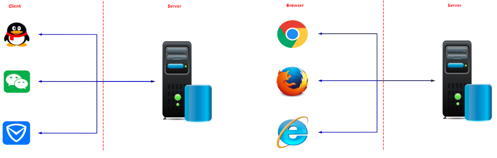
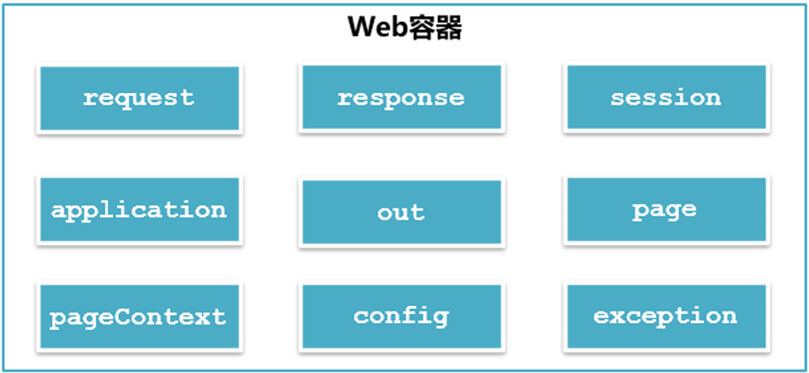
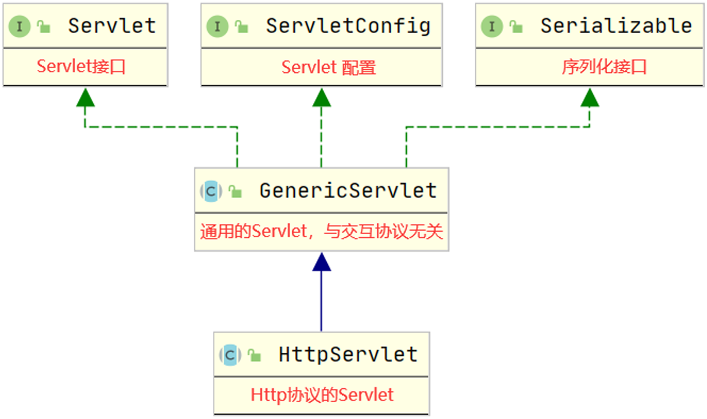
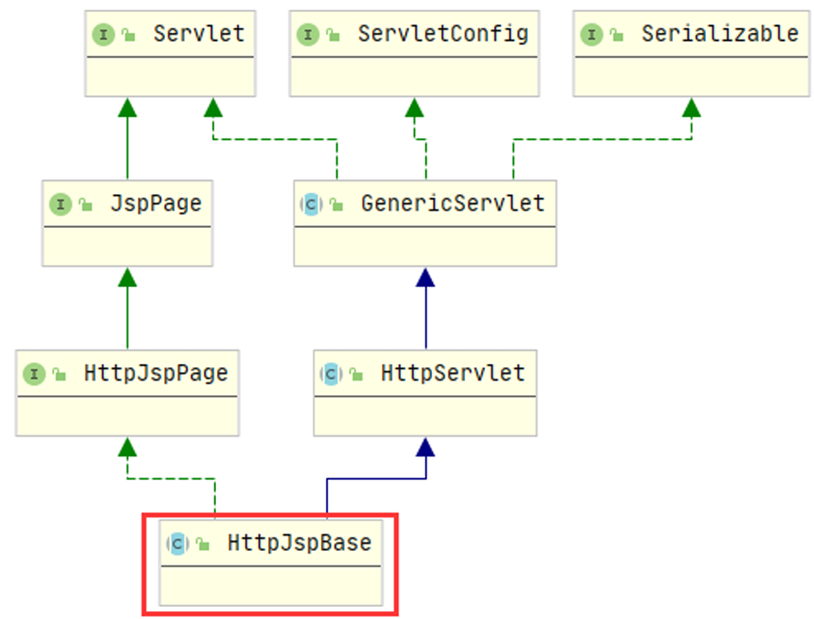
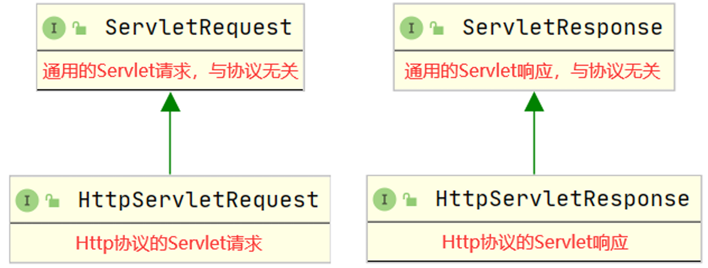
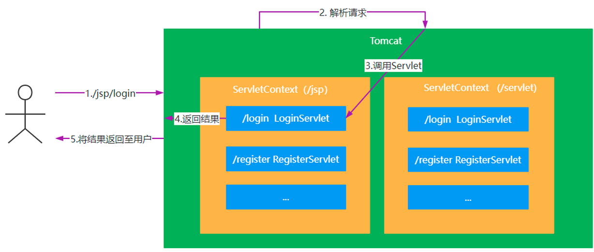
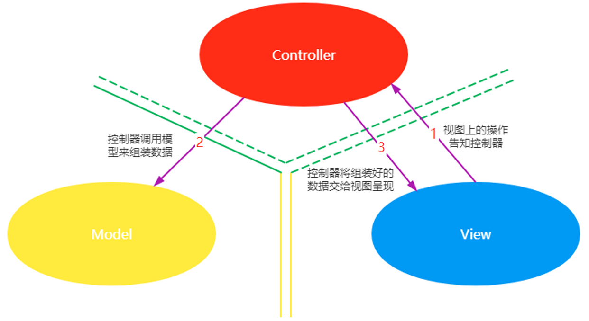
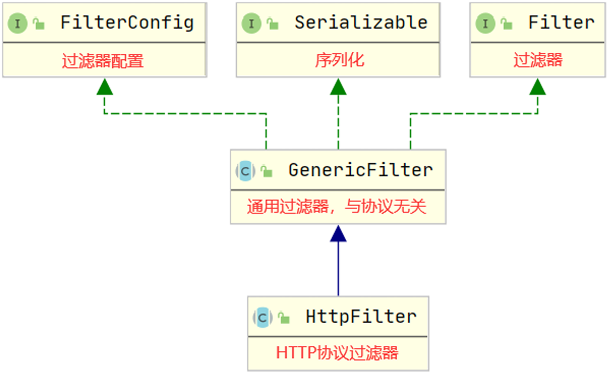
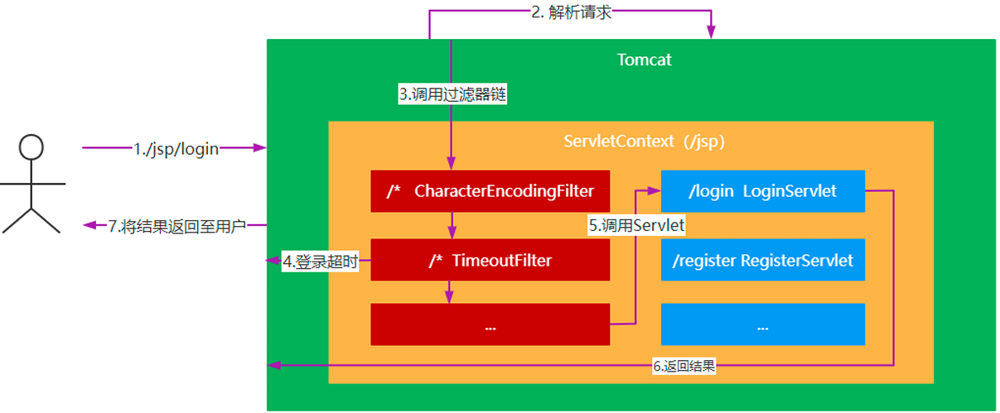

# JavaWeb

[TOC]

## 第一章：HTML

## 第二章：CSS

## 第三章：JS

## 第四章：`JSP`

### 一、`JSP` 入门

#### （1）程序结构

互联网发展到现在出现过两种结构：C/S 结构和 B/S结构。



##### 1. C/S 结构

C/S 是 Client/Server 的简称，C/S结构在技能上非常成熟，它的重要特征就是交互性强、拥有安全的存取形式、网络通信数量低、响应速度快、利于处置大量数据。

**优点：**

- 优秀的处理能力，很多工作能够在客户端处理后再提交给服务器，减少了服务器端的开销，因此，C/S 结构的客户端响应速度快。
- 操作界面漂亮、形式多样，能够足够满足客户自己的个性化要求。
- 安全性能能够非常容易确保，能够对权限实行多层次校验，对信息安全的控制能力非常强。

**缺点：**

- 需要安装客户端程序，分布功能弱。
- 兼容性差。

##### 2. B/S结构

B/S 是 Browser/Server 的简称，就是只安装维护一个服务器，而客户端选用浏览器运行软件。B/S 结构应用程序相对于传统的 C/S 结构应用程序就是一个特别大的进步。

B/S结构的重要特征就是分布性强、维护方便、开发简单并且共享性强、总体拥有费用低。

**优点：**

- 分布性强。只需有网络、浏览器，能够随时随地实行查询、浏览等业务处理。
- 业务扩展简单便利，通过添加网页就可以添加服务器功能。
- 维护简单便利，只须要更改网页，就可以完成全部用户的同步更新。
- 开发简单，共享性强。

**缺点：**

- 个性化特征明显减少，难以完成拥有个性化的功能要求。
- 在跨浏览器上，B/S 结构不尽如人意。
- 在速度与安全性上须要花费超大的设计费用。

#### （2）Web 服务器

##### 1. Web服务器的概念

Web服务器是可以向发出请求的浏览器提供文档的程序，主要提供网上的信息浏览服务。

##### 2. 常见Web服务器

`IIS` (Micro Soft)

**`Tomcat` (Apache)** 

`WebLogic` (Oracle)

`WebSphere` ( IBM )

`Nginx`

……

#### （3）Tomcat 服务器

Tomcat 是 Apache 软件基金会（Apache Software Foundation）的 Jakarta 项目中的一个核心项目，由 Apache、Sun 和其他一些公司及个人共同开发而成。Tomcat 服务器是一个免费的开放源代码的 Web 应用服务器，属于轻量级应用服务器，在中小型系统和并发访问用户不是很多的场合下被普遍使用，是开发和调试 `JSP` 程序的首选。

##### 1. Tomcat 服务器安装

在[Tomcat官网]([Apache Tomcat® - Welcome!](https://tomcat.apache.org/))下载服务器，然后直接解压。

##### 2. Tomcat 目录结构

| 目录     | 说明                                                         |
| -------- | ------------------------------------------------------------ |
| /bin     | 存放各种平台下用于启动和停止 Tomcat 的脚本文件               |
| /conf    | 存放 Tomcat 服务器的各种配置文件                             |
| /lib     | 存放 Tomcat 服务器所需的各种 JAR 文件                        |
| /logs    | 存放 Tomcat 的日志文件                                       |
| /temp    | Tomcat 运行时用于存放临时文件                                |
| /webapps | 当发布 Web 应用时，默认情况下会将 Web 应用的文件存放于此目录 |
| /work    | Tomcat 把由 JSP 生成的 Servlet 放于此目录下                  |

##### 3. 部署第一个应用

在 `webapps` 文件夹下创建一个文件夹 `firstApp`，编写一个 `fist.html`，放入`firstApp` 文件夹下。

```html
<!DOCTYPE html>
 <html>
 	<head>
 		<meta charset="utf-8">
 		<title>第一个应用</title>
 	</head>
 	<body>
 		<h1>This My First App!</h1>
 	</body>
 </html>
```

##### 4. 启动 Tomcat 服务器

进入 `bin` 目录， 然后双击 `startup.bat`，启动 Tomcat 服务器。

##### 5. 访问 Tomcat 服务器

在浏览器地址栏输入网址：http://localhost:8080/firstApp/first.html 进行访问；

这个网址有一个专业的名称，叫做统一资源定位符（URL）。

统一资源定位符包含了以下三部分：

- 协议：比如 `http` ；

- 主机地址：`localhost` , `127.0.0.1` 都是表本机，可以用来代替本机的 IP 地址。

	主机地址包括了主机 IP 地址和端口号，比如 IP 地址 `localhost`，端口号 `8080` ；

- 资源地址 ，比如 `/firstApp/first.html`。

##### 6. 关闭 Tomcat 服务器

进入 `bin` 目录，然后双击 `shutdown.bat`，关闭 Tomcat 服务器。或者直接关闭 Tomcat 服务器窗口。

#### （4）配置 Tomcat 服务器

##### 1. 端口号配置

进入 `conf` 文件夹，找到 `server.xml` 文件，使用文本编辑器打开，找到如下内容：

```xml
<Connector port="8080" protocol="HTTP/1.1"
               connectionTimeout="20000"
               redirectPort="8443"
               maxParameterCount="1000"
               />
```

解释说明：

- `port`：端口号，默认配置为8080，可修改；
- `protocol`：Tomcat 服务器使用的协议，默认配置为 `HTTP` 协议，`HTTP` 协议版本为1.1 ；
- `connectionTimeout`：访问 Tomcat 时，连接的超时时间，默认配置为20000毫秒；
- `redirectPort`：重定向端口，默认配置为8443，主要是针对于访问 Tomcat 服务器上的资源时，如果该资源需要使用 `HTTPS` 访问，此时，Tomcat 会将这个请求重定向到8443端口。

##### 2. 虚拟路径配置

1. 准备资源

	在任一磁盘上（比如 F 盘）创建资源文件夹 `actual`，然后编写一个 `test.html` ，将其放入 `actual` 文件夹中。

	```html
	<!DOCTYPE html>
	 <html>
	 	<head>
	 		<meta charset="utf-8">
	 		<title>虚拟路径</title>
	 	</head>
	 	<body>
	 		<h1>This Is A Virtual Path</h1>
	 	</body>
	 </html>
	```

2. 虚拟路径配置

	进入 `conf` 文件夹，找到 `server.xml` 文件，使用文本编辑器打开，找到如下内容：

	```xml
	<Host name="localhost"  appBase="webapps"
	            unpackWARs="true" autoDeploy="true">
	
	        <!-- SingleSignOn valve, share authentication between web applications
	             Documentation at: /docs/config/valve.html -->
	        <!--
	        <Valve className="org.apache.catalina.authenticator.SingleSignOn" />
	        -->
	
	        <!-- Access log processes all example.
	             Documentation at: /docs/config/valve.html
	             Note: The pattern used is equivalent to using pattern="common" -->
	        <Valve className="org.apache.catalina.valves.AccessLogValve" directory="logs"
	               prefix="localhost_access_log" suffix=".txt"
	               pattern="%h %l %u %t &quot;%r&quot; %s %b" />
	
	</Host>
	```

	在 `<Host><Host>`标签对之间添加如下内容：

	```xml
	<Context path="/virtual" docBase="E:/actual"/>
	```

	启动 Tomcat 服务器。

3. 访问测试

	在浏览器地址栏输入：http://localhost:8080/virtual/test.html 进行访问。

##### 3. `web.xml` 配置

进入 `conf` 文件夹，找到 `web.xml` 文件：

1. 会话超时配置：

	```xml
	<session-config>
	    <!--这里的30单位是分钟-->
	        <session-timeout>30</session-timeout>
	</session-config>
	```

	会话指的是用户访问 Tomcat 服务器的有效时间。比如，当用户登录某网站后，30分钟内，没有进行任何操作，此时，用户与该网站的会话已经超时。如果再进行页面操作，那么服务器将提示用户重新登录。

2. 欢迎页配置：

	```xml
	<welcome-file-list>
	        <welcome-file>index.html</welcome-file>
	        <welcome-file>index.htm</welcome-file>
	        <welcome-file>index.JSP</welcome-file>
	</welcome-file-list>
	```

	所谓的欢迎页就是当用户访问 Tomcat 服务器资源时，没有对任何资源进行定位，此时，Tomcat 将使用配置的欢迎页进行展示。

#### （5）IDEA 创建 Web 工程

#### （6）初识 `JSP` 

##### 1. `JSP` 的概念

`JSP` 是 Java Server Pages 的简称，意为 Java 服务器页面。其支持 Java 代码与 HTML 代码混合使用来完成页面的编写。

##### 2. `JSP` Page 指令

**语法：**

```jsp
<%@ page 属性名="属性值" [属性名="属性值" 属性名="属性值"]%>
```

**常用属性：**

| 属性        | 描述                                 | 默认值                   |
| ----------- | ------------------------------------ | ------------------------ |
| language    | 指定`JSP`页面使用的脚本语言          | java                     |
| import      | 通过该属性来引用脚本语言中使用到的类 | 无                       |
| contentType | 用来指定 `JSP` 页面所采用的编码方式  | text/html; charset=UTF-8 |

##### 3. `JSP` 小脚本

**小脚本代码的定义语法：**

```jsp
<% 
//小脚本代码
%>
```

**小脚本方法定义语法：**

```jsp
<%!
 //小脚本方法
%>
```

**小脚本中的变量引用语法：**

```jsp
<%= 变量名或者表达式 %>
```

<font color="blue">示例：</font>

```jsp
<%--import属性是用来导入java包的--%>
<%@ page import="java.util.Date" %>
<%@ page import="java.text.SimpleDateFormat" %>
<%@ page contentType="text/html; charset=UTF-8" pageEncoding="UTF-8" %>
<!DOCTYPE html>
<html>
    <head>
        <title>第一个JSP程序</title>
    </head>
    <body>
    <h1>欢迎使用JSP</h1>
    <br/>
    <a href="hello-servlet">Hello Servlet</a>
    <%
        //这里就是`JSP`的小脚本语言，可以写Java代码
        Date now = new Date();
        SimpleDateFormat sdf = new SimpleDateFormat("yyyy-MM-dd HH:mm:ss");
        String currentDate = sdf.format(now);
    %>
    <%!
        //这里定义方法
        String date2String(Date date) {
            SimpleDateFormat sdf = new SimpleDateFormat("yyyy-MM-dd HH:mm:ss");
            return sdf.format(date);
        }
    %>
    今天是 <%=currentDate%>，使用方法来展示日期：<%=date2String(now)%>
    <%
        String[] names = {"张三", "李四", "王五"};
    %>
    <%
        for (String name : names) {

    %>
        <div><%=name%></div>
    <%
        }
    %>

    </body>
</html>
```

##### 4. `JSP` 的交互流程

`JSP` 文件在第一次被访问时会被翻译成 `java` 文件，然后被编译为 `class` 文件才能被执行，编译好的 `class` 文件可以被重用。


### 二、`JSP` 数据传递

#### （1）`JSP` 内置对象

`JSP` 内置对象是 Web 容器创建的一组对象，在页面中可以直接使用。`JSP` 常用内置对象入下图所示：



#### （2）内置对象 `out`

`out` 对象可以向 Web 浏览器内输出信息，负责管理对客户端的输出。

`out` 对象的数据类型：`javax.servlet.jsp.JspWriter`

**语法：**

```jsp
<%
 	//在页面上输出Hello JSP
 	out.println("Hello JSP");
 %>
```

<font color="blue">示例：</font>

```jsp
<%@ page contentType="text/html; charset=UTF-8" pageEncoding="UTF-8"%>
<!DOCTYPE html>
<html>
    <head>
        <title>out内置对象</title>
    </head>
    <body>
        <%
            out.print("这是out内置对象输出的文本");
        %>
    </body>
</html>
```

#### （3）内置对象 `request`

##### 1. `request` 对象

`request` 对象可以获取客户端的参数和数据流。

`request` 对象的数据类型 `javax.servlet.jsp.JspWriter`。

**常用方法：**

```java
//根据表单组件名称获取提交数据  
String getParameter(String name);

 //获取表单组件对应多个值时的请求数据
String[] getParameterValues(String name);

//获取当前请求的URL，这个URL包含上下文路径在内
String getRequestUrl();

 //指定请求的编码
void setCharacterEncoding(String charset);

 //返回一个RequestDispatcher对象，该对象的forward()方法用于转发请求  
RequestDispatcher getRequestDispatcher(String  path);

 //获取客户端cookie，这是用户请求发起时获取信息的一种操作，此时请求还未发送至服务器端
Cookie[] getCookies();

 //获取请求中所有参数和参数值的映射  
Map<String,String[]> getParameterMap();

 //获取当前会话
HttpSession getSession();

//获取请求转发的对象
RequestDispatcher getRequestDispatcher("转发的页面");
```

<font color="blue">示例：使用内置对象 request 完成注册信息显示。</font>

`request.jsp`

```jsp
<%@ page contentType="text/html;charset=UTF-8" language="java" %>
<html>
<head>
    <title>request内置对象</title>
</head>
<body>
    <form action="info.jsp" method="get">
        <div>
            <span>用户名</span>
            <input type="text" name="username">
        </div>
        <div>
            <span>密码</span>
            <input type="password" name="password">
        </div>
        <div>
            <span>信息来源</span>
            <input type="checkbox" name="channel" value="报刊">报刊
            <input type="checkbox" name="channel" value="网络">网络
            <input type="checkbox" name="channel" value="朋友推荐">朋友推荐
            <input type="checkbox" name="channel" value="电视">电视
        </div>
        <div>
            <input type="submit" value="提交">
            <input type="reset" value="重置">
        </div>
    </form>
</body>
</html>
```

`info.jsp`

```jsp
<%@ page import="java.util.Arrays" %>
<%@ page import="java.nio.charset.StandardCharsets" %>
<%@ page contentType="text/html;charset=UTF-8" language="java" %>
<%
    //设置请求的编码格式
    request.setCharacterEncoding("UTF-8");
    //从请求中获取参数username的值
    String username = request.getParameter("username");
    String password = request.getParameter("password");
    //因为前端传输的数据是数组，所以要用数组接收
    String[] channels = request.getParameterValues("channel");

    for (String channel : channels) {
        //在ISO_8859_1编码格式下，获取字符串的字节数组
        byte[] bytes = channel.getBytes(StandardCharsets.ISO_8859_1);
        //通过字符串的构造方法来实现字节数组到字符串的转码
        String s = new String(bytes, StandardCharsets.UTF_8);
    }
%>
<div><%=request.getClass().getName()%></div>
<div><%=username%></div>
<div><%=password%></div>
<%--post请求发送的信息如果是中文，那么在页面展示的时候可能是乱码，可以在request对象中设置编码格式，然后再从request对象中获取参数--%>
<%--如果get请求发送的参数信息是中文，那么在页面展示的时候也可能出现乱码，可以使用字符串的转码解决--%>
<div><%=Arrays.toString(channels)%></div>
```

##### 2. `get` 请求与 `post` 请求的区别

- `GET` 请求的参数在 URL 中，而 `POST` 请求的参数在请求体 `body` 中；
- `GET` 请求有数据长度限制，这个长度限制是浏览器或者服务器为了提升处理效率而做出的限制，而 `POST` 请求没有。
- `GET` 请求的安全性低，因为参数在 URL 中，直接暴露了信息，而 `POST` 请求的安全性高，因为 `POST` 请求的参数在请求体 `body` 中，隐藏了信息。

#### （4）内置对象 `response`

`response` 对象可以对客户端的请求做出响应。

`response` 对象的数据类型 `javax.servlet.http.HttpServletResponse`。

**常用方法：**

```java
//添加cookie，这是对用户操作的一种响应
 void addCookie(Cookie c);
 
 //重新定位新的资源，也叫重定向
void sendRedirect(String url);

 //设置响应状态码
void setStatus(int status);

 //获取打印流，主要用于向页面传输数据
PrintWriter getWriter();

 //获取输出流，主要用于图片传输、下载等功能
ServletOutputStream getOutputStream();

 //设置向页面输出的数据的字符集编码
void setCharacterEncoding(String charset);
```

<font color="blue">示例：实现登录页面跳转功能，并在跳转的页面中显示登录信息。</font>

`login.jsp`

```jsp
<%@ page contentType="text/html;charset=UTF-8" language="java" %>
<html>
<head>
    <title>response内置对象</title>
</head>
<body>
    <form action="process.jsp" method="post">
        <div>
            <span>用户名</span>
            <input type="text" name="username">
        </div>
        <div>
            <span>密码</span>
            <input type="password" name="password">
        </div>
        <div>
            <input type="submit" value="登录">
        </div>
    </form>
</body>
</html>
```

`process.jsp`

```jsp
<%@ page contentType="text/html;charset=UTF-8" language="java"%>
<%
    String username = request.getParameter("username");//获取参数username的值
    String password = request.getParameter("password");//获取参数password的值
    if("admin".equals(username) && "123456".equals(password)){
        //页面重定向至主页面
        response.sendRedirect("main.jsp");
    }
%>
```

`main.jsp`

```jsp
<%@ page contentType="text/html;charset=UTF-8" language="java" %>
<%
    String username = request.getParameter("username");//获取参数username的值
    String password = request.getParameter("password");//获取参数password的值
%>
<div>用户名： <%= username %></div>
<div>密码： <%= password %></div>
```

访问 `login.jsp`，然后点击 `登录` 按钮，查看地址栏信息与页面信息。地址栏信息发生了变化，由 `process.jsp` 变成了 `main.jsp`，说明重定向发生在客户端，相当于客户端再发了一次请求，重新定位了新的资源。由于这次请求是新的请求，与之前的登录请求完全独立，因此页面信息中展示全是 `null`。

需要对 `process.jsp` 文件进行修改：

```jsp
<%@ page contentType="text/html;charset=UTF-8" language="java"%>
<%
    String username = request.getParameter("username");//获取参数username的值
    String password = request.getParameter("password");//获取参数password的值
    if("admin".equals(username) && "123456".equals(password)){
        //页面重定向至主页面
//        response.sendRedirect("main.jsp");
        //从请求中获取一个请求转发的对象，上一次请求的信息会被保留，并将请求转发到新的页面
        RequestDispatcher rd = request.getRequestDispatcher("main.jsp");
        //实现请求转发
        rd.forward(request, response);
    }
%>
```

访问 `login.jsp`，然后点击 `登录` 按钮，查看地址栏信息与页面信息。地址栏信息未发生变化，还是 `process.jsp`，而页面进行了跳转，说明转发发生在服务器，由服务器完成。转发后，页面能够展示登录信息，说明转发可以共享请求的参数。

#### （5）内置对象 `session`

##### 1. `session` 对象

`session` 就是浏览器与服务器之间的一次通话。

`HTTP` 协议是一种无状态协议，用户在访问服务器时，服务器无法感知到用户是哪一个用户，也就无法追踪用户的后续操作。为了解决这一问题，服务器端设计了一个类 `HttpSession` 来感知用户，这个类产生的对象就是 `session`。在用户第一次访问服务器时，服务器就会为该用户生成了一个 `session` 对 象，`session` 对象一产生就会生成了一个唯一标识符 `JSESSIONID`，并将这个唯一标识符使用 `Cookie` 存储在浏览器中，用户后续进行的每一个操作都将携带这个唯一标识符，服务器就根据这个唯一标识符追踪用户。`session` 对象产生时就有一个过期时间，主要用于检测用户是否还在进行有效的操作。如果用户具有有效的操作，那么每一次用户的有效操作都将重置该 `session` 的过期时间。这个过期时间就是检测用户登录超时的依据。除此之外，`session` 还可以存储数据。

`session` 对象的数据类型是 `javax.servlet.http.HttpSession`。

**常用方法：**

```java
//以key/value的形式保存对象值
void setAttribute(String key, Object value);

 //通过key获取对象值
Object getAttribute(String key);

 //设置session对象失效
void invalidate();

 // 获取sessionid
 String getId();

 //设定session的非活动时间
void setMaxInactiveInterval(int interval);

 //获取session的有效非活动时间(以秒为单位)
 int getMaxInactiveInterval();

 //从session中删除指定名称(key)所对应的对象
void removeAttribute(String key);
```

<font color="blue">示例：使用 `session` 完成登录成功后页面显示登录信息，要求登录处理使用重定向。</font>

接上文案例：

`process.jsp`

```jsp
<%@ page contentType="text/html;charset=UTF-8" language="java"%>
<%
    String username = request.getParameter("username");//获取参数username的值
    String password = request.getParameter("password");//获取参数password的值
    if("admin".equals(username) && "123456".equals(password)){
        //因为是session是针对用户本人的，因此只有本人才能获取自己存储的信息
        session.setAttribute("username", username);//将username存入session中
        session.setAttribute("password", password);//将password存入session中
        //页面重定向至主页面
//        response.sendRedirect("main.jsp");
        //从请求中获取一个请求转发的对象，上一次请求的信息会被保留，并将请求转发到新的页面
        RequestDispatcher rd = request.getRequestDispatcher("main.jsp");
        //实现请求转发
        rd.forward(request, response);
    }
%>
```

`main.jsp`

```jsp
<%@ page contentType="text/html;charset=UTF-8" language="java" %>
<%
    String username = session.getAttribute("username").toString();//获取session中的username值
    String password = (String) session.getAttribute("password");//获取session中的password值
    String sessionId = session.getId();
%>
<div>response的数据类型：<%=response.getClass().getName()%></div>
<div>session的数据类型：<%=session.getClass().getName()%></div>
<div>sessionId： <%= sessionId %></div>
<div>用户名： <%= username %></div>
<div>密码： <%= password %></div>
```

##### 2. `include` 指令：

语法：

```jsp
 <%@ include file="文件名" %>
```

在开发过程中，开发的页面数量总是很多，如何确保用户的每一次操作都是有效操作呢？所谓的有效操作是指在登录没有超时的情况下进行的操作。

可以编写一个检测登录超时的页面，然后使用 `include` 指令引入至每一个页面中。

**`session` 超时设置：**

1. Tomcat 中的 `web.xml`：

	```xml
	<session-config>
	 	<!-- 单位：分钟 -->
	 	<session-timeout>30</session-timeout>
	</session-config>
	```

2. 工程中的 `web.xml`：

	```xml
	<session-config>
	 	<!-- 单位：分钟 -->
	 	<session-timeout>30</session-timeout>
	</session-config>
	```

3. Java 代码实现：

	```java
	//设置会话超时时间，单位：秒
	session.setMaxInactiveInterval(15 * 60);
	```

#### （6）内置对象 `Application`

`application` 对象可以实现用户数据共享，将信息保存在服务器中，直到服务器关闭。

`application` 对象的数据类型是 `javax.servlet.ServletContext`，意为 `Servlet` 上下文，这个上下文就是一个独立的环境，包含了 `Servlet` 运行的所有环境，因此，这个对象里面存储的数据就是对整个应用生效。

**常用方法：**

```java
// 以key/value的形式保存对象值
void setAttribute(String key,Object value);

 //通过key获取对象值
Object getAttribute(String  key);

 //返回相对路径的绝对路径
String getRealPath(String  path);
```

<font color="blue">示例：统计网站访问次数。</font>

`statistics.jsp`

```jsp
<%@ page contentType="text/html;charset=UTF-8" language="java" %>
<html>
<head>
    <title>application内置对象</title>
</head>
<%
    Integer count = (Integer) application.getAttribute("count");
    if (count == null) {    // 第一次访问网站，count属性不存在
        // 第一次访问网站，设置count属性为1
        count = 1;
    }
    else {
        // 不是第一次访问网站，count属性存在，加1
        count++;
    }
    application.setAttribute("count", count);

%>
<body>
    <div><%=application.getClass().getName()%></div>
    <div>网站访问次数：<%=count%></div>
</body>
</html>
```

#### （7）`Cookie`

`Cookie` 是 Web 服务器保存在客户端的一系列文本信息。`Session` 机制采用的是在服务端保持状态的方案，而 `Cookie` 机制则是在客户端保持状态的方案，`Cookie` 又叫会话跟踪机制，用来弥补 HTTP 无状态协议的不足。

**作用：**

- 弥补HTTP无状态协议的不足；
- 简化登录，比如记住密码、自动登录等。

**常用方法：**

```java
//构造方法
Cookie cookie = new Cookie("名称", "值");

 //设置cooki的有效期，以秒为单位
void setMaxAge(int expiry);

 //在cookie创建后，对cookie进行赋值
void setValue(String value);

 //获取cookie的名称
String getName();

 //获取cookie的值
String getValue();

 //获取cookie的有效时间，以秒为单位
String getMaxAge();
```

<font color="blue">示例：使用 Cookie 完成记住账号和密码功能。</font>

`login.jsp`

```jsp
<%@ page import="java.net.URLDecoder" %>
<%@ page contentType="text/html;charset=UTF-8" language="java" %>
<html>
<head>
    <title>cookie登录</title>
</head>
<%
//    String username = null;
//    String password = null;
//    boolean rememberMe = false;
//    //从请求中获取cookie
//    Cookie[] cookies = request.getCookies();
//    if (cookies!= null) {
//        for (Cookie c : cookies) {
//            String name = c.getName();
//            if ("username".equals(name)) {
//                username = c.getValue();
//            }
//            else if ("password".equals(name)){
//                password = c.getValue();
//            }
//            else if ("rememberMe".equals(name)) {
//                rememberMe = "on".equals(c.getValue());
//            }
//        }
//    }
    // 初始化用户名、密码和记住我的状态
    String username = null;
    String password = null;
    String checked = "";
    // 从请求中获取cookie
    Cookie[] cookies = request.getCookies();
    if (cookies!= null && cookies.length > 0) {
        // 遍历cookie数组
        for (Cookie cookie : cookies) {
            if ("username".equals(cookie.getName())) {
                // "name"是在另一个jsp文件中创建的cookie名
                // 获取名字叫做"name"的cookie的值
                username = URLDecoder.decode(cookie.getValue(), "utf-8");
                // 将“记住我”设置为勾选
                checked = "checked";
            }
            // 将创建的cookie名与获取的cookie数组中已经存在的cookie名进行比较
            if ("password".equals(cookie.getName())) {
                // "password"是在另一个jsp文件中创建的cookie名
                // 获取名字叫做"password"的cookie的值
                password = cookie.getValue();
            }
        }

    }
%>
<body>
<form action="process.jsp" method="post">
<%--    <div>--%>
<%--        <span>用户名</span>--%>
<%--        <input type="text" name="username" value="<%=username%>">--%>
<%--    </div>--%>
<%--    <div>--%>
<%--        <span>密码</span>--%>
<%--        <input type="password" name="password" value="<%=password%>">--%>
<%--    </div>--%>
<%--    <div>--%>
<%--        <input type="checkbox" name="rememberMe" <%=rememberMe ? "checked" : ""%>>记住密码--%>
<%--    </div>--%>
<%--    <div>--%>
<%--        <input type="submit" value="登录">--%>
<%--    </div>--%>
    <!-- 用户登录表单 -->
<div>
        <span>用户名</span>
        <input type="text" name="username" value="<%=username%>">
    </div>
    <div>
        <span>密码</span>
        <input type="password" name="password" value="<%=password%>">
    </div>
    <div>
        <input type="checkbox" name="rememberMe" checked="<%=checked%>">记住密码
    </div>
    <div>
        <input type="submit" name="login" value="登录">
    </div>

</form>
</body>
</html>
```

`process.jsp`

```jsp
<%@ page import="java.net.URLEncoder" %>
<%@ page contentType="text/html;charset=UTF-8" language="java"%>
<%
//    String username = request.getParameter("username");//获取参数username的值
//    String password = request.getParameter("password");//获取参数password的值
//    String rememberMe = request.getParameter("rememberMe");//获取参数remember的值
//    if("admin".equals(username) && "123456".equals(password)){
//        session.setAttribute("username", username);
//        //只有登录成功，且勾选了记住密码才会记住密码
//        System.out.println(rememberMe);
//        if (!"on".equals(rememberMe)) {
//            username = "";
//            password = "";
//            rememberMe = "";
//        }
//        Cookie usernameCookie = new Cookie("username", username);
//        Cookie passwordCookie = new Cookie("password", password);
//        Cookie rememberMeCookie = new Cookie("rememberMe", rememberMe);
//        response.addCookie(usernameCookie);
//        response.addCookie(passwordCookie);
//        response.addCookie(rememberMeCookie);
//        response.sendRedirect("/jsp2_war_exploded/response_session/main.jsp");
//    }
    String username = request.getParameter("username");//获取参数username的值
    String password = request.getParameter("password");//获取参数password的值
    if (username.equals("admin") && password.equals("123456")) {// 如果用户名和密码都正确
        // 新建名为name的Cookie
        Cookie usernameCookie = new Cookie("username",
                URLEncoder.encode(username, "utf-8"));
        // 新建名为password的Cookie
        Cookie passwordCookie = new Cookie("password", password);
        // 获取是否保存Cookie
        String rememberMe = request.getParameter("rememberMe");
        // 判断复选框是否被选中，如果选中则返回on
        if ("on".equals(rememberMe)) {  // 这里让rememberMe作为参数可以防止rememberMe为null值
            // 设置保存Cookie的时间长度，单位为秒
            usernameCookie.setMaxAge(60);
            passwordCookie.setMaxAge(60);
        } else {
            // 设置将不保存Cookie
            usernameCookie.setMaxAge(0);
            passwordCookie.setMaxAge(0);
        }
        // 输出到客户端
        response.addCookie(usernameCookie);
        response.addCookie(passwordCookie);
        // 登录成功后跳转到success.jsp
        request.getRequestDispatcher("success.jsp").forward(request, response);
    } else {// 如果用户名和密码都不正确
        // 保存错误提示数据
        session.setAttribute("error", "用户名或密码不正确");
        // 登录失败后将跳转到error.jsp
        request.getRequestDispatcher("error.jsp").forward(request, response);
    }
%>
```

`error.jsp`

```jsp
<%@ page contentType="text/html;charset=UTF-8" language="java" %>
<html>
<head>
    <title>登录失败</title>
</head>
<body>
    <h1 style="color: red">Error：<%=session.getAttribute("error")%></h1>
</body>
</html>
```

`success.jsp`

```jsp
<%@ page contentType="text/html;charset=UTF-8" language="java" %>
<html>
<head>
    <title>登录成功</title>
</head>
<body>
    <h1>恭喜你，登录成功！</h1>
</body>
</html>
```

### 三、`Servlet` 与 `MVC`

#### （1）`Servlet`

`Servlet` 是在服务器上运行的能够对客户端请求进行处理，并返回处理结果的程序。

##### 1. `Servlet` 的体系结构



##### 2. `Servlet` 接口与 `ServletConfig` 接口

`Servlet` 在第一次接收请求时，由容器（如 Tomcat）创建实例，紧接着就由容器调用该 `Servlet` 的 `init` 方法完成初始化，然后由容器调用该 `Servlet` 的  `service` 方法进行请求处理，请求处理完成后，`Servlet` 并不会消亡， 而是跟随容器共存亡，在容器关闭之前，由容器调用 `Servlet` 的  `destroy` 方法进行销毁。

**`Servlet` 接口：**

```java
//Servlet对象的初始化，Servlet 对象初始化后才能处理请求，由 Servlet 容器调用
public void init(ServletConfig config) throws ServletException;

 //获取Servlet配置信息
public ServletConfig getServletConfig();

 //处理客户端的请求，由 Servlet 容器调用
public void service(ServletRequest req, ServletResponse res) throws ServletException, IOException;
 
 //返回有关 Servlet 的信息，比如作者、版本和版权
public String getServletInfo();

 //销毁Servlet，由 Servlet 容器调用
public void destroy();
```

**`ServletConfig` 接口：**

```java
//获取Servlet的实例名称
public String getServletName();

 //返回正在执行的Servlet所在的上下文对象
public ServletContext getServletContext();

 //获取Servlet中给定名称的初始化参数
public String getInitParameter(String name);

 //获取Servlet中所有的初始化参数
public Enumeration<String> getInitParameterNames();
```

<font color="blue">示例：了解一个 `Servlet` 的生命周期。</font>

- 编写 `Srevlet`：

	```java
	package com.ssh.jsp.servlet;
	
	import jakarta.servlet.*;
	
	import java.io.IOException;
	import java.util.Enumeration;
	
	/**
	 * @author 申书航
	 * @version 1.0
	 */
	public class FirstServlet implements Servlet {
	
	    private ServletConfig servletConfig;
	
	    //Servlet的实例在该Servlet处理请求的时候才会被创建，创建后会立刻调用init方法进行初始化
	    public FirstServlet() {
	        System.out.println("Servlet已实例化");
	    }
	
	    //Servlet的初始化方法，只有初始化的Servlet才能处理请求服务
	    //init方法在该Servlet第一次处理请求时才被调用
	    @Override
	    public void init(ServletConfig servletConfig) throws ServletException {
	        this.servletConfig = servletConfig;
	        //获取Servlet配置的所有参数名称
	        Enumeration<String> initParameterNames = servletConfig.getInitParameterNames();
	        while (initParameterNames.hasMoreElements()) {
	            //获取下一个参数名称
	            String parameterName = initParameterNames.nextElement();
	            //获取给定参数名称的参数值
	            String parameterValue = servletConfig.getInitParameter(parameterName);
	            System.out.println(parameterName + " => " + parameterValue);
	        }
	        System.out.println("初始化完成");
	    }
	
	    //获取Servlet的配置信息
	    @Override
	    public ServletConfig getServletConfig() {
	        return servletConfig;
	    }
	
	    //处理请求的方法
	    @Override
	    public void service(ServletRequest servletRequest, ServletResponse servletResponse) throws ServletException, IOException {
	        System.out.println("Servlet正在处理请求");
	    }
	
	    //获取Servlet的描述信息
	    @Override
	    public String getServletInfo() {
	        return "";
	    }
	
	    //销毁Servlet的方法，不再提供服务
	    //当服务器关闭或Servlet被卸载时，该方法才会被调用
	    @Override
	    public void destroy() {
	        System.out.println("Servlet已销毁");
	    }
	}
	```

- 配置 `web.xml`：

	```xml
	<?xml version="1.0" encoding="UTF-8"?>
	<web-app xmlns="https://jakarta.ee/xml/ns/jakartaee"
	         xmlns:xsi="http://www.w3.org/2001/XMLSchema-instance"
	         xsi:schemaLocation="https://jakarta.ee/xml/ns/jakartaee https://jakarta.ee/xml/ns/jakartaee/web-app_6_0.xsd"
	         version="6.0">
	
	<!--    Servlet配置-->
	    <servlet>
	<!--        给Servlet取名字-->
	        <servlet-name>firstServlet</servlet-name>
	<!--        Servlet类型配置-->
	        <servlet-class>com.ssh.jsp.servlet.FirstServlet</servlet-class>
	        <init-param>
	<!--            初始化参数名称-->
	            <param-name>charactorEncoding</param-name>
	<!--            初始化参数值-->
	            <param-value>UTF-8</param-value>
	        </init-param>
	        <init-param>
	            <param-name>secondParam</param-name>
	            <param-value>2</param-value>
	        </init-param>
	<!--        在服务器启动后就要加载该Servlet，然后创建该Servlet实例，然后调用init()方法完成初始化-->
	        <load-on-startup>1</load-on-startup>
	    </servlet>
	
	    <!--        Servlet请求匹配配置-->
	    <servlet-mapping>
	        <servlet-name>firstServlet</servlet-name>
	<!--        Servlet请求处理的URL-->
	        <url-pattern>/first</url-pattern>
	    </servlet-mapping>
	</web-app>
	```

##### 3. `JSP` 的本质



`JSP` 的本质就是 `Servlet`，只是 `JSP` 注重的是页面内容的展示，而 `Servlet` 注重的是业务逻辑的处理。

##### 4. 请求处理与响应的体系结构



##### 5. 请求接口 `ServletRequest`

**常用方法：**

```java
//从请求中获取给定属性名对应的属性值
Object getAttribute(String attributeName);

 //将给定的属性值以给定的属性名存储在请求中
void setAttribute(String attributeName, Object attributeVaue);

 //从请求中将给定的属性名移除
void removeAttribute(String attributeName);

 //获取请求中存储的所有属性名
Enumeration<String> getAttributeNames();

 //从请求中获取给定参数名对应的参数值（参数值是单个数据）
String getParameter(String parameterName);

 //从请求中获取给定参数名对应的参数值（参数值是多个数据）
String[] getParameterValues(String parameterName);

 //从请求中获取所有的参数名
Enumeration<String> getParameterNames();

 //从请求中获取所有的参数名和参数值形成的映射
Map<String, String[]> getParameterMap();

 //从请求中获取字符集编码
String getCharacterEncoding();

 //设置请求的字符集编码
void setCharacterEncoding(String charset) throws UnsupportedEncodingException;

//从请求中获取字符流，该字符流只能读取请求体中的数据信息，与下面的 getInputStream 方法只能二选一
BufferedReader getReader() throws IOException;

 //从请求中获取字节流，该字节流只能读取请求体中的数据信息
ServletInputStream getInputStream() throws IOException;

 //从请求中获取当前Servlet所在的上下文对象
ServletContext getServletContext();

 //从请求中获取请求转发的对象
RequestDispatcher getRequestDispatcher(String path);
```

<font color="blue">示例：</font>

- 编写 `Srevlet`：

	```java
	package com.ssh.jsp.servlet;
	
	import jakarta.servlet.*;
	import org.apache.jasper.runtime.HttpJspBase;
	
	import java.io.BufferedReader;
	import java.io.IOException;
	import java.util.Arrays;
	import java.util.Enumeration;
	import java.util.Map;
	
	/**
	 * @author 申书航
	 * @version 1.0
	 */
	public class FirstServlet implements Servlet {
	
	    private ServletConfig servletConfig;
	
	    //Servlet的实例在该Servlet处理请求的时候才会被创建，创建后会立刻调用init方法进行初始化
	    public FirstServlet() {
	        System.out.println("Servlet已实例化");
	    }
	
	    //Servlet的初始化方法，只有初始化的Servlet才能处理请求服务
	    //init方法在该Servlet第一次处理请求时才被调用
	    @Override
	    public void init(ServletConfig servletConfig) throws ServletException {
	        this.servletConfig = servletConfig;
	        //获取Servlet配置的所有参数名称
	        Enumeration<String> initParameterNames = servletConfig.getInitParameterNames();
	        while (initParameterNames.hasMoreElements()) {
	            //获取下一个参数名称
	            String parameterName = initParameterNames.nextElement();
	            //获取给定参数名称的参数值
	            String parameterValue = servletConfig.getInitParameter(parameterName);
	            System.out.println(parameterName + " => " + parameterValue);
	        }
	        System.out.println("初始化完成");
	    }
	
	    //获取Servlet的配置信息
	    @Override
	    public ServletConfig getServletConfig() {
	        return servletConfig;
	    }
	
	    //处理请求的方法
	    @Override
	    public void service(ServletRequest request, ServletResponse response) throws ServletException, IOException {
	        System.out.println("Servlet正在处理请求");
	        String characterEncoding = request.getCharacterEncoding();
	        System.out.println("请求的字符编码：" + characterEncoding);
	        //设置字符集编码
	        request.setCharacterEncoding("UTF-8");
	        characterEncoding = request.getCharacterEncoding();
	        System.out.println(characterEncoding);
	
	//        System.out.println("开始读取请求体的数据");
	//        BufferedReader reader = request.getReader();
	//        String line;
	//        while ((line = reader.readLine())!= null) {
	//            System.out.println(line);
	//        }
	//        System.out.println("==================================");
	        //获取request请求的所有属性名称
	        System.out.println("开始读取请求属性");
	        Enumeration<String> attributeNames = request.getAttributeNames();
	        while (attributeNames.hasMoreElements()) {
	            String attributeName = attributeNames.nextElement();
	            Object attribute = request.getAttribute(attributeName);
	            System.out.println(attributeName + " => " + attribute);
	        }
	        System.out.println("=================================");
	        //获取request请求的所有参数名称
	        System.out.println("开始读取请求参数");
	        Enumeration<String> parameterNames = request.getParameterNames();
	        while (parameterNames.hasMoreElements()) {
	            String parameterName = parameterNames.nextElement();
	            Object parameter = request.getParameter(parameterName);
	            System.out.println(parameterName + " => " + parameter);
	        }
	        System.out.println("==================================");
	
	        System.out.println("开始读取请求体的数据");
	        BufferedReader reader = request.getReader();
	        String line;
	        while ((line = reader.readLine())!= null) {
	            System.out.println(line);
	        }
	        System.out.println("===================================");
	        Map<String, String[]> parameterMap = request.getParameterMap();
	        parameterMap.forEach((key, values) ->
	                System.out.println(key + " => " + Arrays.toString(values)));
	    }
	
	    //获取Servlet的描述信息
	    @Override
	    public String getServletInfo() {
	        return "";
	    }
	
	    //销毁Servlet的方法，不再提供服务
	    //当服务器关闭或Servlet被卸载时，该方法才会被调用
	    @Override
	    public void destroy() {
	        System.out.println("Servlet已销毁");
	    }
	}
	```

- 配置 `web.xml`：

	```xml
	<?xml version="1.0" encoding="UTF-8"?>
	<web-app xmlns="https://jakarta.ee/xml/ns/jakartaee"
	         xmlns:xsi="http://www.w3.org/2001/XMLSchema-instance"
	         xsi:schemaLocation="https://jakarta.ee/xml/ns/jakartaee https://jakarta.ee/xml/ns/jakartaee/web-app_6_0.xsd"
	         version="6.0">
	
	<!--    Servlet配置-->
	    <servlet>
	<!--        给Servlet取名字-->
	        <servlet-name>firstServlet</servlet-name>
	<!--        Servlet类型配置-->
	        <servlet-class>com.ssh.jsp.servlet.FirstServlet</servlet-class>
	        <init-param>
	<!--            初始化参数名称-->
	            <param-name>charactorEncoding</param-name>
	<!--            初始化参数值-->
	            <param-value>UTF-8</param-value>
	        </init-param>
	        <init-param>
	            <param-name>secondParam</param-name>
	            <param-value>2</param-value>
	        </init-param>
	<!--        在服务器启动后就要加载该Servlet，然后创建该Servlet实例，然后调用init()方法完成初始化-->
	        <load-on-startup>1</load-on-startup>
	    </servlet>
	
	    <!--        Servlet请求匹配配置-->
	    <servlet-mapping>
	        <servlet-name>firstServlet</servlet-name>
	<!--        Servlet请求处理的URL-->
	        <url-pattern>/first</url-pattern>
	    </servlet-mapping>
	</web-app>
	```

- 编写 `index.jsp`：

	```jsp
	<%@ page contentType="text/html; charset=UTF-8" pageEncoding="UTF-8" %>
	<!DOCTYPE html>
	<html>
	<head>
	    <title>欢迎</title>
	</head>
	<body>
	    <form action="first" method="post">
	        <div>
	            <input type="text" name="username">
	        </div>
	        <div>
	            <input type="password" name="password">
	        </div>
	        <div>
	            <input type="submit" value="登录">
	        </div>
	    </form>
	</body>
	</html>
	```

- 在本案例中，使用 `GET` 方式发送的请求，只能通过 `getParameter()` 方法获取；使用 `POST` 方式发送的请求，只能使用流来获取。这是因为使用 `GET` 方式发送的请求，参数在 `URL` 地址中，解析这些参数的时候将其存放在一个 `Map` 集合中，因此可以直接获取。而 `POST` 方式发送的请求，参数在请求体中，这部分内容只能通过流来读取，然后再进行处理。

##### 6. 响应接口 `ServletResponse`

**常用方法：**

```java
//获取响应的字符集编码
String getCharacterEncoding();

 //设置响应的字符集编码
void setCharacterEncoding(String charset);

 //获取响应的内容类型
String getContentType();

 //设置响应的内容类型
void setContentType(String contentType);

 //获取输出流，主要用于下载文件
ServletOutputStream getOutputStream() throws IOException;

 //获取打印流，主要用于向页面传输信息
PrintWriter getWriter() throws IOException;
```

<font color="blue">示例：</font>

接上述案例：

```java
//处理请求的方法
    @Override
    public void service(ServletRequest request, ServletResponse response) throws ServletException, IOException {
        System.out.println("Servlet正在处理请求");
        String characterEncoding = request.getCharacterEncoding();
        System.out.println("请求的字符编码：" + characterEncoding);
        //设置字符集编码
        request.setCharacterEncoding("UTF-8");
        characterEncoding = request.getCharacterEncoding();
        System.out.println(characterEncoding);

//        System.out.println("开始读取请求体的数据");
//        BufferedReader reader = request.getReader();
//        String line;
//        while ((line = reader.readLine())!= null) {
//            System.out.println(line);
//        }
//        System.out.println("==================================");
        //获取request请求的所有属性名称
        System.out.println("开始读取请求属性");
        Enumeration<String> attributeNames = request.getAttributeNames();
        while (attributeNames.hasMoreElements()) {
            String attributeName = attributeNames.nextElement();
            Object attribute = request.getAttribute(attributeName);
            System.out.println(attributeName + " => " + attribute);
        }
        System.out.println("=================================");
        //获取request请求的所有参数名称
        System.out.println("开始读取请求参数");
        Enumeration<String> parameterNames = request.getParameterNames();
        while (parameterNames.hasMoreElements()) {
            String parameterName = parameterNames.nextElement();
            Object parameter = request.getParameter(parameterName);
            System.out.println(parameterName + " => " + parameter);
        }
        System.out.println("==================================");

        System.out.println("开始读取请求体的数据");
        BufferedReader reader = request.getReader();
        String line;
        while ((line = reader.readLine())!= null) {
            System.out.println(line);
        }
        System.out.println("===================================");
        Map<String, String[]> parameterMap = request.getParameterMap();
        parameterMap.forEach((key, values) ->
                System.out.println(key + " => " + Arrays.toString(values)));

        System.out.println();
        System.out.println();
        System.out.println("===========================================");
        System.out.println("响应的字符集编码：" + response.getCharacterEncoding());
        response.setCharacterEncoding("UTF-8");
        System.out.println("响应的字符集编码：" + response.getCharacterEncoding());
        System.out.println("响应的内容类型：" + response.getContentType());
        response.setContentType("text/html;charset=utf-8");
        System.out.println("响应的内容类型：" + response.getContentType());
        PrintWriter writer = response.getWriter();
        writer.print("登录请求已处理");    //向页面输出内容的输出流
        writer.flush();
        writer.close();
    }
```

##### 7. `HTTP` 请求与响应

**`HttpServletRequest` 接口常用方法：**

```java
//从请求中获取Cookie信息
Cookie[] getCookies();

 //从请求中获取给定请求头名称对应的属性值
String getHeader(String headerName);

 //从请求中获取所有的请求头名称
Enumeration<String> getHeaderNames();

 //获取请求的方式：GET、POST、PUT、DELETE等
String getMethod();

 //从请求中获取上下文路径
String getContextPath();

 //从请求中获取session
 HttpSession getSession();
 
 //获取请求地址
String getRequestURI();
```

**`HttpServletResponse` 接口常用方法：**

```java
//添加客户端存储的Cookie信息
void addCookie(Cookie cookie);

 //返回错误状态及错误信息
void sendError(int status, String errorMsg) throws IOException;

 //返回错误状态
void sendError(int status) throws IOException;

 //重定向至新的资源
void sendRedirect(String redirectURL) throws IOException;

 //设置响应头信息
void setHeader(String headerName, String headerValue);

//添加响应头信息
void addHeader(String headerName, String headerValue);

 //设置响应状态
void setStatus(int status);
```

**`HttpServlet` 常用方法（支持 `HTTP` 协议的 `Servlet`）：**

```java
//对父类抽象方法的实现，该方法是对HTTP协议的交互信息的实现，调用的是下面的 service 方法
void service(ServletRequest req,ServletResponse res);

//HTTP协议的交互信息的实现，该方法主要针对不同的请求方式进行处理。GET请求会调用 doGet 方法处理，POST请求会调用 doPost 处理， PUT请求会调用 doPut 方法处理， DELETE请求会调用 doDelete 方法处理 
void service(HttpServletRequest  req, HttpServletResponseres);

 //GET请求处理
void doGet(HttpServletRequestreq,HttpServletResponse res);

 //POST请求处理
void doPost(HttpServletRequestreq,HttpServletResponse res);

 //PUT请求处理
void doPut(HttpServletRequestreq,HttpServletResponse res);

 //DELETE请求处理
void doDelete(HttpServletRequestreq,HttpServletResponse res);
```

<font color="blue">示例：</font>

- 编写 `Servlet`：

	```java
	package com.ssh.jsp.servlet;
	
	import jakarta.servlet.ServletException;
	import jakarta.servlet.http.HttpServlet;
	import jakarta.servlet.http.HttpServletRequest;
	import jakarta.servlet.http.HttpServletResponse;
	
	import java.io.IOException;
	import java.io.PrintWriter;
	import java.util.Enumeration;
	
	/**
	 * @author 申书航
	 * @version 1.0
	 */
	public class SecondServlet extends HttpServlet {
	
	    @Override
	    protected void service(HttpServletRequest req, HttpServletResponse resp) throws ServletException, IOException {
	        System.out.println("读取请求头部信息");
	        Enumeration<String> headerNames = req.getHeaderNames();
	        while (headerNames.hasMoreElements()) {
	            String headerName = headerNames.nextElement();
	            String headerValue = req.getHeader(headerName);
	            System.out.println(headerName + " => " + headerValue);
	        }
	        System.out.println("=============================");
	        String contextPath = req.getContextPath();  // 获取上下文路径
	        System.out.println("上下文路径： " + contextPath);
	        String requestURI = req.getRequestURI();
	        requestURI = requestURI.replace(contextPath, "");
	        System.out.println("当前请求的URI: " + requestURI);
	        System.out.println();
	
	        System.out.println("开始做出响应");
	        resp.setCharacterEncoding("UTF-8");
	        resp.setContentType("text/html;charset=UTF-8");
	        PrintWriter writer = resp.getWriter();
	        writer.println("已处理请求");
	        writer.flush();
	        writer.close();
	    }
	}
	```

- 添加 `web.xml` 配置：

	```xml
	<servlet>
	    <servlet-name>secondServlet</servlet-name>
	    <servlet-class>com.ssh.jsp.servlet.SecondServlet</servlet-class>
	</servlet>
	
	<servlet-mapping>
	    <servlet-name>secondServlet</servlet-name>
	    <url-pattern>/second</url-pattern>
	</servlet-mapping>
	```

- 编写 `second.jsp`：

	```jsp
	<%@ page contentType="text/html; charset=UTF-8" pageEncoding="UTF-8" %>
	<!DOCTYPE html>
	<html>
	<head>
	    <title>欢迎</title>
	</head>
	<body>
	    <form action="second" method="post">
	        <div>
	            <input type="text" name="username">
	        </div>
	        <div>
	            <input type="text" name="sex">
	        </div>
	        <div>
	            <input type="submit" value="测试">
	        </div>
	    </form>
	</body>
	</html>
	```

##### 8. `Servlet` 的交互流程



##### 9. `ServletContext`

**常用方法：**

```java
//获取上下问参数
String getContextPath();

 //获取给定相对路径对应的绝对路径
String getRealPath(String path);

 //获取上下文初始化参数中给定参数名对应的参数值
String getInitParameter(String parameterName);

 //获取上下文初始化参数中所有的参数名
Enumeration<String> getInitParameterNames();

 //获取上下文存储的数据中给定属性名对应的属性值
Object getAttribute(String attributeName);

 //获取上下文存储的数据中所有的属性名
Enumeration<String> getAttributeNames();

 //将给定的属性值使用给定的属性名存储在上下文中
void setAttribute(String attributeName, Object attributeValue);

 //从上下文存储的数据中将给定的属性名移出
void removeAttribute(String attributeName);
```

<font color="blue">示例：</font>

接上述案例：

- `Servlet` 文件添加：

	```java
	@Override
	public void init(ServletConfig config) throws ServletException {
	    ServletContext servletContext = config.getServletContext();
	    Enumeration<String> initParameterNames = servletContext.getInitParameterNames();
	    while (initParameterNames.hasMoreElements()) {
	        String initParameterName = initParameterNames.nextElement();
	        String initParameterValue = servletContext.getInitParameter(initParameterName);
	        System.out.println(initParameterName + " => " + initParameterValue);
	    }
	    System.out.println("上下文路径：" + servletContext.getContextPath());
	}
	```

- 配置 `web.xml`：

	```xml
	<context-param>
	    <param-name>name</param-name>
	    <param-value>申书航</param-value>
	</context-param>
	```

#### （2）`MVC`

##### 1. `MVC` 的概念

模型-视图-控制器（MVC 模式）是一种非常经典的软件架构模式，在 UI 框架和 UI 设计思路中扮演着非常重要的角色。从设计模式的角度来看，`MVC` 模式是一种复合模式，它将多个设计模式在一种解决方案中结合起来，用来解决许多设计问题。`MVC` 模式把用户界面交互分拆到不同的三种角色中，使应用程序被分成三个核心部件：Model（模型）、View（视图）、Control（控制器）。



- 模型：模型持有所有的数据、状态和程序逻辑。模型独立于视图和控制器。
- 视图：用来呈现模型。视图通常直接从模型中取得它需要显示的状态与数据。对于相同的信息可以有多个不同的显示形式或视图。
- 控制器：位于视图和模型中间，负责接受用户的输入，将输入进行解析并反馈给模型。

`MVC` 模式将它们分离以提高系统的灵活性和复用性，不使用 `MVC` 模式，用户界面设计往往将这些对象混在一起。`MVC` 模式实现了模型和视图的分离，使得其具有以下优点：

- 一个模型提供不同的多个视图表现形式，也能够为一个模型创建新的视图而无须重写模型。一旦模型的数据发生变化，模型将通知有关的视图，每个视图相应地刷新自己。
- 模型可复用。因为模型是独立于视图的，所以可以把一个模型独立地移植到新的平台工作。
- 提高开发效率。在开发界面显示部分时，仅仅需要考虑的是如何布局一个好的用户界面；开发模型时，仅仅要考虑的是业务逻辑和数据维护，这样能使开发者专注于某一方面的开发，提高开发效率。

##### 2. `JSP` 中的 `MVC`

在 `JSP` 中 `Servlet` 扮演的是控制器，`JSP` 页面扮演的是视图，`Java Bean` 扮演的是模型。

<font color="blue">示例：将用户信息呈现在页面上。</font>

- 编写 `jsp`：

	```jsp
	<%@ page contentType="text/html;charset=UTF-8" language="java" %>
	<html>
	<head>
	    <title>显示用户信息</title>
	</head>
	<body>
	<%--    超链接默认发送请求的方式为GET--%>
	    <a href="showUserInfo">显示用户信息</a>
	</body>
	</html>
	```

- `User` 类：

	```java
	package com.ssh.jsp.mvc;
	
	import lombok.AllArgsConstructor;
	import lombok.Data;
	
	/**
	 * @author 申书航
	 * @version 1.0
	 */
	@Data
	@AllArgsConstructor
	public class User {
	
	    private String name;
	
	    private int age;
	
	    private String sex;
	}
	```

- 编写 `Servlet`：

	```java
	package com.ssh.jsp.mvc;
	
	import jakarta.servlet.ServletException;
	import jakarta.servlet.annotation.WebServlet;
	import jakarta.servlet.http.HttpServlet;
	import jakarta.servlet.http.HttpServletRequest;
	import jakarta.servlet.http.HttpServletResponse;
	
	import java.io.IOException;
	import java.io.PrintWriter;
	
	/**
	 * @author 申书航
	 * @version 1.0
	 */
	//表示标识的类是一个Servlet，不需要再在web.xml中对该Servlet进行配置。
	@WebServlet("/showUserInfo")
	public class UserServlet extends HttpServlet {
	
	    @Override
	    protected void doGet(HttpServletRequest req, HttpServletResponse resp) throws ServletException, IOException {
	        //这里只是一个简单的数据模型，实际开发中，数据的获取会由业务逻辑层处理业务时从DAO层获取数据，然后组装成模型对象。
	        User user = new User("张三", 20, "男");
	        resp.setCharacterEncoding("UTF-8");
	        resp.setContentType("text/html;charset=UTF-8");
	        PrintWriter writer = resp.getWriter();
	        writer.println(user.toString());
	        writer.flush();
	        writer.close();
	    }
	}
	```

#### （3）过滤器

##### 1. 过滤器的概念与体系结构

过滤器是一个服务器端的组件，可以拦截客户端的请求和响应信息并对这些信息进行过滤。



##### 2. `Filter` 与 `FilterConfig` 接口

**`Filter` 接口的常用方法：**

```java
//过滤器初始化
default void init(FilterConfig filterConfig) throws ServletException;

 //过滤操作，与协议无关
void doFilter(ServletRequest req, ServletResponse resp, FilterChain chain) throws IOException, ServletException;

 //过滤器销毁
default void destroy();
```

**`FilterConfig` 接口的常用方法：**

```java
//获取过滤器实例的名称
String getFilterName();

 //获取Servlet上下文
ServletContext getServletContext();

 //从过滤器初始化配置中获取给定属性名对应的属性值
String getInitParameter(String parameterName);

 //获取过滤器初始化配置中所有的属性名
Enumeration<String> getInitParameterNames();
```

<font color="blue">示例：使用过滤器完成中文乱码处理。</font>

```java
package com.ssh.jsp.filter;

import jakarta.servlet.*;
import jakarta.servlet.annotation.WebFilter;
import jakarta.servlet.annotation.WebInitParam;

import java.io.IOException;

/**
 * @author 申书航
 * @version 1.0
 */
//处理所有请求的过滤器，初始化参数数组中encoding表示字符编码
@WebFilter(urlPatterns = "/*", initParams = {
        @WebInitParam(name = "encoding", value = "UTF-8")
})
public class CharacterEncodingFilter implements Filter {

    private String encoding;

    public CharacterEncodingFilter() {
        System.out.println("过滤器实例化");
    }

    @Override
    public void init(FilterConfig filterConfig) throws ServletException {
        System.out.println("过滤器初始化");
        encoding = filterConfig.getInitParameter("encoding");

    }

    @Override
    public void doFilter(ServletRequest request,
                         ServletResponse response,
                         FilterChain chain)
            throws IOException, ServletException {
        System.out.println("过滤器开始工作");
        request.setCharacterEncoding(encoding);
        response.setCharacterEncoding(encoding);
        //多个过滤器会形成一个过滤器链，当过滤器处理完请求后，必须调用chain.doFilter()方法，
        //以便让请求继续向下传递到下一个过滤器，所有的过滤器做完处理后，请求才会送达Servlet。
        //如果过滤器请求不需要Servlet处理，则可以不调用chain.doFilter()方法，直接使用response对象做出响应。
        chain.doFilter(request, response);
    }

    @Override
    public void destroy() {
        System.out.println("过滤器销毁");
    }
}
```

##### 3. `HttpFilter` 抽象类

**常用方法：**

```java
//重写无协议过滤器操作，调用下面支持HTTP协议请求过滤操作的方法
public void doFilter(ServletRequest request, ServletResponse response, 
FilterChain chain) throws IOException, ServletException;

 //HTTP协议请求过滤操作的方法
protected void doFilter(HttpServletRequest request, HttpServletResponse 
response, FilterChain chain) throws IOException, ServletException;
```

<font color="blue">示例：使用过滤器完成登录超时处理。</font>

- 在 `SecondServlet` 开始做出响应前加入：

	```java
	//模拟登录成功，将用户信息存入session，如果session超时，说明用户未操作，造成超时。
	//只需要判断session是否有用户名即可，如果没有，则说明session超时，新的session中不可能存在用户名
	HttpSession session = req.getSession();
	session.setAttribute("user", "admin");
	```

- 编写 `TimeoutFilter`：

	```java
	package com.ssh.jsp.filter;
	
	import jakarta.servlet.FilterChain;
	import jakarta.servlet.ServletException;
	import jakarta.servlet.annotation.WebFilter;
	import jakarta.servlet.http.HttpFilter;
	import jakarta.servlet.http.HttpServletRequest;
	import jakarta.servlet.http.HttpServletResponse;
	import jakarta.servlet.http.HttpSession;
	
	import java.io.IOException;
	
	/**
	 * @author 申书航
	 * @version 1.0
	 */
	//如果这里配置为"/*"，则所有请求都会被该过滤器拦截，登录也会被拦截，就会造成还未登录就已经超时。
	//所有要对不需要过滤的请求放行
	@WebFilter("/*")
	public class TimeoutFilter extends HttpFilter {
	
	    @Override
	    protected void doFilter(HttpServletRequest request, HttpServletResponse response, FilterChain chain) throws IOException, ServletException {
	        String requestURI = request.getRequestURI();
	        String contextPath = request.getContextPath();
	        requestURI = requestURI.replace(contextPath, "");
	        if ("/".equals(requestURI)
	                || "showUserInfo".equals(requestURI)
	                || requestURI.startsWith("/second")) { //首页请求，直接让下一个过滤器处理请求
	            chain.doFilter(request, response);
	        }
	        else {
	            HttpSession session = request.getSession();
	            Object user = session.getAttribute("user");
	            if (user == null) { //用户超时，直接跳转到登录页面
	                response.sendRedirect("second.jsp");
	            }
	            else {  //用户未超时，让下一个过滤器处理请求
	                chain.doFilter(request, response);
	            }
	        }
	    }
	}
	```

##### 4.  `Filter` 的交互流程



### 四、`EL` 表达式和 `JSTL` 标签

#### （1）`EL` 表达式

##### 1. `EL` 表达式的概念与作用

**概念：**

`EL` 全称为 `Expression Language`（表达式语言）。

**作用：**

在 `JSP` 页面中编写小脚本，会存在以下不足：

- 代码结构混乱；
- 脚本与 `HTML` 混合，容易出错；
- 代码不易于维护；
- 获取 `Java Bean` 属性必须要实例化及强制类型转化；

为了解决这些不足，`JSP` 提供了 `EL` 表达式来简化编码，可以使用 `EL` 表达式来替换 `JSP` 页面中的小脚本， 使得页面和业务逻辑处理相分离，同时还能实现数据类型的自动转型。

##### 2. `EL` 获取变量值

**语法：**

```jsp
${变量名}
```

不论变量是存储在 `request` 中，还是存储在 `session` 中，都可以使用 `EL` 表达式进行取值。

如果 `reqeust` 和 `session` 中都存有相同属性的变量，那么 `EL` 表达式会从 `reqeust` 中进行取值。

<font color="blue">示例：</font>

- `Servlet`：

	```java
	package com.ssh.jsp4.servlet;
	
	import jakarta.servlet.ServletException;
	import jakarta.servlet.annotation.WebServlet;
	import jakarta.servlet.http.HttpServlet;
	import jakarta.servlet.http.HttpServletRequest;
	import jakarta.servlet.http.HttpServletResponse;
	import jakarta.servlet.http.HttpSession;
	
	import java.io.IOException;
	
	/**
	 * @author 申书航
	 * @version 1.0
	 */
	@WebServlet("/showData")
	public class ManageServlet extends HttpServlet {
	
	    @Override
	    protected void doPost(HttpServletRequest req, HttpServletResponse resp) throws ServletException, IOException {
	        HttpSession session = req.getSession();
	        session.setAttribute("user", "张三");
	//        req.getRequestDispatcher("manage.jsp").forward(req, resp);
	        req.setAttribute("user", "李四");
	        req.getRequestDispatcher("manage.jsp").forward(req, resp);
	    }
	}
	```

- `index.jsp`：

	```jsp
	<%@ page contentType="text/html; charset=UTF-8" pageEncoding="UTF-8" %>
	<!DOCTYPE html>
	<html>
	<head>
	    <title>首页</title>
	</head>
	<body>
	    <form action="showData" method="post">
	        <input type="submit" value="查看数据">
	    </form>
	</body>
	</html>
	```

- `manage.jsp`：

	```jsp
	<%@ page contentType="text/html;charset=UTF-8" language="java" %>
	<html>
	<head>
	    <title>管理页面</title>
	</head>
	<body>
	    ${user}
	</body>
	</html>
	```

##### 3. `EL` 隐式对象

如果 `reqeust` 和 `session` 中都存有相同属性的变量，并且需要从 `session` 中取值，就需要使用 `EL` 隐式对象。

| 对象名称         | 说明                                             |
| ---------------- | ------------------------------------------------ |
| pageScope        | 返回页面范围的变量名，这些变量名已映射至相应的值 |
| requestScope     | 返回请求范围的变量名，这些变量名已映射至相应的值 |
| sessionScope     | 返回会话范围的变量名，这些变量名已映射至相应的值 |
| applicationScope | 返回应用范围内的变量，并将变量名映射至相应的值   |
| param            | 返回客户端的请求参数的字符串值                   |
| paramValues      | 返回映射至客户端的请求参数的一组值               |
| pageContext      | 提供对用户请求和页面信息的访问                   |

可以通过隐式对象来指定 `EL` 的取值的范围：

```jsp
<!-- 在session范围内取值 -->
 ${sessionScope.user} 
```

如果 `EL` 未指定隐式对象，则取值默认从 `pageScope` 取值，如果未找到，则从 `requestScope` 取值，如果还是未找到，则从 `sessionScope` 取值，如果依然未找到，则从 `applicationScope` 取值，如果最终都未找到，那么返回 null 值。

<font color="blue">示例：</font>

接上述案例 `manage.jsp`：

```jsp
<%@ page contentType="text/html;charset=UTF-8" language="java" %>
<html>
<head>
    <title>管理页面</title>
</head>
<body>
    ${requestScope.user}
    <br>
    ${sessionScope.user}
</body>
</html>
```

##### 4. `EL` 获取对象的属性值

**语法：**

```jsp
<!-- Java中的访问方式 -->
 ${ 对象名.属性名 }
 
 <!-- JS中的访问方式 -->
 ${ 对象名["属性名"] }
```

<font color="blue">示例：</font>

- 接上述案例 `Servlet`：

	```java
	package com.ssh.jsp4.servlet;
	
	import com.ssh.jsp4.pojo.User;
	import jakarta.servlet.ServletException;
	import jakarta.servlet.annotation.WebServlet;
	import jakarta.servlet.http.HttpServlet;
	import jakarta.servlet.http.HttpServletRequest;
	import jakarta.servlet.http.HttpServletResponse;
	import jakarta.servlet.http.HttpSession;
	
	import java.io.IOException;
	
	/**
	 * @author 申书航
	 * @version 1.0
	 */
	@WebServlet("/showData")
	public class ManageServlet extends HttpServlet {
	
	    @Override
	    protected void doPost(HttpServletRequest req, HttpServletResponse resp) throws ServletException, IOException {
	        HttpSession session = req.getSession();
	        session.setAttribute("user", new User("张三", "男"));
	        req.setAttribute("user", new User("李四", "女"));
	        req.getRequestDispatcher("manage.jsp").forward(req, resp);
	    }
	}
	```

- `manage.jsp`：

	```jsp
	<%@ page contentType="text/html;charset=UTF-8" language="java" %>
	<html>
	<head>
	    <title>管理页面</title>
	</head>
	<body>
	    <div>
	        ${requestScope.user.name} &nbsp;&nbsp; ${requestScope.user["sex"]}
	    </div>
	    <div>
	        ${sessionScope.user.name} &nbsp;&nbsp; ${sessionScope.user["sex"]}
	    </div>
	</body>
	</html>
	```

##### 5. `EL` 获取 `List` 集合中的值

**语法：**

```jsp
${ 集合名称[下标] }
```

<font color="blue">示例：</font>

接上述示例：

- `Servlet`：

	```java
	package com.ssh.jsp4.servlet;
	
	import com.ssh.jsp4.pojo.User;
	import jakarta.servlet.ServletException;
	import jakarta.servlet.annotation.WebServlet;
	import jakarta.servlet.http.HttpServlet;
	import jakarta.servlet.http.HttpServletRequest;
	import jakarta.servlet.http.HttpServletResponse;
	import jakarta.servlet.http.HttpSession;
	
	import java.io.IOException;
	import java.util.Arrays;
	import java.util.List;
	
	/**
	 * @author 申书航
	 * @version 1.0
	 */
	@WebServlet("/showData")
	public class ManageServlet extends HttpServlet {
	
	    @Override
	    protected void doPost(HttpServletRequest req, HttpServletResponse resp) throws ServletException, IOException {
	        HttpSession session = req.getSession();
	        List<User> users = Arrays.asList(new User("李四", "男"), new User("王五", "女"));
	        session.setAttribute("users", users);
	        req.getRequestDispatcher("manage.jsp").forward(req, resp);
	    }
	}
	```

- `manage.jsp`：

	```jsp
	<%@ page contentType="text/html;charset=UTF-8" language="java" %>
	<html>
	<head>
	    <title>管理页面</title>
	</head>
	<body>    
	    <div>
	        ${sessionScope.users[0].name} &nbsp;&nbsp; ${sessionScope.users[0]["sex"]}
	            <br>
	        ${sessionScope.users[1].name} &nbsp;&nbsp; ${sessionScope.users[1]["sex"]}
	    </div>
	</body>
	</html>
	```

##### 6.  `EL` 获取 `Map` 集合中的值

**语法：**

```jsp
<!-- Java中的访问方式 -->
 ${ 集合名称.键名 }
 
 <!-- JS中的访问方式 -->
 ${ 集合名称["键名"] }
```

<font color="blue">示例：</font>

接上述示例：

- `Servlet`：

	```java
	package com.ssh.jsp4.servlet;
	
	import com.ssh.jsp4.pojo.User;
	import jakarta.servlet.ServletException;
	import jakarta.servlet.annotation.WebServlet;
	import jakarta.servlet.http.HttpServlet;
	import jakarta.servlet.http.HttpServletRequest;
	import jakarta.servlet.http.HttpServletResponse;
	import jakarta.servlet.http.HttpSession;
	
	import java.io.IOException;
	import java.util.Arrays;
	import java.util.HashMap;
	import java.util.List;
	import java.util.Map;
	
	/**
	 * @author 申书航
	 * @version 1.0
	 */
	@WebServlet("/showData")
	public class ManageServlet extends HttpServlet {
	
	    @Override
	    protected void doPost(HttpServletRequest req, HttpServletResponse resp) throws ServletException, IOException {
	        HttpSession session = req.getSession();
	        Map<String, Object> data = new HashMap<>();
	        data.put("admin", 90);
	        data.put("test", 80);
	        session.setAttribute("data", data);
	
	        req.getRequestDispatcher("manage.jsp").forward(req, resp);
	    }
	}
	```

- `manage.jsp`：

	```jsp
	<%@ page contentType="text/html;charset=UTF-8" language="java" %>
	<html>
	<head>
	    <title>管理页面</title>
	</head>
	<body>
	    <div>
	        ${sessionScope.data.test}
	        <br>
	        ${sessionScope.data.admin}
	    </div>
	</body>
	</html>
	```

##### 7.  `EL` 表达式中的操作符

| 关系操作符  | 说明     | 示例                  | 结果  |
| ----------- | -------- | --------------------- | ----- |
| ==（或eq）  | 等于     | ${23 == 5} ${23 eq 5} | false |
| !=（或ne）  | 不等于   | ${23 != 5} ${23 ne 5} | true  |
| <（或lt）   | 小于     | ${23 < 5} ${23 lt 5}  | false |
| \>（或gt)   | 大于     | ${23 > 5} ${23 gt 5}  | true  |
| <=（或le）  | 小于等于 | ${23 <= 5} ${23 le 5} | false |
| \>=（或ge） | 大于等于 | ${23 >= 5} ${23 ge 5} | true  |

| 逻辑操作符   | 说明   | 示例                                  | 结果  |
| ------------ | ------ | ------------------------------------- | ----- |
| &&（或and）  | 逻辑与 | A为true，B为false，A&&B（或A and B）  | false |
| \|\|（或or） | 逻辑或 | A为true，B为false，A\|\|B（或A or B） | true  |
| !（或not）   | 逻辑非 | A为true，!A（或not A）                | false |

| Empty操作符 | 说明   | 示例                      | 结果  |
| ----------- | ------ | ------------------------- | ----- |
| empty       | 存在   | ${empty a}，如果a存在     | false |
| not empty   | 不存在 | ${not empty a}，如果a存在 | true  |

<font color="blue">示例：</font>

接上述案例：

`manage.jsp`：

```jsp
<div>
    ${sessionScope.data.test > 95}
    <br>
    ${sessionScope.data.admin >= 80}
    <br>
    ${sessionScope.data.test < 60 ? "测试分数不及格" : "测试分数及格"}
</div>

<div>
    ${empty sessionScope.data}
</div>
```

#### （2）`JSTL` 标签

##### 1. `JSTL` 标签的概念和作用

**概念：**

`JSTL` 全称为 JavaServerPages Standard Tag Library，意味 `JSP` 标准标签库。

**作用：**

`EL` 能够简化 `JSP` 页面编码，但是，却不能进行逻辑判断，也不能进行循环处理，为了弥补 `EL` 这方面的不足，`JSP` 提供了 `JSTL` 标签，`JSTL` 标签通常都会与 `EL` 配合使用，解决页面的逻辑问题。

##### 2.  `JSTL` 标签库

**分类：**

| 标签库名称          | 资源标识符（URI）                     | 前缀（prefix） |
| ------------------- | ------------------------------------- | -------------- |
| 核心标签库          | http://java.sun.com/jsp/jstl/core     | c              |
| 国际化/格式化标签库 | http://java.sun.com/jsp/jstl/fmt      | fmt            |
| XML标签库           | http://java.sun.com/jsp/jstl/xml      | x              |
| 数据库标签库        | http://java.sun.com/jsp/jstl/sql      | sql            |
| 函数标签库          | http://java.sun.com/jsp/jstl/function | fn             |

经常使用的标签就是核心标签库和格式化标签库。

**`JSTL` 标签库的使用步骤：**

- 引入 `JSTL` 标签库支持的jar包：`jstl.jar` 和 `standard.jar`

- `JSP` 页面引入标签库，如：

	```jsp
	 <%@ taglib uri="http://java.sun.com/jsp/jstl/core" prefix="c"%>
	```

##### 3. 核心标签库

| 标签类别 | 标签名  | 说明                           |
| -------- | ------- | ------------------------------ |
| 通用标签 | set     | 设置指定范围内的变量名和变量值 |
| 通用标签 | out     | 输出变量的值                   |
| 通用标签 | remove  | 删除指定范围内的变量           |
| 条件标签 | if      | 选择符合条件的情况             |
| 条件标签 | choose  | 相当于多重 if                  |
| 条件标签 | forEach | 遍历集合                       |

**通用标签：**

```jsp
<c:set>标签
<!-- 将value值存储到范围为scope的变量variable中 -->
<c:set var="变量名" value="变量值" scope="变量的作用范围" />
 
<!-- 将value值设置到对象的属性中 -->
<c:set target="目标对象" property="对象属性" value="对象属性值" />
    
<c:remove>标签
<c:remove var="变量名" scope="变量的作用范围" />
```

<font color="blue">示例：</font>

`Servlet`：

```java
package com.ssh.jsp4.pojo;

import lombok.AllArgsConstructor;
import lombok.Data;

/**
 * @author 申书航
 * @version 1.0
 */
@Data
@AllArgsConstructor
public class User {

    public User() {

    }

    private String name;

    private String sex;
}
```

`score.jsp`：

```jsp
<%@ page import="com.ssh.jsp4.pojo.User" %>
<%@ page contentType="text/html;charset=UTF-8" language="java" %>
<%--引入JSTL标签库--%>
<%@ taglib prefix="c" uri="http://java.sun.com/jsp/jstl/core" %>
<html>
<head>
    <title>JSTL标签使用</title>
</head>
<body>
<%
    User user = new User();
%>
    <div>
        <c:set var="test" value="测试" scope="page" />
        <c:set target="<%=user%>" value="管理员" property="name" />
    </div>

    <div>
        页面范围的变量：${pageScope.test}
    </div>
<%--移除页面范围的test变量--%>
    <c:remove var="test" scope="page" />
    <div>
        页面范围的变量：${pageScope.test}
    </div>
    <div>
        <%= user.getName() %>
    </div>
</body>
</html>
```

**条件标签：**

```jsp
<c:if test="条件表达式" var="存储表达式的结果的变量" scope="变量的作用范围">
</c:if>

<c:choose>
<c:when test="条件表达式"></c:when>
<c:when test="条件表达式"></c:when>
<c:otherwise></c:otherwise>
</c:choose>

<c:forEach items="遍历的集合" var="每次遍历的对象" begin="遍历开始的位置" end="遍历
结束的位置" step="遍历的步长">
</c:forEach>
```

<font color="blue">示例：</font>

`Servlet`：

```java
package com.ssh.jsp4.servlet;

import com.ssh.jsp4.pojo.Score;
import jakarta.servlet.ServletException;
import jakarta.servlet.annotation.WebServlet;
import jakarta.servlet.http.HttpServlet;
import jakarta.servlet.http.HttpServletRequest;
import jakarta.servlet.http.HttpServletResponse;

import java.io.IOException;
import java.util.ArrayList;
import java.util.Arrays;
import java.util.List;

/**
 * @author 申书航
 * @version 1.0
 */
@WebServlet("/showScore")
public class ScoreServlet extends HttpServlet {

    @Override
    protected void doGet(HttpServletRequest req, HttpServletResponse resp) throws ServletException, IOException {
        req.getSession().setAttribute("zhangsan", new Score("张三", 80.5));
        List<Score> scores = new ArrayList<>();
        for (int i = 0; i < 20; i++) {
            scores.add(new Score("小明" + i, 70 + i * 4));
        }
        req.getSession().setAttribute("scores", scores);
        resp.sendRedirect("score.jsp");
    }
}
```

`score.jsp`：

```jsp
<%@ page contentType="text/html;charset=UTF-8" language="java" %>
<%@ taglib prefix="c" uri="http://java.sun.com/jsp/jstl/core" %>

<html>
<head>
    <title>成绩信息展示</title>
</head>
<body>
    <c:if test="${sessionScope.zhangsan.score > 80}" var="result" scope="request">
        <div>成绩高于80分！</div>
    </c:if>
    <div>成绩高于80吗？ ${requestScope.result}</div>

    <c:choose>
        <c:when test="${sessionScope.zhangsan.score > 80}">
            <div>成绩良好</div>
        </c:when>
        <c:when test="${sessionScope.zhangsan.score > 90}">
            <div>成绩优秀</div>
        </c:when>
        <c:when test="${sessionScope.zhangsan.score > 70}">
            <div>成绩一般</div>
        </c:when>
        <c:otherwise>
            <div>成绩不高</div>
        </c:otherwise>
    </c:choose>

    <table border="1">
        <thead>
            <tr>姓名</tr>
            <tr>成绩</tr>
        </thead>
        <tbody>
            <c:forEach items="${sessionScope.scores}" var="score" begin="2" step="3" end="17">
                <tr>
                    <td>${score.name}</td>
                    <td>${score.score}</td>
                </tr>
            </c:forEach>
        </tbody>
    </table>
</body>
</html>
```

##### 4. 格式化标签

| 标签名       | 说明             |
| ------------ | ---------------- |
| formatDate   | 对日期进行格式化 |
| formatNumber | 对数字进行格式化 |

**语法：**

```jsp
<fmt:formatDate value="日期对象" pattern="日期格式" />

<!-- 货币格式的数字 -->
 <fmt:formatNumber value="数字" type="currency" />
 <!-- 数字格式化 -->
<fmt:formatNumber value="数字" type="number" maxIntegerDigits="整数部分位数" />
<fmt:formatNumber value="数字" type="number" maxFractionDigits="小数部分位数" />
<fmt:formatNumber value="数字" type="number" pattern="数字格式" />
 <!-- 数字百分比 -->
<fmt:formatNumber value="数字" type="percent" maxIntegerDigits="整数部分位数" />
<fmt:formatNumber value="数字" type="percent" maxFractionDigits="小数部分位数" />
```

<font color="blue">示例：</font>

```jsp
<%
	request.setAttribute("time", new Date());
%>
<div>
	当前时间为<fmt:formatNumber value="${time}" pattern="yyyy-MM-dd"/>
</div>

<%
 	request.setAttribute("number", 12000.3456);
%>
<div>
	货币格式：<fmt:formatNumber type="currency" value="${number}" />
</div>
<div>
    数字格式化：<fmt:formatNumber type="number" maxIntegerDigits="3" 
    value="${number}" />
    数字格式化：<fmt:formatNumber type="number" maxFractionDigits="3" 
    value="${number}" />
    数字格式化：<fmt:formatNumber type="number" value="${number}" 
    pattern="####.##"/>
</div>
<div>
    数字百分比：<fmt:formatNumber type="percent" maxIntegerDigits="3" value="${number}" />
    数字百分比：<fmt:formatNumber type="percent" maxFractionDigits="3" value="${number}" />
</div>
```

### 五、`AJAX` 与 `JSON`

#### （1）`AJAX`

##### 1. `AJAX` 的概述

**`AJAX` 的概念：**

`AJAX` 全称为 `Asynchronous JavaScript And Xml`，表示异步的 Java 脚本和 `XML` 文件，是一种异步刷新技术。

**`AJAX` 的作用：**

`Servlet` 进行网页的变更往往是通过请求转发或者是重定向来完成，这样的操作更新的是整个网页，如果我们只需要更新网页的局部内容，就需要使用到 `AJAX` 来处理了。因为只是更新局部内容，因此， `Servlet` 传输的数据量就减少了，这不仅有效的利用了带宽，提高效率的同时还增加了用户的体验度，操作起来更为方便。

##### 2. `AJAX` 的核心

- IE 浏览器：`ActiveXObject`
- 其他浏览器：`XMLHttpRequest`

 `AJAX` 的核心是一个对象，既然是对象，那么就应该存在属性和方法。

**常用方法：**

```java
//创建一个新的HTTP请求
open(String method, String url, boolean async);

//发送请求到服务器端
send(String data);

//设置请求的某个HTTP头信息
setRequestHeader(String header, String value);
```

**常用属性：**

- `onreadystatechange`：监听就绪状态改变的事件，必须给定一个函数。
- `readyState`：`XMLHttpRequest` 的状态信息。
- `status`：`HTTP` 的状态码。
- `responseText`：以文本形式获得响应的内容。
- `responseXML`：将 `XML` 格式的响应内容解析成 `DOM` 对象。

<font color="blue">示例：</font>

注册功能：

```jsp
<%@ page contentType="text/html; charset=UTF-8" pageEncoding="UTF-8" %>
<!DOCTYPE html>
<html>
<head>
    <title>用户注册</title>
</head>
<body>
    <form action="" method="post">
        <div>
            <span>用户名：</span>
            <input type="text" name="username" id="username">
            <span id="tip"></span>
        </div>
    </form>
</body>
<script type="text/javascript">
    let element = document.getElementById("username");
    //为用户名输入框添加失去焦点事件
    onblur = function() {
        let value = element.value;
        //判断用户名是否为空
        if (value !== "") {
            let xmlHttpRequest;
            if (window.ActiveXObject) { //检测Window中是否有ActiveXObject属性
                //微软的IE需要使用这种方式创建XMLHttpRequest对象
                xmlHttpRequest = new ActiveXObject("Microsoft.XMLHTTP");
            }
            else {
                xmlHttpRequest = new XMLHttpRequest();
            }
            xmlHttpRequest.onreadystatechange = function() {
                if (xmlHttpRequest.readyState === 4 && xmlHttpRequest.status === 200) {
                    //就绪状态为4表示已经将服务器传输回来的信息读取完成
                    //HTTP状态码为200表示请求成功
                    let tip = document.getElementById("tip");
                    let result = xmlHttpRequest.responseText; //服务器返回的数据
                    //处理服务器返回的数据
                    if (result === '1') {
                        tip.innerText = "该账号已被注册";
                        tip.style.color = "red";
                    }
                    else {
                        tip.innerText = "该账号可以注册";
                        tip.style.color = "green";
                    }
                }
            }
            //GET请求方式发送请求是在URL地址后面的数据进行拼接
            xmlHttpRequest.open("get", "checkUsername?username=" + value, true)
            xmlHttpRequest.send(); //GET发送请求，直接为空
        }
    }
</script>
</html>
```

```java
package com.ssh.jsp5.ajax.servlet;

import jakarta.servlet.ServletException;
import jakarta.servlet.annotation.WebServlet;
import jakarta.servlet.http.HttpServlet;
import jakarta.servlet.http.HttpServletRequest;
import jakarta.servlet.http.HttpServletResponse;

import java.io.IOException;
import java.io.PrintWriter;

/**
 * @author 申书航
 * @version 1.0
 */
@WebServlet("/checkUsername")
public class CheckUsernameServlet extends HttpServlet {

    @Override
    protected void doGet(HttpServletRequest req, HttpServletResponse resp) throws ServletException, IOException {
        String username = req.getParameter("username");
        PrintWriter writer = resp.getWriter();
        if ("admin".equals(username)) {
            writer.print(1);
        }
        else {
            writer.print(0);
        }
        writer.flush();
        writer.close();
    }
}
```

登录功能：

```jsp
<%@ page contentType="text/html; charset=UTF-8" pageEncoding="UTF-8" %>
<!DOCTYPE html>
<html>
<head>
    <title>登录</title>
</head>
<body>
    <form action="" method="post">
        <div>
            <input type="text" name="username" id="username">
        </div>
        <div>
            <input type="password" name="password" id="password">
        </div>
        <div>
            <input type="button" value="登录" id="loginBtn">
        </div>
    </form>
</body>
<script type="text/javascript">
    document.getElementById("loginBtn").onclick = function () {
        let username = document.getElementById("username").value;
        let password = document.getElementById("password").value;
        let xmlHttpRequest;
        if (window.ActiveXObject) { //检测Window中是否有ActiveXObject属性
            //微软的IE需要使用这种方式创建XMLHttpRequest对象
            xmlHttpRequest = new ActiveXObject("Microsoft.XMLHTTP");
        }
        else {
            xmlHttpRequest = new XMLHttpRequest();
        }
        xmlHttpRequest.onreadystatechange = function() {
            if (xmlHttpRequest.readyState === 4 && xmlHttpRequest.status === 200) {
                //就绪状态为4表示已经将服务器传输回来的信息读取完成
                //HTTP状态码为200表示请求成功
                let result = xmlHttpRequest.responseText; //服务器返回的数据
                if (result === '0') {
                    alert("用户名或密码错误！");
                }
                else {
                    alert("登录成功！");
                }
            }
        }
        //GET请求方式发送请求是在URL地址后面的数据进行拼接
        xmlHttpRequest.open("post", "login", true);
        //post请求需要设置请求头，设置传输数据的类型
        //为application/x-www-form-urlencoded其作用是将表单数据转换为key-value对，并以&符号分隔
        //如果有空格，将空格转换为+号，如果有特殊字符，将特殊字符转换为ASCII HEX编码
        xmlHttpRequest.setRequestHeader("Content-type", "application/x-www-form-urlencoded; charset=UTF-8");
        //POST请求方式发送请求是在请求体中发送数据
        xmlHttpRequest.send("username=" + username + "&password=" + password);
    }
</script>
</html>
```

```java
package com.ssh.jsp5.ajax.servlet;

import jakarta.servlet.ServletException;
import jakarta.servlet.annotation.WebServlet;
import jakarta.servlet.http.HttpServlet;
import jakarta.servlet.http.HttpServletRequest;
import jakarta.servlet.http.HttpServletResponse;

import java.io.IOException;
import java.io.PrintWriter;
import java.util.HashMap;

/**
 * @author 申书航
 * @version 1.0
 */
@WebServlet("/login")
public class LoginServlet extends HttpServlet {

    @Override
    protected void doPost(HttpServletRequest req, HttpServletResponse resp) throws ServletException, IOException {
        String username = req.getParameter("username");
        String password = req.getParameter("password");
        int flag = 0;
        if ("admin".equals(username) && "123456".equals(password)) {
            flag = 1;
        }
        PrintWriter writer = resp.getWriter();
        writer.print(flag);
        writer.flush();
        writer.close();
    }
}
```

##### 3. `Ajax` 的封装

接上述案例：

`ajax.js`：

```js
function ajax(option){
    let xmlHttpRequest;
    if (window.ActiveXObject) { //检测Window中是否有ActiveXObject属性
        //微软的IE需要使用这种方式创建XMLHttpRequest对象
        xmlHttpRequest = new ActiveXObject("Microsoft.XMLHTTP");
    }
    else {
        xmlHttpRequest = new XMLHttpRequest();
    }
    xmlHttpRequest.onreadystatechange = function() {
        if (xmlHttpRequest.readyState === 4) {
            if (xmlHttpRequest.status >= 200 && xmlHttpRequest.status < 300) {
                //就绪状态为4表示已经将服务器传输回来的信息读取完成
                //HTTP状态码为200表示请求成功
                let result = xmlHttpRequest.responseText; //服务器返回的数据
                if (typeof option.success === "function") {
                    option.success(result); //回调函数处理服务器返回的数据
                }
            }
            else {
                if (typeof option.error === "function") {
                    option.error(xmlHttpRequest.responseText); //回调函数处理服务器返回的数据
                }
            }
        }
    }
    if (option.method.toUpperCase() === "GET") {
        let param = "?";
        // {username:admin, password: 123456} => username=admin&password=123456
        let keys = Object.keys(option.data); //获取data对象的所有属性名
        keys.forEach(key => {
            param += key + "=" + option.data[key] + "&"; //拼接参数
        })
        param = param.substring(0, param.length - 1); //去掉最后一个&
        option.url += param;
    }
    //GET请求方式发送请求是在URL地址后面的数据进行拼接
    xmlHttpRequest.open(option.method, option.url, true)
    if (option.contentType) {
        //设置请求头
        xmlHttpRequest.setRequestHeader('content-Type', option.contentType);
    }
    let dataInfo = "";
    if (option.method.toUpperCase() !== "GET") {
        //POST请求方式发送请求是在请求体中发送数据
        dataInfo = option.data;
        if (option.contentType && option.contentType.indexOf('application/x-www-form-urlencoded') >= 0) {
            let param = "";
            // {username:admin, password: 123456} => username=admin&password=123456
            let keys = Object.keys(option.data); //获取data对象的所有属性名
            keys.forEach(key => {
                param += key + "=" + option.data[key] + "&"; //拼接参数
            })
            param = param.substring(0, param.length - 1); //去掉最后一个&
            dataInfo = param;
        }
    }
    xmlHttpRequest.send(dataInfo);
}
```

`index.jsp`：

```jsp
<%@ page contentType="text/html; charset=UTF-8" pageEncoding="UTF-8" %>
<!DOCTYPE html>
<html>
<head>
    <title>登录</title>
</head>
<body>
    <form action="" method="post">
        <div>
            <input type="text" name="username" id="username">
        </div>
        <div>
            <input type="password" name="password" id="password">
        </div>
        <div>
            <input type="button" value="登录" id="loginBtn">
        </div>
    </form>
</body>
<script type="text/javascript" src="js/ajax.js"></script>
<script type="text/javascript">
    document.getElementById("loginBtn").onclick = function () {
        let username = document.getElementById("username").value;
        let password = document.getElementById("password").value;
        ajax({
            url: "login",
            contentType: "application/x-www-form-urlencoded; charset=UTF-8",
            data: {
                username: username,
                password: password
            },
            method: "post",
            success: function (result) {
                if (result === '0') {
                    alert("用户名或密码错误！");
                }
                else {
                    alert("登录成功！");
                }
            }
        })
    }
</script>
</html>
```

`register.jsp`：

```jsp
<%@ page contentType="text/html; charset=UTF-8" pageEncoding="UTF-8" %>
<!DOCTYPE html>
<html>
<head>
    <title>用户注册</title>
</head>
<body>
    <form action="" method="post">
        <div>
            <span>用户名：</span>
            <input type="text" name="username" id="username">
            <span id="tip"></span>
        </div>
    </form>
</body>
<script type="text/javascript" src="js/ajax.js"></script>
<script type="text/javascript">
    let element = document.getElementById("username");
    //为用户名输入框添加失去焦点事件
    onblur = function() {
        let value = element.value;
        //判断用户名是否为空
        if (value !== "") {
            ajax({
                url: "checkUsername",
                method: "get",
                data: {
                    username: value
                },
                success: function(result) {
                    let tip = document.getElementById("tip");
                    if (result === '1') {
                        tip.innerText = "该账号已被注册";
                        tip.style.color = "red";
                    }
                    else {
                        tip.innerText = "该账号可以注册";
                        tip.style.color = "green";
                    }
                }
            })
        }
    }
</script>
</html>
```

#### （2）`JSON`

`JSON` 全称为 JavaScript Object Notation，表示 Javascript 对象符号，是一种网络数据交换的格式，通常在服务器端和客户端之间使用。

**`JSON` 的定义：**

```js
//JSON格式的对象
let json = {
     "属性名1": "属性值1",
     "属性名2": "属性值2",
     "属性名3": "属性值3",
     ...
};
 //JSON格式的数组
let jsonArray = [值1,值2,值3, ...];
 //JSON格式的对象数组
let jsonObjectArray = [
     {"属性名1": "数值1","属性名2": "数值2", ...},
     {"属性名1": "数值1","属性名2": "数值2", ...}
]
```

**`Servlet` 返回 `JSON` 格式数据：**

```java
//JSON对象 需要引入 fastJson 包
JSONObject json = new JSONObject();
 //将集合放入JSON对象中，以便传回前端
json.put("numbers", new int[]{1,2,3,4,5,6,7,8});
resp.setCharacterEncoding("UTF-8");
PrintWriter pw = resp.getWriter();
 //将JSON数据传回前端
pw.print(json);
pw.flush();
pw.close()
```

