#  JavaSE 基础

[TOC]

## 第一章：语法基础

### 一、基本框架及语法

#### （1）基本框架与数据类型

顺序结构，选择结构，循环结构和C语言基本一样。

**基本框架：**

```java
public class 类名 {
    public static void main(String[] args) {
        主函数;
    }
}
```

基本数据类型：

|   类型名称   |  语法   | 占用空间 |
| :----------: | :-----: | :------: |
|     字节     |  byte   |  1字节   |
|    短整型    |  short  |  2字节   |
|     整型     |   int   |  4字节   |
|    长整型    |  long   |  8字节   |
| 单精度浮点数 |  float  |  4字节   |
| 双精度浮点数 | double  |  8字节   |
|   布尔类型   | boolean |  1字节   |
|    字符型    |  char   |  2字节   |

在java中，小数默认为双精度浮点数。

布尔类型在编译完成后就不存在了。

单精度浮点数要在数的最后加上F（f）。

```java
float f = 10.0f;
```

#### （2）输入输出

输入需要调用 `Scanner` 类，然后定义变量来存储读入的数据。

**`Scanner` 的语法**

```java
import java.util.Scanner;	//需要引用一个包，包里含有Scanner的函数

Scanner sc = new Scanner(System.in);
//类型 变量名 = sc.next();
int number = sc.nextInt();
int String = sc.next();
```

`Scanner` 的输入验证：

`Scanner` 需要用户输入相对应的数据类型，但是如果用户输入的数据类型与创造Scanner类中的变量不匹配时，要反馈给用户。

**输入验证语法**

```java
//比如让用户输入int变量
Scanner sc = new Scanner(System.in);
if (sc.hasNextInt()) {
    int number = sc.nextInt();
    System.out.println(number);
}
else System.out.println("不要瞎整");
```

输出需要调用 `System` 函数

**`println` 用法**

```java
//输出的内容用'+'连接
System.out.printfln(输出的内容1+输出内容2);
```

<font color="red">**注意：括号内的'+'默认为数值加号，当连续输出两个可以相加的数据时，会进行相加操作，而不进行连接操作。如果想分别输出，可以在加号和数据中间加一个'' 。**</font>

#### （3）数据类型转换

+=具有自动转换功能，大内存转小内存。

小内存转大内存直接转换即可。

强制转换功能：(数据类型)变量;

```java
public class 数据类型转换 {
    public static void main(String[] args) {
        double s = 10.89;
        int a = 5;
        //自动转换功能
        a+=s;   //+=具有自动转换功能，大内存转小内存：小数自动向下取整
        System.out.println(a);
        a=5;
        s=10.78;
        s=a+s;  //小内存转大内存自动转换
        System.out.println(s);

        //强制转换功能
        a=5;
        s=10.78;
        a=(int)(a+s);   //小数自动向下取整
        System.out.println(a);
    }
}
```

#### （4）数组

##### 1. 数组的定义

定义数组有多种方法，使用数组和C语言基本一致。

定义数组有以下几种方法：

```java
//数据类型[] 数组名;
//数组名 = new 数据类型[数组长度];
double[] xs;
xs = new double[10];

//也可以合着写，常用这种形式定义数组
int[] num = new int[10];

//数据类型[] 数组名 = {元素1，元素2，……};
int[] numbers = {1,2,3,4};

//数据类型[] 数组名 = new 数据类型[]{元素1，元素2，……};
byte[] bytes = new byte[]{1,2,3,4};
```

各个数据类型初始均为0，`float` 为0.0f，`double` 为0.0，`boolean` 为false，`char` 为\0。

数组的大小不能改变，除非重新赋值，例如：

```java
int[] as = new int[5];
as = new int[6];
```

##### 2. 数组的操作

增强 `for` 循环：

```java
for (数据类型 变量名:遍历的数组){

}
```

数组的遍历：

```java
public class Example3 {
    public static void main(String[] args) {
        int[] numbers = { 1, 2, 3, 4, 5, 6};
        //数组的长度： 数组名.length 其中 '.'读作 的
        for(int i=0; i<numbers.length; i++){
            //访问数组中的元素： 数组名[元素下标]
            System.out.println(numbers[i]);
       }
   }
}
```

数组的赋值：

java 中可以直接进行数组赋值。

```java
int[] a = {2,3,4,5,6};
int[] b = {2,3,4,5,6,7,8};
b = a;
for (int i=0;i<b.length;i++) {
    System.out.print(b[i]+" ");
}
```

数组的复制：

```java
int[] past = {1,4,5,7,2,3,4};
int[] fut = new int[10];

//拷贝语法：System.arrayCopy(原数组，拷贝的开始位置，目标数组，存放的开始位置，拷贝的元素个数);
System.arraycopy(past,0,fut,2,4);
for (int i = 0;i < fut.length;i++) {
    System.out.print(fut[i]+" ");
}
```

数组的扩容：

扩容：新建一个长度的数组，并将原数组中的所有元素拷贝进新数组，新位置的数据会自动初始化。

扩容并不是在原数组进行的。

```java
//扩容语法：数据类型[] 新数组 = Arrays.copyof(原数组,新数组长度);
int[] person = {3,2,5,6,9,1};
int[] newArray = Arrays.copyOf(person,person.length+2);
for (int i=0;i<newArray.length;i++) {
    System.out.print(newArray[i]+" ");
}
```

**拷贝与扩容必须保持两数组类型统一。**

数组转换字符串：

```java
int[] numbers = {3,5,6,8,9,1};
System.out.println(Arrays.toString(numbers));   //将整个数组转换成字符串
```

数组的排序：

```java
int[] numbers = {3,5,6,8,9,1};
char[] chars = {'a','b','f','c','t','d','z'};
//排序语法：Array.sort(数组名);
Arrays.sort(chars);     //从小到大排序        
System.out.println(Arrays.toString(chars));       
Arrays.sort(numbers);      
System.out.println(Arrays.toString(numbers));
```

##### 3. 二维数组

二维数组的定义：

```java
//数据类型[][] 数组名 = new 数据类型[数组的长度][数组的长度];
String[][] names = new String[10][3];
int[][] a = new int[10][20];        
a[1] = new int[]{2,34,3};        
a[2][3] = 2;
```

#### （5）补充语法

标号语句：相当于C语言的 goto 语句，用于跳转到某一位置

<font color="blue">示例：</font>

```java
import java.util.Scanner;

public class 标号语句 {
    public static void main(String[] agrs) {
        Scanner sc = new Scanner(System.in);
        while (true) {
            System.out.println("***************");
            System.out.println("1.学生成绩管理");
            System.out.println("2.学生选课管理");
            System.out.println("3.退出系统");
            System.out.println("***************");
            System.out.println("请选择菜单编号");
            int choice = sc.nextInt();
            if (choice == 1) {
                mainMenu:while (true) {     //标号语句：相当于C的goto
                    System.out.println("1.添加成绩");
                    System.out.println("2.查看成绩");
                    System.out.println("3.修改成绩");
                    System.out.println("4.删除成绩");
                    System.out.println("5.返回主菜单");

                    int numb = sc.nextInt();
                    switch (numb) {
                        case 1:
                            System.out.println("你选择添加的成绩");
                            break;
                        case 2:
                            System.out.println("你选择查看的成绩");
                            break;
                        case 3:
                            System.out.println("你选择修改的成绩");
                            break;
                        case 4:
                            System.out.println("你选择删除的成绩");
                            break;
                        case 5:
                            System.out.println("你选择了返回主菜单");
                            break mainMenu;
                    }
                }
            }
            else if (choice == 2) {
                System.out.println("请选课");
            }
            else {
                System.out.println("感谢使用");
                break;
            }
        }
    }
}
```

## 第二章：面向对象基础

### 一、类和对象

面向对象的三大特征分别是封装，继承和多态。

#### （1）类

类：在Java中，用来描述一类事物的就是Java类，Java类就是这样诞生的。类是描述多个事物的共有特征和行为的抽象体。Java 是一门以类为组织单元的语言，我们定义的Java类就是 一种Java数据类型，该数据类型属于引用数据类型，而非基本数据类型，有点类似于C语言的结构体。

**类的定义：**

```java
访问修饰符 class 类名{
    访问修饰符 基本数据类型 成员变量;
}
```

<font color="blue">示例：定义一个人，要求有姓名，性别，年龄</font>

```java
public class Person {	//定义一个人的类
    //每个成员变量都有初始值
    public String name; //姓名
    public String sex; //性别
    public int age; //年龄
}
```

#### （2）方法

方法：用来描述类的各种行为，类似于C语言的函数。

方法的声明：

```java
访问修饰符 返回值类型 方法名([参数列表]) {  //参数列表可有可无
	[return 返回值;]
}
```

<font color="blue">示例：定义人的方法，有吃饭，睡觉，工作</font>

```java
public class Person {	
    public String name; //姓名
    public String sex; //性别
    public int age; //年龄
    //定义三个成员方法
    public void eat(){
        System.out.println("人吃饭");
   }
    public void sleep(){
        System.out.println("人睡觉");
   }
    public void work(){
        System.out.println("人工作");
   }
}
```

#### （3）对象

##### 1. 对象

对象是一个具体的事物，每一个属性和每一个行为都是具体的。类似于C语言的结构体变量。

**类与对象的关系：**

1. 类是对象的集合体，类是用来构建具体的对象的。
2. 类可以描述多个事物，因此类可以创建多个对象。
3. 类是对多个事物的抽象描述，描述的是他们的共同特征和行为举止。
4. 类描述的共同特征，在对象创建出来之后是跟随对象走的，行为举止也一样属于对象。

对象的定义：

```java
类名 对象名 = new 类名();
对象名.属性名 = 属性值;
```

<font color="blue">示例：以上面的人的类为例，构造一个对象。</font>

```java
public class PersonTest {
    public static void main(String[] args) {
        //这里p称为对象名，跟数组名一样，本质都是变量。只是在面向对象中称之为对象名
        Person p = new Person();	//构建了一个具体的人，只是这个人目前还没有名字，性别和年龄
        p.name = "刘德华";
        p.sex = "男";
        p.age = 53;
   }
}
```

##### 2. 对象数组

<font color="blue">示例1：学生有姓名和年龄，一个班级有多个学生，使用对象数组存储。</font>

```java
public class Student{
    public String name;
    public int age;
    public Student(String name, int age){
        this.name = name;
        this.age = age;
   }
}

public class StudentTest {
    public static void main(String[] args) {
        int[] numbers = new int[2];
        numbers[0] = 10;
        Student[] students = new Student[2];
        students[0] = new Student("张三", 20);
        students[1] = new Student("李四", 25);
   }
}
```

<font color="blue">示例2：使用对象数组存储学生选择的5门必修课程（课程编号，课程名称，学分）。</font>

```java
public class Course {
    public String number;//课程编号
    public String name; //课程名称
    public double score;//学分
    public Course(String number, String name, double score){
        this.number = number;
        this.name = name;
        this.score = score;
   }
}
public class CourseTest {
    public static void main(String[] args) {
        Course[] courses = new Course[5];
        courses[0] = new Course("C0001", "Java", 5);
        courses[1] = new Course("C0002", "JDBC", 2);
        courses[2] = new Course("C0003", "Html", 3);
        courses[3] = new Course("C0004", "Jsp", 6);
        courses[4] = new Course("C0005", "Spring", 10);
   }
}
```

<font color="blue">示例3：使用对象数组存储5个菜单信息（菜单编号，菜单名称）。</font>

```java
public class Menu {
    public int order; //编号
    public String name; //名称
    public Menu(int order, String name){
        this.order = order;
        this.name = name;
   }
    public void show(){
        System.out.println(order + "." + name);
   }
}
public class MenuTest {
    public static void main(String[] args) {
        Menu[] menus = new Menu[5];
        menus[0] = new Menu(1, "增加学生信息");
        menus[1] = new Menu(2, "修改学生信息");
        menus[2] = new Menu(3, "查询学生信息");
        menus[3] = new Menu(4, "删除学生信息");
        menus[4] = new Menu(5, "返回上级菜单");
   }
}
```

#### （4）成员变量和成员方法

##### 1. 成员变量

在类中定义的变量就是成员变量。成员变量顾名思义是属于成员（具体的对象、具体的事物）的，成员变量有初始值。

成员变量的初始值与基本数据类型的初始值相同。

访问成员变量的语法：

```java
对象名.变量名
```

##### 2. 成员方法

在类中定义的方法就是成员方法。成员方法顾名思义是属于成员（具体的对象、具体的事物）的。

调用成员方法的语法：

```java
对象名.方法名([参数列表]);	//参数列表可有可无
```

<font color="blue">示例：构造人类，具有吃饭，睡觉，工作行为。</font>

```java
/**
* 人类
*/
public class Person {
	public String name; //姓名
	public String sex; //性别
	public int age; //年龄
    
	public void eat(){
		System.out.println(age + "岁的" + sex + "同志" +name + "在吃饭");
	}
	public void sleep(){
		System.out.println(age + "岁的" + sex + "同志" +name + "在睡觉");
	}
	public void work(){
		System.out.println(age + "岁的" + sex + "同志" +name + "在工作");
	}
}

public class PersonTest {
	public static void main(String[] args) {
		//这里p称为对象名，跟数组名一样，本质都是变量。只是在面向对象中称之为对象名
		Person p = new Person();//构建了一个具体的人，只是这个人目前还没有名字，性别和年龄
		System.out.println(p.name + "\t" + p.sex + "\t" + p.age);
		p.name = "刘德华";
		p.sex = "男";
		p.age = 53;
   	     
		System.out.println(p.name + "\t" + p.sex + "\t" + p.age);
		p.eat();
		p.sleep();
		p.work();
        
		Person p1 = new Person();
		p1.name = "张学友";
		p1.sex = "男";
		p1.age = 52;
        
		System.out.println(p1.name + "\t" + p1.sex + "\t" + p1.age);
		p1.eat();
		p1.sleep();
		p1.work();
        
		Person p2 = new Person();
		p2.name = "黎明";
		p2.sex = "男";
		p2.age = 45;
        
		System.out.println(p2.name + "\t" + p2.sex + "\t" + p2.age);
		p2.eat();
		p2.sleep();
		p2.work();
	}
}
```

##### 3. 局部变量

局部变量就是在方法内部定义的变量。

局部变量没有初始值，因此，局部变量在使用之前必须完成初始化操作。

**当局部变量与成员变量同名时，局部变量的优先级更高。**

<font color="blue">示例：</font>

```java
public class Calculate {    //定义一个类：计算器
    //定义三个成员变量：在类中定义的变量
    //成员变量有初始值
    public double number1;
    public double number2;
    public char operator;
    
    public void show() {	//成员方法
        int number1 = 99;	//局部变量
        int number2 = 88;	//局部变量
        System.out.print(number1+""+operator+""+number2+"=");
    	//不管外面的成员变量是多少，这里的number1和number2分别为99和88，因为局部变量作用范围更小，优先级更高
    } 
}
```

##### 4. `this` 关键字

在方法中，如果局部变量和成员变量同名，此时又想使用成员变量，怎么办呢？ 此时需要使用 `this` 关键字来解决。

`this` 关键字表示的是当前对象的成员变量，即主程序中使用 `new` 创建出来的对象。

<font color="blue">示例：</font>

```java
public class Calculate {    //定义一个类：计算器
    //定义三个成员变量：在类中定义的变量
    //成员变量有初始值
    public double number1;
    public double number2;
    public char operator;
    
    public void show() {
//      如果成员变量和局部变量同名，可以使用this关键字来解决
//      this表示当前对象(使用new创建的对象)
        int number1 = 99;
        int number2 = 88;
//      这里打印的number1和number2是下面主函数new的对象的变量，分别为12和5，而不是99和88
        System.out.print(this.number1+""+operator+""+this.number2+"=");
    } 
}

public class CalculateTest {
    public static void main(String[] args) {

        Calculate c = new Calculate();//构建对象：构建一个具体的计算器c
        c.number1 = 12;
        c.number2 = 5;
        c.operator = '/';

        System.out.println();
        c.show();	//进入方法
    }
}
```

##### 5. 构造方法

构造方法是一种特殊的方法，主要用于创建对象以及完成对象的属性初始化操作。构造方法不能被对象调用。

如果不定义构造方法，编译器会自动为这个类添加一个默认的无参构造方法，初始值为数据类型无参数的默认初始值。

**构造方法的语法：**

```java
访问修饰符 类名(参数列表) {  //参数列表可有可无
	成员变量初始化赋值;
}
```

<font color="blue">示例：</font>

```java
public class Calculate {    //定义一个类：计算器
    
    public double number1;
    public double number2;
    public char operator;
    
    //构造方法，初始化成员变量
    public Calculate() {
        this.number1 = 2;
        this.number2 = 4;
        this.operator = '+';
    }
    
    public void show() {	//成员方法
        System.out.print(number1+""+operator+""+number2+"=");
    } 
}
```

### 二、方法带参与方法重载

#### （1）方法带参

##### 1. 构造方法带参

每创建一个对象，都会出现用构造方法重复为对象的属性赋值，可以使用带参构造方法来进行优化。

**构造方法带参语法：**

```java
访问修饰符 类名(数据类型1 变量名1,数据类型2 变量名2,...数据类型n 变量名n){
    
}
```

使用注意事项：

如果一个类中已经定义了带参数的构造方法，此时还想用无参构造方法，就必须将无参构造方法定义出来。

此时在类中定义了带参数的构造方法，那么编译器不会为这个类添加默认的无参构造方法。

<font color="blue">示例：</font>

```java
public class Computer {     //定义一个计算机类

    public String brand;
    public String type;
    public double price;

//如果一个类中已经定义了带参数的构造方法，此时还想用无参构造方法，就必须将无参构造方法定义出来
    public Computer() {

    }
    //此时在类中定义了带参数的构造方法，那么编译器不会为这个类添加默认的无参构造方法

    //构造方法的()表示的是参数列表，这里的列表为形式参数
    public Computer(String brand,String type,double price) {
        this.brand=brand;
        this.price = price;
        this.type=type;
    }
}


public class ComputerTest {

    public static void main(String[] args) {
        Computer c1 = new Computer();
        c1.brand = "联想";
        c1.type = "T430";
        c1.price = 5000;

        //传递的参数为实参，即形参的一个具体实例
        Computer c4 = new Computer("联想","T430",5000);

        Computer c2 = new Computer();
        c2.brand = "联想";
        c2.type = "w530";
        c2.price = 6000;
        Computer c5 = new Computer("联想","w530",6000);

        Computer c3 = new Computer();
        c2.brand = "联想";
        c2.type = "T450";
        c2.price = 7000;
        Computer c6 = new Computer("联想","T450",7000);
    }
}
```

##### 2. 方法带参

**方法带参语法：**

```java
访问修饰符 返回值类型 方法名(数据类型1 变量名1,数据类型2 变量名2,...数据类型n 变量名n){
   [return 返回值;]
    //若没有返回值则不需要return
}

//带参方法调用
对象名.方法名(实参1,实参2,...实参n);
```

**使用注意事项：**

<font color="red">**如果一个方法的返回值不为 `void`，那么在选择结构中，必须为每一种情况都提供一个返回值，否则会报错。**</font>

<font color="blue">示例：</font>

```java
public class Calculate {
    public int number1;
    public char operator;
    public int number2;
    
    public Calculate() {

    }

    public Calculate(int number1,int number2,char operator) {
        this.number1 = number1;
        this.number2 = number2;
        this.operator = operator;
    }

//    如果一个方法的返回值不为void，那么在选择结构中，必须为每一种情况都提供一个返回值，否则会报错
    public int calculate(int number1,int number2,char operator) {
        switch (operator) {
            case '+':return number1+number2;
            case '-':return number1-number2;
            case '*':return number1*number2;
            case '/':return number1/number2;
            default: return -1;
        }
    }
}

//某商家共有30件啤酒，每件价格72元，商家在3天内卖完这30件啤酒，请问平均每天卖了多少钱？

public class CalculateTest {
    public static void main(String[] args) {
//        Calculate c = new Calculate();
//        c.number1 = 30;
//        c.number2 = 72;
//        c.operator = '*';
//        int total = c.calculate();
//        c.number1 = total;
//        c.number2 = 30;
//        c.operator = '/';
//        int avg = c.calculate();
//        System.out.println(avg);
//
//        Calculate c1 = new Calculate(30,72,'*');
//        int result = c1.calculate();
//        Calculate c2 = new Calculate(result,30,'/');
//        int avg1 = c2.calculate();
//        System.out.println(avg1);

        //下面的代码可以代替上面的代码
        Calculate c = new Calculate();
        int total = c.calculate(30,72,'*');
        int avg = c.calculate(total,0,'/');
        System.out.println(avg);
    }
}
```

##### 3. 引用数据类型的方法传参规则

<font color="red">**引用数据类型为地址传递，基本数据类型为值传递。**</font>

<font color="blue">示例：</font>

```java
public class Student {
    public String name;
    public int age;
    public double score;

    public Student(String name,int age,double score) {
        this.name = name;
        this.age = age;
        this.score = score;
    }
}

public class 传参规则 {
    public static void main(String[] args) {
         int a = 10;
//         传参如果是基本数据类型，那么是值传递
         change(a);
         System.out.println(a);


        Student stu = new Student("张三",19,89.2);
        updateStu(stu);
//      引用数据类型传参则为地址传递
        System.out.println(stu.score);
    }

    public static void change(int a) {
        a++;
    }

    public static void updateStu(Student stu) {
        stu.score++;
    }
}
```

对象数组作为方法传参：

<font color="blue">示例：对三个班级的成绩进行排序</font>

```java
public class ArraySort {
    public static void main(String[] args) {
        int[] arr1 = {80,72,85,67,50,76,95,49};
        int[] arr2 = {77,90,92,89,67,94};
        int[] arr3 = {99,87,95,93,88,78,85};
        sortDesc(arr1);
        System.out.println(Arrays.toString(arr1));
		sortDesc(arr2);
        System.out.println(Arrays.toString(arr2));
        sortDesc(arr3);
        System.out.println(Arrays.toString(arr3));
   }
    public static void sortDesc(int[] arr){
        //可以使用冒泡排序来对数组中的元素进行降序排列
        for(int i=0; i<arr.length; i++){
            for(int j=0; j<arr.length-i-1; j++){
                if(arr[j] < arr[j+1]){
                    int temp = arr[j];
                    arr[j] = arr[j+1];
                    arr[j+1] = temp;
               }
           }
       }
   }
}
```

#### （2）方法重载

##### 1. 方法重载

在同一个类中，方法名相同，参数列表不同的多个方法构成方法重载。

参数列表不同指的是参数个数，类型和顺序，不是变量名。

构造方法也可以重载。方法重载与返回值无关。

<font color="blue">示例：</font>

```java
public class Calculate2 {
    /*
    * 在同一个类中，方法名相同，参数列表不同的多个方法成为方法重载
    * 参数列表不同指的是参数个数，类型和顺序，不是变量名
    * 构造方法也可以重载
    * */
    public int number1;
    public double number2;

    public int sum(int a,int b) {
        return a+b;
    }
    public double sum(double a,int b) {
        return a+b;
    }
//    方法重载与返回值没关系

    public Calculate2() {
        this(1,4.0);
    }
    /*
    * this关键字调用构造方法，必须是这个构造方法的第一条语句
    *
    * */

    public Calculate2(int number1,double number2) {
        this.number1 = number1;
        this.number2 = number2;
    }
}
```

##### 2. 构造方法重载

构造方法也是方法，因此构造方法也可以重载。如果在一个类中出现了多个构造方法的定义，那么这些构造方法就形成构造方法重载。  

<font color="red">**`this` 关键字调用构造方法，必须是这个构造方法中的第一条语句。**</font>

#### （3）OOP 与 POP

面向过程编程（POP）：侧重点在过程。

面向对象编程（OOP）：侧重点在对象上，需要利用对象的行为来完成过程的组装。

**POP示例：菜单展示**

```java
import java.util.Scanner;

public class POP {

    public static void main(String[] args) {
        Scanner sc = new Scanner(System.in);
        while (true) {
            System.out.println("1.学生成绩管理");
            System.out.println("2.学生选课管理");
            System.out.println("3.退出系统");
            System.out.println("请选择菜单编号");
            int number = sc.nextInt();
            if (number==1) {
                outer:
                while (true) {
                    System.out.println("你选择了学生选成绩管理");
                    System.out.println("1.增加成绩");
                    System.out.println("2.修改成绩");
                    System.out.println("3.删除成绩");
                    System.out.println("4.查询成绩");
                    System.out.println("5.返回主菜单");
                    int order = sc.nextInt();
                    switch (order) {
                        case 1:
                            System.out.println("你选择了增加成绩");
                            break;
                        case 2:
                            System.out.println("你选择了修改成绩");
                            break;
                        case 3:
                            System.out.println("你选择了删除成绩");
                            break;
                        case 4:
                            System.out.println("你选择了查询成绩");
                            break;
                        case 5:
                            System.out.println("返回主菜单");
                            break outer;
                    }
                }


            }
            else if (number==2) {
                System.out.println("你选择了学生选课管理");
            }
            else {
                System.out.println("感谢使用本系统");
                break;
            }
        }

    }
}
```

**OOP示例：菜单展示**

```java
public class Menu {
    public int order;
    public String name;
    public Menu(int order,String name) {
        this.order=order;
        this.name=name;
    }
    public void show() {
        System.out.println(order+name);
    }

}

public class User {

    public void addScore() {
        System.out.println("你选择了增加成绩");
    }

    public void delScore() {
        System.out.println("你选择了删除成绩");
    }
    public void updateScore() {
        System.out.println("你选择了修改成绩");
    }
    public void searchScore() {
        System.out.println("你选择了查询成绩");
    }
}


import java.util.Scanner;

public class OOP {

    public static Menu[] mainMenu = {
            new Menu(1,"学生成绩管理"),
            new Menu(2,"学生选课管理"),
            new Menu(3,"退出系统")
    };
    public static Menu[] secondMenu = {
            new Menu(1,"增加成绩"),
            new Menu(2,"删除成绩"),
            new Menu(3,"修改成绩"),
            new Menu(4,"查询成绩"),
            new Menu(5,"返回主菜单"),
    };

    public static Scanner sc = new Scanner(System.in);

    public static User user = new User();

    public static void main(String[] args) {
        gotoMain();
    }

    public static void gotoMain() {
        showMenu(mainMenu);
        int number = sc.nextInt();
        if (number == 1) {
            gotoSecond();
        }
        else if (number == 2) {
            System.out.println("你选择了学生选课管理");
            gotoMain();
        }
        else {
            System.out.println("感谢使用本系统");
        }
    }

    public static void gotoSecond() {
        showMenu(secondMenu);
        int order = sc.nextInt();
        switch (order) {
            case 1:
                user.addScore();
                gotoSecond();
                break;
            case 2:
                user.delScore();
                gotoSecond();
                break;
            case 3:
                user.updateScore();
                gotoSecond();
                break;
            case 4:
                user.searchScore();
                gotoSecond();
                break;
            case 5:
                gotoMain();
                break;
        }
    }

    public static void showMenu(Menu[] menus) {
        for (int i=0;i<menus.length;i++) {
            menus[i].show();
        }
        System.out.println("请选择菜单编号");
    }
}
```

### 三、封装

#### （1）封装

封装：将类的部分属性和方法隐藏起来，不允许外部程序直接访问，只能通过该类提供的公开的方法来访问类中定义的属性和方法。

封装是面向对象的三大特征之一。

<font color="blue">示例：</font>

```java
public class person {
//    修改属性可见性：将定义的属性改为privat修饰
    private String name;
    private int age;
    private String secret;

    public person(String name,int age,String secret) {
        this.name=name;
        this.age=age;
        this.secret=secret;
    }

//    创建公开的getter或setter方法：用于读取或修改属性值
    public String getName() {
        return name;
    }

    public void setName(String name) {
        this.name = name;
    }

    public int getAge() {
        return age;
    }

    public void setAge(int age) {
//        对属性进行合法校验
        if (age < 0) {
            System.out.println("你输入的年龄不合法");
        }
        else this.age = age;
    }

    public String getSecret() {
        return secret;
    }

    public void setSecret(String secret) {
        this.secret = secret;
    }
}
```

```java
public class personTest {

    public static void main(String[] args) {
        person p1 = new person("张三",18,"双重人格");
//        p1.age = 19;  封装属性不能被外部程序直接修改
        p1.setName("李四");
        p1.setAge(-1);
        String name = p1.getName();
    }
}
```

**封装的作用：**

1. 封装提高了代码的重用性。因为封装会提供对外访问的公开的方法，而方法可以重用。

2. 封装提高了代码的可维护性。修改代码时，只需要修改部分代码，但不会影响其他代码。
3. 封装隐藏了类的具体实现细节，保护了代码的实现逻辑。

#### （2）包

##### 1. 包的创建

包是 Java 中的一个专业词汇，包的本质就是一个文件夹。

创建包语法：

```java
package 包名;
```

包名的命名规范：

包名一般都是由小写字母和数字组成，每个包之间使用 '.' 隔开，换言之，每出现一个 '.' ，就是一个包。
包名一般都含有前缀。比如个人或组织通常都是 `org.姓名` 简写，公司通常都是 `com.公司名称` 简写或者 `cn.公司名称` 简写。

<font color="red">**如果一个类中有包的定义，那么这个类的第一行有效代码一定是包的定义。**</font>

##### 2. 包的引用

为了使用不在同一包中的类，需要在 Java 程序中使用 `import` 关键字引入这个类。JVM 只能识别当前包下所有的类，如果使用当前包之外的其他包的类，必须告诉 JVM 类的位置。

**包的引用语法：**

```java
import 包名.类名;
```

一个类同时引用了两个来自不同包的同名类，必须通过完整类名（类的全限定名）来区分。如果不写包名，默认为该包下的类。

<font color="blue">示例1：</font>

```java
package com.ly.bag;

import java.util.Scanner;   //告诉JVM，到java.util包下去找一个名为Scanner的类

public class Test {

    public static void main(String[] args) {
        Scanner sc = new Scanner(System.in);
        orz.shen.lesson.User u1 = new orz.shen.lesson.User();

    }
}
```

<font color="blue">示例2：</font>

```java
package org.wu.lesson;
//类的全限定名： 包名 + "." + 类名
import com.alibaba.dubbo.User;
import java.util.Scanner;//告诉JVM，到java.util包下去找一个名为Scanner的类

public class Test {    
	public static void main(String[] args) {
	Scanner sc = new Scanner(System.in);
	Student student = new Student();
	User user = new User();
	//因为该类中引入了com.alibaba.dubbo.User，如果不写包名，那么默认使用的就是
	//com.alibaba.dubbo.User。如果需要使用其他包中的User，则必须使用类的全限定
	//名来进行对象的构建与赋值操作
	com.ly.chapter11.User user1 = new com.ly.chapter11.User();
	}
}
```

##### 3. 常用包

java.lang 包：属于Java 语言开发包，该包中的类可以直接拿来使用，而不需要引入包。因此 JVM 会自
动引入。比如我们经常使用的 `System`、`String`、`Math` 等。

java.util 包：属于Java 提供的一些使用类以及工具类。比如我们经常使用的 `Scanner` 等。

#### （3）访问修饰符

##### 1. 访问修饰符的概念

访问修饰符：控制访问权限的修饰符号。

类的访问修饰符：`public` 修饰符，`private` 修饰符，`protected` 修饰符和默认修饰符（ 不写修饰符就是默认修饰符）。

<font color="blue">示例：</font>

```java
package cn.ly.chapter4;

//当不说明public时，默认修饰符访问只能在同一个包中使用
//class Teacher
public class Teacher {

}
```

```java
package cn.ly.chapter4;

public class School {
     private  Teacher[] teachers;   //可以访问Teacher类
    
}
```

```java
package cn.ly.chapter4.Test;

import cn.ly.chapter4.Teacher;

public class TeacherTest {
    public static void main(String[] args) {
        Teacher teacher = new Teacher();    //可以访问teacher类
    }
}
```

##### 2. 类成员访问修饰符

类成员包括成员属性和成员方法。类成员访问修饰符换言之就是成员属性和成员方法的访问修饰符。

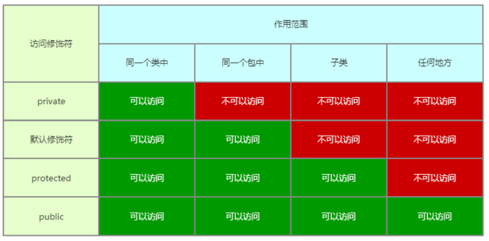

<font color="blue">示例：</font>

```java
package cn.ly.chapter4;

public class School {
     private  Teacher[] teachers;   //可以访问Teacher类
     // 使用默认修饰符修饰name属性
     String name;
     protected int age;
     public String address;
    
     public void show() {
         //在同一个类中
          System.out.println(teachers.length + "\t" +name+age+"\t" + address);
     }
}
```

```java
package cn.ly.chapter4;

public class SchoolTest {
//    同一个包中
    public static void main(String[] agrs) {
        School school = new School();
        //外部不能访问private修饰的属性
//      System.out.println(school.teachers);    不能访问
        System.out.println(school.name);
        System.out.println(school.age);
        System.out.println(school.address);
    }
}
```

```java
package cn.ly.chapter4.Test;

import cn.ly.chapter4.School;

public class SchoolTest1 {
//    在任何地方
    public static void main(String[] agrs) {
        School school = new School();
        //外部不能访问private修饰的属性
//      System.out.println(school.teachers);    不能访问
//      System.out.println(school.name);
//      System.out.println(school.age);
        System.out.println(school.address);
    }
}
```

##### 3. `static` 修饰符

`static` 修饰符只能用来修饰类中定义的成员变量、成员方法、代码块以及内部类（在类中定义的其他类）。

**`static` 修饰变量：**

`static` 修饰的成员变量为类变量，不会随着成员变化而变化，属于该类所有成员共享。

**`static` 修饰类：**

`static` 修饰类时只能修饰内部类。

如果类变量是公开的，那么可以使用 `类名.变量名` 直接访问该类变量。

<font color="blue">示例：</font>

```java
package cn.ly.chapter4;

public class ChinesePeople {

    private String name;

    private int age;
    //使用static修饰的成员变量称为类变量，不会随着成员变化而变化，属于成员共享变量
    public static String country = "中国";

    public ChinesePeople(String name,int age) {
        this.name = name;
        this.age = age;
    }

    public String getName() {
        return name;
    }

    public void setName(String name) {
        this.name = name;
    }
}
```

```java
package cn.ly.chapter4;

public class ChinesePeopleTest {
    public static void main(String[] args) {
        ChinesePeople cp1 = new ChinesePeople("张三",20);
        System.out.println(cp1.getCountry());
        cp1.setCountry("日本");

        ChinesePeople cp2 = new ChinesePeople("李四",23);
        System.out.println(cp2.getCountry());

        cp2.setCountry("中国");

        ChinesePeople cp3 = new ChinesePeople("王五",32);
        System.out.println(cp3.getCountry());
    }
}
```

**`static` 修饰方法：**

`static` 修饰的成员方法称之为类方法，属于该类所有成员共享。

<font color="blue">示例：</font>

```java
package cn.ly.chapter4;

public class ChinesePeople {

    private String name;

    private int age;
    //使用static修饰的成员变量称为类变量，不会随着成员变化而变化，属于成员共享变量
    private static String country = "中国";

    public ChinesePeople(String name,int age) {
        this.name=name;
        this.age=age;
    }

    public String getName() {
        return name;
    }

    public void setName(String name) {
        this.name=name;
    }

    //类方法
    public static String getCountry() {
        return country;
    }

    //类方法
    public static void setCountry(String country) {
        ChinesePeople.country = country;
    }
}
```

```java
package cn.ly.chapter4;

public class ChinesePeopleTest {
    public static void main(String[] args) {
        ChinesePeople  cp1 = new ChinesePeople("张三",20);
        cp1.setCountry("日本");

        ChinesePeople cp2 = new ChinesePeople("李四",23);
        System.out.println(cp2.getCountry());

        ChinesePeople cp3 = new ChinesePeople("王五",32);
        System.out.println(cp3.getCountry());
    }
}
```

##### 4. 静态代码块

`static` 修饰的代码块称为静态代码块，<font color="red">**在 JVM 第一次加载该类时执行**</font>。因此，<font color="red">**静态代码块只能够被执行一次**</font>，并且使用到该部分内容时才会被执行，通常用于一些系统设置场景。

<font color="red">**静态代码块只能调用静态成员，普通代码块可以调用任意成员。**</font>

创建子类对象时，调用顺序如下：

1. 父类静态代码块和静态属性初始化；
2. 子类静态代码块和静态属性初始化；
3. 父类普通代码块和普通属性初始化；
4. 父类构造方法；
5. 子类普通代码块和普通属性初始化；
6. 子类构造方法。

<font color="blue">示例：</font>

```java
package cn.ly.chapter4;

public class ChinesePeople {

    private String name;

    private int age;
    
    private static String country;
    //static修饰的代码块称为静态代码块，在JVM第一次加载该类的时候执行，只能执行一次
    //使用到该部分内容时才会被执行
    static {
        //静态代码块
        country="中国";
        System.out.println("该属性已被赋值");
    }
    
    public ChinesePeople(String name,int age) {
        this.name=name;
        this.age=age;
    }

    public String getName() {
        return name;
    }

    public void setName(String name) {
        this.name=name;
    }

    //类方法
    public static String getCountry() {
        return country;
    }

    //类方法
    public static void setCountry(String country) {
        ChinesePeople.country = country;
    }
}
```

```java
package cn.ly.chapter4;

public class ChinesePeopleTest {
    public static void main(String[] args) {
        ChinesePeople  cp1 = new ChinesePeople("张三",20);
        cp1.setCountry("日本");
    }
}
```

### 四、继承

#### （1）继承

##### 1. 继承的概念

继承（Inheritance）：当你要创建一个新类并且已经有一个包含所需代码的类时，可以从现有类中派生新类。这样，你可以重用现有类的字段和方法，而不必自己编写（和调试）它们。

子类从其父类继承所有成员（字段，方法和嵌套类）。构造方法不是成员，因此它们不会被子类继承，但是可以从子类中调用父类的构造方法。

从一个类派生的类称为子类（也可以是派生类，扩展类或子类）。派生子类的类称为超类（也称为基类或父类）。

继承是面向对象三大特性之一。

##### 2. 继承的用法

继承的语法：

```java
public class 子类名 extends 父类名 {

}
```

<font color="blue">示例：</font>

```java
package com.cyx.inheritance;

public class Father {
    public String name;
    public String sex;
    public void eat() {
        System.out.println("吃饭");
    }
    public void sleep() {
        System.out.println("睡觉");
    }
}
```

```java
package com.cyx.inheritance;

public class Child extends Father{
    public void show() {
        //本类中没有name变量，但可以使用，说明name是从父类中继承过来的
        System.out.println(name);
        System.out.println(sex);
        //本类中没有eat方法，但可以使用，说明eat方法是从父类中继承过来的
        eat();
        sleep();
    }
}
```

```java
package com.cyx.inheritance;

public class FatherTest {
    public static void main(String[] args) {
        Child child = new Child();
        child.name="张三";
        child.sex="男";
        child.show();
    }
}
```

##### 3. 继承的规则

不论子类在什么包中，子类会继承父类中所有的公开 `public` 的和受保护 `protected` 的成员（包括字段和方法）。如果子类和父类在同一个包中，子类也会继承父类中受包保护（默认修饰）的成员。

子类不会继承父类中定义的私有 `private` 成员。尽管如此，如果父类有提供公开 `public` 或者受保护 `protected` 的访问该字段的方法， 这些方法也能在子类中被使用。

<font color="blue">示例：</font>

```java
package com.cyx.inheritance;

public class Father {
    //受包保护
    String name;
    //受保护
    protected String sex;
    //公开方法
    public String getName() {
        return name;
    }

    public void eat() {
        System.out.println("吃饭");
    }
    public void sleep() {
        System.out.println("睡觉");
    }
}
```

```java
package com.cyx.inheritance.p1;

import com.cyx.inheritance.Father;

public class Child extends Father {
    public void show() {
        //本类中没有name变量，但可以使用，说明name是从父类中继承过来的
        //受包保护则不能直接继承，需要公开的方法
        System.out.println(getName());
        System.out.println(sex);
        //本类中没有eat方法，但可以使用，说明eat方法是从父类中继承过来的
        eat();
        sleep();
    }
}
```

##### 4. 应用示例

定义两个人，一个是医生，一个是程序员，每个人都有姓名，年龄，性别，都可以进行吃饭行为，医生有专业，可以进行治疗行为，程序员有等级，可以进行编程行为。

```java
package com.cyx.inheritance.p2;

public class Person {
    private String name;
    private String sex;
    private int age;

    public String getName() {
        return name;
    }

    public void setName(String name) {
        this.name=name;
    }

    public String getSex() {
        return sex;
    }

    public void setSex(String sex) {
        this.sex=sex;
    }

    public int getAge() {
        return age;
    }

    public void setAge(int age) {
        this.age=age;
    }

    public void eat() {
        System.out.println("吃饭");
    }
}
```

```java
package com.cyx.inheritance.p2;

public class Programmer extends Person {
    private int level;
    public int getLevel() {
        return level;
    }
    public void setLevel(int level) {
        this.level=level;
    }
    public void program() {
        System.out.println("编程");
    }
}
```

```java
package com.cyx.inheritance.p2;

public class Doctor extends Person {
    private String professional;
    public String getProfessional() {
        return professional;
    }
    public void setProfessional(String professional) {
        this.professional=professional;
    }
    public void cure() {
        System.out.println("治疗");
    }
}
```

```java
package com.cyx.inheritance.p2;

public class PersonTest {
    public static void main(String[] args) {
        Doctor d = new Doctor();
        d.setName("Mr.Zhang");
        d.setSex("男");
        d.setAge(18);
        d.setProfessional("临床");
        d.cure();
        d.eat();

        Person p1 = new Doctor();   //医生是人
        p1.setName("Mr.Zhang");
        p1.setSex("男");
        p1.setAge(18);

        Person p2 = new Programmer();   //程序员是人
        p1.setName("雷军");
        p1.setSex("男");
        p1.setAge(50);
    }
}
```

<font color="red">**如果一个对象赋给其父类的引用，此时想要调用该对象的特有的方法，必须要进行强制类型转换。**</font>

```java
package com.cyx.inheritance.p2;

public class PersonTest {
    public static void main(String[] args) {
       
        Person p1 = new Doctor();   //医生是人
        p1.setName("Mr.Zhang");
        p1.setSex("男");
        p1.setAge(18);
        //强制类型转换
        ((Doctor)p1).cure();

        Person p2 = new Programmer();   //程序员是人
        p2.setName("雷军");
        p2.setSex("男");
        p2.setAge(50);
        //强制类型转换
        ((Programmer)p2).program();
    }
}
```

#### （2）方法重写

##### 1. 方法重写的概念

方法重写（Override）：子类中的一个成员方法与父类中的成员方法有相同的签名（方法名，参数数量和参数类型）和返回值类型的实例方法重写了父类的方法。

##### 2. 方法重写的用法

<font color="blue">官方说明：</font>子类重写方法的能力使类可以从行为“足够近”的父类继承，然后根据需要修改行为。重写方法与被重写的方法具有相同的名称，数量和参数类型，并且返回类型相同。重写方法还可以返回重写方法返回的类型的子类型，此子类型称为**协变返回类型**。

重写方法时，您可能需要使用 `@Override` 注解，该注释指示编译器您打算重写父类中的方法。如果由于某种原因，编译器检测到该方法在父类中不存在，则它将生成错误。

**基本数据类型也具有类：**

| 类      | 基本数据类型 |
| ------- | ------------ |
| Byte    | byte         |
| Short   | short        |
| Integer | int          |
| Long    | long         |
| Float   | float        |
| Double  | double       |

<font color="blue">示例：</font>

```java
package com.cyx.inheritance.Number;

public class NumberTest {
    public static void main(String[] args) {
        Byte b = 1;
        Short s = -1;
        Integer i = 1;
        Long l = 1L;
        Double d = 1.0;
        Float f = 1.0f;
    }
}
```

<font color="blue">方法重写示例1：</font>

```java
package com.cyx.inheritance.p2;

public class Person {
    private String name;
    private String sex;
    private int age;


    public Number getScore() {  //获取每个人的成绩
        return 0;
    }

    public void eat() {
        System.out.println("吃饭");
    }

}
```

```java
package com.cyx.inheritance.p2;

public class Programmer extends Person {
    private int level;
    public int getLevel() {
        return level;
    }
    public void setLevel(int level) {
        this.level=level;
    }

//该注解告诉编译器，这是一个重写的方法，编译器会去检测父类中是否存在这样的方法，如果不存在则生成错误
    @Override
    public Double getScore() {
        return 90.3;
    }

    public void program() {
        System.out.println("程序员编程");
    }
}
```

```java
package com.cyx.inheritance.p2;

public class Doctor extends Person {
    private String professional;
    public String getProfessional() {
        return professional;
    }
    public void setProfessional(String professional) {
        this.professional=professional;
    }

    //方法重写
    public void eat() {
        System.out.println("用左手吃饭");
    }

    //协变返回类型：子类重写父类方法时，返回值类型可以是父类方法返回值类型的子类
    public Integer getScore() {
        return 90;
    }

    public void cure() {
        System.out.println("医生治疗");
    }
}
```

<font color="blue">方法重写示例2：几何图形都有面积和周长，不同的几何图形面积和周长的计算方法不一样，计算圆和矩形的周长与面积。</font>

分析：几何图形是一个类，具有周长和面积，矩形和圆属于几何图形，是它的子类。

```java
package com.cyx.inheritance.shape;

//几何图形
public class shape {
    //计算周长
    public Number calculatePerimeter() {
        return 0;
    }
    //计算面积
    public Number calculateArea() {
        return 0;
    }

}
```

```java
package com.cyx.inheritance.shape;

public class Rectangle extends shape{
    private int width;
    private int length;

    public Rectangle(int width, int length) {
        this.width = width;
        this.length = length;
    }

    @Override
    public Integer calculatePerimeter() {
        return (width+length)*2;
    }

    @Override
    public Integer calculateArea() {
        return width*length;
    }
}
```

```java
package com.cyx.inheritance.shape;

public class Circle extends shape{
    private int radius;

    public Circle(int radius) {
        this.radius = radius;
    }

    @Override
    public Double calculatePerimeter() {
        return Math.PI*radius*2;
    }

    @Override
    public Double calculateArea() {
        return Math.PI*radius*radius;
    }
}
```

```java
package com.cyx.inheritance.shape;

public class shapeTest {
    public static void main(String[] args) {
        shape s1 = new Rectangle(9,8);
        System.out.println(s1.calculateArea());
        System.out.println(s1.calculatePerimeter());

        shape s2 = new Circle(4);
        System.out.println(s2.calculateArea());
        System.out.println(s2.calculatePerimeter());
    }
}
```

<font color="red">**访问修饰符的级别不能降低，只能保持不变或提高。**</font>

##### 3. `super` 关键字

（1）<font color="blue">官方说明：</font>如果子类的构造方法没有明确调用父类的构造方法，Java 编译器会自动插入一个父类无参构造的调用，且该语句最先执行。如果父类没有无参构造，你将得到一个编译时错误。`Object` 类有一个无参构造，因此，如果 `Object` 类是该类的唯一父类，这就没有问题。

<font color="red">**使用super调用父类的构造方法时，必须为这个构造方法的第一条语句。**</font>

<font color="blue">示例1：子类和父类中都没有定义构造方法。</font>

```java
package com.cyx.inheritance;

public class Father {
    //受包保护
    String name;
    //受保护
    protected String sex;

    //编译器会自动插入一个无参构造方法
    public Father() {

    }

    //公开方法
    public String getName() {
        return name;
    }
    public void eat() {
        System.out.println("吃饭");
    }
    public void sleep() {
        System.out.println("睡觉");
    }
}
```

```java
package com.cyx.inheritance;

public class Child extends Father{

    //如果一个类没有定义构造方法，那么编译器将会给该类插入一个无参构造方法
    public Child() {
        //如果子类构造方法中没有显示的调用父类的构造方法，那么编译器会自动插入一个父类无参构造的调用
        super();
        //使用super调用父类的构造方法时，必须为这个构造方法的第一条语句
        System.out.println(" ");
    }

    public void show() {
        //本类中没有name变量，但可以使用，说明name是从父类中继承过来的
        System.out.println(name);
        System.out.println(sex);
        //本类中没有eat方法，但可以使用，说明eat方法是从父类中继承过来的
        eat();
        sleep();
    }
}
```

<font color="blue">示例2：子类中有定义构造方法，父类没有定义构造方法。</font>

```java
package com.cyx.inheritance;

public class Father {
    //受包保护
    String name;
    //受保护
    protected String sex;

    //公开方法
    public String getName() {
        return name;
    }

    public void eat() {
        System.out.println("吃饭");
    }
    public void sleep() {
        System.out.println("睡觉");
    }
}
```

```java
package com.cyx.inheritance;

public class Child extends Father{

    //如果一个类没有定义构造方法，那么编译器将会给该类插入一个无参构造方法
    public Child() {
        //如果子类没有显示的调用父类的构造方法，那么编译器会自动插入一个父类无参构造的调用
        super();
    }

    //有参构造方法
    public Child(String name) {
        super();
        this.name = name;
    }

    public void show() {
        //本类中没有name变量，但可以使用，说明name是从父类中继承过来的
        System.out.println(name);
        System.out.println(sex);
        //本类中没有eat方法，但可以使用，说明eat方法是从父类中继承过来的
        eat();
        sleep();
    }
}
```

<font color="blue">示例3：子类和父类都定义了构造方法。</font>

```java
package com.cyx.inheritance;

public class Father {
    //受包保护
    String name;
    //受保护
    protected String sex;

    //编译器会自动插入一个无参构造方法
    public Father(String name,String sex) {
        this.name = name;
        this.sex = sex;
    }

    //公开方法
    public String getName() {
        return name;
    }

    public void eat() {
        System.out.println("吃饭");
    }
    public void sleep() {
        System.out.println("睡觉");
    }
}
```

```java
package com.cyx.inheritance;

public class Child extends Father{

    //有参构造方法
    public Child(String name,String sex) {
  //如果父类中定义了代参构造，并且没有定义无参构造，那么必须在子类的构造方法中显示地调用父类的代参构造
        super(name, sex);
    }

    public void show() {
        //本类中没有name变量，但可以使用，说明name是从父类中继承过来的
        System.out.println(name);
        System.out.println(sex);
        //本类中没有eat方法，但可以使用，说明eat方法是从父类中继承过来的
        eat();
        sleep();
    }
}
```

（2）<font color="blue">官方说明：</font>如果你的方法重写了父类的方法之一，则可以通过使用关键字 `super` 来调用父类中被重写的方法。 你也可以使用 `super` 来引用隐藏字段（尽管不建议使用隐藏字段）。

<font color="blue">示例4：</font>

```java
package com.cyx.inheritance.p3;

public class Person {
    protected String name;
    protected String sex;

    public String getName() {
        return name;
    }

    public String getSex() {
        return sex;
    }

    public void setSex(String sex) {
        this.sex = sex;
    }

    public void setName(String name) {
        this.name = name;
    }
}
```

```java
package com.cyx.inheritance.p3;

public class Student extends Person{
    //这里隐藏了name属性
    private String name;

    public Student(String name) {
        this.name = name;
    }
	
    //重写方法，将隐藏的属性允许访问
    @Override
    public String getName() {
        return name;
    }

    public void show() {
        System.out.println(this.name);  //打印本类中的定义的name变量
        System.out.println(super.name); //打印父类中定义的name变量
        //如果子类和父类中没有相同的成员，此时使用this和super均可以调用成员变量
        System.out.println(this.sex);
        System.out.println(super.sex);
        System.out.println(this.getName());
        System.out.println(super.getName());
    }
}
```

```java
package com.cyx.inheritance.p3;

public class PersonTest {
    public static void main(String[] args) {
        Student s = new Student("张三");
        System.out.println(s.getName());
        s.setSex("男");
        s.show();
    }
}
```

（3）子类中的静态方法与父类中的静态方法具有相同的签名，这种情况不属于方法重写。因为静态方法称之为类方法，与对象无关，调用时只看对象的数据类型。

<font color="blue">示例：</font>

```java
package com.cyx.inheritance.p4;

public class StaticFather {

    public static void show() {
        System.out.println("这是父类的静态方法");
    }
}
```

```java
package com.cyx.inheritance.p4;

public class StaticChild {
    //这不是方法重写
    public static void show() {
        System.out.println("这是子类的静态方法");
    }
}
```

```java
package com.cyx.inheritance.p4;

public class StaticTest {
    public static void main(String[] args) {
        StaticFather f = new StaticFather();
        f.show();
    }
}
```

（4）应用实例

<font color="blue">示例：</font>

```java
package com.cyx.inheritance.superTest;

public class Father {
    static {
        System.out.println("这是父类静态代码块");
    }

    public Father() {
        super();
        System.out.println("父类构造方法执行");
    }
}
```

```java
package com.cyx.inheritance.superTest;

public class Child extends Father{
    static {
        System.out.println("这是子类静态代码块");
    }

    public Child() {
        super();
        System.out.println("子类构造方法执行");
    }
}
```

```java
package com.cyx.inheritance.superTest;

public class FatherTest {
    public static void main(String[] args) {
        new Child();
//        这是父类静态代码块
//        这是子类静态代码块
//        父类构造方法执行
//        子类构造方法执行
    }
}
```

分析：构建 ```Child ```对象时，发现 ```Child``` 是 ```Father``` 的子类，而 ```Father``` 又是Object的子类。因此 JVM 会首先加载Object类，然后再加载 ```Father``` 类，最后再加载 ```Child``` 类。而静态代码块是在类第一次加载时执行，而且只会执行一次。因此，``` Father ```类中的静态代码块先执行，然后再执行 ```Child``` 类中的静态代码块。最后才执行 ```newChild();``` 代码，即执行 ```Child``` 中的构造方法，调用 ```Child``` 中的 ```super```，进入 ```Father``` 中的构造方法，执行完再返回执行 ```Child``` 中的构造方法 。

##### 4. 万物皆对象

`Object`：在没有其他任何显式超类的情况下，每个类都隐式为 `Object` 的子类。类可以派生自另一个类，另一个类又可以派生自另一个类，依此类推，并最终派生自最顶层的类 `Object`。这样的类是继承链中所有类的后代，并延伸到 `Object`。

单继承：除了没有父类的 `Object` 之外，每个类都有一个且只有一个直接父类。

万物皆对象：创建对象时会使用构造方法，而在构造方法中，子类可以无条件调用父类的构造方法，`Object` 类是所有类的父类，所有类都是 `Object` 的子类，因此创建一个对象都必须要调用 `Object` 类中的无参构造方法才能创建成功，而 `Object` 本身就表示对象，因此所有的类使用构造方法创建出来的都是对象。

<font color="blue">示例：动物都有名称、年龄，都需要吃东西、睡觉。狗也是一种动物，也有名称和年龄，狗吃的是骨头，睡觉 时是趴着睡。马也是一种动物，也有名称和年龄，马吃的是草，睡觉时站着睡。</font>

```java
package com.cyx.inheritance.animal;

public class Animal {
    protected String name;
    protected int age;

    public Animal(String name, int age) {
        this.name = name;
        this.age = age;
    }

    protected void eat() {
        System.out.println("动物吃东西");
    }

    protected void sleep() {
        System.out.println("动物睡觉");
    }
}
```

```java
package com.cyx.inheritance.animal;

public class Dog extends Animal {
    public Dog(String name, int age) {
        super(name, age);
    }

    @Override
    public void eat() {
        System.out.println(age + "岁的" + name + "在吃骨头");
    }

    @Override
    protected void sleep() {
        System.out.println(age + "岁的" + name + "趴着睡觉");
    }
}
```

```java
package com.cyx.inheritance.animal;

public class Horse extends Animal{

    public Horse(String name, int age) {
        super(name, age);
    }

    @Override
    protected void eat() {
        System.out.println(age + "岁的" + name + "在吃草");
    }

    @Override
    protected void sleep() {
        System.out.println(age + "岁的" + name + "站着睡觉");
    }
}
```

```java
package com.cyx.inheritance.animal;

public class AnimalTest {
    public static void main(String[] args) {
        Animal a1 = new Dog("柯基",10);
        a1.eat();
        a1.sleep();

        Animal a2 = new Horse("赤兔",5);
        a2.eat();
        a2.sleep();
    }
}
```

#### （3）`final` 修饰符

##### 1. 应用范围

`final` 修饰符应该使用在类、变量以及方法上。

##### 2. `final` 修饰类

<font color="blue">官方说明：</font>注意，你也可以声明整个类的 `final`。声明为 `final` 的类不能被子类化。例如，当创建不可变类（如 `String` 类）时，这特别有用。

如果一个类被 `final` 修饰，表示这个类是最终的类，因此这个类不能够在被继承，因为继承就是对类进行扩展。

<font color="blue">示例：</font>

```java
package com.cyx.inheritance._final;

//final修饰的类不能被继承
public final class FinalClass {
    
    public void show() {
        System.out.println("这是最终类里面的方法");
    }
}
```

```java
package com.cyx.inheritance._final;

	//这里会报编译错误，因此FinalClass不能够被继承
	public class ChildClass extends FinalClass{
        
    }
}
```

##### 3. `final` 修饰方法

<font color="blue">官方说明：</font>你可以将类的某些或所有方法声明为 `final`。在方法声明中使用 `final` 关键字表示该方法不能被子类覆盖。`Object` 类就是这样做的，它的许多方法都是最终的。

<font color="blue">示例：</font>

```java
package com.cyx.inheritance._final;

public class FinalMethod {
    
    public final void show() {
        System.out.println("这是一个最终方法，不能被重写");
    }
}
```

```java
public class ChildMethod extends FinalMethod {
    
	//这里也会报编译错误，因为父类中的show()方法时最终的，不可被重写
	public void show(){
        
	}
}
```

##### 4. `final` 修饰变量

`final` 修饰变量的时候，变量必须在对象构建时完成初始化，可以直接赋值，也可以使用构造方法。

`final` 修饰的变量称为常量，不可被更改。

<font color="blue">示例：</font>

```java
package com.cyx.inheritance._final;

public class FinalVariable {
    
    private final int number;	//也可以在这里直接赋值

    //static final修饰的变量就是静态常量
    public static final String country = "中国";
    
    //final修饰的变量一定要在对象创建时完成赋值操作
    public FinalVariable() {
        this.number = 10;
    }
    
    public void change() {
//        this.number = 11; //因为number是一个常量，不能被修改
    }
}
```

### 五、抽象类与接口

#### （1）抽象类

##### 1. 抽象类的概念

抽象类是被声明为 `abstract` 的类，它可能包含也可能不包含抽象方法。**抽象类不能被实例化**，即不能用抽象类来创建对象，也就是说知道要做一件事，但是不知道怎么做。

抽象类可以被子类化，即可以被继承。

##### 2. 抽象类语法

**定义抽象类和抽象方法的语法：**

```java
访问修饰符 abstract class 类名{
    
}

访问修饰符 abstract 返回值类型 方法名(参数列表);
```

##### 3. 应用场景与示例

一般来说，描述抽象的事物就需要使用抽象类。比如动物、设备、几何图形等。

<font color="red">**如果一个类继承于一个抽象类，那么该类必须实现这个抽象类中的所有抽象方法。否则，该类必须定义为抽象类。**</font>

<font color="red">**抽象类不一定有抽象方法，但有抽象方法的类一定是抽象类。**</font>

<font color="blue">示例1：已知动物会吃饭，但由于不知道是什么动物（抽象类不能被实例化），所以不知道怎么吃饭：</font>

```java
package com.cyx.abstractclass;

public abstract class Animal {	//定义抽象类

    //抽象方法是没有方法体的，因为方法体就是表示知道具体怎么去做这件事情
    public abstract void eat();	//抽象方法
}
```

```java
package com.cyx.abstractclass;

public class Panda extends Animal {
    @Override
    public void eat() {
        System.out.println("熊猫吃竹子");
    }
}
```

```java
package com.cyx.abstractclass;

public class AnimalTest {
    public static void main(String[] args) {
        Animal a1 = new Panda();
        a1.eat();
    }
}
```

<font color="blue">示例2：已知几何图形可以计算周长和面积，但由于不知道是什么图形，所以不知道怎么计算：</font>

```java
package com.cyx.abstractclass;

public abstract class Shape {

    public abstract Number perimeter(); //知道几何图形能算周长和面积，但不知道怎么算，返回值为Number

    public abstract Number area();

}
```

```java
package com.cyx.abstractclass;

public class Rectangle extends Shape{

    private int width;
    private int length;

    public Rectangle(int width, int length) {
        this.width = width;
        this.length = length;
    }

    @Override
    public Integer perimeter() {    //协变返回类型：Integer是Number的子类
        return (width + length) * 2;
    }

    @Override
    public Integer area() {
        return width * length;
    }
}
```

```java
package com.cyx.abstractclass;

public class Circle extends Shape{

    public Circle(int radius) {
        this.radius = radius;
    }

    private int radius;

    @Override
    public Double perimeter() {
        return 2 * Math.PI * radius;
    }

    @Override
    public Number area() {
        return Math.PI * radius * radius;
    }
}
```

```java
package com.cyx.abstractclass;

public class ShapeTest {

    public static void main(String[] args) {
        Shape s1 = new Rectangle(5,10);
        System.out.println(s1.perimeter());
        System.out.println(s1.area());

        Shape s2 = new Circle(5);
        System.out.println(s2.perimeter());
        System.out.println(s2.area());
    }
}
```

#### （2）接口

##### 1. 接口的概念

在软件工程中，软件与软件的交互很重要，这就需要一个约定。每个程序员都应该能够编写实现这样的约定。接口就是对约定的描述。

接口：在 Java 编程语言中，接口是类似于类的引用类型，它只能包含常量，方法签名，默认方法，静态方法和嵌套类型。方法主体仅适用于默认方法和静态方法。接口无法实例化，它们只能由类实现或由其他接口扩展（继承）。

接口编译完成后也会生成相应的 `class` 文件。

<font color="red">**接口没有构造方法**。</font>

##### 2. 接口的语法

接口包含的变量都是静态常量，接口中包含的方法签名都是公开的抽象方法，接口中的默认方法和静态方法在 JDK8 及以上版本才能定义，接口的私有方法必须在 JDK9 及以上版本才能定义。

接口的定义，接口中静态常量的定义，接口中方法，默认方法，静态方法的定义语法：

```java
[public] interface 接口名{	//前面的public可有可无，要么不写要么写public，不能是其他访问修饰符
    
    数据类型 变量名 = 变量值;		//接口中定义变量，该变量为静态常量，必须初始化赋值
    
    返回值类型 方法名([参数列表]);	//接口定义方法，该方法无方法体，属于抽象方法
    
    default 返回值类型 方法名([参数列表]){	//接口中定义默认方法，JDK8版本以上使用
        [return 返回值;]
    }
    
    static 返回值类型 方法名([参数列表]){	//接口中定义的静态方法，JDK8及以上版本使用
		[return 返回值;]
    }
    
    private 返回值类型 方法名([参数列表]){	//接口中定义的私有方法，JDK9及以上版本使用
		[return 返回值;]
	}
}
```

##### 3. 接口继承

<font color="red">**接口可以多继承，这是 Java 中唯一可以使用多继承的地方。**</font>

接口继承的语法：

```java
访问修饰符 class 类名 implements 接口名1,接口名2,...接口名n{

}
```

<font color="blue">示例：已知人有名字，演员是人，会表演，歌手是人，会唱歌，艺人会代言，艺人既是歌手又是演员，用接口表示：</font>

```java
package interfaceclass.person;

public interface Person {
    String getName();   //人有名字，用方法获取名字
}
```

```java
package interfaceclass.person;

public interface Singer extends Person{ //歌手是人
    void sing();    //歌手会唱歌
}
```

```java
package interfaceclass.person;

public interface Actor extends Person{  //演员是人
    void performance(); //演员会表演
}
```

```java
package interfaceclass.person;

public interface Artist extends Actor,Singer{   //艺人既是演员又是歌手（多继承）
    void endorsement(); //艺人会代言
}
```

##### 4. 接口实现

一个类如果实现了一个接口，那么就必须实现这个接口中定义的所有抽象方法（包括接口通过继承关系继承过来的抽象方法），这个类被称为接口的实现类或者子类。与继承关系一样，实现类与接口之间的关系与子类和父类的关系一样。

接口实现的语法：

```java
访问修饰符 class 类名 implements 接口名1, 接口名2,...接口名n{

}
```

<font color="blue">示例：见上述接口继承示例，娱乐明星是艺人，用接口来实现娱乐明星的各个方法：</font>

```java
package interfaceclass.person;

public class EntertainmentStar implements Artist{

    private String name;

    public EntertainmentStar(String name) {
        this.name = name;
    }

    //必须实现所有抽象方法，包括继承过来的
    @Override
    public void endorsement() {
        //格式化打印
        System.out.printf("娱乐明星%s代言\n",getName());
    }

    @Override
    public void performance() {
        System.out.printf("娱乐明星%s表演\n",getName());
    }

    @Override
    public void sing() {
        System.out.printf("娱乐明星%s唱歌\n",getName());
    }

    @Override
    public String getName() {
        return name;
    }
}
```

```java
package interfaceclass.person;

public class PersonTest {
    public static void main(String[] args) {
        Person p = new EntertainmentStar("刘德华");    //娱乐明星是人
        System.out.println(p.getName());

        Actor a1 = new EntertainmentStar("吴京");      //娱乐明星是演员
        a1.performance();

        Singer s = new EntertainmentStar("张学友");    //娱乐明星是歌手
        s.sing();

        Artist a2 = new EntertainmentStar("邓超");
        a2.endorsement();
        a2.performance();
        a2.sing();
    }
}
```

##### 5. 接口的应用场景与示例

一般来说，定义规则、定义约定时使用接口。

<font color="blue">示例：电脑对外暴露有 USB 接口， USB 接口生产商只需要按照接口的约定生产相应的设备（比如 USB 键盘、 USB 鼠标、U盘）即可，每个设备都会服务，接入设备后就会提示服务。用接口实现上述描述：</font>

```java
package interfaceclass.usb;

public interface USB {  //USB是一个接口

    void service(); //USB接口服务
}
```

```java
package interfaceclass.usb;

public class UDisk implements USB{  //U盘是USB的设备

    @Override
    public void service() {
        System.out.println("U盘已接入，可以存储数据");
    }
}
```

```java
package interfaceclass.usb;

public class KeyBoard implements USB{   //键盘是USB的一个设备
    @Override
    public void service() {
        System.out.println("键盘已接入，可以开始打字了");
    }
}
```

```java
package interfaceclass.usb;

public class Mouse implements USB{  //鼠标是USB的一个设备
    @Override
    public void service() {
        System.out.println("鼠标已接入，可以开始移动光标了");
    }
}
```

```java
package interfaceclass.usb;

public class Computer { //用电脑来接入设备

    private USB[] usbArr = new USB[4];  //一台电脑有4个USB接口

    public void insertUSB(int index,USB usb){    //插入USB接口
        if (index <= 0 || index > usbArr.length) {
            System.out.println("不要瞎搞");
        }
        else {
            //插入后开始服务
            usbArr[index] = usb;
            usb.service();
        }
    }
}
```

```java
package interfaceclass.usb;

public class ComputerTest {
    public static void main(String[] args) {
        Computer computer = new Computer();
        computer.insertUSB(1,new Mouse());
    }
}
```

**抽象类与接口的区别：**

1. 抽象类拥有构造方法，接口没有构造方法。
2. 抽象类可以定义成员变量、静态变量、静态常量，而接口中只能定义静态常量。
3. 抽象类中的方法可以有受保护的、受包保护的、默认的方法，而接口中的方法都是公开的抽象方法（ JDK9 中可以定义私有方法）。
4. 抽象类主要应用在对于抽象事物的描述，而接口主要应用在对于功能性约定、规则的描述。
5. 抽象类只能够单继承，而接口可以多继承。

### 六、多态

#### （1）多态

##### 1. 多态的概念

<font color="blue">官方说明：</font>多态性的字典定义是指在生物学原理，其中的生物体或物质可具有许多不同的形式或阶段。该原理也可以应用于面向对象的编程和 Java 语言之类的语言。 一个类的子类可以定义自己的独特行为，但可以共享父类的某些相同功能。

继承、接口就是多态的具体体现方式。多态主要体现在类别、做事的方式上面。

多态是面向对象的三大特征之一，多态分为编译时多态和运行时多态两大类。

##### 2. 编译时多态

在编译时就已经确定如何调用的叫做编译时多态，方法重载就属于编译时多态。

<font color="blue">示例：</font>

```java
package com.cyx.polymorphism;

public class Calculator {

    //编译时就已经确定了方法是如何调用的方法重载属于编译时多态
    public double calculate(double a,double b) {
        return a + b;
    }

    public long calculate(long a,long b) {
        return a + b;
    }
}
```

```java
package com.cyx.polymorphism;

public class CalculatorTest {

    public static void main(String[] args) {
        Calculator c = new Calculator();
        long result1 = c.calculate(1,2);
        double result2 = c.calculate(1.3,3.4);
        System.out.println(result1 + " " + result2);
    }
}
```

##### 3. 运行时多态

<font color="blue">官方说明：</font> Java 虚拟机（JVM）为每个变量中引用的对象调用适当的方法。它不会调用由变量类型定义的方法。这种行为称为虚拟方法调用，它说明了 Java 语言中重要的多态性特征的一个方面。

```java
package com.cyx.polymorphism.p1;

public class Father {

    public void show() {
        System.out.println("Father show");
    }
}
```

```java
package com.cyx.polymorphism.p1;

public class Child extends Father{

    @Override
    public void show() {
        System.out.println("Child show");
    }
}
```

```java
package com.cyx.polymorphism.p1;

public class FatherTest {

    public static void main(String[] args) {
        //变量类型是Father
        Father f = new Child();
        //f调用show()时，不会调用Father定义的方法
        f.show();
    }
}
```

<font color="red">**抽象方法属于运行时多态。**</font>

<font color="blue">示例1：游戏中英雄都有名字，都会攻击，物理英雄会发动物理攻击，法术英雄发动法术攻击：</font>

```java
package com.cyx.polymorphism.hero;

public abstract class Hero {

    protected String name;

    public Hero(String name) {
        this.name = name;
    }

    public abstract void attack();
}
```

```java
package com.cyx.polymorphism.hero;

public class PhysicalHero extends Hero{

    public PhysicalHero(String name) {
        super(name);
    }

    @Override
    public void attack() {
        System.out.println(name + "物理攻击");
    }
}
```

```java
package com.cyx.polymorphism.hero;

public class SpellHero extends Hero{

    public SpellHero(String name) {
        super(name);
    }

    @Override
    public void attack() {
        System.out.println(name + "法术攻击");
    }
}
```

```java
package com.cyx.polymorphism.hero;

public class HeroTest {

    public static void main(String[] args) {
        Hero hero1 = new PhysicalHero("李白");
        hero1.attack();

        Hero hero2 = new SpellHero("典韦");
        hero2.attack();
    }
}
```

<font color="blue">示例2：动物园中有老虎、熊猫、猴子等动物，每种动物吃的东西不一样，老虎吃肉，熊猫吃竹叶，猴子吃水果；动物管理员每天都会按时给这些动物喂食。</font>

```java
package com.cyx.polymorphism.animal;

public abstract class Animal {

    //动物吃东西，但不知道怎么吃，所以要用抽象方法
    public abstract void eat();
}
```

```java
package com.cyx.polymorphism.animal;

public class Tiger extends Animal{

    @Override
    public void eat() {
        System.out.println("老虎吃肉");
    }
}
```

```java
package com.cyx.polymorphism.animal;

public class Panda extends Animal{

    @Override
    public void eat() {
        System.out.println("熊猫吃竹子");
    }
}
```

```java
package com.cyx.polymorphism.animal;

public class Monkey extends Animal{

    @Override
    public void eat() {
        System.out.println("猴子吃香蕉");
    }
}
```

```java
package com.cyx.polymorphism.animal;

public class ZooKeeper {

    public void feedPanda(Panda panda){
        panda.eat();
    }

    public void feedTiger(Tiger tiger){
        tiger.eat();
    }

    public void feedMonkey(Monkey monkey){
        monkey.eat();
    }
}
```

```java
package com.cyx.polymorphism.animal;

public class ZooKeeperTest {

    public static void main(String[] args) {
        ZooKeeper keeper = new ZooKeeper();
        keeper.feedTiger(new Tiger());
        keeper.feedMonkey(new Monkey());
        keeper.feedPanda(new Panda());
    }
}
```

以上代码存在问题，如果动物园大量的引入多种动物，那么这个动物管理类就得添加多个相应的喂食方法。这很显然存在设计上的缺陷，可以使用多态来优化：

```java
package com.cyx.polymorphism.animal;

public class ZooKeeper {

//    public void feedPanda(Panda panda){
//        panda.eat();
//    }
//
//    public void feedTiger(Tiger tiger){
//        tiger.eat();
//    }
//
//    public void feedMonkey(Monkey monkey){
//        monkey.eat();
//    }

    public void feedAnimal(Animal animal) {
        animal.eat();
    }
}
```

```java
package com.cyx.polymorphism.animal;

public class ZooKeeperTest {

    public static void main(String[] args) {
        ZooKeeper keeper = new ZooKeeper();
//        keeper.feedTiger(new Tiger());
//        keeper.feedMonkey(new Monkey());
//        keeper.feedPanda(new Panda());
        keeper.feedAnimal(new Tiger());
        keeper.feedAnimal(new Monkey());
        keeper.feedAnimal(new Panda());
    }
}
```

##### 4. `instanceof` 运算符

`instanceof` 本身意思表示的是某个类的一个实例，主要应用在类型的强制转换上面。在使用强制类型转换时，如果使用不正确，在运行时会报错。而 `instanceof` 运算符对转换的目标类型进行检测，如果是，则进行强制转换。这样可以保证程序的正常运行。

语法：

```java
对象名 instanceof 类名 //表示检测对象是否是指定类型的一个实例。返回值类型为boolean类型
```

<font color="blue">示例：上述动物管理实例中，实现子类特有的方法：</font>

```java
package com.cyx.polymorphism.animal;

public class Tiger extends Animal{

    @Override
    public void eat() {
        System.out.println("老虎吃肉");
    }

    //子类特有的方法
    public void strolling(){
        System.out.println("老虎在漫步");
    }
}
```

```java
package com.cyx.polymorphism.animal;

public class Monkey extends Animal{

    @Override
    public void eat() {
        System.out.println("猴子吃香蕉");
    }

    //子类特有的方法
    public void play(){
        System.out.println("猴子玩耍");
    }
}
```

```java
package com.cyx.polymorphism.animal;

public class ZooKeeper {

    public void feedAnimal(Animal animal) {
        animal.eat();
        if (animal instanceof Tiger) {  //如果animal是Tiger的实例，那就执行特有方法
            ((Tiger)animal).strolling();
        }
        if (animal instanceof Monkey) {
            ((Monkey)animal).play();
        }
    }
}
```

```java
package com.cyx.polymorphism.animal;

public class ZooKeeperTest {

    public static void main(String[] args) {
        ZooKeeper keeper = new ZooKeeper();
        keeper.feedAnimal(new Tiger());
        keeper.feedAnimal(new Monkey());
        keeper.feedAnimal(new Panda());
    }
}
```

```java
package com.cyx.polymorphism.animal;

public class AnimalTest {

    public static void main(String[] args) {
        Animal a1 = new Tiger();
        a1.eat();
        ((Tiger)a1).strolling();
    }
}
```

#### （2）`Object` 类中的常用方法

`Object` 类中定义的方法大多数都是属于 `native` 方法，`native` 表示的是本地方法，实现方式是在 C++ 中。

##### 1. `getClass()` 方法

<font color="blue">官方说明：</font> `getClass()` 方法返回一个Class对象，该对象具有可用于获取有关该类的信息的方法，例如其名称  `getSimpleName()`，其超类 `getSuperclass()` 及其实现的接口`getInterfaces()` 。

```java
package com.cyx.polymorphism.object;

import com.cyx.polymorphism.animal.Animal;
import com.cyx.polymorphism.animal.Tiger;

public class ObjectTest {

    public static void main(String[] args) {
        //以上面多态示例中定义的Animal类为例
        Animal a1 = new Tiger();
        Class clazz = a1.getClass();            //获取类
        String name = clazz.getSimpleName();    //获取类名
        System.out.println(name);
        String className = clazz.getName();     //获取类的全限定名（包名+类名）
        System.out.println(className);
        Class superClass = clazz.getSuperclass();       //获取其父类
        String superName = superClass.getSimpleName();  //获取父类名
        System.out.println(superName);
        String superClassName = superClass.getName();   //获取父类全限定名
        System.out.println(superClassName);

        //以String类为例
        String s = "admin";
        Class stringClass = s.getClass();
        //获取该类实现的全部接口
        Class[] interfaceClasses = stringClass.getInterfaces();   //可能是多个接口，所以要用数组
        for (int i = 0; i < interfaceClasses.length; i++) {
            Class interfaceClass = interfaceClasses[i];
            String interfaceName = interfaceClass.getSimpleName();  //获取接口名
            System.out.println(interfaceName);
            String interfaceClassName = interfaceClass.getName();   //获取接口全限定名
            System.out.println(interfaceClassName);
        }
    }
}
```

##### 2. `hashCode()` 方法

`hashCode()` 返回值是对象的哈希码，即对象的内存地址（十六进制）。

<font color="blue">官方说明：</font>根据定义，如果两个对象相等，则它们的哈希码也必须相等。 如果重写 `equals()` 方法，则会更改两个对象的相等方式，并且Object的 `hashCode()` 实现不再有效。 因此，如果重写 `equals()` 方法，则还必须重写 `hashCode()` 方法。

<font color="red">**一旦重写  `hashCode()` 方法，那么Object类中的 `hashCode()` 方法就是失效，此时的 `hashCode()` 方法返回的值不再是内存地址。**</font>

`hashCode()` 方法通常用于比较两个对象的属性是否相同。

<font color="blue">示例：</font>

```java
package com.cyx.polymorphism.hashcode;

import java.util.Objects;

public class Student {

    private String name;

    private int age;

    public Student(String name, int age) {
        this.name = name;
        this.age = age;
    }

    //hashCode()方法被重写后，返回值就不再是对象的内存地址
    @Override
    public int hashCode() {
        return 1;
    }
}
```

```java
package com.cyx.polymorphism.hashcode;

public class StudentTest {

    public static void main(String[] args) {
        Student s1 = new Student("张三",18);
        Student s2 = new Student("张三",18);
        System.out.println(s1.hashCode());
        System.out.println(s2.hashCode());
    }
}
```

##### 3. `equals()` 方法

<font color="blue">官方说明：</font> `equals()` 方法用于比较两个对象是否相等，如果相等则返回 `true`。`Object` 类中提供的 `equals()` 方法使用身份运算符 `==` 来确定两个对象是否相等。对于基本数据类型，这将返回 `true`，但对于对象，则返回 `false`，因为对象比较的是内存地址。`Object` 提供的 `equals()` 方法测试对象引用是否相等，即所比较的是对象是否完全相同。

如果想要测试两个对象在等效性上是否相等，即包含的所有信息是否全部相等，则必须重写 `equals()` 方法。

如果重写了 `equals()` 方法就必须重写 `hashCode()` 方法，不然调用的是 `Object` 类中的 `hashCode()` 方法，返回的是内存地址。不同对象的内存地址是不同的，但是 `equals()` 方法重写后，比较的是对象的内部信息，这样就会造成多个不同的对象在等效性上相等但是哈希码不同。

<font color="red">**如果两个对象相等，则它们的哈希码也必须相等，反之则不然。**</font>重写了 `equals()` 方法，就需要重写`hashCode()` 方法，才能满足上面的结论。

<font color="blue">示例：</font>

```java
package com.cyx.polymorphism.hashcode;

import java.util.Objects;

public class Student {

    private String name;

    private int age;

    public Student(String name, int age) {
        this.name = name;
        this.age = age;
    }

    //重写equals方法，比较在等效性上比较两个对象是否相等，即所包含的所有信息是否全相等
    @Override
    public boolean equals(Object o) {
        if (this == o) return true;
        //比较类的定义（类型）是否一致
        if (this.getClass() != o.getClass()) return false;
        //如果类的定义一致，那么对象o就可以被强制转换为Student
        Student other = (Student) o;
        //最后判断age和name是否相等
        return this.name.equals(other.name) && this.age == other.age;
    }

    //hashCode()方法被重写后，返回值就不再是对象的内存地址
    @Override
    public int hashCode() {
        return name.hashCode() + age;
    }
}
```

```java
package com.cyx.polymorphism.hashcode;

public class StudentTest {

    public static void main(String[] args) {
        Student s1 = new Student("张三",18);
        Student s2 = new Student("张三",18);

        boolean result = s1.equals(s2);
        System.out.println(result);

        System.out.println(s1.hashCode());
        System.out.println(s2.hashCode());
    }
}
```

**`==` 与 `equals()` 方法的区别：**

基本数据类型使用 `==` 比较的就是两个数据的字面量是否相等。引用数据类型使用 `==` 比较的是内存地址。`equals()` 方法来自 `Object` 类，本身实现使用的就是 `==`，此时它们之间没有区别。但是`Object` 类中的 `equals()` 方法可能被重写，此时比较就需要看重写逻辑来进行。

##### 4. `toString()` 方法

<font color="blue">官方说明：</font> 你应该始终考虑在类中重写 `toString()` 方法。`Object` 的 `toString()` 方法返回该对象的 `String` 表示形式，这对于调试非常有用。对象的 `String` 表示形式完全取决于对象，这就是为什么你需要在类中重写 `toString()` 的原因。

<font color="blue">示例：</font>

```java
package com.cyx.polymorphism.hashcode;

import java.util.Objects;

public class Student {

    private String name;

    private int age;

    public Student(String name, int age) {
        this.name = name;
        this.age = age;
    }

    //重写toString方法，使其返回该对象中所有的属性信息
    @Override
    public String toString() {
        return name + "\t" + age;
    }
}
```

```java
package com.cyx.polymorphism.hashcode;

public class StudentTest {

    public static void main(String[] args) {
        Student s1 = new Student("张三",18);
        Student s2 = new Student("张三",18);
        System.out.println(s1);
    }
}
```

##### 5. `finalize()` 方法

<font color="blue">官方说明：</font> `Object` 类提供了一个回调方法 `finalize()`，当该对象变为垃圾时可以在该对象上调用该方法。`Object` 类的 `finalize()` 实现不执行任何操作，你可以覆盖 `finalize()` 进行清理，例如释放资源。

垃圾即为该内存空间在栈上不存在栈帧时称为垃圾。

<font color="blue">示例：</font>

```java
package com.cyx.polymorphism.hashcode;

import java.util.Objects;

public class Student {

    private String name;

    private int age;

    public Student(String name, int age) {
        this.name = name;
        this.age = age;
    }

    //当一个Student对象没用了时候，可能会被调用
    @Override
    protected void finalize() throws Throwable {
        this.name = null;
        System.out.println("所有资源已释放完毕，可以清理");
    }
}
```

```java 
package com.cyx.polymorphism.hashcode;

public class StudentTest {

    public static void main(String[] args) {
      	
        show();
        System.gc();    //garbage collector:调用系统的垃圾回收进行垃圾回收
        System.out.println("这是最后一行代码");
    }

    public static void show(){
        //s对象的作用范围只在show方法中，一旦show方法执行完毕，那么s对象就应该被释放内存
        Student s = new Student("李四",23);
        System.out.println(s);
    }
}
```

### 七、`Math` 类与 `Arrays` 类

#### （1）`Math` 类

##### 1. `Math` 类

`Math` 类是 Java 中的数学类，可以对数字进行操作，其中包含的方法大多为静态方法，，比如一些数学公式，可以用 `Math` 直接调用。

##### 2. `Math` 类的常用静态常量

```java
//自然对数e
public static final double E = 2.718281828459045;

//圆周率π
public static final double PI = 3.141592653589793;
```

##### 3. `Math` 类的常用方法

**三角函数：**

```java
public static double toRadians(double angdeg);	//将角度转换为弧度

public static double toDegrees(double angrad);	//将弧度转换为角度

public static double sin(double a);	//正弦函数

public static double cos(double a);	//余弦函数

public static double tan(double a);	//正切函数

public static double asin(double a);	//反正弦函数

public static double acos(double a);	//反余弦函数

public static double atan(double a);	//反正切函数
```

**指数函数：**

```java
public static double pow(double a, double b);	//返回a的b次方

public static double exp(double a);	//返回e的a次方

public static double sqrt(double a);	//返回a的平方根

public static double cbrt(double a);	//返回a的立方根

public static double log(double a);	//返回ln(a)

public static double log10(double a);	//返回lg(a)
```

**小数取整：**

```java
public static double ceil(double a);	//向上取整

public static double floor(double a);	//向下取整

public static double rint(double a);	//返回距离a最近的整数，0.5返回0

public static long round(double a);		//四舍五入，0.5返回1
```

**其他操作：**

```java
public static int max(int a, int b);	//返回两数最大值，也可以是其他类型

public static int min(int a, int b);	//返回两数最小值，也可以是其他类型

public static double abs(double a);		//返回绝对值

public static double random();			//返回一个[0,1)的随机数
```

<font color="blue">示例：</font>

```java
package com.ssh.math;

/**
 * @author 申书航
 * @version 1.0
 */
public class MathMethod {

    public static void main(String[] args) {
        /* 三角函数 */
        // 角度 --> 弧度 toRadians()
        double x = 45; // 45°  45° -->  PI / 4
        System.out.println("45°转换为弧度：" + Math.toRadians(x));
        System.out.println(Math.PI / 4);

        double y = 180;
        System.out.println("180°转换为弧度：" + Math.toRadians(y));
        System.out.println(Math.PI);

        // 弧度 --> 弧度 toDegrees()
        double z = 0.7853981633974483; // PI / 4 -->  45°
        System.out.println("0.7853981633974483转换为角度" + Math.toDegrees(z));

        // 正弦函数sin()
        double degrees = 45.0;
        double radians = Math.toRadians(degrees);
        System.out.println("45° 的正弦值: " + Math.sin(radians));

        // 余弦函数cos()
        System.out.println("45° 的余弦值: " + Math.cos(radians));

        // 反正弦值asin()
        System.out.println("45° 的反正弦值: " + Math.asin(radians));

        // 反余弦值acos()
        System.out.println("45° 的反余弦值: " + Math.acos(radians));

        // 正切值tan()
        System.out.println("45° 的正切值: " + Math.tan(radians));

        // 反正切值atan() atan2()
        double m = 45;
        double n = 30;
        System.out.println("45° 的反正切值1: " + Math.atan(radians)); // atan()
        System.out.println("反正弦值2: " + Math.atan2(m, n)); // atan2() 坐标系表示角的反正切值;

        /* 指数函数 */
        double p = 8;
        double q = 3;

        // exp()
        System.out.println("e的6次幂: " + Math.exp(p)); // e^8

        // pow()
        System.out.println("8的3次幂: " + Math.pow(p, q)); // 8^3

        // sqrt()
        System.out.println("8的平方根: " + Math.sqrt(p));

        // cbrt()
        System.out.println("8的立方根: " + Math.cbrt(p)); // 2

        // log()
        System.out.println("ln(8): " + Math.log(p)); // ln(8)

        // log10()
        System.out.println("log10(8): " + Math.log10(p)); // log10(8)

        /* 取整 */
        double d = 100.675;
        double e = 100.500;

        // >=的整数  ceil()
        System.out.println("ceil(100.675): " + Math.ceil(d));

        // <=的整数  floor()
        System.out.println("floor(100.675): " + Math.floor(d));

        // 最近的整数  rint()
        System.out.println("rint(100.675): " + Math.rint(d));
        System.out.println("rint(100.500): " + Math.rint(e));

        // 四舍五入的整数  round()
        System.out.println("round(100.675): " + Math.round(d));
        System.out.println("round(100.500): " + Math.round(e));

        /* 其他 */
        // min() 最小
        System.out.println("min(): " + Math.min(2, 10));

        // max() 最大
        System.out.println("max(): " + Math.max(2, 10));

        // random() 返回一个随机数
        System.out.println("random(): " + Math.random());
        // 随机生成20-119之间的随机数
        int randomNum = (int) (Math.random() * 100) + 20;
        System.out.println("randomNum: " + randomNum);

        // abs() 绝对值
        System.out.println("abs(): " + Math.abs(-5));
    }
}
```

#### （2）`Arrays` 类

##### 1. `Arrays` 类

Java中的 `Arrays` 类是一个工具类，用于操作数组和集合。它提供了各种静态方法，用于管理或操作数组。

##### 2. `Arrays` 类的常用方法

```java
public static String toString(int[] a);	//将数组转换成字符串，数组也可以是其他类型

public static void sort(int[] a);	//将给定数组升序排序，数组也可以是其他类型

//将给定数组从开始位置到结束位置左闭右开区间的元素升序排序，数组也可以是其他类型
public static void sort(int[] a, int fromIndex, int toIndex);
   
//自定义排序，实现Comparator接口，定义排序规则
public static <T> void sort(T[] a, Comparator<? super T> c);

//二分查找，给定一个升序排好序的数组，查找某个元素第一次出现的下标，数组也可以是其他类型
//找不到则返回一个负数，若数组未按升序排序则可能找不到
public static int binarySearch(int[] a, int key);

//复制给定数组的前newLength个元素至新数组，返回值为新数组
public static int[] copyOf(int[] original, int newLength);

//将给定数组用给定值进行填充
public static void fill(int[] a, int val);

//将给定数组的从开始到结束的位置进行填充
public static void fill(int[] a, int fromIndex, int toIndex, int val);

public static boolean equals(int[] a, int[] a2);	//检查两数组是否完全一样

//检查给定的两个数组从开始到结束位置是否完全一样
public static boolean equals(int[] a, int aFromIndex, int aToIndex,
                             int[] b, int bFromIndex, int bToIndex);

//交换给定数组的两元素，a,b为元素位置
private static void swap(Object[] x, int a, int b);

//将给定数组转换成List集合
public static <T> List<T> asList(T... a);
```

<font color="blue">示例：</font>

```java
package com.ssh.arrays;

import java.util.Arrays;
import java.util.Comparator;
import java.util.List;


/**
 * @author 申书航
 * @version 1.0
 */
public class ArraysMethod {

    public static void main(String[] args) {
        int[] arr = {3, 4, 3, 4, 5, 1, 10, 2, 6, 7, 8, 9};
        String str = Arrays.toString(arr);
        System.out.println(str);

        Arrays.sort(arr, 3, 7);
        System.out.println(Arrays.toString(arr));

        Arrays.sort(arr);
        System.out.println(Arrays.toString(arr));

        Integer[] arr2 = {3, 4, 3, 4, 5, 1, 10, 2, 6, 7, 8, 9};
        Arrays.sort(arr2, new Comparator<Integer>() {
            @Override
            public int compare(Integer o1, Integer o2) {
                return o2 - o1;
            }
        });
        System.out.println(Arrays.toString(arr2));

        int index = Arrays.binarySearch(arr2, 3);
        System.out.println(index);
        Arrays.sort(arr2);
        index = Arrays.binarySearch(arr2, 3);
        System.out.println(index);

        int[] arr3 = Arrays.copyOf(arr, 5);
        System.out.println(Arrays.toString(arr3));

        Arrays.fill(arr3, 5);
        System.out.println(Arrays.toString(arr3));

        System.out.println(Arrays.equals(arr, arr3));

        List<Integer> l = Arrays.asList(1, 2, 3, 4, 5, 6, 7, 8, 9);
        System.out.println(l);
    }
}
```

## 第三章：高级面向对象

### 一、异常

#### （1）异常

##### 1. 异常的概念

异常是在程序执行期间发生的事件，该事件中断了程序指令的正常流程。

<font color="blue">官方说明：</font>当方法内发生错误时，该方法将创建一个对象并将其交给运行时系统。 该对象称为异常对象，包含有关错误的信息，包括错误的类型和发生错误时程序的状态。创建异常对象并将其交给运行时系统称为抛出异常。

<font color="red">**异常是由方法抛出的。**</font>

<font color="blue">示例：</font>

```java
package com.cyx.exception;

public class Example1 {

    public static void main(String[] args) {
        calculate();
    }

    public static void calculate() {
        int result = 1/0;
        System.out.println(result); //该代码不能被执行
    }
}
```

##### 2. 异常体系

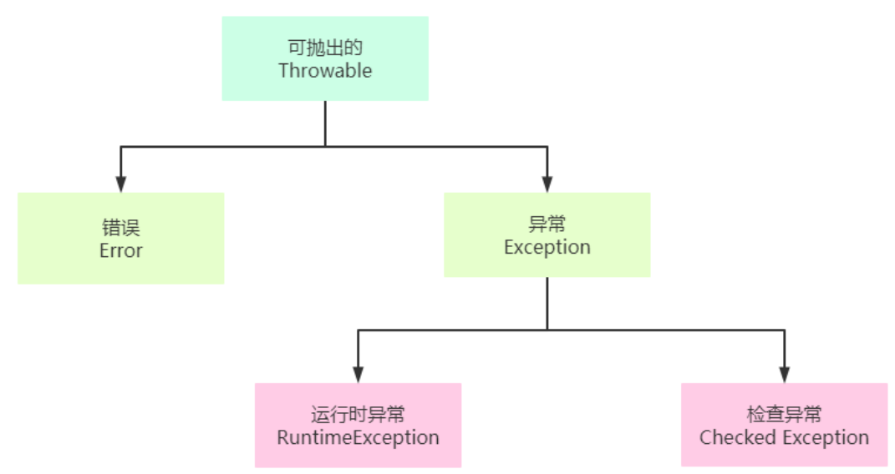

`Throwable` 是所有异常的父类。其常用方法如下：

```java
public Throwable();

public Throwable(String message);

public String getMessage();		//获取异常发生的原因

public void printStackTrace(); //打印异常在栈中的轨迹信息
```

`Error` 是一种非常严重的错误，程序员不能通过编写解决。

`Exception` 表示异常的意思，主要是程序员在编写代码时考虑不周导致的问题。异常分为运行时异常和检查异常两大类，一旦程序出现这些异常，程序员应该处理这些异常。

`RuntimeException` 表示运行时异常，所有在程序运行的时候抛出的异常类型都是属于 `RuntimeException` 的子类。运行时异常一般来说程序可以自动恢复，不必处理。

`Checked Exception` 表示检查异常，是指编译器在编译代码的过程中发现不正确的编码所抛出的异常。

#### （2）异常处理

Java 提供了一套异常处理机制来处理异常。Java 处理异常使用了5个关键字：`throw `、`throws`、`try`、`catch`、`finally`。

##### 1. `throw` 抛出异常

`throw` 关键字只能在方法内部使用，`throw` 关键字抛出异常表示自身并未对异常进行处理。

`throw` 抛出异常的语法：

```java
throw 异常对象;		//通常与if选择结构配合使用
```

<font color="blue">示例：</font>

```java
package com.cyx.exception;

import java.util.Scanner;

public class Example1 {

    public static void main(String[] args) {
        calculate();
    }

    public static void calculate() {
        Scanner sc = new Scanner(System.in);
        System.out.println("请输入一个数：");
        int number1 = sc.nextInt();
        System.out.println("请再输入一个数");
        int number2 = sc.nextInt();

        //当除数为0时要反馈错误
        if (number2 == 0) {
            //ArithmeticException算数异常是一个类
            ArithmeticException e = new ArithmeticException("在除法运算中，除数不能为0");
            throw e;
        }
        int result = number1 / number2;
        System.out.println(result); //该代码不能被执行
    }
}
```

##### 2. `throws` 声明可能抛出的异常类型

`throws` 关键字只能应用在**方法或者构造方法的定义上**对可能抛出的异常类型进行声明，自身不会对异常做出处理，由方法的调用者来处理。如果方法的调用者未处理，则异常将持续向上一级调用者抛出，直至 `main()` 方法为止，如果 `main()` 方法也未处理，那么程序可能因此终止。

`throws` 声明可能抛出的异常类型语法：

```java
访问修饰符 返回值类型 方法名(参数列表) throws 异常类型1,异常类型2,...异常类型n{

}
```

<font color="red">**`throws` 可以声明方法执行时可能抛出的异常类型，但需要注意的是：方法执行过程中只能抛出声明的异常类型的其中一个异常。**</font>

<font color="blue">示例：</font>

```java
package com.cyx.exception;

import java.util.InputMismatchException;
import java.util.Scanner;

public class Example2 {

    private static Scanner sc = new Scanner(System.in);

    public static void main(String[] args) {
        int result = devided();
        System.out.println(result);
    }

    //该方法可能出现输入类型不匹配和运算异常
    public static int devided() throws InputMismatchException,ArithmeticException{
        int number1 = getNumber();
        int number2 = getNumber();
        return number1 /number2;
    }

    //执行该方法时可能抛出InputMismatchException：输入类型不匹配的异常
    public static int getNumber() throws InputMismatchException {
        System.out.println("请输入一个数字");
        int number = sc.nextInt();
        return number;
    }
}
```

##### 3. `try-catch` 捕获异常

`throw` 和 `throws` 关键字均没有对异常进行处理，只是转移了异常所处的场所，这可能会导致程序终止。在这种情况下，可以使用 `try-catch` 结构来对抛出的异常进行捕获处理，从而保证程序能够正常运行。

`try-catch` 捕获异常的语法：尝试执行 `try` 结构中的代码块，如果执行过程中抛出了异常，则交给 `catch` 语句块进行捕获操作。

```java
try {
    //代码块
} catch(异常类型1 异常对象名1) {
    
} catch(异常类型2 异常对象名2) {
    
}
……
```

可以在 `try` 后面添加多个 `catch` 子句来分别对每一种异常进行处理。

<font color="red">**当使用多个 `catch` 子句捕获异常时，如果捕获的多个异常对象的数据类型具有继承关系，那么父类异常不能放在前面。**</font>

<font color="blue">示例：</font>

```java
package com.cyx.exception;

import java.util.InputMismatchException;
import java.util.Scanner;

public class Example3 {

    private static Scanner sc = new Scanner(System.in);

    public static void main(String[] args) {
        int result = devided();
        System.out.println(result);
    }

    //该方法可能出现输入类型不匹配和运算异常
    public static int devided() {
        //异常只能出现一种，当出现第一种时try代码块就不会再往下执行
        try {
            int number1 = getNumber();
            int number2 = getNumber();
        } catch (InputMismatchException e){
            e.printStackTrace();    //打印异常轨迹
            System.out.println(e.getClass().getName());
            System.out.println("异常信息：" + e.getMessage());
            System.out.println("请不要瞎搞，只能输入数字");
        } catch (ArithmeticException e) {
            e.printStackTrace();    //打印异常轨迹
            System.out.println(e.getClass().getName());
            System.out.println("异常信息：" + e.getMessage());
            System.out.println("在除法运算中，除数不能为0");
        }
        System.out.println("发生异常也会执行");
        return 0;
    }

    //执行该方法时可能抛出InputMismatchException：输入类型不匹配的异常
    public static int getNumber() throws InputMismatchException {
        System.out.println("请输入一个数字");
        int number = sc.nextInt();
        return number;
    }
}
```

##### 4. `finally` 语句

`finally` 语句不能单独使用，必须与 `try` 语句或者 `try-catch` 结构配合使用，表示无论程序是否发生异常都会执行，主要用于释放资源。<font color="red">**但如果在 `try` 语句或者 `catch` 语句中存在系统退出的代码，则 `finally` 语句将得不到执行。**</font>

**退出语法如下：**

```java
System.exit(0);		//状态码为0时为系统正常退出程序

System.exit(1);		//状态码不为0时为系统异常退出程序
```

**`finally` 语法：**

```java
try {

} finally {

}
```

或者：

```java
try {

} catch(异常类型 异常对象名) {

} finally {

}
```

<font color="blue">示例1：</font>

```java
package com.cyx.exception;

public class Example4 {

    private static int[] numbers = {1,2,3,4,5};

    public static void main(String[] args) {
        try {
//          System.exit(0);   //如果存在系统退出的代码，则finally语句将得不到执行。
            int number = getNumberFromArray(5);
            System.out.println(number);
        } catch (ArrayIndexOutOfBoundsException e){
            System.out.println("数组下标越界了");
        }finally {
            //异常也会执行
            System.out.println("需要执行的代码");
        }
    }

    public static int getNumberFromArray(int index){
        return numbers[index];
    }
}
```

<font color="blue">示例2：</font>

```java
package com.cyx.exception;

public class Example5 {

    public static void main(String[] args) {
        int result = getResult();
        System.out.println(result);
    }
    public static int getResult() {
        int number = 10;
        try { //尝试执行
        //返回值 => 尝试返回一个结果，但发现后面还有finally模块，而finally模块一定会得到执行。
        // 于是在这里只能将返回值使用一个临时变量(例如变量a)存储起来。
        // 然后再执行finally模块，finally模块执行完之后，再将这个临时变量(a)存储的值返回
            return number;
        } catch (Exception e) {
            return 1;
        } finally {
            number++;
        }
    }
}
//最终运行结果为10
```

#### （3）自定义异常

##### 1. 自定义异常

在Java中，异常的类型非常的多，要想使用这些异常，首先必须要熟悉它们。这无疑是一个巨大的工作量，很耗费时间。如果我们可以自定异常，则只需要熟悉 `RuntimeException`、`Exception` 和 `Throwable` 即可。这大大缩小了熟悉范围。自定义异常还可以帮助我们快速的定位问题。

自定义运行时异常如下：

```java
public class 类名 extends RuntimeException{
    
};
```

自定义检查异常语法如下：

```java
public class 类名 extends Exception{
    
};
```

<font color="blue">示例：在登录时经常会看到提示：“用户名不存在”或者“账号或密码错误”。使用自定义异常来描述该场景：</font>

```java
package com.cyx.exception;

public class UsernameNotFoundException extends Exception{

    //无参构造
    public UsernameNotFoundException(){

    }

    //代参构造
    public UsernameNotFoundException(String msg){
        super(msg);
    }
}
```

```java
package com.cyx.exception;

public class BadCredentialException extends Exception{

    //无参构造
    public BadCredentialException() {

    }

    //代参构造
    public BadCredentialException(String msg){
        super(msg);
    }
}
```

```java
package com.cyx.exception;

import java.util.Scanner;

public class Login {

    private static Scanner sc = new Scanner(System.in);

    public static void main(String[] args) {
        System.out.println("请输入账号：");
        String username = sc.next();
        System.out.println("请输入密码：");
        String password = sc.next();

        try {
            login(username,password);
        } catch (UsernameNotFoundException e) {
            e.printStackTrace();
        } catch (BadCredentialException e) {
            e.printStackTrace();
        }
    }

    public static void login(String username, String password) throws UsernameNotFoundException, BadCredentialException {
        if ("admin".equals(username)){
            if ("123456".equals(password)){
                System.out.println("登录成功");
            }
            else {
                throw new BadCredentialException("账号或密码错误");
            }
        }
        else {
            throw new UsernameNotFoundException("账号不存在");
        }
    }
}
```

##### 2. 异常使用注意事项

1. 运行时异常可以不处理。
2. 如果父类抛出了多个异常，子类重写父类方法时，只能抛出相同的异常或者是该异常的子集（与协变返回类型原理一致）。
3. 若父类方法没有抛出异常，子类重写父类该方法时也不可抛出检查异常。此时子类产生该异常，只能捕获处理，不能声明抛出。

```java
package com.cyx.exception;

public class Father {
    
	public void eat() throws Exception{
        
	}
    
	public void sleep(){
        
    }
    
	public void login(){
        
	}
}
```

```java
package com.cyx.exception;
public class Child extends Father {
    
	private String username;
	private String password;
    
    //构造方法
	public Child(String username, String password) {
		this.username = username;
		this.password = password;
	}
    
	@Override
	public void eat() throws UsernameNotFoundException {
        
	}
    
	//父类中的方法没有声明抛出异常，子类中方法可以声明抛出运行时异常
	@Override
	public void sleep() throws RuntimeException{
        
	}
    
	//父类中的方法没有声明抛出异常，子类中方法不能声明抛出检查异常
	@Override
	public void login() {
		try {
			Login.login(username, password);
		} catch (UsernameNotFoundException e) {
			e.printStackTrace();
		} catch (BadCredentialsException e) {
			e.printStackTrace();
		}
	}
}
```

### 二、字符串

#### （1）`String` 字符串

##### 1. `String` 的特点

1. `String` 类位于 `java.lang` 包中，无需引入，直接使用即可。
2. `String` 类是由 `final` 修饰的，表示 `String` 类是一个最终类，不能够被继承。
3. `String` 类构建的对象不可再被更改。

```java
package com.cyx.string;

public class Example1 {

    public static void main(String[] args) {
        //当使用一个字面量给一个字符串赋值时，首先会去字符串常量池中检测是否存在这个字面量
        //如果存在，则直接使用字面量的地址赋值即可
        //如果不存在，则需要再字符串常量池中创建这个字面量，然后再赋值
        String s = "超用心";
        s += "在线学习";    //这里的字符串拼接动作发生在堆上
        System.out.println(s);
    }
}
```

##### 2. `String` 类的常用构造方法

```java
public String(String original);

public String(char value[]);

public String(char value[], int offset, int count);

public String(byte bytes[]);

public String(byte bytes[], int offset, int length);

public String(byte bytes[], Charset charset);
```

<font color="blue">示例：</font>

```java
package com.cyx.string;

import java.nio.charset.Charset;

public class Example2 {

    public static void main(String[] args) {
        //这里会创建两个对象：一个是字面量会在常量池中创建出来，一个是new String()构造方法创建的对象
        String s1 = new String("超用心");
        System.out.println(s1);

        //用字符数组创建
        char[] values = {'a','b','c','d','e'};
        String s2 = new String(values);
        System.out.println(s2);
        //字符数组偏移创建，从下标1开始，一共3个字符，必须要考虑数组下标越界的情况
        String s3 = new String(values,1,3);
        System.out.println(s3);

        //字节可以存储数字，字符可以用数字表示ASCLL码
        byte[] bytes = {97,98,99,100,101,102};
        String s4 = new String(bytes);
        System.out.println(s4);

        //使用字符集构建字符串
        Charset charset = Charset.forName("UTF-8"); //构建UTF-8字符集
        String s5 = new String(bytes,charset);
        System.out.println(s5);
    }
}
```

##### 3. `String` 类的常用方法

**获取长度：**

```java
public int length();	//获取字符串长度
```

**比较大小：**

```java
public boolean equals(Object anObject);	//比较两个字符串是否相同

public boolean equalsIgnoreCase(String anotherString);//忽略字母大小写比较两个字符串是否相同
```

**字符串大小写转换：**

```java
public String toLowerCase();//将所有大写字母转换为小写

public String toUpperCase();//将所有小写字母转换为大写
```

**获取字符在字符串中的下标（查找字符）：**

```java
public int indexOf(int ch); //获取指定字符在字符串中第一次出现的下标

public int lastIndexOf(int ch);	//获取指定字符在字符串中最后一次出现的下标
```

**获取字符串在字符串中的下标（查找子串）：**

```java
public int indexOf(String str);	//获取指定字符串在字符串中第一次出现的下标

public int lastIndexOf(String str);	//获取指定字符串在字符串中最后一次出现的下标
```

**获取字符串中的指定下标的字符：**

```java
public char charAt(int index);
```

**截取子串：**

```java
public String substring(int beginIndex);	//从指定开始位置截取子串，直到字符串的末尾

public String substring(int beginIndex, int endIndex);//从指定开始位置到指定结束位置（左闭右开区间）截取子串
```

**字符串替换：**

```java
public String replace(char oldChar, char newChar);//使用新的字符替换字符串中存在的所有旧字符，并且原字符串不变，返回替换后的新字符串

public String replace(CharSequence target, CharSequence replacement);//使用新的字符串来替换字符串中的所有旧字符串，原字符串不变，返回替换后的新字符串

public String replaceAll(String regex, String replacement);//使用替换的字符串来替换字符串中满足正则表达式的字符串，原字符串不变，返回替换后的新字符串
```

**获取字符数组：**

```java
public char[] toCharArray();
```

**获取字节数组：**

```java
public byte[] getBytes(); //用ASCLL码获取字节数组

public byte[] getBytes(Charset charset);//获取指定编码下的字节数组
```

**字符串拼接：**

```java
String s3 = s1 + s2;	//直接相加

public String concat(String str);	//将字符串追加到末尾，返回新字符串，原字符串不变
```

**去除字符串两端的空白字符：**

```java
public String trim();	//将字符串两端的空格去掉，返回新字符串，原字符串不变
```

**字符串分割：**

```java
public String[] split(String regex);	//将字符串按照匹配的正则表达式分割，将所有分割得到的子串放在字符串数组里返回
```

**字符串匹配正则表达式：**

```java
public boolean matches(String regex); 	//检测字符串是否匹配给定的正则表达式
```

**`intern()` 方法：**

```java
public String intern(String str);	//将str放入字符串常量池，放入时会先检测常量池中有没有str，如果有，则直接使用s23的字符串地址，否则就在常量池中创建字符串str
```

**静态方法：**

```java
//将一个数字转换成字符串，也可以是其他类型
public static String valueOf(int i);

//将一个字符数组的给定起始到结束位置转换成字符串
public static String copyValueOf(char data[], int offset, int count);
```

<font color="blue"> 上述所有方法示例：</font>

```java
package com.cyx.string;

import java.nio.charset.Charset;

public class Example3 {

    public static void main(String[] args) {
        String s1 = "超用心";
        //获取长度
        int length = s1.length();
        System.out.println(length);

        String s2 = "abc";
        String s3 = "abc";
        String s4 = "ABc";
        //字符串之间进行比较时会先 检查长度是否相同，如果相同，再检查每位字符是否相同
        System.out.println(s2 == s3);
        System.out.println(s2.equals(s3));
        System.out.println(s2.equals(s4));
        //忽略字母大小写比较
        System.out.println(s2.equalsIgnoreCase(s4));

        //大小写转换
        String s5 = s2.toUpperCase();
        System.out.println(s5);
        String s6 = s4.toLowerCase();
        System.out.println(s6);

        //查找字符第一次出现的位置，如果不存在则返回-1
        String s7 = "ki@ley@aliyun.com";
        int index = s7.indexOf('@');    //兼容数据类型之间可以发生自动类型转换
        System.out.println(index);
        int lastIndex = s7.lastIndexOf('@');
        System.out.println(lastIndex);
        //判断某字符是否在字符串中只存在一个：
        char a = 'm';
        int index2 = s7.indexOf(a);
        int lastIndex2 = s7.lastIndexOf(a);
        if (index2 == lastIndex2 && index2 != -1) {
            System.out.println("字符串" + s7 + "中只存在一个" + a);
        }
        //查找子串位置是方法重载
        System.out.println(s7.indexOf("aliyun"));


        //获取指定下标的字符
        System.out.println(s7.charAt(0));

        String s8 = "javaScript是一门编程语言";
        //截取子串是截取左闭右开区间[2,7)区间的字符串
        String sub1 = s8.substring(2,7);
        System.out.println(sub1);
        //从下标6开始截取到s8末尾
        String sub2 = s8.substring(6);
        System.out.println(sub2);

        String s9 = "Hello World all";
        //原字符串不变，返回给一个新的字符串，且所有旧字符都会被替换
        String s10 = s9.replace('o','a');
        System.out.println(s9);
        System.out.println(s10);
        //替换所有旧字符串
        String s11 = s9.replace("ll","bb");
        System.out.println(s11);

        String info = "a1b2c3d4e5";
        /*
        * 正则表达式：
        * 三到五位数的 正则表达式：[1-9][0-9]{2,4}：第一位数为1-9，后面2-4位数为0-9
        * 任意长度英文字符串正则表达式：[a-zA-Z]+：不同范围可以直接排列，比如上述大小写，+表示任意长度
        * */
        String result1 = info.replaceAll("[0-9]","");
        System.out.println(result1);
        String result2 = info.replaceAll("[a-zA-Z]","");
        System.out.println(result2);

        String s12 = "My God";
        //转换成字符数组
        char[] a12 = s12.toCharArray();
        for (int i = 0; i < a12.length; i++) {
            System.out.print(a12[i]);
        }
        System.out.println();

        //将每个字符的ASCLL码转换成字节数组
        byte[] b12 = s12.getBytes();
        for (int i = 0; i < b12.length; i++) {
            System.out.print(b12[i] + " ");
        }
        System.out.println();
        //使用字符集转换为字节数组
        byte[] b13 = s12.getBytes(Charset.forName("GB2312"));
        for (int i = 0; i < b13.length; i++) {
            System.out.print(b13[i] + " ");
        }
        System.out.println();

        String s13 = "Hello";
        String s14 = "World";
        String s15 = s13 + s14;         //可以直接相加拼接
        String s16 = s13.concat(s14);   //将是s14拼接到s13的末尾
        System.out.println(s15);
        System.out.println(s16);

        String s17 = "      ab   c      ";
        String s18 = s17.trim();    //将s17两端的空格去掉
        System.out.println(s18);

        //分割字符串，返回分割后的所有字符串，返回字符串数组
        String s19 = "a1b2c3d4e5";
        String[] arr = s19.split("[0-9]");
        for (int i = 0; i < arr.length; i++) {
            System.out.println(arr[i]);
        }
        String s20 = "刘德华，男，53岁";
        String[] arr1 = s20.split("，");
        for (int i = 0; i < arr1.length; i++) {
            System.out.println(arr1[i]);
        }

        //检测字符串是否匹配给定的正则表达式
        String regex = "[a-z0-9]+";
        boolean match = s19.matches(regex);
        System.out.println(match);

        String s21 = "超用心";
        String s22 = "在线信息";
        String s23 = s21 + s22;
        String s24 = "超用心在线信息";
        //将s23放入字符串常量池，放入时会先检测常量池中有没有s23
        //如果有，则s25直接使用s23的字符串地址，否则就在常量池中创建字符串s3
        String s25 = s23.intern();
        System.out.println(s23 == s24);
        System.out.println(s24 == s25);
    }
}
```

#### （2） `StringBuilder` 与 `StringBuffer`

##### 1.  `StringBuilder` 与 `StringBuffer` 的特性

1. `StringBuilder` 类与 `StringBuffer` 类都位于 `java.lang` 包中，无需引入，直接使用即可。
2. `StringBuilder` 类与 `StringBuffer` 类都是由 `final` 修饰的，表示 `String` 类是一个最终类，不能够被继承。
3. `StringBuilder` 类与 `StringBuffer` 类都是继承于 `AbstractStringBuilder` 父类的。
4. `StringBuilder` 类与 `StringBuffer` 类构建的对象，可以实现字符序列的追加，但不会产生新的对象，只是将这个字符序列保存在字符数组中。

##### 2.  `StringBuilder` 与 `StringBuffer` 的构造方法

下面以 `StringBuilder` 的构造方法为例，`StringBuffer` 与 `StringBuilder` 的构造方法相同：

```java
public StringBuilder(); 	//构建一个StringBuilder对象，默认容量为16

public StringBuilder(int capacity);	//构建一个StringBuilder对象并指定初始化容量

public StringBuilder(String str); 	//构建一个StringBuilder对象，并将指定的字符串存储在其中
```

<font color="blue">示例：</font>

```java
package com.cyx.builder;

public class Example1 {

    public static void main(String[] args) {
        StringBuilder sb1 = new StringBuilder();    //构建了一个初始化容量为16的字符串构建器
        StringBuilder sb2 = new StringBuilder(1024);    //构建了一个初始化容量为1024的字符串构建器
        StringBuilder sb3 = new StringBuilder("超用心学习");
    }
}
```

##### 3. `StringBuilder` 与 `StringBuffer` 的常用方法

**末尾追加：**

```java
public StringBuilder append(String str);//将一个字符串添加到StringBuilder存储区

public StringBuffer append(String str);//将一个字符串添加到StringBuffer存储区

public StringBuilder append(StringBuffer sb);//将StringBuffer存储的内容添加StringBuilder存储区
```

**删除指定区间存储的内容：**

```java
public StringBuilder delete(int start, int end);//将StringBuilder存储区指定的开始位置到指定的结束位置之间的内容删除掉

public StringBuilder deleteCharAt(int index);	//删除StringBuilder存储区指定下标位置存储的字符

public StringBuffer delete(int start, int end);//将StringBuffer存储区指定的开始位置到指定的结束位置之间的内容删除掉

public StringBuffer deleteCharAt(int index);	//删除StringBuffer存储区指定下标位置存储的字符
```

**在存储区指定偏移位置处插入指定的字符串：**

```java
public StringBuilder insert(int offset, String str);

public StringBuffer insert(int offset, String str);
```

**将存储区的内容倒置：**

```java
public StringBuilder reverse();

public StringBuffer reverse();
```

**获取指定字符串在存储区中的位置（与 `String` 相同）：**

```java
public int indexOf(StringBuilder str); //获取指定字符串在存储区中第一次出现的位置

public int lastIndexOf(StringBuffer str);//获取指定字符串在存储区中最后一次出现的位置
```

**获取长度：返回的是 `char[]` 中使用的数量**

```java
public int length(StringBuilder str);

public int length(StringBuffer str);
```

<font color="blue">上述所有方法示例：</font>

```java
package com.cyx.builder;

public class Example2 {

    public static void main(String[] args) {
        StringBuilder sb1 = new StringBuilder(1024);
        //直接在原字符串末尾追加，不产生新对象
        sb1.append("超用心学习");
        sb1.append("超用心学习");
        sb1.append(1);
        sb1.append(true);
        System.out.println(sb1);

        StringBuffer bf1 = new StringBuffer(1024);
        bf1.append("StringBuffer与StringBuilder一样");
        bf1.append(1.0f).append('a').append(true);
        System.out.println(bf1);
        sb1.append(bf1);
        System.out.println(sb1);

        //删除原字符串的内容
        StringBuilder sb2 = new StringBuilder("abcdefg");
        sb2.delete(1,3);
        sb2.deleteCharAt(0);
        System.out.println(sb2);
        StringBuffer bf2 = new StringBuffer("也是一样的");
        bf2.delete(1,2);
        bf2.deleteCharAt(1);
        System.out.println(bf2);

        //在原字符串中插入
        StringBuilder sb3 = new StringBuilder("admin");
        sb3.insert(2,",");
        System.out.println(sb3);
        StringBuffer bf3 = new StringBuffer("也是一样的");
        bf3.insert(2,",");
        System.out.println(bf3);

        //将原字符串中倒序
        sb3.reverse();
        System.out.println(sb3);
        bf3.reverse();
        System.out.println(bf3);

        //长度：这里返回的是char[]中的使用的数量
        System.out.println(sb3.length());
        System.out.println(bf3.length());

        //查找子串，返回下标
        StringBuilder sb4 = new StringBuilder("abababababa");
        int index1 = sb4.indexOf("ab");
        int index2 = sb4.lastIndexOf("ab");
        System.out.println(index1 + " " + index2);
        StringBuilder bf4 = new StringBuilder("abababababa");
        int bIndex1 = bf4.indexOf("ab");
        int bIndex2 = bf4.lastIndexOf("ab");
        System.out.println(bIndex1 + " " + bIndex2);
    }
}
```

##### 4. 与 `String` 类的区别

`String`、`StringBuilder` 和 `StringBuffer` 都是用来处理字符串的。在处理少量字符串的时候，它们之间的处理效率几乎没有任何区别。但在处理大量字符串的时候，由于 **`String` 类的对象不可再更改， 因此在处理字符串时会产生新的对象，**对于内存的消耗来说较大，导致效率低下。而 **`StringBuilder` 和 `StringBuffer` 使用的是对字符串的字符数组内容进行拷贝，不会产生新的对象，**因此效率较高。而 `StringBuffer` 为了保证在多线程情况下字符数组中内容的正确使用，在每一个成员方法上面加了锁， 有锁就会增加消耗，因此 `StringBuffer` 在处理效率上要略低于 `StringBuilder` 。

### 三、枚举与注解

#### （1）枚举类

##### 1. 枚举的概念

枚举（enumeration,简写 enum）：枚举是一组常量值的集合。

枚举类是一种特殊的类，里面只包含一组有限的特定对象，该对象可以有多个属性。

实现枚举类有两种方法，自定义实现和使用系统所给的 `enum` 类实现。

##### 2. 自定义实现枚举类

将一个普通类变成枚举类：

1. 构造器私有化，禁止外部创建对象；
2. 不能生成setter方法，防止属性被修改；
3. 直接在类内部创建固定的对象，并用final优化。

<font color="blue">示例：</font>

```java
package com.ssh.enum_;

/**
 * @author 申书航
 * @version 1.0
 */

/**
 * 自定义季节枚举类
 */
public class Season {

    private String name;

    private String desc;

    /**
     * 直接在类内部创建固定的对象，并用final优化
     */
    public static Season SPRING = new Season("春天", "温暖的");
    public static final Season SUMMER = new Season("夏天", "炎热的");
    public static final Season AUTUMN = new Season("秋天", "凉爽的");
    public static final Season WINTER = new Season("冬天", "寒冷的");

    /**
     * 将构造器私有化，禁止外部创建对象，且不能生成setter方法，防止属性被修改
     * @param name
     * @param desc
     */
    private Season(String name, String desc) {
        this.name = name;
        this.desc = desc;
    }

    public String getName() {
        return name;
    }

    public String getDesc() {
        return desc;
    }

    @Override
    public String toString() {
        return "Season{" +
                "name='" + name + '\'' +
                ", desc='" + desc + '\'' +
                '}';
    }
}
```

```java
package com.ssh.enum_;

public class SelfTest {

    public static void main(String[] args) {
        Season s = Season.SUMMER;
        System.out.println(s);
    }
}
```

##### 3. `enum` 关键字

**`enum` 定义对象：**

被 `enum` 修饰的类隐式继承 `Enum` 类，不可再继承其他类。

<font color="red">**定义枚举对象的语句要写在最前面。**</font>

```java
对象名1([参数列表]), 对象名2([参数列表]);
```

**`enum` 的构造方法：**

```java
类名([参数列表]) {

}
```

如果使用无参构造方法，则定义枚举对象时可以省略参数列表和括号。

<font color="blue">示例：</font>

```java
package com.ssh.enum_.systemdeclare;

/**
 * @author 申书航
 * @version 1.0
 */
public enum Season {

    SPRING("春天", "温暖的"),
    SUMMER("夏季", "炎热的"),
    AUTUMN("秋季", "凉爽的"),
    WINTER("冬季", "寒冷的"),
    WHAT;

    private String name;
    private String desc;

    /**
     * 无参构造器
     */
    Season() {

    }

    Season(String name, String desc) {
        this.name = name;
        this.desc = desc;
    }

    @Override
    public String toString() {
        return "Season{" +
                "name='" + name + '\'' +
                ", desc='" + desc + '\'' +
                '}';
    }
}
```

```java
package com.ssh.enum_.systemdeclare;

/**
 * @author 申书航
 * @version 1.0
 */
public class SystemTest {

    public static void main(String[] args) {
        Season season = Season.SUMMER;
        System.out.println(season);
    }
}
```

##### 4. `Enum` 类的常用方法

```java
//传递枚举类的Class对象和枚举常量名，返回与参数匹配的枚举常量
//该枚举常量名必须存在，否则抛出异常
public static <T extends Enum<T>> T valueOf(Class<T> enumType, String name);

//返回枚举类中定义的所有枚举常量的数组
public static T[] values();

//返回当前枚举常量的次序，即枚举常量在枚举声明中的位置（从0开始）
public final int ordinal();

//返回当前枚举常量的名称，推荐优先使用toString
public final String name();

//比较两个枚举常量的位置，负数则为当前枚举类型在指定枚举类型之前，正数则为之后，0为相等
public final int compareTo(E o);
```

<font color="blue">示例：</font>

```java
package com.ssh.enum_.systemdeclare;

/**
 * @author 申书航
 * @version 1.0
 */
public enum Season {

    SPRING("春天", "温暖的"),
    SUMMER("夏季", "炎热的"),
    AUTUMN("秋季", "凉爽的"),
    WINTER("冬季", "寒冷的");
//    WHAT;

    private String name;
    private String desc;

    /**
     * 无参构造器
     */
    Season() {

    }

    Season(String name, String desc) {
        this.name = name;
        this.desc = desc;
    }

    @Override
    public String toString() {
        return "Season{" +
                "name='" + name + '\'' +
                ", desc='" + desc + '\'' +
                '}';
    }
}
```

```java
package com.ssh.enum_.systemdeclare;

/**
 * @author 申书航
 * @version 1.0
 */
public class EnumMethodTest {

    public static void main(String[] args) {
        Season autumn = Season.AUTUMN;
        System.out.println(autumn.valueOf("AUTUMN"));

        //获得所有枚举值
        Season[] seasons = Season.values();
        for (Season season : seasons) {
            System.out.println(season);
        }

        //输出名称
        System.out.println(autumn.name());

        //该枚举对象是第三个，输出2
        System.out.println(autumn.ordinal());

        Season spring = Season.SPRING;
        //比较两个枚举对象，返回位置的差值
        System.out.println(spring.compareTo(autumn));
    }
}
```

#### （2）注解

注解（Annotation），也叫元数据（Metadata），用于修饰解释包、类、方法、属性、构造器、局部变量等数据信息。

注解和注释一样不影响程序的逻辑，但注解可以被编译运行，相当于嵌入在代码中补充信息。

在 JavaSE 中，注解的使用目的比较简单，例如标记过时的功能，忽略警告等。在 JavaEE 中注解占据了更重要的角色，例如用来配置应用程序的任何切面，代替 JavaEE 旧版中所遗留的繁冗代码和 XML 配置等。

使用注解时，要在关键字前加上`@`符号，并把注解当成修饰符使用，用于修饰其支持的程序元素。

##### 1. `@Override` 注解

`@Override` 限定某个方法，是重写父类方法，该注解只能用于方法。

 有注解则编译器会去检测父类中是否存在这样的方法，如果不存在则会生成错误。如果不写注解，仍然构成方法重写。

<font color="blue">示例：</font>

```java
package com.ssh.annotation;

/**
 * @author 申书航
 * @version 1.0
 */
public class Father {
    
    public void sayHello(){
        System.out.println("Hello, I am Father.");
    }
}
```

```java
package com.ssh.annotation;

/**
 * @author 申书航
 * @version 1.0
 */
public class Child extends Father{

    @Override
    public void sayHello() {
        System.out.println("Hello, I am Child.");
    }
}
```

##### 2. `@Deprecated` 注解

`@Deprecated` 用于表示某个程序元素已过时，即不再推荐使用，但仍然可以使用。可以修饰方法，类，字段，包，参数等程序元素。

`@Deprecated` 可以做到新旧版本的兼容与过渡。

<font color="blue">示例：</font>

```java
package com.ssh.annotation;

/**
 * @author 申书航
 * @version 1.0
 */
public class Deprecated_ {

    public static void main(String[] args) {
        A a = new A();
        a.method();
    }
}

@Deprecated
class A {

    public int num = 10;

    @Deprecated
    public void method() {

    }
}
```

##### 3. `@SuppressWarnings` 注解

`@SuppressWarnings` 用于抑制编译器警告。其作用范围与放置位置有关，可以放置在具体的语句，方法，类等。

**使用方法：**

```java
@SuppressWarnings({"警告类型1","警告类型2"...})
//({""})内可以写入希望抑制的警告类型，不显示该信息
```

**警告类型及关键字：**

| 关键字                   | 作用                                             |
| ------------------------ | ------------------------------------------------ |
| all                      | 抑制所有警告                                     |
| boxing                   | 抑制封装/拆装的警告                              |
| cast                     | 抑制强制类型转型作业的警告                       |
| dep-ann                  | 抑制淘汰相关警告                                 |
| fallthrough              | 抑制switch中遗漏的break警告                      |
| hiding                   | 抑制隐藏变数的区域变数警告                       |
| incomplete-switch        | 抑制switch语句（enum case）遗漏项目相关的警告    |
| javadoc                  | 抑制与javadoc相关的警告                          |
| nls                      | 抑制非nls字串文字相关的警告                      |
| null                     | 抑制与空值分析相关的警告                         |
| rawtypes                 | 抑制传参没有指定泛型的警告                       |
| resource                 | 抑制使用Closeable类型的警告                      |
| restriction              | 抑制与使用不建议或禁止参照相关的警告             |
| serial                   | 抑制可序列化类别遗漏的serialVersionUID栏位的警告 |
| static-access            | 抑制静态存取不正确的警告                         |
| static-method            | 抑制可能宣告为static的方法的警告                 |
| super                    | 抑制置换方法相关但不含super的警告                |
| syncthetic-access        | 抑制内部类别的存取未最佳化的警告                 |
| sync-override            | 抑制因为置换同步方法而遗漏同步化的警告           |
| unchecked                | 抑制与未检查的作业相关的警告                     |
| unqualified-field-access | 抑制与栏位存取不合格相关的警告                   |
| unused                   | 抑制与未使用某个变量相关的警告                   |

<font color="blue">示例：</font>

```java
package com.ssh.annotation;

import java.util.ArrayList;
import java.util.List;

/**
 * @author 申书航
 * @version 1.0
 */
public class SuppressWarnings_ {

    public static void main(String[] args) {
        method1();
    }

    @SuppressWarnings("unchecked")
    public static void method1() {
        @SuppressWarnings("rawtypes")
        List l = new ArrayList();
        l.add(new Integer(1));
    }
}
```

### 四、I/O 流

#### （1）`File` 类

##### 1. `File` 类的概念与作用

`java.io.File` 类是对存储在磁盘上的文件信息的一个抽象表示。主要用于文件的创建、查找和删除。

##### 2. `File` 类的常用构造方法

常用构造方法如下：

```java
public File(String pathname);	//通过将给定的字符串路径名转换为抽象路径名来创建File实例

public File(String parent, String child);	//通过给定的字符父级串路径和字符串子级路径来创建File实例

public File(File parent, String child);	//通过父级抽象路径名和字符串子路径创建File实例。
```

<font color="blue">示例：</font>

```java
package com.cyx.file;

import java.io.File;

public class Example1 {

    public static void main(String[] args) {
        //三种构造方法
        File file1 = new File("E:\\笔记\\Java语言.md");

        File file2 = new File("E:\\笔记","Java语言.md");

        File parent = new File("E:\\笔记");
        File file3 = new File(parent,"Java语言.md");
    }
}
```

##### 3. `File` 类的常用方法

**获取文件的各种相关信息：**

```java
//绝对路径：带有盘符的路径称之为绝对路径
//相对路径：不带盘符的路径称之为相对路径，相对路径是相对于当前工程来定位的。
public String getAbsolutePath(); //获取文件的绝对路径

public String getName();//获取文件的名字

public String getPath();//获取文件的路径

public File getParentFile();//获取文件的父文件

public String getParent();//获取文件的父文件路径

public long length();//获取文件的大小

public long lastModified();//获取文件最后修改时间
```

<font color="blue">示例：</font>

```java
package com.cyx.file;

import java.io.File;

public class Example2 {

    public static void main(String[] args) {
        File file = new File("E:\\笔记\\Java语言.md");
        //获取文件的绝对路径
        String absPath = file.getAbsolutePath();
        System.out.println(absPath);
        //获取文件路径
        String path = file.getPath();	//可能是相对路径，也可能是绝对路径，根据定义判断
        System.out.println(path);   //上面是根据绝对定位定义的，下面就是相对定位
        //获取文件名
        String name = file.getName();
        System.out.println(name);
        //获取父级文件夹对象
        File parentFile = file.getParentFile();
        System.out.println(parentFile.getPath());
        //获取父级文件路径
        String parentPath = file.getParent();
        System.out.println(parentPath);
        //获取文件大小，单位是字节
        long length = file.length();
        System.out.println(length);
        //获取文件的最后修改时间，时间就是一个长整型，单位：毫秒
        long lastUpdateTime = file.lastModified();
        System.out.println(lastUpdateTime);
        //获取系统时间
        long currentTime = System.currentTimeMillis();
        System.out.println(currentTime);

        File file1 = new File("chapter\\c.txt"); //相对路径要根据工程定位
        System.out.println(file1.getAbsolutePath());
        System.out.println(file1.getPath());
    }
}
```

**文件的相关判断：**

```java
public boolean canRead();	//是否可读

public boolean canWrite();//是否可写

public boolean exists();//是否存在

public boolean isDirectory();//是否是目录

public boolean isFile();//是否是一个正常（完整）的文件

public boolean isHidden();//是否隐藏

public boolean canExecute();//是否可执行：可执行文件是指双击后有反应的文件

public boolean createNewFile() throws IOException;//创建新的文件

public boolean delete();//删除单个文件或空文件夹

public boolean mkdir();//创建目录，一级

public boolean mkdirs();//创建目录，多级

public boolean renameTo(File dest);//文件重命名
```

<font color="blue">示例：</font>

```java
package com.cyx.file;

import java.io.File;
import java.io.IOException;

public class Example3 {

    public static void main(String[] args) {
        File file = new File("E:\\笔记\\Java语言.md");
        //判断文件是否可读
        boolean readable = file.canRead();
        System.out.println("文件是否可读：" + readable);
        //判断文件是否可写
        boolean writable = file.canWrite();
        System.out.println("文件是否可写：" + writable);
        //文件是否存在
        boolean exists = file.exists();
        System.out.println("文件是否存在：" + exists);
        //判断是否是目录
        boolean isDirectory = file.isDirectory();
        System.out.println("文件是否是目录：" + isDirectory);
        File parent = file.getParentFile();
        System.out.println("父级文件是否是目录：" + parent.isDirectory());
        //是否是隐藏文件
        boolean hidden = file.isHidden();
        System.out.println("是否是隐藏文件：" + hidden);
        //是否可执行：可执行文件是指双击后有反应的文件
        boolean executable = file.canExecute();
        System.out.println("文件是否可执行：" + executable);

        //创建新文件
        File newFile = new File("chapter10\\src\\parentFile\\c.txt");
        File parentFile = newFile.getParentFile();
        if (!parentFile.exists()) {
            //创建父级目录，但只能创建一级
//                parentFile.mkdir();
            //创建多级目录
            parentFile.mkdirs();
        }
        if (!newFile.exists()){
            try {
                //创建文件时必须保证该文件的父级文件存在，否则会报IO异常
                boolean success = newFile.createNewFile();
                System.out.println("文件创建是否成功：" + success);
            } catch (IOException e){
                e.printStackTrace();
            }
        }

        //删除文件
//        boolean deleteSuccess = newFile.delete();
//        System.out.println("文件是否删除成功" + deleteSuccess);
        //删除文件夹时必须保证文件夹内没有任何文件，也就是只能删除空文件夹，否则删除失败
        boolean deleteFolderSuccess = parentFile.delete();
        System.out.println("文件夹删除是否成功：" + deleteFolderSuccess);

        //重命名文件至目标文件夹，必须保证目标文件夹存在，重命名成功后，原文件就移到目标文件夹下了
        File renameDest = new File("chapter10\\src\\com\\cyx\\file\\a.txt");
        boolean renameSuccess = newFile.renameTo(renameDest);
        System.out.println(renameSuccess);
    }
}
```

**文件列表方法：**

```java
public File[] listFiles();	//列出文件夹下所有文件

public File[] listFiles(FileFilter filter);	//列出文件夹下所有满足条件的文件
```

<font color="blue">示例：</font>

```java
package com.cyx.file;

import java.io.File;
import java.io.FileFilter;

public class Example4 {

    public static void main(String[] args) {
        File directory = new File("E:\\JAVA代码");
        File[] files = directory.listFiles();
        //需要做非空判断，因为文件可能不存在
        if (files != null) {
//            for (int i = 0; i < files.length; i++){
//
//            }
            //增强for循环
            for (File file : files) {
                System.out.println(file.getPath());
            }
        }
        System.out.println();

        File folder = new File("D:\\编译工具\\IntelliJ IDEA 2020.1\\bin");
        //匿名内部类：相当于将类的名字隐藏起来
        FileFilter filter = new FileFilter() {  //文件过滤器
            //表示接收文件的条件
            @Override
            public boolean accept(File file) {
                String name = file.getName();
                //返回文件名是否以“.exe”结尾的布尔类型
                return name.endsWith(".exe");
            }
        };
        //文件过滤器
        File[] childFiles = folder.listFiles(filter);
        if (childFiles != null){
            for (File file: childFiles){
                System.out.println(file.getPath());
            }
        }
    }
}
```

##### 4. 递归

在方法内部再调用自身就是递归。递归分为直接递归和间接递归。直接递归就是方法自己调用自己。间接递归就是多个方法之间相互调用，形成一个闭环，从而构成递归。 

<font color="red">**使用递归时必须要有出口，也就是使递归停下来。否则，将导致栈内存溢出。**</font>

<font color="blue">示例1：求1到number的累加和：</font>

```java
package com.cyx.file;

import java.util.Scanner;

public class Example5 {

    private static Scanner sc = new Scanner(System.in);

    public static void main(String[] args) {
        System.out.println(sum(5));
    }

    public static int sum(int number){
        if (number == 1){
            return 1;
        }
        return number + sum(number - 1);
    }

}
```

<font color="blue">示例2：用递归打印某文件夹下的所有文件：</font>

```java
package com.cyx.file;

import java.io.File;

public class Example6 {

    public static void main(String[] args) {
        File folder = new File("E:\\JAVA代码");
        recursiveFolder(folder);
    }

    public static void recursiveFolder(File folder){
        if (folder.isDirectory()){
            File[] files = folder.listFiles();
            if (files != null){
                for (File file: files){
             	   if (file.isDirectory()){    //如果是文件夹就再调用方法进行查看
                    	recursiveFolder(file);
                	}
                	else {
                    	System.out.println(file.getPath());
                	}
            	}
            }
        else {  //不是文件夹就打印该文件路径
            System.out.println(folder.getPath());
        }
    }
}
```

<font color="blue">示例3：用递归删除一个文件夹：</font>

```java
public static void deleteFolder(File folder){
    if (folder.isDirectory()){  //是文件夹就需要进去再看
        File[] files = folder.listFiles();
        if (files != null){
            for (File file: files){
                if (file.isDirectory()){
                    deleteFolder(file);
                }
                else {
                    file.delete();
                }
            }
        }
    }
    else {
        folder.delete();
    }
}
```

#### （2）I/O 流

##### 1. I/O 的概念

I/O 是 Input 和 Output 两个单词的首字母，表示输入输出。其参照物就是内存，写入内存，就是输入，从内存读取数据出来，就是输出。

磁盘和内存是两个不同的设备，它们之间要实现数据的交互，就必须要建立一条通道，在 Java 中实现建立这样的通道的是 I/O 流。Java 中的 I/O 流是按照数据类型来划分的。分别是字节流（缓冲流、二进制数据流和对象流）和字符流。

##### 2. 字节流

<font color="blue">官方说明：</font>程序使用字节流执行8位字节的输入和输出。所有字节流类均来自 `InputStream` 和 `OutputStream`。

字节流的应用场景：字节流仅仅适用于读取原始数据（基本数据类型）。

**`OutputStream` 常用方法：**

```java
public abstract void write(int b) throws IOException; //写一个字节

//将给定的字节数组内容全部写入文件中
public void write(byte b[]) throws IOException; 
    
//将给定的字节数组中指定的偏移量和长度之间的内容写入文件中
public void write(byte b[], int off, int len) throws IOException;

public void flush() throws IOException;//强制将通道中数据全部写出

public void close() throws IOException;//关闭通道
```

**文件输出流 `FileOutputStream` 构造方法：**

```java
public FileOutputStream(String name) throws FileNotFoundException; //根据提供的文件路径构建一条文件输出通道

//根据提供的文件路径构建一条文件输出通道，并根据append的值决定是将内容追加到末尾还是直接覆盖
public FileOutputStream(String name, boolean append) throws FileNotFoundException;

public FileOutputStream(File file) throws FileNotFoundException;//根据提供的文件信息构建一条文件输出通道

//根据提供的文件信息构建一条文件输出通道，并根据append的值决定是将内容追加到末尾还是直接覆盖
public FileOutputStream(File file, boolean append) throws FileNotFoundException;
```

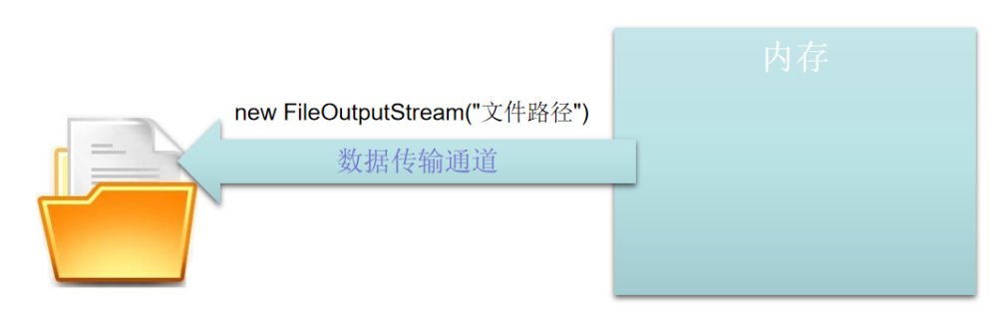

<font color="blue">示例1：使用字节流将给定的文本写入磁盘特定地址中：</font>

```java
package com.cyx.io;

import java.io.*;

public class Example1 {

    public static void main(String[] args) {
        //写入文件时必须保证该文件的父级目录一定存在，否则将报文件未找到异常
        try {
            File dir = new File("E:\\JAVA代码\\测试脏数据");
            if (!dir.exists()) dir.mkdirs();
            File file = new File(dir,"io.txt");
            //构建磁盘文件与内存之间的通道，append决定是否将输入的数据追加到末尾，否则就全部覆盖
            OutputStream os = new FileOutputStream(file,false);
            String text = "超用心学习";
            byte[] bytes = text.getBytes();
            for (Byte b: bytes){
                //每次写一个字节
                os.write(b);
            }
            os.write(bytes);    //向通道中一次性直接写完所有字节
            //使用偏移量和长度时必须保证数组下标不越界
            os.write(bytes,0,bytes.length); //偏移量和写入长度
            //在通道关闭之前使用flush，强制通道将通道中的数据写入文件中
            os.flush();
            os.close(); //关闭通道
        } catch (FileNotFoundException e) { //未找到文件异常
            e.printStackTrace();
        } catch (IOException e) {   //输入异常
            e.printStackTrace();
        }
    }
}
```

**`InputStream` 常用方法：**

```java
public abstract int read() throws IOException; //读取一个字节，如果读到末尾，则返回-1

public int read(byte b[]) throws IOException; //读取多个字节存储至给定的字节数组中，返回读取到的字节个数，如果读到末尾则返回-1
    
//读取多个字节按照给定的偏移量及长度存储在给定的字节数组中
public int read(byte b[], int off, int len) throws IOException;

public void close() throws IOException;//关闭流，也就是关闭磁盘和内存之间的通道

public int available() throws IOException;//获取通道中数据的长度
```

**文件输入流 `FileInputStream` 构造方法：**

```java
public FileInputStream(String name) throws FileNotFoundException;//根据提供的文件路径构建一条文件输入通道

public FileInputStream(File file) throws FileNotFoundException;//根据提供的文件信息构建一条文件输入通道
```

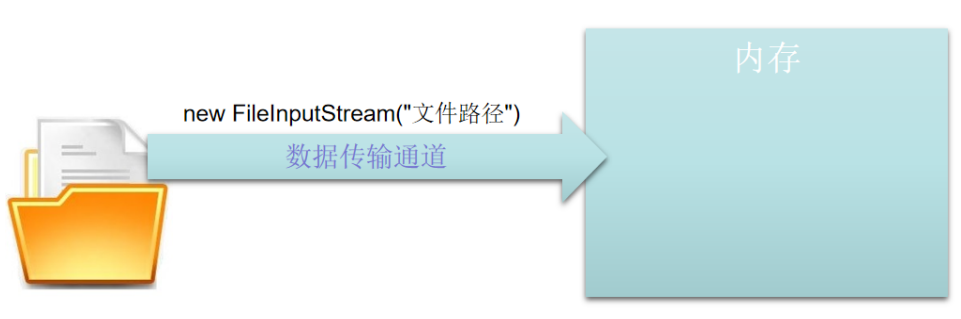

<font color="blue">示例2：使用文件输入流将文件信息从磁盘中读取到内存中来，并在控制台输出：</font>

```java
package com.cyx.io;

import java.io.*;

public class Example2 {

    public static void main(String[] args) {
        try {
            InputStream is = new FileInputStream("E:\\JAVA代码\\测试脏数据\\io.txt");
            int length = is.available();    //获取通道中的数据长度
            //根据通道中数据的长度构建数组，需要考虑到：如果通道中数据长度过长，字节数组构建太大，可能导致内存不够
            byte[] buffer = new byte[length];
//            int index = 0;
//            while (true){
//                //读取通道中的数据，一次读取一个字节，如果读到末尾，则返回-1
//                byte b = (byte) is.read();
//                if (b == -1){
//                    break;
//                }
//                buffer[index++] = b;
//            }
//            System.out.println(new String(buffer));
            int readCount = is.read(buffer);    //将通道中的所有数据全部读取到buffer数组中
            System.out.println("读取了" + readCount +"个字节");
            System.out.println(new String(buffer));
            is.close();
        } catch (FileNotFoundException e) {
            e.printStackTrace();
        } catch (IOException e) {
            e.printStackTrace();
        }
    }
}
```

<font color="blue">示例3：如果通道中数据长度过长，那么根据通道中数据的长度来构建字节数组，则可能导致内存不够，比如使 用流读取一个大小为10G的文件，那么通道中就应该存在10G长的数据，此时应该怎么办？</font>

```java
package com.cyx.io;

import java.io.FileInputStream;
import java.io.FileNotFoundException;
import java.io.IOException;
import java.io.InputStream;

public class Example3 {

    public static void main(String[] args) {
        try {
            InputStream is = new FileInputStream("E:\\JAVA代码\\测试脏数据\\io.txt");
            //实际开发过程中字节数组长度一般定义为1024的整数倍
            byte[] buffer = new byte[30];   //构建一个长度为30的字节数组
            while (true){
                //从通道中读取存入字节数组buffer中，返回值就是读取的字节长度
                int len = is.read(buffer);
                //如果读取到数据末尾，则返回
                if (len == -1) break;
                System.out.println(len);
                System.out.println(new String(buffer));
            }
            is.close();
        } catch (FileNotFoundException e) {
            e.printStackTrace();
        } catch (IOException e) {
            e.printStackTrace();
        }
    }
}
```

```java
package com.cyx.io;

import java.io.FileInputStream;
import java.io.FileNotFoundException;
import java.io.IOException;
import java.io.InputStream;

public class Example4 {

    public static void main(String[] args) {
        try {
            InputStream is = new FileInputStream("E:\\JAVA代码\\测试脏数据\\io.txt");
            byte[] buffer = new byte[1024];
            int offset = 0;
            while (true){
                int len = is.read(buffer,offset,30);
                if (len == -1) break;
                System.out.println(len);
                offset += len;
            }
            System.out.println(new String(buffer,0,offset));
            is.close();
        } catch (FileNotFoundException e) {
            e.printStackTrace();
        } catch (IOException e) {
            e.printStackTrace();
        }
    }
}
```

<font color="blue">示例4：使用字节流实现磁盘文件拷贝功能</font>

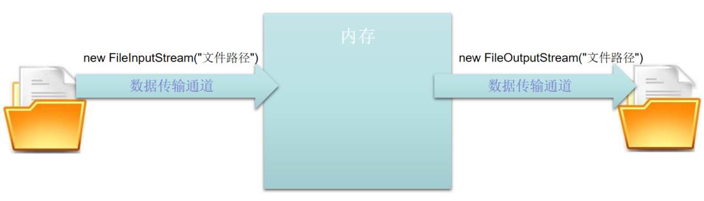

```java
package com.cyx.io;

import java.io.*;

public class Example5 {

    public static void main(String[] args) {
        String sourceFile = "E:\\JAVA代码\\测试脏数据\\io.txt";
        String destFile = "E:\\JAVA代码\\测试脏数据\\io2.txt";
        copy1(sourceFile,destFile);
    }

    public static void copy2(String sourceFile,String destFile) {
        File file = new File(destFile);
        File parent = file.getParentFile();
        if (!parent.exists()) parent.mkdirs();
        //JDK1.7版本以上可使用
        //try(){} catch(){}
        //写在括号中的代码只能够是实现的AutoCloseable接口的类，即可以自动关闭
        try(InputStream is = new FileInputStream(sourceFile);
            OutputStream os = new FileOutputStream(destFile);) {

            byte[] buffer = new byte[4096];
            while (true){
                int len = is.read(buffer);
                if (len == -1) break;
                os.write(buffer,0,len);
            }
            os.flush();

        } catch (FileNotFoundException e) {
            e.printStackTrace();
        } catch (IOException e) {
            e.printStackTrace();
        }
    }

    public static void copy1(String sourceFile,String destFile) {
        File file = new File(destFile);
        File parent = file.getParentFile();
        if (!parent.exists()) parent.mkdirs();
        InputStream is = null;
        OutputStream os = null;
        try {
            is = new FileInputStream(sourceFile);
            os = new FileOutputStream(destFile);
            byte[] buffer = new byte[4096];
            while (true){
                int len = is.read(buffer);
                if (len == -1) break;
                os.write(buffer,0,len);
            }
            os.flush();

        } catch (FileNotFoundException e) {
            e.printStackTrace();
        } catch (IOException e) {
            e.printStackTrace();
        } finally {
//            if (is != null){
//                try {
//                    is.close();
//                } catch (IOException e) {
//                }
//            }
//            if (os != null){
//                try {
//                    os.close();
//                } catch (IOException e) {
//                }
//            }
            close(is,os);
        }
    }

    //不定长自变量，本质是一个数组，在使用不定长自变量作为方法的参数时，该自变量必须为方法的最后一个参数
    public static void close(Closeable...closeables){
        for (Closeable c: closeables){
            if (c != null){
                try {
                    c.close();
                } catch (IOException e) {}
            }
        }
    }
}
```

##### 3. 字符流

<font color="blue">官方说明：</font>Java 平台使用 Unicode 约定存储字符值。字符流 I/O 会自动将此内部格式与本地字符集转换。在西方语言环境中，本地字符集通常是 ASCII 的8位超集。

所有字符流类均来自 `Reader` 和 `	Writer`。与字节流一样，也有专门用于文件 I/O 的字符流类：`FileReader` 和 `FileWriter`。

**`Writer` 常用方法：**

```java
public void write(int c) throws IOException; //写一个字符

public void write(char cbuf[]) throws IOException;//将给定的字符数组内容写入到文件中

//将给定的字符数组中给定偏移量和长度的内容写入到文件中
abstract public void write(char cbuf[], int off, int len) throws IOException;

public void write(String str) throws IOException;//将字符串写入到文件中

abstract public void flush() throws IOException;//强制将通道中的数据全部写出

abstract public void close() throws IOException;//关闭通道
```

**`FileWriter` 构造方法：**

```java
//根据提供的文件路径构建一条文件输出通道
public FileWriter(String fileName) throws IOException;	

//根据提供的文件路径构建一条文件输出通道，并根据append的值决定是将内容追加到末尾还是直接覆盖
public FileWriter(String fileName, boolean append) throws IOException;

public FileWriter(File file) throws IOException;//根据提供的文件信息构建一条文件输出通道

//根据提供的文件信息构建一条文件输出通道，并根据append的值决定是将内容追加到末尾还是直接覆盖
public FileWriter(File file, boolean append) throws IOException;
```

<font color="blue">示例1：使用字符流将给定字符串写入磁盘文件中：</font>

```java
package com.cyx.io._char;

import java.io.File;
import java.io.FileWriter;
import java.io.IOException;
import java.io.Writer;

public class Example1 {

    public static void main(String[] args) {
        File file = new File("E:\\JAVA代码\\测试脏数据\\io.txt");
        File parent = file.getParentFile();
        if (!parent.exists()) parent.mkdirs();
        //Writer类实现了AutoCloseable接口，因此可以将Writer类对象的构建方法try后面的()中
        try(Writer writer = new FileWriter(file,false);) {  //默认为false覆盖，true为追加
            String text = "信息学习";
            char[] values = text.toCharArray();
//            for (char c: values){
//                writer.write(c);    //每次写入单个字符
//            }
            writer.write(values,1,values.length-1);   //直接写入整个字符数组
//            writer.flush();   //强制通道中的数据写入文件
        } catch (IOException e) {
            e.printStackTrace();
        }

    }
}
```

**`Reader` 常用方法：**

```java
public int read() throws IOException; 	//读取一个字符

public int read(char cbuf[]) throws IOException; 	//读取字符到给定的字符数组中

//将读取的字符按照给定的偏移量和长度存储在字符数组中
abstract public int read(char cbuf[], int off, int len) throws IOException;

abstract public void close() throws IOException;	//关闭通道
```

**`FileReader` 构造方法：**

```java
//根据提供的文件路径构建一条文件输入通道
public FileReader(String fileName) throws FileNotFoundException;

//根据提供的文件信息构建一条文件输入通道
public FileReader(File file) throws FileNotFoundException;
```

<font color="blue">示例2：使用字符流将文件信息从磁盘中读取到内存中来，并在控制台输出：</font>

```java
package com.cyx.io._char;

import java.io.FileNotFoundException;
import java.io.FileReader;
import java.io.IOException;
import java.io.Reader;

public class Example2 {

    public static void main(String[] args) {
        try(Reader reader = new FileReader("E:\\JAVA代码\\测试脏数据\\io.txt");) {
//            StringBuilder builder = new StringBuilder();
//            while (true){
//                int c = reader.read();
//                if (c == -1) break;
//                builder.append((char)c);
//            }
//            System.out.println(builder);

            char[] buffer = new char[2048];
            int offset = 0;
            while (true){
                int len =  reader.read(buffer,offset,12);
                if (len == -1) break;
                offset += len;
            }
            System.out.println(new String(buffer,0,offset));
        } catch (FileNotFoundException e) {
            e.printStackTrace();
        } catch (IOException e) {
            e.printStackTrace();
        }
    }
}
```

<font color="blue">示例4：使用字符流实现磁盘文件拷贝功能：</font>

```java
package com.cyx.io._char;

import java.io.*;

public class Example3 {

    public static void main(String[] args) {
        String sourceFile = "E:\\JAVA代码\\测试脏数据\\io.txt";
        String destFile = "E:\\JAVA代码\\测试脏数据\\io3.txt";
        copyFile(sourceFile,destFile);
    }

    public static void copyFile(String sourceFile,String destFile){
        try(Reader reader = new FileReader(sourceFile);
            Writer writer = new FileWriter(destFile)) {
            char[] buffer = new char[4096];
            while (true){
                int len = reader.read(buffer);
                if (len == -1) break;
                writer.write(buffer,0,len);
            }
            writer.flush();
        } catch (FileNotFoundException e) {
            e.printStackTrace();
        } catch (IOException e) {
            e.printStackTrace();
        }
    }
}
```

##### 4. 缓冲流

<font color="blue">官方说明：</font>到目前为止，我们看到的大多数示例都使用无缓冲的 I/O。 这意味着每个读取或写入请求均由基础操作系统直接处理。由于每个这样的请求通常会触发磁盘访问，网络活动或某些其他相对昂贵的操作，因此这可能会使程序的效率大大降低。

为了减少这种开销，Java平台实现了缓冲的 I/O流。缓冲的输入流从称为缓冲区的存储区中读取数据；仅当缓冲区为空时才调用本机输入 API。同样，缓冲的输出流将数据写入缓冲区，并且仅在缓冲区已满时才调用本机输出 API。

有四种用于包装非缓冲流的缓冲流类：`BufferedInputStream` 和 `BufferedOutputStream` 创建缓冲的字节流，而 `BufferedReader` 和 `BufferedWriter` 创建缓冲的字符流。

**缓冲字节流构造方法：**

```java
//根据给定的字节输出流创建一个缓冲输出流，缓冲区大小使用默认大小
public BufferedOutputStream(OutputStream out);	

//根据给定的字节输出流创建一个缓冲输出流，并指定缓冲区大小
public BufferedOutputStream(OutputStream out, int size);

//根据给定的字节输入流创建一个缓冲输入流，缓冲区大小使用默认大小
public BufferedInputStream(InputStream in); 
    
//根据给定的字节输入流创建一个缓冲输入流，并指定缓冲区大小
public BufferedInputStream(InputStream in, int size);
```

<font color="blue">示例1：使用缓冲字节流实现磁盘文件拷贝功能</font>

```java
package com.cyx.io.buffer;

import java.io.*;
import java.nio.Buffer;

public class Example1 {

    public static void main(String[] args) {
        String sourceFile = "E:\\JAVA代码\\测试脏数据\\io.txt";
        String destFile = "E:\\JAVA代码\\测试脏数据\\io2.txt";
        copyFile(sourceFile,destFile);
    }

    public static void copyFile(String sourceFile,String destFile) {
        File file = new File(destFile);
        File parent = file.getParentFile();
        if (!parent.exists()) parent.mkdirs();

        try(InputStream is = new FileInputStream(sourceFile);
            BufferedInputStream bis = new BufferedInputStream(is);
            OutputStream os = new FileOutputStream(destFile);
            BufferedOutputStream bos = new BufferedOutputStream(os)) {
            byte[] buffer = new byte[4096];
            while (true){
                int len = bis.read(buffer);
                if (len == -1) break;
                bos.write(buffer,0,len);
            }
        } catch (FileNotFoundException e) {
            e.printStackTrace();
        } catch (IOException e) {
            e.printStackTrace();
        }
    }
}
```

**缓冲字符流构造方法：**

```java
//根据给定的字符输出流创建一个缓冲字符输出流，缓冲区大小使用默认大小
public BufferedWriter(Writer out);

//根据给定的字符输出流创建一个缓冲字符输出流，并指定缓冲区大小
public BufferedWriter(Writer out, int sz);

//根据给定的字符输入流创建一个缓冲字符输入流，缓冲区大小使用默认大小
public BufferedReader(Reader in); 

//根据给定的字符输入流创建一个缓冲字符输入流，并指定缓冲区大小
public BufferedReader(Reader in, int sz);
```

<font color="blue">示例2：使用缓冲字符流实现磁盘文件拷贝功能：</font>

```java
package com.cyx.io.buffer;

import java.io.*;

public class Example2 {

    public static void main(String[] args) {
        String sourceFile = "E:\\JAVA代码\\测试脏数据\\io.txt";
        String destFile = "E:\\JAVA代码\\测试脏数据\\io2.txt";
        copyFile(sourceFile,destFile);
    }

    public static void copyFile(String sourceFile,String destFile){
        File file = new File(sourceFile);
        File parent = file.getParentFile();
        if (!parent.exists()) parent.mkdirs();

        try (
                Reader reader = new FileReader(sourceFile);
                BufferedReader br = new BufferedReader(reader);
                Writer writer = new FileWriter(destFile);
                BufferedWriter bw = new BufferedWriter(writer)) {
            char[] buffer = new char[4096];
            while (true){
                int len = br.read(buffer);
                if (len == -1) break;
                bw.write(buffer,0,len);
            }
            bw.flush();
        } catch (FileNotFoundException e) {
            e.printStackTrace();
        } catch (IOException e) {
            e.printStackTrace();
        }
    }
}
```

<font color="blue">示例3：使用缓冲字符流的读行写行实现磁盘文件拷贝功能：</font>

```java
package com.cyx.io.buffer;

import java.io.*;

public class Example3 {

    public static void main(String[] args) {
        copyFile();
    }

    public static void copyFile(){
        String sourceFile = "E:\\JAVA代码\\测试脏数据\\io2.txt";
        String destFile = "E:\\JAVA代码\\测试脏数据\\io.txt";
        File file = new File(destFile);
        File parent = file.getParentFile();
        if (!parent.exists()) parent.mkdirs();
        try(
                Reader reader = new FileReader(sourceFile);
                BufferedReader br = new BufferedReader(reader);
                Writer writer = new FileWriter(file);
                BufferedWriter bw = new BufferedWriter(writer)) {
            while (true){
                String line = br.readLine();    //读一行
                if (line == null) break;
                bw.write(line);     //写一行
                bw.newLine();       //换行：相当于写入了一个 \r\n
            }
            bw.flush();
        } catch (FileNotFoundException e) {
            e.printStackTrace();
        } catch (IOException e) {
            e.printStackTrace();
        }
    }

    public static void readLine(){
        String path = "E:\\JAVA代码\\测试脏数据\\io2.txt";
        try(
                Reader reader = new FileReader(path);
                BufferedReader br = new BufferedReader(reader)) {
            while (true){
                String line = br.readLine();
                if (line == null) break;
                System.out.println(line);
            }
        } catch (FileNotFoundException e) {
            e.printStackTrace();
        } catch (IOException e) {
            e.printStackTrace();
        }
    }

    public static void writeLine(){
        String path = "E:\\JAVA代码\\测试脏数据\\io2.txt";
        File file = new File(path);
        File parent = file.getParentFile();
        if (!parent.exists()) parent.mkdirs();
        try(
                Writer writer = new FileWriter(path);
                BufferedWriter bw = new BufferedWriter(writer);) {
            bw.write("这是第一行");
            bw.newLine();       //写入换行符，相当于\n
            bw.write("这是第二行");
            bw.newLine();
            bw.write("这是第三行");
            bw.newLine();
            bw.write("这是第四行");
            bw.newLine();
            bw.flush();
        } catch (IOException e) {
            e.printStackTrace();
        }
    }
}
```

##### 5. 数据流

<font color="blue">官方说明：</font>数据流支持原始数据类型值以及 `String` 值的二进制 I/O。所有数据流都实现 `DataInput` 接口或`DataOutput` 接口。

注意，`DataStreams` 通过捕获 `EOFException` 来检测文件结束条件，而不是测试无效的返回值。`DataInput` 方法的所有实现都使用 `EOFException` 而不是返回值。

**`DataOutput` 接口常用方法：**

```java
void writeBoolean(boolean v) throws IOException;	//将布尔值作为1个字节写入底层输出通道

void writeByte(int v) throws IOException;	//将字节写入底层输出通道

void writeShort(int v) throws IOException;	//将短整数作为2个字节(高位在前)写入底层输出通道

void writeChar(int v) throws IOException;	//将字符作为2个字节写(高位在前)入底层输出通道

void writeInt(int v) throws IOException;	//将整数作为4个字节写(高位在前)入底层输出通道

void writeLong(long v) throws IOException;	//将长整数作为8个字节写(高位在前)入底层输出通道

//将单精度浮点数作为4个字节写(高位在前)入底层输出通道
void writeFloat(float v) throws IOException;

//将双精度浮点数作为8个字节写(高位在前)入底层输出通道
void writeDouble(double v) throws IOException;

//将UTF-8编码格式的字符串以与机器无关的方式写入底层输出通道。
void writeUTF(String s) throws IOException;
```

**`DataOutputStream` 构造方法：**

```java
public DataOutputStream(OutputStream out);	//根据给定的字节输出流创建一个二进制输出流
```

**`DataInput` 接口常用方法：**

```java
//读取一个字节，如果为0，则返回false；否则返回true。
boolean readBoolean() throws IOException;

byte readByte() throws IOException;	//读取一个字节

int readUnsignedByte() throws IOException;	//读取一个字节，返回0~255之间的整数

short readShort() throws IOException;	//读取2个字节，然后返一个短整数

int readUnsignedShort() throws IOException;	//读取2个字节，返回一个0~65535之间的整数

char readChar() throws IOException;	//读取2个字节，然后返回一个字符

int readInt() throws IOException;	//读取4个字节，然后返一个整数

long readLong() throws IOException;	//读取8个字节，然后返一个长整数

float readFloat() throws IOException;	//读取4个字节，然后返一个单精度浮点数

double readDouble() throws IOException;	//读取8个字节，然后返一个双精度浮点数

String readUTF() throws IOException;	//读取一个使用UTF-8编码格式的字符串
```

**`DataInputStream` 构造方法：**

```java
public DataInputStream(InputStream in);	//根据给定的字节输入流创建一个二进制输入流
```

<font color="blue">示例：</font>

```java
package com.cyx.io.data;

import java.io.*;

public class Example1 {

    public static void main(String[] args) {
        String path = "E:\\JAVA代码\\测试脏数据\\io2.txt";
        writeData(path);
        readData(path);
    }

    public static void writeData(String path){
        File file = new File(path);
        File parent = file.getParentFile();
        if (!parent.exists()) parent.mkdirs();
        try(
                OutputStream os = new FileOutputStream(file);
                DataOutputStream dos = new DataOutputStream(os)) {
            dos.writeByte(-1);
            dos.writeChar('a');
            dos.writeShort(-2);
            dos.writeInt(3);
            dos.writeLong(100);
            dos.writeFloat(1.0f);
            dos.writeDouble(0.2);
            dos.writeBoolean(true);
            dos.writeUTF("这是UTF-8编码格式");
            dos.flush();
        } catch (FileNotFoundException e) {
            e.printStackTrace();
        } catch (IOException e) {
            e.printStackTrace();
        }
    }

    public static void readData(String path){
        File file = new File(path);
        File parent = file.getParentFile();
        if (!parent.exists()) parent.mkdirs();
        try(
                InputStream is = new FileInputStream(path);
                DataInputStream dis = new DataInputStream(is)) {
            byte b = dis.readByte();
            System.out.println("读取字节" + b);
            char c = dis.readChar();
            System.out.println("读取字符型" + c);
            short s = dis.readShort();
            System.out.println("读取短整型" + s);
            int i = dis.readInt();
            System.out.println("读取整形" + i);
            long l = dis.readLong();
            System.out.println("读取长整形" + l);
            float f = dis.readFloat();
            System.out.println("读取单精度浮点数" + f);
            double d = dis.readDouble();
            System.out.println("读取双精度浮点数" + d);
            boolean bl = dis.readBoolean();
            System.out.println("读取布尔类型" + bl);
            String str = dis.readUTF();
            System.out.println("读取UTF-8编码" + str);
        } catch (FileNotFoundException e) {
            e.printStackTrace();
        } catch (IOException e) {
            e.printStackTrace();
        }
    }
}
```

##### 6. 对象流

<font color="blue">官方说明：</font>正如二进制数据流支持原始数据类型的 I/O 一样，对象流也支持对象的 I/O。大多数（但不是全部）标准类支持其对象的序列化。那些类实现了序列化标记接口 `Serializable` 才能够序列化。

<font color="red">**将一个对象从内存中写入磁盘文件中的过程称之为序列化。序列化必须要求该对象所有类型实现序列化的接口 `Serializable`。**</font>

<font color="red">**将磁盘中存储的对象信息读入内存中的过程称之为反序列化，需要注意的是，反序列化必须保证与序列化时使用的 JDK 版本一致**</font>

**`ObjectOutput` 接口常用方法：**

```java
public void writeObject(Object obj) throws IOException;	//将对象写入底层输出通道
```

**`ObjectOutputStream` 构造方法：**

```java
//根据给定的字节输出流创建一个对象输出流
public ObjectOutputStream(OutputStream out) throws IOException;
```

**`ObjectInput` 接口常用方法：**

```java
public Object readObject() throws ClassNotFoundException, IOException;	//读取一个对象
```

**`ObjectInputStream` 构造方法：**

```java
//根据给定的字节输入流创建一个对象输入流
public ObjectInputStream(InputStream in) throws IOException;
```

<font color="blue">示例1：</font>

```java
package com.cyx.io.object;

import java.io.Serializable;

public class Student implements Serializable {

    private String name;

    private int age;

    public Student(String name, int age) {
        this.name = name;
        this.age = age;
    }

    @Override
    public String toString() {
        return "Student{" +
                "name='" + name + '\'' +
                ", age=" + age +
                '}';
    }
}
```

```java
package com.cyx.io.object;

import java.io.*;

public class Example1 {

    public static void main(String[] args) {
        String path = "E:\\JAVA代码\\测试脏数据\\stu.obj";
        writeObject(path);
        readObject(path);
    }

    public static void writeObject(String path){
        File file = new File(path);
        File parent = file.getParentFile();
        if (!parent.exists()) parent.mkdirs();
        try(
                OutputStream os = new FileOutputStream(file);
                ObjectOutputStream oos = new ObjectOutputStream(os)) {
            oos.writeObject(new Student("张三",20));
            oos.flush();
        } catch (IOException e) {
            e.printStackTrace();
        }
    }

    public static void readObject(String path){
        File file = new File(path);
        File parent = file.getParentFile();
        if (!parent.exists()) parent.mkdirs();
        try(
                InputStream is = new FileInputStream(path);
                ObjectInputStream ois = new ObjectInputStream(is)) {
            Student s = (Student) ois.readObject();
            System.out.println(s);
        } catch (FileNotFoundException e) {
            e.printStackTrace();
        } catch (IOException e) {
            e.printStackTrace();
        } catch (ClassNotFoundException e) {
            e.printStackTrace();
        }
    }
}
```

<font color="blue">示例2：读写操作中将字节流转换成字符流：</font>

```java
package com.cyx.io.object;

import java.io.*;

public class IOConverter {

    public static void main(String[] args) {
        read();
        write();
    }

    public static void write(){
        try(
                OutputStream os = new FileOutputStream("E:\\JAVA代码\\测试脏数据\\io2.txt");
                OutputStreamWriter osw = new OutputStreamWriter(os);
                BufferedWriter bw = new BufferedWriter(osw)) {
            String[] lines = {
                    "这是第一行",
                    "这是第二行",
            };
            for (String line: lines){
                bw.write(line);
                bw.newLine();
            }
            bw.flush();
        } catch (FileNotFoundException e) {
            e.printStackTrace();
        } catch (IOException e) {
            e.printStackTrace();
        }
    }

    public static void read(){
        try(
                InputStream is = new FileInputStream("E:\\JAVA代码\\测试脏数据\\io2.txt");
                InputStreamReader isr = new InputStreamReader(is);
                BufferedReader reader = new BufferedReader(isr);) {
            while (true){
                String line = reader.readLine();
                if (line == null) break;
                System.out.println(line);
            }
        } catch (FileNotFoundException e) {
            e.printStackTrace();
        } catch (IOException e) {
            e.printStackTrace();
        }
    }
}
```

### 五、嵌套类

#### （1）嵌套类

##### 1. 嵌套类的概念

<font color="blue">官方说明：</font>Java 编程语言允许你在一个类中定义一个类。这样的类称为嵌套类。

嵌套类的分类：静态和非静态。声明为静态的嵌套类称为静态嵌套类。非静态嵌套类称为内部类。

嵌套类是其外部类的成员。非静态嵌套类（内部类）可以访问外部类的其他成员，即使它们被声明为私有的也可以访问。静态嵌套类无权访问外部类的其他成员。作为 `OuterClass` 的成员，可以将嵌套类声明为私有，公共，受保护或包私有。（外部类只能声明为公共或包私有）

当一个事物内部还有其他事物时，使用内部类来描述就显得更加合理。比如计算机包含显卡、主板、 CPU等，此时就可以使用内部类来描述计算机。

嵌套类语法：

```java
public class 外部类名 {
	
	class 内部类名{
	
	}
	
	访问修饰符 static class 静态嵌套类名{	//静态内部类的访问修饰符可以随便用，外部类只能是public
	
	}
}
```

静态嵌套类构建对象语法：

```java
new 外部类类名.内部类内名();
```

##### 2. 静态嵌套类

<font color="blue">官方说明：</font>与类方法和变量一样，静态嵌套类与其外部类相关联。与静态类方法一样，静态嵌套类不能直接引用其 外部类中定义的实例变量或方法，它只能通过对象引用来使用它们。

静态嵌套类与它的外部类（和其他类）的实例成员进行交互，就像其他任何顶级类一样。实际上，静态嵌套类在行为上是顶级类，为了包装方便，该顶级类已嵌套在另一个顶级类中。

<font color="blue">示例：使用静态内部类实现学生管理员对学生按年龄进行排序展示的功能。</font>

```java
package com.cyx.inner.clazz;

public class Student {

    private String name;

    private int age;

    public Student(String name, int age) {
        this.name = name;
        this.age = age;
    }

    public int getAge() {
        return age;
    }

    @Override
    public String toString() {
        return "Student{" +
                "name='" + name + '\'' +
                ", age=" + age +
                '}';
    }
}
```

```java
package com.cyx.inner.clazz;

import java.util.Arrays;

public class StudentManager {

    private Student[] stus = {};

    public void addStudent(Student stu){
        stus = Arrays.copyOf(stus,stus.length + 1);
        stus[stus.length-1] = stu;
    }

    public void showStudent(StudentSorter sorter){
        sorter.sort(stus);
        for (Student stu: stus){
            System.out.println(stu);
        }
    }

    static class StudentSorter{ //静态嵌套类

        private int order;  //排序标志：0表示降序，1表示升序

        public StudentSorter(){
            this(0);
        }

        public StudentSorter(int order) {
            this.order = order;
        }

        public void sort(Student[] stus){
            for(int i=0; i<stus.length; i++){
                for(int j=0; j<stus.length - i - 1; j++){
                    int age1 = stus[j].getAge();
                    int age2 = stus[j+1].getAge();
                    if((order == 0 && age1 < age2) || (order == 1 && age1 > age2)){
                        Student temp = stus[j];
                        stus[j] = stus[j+1];
                        stus[j+1] = temp;
                    }
                }
            }
        }
    }
}
```

```java
package com.cyx.inner.clazz;

public class StudentTest {

    public static void main(String[] args) {
        StudentManager manager = new StudentManager();
        manager.addStudent(new Student("张三",20));
        manager.addStudent(new Student("李四",19));
        manager.addStudent(new Student("王五",21));
        manager.addStudent(new Student("李华",23));
        manager.addStudent(new Student("小明",18));
        //静态嵌套类构建对象语法：new 外部类类名.内部类内名()
        manager.showStudent(new StudentManager.StudentSorter(1));
    }
}
```

##### 3. 内部类

<font color="blue">官方说明：</font>与实例方法和变量一样，内部类与其所在类的实例相关联，并且可以直接访问该对象的方法和字段。 另外，由于内部类与实例相关联，因此它本身不能定义任何静态成员。

内部类对象创建语法：

```java
外部类类名.内部类类名 对象名 = new 外部类类名().new 内部类类名();
```

<font color="blue">示例：使用内部类描述一辆汽车拥有一台发动机。</font>

```java
package com.cyx.inner.clazz.inner;

public class Car {  //汽车

    private double price;

    private String brand;

    private Engine engine;  //汽车拥有的发动机

    public Car(double price, String brand) {
        this.brand = brand;
        this.engine = new Engine("国产发动机",20000);
        this.price = price + engine.price;
    }

    public Car(Engine engine, String brand, double price){
        this.engine = engine;
        this.brand = brand;
        this.price = price + this.engine.price;
    }

    public void show(){
        this.engine.show();
    }

    class Engine {  //发动机

        private String type;

        private double price;

        public Engine(String type, double price) {
            this.type = type;
            this.price = price;
        }

        public void show(){
            System.out.println(brand + "汽车使用的是" + type + "发动机，价格为" + price);
            //如果内部类中存在与外部类同名的成员变量时，想要使用外部类的同名成员变量，需要加上外部类名.this.变量名
            System.out.println("汽车总价为" + Car.this.price);   //当前发动机所在汽车的价格
        }
    }
}
```

```java
package com.cyx.inner.clazz.inner;

public class CarTest {

    public static void main(String[] args) {
        Car c = new Car(100000,"奥拓");
        c.show();

        Car.Engine engine = new Car(110000,"奥拓").new Engine("进口发动机",50000);
        Car c1 = new Car(engine,"奔驰",150000);
        c1.show();

        Car.Engine engine1 = c.new Engine("进口",70000);
        Car c2 = new Car(engine1,"奥迪",800000);
        c2.show();
    }
}
```

##### 4. 局部内部类

<font color="blue">官方说明：</font>局部类是在一个块中定义的类，该块是一组在平衡括号之间的零个或多个语句。通常，你会在方法的主体中找到定义的局部类。

<font color="blue">示例：使用局部内部类描述使用计算器计算两个数的和。</font>

```java
package com.cyx.inner.clazz.local;

public class LocalClass {

    public static void main(String[] args) {
        System.out.println(calculate(2,3));
    }

    public static int calculate(int a,int b){
        //在方法内部的类为局部类
        class Calculator{
            private int num1,num2;

            public Calculator(int num1, int num2) {
                this.num1 = num1;
                this.num2 = num2;
            }

            public int calculate(){
                return num1 + num2;
            }
        }
        Calculator c = new Calculator(a,b);
        return c.calculate();
    }
}
```

##### 5. 匿名内部类

<font color="blue">官方说明：</font>匿名类可以使你的代码更简洁。它们使你在声明一个类的同时实例化它。除了没有名称外，它们类似于局部类。如果只需要使用一次局部类，则使用它们。

匿名类表达式的语法类似于构造方法的调用，不同之处在于代码块中包含类定义。

<font color="blue">示例：</font>

```java
package com.cyx.inner.clazz.anonymous;

public interface Calculate {

    int calculate(int a,int b);
}
```

```java
package com.cyx.inner.clazz.anonymous;

public abstract class Animal {

    public abstract void eat();
}
```

```java
package com.cyx.inner.clazz.anonymous;

public class Student {

    protected String name;

    protected int age;

    public Student(String name, int age) {
        this.name = name;
        this.age = age;
    }

    public void show(){
        System.out.println(name + age);
    }
}
```

```java
package com.cyx.inner.clazz.anonymous;

public class AnonymousClass {

    public static void main(String[] args) {
        System.out.println(calculate(3,4));

        Animal a = new Animal() {
            @Override
            public void eat() {
                System.out.println("老虎吃肉");
            }
        };
        a.eat();

        Student stu = new Student("好奇怪",20){
            @Override
            public void show() {
                System.out.println(age);
            }
        };
        stu.show();
    }

    public static int calculate(int a,int b){
        //有具体的类名，属于局部内部类
//        class Calculator implements Calculate{
//            @Override
//            public int calculate(int a,int b){
//                return a + b;
//            }
//        }
//        Calculate calculator = new Calculator();
        //匿名内部类也是局部内部类
//        Calculate calculate = new Calculate() {
//            @Override
//            public int calculate(int a, int b) {
//                return a + b;
//            }
//        };

        //匿名内部类跟构造方法的调用很相似，不同的地方在于匿名内部类里面还有类的主体
        Calculate c = new Calculate() {
            @Override
            public int calculate(int a, int b) {
                return a + b;
            }
        };
        return c.calculate(a,b);
    }
}
```

#### （2）Lambda 表达式

##### 1. 作用及语法

<font color="blue">官方说明：</font>匿名类的一个问题是，如果匿名类的实现非常简单，比如仅包含一个方法的接口，则匿名类的语法可能看起来笨拙且不清楚。在这些情况下，你通常试图将功能作为参数传递给另一种方法，例如，当某人单击按钮时应采取什么措施。Lambda 表达式使你能够执行此操作，将功能视为方法参数，或将代码视为数据。

Lambda 表达式语法：

```java
(参数类型1 变量名1,参数类型2 变量名2,...参数类型n 变量名n) -> {
	//代码块
	[return 返回值;]
};
```

<font color="red">**只有一个接口方法的接口称之为函数式接口 （Functional Interface）。Lambda表达式只能使用在函数式接口上。**</font>

<font color="blue">示例1：</font>

```java
package com.cyx.inner.clazz.lambda;

public interface Actor {

    void performance(); //表演节目
}
```

```java
package com.cyx.inner.clazz.lambda;

public class ActorTest {

    public static void main(String[] args) {
//        Actor actor = new Actor() {
//            @Override
//            public void performance() {
//                System.out.println("演员表演节目");
//            }
//        };
        //Lambda表达式，也是对接口的一种实现
        Actor actor = () -> {
            System.out.println("演员表演");
        };
        actor.performance();
    }
}
```

从上面注释的代码中可以看出：匿名内部类只是对 `Actor` 接口的实现，重点是强调其有表演节目的行为。如果能够直接将表演节目的行为赋值给 `actor` 对象的引用，使得 `actor` 对象的引用在调用接口方法时直接执行该行为，那么将大大节省代码的编写量。而Lambda表达式就能够实现这样的功能。

<font color="blue">示例2：定义一个接口计算两个数的和。并在测试类中使用Lambda表达式完成测试</font>

```java
package com.cyx.inner.clazz.lambda;

public interface Calculate {

    int sum(int a,int b);
}
```

```java
package com.cyx.inner.clazz.lambda;

public class CalculateTest {

    public static void main(String[] args) {
        Calculate c = (int a,int b) -> {
            return a + b;
        };
        int result = c.sum(2,3);
        System.out.println(result);
    }
}
```

##### 2. Lambda 表达式省略规则

1. `()` 中的所有参数类型可以省略；
2. 如果 `()` 中有且仅有一个参数，那么 `()` 可以省略；
3. 如果 `{}` 中有且仅有一条语句，那么 `{}` 可以省略，这条语句后的分号也可以省略。如果这条语句是 `return` 语句，那么 `return` 关键字也可以省略。

<font color="blue">示例1：编写一个接口，打印系统当前时间。并在测试类中使用Lambda表达式完成测试</font>

```java
package com.cyx.inner.clazz.lambda;

public interface PrintTime {
    void PrintTime();
}
```

```java
package com.cyx.inner.clazz.lambda;

public class PrintTimeTest {

    public static void main(String[] args) {

        PrintTime p = () -> System.out.println(System.currentTimeMillis());
        p.PrintTime();

    }
}
```

<font color="blue">示例2：编写一个接口，获取一个指定范围内的随机数。并在测试类中使用Lambda表达式完成测试</font>

```java
package com.cyx.inner.clazz.lambda;

public interface RandomNumber {
    
    int getRandomNumber(int start, int end);
}
```

```java
package com.cyx.inner.clazz.lambda;

import java.io.Reader;
import java.util.Random;

public class RandomNumberTest {

    public static void main(String[] args) {
        RandomNumber r = (start, end) -> (int)(Math.random() * (end - start)) + start;
        System.out.println(r.getRandomNumber(1,50));

        Random random = new Random();
        int result = random.nextInt(49) + 1;
        System.out.println(result);

        RandomNumber r1 = (start, end) -> new Random().nextInt(end - start) + start;
        System.out.println(r1.getRandomNumber(1,50));
    }
}
```

### 六、集合与泛型

#### （1）集合框架

##### 1. 集合与集合框架

<font color="blue">官方说明：</font>集合（有时称为容器）只是一个将多个元素分组为一个单元的对象。集合用于存储，检索，操作和传达聚合数据。

集合框架是用于表示和操作集合的统一体系结构。

<font color="blue">示例：数组就是一种集合，用数组实现增删改查</font>

```java
package com.cyx.collection;

import java.util.Arrays;

public class ArrayUtil {

    //使用数组存储数据，因为不知道存储什么数据，所以用Object
    //支持所有数据类型
    private Object[] elements;

    private int size;   //数组中存储的元素个数

    public ArrayUtil() {
        this(16);
    }

    public ArrayUtil(int capacity) {
        elements = new Object[capacity];
    }

    public int size(){
        return size;
    }

    public void add(Object o){
        if (size == elements.length){   //数组中存储满了，需要扩容才能存储新元素
            int length = elements.length + elements.length >> 1;
            elements = Arrays.copyOf(elements,length);
        }
        elements[size++] = o;
    }

    public void delete(Object o){
        if (o == null) return;
        int index = -1; //要删除的元素的下标
        for (int i = 0; i < size; i++){
            if (o.equals(elements[i])){
                index = i;
                break;
            }
        }
        System.arraycopy(elements,index + 1,elements,index,size - index - 1);
        size--;
    }

    public void update(int index, Object o){
        if (index < 0 || index >= size){
            throw new ArrayIndexOutOfBoundsException("下标越界");
        }
        elements[index] = o;
    }

    public Object get(int index){
        if (index < 0 || index >= size){
            throw new ArrayIndexOutOfBoundsException("下标越界");
        }
        return elements[index];
    }

    public void write(){
        for (int i = 0; i < size; i++){
            System.out.println(elements[i]);
        }
    }
}
```

```java
package com.cyx.collection;

public class ArrayUtilTest {

    public static void main(String[] args) {
        ArrayUtil util = new ArrayUtil();
        util.add(1);
        util.add(2);
        util.add(3);
        util.add(4);
        util.add(5);
        util.write();
        System.out.println("=========================");
        util.update(1,10);
        util.write();
        System.out.println("=========================");
        util.delete(4);
        util.write();
    }
}
```

使用数组对元素进行增删改查时，需要我们自己编码实现。而集合是 Java 平台提供的，也能进行增删改查，已经有了具体的实现。我们不需要再去实现，直接使用 Java 平台提供的集合即可，这无疑减少了编程的工作量。同时 Java 平台提供的集合无论是在数据结构还是算法设计上都具有更优的性能。

##### 2. 集合框架接口体系

集合接口体系中有两个顶层接口 `Collection` 和 `Map` ，`Collection` 接口属于单列集合（一次存储一个元素），`Map` 接口属于双列集合（一次存入两个相关联的元素）。

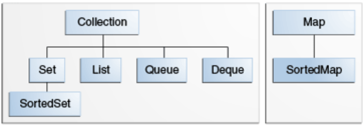

#### （2）`Collection` 接口

##### 1. `Collection` 接口常用方法

```java
int size(); //获取集合的大小

boolean isEmpty();	//判断集合是否存有元素

boolean contains(Object o);	//判断集合中是否包含给定的元素

Iterator<E> iterator();	//获取集合的迭代器

Object[] toArray();	//将集合转换为对象数组

<T> T[] toArray(T[] a);	//将集合转换为给定类型的数组并将该数组返回

boolean add(E e);	//向集合中添加元素

boolean remove(Object o);	//从集合中移除给定的元素

void clear();	//清除集合中的元素

boolean containsAll(Collection<?> c);	//判断集合中是否包含给定的集合中的所有元素

boolean addAll(Collection<? extends E> c);	//将给定的集合的所有元素添加到集合中
```

##### 2. `AbstractCollection` 类

`AbstractCollection` 类实现了 `Collection` 接口，属于单列集合的顶层抽象类。

`AbstractCollection` 类并没有定义存储元素的容器，因此，其核心的方法都是空实现。这些空实现的方法都交给其子类来实现。

#### （3）`Iterator` 迭代器

##### 1. 迭代器

<font color="blue">一位顾客在超市买了许多商品，当他提着购物篮去结算时，收银员并没有数商品有多少件，只需要看购物篮中还有没有下一个商品，有就取出来结算，直到购物篮中没有商品为止。收银员的操作就是一个迭代过程，购物篮就相当于一个迭代器。</font>

集合是用来存储元素的，存储元素的目的是为了对元素进行操作，最常用的操作就是检索元素。为了满足这种需要， `JDK` 提供了一个 `Iterable` 接口（表示可迭代的），供所有单列集合来实现。

```java
public interface Collection<E> extends Iterable<E>
```

可以看出， Collection 接口是 `Iterable` 接口的子接口，表示所有的单列集合都是可迭代的。

`Iterable` 接口中有一个约定：

```java
Iterator<T> iterator();	//获取集合的迭代器
```

因此所有单列集合必须提供一个迭代元素的迭代器。而迭代器 `Iterator` 也是一个接口。其中约定如 下：

```java
boolean hasNext();	//判断迭代器中是否有下一个元素

E next();	//获取迭代器中的下一个元素

default void remove();	//将元素从迭代器中移除，默认是空实现
```

##### 2. 自定义 `Collection` 集合

<font color="blue">示例：</font>

```java
package com.cyx.collection;

import java.util.AbstractCollection;
import java.util.Arrays;
import java.util.Iterator;

public class MyCollection extends AbstractCollection {

    private Object[] elements;

    private int size;

    public MyCollection(){
        this(16);
    }

    public MyCollection(int capacity){
        elements = new Object[capacity];
    }

    @Override
    public boolean add(Object o) {
        if (size == elements.length){   //数组中存储满了，需要扩容才能存储新元素
            int length = elements.length + elements.length >> 1;
            elements = Arrays.copyOf(elements,length);
        }
        elements[size++] = o;
        return true;
    }

    @Override
    public Iterator iterator() {
        return new CollectionIterator();
    }

    @Override
    public int size() {
        return size;
    }

    class CollectionIterator implements Iterator{

        private int cursor; //下标

        @Override
        public boolean hasNext() {
            //下标未到达最大值，说明还有下一个元素
            return cursor < size;
        }

        @Override
        public Object next() {
            if (cursor >= size || cursor < 0){
                throw new ArrayIndexOutOfBoundsException("下标越界了");
            }
            return elements[cursor++];
        }

        /**
         * 移除元素
         */
        @Override
        public void remove() {
            if (cursor >= size || cursor < 0){
                throw new ArrayIndexOutOfBoundsException("下标越界了");
            }
            System.arraycopy(elements, cursor, elements, cursor - 1, size - cursor);
            if (cursor == size) {   //表示移除的是最后一个元素
                cursor--;
            }
            size--;
        }
    }
}
```

```java
package com.cyx.collection;

import java.util.Iterator;

public class MyCollectionTest {

    public static void main(String[] args) {
        MyCollection collection = new MyCollection();
        collection.add("a");
        collection.add("b");
        collection.add("c");
        collection.add("d");
        collection.add("e");
        collection.add("f");
        System.out.println("集合大小："+collection.size());
        //遍历方式1：
        Iterator iterator = collection.iterator();
        while (iterator.hasNext()){
            String s = (String) iterator.next();
            System.out.println(s);
        }
        System.out.println("==========================");
        collection.remove("c");
        System.out.println("集合大小："+collection.size());
        //遍历方式2：
        for (Object o: collection){
            System.out.println(o);
        }
        boolean exist = collection.contains("c");
        System.out.println(exist);

        MyCollection c = new MyCollection();
        c.add(5);
        c.add(4);
        c.add(3);
        c.add(2);
        c.add(1);
        //遍历方式3：
        for (Iterator iter = c.iterator(); iter.hasNext();){
            Integer i =(Integer) iter.next();
            System.out.println(i);
        }
    }
}
```

如果在上述案例中加入以下代码：

```java
MyCollection c1 = new MyCollection();
c1.add(5);
c1.add(4.0);
c1.add("3");
c1.add(2.0f);
c1.add(new Object());
for (Iterator iter = c1.iterator(); iter.hasNext();){
    Integer i =(Integer) iter.next();
    System.out.println(i);
}
```

则会抛出异常：<font color="red">Exception in thread "main" java.lang.ClassCastException: java.lang.Double cannot be cast to java.lang.Integer
at com.cyx.collection.MyCollectionTest.main(MyCollectionTest.java:51) </font>

如果集合中只能存储同一种数据，那么这种强制类型转换的异常将得到解决。

#### （4）泛型

<font color="blue">官方说明：</font>简言之，泛型在定义类，接口和方法时使类型（类和接口）成为参数。与方法声明中使用的更熟悉的形式参数非常相似，类型参数为你提供了一种使用不同输入重复使用相同代码的方法。区别在于形式参数的输入是值，而类型参数的输入是类型。

<font color="red">**泛型就是一个变量，只是该变量只能使用引用数据类型来赋值，这样能够使同样的代码被不同数据类型的数据重用。**</font>

通常使用的泛型变量：E T K V

##### 1. 泛型的各种语法

**包含泛型的类定义语法：**

```java
访问修饰符 class 类名<泛型变量> {

}
```

**包含泛型的接口定义语法：**

```java
访问修饰符 interface 接口名<泛型变量>{

}
```

**方法中使用新的泛型语法：**

```java
访问修饰符 泛型变量 返回值类型 方法名(泛型变量 变量名,数据类型1, 变量名1,...,数据类型n,变量名n){

}
```

<font color="blue">示例：</font>

```java
package com.cyx.collection;

import java.util.AbstractCollection;
import java.util.Arrays;
import java.util.Iterator;

//定义泛型变量T，在使用该类创建对象的时候，就需要使用具体的数据类型来替换泛型变量
public class MyCollection<T> extends AbstractCollection<T> {

    private Object[] elements;

    private int size;

    public MyCollection(){
        this(16);
    }

    public MyCollection(int capacity){
        elements = new Object[capacity];
    }

    @Override
    public boolean add(T o) {
        if (size == elements.length){   //数组中存储满了，需要扩容才能存储新元素
            int length = elements.length + elements.length >> 1;
            elements = Arrays.copyOf(elements,length);
        }
        elements[size++] = o;
        return true;
    }

    @Override
    //定义包含泛型的接口
    public Iterator<T> iterator() {
        return new CollectionIterator();
    }

    @Override
    public int size() {
        return size;
    }

    class CollectionIterator implements Iterator<T>{

        private int cursor; //下标

        @Override
        public boolean hasNext() {
            //下标未到达最大值，说明还有下一个元素
            return cursor < size;
        }

        @Override
        public T next() {
            if (cursor >= size || cursor < 0){
                throw new ArrayIndexOutOfBoundsException("下标越界了");
            }
            return (T) elements[cursor++];
        }

        /**
         * 移除元素
         */
        @Override
        public void remove() {
            if (cursor >= size || cursor < 0){
                throw new ArrayIndexOutOfBoundsException("下标越界了");
            }
            System.arraycopy(elements, cursor, elements, cursor - 1, size - cursor);
            if (cursor == size) {   //表示移除的是最后一个元素
                cursor--;
            }
            size--;
        }
    }
}
```

```java
package com.cyx.collection;

import java.util.Iterator;

public class MyCollectionTest {

    public static void main(String[] args) {       
        //使用已规定的泛型变量
        //在JDK7及以上版本，在创建对象时如果类型带有泛型，则可以对象不写具体泛型
        MyCollection<String> c2 = new MyCollection<>();
        c2.add("admin");
        c2.add("user");
        for (Iterator<String> iter = c2.iterator(); iter.hasNext();){
            String s = iter.next();
            System.out.println(s);
        }

        //当创建对象没有使用泛型时，默认为Object类型
        MyCollection c1 = new MyCollection();
        c1.add(5);
        c1.add(4.0);
        c1.add("3");
        c1.add(2.0f);
        c1.add(new Object());
        for (Iterator iter = c1.iterator(); iter.hasNext();){
            Object i = iter.next();
            System.out.println(i);
        }
    }
}
```

##### 2. 泛型通配符

当使用泛型类或者接口时，如果泛型类型不能确定，可以通过通配符 `?` 表示。例如 `Collection` 接口中的约定：

```java
boolean containsAll(Collection<?> c);	//判断集合是否包含给定集合中的所有元素
```

<font color="red">**泛型使用通配符的集合不能存储数据，只能读取数据。**</font>

<font color="blue">示例：接上述类</font>

```java
package com.cyx.collection;

public class MyCollectionTest {

    public static void main(String[] args) {
        MyCollection<String> c = new MyCollection<>();
        c.add("a");
        c.add("b");
        c.add("c");
        c.add("d");
        c.add("e");

        MyCollection<String> c1 = new MyCollection<>();
        c1.add("b");
        c1.add("c");
        c1.add("d");

        boolean contains1 = c.containsAll(c1);
        System.out.println(contains1);

        MyCollection<Integer> c2 = new MyCollection<>();
        c2.add(1);
        c2.add(2);
        c2.add(3);
        boolean contains2 = c.containsAll(c2);
        System.out.println(contains2);

        //泛型使用通配符的集合不能存储数据，只能读取数据
        MyCollection<?> c3 = new MyCollection<>();
//        c3.add();
        
    }
}
```

##### 3. 泛型上限

在使用泛型时，可以设置泛型的上限，表示只能接受该类型或其子类。当集合使用泛型上限时，因为编译器只知道存储类型的上限，但不知道具体存的是什么类型，因此，该集合不能存储元素，只能读取元素。

**语法：**

```java
<? extends 数据类型>
```

<font color="blue">示例：接上述类</font>

```java
package com.cyx.collection;

public class GenericUpperLimit {

    public static void main(String[] args) {
        //定义泛型上限为Number的集合
        MyCollection<? extends Number> c = new MyCollection<>();
        //添加元素时，使用的是占位符对泛型变量替换，当传入参数时，无法确定该参数如何匹配
        //因此不能存储数据，只能读取
//        c.add(1);
    }
}
```

##### 4. 泛型下限

在使用泛型时，可以设置泛型的下限，表示只能接受该类型及其子类或该类型的父类。当集合使用泛型下限时，因为编译器知道存储类型的下限，至少可以将该类型对象存入，但不知道有存储的数据有多少种父类，因此，该集合只能存储元素，不能读取元素。

**语法：**

```java
<? super 数据类型>
```

<font color="blue">示例：接上述类</font>

```java
package com.cyx.collection;

public class GenericLowerLimit {

    public static void main(String[] args) {
        //集合中可存储的数据可以是Number的子类，父类或Number类
        MyCollection<? super Number> c = new MyCollection<>();
        //虽然存储元素的类型可以是Number的父类，但是由于父类类型无法确定具体多少种，
        //因此在使用添加功能时，编译器会报错
//        c.add(new Object());
        //但可以存储Number类
        c.add(1);
        c.add(2.0);
    }
}
```

#### （5）`List` 列表

<font color="blue">官方说明：</font>列表是有序的集合（有时称为序列）。列表可能包含重复的元素。

`List` 集合类中元素可重复，且可乱序，每个元素都有其对应的顺序索引，下标从0开始。

##### 1. `List` 常用方法

```java
E get(int index); 	//获取给定位置的元素

E set(int index, E element);	//修改给定位置的元素

void add(int index, E element);	//在给定位置插入一个元素

E remove(int index);	//移除给定位置的元素

void removeLast();	//移除最后一个元素

int indexOf(Object o);	//获取给定元素第一次出现的下标

int lastIndexOf(Object o);	//获取给定元素最后一次出现的下标

ListIterator<E> listIterator();	//获取List集合专有的迭代器

//获取List集合专有的迭代器，从给定的下标位置开始的迭代器
ListIterator<E> listIterator(int index);
    
List<E> subList(int fromIndex, int toIndex);	//获取List集合的一个子集合（左闭右开）
```

##### 2. `ArrayList` 可变数组与 `vector` 容器

`ArrayList` 类继承于 `AbstractList`，`AbstractList` 继承于 `AbstractColletion`。

`vector` 集合类继承了 `AbstractList` 类，其底层也是一个对象数组。`vector` 是线程同步的，即线程安全，其操作方法带有 `Synchronized`。

通常情况下，`ArrayList` 接口和 `vector` 容器相同，但 `ArrayList` 具有线程不安全性，执行效率更高，多线程情况下通常不使用 `ArrayList` 。

**常用方法：**

```java
ensureCapacityInternal(int minCapacity); //确保数组有足够的容量来存储新添加的数据。

//实现数组扩容，ArrayList扩容至原来的1.5倍，vector扩容至原来的2倍。
void grow(int minCapacity); 
```

`ListItr` 可以从前到后对集合进行遍历，也可以从后往前对集合进行遍历,还可以向集合中添加元素， 修改元素。而 `Itr` 只能从前到后对集合进行遍历。

<font color="red">**`ArrayList` 底层采用的是数组来存储元素，根据数组的特性，`ArrayList` 在随机访问时效率极高，在增加和删除元素时效率偏低，因为在增加和删除元素时会涉及到数组中元素位置的移动。**</font>

<font color="blue">示例：</font>

```java
package com.cyx.list;

import java.util.ArrayList;
import java.util.Iterator;
import java.util.List;
import java.util.ListIterator;

public class ArrayListTest {

    public static void main(String[] args) {
        //元素有序是指存储数据与遍历数据的顺序一致
        ArrayList<String> list = new ArrayList<>();
        list.add("a");
        list.add("a");
        list.add("b");
        list.add("c");
        list.add("d");
        list.add(2, "n");
        //a a b c d -> a a b b c d -> a a n b c d
        String old = list.set(1, "g");
        System.out.println(old);
        System.out.println("=============================");
        for (String str: list){
            System.out.println(str);
        }
        System.out.println("============================");

        Iterator<String> iter = list.iterator();
        while (iter.hasNext()){
            String s = iter.next();
            System.out.println(s);
        }
        System.out.println("===========================");
        ListIterator<String> listIterator = list.listIterator();
        while (listIterator.hasNext()){
            String s = listIterator.next();
            System.out.println(s);
        }
        System.out.println("===========================");

        //倒序遍历
        System.out.println("倒序遍历：");
        ListIterator<String> preIterator = list.listIterator(list.size());
        while (preIterator.hasPrevious()){
            String s = preIterator.previous();
            System.out.println(s);
        }
        System.out.println("=======================");

        //获取子集
        List<String> subList = list.subList(2, 5);
        for (String str: subList){
            System.out.println(str);
        }
        System.out.println("=======================");

        int size = list.size();
        for (int i = 0; i < size; i++){
            String s = list.get(i);
            System.out.println(s);
        }
        System.out.println("=======================");

        ArrayList<Integer> numbers = new ArrayList<>();
        numbers.add(1);
        numbers.add(2);
        numbers.add(3);
        numbers.add(4);
        numbers.add(5);
        //移除下标为3这个位置的元素
        numbers.remove(3);
        //移除元素3
        numbers.remove((Integer) 3);
        for (Integer i: numbers){
            System.out.println(i);
        }
        System.out.println("==========================");
        numbers.add(2);
        numbers.add(2);
        int index1 = numbers.indexOf(2);
        int index2 = numbers.lastIndexOf(2);
        System.out.println(index1);
        System.out.println(index2);
        System.out.println("===========================");
    }
}
```

```java
package com.cyx.list;

import java.util.Vector;

/**
 * @author 申书航
 * @version 1.0
 */
public class VectorTest {

    public static void main(String[] args) {
        Vector<Integer> vector = new Vector<>();
        for (int i = 0; i < 50; i++) {
            vector.add(i);
        }
        System.out.println(vector);
    }
}
```

##### 3. `LinkedList` 双向链表

`LinkedList` 类继承于 `AbstractSequentialList`，`AbstractSequentialList` 继承于 `AbstractList`，`AbstractList` 继承于 `AbstractColletion`。

**常用方法：**

```java
void addFirst(E e); 	//将数据存储在链表的头部。

void addLast(E e); 	//将数据存储在链表的尾部。

E removeFirst(); 	//移除链表头部数据。

E removeLast(); 	//移除链表尾部数据。
```

<font color="red">**`LinkedList` 底层采用的是双向链表来存储数据，根据链表的特性可知，`LinkedList` 在增加和删除元素时效率极高，只需要链之间进行衔接即可。在随机访问时效率较低，因为需要从链的一端遍历至链的另一端。**</font>

<font color="blue">示例1：单项链表</font>

```java
package com.cyx.list;

public class MyNode<T> {

    private T data; //链中存储的数据

    private MyNode<T> next; //下一个节点

    public MyNode(T data, MyNode<T> next) {
        this.data = data;
        this.next = next;
    }

    public T getData() {
        return data;
    }

    public void setData(T data) {
        this.data = data;
    }

    public MyNode<T> getNext() {
        return next;
    }

    public void setNext(MyNode<T> next) {
        this.next = next;
    }
}
```

```java
package com.cyx.list;

public class MyNodeTest {

    public static void main(String[] args) {
        MyNode<String> first = new MyNode<>("第一个节点", null);
        MyNode<String> second = new MyNode<>("第二个节点", null);
        first.setNext(second);
        MyNode<String> third = new MyNode<>("第三个节点", null);
        second.setNext(third);
        MyNode<String> fourth = new MyNode<>("第四个节点", null);
        third.setNext(fourth);
        MyNode<String> nextNode = first;
        while (nextNode != null){
            System.out.println(nextNode.getData());
            nextNode = nextNode.getNext();
        }
        System.out.println("=========================");
    }
}
```

<font color="blue">示例2：双向链表</font>

```java
package com.cyx.list;

public class DeNode<T> {

    private T data; //节点中的数据

    private DeNode<T> prev; //前一个节点

    private DeNode<T> next; //后一个节点

    public DeNode(T data, DeNode<T> prev, DeNode<T> next) {
        this.data = data;
        this.prev = prev;
        this.next = next;
    }

    public T getData() {
        return data;
    }

    public void setData(T data) {
        this.data = data;
    }

    public DeNode<T> getPrev() {
        return prev;
    }

    public void setPrev(DeNode<T> prev) {
        this.prev = prev;
    }

    public DeNode<T> getNext() {
        return next;
    }

    public void setNext(DeNode<T> next) {
        this.next = next;
    }
}
```

```java
package com.cyx.list;

public class DeNodeTest {

    public static void main(String[] args) {
        DeNode<Integer> number1 = new DeNode<>(1, null, null);
        DeNode<Integer> number2 = new DeNode<>(2, null, null);
        number1.setNext(number2);
        number2.setPrev(number1);
        DeNode<Integer> number3 = new DeNode<>(3, null, null);
        number2.setNext(number3);
        number3.setPrev(number2);
        DeNode<Integer> number4 = new DeNode<>(4, null, null);
        number3.setNext(number4);
        number4.setPrev(number3);
        DeNode<Integer> nextNode = number1;
        while (nextNode != null){
            System.out.println(nextNode.getData());
            nextNode = nextNode.getNext();
        }
        System.out.println("====================");
        DeNode<Integer> preNode = number4;
        while (preNode != null){
            System.out.println(preNode.getData());
            preNode = preNode.getPrev();
        }
    }
}
```

<font color="blue">示例3：链表</font>

```java
package com.cyx.list;

import java.util.LinkedList;

public class LinkedListTest {

    public static void main(String[] args) {
        LinkedList<String> list = new LinkedList<>();
        list.add("第一个节点");
        list.add("第二个节点");
        //尾插法
        list.addLast("第三个节点");
        //头插法
        list.addFirst("第四个节点");
        for (String s: list){
            System.out.println(s);
        }
        String first = list.removeFirst();  //将链表头结点移除
        String last = list.removeLast();    //将链表最后一个节点移除
        System.out.println(first + " " + last);
        for (String s: list){
            System.out.println(s);
        }
    }
}
```

##### 5. `Stack` 栈

<font color="blue">示例：自定义栈</font>

```java
package com.cyx.list;

import java.util.ArrayList;

public class MyStack<T> extends ArrayList<T> {

    //入栈
    public void push(T t){
        add(t);
    }

    //出栈
    public T pop(){
        if (size() == 0) throw new IllegalArgumentException("栈里没有数据了");
        T t = get(size() - 1);
        remove(t);
        return t;
    }
}
```

```java
package com.cyx.list;

public class MyStackTest {

    public static void main(String[] args) {
        MyStack<Integer> stack = new MyStack<>();
        stack.push(1);
        stack.push(2);
        stack.push(3);
        stack.push(4);
        while (!stack.isEmpty()){
            System.out.println(stack.pop());
        }
    }
}
```

#### （6）`Queue` 队列

<font color="blue">官方说明：</font>队列是用于在处理之前保存元素的集合。 除了基本的收集操作外，队列还提供其他插入，移除和检查操作。

队列通常但不是必须以 FIFO（先进先出）的方式对元素进行排序。优先队列除外，它们根据元素的值对元素进行排序（有关详细信息，请参见“对象排序”部分）。 无论使用哪种排序，队列的开头都是将通过调用`remove` 或 `poll` 删除的元素。在 FIFO 队列中，所有新元素都插入到队列的尾部。其他种类的队列可能使用不同的放置规则。每个 `Queue` 实现必须指定其排序属性。

队列实现有可能限制其持有的元素数量；这样的队列称为有界队列。`java.util.concurrent` 中的某些`Queue` 实现是有界的，但 `java.util` 中的某些实现不受限制。

##### 1. `Queue` 常用方法

```java
boolean add(E e);	//向队列中添加一个元素，如果出现异常，则直接抛出异常

boolean offer(E e);	//向队列中添加一个元素，如果出现异常，则返回false

E remove();	//移除队列中第一个元素，如果队列中没有元素，则将抛出异常

E poll();	//移除队列中第一个元素，如果队列中没有元素，则返回null

E element();	//获取队列中的第一个元素，但不会移除。如果队列为空，则将抛出异常

E peek();	//获取队列中的第一个元素，但不会移除。如果队列为空，则返回null
```

##### 2. `LinkedBlockingQueue` 队列

`LinkedBlockingQueue` 是一个 FIFO 队列，队列有长度，超出长度范围的元素将无法存储进队列。

<font color="blue">示例：</font>

```java
package com.cyx.queue;

import java.util.concurrent.LinkedBlockingQueue;

public class LinkedBlockingQueueTest {

    public static void main(String[] args) {
        //构造队列时都会给队列设置一个容量，因为默认容量非常大
        LinkedBlockingQueue<String> queue = new LinkedBlockingQueue<>(5);
//        queue.element();    //获取空队列的第一个元素会报异常
        String first = queue.peek();
        System.out.println(first);  //获取空队列的第一个元素会返回null
        queue.add("a");
        queue.add("b");
        queue.add("c");
        queue.add("d");
        queue.add("e");
//        queue.add("f"); //放入超出容量的元素则报异常
        boolean success =  queue.offer("f");   //放入超出容量的元素不会报异常，会返回false
        System.out.println(success);

        queue.remove();
        queue.remove();
        queue.remove();
        queue.remove();
        queue.remove();
//        queue.remove();   //空队列移除元素抛异常
        while (!queue.isEmpty()){
            String s = queue.poll();
            System.out.println(s);
        }
        String s = queue.poll();    //空队列移除元素不抛异常，返回null
        System.out.println(s);
    }
}
```

##### 3. `Deque` 双端队列

`Deque` 是一个双端队列接口，支持在队列的两端进行插入和删除操作。其实现的类有 `ArrayDeQue` 和 `LinkedList`。

**`Deque` 的常用方法：**

```java
void addFirst(E e);  //在队列前端添加元素，如果队列已满则抛出异常

void addLast(E e);  //在队列后端添加元素，如果队列已满则抛出异常
  
boolean offerFirst(E e);  //在队列前端添加元素，如果队列已满则返回false
  
boolean offerLast(E e);  //在队列后端添加元素，如果队列已满则返回false

E removeFirst();  //移除队列前端的元素，如果队列为空则抛出异常
  
E removeLast();  //移除队列后端的元素，如果队列为空则抛出异常
  
E pollFirst();  //移除队列前端的元素，如果队列为空则返回null
  
E pollLast();  //移除队列后端的元素，如果队列为空则返回null

E getFirst();	//获取队列前端的元素，如果队列为空则抛出异常
  
E getLast();  //获取队列后端的元素，如果队列为空则抛出异常
  
E peekFirst();  //获取队列前端的元素，如果队列为空则返回null
  
E peekLast();  //获取队列后端的元素，如果队列为空则返回null
```

##### 4. `PriorityQueue` 优先队列

`PriorityQueue` 是一个有排序规则的队列，存入进去的元素是无序的，队列有长度，超出长度范围的 元素将无法存储进队列。需要注意的是，<font color="red">**如果存储的元素如果不能进行比较排序，也未提供任何对元素进行排序的方式，运行时会抛出异常。**</font>

<font color="blue">示例：</font>

```java
package com.cyx.queue;

import java.util.PriorityQueue;

public class PriorityQueueTest {

    public static void main(String[] args) {
        PriorityQueue<Integer> queue = new PriorityQueue<>();
        queue.offer(1);
        queue.offer(3);
        queue.offer(2);
        queue.offer(5);
        queue.offer(4);
        for (Integer number: queue){
            System.out.println(number);
        }
        System.out.println("=================");
        while (!queue.isEmpty()){
            Integer number = queue.poll();
            System.out.println(number);
        }
    }
}
```

当存储的数据为对象时，如果对象不能进行比较，则不能排序，运行时会报异常。要解决这个问题，需要使用 Java 平台提供的比较器接口。如下面示例1：

#### （7）比较器接口

在使用数组或者集合时，我们经常都会遇到排序问题，比如将学生信息按照学生的成绩从高到低依次排 列。数字能够直接比较大小，对象不能够直接比较大小，为了解决这个问题，Java 平台提供了 `Comparable` 和 `Comparator` 两个接口来解决。

##### 1. `Comparable` 接口

<font color="blue">官方说明：</font>接口对实现该接口的每个类的对象强加了总体排序。 此排序称为类的自然排序，而该类的 `compareTo` 方法被称为其自然比较方法。

<font color="blue">示例1：</font>

```java
package com.cyx.queue;

public class User implements Comparable<User>{

    private String name;

    private int level;  //等级 0-普通用户 1-vip1 2-vip2……

    public User(String name, int level) {
        this.name = name;
        this.level = level;
    }

    @Override
    public String toString() {
        return "User{" +
                "name='" + name + '\'' +
                ", level=" + level +
                '}';
    }

    @Override
    public int compareTo(User o) {
        //0代表相等，1或-1代表升序降序
        if (level == o.level) return 0;
        else if (level < o.level) return 1;
        else return -1;
    }
}
```

```java
package com.cyx.queue;

import java.util.PriorityQueue;

public class PriorityQueueTest {

    public static void main(String[] args) {
        PriorityQueue<Integer> queue = new PriorityQueue<>();
        queue.offer(1);
        queue.offer(3);
        queue.offer(2);
        queue.offer(5);
        queue.offer(4);
        for (Integer number: queue){
            System.out.println(number);
        }
        System.out.println("=================");
        while (!queue.isEmpty()){
            Integer number = queue.poll();
            System.out.println(number);
        }

        PriorityQueue<User> userQueue = new PriorityQueue<>();
        userQueue.offer(new User("张三", 0));
        userQueue.offer(new User("李四", 2));
        userQueue.offer(new User("王五", 1));
        userQueue.offer(new User("Jon", 4));
        userQueue.offer(new User("Robb", 3));
        while (!userQueue.isEmpty()){
            User user = userQueue.poll();
            System.out.println(user);
        }
    }
}
```

<font color="blue">示例2：</font>

```java
package com.cyx.compare;

public class Student implements Comparable<Student>{

    private String name;

    private int age;

    public Student(String name, int age) {
        this.name = name;
        this.age = age;
    }

    @Override
    public String toString() {
        return "Student{" +
                "name='" + name + '\'' +
                ", age=" + age +
                '}';
    }

    @Override
    public int compareTo(Student o) {
        if (o.age == age){
            //这个compareTo是字符串内部的方法，字符串根据字典序排序
            return name.compareTo(o.name);
        } else if (age < o.age) return 1;
        else return -1;
    }
}
```

```java
package com.cyx.compare;

import java.util.ArrayList;
import java.util.Arrays;
import java.util.Collections;
import java.util.List;

public class ComparableTest {

    public static void main(String[] args) {
        Student[] students = {
                new Student("张三", 20),
                new Student("李四", 18),
                new Student("王五", 21),
                new Student("Jon", 19),
        };
        Arrays.sort(students);
        for (Student s: students){
            System.out.println(s);
        }

        System.out.println("====================");
        List<Student> studentsList = new ArrayList<>();
        studentsList.add(new Student("张三", 20));
        studentsList.add(new Student("李四", 18));
        studentsList.add(new Student("王五", 21));
        studentsList.add(new Student("Jon", 19));
        //对集合排序
        Collections.sort(studentsList);
        for (Student stu: studentsList){
            System.out.println(stu);
        }
        System.out.println("================");

        String[] strings = {"f","d","a","s","b"};
        Arrays.sort(strings);
        for (String str: strings){
            System.out.println(str);
        }
    }
}
```

##### 2. `Comparator` 接口

<font color="blue">官方说明：</font>比较功能，对某些对象集合施加总排序。 可以将比较器传递给排序方法（例如 `Collections.sort` 或 `Arrays.sort`），以实现对排序顺序的精确控制。

<font color="red">**`Comparable` 接口是有数组或者集合中的对象的类所实现，实现后对象就拥有比较的方法，因此称为内排序或者自然排序。`Comparator` 接口是外部提供的对两个对象的比较方式的实现，对象本身并没有比较的方式，因此被称为外排序器。**</font>

<font color="blue">示例：</font>

```java
package com.cyx.compare;

public class Course {

    private String name;

    private int score;

    public Course(String name, int score) {
        this.name = name;
        this.score = score;
    }

    public String getName() {
        return name;
    }

    public void setName(String name) {
        this.name = name;
    }

    public int getScore() {
        return score;
    }

    public void setScore(int score) {
        this.score = score;
    }

    @Override
    public String toString() {
        return "Course{" +
                "name='" + name + '\'' +
                ", score=" + score +
                '}';
    }
}
```

```java
package com.cyx.compare;

import java.lang.reflect.Array;
import java.util.*;

public class ComparatorTest {

    public static void main(String[] args) {
        Course[] courses = {
                new Course("Java",5),
                new Course("C++",3),
                new Course("CSS",4),
                new Course("HTML",2),
        };
        //需要传入两个参数进行比较
        Comparator<Course> c = (o1, o2) -> {
            if (o1.getScore() == o2.getScore()) return o1.getName().compareTo(o2.getName());
            else if (o1.getScore() < o2.getScore()) return 1;
            else return -1;
        };
        Arrays.sort(courses, c);
        for (Course cos: courses){
            System.out.println(cos);
        }
        System.out.println("==============================");

        List<Course> courseList = new ArrayList<>();
        courseList.add(new Course("Java",5));
        courseList.add(new Course("C++",2));
        courseList.add(new Course("CSS",4));
        courseList.add(new Course("HTML",3));
        Collections.sort(courseList,c);
        for (Course cos: courseList){
            System.out.println(cos);
        }
    }
}
```

#### （8）`Map` 映射

<font color="blue">官方说明：</font>`Map` 集合是将键映射到值的对象。 映射不能包含重复的键：每个键最多可以映射到一个值。

Java 平台包含三个常用 `Map` 的实现：`HashMap`，`TreeMap` 和 `LinkedHashMap`。

##### 1. `Map` 与 `Entry` 的常用方法

**`Map` 接口常用方法：**

```java
int size(); //获取集合的大小

boolean isEmpty();	//判断集合是否为空

boolean containsKey(Object key);	//判断集合中是否包含给定的键

boolean containsValue(Object value);	//判断集合中是否包含给定的值

V get(Object key);	//获取集合中给定键对应的值，不存在则返回null

//获取集合中给定键对应的值，不存在则返回defaultValue
V getOrDefault(Object key, V defaultValue);	

V put(K key, V value);	//将一个键值对放入集合中，若该键已经存在则覆盖旧值

V remove(Object key);	//将给定的键从集合中移除

void putAll(Map<? extends K, ? extends V> m);	//将给定的集合添加到集合中

void clear();	//清除集合中所有元素

Set<K> keySet();	//获取集合中键的集合

Collection<V> values();	//获取集合中值的集合

Set<Map.Entry<K, V>> entrySet();	//获取集合中键值对的集合
```

<font color="red">**`Map` 接口中的内部接口 `Entry` 就是 `map` 存储的数据项，一个 `Entry` 就是一个键值对。**</font>

**`Entry` 接口常用方法：**

```java
K getKey(); //获取键

V getValue();	//获取值

V setValue(V value);	//设置值

boolean equals(Object o);	//比较是否是同一个对象

int hashCode();	//获取哈希码
```

<font color="blue">示例：</font>

```java
package com.cyx.map;

public class MyEntry<K,V> {

    private K key;

    private V value;

    /**
     * 构造链表的下一个节点
     */
    private MyEntry<K,V> next;

    public MyEntry(K key, V value, MyEntry<K, V> next) {
        this.key = key;
        this.value = value;
        this.next = next;
    }

    public MyEntry<K, V> getNext() {
        return next;
    }

    public void setNext(MyEntry<K, V> next) {
        this.next = next;
    }

    public K getKey() {
        return key;
    }

    public void setKey(K key) {
        this.key = key;
    }

    public V getValue() {
        return value;
    }

    public void setValue(V value) {
        this.value = value;
    }
}
```

```java
package com.cyx.map;

public class MyMap<K,V> {

    private MyEntry<K,V>[] elements;

    private int size;

    /**
     * 负载因子，即最大存储元素数目不超过(容量*负载因子)
     */
    private float loadFactor = 0.75f;

    public MyMap() {
        this(16);
    }

    public MyMap(int capacity) {
        this.elements = new MyEntry[capacity];
    }

    /**
     * 放入元素
     * @param key   键
     * @param value 映射值
     * @return
     */
    public V put(K key,V value){
        int currentSize = size + 1;
        if (currentSize >= elements.length * loadFactor){  //需要扩容
            MyEntry<K,V>[] entries = new MyEntry[currentSize<<1];
            for (MyEntry<K,V> entry: entries){
                int hash = entry.getKey().hashCode();
                int index = hash & (entries.length - 1);
                entries[index] = entry;
            }
            elements = entries;
        }
        int hash = key.hashCode();
        int index = (elements.length - 1) & hash;
        MyEntry<K,V> addEntry = new MyEntry<>(key, value, null);
        if (elements[index] == null){   //没有数据则直接放入
            elements[index] = addEntry;
        }
        else {  //有数据则挂在链表最后
            MyEntry<K,V> existEntry = elements[index];
            while (existEntry.getNext() != null){
                existEntry = existEntry.getNext();
            }
            existEntry.setNext(addEntry);
        }
        size++;
        return elements[index].getValue();
    }

    /**
     * 取映射值
     * @param key   键值
     * @return
     */
    public V get(K key){
        for (MyEntry<K,V> entry: elements){
            if (entry == null) continue;
            K k = entry.getKey();
            if (k.equals(key)) return entry.getValue();
            MyEntry<K,V> temp = entry.getNext();
            while (temp != null){
                if (temp.getKey().equals(key)) return temp.getValue();
                temp = temp.getNext();
            }
        }
        return null;
    }

    public int size(){
        return size;
    }

    public boolean isEmpty(){
        return size == 0;
    }
}
```

```java
package com.cyx.map;

public class Test {

    public static void main(String[] args) {
        MyMap<Integer, String> map = new MyMap<>();
        map.put(1, "a");
        map.put(2, "b");
        map.put(3, "c");
        map.put(17, "d");
        map.put(33, "e");
        System.out.println(map.get(1));
        System.out.println(map.get(33));
        System.out.println(map.get(17));
        System.out.println(map.get(2));
        System.out.println(map.get(3));
    }
}
```

##### 2. `HashMap` 与 `HashTable`

<font color="blue">官方说明：</font>基于哈希表的 `Map` 接口的实现。此实现提供所有可选的映射操作，并允许空值和空键。（`HashMap` 类与 `Hashtable` 大致等效，不同之处在于它是不同步的，并且允许为 `null`）该类不保证映射的顺序。特别是，它不能保证顺序会随着时间的推移保持恒定。

`Hashtable` 是线程安全的，含有 `Synchronized`，`HashMap` 是线程不安全的。

`HashMap` 存储的是一组无序的键值对。存储时是根据键的哈希码来计算存储的位置，因为对象的哈希码是不确定的，因此 `HashMap` 存储的元素是无序的。

`HashMap` 采用的是数组加单向链表加红黑树的组合来存储数据。

<font color="blue">示例：</font>

```java
package com.cyx.map;

import java.util.*;

public class HashMapTest {

    public static void main(String[] args) {
        //链表设计是为了处理哈希碰撞引发的存储位置冲突
        //红黑树设计是为了处理链表过长，遍历速度太慢问题
        HashMap<Integer,String> map = new HashMap<>();
        map.put(1,"a");
        map.put(2,"b");
        map.put(3,"c");
        map.put(4,"d");
        map.put(17,"e");
        System.out.println(map.get(1));
        System.out.println(map.size());
        System.out.println(map.isEmpty());
        System.out.println(map.containsKey(3));
        System.out.println(map.containsValue("e"));
        System.out.println(map.remove(17));
        HashMap<Integer,String> map1 = new HashMap<>();
        map1.put(5,"CN");
        map1.put(6,"US");
        map1.put(7,"EN");
        map.putAll(map1);
        System.out.println(map.size());
        System.out.println("=========================");
        Set<Integer> keySet = map.keySet();
        for (Integer i: keySet){
            System.out.println(i);
        }
        System.out.println("============================");
        Collection<String> values = map.values();
        for (String str: values){
            System.out.println(str);
        }
        Set<Map.Entry<Integer,String>> entries = map.entrySet();
        for (Map.Entry<Integer,String> entry: entries){
            Integer key = entry.getKey();
            String val = entry.getValue();
            System.out.println(key + " " + val);
        }
        map.clear();
        System.out.println(map.size());
    }
}
```

##### 3. `TreeMap` 

<font color="blue">官方说明：</font>基于红黑树的 `NavigableMap` 实现。根据集合存储的键的自然排序或在映射创建时提供的 `Comparator` 来对键进行排序，具体取决于所使用的构造方法。

<font color="blue">示例：</font>

```java
package com.cyx.map;

import java.util.Comparator;
import java.util.Set;
import java.util.TreeMap;

public class TreeMapTest {

    public static void main(String[] args) {
        TreeMap<Computer,Integer> map = new TreeMap<>();
        map.put(new Computer("联想",8000),1);
        map.put(new Computer("外星人",10000),2);
        Set<Computer> set = map.keySet();
        for (Computer comp: set){
            System.out.println(comp);
        }

        Comparator<Computer> c = (o1,o2) -> Double.compare(o1.getPrice(),o2.getPrice());
        TreeMap<Computer,Integer> map1 = new TreeMap<>(c);
        map1.put(new Computer("联想",8000),1);
        map1.put(new Computer("外星人",10000),2);
        Set<Computer> set1 = map1.keySet();
        for (Computer comp: set1){
            System.out.println(comp);
        }
    }
}
```

##### 4. `LinkedHashMap`

<font color="blue">官方说明：</font>`Map` 接口的哈希表和链表实现，具有可预测的迭代顺序。此实现与 `HashMap` 的不同之处在于，它维护一个贯穿其所有条目的双向链表。此链表定义了迭代顺序，通常是将键插入映射的顺序（插入顺序）。请注意，如果将键重新插入到映射中，则插入顺序不会受到影响。

`LinkedHashMap` 是继承于 `HashMap` 的。

<font color="blue">示例：</font>

```java
package com.cyx.map;

import java.util.LinkedHashMap;
import java.util.Map;

public class LinkedHashMapTest {

    public static void main(String[] args) {
        LinkedHashMap<String,String> map = new LinkedHashMap<>();
        map.put("CN","中华人民共和国");    //第一次是放入
        map.put("EN","英国");
        map.put("US","美国");
        map.put("CN","中国");     //第二次是修改，顺序不变
        for (String key: map.keySet()){
            System.out.println(key);
        }
        System.out.println("========================");
        for (Map.Entry<String,String> entry: map.entrySet()){
            System.out.println(entry.getKey() + " " + entry.getValue());
        }
    }
}
```

##### 5. `Properties` 配置文件

`Properties` 继承于 `HashTable`，实现了 `Map` 接口，使用特点与 `HashTable` 类似。

`Properties` 可以用于从 `properties` 配置文件中加载数据到 `Properties` 类的对象中并进行读取和修改。

<font color="blue">示例：</font>

```java
package com.cyx.map;

import java.util.Properties;

/**
 * @author 申书航
 * @version 1.0
 */
public class PropertiesTest {

    public static void main(String[] args) {
        Properties props = new Properties();
        props.put("John", 100);
        // properties中不允许有null的key
//        props.put(null, 100);
//        props.put("John", null);
        props.put("Jane", 200);
        props.put("Tom", 300);
        // 重复的key会覆盖之前的value
        props.put("Tom", 400);
        System.out.println(props);
        System.out.println(props.get("John"));

        props.remove("Tom");
        System.out.println(props);
    }
}
```

**用 `Properties` 类配置文件：**

配置文件的格式：

```java
键=值
```

键值对不需要有空格，值不需要用双引号引用，默认类型为 `String`。

**`Properties` 配置文件的常用方法：**

```java
//加载配置文件的键值对到Properties对象
public synchronized void load(InputStream inStream) throws IOException;
public synchronized void load(Reader reader) throws IOException;

//将数据显示到指定设备或流对象
public void list(PrintStream out);
public void list(PrintWriter out);

//根据键获取值
public String getProperty(String key);

//设置键值对到Properties对象
public synchronized Object setProperty(String key, String value);

//将Properties的键值对存储到配置文件中，如果存在则覆盖，在IDEA中，保存信息到配置文件如果含有中文，则默认存储为unicode编码，comments为注释
public void store(Writer writer, String comments) throws IOException;
public void store(OutputStream out, String comments) throws IOException;
```

<font color="blue">示例：</font>

```java
package com.cyx.map;

import java.io.*;
import java.util.Properties;

/**
 * @author 申书航
 * @version 1.0
 */
public class PropertiesIO {

    public static void main(String[] args) {

        Properties prop = new Properties();
        String path = "E:\\JavaCode\\java\\chapter11\\src\\com\\cyx\\map\\mysql.properties";
        // 加载配置文件
        try {
            prop.load(new FileReader(path));
            // 显示配置文件内容到控制台
            prop.list(System.out);
            // 根据key读取value
            String user = prop.getProperty("user");
            String password = prop.getProperty("pwd");
            System.out.println("用户名:" + user);
            System.out.println("密码:" + password);
            // 修改配置文件内容
            //如果存在则修改，不存在则添加
            prop.setProperty("pwd", "abc1234");
            prop.setProperty("charset", "utf-8");
            prop.setProperty("user", "汤姆");
            // 保存配置文件
            prop.store(new FileOutputStream(path), null);
            System.out.println(prop);
        } catch (IOException e) {
            e.printStackTrace();
        }
    }
}
```

```properties
#Sat Nov 23 12:17:32 CST 2024
user=汤姆
pwd=abc1234
ip=192.168.1.100
charset=utf-8
```

#### （9）`Set` 集合

<font color="blue">官方说明：</font>集合是一个集合，不能包含重复的元素。它为数学集合抽象建模。 `Set` 接口仅包含从 `Collection` 继承的方法，并增加了禁止重复元素的限制。`Set` 还为 `equals` 和 `hashCode` 操作的行为增加了更紧密的约定，即使它们的实现类型不同，也可以有意义地比较 `Set` 实例。如果两个 `Set` 实例包含相同的元素，则它们相等。

Java 平台包含三个通用的 `Set` 实现：`HashSet`，`TreeSet` 和 `LinkedHashSet`。`HashSet` 将其元素存储在哈希表中，是性能最好的实现。 但是，它不能保证迭代的顺序。

##### 1. `HashSet`

<font color="blue">官方说明：</font>此类实现 `Set` 接口，该接口由哈希表（实际上是 `HashMap` 实例）支持。它不保证集合的迭代顺序。特别是，它不能保证顺序会随着时间的推移保持恒定。此类允许使用 null 元素。

<font color="blue">示例：</font>

```java
package com.cyx.set;

import java.util.HashSet;
import java.util.Iterator;

public class HashSetTest {

    public static void main(String[] args) {
        HashSet<String> set = new HashSet<>();
        set.add("a");
        set.add("a");   //set中不能包含重复的元素，添加会被覆盖
        set.add("b");
        System.out.println((set.size()));
        for (String s : set) {
            System.out.println(s);
        }
        HashSet<String> hashSet = new HashSet<>();
        hashSet.add("C");
        hashSet.add("D");
        hashSet.add("E");
        //将hashSet的所有元素拼接到set的后面
        set.addAll(hashSet);
        System.out.println("====================");
        for (String s : set) {
            System.out.println(s);
        }
        System.out.println(set.contains("C"));
        System.out.println(set.remove("D"));
        System.out.println("====================");
        Iterator<String> iterator = set.iterator();
        while (iterator.hasNext()) {
            System.out.println(iterator.next());
        }
    }
}
```

##### 2. `TreeSet`

<font color="blue">官方说明：</font>基于 `TreeMap` 的 `NavigableSet` 实现。元素使用其自然顺序或在集合创建时提供的 `Comparator` 进行排序，具体取决于所使用的构造方法。

<font color="blue">示例：</font>

```java
package com.cyx.set;

public class Car implements Comparable<Car>{
    @Override
    public int compareTo(Car o) {
        return Double.compare(price, o.price);
    }

    private String brand;

    private double price;

    public Car(String brand, double price) {
        this.brand = brand;
        this.price = price;
    }

    public String getBrand() {
        return brand;
    }

    public void setBrand(String brand) {
        this.brand = brand;
    }

    public double getPrice() {
        return price;
    }

    public void setPrice(double price) {
        this.price = price;
    }

    @Override
    public String toString() {
        return "Car{" +
                "brand='" + brand + '\'' +
                ", price=" + price +
                '}';
    }
}
```

```java
package com.cyx.set;

import java.util.TreeSet;

public class TreeSetTest {

    public static void main(String[] args) {
        TreeSet<Car> cars = new TreeSet<>();
        cars.add(new Car("奥迪", 100000));
        cars.add(new Car("大众", 50000));
        for (Car car : cars) {
            System.out.println(car);
        }
    }
}
```

##### 3. `LinkedHashSet`

<font color="blue">官方说明：</font>`Set` 接口的哈希表和链表实现，具有可预测的迭代顺序。此实现与 `HashSet` 的不同之处在于，它维护在其所有条目中运行的双向链接列表。此链表定义了迭代顺序，即将元素插入到集合中的顺序（插入顺序）。请注意，如果将元素重新插入到集合中，则插入顺序不会受到影响。

```java
package com.cyx.set;

import java.util.LinkedHashSet;

public class LinkedHashSetTest {

    public static void main(String[] args) {
        LinkedHashSet<String> set = new LinkedHashSet<>();
        set.add("b");
        set.add("a");
        set.add("d");
        set.add("c");
        set.add("e");
        for (String s : set) {
            System.out.println(s);
        }
    }
}
```

#### （10）`Collections` 工具类

`Collections` 工具类提供了一系列的静态方法对集合元素进行各种操作。

**`Collections` 常用方法：**

```java
public static void reverse(List<?> list);	//反转集合中的所有元素的顺序

public static void shuffle(List<?> list);	//随机打乱集合中各个元素的顺序

//自然升序排序集合中的元素
public static <T extends Comparable<? super T>> void sort(List<T> list);

//使用Comparator接口为集合中的元素进行自定义排序
public static <T> void sort(List<T> list, Comparator<? super T> c);

//将给定集合中的给定两个元素交换位置
public static void swap(List<?> list, int i, int j);

//找到该集合中的自然排序最大值
public static <T extends Object & Comparable<? super T>> T max(Collection<? extends T> coll);

//找到自定义排序的最大值
public static <T> T max(Collection<? extends T> coll, Comparator<? super T> comp);

//找到该集合中的自然排序最小值
public static <T extends Object & Comparable<? super T>> T min(Collection<? extends T> coll);

//找到自定义排序的最小值
public static <T> T min(Collection<? extends T> coll, Comparator<? super T> comp);

//统计某个元素在给定集合中出现的频率
public static int frequency(Collection<?> c, Object o);

//将集合src中的内容复制给dest集合
public static <T> void copy(List<? super T> dest, List<? extends T> src);

//用新元素替换掉给定集合中所有的指定旧元素
public static <T> boolean replaceAll(List<T> list, T oldVal, T newVal);
```

<font color="blue">示例：</font>

```java
package com.cyx.list;

import java.util.ArrayList;
import java.util.Collections;
import java.util.Comparator;
import java.util.List;

/**
 * @author 申书航
 * @version 1.0
 */
public class Collections_ {

    @SuppressWarnings("all")
    public static void main(String[] args) {
        List<String> list = new ArrayList<String>();
        list.add("Tom");
        list.add("Jerry");
        list.add("Jack");
        list.add("Sam");
        Collections.reverse(list);
        System.out.println(list);

        Collections.shuffle(list);
        System.out.println(list);

        Collections.sort(list);
        System.out.println(list);

        Collections.sort(list, new Comparator<String>() {
            //按字符串长度大小排序
            @Override
            public int compare(String o1, String o2) {
                return o1.length() - o2.length();
            }
        });
        System.out.println(list);

        Collections.swap(list, 0, 2);
        System.out.println(list);

        String str = Collections.max(list);
        System.out.println(str);

        String str1 = Collections.max(list, new Comparator<String>() {
            //返回长度最大的字符串
            @Override
            public int compare(String o1, String o2) {
                return o1.length() - o2.length();
            }
        });
        System.out.println(str1);

        String str2 = Collections.min(list);
        System.out.println(str2);

        String str3 = Collections.min(list, new Comparator<String>() {
            //返回长度最小的字符串
            @Override
            public int compare(String o1, String o2) {
                return o1.length() - o2.length();
            }
        });
        System.out.println(str3);

        list.add("Tom");
        int count = Collections.frequency(list, "Tom");
        System.out.println(count);

        List<String> list1 = new ArrayList<String>();
        //需要先扩容，否则会抛出IndexOutOfBoundsException
        for (int i = 0; i < list.size(); i++) {
            list1.add("");
        }
        Collections.copy(list1, list);
        System.out.println(list1);

        Collections.replaceAll(list, "Tom", "汤姆");
        System.out.println(list);
    }
}
```

### 七、方法引用与函数式接口

#### （1）方法引用

##### 1. 应用场景

<font color="blue">官方说明：</font>你使用 Lambda 表达式创建匿名方法。但是，有时 Lambda 表达式除了调用现有方法外什么也不做。在这种情况下，通常更容易按名称引用现有方法。方法引用使你可以执行此操作；它们是紧凑的，对于已经具有名称的方法 Lambda 表达式更易于阅读。

<font color="blue">示例：</font>

```java
package com.cyx.funcational;

public interface Actor {
	/**
	* 演员表演节目
	* @param item
	*/
	void perform(String item);
}

package com.cyx.funcational;

public class ActorTest {
    
	public static void main(String[] args) {
		Actor actor = item -> System.out.println(item);
		actor.perform("跳舞");
	}
}
```

上面的示例中，Lambda 表达式的作用就是调用 `System.out` 中的 `println(String msg)` 方法，这个方法已经有具体的实现，如果能够直接引用这个方法，那么代码将变得更为简洁。

##### 2. 方法引用符

双冒号 `::` 为方法引用符，而它所在的表达式被称为方法引用。如果 Lambda 表达式赋值的方法已经在 某个类中有具体的实现，那么则可以通过双冒号来引用该方法作为 Lambda 表达式的替代者。

<font color="red">**方法引用与 Lambda 表达式一样，只能应用于函数式接口。方法有静态方法、成员方法和构造方法之分，方法引用因此也分为静态方法引用、成员方法引用和构造方法引用。**</font>

<font color="blue">示例：</font>

```java
public interface Actor {
	/**
	* 演员表演节目
	* @param item
	*/
	void perform(String item);
}
```

```java
public class ActorTest {
    
	public static void main(String[] args) {
		Actor actor = System.out::println;
		actor.perform("跳舞");
	}
}
```

上述`Actor` 接口中的 `void perform(String item)` 方法在实现时用的 `System.out` 中的 `public void println(String x)` 方法。Lambda 表达式可以根据实现的接口方法推导省略，方法引用也可以根据实现的接口方法进行推导省略。`void perform(String item)` 方法中带有一个字符串类型的参数，`public void println(String x)` 方法来实现时就可以接收这个字符串参数。

##### 3. 静态方法引用

**静态方法引用的语法：**

```java
类名::方法名
```

<font color="blue">示例：</font>

```java
package com.cyx._static;

public interface Calculator {

    int calculate(int a, int b);
}
```

```java
package com.cyx._static;

public class MathUtil {

    public static int add(int a, int b) {
        return a + b;
    }

    public static int minus(int a, int b) {
        return a - b;
    }

    public static int multiply(int a, int b) {
        return a * b;
    }

    public static int divide(int a, int b) {
        return a / b;
    }
}
```

```java
package com.cyx._static;

public class CalculatorTest {

    public static void main(String[] args) {
        //匿名内部类
        Calculator c = new Calculator() {
            @Override
            public int calculate(int a, int b) {
                return MathUtil.add(a, b);
            }
        };

        //Lambda表达式
        Calculator c1 = (int a, int b) -> {
            return MathUtil.add(a, b);
        };

        //Lambda表达式的省略
        Calculator c2 = (a, b) -> MathUtil.add(a, b);

        //静态方法引用
        Calculator c3 = MathUtil::add;
        
        int result = c3.calculate(1, 2);
        System.out.println(result);
    }
}
```

##### 4. 成员方法引用

**成员方法引用的语法：**

```java
对象名::方法名
```

<font color="blue">示例1：</font>

```java
package com.cyx.member;

public interface Printable {

    void print(String msg);
}
```

```java
package com.cyx.member;

public class Printer {

    void print(String msg) {
        System.out.println(msg);
    }
}
```

```java
package com.cyx.member;

public class Computer {

    Printer printer;

    public Computer(Printer printer) {
        this.printer = printer;
    }

    public void print(String msg) {
        //匿名内部类
//        Printable printable = new Printable() {
//            @Override
//            public void print(String msg) {
//                System.out.println(msg);
//            }
//        };
        //Lambda表达式
//        Printable printable = (message) -> {
//            System.out.println(message);
//        };
        //Lambda表达式的省略
//        Printable printable = message -> System.out.println(message);
        Printable printable = printer::print;
        printable.print(msg);
    }
}
```

```java
package com.cyx.member;

public class ComputerTest {

    public static void main(String[] args) {
        Computer c = new Computer(new Printer());
        c.print("haha");
    }
}
```

<font color="red">**如果函数式接口的抽象方法中只有一个引用数据类型的参数，且实现过程只需要调用该类型中定义的成员方法，那么可以使用静态引用的方式直接引用该成员方法。**</font>

<font color="blue">示例2：</font>

```java
package com.cyx.member._static;

public class Person {

    public void sing(){
        System.out.println("唱歌");
    }

    public void dance(){
        System.out.println("跳舞");
    }
}
```

```java
package com.cyx.member._static;

public interface Actor {

    void performance(Person p);
}
```

```java
package com.cyx.member._static;

public class ActorTest {

    public static void main(String[] args) {
//        Actor a = new Actor() {
//            @Override
//            public void performance(Person p) {
//                p.dance();
//            }
//        };

//        Actor a = (Person p) -> {
//            p.dance();
//        };

//        Actor a = p -> p.dance();

        Actor a = Person::dance;
        a.performance(new Person());
    }
}
```

##### 5. `this` 引用成员方法

**语法：**

```java
this::方法名
```

<font color="blue">示例：</font>

```java
package com.cyx.member._this;

public interface Camera {

    void takePhoto(String name);
}
```

```java
package com.cyx.member._this;

public class Person {

    public void takePhoto(String name){
        System.out.println("给" + name + "拍照");
    }

    public void travel(String name){
//        Camera c = new Camera() {
//            @Override
//            public void takePhoto(String name) {
//                Person.this.takePhoto(name);
//            }
//        };

//        Camera c = str -> this.takePhoto(str);

        Camera c = this::takePhoto;
        c.takePhoto(name);
    }
}
```

```java
package com.cyx.member._this;

public class PersonTest {

    public static void main(String[] args) {
        Person p = new Person();
        p.travel("金字塔");
    }
}
```

##### 6. `super` 引用成员方法

**语法：**

```java
super::方法名
```

<font color="blue">示例：</font>

```java
package com.cyx.member._super;

public interface Customer {

    void communicateBusyness();
}
```

```java
package com.cyx.member._super;

public class SoftEngineer {

    public void analysisBusyness() {
        System.out.println("分析业务");
    }
}
```

```java
package com.cyx.member._super;

public class JavaProgrammer extends SoftEngineer{

    public void communicateWithCustomer(){
//        Customer c = new Customer() {
//            @Override
//            public void communicateBusyness() {
//                JavaProgrammer.super.analysisBusyness();
//            }
//        };

//        Customer c = () -> JavaProgrammer.super.analysisBusyness();

        Customer c = super::analysisBusyness;
        c.communicateBusyness();
    }
}
```

```java
package com.cyx.member._super;

public class JavaProgrammerTest {

    public static void main(String[] args) {
        JavaProgrammer programmer = new JavaProgrammer();
        programmer.communicateWithCustomer();
    }
}
```

##### 7. 构造方法引用

**构造方法引用的语法：**

```java
类名::new
```

<font color="blue">示例：</font>

```java
package com.cyx.constructor;

public class Student {

    private String name;

    private String sex;

    @Override
    public String toString() {
        return "Student{" +
                "name='" + name + '\'' +
                ", sex='" + sex + '\'' +
                '}';
    }

    public Student(String name, String sex) {
        this.name = name;
        this.sex = sex;
    }
}
```

```java
package com.cyx.constructor;

public interface StudentBuilder {

    Student build(String name, String sex);
}
```

```java
package com.cyx.constructor;

public class StudentBuilderTest {

    public static void main(String[] args) {
//        StudentBuilder builder = new StudentBuilder() {
//            @Override
//            public Student build(String name, String sex) {
//                return new Student(name, sex);
//            }
//        };

//        StudentBuilder builder = (name, sex) -> new Student(name,sex);

        StudentBuilder builder = Student::new;
        Student stu = builder.build("张三","男");
        System.out.println(stu);
    }
}
```

#### （2）函数式接口

##### 1. 函数式接口的概念

<font color="blue">官方说明：</font>函数式接口是仅包含一种抽象方法的任何接口。（一个函数式接口可能包含一个或多个默认方法或静态方法）由于一个函数式接口仅包含一个抽象方法，因此在实现该方法时可以省略该方法的名称。

`JDK8` 专门为函数式接口提供了一个注解标识 `@FunctionalInterface`，该注解只能使用在接口类型的定义上，表明这是一个函数式接口，编译器在编译时就是会对该接口进行检测：接口中是否只有一个抽象接口方法。如果有多个抽象接口方法或者一个抽象接口方法也没有，则将报编译错误。

如果接口类型上没有 `@FunctionalInterface` 注解，但接口中只有一个抽象方法，这个接口也是函数式接口。这与 `@Override` 注解一样，即使方法上面没有写，同样是属于方法重写。

<font color="blue">示例：</font>

```java
package com.cyx.functional;

@FunctionalInterface
public interface Hello {
    
    void sayHello(String name);
    
    static void show() {}
    
    default void print() {}
    
    private void test() {}
}
```

##### 2. 函数式编程

函数式编程是一种编程方式，在 Java 中，简单来说就是一个变量能够存储一个函数。而能够实现这种赋值操作的只有 Lambda 表达式。

<font color="blue">示例：</font>

```java
package com.cyx.functional;

public class HelloTest {

    public static void main(String[] args) {
        Hello hello = name -> System.out.println(name);
        Hello hello1 = System.out::println;
        hello1.sayHello("Jon");
    }
}
```

##### 3. Lambda 表达式的延迟执行

应用场景：在某种情况下才会处理数据。

<font color="blue">示例：</font>

```java
package com.cyx.lambda.lazy;

public interface MsgBuilder {

    //不定长自变量，不知道有多少参数时使用
    String buildMsg(String...infos);
}
```

```java
package com.cyx.lambda.lazy;

public class PrintUtil {

    public static void print(boolean valid, String msg) {
        if (valid){
            System.out.println(msg);
        }
    }

    public static String build(String...infos){
        StringBuilder builder = new StringBuilder();
        for (String info : infos){
            builder.append(info);
        }
        return builder.toString();
    }

    public static void print(boolean valid, String...infos) {
        if (valid){
//            MsgBuilder builder = new MsgBuilder() {
//                @Override
//                public String buildMsg(String... infos) {
//                    return PrintUtil.build(infos);
//                }
//            };

//            MsgBuilder builder = (arr) -> PrintUtil.build(arr);

            MsgBuilder builder = PrintUtil::build;
            System.out.println(builder.buildMsg(infos));
        }
    }
}
```

```java
package com.cyx.lambda.lazy;

public class PrintTest {

    public static void main(String[] args) {
        String name = "Jon";
        String desc = " is friendly";
        //不会打印任何信息，但是已经完成了字符串拼接操作，属于性能浪费
        PrintUtil.print(false, name + desc);

        //不会打印任何信息，字符串也不拼接
        PrintUtil.print(false, name, desc);

        //满足条件字符串才会拼接
        PrintUtil.print(true, name, desc);
    }
}
```

##### 4. `Consumer` 接口

`Consumer` 顾名思义就是消费者的意思。可以消费一个被接收到的数据，至于如何消费，就需要看这个接口被如何实现。

**常用方法：**

```java
void accept(T t);	//接收一个被消费的数据
```

<font color="blue">示例：</font>

```java
package com.cyx.consumer;

import java.util.*;
import java.util.function.Consumer;

public class ConsumerTest {

    public static void main(String[] args) {
//        Consumer<String> c1 = new Consumer<String>() {
//
//            @Override
//            public void accept(String s) {
//                System.out.println(s);
//            }
//        };

//        Consumer<String> c1 = s -> System.out.println(s);
        Consumer<String> c1 = System.out::println;
        c1.accept("这是被消费的信息");

        Consumer<String> c2 = s -> System.out.println(s.charAt(0));
        c2.accept("This is a consumer.");

        //andThen可以执行两步，即先执行c1，再执行c2
        Consumer<String> c3 = c1.andThen(c2);
        c3.accept("先打印再取第一个字符");

        //将数组转换成集合
        List<Integer> numbers = Arrays.asList(1, 2 ,3, 4, 5);
//        numbers.forEach(new Consumer<Integer>() {
//            @Override
//            public void accept(Integer integer) {
//                System.out.println(integer);
//            }
//        });
//
//        numbers.forEach(integer -> System.out.println(integer));
        numbers.forEach(System.out::println);

        Set<String> name = new HashSet<>();
        name.add("Jon");
        name.add("Tom");
        name.add("Jerry");
//        name.forEach(new Consumer<String>() {
//            @Override
//            public void accept(String s) {
//                System.out.println(s);
//            }
//        });

//        name.forEach(s -> System.out.println(s));
        name.forEach(System.out::println);
    }
}
```

##### 5. `BiConsumer` 接口

`BiConsumer` 也是一个消费者，只是这个消费者可以一次性消费两个数据（一般是键值对）。至于如何消费，就需要看这个接口被如何实现。

**常用方法：**

```java
void accept(T t, U u);
```

<font color="blue">示例：</font>

```java
package com.cyx.consumer;

import java.util.HashMap;
import java.util.Map;
import java.util.function.BiConsumer;

public class BiConsumerTest {

    public static void main(String[] args) {
//        BiConsumer<String,Integer> bc = new BiConsumer<String,Integer>(){
//
//            @Override
//            public void accept(String s, Integer integer) {
//                System.out.println(s + " " + integer);
//            }
//        };
        BiConsumer<String,Integer> bc = (s,i) -> System.out.println(s + " " + i);
        bc.accept("hello", 1);

        Map<String, String> countries = new HashMap<>();
        countries.put("US", "美国");
        countries.put("EN","英国");
        countries.put("CN","中国");
//        countries.forEach(new BiConsumer<String, String>() {
//            @Override
//            public void accept(String s, String s2) {
//                System.out.println(s + " " + s2);
//            }
//        });
        countries.forEach((s1,s2) -> System.out.println(s1 + " " + s2));
        
    }
}
```

##### 6. `Predicate` 接口

`Predicate` 是条件的意思，可以检测给定数据是否满足条件，也可以与其他条件进行衔接。至于如何检测，就需要看这个接口被如何实现。

**常用方法：**

```java
boolean test(T t);	//检测是否满足条件

default Predicate<T> and(Predicate<? super T> other);	//条件之间的逻辑与衔接

default Predicate<T> negate();	//条件取反

default Predicate<T> or(Predicate<? super T> other);	//条件之间的逻辑或衔接
```

<font color="blue">示例1：</font>

```java
package com.cyx.predicate;

import java.util.function.Predicate;

public class PredicateTest {

    public static void main(String[] args) {
//        Predicate<String> p1 = new Predicate<String>() {
//            @Override
//            public boolean test(String s) {
//                return s.startsWith("H");
//            }
//        };
        Predicate<String> p1 = s -> s.startsWith("H");
        boolean result = p1.test("Hello");
        System.out.println(result);

        Predicate<String> p2 = s -> s.contains("l");
        System.out.println(p2.test("Hello"));

        //取反
        Predicate<String> p3 = p1.negate();
        System.out.println(p3.test("Hello"));

        //逻辑与
        Predicate<String> p4 = p1.and(p2);
        System.out.println(p4.test("Hi"));

        //逻辑或
        Predicate<String> p5 = p1.or(p2);
        System.out.println(p5.test("Hi"));
    }
}
```

<font color="blue">示例2：学生有姓名、性别和年龄。现有一个集合内存储有10名学生信息，请找出其中性别为男，年龄在20岁以上的学生，并在控制台进行输出</font>

```java
package com.cyx.predicate;

public class Student {

    private String name;

    private int age;

    private String gender;

    public Student(String name, int age, String gender) {
        this.name = name;
        this.age = age;
        this.gender = gender;
    }

    @Override
    public String toString() {
        return "Student{" +
                "name='" + name + '\'' +
                ", age=" + age +
                ", gender='" + gender + '\'' +
                '}';
    }

    public String getName() {
        return name;
    }

    public void setName(String name) {
        this.name = name;
    }

    public int getAge() {
        return age;
    }

    public void setAge(int age) {
        this.age = age;
    }

    public String getGender() {
        return gender;
    }

    public void setGender(String gender) {
        this.gender = gender;
    }
}
```

```java
package com.cyx.predicate;

import java.util.ArrayList;
import java.util.Arrays;
import java.util.List;
import java.util.function.Consumer;
import java.util.function.Predicate;

public class Exercise {

    public static void main(String[] args) {
        List<Student> students = Arrays.asList(
                new Student("a",21,"男"),
                new Student("b",18,"男"),
                new Student("c",19,"男"),
                new Student("d",17,"女"),
                new Student("e",18,"女"),
                new Student("f",23,"女"),
                new Student("g",19,"女"),
                new Student("h",22,"男"),
                new Student("i",21,"女"),
                new Student("j",20,"男")
        );
//        Predicate<Student> p1 = new Predicate<Student>() {
//            @Override
//            public boolean test(Student student) {
//                return student.getAge() > 20;
//            }
//        };
        Predicate<Student> p1 = s -> s.getAge() > 20;
        Predicate<Student> p2 = s -> s.getGender().equals("男");
        Predicate<Student> p3 = p1.and(p2);
//        students.forEach(new Consumer<Student>() {
//            @Override
//            public void accept(Student student) {
//                if (p3.test(student)){
//                    System.out.println(student);
//                }
//            }
//        });
        students.forEach(student -> {
            if (p3.test(student)) {
                System.out.println(student);
            }
        });
    }
}
```

##### 7. `Function` 接口

`Function` 是功能的意思，可以将一种数据类型的对象转换为另一种数据类型的对象，至于如何转换，就需要看这个接口被如何实现。

**常用方法：**

```java
R apply(T t); //将T数据类型的对象t转换为R数据类型的对象

//复合转换
default <V> Function<T, V> andThen(Function<? super R, ? extends V>after);
```

<font color="blue">示例1：</font>

```java
package com.cyx.function;

import java.util.function.Function;

public class FunctionTest {

    public static void main(String[] args) {
//        Function<String, Integer> f1 = new Function<String, Integer>() {
//            @Override
//            public Integer apply(String s) {
//                return Integer.parseInt(s);
//            }
//        };
//        Function<String, Integer> f1 = s -> Integer.parseInt(s);
        Function<String, Integer> f1 = Integer::parseInt;
        Integer i = f1.apply("123");
        System.out.println(i);

//        Function<Integer, Double> f2 = new Function<Integer, Double>() {
//            @Override
//            public Double apply(Integer integer) {
//                return integer * 10.0;
//            }
//        };
        Function<Integer,Double> f2 = s -> s * 10.0;
        System.out.println(f2.apply(123));

        Function<String, Double> f3 = f1.andThen(f2);
        double d = f3.apply("5");
        System.out.println(d);
    }
}
```

<font color="blue">示例2：要求将学生信息从文本中读取出来并转换为学生对象，然后存储在集合中。</font>

```java
package com.cyx.function;

import java.io.BufferedReader;
import java.io.FileNotFoundException;
import java.io.FileReader;
import java.io.IOException;
import java.util.ArrayList;
import java.util.List;
import java.util.function.Function;

public class Exercise {

    public static void main(String[] args) {
        String path = "E:\\JAVA代码\\测试脏数据\\stu2.txt";
//        Function<String, Student> function = new Function<String, Student>() {
//            @Override
//            public Student apply(String s) {
//                return new Student(s.split(","));
//            }
//        };
        Function<String, Student> function = s -> new Student(s.split(","));
        List<Student> students = readStudent(path,function);
        students.forEach(System.out::println);
        System.out.println("================================");
//        Function<String[], Student> f = new Function<String[], Student>() {
//            @Override
//            public Student apply(String[] strings) {
//                return new Student(strings);
//            }
//        };
//        Function<String[], Student> f = s -> new Student(s);
        Function<String[], Student> f = Student::new;
        List<Student> stus = readStudent1(path,f);
        stus.forEach(System.out::println);
    }

    public static List<Student> readStudent1(String path, Function<String[], Student> function) {
        List<Student> students = new ArrayList<Student>();
        try (            FileReader reader = new FileReader(path);
                         BufferedReader br = new BufferedReader(reader)){
            String line;
            while ((line = br.readLine()) != null) {
                String[] arr = line.split(",");
                Student stu = function.apply(arr);
                students.add(stu);
            }
        } catch (FileNotFoundException e) {
            throw new RuntimeException(e);
        } catch (IOException e) {
            throw new RuntimeException(e);
        }
        return students;
    }

    public static List<Student> readStudent(String path, Function<String, Student> function) {
        List<Student> students = new ArrayList<Student>();
        try (            FileReader reader = new FileReader(path);
                         BufferedReader br = new BufferedReader(reader)){
            String line;
            while ((line = br.readLine()) != null) {
                Student stu = function.apply(line);
                students.add(stu);
            }
        } catch (FileNotFoundException e) {
            throw new RuntimeException(e);
        } catch (IOException e) {
            throw new RuntimeException(e);
        }
        return students;
    }

    public static class Student {

        private String name;

        private int age;

        private String gender;

        public Student(String[] arr) {
            this.name = arr[0];
            this.age = Integer.parseInt(arr[1]);
            this.gender = arr[2];
        }

        @Override
        public String toString() {
            return "Student{" +
                    "name='" + name + '\'' +
                    ", age=" + age +
                    ", gender='" + gender + '\'' +
                    '}';
        }

        public String getName() {
            return name;
        }

        public void setName(String name) {
            this.name = name;
        }

        public int getAge() {
            return age;
        }

        public void setAge(int age) {
            this.age = age;
        }

        public String getGender() {
            return gender;
        }

        public void setGender(String gender) {
            this.gender = gender;
        }
    }
}
```

### 八、`Stream` 流与常用 `API`

#### （1）`Stream` 流

##### 1. 管道

<font color="blue">官方说明：</font>管道就是一系列的聚合操作。

管道包含以下组件：

源：可以是集合，数组，生成器函数或 I/O 通道。

零个或多个中间操作。诸如过滤器之类的中间操作产生新的流。

终结操作。终端操作（例如 `forEach`）会产生非流结果，例如原始值（如双精度值），集合，或者在 `forEach` 的情况下根本没有任何值。

##### 2. 流

<font color="blue">官方说明：</font>流是一系列元素。与集合不同，它不是存储元素的数据结构。取而代之的是，流通过管道携带来自源的值。

筛选器操作返回一个新流，该流包含与筛选条件（此操作的参数）匹配的元素。

##### 3. 获取 `Stream` 流

**`Collection` 接口：**

```java
default Stream<E> stream();
```

**`Stream` 接口：**

```java
//获取流
public static<T> Stream<T> of(T... values);

//将两个流拼接形成一个新的流
public static <T> Stream<T> concat(Stream<? extends T> a, Stream<? extends T> b);
```

<font color="blue">示例：</font>

```java
package com.cyx.stream;

import java.sql.Array;
import java.util.*;
import java.util.stream.Stream;

public class StreamTest {

    public static void main(String[] args) {
        //单列集合：
        //将数组转换成集合
        List<Integer> numbers1 = Arrays.asList(1, 2, 3, 4, 5);
        //获取流
        Stream<Integer> s1 = numbers1.stream();
        Stream<Integer> s2 = Stream.of(6, 7, 8, 9, 10);
        //将两个流拼接到一起
        Stream<Integer> s3 = Stream.concat(s1, s2);

        //双列集合可以用Entry代替
        Map<String, Integer> map = new HashMap<>();
        map.put("a", 1);
        map.put("b", 2);
        Stream<Map.Entry<String, Integer>> s4 = map.entrySet().stream();
    }
}
```

##### 4. `Stream` 中间聚合操作

中间聚合操作不会关闭流，可继续使用。

**`Stream` 接口的常用中间聚合操作：**

```java
//根据给定的条件过滤流中的元素
Stream<T> filter(Predicate<? super T> predicate);	

//将流中元素进行类型转换
<R> Stream<R> map(Function<? super T, ? extends R> mapper);

Stream<T> distinct();	//去重

//排序，如果存储元素没有实现Comparable或者相关集合没有提供Comparator将抛出异常
Stream<T> sorted();

Stream<T> limit(long maxSize);	//根据给定的上限，获取流中的元素

Stream<T> skip(long n);	//跳过给定数量的元素

//将流中元素全部转为整数
IntStream mapToInt(ToIntFunction<? super T> mapper);	

//将流中元素全部转为长整数
LongStream mapToLong(ToLongFunction<? super T> mapper);	

//将流中元素全部转为双精度浮点数
DoubleStream mapToDouble(ToDoubleFunction<? super T> mapper);
```

<font color="blue">示例：</font>

```java
package com.cyx.stream;

import javax.sql.rowset.Predicate;
import java.util.List;
import java.util.Set;
import java.util.function.Function;
import java.util.function.IntFunction;
import java.util.stream.Collectors;
import java.util.stream.Stream;

public class AggregateOperation {

    public static void main(String[] args) {
        //筛选操作
        Stream<Integer> s1 = Stream.of(30, 21, 78, 91, 19, 4, 21, 13);
//        Stream<Integer> s2 = s1.filter(new Predicate<Integer>() {
//            @Override
//            public boolean test(Integer integer) {
//                return integer % 2 == 1;
//            }
//        });
        //distinct为去重，skip(n)为跳过n个元素，limit(n)为限制最多显示n个元素，sorted()为排序(默认升序)，
        Stream<Integer> s2 = s1.filter(integer -> integer % 2 == 1).distinct()
                .skip(1).limit(2).sorted();

        Stream<Integer> s3 = Stream.of(30, 21, 78, 91, 19, 4, 21, 13);
        //将流中的元素转换成map双列集合
//        Stream<String> s4 = s3.map(new Function<Integer, String>() {
//            @Override
//            public String apply(Integer integer) {
//                return "字符串 " + integer;
//            }
//        });
        Stream<String> s4 = s3.map(integer -> "字符串 " + integer);
        s4.forEach(System.out::println);


        //终结操作，无返回值，操作后流被关闭
//        s2.forEach(System.out::println);
        //将流中的元素收集为一个集合，收集后流被关闭
        List<Integer> existNumbers = s2.collect(Collectors.toList());
        for (Integer integer : existNumbers) {
            System.out.println(integer);
        }
        //再使用流进行收集操作就会抛出异常
//        Set<Integer> set = s2.collect(Collectors.toSet());
//        Integer[] arr = s2.toArray(new IntFunction<Integer[]>() {
//            @Override
//            public Integer[] apply(int value) {
//                return new Integer[value];
//            }
//        });
//        Integer[] arr = s2.toArray(Integer[]::new);
    }
}
```

```java
package com.cyx.stream;

import javax.print.attribute.IntegerSyntax;
import javax.security.auth.kerberos.KerberosTicket;
import java.util.Arrays;
import java.util.function.Function;
import java.util.function.ToIntFunction;
import java.util.stream.IntStream;
import java.util.stream.Stream;

public class NumberStream {

    public static void main(String[] args) {
        Stream<String> s1 = Stream.of("1", "2", "3", "4");
//        IntStream s2 = s1.mapToInt(new ToIntFunction<String>() {
//            @Override
//            public int applyAsInt(String value) {
//                return Integer.parseInt(value);
//            }
//        });
//        IntStream s2 = s1.mapToInt(value -> Integer.parseInt(value));
        IntStream s2 = s1.mapToInt(Integer::parseInt);
        int arr[] = s2.toArray();
        System.out.println(Arrays.toString(arr));
    }
}
```

##### 5. `Stream` 流终结操作

终结操作使用后，该流会被关闭，不能继续使用。

**`Stream` 流常用终结（终端）操作：**

```java
void forEach(Consumer<? super T> action);	//遍历操作流中元素

//将流中元素按照给定的转换方式转换为数组
<A> A[] toArray(IntFunction<A[]> generator);

//将流中的元素按照给定的方式搜集起来
<R, A> R collect(Collector<? super T, A, R> collector);

//根据给定的排序方式获取流中最小元素
Optional<T> min(Comparator<? super T> comparator);

//根据给定的排序方式获取流中最大元素
Optional<T> max(Comparator<? super T> comparator);

Optional<T> findFirst(); //获取流中第一个元素

long count();	//获取流中元素数量

//检测流中是否存在给定条件的元素
boolean anyMatch(Predicate<? super T> predicate);

//检测流中元素是否全部满足给定条件
boolean allMatch(Predicate<? super T> predicate);

//检测流中元素是否全部不满足给定条件
boolean noneMatch(Predicate<? super T> predicate);
```

<font color="blue">示例1：</font>

```java
package com.cyx.stream;

import java.util.Arrays;
import java.util.List;
import java.util.Optional;
import java.util.function.Function;
import java.util.function.Predicate;
import java.util.stream.Stream;

public class TerminateOperation {

    public static void main(String[] args) {
        List<String> numbers = Arrays.asList("23", "3", "34", "15", "89", "78");


//        numbers.stream().map(new Function<String, Integer>() {
//            @Override
//            public Integer apply(String s) {
//                return Integer.parseInt(s);
//            }
//        }).anyMatch(new Predicate<Integer>() {
//            @Override
//            public boolean test(Integer integer) {
//                return integer % 2 == 1;
//            }
//        });
        boolean exist1 = numbers.stream().map(Integer::parseInt).anyMatch(number ->number % 2 == 1);
        System.out.println(exist1);
        boolean exist2 = numbers.stream().map(Integer::parseInt).allMatch(number -> number % 2 == 1);
        System.out.println(exist2);
        boolean exist3 = numbers.stream().map(Integer::parseInt).noneMatch(number -> number % 2 == 1);
        System.out.println(exist3);

//        Stream<String> s = numbers.stream();
//        Optional<String> first = s.findFirst();
//        System.out.println(first.get());

        //Optional<String> optional = s.max((o1, o2) -> o1.compareTo(o2));
//        Optional<String> optional = s.max(String::compareTo);
//        String max = optional.get();
//        System.out.println(max);

        //获取流中的元素数量
//        System.out.println(s.count());
    }
}
```

<font color="blue">示例2：使用 `Stream` 流将一个基本数据类型的数组转换为包装类型的数组，再将包装类型的数组转换基本数据类型数组。</font>

```java
package com.cyx.stream;

import javax.print.attribute.IntegerSyntax;
import javax.security.auth.kerberos.KerberosTicket;
import java.util.Arrays;
import java.util.function.Function;
import java.util.function.IntFunction;
import java.util.function.ToIntFunction;
import java.util.stream.IntStream;
import java.util.stream.Stream;

public class NumberStream {

    public static void main(String[] args) {
        Stream<String> s1 = Stream.of("1", "2", "3", "4");
//        IntStream s2 = s1.mapToInt(new ToIntFunction<String>() {
//            @Override
//            public int applyAsInt(String value) {
//                return Integer.parseInt(value);
//            }
//        });
//        IntStream s2 = s1.mapToInt(value -> Integer.parseInt(value));
        IntStream s2 = s1.mapToInt(Integer::parseInt);
        int arr[] = s2.toArray();
        System.out.println(Arrays.toString(arr));

        int[] arr1 = {1, 2, 3, 4, 5};
//        Integer[] arr2 = Arrays.stream(arr1).mapToObj(new IntFunction<Integer>() {
//            @Override
//            public Integer apply(int value) {
//                return value;
//            }
//        }).toArray(new IntFunction<Integer[]>() {
//            @Override
//            public Integer[] apply(int value) {
//                return new Integer[value];
//            }
//        });
//        Integer[] arr2 = Arrays.stream(arr1).mapToObj(value -> value).toArray(Integer[]::new);
        //boxed转换为包装类型
        Integer[] arr2 = Arrays.stream(arr1).boxed().toArray(Integer[]::new);
    }       
}
```

##### 6. `Stream` 流与迭代器的区别

<font color="blue">官方说明：</font>聚合操作（如 `forEach`）似乎像迭代器。但是，它们有几个基本差异：

- 它们使用内部迭代：聚合操作不包含诸如 `next` 的方法来指示它们处理集合的下一个元素。使用内部委托，你的应用程序确定要迭代的集合，而 JDK 确定如何迭代该集合。通过外部迭代，你的应用程序既可以确定要迭代的集合，又可以确定迭代的方式。但是，外部迭代只能顺序地迭代集合的元素。内部迭代没有此限制。它可以更轻松地利用并行计算的优势，这涉及将问题分为子问题，同时解决这些问题，然后将解决方案的结果组合到子问题中。
- 它们处理流中的元素：聚合操作从流中而不是直接从集合中处理元素。因此，它们也称为流操作。
- 它们支持将行为作为参数：你可以将 Lambda 表达式指定为大多数聚合操作的参数。这使你可以自定义特定聚合操作的行为。

#### （2）包装类

##### 1. 包装类的概念

<font color="blue">官方说明：</font>不论怎样，总有理由使用对象代替原始数据类型，并且 Java 平台为每种原始数据类型提供了包装类。 这些类将“原始数据类型”包装在对象中。

| 基本数据类型 | 包装类  | 基本数据类型 | 包装类    |
| ------------ | ------- | ------------ | --------- |
| int          | Integer | char         | Character |
| byte         | Byte    | boolean      | Boolean   |
| short        | Short   | float        | Float     |
| long         | Long    | double       | Double    |

##### 2. 自动装箱和拆箱

**自动装箱：**

<font color="blue">官方说明：</font>通常，包装是由编译器完成的——如果你在期望一个对象的地方使用原始数据类型，则编译器会为你将原始数据类型放入其包装类中。

**自动装箱的方法：**

```java
包装类名.valueOf(原始数据类型);
```

<font color="blue">示例：</font>

```java
//变量num期望获取一个整数对象，但赋值时给定的是一个基本数据类型int值，此时编译器将会将int值5进行包装
//调用的是Integer.valueOf(5)
Integer num = 5;
```

**自动拆箱：**

<font color="blue">官方说明：</font>类似地，如果在期望使用基本数据类型的情况下使用包装类型，则编译器会为你解包该对象。

**自动拆箱的方法：**

```java
包装类对象.xxxValue();
```

<font color="blue">示例：</font>

```java
Integer num = new Integer(10);
//变量a期望获取一个基本数据类型的值，但赋值时给定的是一个引用数据类型的对象，此时编译器会将这个引用数据类型
//的对象中存储的数值取出来，然后赋值给变量a。调用的是num.intValue();
int a = num;
```

##### 3. 字符串转数字的方法

```java
Integer.parseInt(str); 	//将字符串类型的数字转换为整数

Long.parseLong(str); 	//将字符串类型的数字转换为长整数

Byte.parseByte(str); 	//将字符串类型的数字转换为字节

Short.parseShort(str) 	//将字符串类型的数字转换为短整数
    
Float.parseFloat("12.0f") 	//将字符串类型的数字转换为单精度浮点数
    
Double.parseDouble(str); 	//将字符串类型的数字转换为双精度浮点数

Boolean.parseBoolean("true"); 	//将字符串类型的布尔值转换为布尔值
```

<font color="red">**注意:如果字符串参数的内容无法正确转换为对应的基本类型，则会抛出 `java.lang.NumberFormatException` 异常。**</font>

#### （3）日期与时间

##### 1. `Date` 类

**`Date` 类常用方法：**

```java
public Date(); //无参构造，表示计算机系统当前时间，精确到毫秒

public Date(long date);//带参构造，表示根据给定的时间数字来构建一个日期对象，精确到毫秒

public long getTime();//获取日期对象中的时间数字，精确到毫秒

public boolean before(Date when);//判断当前对象表示的日期是否在给定日期之前

public boolean after(Date when);//判断当前对象表示的日期是否在给定日期之后
```

<font color="blue">示例：</font>

```java
package com.cyx.date;

import java.util.Date;

public class DateTest {

    public static void main(String[] args) {
        Date now = new Date();  //获取计算机系统的当前时间
        System.out.println(now);

        long time = System.currentTimeMillis(); //获取系统当前时间（数字形式）
        Date date = new Date(time);
        System.out.println(date);
        long dateTime = date.getTime(); //获取日期对象中的数字时间
        System.out.println(time + " " + dateTime);
        long yesterday = time - 24 * 60 * 60 * 1000;    //昨天
        System.out.println(yesterday);
        Date yesterdayDate = new Date(yesterday);
        System.out.println(yesterdayDate);
        boolean before = yesterdayDate.before(date);
        boolean after = yesterdayDate.after(date);
        System.out.println(before + " " + after);
    }
}
```

##### 2. `SimpleDateFormat` 类

**`SimpleDateFormat` 类常用方法：**

```java
public SimpleDateFormat(String pattern); //根据给定的日期格式构建一个日期格式化对象

public final String format(Date date);	//将给定日期对象进行格式化

public Date parse(String source) throws ParseException;	//将给定的字符串格式日期解析为日期对象
```

**常用日期格式：**

| 字母 | 含义     | 说明                     |
| ---- | -------- | ------------------------ |
| y    | 年year   | 不区分大小写，一般用小写 |
| M    | 月month  | 区分大小写，只能用大写   |
| d    | 日day    | 区分大小写，只能小用写   |
| H    | 时hour   | 不区分大小写，一般用大写 |
| m    | 分minute | 区分大小写，只能用小写   |
| s    | 秒second | 区分大小写，只能用小写   |

<font color="blue">示例：</font>

```java
package com.cyx.date;

import java.text.ParseException;
import java.text.SimpleDateFormat;
import java.util.Date;

public class DateUtil {

    public static final String format1 = "yyyy-MM-dd HH:mm:ss";

    public static final String format2 = "yyyy/MM/dd HH:mm:ss";

    public static final String format3 = "yyyy/MM/dd";

    public static final String format4 = "yyyy年MM月dd日 HH时mm分ss秒";

    /**
     * 根据给定的日期格式，将日期对象转换成字符串格式的日期
     * @param pattern   格式
     * @param date      日期对象
     * @return
     */
    public static String format(String pattern, Date date){
        SimpleDateFormat sdf = new SimpleDateFormat(pattern);
        return sdf.format(date);
    }

    /**
     * 根据给定的日期格式，将字符串日期解析为日期对象
     * @param pattern   格式
     * @param date      字符串
     * @return
     */
    public static Date parse(String pattern, String date){
        SimpleDateFormat sdf = new SimpleDateFormat(pattern);
        try {
            return sdf.parse(date);
        } catch (ParseException e) {
            e.printStackTrace();
            return null;
        }
    }

}
```

```java
package com.cyx.date;

import java.text.SimpleDateFormat;
import java.util.Date;

public class SimpleDateFormatTest {

    public static void main(String[] args) {
//        String format1 = "yyyy-MM-dd HH:mm:ss";
//        String format2 = "yyyy/MM/dd HH:mm:ss";
        Date date = new Date();
//        SimpleDateFormat sdf = new SimpleDateFormat(format1);
//        String dateStr = sdf.format(date);
//        System.out.println(dateStr);
        System.out.println(DateUtil.format(DateUtil.format1, date));

        Date yesterday = new Date(System.currentTimeMillis() - 24 * 60 * 60 * 1000);
//        SimpleDateFormat dateFormat = new SimpleDateFormat(format2);
//        String yesterdayStr = dateFormat.format(yesterday);
//        System.out.println(yesterdayStr);
        System.out.println(DateUtil.format(DateUtil.format4, yesterday));

        String s = "2024-11-10 9:02:34";
        Date d = DateUtil.parse(DateUtil.format1, s);
        System.out.println(d);
    }
}
```

##### 3. `Calendar` 类

**`Calendar` 类常用方法：**

```java
public static Calendar getInstance();	//获取日历对象

public final Date getTime();	//获取日历表示日期对象

public final void setTime(Date date);	//设置日历表示的日期对象

public int get(int field);	//获取给定的字段的值

public void set(int field, int value);	//设置给定字段的值

//根据给定的字段和更改数量滚动日历（增加滚动，减少滚动则传参为负数）
public void roll(int field, int amount);

public int getActualMaximum(int field);	//获取给定字段的实际最大数量
```

**常用静态字段：**

| 字段值       | 含义                                                  |
| ------------ | ----------------------------------------------------- |
| YEAR         | 年                                                    |
| MONTH        | 月，<font color="red">**从0开始**</font>              |
| DAY_OF_MONTH | 月中第几天                                            |
| HOUR         | 时（12小时制）                                        |
| HOUR_OF_DAY  | 时（24小时制）                                        |
| MINUTE       | 分                                                    |
| SECOND       | 秒                                                    |
| DAY_OF_WEEK  | 周中第几天，<font color="red">**周日是第一天**</font> |

<font color="blue">示例1：</font>

```java
package com.cyx.date;

import java.util.Calendar;
import java.util.Date;

public class CalendarTest {

    public static void main(String[] args) {
        //获取一个日历对象
        Calendar c = Calendar.getInstance();
        //获取日历中的日期，默认为系统当前日期
        Date now = c.getTime();
        System.out.println(now);
        long time = now.getTime() - 3 * 24 * 60 * 60 * 1000;
        c.setTime(new Date(time));  //设置日历的日期
        System.out.println(c);
        System.out.println(c.getTime());
        int year = c.get(Calendar.YEAR);    //获取年
        System.out.println(year);
        //获取月份，从0开始，所以要+1才能获得正确月份
        int month = c.get(Calendar.MONTH) + 1;
        System.out.println(month);
        int day = c.get(Calendar.DAY_OF_MONTH); //获取日期
        System.out.println(day);
        int hour12 = c.get(Calendar.HOUR); //12小时制
        int hour24 = c.get(Calendar.HOUR_OF_DAY);   //24小时制
        System.out.println(hour12 + " " + hour24);
        int minute = c.get(Calendar.MINUTE);    //获取分钟
        System.out.println(minute);
        int second = c.get(Calendar.SECOND);    //获取秒
        System.out.println(second);
        //设置日历
        c.set(Calendar.YEAR, 1999);
        c.set(Calendar.MONTH, 6);
        c.set(Calendar.DAY_OF_MONTH, 20);
        c.set(Calendar.HOUR_OF_DAY, 18);
        c.set(Calendar.MINUTE, 30);
        c.set(Calendar.SECOND, 0);
        Date date = c.getTime();
        System.out.println(DateUtil.format(DateUtil.format4, date));
        //滚动日历
        c.roll(Calendar.YEAR,1);    //年份+1滚动
        String s1 = DateUtil.format(DateUtil.format4, c.getTime());
        System.out.println(s1);
        c.roll(Calendar.MONTH, -2); //月份-2滚动
        String s2 = DateUtil.format(DateUtil.format4, c.getTime());
        System.out.println(s2);
        //获取月份中的最大天数
        int maxDays = c.getActualMaximum(Calendar.DAY_OF_MONTH);
        System.out.println(maxDays);
        c.set(Calendar.MONTH, 1);
        System.out.println(c.getActualMaximum(Calendar.DAY_OF_MONTH));
    }
}
```

<font color="blue">示例2：日历制作</font>

```java
package com.cyx.date;


public class DayInfo {

    /**
     * 日期数字
     */
    private int number;

    /**
     * 是否为当前月
     */
    private boolean currentMonth;

    /**
     * 打印时是否需要换行
     */
    private boolean changeLine;

    public DayInfo(int number, boolean currentMonth) {
        this.number = number;
        this.currentMonth = currentMonth;
    }

    public void setChangeLine(boolean changeLine) {
        this.changeLine = changeLine;
    }

    public void show(){
        if (currentMonth) {
            if (changeLine) {
                System.out.println(number + "\t");
            }
            else {
                System.out.print(number + "\t");
            }
        }
        else {
            if (changeLine) {
                System.err.println(number + "\t");
            }
            else {
                System.err.print(number + "\t");
            }
        }
        //多线程需要睡眠
        try {
            Thread.sleep(30L);
        } catch (InterruptedException e) {
        }
    }
}
```

```java
package com.cyx.date;

import java.util.ArrayList;
import java.util.Calendar;
import java.util.List;

public class MyCalendar {

    public static void main(String[] args) {
        int year = 2024;
        int month = 8;
        showCalendar(year,month);
    }

    public static void showCalendar(int year, int month) {
        int totalDays = 6 * 7; //日历显示总天数42天
        Calendar c = Calendar.getInstance();
        c.set(Calendar.YEAR, year);
        c.set(Calendar.MONTH, month);
        c.set(Calendar.DAY_OF_MONTH, 1);
        //获取设置月份的第一天是周几
        int week = c.get(Calendar.DAY_OF_WEEK);
        //获取本月的最大天数
        int currentMonthMaxDay = c.getActualMaximum(Calendar.DAY_OF_MONTH);
        //获取上月最大天数
        c.roll(Calendar.MONTH, -1);
        int prevMonthMaxDays = c.getActualMaximum(Calendar.DAY_OF_MONTH);
        //计算上月显示几天
        int prevMonthDisplayDays  = week == 1 ? 6 : week - 2;
        //计算下月显示几天
        int nextMonthDisplayDays = totalDays - prevMonthDisplayDays - currentMonthMaxDay;
        List<DayInfo> days = new ArrayList<>();
        //计算上个月开始显示的第一天
        int prevMonthStartDay = prevMonthMaxDays - prevMonthDisplayDays + 1;
        //添加上个月显示天数
        for (int i = prevMonthStartDay; i <= prevMonthMaxDays; i++) {
            days.add(new DayInfo(i, false));
        }
        //添加当前月显示天数
        for (int i = 1;i <= currentMonthMaxDay; i++){
            days.add(new DayInfo(i, true));
        }
        //添加下月显示天数
        for (int i = 1; i <= nextMonthDisplayDays; i++) {
            days.add(new DayInfo(i, false));
        }
        System.out.println(year + "年" + (month + 1) + "月");
        System.out.println("一\t二\t三\t四\t五\t六\t日");
        for (int i = 0; i < days.size(); i++) {
            DayInfo info = days.get(i);
            info.setChangeLine(i % 7 == 6);
            info.show();
        }
    }
}
```

## 第四章：多线程与网络编程

### 一、多线程

#### （1）并发与并行

<font color="blue">官方说明：</font>计算机用户认为他们的系统一次可以执行多项操作是理所当然的。他们假设自己可以继续在文字处理器中工作，而其他应用程序则可以下载文件，管理打印队列和流音频。通常甚至一个应用程序一次都可以完成多项任务。

Java 平台是从一开始就设计为支持并发编程，并在 Java 编程语言和 Java 类库中提供基本的并发支持。从 5.0 版开始，Java 平台还包含高级并发 `API`。本课介绍了平台的基本并发支持，并总结了 `java.util.concurrent `包中的一些高级 `API`。

在并发的概念中还包含并行在其中。

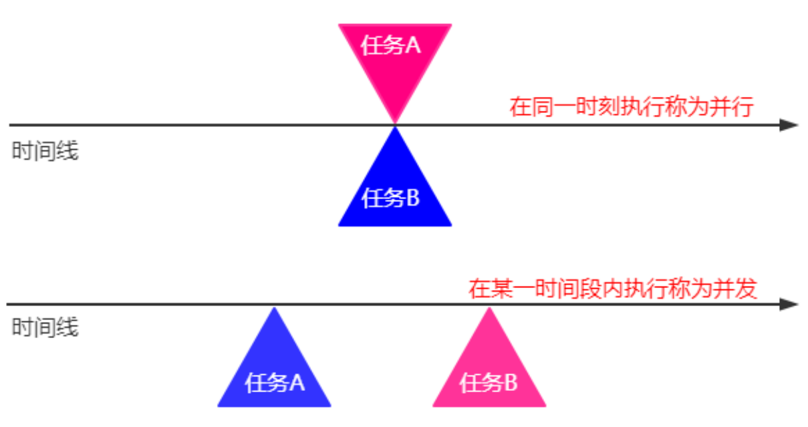

#### （2）进程

##### 1. 进程与线程

<font color="blue">官方说明：</font>在并发编程中，有两个基本的执行单元：进程和线程。在 Java 编程语言中，并发编程主要与线程有关。但是，进程也很重要。

计算机系统通常具有许多活动的进程和线程。即使在只有一个执行核心也是如此，因此在任何给定时刻只有一个线程实际执行。单个内核的处理时间通过 OS 被称作时间分片的功能在进程和线程之间共享。

计算机系统具有多个处理器或具有多个执行核心的处理器正变得越来越普遍。这极大地增强了系统同时执行进程和线程的能力——但即使在没有多个处理器或执行核心的简单系统上，并发也是可能的。

<font color="red">**进程拥有自己独立的内存空间，即计算机分配内存的单位是进程。线程是在进程中的，可以共享进程的资源，比如内存。**</font>

<font color="red">**单个执行核心是通过操作系统的时间分片功能来进行进程和线程之间的处理时间的分配。**</font>

##### 2. 进程的概念

<font color="blue">官方说明：</font>进程具有独立的执行环境。进程通常具有一套完整的私有基本运行时资源；特别是，每个进程都有其自己的内存空间。

进程通常被视为程序或应用程序的同义词。 但是，用户视为单个应用程序实际上可能是一组协作进程。为了促进进程之间的通信，大多数操作系统都支持进程间通信（IPC）资源，例如管道和套接字。IPC 不仅用于同一系统上的进程之间的通信，而且还用于不同系统上的进程。

Java 虚拟机的大多数实现都是作为单个进程运行的。

#### （3）线程

##### 1. 线程的概念

<font color="blue">官方说明：</font>线程（Thread）有时称为轻量级进程。进程和线程都提供执行环境，但是创建新线程比创建新进程需要更少的资源。

<font color="red">**线程存在于一个进程中，每个进程至少有一个线程。**</font>线程共享进程的资源，包括内存和打开的文件。这样可以进行有效的通信，但可能会出现问题。

多线程执行是 Java 平台的基本功能。每个应用程序都至少有一个线程或者几个，如果算上“系统”线程做的事情，如内存管理和信号处理。但是从应用程序程序员的角度来看，您仅从一个线程（称为主线程） 开始。该线程具有创建其他线程的能力，我们将在下一部分中进行演示。

##### 2. 线程的创建与常用方法

<font color="blue">官方说明：</font>创建 `Thread` 实例的应用程序必须提供将在该线程中运行的代码。有两种方法可以做到这一点：

- 提供可运行的对象。`Runnable` 接口定义了一个方法 `run`，旨在包含在线程中执行的代码。
- 子类线程。`Thread` 类本身实现了 `Runnable`接口，尽管它的 `run` 方法不执行任何操作。

**`Thread` 常用构造方法：**

```java
public Thread(); //创建一个线程

public Thread(String name);	//创建一个依据名称的线程

public Thread(Runnable target);	//根据给定的线程任务创建一个线程

public Thread(Runnable target, String name);//根据给定的线程任务和名称创建一个线程
```

**`Thread` 常用成员方法：**

```java
public synchronized void start();	//启动线程但不一定会执行

public final String getName();	//获取线程名称

public final synchronized void setName(String name);//设置线程的名称

public final void setPriority(int newPriority);//设置线程的优先级

public final int getPriority();//获取线程的优先级
//线程的优先级最小是1，最大是10，默认为5，优先级越高抢占CPU的概率越高。

public final void join() throws InterruptedException;	//等待线程执行完成

//等待线程执行给定的时间(单位毫秒)
public final synchronized void join(long millis) throws InterruptedException;

//等待线程执行给定的时间(单位毫秒、纳秒)
public final synchronized void join(long millis, int nanos) throws InterruptedException;

public long getId();//获取线程的ID

public State getState();//获取线程的状态

public boolean isInterrupted();//检测线程是否被打断

public void interrupt();//打断线程
```

**`Thread` 常用静态方法：**

```java
public static native Thread currentThread();	//获取当前运行的线程

public static boolean interrupted();	//检测当前运行的线程是否被打断

//暂停当前运行的线程，然后再与其他线程争抢资源，称为线程礼让
public static native void yield();

//使当前线程睡眠给定的时间（单位毫秒）
public static native void sleep(long millis) throws InterruptedException;

//使当前线程睡眠给定的时间（单位毫秒、纳秒）
public static void sleep(long millis, int nanos) throws InterruptedException;
```

创建线程有两种方式：实现 `Runable` 接口和继承 `Thread`。相较于继承 `Thread`，实现 `Runable` 接口更具有优势，在实现接口的同时还可以继承自其他的父类，避免了 Java 中类单继承的局限性；同时 `Runable` 接口的实现可以被多个线程重用，但继承 `Thread` 无法做到；并且线程池中支持 `Runable` 接口但不支持 `Thread`。

<font color="blue">示例：</font>

```java
package com.cyx.thread;

public class CreateDemo {

    public static void main(String[] args) {
        Thread t1 = new Thread();
        t1 = new SubThread("inherit");   //通过继承实现的线程
        Thread t2 = new Thread(new ThreadTask(), "interface");   //通过实现Runnable接口实现的线程
        t1.start(); //start方法只是告诉JVM线程已经准备好了，随时可以调用执行
        try {
//            t1.join();  //等待t1线程执行完成
//            t1.join(1000);  //等待t1线程执行1000毫秒
            t1.join(1000,50000);    //等待t1线程执行1.5秒
        } catch (InterruptedException e) {
            throw new RuntimeException(e);
        }
        t2.start();
    }

    static class SubThread extends Thread{

        public SubThread() {
        }

        public SubThread(String name) {
            super(name);
        }

        @Override
        public void run() {
            try {
                Thread.sleep(2000); //延迟2000毫秒
            } catch (InterruptedException e) {
                throw new RuntimeException(e);
            }
            System.out.println(getName() + "-> This is a SubThread");
        }
    }

    static class ThreadTask implements Runnable{

        @Override
        public void run() {
            Thread thread = Thread.currentThread(); //得到当前线程
            String name = thread.getName();
            System.out.println(name + "-> This is implementation");
        }
    }
}
```

##### 3. 线程内存模型

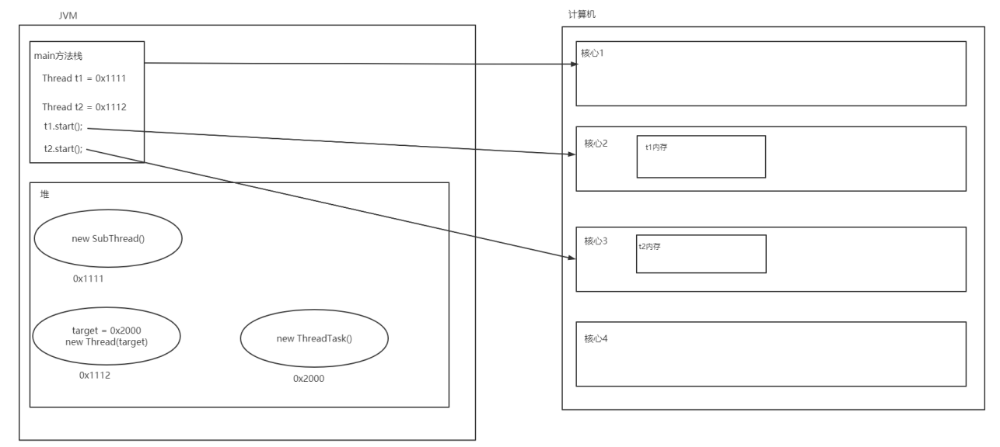

##### 4. 线程安全

<font color="blue">示例：某火车站有10张火车票在3个窗口售卖。</font>

```java
package com.cyx.thread;

public class SaleThreadTest {

    public static void main(String[] args) {
        SaleTask task = new SaleTask();
        Thread t1 = new Thread(task, "窗口1");
        Thread t2 = new Thread(task, "窗口2");
        Thread t3 = new Thread(task, "窗口3");
        t1.start();
        t2.start();
        t3.start();
    }

    static class SaleTask implements Runnable{

        private int totalTicket = 10;

        @Override
        public void run() {
            while(true){
                String name = Thread.currentThread().getName();
                System.out.println(name + "售卖火车票：" + totalTicket);
                totalTicket--;
                if (totalTicket <= 0){
                    break;
                }
                try {
                    Thread.sleep(100L);
                } catch (InterruptedException e) {
                    throw new RuntimeException(e);
                }
            }
        }
    }
}
```

<font color="blue">运行结果：</font>

```txt
窗口3售卖火车票：10
窗口2售卖火车票：10
窗口1售卖火车票：10
窗口1售卖火车票：7
窗口3售卖火车票：7
窗口2售卖火车票：7
窗口1售卖火车票：4
窗口2售卖火车票：3
窗口3售卖火车票：4
窗口1售卖火车票：1
窗口3售卖火车票：1
窗口2售卖火车票：1
```

从结果中可以看出，同一张火车票被卖了多次，这是由于线程之间获取信息不同步导致。

##### 5. 线程同步 `synchronized`

<font color="blue">官方说明：</font>Java 编程语言提供了两种基本的同步习惯用法：同步方法和同步代码块。

**同步方法语法：**

```java
访问修饰符 synchronized 返回值类型 方法名(参数列表){
	
}
```

**同步代码块语法：**

```java
synchronized(对象){

}
```

<font color="blue">示例：</font>

```java
package com.cyx.thread;

public class SaleThreadTest {

    public static void main(String[] args) {
        SaleTask task = new SaleTask(); //一个成员
        Thread t1 = new Thread(task, "窗口1");    //共用一个成员
        Thread t2 = new Thread(task, "窗口2");    //共用一个成员
        Thread t3 = new Thread(task, "窗口3");    //共用一个成员
        t1.start();
        t2.start();
        t3.start();
    }

    static class SaleTask implements Runnable{

        private int totalTicket = 10;

//        //同步方法：
//        //synchronized作用在成员方法上，因此synchronized与成员有关
//        private synchronized void saleTicket(){
//            if (totalTicket > 0){
//                String name = Thread.currentThread().getName();
//                System.out.println(name + "售卖火车票：" + totalTicket);
//                totalTicket--;
//            }
//        }


        @Override
        public void run() {
            while(true){
//                saleTicket();
                //同步代码块
                synchronized(this){
                    if(totalTicket > 0){
                        String name = Thread.currentThread().getName();
                        System.out.println(name + "售卖火车票：" + totalTicket);
                        totalTicket--;
                    }
                }
                
                if (totalTicket == 0){
                    break;
                }
                try {
                    Thread.sleep(100L);
                } catch (InterruptedException e) {
                    throw new RuntimeException(e);
                }
            }
        }
    }
}
```

**`synchronized` 锁实现原理：**

<font color="blue">官方说明：</font>同步是围绕称为内部锁或监视器锁的内部实体构建的（API 规范通常将此实体简称为“监视器”）。内在锁在同步的两个方面都起作用：强制对对象状态的独占访问并建立对可见性至关重要的事前关联。

每个对象都有一个与之关联的固有锁。按照约定，需要对对象的字段进行独占且一致的访问的线程必须在访问对象之前先获取对象的内在锁，然后在完成对它们的使用后释放该内在锁。据说线程在获取锁和释放锁之间拥有内部锁。只要一个线程拥有一个内在锁，其他任何线程都无法获得相同的锁。另一个线程在尝试获取锁时将阻塞。

当线程释放内在锁时，该动作与任何随后的相同锁获取之间将建立事前发生的关系。

当线程调用同步方法时，它会自动获取该方法对象的内在锁，并在方法返回时释放该内在锁。即使返回是由未捕获的异常引起的，也会发生锁定释放。

##### 6. 线程同步 `lock`

<font color="blue">官方说明：</font>同步代码依赖于一种简单的可重入锁。这种锁易于使用，但有很多限制。

锁对象的工作方式非常类似于同步代码所使用的隐式锁。与隐式锁一样，一次只能有一个线程拥有一个 `Lock` 对象。

**`synchronized` 和 `Lock` 的异同点：**

每一个对象都有一个与之关联的内在锁，`synchronized` 和 `Lock` 都是作用在内在锁上。`synchronized` 会尝试获得锁，如果获取锁时，发现有其他线程正在使用这把锁，那么当前请求锁的线程等待锁的释放。`Lock` 尝试获得锁，如果没有获取成功，则不会进行等待，可以有效的回避获得锁的企图。

与隐式锁相比，`Lock` 对象的最大优点是它们能够回避获取锁的企图。如果该锁不能立即或在超时到期之前不可用，则 `tryLock` 方法将撤消（如果指定）。如果另一个线程在获取锁之前发送了中断，则 `lockInterruptibly` 方法将退出。

<font color="blue">示例：</font>

```java
package com.cyx.thread;

import java.util.concurrent.locks.Lock;
import java.util.concurrent.locks.ReentrantLock;

public class SaleThreadTest {

    public static void main(String[] args) {
        SaleTask task = new SaleTask(); //一个成员
        Thread t1 = new Thread(task, "窗口1");    //共用一个成员
        Thread t2 = new Thread(task, "窗口2");    //共用一个成员
        Thread t3 = new Thread(task, "窗口3");    //共用一个成员
        t1.start();
        t2.start();
        t3.start();
    }

    static class SaleTask implements Runnable{

        private int totalTicket = 10;

        private Lock lock = new ReentrantLock();

        @Override
        public void run() {
            while(true){
                //尝试获得锁
                if (lock.tryLock()) {
                    try {
                        if (totalTicket > 0) {
                            String name = Thread.currentThread().getName();
                            System.out.println(name + "售卖火车票：" + totalTicket);
                            totalTicket--;
                        }
                    }
                    finally {
                        //解锁
                        lock.unlock();
                    }
                }
                if (totalTicket == 0){
                    break;
                }
                try {
                    Thread.sleep(100L);
                } catch (InterruptedException e) {
                    throw new RuntimeException(e);
                }
            }
        }
    }
}
```

##### 7. 线程通信

**`Object` 类中的通信方法：**

```java
public final native void notify();	//随机唤醒一个在监视器上等待的线程

public final native void notifyAll();	//唤醒所有在监视器上等待的线程

public final void wait() throws InterruptedException;	//（无限）等待

//计时等待
public final native void wait(long timeout) throws InterruptedException;
    
//计时等待
public final void wait(long timeout, int nanos) throws InterruptedException;
```

<font color="blue">示例：小明每次没有生活费了就给他的爸爸打电话，他的爸爸知道了后就去银行存钱，钱存好了之后就通知小明去取。</font>

分析：

1. 存钱和取钱都有一个共用的账户 `Account`；
2. 存钱后需要通知取钱，然后等待下一次存钱；
3. 取钱后需要通知存钱，然后等待下一次取钱。

```java
package com.cyx.thread.interact;

public class Account {

    private String name;

    private double balance; //余额

    private boolean hasMoney = false;//存钱标志

    public Account(String name) {
        this.name = name;
    }

    public synchronized void draw(double money){
        if (hasMoney){  //已经存钱
            if (balance < money){   //余额不够取钱
                System.out.println(name + "向老爸控诉没钱了");
                hasMoney = false;
                notify();   //通知老爸存钱
            }
            else {  //余额够取钱
                balance -= money;
                System.out.println(name + "取了" + money + "元");
            }
        }
        else {  //还未存钱
            try {
                System.out.println(name + "等待老爸存钱");
                wait(); //等待存钱
            } catch (InterruptedException e) {
                throw new RuntimeException(e);
            }
        }
    }

    public synchronized void store(double money){
        if (hasMoney){ //已经存钱了
            System.out.println("等待老爸通知取钱");
            try {
                wait();
            } catch (InterruptedException e) {
                throw new RuntimeException(e);
            }
        }
        else {  //还未存钱
            balance += money;
            System.out.println(name + "老爸存了" + money + "元");
            hasMoney = true;
            notifyAll();    //通知取钱
        }
    }
}
```

```java
package com.cyx.thread.interact;


/**
 * 取钱任务
 */
public class DrawTask implements Runnable {

    private Account account;

    private double money;

    public DrawTask(Account account, double money) {
        this.account = account;
        this.money = money;
    }


    @Override
    public void run() {
        while (true) {
            account.draw(money);
            try {
                Thread.sleep(500L);
            } catch (InterruptedException e) {
                throw new RuntimeException(e);
            }
        }
    }
}
```

```java
package com.cyx.thread.interact;


/**
 * 存钱任务
 */
public class StoreTask implements Runnable {

    private Account account;

    private double money;

    public StoreTask(Account account, double money) {
        this.account = account;
        this.money = money;
    }


    @Override
    public void run() {
        while (true) {
            account.store(money);
            try {
                Thread.sleep(500L);
            } catch (InterruptedException e) {
                throw new RuntimeException(e);
            }
        }
    }
}
```

```java
package com.cyx.thread.interact;

public class AccountTest {

    public static void main(String[] args) {
        Account account = new Account("小明");
        Thread t1 = new Thread(new StoreTask(account,50));
        Thread t2 = new Thread(new DrawTask(account,100));
        t1.start();
        t2.start();
    }
}
```

##### 8. 线程状态

```java
//enum为枚举，即把所有情况都列出来
public enum State {
	/**
	 * Thread state for a thread which has not yet started.
	 */
    //尚未启动线程的线程状态，即还没有调用start方法的线程
    NEW,
	/**
 	 * Thread state for a runnable thread. A thread in the runnable
	 * state is executing in the Java virtual machine but it may
	 * be waiting for other resources from the operating system
	 * such as processor.
	 */
    //可运行线程的线程状态。处于 runnable 状态的线程正在 Java 虚拟机中执行，但它可能正在等待来自操作系统的其他资源，例如处理器。可运行不代表正在执行。
	RUNNABLE,
	/**
	 * Thread state for a thread blocked waiting for a monitor lock.
	 */
    //阻塞等待监视器锁定线程的线程状态。使用synchronized或lock未获得锁的线程。
	BLOCKED,
	/**
	 * Thread state for a waiting thread.
	 */
    //无限等待状态。获得锁但未得到通知。
	WAITING,
	/**
	 * Thread state for a waiting thread with a specified waiting time.
	 */
    //计时等待状态与休眠状态。
	TIMED_WAITING,
	/**
	 * Thread state for a terminated thread.
	 * The thread has completed execution.
	 */
    //线程终止状态。
	TERMINATED;
}
```

**线程状态转换图：**

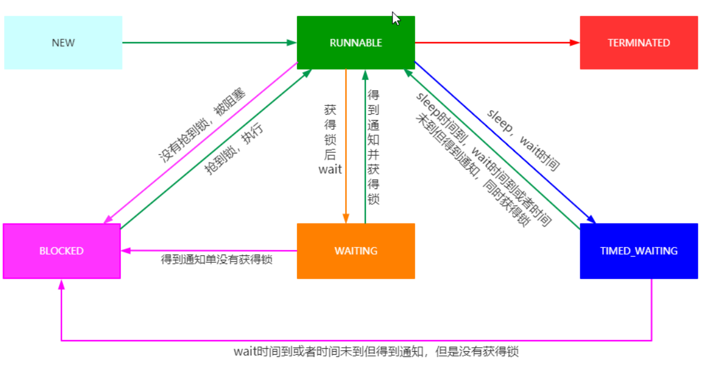

#### （4）死锁

##### 1. 死锁的概念

<font color="blue">官方说明：</font>死锁描述了一种情况，其中两个或多个线程永远被阻塞，互相等待。

##### 2. 死锁发生的条件

满足以下所有条件才称为死锁。

1. 互斥条件：线程要求对所分配的资源进行排他性控制，即在一段时间内某资源仅为一个线程所占有。此时若有其他线程请求该资源，则请求线程只能等待。
2. 不可剥夺条件：线程所获得的资源在未使用完毕之前，不能被其他线程强行夺走，即只能由获得该资源的线程自己来释放（只能是主动释放)。
3. 请求与保持条件：线程已经保持了至少一个资源，但又提出了新的资源请求，而该资源已被其他线程占有，此时请求线程被阻塞，但对自己已获得的资源保持不放。
4. 循环等待：存在一种线程资源的循环等待链，链中每一个线程已获得的资源同时被链中下一个线程所请求。

<font color="blue">示例：</font>

```java
package com.cyx.thread.deadlock;

public class DeadLockTest {

    public static void main(String[] args) {
        Object o1 = new Object();
        Object o2 = new Object();
        DeadLockTask task1 = new DeadLockTask(o1,o2,1);
        DeadLockTask task2 = new DeadLockTask(o2,o1,2);
        Thread thread1 = new Thread(task1);
        Thread thread2 = new Thread(task2);
        thread1.start();
        thread2.start();
    }


    static class DeadLockTask implements Runnable{

        private Object o1,o2;

        private int flag;   //锁的使用条件

        public DeadLockTask(Object o1, Object o2, int flag) {
            this.o1 = o1;
            this.o2 = o2;
            this.flag = flag;
        }

        @Override
        public void run() {
            String name = Thread.currentThread().getName();
            if (flag == 0){
                synchronized (o1){
                    System.out.println(name + "锁定对象o1");
                    try {
                        Thread.sleep(500L);
                    } catch (InterruptedException e) {
                        throw new RuntimeException(e);
                    }
                    synchronized (o2){
                        System.out.println(name + "锁定对象o2");
                    }
                }
            }
            else {
                synchronized (o2){
                    System.out.println(name + "锁定对象o2");
                    try {
                        Thread.sleep(500L);
                    } catch (InterruptedException e) {
                        throw new RuntimeException(e);
                    }
                    synchronized (o1){
                        System.out.println(name + "锁定对象o1");
                    }
                }
            }
        }
    }
}
```

分析上述示例：

线程 `t1` 开始执行，首先会将持有对象 `o1` 的锁，然后睡眠0.5秒，在此期间，线程 `t2` 开始执行，首先会持有对象 `o2` 的锁，然后开始睡眠0.5秒。

线程 `t1` 睡眠结束，尝试获得对象 `o2` 的锁，此时发现对象 `o2` 已经被其他线程 `t2` 锁住，此时 `t1` 被阻塞在外， 等待对象 `o2` 上的锁释放。

线程 `t2` 睡眠结束，尝试获得对象 `o1` 的锁，此时发现对象 `o1` 已经被其他线程 `t1` 锁住，此时 `t2` 被阻塞在外，等待对象 `o1` 上的锁释放。

#### （5）线程池

##### 1. 执行器

<font color="blue">官方说明：</font>在前面的所有示例中，由新线程（由其 `Runnable` 对象定义）执行的任务与由` Thread` 对象定义的线程本身之间存在紧密的联系。 这对于小型应用程序非常有效，但是在大型应用程序中，将线程管理和创建与其余应用程序分开是有意义的。封装这些功能的对象称为执行器。

**`Executor` 接口方法：**

```java
void execute(Runnable command);	//将任务添加到线程池中，等待线程池调度执行
```

**`ExecutorService` 接口常用方法：**

```java
Future<?> submit(Runnable task);	//提交一个任务至线程池中

void shutdown();	//有序关闭线程池，不再接收新的线程任务，但池中已有任务会执行

//关闭线程池，尝试停止所有正在执行的任务，并将池中等待执行的任务返回
List<Runnable> shutdownNow();

boolean isShutdown();	//检测线程池是否已经关闭

boolean isTerminated();	//检测线程池是否已经终止
```

##### 2. 线程池的概念

<font color="blue">官方说明：</font>`java.util.concurrent` 中的大多数执行程序实现都使用线程池，该线程池由工作线程组成。这种线程与它执行的 `Runnable` 和 `Callable` 任务分开存在，通常用于执行多个任务。

使用工作线程可以最大程度地减少线程创建所带来的开销。线程对象占用大量内存，在大型应用程序中，分配和取消分配许多线程对象会产生大量内存管理开销。

线程池的一种常见类型是固定线程池。这种类型的池始终具有指定数量的正在运行的线程。如果某个线程在仍在使用时以某种方式终止，则它将自动替换为新线程。任务通过内部队列提交到池中，该内部队列在活动任务多于线程时容纳额外的任务。

固定线程池的一个重要优点是使用该线程池的应用程序可以正常降级。

##### 3. 线程池的构造方法

<font color="red">**线程池的构造方法如下：**</font>

```java
public ThreadPoolExecutor(int corePoolSize, 	//核心线程数
							int maximumPoolSize,//最大线程数
							long keepAliveTime,	//工作线程存活时间
							TimeUnit unit,		//时间单位
							BlockingQueue<Runnable> workQueue,	//任务队列
							ThreadFactory threadFactory,		//线程工厂
							RejectedExecutionHandler handler)	//拒绝处理器
```

<font color="blue">示例：</font>

```java
package com.cyx.thread.pool;

import java.util.concurrent.*;

public class ThreadPoolTest {

    public static void main(String[] args) {
        LinkedBlockingDeque<Runnable> taskQueue = new LinkedBlockingDeque<>(10);	//任务队列
        ThreadPoolExecutor pool = new ThreadPoolExecutor(
                5,  			//核心线程数
                10,             //最大工作线程数
                2,              //非核心工作线程存活时间
                TimeUnit.SECONDS,//存活时间单位
                taskQueue,      //任务队列
                Executors.defaultThreadFactory(),   //线程池中的线程创建工厂
                new ThreadPoolExecutor.AbortPolicy());  //拒绝新线程任务策略
        for (int i = 0; i < 30; i++) {
            pool.submit(new ThreadPoolTask(i));
            int corePoolSize = pool.getCorePoolSize();  //获取核心线程数
            int size = pool.getQueue().size(); //获取队列中任务个数
            long finish = pool.getCompletedTaskCount(); //获取线程池执行完成的任务个数
            System.out.printf("线程池中的核心任务个数：%d，队列中任务个数：%d，线程池完成任务数：%d\n", corePoolSize,size,finish);
            try {
                Thread.sleep(200);
            } catch (InterruptedException e) {
                throw new RuntimeException(e);
            }
        }
        pool.shutdown();//关闭线程池，等待线程池中的任务完成，但不会接收新的线程任务
    }

    static class ThreadPoolTask implements Runnable {

        private int num; //任务编号

        public ThreadPoolTask(int num) {
            this.num = num;
        }

        @Override
        public void run() {
            System.out.println("正在执行线程任务" + num);
            try {
                Thread.sleep(400);
            } catch (InterruptedException e) {
                throw new RuntimeException(e);
            }
        }
    }
}
```

##### 4. 线程池的工作流程

线程池启动后，核心线程就已经启动，当一个新的任务提交到线程池时，首先会检测是否存在空闲的核心线程，如果存在，就将该任务交给这个空闲核心线程执行。如果不存在，那么就将该任务交给队列，在队列中排队等候。如果队列满了，此时线程池会检测当前工作线程数是否达到最大线程数，如果没有达到最大线程数，那么将由线程工厂创建新的工作线程来执行队列中的任务，这样，队列中就有空间能够容纳这个新任务。如果创建的工作线程在执行完任务后，在给定的时间范围内（非核心工作线程存活时间）没有新的任务执行，这些工作线程将死亡（终结）。如果已经达到最大线程数，那么线程池将采用提供的拒绝处理策略来拒绝这个新任务。

**线程池的创建方法：**

```java
package com.cyx.thread.pool;

import java.util.concurrent.ExecutorService;
import java.util.concurrent.Executors;

public class ExecutorTest {

    public static void main(String[] args) {
        //创建一个给定核心线程数以及最大线程数的线程池，该线程池队列容量默认非常大
        ExecutorService pool1 = Executors.newFixedThreadPool(5);
        //创建只有一个核心线程数以及最大线程数的线程池，该线程池队列容量默认非常大
        ExecutorService pool2 = Executors.newSingleThreadExecutor();
        //创建核心线程数为0，但最大线程非常大的可缓存的线程池
        ExecutorService pool3 = Executors.newCachedThreadPool();
        //创建一个给定核心线程数，最大线程数为整数最大值的可调度线程池
        ExecutorService pool4 = Executors.newScheduledThreadPool(5);
    }
}
```

<font color="blue">线程池的使用：</font>

```java
package com.cyx.thread.pool;

import java.util.concurrent.ExecutorService;
import java.util.concurrent.Executors;

public class ExecutorTaskTest {

    public static void main(String[] args) {
        ExecutorService service = Executors.newFixedThreadPool(5);
        for (int i = 0; i < 50; i++) {
            int order = i;
            //Runnable接口的Lambda表达式
            service.submit(() -> System.out.println("正在执行任务" + order));
        }
        service.shutdown();
    }
}
```

### 二、网络编程

#### （1）网络基础

##### 1. 软件结构

**C/S结构：**

客户端（Client）/服务器（Service）

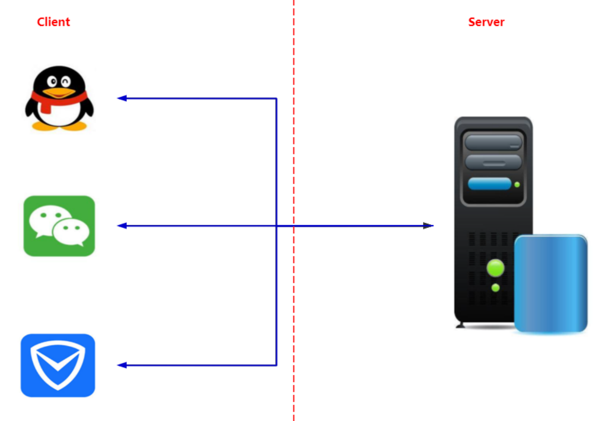

**B/S结构：**

浏览器（Browser）/服务器（Service）

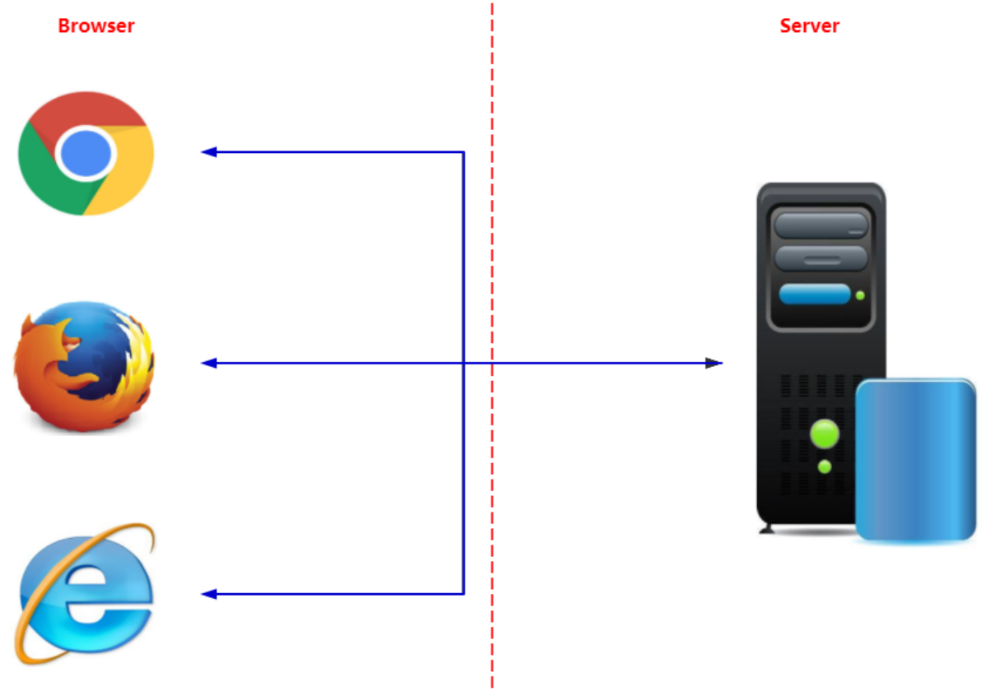

不论是C/S结构还是B/S结构，都离不开网络通信。

##### 2. 网络通信协议

**TCP 与 UDP：**

<font color="blue">官方说明：</font>互联网上运行的计算机使用传输控制协议（TCP）或用户数据报协议（UDP）相互通信。

**TCP：**

<font color="blue">官方说明：</font>TCP（传输控制协议）是基于连接的协议，可在两台计算机之间提供可靠的数据流。

TCP为需要可靠通信的应用程序提供了点对点通道。

**UDP：**

<font color="blue">官方说明：</font>UDP（用户数据报协议）是一种协议，它从一台计算机向另一台计算机发送独立的数据包（称为数据报），而不能保证其到达。

UDP 协议提供了网络上两个应用程序之间无法保证的通信。UDP 不像 TCP 那样基于连接，而是将独立的数据包（称为数据报）从一个应用程序发送到另一个应用程序。发送数据报就像通过邮局发送一封信一样：传递顺序并不重要，也不能保证，每条消息彼此独立。

许多防火墙和路由器已配置为不允许 UDP 数据包。

**TCP 与 UDP 的区别：**

TCP 是一个点对点的通信端点，属于可靠性信息传输。UDP 是无连接的不可靠信息传输。

**IP与端口：**

IP 用于标记计算机，端口用于标记应用程序。

<font color="blue">官方说明：</font>一般来说，计算机与网络具有单个物理连接。发送到特定计算机的所有数据都通过该连接到达。但是，数据可能打算供计算机上运行的不同应用程序使用。 那么计算机如何知道将数据转发到哪个应用程序？通过使用端口。

通过 Internet 传输的数据带有寻址信息，该信息标识了计算机及其发往的端口。 该计算机由其32位IP 地址标识，该 IP 地址用于将数据传递到网络上正确的计算机。端口由一个16位数字标识，TCP和UDP 使用该16位数字将数据传递到正确的应用程序。

端口号的范围是0到65,535，因为端口由16位数字表示。 端口号范围从0 - 1023被限制；它们保留供 HTTP 和 FTP 等知名服务以及其他系统服务使用。这些端口称为众所周知的端口。你的应用程序不应尝试绑定到它们。

**URL：**

<font color="blue">官方说明：</font>URL 是“统一资源定位符”的缩写。

URL 具有两个主要组成部分：访问资源所需的协议和资源的位置。

#### （2）套接字 Socket

##### 1. 套接字的概念

<font color="blue">官方说明：</font>套接字是网络上运行的两个程序之间双向通讯链接的一个端点。套接字类用于表示客户端程序和服务器程序之间的连接。`java.net` 包提供了两个类：`Socket` 和 `ServerSocket` ，分别实现连接的客户端和连接的服务器。

##### 2. `Socket` 的使用

<font color="blue">官方说明：</font>通常，服务器在特定计算机上运行，并具有绑定到特定端口号的套接字。服务器只是等待，侦听套接字以请求客户端发出连接请求。

在客户端上：客户端知道服务器在其上运行的计算机的主机名以及服务器在其上侦听的端口号。为了发出连接请求，客户端尝试在服务器的机器和端口上与服务器会合。客户端还需要向服务器标识自己，以便客户端绑定到在此连接期间将使用的本地端口号。这通常是由系统分配的。

**`Socket` 常用构造方法：**

```java
//创建一个套接字，连向给定IP的主机，并与该主机给定端口的应用通信
public Socket(String host, int port) throws UnknownHostException,IOException;

//创建一个套接字，连向给定IP信息的主机，并与该主机给定端口的应用通信
public Socket(InetAddress address, int port) throws IOException;
```

**`Socket` 常用方法：**

```java
//获取读取数据的通道
public InputStream getInputStream() throws IOException;

//获取输出数据的通道
public OutputStream getOutputStream() throws IOException;

//设置链接的超时时间，0表示不会超时
public synchronized void setSoTimeout(int timeout) throws SocketException;

//标识输入通道不再接收数据，如果再次向通道中读取数据，则返回-1，表示读取到末尾
public void shutdownInput() throws IOException;

//禁用输出通道，如果再次向通道中输入数据，则会报IOException
public void shutdownOutput() throws IOException;

//关闭套接字，相关的数据通道都会被关闭
public synchronized void close() throws IOException;
```

**`ServerSocket` 常用构造方法：**

```java
//创建一个服务器套接字并占用给定的端口
public ServerSocket(int port) throws IOException;
```

**`ServerSocket` 常用方法：**

```java
//侦听与此套接字建立的连接并接受它。该方法将阻塞，直到建立连接为止。
public Socket accept() throws IOException;

//设置链接的超时时间，0表示不会超时
public synchronized void setSoTimeout(int timeout) throws SocketException;
```

**客户端与服务器端通信：**

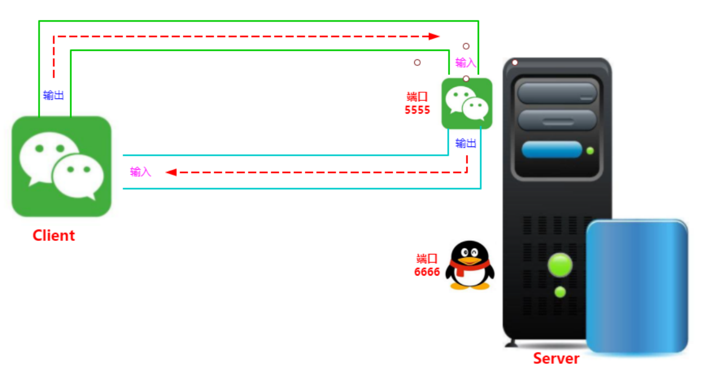

<font color="blue">示例：</font>

```java
package com.cyx.network.socket;

import java.io.BufferedReader;
import java.io.IOException;
import java.io.InputStream;
import java.io.InputStreamReader;
import java.net.ServerSocket;
import java.net.Socket;

public class TcpServer {

    private ServerSocket server;

    public TcpServer(int port) {
        try {
            this.server = new ServerSocket(port);
        } catch (IOException e) {
            throw new RuntimeException(e);
        }
    }

    /**
     * 服务器启动
     */
    public void start(){
        //服务器不能挂，因此要用死循环
        while(true){
            try {
                //等待客户端连接，程序会被阻塞，与Scanner的next()一样
                Socket connectionClient = server.accept();
                String msg = SocketUtil.receiveMsg(connectionClient);
                System.out.println(msg);
                SocketUtil.sendMsg(connectionClient, "Hello,Client.I am Server.");
            } catch (IOException e) {
                throw new RuntimeException(e);
            }

        }
    }

    public static void main(String[] args) {
        TcpServer server = new TcpServer(6666);
        server.start();
    }
}
```

```java
package com.cyx.network.socket;


import java.io.*;
import java.net.Socket;

/**
 * Socket套接字相关功能封装，信息接收与发送
 */
public class SocketUtil {

    /**
     * 接收套接字中的信息
     * @param socket    套接字
     * @return
     * @throws IOException
     */
    public static String receiveMsg(Socket socket) throws IOException {
        //服务器读取客户端传输的信息
        InputStream is = socket.getInputStream();
        InputStreamReader isr = new InputStreamReader(is);
        BufferedReader reader = new BufferedReader(isr);
        StringBuilder builder = new StringBuilder();
        String line;
        while ((line = reader.readLine()) != null) {
            builder.append(line);
        }
        //标识输入中的通道已经读取完毕，如果再读取，则读取-1，表示读取结束
        socket.shutdownInput();
        return builder.toString();
    }

    /**
     * 向套接字中发送信息
     * @param socket    套接字
     * @param msg
     * @throws IOException
     */
    public static void sendMsg(Socket socket, String msg) throws IOException {
        //获取客户端输出的通道
        OutputStream os = socket.getOutputStream();
        OutputStreamWriter osw = new OutputStreamWriter(os);
        BufferedWriter writer = new BufferedWriter(osw);
        writer.write(msg);
        writer.flush();
        //客户端输出已经完成，如果再向客户端写数据，则会抛出异常
        socket.shutdownOutput();
    }
}
```

```java
package com.cyx.network.socket;

import java.io.BufferedWriter;
import java.io.IOException;
import java.io.OutputStream;
import java.io.OutputStreamWriter;
import java.net.Socket;

public class TcpClient {

    private Socket client;  //客户端套接字

    public TcpClient(String ip, int port) {
        try {
            client = new Socket(ip,port);
        } catch (IOException e) {
            throw new RuntimeException(e);
        }
    }

//    public void sendMsg(String msg) throws IOException {
//        SocketUtil.sendMsg(client,msg);
//    }

    public String receiveMsg() throws IOException {
        return SocketUtil.receiveMsg(client);
    }

    public static void main(String[] args) {
        try {
            //本机表示的方式：localhost，127.0.0.1
            //可在网络->高级网络设置->硬件和连接属性中查看IPv4地址 169.254.65.159
            TcpClient client = new TcpClient("localhost",6666);
            SocketUtil.sendMsg(client.client,"hello");
//            client.sendMsg("hello,server.I am Client.");
            System.out.println(client.receiveMsg());
        } catch (IOException e) {
            throw new RuntimeException(e);
        }
    }
}

```

#### （3）数据报 Datagram

##### 1. 数据报的概念

<font color="blue">官方说明：</font>数据报是通过网络发送的独立的自包含的消息，其是否到达、到达时间和内容无法得到保证。

##### 2. 数据报的使用

**`DatagramSocket` 常用构造方法：**

```java
//构建一个绑定在任意端口的收发数据报的套接字
public DatagramSocket() throws SocketException;

//构建一个绑定在给定端口的收发数据报的套接字
public DatagramSocket(int port) throws SocketException;
```

**`DatagramSocket` 常用方法：**

```java
//发送给定的数据包
public void send(DatagramPacket p) throws IOException;

//接收数据至给定的数据包
public synchronized void receive(DatagramPacket p) throws IOException;

//设置链接的超时时间，0表示不会超时
public synchronized void setSoTimeout(int timeout) throws SocketException;
```

**`DatagramPacket` 常用构造方法：**

```java
//构建一个接收数据的数据包
public DatagramPacket(byte buf[], int length);

//构建一个发送数据的数据包
public DatagramPacket(byte buf[], int offset, int length,InetAddress address,int port);
```

**`DatagramPacket` 常用方法：**

```java
//获取发送数据的主机IP地址
public synchronized InetAddress getAddress();

//获取发送数据的主机使用的端口
public synchronized int getPort();

//获取数据包中数据的长度
public synchronized int getLength();
```

<font color="blue">示例：</font>

```java
package com.cyx.network.datagram;

import java.io.IOException;
import java.net.DatagramPacket;
import java.net.DatagramSocket;
import java.net.InetAddress;
import java.net.SocketException;

public class UdpServer {

    private static final int BUFFER_SIZE = 4096;

    private DatagramSocket server;

    public UdpServer(int port) throws SocketException {
        server = new DatagramSocket(port);
    }

    /**
     * 服务器启动
     */
    public void start(){
        while(true){
            DatagramPacket packet = DatagramUtil.receivePacket(server);
            int length = packet.getLength();
            String msg = new String(packet.getData(), 0, length);
            System.out.println(msg);
            String ip = packet.getAddress().getHostAddress();
            int port = packet.getPort();
            try {
                DatagramUtil.sendPacket(server,"Hello,Client.I am Server.",ip,port);
            } catch (IOException e) {
                throw new RuntimeException(e);
            }
        }
    }

    public static void main(String[] args) {
        try {
            UdpServer server = new UdpServer(6666);
            server.start();
        } catch (SocketException e) {
            throw new RuntimeException(e);
        }
    }
}
```

```java
package com.cyx.network.datagram;

import java.io.IOException;
import java.net.DatagramPacket;
import java.net.DatagramSocket;
import java.net.InetAddress;

public class DatagramUtil {

    private static final int BUFFER_SIZE = 4096;

    /**
     * 发送数据报
     * @param socket    数据报客户端
     * @param msg       发送的信息
     * @param ip        发送信息的目标计算机IP
     * @param port      发送信息的目标计算机端口
     * @throws IOException
     */
    public static void sendPacket(DatagramSocket socket,String msg, String ip, int port)
            throws IOException {
        byte[] data = msg.getBytes();
        InetAddress address = InetAddress.getByName(ip);
        //创建了一个发送数据的数据包
        DatagramPacket packet = new DatagramPacket(data,0,data.length, address,port);
        socket.send(packet);
    }

    /**
     * 接收数据报
     * @param socket    数据报套接字
     * @return
     */
    public static DatagramPacket receivePacket(DatagramSocket socket){
        byte[] buffer = new byte[BUFFER_SIZE];
        DatagramPacket packet = new DatagramPacket(buffer, buffer.length);
        try {
            socket.receive(packet);
        } catch (IOException e) {
            throw new RuntimeException(e);
        }
        return packet;
    }
}
```

```java
package com.cyx.network.datagram;

import java.io.IOException;
import java.net.*;

public class UdpClient {

    private DatagramSocket client;

    public UdpClient() throws SocketException {
        client = new DatagramSocket();  //绑定任意端口
    }

    public void sendPacket(String msg,String ip,int port) throws IOException {
        DatagramUtil.sendPacket(client,msg,ip,port);
    }

    public String receivePacket(){
        DatagramPacket packet = DatagramUtil.receivePacket(client);
        int length = packet.getLength();
        String msg = new String(packet.getData(), 0, length);
        return msg;
    }

    public static void main(String[] args) {
        try {
            UdpClient client = new UdpClient();
            client.sendPacket("Hello,Server.I am Client.","localhost",6666);
            System.out.println(client.receivePacket());
        } catch (SocketException e) {
            throw new RuntimeException(e);
        } catch (IOException e) {
            throw new RuntimeException(e);
        }
    }
}
```

#### （4）网络编程综合练习

<font color="blue">示例：使用网络通信完成注册和登录功能。要求注册的用户信息必须进行存档，登录时需要从存档的数据检测是否能够登录。</font>

分析：

1. 建议使用TCP完成，因为TCP是可靠性数据传输，可以保证信息能够被接收。
2. 用户属于客户端操作，服务器端需要区分用户的行为。
3. 为了区分客户端的行为，需要设计一个消息类，然后使用序列化的方式来进行传输。
4. 用户注册信息需要存档，因此需要设计一个用户类，为了方便使用，也可以直接将一个集合使用序列化的方式存储在文档中。

```java
package com.cyx.network.user;

import java.io.Serializable;
import java.util.Objects;

public class User implements Serializable{

    private String username;

    private String password;

    public User(String username, String password) {
        this.username = username;
        this.password = password;
    }

    public String getUsername() {
        return username;
    }

    public void setUsername(String username) {
        this.username = username;
    }

    public String getPassword() {
        return password;
    }

    public void setPassword(String password) {
        this.password = password;
    }

    @Override
    public boolean equals(Object o) {
        if (this == o) return true;
        if (o == null || getClass() != o.getClass()) return false;
        User user = (User) o;
        return Objects.equals(username, user.username) && Objects.equals(password, user.password);
    }

    @Override
    public int hashCode() {
        return Objects.hash(username, password);
    }
}
```

```java
package com.cyx.network.user;

import java.io.Serializable;

public class Message<T> implements Serializable {

    private T data; //发送的信息

    private String action;  //行为

    public T getData() {
        return data;
    }

    public void setData(T data) {
        this.data = data;
    }

    public String getAction() {
        return action;
    }

    public void setAction(String action) {
        this.action = action;
    }

    public Message(String action,T data) {
        this.data = data;
        this.action = action;
    }
}
```

```java
package com.cyx.network.user;

import java.io.*;
import java.util.ArrayList;
import java.util.List;

public class FileUtil {

    public static <T> List<T> readData(String path){
        List<T> dataList = new ArrayList<>();
        File file = new File(path);
        if (file.exists()) {
            try(InputStream is = new FileInputStream(file);
                ObjectInputStream ois = new ObjectInputStream(is);) {
                dataList = (List<T>) ois.readObject();
            } catch (Exception e) {
                throw new RuntimeException(e);
            }
        }
        return dataList;
    }

    public static <T> boolean writeData(String path, List<T> dataList){
        File file = new File(path);
        File parent = file.getParentFile();
        if(!parent.exists()){
            parent.mkdirs();
        }
        boolean success = true;
        try (OutputStream os = new FileOutputStream(file);
            ObjectOutputStream oos = new ObjectOutputStream(os);) {
            oos.writeObject(dataList);
            oos.flush();
        } catch (Exception e) {
            success = false;
            throw new RuntimeException(e);
        }
        return success;
    }
}
```

```java
package com.cyx.network.user;

import java.io.*;
import java.net.Socket;

public class MessageUtil {

    public static <T> void sendMsg(Socket socket, Message<T> message)
            throws IOException {
        OutputStream os = socket.getOutputStream();
        ObjectOutputStream oos = new ObjectOutputStream(os);
        oos.writeObject(message);
        oos.flush();
        socket.shutdownOutput();
    }

    public static <T> Message<T> receiveMsg(Socket socket)
            throws IOException, ClassNotFoundException {
        InputStream is = socket.getInputStream();
        ObjectInputStream ois = new ObjectInputStream(is);
        Message<T> message = (Message<T>) ois.readObject();
        return message;
    }
}
```

```java
package com.cyx.network.user;

import java.io.IOException;
import java.io.ObjectOutputStream;
import java.io.OutputStream;
import java.net.Socket;

public class UserClient {

    private Socket client;

    public UserClient(String ip, int port) throws IOException {
        this.client = new Socket(ip,port);
    }

    public void sendMsg(Message<User> message) throws IOException {
        MessageUtil.sendMsg(client,message);
    }

    public String receiveMsg() throws IOException, ClassNotFoundException {
        Message<String> msg = MessageUtil.receiveMsg(client);
        return msg.getData();
    }

    public static void main(String[] args) {
        try {
            UserClient client = new UserClient("localhost", 8888);
            User user = new User("张三", "123456");
            client.sendMsg(new Message<>("login",user));
            String backMsg = client.receiveMsg();
            System.out.println(backMsg);
        } catch (IOException e) {
            throw new RuntimeException(e);
        } catch (ClassNotFoundException e) {
            throw new RuntimeException(e);
        }
    }
}
```

```java
package com.cyx.network.user;

import java.io.IOException;
import java.net.ServerSocket;
import java.net.Socket;
import java.util.List;
import java.util.function.Predicate;

public class UserServer {

    private static final String USER_PATH = "E:\\JAVA代码\\DirtyTestDate\\user\\user.obj";

    private ServerSocket server;

    public UserServer(int port) throws IOException {
        this.server = new ServerSocket(port);
    }

    public void start() {
        while (true){
            try {
                Socket userClient = server.accept();
                Message<User> message = MessageUtil.receiveMsg(userClient);
                String action = message.getAction();
                if (action.equals("register")) {
                    register(userClient, message);
                }
                else if (action.equals("login")) {
                    login(userClient,message);
                }
            } catch (IOException e) {
                throw new RuntimeException(e);
            } catch (ClassNotFoundException e) {
                throw new RuntimeException(e);
            }
        }
    }

    private void register(Socket userClient, Message<User> message) throws IOException {
        //读取存档的用户列表
        List<User> users = FileUtil.readData(USER_PATH);
        //获取用户注册的用户信息
        User registerUser = message.getData();
        //检测用户列表中是否存在注册的用户信息
//                    boolean exists = users.stream().anyMatch(new Predicate<User>() {
//                        @Override
//                        public boolean test(User user) {
//                            return user.equals(registerUser);
//                        }
//                    });
        boolean exists = users.stream().anyMatch(user -> user.equals(registerUser));
        Message<String> backMsg = new Message<>("back",null);
        if (exists) {
            backMsg.setData("账号已被注册");
        }
        else {
            //将用户信息添加至用户列表中
            users.add(registerUser);
            //用户列表存档
            boolean result = FileUtil.writeData(USER_PATH, users);
            String msg = result ? "注册成功" : "注册失败";
            backMsg.setData(msg);
        }
        MessageUtil.sendMsg(userClient,backMsg);
    }

    private void login(Socket userClient, Message<User> message) throws IOException {
        //读取存档的用户列表
        List<User> users = FileUtil.readData(USER_PATH);
        //获取用户登录的用户信息
        User loginrUser = message.getData();
        //检测用户列表中是否存在登录的用户信息
        boolean exists = users.stream().anyMatch(user -> user.equals(loginrUser));
        String msg = exists ? "登录成功" : "账号或密码错误";
        Message<String> backMsg = new Message<>("back", msg);
        MessageUtil.sendMsg(userClient,backMsg);
    }

    public static void main(String[] args) {
        try {
            UserServer server = new UserServer(8888);
            server.start();
        } catch (IOException e) {
            throw new RuntimeException(e);
        }
    }
}
```

### 三、XML 解析

#### （1）XML 文档

##### 1. XML 的概念

XML 全称是 Extensible Markup Language，可扩展标记语言。

##### 2. XML 语法

1. xml 是一种文本文档，其后缀名为 .xml；
2. xml 文档内容的第一行必须是对整个文档类型的声明；
3. xml 文档内容中有且仅有一个根标签，子标签可以有多个；
4. xml 文档内容中的标签必须严格闭合；
5. xml 文档内容中的标签属性值必须使用单引号或者双引号引起来；
6. xml 文档内容中的标签名区分大小写。

<font color="blue">示例：</font>

```xml
<?xml version="1.0" encoding="UTF-8"?>
<students>
	<student name="张三" age="20" sex="男"></student>
	<STUDENT>
		<NAME>张三</NAME>
		<AGE>18</AGE>
		<SEX>男</SEX>
	</STUDENT>
    <desc>
		<![CDATA[
			<
		]]>
	</desc>
</students>
```

<font color="red">**如果在 XML 文档内容中出现了像 `<` 这类似的特殊符号，使用标签 `CDATA` 来完成，`CDATA` 标签中的内容会按原样展示。**</font>

**语法：**

```xml
<![CDATA[
	<!--内容 -->
]]>
```

XML 文档可以自定义标签，为了更规范的使用 XML 文档，可以使用 XML 约束来限定 XML 文档中的标签使用。

XML 约束可以通过 DTD 文档和 Schema 文档来实现。其中 DTD 文档比较简单，后缀名为 .dtd，而 Schema 技术则比较复杂，后缀名为 .xsd。

#### （2）DTD 约束

##### 1. 引入 DTD 约束

**语法：**

```dtd
<!DOCTYPE 根标签名 SYSTEM "约束文档名.dtd">
```

##### 2. DTD 约束元素

**元素类型：**

`EMPTY`（空元素），元素不包含任何数据，但是可以有属性。

<font color="blue">示例：</font>

```dtd
<!ELEMENT students (student*)>
<!ELEMENT student EMPTY>
```

```xml
<?xml version="1.0" encoding="UTF-8" ?>
<!DOCTYPE students SYSTEM "student.dtd">
<students>
    <student></student>
</students>
```

`#PCDATA`（字符串），`#PCDATA` 是指被解析器解析的文本也就是字符串内容，不能包含其他类型的元 素。

<font color="blue">示例：</font>

```dtd
<!ELEMENT students (student*)>
<!ELEMENT student (name,age,sex) ANY>
<!ELEMENT name (#PCDATA)>
<!ELEMENT age (#PCDATA)>
<!ELEMENT sex (#PCDATA)>
```

```xml
<?xml version="1.0" encoding="UTF-8" ?>
<!DOCTYPE students SYSTEM "student.dtd">
<students>
    <student>
        <name>张三</name>
        <sex>男</sex>
        <age>20</age>
    </student>
</students>
```

`ANY`（任何内容都可以）。

**DTD 约束元素出现顺序及次数：**

| 情景       | 语法                         | 描述                                             |
| ---------- | ---------------------------- | ------------------------------------------------ |
| 顺序出现   | `<!ELEMENT name (a,<br/>b)>` | 子元素a、b必须同时出现，且a必须在b之前出现       |
| 选择出现   | `<!ELEMENT name (a|b)`       | 子元素a、b只能有一个出现，要么是a，要么是b       |
| 只出现一次 | `<!ELEMENT name (a)>`        | 子元素a只能且必须出现一次                        |
| 一次或多次 | `!ELEMENT name (a+)`         | 子元素a要么出现一次，要么出现多次                |
| 零次或多次 | `!ELEMENT name (a*)*`        | 子元素a可以出现任意次（包括不出现，即出现零 次） |
| 零次或一次 | `!ELEMENT name (a?)`         | 子元素a可以出现一次或不出                        |

**元素格式：**

```dtd
<!ELEMENT 元素名称 元素类型>
```

##### 3. DTD 约束元素属性

**属性值类型：**

`CDATA`，属性值为普通文本字符串。

`Enumerated`，属性值的类型是一组取值的列表，XML 文件中设置的属性值只能是这个列表中的某一个值。

`ID`，表示属性值必须唯一，且不能以数字开头。

**属性值设置：**

`#REQUIRED`，必须设置该属性。

`#IMPLIED`，该属性可以设置也可以不设置。

`#FIXED`，该属性的值为固定的。

默认，使用默认值。

**属性格式：**

```dtd
<!ATTLIST 元素名 属性名 属性值类型 设置说明>
```

<font color="blue">示例：</font>

```dtd
<!ELEMENT students (student*)>
<!--<!ELEMENT student (name,age,sex) ANY>-->
<!--<!ELEMENT name (#PCDATA)>-->
<!--<!ELEMENT age (#PCDATA)>-->
<!--<!ELEMENT sex (#PCDATA)>-->

<!ELEMENT student EMPTY>
<!ATTLIST student number ID #REQUIRED>
<!ATTLIST student name CDATA>
<!ATTLIST student sex(男|女|其他) #IMPLIED>
<!ATTLIST student age CDATA>
<!ATTLIST student country(中国) CDATA #FIXED>
```

```xml
<?xml version="1.0" encoding="UTF-8" ?>
<!DOCTYPE students SYSTEM "student.dtd">
<students>
<!--    <student>-->
<!--        <name>张三</name>-->
<!--        <sex>男</sex>-->
<!--        <age>20</age>-->
<!--    </student>-->

    <student number="aaa1" name="张三" sex="男" age="20" country="中国"/>
    <student number="aaa2" name="张三" sex="男" age="20"></student>
</students>
```

#### （3）XML 解析

##### 1. 解析方式

**DOM 解析：**

DOM 解析将 XML 文档一次性加载进内存，在内存中形成一颗 DOM 树，优点是操作方便，可以对文档进行 CRUD 的所有操作，缺点就是占内存。

**SAX 解析：**

SAX 解析式将 XML 文档逐行读取，是基于事件驱动的，优点是不占内存，缺点是只能读取，不能增删改对于 XML 操作，我们通常都是读取操作，增删改的情况较少，因此这里主要讲解 SAX 解析，SAX 解析最优实现是 `Dom4j` 解析器。

##### 2. `Dom4j` 解析 XML

<font color="blue">示例：</font>

```java
package com.cyx.xml;

import org.dom4j.Attribute;
import org.dom4j.Document;
import org.dom4j.DocumentException;
import org.dom4j.Element;
import org.dom4j.io.SAXReader;

import javax.xml.parsers.SAXParser;
import java.io.InputStream;
import java.util.Iterator;
import java.util.List;

public class XmlParser {

    public static void main(String[] args) {
        //构建一个SAX读取器
        SAXReader reader = new SAXReader();
        //通过类的字节码对象获取一个给定资源并将该资源读取到流的通道中
        InputStream is = XmlParser.class.getResourceAsStream("student.xml");
        try {
            //SAX读取器从通道中读取一个文档对象
            Document document = reader.read(is);
            //获取文档的根元素，因为XML文档只能有一个根元素
            Element root = document.getRootElement();
            //获取根元素的标签名
            String tagName = root.getQualifiedName();
            System.out.println("XML文档根标签：" + tagName);
            //获取根元素的下一级子元素
            List<Element> elements = root.elements();
            for (Element element: elements){
                //获取元素的标签名
                String tag = element.getQualifiedName();
                System.out.println(tag);
                //获取该元素的所有属性
                List<Attribute> attributes = element.attributes();
                for (Attribute attr: attributes){
                    //获取属性名
                    String name = attr.getName();
                    //获取属性值
                    String value = attr.getValue();
                    System.out.print(name + "->" + value + "\t");
                }
                System.out.println();
            }
            System.out.println();
            //使用迭代器
            Iterator<Element> iterator = root.elementIterator("student");
            while (iterator.hasNext()) {
                Element element = iterator.next();
                //获取元素的标签名
                String tag = element.getQualifiedName();
                System.out.println(tag);
                //获取该元素的所有属性
                List<Attribute> attributes = element.attributes();
                for (Attribute attr: attributes){
                    //获取属性名
                    String name = attr.getName();
                    //获取属性值
                    String value = attr.getValue();
                    System.out.print(name + "->" + value + "\t");
                }
                System.out.println();
                //获取单个元素属性值
                String name = element.attributeValue("name");
                String sex = element.attributeValue("sex");
                String age = element.attributeValue("age");
                System.out.println(name + "\t" + sex + "\t" + age);
            }
        } catch (DocumentException e) {
            throw new RuntimeException(e);
        }
    }
}
```


**Java 基础部分完结，反射部分见《[数据库 MySQL](数据库 MySQL.md)》……**