# Linux 操作系统

[TOC]

## 第一章：Linux 基础

### 一、Linux 的基本概述

#### （1）Linux 的概述

##### 1. Linux的由来

Linux是一个开源、免费的操作系统，其稳定性、安全性、处理多并发已经得到业界的认可，目前很多企业级的项目都会部署到 Linux/Unix 系统上。常见的操作系统有 Windows、macOS、IOS、Andriod、Linux等。

1991年，李纳斯·托瓦兹 Linus Torvalds，一个芬兰赫尔辛基大学的学生，出于个人爱好而编写的，当时他觉得教学用的迷你版 UNIX 操作系统 Minix 太难用了，于是决定自己开发一个操作系统。第一个版本于1991年9月发布，当时仅有10000行代码。由于 Linux 具有结构清晰、功能简捷等特点，许多大专院校的学生和科研机构的研究人员纷纷把它作为学习和研究的对象。

Linux有很多的发行版本，好比 Windows有 Windows xp，Win7，Win10。在全球范围内有上百款 Liunx 发行版，常见的主流发行版如下图所示：

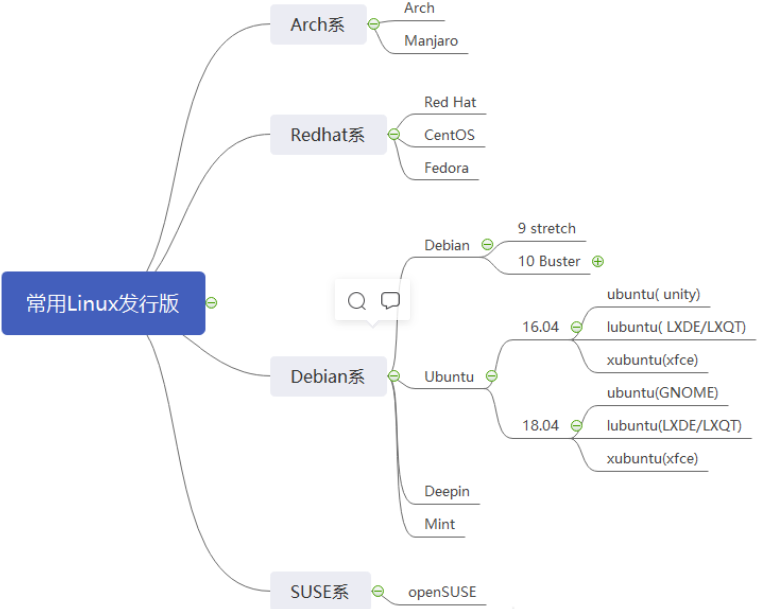

##### 2. Linux 与 Unix 的关系

**UNIX：**

UNIX 操作系统由肯•汤普森（Ken Thompson）和丹尼斯•里奇（Dennis Ritchie，C语言之父）发明。它的部分技术来源可追溯到从 1965 年开始的 Multics 工程计划，该计划由贝尔实验室、美国麻省理工学院和通用电气公司联合发起，目标是开发一种交互式的、具有多道程序处理能力的分时操作系统，以取代当时广泛使用的批处理操作系统。

说明：分时操作系统使一台计算机可以同时为多个用户服务，连接计算机的终端用户交互式发出命令，操作系统采用时间片轮转的方式处理用户的服务请求并在终端上显示结果（操作系统将CPU的时间划分成若干个片段，称为时间片）。操作系统以时间片为单位，轮流为每个终端用户服务，每次服务一个时间片。

可惜，由于 Multics 工程计划所追求的目标太庞大、太复杂，以至于它的开发人员都不知道要做成什么样子，最终以失败收场。

以肯•汤普森为首的贝尔实验室研究人员吸取了 Multics 工程计划失败的经验教训，于 1969 年实现了一种分时操作系统的雏形，1970 年该系统正式取名为 UNIX。

自 1970 年后，UNIX 系统在贝尔实验室内部的程序员之间逐渐流行起来。1971-1972 年，肯•汤普森的同事丹尼斯•里奇发明了传说中的C语言，这是一种适合编写系统软件的高级语言，它的诞生是 UNIX  系统发展过程中的一个重要里程碑，它宣告了在操作系统的开发中， 汇编语言不再是主宰。

到了 1973 年，UNIX 系统的绝大部分源代码都用C语言进行了重写，这为提高 UNIX 系统的可移植性打下了基础（之前操作系统多采用汇编语言，对硬件依赖性强），也为提高系统软件的开发效率创造了条件。可以说，UNIX 系统与C语言是一对孪生兄弟，具有密不可分的关系。

随后出现了各种版本的 UNIX 系统，目前常见的有 Sun Solaris、FreeBSD、IBM AIX、HP-UX 等。

**Linux：**

Linux 内核最初是由李纳斯•托瓦兹（Linus Torvalds）在赫尔辛基大学读书时出于个人爱好而编写的，当时他觉得教学用的迷你版 UNIX 操作系统 Minix 太难用了，于是决定自己开发一个操作系统。第 1 版本于1991 年 9 月发布，当时仅有 10000 行代码。

李纳斯•托瓦兹没有保留 Linux 源代码的版权，公开了代码，并邀请他人一起完善 Linux。与 Windows 及其他有专利权的操作系统不同，Linux 开放源代码，任何人都可以免费使用它。

李纳斯•托瓦兹无疑是这个世界上最伟大的程序员之一，何况，他还搞出了全世界最大的程序员交友社区 GitHub (开源代码库及版本控制系统）。

#### （2）Linux 的安装

安装 Linux 操作系统有两种方法，一种是在裸机上直接安装（你需要格式化你本机的 Windows 操作系统），还有一种是在虚拟机上安装。推荐使用第二种方式来安装。所以我们需要先安装虚拟机，然后通过虚拟机来模拟出 Linux 操作系统。虚拟机的产品有很多，推荐使用 VMware 虚拟机。

##### 1. 安装 VMware

安装 VMware，在安装之前要先彻底卸载之前的 VMware，操作如下：

[VMware虚拟机卸载教程博客](https://blog.csdn.net/2201_75641637/article/details/129701071?ops_request_misc=%7B%22request%5Fid%22%3A%22b561f3fb2c2abd62f095b3344393dd83%22%2C%22scm%22%3A%2220140713.130102334..%22%7D&request_id=b561f3fb2c2abd62f095b3344393dd83&biz_id=0&utm_medium=distribute.pc_search_result.none-task-blog-2~all~top_positive~default-1-129701071-null-null.142^v100^pc_search_result_base2&utm_term=VMware卸载&spm=1018.2226.3001.4187)

1. 打开 `服务`，找到 VMware 开头的文件，全部停止；
2. 打开 `任务管理器`，找到 VMware 开头的进程，结束任务；
3. 打开 `控制面板`，更改 VMware，卸载 VMware，将 `产品配置` 和 `产品许可证信息` 改为不勾选，开始卸载；
4. 打开 `注册表编辑器`，找到 `HKEY_CURRENT_USER` 目录下的 `Software`，删除里面的 `VMware,Inc.` 目录；
5. 重启电脑。

安装 VMware，下一步即可，中间需要更改位置，该位置需提前创建文件夹。

安装完成破解秘钥。

##### 2. 安装 CentOS

下载 CentOS7 镜像。

**虚拟机配置向导：**

1. 打开 VMware，创建虚拟机，选择自定义；

2. 选择稍后安装操作系统；

3. 选择客户机操作系统，Linux，版本选择 `Red Hat Enterprise Linux 7 64 位`；

4. 命名虚拟机：centos-xq；

5. 配置处理器数量，默认为1个；

6. 配置虚拟机内存，默认为2G；

7. 配置虚拟网络，默认为网络地址转换（NAT）；

8. 选择磁盘选项，默认为创建新虚拟磁盘；

9. 分配磁盘容量，默认为20G，将虚拟磁盘拆分成多个文件；

	**磁盘容量20G，并不是真正的占用物理机的磁盘容量。而是随着后期Linux系统中服务的安装，文件的增多，最大可以分配20G的磁盘空间给我们使用，当然如果空间不够用，我们还可以扩容。**

10. 配置硬件：在新CD/DVD中选择镜像源（即CentOS）的所在位置，选择该ISO文件；

11. 完成虚拟机配置向导。

**安装 CentOS7：**

1. 点击开启此虚拟机，键盘上下选择 `install CentOS 7`，Ctrl+Alt 可以将鼠标移回Windows界面；

2. 选择语言，默认是英文，可以选择中文；

3. 时区选择上海；

4. 安装类型选择图形化桌面版（默认是迷你安装），选择GNOME桌面；

5. 配置磁盘分区，安装路径选择自己配置磁盘；

6. Linux 操作系统，我们一般设置3个分区。分别是 boot 分区，swap 分区(交换分区：如果内存不够用，交换分区可以临时充当内存)还有根分区。以总容量20G为例，一般分区大小设置如下： 

	boot分区1G，swap分区2G，根分区 17G；

7. 选择标准分区，点击+号，配置三个分区；

8. 配置网络，打开网络连接，修改主机名称：xq101；

9. 开始安装：

10. 设置root用户名密码：123456，自定义用户名：xq，密码：123456；

11. 安装（过程漫长）完成点击重启。

#### （3）Linux 的基本常识

##### 1. Linux 网络连接

网络连接有三种模式：桥接网络，网络地址转换，仅主机模式网络。

**桥接网络：**

桥接网络如下图：

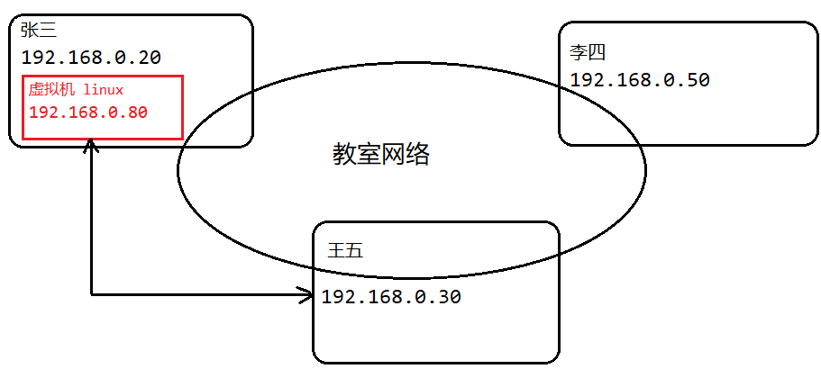

在桥接模式下，虚拟机里面的网络地址必须和外部的网络地址保持在同一网段（也就是前三组数字必须是一样的）。这样 Linux 操作系统才可以和外部的机器进行通信。但是如果用户人数太多，容易造成 IP 冲突。

**NAT 模式：**

NAT模式如下图：

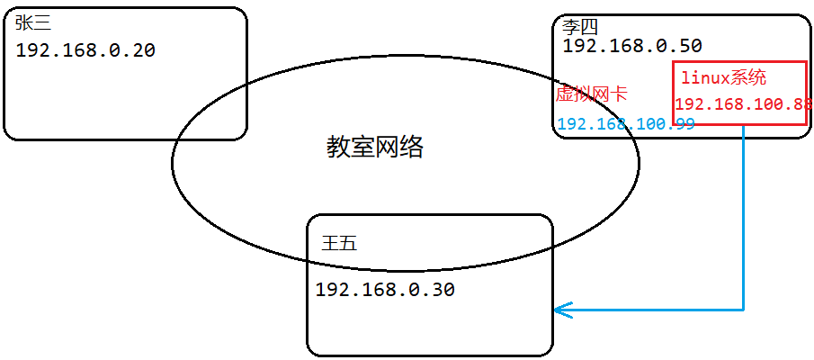

在 NAT 模式下，虚拟机里面的网络可以不再和主机里面的网络保持在同一网段。但是主机里面会存在虚拟网卡（192.168.100.99），这个虚拟网卡的 IP 地址必须和 Linux 里面的IP地址（192.168.100.88）在同一网段。这样 Linux 就可以通过虚拟网卡和主机之间进行通信了。同时也可以通过主机的真实地址（192.168.0.50）和外部网络进行通信。这样的好处是可以避免造成 IP 冲突。

**仅主机模式网络：**

Linux 系统的 IP 地址和主机的 IP 地址必须保持一致。

很少使用，因为如果主机的 IP 地址经常变化，那么配置的服务器有关 IP 的地址也要发生变化，需要经常修改，非常麻烦。

##### 2. 虚拟机的克隆

如果你已经安装了一台 Linux 操作系统，你还想要更多的 Linux 操作系统，这里我们就没有必要再重新安装Linux操作系统了，因为会非常的耗时、麻烦。你只需要在原来 Linux 操作系统上克隆就可以实现。

<font color="red">**注意：克隆的时候，需要先关闭 Linux 操作系统。**</font>

下面介绍两种克隆虚拟机的方式：

- 方式1：直接拷贝一份安装好的虚拟机文件。

	我们可以在已经安装的 Linux 操作系统所在的目录上，直接复制粘贴即可。复制 `centos-xq` 文件夹，粘贴到创建的目录即可。

	打开方式：在 VMware 选择文件，点击打开，选择复制的文件夹下的 `.vmx` 文件。

- 方式2：先关闭当前虚拟机，然后右键点击该虚拟机，找到管理，选择克隆；

	选择虚拟机当前状态；

	选择克隆方法，在选择克隆类型的时候，有两种：

	- 第一种：创建链接克隆。这种克隆的方式占用的磁盘空间较小，克隆时间更快。本质上还是使用原来的 Linux 操作系统，只是克隆了原 Linux 操作系统的引用。
	- 第二种：创建完整克隆。这种克隆的方式占用是磁盘空间较大，克隆时间比较慢，相当于把原来的 Linux 操作系统复制了一份。一般我们选择完整克隆。

	修改克隆的虚拟机的名称以及位置；

	点击完成。

##### 3. 虚拟机的快照

如果你在使用 Linux 操作系统的时候，你想回到原来的某一个状态（也就是可能出现在误操作上造成的系统异常），需要回到原先某个正常运行的状态，VMware 提供了这样的功能，就叫快照管理。

VMware 快照：

- 右键单击该虚拟机，选择快照；
- 设置快照的名称和描述，完成快照；
- 快照管理器中可以回滚至指定快照，或删除快照。

##### 4. 虚拟机的迁移与删除

当 Linux 操作系统安装完成之后，它的本质是以文件的形式保存在文件目录里面的。因此虚拟系统的前移也十分简单，只需要把安装好虚拟系统所在的文件夹直接剪切或拷贝至指定的目录即可。

删除也很简单，可以使用 VMware 自带的删除功能进行删除：

- 关闭 Linux 操作系统；
- 右键管理，选择从磁盘中删除。

##### 5. 安装 VMTools（现已不支持）

1. 弹出光驱，重新安装 VMTools；
2. 将 `VMware Tools` 光驱中的 `VMware Tools-xx.tar.gz` 复制到其他目录的计算机中的 `opt` 目录下；
3. 在控制台命令面板中解压该文件，然后进入 `vmware-tools-distrib` 目录下；
4. 执行 `vmware-install.pl` 文件，其他全选默认即可。

创建共享目录，设置该虚拟机的选项，共享文件夹选择总是启用，然后添加目录即可。

#### （4）Linux 的目录结构

Linux 的文件系统和 Windows 的文件不一样。Windows 文件系统中会有很多盘符，在盘符下面又有很多的文件目录。但是 Linux 文件目录不是这样的。Linux 文件系统采用的是层级式的树状目录结构，其中最上层的根目录是"/"，然后在此目录下面再创建其他的目录。Linux 的树状目录结构非常重要，它的树状图如下所示：


<font color="red">**在 Linux 世界里，一切皆为文件！**</font>

**`/bin` 目录：**

bin 是 Binary 的缩写, 这个目录存放着最经常使用的命令。比如我们常用的 cd 命令，cp 命令都是存放在 bin目录里面。

**`/sbin` 目录：**

s 就是 Super User 的意思，这里存放的是系统管理员使用的系统管理程序。

**`/home` 目录：**

存放普通用户的主目录，在 Linux 中每个用户都有一个自己的目录，一般该目录名是以用户的账号命名的。

使用命令的方式创建一个用户：

```cmd
[root@xq100 ~] useradd tom  #创建一个tom用户
[root@xq100 ~] userdel -r tom  # 删除指定的用户及其对应的文件夹
```

**`/root` 目录：**

该目录为系统管理员（root），也称作超级权限者的用户主目录。如果我们使用 root 账户登录，默认所处的目录位置就是在 `/root`下面。

**`/lib` 目录：**

系统开机所需要最基本的动态连接共享库，其作用类似于 Windows 里的 `DLL` 文件。几乎所有的应用程序都需要用到这些共享库。如果这个目录里面的文件被删除了，Linux 操作系统也就不能正常运行了。

**`/etc` 目录：**

所有的系统管理所需要的配置文件和子目录。Linux 系统本身所需要用到的配置文件也是存放在 `etc` 目录。如果我们自己安装一些系统服务，比如 mysql 数据库服务，那么和数据库相关的配置文件（my.cnf）也是存放在 `/etc` 目录里面。

**`/usr` 目录：**

这是一个非常重要的目录，用户的很多应用程序和文件都放在这个目录下，类似与 Windows下的 program files 目录。

**`/boot` 目录：**

存放的是启动 Linux 时使用的一些核心文件，包括一些连接文件以及镜像文件。如果这个目录里面的文件被删除了，Linux 操作系统也就不能正常运行了。

**`/dev` 目录：**

类似于 Windows 的设备管理器，把所有的硬件用文件的形式存储。

**`/proc` 目录：**

这个目录是一个虚拟的目录，它是系统内存的映射，访问这个目录来获取系统的信息。这个目录我们不要动，否则可能造成系统的崩溃。

**`/srv` 目录：**

 service 的缩写，该目录存放的一些服务服务启动之后需要提取的数据。这个目录我们不要动，否则可能造成系统的崩溃。

**`/sys` 目录：**

这个目录存放了 Linux 内核相关的文件信息。这个目录我们不要动，否则可能造成系统的崩溃。

**`/tmp` 目录：**

这个目录是用来存放一下临时文件的。

**`/media` 目录：**

 Linux 系统会自动识别一些设备，例如U盘、光驱等等，当识别后，Linux 会把识别的设备挂载到这个目录下。比如我们插入的U盘、光驱都会被映射成对应的文件存放在 media 目录。

**`/mnt` 目录：**

系统提供该目录是为了让用户临时挂载别的文件系统的，我们可以将外部的存储挂载在 `/mnt/` 上，然后进入该目录就可以查看里的内容了。比如我们上节内容设置的共享目录 `myshare`。

**`/opt` 目录：**

这是主机给安装软件所存放的目录，如果安装 JDK 可放到改目录下默认为空。

**`/usr/local` 目录：**

简单的说就是应用程序安装之后，安装程序所存放的目录。一般是通过编译源码方式安装的程序。

**`/var` 目录：**

这个目录中存放着在不断变化，扩充着的东西，最常用的就是包括各种日志文件。

### 二、Linux 基本实操

#### （1）远程操作

在这里介绍两个远程操作工具。一个是远程登录 Linux 操作系统的工具，一个是进行远程文件传输下载的工具。

##### 1. 远程登录

在实际工作中，Linux 服务器是开发小组共享的，并不是存放在每个用户的本地电脑上，Linux 服务器一般会存在在一台独立的电脑上(独立的机房里)。所以我们需要远程的登录到 Linux 进行相关的操作。

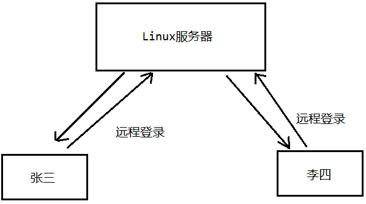

**XShell：**

1. 安装并破解 XShell；

2. 在虚拟机中查看获取远程连接 Linux 操作系统的 IP 地址：

	```cmd
	[root@xq100 ~] ip addr
	```

3. 打开 XShell，点击文件新建会话；

4. 修改命名，主机为刚才获取的 IP 地址，然后连接；

5. 保存文件，输入用户名和密码，点击确定。

##### 2. 远程文件传输

**FileZilla：**

1. 安装 FIleZilla；
2. 主机连接在虚拟机中获取的 IP 地址，输入用户名 root，密码，FTP 端口默认为21，SFTP 端口默认为22，快速连接；
3. 左侧为 Windows 系统，右侧为 Linux 系统；
4. 上传文件：在 Windows 操作系统选择指定文件，右键上传即可；
5. 下载文件：在 Linux 操作系统选择指定文件，右键下载即可。

##### 3. Vi/Vim 编辑器

所有的 Linux 系统都会内置 Vi 文本编辑器。Vim 具有程序编辑的能力，可以看做是 Vi 的增强版本，可以主动的以字体颜色辨别语法的正确性，方便程序设计。代码补完、编译及错误跳转等方便编程的功能特别丰富，在程序员中被广泛使用。

**Vim 文本编辑器的三种模式：**

- 正常模式（普通模式）：以 vim 打开一个档案就是直接进入了一般默认（这是正常的模式），在这个模式中，可以通过上下左右来移动光标，你也可以使用【删除字符】【删除整行】来编辑档案中的内容，也可以使用【复制】【贴上】来处理你的文件数据。

- 插入模式（编辑模式）：普通模式按下 i，l，o，O，a等任意一个字母之后才会进入编辑模式，可以在文本内容中输入内容，一般情况按下 i 即可。

- 命令行模式： 在这个模式当中，可以提供你相关指令，完成读取，存盘，替换 vim，显示行号等操作是在此模式下完成的。

	按ESC键，再按 shift+: 键可以切换为底行模式

	输入 wq 保存并退出，输入 q 直接退出，输入 q! 不保存退出。

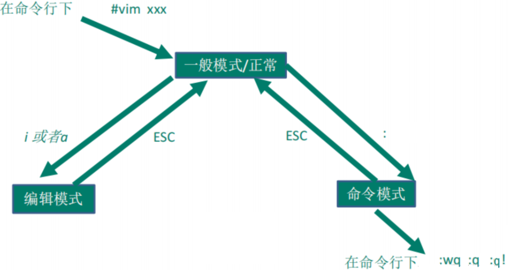

**vim 的常用快捷键：**

```txt
yyp		复制当前行
2yyp	复制当前光标开始的两行

dd			删除当前行
数字+dd	   删除当前光标向下指定的行数

:/关键字	查找关键字

:set nu		设置显示行号
:set nonu 	设置不显示行号

G 				将光标定位到文件末尾处
gg 				将光标定位到文件起始位置
行号shift+g	   将光标定位到指定行号

u		撤销

:%s/原关键字/新关键字/g		替换关键字，s表示全文替换，g表示全部替换
```

##### 4. 关机重启

**`shutdown` 命令：**

```txt
shutdown	关机
shutdown -h now 	立即关机
shutdown -h 数字	   指定分钟数后关机
shutdown -r now		立即重启
```

**`halt` 关机：**

意思是直接使用，效果等同于关机。

**`sync` 同步：**

把内存的数据同步到磁盘。

**`reboot` 重启：**

重启系统。

<font color="red">**不管是重启系统还是关闭系统，首先要运行 `sync` 命令，把内存中的数据写入到磁盘中。目前的 `shutdown`、`reboot`、`halt` 命令在关机前都进行了 `sync` 命令。**</font>

#### （2）用户操作

Linux 系统是一个多用户多任务的操作系统，任何一个要使用系统资源的用户，都必须首先向系统管理员申请一个账号，然后以这个账号的身份进入系统。

##### 1. 用户登录和注销

**命令：**

```txt
su root 	切换到root用户
exit 		退出（注销）
```

如果从低权限用户切换为高权限用户，则需要输入密码，反之则不需要。输入密码时不会显示密码。

##### 2. 添加用户

创建用户的权限只有管理员才有，在 root 用户下，我们可以创建很多其它的用户，并且这些用户都会生成对应的目录，这些目录位于 `/home/用户名` 的目录下面。如果我们使用自己创建的用户登录，默认的情况下，用户所在的目录就是 `/home/用户名` 目录所在的位置。

**命令：**

```txt
useradd 用户名					创建用户，用户目录默认与用户名同名
useradd -d 目录名称 用户名		创建用户的同时自定义用户目录名称（很少使用）
```

<font color="blue">示例：创建一个名为 kobe 的用户。</font>

```cmd
[root@xq101 ~]# useradd kobe
[root@xq101 ~]# cd /home
[root@xq101 home]# ll
总用量 0
drwx------. 3 kobe kobe  78 11月 25 20:20 kobe
drwx------. 5 xq   xq   147 11月 25 20:14 xq
[root@xq101 home]# 
```

##### 3. 为用户添加密码

**命令：**

```txt
passwd 用户名
```

<font color="blue">示例：</font>

```cmd
[root@xq101 home]# passwd kobe
更改用户 kobe 的密码 。
新的 密码：
无效的密码： 密码未通过字典检查 - 过于简单化/系统化
重新输入新的 密码：
passwd：所有的身份验证令牌已经成功更新。
[root@xq101 home]# exit
登出
Connection closing...Socket close.

Connection closed by foreign host.

Disconnected from remote host(centos7-xq) at 20:30:25.

Type `help' to learn how to use Xshell prompt.
[C:\~]$ 

Connecting to 192.168.56.128:22...
Connection established.
To escape to local shell, press 'Ctrl+Alt+]'.

/usr/bin/xauth:  file /home/kobe/.Xauthority does not exist
[kobe@xq101 ~]$ pwd
/home/kobe
```

在改密码时，不会显示输入的字符密码。

##### 4. 删除用户

删除用户有两种情况，一种是只删除用户数据，保存用户对应的目录。还有一种是删除用户，连用户对应的目录也删除掉，通常使用第二种。

**命令：**

```txt
userdel 用户名		删除用户，保存用户对应的目录 
userdel -r 用户名	删除用户，对应的用户目录也删除掉 
```

<font color="blue">示例：</font>

```cmd
[root@xq101 ~]# userdel -r kobe
[root@xq101 ~]# cd /home
[root@xq101 home]# ll
总用量 0
drwx------. 5 xq xq 147 11月 25 20:14 xq
[root@xq101 home]# 
```

##### 5. 查询用户信息

**命令：**

```txt
id 用户名		显示用户id，组id，组名
whoami		  查看当前用户名
who am i	  显示当前用户的用户名，伪终端及编号，登录时间与IP地址
```

##### 6. 用户组

用户组类似于角色，系统可以对有共性（权限）的多个用户进行统一管理。我们可以通过下面一幅图来理解组的概念。


**命令：**

```txt
groupadd 组名		创建用户组
useradd -g 组名 用户名		在创建用户的时候为该用户创建组

usermod -g 组名 用户名		修改用户所在的用户组

groupdel 组名		删除用户组
```

<font color="blue">示例：</font>

```cmd
[root@xq101 home]# groupadd wudang
[root@xq101 home]# groupdel wudang
[root@xq101 home]# groupdel wu
groupdel：“wu”组不存在
[root@xq101 home]# groupadd wudang
[root@xq101 home]# useradd -g wudang zhangsanfeng
[root@xq101 home]# id zhangsanfeng
uid=1001(zhangsanfeng) gid=1001(wudang) 组=1001(wudang)
[root@xq101 home]# usermod -g kunlun zhangsanfeng
[root@xq101 home]# id zhangsanfeng
uid=1001(zhangsanfeng) gid=1002(kunlun) 组=1002(kunlun)
```

##### 7. 用户与组的相关文件

**`/etc/passwd` 文件：**

用户的配置文件，记录用户的各种信息。

每行的含义：用户名：口令：用户标识号：组标识号：注释性描述：主目录：登录shell。

**`/etc/shadow` 文件：**

口令的配置文件，用户登录的时候需要口令(密码)。口令的验证都是通过这个shadow文件去验证的。

每行的含义：登录名：加密口令：最后一次修改的时间：最小时间间隔：最大时间间隔：警告时间：不活动时间：失效时间：标志。

#### （3）Linux 的运行级别

Linux 操作系统运行的7种级别与对应编号：

- 0：关机；
- 1：单用户（找回用户丢失的密码，可以使用单用户模式）；
- 2：多用户状态但没有网络服务（一般很少用）；
- 3：多用户状态但有网络服务（没有图形化界面，但是有网络，这种用的最多），启动速度非常快；
- 4：系统未使用，保留给用户（很少用）；
- 5：图形界面，启动较慢，也经常使用；
- 6：系统重启。

常用的运行级别是3和5，我们也可以指定系统默认的运行级别。可以在 `/etc/inittab` 文件中查看详细的运行级别相关信息。

**命令：**

```txt
init 级别编号		切换到指定运行级别
systemctl get-default					查看当前默认运行级别	
systemctl set-default 运行级别名称		设置默认运行级别（生效需重启）
```

<font color="blue">示例：</font>

```cmd
[root@xq101 ~]# cat /etc/inittab
# inittab is no longer used when using systemd.
#
# ADDING CONFIGURATION HERE WILL HAVE NO EFFECT ON YOUR SYSTEM.
#
# Ctrl-Alt-Delete is handled by /usr/lib/systemd/system/ctrl-alt-del.target
#
# systemd uses 'targets' instead of runlevels. By default, there are two main targets:
#
# multi-user.target: analogous to runlevel 3
# graphical.target: analogous to runlevel 5
#
# To view current default target, run:
# systemctl get-default
#
# To set a default target, run:
# systemctl set-default TARGET.target
#
[root@xq101 ~]# systemctl set-default graphical.target
Removed symlink /etc/systemd/system/default.target.
Created symlink from /etc/systemd/system/default.target to /usr/lib/systemd/system/graphical.target.
[root@xq101 ~]# systemctl get-default
graphical.target
```

#### （4）找回 root 密码

1. 进入到 Linux 开机界面，然后按e键；

	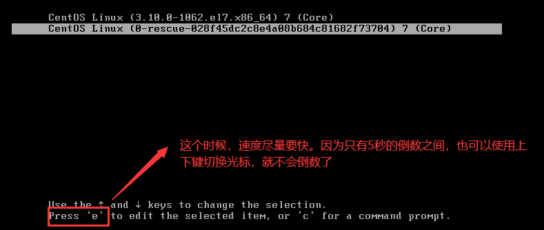

2. 按下e键然后进入另一个界面，找到以Linux16开头的行数。在行的最后面输入：`init=/bin/sh`，然后按回车；

	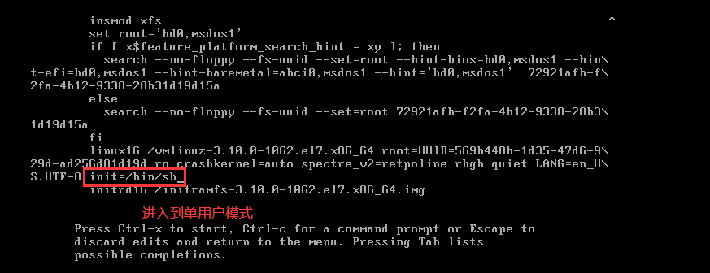

3. 接着输入完成之后，直接按快捷键 Ctrl + X 进入单用户模式；

4. 接着在光标闪烁的位置输入：`mount -o remount,rw /`，然后按回车键；

	

5. 在新的一行最后面输入：`passwd`，然后按回车键。输入密码，然后再次输入确认密码（密码长度最好是8位以上，但不是必须的）。修改密码时，密码不会显示。新密码为 `root`。密码修改成功之后，会显示 `passwd .....` 的字样，说明密码修改成功。

	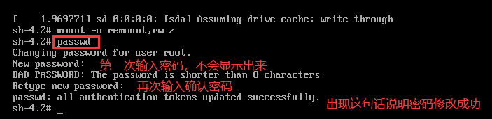

6. 接着在光标闪烁的位置输入：`touch /.autorelabel` （注意 `touch` 与后面的 `/` 之间有空格）。完成后按回车。

	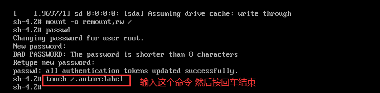

7. 接着在光标闪烁的位置继续输入：`exec /sbin/init` （注意 `exec` 与后面的 `/` 之间有空格）。然后按回车键，等待系统自动修改密码（这个时间可能会有点长，请耐心等待）。完成后系统会自动重启，新的密码生效了。

	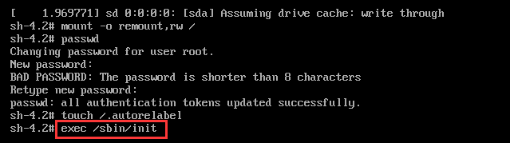

#### （5）修改命令提示符

命令提示符在 Linux 里是 PS1变量。

修改方法如下：

1. 修改 `bashrc` 文件，若没有则创建：

	```bash
	vi ~/.bashrc
	```

2. 修改 PS1 变量，若没有则创建：

	```bash
	PS1='[\u@\h \W]\$ '
	```

3. 重新加载

	```bash
	source ~/.bashrc
	```

#### （6）Linux 帮助命令

**命令：**

```txt
man 命令名			获取指定命令的详细信息
q					结束浏览

ls -a			   列出当前目录下面的隐藏文件（注意：Linux操作系统下面的隐藏文件都是以.开头的）
ls -l(简写ll)				以列表的形式展示指定目录下面的文件
ls -la					组合使用上面的两个参数

help 命令				 获得shell内置命令的帮助信息
```

<font color="blue">示例：</font>

```cmd
[root@xq101 ~]# ls
anaconda-ks.cfg  Hello.java  initial-setup-ks.cfg  公共  模板  视频  图片  文档  下载  音乐  桌面

[root@xq101 ~]# ls -a
.                .bash_history  .bashrc  .cshrc     Hello.java            .local    .tcshrc      公共  图片  音乐
..               .bash_logout   .cache   .dbus      .ICEauthority         .mozilla  .viminfo     模板  文档  桌面
anaconda-ks.cfg  .bash_profile  .config  .esd_auth  initial-setup-ks.cfg  .pki      .Xauthority  视频  下载

[root@xq101 ~]# ls -l
总用量 12
-rw-------. 1 root root 1715 11月 24 15:12 anaconda-ks.cfg
-rw-r--r--. 1 root root  216 11月 25 20:01 Hello.java
-rw-r--r--. 1 root root 1746 11月 24 15:15 initial-setup-ks.cfg
drwxr-xr-x. 2 root root    6 11月 24 15:18 公共
drwxr-xr-x. 2 root root    6 11月 24 15:18 模板
drwxr-xr-x. 2 root root    6 11月 24 15:18 视频
drwxr-xr-x. 2 root root    6 11月 24 15:18 图片
drwxr-xr-x. 2 root root    6 11月 24 15:18 文档
drwxr-xr-x. 2 root root    6 11月 24 15:18 下载
drwxr-xr-x. 2 root root    6 11月 24 15:18 音乐
drwxr-xr-x. 2 root root    6 11月 24 15:18 桌面

[root@xq101 ~]# ls -al
总用量 68
dr-xr-x---. 16 root root 4096 11月 26 19:05 .
dr-xr-xr-x. 17 root root  245 11月 26 16:31 ..
-rw-------.  1 root root 1715 11月 24 15:12 anaconda-ks.cfg
-rw-------.  1 root root  910 11月 26 16:34 .bash_history
-rw-r--r--.  1 root root   18 12月 29 2013 .bash_logout
-rw-r--r--.  1 root root  176 12月 29 2013 .bash_profile
-rw-r--r--.  1 root root  176 12月 29 2013 .bashrc
drwx------. 17 root root 4096 11月 26 16:32 .cache
drwxr-xr-x. 16 root root 4096 11月 24 18:46 .config
-rw-r--r--.  1 root root  100 12月 29 2013 .cshrc
drwx------.  3 root root   25 11月 24 15:14 .dbus
-rw-------.  1 root root   16 11月 24 15:18 .esd_auth
-rw-r--r--.  1 root root  216 11月 25 20:01 Hello.java
-rw-------.  1 root root 4340 11月 26 19:05 .ICEauthority
-rw-r--r--.  1 root root 1746 11月 24 15:15 initial-setup-ks.cfg
drwx------.  3 root root   19 11月 24 15:18 .local
drwx------.  5 root root   66 11月 24 15:20 .mozilla
drwxr-----.  3 root root   19 11月 24 15:22 .pki
-rw-r--r--.  1 root root  129 12月 29 2013 .tcshrc
-rw-------.  1 root root 1250 11月 25 20:06 .viminfo
-rw-------.  1 root root  102 11月 26 19:05 .Xauthority
drwxr-xr-x.  2 root root    6 11月 24 15:18 公共
drwxr-xr-x.  2 root root    6 11月 24 15:18 模板
drwxr-xr-x.  2 root root    6 11月 24 15:18 视频
drwxr-xr-x.  2 root root    6 11月 24 15:18 图片
drwxr-xr-x.  2 root root    6 11月 24 15:18 文档
drwxr-xr-x.  2 root root    6 11月 24 15:18 下载
drwxr-xr-x.  2 root root    6 11月 24 15:18 音乐
drwxr-xr-x.  2 root root    6 11月 24 15:18 桌面

[root@xq101 ~]# help cd
cd: cd [-L|[-P [-e]]] [dir]
    Change the shell working directory.
    
    Change the current directory to DIR.  The default DIR is the value of the
    HOME shell variable.
    
    The variable CDPATH defines the search path for the directory containing
    DIR.  Alternative directory names in CDPATH are separated by a colon (:).
    A null directory name is the same as the current directory.  If DIR begins
    with a slash (/), then CDPATH is not used.
    
    If the directory is not found, and the shell option `cdable_vars' is set,
    the word is assumed to be  a variable name.  If that variable has a value,
    its value is used for DIR.
    
    Options:
        -L	force symbolic links to be followed
        -P	use the physical directory structure without following symbolic
    	links
        -e	if the -P option is supplied, and the current working directory
    	cannot be determined successfully, exit with a non-zero status
    
    The default is to follow symbolic links, as if `-L' were specified.
    
    Exit Status:
    Returns 0 if the directory is changed, and if $PWD is set successfully when
    -P is used; non-zero otherwise.
```

### 三、Linux 的常用指令

#### （1）文件/目录相关命令

在 Linux 操作系统里面，获取文件的方式有两种，一种是通过绝对路径的方式获取文件，一种是相对路径获取文件。

假设我们在当前指定的目录下面，想要获取指定的文件，可以通过相对路径和绝对路径的方式来获取。


##### 1. 文件目录修改操作

**命令：**

```txt
pwd			获取当前目录所在的绝对路径

ls 			显示当前目录下面的所有文件(目录)

cd 目录名	  切换到指定目录
cd ~		切换到当前账户所属的目录
cd /		切换到系统根目录
cd ..		回到当前目录的上一级目录
cd -		切换到上一条命令的目录

mkdir 目录名				创建目录
mkdir -p 目录名1/目录名2	  创建多级目录

rmdir 目录名				删除空目录

touch 文件名				创建空文件

cp 文件名 目录名			  将指定文件拷贝到指定目录
cp -r 目录名 目录名		  将指定目录及其内部的所有文件拷贝到指定目录			

rm 目录或文件名			  移除文件或目录
rm -rf 目录名				删除非空目录或文件（参数r为递归删除，参数f为不询问删除）

mv 文件或目录名 新名字 	  		   在同一级目录操作：重命名
mv 文件或目录名 新目录/新文件名		在不同目录操作：剪切同时重命名
```

<font color="blue">示例：</font>

```cmd
[root@xq101 ~]# cd /home
[root@xq101 home]# pwd
/home
[root@xq101 home]# cd xq
[root@xq101 xq]# pwd
/home/xq

[root@xq101 xq]# cd /root
[root@xq101 ~]# ls
anaconda-ks.cfg  Hello.java  initial-setup-ks.cfg  公共  模板  视频  图片  文档  下载  音乐  桌面

[root@xq101 ~]# cd ~
[root@xq101 ~]# pwd
/root
[root@xq101 ~]# cd -
/root

[root@xq101 kobe]# mkdir dog
[root@xq101 kobe]# ll
总用量 0
drwxr-xr-x. 2 root root 6 11月 26 19:50 dog
[root@xq101 kobe]# rmdir dog/
rmdir: 删除 "dog/" 失败: 目录非空
[root@xq101 kobe]# mkdir -p first/second
[root@xq101 kobe]# rmdir first
rmdir: 删除 "first" 失败: 目录非空

[root@xq101 dog]# touch hello.txt

[root@xq101 dog]# cp hello.txt /home/kobe/first
[root@xq101 dog]# cd ..
[root@xq101 kobe]# cd first/
[root@xq101 first]# ll
总用量 0
-rw-r--r--. 1 root root 0 11月 26 20:23 hello.txt
drwxr-xr-x. 2 root root 6 11月 26 19:58 second

[root@xq101 kobe]# cp -r first/ dog/
[root@xq101 kobe]# cd dog/
[root@xq101 dog]# ll
总用量 4
-rw-r--r--. 1 root root  8 11月 26 19:55 dog.txt
drwxr-xr-x. 3 root root 37 11月 26 20:29 first
-rw-r--r--. 1 root root  0 11月 26 20:03 hello.txt

[root@xq101 dog]# rm -r first/
rm：是否进入目录"first/"? yes
rm：是否删除目录 "first/second"？yes
rm：是否删除普通空文件 "first/hello.txt"？yes
rm：是否删除目录 "first/"？yes
[root@xq101 dog]# ll
总用量 4
-rw-r--r--. 1 root root 8 11月 26 19:55 dog.txt
-rw-r--r--. 1 root root 0 11月 26 20:03 hello.txt

[root@xq101 dog]# mv hello.txt demo1.txt
[root@xq101 dog]# ll
总用量 4
-rw-r--r--. 1 root root 0 11月 26 20:03 demo1.txt
-rw-r--r--. 1 root root 8 11月 26 19:55 dog.txt

[root@xq101 dog]# mv demo1.txt /home/kobe/first/demo.txt
[root@xq101 dog]# cd ..
[root@xq101 kobe]# cd first/
[root@xq101 first]# ll
总用量 0
-rw-r--r--. 1 root root 0 11月 26 20:03 demo.txt
-rw-r--r--. 1 root root 0 11月 26 20:23 hello.txt
drwxr-xr-x. 2 root root 6 11月 26 19:58 second
[root@xq101 first]# cd ..
[root@xq101 kobe]# cd dog/
[root@xq101 dog]# ll
总用量 4
-rw-r--r--. 1 root root 8 11月 26 19:55 dog.txt
```

##### 2. 文件目录查询操作

**`cat` 命令：**

```txt
cat [参数] 文件名			查看文件
cat -n 文件名			 	 显示行号，查看文件
cat [参数] 文件名 | more		管道命令，分页展示
```

**`more` 命令：**

`more` 指令是一个基于 vi 编辑器的文本过滤器，他以全屏的方式显示文本文件的内容，`more` 指令内置了若干快捷键。

```txt
more 文件名
```

**`more` 命令快捷键操作：**

| 操作     | 功能列表                          |
| -------- | --------------------------------- |
| 空格     | 向下翻页                          |
| 回车     | 向下翻一行                        |
| q        | 代表立刻 `more`，不再显示文件内容 |
| Ctrl + F | 向下滚动一屏幕                    |
| Ctrl + B | 返回上一屏                        |
| =        | 输出当前行号                      |
| :f       | 输出文件名和当前行号              |

**`less` 命令：**

```txt
less 文件名
```

`less` 指令用于来分屏查看文件内容，他的功能与 `more` 类似，但是比 `more` 更加强大，支持各种显示终端。`less` 指令在显示文件内容时，并不是一次将整个文件加载后才显示的，而是根据要加载的内容，对 显示大型文件具有高效率。

**`less` 命令快捷键：**

| 操作        | 功能列表                             |
| ----------- | ------------------------------------ |
| 空格        | 向下翻动一页                         |
| 上箭头      | 向上翻动一页                         |
| 下箭头      | 向下翻动一页                         |
| /字符串内容 | 搜索字符串，n：向下搜索，N：向上搜索 |
| q           | 立刻退出，不再显示文件内容           |

**`echo` 命令：**

```txt
echo 变量名			将变量输出到控制台
echo 字段				 将字段输出到控制台
echo 字段 > 文件名		将字段覆盖指定文件的内容
echo 字段 >> 文件名		将字段追加到指定文件的末尾
```

<font color="blue">示例：</font>

```cmd
[root@xq101 dog]# echo "hello"
hello
[root@xq101 dog]# echo $PATH
/usr/local/sbin:/usr/local/bin:/usr/sbin:/usr/bin:/root/bin
[root@xq101 dog]# echo $HOSTNAME
xq101

[root@xq101 first]# echo "hello world" > demo.txt 
[root@xq101 first]# echo "hello java" >> demo.txt 
[root@xq101 first]# cat demo.txt 
hello world
hello java
[root@xq101 first]# echo "hello Linux" > demo.txt 
[root@xq101 first]# cat demo.txt 
hello Linux
```

**`head` 与 `tail` 命令：**

```txt
head 文件名 					 显示文件开头的内容，默认为10行(包括空行)
head -n 行数 文件名		   	   显示指定行数的开头内容(包括空行)

tail 文件名					 显示文件末尾的内容，默认为10行(包括空行)
tail -n 行数 文件名		   	   显示指定行数的末尾内容(包括空行)
tail -f 文件					 实时监控文件发生的变化
```

<font color="blue">示例：</font>

```cmd
[root@xq101 ~]# head /etc/profile
# /etc/profile

# System wide environment and startup programs, for login setup
# Functions and aliases go in /etc/bashrc

# It's NOT a good idea to change this file unless you know what you
# are doing. It's much better to create a custom.sh shell script in
# /etc/profile.d/ to make custom changes to your environment, as this
# will prevent the need for merging in future updates.

[root@xq101 ~]# head -n 5 /etc/profile
# /etc/profile

# System wide environment and startup programs, for login setup
# Functions and aliases go in /etc/bashrc

[root@xq101 ~]# tail /etc/profile
        if [ "${-#*i}" != "$-" ]; then 
            . "$i"
        else
            . "$i" >/dev/null
        fi
    fi
done

unset i
unset -f pathmunge
[root@xq101 ~]# tail -n 5 /etc/profile
    fi
done

unset i
unset -f pathmunge

```

**软连接：**

软连接也称为符号链接，类似中 Windows 里面的快捷方式，主要是存放了链接文件的路径。

```txt
ln -s [源文件或目录] [软连接名称]			
```

<font color="blue">示例：</font>

```cmd
[root@xq101 kobe]# ln -s /root linkRoot
[root@xq101 kobe]# ll
总用量 0
drwxr-xr-x. 2 root root 21 11月 26 20:37 dog
drwxr-xr-x. 3 root root 53 11月 26 20:37 first
lrwxrwxrwx. 1 root root  5 11月 27 10:54 linkRoot -> /root
[root@xq101 kobe]# cd linkRoot/
[root@xq101 linkRoot]# ll
总用量 12
-rw-------. 1 root root 1715 11月 24 15:12 anaconda-ks.cfg
-rw-r--r--. 1 root root  216 11月 25 20:01 Hello.java
-rw-r--r--. 1 root root 1746 11月 24 15:15 initial-setup-ks.cfg
drwxr-xr-x. 2 root root    6 11月 24 15:18 公共
drwxr-xr-x. 2 root root    6 11月 24 15:18 模板
drwxr-xr-x. 2 root root    6 11月 24 15:18 视频
drwxr-xr-x. 2 root root    6 11月 24 15:18 图片
drwxr-xr-x. 2 root root    6 11月 24 15:18 文档
drwxr-xr-x. 2 root root    6 11月 24 15:18 下载
drwxr-xr-x. 2 root root    6 11月 24 15:18 音乐
drwxr-xr-x. 2 root root    6 11月 24 15:18 桌面
[root@xq101 linkRoot]# cd ..
[root@xq101 kobe]# rm -f linkRoot/
rm: 无法删除"linkRoot/": 是一个目录
[root@xq101 kobe]# rm -rf linkRoot
```

**`history` 命令：**

```txt
history  			查看当前用户的历史指令
history 数量 		   查看当前用户指定数量的历史指令
```

<font color="blue">示例：</font>

```cmd
[root@xq101 kobe]# history 10
  251  ln -s /root linkRoot
  252  ll
  253  cd linkRoot/
  254  ll
  255  cd ..
  256  rm -f linkRoot/
  257  rm -rf linkRoot/
  258  ll
  259  history
  260  history 10
```

#### （2）时间指令

**`date` 日期命令：**

```txt
date						显示当前时间
date +%Y					显示当前年份
date +%m					显示当前月份
date +%d					显示当前是哪一天
date +%H					显示当前小时
date +%M					显示当前分钟
date +%S					显示当前秒
date "+%参数"				   按指定格式输出时间

date -s 字符串时间			 设置时间
```

<font color="blue">示例：</font>

```cmd
[root@xq101 kobe]# date
2024年 11月 27日 星期三 11:03:02 CST
[root@xq101 kobe]# date +%Y
2024
[root@xq101 kobe]# date +%m
11
[root@xq101 kobe]# date +%d
27
[root@xq101 kobe]# date +%H
11
[root@xq101 kobe]# date +%M
17
[root@xq101 kobe]# date +%S
59
[root@xq101 kobe]# 

[root@xq101 kobe]# date "+%Y-%m-%d %H:%M:%S"
2024-11-27 11:03:42
```

**`cal` 日历命令：**

```txt
cal					显示当前月份的日历
cal 年份			   显示指定年份的日历
```

<font color="blue">示例：</font>

```cmd
[root@xq101 kobe]# cal
     十一月 2024    
日 一 二 三 四 五 六
                1  2
 3  4  5  6  7  8  9
10 11 12 13 14 15 16
17 18 19 20 21 22 23
24 25 26 27 28 29 30
[root@xq101 kobe]# cal 2019
                               2019                               

        一月                   二月                   三月        
日 一 二 三 四 五 六   日 一 二 三 四 五 六   日 一 二 三 四 五 六
       1  2  3  4  5                   1  2                   1  2
 6  7  8  9 10 11 12    3  4  5  6  7  8  9    3  4  5  6  7  8  9
13 14 15 16 17 18 19   10 11 12 13 14 15 16   10 11 12 13 14 15 16
20 21 22 23 24 25 26   17 18 19 20 21 22 23   17 18 19 20 21 22 23
27 28 29 30 31         24 25 26 27 28         24 25 26 27 28 29 30
                                              31
        四月                   五月                   六月        
日 一 二 三 四 五 六   日 一 二 三 四 五 六   日 一 二 三 四 五 六
    1  2  3  4  5  6             1  2  3  4                      1
 7  8  9 10 11 12 13    5  6  7  8  9 10 11    2  3  4  5  6  7  8
14 15 16 17 18 19 20   12 13 14 15 16 17 18    9 10 11 12 13 14 15
21 22 23 24 25 26 27   19 20 21 22 23 24 25   16 17 18 19 20 21 22
28 29 30               26 27 28 29 30 31      23 24 25 26 27 28 29
                                              30
        七月                   八月                   九月        
日 一 二 三 四 五 六   日 一 二 三 四 五 六   日 一 二 三 四 五 六
    1  2  3  4  5  6                1  2  3    1  2  3  4  5  6  7
 7  8  9 10 11 12 13    4  5  6  7  8  9 10    8  9 10 11 12 13 14
14 15 16 17 18 19 20   11 12 13 14 15 16 17   15 16 17 18 19 20 21
21 22 23 24 25 26 27   18 19 20 21 22 23 24   22 23 24 25 26 27 28
28 29 30 31            25 26 27 28 29 30 31   29 30

        十月                  十一月                 十二月       
日 一 二 三 四 五 六   日 一 二 三 四 五 六   日 一 二 三 四 五 六
       1  2  3  4  5                   1  2    1  2  3  4  5  6  7
 6  7  8  9 10 11 12    3  4  5  6  7  8  9    8  9 10 11 12 13 14
13 14 15 16 17 18 19   10 11 12 13 14 15 16   15 16 17 18 19 20 21
20 21 22 23 24 25 26   17 18 19 20 21 22 23   22 23 24 25 26 27 28
27 28 29 30 31         24 25 26 27 28 29 30   29 30 31


```

#### （3）查找指令

**`find` 命令：**

将从指定目录下递归地遍历各个目录，将所有满足条件的目录显示在控制台。

```txt
find [搜索范围] [选项] 参数
```

| 选项  | 功能                   |
| ----- | ---------------------- |
| -name | 按照文件的名称查找文件 |
| -user | 查找指定用户所属的文件 |
| -size | 按照指定的大小查找文件 |

<font color="blue">示例：</font>

```cmd
# 查询/home/kobe目录下面名称为dog.txt的文件
[root@xq101 kobe]# find /home/kobe -name dog.txt
/home/kobe/dog/dog.txt
# 查询/home目录下面文件名以.txt结尾的所有文件
[root@xq101 kobe]# find /home -name *.txt
/home/kobe/dog/dog.txt
/home/kobe/first/hello.txt
/home/kobe/first/demo.txt

[root@xq101 home]# find /home -user kobe 
/home/kobe
/home/kobe/.mozilla
/home/kobe/.mozilla/extensions
/home/kobe/.mozilla/plugins
/home/kobe/.bash_logout
/home/kobe/.bash_profile
/home/kobe/.bashrc

# 查询根目录下文件大小大于200M的文件
[root@xq101 home]# find / -size +200M
/proc/kcore
find: ‘/proc/3834/task/3834/fd/5’: 没有那个文件或目录
find: ‘/proc/3834/task/3834/fdinfo/5’: 没有那个文件或目录
find: ‘/proc/3834/fd/6’: 没有那个文件或目录
find: ‘/proc/3834/fdinfo/6’: 没有那个文件或目录
# 查询/home目录下文件大小小于1M的文件
[root@xq101 home]# find /home -size -1M
/home/kobe/first/hello.txt
# 查询/home目录下文件大小等于27k的文件
[root@xq101 home]# find /home -size 27k
```

**`locate` 命令：**

`locate` 指令可以快速定位文件路径。`locate` 指令利用事先建立好的系统中所有文件名称及路径的`locate` 数据库实现快速定位给定的文件。`locate` 指令无需遍历整个文件系统，查询速度较快。

<font color="red">**由于 `locate` 指令基于数据库进行查询。所以第一次查询运行前，必须使用 `updatedb` 指令创建 `locate` 数据库。**</font>

```txt
updatedb  				一定要先执行这个指令创建数据库
locate 文件名			  查找文件
```

<font color="blue">示例：</font>

```cmd
[root@xq101 home]# updatedb
[root@xq101 home]# locate dog.txt
/home/kobe/dog/dog.txt
```

**`which` 指令：**

```txt
which 命令			查看指定命令的所在位置
```

<font color="blue">示例：</font>

```bash
[root@xq101 ~]# which ls
alias ls='ls --color=auto'
	/usr/bin/ls
[root@xq101 ~]# which reboot
/usr/sbin/reboot
```

**`grep` 指令：**

`grep` 过滤查找，管道符 `|`，表示前一个指令的处理结果输出传递给后面的指令处理。一般我们将 `|` 和 `grep` 一起结合起来使用。

```txt
grep [选项] 查找内容 源文件			
```

| 选项 | 功能           |
| ---- | -------------- |
| -n   | 显示行号       |
| -i   | 忽略自动大小写 |

<font color="blue">示例：</font>

```bash
# 在Hello.java 文件里查询 hello 关键字，并显示行号且不区分大小写
[root@xq101 kobe]# cat Hello.java | grep -ni hello
1:public class Hello {
3:		System.out.println("Hello World");
```

#### （4）压缩与解压指令

**`gzip` 与 `gunzip` 指令**

`gzip` 用于压缩文件，`gunzip` 用于解压缩文件。

```txt
gzip 文件名		压缩指定文件，压缩后原文件自动删除
gunzip 文件名		解压指定文件，解压后压缩包自动删除
```

<font color="blue">示例：</font>

```bash
[root@xq101 kobe]# ll
总用量 4
drwxr-xr-x. 2 root root  21 11月 26 20:37 dog
drwxr-xr-x. 3 root root  53 11月 26 20:37 first
-rw-r--r--. 1 root root 104 11月 27 21:13 Hello.java
[root@xq101 kobe]# gzip Hello.java 
[root@xq101 kobe]# ll
总用量 4
drwxr-xr-x. 2 root root  21 11月 26 20:37 dog
drwxr-xr-x. 3 root root  53 11月 26 20:37 first
-rw-r--r--. 1 root root 123 11月 27 21:13 Hello.java.gz
[root@xq101 kobe]# gunzip Hello.java.gz 
[root@xq101 kobe]# ll
总用量 4
drwxr-xr-x. 2 root root  21 11月 26 20:37 dog
drwxr-xr-x. 3 root root  53 11月 26 20:37 first
-rw-r--r--. 1 root root 104 11月 27 21:13 Hello.java
```

**`zip` 与 `unzip` 指令**

```txt
zip [选项] 压缩包名.zip 将要压缩的内容		压缩文件并给压缩包命名，不删除原文件
unzip [选项] 目录 压缩包					将压缩包解压至指定目录下，不删除压缩包
```

| 选项 | 功能                             |
| ---- | -------------------------------- |
| -r   | 递归压缩，即压缩目录下的所有文件 |
| -d   | 指定解压后文件存放目录           |

<font color="blue">示例：</font>

```bash
[root@xq101 kobe]# zip -r myZip.zip first/
  adding: first/ (stored 0%)
  adding: first/second/ (stored 0%)
  adding: first/hello.txt (stored 0%)
  adding: first/demo.txt (stored 0%)
[root@xq101 kobe]# ll
总用量 8
drwxr-xr-x. 2 root root  21 11月 26 20:37 dog
drwxr-xr-x. 3 root root  53 11月 26 20:37 first
-rw-r--r--. 1 root root 104 11月 27 21:13 Hello.java
-rw-r--r--. 1 root root 642 11月 27 21:28 myZip.zip

[root@xq101 kobe]# unzip -d /home/zhangsanfeng/ myZip.zip 
Archive:  myZip.zip
   creating: /home/zhangsanfeng/first/
   creating: /home/zhangsanfeng/first/second/
 extracting: /home/zhangsanfeng/first/hello.txt  
 extracting: /home/zhangsanfeng/first/demo.txt  
 
 [root@xq101 kobe]# ll
总用量 8
drwxr-xr-x. 2 root root  21 11月 26 20:37 dog
drwxr-xr-x. 3 root root  53 11月 26 20:37 first
-rw-r--r--. 1 root root 104 11月 27 21:13 Hello.java
-rw-r--r--. 1 root root 642 11月 27 21:28 myZip.zip
[root@xq101 kobe]# cd /home//zhangsanfeng/
[root@xq101 zhangsanfeng]# ll
总用量 0
drwxr-xr-x. 3 root root 53 11月 26 20:37 first
```

**`tar` 指令：**

`tar` 指令是打包指令，最后打包后的文件是 `.tar.gz` 的文件，既可以用来压缩，也可以用来解压。

```txt
tar [选项] 文件名.tar.gz 打包的内容			打包目录，压缩后的文件格式.tar.gz
tar -zcvf 文件名.tar.gz 目录					压缩文件并命名
tar -zxvf 文件名.tar.gz -C 目录				解压文件到指定目录
```

| 选项 | 功能                            |
| ---- | ------------------------------- |
| -c   | 产生 `tar` 打包文件（打包文件） |
| -v   | 压缩或解压时，显示详细信息      |
| -f   | 指定压缩后的文件名              |
| -z   | 打包同时压缩                    |
| -x   | 解压 `tar` 包文件（解压文件）   |

<font color="blue">示例：</font>

```bash
[root@xq101 kobe]# tar -zcvf first.tar.gz first
first/
first/second/
first/hello.txt
first/demo.txt
[root@xq101 kobe]# ll
总用量 12
drwxr-xr-x. 2 root root  21 11月 26 20:37 dog
drwxr-xr-x. 3 root root  53 11月 26 20:37 first
-rw-r--r--. 1 root root 205 11月 27 21:41 first.tar.gz
-rw-r--r--. 1 root root 104 11月 27 21:13 Hello.java
-rw-r--r--. 1 root root 642 11月 27 21:28 myZip.zip

[root@xq101 kobe]# tar -zxvf first.tar.gz -C /home/zhangsanfeng
first/
first/second/
first/hello.txt
first/demo.txt
[root@xq101 kobe]# ll
总用量 12
drwxr-xr-x. 2 root root  21 11月 26 20:37 dog
drwxr-xr-x. 3 root root  53 11月 26 20:37 first
-rw-r--r--. 1 root root 205 11月 27 21:41 first.tar.gz
-rw-r--r--. 1 root root 104 11月 27 21:13 Hello.java
-rw-r--r--. 1 root root 642 11月 27 21:28 myZip.zip
[root@xq101 zhangsanfeng]# ll
总用量 0
drwxr-xr-x. 3 root root 53 11月 26 20:37 first
```

### 四、组管理，权限管理与任务调度

#### （1）组管理

##### 1. 组的概述

在 Linux 中每个用户都必须属于一个组，不能独立于组外，在 Linux 中每个文件有所有者，所在组，其他组的概念。下面我们用一幅图来解释用户、组、其他组的概念。

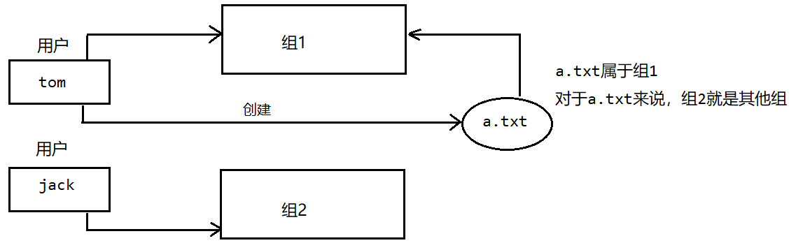

默认情况下，谁创建了改文件，谁就是文件的所有者。

```bash
[root@xq101 home]# ls -alh
总用量 0
#			   文件所属用户
drwxr-xr-x.  5 root         root    48 11月 26 19:45 .
dr-xr-xr-x. 17 root         root   268 11月 26 20:14 ..
drwx------.  5 kobe         kobe   157 11月 27 21:41 kobe
drwx------.  5 xq           xq     147 11月 25 20:14 xq
drwx------.  4 zhangsanfeng kunlun  91 11月 27 21:43 zhangsanfeng
```

##### 2. 组的操作

**修改文件所属用户：**

```txt
chown 用户名 文件名				修改指定文件的所属用户
```

<font color="blue">示例：</font>

```bash
[root@xq101 kobe]# ll
总用量 12
drwxr-xr-x. 2 root root  21 11月 26 20:37 dog
drwxr-xr-x. 3 root root  53 11月 26 20:37 first
-rw-r--r--. 1 root root 205 11月 27 21:41 first.tar.gz
-rw-r--r--. 1 root root 104 11月 27 21:13 Hello.java
-rw-r--r--. 1 root root 642 11月 27 21:28 myZip.zip

# 将Hello.java文件的所属用户修改成kobe
[root@xq101 kobe]# chown kobe Hello.java
[root@xq101 kobe]# ll
总用量 12
drwxr-xr-x. 2 root root  21 11月 26 20:37 dog
drwxr-xr-x. 3 root root  53 11月 26 20:37 first
-rw-r--r--. 1 root root 205 11月 27 21:41 first.tar.gz
-rw-r--r--. 1 kobe root 104 11月 27 21:13 Hello.java
-rw-r--r--. 1 root root 642 11月 27 21:28 myZip.zip
```

当某个用户创建了一个文件后，这个文件的所在组就是该用户的所在组。

<font color="blue">示例：</font>

```bash
[fox@xq101 home]$ cd fox/
[fox@xq101 ~]$ touch fox.txt

[root@xq101 kobe]# cd /home/fox/
[root@xq101 fox]# ll
总用量 0
-rw-r--r--. 1 fox monster 0 11月 28 12:28 fox.txt
```

**修改文件所在的组：**

```txt
chgrp 组名 文件名				将文件修改到指定的组
```

<font color="blue">示例：</font>

```bash
[root@xq101 fox]# chgrp kunlun fox.txt 
[root@xq101 fox]# ll
总用量 0
-rw-r--r--. 1 fox kunlun 0 11月 28 12:28 fox.txt
```

**修改用户所属的组：**

```txt
usermod -g 组名 用户名			修改用户所属的组，这个组必须存在
```

<font color="blue">示例：</font>

```bash
[root@xq101 fox]# usermod -g kunlun fox
[root@xq101 fox]# id fox
uid=1003(fox) gid=1002(kunlun) 组=1002(kunlun)
```

#### （2）权限管理

##### 1. Linux 权限概述

当使用 `ll` 命令查看目录时：

```bash
[root@xq101 kobe]# ll
总用量 12
# 权限
drwxr-xr-x. 2 root root  21 11月 26 20:37 dog
drwxr-xr-x. 3 root root  53 11月 26 20:37 first
-rw-r--r--. 1 root root 205 11月 27 21:41 first.tar.gz
-rw-r--r--. 1 kobe root 104 11月 27 21:13 Hello.java
-rw-r--r--. 1 root root 642 11月 27 21:28 myZip.zip
```

总共10位，我们使用0-9来描述。

- 第0位确定文件类型：
	- `l` 是软连接，相当于 Windows 的快捷方式；
	- `-` 是指文件；
	- `d` 是目录，相当于 Windows 的文件夹；
	- `c` 是字符设别，鼠标，键盘（`/dev` 目录里面查看）；
	- `b` 是块设备，比如说硬盘（`/dev` 目录里面查看）；
- 第1-3位确定所有者（该文件的所有者）拥有该文件的权限；
- 第4-6位确定所属组，（同用户组的）又有该文件的权限；
- 第7-9位确定其他用户拥有改文件的权限。

**`rwx` 权限：**

- `rwx` 作用到文件：
	- r 代表可读 read 可以读取；
	- 查看 w 代表可写 write 可以修改，但是不代表可以删除改文件，删除一个文件的前提条件是对该文件所在的目录有写权限，才能删除文件；
	- x 代表可执行 execute 可被执行；
- `rwx` 作用到目录：
	- r 代表可读，可以读取，ls查看目录的内容；
	- w 代表可写，对目录内进行创建+删除+重命名该目录；
	- x 代表可执行，可以进入该目录。

<font color="blue">示例：</font>

```txt
-rw-r--r--. 1 root root 205 11月 27 21:41 first.tar.gz
第一个字符表示文件类型  - 指的是文件。
rw- 文件所有者对当前文件是可读可写不可执行的权限。
r-- 与文件拥有者同一组的用户的权限是可读不可写不可执行。
r-- 当前文件的其他用户的权限是可读不可写不可执行。
1：文件：硬连接数或 目录：子目录数
root：当前文件所属的用户
root：当前用户所属的组
205： 文件大小单位是字节
11月 27 21:41：文件最后修改时间
first.tar.gz：文件的名称
```

##### 2. 权限的修改

```txt
chmod 选项1,选项2... 文件名				修改指定文件的权限
```

选项：

- u：所有者；
- g：所属组；
- o：其他人；
- a：所有人（u,g,o的总和）

通过选项修改有两种方式：

第一种：`+`，`-`，`=` 变更权限，`=` 为直接修改权限，`+` 为添加权限，`-` 为减少权限。

<font color="blue">示例：</font>

```bash
[root@xq101 kobe]# ll
总用量 12
drwxr-xr-x. 2 root root  21 11月 26 20:37 dog
drwxr-xr-x. 3 root root  53 11月 26 20:37 first
-rw-r--r--. 1 root root 205 11月 27 21:41 first.tar.gz
-rw-r--r--. 1 kobe root 104 11月 27 21:13 Hello.java
-rw-r--r--. 1 root root 642 11月 27 21:28 myZip.zip
#给Hello.java文件的所有者读写执行的权限，给所在组执行读执行的权限，给其他组读执行的权限
[root@xq101 kobe]# chmod u=rwx,g=rx,o=rx Hello.java 
[root@xq101 kobe]# ll
总用量 12
drwxr-xr-x. 2 root root  21 11月 26 20:37 dog
drwxr-xr-x. 3 root root  53 11月 26 20:37 first
-rw-r--r--. 1 root root 205 11月 27 21:41 first.tar.gz
-rwxr-xr-x. 1 kobe root 104 11月 27 21:13 Hello.java
-rw-r--r--. 1 root root 642 11月 27 21:28 myZip.zip
#给Hello.java文件的所有者去除执行的权限，增加组写的权限
[root@xq101 kobe]# chmod u-x,g+w Hello.java 
[root@xq101 kobe]# ll
总用量 12
drwxr-xr-x. 2 root root  21 11月 26 20:37 dog
drwxr-xr-x. 3 root root  53 11月 26 20:37 first
-rw-r--r--. 1 root root 205 11月 27 21:41 first.tar.gz
-rw-rwxr-x. 1 kobe root 104 11月 27 21:13 Hello.java
-rw-r--r--. 1 root root 642 11月 27 21:28 myZip.zip
```

第二种：通过数字变更权限。

r 代表 4，w 代表 2，x 代表 1，得到的权限组合号为各个数字相加。

<font color="blue">示例：</font>

```bash
[root@xq101 kobe]# ll
总用量 12
drwxr-xr-x. 2 root root  21 11月 26 20:37 dog
drwxr-xr-x. 3 root root  53 11月 26 20:37 first
-rw-r--r--. 1 root root 205 11月 27 21:41 first.tar.gz
-rw-rwxr-x. 1 kobe root 104 11月 27 21:13 Hello.java
-rw-r--r--. 1 root root 642 11月 27 21:28 myZip.zip
#给Hello.java文件的所有者设置为u=rwx,g=rx,o=x
[root@xq101 kobe]# chmod 751 Hello.java 
[root@xq101 kobe]# ll
总用量 12
drwxr-xr-x. 2 root root  21 11月 26 20:37 dog
drwxr-xr-x. 3 root root  53 11月 26 20:37 first
-rw-r--r--. 1 root root 205 11月 27 21:41 first.tar.gz
-rwxr-x--x. 1 kobe root 104 11月 27 21:13 Hello.java
-rw-r--r--. 1 root root 642 11月 27 21:28 myZip.zip
```

##### 3. 权限管理的案例

<font color="blue">示例：警察与土匪的游戏</font>

组：`police` (警察)，`bandit` (土匪)；

用户：`jack`，`jerry` 属于组 `police`；

用户：`xh`，`xm` 属于组 `bandit`；

操作：

1. 创建组和用户；
2. `jack` 创建一个文件，自己可以读写，本组人可以读，其他组没有任何权限；
3. `jack` 修改文件，让其他组人可以读，本组人可以写；
4. `xh` 投靠警察，看看是否可以读写。

**具体实现：**

步骤1：

```bash
[root@xq101 ~]# groupadd police
[root@xq101 ~]# groupadd bandit
[root@xq101 ~]# useradd -g police jack
[root@xq101 ~]# useradd -g police jerry
[root@xq101 ~]# useradd -g bandit xh
[root@xq101 ~]# useradd -g bandit xm
#设置密码省略
```

步骤2：

登录 `jack` 

```bash
[jack@xq101 ~]$ vim jack.txt
[jack@xq101 ~]$ cat jack.txt 
hello
[jack@xq101 ~]$ chmod 640 jack.txt 
[jack@xq101 ~]$ ll
总用量 4
-rw-r-----. 1 jack police 6 11月 28 16:27 jack.txt
```

步骤3：

```bash
[jack@xq101 ~]$ chmod 664 jack.txt 
[jack@xq101 ~]$ ll
总用量 4
-rw-rw-r--. 1 jack police 6 11月 28 16:27 jack.txt
```

步骤4：

根目录：

```bash
[root@xq101 ~]# usermod -g police xh
[root@xq101 ~]# cd /home/
[root@xq101 home]# ll
总用量 0
drwx------. 5 fox          kunlun 162 11月 28 12:31 fox
drwx------. 5 jack         police 158 11月 28 16:27 jack
drwx------. 3 jerry        police  78 11月 28 16:22 jerry
drwx------. 5 kobe         kobe   157 11月 27 21:41 kobe
drwx------. 5 xh           police 126 11月 28 16:29 xh
drwx------. 5 xm           bandit 126 11月 28 16:30 xm
drwx------. 5 xq           xq     147 11月 25 20:14 xq
drwx------. 4 zhangsanfeng kunlun  91 11月 27 21:43 zhangsanfeng
```

登录 `xh` ：

```bash
[xh@xq101 ~]$ cd /home/jack
-bash: cd: /home/jack: 权限不够
[xh@xq101 ~]$ cd /home/
[xh@xq101 home]$ ll
总用量 0
drwx------. 5 fox          kunlun 162 11月 28 12:31 fox
drwx------. 5 jack         police 158 11月 28 16:27 jack
drwx------. 3 jerry        police  78 11月 28 16:22 jerry
drwx------. 5 kobe         kobe   157 11月 27 21:41 kobe
drwx------. 5 xh           police 126 11月 28 16:29 xh
drwx------. 5 xm           bandit 126 11月 28 16:30 xm
drwx------. 5 xq           xq     147 11月 25 20:14 xq
drwx------. 4 zhangsanfeng kunlun  91 11月 27 21:43 zhangsanfeng
```

根目录修改 `jack` 权限：

```bash
[root@xq101 home]# chmod 770 jack
[root@xq101 home]# ll
总用量 0
drwx------. 5 fox          kunlun 162 11月 28 12:31 fox
drwxrwx---. 5 jack         police 158 11月 28 16:27 jack
drwx------. 3 jerry        police  78 11月 28 16:22 jerry
drwx------. 5 kobe         kobe   157 11月 27 21:41 kobe
drwx------. 5 xh           police 126 11月 28 16:29 xh
drwx------. 5 xm           bandit 126 11月 28 16:30 xm
drwx------. 5 xq           xq     147 11月 25 20:14 xq
drwx------. 4 zhangsanfeng kunlun  91 11月 27 21:43 zhangsanfeng
```

登录 `xh`：

```bash
[xh@xq101 home]$ cat /home/jack/jack.txt 
hello
[xh@xq101 jack]$ vim jack.txt 
[xh@xq101 jack]$ cat jack.txt 
Hello Jack
```

#### （3）任务调度

任务调度：指在某个时间执行特定的命令或者程序。

**任务调度的分类：**

1. 系统任务：有些重要的工作必须周而复始的执行，比如病毒扫描。
2. 个别用户工作：个别用户希望执行某些程序，比如对 MySQL数据库的备份。

##### 1. `crond` 任务调度

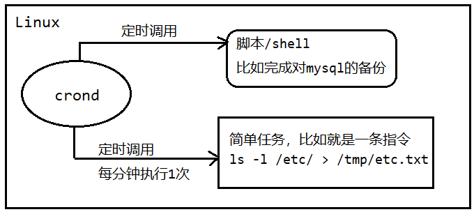

**命令：**

```txt
crontab [选项]			   设置任务调度
service crond restart		重启任务调度
```

| 选项 | 功能                       |
| ---- | -------------------------- |
| -e   | 编辑定时任务               |
| -lI  | 查询定时任务               |
| -r   | 删除当前用户的所有定时任务 |

<font color="blue">示例：创建一个定时任务，将 `etc` 目录下面的文件列表查询出来，追加到 `/tmp/etc.txt` 文件中，并每分钟执行1次。</font>

```bash
[root@xq100 tmp]# crontab -e
# 任务调度内容：每分钟执行一次ls -l /etc/ > /tmp/etc.txt指令，如果没有tmp文件会自动创建
*/1 * * * * ls -l /etc/ > /tmp/etc.txt
```

##### 2. `crond` 任务调度时间规则

**占位符说明：**

|     项目     |          含义          |         范围          |
| :----------: | :--------------------: | :-------------------: |
| 第一个占位符 | 一个小时当中的第几分钟 |         0~59          |
| 第二个占位符 |  一天当中的第几个小时  |         0~23          |
| 第三个占位符 |   一个月当中的第几天   |         1~31          |
| 第四个占位符 |   一年当中的第几个月   |         1~12          |
| 第五个占位符 |    一周当中的星期几    | 0~7（0和7都是星期日） |

**特殊符号说明：**

| 特殊符号 | 含义                                                         |
| :------: | ------------------------------------------------------------ |
|    *     | 代表任何时间，比如第一个 `*` 就代表1小时中每分钟都执行1次的意思。 |
|    ,     | 代表不连续的时间，比如 `0,8,12,16 * * *` 就代表1天中的8点过0分，12点过0分，16点过0分都会执行1次。 |
|    -     | 代表连续的世间范围，比如 `0,5 * * 1-6` 就代表星期1到星期6的凌晨5点过0分都会执行。 |
|   */n    | 代表每隔多久执行1次。比如 `*/10 * * * *` 就代表每隔10分钟就执行1次命令。 |

<font color="blue">示例：</font>

| 时间         | 含义                                   |
| ------------ | -------------------------------------- |
| 45 22 * * *  | 每天在22时45分执行任务                 |
| 0 17 * * 1   | 每周一的17点过0分执行任务              |
| 0 5 1,15 * * | 每月的1号和15号的凌晨5点钟执行任务     |
| 40 4 * *     | 1-5每周1-到周5的凌晨4:40分执行任务     |
| */10 4 * * * | 每天的凌晨4点。每隔10分钟就执行1次任务 |

##### 3. `crond` 任务调度案例

<font color="blue">示例1：使用脚本，每隔1分钟，将当前的日期和日历追加到 `/home/kobe/mydate.txt` 文件中。</font>

在 `/tmp` 目录下创建脚本 `my.sh`：

```sh
date >> /home/kobe/myDate.txt
cal >> /home/kobe/myDate.txt
```

修改脚本文件的权限：

```bash
[root@xq100 home]# chmod u+x my.sh
```

编辑时间任务调度：

```bash
*/1 * * * * /tmp/my.sh
```

查看文件：

```bash
[root@xq101 kobe]# cat myDate.txt 
2024年 11月 28日 星期四 19:48:01 CST
     十一月 2024    
日 一 二 三 四 五 六
                1  2
 3  4  5  6  7  8  9
10 11 12 13 14 15 16
17 18 19 20 21 22 23
24 25 26 27 28 29 30
```

##### 4. `at` 任务调度机制的介绍

`at` 命令是一次性定时执行任务计划，`at` 的守护线程 `atd` 以后台的模式运行，检查作业队列来运行。

默认情况下，`atd` 守护线程每60秒检查作业队列，有作业时会检查作业运行时间，如果时间与当前时间匹配，则运行此作业。

`at` 命令是一次性定制的计划任务，执行完一个任务后就不再执行此任务了。

在使用 `at` 命令的时候，一定要保证 `atd` 进程的启动，可以用相关指令来查看。

```bash
ps -ef | grep atd
```

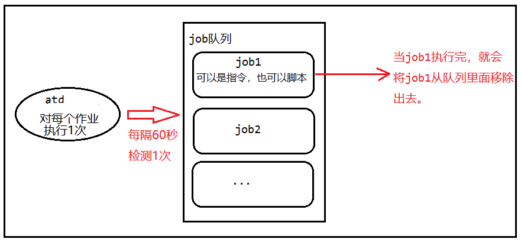

**`at` 时间定义：**

| 格式                    | 含义                                                         | 举例                                                         |
| ----------------------- | ------------------------------------------------------------ | ------------------------------------------------------------ |
| HH:MM                   | 当天 HH:MM 执行，若当天时间已过，则在明天 HH:MM 执行         | 当天 4:00 (若超时则为明天 4:00): `4:00`                      |
| 英文粗略时间单次        | `midnight` (午夜，00:00)、`noon` (中午，12:00)、`teatime` (下午茶时间，16:00)、`tomorrow`（明天） | `midnight`、`noon`、`teatime`                                |
| 英文月名A 日期B [年份C] | C 年 A 月 B 日执行                                           | 在 2018 年 1 月 15 日执行：<br/> `January 15 2018`           |
| 日期时间戳形式          | 绝对计时法<br/> 时间 + 日期<br/> 时间：HH:MM<br>日期：`MMDDYY` 或 `MM/DD/YY` 或 `MM.DD.YY` | 在 2018 年 1 月 15 日执行：<br/> `011518` 或 `01/15/18` 或 `01.15.18` |
| now + 数量 单位         | 相对计时法：<br/>以 `minutes`、`hours`、`days` 或 `weeks` 为单位 | 5 天后的此时此刻执行：<br/>`now + 5 days`                    |

##### 5. `at` 任务调度常用命令

**命令：**

```txt
添加任务调度
at [选项] [时间]
at > 命令 （输入两次Ctrl+D表示结束命令输入）

atrm 编号					删除指定编号的任务调度

atq						 查看任务队列（任务队列的编号是按照添加顺序排列的，包括创建失败的任务调度，且编号不会自动回滚）
```

**常用选项：**

| 选项                | 功能                                                         |
| ------------------- | ------------------------------------------------------------ |
| -m                  | 当前任务执行后，向用户发送邮件                               |
| -l（= `atq` 指令）  | List：列出当前用户的 `at` 任务队列                           |
| -d（= `atrm` 指令） | Delete：删除 `at` 任务                                       |
| -v                  | 显示任务的将被执行的时间                                     |
| -c                  | 输出任务内容（任务指令）                                     |
| -V                  | 显示版本信息                                                 |
| -f <文件>           | 从指定的文件读入，而不是标准输入                             |
| -t <时间参数>       | 以时间参数的形式提交要运行的任务<br>时间参数： `MMDDhhmm`（月日时分） |

<font color="blue">示例：</font>

```bash
# 一天后的下午6点执行ll命令
[root@xq101 home]# at 6pm +1 days
at> ll <EOT>
job 1 at Fri Nov 29 18:00:00 2024
# 查看任务队列
[root@xq101 home]# atq
1	Fri Nov 29 18:00:00 2024 a root
# 明天下午5点执行将date追加到/home/kobe/date100.log文件里
[root@xq101 ~]# at 5pm tomorrow
at> date > /home/kobe/date100.log<EOT>
job 5 at Fri Nov 29 17:00:00 2024
[root@xq101 ~]# atq
1	Fri Nov 29 18:00:00 2024 a root
5	Fri Nov 29 17:00:00 2024 a root
# 现在执行将date追加到/home/kobe/date.log文件里
[root@xq101 ~]# at now + 1 minutes
at> date > /home/kobe/date.log<EOT>
job 6 at Thu Nov 28 20:49:00 2024
[root@xq101 ~]# cd /home/kobe/
[root@xq101 kobe]# ll
总用量 16
-rw-r--r--. 1 root root  43 11月 28 20:49 date.log
drwxr-xr-x. 2 root root  21 11月 26 20:37 dog
drwxr-xr-x. 3 root root  53 11月 26 20:37 first
-rw-r--r--. 1 root root 205 11月 27 21:41 first.tar.gz
-rwxr-x--x. 1 kobe root 104 11月 27 21:13 Hello.java
-rw-r--r--. 1 root root 642 11月 27 21:28 myZip.zip
[root@xq101 kobe]# cat date.log 
2024年 11月 28日 星期四 20:49:22 CST
# 删除任务调度
[root@xq101 kobe]# atq
1	Fri Nov 29 18:00:00 2024 a root
5	Fri Nov 29 17:00:00 2024 a root
[root@xq101 kobe]# atrm 1
[root@xq101 kobe]# atq
5	Fri Nov 29 17:00:00 2024 a root
```

### 五、Linux 磁盘与 NAT 网络配置

#### （1）磁盘分区机制

##### 1. 磁盘分区和 Linux 文件系统的关系

Linux 系统中的文件系统的总体结构是一定的：只有一个根目录，根目录下的目录结构独立且唯一（如 `/boot`、`/dev`、`/bin`、`/etc` 目录等都是唯一的），Linux 中的磁盘分区都是文件系统中的一部分。

计算机的硬盘可以有多个、磁盘上的分区也可以有多个。但每个磁盘要想连接到 Linux 系统中，需要将分区“映射”到文件系统的某一个目录下，这样访问目录即可访问对应硬盘分区，这种映射称为“挂载”。

任何目录或其父目录都要挂载到硬盘的某个分区下。如需要将某一分区挂载到根目录下，Linux 系统才能正常工作。

某个分区所挂载的目录，称为此分区的挂载点。

磁盘的不同分区可以挂载到 Linux 文件系统的不同分区下，但不能同时挂载到一个相同的目录。

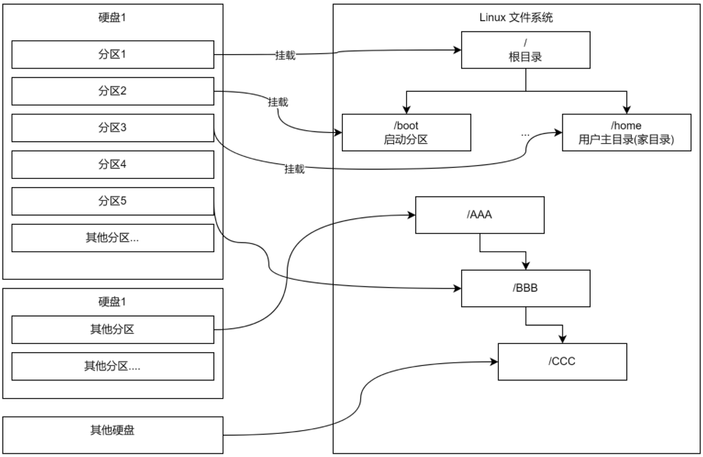

**查看磁盘的具体分区：**

```txt
lsblk				查看磁盘分区
lsblk -f			展示磁盘分区的详细信息
```

<font color="blue">示例：</font>

```bash
[root@xq101 kobe]# lsblk
NAME   MAJ:MIN RM  SIZE RO TYPE MOUNTPOINT
sda      8:0    0   20G  0 disk 
├─sda1   8:1    0    1G  0 part /boot
├─sda2   8:2    0    2G  0 part [SWAP]
└─sda3   8:3    0   17G  0 part /
sr0     11:0    1 1024M  0 rom  
```

##### 2. Linux 硬盘标识

Linux 硬盘有两种：IDE 硬盘和 SCSI 硬盘。

 **IDE 硬盘：**

驱动器标识为：`hdx~`

- `hd` 表示分区所在设备的类型，这里 `hd` = IDE 硬盘；

- `x` 为盘号，区分不同硬盘间的功能。

	| 标识 `x` | 功能       |
	| -------- | ---------- |
	| a        | 基本盘     |
	| b        | 基本从属盘 |
	| c        | 辅助主盘   |
	| d        | 辅助从属盘 |

- `~` 为分区号，区分同一硬盘上不同分区的功能。

	| 标识 `~` | 功能             |
	| -------- | ---------------- |
	| 1~4      | 主分区或扩展分区 |
	| 5        | 逻辑分区         |

**SCSI 硬盘：**

驱动器标识为：`sdx~`

- `sd` 表示分区所在设备的类型，这里 `sd` = SCIC 硬盘；
- `x` 为盘号，区分不同硬盘间的功能（盘号功能标识同 IDE 硬盘，a代表第一块硬盘，b代表第二块硬盘……）
- `~` 为分区号，区分同一硬盘上不同分区的功能（分区号功能标识同 IDE 硬盘）

**查看分区的详细信息：**

```bash
[root@xq101 kobe]# lsblk -f
NAME   FSTYPE LABEL UUID                                 MOUNTPOINT
sda                                                      
├─sda1 xfs          3a9b475c-bdb3-41a9-a3ce-7550793c4429 /boot
├─sda2 swap         8d276296-4189-4a3c-8084-3f67826262f6 [SWAP]
└─sda3 xfs          a1b28343-1ec4-4d09-bf5b-d77d59421e20 /
sr0                                                      
```

|     字段     | 说明                                                         |
| :----------: | ------------------------------------------------------------ |
|    `NAME`    | 驱动器标识                                                   |
|   `FSTYPE`   | 文件系统类型                                                 |
|   `LABLE`    | 文件系统                                                     |
| `LABLE UUID` | 分区唯一标识符，格式化磁盘后，会给分区分配一个32位的唯一的字符串 |
| `MOUNTPOINT` | 挂载点                                                       |

#### （2）磁盘操作

##### 1. 在虚拟机中添加硬盘

1. 右键虚拟机点击设置；
2. 选择硬件，点击添加，选择硬盘；
3. 选择 SCIC 硬盘；
4. 创建新虚拟硬盘；
5. 设置最大磁盘大小 1G；
6. 添加完成后重启虚拟机。

查看该硬盘的详细信息，`sdb` 为新增的硬盘：

```bash
[root@xq101 ~]# lsblk
NAME   MAJ:MIN RM  SIZE RO TYPE MOUNTPOINT
sda      8:0    0   20G  0 disk 
├─sda1   8:1    0    1G  0 part /boot
├─sda2   8:2    0    2G  0 part [SWAP]
└─sda3   8:3    0   17G  0 part /
sdb      8:16   0    1G  0 disk 
sr0     11:0    1 1024M  0 rom  
```

##### 2. 磁盘分区与挂载

Linux 会把设备映射成文件，并将文件保存在 `/dev` 目录下面。

**命令：**

```txt
fdisk 磁盘名				使用fdisk来操作指定磁盘

mkfs -t 格式 磁盘名		   给磁盘格式化为指定类型

mount 磁盘 目录				临时挂载磁盘到指定的目录，重启虚拟机失效

永久挂载需要编辑/etc/fstab文件
vim /etc/fstab 
磁盘分区       	目录             文件系统类型    defaults        0 0
```

<font color="blue">示例：</font>

```bash
[root@xq101 ~]# fdisk /dev/sdb
欢迎使用 fdisk (util-linux 2.23.2)。

更改将停留在内存中，直到您决定将更改写入磁盘。
使用写入命令前请三思。

Device does not contain a recognized partition table
使用磁盘标识符 0x3112aa5c 创建新的 DOS 磁盘标签。

命令(输入 m 获取帮助)：m
命令操作
   a   toggle a bootable flag					#切换启动标志
   b   edit bsd disklabel						#编辑BSD磁盘标签
   c   toggle the dos compatibility flag		#切换DOS兼容性标志
   d   delete a partition						#删除分区
   g   create a new empty GPT partition table	#创建新的空GPT分区表
   G   create an IRIX (SGI) partition table		#创建IRIX (SGI)分区表
   l   list known partition types				#列出已知的分区类型
   m   print this menu							#打印菜单
   n   add a new partition						#添加新分区
   o   create a new empty DOS partition table	#创建新的空DOS分区表
   p   print the partition table				#打印分区表
   q   quit without saving changes				#退出不保存更改
   s   create a new empty Sun disklabel			#创建新的空Sun磁盘标签
   t   change a partition's system id			#更改分区的系统ID
   u   change display/entry units				#更改显示/输入单位
   v   verify the partition table				#验证分区表
   w   write table to disk and exit				#写入磁盘并退出
   x   extra functionality (experts only)		#额外功能（仅限专家）

命令(输入 m 获取帮助)：n
Partition type:
   p   primary (0 primary, 0 extended, 4 free)
   e   extended
Select (default p): p
分区号 (1-4，默认 1)：1
起始 扇区 (2048-2097151，默认为 2048)：
将使用默认值 2048
Last 扇区, +扇区 or +size{K,M,G} (2048-2097151，默认为 2097151)：
将使用默认值 2097151
分区 1 已设置为 Linux 类型，大小设为 1023 MiB

命令(输入 m 获取帮助)：w
The partition table has been altered!

Calling ioctl() to re-read partition table.
正在同步磁盘。

[root@xq101 ~]# lsblk -f
NAME   FSTYPE LABEL UUID                                 MOUNTPOINT
sda                                                      
├─sda1 xfs          3a9b475c-bdb3-41a9-a3ce-7550793c4429 /boot
├─sda2 swap         8d276296-4189-4a3c-8084-3f67826262f6 [SWAP]
└─sda3 xfs          a1b28343-1ec4-4d09-bf5b-d77d59421e20 /
sdb                                                      
└─sdb1              # 该分区没有uid，说明还没有进行格式化                         
sr0 

#给sdb1进行格式化
[root@xq101 ~]# mkfs -t ext4 /dev/sdb1
mke2fs 1.42.9 (28-Dec-2013)
文件系统标签=
OS type: Linux
块大小=4096 (log=2)
分块大小=4096 (log=2)
Stride=0 blocks, Stripe width=0 blocks
65536 inodes, 261888 blocks
13094 blocks (5.00%) reserved for the super user
第一个数据块=0
Maximum filesystem blocks=268435456
8 block groups
32768 blocks per group, 32768 fragments per group
8192 inodes per group
Superblock backups stored on blocks: 
	32768, 98304, 163840, 229376

Allocating group tables: 完成                            
正在写入inode表: 完成                            
Creating journal (4096 blocks): 完成
Writing superblocks and filesystem accounting information: 完成

[root@xq101 ~]# lsblk -f
NAME   FSTYPE LABEL UUID                                 MOUNTPOINT
sda                                                      
├─sda1 xfs          3a9b475c-bdb3-41a9-a3ce-7550793c4429 /boot
├─sda2 swap         8d276296-4189-4a3c-8084-3f67826262f6 [SWAP]
└─sda3 xfs          a1b28343-1ec4-4d09-bf5b-d77d59421e20 /
sdb                                                      
└─sdb1 ext4         556d95f6-3655-436f-967f-618c9836b23d #该分区还没有挂载目录
sr0                                                      

[root@xq101 ~]# cd /
[root@xq101 /]# mkdir newdisk
# 临时挂载磁盘分区sdb1到目录/newdisk
[root@xq101 /]# mount /dev/sdb1 /newdisk/
[root@xq101 /]# lsblk -f
NAME   FSTYPE LABEL UUID                                 MOUNTPOINT
sda                                                      
├─sda1 xfs          3a9b475c-bdb3-41a9-a3ce-7550793c4429 /boot
├─sda2 swap         8d276296-4189-4a3c-8084-3f67826262f6 [SWAP]
└─sda3 xfs          a1b28343-1ec4-4d09-bf5b-d77d59421e20 /
sdb                                                      
└─sdb1 ext4         556d95f6-3655-436f-967f-618c9836b23d /newdisk
sr0                                                      

#永久挂载
[root@xq101 /]# vim /etc/fstab 
/dev/sdb1                                 /newdisk                ext4    defaults        0 0
[root@xq101 /]# reboot
[root@xq101 ~]# lsblk -f
NAME   FSTYPE LABEL UUID                                 MOUNTPOINT
sda                                                      
├─sda1 xfs          3a9b475c-bdb3-41a9-a3ce-7550793c4429 /boot
├─sda2 swap         8d276296-4189-4a3c-8084-3f67826262f6 [SWAP]
└─sda3 xfs          a1b28343-1ec4-4d09-bf5b-d77d59421e20 /
sdb                                                      
└─sdb1 ext4         556d95f6-3655-436f-967f-618c9836b23d /newdisk
sr0                                                      
#重启虚拟机后依然存在
```

##### 3. 磁盘的查询指令

**命令：**

```txt
df -h							查询整个磁盘占用情况
du [选项] 目录					  查询指定磁盘的占用情况
```

**`du` 命令选项：**

| 选项          | 功能                       |
| ------------- | -------------------------- |
| -s            | 指定目录大小汇总           |
| -h            | 带计量单位                 |
| -a            | 含文件                     |
| --max-depth=1 | 子目录深度                 |
| -c            | 列出明细的同时，增加汇总值 |

<font color="blue">示例：</font>

```bash
[root@xq101 ~]# df -h
文件系统        容量      已用  可用 已用% 挂载点
devtmpfs        895M     0  895M    0% /dev
tmpfs           910M     0  910M    0% /dev/shm
tmpfs           910M   11M  900M    2% /run
tmpfs           910M     0  910M    0% /sys/fs/cgroup
/dev/sda3        17G  4.3G   13G   26% /
/dev/sdb1       991M  2.6M  922M    1% /newdisk
/dev/sda1      1014M  179M  836M   18% /boot
vmhgfs-fuse     250G   13G  238G    5% /mnt/hgfs
tmpfs           182M   20K  182M    1% /run/user/0

[root@xq101 ~]# du -h --max-depth=1 /opt
0	/opt/rh
161M	/opt/vmware-tools-distrib
215M	/opt
[root@xq101 ~]# du -hac --max-depth=1 /opt
0	/opt/rh
54M	/opt/VMwareTools-10.3.23-16594550.tar.gz
161M	/opt/vmware-tools-distrib
4.0K	/opt/hello.txt
215M	/opt
215M	总用量
```

##### 4. 磁盘操作常用指令

**命令：**

```txt
wc -l								  统计个数

ls -l 目录 | grep "条件" | wc -l		统计指定目录下符合条件的文件个数
ls -lR 目录 | grep "条件" | wc -l		统计指定目录及其子目录下符合条件的文件个数
```

<font color="blue">示例：</font>

```bash
[root@xq101 opt]# ll
总用量 55140
-rw-r--r--. 1 root root       25 11月 25 12:41 hello.txt
drwxr-xr-x. 2 root root        6 10月 31 2018 rh
-rw-r--r--. 1 root root 56457489 7月  18 2020 VMwareTools-10.3.23-16594550.tar.gz
drwxr-xr-x. 9 root root      145 7月  18 2020 vmware-tools-distrib
#统计/opt文件夹下文件的个数	"^-"是文件		wc -l是统计个数	
[root@xq101 opt]# ls -l /opt | grep "^-" | wc -l
2
#统计/opt文件夹下目录的个数	"^d"是目录
[root@xq101 opt]# ls -l /opt | grep "^d" | wc -l
2
#统计/opt文件下的目录的个数，包括子文件夹下的	R是递归
[root@xq101 opt]# ls -lR /opt | grep "^d" | wc -l
503
#统计/opt文件下的文件的个数，包括子文件夹下的
[root@xq101 opt]# ls -lR /opt | grep "^-" | wc -l
1540
```

#### （3）NAT 网络配置

##### 1. NAT 网络原理

Linux 操作系统访问外网的原理：

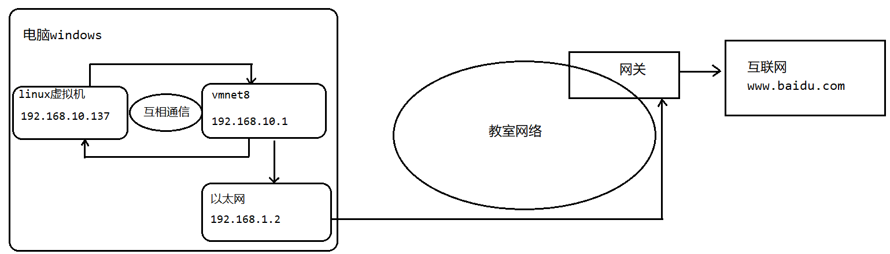

##### 2. Linux 网络配置的指令

**命令：**

```txt
ip addr							在Linux系统查看ip地址
ifconfig						在Linux系统查看ip地址
ping 网址						   查看是否能连接指定的ip地址

ipconfig						在Windows系统的cmd控制台查看ip地址
```

##### 3. 固定 Linux 的 IP 地址

1. 找到网卡文件 `/etc/sysconfig/network-scripts/ifcfg-ens33`；
2. 将 `BOOTPROTO="dhcp"` 改为 `BOOTPROTO="static"`，由自动分配改成静态分配；
3. 添加固定的 IP 地址 `IPADDR=192.168.56.128`，该 IP 地址必须在起始 IP 地址和终止 IP 地址之间，可以在编辑里的虚拟网络编辑器中的DHCP设置中查看；
4. 添加子网掩码 `NETMASK=255.255.255.0`，子网掩码可以在虚拟网络编辑器中找到；
5. 添加子网 IP `GATEWAY=192.168.56.2`，查找方法同上；
6. 添加 DNS `DNS1=114.114.114.114`，`DNS2=1.2.4.8` ……保存该文件；
7. 重启网卡，输入指令 `systemctl restart network`。

```bash
[root@xq101 ~]# ifconfig
ens33: flags=4163<UP,BROADCAST,RUNNING,MULTICAST>  mtu 1500
		# 已更新成功
        inet 192.168.56.128  netmask 255.255.255.0  broadcast 192.168.56.255
        inet6 fe80::84ec:92a8:265a:5a0d  prefixlen 64  scopeid 0x20<link>
        ether 00:0c:29:97:19:16  txqueuelen 1000  (Ethernet)
        RX packets 180  bytes 15921 (15.5 KiB)
        RX errors 0  dropped 0  overruns 0  frame 0
        TX packets 145  bytes 18814 (18.3 KiB)
        TX errors 0  dropped 0 overruns 0  carrier 0  collisions 0

lo: flags=73<UP,LOOPBACK,RUNNING>  mtu 65536
        inet 127.0.0.1  netmask 255.0.0.0
        inet6 ::1  prefixlen 128  scopeid 0x10<host>
        loop  txqueuelen 1000  (Local Loopback)
        RX packets 68  bytes 5460 (5.3 KiB)
        RX errors 0  dropped 0  overruns 0  frame 0
        TX packets 68  bytes 5460 (5.3 KiB)
        TX errors 0  dropped 0 overruns 0  carrier 0  collisions 0

virbr0: flags=4099<UP,BROADCAST,MULTICAST>  mtu 1500
        inet 192.168.122.1  netmask 255.255.255.0  broadcast 192.168.122.255
        ether 52:54:00:38:2c:09  txqueuelen 1000  (Ethernet)
        RX packets 0  bytes 0 (0.0 B)
        RX errors 0  dropped 0  overruns 0  frame 0
        TX packets 0  bytes 0 (0.0 B)
        TX errors 0  dropped 0 overruns 0  carrier 0  collisions 0
```

##### 4. 主机名称与 host 映射

为了方便记忆，我们可以给 Linux 系统设置主机名，也可以根据需要修改主机名。

**查看主机名的名称：**

```txt
cat /etc/hostname
hostname
```

<font color="blue">示例：</font>

```bash
[root@xq101 ~]# hostname
xq101
[root@xq101 ~]# cat /etc/hostname 
xq101
```

通过主机名连接系统需要先在主机名与 IP 地址间建立映射。

**Windows 连接 Linux：**

1. 找到 `C:\Windows\System32\drivers\etc\hosts` 文件，用 Notpad++ 打开；

2. 在末尾添加 Linux 的 IP 与主机名间的映射 `192.168.56.128    xq101`；

3. 在 cmd 控制台中测试：

	```cmd
	C:\Users\lenovo>ping xq101
	
	正在 Ping xq101 [192.168.56.128] 具有 32 字节的数据:
	来自 192.168.56.128 的回复: 字节=32 时间<1ms TTL=64
	来自 192.168.56.128 的回复: 字节=32 时间<1ms TTL=64
	来自 192.168.56.128 的回复: 字节=32 时间=2ms TTL=64
	来自 192.168.56.128 的回复: 字节=32 时间=1ms TTL=64
	
	192.168.56.128 的 Ping 统计信息:
	    数据包: 已发送 = 4，已接收 = 4，丢失 = 0 (0% 丢失)，
	往返行程的估计时间(以毫秒为单位):
	    最短 = 0ms，最长 = 2ms，平均 = 0ms
	```

**Linux 连接 Windows：**

1. 编辑 `/etc/hosts` 文件；

2. 在末尾添加 Windows 无线局域网 IPv4 地址与主机名的映射：`192.168.50.51    Horizon`；

3. 在 XShell 中测试：

	```bash
	[root@xq101 etc]# vim /etc/hosts
	[root@xq101 etc]# ping Horizon
	PING Horizon (192.168.50.51) 56(84) bytes of data.
	64 bytes from Horizon (192.168.50.51): icmp_seq=1 ttl=128 time=1.51 ms
	64 bytes from Horizon (192.168.50.51): icmp_seq=2 ttl=128 time=2.21 ms
	64 bytes from Horizon (192.168.50.51): icmp_seq=3 ttl=128 time=4.44 ms
	64 bytes from Horizon (192.168.50.51): icmp_seq=4 ttl=128 time=4.19 ms
	64 bytes from Horizon (192.168.50.51): icmp_seq=5 ttl=128 time=2.54 ms
	64 bytes from Horizon (192.168.50.51): icmp_seq=6 ttl=128 time=1.85 ms
	^C
	--- Horizon ping statistics ---
	6 packets transmitted, 6 received, 0% packet loss, time 5017ms
	rtt min/avg/max/mdev = 1.513/2.792/4.441/1.127 ms
	```

<font color="red">**如果连接失败则需要关闭防火墙。**</font>

##### 5. 主机域名解析机制

为什么通过主机名（域名）就能找到对应的 IP 地址呢？比如，用户在浏览器输入 `www.baidu.com` 如何找到百度服务器地址的：

1. 浏览器先检查浏览器缓存中有没有该域名解析 IP 地址，有就先调用这个 IP 完成域名解析。如果没有就检查 DNS 解析器缓存，如果有就直接返回 IP 完成解析。这两个缓存可以理解为本地解析器缓存。
2. 如果本地解析器缓存没有找到对应的映射，再去检查系统中的hosts文件中有没有配置对应的域名 IP 映射，如果有，就完成域名解析。
3. 如果本地 DNS 缓存和 `hosts` 文件中均没有找到对应的 IP，则到 DNS 域名服务器完成域名解析。
4. 如果公网的 DNS 域名解析器也没有完成域名解析，就返回资源找不到的信息。

### 六、Linux 进程与服务

#### （1）进程管理

##### 1. Linux 进程介绍

每个执行的程序都为一个进程，每个进程都分配了一个ID号（PID，进程号）。

可以在任务管理器中查看 Windows 的进程信息。

每个进程都可能以两种形式存在，前台和后台，所谓前台进程就是及用户在目录上可以进行操作的（占用屏幕比如我们的 `top` 指令），后台是无法在屏幕上操作的进程。

一般系统的服务进程都是以后台进程的方式存在，而且会常驻在系统中直到关机才结束。

##### 2. 查看系统的进程

Windows 可以在任务管理器中查看所有的进程。

**Linux 查看进程命令：**

```txt
ps [选项]					查看系统中正在运行的进程
```

| 选项 | 功能                       |
| ---- | -------------------------- |
| -a   | 显示终端所用的进程信息     |
| -u   | 以用户的格式显示进程的信息 |
| -x   | 显示后台程序运行的参数     |
| -e   | 显示所有进程的信息         |
| -f   | 以全格式展示进程           |

<font color="blue">示例：</font>

```bash
[root@xq101 /]# ps
   PID TTY          TIME CMD
  2212 pts/0    00:00:00 bash
  4917 pts/0    00:00:00 ps

[root@xq101 /]# ps -aux | more
USER        PID %CPU %MEM    VSZ   RSS TTY      STAT START   TIME COMMAND
root          1  0.0  0.3 128372  7052 ?        Ss   16:18   0:05 /usr/lib/systemd/systemd --switched-root --system --deserialize 22
root          2  0.0  0.0      0     0 ?        S    16:18   0:00 [kthreadd]
root          4  0.0  0.0      0     0 ?        S<   16:18   0:00 [kworker/0:0H]
root          6  0.0  0.0      0     0 ?        S    16:18   0:00 [ksoftirqd/0]
root          7  0.0  0.0      0     0 ?        S    16:18   0:00 [migration/0]
…… ……

#筛选sshd命令的线程，sshd线程用户管理用户登录
[root@xq101 /]# ps -ef | grep sshd
root       1303      1  0 16:19 ?        00:00:00 /usr/sbin/sshd -D
root       2205   1303  0 16:19 ?        00:00:00 sshd: root@pts/0
root       5183   2212  0 18:55 pts/0    00:00:00 grep --color=auto sshd

[root@xq101 /]# ps -ef | more
UID         PID   PPID  C STIME TTY          TIME CMD
root          1      0  0 16:18 ?        00:00:05 /usr/lib/systemd/systemd --switched-root --system --deserialize 22
root          2      0  0 16:18 ?        00:00:00 [kthreadd]
root          4      2  0 16:18 ?        00:00:00 [kworker/0:0H]
root          6      2  0 16:18 ?        00:00:00 [ksoftirqd/0]
root          7      2  0 16:18 ?        00:00:00 [migration/0]
root          8      2  0 16:18 ?        00:00:00 [rcu_bh]
root          9      2  0 16:18 ?        00:00:02 [rcu_sched]
root         10      2  0 16:18 ?        00:00:00 [lru-add-drain]
…… ……
```

|      字段       | 说明                                                         |
| :-------------: | ------------------------------------------------------------ |
|     `USER`      | 进程所属的用户名                                             |
|      `PID`      | 进程识别号（进程 ID）                                        |
|     `PPID`      | 父进程ID，0代表没有父进程                                    |
|      `TTV`      | 终端机号                                                     |
|     `TIME`      | 当前进程消耗CPU的时间                                        |
| `CMD`/`CAMMAND` | 当前进程的名称或执行对应进程的命令                           |
|     `%CPU`      | 当前进程所占用CPU的百分比                                    |
|     `%MEM`      | 当前进程所占用内存的百分比                                   |
|      `VSZ`      | 当前进程占用虚拟内存的大小                                   |
|      `RSS`      | 当前进程占用物理内存的大小                                   |
|     `STAT`      | 当前进程的状态<br>S代表睡眠，R代表执行，Z代表挂机僵死还未释放资源，T代表进程被停止 |
|     `START`     | 当前进程的开始时间                                           |

##### 3. 终止进程

若是某个进程执行一半需要停止时候，或是已经消耗了很大的系统资源时候,可以考虑停止该线程。

**命令：**

```txt
kill [选项] 进程号			 通过进程号杀死/终止进程
kill -9 进程号				  强迫进程立即停止

killall 进程命令（名称）       会杀死当前进程和其子进程
```

<font color="blue">示例1：强制让用户kobe下线。</font>

```bash
[root@xq101 /]# ps -aux | grep sshd
root       1303  0.0  0.2 112920  4348 ?        Ss   16:19   0:00 /usr/sbin/sshd -D
root       2205  0.0  0.3 161008  5632 ?        Ss   16:19   0:00 sshd: root@pts/0
root       5382  1.2  0.2 161008  5576 ?        Ss   19:08   0:00 sshd: kobe [priv]
kobe       5386  0.2  0.1 161008  2364 ?        S    19:08   0:00 sshd: kobe@pts/1
root       5432  0.0  0.0 112732   972 pts/0    R+   19:08   0:00 grep --color=auto sshd
[root@xq101 /]# kill 5382
```

<font color="blue">示例2：终止远程登录服务 `sshd`，不允许远程登录。然后重启 `sshd` 服务，允许远程登录。</font>

```bash
[root@xq101 ~]# ps -aux | grep sshd
root       1303  0.0  0.2 112920  4348 ?        Ss   16:19   0:00 /usr/sbin/sshd -D
root       5500  0.0  0.0 112732   952 pts/0    S+   19:11   0:00 grep sshd
[root@xq101 ~]# kill 1303

# 该命令用于重启sshd进程
[root@xq101 ~]# /bin/systemctl start sshd.service
[root@xq101 ~]# ps -aux | grep sshd
root       5532  1.0  0.2 112920  4304 ?        Ss   19:13   0:00 /usr/sbin/sshd -D
root       5534  0.0  0.0 112728   948 pts/0    R+   19:13   0:00 grep sshd
```

<font color="blue">示例3：终止所有 `gedit`（记事本打开文件的进程），演示 `killall`。</font>

```bash
[root@xq101 ~]# killall gedit
```

<font color="blue">示例4：强制杀掉一个终端。</font>

```bash
[root@xq101 ~]# ps -aux | grep bash
root        831  0.0  0.0 115312   944 ?        S    16:18   0:00 /bin/bash /usr/sbin/ksmtuned
root       2467  0.0  0.0  72468   780 ?        Ss   16:24   0:00 /usr/bin/ssh-agent /bin/sh -c exec -l /bin/bash -c "env GNOME_SHELL_SESSION_MODE=classic gnome-session --session gnome-classic"
root       5539  0.0  0.1 116444  3128 pts/1    Ss   19:13   0:00 -bash
root       5719  0.0  0.1 115444  1864 pts/0    Ss+  19:21   0:00 bash
root       5721  0.0  0.1 115444  1868 pts/2    Ss+  19:21   0:00 bash
root       5724  0.0  0.1 115444  1868 pts/3    Ss+  19:21   0:00 bash
root       5896  0.0  0.0 112732   972 pts/1    R+   19:22   0:00 grep --color=auto bash
[root@xq101 ~]# kill 5719
#用kill命令无法终止进程，不起效果，这是因为Linux认为这个命令终端是正常运行的，不允许我们杀掉。此时需要用-9参数来强制杀掉。
[root@xq101 ~]# kill -9 5719
[root@xq101 ~]# ps -aux | grep bash
root        831  0.0  0.0 115312   944 ?        S    16:18   0:00 /bin/bash /usr/sbin/ksmtuned
root       2467  0.0  0.0  72468   780 ?        Ss   16:24   0:00 /usr/bin/ssh-agent /bin/sh -c exec -l /bin/bash -c "env GNOME_SHELL_SESSION_MODE=classic gnome-session --session gnome-classic"
root       5539  0.0  0.1 116444  3132 pts/1    Ss   19:13   0:00 -bash
root       5721  0.0  0.1 115444  1868 pts/2    Ss+  19:21   0:00 bash
root       5724  0.0  0.1 115444  1868 pts/3    Ss+  19:21   0:00 bash
root       5907  0.0  0.0 112732   972 pts/1    R+   19:23   0:00 grep --color=auto bash
```

##### 4. 查看进程树

**命令：**

```txt
pstree [选项]				以树状的形式更加直观的来查看进程信息
```

| 选项 | 功能               |
| ---- | ------------------ |
| -p   | 显示进程ID         |
| -u   | 显示进程所属用户名 |

<font color="blue">示例：</font>

```bash
[root@xq101 ~]# pstree -pu
systemd(1)─┬─ModemManager(792)─┬─{ModemManager}(820)
           │                   └─{ModemManager}(825)
           ├─NetworkManager(941)─┬─{NetworkManager}(952)
           │                     └─{NetworkManager}(960)
           ├─VGAuthService(774)
           ├─abrt-watch-log(762)
           ├─abrt-watch-log(789)
           ├─abrtd(761)
           ├─accounts-daemon(776)─┬─{accounts-daemon}(793)
           │                      └─{accounts-daemon}(804)
           ├─alsactl(760)
           ├─at-spi-bus-laun(2481)─┬─dbus-daemon(2486)───{dbus-daemon}(2487)
           │                       ├─{at-spi-bus-laun}(2482)
           │                       ├─{at-spi-bus-laun}(2483)
           │                       └─{at-spi-bus-laun}(2485)
           ├─at-spi2-registr(2492)─┬─{at-spi2-registr}(2495)
           │                       └─{at-spi2-registr}(2496)
           ├─atd(1330)
           ├─auditd(722)─┬─audispd(724)─┬─sedispatch(726)
           │             │              └─{audispd}(727)
           │             └─{auditd}(723)
           ├─avahi-daemon(763,avahi)───avahi-daemon(778)
…… ……
```

#### （2）服务管理

`service` 的本质就是进程，但是是运行在后台的，通常都会监听某个端口，等待其他程序的请求，比如说（mysql3306，sshd222，redis6379)，因为我们又称为守护进程，在 Linux 中是重要的知识点。

**守护进程：**

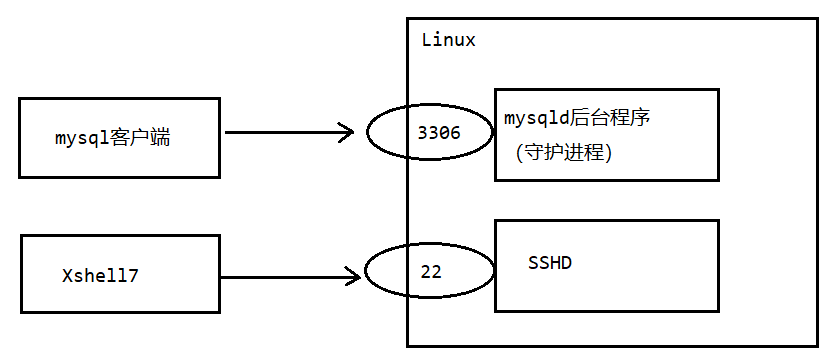

##### 1. `service` 管理指令

- `service` 服务名 `[start|stop,reload,status]`；
- 在 `CentOS7.0` 后，很多服务不再使用 `Service`，而是 `systemctl`；
- `service` 指令管理的服务在 `/etc/init.d` 目录中查看。

```bash
[root@xq101 ~]# cd /etc/init.d
[root@xq101 init.d]# ll
总用量 88
-rw-r--r--. 1 root root 18281 3月  29 2019 functions
-rwxr-xr-x. 1 root root  4569 3月  29 2019 netconsole
-rwxr-xr-x. 1 root root  7923 3月  29 2019 network
-rw-r--r--. 1 root root  1160 8月   8 2019 README
-rwxr-xr-x. 1 root root 45702 11月 24 19:17 vmware-tools
```

**命令：**

```txt
service 服务 status					查看指定服务的状态
service 服务 start					开启指定服务
service 服务 stop						关闭指定服务

setup 								 查看更多系统服务
[*] 代表这些系统服务会随着开机自启动而启动
如果想去掉星号或者加上星号，上下按键切换到对应的服务按空格键即可
使用Tab键选择OK或Cancel
```

##### 2. `chkconfig` 管理指令

通过 `chkconfig` 可以给服务的各个运行级别设置自启动或关闭。

`chkconfig` 指令管理的服务在 `/etc/init.d` 目录查看。

注意：在 `CentOS 7.0` 以后，很多服务使用 `systemctl` 管理。

**命令：**

```txt
chkconfig --list[|grep ""]						查看服务
chkconfig --level 级别 network on/off  		   设置服务在指定级别启动/关闭
```

<font color="red">**`chkconfig` 重新设置服务自启动或者关闭，需要重启机器 `reboot` 生效。**</font>

<font color="blue">示例：</font>

```bash
[root@xq101 init.d]# chkconfig --list

注：该输出结果只显示 SysV 服务，并不包含
原生 systemd 服务。SysV 配置数据
可能被原生 systemd 配置覆盖。 

      要列出 systemd 服务，请执行 'systemctl list-unit-files'。
      查看在具体 target 启用的服务请执行
      'systemctl list-dependencies [target]'。

netconsole     	0:关	1:关	2:关	3:关	4:关	5:关	6:关
network        	0:关	1:关	2:开	3:开	4:开	5:开	6:关
vmware-tools   	0:关	1:关	2:开	3:开	4:开	5:开	6:关
#上面的数字代表Linux的运行级别

[root@xq101 init.d]# chkconfig --list | grep network

注：该输出结果只显示 SysV 服务，并不包含
原生 systemd 服务。SysV 配置数据
可能被原生 systemd 配置覆盖。 

      要列出 systemd 服务，请执行 'systemctl list-unit-files'。
      查看在具体 target 启用的服务请执行
      'systemctl list-dependencies [target]'。

network        	0:关	1:关	2:开	3:开	4:开	5:开	6:关
```

##### 3. `systemctl` 服务管理指令

`systemctl` 指令管理的服务在 `/usr/lib/systemd/system` 目录中查看。

**命令：**

```txt
systemctl list-unit-files						查看所有服务
systemctl [选项] 服务名	 						 对服务进行操作
```

| 选项       | 功能                                   |
| ---------- | -------------------------------------- |
| status     | 查看服务状态                           |
| stop       | 停止服务                               |
| start      | 开启服务                               |
| restart    | 重启服务                               |
| is-enabled | 查看服务是否自启动                     |
| enable     | 设置服务自启动 (服务运行级别 3、5)     |
| disable    | 设置服务禁用自启动 (服务运行级别 3、5) |

**服务的状态：**

| 状态       | 说明                                     |
| ---------- | ---------------------------------------- |
| `masked`   | 此服务禁止自启动                         |
| `static`   | 该服务无法自启动，只能作为其他文件的依赖 |
| `enabled`  | 已配置为自启动                           |
| `disabled` | 未配置为自启动                           |

<font color="blue">示例：</font>

```bash
[root@xq101 system]# systemctl status firewalld.service
● firewalld.service - firewalld - dynamic firewall daemon
   Loaded: loaded (/usr/lib/systemd/system/firewalld.service; enabled; vendor preset: enabled)
   Active: active (running) since 六 2024-11-30 16:19:00 CST; 4h 18min ago
     Docs: man:firewalld(1)
 Main PID: 850 (firewalld)
    Tasks: 2
   CGroup: /system.slice/firewalld.service
           └─850 /usr/bin/python2 -Es /usr/sbin/firewalld --nofork --nopid

11月 30 16:18:56 xq101 systemd[1]: Starting firewalld - dynamic firewall daemon...
11月 30 16:19:00 xq101 systemd[1]: Started firewalld - dynamic firewall daemon.

[root@xq101 system]# systemctl stop firewalld.service
[root@xq101 system]# systemctl start firewalld.service

[root@xq101 system]# systemctl is-enabled firewalld.service
enabled
```

##### 4. `firewall` 防火墙指令

防火墙的核心功能：打开或关闭对应端口。关闭端口，则外部的数据请求不能通过对应的端口，与服务器上的程序进行通信。

在真正的生产环境，为保证安全，需要启动防火墙并配置打开和关闭的端口。

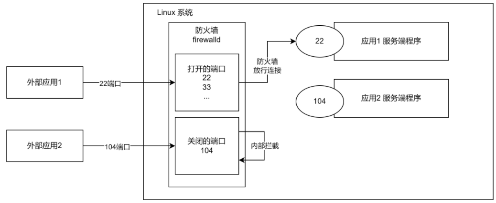

**命令：**

```txt
firewall-cmd --permanent --add-port=端口号/协议				打开端口/允许协议
firewall-cmd --permanent --remove-port=端口号/协议			关闭端口/禁用协议
设置成功后要重启防火墙

firewall-cmd --query-port=端口/协议						查询端口/协议是否开启
firewall-cmd --list-ports						查询防火墙所有开放的端口/协议配置
firewall-cmd --reload							重载防火墙
```

<font color="blue">示例：</font>

```bash
[root@xq101 system]# firewall-cmd --list-ports

[root@xq101 system]# firewall-cmd --query-port=3306/tcp
no
[root@xq101 system]# firewall-cmd --permanent --add-port=3306/tcp
success
[root@xq101 system]# firewall-cmd --reload
success
[root@xq101 system]# firewall-cmd --list-ports
3306/tcp
[root@xq101 system]# firewall-cmd --query-port=3306/tcp
yes
```

#### （3）动态监控

##### 1. `top` 指令

`top` 与 `ps` 命令一样，它们都用来显示正在执行的进程。`top` 与 `ps` 最大的不同之处，在于 `top` 在执行一段时间可以更新正在运行的进程。

**命令：**

```txt
top [选项]
```

| 选项   | 功能                                    |
| ------ | --------------------------------------- |
| -d秒数 | 指定 `top` 命令每隔几秒刷新，默认3秒    |
| -i     | 使用 `top` 不显示任何闲置或者僵死的进程 |
| -p     | 通过指定监控ID来仅仅监控某个进程的状态  |

<font color="blue">示例：</font>

```bash
[root@xq101 ~]# top -d100
top - 11:49:58 up 7 min,  1 user,  load average: 0.11, 0.40, 0.30
Tasks: 224 total,   1 running, 223 sleeping,   0 stopped,   0 zombie
%Cpu(s):  5.6 us, 11.1 sy,  0.0 ni, 83.3 id,  0.0 wa,  0.0 hi,  0.0 si,  0.0 st
KiB Mem :  1863076 total,  1015364 free,   491604 used,   356108 buff/cache
KiB Swap:  2097148 total,  2097148 free,        0 used.  1212632 avail Mem 

   PID USER      PR  NI    VIRT    RES    SHR S %CPU %MEM     TIME+ COMMAND                                                                     
     1 root      20   0  128252   6884   4192 S  0.0  0.4   0:05.22 systemd                                                                     
     2 root      20   0       0      0      0 S  0.0  0.0   0:00.03 kthreadd                                                                    
     4 root       0 -20       0      0      0 S  0.0  0.0   0:00.00 kworker/0:0H                                                                
     6 root      20   0       0      0      0 S  0.0  0.0   0:00.24 ksoftirqd/0                                                                 
     7 root      rt   0       0      0      0 S  0.0  0.0   0:00.00 migration/0                                                                 
     8 root      20   0       0      0      0 S  0.0  0.0   0:00.00 rcu_bh                                                                      
     9 root      20   0       0      0      0 S  0.0  0.0   0:01.85 rcu_sched                                                                   
    10 root       0 -20       0      0      0 S  0.0  0.0   0:00.00 lru-add-drain     
…… ……
```

**指标信息：**

| 指标信息                | 说明                                                         |
| ----------------------- | ------------------------------------------------------------ |
| `top - 时间`            | `top` 命令刷新进程的时间                                     |
| `up 时间 `              | 系统运行的时长                                               |
| `数量 user`             | 当前 Linux 系统上面的用户数                                  |
| `load average:三个数字` | 负载值<br>三个数字相加（0.11, 0.40, 0.30）除以 3 的值如果 > 0.7 说明负载值很大 |
| `Tasks:数字 total `     | 总进程数                                                     |
| `数字 running`          | 正在运行的进程数                                             |
| `数字 sleeping`         | 休眠的进程数                                                 |
| `数字 stopped`          | 停止的进程数                                                 |
| `数字 zombie`           | 僵死的进程数                                                 |
| `%Cpu(s)`               | CPU 负载百分比<br>`us`：用户占用 CPU 百分比<br>`sy`：系统占用 CPU 百分比<br>`id`：空闲 CPU 百分比 |
| `Mem`                   | 描述内存占用情况<br>`total`：总共内存<br>`free`：空余内存<br>`used`：使用了的内存<br>`buff/cache`：缓存 |
| `Swap`                  | 描述交换区内存占用情况                                       |

##### 2. `top` 指令的交互操作

当输入 `top` 命令之后，可以按下面的字符来进行对应的交互操作。

**交互指令：**

| 操作       | 功能                                        |
| ---------- | ------------------------------------------- |
| P          | 以CPU使用率来排序，默认就是此项             |
| M          | 以内存使用来排序                            |
| N          | 以PID排序                                   |
| q          | 退出 `top`                                  |
| u 用户     | 监控指定用户的进程                          |
| k 进程ID号 | 终止指定 ID 的进程<br>回车后按9强制杀死进程 |

<font color="blue">示例：</font>

- 登录 `jack` 用户，在 `root` 用户中查看 `jack` 的进程：

	```bash
	top - 12:18:53 up 36 min,  2 users,  load average: 0.00, 0.01, 0.05
	Tasks: 227 total,   4 running, 223 sleeping,   0 stopped,   0 zombie
	%Cpu(s):  0.5 us,  0.2 sy,  0.0 ni, 99.1 id,  0.0 wa,  0.0 hi,  0.2 si,  0.0 st
	KiB Mem :  1863076 total,  1008196 free,   498184 used,   356696 buff/cache
	KiB Swap:  2097148 total,  2097148 free,        0 used.  1205884 avail Mem 
	
	   PID USER      PR  NI    VIRT    RES    SHR S %CPU %MEM     TIME+ COMMAND                                                                     
	  2682 jack      20   0  161008   2364   1016 S  0.0  0.1   0:00.01 sshd                                                                        
	  2685 jack      20   0  116352   2896   1692 S  0.0  0.2   0:00.06 bash     
	```

- 终止 `jack` 的登录：

	```bash
	top - 12:20:58 up 38 min,  2 users,  load average: 0.00, 0.01, 0.05
	Tasks: 226 total,   1 running, 225 sleeping,   0 stopped,   0 zombie
	%Cpu(s):  3.3 us,  3.3 sy,  0.0 ni, 93.3 id,  0.0 wa,  0.0 hi,  0.0 si,  0.0 st
	KiB Mem :  1863076 total,  1010336 free,   496032 used,   356708 buff/cache
	KiB Swap:  2097148 total,  2097148 free,        0 used.  1208036 avail Mem 
	PID to signal/kill [default pid = 2764] 2682
	   PID USER      PR  NI    VIRT    RES    SHR S %CPU %MEM     TIME+ COMMAND                                                                     
	  2682 jack      20   0  161008   2364   1016 S  0.0  0.1   0:00.01 sshd                                                                        
	  2685 jack      20   0  116352   2896   1692 S  0.0  0.2   0:00.06 bash  
	top - 12:20:58 up 38 min,  2 users,  load average: 0.00, 0.01, 0.05
	Tasks: 226 total,   1 running, 225 sleeping,   0 stopped,   0 zombie
	%Cpu(s):  3.3 us,  3.3 sy,  0.0 ni, 93.3 id,  0.0 wa,  0.0 hi,  0.0 si,  0.0 st
	KiB Mem :  1863076 total,  1010336 free,   496032 used,   356708 buff/cache
	KiB Swap:  2097148 total,  2097148 free,        0 used.  1208036 avail Mem 
	Send pid 2682 signal [15/sigterm] 9
	   PID USER      PR  NI    VIRT    RES    SHR S %CPU %MEM     TIME+ COMMAND                                                                     
	  2682 jack      20   0  161008   2364   1016 S  0.0  0.1   0:00.01 sshd                                                                        
	  2685 jack      20   0  116352   2896   1692 S  0.0  0.2   0:00.06 bash 
	  
	top - 12:22:18 up 39 min,  1 user,  load average: 0.00, 0.01, 0.05
	Tasks: 223 total,   3 running, 220 sleeping,   0 stopped,   0 zombie
	%Cpu(s):  0.3 us,  0.7 sy,  0.0 ni, 99.0 id,  0.0 wa,  0.0 hi,  0.0 si,  0.0 st
	KiB Mem :  1863076 total,  1014208 free,   492216 used,   356652 buff/cache
	KiB Swap:  2097148 total,  2097148 free,        0 used.  1211908 avail Mem 
	```

##### 3. 监控网络状态

**命令：**

```txt
netstat [选项]
```

| 选项 | 功能                   |
| ---- | ---------------------- |
| -an  | 按照一定的属性排列输出 |
| -p   | 显示正在调用的进程     |

<font color="blue">示例：</font>

```bash
[root@xq101 ~]# netstat -anp | more
Active Internet connections (servers and established)
Proto Recv-Q Send-Q Local Address           Foreign Address         State       PID/Program name    
tcp        0      0 127.0.0.1:631           0.0.0.0:*               LISTEN      1335/cupsd          
tcp        0      0 127.0.0.1:25            0.0.0.0:*               LISTEN      1728/master         
tcp        0      0 127.0.0.1:6010          0.0.0.0:*               LISTEN      2364/sshd: root@pts 
tcp        0      0 0.0.0.0:111             0.0.0.0:*               LISTEN      1/systemd           
tcp        0      0 192.168.122.1:53        0.0.0.0:*               LISTEN      1674/dnsmasq        
tcp        0      0 0.0.0.0:22              0.0.0.0:*               LISTEN      1336/sshd           
tcp        0     36 192.168.56.128:22       192.168.56.1:58304      ESTABLISHED 2364/sshd: root@pts 
tcp6       0      0 ::1:631                 :::*                    LISTEN      1335/cupsd          
tcp6       0      0 ::1:25                  :::*                    LISTEN      1728/master         
tcp6       0      0 ::1:6010                :::*                    LISTEN      2364/sshd: root@pts 
tcp6       0      0 :::111                  :::*                    LISTEN      1/systemd           
tcp6       0      0 :::22                   :::*                    LISTEN      1336/sshd           
udp        0      0 0.0.0.0:924             0.0.0.0:*                           756/rpcbind         
udp        0      0 192.168.122.1:53        0.0.0.0:*                           1674/dnsmasq        
udp        0      0 0.0.0.0:67              0.0.0.0:*                           1674/dnsmasq        
udp        0      0 0.0.0.0:111             0.0.0.0:*                           1/systemd           
udp        0      0 0.0.0.0:5353            0.0.0.0:*                           789/avahi-daemon: r 
udp        0      0 0.0.0.0:55731           0.0.0.0:*                           789/avahi-daemon: r 
udp6       0      0 :::924                  :::*                                756/rpcbind         
udp6       0      0 :::111                  :::*                                1/systemd           
raw6       0      0 :::58                   :::*                    7           979/NetworkManager  
Active UNIX domain sockets (servers and established)
Proto RefCnt Flags       Type       State         I-Node   PID/Program name     Path
unix  2      [ ACC ]     STREAM     LISTENING     28416    1348/libvirtd        /var/run/libvirt/libvirt-sock
unix  2      [ ACC ]     STREAM     LISTENING     28418    1348/libvirtd        /var/run/libvirt/libvirt-sock-ro
unix  2      [ ACC ]     STREAM     LISTENING     30052    1844/gnome-session-  @/tmp/.ICE-unix/1844
unix  2      [ ACC ]     STREAM     LISTENING     28421    1348/libvirtd        /var/run/libvirt/libvirt-admin-sock
unix  2      [ ACC ]     STREAM     LISTENING     29635    1367/gdm             @/tmp/dbus-v5LrkIQN
unix  2      [ ACC ]     STREAM     LISTENING     30053    1844/gnome-session-  /tmp/.ICE-unix/1844
unix  2      [ ACC ]     STREAM     LISTENING     28829    1537/X               @/tmp/.X11-unix/X0
unix  2      [ ACC ]     STREAM     LISTENING     22585    770/lsmd             /var/run/lsm/ipc/sim
unix  2      [ ACC ]     STREAM     LISTENING     22594    770/lsmd             /var/run/lsm/ipc/simc
unix  2      [ ACC ]     STREAM     LISTENING     29639    1367/gdm             @/tmp/dbus-ntrF4hgG
unix  2      [ ACC ]     STREAM     LISTENING     29636    1367/gdm             @/tmp/dbus-IErfsH2j
…… ……

[root@xq101 ~]# netstat -anp | grep sshd
tcp        0      0 127.0.0.1:6010          0.0.0.0:*               LISTEN      2364/sshd: root@pts 
tcp        0      0 127.0.0.1:6011          0.0.0.0:*               LISTEN      3365/sshd: root@pts 
tcp        0      0 127.0.0.1:6012          0.0.0.0:*               LISTEN      4376/sshd: jack@pts 
tcp        0      0 0.0.0.0:22              0.0.0.0:*               LISTEN      1336/sshd           
tcp        0      0 192.168.56.128:22       192.168.56.1:58304      ESTABLISHED 2364/sshd: root@pts 
tcp        0      0 192.168.56.128:22       192.168.56.1:49779      ESTABLISHED 3365/sshd: root@pts 
tcp        0      0 192.168.56.128:22       192.168.56.1:52467      ESTABLISHED 4371/sshd: jack [pr 
tcp6       0      0 ::1:6010                :::*                    LISTEN      2364/sshd: root@pts 
tcp6       0      0 ::1:6011                :::*                    LISTEN      3365/sshd: root@pts 
tcp6       0      0 ::1:6012                :::*                    LISTEN      4376/sshd: jack@pts 
tcp6       0      0 :::22                   :::*                    LISTEN      1336/sshd           
unix  3      [ ]         STREAM     CONNECTED     26388    1336/sshd            
unix  2      [ ]         DGRAM                    43681    3365/sshd: root@pts  
unix  3      [ ]         STREAM     CONNECTED     53781    4376/sshd: jack@pts  
unix  3      [ ]         STREAM     CONNECTED     53782    4371/sshd: jack [pr  
unix  2      [ ]         DGRAM                    53778    4371/sshd: jack [pr  
unix  2      [ ]         DGRAM                    36182    2364/sshd: root@pts  

```

#### （4）`rpm` 与 `yum`

##### 1. `rpm` 指令

`rpm` 是互联网下载包和打包和安装工具，他包含在某些 Linux 分版中，他具有生产 `.rpm` 扩展名的文件，`RPM` 是 `redhat package manage`（软件包管理工具的缩写），类似于 Windows 的 `setup.exe`。

`rpm` 包的命名规则：包名+版本名+该包适配的 Linux 系统。

**命令：**

```txt
rpm -qa							查询所有安装的rpm列表
rpm -qa | grep 软件包			  查询当前系统中是否安装了指定的软件
rpm -q 软件包					  查看软件包是否安装（在rpm包）
rpm -qi 软件包					  查询软件安装的详细信息
rpm -ql 软件包					  查询指定软件安装后的文件
rpm -qf 文件					   查看指定的文件所属的rpm包
rpm -e 软件包					  删除软件包，可能会删除失败
rpm -e --nodeps 软件包			  强制删除软件包
rpm -ivh 软件包				  安装软件包
	-i							安装软件包
	-v							安装时显示详细信息
	-h							安装时显示进度条
```

<font color="blue">示例：</font>

```bash
[root@xq101 ~]# rpm -qa | grep firefox
firefox-60.8.0-1.el7.centos.x86_64

[root@xq101 ~]# rpm -q firefox
firefox-60.8.0-1.el7.centos.x86_64

[root@xq101 ~]# rpm -qi firefox
Name        : firefox
Version     : 60.8.0
Release     : 1.el7.centos
Architecture: x86_64
Install Date: 2024年11月24日 星期日 14时58分37秒
Group       : Unspecified
Size        : 218777805
License     : MPLv1.1 or GPLv2+ or LGPLv2+
Signature   : RSA/SHA256, 2019年07月12日 星期五 23时01分23秒, Key ID 24c6a8a7f4a80eb5
Source RPM  : firefox-60.8.0-1.el7.centos.src.rpm
Build Date  : 2019年07月12日 星期五 02时04分42秒
Build Host  : x86-01.bsys.centos.org
Relocations : (not relocatable)
Packager    : CentOS BuildSystem <http://bugs.centos.org>
Vendor      : CentOS
URL         : https://www.mozilla.org/firefox/
Summary     : Mozilla Firefox Web browser
Description :
Mozilla Firefox is an open-source web browser, designed for standards
compliance, performance and portability.

#删除火狐浏览器
[root@xq101 ~]# rpm -e --nodeps firefox
…… ……
[root@xq101 ~]# rpm -q firefox
未安装软件包 firefox 

#安装火狐浏览器
#需要现在光驱的Package包中找到安装包然后复制到opt目录下
[root@xq101 ~]# rpm -ivh /opt/firefox-60.8.0-1.el7.centos.x86_64.rpm 
警告：/opt/firefox-60.8.0-1.el7.centos.x86_64.rpm: 头V3 RSA/SHA256 Signature, 密钥 ID f4a80eb5: NOKEY
准备中...                          ################################# [100%]
正在升级/安装...
   1:firefox-60.8.0-1.el7.centos      ################################# [100%]
[root@xq101 ~]# rpm -q firefox
firefox-60.8.0-1.el7.centos.x86_64
```

##### 2. `yum` 指令

`Yum` 是一个 Shell 前端软件包管理器，基于 `RPM` 包管理，能够从指定的服务器自动下载 `RPM` 包并安装， 并且可以自动处理依赖性关系，并且一次安装所有的依赖软件包。

**命令：**

```txt
yum install | grep 软件包					下载并安装指定的软件包
```

<font color="blue">示例：下载并安装火狐浏览器。</font>

```bash
[root@xq101 ~]# yum list | grep firefox
firefox.i686                                115.12.0-1.el7.centos      updates  
firefox.x86_64                              115.12.0-1.el7.centos      updates  
[root@xq101 ~]# yum install firefox.x86_64 

[root@xq101 ~]# rpm -q firefox
firefox-115.12.0-1.el7.centos.x86_64
```

### 七、安装常用软件

#### （1）安装 Tomcat

以 Tomcat8.5.93 为例：

1. 下载 Tomcat8 的 Linux 版本，后缀名为 `.tar.gz`，并上传至 Linux 的 `/opt` 目录下；

2. 解压安装包：

	```bash
	[root@xq101 opt]# ll
	总用量 344016
	-rw-r--r--. 1 root root  10736621 12月  1 17:14 apache-tomcat-8.5.93.tar.gz
	-rw-r--r--. 1 root root  95308580 7月  12 2019 firefox-60.8.0-1.el7.centos.x86_64.rpm
	-rw-r--r--. 1 root root        25 11月 25 12:41 hello.txt
	-rw-r--r--. 1 root root 189756259 12月  1 16:40 jdk-8u161-linux-x64.tar.gz
	drwxr-xr-x. 2 root root         6 10月 31 2018 rh
	-rw-r--r--. 1 root root  56457489 7月  18 2020 VMwareTools-10.3.23-16594550.tar.gz
	drwxr-xr-x. 9 root root       145 7月  18 2020 vmware-tools-distrib
	[root@xq101 opt]# tar -zxvf apache-tomcat-8.5.93.tar.gz 
	```

3. 进入 Tomcat 文件夹的 `bin` 目录，启动服务器：

	```bash
	[root@xq101 bin]# ./startup.sh 
	Using CATALINA_BASE:   /opt/apache-tomcat-8.5.93
	Using CATALINA_HOME:   /opt/apache-tomcat-8.5.93
	Using CATALINA_TMPDIR: /opt/apache-tomcat-8.5.93/temp
	Using JRE_HOME:        /usr
	Using CLASSPATH:       /opt/apache-tomcat-8.5.93/bin/bootstrap.jar:/opt/apache-tomcat-8.5.93/bin/tomcat-juli.jar
	Using CATALINA_OPTS:   
	Tomcat started.
	```

4. 开放防火墙对 8080 端口的权限：

	```bash
	[root@xq101 bin]# firewall-cmd --permanent --add-port=8080/tcp
	success
	[root@xq101 bin]# firewall-cmd  --reload
	success
	```

5. 浏览器测试，输入网址：http://192.168.56.128:8080（`Linux的IP地址:8080`），启动成功。

#### （2）安装 JDK

Linux 安装后有一个自带的 JDK，但部分版本不支持，所以还是要下载官方的 JDK。

```bash
[root@xq101 bin]# java -version
openjdk version "1.8.0_412"
OpenJDK Runtime Environment (build 1.8.0_412-b08)
OpenJDK 64-Bit Server VM (build 25.412-b08, mixed mode)
```

以 JDK1.8 为例：

1. 下载 JDK 的 Linux 版本的安装包并上传至 Linux 系统的 `/opt` 目录下，在 `/opt` 目录下创建文件夹 `jdk`，把 JDK 安装包移动至该文件下。

	```bash
	[root@xq101 opt]# mkdir jdk
	[root@xq101 opt]# ll
	总用量 344016
	drwxr-xr-x. 9 root root       220 12月  1 17:15 apache-tomcat-8.5.93
	-rw-r--r--. 1 root root  10736621 12月  1 17:14 apache-tomcat-8.5.93.tar.gz
	-rw-r--r--. 1 root root  95308580 7月  12 2019 firefox-60.8.0-1.el7.centos.x86_64.rpm
	-rw-r--r--. 1 root root        25 11月 25 12:41 hello.txt
	drwxr-xr-x. 2 root root         6 12月  1 17:31 jdk
	-rw-r--r--. 1 root root 189756259 12月  1 16:40 jdk-8u161-linux-x64.tar.gz
	drwxr-xr-x. 2 root root         6 10月 31 2018 rh
	-rw-r--r--. 1 root root  56457489 7月  18 2020 VMwareTools-10.3.23-16594550.tar.gz
	drwxr-xr-x. 9 root root       145 7月  18 2020 vmware-tools-distrib
	[root@xq101 opt]# mv jdk-8u161-linux-x64.tar.gz jdk
	[root@xq101 opt]# ll
	总用量 158704
	drwxr-xr-x. 9 root root      220 12月  1 17:15 apache-tomcat-8.5.93
	-rw-r--r--. 1 root root 10736621 12月  1 17:14 apache-tomcat-8.5.93.tar.gz
	-rw-r--r--. 1 root root 95308580 7月  12 2019 firefox-60.8.0-1.el7.centos.x86_64.rpm
	-rw-r--r--. 1 root root       25 11月 25 12:41 hello.txt
	drwxr-xr-x. 2 root root       40 12月  1 17:31 jdk
	drwxr-xr-x. 2 root root        6 10月 31 2018 rh
	-rw-r--r--. 1 root root 56457489 7月  18 2020 VMwareTools-10.3.23-16594550.tar.gz
	drwxr-xr-x. 9 root root      145 7月  18 2020 vmware-tools-distrib
	[root@xq101 opt]# cd jdk/
	[root@xq101 jdk]# ll
	总用量 185312
	-rw-r--r--. 1 root root 189756259 12月  1 16:40 jdk-8u161-linux-x64.tar.gz
	```

2. 解压安装包：

	```bash
	[root@xq101 jdk]# tar -zxvf jdk-8u161-linux-x64.tar.gz
	[root@xq101 jdk]# ll
	总用量 185312
	drwxr-xr-x. 8   10  143       255 12月 20 2017 jdk1.8.0_161
	-rw-r--r--. 1 root root 189756259 12月  1 16:40 jdk-8u161-linux-x64.tar.gz
	```

3. 在 `/usr/local` 目录下创建 `java` 文件夹，并将 JDK 文件移动至该文件：

	```bash
	[root@xq101 jdk]# cd /usr/local/
	[root@xq101 local]# mkdir java
	[root@xq101 local]# cd /opt/jdk/
	[root@xq101 jdk]# mv jdk1.8.0_161/ /usr/local/java/
	[root@xq101 jdk]# cd /usr/local/java/
	[root@xq101 java]# ll
	总用量 0
	drwxr-xr-x. 8 10 143 255 12月 20 2017 jdk1.8.0_161
	```

4. 配置环境变量，找到 `/etc/profile` 文件，添加环境变量：

	```bash
	[root@xq101 java]# vim /etc/profile
	```

	在文件末尾添加：

	```bash
	export JAVA_HOME=/usr/local/java/jdk1.8.0_161
	export PATH=$JAVA_HOME/bin:$PATH
	```

	保存并退出。

5. 加载配置文件，使环境变量生效：

	```bash
	[root@xq101 java]# source /etc/profile
	[root@xq101 java]# java -version
	java version "1.8.0_161"
	Java(TM) SE Runtime Environment (build 1.8.0_161-b12)
	Java HotSpot(TM) 64-Bit Server VM (build 25.161-b12, mixed mode)
	```

	安装完成。

6. 测试一个 Java 文件，看是否能运行：

	```bash
	[root@xq101 kobe]# ll
	总用量 16
	-rw-r--r--. 1 root root  43 11月 28 20:49 date.log
	drwxr-xr-x. 2 root root  21 11月 26 20:37 dog
	drwxr-xr-x. 3 root root  53 11月 26 20:37 first
	-rw-r--r--. 1 root root 205 11月 27 21:41 first.tar.gz
	-rwxr-x--x. 1 kobe root 104 11月 27 21:13 Hello.java
	-rw-r--r--. 1 root root 642 11月 27 21:28 myZip.zip
	[root@xq101 kobe]# cat Hello.java 
	public class Hello {
		public static void main(String[] args){
			System.out.println("Hello World");
		}
	}
	[root@xq101 kobe]# javac Hello.java 
	[root@xq101 kobe]# ll
	总用量 20
	-rw-r--r--. 1 root root  43 11月 28 20:49 date.log
	drwxr-xr-x. 2 root root  21 11月 26 20:37 dog
	drwxr-xr-x. 3 root root  53 11月 26 20:37 first
	-rw-r--r--. 1 root root 205 11月 27 21:41 first.tar.gz
	-rw-r--r--. 1 root root 415 12月  1 17:45 Hello.class
	-rwxr-x--x. 1 kobe root 104 11月 27 21:13 Hello.java
	-rw-r--r--. 1 root root 642 11月 27 21:28 myZip.zip
	[root@xq101 kobe]# java Hello
	Hello World
	```

#### （3）安装 MySQL

##### 1. 安装 MySQL

以安装 MySQL5.7 为例：

1. 如果 Linux 系统没有安装 wget 插件则需要先下载：

	```txt
	yum -y install wget
	```

2. 在 `/opt` 目录下下载 MySQL：

	```bash
	[root@xq101 opt]# wget https://dev.mysql.com/get/mysql57-community-release-el7-11.noarch.rpm
	--2024-12-01 18:03:19--  https://dev.mysql.com/get/mysql57-community-release-el7-11.noarch.rpm
	正在解析主机 dev.mysql.com (dev.mysql.com)... 184.85.112.229, 2600:1417:76:58b::2e31, 2600:1417:76:589::2e31
	正在连接 dev.mysql.com (dev.mysql.com)|184.85.112.229|:443... 已连接。
	已发出 HTTP 请求，正在等待回应... 302 Moved Temporarily
	位置：https://repo.mysql.com//mysql57-community-release-el7-11.noarch.rpm [跟随至新的 URL]
	--2024-12-01 18:03:20--  https://repo.mysql.com//mysql57-community-release-el7-11.noarch.rpm
	正在解析主机 repo.mysql.com (repo.mysql.com)... 23.49.112.119, 2600:140b:a00:291::1d68, 2600:140b:a00:293::1d68
	正在连接 repo.mysql.com (repo.mysql.com)|23.49.112.119|:443... 已连接。
	已发出 HTTP 请求，正在等待回应... 200 OK
	长度：25680 (25K) [application/x-redhat-package-manager]
	正在保存至: “mysql57-community-release-el7-11.noarch.rpm”
	
	100%[=======================================================================================================>] 25,680      --.-K/s 用时 0.1s    
	
	2024-12-01 18:03:21 (229 KB/s) - 已保存 “mysql57-community-release-el7-11.noarch.rpm” [25680/25680])
	
	[root@xq101 opt]# ll
	总用量 158732
	drwxr-xr-x. 9 root root      220 12月  1 17:15 apache-tomcat-8.5.93
	-rw-r--r--. 1 root root 10736621 12月  1 17:14 apache-tomcat-8.5.93.tar.gz
	-rw-r--r--. 1 root root 95308580 7月  12 2019 firefox-60.8.0-1.el7.centos.x86_64.rpm
	-rw-r--r--. 1 root root       25 11月 25 12:41 hello.txt
	drwxr-xr-x. 2 root root       40 12月  1 17:36 jdk
	-rw-r--r--. 1 root root    25680 4月  27 2017 mysql57-community-release-el7-11.noarch.rpm
	drwxr-xr-x. 2 root root        6 10月 31 2018 rh
	-rw-r--r--. 1 root root 56457489 7月  18 2020 VMwareTools-10.3.23-16594550.tar.gz
	drwxr-xr-x. 9 root root      145 7月  18 2020 vmware-tools-distrib
	```

3. 安装MySQL的 `yum` 源：

	```bash
	[root@xq101 opt]# yum -y localinstall mysql57-community-release-el7-11.noarch.rpm
	```

4. 在线安装 MySQL：

	```bash
	[root@xq101 opt]# rpm --import https://repo.mysql.com/RPM-GPG-KEY-mysql-2022
	[root@xq101 opt]# yum -y install mysql-community-server
	```

5. 启动 MySQL 服务并查看状态：

	```bash
	[root@xq101 opt]# systemctl start mysqld
	[root@xq101 opt]# systemctl status mysqld
	● mysqld.service - MySQL Server
	   Loaded: loaded (/usr/lib/systemd/system/mysqld.service; enabled; vendor preset: disabled)
	   Active: active (running) since 日 2024-12-01 18:17:33 CST; 1min 6s ago
	     Docs: man:mysqld(8)
	           http://dev.mysql.com/doc/refman/en/using-systemd.html
	  Process: 86207 ExecStart=/usr/sbin/mysqld --daemonize --pid-file=/var/run/mysqld/mysqld.pid $MYSQLD_OPTS (code=exited, status=0/SUCCESS)
	  Process: 86154 ExecStartPre=/usr/bin/mysqld_pre_systemd (code=exited, status=0/SUCCESS)
	 Main PID: 86210 (mysqld)
	    Tasks: 27
	   CGroup: /system.slice/mysqld.service
	           └─86210 /usr/sbin/mysqld --daemonize --pid-file=/var/run/mysqld/mysqld.pid
	
	12月 01 18:17:22 xq101 systemd[1]: Starting MySQL Server...
	12月 01 18:17:33 xq101 systemd[1]: Started MySQL Server.
	
	```

6. 设置开机自启动：

	```bash
	[root@xq101 opt]# systemctl enable mysqld
	[root@xq101 opt]# systemctl daemon-reload
	```

7. 修改 root 登录密码：

	在 MySQL 安装完成之后，会在 `/var/log/mysqld.log` 文件中给 root 生成了一个临时的默认密码，复制此密码，用此密码登录 MySQL 服务器。

	```bash
	2024-12-01T10:17:30.377056Z 1 [Note] A temporary password is generated for root@localhost: XvUap+SfC4HQ
	
	[root@xq101 opt]# mysql -u root -p
	#密码不会显示
	Enter password: 
	Welcome to the MySQL monitor.  Commands end with ; or \g.
	Your MySQL connection id is 2
	Server version: 5.7.44
	
	Copyright (c) 2000, 2023, Oracle and/or its affiliates.
	
	Oracle is a registered trademark of Oracle Corporation and/or its
	affiliates. Other names may be trademarks of their respective
	owners.
	
	Type 'help;' or '\h' for help. Type '\c' to clear the current input statement.
	
	
	```

	修改密码， MySQL5.7 默认密码策略要求密码必须是大小写字母数字特殊字母的组合，至少8位：

	```bash
	mysql> ALTER USER 'root'@'localhost' IDENTIFIED BY 'Admin123!';
	Query OK, 0 rows affected (0.00 sec)
	#密码为Admin123!
	```

8. 给 MySQL 授权：

	```bash
	mysql> GRANT ALL PRIVILEGES ON *.* TO 'root'@'%' IDENTIFIED BY 'Admin123!' WITH GRANT OPTION;
	Query OK, 0 rows affected, 1 warning (0.00 sec)
	
	mysql> exit
	Bye
	```

9. 防火墙开放3306端口：

	```bash
	[root@xq101 opt]# firewall-cmd --permanent --add-port=3306/tcp  # 开放防火墙对3306端口的权限
	[root@xq101 opt]# firewall-cmd --reload  # 重载防火墙服务
	[root@xq101 opt]# firewall-cmd --list-ports  # 查看防火墙开发的端口有哪些3306/tcp
	```

10. 配置 MySQL默认编码为 utf-8，防止乱码：

	修改 `/etc/my.cnf` 配置文件，在 `[mysqld]` 下添加编码配置：

	`character_set_server=utf8`

	`init_connect='SET NAMES utf8'`

	```bash
	[root@xq101 opt]# vim /etc/my.cnf
	```

	保存并退出，重启 MySQL 并登录：

	```bash
	[root@xq101 opt]# systemctl restart mysqld
	[root@xq101 opt]# mysql -u root -p
	Enter password: 
	Welcome to the MySQL monitor.  Commands end with ; or \g.
	Your MySQL connection id is 2
	Server version: 5.7.44 MySQL Community Server (GPL)
	
	Copyright (c) 2000, 2023, Oracle and/or its affiliates.
	
	Oracle is a registered trademark of Oracle Corporation and/or its
	affiliates. Other names may be trademarks of their respective
	owners.
	
	Type 'help;' or '\h' for help. Type '\c' to clear the current input statement.
	```

	查看字符集编码是否修改：

	```bash
	mysql> show variables like '%character%';
	+--------------------------+----------------------------+
	| Variable_name            | Value                      |
	+--------------------------+----------------------------+
	| character_set_client     | utf8                       |
	| character_set_connection | utf8                       |
	| character_set_database   | utf8                       |
	| character_set_filesystem | binary                     |
	| character_set_results    | utf8                       |
	| character_set_server     | utf8                       |
	| character_set_system     | utf8                       |
	| character_sets_dir       | /usr/share/mysql/charsets/ |
	+--------------------------+----------------------------+
	8 rows in set (0.00 sec)
	```

11. Navicat 测试远程连接：

	新建连接选择 MySQL，主机为 Linux 的 IP 地址。

##### 2. MySQL 重置 root 密码

1. 修改 mysql 的配置文件 `/etc/my.cnf`。添加如下配置，设置免密登录，然后重启 mysql 服务并登录。

	```bash
	skip-grant-tables=1
	```

	```bash
	[root@xq101 opt]# vim /etc/my.cnf
	[root@xq101 opt]# systemctl restart mysqld
	[root@xq101 opt]# mysql -u root -p
	Enter password: 
	Welcome to the MySQL monitor.  Commands end with ; or \g.
	Your MySQL connection id is 2
	Server version: 5.7.44 MySQL Community Server (GPL)
	
	Copyright (c) 2000, 2023, Oracle and/or its affiliates.
	
	Oracle is a registered trademark of Oracle Corporation and/or its
	affiliates. Other names may be trademarks of their respective
	owners.
	
	Type 'help;' or '\h' for help. Type '\c' to clear the current input statement.
	```

2. 重置密码：

	```bash
	mysql> use mysql;
	Reading table information for completion of table and column names
	You can turn off this feature to get a quicker startup with -A
	
	Database changed
	mysql> update user set authentication_string=password('Admin123!') where user='root';
	Query OK, 2 rows affected, 1 warning (0.00 sec)
	Rows matched: 2  Changed: 2  Warnings: 1
	```

3. 退出并修改 `/etc/my.cnf` 文件，将免密登录的配置注释掉：

	```bash
	mysql> exit
	Bye
	[root@xq101 opt]# vim /etc/my.cnf
	[root@xq101 opt]# systemctl restart mysqld
	```

4. 完成修改重新登录即可。

## 第二章：Linux 进阶

### 一、Shell 编程

#### （1）第一个 Shell 程序

##### 1. Shell 的概述

Shell 是一个命令行解释器，它为用户提供了一个向 Linux 内核发送请求以便运行程序的界面系统级程序，用户可以用 Shell 来启动、挂起、停止甚至是编写一些程序。下面我们用一幅图来解释什么是 Shell。


**Shell 的作用：**

-  Linux 运维工程师在进行服务器集群管理时，需要编写 Shell 程序来进行服务器管理。
- 对于 JavaEE 和 Python 程序员来说，工作的需要，会要求你编写一些 Shell 脚本进行程序或者是服务器的维护，比如编写一个定时备份数据库的脚本。
- 对于大数据程序员来说，需要编写 Shell 程序来管理集群。

##### 2. Shell 脚本的执行方式

脚本格式要求：

- 脚本以 `#!/bin/bash` 开头；
- 脚本文件名后缀为 `.sh`；
- 脚本需要有可执行权限。

脚本的常用执行方式：

- 给要执行的脚本文件，添加可执行权限；
- 直接用 `sh` 脚本文件名命令执行，不用赋予脚本可执行权限。

**注释：**

```bash
# 单行注释

:<<!
多行注释
需要注释的第一行内容
!
```

<font color="blue">示例：编写一个 Shell 程序。</font>

创建 `shellCode` 目录，在该目录下新建文件 `hello.sh`：

```bash
[root@xq101 ~]# mkdir shellCode
[root@xq101 ~]# ll
总用量 0
drwxr-xr-x. 2 root root 6 12月  1 21:47 shellCode
drwxr-xr-x. 2 root root 6 11月 28 15:48 公共
drwxr-xr-x. 2 root root 6 11月 28 15:48 模板
drwxr-xr-x. 2 root root 6 11月 28 15:48 视频
drwxr-xr-x. 2 root root 6 11月 28 15:48 图片
drwxr-xr-x. 2 root root 6 11月 28 15:48 文档
drwxr-xr-x. 2 root root 6 11月 28 15:48 下载
drwxr-xr-x. 2 root root 6 11月 28 15:48 音乐
drwxr-xr-x. 2 root root 6 11月 27 21:10 桌面
[root@xq101 ~]# cd shellCode/
[root@xq101 shellCode]# vim hello.sh
```

编辑 `hello.sh` 文件：

```bash
#!/bin/bash
echo 'hello world'
```

执行该文件发现权限不够：

```bash
[root@xq101 shellCode]# ll
总用量 4
-rw-r--r--. 1 root root 31 12月  1 21:49 hello.sh
[root@xq101 shellCode]# ./hello.sh
-bash: ./hello.sh: 权限不够
```

**不添加权限的执行方式：**

```txt
sh 文件名
```

```bash
[root@xq101 shellCode]# sh hello.sh 
hello world
```

添加权限并执行：

```bash
[root@xq101 shellCode]# chmod u+x hello.sh 
[root@xq101 shellCode]# ll
总用量 4
-rwxr--r--. 1 root root 31 12月  1 21:49 hello.sh
[root@xq101 shellCode]# ./hello.sh 
hello world
[root@xq101 shellCode]# /root/shellCode/hello.sh 
hello world

```

#### （2）Shell 变量

Linux 中 Shell 的变量分为系统变量和用户自定义变量。系统变量：`$HOME`、`$PWD`、`$SHELL`、 `$USER` 等等，比如：`echo $HOME` 等等。我们可以使用 `set` 命令显示当前 Shell 中所有变量。

**查询所有的系统变量：**

```sh
echo $变量
```

<font color="blue">示例：</font>

```bash
[root@xq101 shellCode]# echo $PATH
/usr/local/java/jdk1.8.0_161/bin:/usr/local/sbin:/usr/local/bin:/usr/sbin:/usr/bin
[root@xq101 shellCode]# echo $JAVA_HOME
/usr/local/java/jdk1.8.0_161
[root@xq101 shellCode]# echo $HOME
/root
[root@xq101 shellCode]# echo $PWD
/root/shellCode
[root@xq101 shellCode]# echo $SHELL
/bin/bash
```

##### 1. 定义用户变量

在开发中，绝大多数使用的是用户自定义的变量。

**语法：**

```shell
变量名=变量值									#定义变量，等号两边不能有空格
unset 变量									#撤销变量
readonly 变量									#声明静态变量，该变量无法被unset撤销
```

<font color="blue">示例：</font>

`vr.sh`：

```bash
#!/bin/bash
# 定义变量A
A=100
echo $A
echo "A=$A"
# 销毁变量
unset A
echo "A=$A"
# 设置静态变量
readonly B=2
echo B=$B
# 销毁静态变量
unset B
# 把指令的结果赋值给变量
C=`date`
echo C=$C

D=$(date)
echo D=$D 
```

`bash`：

```bash
[root@xq101 shellCode]# ./vr.sh 
100
A=100
A=
B=2
./vr.sh: 第 13 行:unset: B: 无法反设定: 只读 variable
C=2024年 12月 01日 星期日 22:14:59 CST
D=2024年 12月 01日 星期日 22:14:59 CST
```

##### 2. 设置环境变量

**语法：**

```txt
export 变量名=变量值				   设置全局变量
source 配置文件						让修改后的配置文件生效
```

**环境变量与全局变量：**

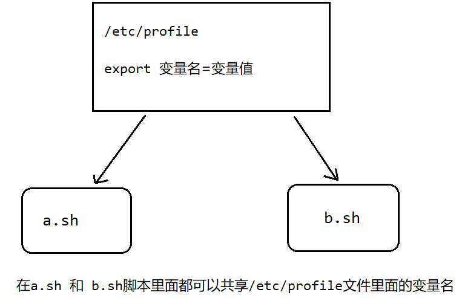

<font color="blue">示例1：在安装 JDK 时，配置了全局变量 `JAVA_HOME`，在其他脚本中访问该全局变量。</font>

`vr.sh`

```sh
# 获取全局变量
echo "JAVA_HOME=$JAVA_HOME"
```

`bash`

```bash
[root@xq101 shellCode]# vim vr.sh 
[root@xq101 shellCode]# ./vr.sh 
JAVA_HOME=/usr/local/java/jdk1.8.0_161
```

##### 3. 设置位置参数变量

当我们执行一个 Shell 脚本时，如果希望获取到命令行的参数信息，就可以使用到位置参数变量，比如  `./myshell.sh 100 200`, 这个就是一个执行 Shell 的命令行，可以在 `myshell` 脚本中获取到参数信息。

**语法：**

```txt
$n		n为数字，$0为命令本身，$1~9为第1~9个参数，9以上的参数需要用大括号，如${10}
$* 		代表命令行中所有的参数，$*把所有的参数看成一个整体
$@		代表命令行中所有的参数，不过该命令是把每个参数区分对待
$#		代表命令行中所有参数的个数
```

<font color="blue">示例：</font>

`position.sh`：

```sh
#!/bin/bash
echo "p0=$0,p1=$1,p2=$2"
echo "命令行中输入的所有参数是:$*"
echo "所有参数是:$@"
echo "统计参数个数:$#"
```

`bash`：

```bash
[root@xq101 shellCode]# vim position.sh
[root@xq101 shellCode]# chmod u+x position.sh 
[root@xq101 shellCode]# ./position.sh 100 200 
p0=./position.sh,p1=100,p2=200
命令行中输入的所有参数是:100 200
所有参数是:100 200
统计参数个数:2
```

##### 4. 预定义变量

Shell 设计者事先已经定义好的变量，可以直接在 Shell 脚本中使用。

**语法：**

```txt
$$		当前进程的进程号。
$!		后台运行的最后一个进程的进程号。
$?		最后一次执行的命令的返回状态。如果这个变量的值为 0，证明上一个命令正确执行；如果这个变量的值非0（具体是哪个数，由命令自己来决定），则证明上一个命令执行不正确。
```

<font color="blue">示例：</font>

`preVar.sh`：

```sh
#!/bin/bash
echo "当前进程PID:$$"
# 以后台的形式运行 vr.sh
./vr.sh &
echo "最后一个进程的PID:$!"
echo "最后一个执行程序的状态:$?"
```

`bash`：

```bash
[root@xq101 shellCode]# vim preVar.sh
[root@xq101 shellCode]# chmod u+x preVar.sh 
[root@xq101 shellCode]# ./preVar.sh 
当前进程PID:29051
最后一个进程的PID:29052
最后一个执行程序的状态:0
[root@xq101 shellCode]# A=
B=2
./vr.sh: 第 15 行:unset: B: 无法反设定: 只读 variable
C=2024年 12月 02日 星期一 18:11:24 CST
D=2024年 12月 02日 星期一 18:11:24 CST
JAVA_HOME=/usr/local/java/jdk1.8.0_161

[root@xq101 shellCode]# cat preVar.sh 
#!/bin/bash
echo "当前进程PID:$$"
# 以后台的形式运行 vr.sh
./vr.sh &
echo "最后一个进程的PID:$!"
echo "最后一个执行程序的状态:$?"
```

#### （3）Shell 的运算符

运算符的功能：在脚本中实现各种运算操作。

**语法：**

```txt
$((表达式))

$[表达式]		（推荐使用）

`expr m 运算符 n`
expr与运算式之间要有空格
m n必须是一个数字，并且数字和运算符之间必须要有空格。
expr 做计算，只能实现两个操作数的计算。
乘法运算符是 \*
```

<font color="blue">示例：</font>

`oper.sh`：

```sh
#!/bin/bash

# 输出表达式 3*(5+1) 的值
TOTAL=$((3*(5+1)))
echo "TOTAL=$TOTAL"
# 表达式的第二种写法（推荐）
RESULT=$[3*(6+1)]
echo "RESULT=$RESULT"

# 第三种写法（不推荐）
TEMP=`expr 10 + 10`
echo "TEMP=$TEMP"
TEMP2=`expr 10 \* 10`
echo "TEMP2=$TEMP2"

NUM=$[$1+$2]
echo "命令行两个参数和：$NUM"
```

`bash`：

```bash
[root@xq101 shellCode]# vim oper.sh
[root@xq101 shellCode]# chmod u+x oper.sh 
[root@xq101 shellCode]# ./oper.sh 100 200
TOTAL=18
RESULT=21
TEMP=20
TEMP2=100
命令行两个参数和：300
```

#### （4）Shell 的条件判断

##### 1. `if` 条件判断

**语法：**

```sh
if [ 条件 ] then							# 条件两端要有空格
	满足if语句执行的代码
fi
```

**常用判断条件：**

| 表达式 | 条件                         |
| ------ | ---------------------------- |
| `=`    | 比较字符串是否相等           |
| `-lt`  | 小于                         |
| `-gt`  | 大于                         |
| `le`   | 小于等于                     |
| `ge`   | 大于等于                     |
| `-nt`  | 不等于                       |
| `-r`   | 是否有可读权限               |
| `-w`   | 是否有可写权限               |
| `-x`   | 是否有可执行权限             |
| `-f`   | 文件存在，并且是一个常规文件 |
| `-e`   | 文件存在                     |
| `-d`   | 文件存在并且文件是一个目录   |

**特殊条件：**

```sh
if [ 任意字符串 ]  # 表示条件为true
if [ ] 		# 表示条件为false
```

<font color="blue">示例：</font>

`ifdemo.sh`：

```sh
#!/bin/bash
if [ "hello" = "hello" ]
then
    echo "两个字符串相等"
fi

if [ 23 -ge 22 ]
then 
    echo "23大于22"
fi

if [ -f /shellCode/vr.sh ]
then 
    echo "存在"
fi

# 特殊条件
if [ abc ]
then
    echo "条件为true"
fi

if [ ]
then 
   echo "条件为false"
fi
```

`bash`：

```bash
[root@xq101 ~]# vim ifdemo.sh
[root@xq101 ~]# chmod u+x ifdemo.sh 
[root@xq101 ~]# ./ifdemo.sh 
两个字符串相等
23大于22
条件为true
```

##### 2. 多重 `if` 判断

**语法：**

```sh
if [ 条件 ]
then
	代码
elif [ 条件 ]
 then
	代码
......
else
fi
```

<font color="blue">示例：</font>

`ifCase.sh`：

```sh
#!/bin/bash
if [ $1 -ge 60 ]
then
    echo "合格"
else
    echo "不合格"
fi

if [ $1 -ge 90 ]
then
    echo "优秀"
elif [ $1 -ge 60 ]
then
    echo "合格"
else
    echo "不合格"
fi
```

`bash`

```bash
[root@xq101 ~]# vim ifCase.sh
[root@xq101 ~]# chmod u+x ifCase.sh 
[root@xq101 ~]# ./ifCase.sh 40
不合格
不合格
[root@xq101 ~]# ./ifCase.sh 67
合格
合格
[root@xq101 ~]# ./ifCase.sh90
合格
优秀
```

##### 3. `case` 语句

**语法：**

```sh
case $变量名 in
 "值1")
	如果变量名等于值1，执行的代码;;
 "值2")
	如果变量名等于值2，执行的代码;;
 	... ...
 *)
	如果都不满足以上的条件，则执行此代码;;
esac
```

<font color="blue">示例：</font>

`.sh`：

```sh
#!/bin/bash
case $1 in
    "6")
	echo "周六";;
    "7")
	echo "周日";;
    *)
	echo "工作日";;
esac 
```

`bash`：

```bash
[root@xq101 ~]# vim casedemo.sh
[root@xq101 ~]# chmod u+x casedemo.sh 
[root@xq101 ~]# vim casedemo.sh
[root@xq101 ~]# ./casedemo.sh 6
周六
[root@xq101 ~]# ./casedemo.sh 7
周日
[root@xq101 ~]# ./casedemo.sh 3
工作日
```

#### （5）Shell 中的循环

##### 1. `for` 循环

**语法：**

```sh
for 变量 in 值1 值2 值3…
do
	满足循环条件需要执行的代码
done


for((初始值;循环控制条件;变量变化))
do
	满足循环条件需要执行的代码
done
```

<font color="blue">示例：</font>

`.sh`：

```sh
#!/bin/bash
# 第一种
for i in "$@"
do
    echo "数字是：$i"
done

# 第二种
for (( i=1;i<=10;i++ ))
do
    echo "$i"
done

SUM=0
for (( i=1;i<=10;i++ ))
do
    SUM=$[$SUM+$i]
done
echo "$SUM"
```

`bash`：

```bash
[root@xq101 shellCode]# vim fordemo.sh
[root@xq101 shellCode]# chmod u+x fordemo.sh 
[root@xq101 shellCode]# ./fordemo.sh 1 2 3 4 5
数字是：1
数字是：2
数字是：3
数字是：4
数字是：5
1
2
3
4
5
6
7
8
9
10
55
```

##### 2. `while` 循环

**语法：**

```sh
while [ 条件判断式 ]
do
	代码
done
```

<font color="blue">示例：</font>

`whiledemo.sh`：

```sh
#!/bin/bash
SUM=0
i=1
while [ $i -le $1 ]
do
    SUM=$[$i+$SUM]
    i=$[i+1]
done
echo "$SUM" 
```

`bash`：

```bash
[root@xq101 shellCode]# vim whiledemo.sh
[root@xq101 shellCode]# chmod u+x whiledemo.sh 
[root@xq101 shellCode]# ./whiledemo.sh 10
55
```

#### （6）读取控制台输入

**语法：**

```sh
read 选项 参数
```

| 选项        | 功能                                                         |
| ----------- | ------------------------------------------------------------ |
| -p "提示符" | 指定读取值时的提示符                                         |
| -t          | 指定读取值时等待的时间（秒），如果没有在指定的时间内输入，就不再等待了（放弃输 入） |

<font color="blue">示例：</font>

`readdemo.sh`：

```sh
#!/bin/bash
read -p "请输入一个数字:" NUM1
echo "用户输入的值：$NUM1"

read -t 10 -p "10秒内输入一个数字" NUM2
echo "$NUM2"
```

`bash`：

```
[root@xq101 shellCode]# vim readdemo.sh
[root@xq101 shellCode]# chmod u+x readdemo.sh 
[root@xq101 shellCode]# ./readdemo.sh 
请输入一个数字:4
用户输入的值：4
10秒内输入一个数字
```

#### （7）Shell 中的函数

Shell 编程和其他编程一样，有系统函数，也可以自定义函数。

##### 1. 系统函数

**常用函数：**

```sh
basename 文件的完整路径 [文件后缀]		# 去掉文件完整路径的多级路径和后缀名，返回文件名
dirname 文件的完整路径				   # 返回完整路径最前面部分
```

<font color="blue">示例：</font>

```bash
[root@xq101 shellCode]# basename /home/kobe/Hello.java 
Hello.java
[root@xq101 shellCode]# dirname /home/kobe/Hello.java 
/home/kobe
```

##### 2. 自定义函数

**语法：**

```sh
function 函数名() {
	函数代码
}
# 调用函数
函数名 参数1 参数2……
```

<font color="blue">示例：</font>

`.sh`：

```sh
#!/bin/bash
function getSum(){
    SUM=$[$n1+$n2]
    echo "SUM=$SUM"
}
read -p "请输入一个数字" n1
read -p "请输入第二个数字" n2
getSum $n1 $n2
```

`bash`：

```bash
[root@xq101 shellCode]# vim testfun.sh
[root@xq101 shellCode]# chmod u+x testfun.sh 
[root@xq101 shellCode]# ./testfun.sh 
请输入一个数字10
请输入第二个数字20
SUM=30
```

#### （8）Shell 综合案例

使用 Shell 脚本定时备份数据库。

需求：

- 每天凌晨2:30备份数据库 `day01` 到 `/data/backup/db`；
- 备份开始和备份结束的时候，要给出相应的提示信息；
- 备份后的文件要以备份时间为文件名，并打包成 `tar.gz` 的格式，比如：`2021-09-15_230201.tar.gz`；
- 在备份的同时，要检查是否有10天前备份的数据库文件，如果有就将其删除。

`mysql_db_backup.sh`：

```bash
#!/bin/bash
# 定义备份目录
BACKUP=/data/backup/db
# 获取当前时间
DATETIME=$(date +%Y-%m-%d_%H%M%S)
# 检验日期是否正确
echo $DATETIME

# 数据库主机地址
HOST=localhost
# 数据库用户名
DB_USER=root
# 数据库密码
DB_PW=Admin123!
# 备份的数据库
DATABASE=day01
# 创建备份目录，如果目录不存在，则创建
# 只有[]里面的表达式为true 才会执行 && 右边的内容
# ${} 用来取文件名或文件路径
[ ! -d "${BACKUP}/${DATETIME}" ] && mkdir -p "${BACKUP}/${DATETIME}"

# 备份数据库
mysqldump -u${DB_USER} -p${DB_PW} --host=${HOSR} -q -R --databases ${DATABASE} | gzip > ${BACKUP}/${DATETIME}/$DATETIME.sql.gz

# 将文件打包成tar.gz
# 切换到备份目录
cd ${BACKUP}
tar -zcvf $DATETIME.tar.gz ${DATETIME}
# 删除对应的备份目录
rm -rf ${BACKUP}/${DATETIME}

# 删除2天前的备份文件
find ${BACKUP} -atime +2 -name "*.tar.gz" -exec rm -rf {} \;
echo "数据库${DATABASE}备份成功..."

```

`bash`：

```bash
[root@xq101 sbin]# ./mysql_db_backup.sh 
2024-12-03_204706
mysqldump: [Warning] Using a password on the command line interface can be insecure.
2024-12-03_204706/
2024-12-03_204706/2024-12-03_204706.sql.gz
数据库day01备份成功...
[root@xq101 sbin]# crontab -e

30 2 * * * /usr/sbin/mysql_db_backup.sh
```

### 二、Linux 日志管理

#### （1）Linux 日志概述

日志文件是重要的系统信息文件，其中记录了很多重要的系统事件，包括用户的登录信息、系统的启动信息、系统的安全信息、邮件相关信息、各种服务相关信息等。

日志对于安全来说也很重要，它记录了系统每天发生的各种事情，通过日志来检查错误发生的原因，或者受到攻击时攻击者留下的痕迹。

日志是用来记录重大事件的工具。

绝大多数的日志文件保存在 `/var/log` 目录中。

```bash
[root@xq101 ~]# cd /var/log
[root@xq101 log]# ls
anaconda           btmp           glusterfs           ntpstats           spooler               vmware-network.4.log    vmware-vmtoolsd-root.log
audit              btmp-20241201  grubby              pluto              spooler-20241201      vmware-network.5.log    vmware-vmusr.log
boot.log           chrony         grubby_prune_debug  ppp                sssd                  vmware-network.6.log    vmware-vmusr-root.log
boot.log-20241126  cron           lastlog             qemu-ga            swtpm                 vmware-network.7.log    wpa_supplicant.log
boot.log-20241127  cron-20241201  libvirt             rhsm               tallylog              vmware-network.8.log    wtmp
boot.log-20241128  cups           maillog             sa                 tuned                 vmware-network.9.log    Xorg.0.log
boot.log-20241130  dmesg          maillog-20241201    samba              vmware-install.log    vmware-network.log      Xorg.0.log.old
boot.log-20241201  dmesg.old      messages            secure             vmware-network.1.log  vmware-vgauthsvc.log.0  Xorg.9.log
boot.log-20241202  firewalld      messages-20241201   secure-20241201    vmware-network.2.log  vmware-vmsvc.log        yum.log
boot.log-20241203  gdm            mysqld.log          speech-dispatcher  vmware-network.3.log  vmware-vmsvc-root.log   yum.log-20241202
```

**系统中的常用日志：**

| 日志文件            | 说明                                                         |
| ------------------- | ------------------------------------------------------------ |
| `/var/log/boot.log` | 系统启动日志。                                               |
| `/var/log/cron`     | 记录与系统定时任务相关的日志。                               |
| `/var/log/cups`     | 记录打印信息的日志。                                         |
| `/var/log/dmesg`    | 记录了在系统开机时内核自检的信息，也可以用 `dmesg` 命令直接查询内核自检信息。 |
| `/var/log/btmp`     | 记录错误登录的日志，这是一个二进制文件，不能用 `cat` 或 `vi` 命令查看，用 `lastb` 命令查看。 |
| `/var/log/lastlog`  | 记录系统中所有用户最后一次登录的时间的日志。这个文件也是二进制文件。 |
| `/var/log/mailog`   | 记录邮件信息的日志。                                         |
| `/var/log/message`  | 记录系统重要消息的日志。这个日志文件中会记录 Linux 系统的绝大多数重要信息。如果系统出现问题，首先要检查的就是这个日志文件。 |
| `/var/log/secure`   | 记录验证和授权方面的信息。只要涉及账户和密码的程序都会记录。比如系统的登录、`ssh` 的登录、`su` 切换用户、`sudo` 授权、甚至添加用户和修改用户密码都会记录在这个日志文件中。 |
| `/var/log/wtmp`     | 永久记录所有用户的登录、注销信息。同时记录系统的启动、重启、关机事件。这是二进制文件。 |
| `/var/log/ulmp`     | 记录当前已经登录的用户信息。这个文件会随着用户的登录和注销而不断的变化，只记录当前登录用户的信息。这个文件不能使用 `vi` 查看，而使用 `w`、`who`、`users` 命令查看。 |

<font color="blue">示例1：使用 `lastlog` 来查看 `/var/log/lastlog`。</font>

```bash
[root@xq101 log]# lastlog
用户名           端口     来自             最后登陆时间
root             pts/0    192.168.56.1     二 12月  3 19:31:45 +0800 2024
bin                                        **从未登录过**
daemon                                     **从未登录过**
adm                                        **从未登录过**
lp                                         **从未登录过**
sync                                       **从未登录过**
shutdown                                   **从未登录过**
halt                                       **从未登录过**
mail                                       **从未登录过**
operator                                   **从未登录过**
games                                      **从未登录过**
ftp                                        **从未登录过**
nobody                                     **从未登录过**
systemd-network                            **从未登录过**
dbus                                       **从未登录过**
polkitd                                    **从未登录过**
sssd                                       **从未登录过**
libstoragemgmt                             **从未登录过**
colord                                     **从未登录过**
rpc                                        **从未登录过**
gluster                                    **从未登录过**
saslauth                                   **从未登录过**
abrt                                       **从未登录过**
setroubleshoot                             **从未登录过**
rtkit                                      **从未登录过**
radvd                                      **从未登录过**
chrony                                     **从未登录过**
qemu                                       **从未登录过**
unbound                                    **从未登录过**
ntp                                        **从未登录过**
tss                                        **从未登录过**
usbmuxd                                    **从未登录过**
geoclue                                    **从未登录过**
pulse                                      **从未登录过**
gdm              :0                        二 12月  3 19:05:01 +0800 2024
saned                                      **从未登录过**
rpcuser                                    **从未登录过**
nfsnobody                                  **从未登录过**
gnome-initial-setup                           **从未登录过**
sshd                                       **从未登录过**
avahi                                      **从未登录过**
postfix                                    **从未登录过**
tcpdump                                    **从未登录过**
xq               pts/0                     一 11月 25 20:12:05 +0800 2024
zhangsanfeng                               **从未登录过**
kobe             pts/1    192.168.56.1     六 11月 30 19:08:27 +0800 2024
fox              pts/1    192.168.56.1     四 11月 28 12:27:42 +0800 2024
jack             pts/2    192.168.56.1     日 12月  1 13:26:18 +0800 2024
jerry                                      **从未登录过**
xh               pts/2    192.168.56.1     四 11月 28 16:29:58 +0800 2024
xm               pts/3    192.168.56.1     四 11月 28 16:30:20 +0800 2024
mysql                                      **从未登录过**

[root@xq101 log]# who
root     :0           2024-12-03 19:07 (:0)
root     pts/0        2024-12-03 19:31 (192.168.56.1)
```

<font color="blue">示例2：使用 root 用户通过 XShell7 登录，第一次使用错误的密码，第二次使用正确的密码登录成功，查看日志文件 `/var/log/secure` 里面有没有记录相关信息。</font>

```bash
# 清空文件
[root@xq101 log]# echo '' > secure
[root@xq101 log]# cat secure

[root@xq101 ~]# cd /var/log/
[root@xq101 log]# cat secure

# 登录两次，其中一次输错密码
Dec  3 21:32:50 xq101 sshd[4593]: error: Received disconnect from 192.168.56.1 port 51328:0:  [preauth]
Dec  3 21:32:50 xq101 sshd[4593]: Disconnected from 192.168.56.1 port 51328 [preauth]
Dec  3 21:33:16 xq101 sshd[3192]: error: Received disconnect from 192.168.56.1 port 59418:0:
Dec  3 21:33:16 xq101 sshd[3192]: Disconnected from 192.168.56.1 port 59418
Dec  3 21:33:16 xq101 sshd[3192]: pam_unix(sshd:session): session closed for user root
# 密码错误
Dec  3 21:33:31 xq101 unix_chkpwd[4606]: password check failed for user (root)
Dec  3 21:33:31 xq101 sshd[4604]: pam_unix(sshd:auth): authentication failure; logname= uid=0 euid=0 tty=ssh ruser= rhost=192.168.56.1  user=root
Dec  3 21:33:31 xq101 sshd[4604]: pam_succeed_if(sshd:auth): requirement "uid >= 1000" not met by user "root"
Dec  3 21:33:33 xq101 sshd[4604]: Failed password for root from 192.168.56.1 port 51377 ssh2
Dec  3 21:33:39 xq101 sshd[4604]: Accepted password for root from 192.168.56.1 port 51377 ssh2
Dec  3 21:33:39 xq101 sshd[4604]: pam_unix(sshd:session): session opened for user root by (uid=0)
```

#### （2）日志管理服务

CentOS7 日志服务是 rsyslogd，CentOS6 日志服务是 syslogd。rsyslogd日志服务功能更加强大。rsyslogd 的使用、日志文件的格式和 syslogd 是兼容的。

Linux 进行日志管理的原理：

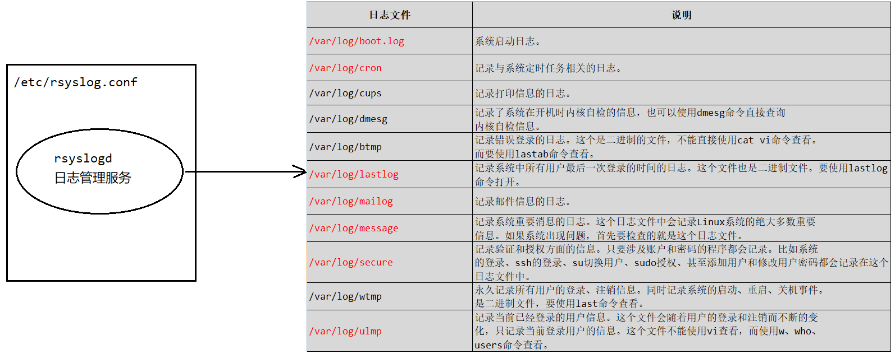

```bash
# 查询Linux的rsyslogd服务是否启动
[root@xq101 ~]# ps -aux | grep rsyslog
root       1291  0.0  0.3 222740  6408 ?        Ssl  10:28   0:00 /usr/sbin/rsyslogd -n
root       2427  0.0  0.0 112828   988 pts/0    R+   10:36   0:00 grep --color=auto rsyslog
# 查询rsyslogd服务的启动状态
[root@xq101 ~]# systemctl list-unit-files | grep rsyslog
rsyslog.service                               enabled 
# 查看该文件
[root@xq101 ~]# more /etc/rsyslog.conf 

…… ……
#### RULES ####

# Log all kernel messages to the console.
# Logging much else clutters up the screen.
#kern.*                                                 /dev/console

# Log anything (except mail) of level info or higher.
# Don't log private authentication messages!
*.info;mail.none;authpriv.none;cron.none                /var/log/messages

# The authpriv file has restricted access.
authpriv.*                                              /var/log/secure

# Log all the mail messages in one place.
mail.*                                                  -/var/log/maillog


# Log cron stuff
cron.*                                                  /var/log/cron

# Everybody gets emergency messages
*.emerg                                                 :omusrmsg:*

# Save news errors of level crit and higher in a special file.
uucp,news.crit                                          /var/log/spooler
…… ……
```

管理日志的配置文件 `/etc/rsyslog.conf`。

日志文件的格式是 `*.*` 存放的日志文件，第一个 `*` 是日志类型，第二个是日志级别。

**日志类型：**

| 日志类型             | 日志描述                     |
| -------------------- | ---------------------------- |
| auth                 | pam 产生的日志               |
| authpriv             | ssh ftp 等登陆信息的验证信息 |
| corn                 | 时间任务相关的信息           |
| kern                 | 内核相关日志                 |
| lpr                  | 打印相关的信息               |
| mail                 | 邮件相关的信息               |
| mark(syslog)-rsyslog | 服务内部信息                 |
| news                 | 新闻组                       |
| user                 | 用户程序产生的相关信息       |
| local 1-7            | 自定义日志设备               |

**日志级别：**

从上到下，日志级别从低到高，记录的信息也越来越少。

| 日志级别 | 说明                                                         |
| -------- | ------------------------------------------------------------ |
| debug    | 有调试信息的，记录的日志信息最多                             |
| info     | 一般日志信息，最常用                                         |
| notice   | 提醒信息，需要检查一下程序了，不理会可能会出现错误。         |
| warning  | 警告信息当出现警告时，你的程序可能已经出现了问题,但不影响程序正常运行尽快 进行处理，以免导致服务宕掉。 |
| err      | 错误信息，出现这一项时，已经挑明服务出现了问题,服务都无法确认是否能正常运 行。 |
| crit     | 严重级别，阻止整个系统或程序不能正常工作的信息               |
| alert    | 需要立即修改的信息                                           |
| emerg    | 记录内核崩溃等信息                                           |
| none     | 什么都不记录                                                 |

由日志服务 `rsyslogd` 记录的日志文件，日志文件的格式包含以下4列：

- 事件产生的时间；
- 产生事件的服务器(主机名)；
- 产生事件的服务名和程序名；
- 事件的具体信息。

<font color="blue">示例：查看一下 `/var/log/secure` 日志，这个日志记录的是用户验证和授权方面的信息，来分析。</font>

```bash
[root@xq101 ~]# cat /var/log/secure

Dec  3 21:32:50 xq101 sshd[4593]: error: Received disconnect from 192.168.56.1 port 51328:0:  [preauth]
Dec  3 21:32:50 xq101 sshd[4593]: Disconnected from 192.168.56.1 port 51328 [preauth]
Dec  3 21:33:16 xq101 sshd[3192]: error: Received disconnect from 192.168.56.1 port 59418:0:
Dec  3 21:33:16 xq101 sshd[3192]: Disconnected from 192.168.56.1 port 59418
Dec  3 21:33:16 xq101 sshd[3192]: pam_unix(sshd:session): session closed for user root
Dec  3 21:33:31 xq101 unix_chkpwd[4606]: password check failed for user (root)
…… ……
```

参数依次为日志产生的时间，主机名，程序或服务名，产生事件的具体描述信息。

#### （3）自定义日志服务

<font color="blue">示例：在 `/etc/rsyslog.conf` 中添加一个日志文件 `/var/log/xq.log`，当有事件发生时(比如 sshd 相关服务的事件)。 该文件会接收到信息并保存。比如我们登录重启 Linux 系统的时候，看看对应的日志信息是否成功保存。</font>

编辑 `/etc/rsyslog.conf` 文件，添加自定义日志信息：

```bash
[root@xq100 log]# vim /etc/rsyslog.conf
```

```bash
# 自定义日志
*.*                                       /var/log/xq.log
```

创建 `xq.log` 文件，重启虚拟机：

```bash
[root@xq100 log]# vim xq.log
 [root@xq100 log]# cat xq.log 
[root@xq100 log]# reboot 
```

登录后查看日志 `xq.log` 文件：

```bash
[root@xq101 log]# cat xq.log 
Dec  5 11:22:11 xq101 kernel: Initializing cgroup subsys cpuset
Dec  5 11:22:11 xq101 kernel: Initializing cgroup subsys cpu
Dec  5 11:22:11 xq101 kernel: Initializing cgroup subsys cpuacct
Dec  5 11:22:11 xq101 kernel: Linux version 3.10.0-1160.119.1.el7.x86_64 (mockbuild@kbuilder.bsys.centos.org) (gcc version 4.8.5 20150623 (Red Hat 4.8.5-44) (GCC) ) #1 SMP Tue Jun 4 14:43:51 UTC 2024
Dec  5 11:22:11 xq101 kernel: Command line: BOOT_IMAGE=/vmlinuz-3.10.0-1160.119.1.el7.x86_64 root=UUID=a1b28343-1ec4-4d09-bf5b-d77d59421e20 ro crashkernel=auto rhgb quiet LANG=zh_CN.UTF-8
Dec  5 11:22:11 xq101 kernel: e820: BIOS-provided physical RAM map:
Dec  5 11:22:11 xq101 kernel: BIOS-e820: [mem 0x0000000000000000-0x000000000009e7ff] usable
Dec  5 11:22:11 xq101 kernel: BIOS-e820: [mem 0x000000000009e800-0x000000000009ffff] reserved
Dec  5 11:22:11 xq101 kernel: BIOS-e820: [mem 0x00000000000dc000-0x00000000000fffff] reserved
Dec  5 11:22:11 xq101 kernel: BIOS-e820: [mem 0x0000000000100000-0x000000007fedffff] usable
…… ……
```

#### （4）日志轮替

##### 1. 日志轮替概述

日志轮替就是按照一定的规则，将一些不需要的旧的文件删掉。

日志轮替是使用 `/etc/logrotate.conf` 配置文件进行管理的。

```bash
[root@xq101 log]# cat /etc/logrotate.conf 
# see "man logrotate" for details
# rotate log files weekly
weekly

# keep 4 weeks worth of backlogs
rotate 4

# create new (empty) log files after rotating old ones
create

# use date as a suffix of the rotated file
dateext

# uncomment this if you want your log files compressed
#compress

# RPM packages drop log rotation information into this directory
include /etc/logrotate.d

# no packages own wtmp and btmp -- we'll rotate them here
/var/log/wtmp {
    monthly
    create 0664 root utmp
	minsize 1M
    rotate 1
}

/var/log/btmp {
    missingok
    monthly
    create 0600 root utmp
    rotate 1
}

# system-specific logs may be also be configured here.
```

##### 2. 自定义日志轮替规则

**语法：**

```txt
日志文件地址 {
	参数
}
```

**默认参数：**

| 默认参数 | 功能                                                         |
| -------- | ------------------------------------------------------------ |
| weekly   | 表示每周轮替一次                                             |
| rotate 4 | 表示同一个日志文件最多保存四个版本，多了会删除               |
| create   | 产生轮替之后生成一个新的空白的文件放在其后                   |
| dateext  | 日志轮替文件名字的命名方式<br>如果配置文件中有 dateext 参数：日志会用日期作为日志文件的后缀，例如“message-20220801”<br>如果没用 dateext：日志需要进行改名，当第一次日志轮替时，当前的“secure”改名为 “secure.1”，然后新建“secure”日志用来保存新的日志。第二次日志轮替时，当前的 “secure.1”会自动更名为“secure.2”，“secure”更名为“secure.1”，新建“secure”以保存新的日志。以此类推。 |

`include /etc/logrotate.d`：可以将自定义的日志轮替规则写到这个文件里去。

**常用参数：**

| 参数                    | 功能                                                         |
| ----------------------- | ------------------------------------------------------------ |
| daily                   | 轮替周期，每天                                               |
| weekly                  | 轮替周期，每周                                               |
| monthly                 | 轮替周期，每月                                               |
| rotate [num]            | 保存日志文件的个数                                           |
| compress                | 轮替时对旧日志进行压缩                                       |
| create mode owner group | 建立新日志的同时指定权限，所有者，所属组                     |
| mail address            | 日志轮替时输出内容通过邮件发送到指定的邮件地址               |
| missingok               | 如果日志不存在则忽略日志的警告信息                           |
| notifempty              | 如果日志为空文件则不进行日志轮替                             |
| minsize [size]          | 日志轮替的最小值，即超过该大小才会轮替 否则到达轮替周期也不会轮替 |
| size [size]             | 日志达到指定大小进行轮替，而不是按照轮替的时间周期           |
| dateext                 | 使用日期作为日志轮替文件的后缀                               |
| sharedscripts           | 在此关键字之后的脚本只执行一次                               |
| prerotate/endscripts    | 在日志轮替之前执行脚本命令                                   |
| postrotate/endscripts   | 在日志轮替之后执行脚本命令                                   |

查看可以自定义的日志轮替文件：

```bash
[root@xq101 log]# cd /etc/logrotate.d/
[root@xq101 logrotate.d]# ll
总用量 68
-rw-r--r--. 1 root root   91 9月  30 2020 bootlog
-rw-r--r--. 1 root root  160 9月  19 2018 chrony
-rw-r--r--. 1 root root   71 1月   7 2022 cups
-rw-r--r--. 1 root root   93 4月  28 2021 firewalld
-rw-r--r--. 1 root root 1102 4月   6 2022 glusterfs
-rw-r--r--. 1 root root  172 9月  30 2016 iscsiuiolog
-rw-r--r--. 1 root root  165 4月  28 2021 libvirtd
-rw-r--r--. 1 root root  142 4月  28 2021 libvirtd.qemu
-rw-r--r--. 1 root root  972 10月 11 2023 mysql
-rw-r--r--. 1 root root  106 4月  11 2018 numad
-rw-r--r--. 1 root root  136 2月  28 2020 ppp
-rw-r--r--. 1 root root  408 8月   3 2017 psacct
-rw-r--r--. 1 root root  115 9月  12 2023 samba
-rw-r--r--. 1 root root  237 1月  25 2024 sssd
-rw-r--r--. 1 root root  224 1月  14 2022 syslog
-rw-r--r--. 1 root root  100 3月  16 2021 wpa_supplicant
-rw-r--r--. 1 root root  103 10月  2 2020 yum

# 关于启动日志的轮替规则
[root@xq101 logrotate.d]# cat bootlog 
/var/log/boot.log
{
    missingok
    daily
    copytruncate
    rotate 7
    notifempty
}

```

**自定义日志文件加入日志轮替：**

第一种方法：直接在 `/etc/logrotate.conf` 配置文件中写入对该日志的轮替策略。

第二种方法：在 `/etc/logrotate.d` 目录下新建该日志的轮替文件。在该轮替文件中定义轮替策略，因为该目录中的文件都会被包含到主配置文件 `logrotate.conf` 中。

推荐使用第二种方法，因为系统中需要轮替的日志文件非常多，为了可读性方便，建立单独定义轮替规则。

`logrotate.conf` 只是定义了日志轮替的规则，那么日志轮替（在指定的时间备份日志）的这个动作，依赖于系统定时任务。可以在 `/etc/cron.daily/` 中发现一个可执行文件 `logrotate`。

<font color="blue">示例：</font>

编辑 `xqlog` 文件：

```bash
[root@xq101 logrotate.d]# vim xqlog
```

自定义日志轮换规则：

```txt
/var/log/xq.log
{
    missingok
    daily
    copytruncate
    rotate 2
    notifempty
}
```

查看 `logrotate`：

```bash
[root@xq101 logrotate.d]# cd /etc/cron.daily
[root@xq101 cron.daily]# ll
总用量 12
-rwx------. 1 root root 219 4月   1 2020 logrotate
-rwxr-xr-x. 1 root root 618 10月 30 2018 man-db.cron
-rwx------. 1 root root 208 4月  11 2018 mlocate
```

#### （5）内存日志

在 Linux 中，有一部分日志信息是没有写到日志文件里面去的，而是写在内存中的。这些日志的特点是日志信息都在随时发生变化。比如 Linux 内核的日志信息。内存日志还有一个特点是 Linux 系统在重新启动的时候，内存日志就会被清空。

**操作内存日志的常用指令：**

```txt
journalctl										查看所有的内存日志
journalctl -n 数字							   查看最新指定条数的内存日志
journalctl --since 开始时间 --until 结束时间	   查看区间时间内的日志，可加日期
journalctl -p err								查看报错日志
journalctl -o verbose							日志详细内容
```

<font color="blue">示例：</font>

```bash
[root@xq101 cron.daily]# journalctl -n 3
-- Logs begin at 四 2024-12-05 11:22:11 CST, end at 四 2024-12-05 12:01:01 CST. --
12月 05 12:01:01 xq101 run-parts(/etc/cron.hourly)[2731]: finished 0anacron
12月 05 12:01:01 xq101 anacron[2729]: Will run job `cron.daily' in 37 min.
12月 05 12:01:01 xq101 anacron[2729]: Jobs will be executed sequentially

[root@xq101 cron.daily]# journalctl --since 11:40 --until 12:00
-- Logs begin at 四 2024-12-05 11:22:11 CST, end at 四 2024-12-05 12:01:01 CST. --
12月 05 11:40:02 xq101 systemd[1]: Started Session 3 of user root.
12月 05 11:40:02 xq101 CROND[2487]: (root) CMD (/usr/lib64/sa/sa1 1 1)
12月 05 11:50:01 xq101 systemd[1]: Started Session 4 of user root.
12月 05 11:50:01 xq101 CROND[2587]: (root) CMD (/usr/lib64/sa/sa1 1 1)

[root@xq101 cron.daily]# journalctl -p err
-- Logs begin at 四 2024-12-05 11:22:11 CST, end at 四 2024-12-05 12:01:01 CST. --
12月 05 11:22:11 xq101 kernel: Detected CPU family 6 model 186 stepping 2
12月 05 11:22:11 xq101 kernel: Warning: Intel Processor - this hardware has not undergone upstream testing. Please consult http://wiki.centos.org
12月 05 11:22:14 xq101 kernel: sd 0:0:0:0: [sda] Assuming drive cache: write through
12月 05 11:22:14 xq101 kernel: sd 0:0:1:0: [sdb] Assuming drive cache: write through
12月 05 11:22:21 xq101 kernel: piix4_smbus 0000:00:07.3: SMBus Host Controller not enabled!
12月 05 11:23:30 xq101 spice-vdagent[2189]: Cannot access vdagent virtio channel /dev/virtio-ports/com.redhat.spice.0
12月 05 11:23:30 xq101 spice-streaming-agent[2195]: Failed to open the streaming device "/dev/virtio-ports/org.spice-space.stream.0": 2 - No such
```

