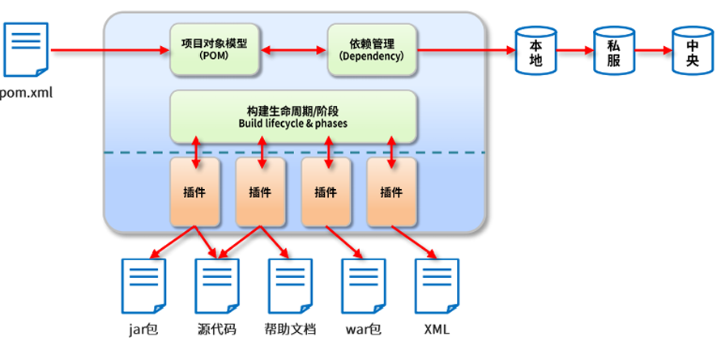

# Maven 工具

**SSM框架内容分为如下几个章节，每个章节对应一个文件：《Maven》、《Spring》、《MyBatis》、《SpringMVC》、《SSM整合》、《SpringBoot》、《MyBatis-Plus》。**

## 第一章：Maven

### 一、Maven 简介

#### （1）Maven 介绍

##### 1. 传统项目管理状态分析

前面我们通过 Web 阶段项目，要能够将项目运行起来，就必须将该项目所依赖的一 些 jar 包添加到工程中，否则项目就不能运行。试想如果具有相同架构的项目有十个，那么我们就需要将这一份 jar 包复制到十个不同的工程中。

此外还有一些其他的问题，比如 jar 包繁多，容易导致 jar 包版本不统一，引起 jar 包冲突的问题。

##### 2. Maven 的介绍

Maven 是一款为 Java 项目构建管理、依赖管理的工具（软件），使用 Maven 可以自动化构建、测试、打包和发布项目，大大提高了开发效率和质量。

Maven 在美国是一个口语化的词语，代表专家、内行的意思。 一个对 Maven 比较正式的定义是这么说的：Maven 是一个项目管理工 具，它包含了一个项目对象模型（POM：Project Object Model），一组标准集合，一 个项目生命周期（Project Lifecycle），一个依赖管理系统（Dependency Management  System），和用来运行定义在生命周期阶段（phase）中插件（plugin）目标（goal）的逻辑。



##### 3. Maven 的作用

1. 场景概念：

	场景1：

	例如我们项目需要第三方库（依赖），如 Druid 连接池、MySQL 数据库驱动和 Jackson 等。那么我们可以将需要的依赖项的信息编写到 Maven 工程的配置文件，Maven 软件就会自动下载并复制这些依赖项到项目中，也会自动下载依赖需要的依赖！确保依赖版本正确无冲突和依赖完整！

	场景2**：**

	项目开发完成后，想要将项目打成 `.war` 文件，并部署到服务器中运行，使用 Maven 软件，我们可以通过一行构建命令（`mvn package`）快速项目构建和打包。节省大量时间。

2. 依赖管理：

	Maven 可以管理项目的依赖，包括自动下载所需依赖库、自动下载依赖需要的依赖并且保证版本没有冲突、依赖版本管理等。通过 Maven，我们可以方便地维护项目所依赖的外部库，而我们仅仅需要编写配置即可。

3. 构建管理：

	项目构建是指将源代码、配置文件、资源文件等转化为能够运行或部署的应用程序或库的过程。

	Maven 可以管理项目的编译、测试、打包、部署等构建过程。通过实现标准的构建生命周期，Maven 可以确保每一个构建过程都遵循同样的规则和最佳实践。同时，Maven 的插件机制也使得开发者可以对构建过程进行扩展和定制。主动触发构建，只需要简单的命令操作即可。

	

#### （2）Maven 的安装与配置

[官网](https://maven.apache.org/download.cgi)下载 Maven。

##### 1. 安装 Maven 3.6.3

安装条件：Maven 需要本机安装 java 环境、必需包含 `java_home` 环境变量。

软件安装：右键解压即可（绿色免安装）

软件结构：

| 目录或文件名                | 说明                                   |
| --------------------------- | -------------------------------------- |
| bin                         | 含有 Maven 的运行脚本                  |
| boot                        | 含有 `plexus-classworlds` 类加载器框架 |
| conf                        | 含有 `setting.xml` 配置文件            |
| lib                         | 含有 Maven 运行时所需的 Java 类库      |
| LICENSE，NOTICE，README.txt | 针对 Maven 版本，第三方软件简要介绍    |

##### 2. 配置环境变量与文件

1. 配置 `maven_home` 和 `path`：

	此电脑右键属性，选择高级系统设置，选择环境变量，在系统变量中添加 `MAVEN_HOME`，路径为 Maven 文件夹的位置。

	在 `Path` 环境变量中添加 `%MAVEN_HOME%\bin`。

2. 命令测试：

	控制台输入 `mvn -v` 检查 Maven 版本：

	```bash
	C:\Users\lenovo>mvn -v
	Apache Maven 3.6.3 (cecedd343002696d0abb50b32b541b8a6ba2883f)
	Maven home: D:\Tools\apache-maven-3.6.3\bin\..
	Java version: 21.0.4, vendor: Oracle Corporation, runtime: D:\Tools\JDK21
	Default locale: zh_CN, platform encoding: UTF-8
	OS name: "windows 11", version: "10.0", arch: "amd64", family: "windows"
	```

3. 配置本地仓库地址：

	修改 Maven 仓库的位置，默认在 `C:\Users\lenovo\.m2`。

	找到 Maven 的 `conf` 目录下的 `setting.xml` 文件大约53行位置添加配置文件的仓库地址：

	```xml
	<!-- localRepository
	   | The path to the local repository maven will use to store artifacts.
	   |
	   | Default: ${user.home}/.m2/repository
	  <localRepository>/path/to/local/repo</localRepository>
	  -->
		<localRepository>D:\Tools\repo</localRepository>
	```

4. 配置国内的阿里镜像：

	在 `D:\Tools\apache-maven-3.6.3\conf` 下的 `setting.xml` 文件大约160行的 `mirror` 标签内粘贴如下内容：

	```xml
	<!--在mirrors节点(标签)下添加中央仓库镜像 160行附近-->
		<mirror>
			<id>alimaven</id>
			<name>aliyun maven</name>
			<url>http://maven.aliyun.com/nexus/content/groups/public/</url>
			<mirrorOf>central</mirrorOf>
		</mirror>
	```

5. 配置 JDK17 版本的项目构建：

	在 `setting.xml` 文件大约190行的 `profiles` 标签下添加如下内容：

	```xml
	<!--在profiles节点(标签)下添加jdk编译版本 268行附近-->
	<profile>
	    <id>jdk-17</id>
	    <activation>
	      <activeByDefault>true</activeByDefault>
	      <jdk>17</jdk>
	    </activation>
	    <properties>
	      <maven.compiler.source>17</maven.compiler.source>
	      <maven.compiler.target>17</maven.compiler.target>
	      <maven.compiler.compilerVersion>17</maven.compiler.compilerVersion>
	    </properties>
	</profile>
	```

6. IDEA 配置本地 Maven：

	IDEA 中点击文件 File，选择设置 Setting，选择构建、执行、部署里的构建工具，选择 Maven，将 Maven 主路径改为 Maven 文件夹地址，修改完成后，下方的本地仓库应该是上面设置的仓库地址 `D:\Tools\repo`。

### 二、Maven 工程创建

#### （1）Maven 工程的 GVAP 属性

Maven 工程相对之前的工程，多出一组 GVAP 属性，GVA 需要我们在创建项目的时指定，P 有默认值，后期通过配置文件修改。

Maven 中的 GAVP 是指 GroupId、ArtifactId、Version、Packaging 等四个属性的缩写，其中前三个是必要的，而 Packaging 属性为可选项。这四个属性主要为每个项目在 Maven 仓库总做一个标识，类似人的姓名。有了具体标识，方便 Maven 软件对项目进行管理和互相引用。

**GAV 遵循规则：**

1. GroupID 格式：com.{公司/BU }.业务线.[子业务线]，最多 4 级。

	说明：{公司/BU}，例如：`alibaba/taobao/tmall/aliexpress` 等 BU 一级；子业务线可选。

	正例：`com.taobao.tddl` 或 `com.alibaba.sourcing.multilang  com.ssh.java`

2. ArtifactID 格式：产品线名-模块名。语义不重复不遗漏，先到仓库中心去查证一下。

	正例：`tc-client / uic-api / tair-tool / bookstore`

3. Version版本号格式推荐：主版本号.次版本号.修订号

	- 主版本号：当做了不兼容的 API 修改，或者增加了能改变产品方向的新功能。
	- 次版本号：当做了向下兼容的功能性新增（新增类、接口等）。
	- 修订号：修复 bug，没有修改方法签名的功能加强，保持 API 兼容性。

	例如： 初始→1.0.0  修改bug → 1.0.1  功能调整 → 1.1.1等。

**Packaging 定义规则：**

指示将项目打包为指定类型的文件，IDEA 根据 `packaging` 值，识别 Maven 项目类型。

- `packaging` 属性为 `jar`（默认值），代表普通的 Java 工程，打包以后是 `.jar` 结尾的文件。
- `packaging` 属性为 `war`，代表 Java 的 web 工程，打包以后 `.war` 结尾的文件。
- `packaging` 属性为 `pom`，代表不会打包，用来做继承的父工程。

#### （2）IDEA 构建 Maven 工程

##### 1. 创建 JavaSE 工程

创建空项目，修改项目名称。

在该项目下，创建一个模块，选择 Java项目，构建系统选择 Maven，修改模块名称，创建成功。

##### 2. 创建 JavaEE 工程

**手动创建：**

1. 先创建一个 JavaSE Maven 项目；

2. 补全 JavaEE 项目的目录结构：

	在 `main` 文件夹下创建 `webapp/WEB-INF` 目录，在 `WEB-INF` 目录下创建`web.xml` 文件，该文件内容可以随意粘贴一个模板；

3. 在 `pom.xml` 文件中添加：

	```xml
	<packaging>war</packaging>
	```

4. 重新加载 `pom.xml` 文件，创建成功（`webapp` 多了一个小蓝圈）。

**插件创建（推荐使用）：**

1. 下载插件 JBLToJavaEE；
2. 创建一个 JavaSE Maven 项目；
3. 右键点击该项目，选择 JBLToJavaEE；成功修改为 JavaEE Maven 项目。
4. 若创建不成功，则查看该项目的 Maven 地址是否为下载的 Maven。

#### （3）Maven 工程项目结构

Maven 是一个强大的构建工具，它提供一种标准化的项目结构，可以帮助开发者更容易地管理项目的依赖、构建、测试和发布等任务。以下是 Maven Web 程序的文件结构及每个文件的作用：

```xml
|-- pom.xml                               # Maven 项目管理文件，核心配置文件
|-- src
    |-- main                              # 项目主要代码
    |   |-- java                          # Java 源代码目录
    |   |   `-- com/example/myapp         # 开发者代码主目录
    |   |       |-- controller            # 存放 Controller 层代码的目录
    |   |       |-- service               # 存放 Service 层代码的目录
    |   |       |-- dao                   # 存放 DAO 层代码的目录
    |   |       `-- model                 # 存放数据模型的目录
    |   |-- resources                     # 资源目录，存放配置文件、静态资源等
    |   |   |-- log4j.properties          # 日志配置文件
    |   |   |-- spring-mybatis.xml        # Spring Mybatis 配置文件
    |   |   `-- static                    # 存放静态资源的目录
    |   |       |-- css                   # 存放 CSS 文件的目录
    |   |       |-- js                    # 存放 JavaScript 文件的目录
    |   |       `-- images                # 存放图片资源的目录
    |   `-- webapp                        # 存放 WEB 相关配置和资源
    |       |-- WEB-INF                   # 存放 WEB 应用配置文件
    |       |   |-- web.xml               # Web 应用的部署描述文件
    |       |   `-- classes               # 存放编译后的 class 文件
    |       `-- index.html                # Web 应用入口页面
    `-- test                              # 项目测试代码
        |-- java                          # 单元测试目录
        `-- resources                     # 测试资源目录
```

- `pom.xml`：Maven 项目管理文件，用于描述项目的依赖和构建配置等信息。
- `src/main/java`：存放项目的 Java 源代码。
- `src/main/resources`：存放项目的资源文件，如配置文件、静态资源等。
- `src/main/webapp/WEB-INF`：存放 Web 应用的配置文件。
- `src/main/webapp/index.html`：Web 应用的入口页面。
- `src/test/java`：存放项目的测试代码。
- `src/test/resources`：存放测试相关的资源文件，如测试配置文件等。

### 三、依赖与构建管理

#### （1）依赖管理与配置

依赖指的是当前项目运行所需要的 jar，一个项目可以有很多个依赖。

##### 1. 依赖管理

Maven 依赖管理是 Maven 软件中最重要的功能之一。Maven 的依赖管理能够帮助开发人员自动解决软件包依赖问题，使得开发人员能够轻松地将其他开发人员开发的模块或第三方框架集成到自己的应用程序或模块中，避免出现版本冲突和依赖缺失等问题。

我们通过定义 POM 文件，Maven 能够自动解析项目的依赖关系，并通过 Maven 仓库自动下载和管理依赖，从而避免了手动下载和管理依赖的繁琐工作和可能引发的版本冲突问题。

Maven 项目信息属性配置和读取：

```xml
<!-- 模型版本 -->
<modelVersion>4.0.0</modelVersion>
<!-- 公司或者组织的唯一标志，并且配置时生成的路径也是由此生成， 如com.companyname.project-group，maven会将该项目打成的jar包放本地路径：/com/companyname/project-group -->

<!-- gavp属性 -->
<groupId>com.companyname.project-group</groupId>
<!-- 项目的唯一ID，一个groupId下面可能多个项目，就是靠artifactId来区分的 -->
<artifactId>project</artifactId>
<!-- 版本号 -->
<version>1.0.0</version>

<!--打包方式
    默认：jar
    jar指的是普通的java项目打包方式！ 项目打成jar包！
    war指的是web项目打包方式！项目打成war包！
    pom不会讲项目打包！这个项目作为父工程，被其他工程聚合或者继承！
-->
<packaging>jar/pom/war</packaging>
```

依赖管理和添加：

```xml
<!-- 
   通过编写依赖jar包的gav必要属性，引入第三方依赖！
   scope属性是可选的，可以指定依赖生效范围！
   依赖信息查询方式：
      1. maven仓库信息官网 https://mvnrepository.com/
      2. maven-search插件搜索
 -->
<dependencies>
    <!-- 引入具体的依赖包 -->
    <dependency>
        <groupId>log4j</groupId>
        <artifactId>log4j</artifactId>
        <version>1.2.17</version>
        <!--
            拓展：scope生效范围
            - compile ：main目录 test目录  打包打包 [默认]
            - provided：main目录 test目录  Servlet
            - runtime： 打包运行           MySQL反射
            - test:    test目录           junit
			用不好就设置默认值，全部生效，不会出现错误
         -->
        <scope>runtime</scope>
    </dependency>

</dependencies>
```

依赖版本提取和维护：

```xml
<!--声明版本-->
<properties>
  <!--命名随便,内部制定版本号即可！-->
  <!--声明一个变量!声明完变量以后，其他位置使用${变量名}引用
    声明的标签建议两层以上命名，推荐：技术名.version-->
  <junit.version>4.11</junit.version>
  <!-- 也可以通过 maven规定的固定的key，配置maven的参数！如下配置编码格式！-->
  <project.build.sourceEncoding>UTF-8</project.build.sourceEncoding>
  <project.reporting.outputEncoding>UTF-8</project.reporting.outputEncoding>
</properties>

<dependencies>
  <dependency>
    <groupId>junit</groupId>
    <artifactId>junit</artifactId>
    <!--引用properties声明版本 -->
    <!-- 相当于<version>4.11</version> -->
    <version>${junit.version}</version>
  </dependency>
</dependencies>
```

##### 2. 依赖范围

依赖的 jar 包在默认情况下可以在任何范围内使用，可以通过 `scope` 标签来控制其作用范围。

作用范围：

主程序范围有效（`main` 文件夹）

测试程序范围有效（`test` 文件夹）

是否参与打包（`package`指令范围之内）

|   scope    | 主代码 | 测试代码 | 打包 |     范例      |
| :--------: | :----: | :------: | :--: | :-----------: |
| `compile`  |   √    |    √     |  √   |    `log4j`    |
|   `test`   |        |    √     |      |    `junit`    |
| `provided` |   √    |    √     |      | `servlet-api` |
| `runtime`  |        |          |  √   |    `jdbc`     |

#### （2）依赖传递与冲突

##### 1. 依赖传递

依赖具有传递性。

依赖传递指的是当一个模块或库 A 依赖于另一个模块或库 B，而 B 又依赖于模块或库 C，那么 A 会间接依赖于 C。这种依赖传递结构可以形成一个依赖树。当我们引入一个库或框架时，构建工具（如 Maven、Gradle）会自动解析和加载其所有的直接和间接依赖，确保这些依赖都可用。


直接依赖：在当前项目中，通过依赖配置建立的依赖关系。

间接依赖：被依赖的资源，如果还依赖其他资源，那么当前项目间接依赖其他资源。

**依赖传递的作用：**

1. 减少重复依赖：当多个项目依赖同一个库时，Maven 可以自动下载并且只下载一次该库。这样可以减少项目的构建时间和磁盘空间。
2. 自动管理依赖: Maven 可以自动管理依赖项，使用依赖传递，简化了依赖项的管理，使项目构建更加可靠和一致。
3. 确保依赖版本正确性：通过依赖传递的依赖，之间都不会存在版本兼容性问题，确实依赖的版本正确性。

<font color="blue">示例：导入 JSON 依赖。</font>

`Jackson-databind` 的编译依赖有两个，分别是 `Jackson-core` 和 `Jackson-annotations`，导入`Jackson-databind` 就包含了其他两个依赖：

```xml
<?xml version="1.0" encoding="UTF-8"?>
<project xmlns="http://maven.apache.org/POM/4.0.0"
         xmlns:xsi="http://www.w3.org/2001/XMLSchema-instance"
         xsi:schemaLocation="http://maven.apache.org/POM/4.0.0 http://maven.apache.org/xsd/maven-4.0.0.xsd">
    <modelVersion>4.0.0</modelVersion>

<!--    gavp属性-->
<!--    不会改变-->
    <groupId>com.ssh</groupId>
    <artifactId>maven-javaee-project-02</artifactId>
<!--    构建过程 - 部署 - 修改-->
    <version>1.0.0</version>
<!--    Maven的打包方式  Java jar默认 web war   不打包 pom-->
    <packaging>war</packaging>

<!--    声明版本号-->
    <properties>
<!--声明一个变量!声明完变量以后，其他位置使用${变量名}引用
    声明的标签建议两层以上命名，推荐：技术名.version-->
        <jackson.version>2.18.2</jackson.version>
        <maven.compiler.source>17</maven.compiler.source>
        <maven.compiler.target>17</maven.compiler.target>
        <project.build.sourceEncoding>UTF-8</project.build.sourceEncoding>
    </properties>

<!--第三方依赖信息声明-->
<!--
通过编写依赖jar包的gav必要属性，引入第三方依赖！
scope属性是可选的，可以指定依赖生效范围！
依赖信息查询方式：
  1. maven仓库信息官网 https://mvnrepository.com/
  2. maven-search插件搜索
 -->
<!--    依赖信息的集合-->
    <dependencies>
<!--        代表每一个依赖项-->
<!--        <dependency>-->
<!--            <groupId>com.fasterxml.jackson.core</groupId>-->
<!--            <artifactId>jackson-databind</artifactId>-->
<!--&lt;!&ndash;            <version>2.18.2</version>&ndash;&gt;-->
<!--            <version>${jackson.version}</version>-->
<!--        </dependency>-->

        <dependency>
            <groupId>com.fasterxml.jackson.core</groupId>
            <artifactId>jackson-databind</artifactId>
            <version>2.18.2</version>
        </dependency>
    </dependencies>

</project>
```

##### 2. 依赖冲突

依赖冲突是指项目依赖的某一个 jar 包，有多个不同的版本，因而造成类包版本冲突。

依赖冲突避免出现重复依赖，并且终止依赖传递。


Maven 自动解决依赖冲突问题能力，会按照自己的原则，进行重复依赖选择。同时也提供了手动解决的冲突的方式，不过不推荐。

解决依赖冲突（如何选择重复依赖）方式：

- 短路优先原则（第一原则）

	A—>B—>C—>D—>E—>X(version 0.0.1)

	A—>F—>X(version 0.0.2)

	最终得到 A，B，C，D，E，F，X(version 0.0.2)（路径更短）

	A依赖于X(version 0.0.2)。

- 依赖路径长度相同情况下，则“先声明优先”（第二原则）

	谁先定义的就用谁的传递依赖，即在 `pom.xml` 文件自上而下，先声明的 jar 坐标，就先引用该 jar 的传递依赖。

	A—>E—>X(version 0.0.1)

	A—>F—>X(version 0.0.2)

	最终得到 A，E，F，X(version 0.0.1)（先声明的）

	在 `<depencies></depencies>` 中，先声明的，路径相同，会优先选择。

##### 3. 依赖导入失败的解决方案

在使用 Maven 构建项目时，可能会发生依赖项下载错误的情况，主要原因有以下几种：

1. 下载依赖时出现网络故障或仓库服务器宕机等原因，导致无法连接至 Maven 仓库，从而无法下载依赖（很少见）。
2. 依赖项的版本号或配置文件中的版本号错误，或者依赖项没有正确定义，导致 Maven 下载的依赖项与实际需要的不一致，从而引发错误。
3. 本地 Maven 仓库或缓存被污染或损坏，导致 Maven 无法正确地使用现有的依赖项，并且也无法重新下载。

解决方案：

1. 检查网络连接和 Maven 仓库服务器状态。

2. 确保依赖项的版本号与项目对应的版本号匹配，并检查 `pom.xml` 文件中的依赖项是否正确，刷新 `pom.xml` 文件会有报错提示信息。

3. 清除本地 Maven 仓库缓存（`lastUpdated` 文件），因为只要存在 `lastupdated` 缓存文件，刷新也不会重新下载。本地仓库中，根据依赖的 gav 属性依次向下查找文件夹，最终删除内部的文件，刷新重新下载即可。

	<font color="blue">示例：</font>

	```xml
	<dependency>
	            <groupId>com.fasterxml.jackson.core</groupId>
	            <artifactId>jackson-databind</artifactId>
	            <version>2.18.2</version>
	</dependency>
	```

	上述依赖需要前往 `D:\Tools\repo\com\fasterxml\jackson\core\jackson-databind\2.18.2` 目录检查，如果该目录下含有 `lastUpdated` 文件，则删除。

**使用脚本批量删除 `lastUpdated` 文件：**

```bat
@echo off
rem 这里写你的仓库路径
set REPOSITORY_PATH=D:\Tools\repo
rem 正在搜索...
for /f "delims=" %%i in ('dir /b /s "%REPOSITORY_PATH%\*lastUpdated*"') do (
    del /s /q %%i
)
rem 搜索完毕
pause
```

双击运行该 `.bat` 脚本即可批量删除所有 `lastUpdated` 文件。

#### （3）扩展构建管理和插件配置

见一（1）3. Maven 的作用一节项目构建的概念。

**主动触发场景：**

- 重新编译：编译不充分, 部分文件没有被编译；
- 打包：独立部署到外部服务器软件，打包部署；
- 部署本地或者私服仓库：Maven 工程加入到本地或者私服仓库，供其他工程使用。

##### 1. 命令方式构建

**语法：**

```txt
mvn 选项 构建命令....
```

| 选项    | 描述                                           |
| ------- | ---------------------------------------------- |
| clean   | 清理编译或打包后的项目结构，删除 target 文件夹 |
| compile | 编译项目，生成 target 文件                     |
| test    | 执行测试源码（测试）                           |
| site    | 生成一个项目依赖信息的展示页面                 |
| package | 打包项目，生成 war 或 jar 文件                 |
| install | 打包后上传到 Maven 本地仓库（本地部署）        |
| deploy  | 只打包，上传到 Maven私服仓库（私服部署）       |

`install` 命令包含了 `package` 命令，`package` 命令包含了 `test` 命令，`test` 命令包含了 `compile` 命令，所以当执行高级命令时不需要重复执行低级命令。

**最佳使用方案：**

```txt
打包: mvn clean package
重新编译: mvn clean compile
本地部署: mvn clean install 
```

**注意事项：**

1. 命令执行需要进入到目录的根路径，与 `pom.xml` 文件同级；
2. 部署必须是 jar 包形式。

##### 2. 可视化构建

使用 IDEA 的 Maven 视图工具，选择当前模块，点击生命周期，双击选择相应的操作。

操作与上述命令相同。

##### 3. 构建生命周期

构建生命周期可以理解成是一组固定构建命令的有序集合，触发周期后的命令，会自动触发周期前的命令，也是一种简化构建的思路。

Maven 对项目周期的构建分为3套：

- 清理周期：主要是对项目编译生成文件进行清理；

	包含命令：`clean`

- 默认周期：定义了真正构件时所需要执行的所有步骤，比如编译、测试、打包、部署等，它是生命周期中最核心的部分。

	包含命令：`compile - test - package - install / deploy`

- 报告周期：

	包含命令：`site`

	打包：`mvn clean package`；本地仓库：`mvn clean install`。

##### 4. 插件

插件与生命周期内的阶段绑定，在执行到对应生命周期时，执行对应的插件功能。

默认 Maven 在各个生命周期阶段上绑定有预设功能，通过插件可以自定义其他功能。

周期→包含若干命令→包含若干插件。

使用周期命令构建，简化构建过程，最终进行构建的是插件。

**自定义插件：**

在给 JavaEE 项目打 war 包的时候会报错，是因为 Maven 中自带的插件 war包2.2 版本与 JDK17 版本不匹配，需要将插件改成 3.2 版本：

```xml
<!--构建插件-->
<build>
    <!--插件管理-->
    <plugins>
        <plugin>
            <groupId>org.apache.maven.plugins</groupId>
            <artifactId>maven-war-plugin</artifactId>
            <version>3.2.2</version>
        </plugin>
    </plugins>
</build>
```

### 四、Maven 的继承与聚合

#### （1）Maven 工程的继承

Maven 继承是指在 Maven 的项目中，让一个项目从另一个项目中继承配置信息的机制。继承可以让我们在多个项目中共享同一配置信息，简化项目的管理和维护工作。


作用：在父工程中统一管理项目中的依赖信息，进行统一版本管理。

背景：

- 对一个比较大型的项目进行了模块拆分。
- 一个 project 下面，创建了很多个 module。
- 每一个 module 都需要配置自己的依赖信息。

需求：

1. 多个模块要使用同一个框架，它们应该是同一个版本，所以整个项目中使用的框架版本需要统一管理。
2. 使用框架时所需要的 jar 包组合（或者说依赖信息组合）需要经过长期摸索和反复调试，最终确定一个可用组合。这个耗费很大精力总结出来的方案不应该在新的项目中重新摸索。

如果将该框架引入父工程，可以解决子模块使用框架的版本冲突问题，但会使其他不需要此框架的子模块增加 jar 包的大小，将来打包，部署效率会降低。

解决方法：使用 `<dependencyManagement>` 标签帮我们管理依赖的版本。通过在父工程中为整个项目维护依赖信息的组合既保证了整个项目使用规范、准确的 jar 包；又能够将以往的经验沉淀下来，节约时间和精力。

<font color="blue">示例：</font>

父工程：`maven-pom-parent-04\pom.xml`：

```xml
<?xml version="1.0" encoding="UTF-8"?>
<project xmlns="http://maven.apache.org/POM/4.0.0"
         xmlns:xsi="http://www.w3.org/2001/XMLSchema-instance"
         xsi:schemaLocation="http://maven.apache.org/POM/4.0.0 http://maven.apache.org/xsd/maven-4.0.0.xsd">
    <modelVersion>4.0.0</modelVersion>

    <groupId>com.ssh</groupId>
    <artifactId>maven-pom-parent-04</artifactId>
    <version>1.0-SNAPSHOT</version>
    <!-- 父工程不打包，也不写代码 -->
    <packaging>pom</packaging>
    <modules>
        <module>ssh-shop-user</module>
        <module>ssh-shop-order</module>
    </modules>

    <properties>
        <maven.compiler.source>17</maven.compiler.source>
        <maven.compiler.target>17</maven.compiler.target>
        <project.build.sourceEncoding>UTF-8</project.build.sourceEncoding>
    </properties>

    <!-- 声明父工程的版本信息 -->
    <!-- 导入依赖，所有子工程都有相应的依赖 -->
    <dependencies>

    </dependencies>
    <!-- 声明依赖管理，不会下载依赖，可以被子工程继承版本号 -->
    <dependencyManagement>
        <dependencies>
            <dependency>
                <groupId>com.fasterxml.jackson.core</groupId>
                <artifactId>jackson-core</artifactId>
                <version>2.15.2</version>
            </dependency>
            <dependency>
                <groupId>mysql</groupId>
                <artifactId>mysql-connector-java</artifactId>
                <version>8.0.33</version>
            </dependency>
        </dependencies>
    </dependencyManagement>

</project>
```

子工程：`ssh-shop-order\pom.xml`：

```xml
<?xml version="1.0" encoding="UTF-8"?>
<project xmlns="http://maven.apache.org/POM/4.0.0"
         xmlns:xsi="http://www.w3.org/2001/XMLSchema-instance"
         xsi:schemaLocation="http://maven.apache.org/POM/4.0.0 http://maven.apache.org/xsd/maven-4.0.0.xsd">
    <modelVersion>4.0.0</modelVersion>


    <!-- parent标签就是来制定继承父工程的gav属性 -->
    <parent>
        <groupId>com.ssh</groupId>
        <artifactId>maven-pom-parent-04</artifactId>
        <version>1.0-SNAPSHOT</version>
    </parent>

    <!-- gv属性也继承父工程，也可以自己定义 -->
    <artifactId>ssh-shop-order</artifactId>

    <properties>
        <maven.compiler.source>17</maven.compiler.source>
        <maven.compiler.target>17</maven.compiler.target>
        <project.build.sourceEncoding>UTF-8</project.build.sourceEncoding>
    </properties>

<!-- 子工程引用父工程中的依赖信息时，可以把版本号去掉。  -->
<!-- 把版本号去掉就表示子工程中这个依赖的版本由父工程决定。 -->
<!-- 具体来说是由父工程的dependencyManagement来决定。 -->
    <dependencies>
        <dependency>
            <groupId>com.fasterxml.jackson.core</groupId>
            <artifactId>jackson-annotations</artifactId>
        </dependency>
    </dependencies>
</project>
```

#### （2）Maven 工程的聚合

Maven 聚合是指将多个项目组织到一个父级项目中，通过触发父工程的构建，统一按顺序触发子工程构建的过程。

**聚合的作用：**

- 统一管理子项目构建：通过聚合，可以将多个子项目组织在一起，方便管理和维护；
- 优化构建顺序：通过聚合，可以对多个项目进行顺序控制，避免出现构建依赖混乱导致构建失败的情况。

<font color="blue">示例：</font>

```xml
<!-- 聚合配置：子工程的模块 -->
    <modules>
        <module>ssh-shop-user</module>
        <module>ssh-shop-order</module>
    </modules>
```

**聚合与继承的关系：**

- 作用：
	- 聚合用于快速构建项目；
	- 继承用于快速配置。
- 相同点：
	- 聚合与继承的 `pom.xml` 文件打包方式均为 pom。可以将两种关系定义在同一个 `pom.xml`  文件中。
	- 聚合和继承均属于设计系模块，并无实际的模块内容。
- 不同点：
	- 聚合是在当前模块中配置关系，聚合可以感知到参与聚合的模块都有哪些；
	- 继承是在子模块中配置关系，父模块无法感知哪些子模块继承了自己。


**Spring 框架后续内容见：《Spring》……**