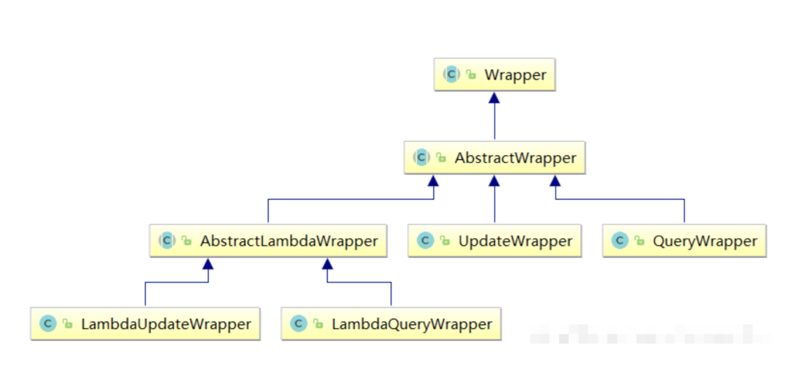
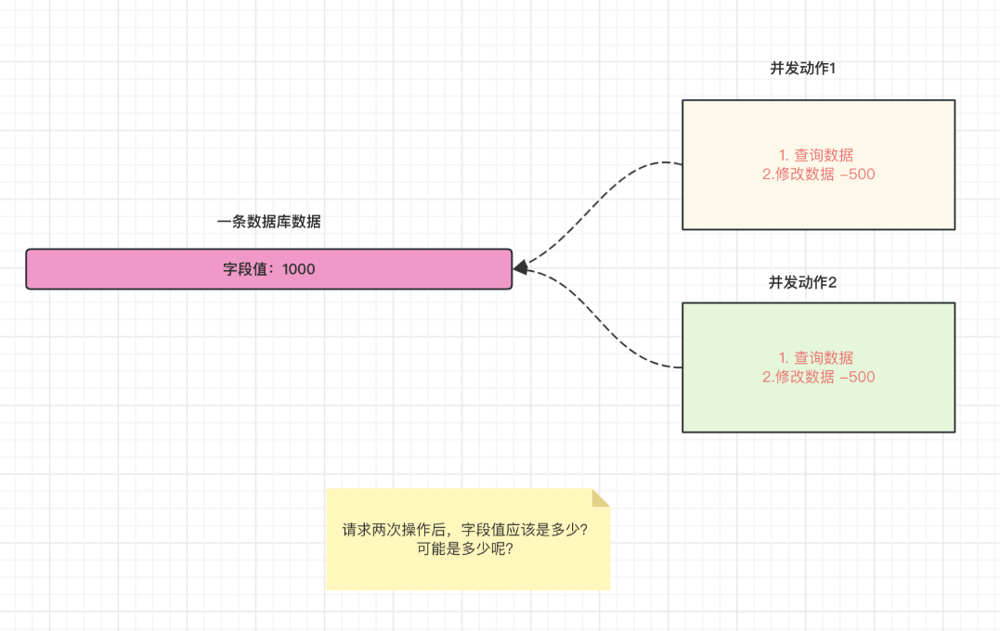

# MyBatis-Plus 框架

**SSM框架内容分为如下几个章节，每个章节对应一个文件：《[Maven](Maven.md)》、《[Spring](Spring.md)》、《[MyBatis](MyBatis.md)》、《[SpringMVC](SpringMVC.md)》、《[SSM整合](SSM整合.md)》、《[SpringBoot](SpringBoot.md)》、《[MyBatis-Plus](MyBatis-Plus.md)》。**


[TOC]

## 第七章：MyBatis-Plus

### 一、MyBatis-Plus 概述

#### （1）MyBatis-Plus 简介

https://baomidou.com/

[MyBatis-Plus](https://github.com/baomidou/mybatis-plus) [ (opens new window)](https://github.com/baomidou/mybatis-plus)（简称 MP）是一个 [MyBatis](https://www.mybatis.org/mybatis-3/) [ (opens new window)](https://www.mybatis.org/mybatis-3/) 的增强工具，在 MyBatis 的基础上只做增强不做改变，为简化开发、提高效率而生。

特性：

- 无侵入：只做增强不做改变，引入它不会对现有工程产生影响，如丝般顺滑；
- 损耗小：启动即会自动注入基本的增删改查操作，性能基本无损耗，直接面向对象操作；
- 强大的增删改查操作：内置通用 Mapper、通用 Service，仅仅通过少量配置即可实现单表大部分增删改查操作，更有强大的条件构造器，满足各类使用需求；
- 支持 Lambda 形式调用：通过 Lambda 表达式，方便的编写各类查询条件，无需再担心字段写错；
- 支持主键自动生成：支持多达 4 种主键策略（内含分布式唯一 ID 生成器 - Sequence），可自由配置，完美解决主键问题；
- 支持 ActiveRecord 模式：支持 ActiveRecord 形式调用，实体类只需继承 Model 类即可进行强大的 CRUD 操作；
- 支持自定义全局通用操作：支持全局通用方法注入（Write once，use anywhere）；
- 内置代码生成器：采用代码或者 Maven 插件可快速生成 Mapper 、 Model 、 Service 、 Controller 层代码，支持模板引擎，更有超多自定义配置等您来使用；
- 内置分页插件：基于 MyBatis 物理分页，开发者无需关心具体操作，配置好插件之后，写分页等同于普通 List 查询；
- 分页插件支持多种数据库：支持 MySQL、MariaDB、Oracle、DB2、H2、HSQL、SQLite、Postgre、SQLServer 等多种数据库；
- 内置性能分析插件：可输出 SQL 语句以及其执行时间，建议开发测试时启用该功能，能快速揪出慢查询；
- 内置全局拦截插件：提供全表 delete 、 update 操作智能分析阻断，也可自定义拦截规则，预防误操作。

支持数据库：

- MySQL，Oracle，DB2，H2，HSQL，SQLite，PostgreSQL，SQLServer，Phoenix，Gauss ，ClickHouse，Sybase，OceanBase，Firebird，Cubrid，Goldilocks，csiidb，informix，TDengine，redshift
- 达梦数据库，虚谷数据库，人大金仓数据库，南大通用(华库)数据库，南大通用数据库，神通数据库，瀚高数据库，优炫数据库

MyBatis-Plus 总结：

- 自动生成单表的增删改查操作功能；
- 提供丰富的条件拼接方式；
- 全自动ORM类型持久层框架。

#### （2）快速入门

继承 MyBatis-Plus 提供的基础 Mapper 接口，自带增删改查方法。

SpringBoot 项目测试只需在测试类上添加 `@SpringBootTest` 注解，然后直接定义测试方法即可。

数据模型准备：

```sql
USE lesson;

DROP TABLE IF EXISTS user;

CREATE TABLE user
(
    id BIGINT(20) NOT NULL COMMENT '主键ID',
    name VARCHAR(30) NULL DEFAULT NULL COMMENT '姓名',
    age INT(11) NULL DEFAULT NULL COMMENT '年龄',
    email VARCHAR(50) NULL DEFAULT NULL COMMENT '邮箱',
    PRIMARY KEY (id)
);

INSERT INTO user (id, name, age, email) VALUES
(1, 'Jone', 18, 'test1@baomidou.com'),
(2, 'Jack', 20, 'test2@baomidou.com'),
(3, 'Tom', 28, 'test3@baomidou.com'),
(4, 'Sandy', 21, 'test4@baomidou.com'),
(5, 'Billie', 24, 'test5@baomidou.com');
```

项目准备：创建空项目 `mybatis-plus-part`，创建子工程 `mybatis-plus-base-quick-1`

导入依赖：

```xml
<?xml version="1.0" encoding="UTF-8"?>
<project xmlns="http://maven.apache.org/POM/4.0.0"
         xmlns:xsi="http://www.w3.org/2001/XMLSchema-instance"
         xsi:schemaLocation="http://maven.apache.org/POM/4.0.0 http://maven.apache.org/xsd/maven-4.0.0.xsd">
    <modelVersion>4.0.0</modelVersion>

    <parent>
        <groupId>org.springframework.boot</groupId>
        <artifactId>spring-boot-starter-parent</artifactId>
        <version>3.0.5</version>
    </parent>

    <groupId>com.ssh</groupId>
    <artifactId>mybatis-plus-base-quick-1</artifactId>
    <version>1.0-SNAPSHOT</version>

    <dependencies>
        <dependency>
            <groupId>org.springframework.boot</groupId>
            <artifactId>spring-boot-starter</artifactId>
        </dependency>

        <!-- 测试环境 -->
        <dependency>
            <groupId>org.springframework.boot</groupId>
            <artifactId>spring-boot-starter-test</artifactId>
        </dependency>

        <!-- mybatis-plus  -->
        <dependency>
            <groupId>com.baomidou</groupId>
            <artifactId>mybatis-plus-boot-starter</artifactId>
            <version>3.5.3.1</version>
        </dependency>

        <dependency>
            <groupId>com.github.yulichang</groupId>
            <artifactId>mybatis-plus-spring-boot3-starter</artifactId>
            <version>3.5.7-001</version>
        </dependency>

        <!-- 数据库相关配置启动器 -->
        <dependency>
            <groupId>org.springframework.boot</groupId>
            <artifactId>spring-boot-starter-jdbc</artifactId>
        </dependency>

        <!-- druid启动器的依赖  -->
        <dependency>
            <groupId>com.alibaba</groupId>
            <artifactId>druid-spring-boot-3-starter</artifactId>
            <version>1.2.20</version>
        </dependency>

        <!-- 驱动类-->
        <dependency>
            <groupId>mysql</groupId>
            <artifactId>mysql-connector-java</artifactId>
            <version>8.0.28</version>
        </dependency>

        <dependency>
            <groupId>org.projectlombok</groupId>
            <artifactId>lombok</artifactId>
            <version>1.18.28</version>
        </dependency>

    </dependencies>


    <!--    SpringBoot应用打包插件-->
    <build>
        <plugins>
            <plugin>
                <groupId>org.springframework.boot</groupId>
                <artifactId>spring-boot-maven-plugin</artifactId>
            </plugin>
        </plugins>
    </build>

</project>
```

SpringBoot 启动类：

```java
package com.ssh;

import org.mybatis.spring.annotation.MapperScan;
import org.springframework.boot.SpringApplication;
import org.springframework.boot.autoconfigure.SpringBootApplication;

/**
 * @author 申书航
 * @version 1.0
 * 启动类
 */
@SpringBootApplication
@MapperScan("com.ssh.mapper")
public class Main {

    public static void main(String[] args) {
        SpringApplication.run(Main.class, args);
    }
}
```

数据库配置文件：

```yamL
# 连接池配置
spring:
  datasource:
    type: com.alibaba.druid.pool.DruidDataSource
    druid:
      url: jdbc:mysql://localhost:3306/lesson
      username: root
      password: root
      driver-class-name: com.mysql.cj.jdbc.Driver
      
mybatis-plus:
  configuration:
    log-impl: org.apache.ibatis.logging.slf4j.Slf4jImpl # 日志实现类
```

实体类：

```java
package com.ssh.pojo;

import lombok.Data;

/**
 * @author 申书航
 * @version 1.0
 * 用户实体类
 */
@Data
public class User {

    private Long id;

    private String name;

    private Integer age;

    private String email;
}
```

Mapper 接口：

```java
package com.ssh.mapper;

import com.baomidou.mybatisplus.core.mapper.BaseMapper;
import com.ssh.pojo.User;

/**
 * @author 申书航
 * @version 1.0
 */
public interface UserMapper extends BaseMapper<User> {

    // 自定义方法
}
```

测试：

```java
package com.ssh.test;

import com.ssh.mapper.UserMapper;
import com.ssh.pojo.User;
import org.junit.jupiter.api.Test;
import org.springframework.beans.factory.annotation.Autowired;
import org.springframework.boot.test.context.SpringBootTest;

import java.util.List;

/**
 * @author 申书航
 * @version 1.0
 * 测试
 */
@SpringBootTest // 启动测试环境
public class SpringBootMyBatisPlusTest {

    @Autowired
    private UserMapper userMapper;

    @Test
    public void test() {
        List<User> users = userMapper.selectList(null);

        System.out.println(users);
    }
}
```

### 二、MyBatis-Plus 核心功能

#### （1）基于 Mapper 接口的操作

通用增删改查操作封装 [BaseMapper (opens new window)](https://gitee.com/baomidou/mybatis-plus/blob/3.0/mybatis-plus-core/src/main/java/com/baomidou/mybatisplus/core/mapper/BaseMapper.java) 接口， `Mybatis-Plus` 启动时自动解析实体表关系映射转换为 `Mybatis` 内部对象注入容器，内部包含常见的单表操作。

**Insert 方法：**

```java
// 插入一条记录
// T 就是要插入的实体对象
// 默认主键生成策略为雪花算法（后面讲解）
int insert(T entity);
```

**Delete 方法：**

```java
// 根据 entity 条件，删除记录
int delete(@Param(Constants.WRAPPER) Wrapper<T> wrapper);

// 删除（根据ID 批量删除）
int deleteBatchIds(@Param(Constants.COLLECTION) Collection<? extends Serializable> idList);

// 根据 ID 删除
int deleteById(Serializable id);

// 根据 columnMap 条件，删除记录
int deleteByMap(@Param(Constants.COLUMN_MAP) Map<String, Object> columnMap);
```

| 类型                               | 参数名    | 描述                                 |
| ---------------------------------- | --------- | ------------------------------------ |
| Wrapper<T>                         | wrapper   | 实体对象封装操作类（可以为 null）    |
| Collection<? extends Serializable> | idList    | 主键 ID 列表(不能为 null 以及 empty) |
| Serializable                       | id        | 主键 ID                              |
| Map<String, Object>                | columnMap | 表字段 map 对象                      |

**Update 方法：**

```java
// 根据 whereWrapper 条件，更新记录，当属性值为空的时候不修改
int update(@Param(Constants.ENTITY) T updateEntity, 
            @Param(Constants.WRAPPER) Wrapper<T> whereWrapper);

// 根据 ID 修改  主键属性必须有值
int updateById(@Param(Constants.ENTITY) T entity);
```

| 类型       | 参数名        | 描述                                                         |
| ---------- | ------------- | ------------------------------------------------------------ |
| T          | entity        | 实体对象 (set 条件值,可为 null)                              |
| Wrapper<T> | updateWrapper | 实体对象封装操作类（可以为 null,里面的 entity 用于生成 where 语句） |

**Select 方法：**

```java
// 根据 ID 查询
T selectById(Serializable id);

// 根据 entity 条件，查询一条记录
T selectOne(@Param(Constants.WRAPPER) Wrapper<T> queryWrapper);

// 查询（根据ID 批量查询）
List<T> selectBatchIds(@Param(Constants.COLLECTION) Collection<? extends Serializable> idList);

// 根据 entity 条件，查询全部记录
List<T> selectList(@Param(Constants.WRAPPER) Wrapper<T> queryWrapper);

// 查询（根据 columnMap 条件）
List<T> selectByMap(@Param(Constants.COLUMN_MAP) Map<String, Object> columnMap);

// 根据 Wrapper 条件，查询全部记录
List<Map<String, Object>> selectMaps(@Param(Constants.WRAPPER) Wrapper<T> queryWrapper);

// 根据 Wrapper 条件，查询全部记录。注意： 只返回第一个字段的值
List<Object> selectObjs(@Param(Constants.WRAPPER) Wrapper<T> queryWrapper);

// 根据 entity 条件，查询全部记录（并翻页）
IPage<T> selectPage(IPage<T> page, @Param(Constants.WRAPPER) Wrapper<T> queryWrapper);

// 根据 Wrapper 条件，查询全部记录（并翻页）
IPage<Map<String, Object>> selectMapsPage(IPage<T> page, @Param(Constants.WRAPPER) Wrapper<T> queryWrapper);

// 根据 Wrapper 条件，查询总记录数
Integer selectCount(@Param(Constants.WRAPPER) Wrapper<T> queryWrapper);
```

| 类型                               | 参数名       | 描述                                     |
| ---------------------------------- | ------------ | ---------------------------------------- |
| Serializable                       | id           | 主键 ID                                  |
| Wrapper<T>                         | queryWrapper | 实体对象封装操作类（可以为 null）        |
| Collection<? extends Serializable> | idList       | 主键 ID 列表(不能为 null 以及 empty)     |
| Map<String, Object>                | columnMap    | 表字段 map 对象                          |
| IPage<T>                           | page         | 分页查询条件（可以为 RowBounds.DEFAULT） |

<font color="blue">示例：</font>

测试类，其他省略。

```java
package com.ssh.test;

import com.ssh.mapper.UserMapper;
import com.ssh.pojo.User;
import org.junit.jupiter.api.Test;
import org.springframework.beans.factory.annotation.Autowired;
import org.springframework.boot.test.context.SpringBootTest;

import java.util.ArrayList;
import java.util.HashMap;
import java.util.List;
import java.util.Map;

/**
 * @author 申书航
 * @version 1.0
 */
@SpringBootTest
public class MyBatisPlusTest {

    @Autowired
    private UserMapper userMapper;

    @Test
    public void insert() {
        User user = new User();
        user.setName("Tom");
        user.setAge(20);
        user.setEmail("tom@example.com");
        int row = userMapper.insert(user);
        System.out.println(row);
    }

    @Test
    public void delete() {

        // 根据id删除
        int row = userMapper.deleteById(1899430032657453057L);
        System.out.println("row = " + row);

        // 根据age删除
        Map param = new HashMap();
        param.put("age", 20);
        int i = userMapper.deleteByMap(param);
        System.out.println("i = " + i);

        // 条件封装对象，无限封装条件
    }

    @Test
    public void update() {

        //TODO: 当属性值为空的时候不修改该属性，所以在定义实体类时通常定义为包装类型

        //将所有人的age修改为22
        User user1 = new User();
        user1.setAge(22);
        int rows = userMapper.update(user1, null);//NULL 表示无条件
        System.out.println("rows = " + rows);

        //将 id = 1 的用户的age修改为30
        User user = new User();
        user.setId(1L);
        user.setAge(30);
        int i = userMapper.updateById(user);
        System.out.println("i = " + i);
    }

    @Test
    public void select() {
        User user = userMapper.selectById(1L);

        System.out.println("user = " + user);

        // 根据ID集合批量查询
        List<Long> ids = new ArrayList<>();
        ids.add(1L);
        ids.add(2L);
        ids.add(3L);
        List<User> users = userMapper.selectBatchIds(ids);

        System.out.println("users = " + users);

    }
}
```

#### （2）基于 Service 层接口的操作

通用 Service 增删改查操作封装[IService (opens new window)](https://gitee.com/baomidou/mybatis-plus/blob/3.0/mybatis-plus-extension/src/main/java/com/baomidou/mybatisplus/extension/service/IService.java)接口，进一步封装 CRUD 采用 `get 查询单行` `remove 删除` `list 查询集合` `page 分页` 前缀命名方式区分 `Mapper` 层避免混淆，

**对比Mapper接口CRUD区别：**

- service 添加了批量方法；
- service 层的方法自动添加事务。

**使用Iservice接口方式：**

接口继承IService接口

```Java
public interface UserService extends IService<User> {

}
```

类继承ServiceImpl实现类

```Java
@Service
public class UserServiceImpl extends ServiceImpl<UserMapper,User> implements UserService{

}
```

**各种查询操作的方法：**[持久层接口 | MyBatis-Plus](https://baomidou.com/guides/data-interface/)

```java
保存：
// 插入一条记录（选择字段，策略插入）
boolean save(T entity);
// 插入（批量）
boolean saveBatch(Collection<T> entityList);
// 插入（批量）
boolean saveBatch(Collection<T> entityList, int batchSize);

修改或者保存：
// TableId 注解存在更新记录，否插入一条记录
boolean saveOrUpdate(T entity);
// 根据updateWrapper尝试更新，否继续执行saveOrUpdate(T)方法
boolean saveOrUpdate(T entity, Wrapper<T> updateWrapper);
// 批量修改插入
boolean saveOrUpdateBatch(Collection<T> entityList);
// 批量修改插入
boolean saveOrUpdateBatch(Collection<T> entityList, int batchSize);

移除：
// 根据 queryWrapper 设置的条件，删除记录
boolean remove(Wrapper<T> queryWrapper);
// 根据 ID 删除
boolean removeById(Serializable id);
// 根据 columnMap 条件，删除记录
boolean removeByMap(Map<String, Object> columnMap);
// 删除（根据ID 批量删除）
boolean removeByIds(Collection<? extends Serializable> idList);

更新：
// 根据 UpdateWrapper 条件，更新记录 需要设置sqlset
boolean update(Wrapper<T> updateWrapper);
// 根据 whereWrapper 条件，更新记录
boolean update(T updateEntity, Wrapper<T> whereWrapper);
// 根据 ID 选择修改
boolean updateById(T entity);
// 根据ID 批量更新
boolean updateBatchById(Collection<T> entityList);
// 根据ID 批量更新
boolean updateBatchById(Collection<T> entityList, int batchSize);

数量： 
// 查询总记录数
int count();
// 根据 Wrapper 条件，查询总记录数
int count(Wrapper<T> queryWrapper);

查询：
// 根据 ID 查询
T getById(Serializable id);
// 根据 Wrapper，查询一条记录。结果集，如果是多个会抛出异常，随机取一条加上限制条件 wrapper.last("LIMIT 1")
T getOne(Wrapper<T> queryWrapper);
// 根据 Wrapper，查询一条记录
T getOne(Wrapper<T> queryWrapper, boolean throwEx);
// 根据 Wrapper，查询一条记录
Map<String, Object> getMap(Wrapper<T> queryWrapper);
// 根据 Wrapper，查询一条记录
<V> V getObj(Wrapper<T> queryWrapper, Function<? super Object, V> mapper);

集合：
// 查询所有
List<T> list();
// 查询列表
List<T> list(Wrapper<T> queryWrapper);
// 查询（根据ID 批量查询）
Collection<T> listByIds(Collection<? extends Serializable> idList);
// 查询（根据 columnMap 条件）
Collection<T> listByMap(Map<String, Object> columnMap);
// 查询所有列表
List<Map<String, Object>> listMaps();
// 查询列表
List<Map<String, Object>> listMaps(Wrapper<T> queryWrapper);
// 查询全部记录
List<Object> listObjs();
// 查询全部记录
<V> List<V> listObjs(Function<? super Object, V> mapper);
// 根据 Wrapper 条件，查询全部记录
List<Object> listObjs(Wrapper<T> queryWrapper);
// 根据 Wrapper 条件，查询全部记录
<V> List<V> listObjs(Wrapper<T> queryWrapper, Function<? super Object, V> mapper);
```

<font color="blue">示例：</font>

Service 接口

```java
package com.ssh.service;

import com.baomidou.mybatisplus.extension.service.IService;
import com.ssh.pojo.User;

/**
 * @author 申书航
 * @version 1.0
 */
public interface UserService extends IService<User> {

}
```

实现类：

```java
package com.ssh.service.impl;

import com.baomidou.mybatisplus.extension.service.impl.ServiceImpl;
import com.ssh.mapper.UserMapper;
import com.ssh.pojo.User;
import com.ssh.service.UserService;
import org.springframework.stereotype.Service;

/**
 * @author 申书航
 * @version 1.0
 */
@Service
public class UserServiceImpl extends ServiceImpl<UserMapper, User> implements UserService {
}
```

测试类：

```java
package com.ssh.test;

import com.ssh.mapper.UserMapper;
import com.ssh.pojo.User;
import com.ssh.service.UserService;
import org.junit.jupiter.api.Test;
import org.springframework.beans.factory.annotation.Autowired;
import org.springframework.boot.test.context.SpringBootTest;

import java.util.ArrayList;
import java.util.List;

/**
 * @author 申书航
 * @version 1.0
 */
@SpringBootTest
public class MyBatisPlusTest {

    @Autowired
    private UserService userService;

    @Test
    public void save() {
        List<User> list = new ArrayList<>();
        User user = new User();
        user.setName("张三");
        user.setAge(20);
        user.setEmail("123@qq.com");
        list.add(user);

        User user1 = new User();
        user1.setName("李四");
        user1.setAge(21);
        user1.setEmail("1234@qq.com");
        list.add(user1);

        boolean b = userService.saveBatch(list);
        System.out.println(b);
    }

    @Test
    public void saveOrUpdate() {
        //如果ID存在，则更新，否则插入
        User user = new User();
        user.setAge(45);
        user.setEmail("123567@qq.com");
        user.setName("王五");
        userService.saveOrUpdate(user);
    }

    @Test
    public void remove() {

        boolean b = userService.removeById(1899448724107563009L);
        System.out.println(b);
    }

    @Test
    public void update() {
        // get返回的是单个对象
        User byId = userService.getById(1);

        // list返回的是集合对象，NULL表示无条件
        List<User> list = userService.list(null);

        System.out.println(byId);
        System.out.println(list);
    }
}
```

#### （3）分页查询实现

[分页插件 | MyBatis-Plus](https://baomidou.com/plugins/pagination/#自定义-mapper-方法中使用分页)

导入依赖：

```xml
<!-- 
    jsqlparser 解析SQL语句的依赖
    用于解析SQL语句，获取表名、字段名等信息
-->
<dependency>
    <groupId>com.github.jsqlparser</groupId>
    <artifactId>jsqlparser</artifactId>
    <version>4.6</version>
</dependency>
```

启动类：

```java
package com.ssh;

import com.baomidou.mybatisplus.annotation.DbType;
import com.baomidou.mybatisplus.extension.plugins.MybatisPlusInterceptor;
import com.baomidou.mybatisplus.extension.plugins.inner.PaginationInnerInterceptor;
import org.mybatis.spring.annotation.MapperScan;
import org.springframework.boot.SpringApplication;
import org.springframework.boot.autoconfigure.SpringBootApplication;
import org.springframework.context.annotation.Bean;

/**
 * @author 申书航
 * @version 1.0
 */
@SpringBootApplication
@MapperScan("com.ssh.mapper")
public class MainApplication {

    public static void main(String[] args) {
        SpringApplication.run(MainApplication.class, args);
    }

    //将MP插件加入IoC容器
    @Bean
    public MybatisPlusInterceptor plusInterceptor() {
        //所有 MP 的插件集合，所有的插件都要添加到 interceptor 中
        MybatisPlusInterceptor interceptor = new MybatisPlusInterceptor();

        //分页插件
        interceptor.addInnerInterceptor(new PaginationInnerInterceptor(DbType.MYSQL));

        return interceptor;
    }
}
```

配置文件：

```yaml
# 连接池配置
spring:
  datasource:
    type: com.alibaba.druid.pool.DruidDataSource
    druid:
      url: jdbc:mysql://localhost:3306/lesson
      username: root
      password: root
      driver-class-name: com.mysql.cj.jdbc.Driver

mybatis-plus:
  # mapper.xml文件的位置默认在mapper文件夹下
  configuration:
    log-impl: org.apache.ibatis.logging.slf4j.Slf4jImpl # 日志实现类

  type-aliases-package: com.ssh.pojo # 别名
```

Mapper 接口自定义分页方法：

```java
package com.ssh.mapper;

import com.baomidou.mybatisplus.core.mapper.BaseMapper;
import com.baomidou.mybatisplus.core.metadata.IPage;
import com.baomidou.mybatisplus.extension.plugins.pagination.Page;
import com.ssh.pojo.User;
import org.apache.ibatis.annotations.Param;

/**
 * @author 申书航
 * @version 1.0
 */
public interface UserMapper extends BaseMapper<User> {

    //定义一个根据年龄查询参数，并且分页的方法
    IPage<User> queryByAge(IPage<User> page, @Param("age") Integer age);
}
```

`UserMapper.xml`：

```xml
<?xml version="1.0" encoding="UTF-8" ?>
<!DOCTYPE mapper
        PUBLIC "-//mybatis.org//DTD Mapper 3.0//EN"
        "https://mybatis.org/dtd/mybatis-3-mapper.dtd">

<mapper namespace="com.ssh.mapper.UserMapper">

    <!--
        方法内的查询类型是集合的泛型，这里是IPage的泛型
    -->
    <select id="queryByAge" resultType="user">
        select * from user where age > #{age}
    </select>

</mapper>
```

分别测试分页插件与自定义分页方法：

```java
package com.ssh.test;

import com.baomidou.mybatisplus.extension.plugins.pagination.Page;
import com.ssh.mapper.UserMapper;
import com.ssh.pojo.User;
import org.junit.jupiter.api.Test;
import org.springframework.beans.factory.annotation.Autowired;
import org.springframework.boot.test.context.SpringBootTest;

import java.util.List;

/**
 * @author 申书航
 * @version 1.0
 */
@SpringBootTest
public class MyBatisPlusTest {

    @Autowired
    private UserMapper userMapper;

    @Test
    public void pageTest() {
        // 查询第1页，每页3条数据
        Page<User> page = new Page<>(1, 3);
        userMapper.selectPage(page, null);

        long current = page.getCurrent();    // 当前页码
        long size = page.getSize();          // 每页显示条数
        long total = page.getTotal();        // 总记录数
        List<User> records = page.getRecords();    // 结果集
    }

    @Test
    public void testMyPage() {
        Page<User> page = new Page<>(1, 3);
        userMapper.queryByAge(page, 20);

        long current = page.getCurrent();    // 当前页码
        System.out.println("当前页码：" + current);
        long size = page.getSize();          // 每页显示条数
        System.out.println("每页显示条数：" + size);
        long total = page.getTotal();        // 总记录数
        System.out.println("总记录数：" + total);
        List<User> records = page.getRecords();    // 结果集
        System.out.println("结果集：" + records);
    }
}
```

#### （4）条件构造器的使用

##### 1. 条件构造器概述

**条件构造器的作用：**

使用 MyBatis-Plus 的条件构造器，你可以构建灵活、高效的查询条件，而不需要手动编写复杂的 SQL 语句。它提供了许多方法来支持各种条件操作符，并且可以通过链式调用来组合多个条件。这样可以简化查询的编写过程，并提高开发效率。

<font color="blue">示例代码：</font>

```java
QueryWrapper<User> queryWrapper = new QueryWrapper<>();
queryWrapper.eq("name", "John"); // 添加等于条件
queryWrapper.ne("age", 30); // 添加不等于条件
queryWrapper.like("email", "@gmail.com"); // 添加模糊匹配条件
等同于： 
delete from user where name = "John" and age != 30
                                  and email like "%@gmail.com%"
// 根据 entity 条件，删除记录
int delete(@Param(Constants.WRAPPER) Wrapper<T> wrapper);
```

**条件构造器的结构：**



`Wrapper`： 条件构造抽象类，最顶端父类：

- `AbstractWrapper`： 用于查询条件封装，生成 sql 的 where 条件：
    - `QueryWrapper`： 查询，删除，修改条件封装；
    - `UpdateWrapper`： 修改条件封装；
    - `AbstractLambdaWrapper`： 使用 Lambda 语法：
        - `LambdaQueryWrapper`：用于 Lambda 语法使用的查询 `Wrapper`；
        - `LambdaUpdateWrapper`： Lambda 更新封装 `Wrapper`。

##### 2. 基于 `QueryWrapper` 组装条件

[条件构造器 | MyBatis-Plus](https://baomidou.com/guides/wrapper/)

项目还是上一节的项目，包括实体类及各层实现等。

测试类：

```java
package com.ssh.test;

import com.baomidou.mybatisplus.core.conditions.query.QueryWrapper;
import com.ssh.mapper.UserMapper;
import com.ssh.pojo.User;
import org.junit.jupiter.api.Test;
import org.junit.platform.commons.util.StringUtils;
import org.springframework.beans.factory.annotation.Autowired;
import org.springframework.boot.test.context.SpringBootTest;

import java.util.List;

/**
 * @author 申书航
 * @version 1.0
 */
@SpringBootTest
public class MyBatisPlusQueryWrapperTest {

    @Autowired
    private UserMapper userMapper;

    @Test
    public void test1() {
        //查询用户名包含o，年龄在20-30之间，并且邮箱不为空的用户
        QueryWrapper<User> queryWrapper = new QueryWrapper<>();
        //所有条件动态拼接
        queryWrapper.like("name", "o");
        queryWrapper.between("age", 20, 30);
        queryWrapper.isNotNull("email");
        //拼接的SQL语句：
        //select * from user where name like '%o%' and age <= 20 and age >= 30 and email id not null

        //链式调用：
        queryWrapper.like("name", "o")
                .between("age", 20, 30)
                .isNotNull("email");
        List<User> users = userMapper.selectList(queryWrapper);
        System.out.println(users);
    }

    @Test
    public void test2() {
        //查询数据按照年龄降序排列，若相同则按照id升序排列

        QueryWrapper<User> queryWrapper = new QueryWrapper<>();
        queryWrapper.orderByDesc("age").orderByAsc("id");
        List<User> users = userMapper.selectList(queryWrapper);
        System.out.println(users);
    }

    @Test
    public void test3() {
        //删除邮箱为空的用户
        QueryWrapper<User> queryWrapper = new QueryWrapper<>();
        queryWrapper.isNull("email");
        int i = userMapper.delete(queryWrapper);
        System.out.println(i);
    }

    @Test
    public void test4() {
        //将年龄大于20并且用户名包含o的且邮箱为空的用户信息修改
        QueryWrapper<User> queryWrapper = new QueryWrapper<>();
        //条件之间默认是and连接，or()方法可以将条件后的第一个条件改为or连接
        queryWrapper.gt("age", 20).like("name", "o")
                .or().isNull("email");

        User user = new User();
        user.setAge(50);
        user.setEmail("new_email");

        int update = userMapper.update(user, queryWrapper);
        System.out.println(update);
    }

    @Test
    public void test5() {
        //查询用户的name和age字段，并且id大于2
        //默认是查询全部列
        QueryWrapper<User> queryWrapper = new QueryWrapper<>();

        queryWrapper.gt("id", 2L)
                .select("name", "age"); //只查询name和age字段

        List<User> users = userMapper.selectList(queryWrapper);
        System.out.println(users);
    }

    @Test
    public void test6() {
        //动态查询：
        //前端传入两个参数：name和age，查询name不为空，age大于22的用户
        QueryWrapper<User> queryWrapper = new QueryWrapper<>();

        String name = "Sandy";
        Integer age = 23;

        //手动判断
        if (StringUtils.isNotBlank(name)) {
            queryWrapper.eq("name", name);
        }
        if (age != null && age > 22) {
            queryWrapper.eq("age", age);
        }

        //每个方法的第一个参数有一个condition参数，可以传入一个表达式
        //true则生效，false则不生效
        queryWrapper.eq(StringUtils.isNotBlank(name), "name", name);
        queryWrapper.eq(age != null && age > 22, "age", age);

        List<User> users = userMapper.selectList(queryWrapper);
        System.out.println(users);
    }
}
```

##### 3. 基于 `UpdateWrapper` 组装条件

`QueryWrapper` 的修改方法需要先声明实体类，并且为 NULL 的属性不能修改。而 `UpdateWrapper` 无需创建实体类，可以直接修改属性的数据，且可以修改为任何值包括 NULL。

测试类：

```java
package com.ssh.test;

import com.baomidou.mybatisplus.core.conditions.query.QueryWrapper;
import com.baomidou.mybatisplus.core.conditions.update.UpdateWrapper;
import com.ssh.mapper.UserMapper;
import com.ssh.pojo.User;
import org.apache.ibatis.annotations.Update;
import org.junit.jupiter.api.Test;
import org.springframework.beans.factory.annotation.Autowired;
import org.springframework.boot.test.context.SpringBootTest;

/**
 * @author 申书航
 * @version 1.0
 */
@SpringBootTest
public class MyBatisPlusUpdateWrapperTest {

    @Autowired
    private UserMapper userMapper;

    @Test
    public void test4() {
        //将年龄大于20并且用户名包含o的且邮箱为空的用户信息修改
        UpdateWrapper<User> updateWrapper = new UpdateWrapper<>();

        //直接修改数据：set(字段名, 值);
        //任意修改值，可以修改为null

        updateWrapper.gt("age", 20).like("name", "o")
                .or().isNull("email")
                .set("email", null).set("age", 80);

        int update = userMapper.update(null, updateWrapper);
        System.out.println(update);
    }
}
```

##### 4. Lambda 的查询

相比于 `QueryWrapper`，`LambdaQueryWrapper` 使用了实体类的属性引用（例如 `User::getName`、`User::getAge`），而不是字符串来表示字段名，这提高了代码的可读性和可维护性。

**Lambda 表达式回顾：**

Lambda 表达式是 Java 8 引入的一种函数式编程特性，它提供了一种更简洁、更直观的方式来表示匿名函数或函数式接口的实现。Lambda 表达式可以用于简化代码，提高代码的可读性和可维护性。

Lambda 表达式的语法可以分为以下几个部分：

1. 参数列表： 参数列表用小括号 `()` 括起来，可以指定零个或多个参数。如果没有参数，可以省略小括号；如果只有一个参数，可以省略小括号。

    示例：`(a, b)`, `x ->`, `() ->`
2. 箭头符号： 箭头符号 `->` 分割参数列表和 Lambda 表达式的主体部分。

    示例：`->`
3. Lambda 表达式的主体： Lambda 表达式的主体部分可以是一个表达式或一个代码块。如果是一个表达式，可以省略 return 关键字；如果是多条语句的代码块，需要使用大括号 `{}` 括起来，并且需要明确指定 return 关键字。

    示例：

    - 单个表达式：`x -> x * x`
    - 代码块：`(x, y) -> { int sum = x + y; return sum; }`

**方法引用回顾：**

方法引用是 Java 8 中引入的一种语法特性，它提供了一种简洁的方式来直接引用已有的方法或构造函数。方法引用可以替代 Lambda 表达式，使代码更简洁、更易读。

Java 8 支持以下几种方法引用的形式：

1. 静态方法引用： 引用静态方法，语法为 `类名::静态方法名`。
2. 实例方法引用： 引用实例方法，语法为 `实例对象::实例方法名`。
3. 对象方法引用： 引用特定对象的实例方法，语法为 `类名::实例方法名`。
4. 构造函数引用： 引用构造函数，语法为 `类名::new`。

测试类：

```java
package com.ssh.test;

import com.baomidou.mybatisplus.core.conditions.query.LambdaQueryWrapper;
import com.baomidou.mybatisplus.core.conditions.query.QueryWrapper;
import com.baomidou.mybatisplus.core.conditions.update.LambdaUpdateWrapper;
import com.baomidou.mybatisplus.core.conditions.update.UpdateWrapper;
import com.ssh.mapper.UserMapper;
import com.ssh.pojo.User;
import org.junit.jupiter.api.Test;
import org.springframework.beans.factory.annotation.Autowired;
import org.springframework.boot.test.context.SpringBootTest;

import java.util.List;

/**
 * @author 申书航
 * @version 1.0
 */
@SpringBootTest
public class MyBatisPlusLambdaTest {

    @Autowired
    private UserMapper userMapper;

    @Test
    public void test1() {
        //查询用户名包含o，年龄在20-30之间，并且邮箱不为空的用户
        QueryWrapper<User> queryWrapper = new QueryWrapper<>();
        //拼接的SQL语句：
        //select * from user where name like '%o%' and age <= 20 and age >= 30 and email id not null

        //链式调用：
        queryWrapper.like("name", "o")
                .between("age", 20, 30)
                .isNotNull("email");

        //Lambda调用：
        LambdaQueryWrapper<User> lambdaQueryWrapper = new LambdaQueryWrapper<>();
        lambdaQueryWrapper.like(User::getName, "o")
                .between(User::getAge, 20, 30)
                .isNotNull(User::getEmail);

        List<User> users = userMapper.selectList(lambdaQueryWrapper);
        System.out.println(users);
    }

    @Test
    public void test2() {
        //将年龄大于20并且用户名包含o的且邮箱为空的用户信息修改
        UpdateWrapper<User> updateWrapper = new UpdateWrapper<>();

        //直接修改数据：set(字段名, 值);
        //任意修改值，可以修改为null

        updateWrapper.gt("age", 20).like("name", "o")
                .or().isNull("email")
                .set("email", null).set("age", 80);

        //Lambda调用：
        LambdaUpdateWrapper<User> lambdaUpdateWrapper = new LambdaUpdateWrapper<>();

        lambdaUpdateWrapper.gt(User::getAge, 20)
                .like(User::getName, "o")
                .or().isNull(User::getEmail)
                .set(User::getEmail, null)
                .set(User::getAge, 80);

        int update = userMapper.update(null, lambdaUpdateWrapper);
        System.out.println(update);
    }
}
```

#### （5）核心注解使用

MyBatis-Plus 是一个基于MyBatis框架的增强工具，提供了一系列简化和增强的功能，用于加快开发人员在使用 MyBatis 进行数据库访问时的效率。

MyBatis-Plus 提供了一种基于注解的方式来定义和映射数据库操作，其中的注解起到了重要作用。

默认情况下， 根据指定的 `<实体类>` 的名称对应数据库表名，属性名对应数据库的列名，但是不是所有数据库的信息和实体类都完全映射，自定义映射关系就可以使用 MyBatis-Plus 提供的注解即可。

##### 1. `@TableName` 注解

- 描述：表名注解，标识实体类对应的表；
- 使用位置：实体类；
- 如果表名和实体类名相同（忽略大小写）可以省略该注解；

将数据表名修改为 t_user；

修改指定单表：

实体类：

```java
package com.ssh.pojo;

import com.baomidou.mybatisplus.annotation.TableName;
import lombok.Data;

/**
 * @author 申书航
 * @version 1.0
 * 用户实体类
 */
@TableName("t_user")   // 设置表名，默认是类名，忽略大小写
@Data
public class User {

    private Long id;

    private String name;

    private Integer age;

    private String email;
}
```

批量修改表名前缀：

```yaml
# 连接池配置
spring:
  datasource:
    type: com.alibaba.druid.pool.DruidDataSource
    druid:
      url: jdbc:mysql://localhost:3306/lesson
      username: root
      password: root
      driver-class-name: com.mysql.cj.jdbc.Driver

mybatis-plus:
  # mapper.xml文件的位置默认在mapper文件夹下
  configuration:
    log-impl: org.apache.ibatis.logging.slf4j.Slf4jImpl # 日志实现类

  type-aliases-package: com.ssh.pojo # 别名

  global-config:
    db-config:
      table-prefix: t_ # 批量设置所有表的表名前缀
```

##### 2. `TableId` 注解

- 描述：主键注解；
- 使用位置：实体类主键字段；

**语法：**

```java
@TableId(value="主键列名",type=主键策略)	
```

| 属性  | 类型   | 必须指定 | 默认值      | 描述         |
| ----- | ------ | -------- | ----------- | ------------ |
| value | String | 否       | ""          | 主键字段名   |
| type  | Enum   | 否       | IdType.NONE | 指定主键类型 |

[IdType](https://github.com/baomidou/mybatis-plus/blob/3.0/mybatis-plus-annotation/src/main/java/com/baomidou/mybatisplus/annotation/IdType.java)属性可选值：

| 值                | 描述                                                         |
| ----------------- | ------------------------------------------------------------ |
| AUTO              | 数据库 ID 自增 (mysql配置主键自增长)                         |
| ASSIGN_ID（默认） | 分配 ID(主键类型为 Number(Long )或 String)(since 3.3.0)，使用接口 `IdentifierGenerator` 的方法 `nextId` (默认实现类为 `DefaultIdentifierGenerator` 雪花算法) |

在以下场景下，添加 `@TableId` 注解是必要的：

1. 实体类的字段与数据库表的主键字段不同名：如果实体类中的字段与数据库表的主键字段不一致，需要使用 `@TableId` 注解来指定实体类中表示主键的字段。
2. 主键生成策略不是默认策略：如果需要使用除了默认主键生成策略以外的策略，也需要添加 `@TableId` 注解，并通过 `value` 属性指定生成策略。

**全局配置修改主键：**

```yaml
# 连接池配置
spring:
  datasource:
    type: com.alibaba.druid.pool.DruidDataSource
    druid:
      url: jdbc:mysql://localhost:3306/lesson
      username: root
      password: root
      driver-class-name: com.mysql.cj.jdbc.Driver

mybatis-plus:
  # mapper.xml文件的位置默认在mapper文件夹下
  configuration:
    log-impl: org.apache.ibatis.logging.slf4j.Slf4jImpl # 日志实现类

  type-aliases-package: com.ssh.pojo # 别名

#  global-config:
#    db-config:
#      table-prefix: t_ # 批量设置所有表的表名前缀

  global-config:
    db-config:
      id-type: auto # 设置全局所有主键类型自增长
```

<font color="blue">示例：</font>

实体类单表修改主键为自增长：

```java
package com.ssh.pojo;

import com.baomidou.mybatisplus.annotation.IdType;
import com.baomidou.mybatisplus.annotation.TableId;
import com.baomidou.mybatisplus.annotation.TableName;
import lombok.Data;

/**
 * @author 申书航
 * @version 1.0
 * 用户实体类
 */
@TableName("user")   // 设置表名，默认是类名，忽略大小写
@Data
public class User {

    @TableId(type = IdType.AUTO)    // 设置主键自增长，前提是MySQL数据库的主键设置了自增长
    private Long id;

    private String name;

    private Integer age;

    private String email;
}
```

测试：

```java
package com.ssh.test;

import com.ssh.mapper.UserMapper;
import com.ssh.pojo.User;
import org.junit.jupiter.api.Test;
import org.springframework.beans.factory.annotation.Autowired;
import org.springframework.boot.test.context.SpringBootTest;

/**
 * @author 申书航
 * @version 1.0
 */
@SpringBootTest
public class MyBatisPlusTableIdTest {

    @Autowired
    private UserMapper userMapper;

    @Test
    public void test() {

        User user = new User();
        user.setName("小刚");
        user.setAge(18);
        user.setEmail("123@qq.com");
        //主键不赋值，默认是雪花算法生成的id，主键自增长需要在实体类中设置@TableId(type = IdType.AUTO)

        int insert = userMapper.insert(user);
        System.out.println(insert);
    }
}
```

##### 3. 雪花算法

雪花算法（Snowflake Algorithm）是一种用于生成唯一ID的算法。它由 Twitter 公司提出，用于解决分布式系统中生成全局唯一ID的需求。

在传统的自增ID生成方式中，使用单点数据库生成ID会成为系统的瓶颈，而雪花算法通过在分布式系统中生成唯一ID，避免了单点故障和性能瓶颈的问题。

雪花算法生成的ID是一个64位的整数，由以下几个部分组成：

1. 时间戳：41位，精确到毫秒级，可以使用69年。
2. 节点ID：10位，用于标识分布式系统中的不同节点。
3. 序列号：12位，表示在同一毫秒内生成的不同ID的序号。

通过将这三个部分组合在一起，雪花算法可以在分布式系统中生成全局唯一的ID，并保证ID的生成顺序性。

雪花算法的工作方式如下：

1. 当前时间戳从某一固定的起始时间开始计算，可以用于计算ID的时间部分。
2. 节点ID是分布式系统中每个节点的唯一标识，可以通过配置或自动分配的方式获得。
3. 序列号用于记录在同一毫秒内生成的不同ID的序号，从0开始自增，最多支持4096个ID生成。

需要注意的是，雪花算法依赖于系统的时钟，需要确保系统时钟的准确性和单调性，否则可能会导致生成的ID不唯一或不符合预期的顺序。

雪花算法是一种简单但有效的生成唯一ID的算法，广泛应用于分布式系统中，如微服务架构、分布式数据库、分布式锁等场景，以满足全局唯一标识的需求。

<font color="red">**雪花算法生成的数字，需要使用 Long 或者 String 类型主键，数据库采用 bigint 或 varchar 类型。**</font>

##### 4. `@TableField` 注解

描述：字段注解（非主键）；

**语法：**

```java
@TableField(value = "字段名", exist = true/falses)
```

| 属性  | 类型    | 必须指定 | 默认值 | 描述               |
| ----- | ------- | -------- | ------ | ------------------ |
| value | String  | 否       | ""     | 数据库字段名       |
| exist | boolean | 否       | true   | 是否为数据库表字段 |

<font color="red">**MyBatis-Plus会自动开启驼峰命名风格映射。**</font>

实体类：

```java
package com.ssh.pojo;

import com.baomidou.mybatisplus.annotation.IdType;
import com.baomidou.mybatisplus.annotation.TableField;
import com.baomidou.mybatisplus.annotation.TableId;
import com.baomidou.mybatisplus.annotation.TableName;
import lombok.Data;

/**
 * @author 申书航
 * @version 1.0
 * 用户实体类
 */
@TableName("user")   // 设置表名，默认是类名，忽略大小写
@Data
public class User {

    @TableId(type = IdType.AUTO)    // 设置主键自增长，前提是MySQL数据库的主键设置了自增长
    private Long id;

    @TableField(value = "name", exist = true)
    private String name;

    private Integer age;

    private String email;
}
```

### 三、MyBatis-Plus 高级扩展

#### （1）逻辑删除实现

逻辑删除，可以方便地实现对数据库记录的逻辑删除而不是物理删除。逻辑删除是指通过更改记录的状态或添加标记字段来模拟删除操作，从而保留了删除前的数据，便于后续的数据分析和恢复。

- 物理删除：真实删除，将对应数据从数据库中删除，之后查询不到此条被删除的数据；
- 逻辑删除：假删除，将对应数据中代表是否被删除字段的状态修改为“被删除状态”，之后在数据库中仍旧能看到此条数据记录。

数据库添加逻辑删除字段：可以是一个布尔类型、整数类型或枚举类型。

```mysql
USE lesson;

DROP TABLE IF EXISTS user;

CREATE TABLE user
(
    id BIGINT(20) NOT NULL AUTO_INCREMENT COMMENT '主键ID',
    name VARCHAR(30) NULL DEFAULT NULL COMMENT '姓名',
    age INT(11) NULL DEFAULT NULL COMMENT '年龄',
    email VARCHAR(50) NULL DEFAULT NULL COMMENT '邮箱',
    PRIMARY KEY (id)
);


INSERT INTO user (id, name, age, email) VALUES
(1, 'Jone', 18, 'test1@baomidou.com'),
(2, 'Jack', 20, 'test2@baomidou.com'),
(3, 'Tom', 28, 'test3@baomidou.com'),
(4, 'Sandy', 21, 'test4@baomidou.com'),
(5, 'Billie', 24, 'test5@baomidou.com');

ALTER TABLE USER ADD deleted INT DEFAULT 0 ;  # int 类型 1 逻辑删除 0 未逻辑删除
```

实体类添加逻辑删除属性：`@TableLogic` 注解。

```java
package com.ssh.pojo;

import com.baomidou.mybatisplus.annotation.*;
import lombok.Data;

/**
 * @author 申书航
 * @version 1.0
 * 用户实体类
 */
@TableName("user")   // 设置表名，默认是类名，忽略大小写
@Data
public class User {

    @TableId(type = IdType.AUTO)    // 设置主键自增长，前提是MySQL数据库的主键设置了自增长
    private Long id;

    @TableField(value = "name", exist = true)
    private String name;

    private Integer age;

    private String email;

    @TableLogic    // 设置逻辑删除字段，默认是0表示未删除，1表示已删除
    private Integer deleted;     // 逻辑删除字段，0表示未删除，1表示已删除
}
```

全局配置逻辑删除（本项目不需要）：

```yaml
# 连接池配置
spring:
  datasource:
    type: com.alibaba.druid.pool.DruidDataSource
    druid:
      url: jdbc:mysql://localhost:3306/lesson
      username: root
      password: root
      driver-class-name: com.mysql.cj.jdbc.Driver

mybatis-plus:
  # mapper.xml文件的位置默认在mapper文件夹下
  configuration:
    log-impl: org.apache.ibatis.logging.slf4j.Slf4jImpl # 日志实现类

  type-aliases-package: com.ssh.pojo # 别名

#  global-config:
#    db-config:
#      table-prefix: t_ # 批量设置所有表的表名前缀

  global-config:
    db-config:
      id-type: auto # 设置全局所有主键类型自增长

      # 全局配置逻辑删除
      logic-delete-field: deleted # 逻辑删除字段名
      logic-not-delete-value: 0 # 未删除值
      logic-delete-value: 1
```

测试类：

```java
package com.ssh.test;

import com.ssh.mapper.UserMapper;
import com.ssh.pojo.User;
import org.junit.jupiter.api.Test;
import org.springframework.beans.factory.annotation.Autowired;
import org.springframework.boot.test.context.SpringBootTest;

import java.util.List;

/**
 * @author 申书航
 * @version 1.0
 * 测试逻辑删除
 */
@SpringBootTest
public class MyBatisPlusTableLogicTest {

    @Autowired
    private UserMapper userMapper;

    @Test
    public void test1() {
        // 逻辑删除，实际上是更新 deleted 字段为 1，并不会真正删除数据
        userMapper.deleteById(1);

        // 查询所有数据，不会查询逻辑删除的数据
        List<User> users = userMapper.selectList(null);
        System.out.println(users);
    }
}
```

逻辑删除以后，没有真正的删除语句，删除改为修改语句。

#### （2）乐观锁与悲观锁

##### 1. 乐观锁与悲观锁介绍

并发问题场景：



乐观锁和悲观锁是在并发编程中用于处理并发访问和资源竞争的两种不同的锁机制。

**悲观锁：**

悲观锁的基本思想是，在整个数据访问过程中，将共享资源锁定，以确保其他线程或进程不能同时访问和修改该资源。悲观锁的核心思想是"先保护，再修改"。在悲观锁的应用中，线程在访问共享资源之前会获取到锁，并在整个操作过程中保持锁的状态，阻塞其他线程的访问。只有当前线程完成操作后，才会释放锁，让其他线程继续操作资源。这种锁机制可以确保资源独占性和数据的一致性，但是在高并发环境下，悲观锁的效率相对较低。

**乐观锁：**

乐观锁的基本思想是，认为并发冲突的概率较低，因此不需要提前加锁，而是在数据更新阶段进行冲突检测和处理。乐观锁的核心思想是"先修改，后校验"。在乐观锁的应用中，线程在读取共享资源时不会加锁，而是记录特定的版本信息。当线程准备更新资源时，会先检查该资源的版本信息是否与之前读取的版本信息一致，如果一致则执行更新操作，否则说明有其他线程修改了该资源，需要进行相应的冲突处理。乐观锁通过避免加锁操作，提高了系统的并发性能和吞吐量，但是在并发冲突较为频繁的情况下，乐观锁会导致较多的冲突处理和重试操作。

**乐观锁实现方案和技术：**

- 版本号/时间戳：为数据添加一个版本号或时间戳字段，每次更新数据时，比较当前版本号或时间戳与期望值是否一致，若一致则更新成功，否则表示数据已被修改，需要进行冲突处理。
- CAS（Compare-and-Swap）：使用原子操作比较当前值与旧值是否一致，若一致则进行更新操作，否则重新尝试。
- 无锁数据结构：采用无锁数据结构，如无锁队列、无锁哈希表等，通过使用原子操作实现并发安全。

**悲观锁实现方案和技术：**

- 锁机制：使用传统的锁机制，如互斥锁（Mutex Lock）或读写锁（Read-Write Lock）来保证对共享资源的独占访问。
- 数据库锁：在数据库层面使用行级锁或表级锁来控制并发访问。
- 信号量（Semaphore）：使用信号量来限制对资源的并发访问。

**介绍版本号乐观锁技术的实现流程:**

- 每条数据添加一个版本号字段version；
- 取出记录时，获取当前 version；
- 更新时，检查获取版本号是不是数据库当前最新版本号；
- 如果是证明没有人修改数据，执行更新，set 数据更新，version = version + 1；
- 如果 version 不对证明有人已经修改了，我们现在的其他记录就是失效数据，则更新失败。

##### 2. 使用 MyBatis-Plus 实现乐观锁

数据库与实体类添加版本号字段：

- 支持的数据类型只有：int，Integer，long，Long，Date，Timestamp，LocalDateTime；
- 仅支持 `updateById(id)` 与 `update(entity, wrapper)` 方法；

数据库添加字段：

```mysql
USE lesson;

DROP TABLE IF EXISTS user;

CREATE TABLE user
(
    id BIGINT(20) NOT NULL AUTO_INCREMENT COMMENT '主键ID',
    name VARCHAR(30) NULL DEFAULT NULL COMMENT '姓名',
    age INT(11) NULL DEFAULT NULL COMMENT '年龄',
    email VARCHAR(50) NULL DEFAULT NULL COMMENT '邮箱',
    PRIMARY KEY (id)
);


INSERT INTO user (id, name, age, email) VALUES
(1, 'Jone', 18, 'test1@baomidou.com'),
(2, 'Jack', 20, 'test2@baomidou.com'),
(3, 'Tom', 28, 'test3@baomidou.com'),
(4, 'Sandy', 21, 'test4@baomidou.com'),
(5, 'Billie', 24, 'test5@baomidou.com');

ALTER TABLE USER ADD deleted INT DEFAULT 0 ;  # int 类型 1 逻辑删除 0 未逻辑删除

ALTER TABLE USER ADD VERSION INT DEFAULT 1 ;  # int 类型 乐观锁字段
```

实体类添加字段：

```java
package com.ssh.pojo;

import com.baomidou.mybatisplus.annotation.*;
import lombok.Data;

/**
 * @author 申书航
 * @version 1.0
 * 用户实体类
 */
@TableName("user")   // 设置表名，默认是类名，忽略大小写
@Data
public class User {

    @TableId(type = IdType.AUTO)    // 设置主键自增长，前提是MySQL数据库的主键设置了自增长
    private Long id;

    @TableField(value = "name", exist = true)
    private String name;

    private Integer age;

    private String email;

    @TableLogic    // 设置逻辑删除字段，默认是0表示未删除，1表示已删除
    private Integer deleted;     // 逻辑删除字段，0表示未删除，1表示已删除

    @Version
    private Integer version;    // 乐观锁版本号
}
```

启动类添加版本号更新插件：

```java
package com.ssh;

import com.baomidou.mybatisplus.annotation.DbType;
import com.baomidou.mybatisplus.extension.plugins.MybatisPlusInterceptor;
import com.baomidou.mybatisplus.extension.plugins.inner.OptimisticLockerInnerInterceptor;
import com.baomidou.mybatisplus.extension.plugins.inner.PaginationInnerInterceptor;
import org.mybatis.spring.annotation.MapperScan;
import org.springframework.boot.SpringApplication;
import org.springframework.boot.autoconfigure.SpringBootApplication;
import org.springframework.context.annotation.Bean;

/**
 * @author 申书航
 * @version 1.0
 */
@SpringBootApplication
@MapperScan("com.ssh.mapper")
public class MainApplication {

    public static void main(String[] args) {
        SpringApplication.run(MainApplication.class, args);
    }

    //将MP插件加入IoC容器
    @Bean
    public MybatisPlusInterceptor plusInterceptor() {
        //所有 MP 的插件集合，所有的插件都要添加到 interceptor 中
        MybatisPlusInterceptor interceptor = new MybatisPlusInterceptor();

        //分页插件
        interceptor.addInnerInterceptor(new PaginationInnerInterceptor(DbType.MYSQL));
        
        //版本号插件实现乐观锁：MyBatis-Plus 会在更新时自动对比版本号字段以及版本号更新
        interceptor.addInnerInterceptor(new OptimisticLockerInnerInterceptor());
        
        return interceptor;
    }
}
```

测试类：

```java
package com.ssh.test;

import com.ssh.mapper.UserMapper;
import com.ssh.pojo.User;
import org.junit.jupiter.api.Test;
import org.springframework.beans.factory.annotation.Autowired;
import org.springframework.boot.test.context.SpringBootTest;

/**
 * @author 申书航
 * @version 1.0
 * 测试乐观锁
 */
@SpringBootTest
public class MyBatisPlusVersionTest {

    @Autowired
    private UserMapper userMapper;

    //演示乐观锁生效场景
    @Test
    public void testQuick7(){
        //步骤1: 先查询,在更新 获取version数据
        //同时查询两条,但是version唯一,最后更新的失败
        User user  = userMapper.selectById(5);
        User user1  = userMapper.selectById(5);

        user.setAge(20);
        user1.setAge(30);

        userMapper.updateById(user);
        //乐观锁生效,失败!
        userMapper.updateById(user1);
    }
}
```

#### （3）防止全表更新与删除

针对 update 和 delete 语句，作用是阻止恶意的全表更新删除。

添加防止全表更新与删除拦截器：

```java
package com.ssh;

import com.baomidou.mybatisplus.annotation.DbType;
import com.baomidou.mybatisplus.extension.plugins.MybatisPlusInterceptor;
import com.baomidou.mybatisplus.extension.plugins.inner.BlockAttackInnerInterceptor;
import com.baomidou.mybatisplus.extension.plugins.inner.OptimisticLockerInnerInterceptor;
import com.baomidou.mybatisplus.extension.plugins.inner.PaginationInnerInterceptor;
import org.mybatis.spring.annotation.MapperScan;
import org.springframework.boot.SpringApplication;
import org.springframework.boot.autoconfigure.SpringBootApplication;
import org.springframework.context.annotation.Bean;

/**
 * @author 申书航
 * @version 1.0
 */
@SpringBootApplication
@MapperScan("com.ssh.mapper")
public class MainApplication {

    public static void main(String[] args) {
        SpringApplication.run(MainApplication.class, args);
    }

    //将MP插件加入IoC容器
    @Bean
    public MybatisPlusInterceptor plusInterceptor() {
        //所有 MP 的插件集合，所有的插件都要添加到 interceptor 中
        MybatisPlusInterceptor interceptor = new MybatisPlusInterceptor();

        //分页插件
        interceptor.addInnerInterceptor(new PaginationInnerInterceptor(DbType.MYSQL));

        //版本号插件实现乐观锁：MyBatis-Plus 会在更新时自动对比版本号字段以及版本号更新
        interceptor.addInnerInterceptor(new OptimisticLockerInnerInterceptor());

        //防止全表更新与删除的拦截器
        interceptor.addInnerInterceptor(new BlockAttackInnerInterceptor());
        return interceptor;
    }
}
```

测试类：

```java
package com.ssh.test;

import com.ssh.mapper.UserMapper;
import org.junit.jupiter.api.Test;
import org.springframework.beans.factory.annotation.Autowired;
import org.springframework.boot.test.context.SpringBootTest;

/**
 * @author 申书航
 * @version 1.0
 * 防止全表删除与更新测试
 */
@SpringBootTest
public class MyBatisPlusDeleteAllTest {

    @Autowired
    private UserMapper userMapper;

    @Test
    public void deleteAllTest() {

        //全表删除
        userMapper.delete(null);
    }
}
```

#### （4）MyBatis-Plus 代码生成器

##### 1. MyBatisX 插件逆向工程

MyBatis-Plus为我们提供了强大的 mapper 和 service 模板，能够大大的提高开发效率。

但是在真正开发过程中，MyBatis-Plus并不能为我们解决所有问题，例如一些复杂的SQL，多表联查，我们就需要自己去编写代码和SQL语句，我们该如何快速的解决这个问题呢，这个时候可以使用MyBatisX插件。

MyBatisX一款基于 IDEA 的快速开发插件，为效率而生。

**使用步骤：**

1. 在IDEA右侧工具栏选择数据库，连接指定的数据库类型，输入用户名与密码；
2. 选择连接数据库，找到要生成代码的表，右键选择 MyBatisX-Generator；
3. model-path选择要添加代码到指定的项目下，base-package 选择指定的根目录 `com.ssh`；
4. relative-package 选择实体类所在的包 `pojo`；
5. annotation 选择 MyBatis Plus 3，options 只选择 LomBok 和 Model，template 选择 MyBatis Plus 3，完成即可。

##### 2. MyBatisX 快速代码生成

使用 MyBatisX 插件,自动生成 SQL 语句实现。

[Mybatis X 插件 | MyBatis-Plus](https://baomidou.com/guides/mybatis-x/)


**SSM 框架部分完结。**