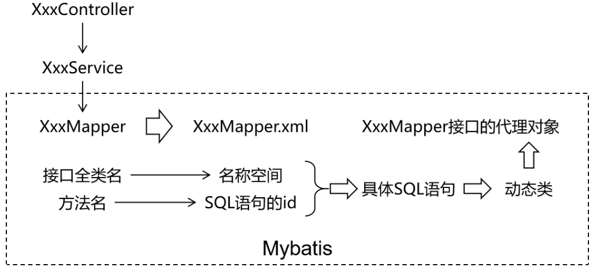
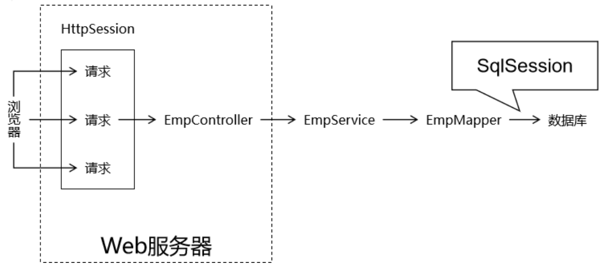
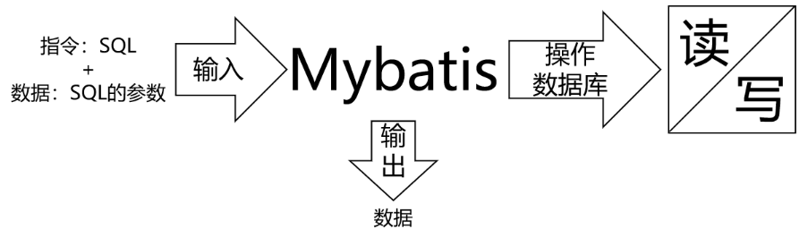
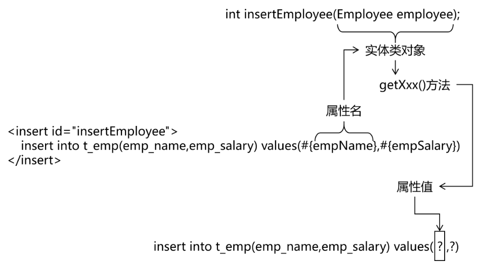
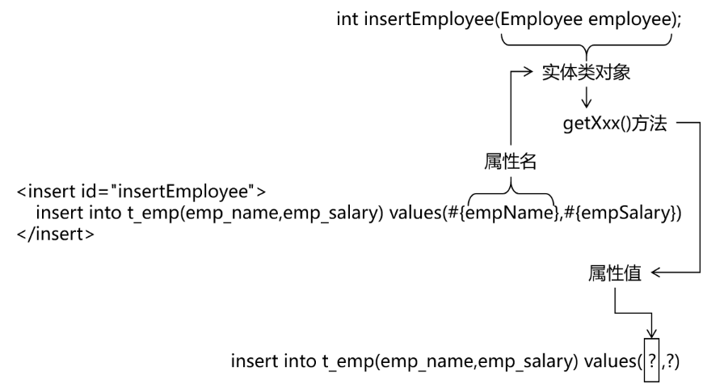

# MyBatis 框架

**SSM框架内容分为如下几个章节，每个章节对应一个文件：《Maven》、《Spring》、《MyBatis》、《SpringMVC》、《SSM整合》、《SpringBoot》、《MyBatis-Plus》。**

## 第三章：MyBatis

### 一、MyBatis 简介

#### （1）MyBatis 概述

[MyBatis 3 | 简介 – mybatis](https://mybatis.org/mybatis-3/zh_CN/)

MyBatis最初是Apache的一个开源项目iBatis, 2010年6月这个项目由Apache Software Foundation迁移到了Google Code。随着开发团队转投Google Code旗下， iBatis3.x正式更名为MyBatis。代码于2013年11月迁移到Github。

MyBatis 是一款优秀的持久层框架，它支持自定义 SQL、存储过程以及高级映射。MyBatis 免除了几乎所有的 JDBC 代码以及设置参数和获取结果集的工作。MyBatis 可以通过简单的 XML 或注解来配置和映射原始类型、接口和 Java POJO（Plain Old Java Objects，普通老式 Java 对象）为数据库中的记录。

本内容使用 3.5.11 版本。

#### （2）持久层框架对比

- JDBC
    - SQL 夹杂在Java代码中耦合度高，导致硬编码内伤；
    - 维护不易且实际开发需求中 SQL 有变化，频繁修改的情况多见；
    - 代码冗长，开发效率低；
- Hibernate 和 JPA
    - 操作简便，开发效率高；
    - 程序中的长难复杂 SQL 需要绕过框架；
    - 内部自动生成的 SQL，不容易做特殊优化；
    - 基于全映射的全自动框架，大量字段的 POJO 进行部分映射时比较困难；
    - 反射操作太多，导致数据库性能下降；
- MyBatis
    - 轻量级，性能出色；
    - SQL 和 Java 编码分开，功能边界清晰。Java代码专注业务、SQL语句专注数据；
    - 开发效率稍逊于 Hibernate，但是完全能够接收；

开发效率：Hibernate>Mybatis>JDBC

运行效率：JDBC>Mybatis>Hibernate

#### （3）快速入门（基于 MyBatis3）

准备数据模型：

```mysql
USE lesson;

CREATE TABLE `t_emp`(
  emp_id INT AUTO_INCREMENT,
  emp_name CHAR(100),
  emp_salary DOUBLE(10,5),
  PRIMARY KEY(emp_id)
);

INSERT INTO `t_emp`(emp_name,emp_salary) VALUES("tom",200.33);
INSERT INTO `t_emp`(emp_name,emp_salary) VALUES("jerry",666.66);
INSERT INTO `t_emp`(emp_name,emp_salary) VALUES("andy",777.77);
```

创建父工程：`ssm-mybatis-part`

导入依赖：

```xml
<dependencies>
  <!-- mybatis依赖 -->
  <dependency>
      <groupId>org.mybatis</groupId>
      <artifactId>mybatis</artifactId>
      <version>3.5.11</version>
  </dependency>

  <!-- MySQL驱动 mybatis底层依赖jdbc驱动实现,本次不需要导入连接池,mybatis自带! -->
  <dependency>
      <groupId>mysql</groupId>
      <artifactId>mysql-connector-java</artifactId>
      <version>8.0.25</version>
  </dependency>

  <!--junit5测试-->
  <dependency>
      <groupId>org.junit.jupiter</groupId>
      <artifactId>junit-jupiter-api</artifactId>
      <version>5.3.1</version>
  </dependency>
</dependencies>
```

创建子工程：`mybatis-base-quick-1`

实体类准备：

```java
package com.ssh.pojo;

/**
 * @author 申书航
 * @version 1.0
 * 员工实体类
 */
public class Employee {

    private Integer empId;

    private String empName;

    private Double empSalary;
    
    //getter和setter方法省略
}
```

准备 Mapper 接口和 MapperXML文件：

MyBatis 框架下，SQL语句编写位置发生改变，从原来的Java类，改成XML或者注解定义。

推荐在XML文件中编写SQL语句，让用户能更专注于 SQL 代码，不用关注其他的JDBC代码。

一般编写SQL语句的文件命名：`XxxMapper.xml`，Xxx一般取表名。

Mybatis 中的 Mapper 接口相当于以前的 Dao 层。但是区别在于，Mapper 仅仅只是建接口即可，我们不需要提供实现类，具体的SQL写到对应的 Mapper 文件，该用法的思路如下：



定义 Mapper 接口：

```java
package com.ssh.mapper;

import com.ssh.pojo.Employee;

/**
 * @author 申书航
 * @version 1.0
 * 接口只规定数据库方法即可
 * SQL语句在mapper.xml中编写
 */

public interface EmployeeMapper {

    /**
     * 根据员工id查询员工数据方法
     * @param id  员工id
     * @return 员工实体对象
     */
    Employee queryById(Integer id);
    
    /**
     * 删除员工数据方法
     * @param id
     * @return
     */
    int deleteById(Integer id);
}
```

定义XML映射文件Mapper.xml：`resources/mappers/EmployeeMapper.xml`

注意事项：

- 方法名和SQL的id一致；
- 方法返回值和 `resultType` 一致；
- 方法的参数和SQL的参数一致；
- 接口的全类名和映射配置文件的名称空间一致。

```xml
<?xml version="1.0" encoding="UTF-8" ?>
<!DOCTYPE mapper
        PUBLIC "-//mybatis.org//DTD Mapper 3.0//EN"
        "https://mybatis.org/dtd/mybatis-3-mapper.dtd">
    <!--
        xml方式写SQL语句，没有java代码
        Mybatis固定在特定的标签内写SQL语句
        Mapper的文件应该有约束
    -->

<!-- namespace等于mapper接口类的全限定名，这样实现对应 -->
<mapper namespace="com.ssh.mapper.EmployeeMapper">

    <!--
        声明标签写SQL语句：select、insert、update、delete
        每个标签对应接口的一个方法
        Mapper接口不能重载，因为Mapper.xml无法区分
    -->
    <!-- id对应方法名，resultType对应返回值类型（全类名） -->
    <select id="queryById" resultType="com.ssh.pojo.Employee">
        select emp_id empId, emp_name empName, emp_salary empSalary from
        t_emp where emp_id = #{empId}
    </select>

    <delete id="deleteById">
        delete from t_emp where emp_id = #{empId}
    </delete>

</mapper>
```

准备 MyBatis 配置文件：

mybatis框架配置文件： 数据库连接信息，性能配置，mapper.xml配置等，习惯上命名为 `mybatis-config.xml`。

```xml
<?xml version="1.0" encoding="UTF-8" ?>
<!DOCTYPE configuration
        PUBLIC "-//mybatis.org//DTD Config 3.0//EN"
        "http://mybatis.org/dtd/mybatis-3-config.dtd">
<configuration>

    <!--
        environments表示配置Mybatis的开发环境，可以配置多个环境
        在众多具体环境中，使用default属性指定实际运行时使用的环境。default属性的取值是environment标签的id属性的值
    -->
    <environments default="development">
        <!-- environment表示配置Mybatis的一个具体的环境 -->
        <environment id="development">
            <!--
                Mybatis的内置的事务管理器
                type属性的值为JDBC，表示使用JDBC的事务管理器，自动开启事务，需要手动提交事务
                MANAGED表示使用容器提供的事务管理器，不会自动开启事务
            -->
            <transactionManager type="JDBC"/>
            <!--
                配置数据源
                type属性的值为POOLED，Mybatis帮助维护一个连接池
                UNPOOLED表示不维护连接池，没次都要新建或释放链接
            -->
            <dataSource type="POOLED">
                <!-- 建立数据库连接的具体信息 -->
                <property name="driver" value="com.mysql.cj.jdbc.Driver"/>
                <property name="url" value="jdbc:mysql://localhost:3306/lesson"/>
                <property name="username" value="root"/>
                <property name="password" value="root"/>
            </dataSource>
        </environment>
    </environments>

    <mappers>
        <!-- Mapper注册：指定Mybatis映射文件的具体位置 -->
        <!-- mapper标签：配置一个具体的Mapper映射文件 -->
        <!-- resource属性：指定Mapper映射文件的实际存储位置，这里需要使用一个以类路径根目录为基准的相对路径 -->
        <!-- 对Maven工程的目录结构来说，resources目录下的内容会直接放入类路径，所以这里我们可以以resources目录为基准 -->
        <mapper resource="mappers/EmployeeMapper.xml"/>
    </mappers>

</configuration>
```

测试：

- `SqlSession`：代表Java程序和数据库之间的会话。（HttpSession是Java程序和浏览器之间的会话）
- `SqlSessionFactory`：是“生产” `SqlSession` 的“工厂”；
- 工厂模式：如果创建某一个对象，使用的过程基本固定，那么我们就可以把创建这个对象的相关代码封装到一个“工厂类”中，以后都使用这个工厂类来“生产”我们需要的对象。

`SqlSession` 和 `HttpSession` 区别：

- HttpSession：工作在Web服务器上，属于表述层。
    - 代表浏览器和Web服务器之间的会话。
- SqlSession：不依赖Web服务器，属于持久化层。
    - 代表Java程序和数据库之间的会话。



```java
package com.ssh.test;

import com.ssh.mapper.EmployeeMapper;
import com.ssh.pojo.Employee;
import org.apache.ibatis.io.Resources;
import org.apache.ibatis.session.SqlSession;
import org.apache.ibatis.session.SqlSessionFactory;
import org.apache.ibatis.session.SqlSessionFactoryBuilder;
import org.junit.jupiter.api.Test;

import java.io.IOException;
import java.io.InputStream;

/**
 * @author 申书航
 * @version 1.0
 */
public class MybatisTest {

    /**
     * mybatis提供的api进行方法调用
     */
    @Test
    public void test() throws IOException {

        //读取外部配置文件（mybatis-config.xml）
        InputStream ips = Resources.getResourceAsStream("mybatis-config.xml");

        //创建sqlSessionFactory工厂对象，这个对象会全局保留
        SqlSessionFactory sqlSessionFactory = new SqlSessionFactoryBuilder().build(ips);

        //创建sqlSession对象（每次业务创建一个，用完释放）
        SqlSession sqlSession = sqlSessionFactory.openSession();

        //获取接口的代理对象（代理技术），调用代理对象的方法，就会查找Mapper接口的方法
        //jdk动态代理技术生成Mapper代理对象
        EmployeeMapper mapper = sqlSession.getMapper(EmployeeMapper.class);
        //内部拼接接口的权限定符.方法名，去查找SQL语句
        //拼接 类的全限定符.方法名 整合参数 -> ibatis对应的方法传入参数
        //MyBatis的底层依然调用的是ibatis，只不过有固定模式
        Employee employee = mapper.queryById(1);
        System.out.println(employee);

        //提交事务（非DQL），释放资源
        sqlSession.commit();
        sqlSession.close();
    }
}
```

### 二、MyBatis 的基本使用

#### （1）向 SQL 语句传参

##### 1. MyBatis 日志输出配置

MyBatis 的配置文件包含了会深深影响 MyBatis 行为的设置和属性信息。MyBatis 配置文件设计标签和顶层结构如下：

- configuration（配置）
	- [properties（属性）](https://mybatis.org/mybatis-3/zh_CN/configuration.html#properties)
	- [settings（设置）](https://mybatis.org/mybatis-3/zh_CN/configuration.html#settings)
	- [typeAliases（类型别名）](https://mybatis.org/mybatis-3/zh_CN/configuration.html#typeAliases)
	- [typeHandlers（类型处理器）](https://mybatis.org/mybatis-3/zh_CN/configuration.html#typeHandlers)
	- [objectFactory（对象工厂）](https://mybatis.org/mybatis-3/zh_CN/configuration.html#objectFactory)
	- [plugins（插件）](https://mybatis.org/mybatis-3/zh_CN/configuration.html#plugins)
	- [environments（环境配置）](https://mybatis.org/mybatis-3/zh_CN/configuration.html#environments)
		- environment（环境变量）
			- transactionManager（事务管理器）
			- dataSource（数据源）
	- [databaseIdProvider（数据库厂商标识）](https://mybatis.org/mybatis-3/zh_CN/configuration.html#databaseIdProvider)
	- [mappers（映射器）](https://mybatis.org/mybatis-3/zh_CN/configuration.html#mappers)

可以在MyBatis的配置文件使用 `settings` 标签设置，输出运过程SQL日志。

通过查看日志，我们可以判定 `#{}` 和 `${}` 的输出效果。

`settings` 日志设置项：

| 设置名  | 描述                                                  | 有效值                                                       | 默认值 |
| ------- | ----------------------------------------------------- | ------------------------------------------------------------ | ------ |
| logImpl | 指定 MyBatis 所用日志的具体实现，未指定时将自动查找。 | SLF4J\|LOG4J（3.5.9 起废弃）<br>LOG4J2<br>JDK_LOGGING<br/>COMMONS_LOGGING<br/>STDOUT_LOGGING<br/>NO_LOGGING | 未设置 |

开启日志：

```xml
<?xml version="1.0" encoding="UTF-8" ?>
<!DOCTYPE configuration
        PUBLIC "-//mybatis.org//DTD Config 3.0//EN"
        "http://mybatis.org/dtd/mybatis-3-config.dtd">
<configuration>

    <settings>
        <!--
            开启了Mybatis的日志输出，STDOUT_LOGGING表示输出到控制台 
        -->
        <setting name="logImpl" value="STDOUT_LOGGING"/>
    </settings>

    <!--
        environments表示配置Mybatis的开发环境，可以配置多个环境
        在众多具体环境中，使用default属性指定实际运行时使用的环境。default属性的取值是environment标签的id属性的值
    -->
    <environments default="development">
        <!-- environment表示配置Mybatis的一个具体的环境 -->
        <environment id="development">
            <!--
                Mybatis的内置的事务管理器
                type属性的值为JDBC，表示使用JDBC的事务管理器，自动开启事务，需要手动提交事务
                MANAGED表示使用容器提供的事务管理器，不会自动开启事务
            -->
            <transactionManager type="JDBC"/>
            <!--
                配置数据源
                type属性的值为POOLED，Mybatis帮助维护一个连接池
                UNPOOLED表示不维护连接池，没次都要新建或释放链接
            -->
            <dataSource type="POOLED">
                <!-- 建立数据库连接的具体信息 -->
                <property name="driver" value="com.mysql.cj.jdbc.Driver"/>
                <property name="url" value="jdbc:mysql://localhost:3306/lesson"/>
                <property name="username" value="root"/>
                <property name="password" value="root"/>
            </dataSource>
        </environment>
    </environments>

    <mappers>
        <!-- Mapper注册：指定Mybatis映射文件的具体位置 -->
        <!-- mapper标签：配置一个具体的Mapper映射文件 -->
        <!-- resource属性：指定Mapper映射文件的实际存储位置，这里需要使用一个以类路径根目录为基准的相对路径 -->
        <!-- 对Maven工程的目录结构来说，resources目录下的内容会直接放入类路径，所以这里我们可以以resources目录为基准 -->
        <mapper resource="mappers/EmployeeMapper.xml"/>
    </mappers>

</configuration>
```

##### 2. `#{}` 与 `${}` 形式

Mybatis会将SQL语句中的 `#{}` 转换为问号占位符。`#{}` 表示占位符 + 赋值，即 `emp_id = ?，? = empId`；`?` 只能替代值的位置，不能替代容器名（标签，列名，SQL关键字）

`${}` 形式传参，底层Mybatis做的是字符串拼接操作。`${}` 表示字符串拼接，即 `"emp_id = " + empId`；

通常不会采用 `${}` 的方式传值。一个特定的适用场景是：通过Java程序动态生成数据库表，表名部分需要Java程序通过参数传入；而JDBC对于表名部分是不能使用问号占位符的，此时只能使用 `${}`。

特殊情况： 动态的不是值，是列名或者关键字，需要使用 `${}` 拼接。

```java
//注解方式传入参数！！
@Select("select * from user where ${column} = #{value}")
User findByColumn(@Param("column") String column, 
                                @Param("value") String value);
```

动态值通常使用 `#{}` 占位符，动态的列名，容器名，关键字等使用 `${}` 字符串拼接。

`EmployeeMapper.xml`：

```xml
<?xml version="1.0" encoding="UTF-8" ?>
<!DOCTYPE mapper
        PUBLIC "-//mybatis.org//DTD Mapper 3.0//EN"
        "https://mybatis.org/dtd/mybatis-3-mapper.dtd">

<mapper namespace="com.ssh.mapper.EmployeeMapper">

    <!--
        #{} 表示占位符 + 赋值  即 emp_id = ?  ? = empId
        ? 只能替代值的位置，不能替代容器名（标签，列名，SQL关键字）
        ${} 表示字符串拼接     即 "emp_id = " + empId
        动态值通常使用 #{} 占位符，动态的列名，容器名，关键字等使用 ${} 字符串拼接
    -->

    <select id="queryById" resultType="com.ssh.pojo.Employee">
        select emp_id empId, emp_name empName, emp_salary empSalary
        from t_emp where emp_id = #{empId};
    </select>


</mapper>
```

#### （2）MyBatis 数据输入

##### 1. 数据传入的类型

**MyBatis 的总体机制：**



数据输入具体是指上层方法（例如Service方法）调用Mapper接口时，数据传入的形式。

- 简单类型：只包含一个值的数据类型
    - 基本数据类型：`int`、`byte`、`short`、`double` 等；
    - 基本数据类型的包装类型：`Integer`、`Character`、`Double` 等；
    - 字符串类型：`String`；
- 复杂类型：包含多个值的数据类型
    - 实体类类型：`Employee`、`Department` 等；
    - 集合类型：`List`、`Set`、`Map` 等；
    - 数组类型：`int[]`、`String[]` 等；
    - 复合类型：`List<Class>`、实体类中包含集合等；

##### 2. 单个简单类型输入

单个简单类型参数，在 `#{}` 中可以随意命名，但是通常还是使用和接口方法参数同名。

`EmployeeMapper.xml`：

```xml
<?xml version="1.0" encoding="UTF-8" ?>
<!DOCTYPE mapper
        PUBLIC "-//mybatis.org//DTD Mapper 3.0//EN"
        "https://mybatis.org/dtd/mybatis-3-mapper.dtd">

<mapper namespace="com.ssh.mapper.EmployeeMapper">

    <!--
        传入的值是一个简单类型，key值可以任意，但为了规范通常使用参数名作为key值
    -->
    <delete id="deleteById">
        delete from t_emp where emp_id = #{empId};
    </delete>


    <select id="queryBySalary" resultType="com.ssh.pojo.Employee">
        select emp_id empId, emp_name empName, emp_salary empSalary
        from t_emp where emp_salary = #{salary};
    </select>

</mapper>
```

##### 3. 单个实体类对象输入

MyBatis 会根据 `#{}` 中传入的数据，加工成 `getXxx()` 方法，通过反射在实体类对象中调用这个方法，从而获取到对应的数据。填充到 `#{}` 解析后的问号占位符这个位置。

`EmployeeMapper.xml`：

```xml
<?xml version="1.0" encoding="UTF-8" ?>
<!DOCTYPE mapper
        PUBLIC "-//mybatis.org//DTD Mapper 3.0//EN"
        "https://mybatis.org/dtd/mybatis-3-mapper.dtd">

<mapper namespace="com.ssh.mapper.EmployeeMapper">

    <!-- 
        传入实体类对象
        key = 实体类属性名，value = 实体类属性值
    -->
    <insert id="insertEmp">
        insert into t_emp (emp_name, emp_salary) values (#{empName}, #{empSalary});
    </insert>
</mapper>
```

对应关系：



##### 4. 多个简单类型输入

多个简单类型参数，如果没有特殊处理，那么MyBatis无法识别自定义名称。

解决方法：

1. 使用 `@Param` 注解：指定多个参数的key为：`@Param("value")`；

	`EmployeeMapper`：

	```java
	package com.ssh.mapper;
	
	import com.ssh.pojo.Employee;
	import org.apache.ibatis.annotations.Param;
	
	import java.util.List;
	
	/**
	 * @author 申书航
	 * @version 1.0
	 * 定义方法信息
	 */
	public interface EmployeeMapper {
	
	    //根据姓名和工资查询员工信息
	    List<Employee> queryByNameAndSalary(@Param("a") String name, @Param("b") Double salary);
	}
	```

	`EmployeeMapper.xml`：

	```xml
	<?xml version="1.0" encoding="UTF-8" ?>
	<!DOCTYPE mapper
	        PUBLIC "-//mybatis.org//DTD Mapper 3.0//EN"
	        "https://mybatis.org/dtd/mybatis-3-mapper.dtd">
	
	<mapper namespace="com.ssh.mapper.EmployeeMapper">
	
	    <!--
	        传入多个简单类型参数
	        key不能按照形参获取
	        方法：
	            1. 注解指定（推荐使用）：@Param注解，指定多个参数的key = @Param("value")
	            2. 默认机制：arg0, arg1, arg2...或param1, param2...，按顺序赋值
	    -->
	    <select id="queryByNameAndSalary" resultType="com.ssh.pojo.Employee">
	        select emp_id empId, emp_name empName, emp_salary empSalary
	        from t_emp where emp_name = #{a} and emp_salary = #{b};
	    </select>
	</mapper>
	```

2. MyBatis 的默认参数机制：`arg0`，`arg1`，`arg2`...或 `param1`，`param2`...需要按顺序填入。

	`EmployeeMapper`：

	```java
	package com.ssh.mapper;
	
	import com.ssh.pojo.Employee;
	import org.apache.ibatis.annotations.Param;
	
	import java.util.List;
	
	/**
	 * @author 申书航
	 * @version 1.0
	 * 定义方法信息
	 */
	public interface EmployeeMapper {
	
	    //根据姓名和工资查询员工信息
	    List<Employee> queryByNameAndSalary(String name, Double salary);
	}
	```

	`EmployeeMapper.xml`：

	```xml
	<?xml version="1.0" encoding="UTF-8" ?>
	<!DOCTYPE mapper
	        PUBLIC "-//mybatis.org//DTD Mapper 3.0//EN"
	        "https://mybatis.org/dtd/mybatis-3-mapper.dtd">
	
	<mapper namespace="com.ssh.mapper.EmployeeMapper">
	
	    <!--
	        传入多个简单类型参数
	        key不能按照形参获取
	        方法：
	            1. 注解指定（推荐使用）：@Param注解，指定多个参数的key = @Param("value")
	            2. 默认机制：arg0, arg1, arg2...或param1, param2...，按顺序赋值
	    -->
	    <select id="queryByNameAndSalary" resultType="com.ssh.pojo.Employee">
	        select emp_id empId, emp_name empName, emp_salary empSalary
	        from t_emp where emp_name = #{arg0} and emp_salary = #{arg1};
	    </select>
	</mapper>
	```

对应关系：



##### 5. `Map` 类型输入

如果有多个零散的参数需要传递，但是没有对应的实体类类型可以使用。使用 `@Param` 注解逐个传入太复杂，所以都封装到 `Map` 中。

`#{}` 中写 `Map` 中的key。

`EmployeeMapper`：

```java
package com.ssh.mapper;

import com.ssh.pojo.Employee;
import org.apache.ibatis.annotations.Param;

import java.util.List;
import java.util.Map;

/**
 * @author 申书航
 * @version 1.0
 * 定义方法信息
 */
public interface EmployeeMapper {

    //根据id查询员工信息
    Employee queryById(Integer id);

    //根据id删除员工信息
    int deleteById(Integer id);

    //根据工资查询员工信息
    List<Employee> queryBySalary(Double salary);

    //插入员工信息
    int insertEmp(Employee employee);

    //根据姓名和工资查询员工信息
//    List<Employee> queryByNameAndSalary(@Param("a") String name, @Param("b") Double salary);
    List<Employee> queryByNameAndSalary(String name, Double salary);

    //插入员工数据map
    //mapper接口中不能重载
    int insertEmpMap(Map data);
}
```

`EmployeeMapper.xml`：

```xml
<?xml version="1.0" encoding="UTF-8" ?>
<!DOCTYPE mapper
        PUBLIC "-//mybatis.org//DTD Mapper 3.0//EN"
        "https://mybatis.org/dtd/mybatis-3-mapper.dtd">

<mapper namespace="com.ssh.mapper.EmployeeMapper">

    <!--
        #{} 表示占位符 + 赋值  即 emp_id = ?  ? = empId
        ? 只能替代值的位置，不能替代容器名（标签，列名，SQL关键字）
        ${} 表示字符串拼接     即 "emp_id = " + empId
        动态值通常使用 #{} 占位符，动态的列名，容器名，关键字等使用 ${} 字符串拼接
    -->

    <select id="queryById" resultType="com.ssh.pojo.Employee">
        select emp_id empId, emp_name empName, emp_salary empSalary
        from t_emp where emp_id = #{empId};
    </select>


    <!--
        传入的值是一个简单类型，key值可以任意，但为了规范通常使用参数名作为key值
    -->
    <delete id="deleteById">
        delete from t_emp where emp_id = #{empId};
    </delete>


    <select id="queryBySalary" resultType="com.ssh.pojo.Employee">
        select emp_id empId, emp_name empName, emp_salary empSalary
        from t_emp where emp_salary = #{salary};
    </select>

    <!--
        传入实体类对象
        key = 实体类属性名，value = 实体类属性值
    -->
    <insert id="insertEmp">
        insert into t_emp (emp_name, emp_salary) values (#{empName}, #{empSalary});
    </insert>

    <!--
        传入多个简单类型参数
        key不能按照形参获取
        方法：
            1. 注解指定（推荐使用）：@Param注解，指定多个参数的key = @Param("value")
            2. 默认机制：arg0, arg1, arg2...或param1, param2...，按顺序赋值
    -->
    <select id="queryByNameAndSalary" resultType="com.ssh.pojo.Employee">
        select emp_id empId, emp_name empName, emp_salary empSalary
        from t_emp where emp_name = #{arg0} and emp_salary = #{arg1};
    </select>

    <!--
        传入Map类型
        key为Map中的属性名
    -->
    <insert id="insertEmpMap">
        insert into t_emp (emp_name, emp_salary) values (#{name}, #{salary});
    </insert>

</mapper>
```

测试：

```java
package com.ssh.test;

import com.ssh.mapper.EmployeeMapper;
import com.ssh.pojo.Employee;
import org.apache.ibatis.io.Resources;
import org.apache.ibatis.session.SqlSession;
import org.apache.ibatis.session.SqlSessionFactory;
import org.apache.ibatis.session.SqlSessionFactoryBuilder;
import org.junit.jupiter.api.Test;

import java.io.IOException;
import java.io.InputStream;
import java.util.HashMap;
import java.util.List;
import java.util.Map;

/**
 * @author 申书航
 * @version 1.0
 */
public class MyBatisTest {

    @Test
    public void test1() throws IOException {

        //获取外部配置文件
        InputStream ips = Resources.getResourceAsStream("mybatis-config.xml");

        //创建sqlSessionFactory对象
        SqlSessionFactory sqlSessionFactory = new SqlSessionFactoryBuilder().build(ips);


        //获取sqlSession对象（自动开启JDBC事务）
        SqlSession sqlSession = sqlSessionFactory.openSession();

        //获取Mapper对象
        EmployeeMapper mapper = sqlSession.getMapper(EmployeeMapper.class);

        //根据id查询员工
        Employee employee = mapper.queryById(1);
        System.err.println(employee.toString());

        //插入员工
        Employee employee2 = new Employee();
        employee2.setEmpName("Tom");
        employee2.setEmpSalary(200.33000);
        mapper.insertEmp(employee2);


        Map<String, Object> map = new HashMap<>();
        map.put("salary", 200.33000);
        map.put("name", "Tom");
        mapper.insertEmpMap(map);

        //根据名字和薪资查询员工
        List<Employee> employees = mapper.queryByNameAndSalary("Tom", 200.33000);
        for (Employee e : employees) {
            System.err.println(e.toString());
        }

        //关闭资源或提交
        sqlSession.close();
    }
}
```

#### （3）MyBatis 数据输出

数据输出总体上有两种形式：

- 增删改操作返回的受影响行数（DML语句）：直接使用 `int` 或 `long` 类型接收即可；
- 查询操作（DQL语句）：返回查询操作的查询结果。

程序员需要做的是，指定查询的输出数据类型即可，并且插入场景下，实现主键数据回显示。

##### 1. 别名与字段命名问题

[MyBatis 3 | 类型别名](https://mybatis.org/mybatis-3/zh_CN/configuration.html#typeAliases)

`resultType` 属性设置别名：

`resultType` 的值只有两种，一种是类的全限定名，一种是别名简称；

别名简称是MyBatis提供的72中常用数据类型，如果没有提供，就写全限定名或自定义别名；

自定义别名：

别名在 `mybatis-config.xml` 中定义；

在标签  `<typeAliases></typeAliases>` 中定义别名，有两种方式：

1. `typeAlias` 标签定义单个类的别名；
2. `package` 标签为某个包下所有类定义别名，别名默认为该类的小写；

下面是MyBatis为常见的 Java 类型内建的类型别名。它们都是不区分大小写的，注意，为了应对原始类型的命名重复，采取了特殊的命名风格。

| 别名                      | 映射的类型 |
| ------------------------- | ---------- |
| _byte                     | byte       |
| _char (since 3.5.10)      | char       |
| _character (since 3.5.10) | char       |
| _long                     | long       |
| _short                    | short      |
| _int                      | int        |
| _integer                  | int        |
| _double                   | double     |
| _float                    | float      |
| _boolean                  | boolean    |
| string                    | String     |
| byte                      | Byte       |
| char (since 3.5.10)       | Character  |
| character (since 3.5.10)  | Character  |
| long                      | Long       |
| short                     | Short      |
| int                       | Integer    |
| integer                   | Integer    |
| double                    | Double     |
| float                     | Float      |
| boolean                   | Boolean    |
| date                      | Date       |
| decimal                   | BigDecimal |
| bigdecimal                | BigDecimal |
| biginteger                | BigInteger |
| object                    | Object     |
| object[]                  | Object[]   |
| map                       | Map        |
| hashmap                   | HashMap    |
| list                      | List       |
| arraylist                 | ArrayList  |
| collection                | Collection |

**字段命名：**

在 Java 中，通常使用驼峰命名法，但MyBatis中默认是下划线命名，使用配置让MyBatis默认给字段也采用驼峰命名规则。

在 `mybatis-config.xml` 文件中的 `<settings></settings>` 标签下设置：

```java
<setting name="mapUnderscoreToCamelCase" value="true"/>
```

##### 2. 单个简单类型与实体类输出

`EmployeeMapper`：

```java
package com.ssh.mapper;

import com.ssh.pojo.Employee;

/**
 * @author 申书航
 * @version 1.0
 */
public interface EmployeeMapper {

    //DML语句的返回值类型为int
    int deleteById(Integer id);

    //指定输出类型的查询语句
    //根据员工id查询员工姓名
    String queryNameById(Integer id);

    //根据员工id查询员工工资
    Double querySalaryById(Integer id);

    //根据员工id查询员工信息
    Employee queryById(Integer id);
}
```

`EmployeeMapper.xml`：

```xml
<?xml version="1.0" encoding="UTF-8" ?>
<!DOCTYPE mapper
        PUBLIC "-//mybatis.org//DTD Mapper 3.0//EN"
        "https://mybatis.org/dtd/mybatis-3-mapper.dtd">

<mapper namespace="com.ssh.mapper.EmployeeMapper">

    <!-- DML -->
    <delete id="deleteById" >
        delete form t_emp where emp_id = #{id}
    </delete>

    <!--
        指定返回单个简单类型：resultType="简单类型"
        resultType的值只有两种，一种是类的全限定名，一种是别名简称
        别名简称是mybatis提供的72中常用数据类型，如果没有提供，就写全限定名或自己定义
        别名示例：
            int -> _int，double -> _double
            Integer -> int | integer，Double -> double
            Map -> map，List -> list
    -->
    <!-- 查询员工姓名 -->
    <select id="queryNameById" resultType="java.lang.String">
        select emp_name from t_emp where emp_id = #{id}
    </select>

    <!-- 查询员工工资 -->
    <select id="querySalaryById" resultType="double">
        select emp_salary from t_emp where emp_id = #{id}
    </select>

    <!--
        查询员工信息
        使用别名，别名在mybatis-config.xml中定义
    -->
    <select id="queryById" resultType="employee">
        select * from t_emp where emp_id = #{id}
    </select>

</mapper>
```

`mybatis-config.xml`：

```xml
<?xml version="1.0" encoding="UTF-8" ?>
<!DOCTYPE configuration
        PUBLIC "-//mybatis.org//DTD Config 3.0//EN"
        "http://mybatis.org/dtd/mybatis-3-config.dtd">
<configuration>

    <settings>
        <!--
            开启了Mybatis的日志输出，STDOUT_LOGGING表示输出到控制台
        -->
        <setting name="logImpl" value="STDOUT_LOGGING"/>
        <!--
        开启驼峰式命名规则，Mybatis会自动将下划线分隔的小写命名规则转换为驼峰式命名规则
        -->
        <setting name="mapUnderscoreToCamelCase" value="true"/>
    </settings>

    <!--
        typeAliases标签：给类定义别名，方便在SQL语句中引用
    -->
    <typeAliases>
        <!-- 给Employee类定义一个别名employee -->
        <typeAlias type="com.ssh.pojo.Employee" alias="employee"/>
        <!-- 给com.ssh.pojo包下的所有类定义别名，别名默认为类名小写 -->
        <package name="com.ssh.pojo"/>
    </typeAliases>

    <!--
        environments表示配置Mybatis的开发环境，可以配置多个环境
        在众多具体环境中，使用default属性指定实际运行时使用的环境。default属性的取值是environment标签的id属性的值
    -->
    <environments default="development">
        <!-- environment表示配置Mybatis的一个具体的环境 -->
        <environment id="development">
            <!--
                Mybatis的内置的事务管理器
                type属性的值为JDBC，表示使用JDBC的事务管理器，自动开启事务，需要手动提交事务
                MANAGED表示使用容器提供的事务管理器，不会自动开启事务
            -->
            <transactionManager type="JDBC"/>
            <!--
                配置数据源
                type属性的值为POOLED，Mybatis帮助维护一个连接池
                UNPOOLED表示不维护连接池，没次都要新建或释放链接
            -->
            <dataSource type="POOLED">
                <!-- 建立数据库连接的具体信息 -->
                <property name="driver" value="com.mysql.cj.jdbc.Driver"/>
                <property name="url" value="jdbc:mysql://localhost:3306/lesson"/>
                <property name="username" value="root"/>
                <property name="password" value="root"/>
            </dataSource>
        </environment>
    </environments>

    <mappers>
        <!-- Mapper注册：指定Mybatis映射文件的具体位置 -->
        <!-- mapper标签：配置一个具体的Mapper映射文件 -->
        <!-- resource属性：指定Mapper映射文件的实际存储位置，这里需要使用一个以类路径根目录为基准的相对路径 -->
        <!-- 对Maven工程的目录结构来说，resources目录下的内容会直接放入类路径，所以这里我们可以以resources目录为基准 -->
        <mapper resource="mappers/EmployeeMapper.xml"/>
    </mappers>

</configuration>
```

##### 3. `Map` 或集合类型输出

返回 `Map` 类型适用于SQL查询返回的各个字段综合起来并不和任何一个现有的实体类对应，没法封装到实体类对象中。能够封装成实体类类型的，就不使用 `Map` 类型。

如果查询结果返回多个实体类对象，希望把多个实体类对象放在List集合中返回，此时不需要任何特殊处理，在 `resultType` 属性中还是设置实体类类型即可。

`EmployeeMapper`：

```java
package com.ssh.mapper;

import com.ssh.pojo.Employee;

import java.util.List;
import java.util.Map;

/**
 * @author 申书航
 * @version 1.0
 */
public interface EmployeeMapper {

    //根据员工id查询员工信息
    Employee queryById(Integer id);

    //查询员工平均工资和最高工资
    Map<String, Object> queryEmpNameAndMaxSalary();

    //查询员工工资高于200的员工姓名
    List<String> queryNamesBySalary(Double salary);

    //查询所有员工信息
    List<Employee> queryAll();
}
```

`EmployeeMapper.xml`：

```xml
<?xml version="1.0" encoding="UTF-8" ?>
<!DOCTYPE mapper
        PUBLIC "-//mybatis.org//DTD Mapper 3.0//EN"
        "https://mybatis.org/dtd/mybatis-3-mapper.dtd">

<mapper namespace="com.ssh.mapper.EmployeeMapper">

    <select id="queryById" resultType="employee">
        select * from t_emp where emp_id = #{id}
    </select>

    <!--
        返回Map类型，通常是没有实体类可以接受返回值时会使用Map类型
        默认key是列名，value是列值
    -->
    <select id="queryEmpNameAndMaxSalary" resultType="map">
        SELECT
            emp_name 员工姓名,
            emp_salary 员工工资,
            (SELECT AVG(emp_salary) FROM t_emp) 部门平均工资
            FROM t_emp WHERE emp_salary=(
                SELECT MAX(emp_salary) FROM t_emp
            )
    </select>

    <!--
        返回类型是集合，resultType的值是集合的元素类型，只需要指定泛型即可
    -->
    <select id="queryNamesBySalary" resultType="string">
        select emp_name from t_emp where emp_salary > #{salary}
    </select>

    <!--
        查询所有员工信息
		返回类型是集合，只需要指定泛型即可，与第一个返回实体类类型相同，但在测试中不同
    -->
    <select id="queryAll" resultType="employee">
        select * from t_emp;
    </select>
</mapper>
```

测试：

```java
package com.ssh.test;

import com.ssh.mapper.EmployeeMapper;
import com.ssh.pojo.Employee;
import org.apache.ibatis.io.Resources;
import org.apache.ibatis.session.SqlSession;
import org.apache.ibatis.session.SqlSessionFactory;
import org.apache.ibatis.session.SqlSessionFactoryBuilder;
import org.junit.jupiter.api.Test;

import java.io.IOException;
import java.io.InputStream;
import java.util.List;
import java.util.Map;
import java.util.Set;

/**
 * @author 申书航
 * @version 1.0
 */
public class MybatisTest {

    @Test
    public void testMap() throws IOException {

        InputStream ips = Resources.getResourceAsStream("mybatis-config.xml");
        SqlSessionFactory sqlSessionFactory = new SqlSessionFactoryBuilder().build(ips);
        SqlSession sqlSession = sqlSessionFactory.openSession();
        EmployeeMapper employeeMapper = sqlSession.getMapper(EmployeeMapper.class);

        Map<String, Object> resultMap = employeeMapper.queryEmpNameAndMaxSalary();
        Set<Map.Entry<String, Object>> entrySet = resultMap.entrySet();

        for (Map.Entry<String, Object> entry : entrySet) {
            String key = entry.getKey();
            Object value = entry.getValue();
            System.err.println(key + " : " + value);
        }


        sqlSession.close();
    }

    @Test
    public void testList() throws IOException {
        InputStream ips = Resources.getResourceAsStream("mybatis-config.xml");
        SqlSessionFactory sqlSessionFactory = new SqlSessionFactoryBuilder().build(ips);
        SqlSession sqlSession = sqlSessionFactory.openSession();
        EmployeeMapper employeeMapper = sqlSession.getMapper(EmployeeMapper.class);

        List<Employee> list = employeeMapper.queryAll();
        System.err.println(list);

        Employee employee = employeeMapper.queryById(2);
        System.err.println(employee);

        sqlSession.close();
    }
}
```

##### 4. 返回主键值输出

**自增长型主键输出：**

MyBatis是将自增主键的值设置到实体类对象中，而不是以Mapper接口方法返回值的形式返回。

`EmployeeMapper`：

```java
package com.ssh.mapper;

import com.ssh.pojo.Employee;

/**
 * @author 申书航
 * @version 1.0
 */
public interface EmployeeMapper {

    //员工插入
    int insertEmp(Employee employee);
}
```

`EmployeeMapper.xml`：

```xml
<?xml version="1.0" encoding="UTF-8" ?>
<!DOCTYPE mapper
        PUBLIC "-//mybatis.org//DTD Mapper 3.0//EN"
        "https://mybatis.org/dtd/mybatis-3-mapper.dtd">

<mapper namespace="com.ssh.mapper.EmployeeMapper">

    <!--
        插入员工信息
        1. 自增长主键
            useGeneratedKeys="true" 表示需要接收数据库自动增长的主键值
            keyColumn="emp_id" 表示数据库自动增长的主键列名
            keyProperty="empId" 表示接收主键的属性名
    -->
    <insert id="insertEmp" useGeneratedKeys="true" keyColumn="emp_id" keyProperty="empId">
        insert into t_emp (emp_name, emp_salary) values (#{empName}, #{empSalary});
    </insert>

</mapper>
```

测试：

```java
@Test
public void testInsert() throws IOException {
    InputStream ips = Resources.getResourceAsStream("mybatis-config.xml");
    SqlSessionFactory sqlSessionFactory = new SqlSessionFactoryBuilder().build(ips);
    SqlSession sqlSession = sqlSessionFactory.openSession();
    EmployeeMapper employeeMapper = sqlSession.getMapper(EmployeeMapper.class);

    Employee employee = new Employee();
    employee.setEmpName("John");
    employee.setEmpSalary(300.3);

    System.err.println("新增员工：" + employee);

    int rows = employeeMapper.insertEmp(employee);
    System.out.println("影响行数：" + rows);
    System.err.println("新增员工：" + employee);

    // 提交事务
    sqlSession.commit();
    // 关闭资源
    sqlSession.close();
}
```

**非自增长主键的自动管理：**

对于不支持自增型主键的数据库（例如 Oracle）或者字符串类型主键，则可以在 `insert` 标签中使用 `selectKey` 子元素：`selectKey` 元素将会首先运行，`id` 会被设置，然后插入语句会被调用。

在插入之指定一段SQL语句，生成一个主键值：

```java
<selectKey order="该语句执行的位置" resultType="返回值类型" keyProperty="接收的变量">
	SELECT REPLACE(UUID(), '-', '');
</selectKey>
```

使用这种方式，我们可以方便地插入 UUID 作为字符串类型主键。当然，还有其他插入方式可以使用，如使用Java代码生成UUID并在类中显式设置值等。需要根据具体应用场景和需求选择合适的插入方式。

数据准备：

```sql
DROP TABLE IF EXISTS teacher;
CREATE TABLE teacher(

	t_id VARCHAR(64) PRIMARY KEY,
	t_name VARCHAR(20)
);

INSERT INTO teacher (t_id, t_name) VALUE('123abc', '张三');
INSERT INTO teacher (t_id, t_name) VALUE('456bcd', '李四');
INSERT INTO teacher (t_id, t_name) VALUE('789xyz', '王五');
```

实体类：

```java
package com.ssh.pojo;

/**
 * @author 申书航
 * @version 1.0
 */
public class Teacher {

    private String tId;

    private String tName;
	
    //getter与setter省略
}
```

`TeacherMapper`：

```java
package com.ssh.mapper;

import com.ssh.pojo.Teacher;

/**
 * @author 申书航
 * @version 1.0
 */
public interface TeacherMapper {

    int insertTeacher(Teacher teacher);
}
```

`TeacherMapper.xml`：

```xml
<?xml version="1.0" encoding="UTF-8" ?>
<!DOCTYPE mapper
        PUBLIC "-//mybatis.org//DTD Mapper 3.0//EN"
        "https://mybatis.org/dtd/mybatis-3-mapper.dtd">

<mapper namespace="com.ssh.mapper.TeacherMapper">

    <insert id="insertTeacher">

        <!--
            在插入之指定一段SQL语句，生成一个主键值
            order="BEFORE" 表示生成主键语句在插入之前（后）执行
            resultType="string" 表示返回值类型为字符串
            keyProperty="tId" 表示将生成的主键值赋值给tId属性
        -->
        <selectKey order="BEFORE" resultType="string" keyProperty="tId">
            SELECT REPLACE(UUID(), '-', '');
        </selectKey>

        INSERT INTO teacher (t_id, t_name)
            VALUE(#{tId}, #{tName});
    </insert>

</mapper>
```

测试：

```java
@Test
public void testTeacher() throws IOException {
    InputStream ips = Resources.getResourceAsStream("mybatis-config.xml");
    SqlSessionFactory sqlSessionFactory = new SqlSessionFactoryBuilder().build(ips);
    SqlSession sqlSession = sqlSessionFactory.openSession();
    TeacherMapper teacherMapper = sqlSession.getMapper(TeacherMapper.class);


    Teacher teacher = new Teacher();
    teacher.settName("哈哈");
    teacher.settId("123test");

    //自己维护主键
//    String id = UUID.randomUUID().toString().replaceAll("-", "");
//    teacher.settId(id);

    int rows = teacherMapper.insertTeacher(teacher);
    System.err.println("影响行数：" + rows);

    // 提交事务
    sqlSession.commit();
    // 关闭资源
    sqlSession.close();
}
```

##### 5. 实体类属性与数据库字段的关系

当数据库列名与属性名不一致时有三种解决方法：

- 在SQL语句中使用别名；
- 开启驼峰命名的自动映射；
- `resultMap` 自定义映射；

`resultType` 按照规则自动映射，按照是否开启驼峰命名进行映射，只能映射一层结构，`resultMap` 自定义映射可以映射多层结构。

**语法：**

```xml
<resultMap id="标识" type="类型别名">
    <id column="列名" property="属性名" />
    <result column="列名" property="属性名" />
</resultMap>
```

`TeacherMapper`：

```java
package com.ssh.mapper;

import com.ssh.pojo.Teacher;

/**
 * @author 申书航
 * @version 1.0
 */
public interface TeacherMapper {
    Teacher queryById(Integer id);
}
```

`TeacherMapper.xml`：

```xml
<?xml version="1.0" encoding="UTF-8" ?>
<!DOCTYPE mapper
        PUBLIC "-//mybatis.org//DTD Mapper 3.0//EN"
        "https://mybatis.org/dtd/mybatis-3-mapper.dtd">

<mapper namespace="com.ssh.mapper.TeacherMapper">

    <!--
        当列名与属性名不一致时的解决办法：
            1. 在sql语句中使用别名
            2. 开启驼峰命名的自动映射
            3. resultMap自定义映射
                resultType按照规则自动映射，按照是否开启驼峰命名进行映射，只能映射一层结构
                resultMap自定义映射可以映射多层结构
    -->

    <!--
        id即标识，type即返回值类型
        <id /> 为主键映射关系
        <result /> 为其他属性映射关系
        column为数据库列名，property为pojo属性名
    -->

    <resultMap id="tMap" type="teacher">
        <id column="t_id" property="tId" />
        <result column="t_name" property="tName" />
    </resultMap>

    <select id="queryById" resultType="com.ssh.pojo.Teacher">
        SELECT * FROM teacher WHERE t_id = #{tId};
    </select>

</mapper>
```

#### （4）MyBatis 单表操作练习

项目准备：`mybatis-base-crud-4`

`lombok` 依赖：

```xml
<dependency>
    <groupId>org.projectlombok</groupId>
    <artifactId>lombok</artifactId>
    <version>1.18.28</version>
</dependency>
```

数据模型：

```sql
-- CRUD单表练习
DROP TABLE IF EXISTS `user`;
CREATE TABLE `user` (
  `id` INT(11) NOT NULL AUTO_INCREMENT,
  `username` VARCHAR(50) NOT NULL,
  `password` VARCHAR(50) NOT NULL,
  PRIMARY KEY (`id`)
) ENGINE=INNODB AUTO_INCREMENT=1 DEFAULT CHARSET=utf8;
```

实体类：

```java
package com.ssh.pojo;

import lombok.Data;

/**
 * @author 申书航
 * @version 1.0
 */
@Data   // lombok注解，自动生成getter、setter方法、toString方法
public class User {

    private Integer id;

    private String username;

    private String password;
}
```

Mapper接口：

```java
package com.ssh.mapper;

import com.ssh.pojo.User;

import java.util.List;

/**
 * @author 申书航
 * @version 1.0
 */
public interface UserMapper {

    int insert(User user);

    int update(User user);

    int delete(Integer id);

    User selectById(Integer id);

    List<User> selectAll();
}
```

`UserMapper.xml`：

```xml
<?xml version="1.0" encoding="UTF-8" ?>
<!DOCTYPE mapper
        PUBLIC "-//mybatis.org//DTD Mapper 3.0//EN"
        "https://mybatis.org/dtd/mybatis-3-mapper.dtd">

<mapper namespace="com.ssh.mapper.UserMapper">

    <insert id="insert" useGeneratedKeys="true" keyProperty="id" keyColumn="id">
        insert into user (username, password) values (#{username}, #{password});
    </insert>

    <update id="update">
        update user set username = #{username}, password = #{password} where id = #{id};
    </update>

    <delete id="delete">
        delete from user where id = #{id};
    </delete>

    <select id="selectById" resultType="user">
        select * from user where id = #{id};
    </select>

    <select id="selectAll" resultType="user">
        select * from user;
    </select>

</mapper>
```

配置文件：

```xml
<?xml version="1.0" encoding="UTF-8" ?>
<!DOCTYPE configuration
        PUBLIC "-//mybatis.org//DTD Config 3.0//EN"
        "http://mybatis.org/dtd/mybatis-3-config.dtd">
<configuration>

    <settings>
        <!--
            开启了Mybatis的日志输出，STDOUT_LOGGING表示输出到控制台
        -->
        <setting name="logImpl" value="STDOUT_LOGGING"/>

        <!--
            开启驼峰式命名规则，Mybatis会自动将下划线分隔的小写命名规则转换为驼峰式命名规则
        -->
        <setting name="mapUnderscoreToCamelCase" value="true"/>
    </settings>

    <!--
        typeAliases标签：给类定义别名，方便在SQL语句中引用
    -->
    <typeAliases>
        <!-- 给com.ssh.pojo包下的所有类定义别名，别名默认为类名小写 -->
        <package name="com.ssh.pojo"/>
    </typeAliases>

    <!--
        environments表示配置Mybatis的开发环境，可以配置多个环境
        在众多具体环境中，使用default属性指定实际运行时使用的环境。default属性的取值是environment标签的id属性的值
    -->
    <environments default="development">
        <!-- environment表示配置Mybatis的一个具体的环境 -->
        <environment id="development">
            <!--
                Mybatis的内置的事务管理器
                type属性的值为JDBC，表示使用JDBC的事务管理器，自动开启事务，需要手动提交事务
                MANAGED表示使用容器提供的事务管理器，不会自动开启事务
            -->
            <transactionManager type="JDBC"/>
            <!--
                配置数据源
                type属性的值为POOLED，Mybatis帮助维护一个连接池
                UNPOOLED表示不维护连接池，没次都要新建或释放链接
            -->
            <dataSource type="POOLED">
                <!-- 建立数据库连接的具体信息 -->
                <property name="driver" value="com.mysql.cj.jdbc.Driver"/>
                <property name="url" value="jdbc:mysql://localhost:3306/lesson"/>
                <property name="username" value="root"/>
                <property name="password" value="root"/>
            </dataSource>
        </environment>
    </environments>

    <mappers>
        <!-- Mapper注册：指定Mybatis映射文件的具体位置 -->
        <!-- mapper标签：配置一个具体的Mapper映射文件 -->
        <!-- resource属性：指定Mapper映射文件的实际存储位置，这里需要使用一个以类路径根目录为基准的相对路径 -->
        <!-- 对Maven工程的目录结构来说，resources目录下的内容会直接放入类路径，所以这里我们可以以resources目录为基准 -->
        <mapper resource="mappers/UserMapper.xml"/>
    </mappers>

</configuration>
```

测试：

```java
package com.ssh.test;

import com.ssh.mapper.UserMapper;
import com.ssh.pojo.User;
import org.apache.ibatis.io.Resources;
import org.apache.ibatis.session.SqlSession;
import org.apache.ibatis.session.SqlSessionFactory;
import org.apache.ibatis.session.SqlSessionFactoryBuilder;
import org.junit.jupiter.api.AfterEach;
import org.junit.jupiter.api.BeforeEach;
import org.junit.jupiter.api.Test;

import java.io.IOException;
import java.io.InputStream;
import java.util.List;

/**
 * @author 申书航
 * @version 1.0
 */
public class MyBatisTest {

    private SqlSession sqlSession;


    @BeforeEach // 在每个测试方法执行之前先运行的方法
    public void before() throws IOException {
        InputStream resourceAsStream = Resources.getResourceAsStream("mybatis-config.xml");
        SqlSessionFactory sqlSessionFactory = new SqlSessionFactoryBuilder().build(resourceAsStream);
        sqlSession = sqlSessionFactory.openSession(true);
    }

    @AfterEach // 在每个测试方法执行之后运行的方法
    public void after() {
        sqlSession.close();
    }

    @Test
    public void testInsert() throws IOException {
        UserMapper mapper = sqlSession.getMapper(UserMapper.class);
        User user = new User();
        user.setUsername("test");
        user.setPassword("123456");
        int rows = mapper.insert(user);
        System.err.println(rows);
    }

    @Test
    public void testUpdate() {
        UserMapper mapper = sqlSession.getMapper(UserMapper.class);
        User user = new User();
        user.setId(1);
        user.setUsername("test");
        user.setPassword("root");
        int rows = mapper.update(user);
        System.err.println(rows);
    }

    @Test
    public void testDelete() {
        UserMapper mapper = sqlSession.getMapper(UserMapper.class);
        int rows = mapper.delete(1);
        System.err.println(rows);
    }

    @Test
    public void testSelectById() {
        UserMapper mapper = sqlSession.getMapper(UserMapper.class);
        User user = mapper.selectById(1);
        System.err.println(user);
    }

    @Test
    public void testSelectAll() {
        UserMapper mapper = sqlSession.getMapper(UserMapper.class);
        List<User> users = mapper.selectAll();
        for (User user : users) {
            System.err.println(user);
        }
    }
}
```

#### （5）`Mapper.xml` 标签总结

MyBatis 的语句映射异常强大，映射器的 XML 文件就显得相对简单。MyBatis 致力于减少使用成本，让用户能更专注于 SQL 代码。

SQL 映射文件只有很少的几个顶级元素：

- `insert` – 映射插入语句。
- `update` – 映射更新语句。
- `delete` – 映射删除语句。
- `select` – 映射查询语句。

DQL语句（`select`）的属性：

| 属性            | 描述                                                         |
| --------------- | ------------------------------------------------------------ |
| `id`            | 在命名空间中唯一的标识符，可以被用来引用这条语句。           |
| `resultType`    | 期望从这条语句中返回结果的类全限定名或别名。 注意，如果返回的是集合，那应该设置为集合包含的类型，而不是集合本身的类型。 `resultType` 和 `resultMap` 之间只能同时使用一个。 |
| `resultMap`     | 对外部 `resultMap` 的命名引用。结果映射是 MyBatis 最强大的特性，如果你对其理解透彻，许多复杂的映射问题都能迎刃而解。`resultType` 和 `resultMap` 之间只能同时使用一个。 |
| `timeout`       | 这个设置是在抛出异常之前，驱动程序等待数据库返回请求结果的秒数。默认值为未设置（unset）（依赖数据库驱动）。 |
| `statementType` | 可选 `STATEMENT`，`PREPARED` 或 `CALLABLE`。这会让 MyBatis 分别使用 `Statement`，`PreparedStatement` 或 `CallableStatement`，默认值：`PREPARED`。 |

DML（`insert`, `update` 和 `delete`）属性：

| 属性               | 描述                                                         |
| ------------------ | ------------------------------------------------------------ |
| `id`               | 在命名空间中唯一的标识符，可以被用来引用这条语句。           |
| `timeout`          | 这个设置是在抛出异常之前，驱动程序等待数据库返回请求结果的秒数。默认值为未设置（`unset`）（依赖数据库驱动）。 |
| `statementType`    | 可选 `STATEMENT`，`PREPARED` 或 `CALLABLE`。这会让 MyBatis 分别使用 `Statement`，`PreparedStatement` 或 `CallableStatement`，默认值：`PREPARED`。 |
| `useGeneratedKeys` | （仅适用于 `insert` 和 `update`）这会令 MyBatis 使用 JDBC 的 `getGeneratedKeys` 方法来取出由数据库内部生成的主键（比如：像 MySQL 和 SQL Server 这样的关系型数据库管理系统的自动递增字段），默认值：false。 |
| `keyProperty`      | （仅适用于 `insert` 和 `update`）指定能够唯一识别对象的属性，MyBatis 会使用 `getGeneratedKeys` 的返回值或 `insert` 语句的 `selectKey` 子元素设置它的值，默认值：未设置（`unset`）。如果生成列不止一个，可以用逗号分隔多个属性名称。 |
| `keyColumn`        | （仅适用于 `insert` 和 `update`）设置生成键值在表中的列名，在某些数据库（如 PostgreSQL）中，当主键列不是表中的第一列的时候，是必须设置的。如果生成列不止一个，可以用逗号分隔多个属性名称。 |

### 三、MyBatis 多表映射

#### （1）多表映射

##### 1. 实体类设计方案

获得多表关系需要双向查看：

- 一对一：人与身份证号，夫妻关系；
- 一对多与多对一：用户与订单，班级与学生；
- 多对多：老师与学生，学生与课程。

查询操作只需单向查看：

- 对一：订单对用户，学生对班级，夫妻关系；
- 对多：用户对订单，老师对学生；

多表实体类设计：

- 对一，该类的属性中包含对方对象；

	```java
	public class Customer {
	
	  private Integer customerId;
	  private String customerName;
	
	}
	
	public class Order {
	
	  private Integer orderId;
	  private String orderName;
	  private Customer customer;// 体现的是对一的关系
	
	}  
	```

- 对多，该类的属性中包含对方对象集合；

	```java
	public class Customer {
	
	  private Integer customerId;
	  private String customerName;
	  private List<Order> orderList;// 体现的是对多的关系
	}
	
	public class Order {
	
	  private Integer orderId;
	  private String orderName;
	  private Customer customer;// 体现的是对一的关系
	  
	}
	
	//不需要关注查询客户和客户对应的订单集合
	```

只有发生多表查询时，才需要设计和修改实体类，否则不提前设计和修改实体类。

无论多少张表联查，实体类设计都是两两考虑。

在查询映射的时候，只需要关注本次查询相关的属性。例如：查询订单和对应的客户，就不要关注客户中的订单集合。

##### 2. 案例准备

数据模型：

实际开发时，一般不给数据库表设置外键约束，原因是避免调试不方便。通常是功能开发完成，再加外键约束检查是否有错误。

```sql
USE lesson;

DROP TABLE IF EXISTS `t_customer`;
CREATE TABLE `t_customer` (
	`customer_id` INT NOT NULL AUTO_INCREMENT, 
	`customer_name` CHAR(100), 
	PRIMARY KEY (`customer_id`) 
);

DROP TABLE IF EXISTS `t_order`;
CREATE TABLE `t_order` (
	`order_id` INT NOT NULL AUTO_INCREMENT, 
	`order_name` CHAR(100), 
	`customer_id` INT, 
	PRIMARY KEY (`order_id`) 
); 

INSERT INTO `t_customer` (`customer_name`) VALUES ('c01');

INSERT INTO `t_order` (`order_name`, `customer_id`) VALUES ('o1', '1');
INSERT INTO `t_order` (`order_name`, `customer_id`) VALUES ('o2', '1');
INSERT INTO `t_order` (`order_name`, `customer_id`) VALUES ('o3', '1'); 
```

实体类：这里先进行单表实体类设计；

```java
package com.ssh.pojo;

import lombok.Data;

/**
 * @author 申书航
 * @version 1.0
 * 客户实体类
 */
@Data
public class Customer {

    private Integer customerId;

    private String customerName;
}
```

```java
package com.ssh.pojo;

import lombok.Data;

/**
 * @author 申书航
 * @version 1.0
 * 订单实体类
 */
@Data
public class Order {

    private Integer orderId;

    private String orderName;

    private Integer customerId;
}
```

#### （2）对一查询

**多层嵌套对象属性赋值：**

```xml
<!-- 自定义映射关系，定义嵌套对象的映射关系 -->
<resultMap id="映射名" type="第一层类型">
    <!-- 第一层属性 -->
    <!-- 主键 -->
    <id column="列名" property="属性名" />
    <!-- 其他属性 -->
    <result column="列名" property="属性名" />
    …………

    <!--
    	第二层对象属性赋值：
        对象属性赋值：association标签
        property：要赋值的对象属性名
        javaType：对象类型
    -->
    <association property="对象属性名" javaType="对象类型">
        <!-- 主键 -->
        <id column="列名" property="属性名" />
        <!-- 其他属性 -->
        <result column="列名" property="属性名" />
    	…………
    </association>
</resultMap>
```

<font color="blue">示例：根据ID查询订单，以及订单关联的用户的信息。</font>

需要用到多表查询时才更改实体类：

```java
package com.ssh.pojo;

import lombok.Data;

/**
 * @author 申书航
 * @version 1.0
 * 订单实体类
 */
@Data
public class Order {

    private Integer orderId;

    private String orderName;

    private Integer customerId;

    //一个订单对应一个客户
    private Customer customer;
}
```

Mapper接口：

```java
package com.ssh.mapper;

import com.ssh.pojo.Order;

/**
 * @author 申书航
 * @version 1.0
 */
public interface OrderMapper {

    //根据订单查询订单的信息及其客户
    Order queryOrderById(Integer id);
}
```

`OrderMapper.xml`：

```java
<?xml version="1.0" encoding="UTF-8" ?>
<!DOCTYPE mapper
        PUBLIC "-//mybatis.org//DTD Mapper 3.0//EN"
        "https://mybatis.org/dtd/mybatis-3-mapper.dtd">

<mapper namespace="com.ssh.mapper.OrderMapper">

    <!-- 自定义映射关系，定义嵌套对象的映射关系 -->
    <resultMap id="orderMap" type="order">
        <!-- 第一层属性：Order对象 -->
        <!-- 主键 -->
        <id column="order_id" property="orderId" />
        <!-- 其他属性 -->
        <result column="order_name" property="orderName" />
        <result column="customer_id" property="customerId" />

        <!--
            第二层属性：Customer对象
            对象属性赋值：association标签
            property：要赋值的对象属性名
            javaType：对象类型
        -->
        <association property="customer" javaType="customer">
            <!-- 主键 -->
            <id column="customer_id" property="customerId" />
            <!-- 其他属性 -->
            <result column="customer_name" property="customerName" />
        </association>
    </resultMap>

    <select id="queryOrderById" resultMap="orderMap">
        SELECT * FROM t_order tor JOIN t_customer tur
        ON tor.customer_id = tur.customer_id
        WHERE tor.order_id = #{id};
    </select>
</mapper>
```

配置文件 `mybatis-config.xml`：

```xml
<?xml version="1.0" encoding="UTF-8" ?>
<!DOCTYPE configuration
        PUBLIC "-//mybatis.org//DTD Config 3.0//EN"
        "http://mybatis.org/dtd/mybatis-3-config.dtd">
<configuration>

    <settings>
        <!--
            开启了Mybatis的日志输出，STDOUT_LOGGING表示输出到控制台
        -->
        <setting name="logImpl" value="STDOUT_LOGGING"/>

        <!--
            开启驼峰式命名规则，Mybatis会自动将下划线分隔的小写命名规则转换为驼峰式命名规则
        -->
        <setting name="mapUnderscoreToCamelCase" value="true"/>
    </settings>

    <!--
        typeAliases标签：给类定义别名，方便在SQL语句中引用
    -->
    <typeAliases>
        <!-- 给com.ssh.pojo包下的所有类定义别名，别名默认为类名小写 -->
        <package name="com.ssh.pojo"/>
    </typeAliases>

    <!--
        environments表示配置Mybatis的开发环境，可以配置多个环境
        在众多具体环境中，使用default属性指定实际运行时使用的环境。default属性的取值是environment标签的id属性的值
    -->
    <environments default="development">
        <!-- environment表示配置Mybatis的一个具体的环境 -->
        <environment id="development">
            <!--
                Mybatis的内置的事务管理器
                type属性的值为JDBC，表示使用JDBC的事务管理器，自动开启事务，需要手动提交事务
                MANAGED表示使用容器提供的事务管理器，不会自动开启事务
            -->
            <transactionManager type="JDBC"/>
            <!--
                配置数据源
                type属性的值为POOLED，Mybatis帮助维护一个连接池
                UNPOOLED表示不维护连接池，没次都要新建或释放链接
            -->
            <dataSource type="POOLED">
                <!-- 建立数据库连接的具体信息 -->
                <property name="driver" value="com.mysql.cj.jdbc.Driver"/>
                <property name="url" value="jdbc:mysql://localhost:3306/lesson"/>
                <property name="username" value="root"/>
                <property name="password" value="root"/>
            </dataSource>
        </environment>
    </environments>

    <mappers>
        <!-- Mapper注册：指定Mybatis映射文件的具体位置 -->
        <!-- mapper标签：配置一个具体的Mapper映射文件 -->
        <!-- resource属性：指定Mapper映射文件的实际存储位置，这里需要使用一个以类路径根目录为基准的相对路径 -->
        <!-- 对Maven工程的目录结构来说，resources目录下的内容会直接放入类路径，所以这里我们可以以resources目录为基准 -->
        <mapper resource="mappers/OrderMapper.xml"/>
    </mappers>

</configuration>
```

测试：

```java
package com.ssh.Test;

import com.ssh.mapper.OrderMapper;
import com.ssh.pojo.Order;
import org.apache.ibatis.io.Resources;
import org.apache.ibatis.session.SqlSession;
import org.apache.ibatis.session.SqlSessionFactory;
import org.apache.ibatis.session.SqlSessionFactoryBuilder;
import org.junit.jupiter.api.AfterEach;
import org.junit.jupiter.api.BeforeEach;
import org.junit.jupiter.api.Test;

import java.io.IOException;
import java.io.InputStream;

/**
 * @author 申书航
 * @version 1.0
 */
public class MybatisTest {

    private SqlSession sqlSession;


    @BeforeEach // 在每个测试方法执行之前先运行的方法
    public void before() throws IOException {
        InputStream resourceAsStream = Resources.getResourceAsStream("mybatis-config.xml");
        SqlSessionFactory sqlSessionFactory = new SqlSessionFactoryBuilder().build(resourceAsStream);
        sqlSession = sqlSessionFactory.openSession(true);
    }

    @AfterEach // 在每个测试方法执行之后运行的方法
    public void after() {
        sqlSession.close();
    }

    @Test
    public void test1() {
        //查询订单的信息及对应的客户
        OrderMapper mapper = sqlSession.getMapper(OrderMapper.class);
        Order order = mapper.queryOrderById(1);
        System.err.println(order.getCustomer());
    }
}
```

#### （3）对多查询

**多层嵌套集合对象属性查询：**

```xml
<resultMap id="映射名" type="第一层属性">
    <!-- 主键 -->
    <id column="列名" property="属性名" />
    <!-- 其他属性 -->
    <result column="列名" property="属性名" />
    …………

    <!--
        给集合属性赋值：collection标签
        property：要赋值的集合属性名
        ofType：集合元素的类型
    -->
    <collection property="集合属性名" ofType="集合元素类型">
        <!-- 主键 -->
        <id column="列名" property="属性名" />
        <!-- 其他属性 -->
        <result column="列名" property="属性名" />
        …………
    </collection>
</resultMap>
```

<font color="blue">示例：查询客户和客户关联的订单信息。</font>

实体类更改：

```java
package com.ssh.pojo;

import lombok.Data;

import java.util.List;

/**
 * @author 申书航
 * @version 1.0
 * 客户实体类
 */
@Data
public class Customer {

    private Integer customerId;

    private String customerName;

    //一个客户对应多个订单：使用对方类型的集合
    private List<Order> orderList;
}
```

Mapper 接口：

```java
package com.ssh.mapper;

import com.ssh.pojo.Customer;

import java.util.List;

/**
 * @author 申书航
 * @version 1.0
 */
public interface CustomerMapper {

    //查询所有客户以及对应的订单信息
    List<Customer> queryList();
}
```

`CustomerMapper.xml`：

```xml
<?xml version="1.0" encoding="UTF-8" ?>
<!DOCTYPE mapper
        PUBLIC "-//mybatis.org//DTD Mapper 3.0//EN"
        "https://mybatis.org/dtd/mybatis-3-mapper.dtd">

<mapper namespace="com.ssh.mapper.CustomerMapper">

    <resultMap id="customerMap" type="customer">
        <id column="customer_id" property="customerId" />
        <result column="customer_name" property="customerName" />

        <!--
            给集合属性赋值：collection标签
            property：要赋值的集合属性名
            ofType：集合元素的类型
        -->
        <collection property="orderList" ofType="order">
            <id column="order_id" property="orderId" />
            <result column="order_name" property="orderName" />
            <result column="customer_id" property="customerId" />
        </collection>
    </resultMap>

    <select id="queryList" resultMap="customerMap">
        SELECT * FROM t_order tor JOIN t_customer tur
            ON tor.customer_id = tur.customer_id;
    </select>

</mapper>
```

测试：

```java
package com.ssh.Test;

import com.ssh.mapper.CustomerMapper;
import com.ssh.mapper.OrderMapper;
import com.ssh.pojo.Customer;
import com.ssh.pojo.Order;
import org.apache.ibatis.io.Resources;
import org.apache.ibatis.session.SqlSession;
import org.apache.ibatis.session.SqlSessionFactory;
import org.apache.ibatis.session.SqlSessionFactoryBuilder;
import org.junit.jupiter.api.AfterEach;
import org.junit.jupiter.api.BeforeEach;
import org.junit.jupiter.api.Test;

import java.io.IOException;
import java.io.InputStream;
import java.util.List;

/**
 * @author 申书航
 * @version 1.0
 */
public class MybatisTest {

    private SqlSession sqlSession;


    @BeforeEach // 在每个测试方法执行之前先运行的方法
    public void before() throws IOException {
        InputStream resourceAsStream = Resources.getResourceAsStream("mybatis-config.xml");
        SqlSessionFactory sqlSessionFactory = new SqlSessionFactoryBuilder().build(resourceAsStream);
        sqlSession = sqlSessionFactory.openSession(true);
    }

    @AfterEach // 在每个测试方法执行之后运行的方法
    public void after() {
        sqlSession.close();
    }

    @Test
    public void test2() {
        CustomerMapper mapper = sqlSession.getMapper(CustomerMapper.class);
        List<Customer> list = mapper.queryList();
        System.err.println(list);

        for (Customer customer : list) {
            List<Order> orders = customer.getOrderList();
            System.err.println(orders);
        }
    }
}
```

#### （4）MyBatis 多表查询优化与总结

**多表映射优化：**

| setting属性           | 属性含义                                                     | 可选值              | 默认值  |
| --------------------- | ------------------------------------------------------------ | ------------------- | ------- |
| `autoMappingBehavior` | 指定 MyBatis 应如何自动映射列到字段或属性。 NONE 表示关闭自动映射；PARTIAL 只会自动映射没有定义嵌套结果映射的字段。 FULL 会自动映射任何复杂的结果集（无论是否嵌套）。 | NONE, PARTIAL, FULL | PARTIAL |

将 `autoMappingBehavior` 设置为 `FULL`，进行多表 `resultMap` 映射的时候，可以省略符合列和属性命名映射规则（列名=属性名，或者开启驼峰映射也可以自定映射）的 `result` 标签。

配置文件：

```xml
<?xml version="1.0" encoding="UTF-8" ?>
<!DOCTYPE configuration
        PUBLIC "-//mybatis.org//DTD Config 3.0//EN"
        "http://mybatis.org/dtd/mybatis-3-config.dtd">
<configuration>

    <settings>
        <!--
            开启了Mybatis的日志输出，STDOUT_LOGGING表示输出到控制台
        -->
        <setting name="logImpl" value="STDOUT_LOGGING"/>

        <!--
            开启驼峰式命名规则，Mybatis会自动将下划线分隔的小写命名规则转换为驼峰式命名规则
        -->
        <setting name="mapUnderscoreToCamelCase" value="true"/>
        
        <!-- 
             自动列到对应属性，默认情况下会自动映射单层结构，要求是列名与属性名相同或开启了驼峰式命名规则
             FULL可以自动映射所有关联对象
        -->
        <setting name="autoMappingBehavior" value="FULL"/>
    </settings>

    <!--
        typeAliases标签：给类定义别名，方便在SQL语句中引用
    -->
    <typeAliases>
        <!-- 给com.ssh.pojo包下的所有类定义别名，别名默认为类名小写 -->
        <package name="com.ssh.pojo"/>
    </typeAliases>

    <!--
        environments表示配置Mybatis的开发环境，可以配置多个环境
        在众多具体环境中，使用default属性指定实际运行时使用的环境。default属性的取值是environment标签的id属性的值
    -->
    <environments default="development">
        <!-- environment表示配置Mybatis的一个具体的环境 -->
        <environment id="development">
            <!--
                Mybatis的内置的事务管理器
                type属性的值为JDBC，表示使用JDBC的事务管理器，自动开启事务，需要手动提交事务
                MANAGED表示使用容器提供的事务管理器，不会自动开启事务
            -->
            <transactionManager type="JDBC"/>
            <!--
                配置数据源
                type属性的值为POOLED，Mybatis帮助维护一个连接池
                UNPOOLED表示不维护连接池，没次都要新建或释放链接
            -->
            <dataSource type="POOLED">
                <!-- 建立数据库连接的具体信息 -->
                <property name="driver" value="com.mysql.cj.jdbc.Driver"/>
                <property name="url" value="jdbc:mysql://localhost:3306/lesson"/>
                <property name="username" value="root"/>
                <property name="password" value="root"/>
            </dataSource>
        </environment>
    </environments>

    <mappers>
        <!-- Mapper注册：指定Mybatis映射文件的具体位置 -->
        <!-- mapper标签：配置一个具体的Mapper映射文件 -->
        <!-- resource属性：指定Mapper映射文件的实际存储位置，这里需要使用一个以类路径根目录为基准的相对路径 -->
        <!-- 对Maven工程的目录结构来说，resources目录下的内容会直接放入类路径，所以这里我们可以以resources目录为基准 -->
        <mapper resource="mappers/OrderMapper.xml"/>
        <mapper resource="mappers/CustomerMapper.xml"/>
    </mappers>

</configuration>
```

`CustomerMapper.xml`：

```xml
<?xml version="1.0" encoding="UTF-8" ?>
<!DOCTYPE mapper
        PUBLIC "-//mybatis.org//DTD Mapper 3.0//EN"
        "https://mybatis.org/dtd/mybatis-3-mapper.dtd">

<mapper namespace="com.ssh.mapper.CustomerMapper">

    <resultMap id="customerMap" type="customer">
        <id column="customer_id" property="customerId" />

        <!--
            给集合属性赋值：collection标签
            property：要赋值的集合属性名
            ofType：集合元素的类型
        -->
        <collection property="orderList" ofType="order">
            <id column="order_id" property="orderId" />
        </collection>
    </resultMap>

    <select id="queryList" resultMap="customerMap">
        SELECT * FROM t_order tor JOIN t_customer tur
            ON tor.customer_id = tur.customer_id;
    </select>

</mapper>
```

**多表查询总结：**

| 关联关系 | 配置项关键词                                       | 所在配置文件和具体位置                |
| -------- | -------------------------------------------------- | ------------------------------------- |
| 对一     | `association` 标签 `javaType` 属性 `property` 属性 | Mapper配置文件中的 `resultMap` 标签内 |
| 对多     | `collection` 标签 `ofType` 属性 `property` 属性    | Mapper配置文件中的 `resultMap` 标签内 |

### 四、MyBatis 动态语句

#### （1）动态语句的需求与介绍

经常遇到很多按照很多查询条件进行查询的情况，其中经常出现很多条件不取值的情况，那么在后台应该如何完成最终的SQL语句呢？

动态 SQL 是 MyBatis 的强大特性之一。JDBC 或其它类似的框架是根据不同条件拼接 SQL 语句（字符串），拼接时要确保不能忘记添加必要的空格，还要注意去掉列表最后一个列名的逗号。利用动态 SQL，可以使这种方式变得更简便。

使用动态 SQL 并非一件易事，但借助可用于任何 SQL 映射语句中的强大的动态 SQL 语言，MyBatis 显著地提升了这一特性的易用性。

#### （2）动态语句标签

##### 1. `if` 与 `where` 标签

需求：如果传入参数，则根据参数查询，否则就查询所有。

需要用到 `where` 嵌套 `if` 来实现动态查询。

`if` 标签：如果 `test` 属性内部的条件满足，就将标签内的语句用字符串拼接的方式连接到SQL语句的前半部分，否则不执行。

`test` 属性判断：`关键字 比较符 值 and/or 关键字 比较符 值...`；

由于比较符号可能会被识别为XML符号，所以推荐写成HTML的实体符号：

| 比较符号 | HTML实体符号 |
| -------- | ------------ |
| `<`      | `&lt;`       |
| `>`      | `&gt;`       |
| `<=`     | `&le;`       |
| `>=`     | `&ge;`       |
| `=`      | `&eq;`       |

`where` 标签：`where` 标签内部有任何if标签满足条件则会自动添加关键字，否则会自动去掉 `where` 关键字，还会自动去掉多余的连接关键字。

**标签嵌套语法：**

```xml
<select id="方法名" resultType="返回值类型">
    select （sql语句前半部分）
    <where>
        <if test="条件">
            sql语句后半部分
        </if>
        …… ……
    </where>
</select>
```

<font color="blue">示例：</font>

配置文件和数据模型省略。

实体类：

```java
package com.ssh.pojo;

import lombok.Data;

/**
 * @author 申书航
 * @version 1.0
 * 员工实体类
 */
@Data
public class Employee {

    private Integer empId;

    private String empName;

    private Double empSalary;
}
```

Mapper 接口：

```java
package com.ssh.mapper;

import com.ssh.pojo.Employee;
import org.apache.ibatis.annotations.Param;

import java.util.List;

/**
 * @author 申书航
 * @version 1.0
 * 员工的数据操作方法
 */
public interface EmployeeMapper {

    //根据员工的姓名和工资查询员工信息
    List<Employee> query(@Param("name") String name, @Param("salary") Double salary);
}
```

`EmployeeMapper.xml`：

```xml
<?xml version="1.0" encoding="UTF-8" ?>
<!DOCTYPE mapper
        PUBLIC "-//mybatis.org//DTD Mapper 3.0//EN"
        "https://mybatis.org/dtd/mybatis-3-mapper.dtd">

<mapper namespace="com.ssh.mapper.EmployeeMapper">


    <!--
        如果传入参数，则根据参数查询，否则就查询所有
        if 标签：test属性，如果为true，则执行该标签块的内容，否则跳过该标签块的内容
            内部底层是字符串拼接
            test属性判断：关键字 比较符 值 and/or 关键字 比较符 值...
            比较符号推荐写成HTML的实体符号：
                &lt; <
                &gt; >
                &le; <=
                &ge; >=
                &eq; =
        where 标签：
            where标签内部有任何if标签满足条件则会自动添加关键字，否则会自动去掉where关键字，还会自动去掉多余的连接关键字。
    -->
    <select id="query" resultType="employee">
        select * from t_emp
        <where>
            <if test="name != null">
                emp_name = #{name}
            </if>
            <if test="salary != null and salary &gt; 100">
                and emp_salary = #{salary}
            </if>
        </where>
    </select>

</mapper>
```

测试：

```java
package com.ssh.Test;

import com.ssh.mapper.EmployeeMapper;
import com.ssh.pojo.Employee;
import org.apache.ibatis.io.Resources;
import org.apache.ibatis.session.SqlSession;
import org.apache.ibatis.session.SqlSessionFactory;
import org.apache.ibatis.session.SqlSessionFactoryBuilder;
import org.junit.jupiter.api.AfterEach;
import org.junit.jupiter.api.BeforeEach;
import org.junit.jupiter.api.Test;

import java.io.IOException;
import java.io.InputStream;
import java.util.List;

/**
 * @author 申书航
 * @version 1.0
 */
public class MybatisTest {

    private SqlSession sqlSession;

    @BeforeEach // 在每个测试方法执行之前先运行的方法
    public void before() throws IOException {
        InputStream resourceAsStream = Resources.getResourceAsStream("mybatis-config.xml");
        SqlSessionFactory sqlSessionFactory = new SqlSessionFactoryBuilder().build(resourceAsStream);
        sqlSession = sqlSessionFactory.openSession(true);
    }

    @AfterEach // 在每个测试方法执行之后运行的方法
    public void after() {
        sqlSession.close();
    }

    @Test
    //测试if与where标签
    public void test1() {
        EmployeeMapper mapper = sqlSession.getMapper(EmployeeMapper.class);
        List<Employee> list = mapper.query(null, 200.33);
        System.err.println(list);
    }
}
```

##### 2. `set` 标签

`set` 标签和 `where` 标签的功能类似，区别在于 `where` 标签用于查询语句（`select`），`set` 标签用于更新语句（`update`）。

`set` 标签内部有任何 `if` 标签满足条件则会自动添加逗号，否则会自动去掉最后一个逗号。

```xml
<select id="方法名" resultType="返回值类型">
    update （sql语句前半部分）
    <set>
        <if test="条件">
            sql语句后半部分
        </if>
        …… ……
    </set>
</select>
```

<font color="blue">示例：</font>

Mapper 接口：

```java
package com.ssh.mapper;

import com.ssh.pojo.Employee;
import org.apache.ibatis.annotations.Param;

import java.util.List;

/**
 * @author 申书航
 * @version 1.0
 * 员工的数据操作方法
 */
public interface EmployeeMapper {

    //根据员工id更新员工数据
    int update(Employee employee);
}
```

`EmployeeMapper.xml`：

```xml
<?xml version="1.0" encoding="UTF-8" ?>
<!DOCTYPE mapper
        PUBLIC "-//mybatis.org//DTD Mapper 3.0//EN"
        "https://mybatis.org/dtd/mybatis-3-mapper.dtd">

<mapper namespace="com.ssh.mapper.EmployeeMapper">


    <!--
        如果传入参数，则根据参数查询，否则就查询所有
        if 标签：test属性，如果为true，则执行该标签块的内容，否则跳过该标签块的内容
            内部底层是字符串拼接
            test属性判断：关键字 比较符 值 and/or 关键字 比较符 值...
            比较符号推荐写成HTML的实体符号：
                &lt; <
                &gt; >
                &le; <=
                &ge; >=
                &eq; =
    -->

    <!--
        set 标签：
            set标签内部有任何if标签满足条件则会自动添加逗号，否则会自动去掉最后一个逗号。
    -->
    <update id="update">
        update t_emp
        <set>
            <if test="empName != null">
                emp_name = #{empName},
            </if>
            <if test="empSalary != null">
                emp_salary = #{empSalary}
            </if>
        </set>
        <where>
            emp_id = #{empId}
        </where>
    </update>
</mapper>
```

测试：

```java
package com.ssh.Test;

import com.ssh.mapper.EmployeeMapper;
import com.ssh.pojo.Employee;
import org.apache.ibatis.io.Resources;
import org.apache.ibatis.session.SqlSession;
import org.apache.ibatis.session.SqlSessionFactory;
import org.apache.ibatis.session.SqlSessionFactoryBuilder;
import org.junit.jupiter.api.AfterEach;
import org.junit.jupiter.api.BeforeEach;
import org.junit.jupiter.api.Test;

import java.io.IOException;
import java.io.InputStream;
import java.util.List;

/**
 * @author 申书航
 * @version 1.0
 */
public class MybatisTest {

    private SqlSession sqlSession;

    @BeforeEach // 在每个测试方法执行之前先运行的方法
    public void before() throws IOException {
        InputStream resourceAsStream = Resources.getResourceAsStream("mybatis-config.xml");
        SqlSessionFactory sqlSessionFactory = new SqlSessionFactoryBuilder().build(resourceAsStream);
        sqlSession = sqlSessionFactory.openSession(true);
    }

    @AfterEach // 在每个测试方法执行之后运行的方法
    public void after() {
        sqlSession.close();
    }

    @Test
    //测试set标签
    public void test2() {
        EmployeeMapper mapper = sqlSession.getMapper(EmployeeMapper.class);
        Employee employee = new Employee();
        employee.setEmpName("John");
        employee.setEmpSalary(100.55);
        employee.setEmpId(1);
        int rows = mapper.update(employee);
        System.err.println(rows);
    }
}
```

##### 3. `trim` 标签

使用 `trim` 标签控制条件部分两端是否包含某些字符：

- `prefix` 属性：指定要动态添加的前缀；
- `suffix` 属性：指定要动态添加的后缀；
- `prefixOverrides` 属性：指定要动态去掉的前缀，使用 `|` 分隔有可能的多个值；
- `suffixOverrides` 属性：指定要动态去掉的后缀，使用 `|` 分隔有可能的多个值。

类似于一个自定义的 `where` 或 `set` 标签。

<font color="blue">示例：</font>

`EmployeeMapper.xml`：

```xml
<!--
    trim 标签：
        prefix属性：指定前缀，默认为空
        prefixOverrides属性：指定前缀的关键字，多个关键字用空格分隔
        suffixOverrides属性：指定后缀的关键字，多个关键字用空格分隔
        suffix属性：指定后缀，默认为空
-->
<select id="queryTrim" resultType="employee">
    select * from t_emp
    <trim prefix="where" prefixOverrides="and |or" suffixOverrides="and | or">
        <if test="name != null">
            emp_name = #{name}
        </if>
        <if test="salary != null and salary &gt; 100">
            and emp_salary = #{salary}
        </if>
    </trim>
</select>
```

##### 4. `choose`，`when` 与 `otherwise` 标签

在多个分支条件中，仅执行一个：

- 从上到下依次执行条件判断；
- 遇到的第一个满足条件的分支会被采纳；
- 被采纳分支后面的分支都将不被考虑；
- 如果所有的 `when` 分支都不满足，那么就执行 `otherwise` 分支。

类似于否定选择嵌套。

<font color="blue">示例：</font>

`EmployeeMapper.xml`：

```xml
<!--
     choose 标签：
        choose标签内部有when标签满足条件则会自动执行该when标签块的内容，否则执行otherwise标签块的内容。
-->
<select id="queryChoose" resultType="employee">
    select * from t_emp
    where
    <choose>
        <when test="name != null">
            emp_name = #{name}
        </when>
        <when test="salary != null">
            and emp_salary = #{salary}
        </when>
        <otherwise>
            1=1
        </otherwise>
    </choose>
</select>
```

##### 5. `foreach` 标签

`foreach` 标签相当于循环执行SQL语句，用于批量操作。

上面批量插入的例子本质上是一条SQL语句，而实现批量更新则需要多条SQL语句拼起来，用分号分开。也就是一次性发送多条SQL语句让数据库执行。此时需要在数据库连接信息的URL地址后面加入：`?allowMultiQueries=true`；

```xml
<dataSource type="POOLED">
    <!-- 建立数据库连接的具体信息 -->
    <property name="driver" value="com.mysql.cj.jdbc.Driver"/>
    <property name="url" value="jdbc:mysql://localhost:3306/lesson?allowMultiQueries=true"/>
    <property name="username" value="root"/>
    <property name="password" value="root"/>
</dataSource>
```

<font color="blue">示例：</font>

```java
package com.ssh.mapper;

import com.ssh.pojo.Employee;
import org.apache.ibatis.annotations.Param;

import java.util.List;

/**
 * @author 申书航
 * @version 1.0
 * 员工的数据操作方法
 */
public interface EmployeeMapper {

    //根据id批量查询员工数据
    List<Employee> queryBatch(@Param("ids") List<Integer> ids);

    //根据id批量删除员工数据
    int deleteBatch(@Param("ids") List<Integer> ids);

    //批量插入员工数据
    int insertBatch(@Param("list") List<Employee> employeeList);

    //批量更新员工数据
    int updateBatch(@Param("list") List<Employee> employeeList);
}
```

`EmployeeMapper.xml`：

```xml
<?xml version="1.0" encoding="UTF-8" ?>
<!DOCTYPE mapper
        PUBLIC "-//mybatis.org//DTD Mapper 3.0//EN"
        "https://mybatis.org/dtd/mybatis-3-mapper.dtd">

<mapper namespace="com.ssh.mapper.EmployeeMapper">

    <!--
        foreach 标签：
            foreach标签内部有item、collection、open、close属性，分别表示循环变量、循环集合、开始标签、结束标签。
    -->
    <select id="queryBatch" resultType="employee">
        select * from t_emp where emp_id in
            <!--
                collection属性：指定循环集合，可以是list、map、array等
                open属性：指定开始标签，默认是<foreach>
                separator属性：指定分隔符，默认是逗号，且最后一个分隔符会被去掉
                close属性：指定结束标签，默认是</foreach>
                item属性：指定循环变量，默认是item
            -->
            <foreach collection="ids" open="(" separator="," close=")" item="id">
                <!-- 遍历的内容 #{遍历项} -->
                #{id}
            </foreach>

    </select>


    <delete id="deleteBatch" >
        delete from t_emp where emp_id in
            <foreach collection="ids" open="(" separator="," close=")" item="id">
                #{id}
            </foreach>
    </delete>

    <insert id="insertBatch" >
        insert into t_emp (emp_name, emp_salary) values
            <foreach collection="list" separator="," item="employee">
                (#{employee.empName}, #{employee.empSalary})
            </foreach>
    </insert>

    <!--
        如果一个标签设置多个语句，需要先允许执行，在配置文件中的url后面加：?allowMultiQueries=true
    -->
    <update id="updateBatch" >
        <foreach collection="list" item="employee">
            update t_emp set emp_name = #{employee.empName}, emp_salary = #{employee.empSalary}
                where emp_id = #{employee.empId};
        </foreach>
    </update>
</mapper>
```

##### 6. SQL 片段

`sql` 标签可以将重复的SQL语句片段封装起来，后面用 `include` 标签复用。

**语法：**

```xml
<!-- 重复SQL语句片段提取 -->
<sql id="语句标识">
	sql语句片段
</sql>

<!-- 引用已抽取的SQL片段 -->
<include id="语句标识"/>
```

<font color="blue">示例：</font>

```xml
<?xml version="1.0" encoding="UTF-8" ?>
<!DOCTYPE mapper
        PUBLIC "-//mybatis.org//DTD Mapper 3.0//EN"
        "https://mybatis.org/dtd/mybatis-3-mapper.dtd">

<mapper namespace="com.ssh.mapper.EmployeeMapper">

    <!-- 重复片段提取 -->
    <sql id="selectSql">
        select * from t_emp
    </sql>

    <select id="query" resultType="employee">
        <include refid="selectSql" />
        <where>
            <if test="name != null">
                emp_name = #{name}
            </if>
            <if test="salary != null and salary &gt; 100">
                and emp_salary = #{salary}
            </if>
        </where>
    </select>

    <select id="queryTrim" resultType="employee">
        <include refid="selectSql" />
        <trim prefix="where" prefixOverrides="and |or" suffixOverrides="and | or">
            <if test="name != null">
                emp_name = #{name}
            </if>
            <if test="salary != null and salary &gt; 100">
                and emp_salary = #{salary}
            </if>
        </trim>
    </select>
</mapper>
```

### 五、MyBatis 高级扩展

#### （1）Mapper 批量映射优化

Mapper 配置文件很多时，在全局配置文件中一个一个注册会很复杂，所以要有一种批量注册的方法。

MyBatis 允许在指定 Mapper 映射文件时，只指定其所在的包：

`mybatis-config.xml`：

```xml
<mappers>
    <!-- Mapper注册：指定Mybatis映射文件的具体位置 -->
    <!-- mapper标签：配置一个具体的Mapper映射文件 -->
    <!-- resource属性：指定Mapper映射文件的实际存储位置，这里需要使用一个以类路径根目录为基准的相对路径 -->
    <!-- 对Maven工程的目录结构来说，resources目录下的内容会直接放入类路径，所以这里我们可以以resources目录为基准 -->
    <!--
        批量指定Mapper
            1. 要求Mapper.xml文件要与Mapper接口命名相同
            2. 最终打包的位置要求一致
                方案1：将xml文件加入到接口所在的包
                方案2：将xml文件放在resources目录下，并创建对应的文件夹结构（用/分隔）
    -->
    <package name="com.ssh.mapper"/>
</mappers>
```

- Mapper 接口和 Mapper 配置文件名称一致
    - Mapper 接口：XXXMapper.java；
    - Mapper 配置文件：XXXMapper.xml；
- Mapper 配置文件放在 Mapper 接口所在的包内：
    - 可以将 `mapper.xml` 文件放在 Mapper 接口所在的包；
    - 可以在 sources 下创建 mapper 接口包一致的文件夹结构存放 `mapper.xml` 文件。

#### （2）分页插件

##### 1. 插件机制

MyBatis 对插件进行了标准化的设计，并提供了一套可扩展的插件机制。插件可以在用于语句执行过程中进行拦截，并允许通过自定义处理程序来拦截和修改 SQL 语句、映射语句的结果等。

具体来说，MyBatis 的插件机制包括以下三个组件：

1. `Interceptor`（拦截器）：定义一个拦截方法 `intercept`，该方法在执行 SQL 语句、执行查询、查询结果的映射时会被调用。
2. `Invocation`（调用）：实际上是对被拦截的方法的封装，封装了 `Object target`、`Method method` 和 `Object[] args` 这三个字段。
3. `InterceptorChain`（拦截器链）：对所有的拦截器进行管理，包括将所有的 Interceptor 链接成一条链，并在执行 SQL 语句时按顺序调用。

插件的开发非常简单，只需要实现 Interceptor 接口，并使用注解 `@Intercepts` 来标注需要拦截的对象和方法，然后在 MyBatis 的配置文件中添加插件即可。

PageHelper 是 MyBatis 中比较著名的分页插件，它提供了多种分页方式（例如 MySQL 和 Oracle 分页方式），支持多种数据库，并且使用非常简单。下面就介绍一下 PageHelper 的使用方式。

##### 2. PageHelper 插件使用

依赖导入：

```xml
<dependency>
   <groupId>com.github.pagehelper</groupId>
   <artifactId>pagehelper</artifactId>
   <version>5.1.11</version>
</dependency>
```

在配置文件中加入插件设置：

```xml
<!--
	配置分页插件，进行SQL语句拦截
-->
<plugins>
    <!-- com.github.pagehelper.PageInterceptor 是 PageHelper 插件的名称 -->
    <plugin interceptor="com.github.pagehelper.PageInterceptor">
        <!-- 插件语法对应的数据库类型，这里是MySQL -->
        <property name="helperDialect" value="mysql"/>
    </plugin>
</plugins>
```

插件使用：

`EmployeeMapper.xml`：

```xml
<?xml version="1.0" encoding="UTF-8" ?>
<!DOCTYPE mapper
        PUBLIC "-//mybatis.org//DTD Mapper 3.0//EN"
        "https://mybatis.org/dtd/mybatis-3-mapper.dtd">

<mapper namespace="com.ssh.mapper.EmployeeMapper">

    <select id="queryList" resultType="employee">
        <!--
            正常编写语句即可，但注意不要在末尾加分号
        -->
        select * from t_emp where emp_salary > 100
    </select>

</mapper>
```

测试：

```java
package com.ssh.Test;

import com.github.pagehelper.PageHelper;
import com.github.pagehelper.PageInfo;
import com.ssh.mapper.EmployeeMapper;
import com.ssh.pojo.Employee;
import org.apache.ibatis.io.Resources;
import org.apache.ibatis.session.SqlSession;
import org.apache.ibatis.session.SqlSessionFactory;
import org.apache.ibatis.session.SqlSessionFactoryBuilder;
import org.junit.jupiter.api.AfterEach;
import org.junit.jupiter.api.BeforeEach;
import org.junit.jupiter.api.Test;

import java.io.IOException;
import java.io.InputStream;
import java.util.List;

/**
 * @author 申书航
 * @version 1.0
 */
public class MyBatisTest {

    private SqlSession sqlSession;


    @BeforeEach // 在每个测试方法执行之前先运行的方法
    public void before() throws IOException {
        InputStream resourceAsStream = Resources.getResourceAsStream("mybatis-config.xml");
        SqlSessionFactory sqlSessionFactory = new SqlSessionFactoryBuilder().build(resourceAsStream);
        sqlSession = sqlSessionFactory.openSession(true);
    }

    @AfterEach // 在每个测试方法执行之后运行的方法
    public void after() {
        sqlSession.close();
    }

    @Test
    public void test() {
        EmployeeMapper mapper = sqlSession.getMapper(EmployeeMapper.class);

        //调用之前先设置分页数据（当前的页码，每页显示的条数）
        PageHelper.startPage(1, 2);

        //TODO: 注意不能将两条查询撞到一个分页区
        List<Employee> list = mapper.queryList();

        //将查询的数据封装到一个PageInfo的实体类中
        PageInfo<Employee> pageInfo = new PageInfo<>(list);

        //获取分页信息
        List<Employee> list1 = pageInfo.getList();

        //获取总页数
        int pages = pageInfo.getPages();

        //获取总记录数
        long total = pageInfo.getTotal();
        int pageNum = pageInfo.getPageNum();    //当前页码
        int pageSize = pageInfo.getPageSize();    //每页显示的条数

        System.err.println("当前页码：" + pageNum);
        System.err.println("每页显示的条数：" + pageSize);
        System.err.println("总页数：" + pages);
        System.err.println("总记录数：" + total);
        System.err.println("当前页数据：" + list1);
    }
}
```

#### （3）逆向工程与 MyBatisX

##### 1. ORM 思维

ORM（Object-Relational Mapping，对象-关系映射）是一种将数据库和面向对象编程语言中的对象之间进行转换的技术。它将对象和关系数据库的概念进行映射，最后就可以通过方法调用进行数据库操作，即使用面向对象思维进行数据库操作。

 ORM 框架通常有半自动和全自动两种方式：

- 半自动 ORM 通常需要程序员手动编写 SQL 语句或者配置文件，将实体类和数据表进行映射，还需要手动将查询的结果集转换成实体对象。
- 全自动 ORM 则是将实体类和数据表进行自动映射，使用 API 进行数据库操作时，ORM 框架会自动执行 SQL 语句并将查询结果转换成实体对象，程序员无需再手动编写 SQL 语句和转换代码。

**半自动和全自动 ORM 框架的区别：**

1. 映射方式：半自动 ORM 框架需要程序员手动指定实体类和数据表之间的映射关系，通常使用 XML 文件或注解方式来指定；全自动 ORM 框架则可以自动进行实体类和数据表的映射，无需手动干预。
2. 查询方式：半自动 ORM 框架通常需要程序员手动编写 SQL 语句并将查询结果集转换成实体对象；全自动 ORM 框架可以自动组装 SQL 语句、执行查询操作，并将查询结果转换成实体对象。
3. 性能：由于半自动 ORM 框架需要手动编写 SQL 语句，因此程序员必须对 SQL 语句和数据库的底层知识有一定的了解，才能编写高效的 SQL 语句；而全自动 ORM 框架通过自动优化生成的 SQL 语句来提高性能，程序员无需进行优化。
4. 学习成本：半自动 ORM 框架需要程序员手动编写 SQL 语句和映射配置，要求程序员具备较高的数据库和 SQL 知识；全自动 ORM 框架可以自动生成 SQL 语句和映射配置，程序员无需了解过多的数据库和 SQL 知识。

常见的半自动 ORM 框架包括 MyBatis 等；常见的全自动 ORM 框架包括 Hibernate、Spring Data JPA、MyBatis-Plus 等。

##### 2. 逆向思维

MyBatis 的逆向工程是一种自动化生成持久层代码和映射文件的工具，它可以根据数据库表结构和设置的参数生成对应的实体类、Mapper.xml 文件、Mapper 接口等代码文件，简化了开发者手动生成的过程。逆向工程使开发者可以快速地构建起 DAO 层，并快速上手进行业务开发。

   MyBatis 的逆向工程有两种方式：通过 MyBatis Generator 插件实现和通过 Maven 插件实现。无论是哪种方式，逆向工程一般需要指定一些配置参数，例如数据库连接 URL、用户名、密码、要生成的表名、生成的文件路径等等。
   总的来说，MyBatis 的逆向工程为程序员提供了一种方便快捷的方式，能够快速地生成持久层代码和映射文件，是半自动 ORM 思维像全自动发展的过程，提高程序员的开发效率。

注意：逆向工程只能生成单表crud的操作，多表查询依然需要我们自己编写。

##### 3. MyBatisX

MyBatisX 是一个 MyBatis 的代码生成插件，可以通过简单的配置和操作快速生成 MyBatis Mapper、pojo 类和 Mapper.xml 文件。

使用步骤：

1. 下载MyBatisX插件，并启用；
2. 在IDEA右侧的数据库中添加数据库，选择需要连接的数据库，并填写相应的信息（数据库，用户名，密码）；
3. 在该数据库中选择想要生成文件的表，右键选择 MyBatisX-Generator；
4. 选择要生成的项目位置，设置包名，然后下一步；
5. 不使用注解，实体类选择 lombok 和 Model，逆向工程代码选择 default-all，完成即可。


**Spring 框架后续内容见：《SpringMVC》……**