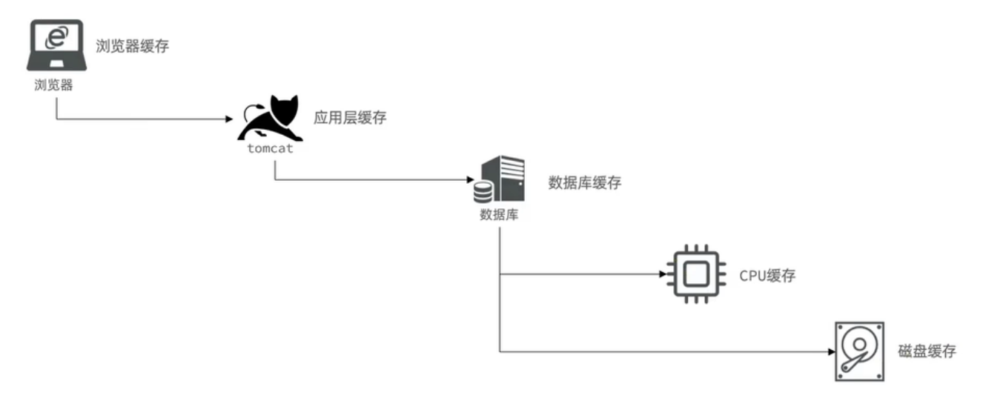
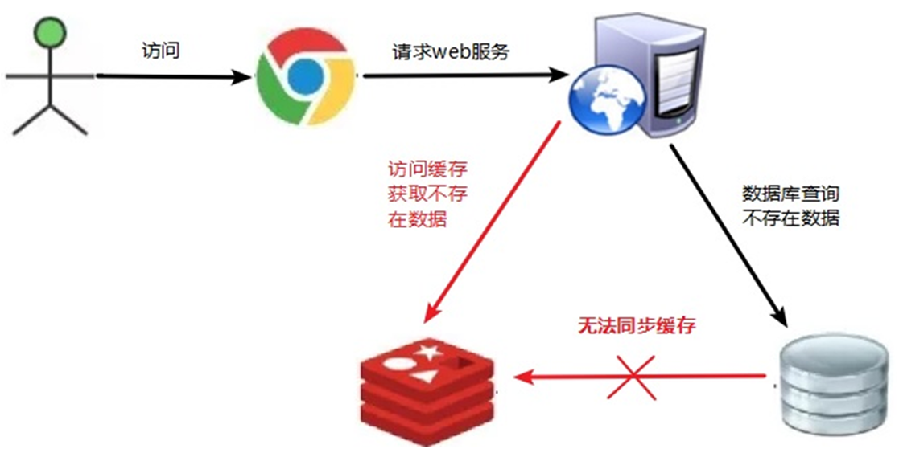
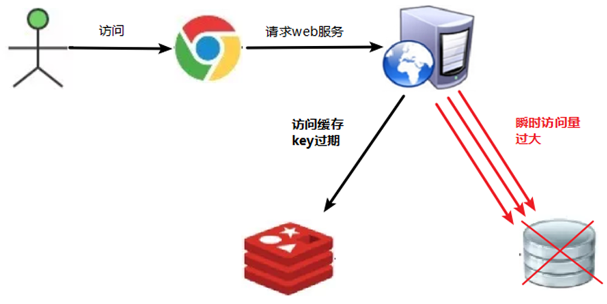
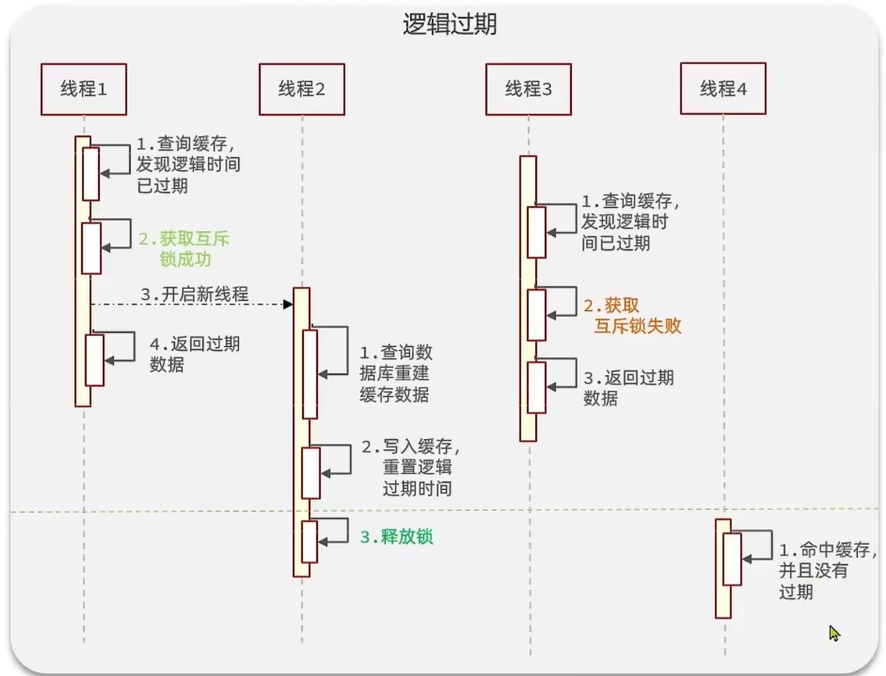
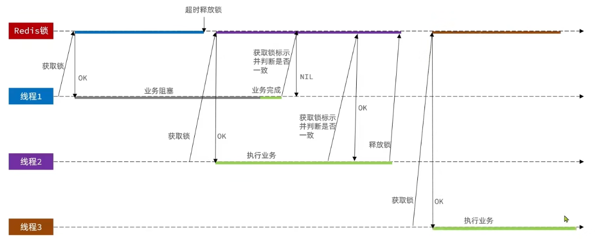

# Redis 中间件

[TOC]

## 第一章：Redis 基础

### 一、Redis 介绍

#### （1）NoSQL 简介

NoSql 可以翻译做 Not Only Sql（不仅仅是SQL），或者是 No Sql（非Sql的）数据库。是相对于传统关系型数据库而言，有很大差异的一种特殊的数据库，因此也称之为非关系型数据库。

**关系型数据库与非关系型数据库的区别：**

- 传统关系型数据库是结构化数据，每一张表都有严格的约束信息：字段名、字段数据类型、字段约束等信息，插入的数据必须遵守这些约束；而 NoSql 则对数据库格式没有严格约束，往往形式松散，自由。可以是键值型，可以是文档型，也可以是图格式。
- 传统数据库的表与表之间往往存在关联，例如外键；而非关系型数据库不存在关联关系，要维护关系要么靠代码中的业务逻辑，要么靠数据之间的耦合。
- 传统关系型数据库会基于Sql语句做查询，语法有统一标准；而不同的非关系数据库查询语法差异极大，有很多种。传统关系型数据库能满足事务ACID的原则，而非关系型数据库往往不支持事务，或者不能严格保证ACID的特性，只能实现基本的一致性。
- 关系型数据库基于磁盘进行存储，会有大量的磁盘IO，对性能有一定影响；非关系型数据库的操作更多的是依赖于内存来操作，内存的读写速度会非常快，性能自然会更好。
- 关系型数据库集群模式一般是主从，主从数据一致，起到数据备份的作用，称为垂直扩展；非关系型数据库可以将数据拆分，存储在不同机器上，可以保存海量数据，解决内存大小有限的问题，称为水平扩展。关系型数据库因为表之间存在关联关系，如果做水平扩展会给数据查询带来很多麻烦。


#### （2）Redis 简介

Redis诞生于2009年，全称是 Remote  Dictionary Server，即远程词典服务器，是一个基于内存的键值型NoSQL数据库。其中键值型，是指Redis中存储的数据都是以键值对的形式存储，而值的形式多种多样，可以是字符串、数值、甚至 Json。

**Redis 的特点：**

- 键值（key-value）型，value 支持多种不同数据结构，功能丰富；
- 单线程，每个命令具备原子性；
- 低延迟，速度快（基于内存.IO多路复用.良好的编码）；
- 支持数据持久化；
- 支持主从集群、分片集群；
- 支持多语言客户端；

Redis的官方网站地址：https://redis.io/；

#### （3）安装 Redis

##### 1. 安装 Redis

多数企业都是基于Linux服务器来部署项目，这里也基于Linux（CentOS7）系统来安装 Redis。

Redis 是基于C语言编写的，因此首先需要安装 Redis 所需要的 gcc 依赖：

```bash
yum install -y gcc tcl
```

然后将Redis的安装包上传到 `/usr/local/src` 目录下：

```bash
[root@xq101 ~]# cd /usr/local/src/
[root@xq101 src]# ll
总用量 2928
-rw-r--r--. 1 root root 2994329 4月  20 14:49 redis-7.0.15.tar.gz
```

解压安装包：

```bash
tar -zxvf redis-7.0.15.tar.gz 
```

进入安装目录，并运行安装命令：

```bash
[root@xq101 src]# cd redis-7.0.15/
[root@xq101 src]# make && make install
```

启动Redis：

```bash
[root@xq101 redis-7.0.15]# redis-server 
7179:C 20 Apr 2025 14:59:18.876 # oO0OoO0OoO0Oo Redis is starting oO0OoO0OoO0Oo
7179:C 20 Apr 2025 14:59:18.876 # Redis version=7.0.15, bits=64, commit=00000000, modified=0, pid=7179, just started
7179:C 20 Apr 2025 14:59:18.876 # Warning: no config file specified, using the default config. In order to specify a config file use redis-server /path/to/redis.conf
7179:M 20 Apr 2025 14:59:18.877 * Increased maximum number of open files to 10032 (it was originally set to 1024).
7179:M 20 Apr 2025 14:59:18.877 * monotonic clock: POSIX clock_gettime
                _._                                                  
           _.-``__ ''-._                                             
      _.-``    `.  `_.  ''-._           Redis 7.0.15 (00000000/0) 64 bit
  .-`` .-```.  ```\/    _.,_ ''-._                                  
 (    '      ,       .-`  | `,    )     Running in standalone mode
 |`-._`-...-` __...-.``-._|'` _.-'|     Port: 6379
 |    `-._   `._    /     _.-'    |     PID: 7179
  `-._    `-._  `-./  _.-'    _.-'                                   
 |`-._`-._    `-.__.-'    _.-'_.-'|                                  
 |    `-._`-._        _.-'_.-'    |           https://redis.io       
  `-._    `-._`-.__.-'_.-'    _.-'                                   
 |`-._`-._    `-.__.-'    _.-'_.-'|                                  
 |    `-._`-._        _.-'_.-'    |                                  
  `-._    `-._`-.__.-'_.-'    _.-'                                   
      `-._    `-.__.-'    _.-'                                       
          `-._        _.-'                                           
              `-.__.-'                                               

7179:M 20 Apr 2025 14:59:18.889 # WARNING: The TCP backlog setting of 511 cannot be enforced because /proc/sys/net/core/somaxconn is set to the lower value of 128.
7179:M 20 Apr 2025 14:59:18.889 # Server initialized
7179:M 20 Apr 2025 14:59:18.889 # WARNING Memory overcommit must be enabled! Without it, a background save or replication may fail under low memory condition. Being disabled, it can can also cause failures without low memory condition, see https://github.com/jemalloc/jemalloc/issues/1328. To fix this issue add 'vm.overcommit_memory = 1' to /etc/sysctl.conf and then reboot or run the command 'sysctl vm.overcommit_memory=1' for this to take effect.
7179:M 20 Apr 2025 14:59:18.890 * Ready to accept connections
```

这种启动方式为前台启动，会占用整个会话窗口，窗口关闭或者按下 `CTRL + C` 则Redis停止，不推荐使用。

##### 2. 指定配置启动 Redis

如果要让Redis以后台方式启动，则必须修改Redis配置文件，就在之前解压的redis安装包下 `/usr/local/src/redis-7.0.15`，文件名 `redis.conf`，先将该文件备份：

```bash
[root@xq101 redis-7.0.15]# cp redis.conf redis.conf.bck
[root@xq101 redis-7.0.15]# ll
总用量 388
-rw-rw-r--.  1 root root  47229 1月   9 2024 00-RELEASENOTES
-rw-rw-r--.  1 root root     51 1月   9 2024 BUGS
-rw-rw-r--.  1 root root   5027 1月   9 2024 CODE_OF_CONDUCT.md
-rw-rw-r--.  1 root root   2634 1月   9 2024 CONTRIBUTING.md
-rw-rw-r--.  1 root root   1487 1月   9 2024 COPYING
drwxrwxr-x.  7 root root    187 4月  20 14:53 deps
-rw-r--r--.  1 root root     89 4月  20 15:03 dump.rdb
-rw-rw-r--.  1 root root     11 1月   9 2024 INSTALL
-rw-rw-r--.  1 root root    151 1月   9 2024 Makefile
-rw-rw-r--.  1 root root   6888 1月   9 2024 MANIFESTO
-rw-rw-r--.  1 root root  22441 1月   9 2024 README.md
-rw-rw-r--.  1 root root 106545 1月   9 2024 redis.conf
-rw-r--r--.  1 root root 106545 4月  20 15:04 redis.conf.bck
-rwxrwxr-x.  1 root root    279 1月   9 2024 runtest
-rwxrwxr-x.  1 root root    283 1月   9 2024 runtest-cluster
-rwxrwxr-x.  1 root root   1613 1月   9 2024 runtest-moduleapi
-rwxrwxr-x.  1 root root    285 1月   9 2024 runtest-sentinel
-rw-rw-r--.  1 root root   1695 1月   9 2024 SECURITY.md
-rw-rw-r--.  1 root root  14005 1月   9 2024 sentinel.conf
drwxrwxr-x.  4 root root  12288 4月  20 14:56 src
drwxrwxr-x. 11 root root    199 1月   9 2024 tests
-rw-rw-r--.  1 root root   3055 1月   9 2024 TLS.md
drwxrwxr-x.  8 root root   4096 1月   9 2024 utils
```

然后修改该文件：

```bash
[root@xq101 redis-7.0.15]# vi redis.conf
```

修改允许访问的地址：

```bash
# 允许访问的地址，默认是127.0.0.1，会导致只能在本地访问。修改为0.0.0.0则可以在任意IP访问，生产环境不要设置为0.0.0.0
bind 0.0.0.0
```

修改守护进程：

```bash
# 守护进程，修改为yes后即可后台运行
daemonize yes
```

修改密码：

```bash
# 密码，设置后访问Redis必须输入密码
requirepass root
```

添加日志文件：

```bash
# 日志文件，默认为空，不记录日志，可以指定日志文件名
logfile "redis.log"
```

其他配置（使用默认即可）：

```bash
# 监听的端口
port 6379
# 工作目录，默认是当前目录，也就是运行redis-server时的命令，日志、持久化等文件会保存在这个目录
dir .
# 数据库数量，设置为1，代表只使用1个库，默认有16个库，编号0~15
databases 16
# 设置redis能够使用的最大内存
maxmemory 512mb
```

启动Redis，并查看是否有Redis进程：

```bash
[root@xq101 redis-7.0.15]# cd /usr/local/src/redis-7.0.15/
[root@xq101 redis-7.0.15]# redis-server redis.conf
[root@xq101 redis-7.0.15]# ps aux | grep redis
root       7383  0.2  0.1 163156  3268 ?        Ssl  15:15   0:01 redis-server 0.0.0.0:6379
root       7497  0.0  0.0 112824   988 pts/0    R+   15:25   0:00 grep --color=auto redis
```

停止Redis：

```bash
[root@xq101 redis-7.0.15]# kill -9 7383
```

##### 3. 开机自启 Redis

通过配置来实现开机自启，新建一个系统服务文件：

```bash
vi /etc/systemd/system/redis.service
```

添加如下内容：

```bash
[Unit]
Description=redis-server
After=network.target

[Service]
Type=forking
ExecStart=/usr/local/bin/redis-server /usr/local/src/redis-7.0.15/redis.conf
PrivateTmp=true

[Install]
WantedBy=multi-user.target
```

重载系统服务，启动Redis并查看状态：

```bash
[root@xq101 redis-7.0.15]# systemctl daemon-reload
[root@xq101 redis-7.0.15]# systemctl start redis
[root@xq101 redis-7.0.15]# systemctl status redis
● redis.service - redis-server
   Loaded: loaded (/etc/systemd/system/redis.service; disabled; vendor preset: disabled)
   Active: active (running) since 日 2025-04-20 15:31:26 CST; 13s ago
  Process: 9112 ExecStart=/usr/local/bin/redis-server /usr/local/src/redis-7.0.15/redis.conf (code=exited, status=0/SUCCESS)
 Main PID: 9115 (redis-server)
    Tasks: 5
   Memory: 1.7M
   CGroup: /system.slice/redis.service
           └─9115 /usr/local/bin/redis-server 0.0.0.0:6379

4月 20 15:31:26 xq101 systemd[1]: Starting redis-server...
4月 20 15:31:26 xq101 systemd[1]: Started redis-server.
```

关闭Redis并查看状态：

```bash
[root@xq101 redis-7.0.15]# systemctl stop redis
[root@xq101 redis-7.0.15]# systemctl status redis
● redis.service - redis-server
   Loaded: loaded (/etc/systemd/system/redis.service; disabled; vendor preset: disabled)
   Active: inactive (dead)

4月 20 15:31:26 xq101 systemd[1]: Starting redis-server...
4月 20 15:31:26 xq101 systemd[1]: Started redis-server.
4月 20 15:31:56 xq101 systemd[1]: Stopping redis-server...
4月 20 15:31:56 xq101 systemd[1]: Stopped redis-server.
```

设置开机自启动，启动Redis并查看进程：

```bash
[root@xq101 redis-7.0.15]# systemctl enable redis
Created symlink from /etc/systemd/system/multi-user.target.wants/redis.service to /etc/systemd/system/redis.service.
[root@xq101 redis-7.0.15]# systemctl start redis
[root@xq101 redis-7.0.15]# ps aux | grep redis
root       9189  0.1  0.1 163156  3256 ?        Ssl  15:33   0:00 /usr/local/bin/redis-server 0.0.0.0:6379
root       9197  0.0  0.0 112824   988 pts/0    S+   15:33   0:00 grep --color=auto redis
```

#### （4）Redis 桌面客户端

安装完成Redis，我们就可以操作Redis，实现数据的CRUD了。这需要用到Redis客户端，包括命令行客户端，图形化桌面客户端，编程客户端。

**Redis 命令行客户端：**

Redis 安装完成后自带命令行客户端：`redis-cli`，可以直接使用，语法如下：

```bash
redis-cli [options] [commonds]
redis-cli -h 192.168.56.128 -p 6379 -a root --raw
```

| 参数    | 说明                                                        |
| ------- | ----------------------------------------------------------- |
| `-h`    | 指定要连接的redis节点的IP地址，默认是127.0.0.1              |
| `-p`    | 指定要连接的Redis节点的端口，默认是6379                     |
| `-a`    | 指定Redis的访问密码，也可以不指定，然后进入输入 `auth 密码` |
| `--raw` | 支持显示中文编码格式                                        |

<font color="blue">示例：</font>

```bash
[root@xq101 ~]# cd /usr/local/bin/
[root@xq101 bin]# ll
总用量 74816
-rwxr-xr-x. 1 root root 54537935 4月  17 21:12 docker-compose
-rwxr-xr-x. 1 root root  5205496 4月  20 14:56 redis-benchmark
lrwxrwxrwx. 1 root root       12 4月  20 14:56 redis-check-aof -> redis-server
lrwxrwxrwx. 1 root root       12 4月  20 14:56 redis-check-rdb -> redis-server
-rwxr-xr-x. 1 root root  5422912 4月  20 14:56 redis-cli
lrwxrwxrwx. 1 root root       12 4月  20 14:56 redis-sentinel -> redis-server
-rwxr-xr-x. 1 root root 11441048 4月  20 14:56 redis-server
[root@xq101 bin]# redis-cli -h 192.168.56.128 -p 6379
192.168.56.128:6379> AUTH root
OK
192.168.56.128:6379> ping
PONG
192.168.56.128:6379> set name jack
OK
192.168.56.128:6379> get name
"jack"
192.168.56.128:6379> set age 19
OK
```

**Redis 图形化客户端：**

下载 Redis Desktop Manager 即可。

建立连接，选择Linux系统的IP地址，输入密码，起名字连接成功，注意要关闭Linux系统的防火墙：

```bash
systemctl stop firewalld
```

Redis 默认有16个仓库，编号从0至15，通过配置文件可以设置仓库数量，但是不超过16，并且不能自定义仓库名称。

### 二、Redis 常用命令

#### （1）Redis 数据类型

Redis 是一个 key-value 的数据库，key 一般是 String 类型，不过 value 的类型多种多样：


查看命令帮助文档：https://redis.io/commands，Redis 的命令不区分大小写。

通过命令查看：

```bash
192.168.56.128:6379> help
redis-cli 7.0.15
To get help about Redis commands type:
      "help @<group>" to get a list of commands in <group>
      "help <command>" for help on <command>
      "help <tab>" to get a list of possible help topics
      "quit" to exit

To set redis-cli preferences:
      ":set hints" enable online hints
      ":set nohints" disable online hints
Set your preferences in ~/.redisclirc
```

#### （2）Redis 通用命令

通用指令是部分数据类型的，都可以使用的指令，或者说基于 Key 的操作。

**通用命令：**

```bash
# 切换到指定编号的数据库
select 编号

# 查看符合模板的所有Key，在生产环境下，不推荐使用keys命令，因为这个命令在key过多的情况下，效率不高
keys 通配符（支持模糊查询）

# 删除一个或多个指定的键值对
del 键1 键2...

# 判断键是否存在
exist 键

# 给键设置过期时间
expire 键 时间(秒)

# 查看键的存活时间(秒)，若该键已经过期则返回-2，若没有设置过期时间则返回-1表示永久有效
ttl 键

# 查看指定键的数据类型
type 键

# 查看当前数据库的键的数量
dbsize

# 清空当前数据库
flushdb

# 清空所有数据库
flushall
```

<font color="blue">示例：</font>

```bash
192.168.56.128:6379> SELECT 0	# 切换到
OK
192.168.56.128:6379> KEYS *		# 查看所有键
1) "age"
2) "name"
192.168.56.128:6379> KEYS a*	# 查看以“a”开头的键
1) "age"
192.168.56.128:6379> del age
(integer) 1
192.168.56.128:6379> keys *
1) "name"
192.168.56.128:6379> mset k1 v1 k2 v2 k3 v3	# 批量插入多个键值对
OK
192.168.56.128:6379> keys *
1) "k3"
2) "k2"
3) "k1"
4) "name"
192.168.56.128:6379> del k1 k2 k3 k4	# 批量删除多个键值对，如果不存在则不删
(integer) 3								# 这里返回受影响的数量
192.168.56.128:6379> EXISTS age
(integer) 0		# 不存在返回0
192.168.56.128:6379> EXISTS name
(integer) 1		# 存在返回1
192.168.56.128:6379> EXPIRE name 20		# 给name键设置存活时间为20秒
(integer) 1
192.168.56.128:6379> ttl name
(integer) 15
192.168.56.128:6379> ttl name
(integer) 12
192.168.56.128:6379> ttl name			# -2表示已经过期
(integer) -2
192.168.56.128:6379> keys *
(empty array)
192.168.56.128:6379> set age 19
OK
192.168.56.128:6379> ttl age			# 没设置过期时间返回-1表示永久有效
(integer) -1
192.168.56.128:6379> TYPE age
string
192.168.56.128:6379> DBSIZE
(integer) 1
192.168.56.128:6379> FLUSHDB
OK
192.168.56.128:6379> DBSIZE
(integer) 0
```

#### （3）String 命令

##### 1. String 相关命令

String 类型，即字符串类型，是Redis中最基本的存储类型，其value是字符串，不过根据字符串的格式不同，又可以分为3类：

* string：普通字符串；
* int：整数类型，可以做自增或自减操作；
* float：浮点类型，可以做自增或自减操作。

**String 命令：**

```bash
# 添加或修改已经存在的一个String类型的键值对
set 键 值

# 添加一个String类型的键值对，若该键存在则添加失败返回0
setnx 键 值				相当于：set 键 值 nx

# 添加一个String类型的键值对，并且指定有效期
setex 键 有效期 值

# 根据键获取值
get 键

# 批量添加或修改多个String类型的键值对
mset 键1 值1 键2 值2...

# 批量添加多个键值对，只有所有的key都不存在，才会设置，任意一个key存在，都不会设置值
msetnx 键1 值1 键2 值2...

# 根据多个键获取多个String类型的值
mget 键1 键2...

# 在指定键的值后面追加内容，返回更新后值的长度
append 键 新增内容

# 获取键的值的长度
strlen 键

# 根据指定区间获取指定键的值的子串，下标从0开始
getrange 键 start end

# 从指定索引值开始替换值
setrange 键 start 替换内容

# 使用新值替换旧值，但是返回旧值
getset 键 新值

# 让一个整型的值自增1，操作的值必须是数字类型
incr 键

# 让一个整型的值自减1，操作的值必须是数字类型
decr 键

# 让一个整型的值自增并指定步长，操作的值必须是数字类型
incrby 键 步长

# 让一个整型的值自减并指定步长，操作的值必须是数字类型
decrby 键 步长

# 让一个浮点类型的值自增并指定步长
incrbyfloat 键 步长
```

注意：`incr` 命令是原子操作，也就是指不会被线程调度机制打断的操作。这种操作一旦开始，就一直运行到结束，中间不会有任何线程上下文切换。在单线程中，能够在单条指令中完成的操作都可以认为是原子操作。

<font color="blue">示例：</font>

```bash
192.168.56.128:6379> set name jack
OK
192.168.56.128:6379> set age 19
OK
192.168.56.128:6379> get name
"jack"
192.168.56.128:6379> get aa
(nil)
192.168.56.128:6379> set name Tom
OK
192.168.56.128:6379> get name
"Tom"
192.168.56.128:6379> setnx name jack
(integer) 0
192.168.56.128:6379> get name
"Tom"

192.168.56.128:6379> mset k1 v1 k2 v2
OK
192.168.56.128:6379> mget name age k1 k2
1) "Tom"
2) "19"
3) "v1"
4) "v2"

192.168.56.128:6379> APPEND k1 abc
(integer) 5
192.168.56.128:6379> get k1
"v1abc"
192.168.56.128:6379> STRLEN name
(integer) 3

192.168.56.128:6379> get k1
"v1abc"
192.168.56.128:6379> getrange k1 1 3
"1ab"
192.168.56.128:6379> SETRANGE k1 2 xyz
(integer) 5
192.168.56.128:6379> get k1
"v1xyz"
192.168.56.128:6379> getset name John
"Tom"
192.168.56.128:6379> get name
"John"

192.168.56.128:6379> set num1 100
OK
192.168.56.128:6379> incr num1
(integer) 101
192.168.56.128:6379> get num1
"101"
192.168.56.128:6379> incrby num1 5
(integer) 106
192.168.56.128:6379> decrby num1 10
(integer) 96
192.168.56.128:6379> set float1 19.23
OK
192.168.56.128:6379> INCRBYFLOAT float1 8.33
"27.56"

192.168.56.128:6379> setex k3 15 v3
OK
192.168.56.128:6379> ttl k3
(integer) 9
192.168.56.128:6379> ttl k3
(integer) -2
```

##### 2. Key 的层级结构

Redis 没有类似 MySQL 中的数据表 Table 的概念，为了区分不同类型的键，可以通过给键添加前缀加以区分，不过这个前缀不是随便加的，有一定的规范，Redis 的键允许有多个单词形成层级结构，多个单词之间用 `:` 隔开，格式如下：

```
项目名:业务名:类型:id
```

这个格式并非固定，也可以根据自己的需求来删除或添加词条。

<font color="blue">示例：</font>

```bash
192.168.56.128:6379> set com:ssh:user:id 1
OK
# 删除该键以后若该目录下没有其他键，则文件夹也会删除
192.168.56.128:6379> del com:ssh:user:id
(integer) 1
```

#### （4）Hash 命令

Hash 类型，也叫散列，其value是一个无序字典，类似于Java中的HashMap结构。Redis的 hash 是一个键值对集合。Redis 的 hash 是一个 String 类型的 field（域）和 value（值）的映射表，hash 特别适合用于存储对象。

Hash类型对应的数据结构有两种：ziplist（压缩列表），hashtable（哈希表）。当 field-value 长度较短且个数较少时，使用ziplist，否则使用hashtable。

**Hash 命令：**

```bash
# 添加或者修改hash类型key的field的值
hset 键 域 值

# 获取一个hash类型key的field的值
hget 键 域

# 批量添加多个hash类型key的field的值
hmset 键 域1 值1 域2 值2...

# 批量获取多个hash类型key的field的值
hmget 键 域1 域2...

# 获取一个hash类型的key中的所有的field和value
hgetall 键

# 获取一个hash类型的key中的所有的field
hkeys 键

# 获取一个hash类型的key中的所有的value
hvals 键

# 查看指定键中是否存在指定域，存在返回1，不存在返回0
hexists 键 域

# 删除一个或多个指定键的指定域的值
hdel 键 域

# 让一个hash类型key的字段值自增并指定步长
hincrby 键 域 步长

# 给对应的field设置值 如果field存在设置不成功，如果field不存在，则设置成功
hsetnx 键 域 值
```

<font color="blue">示例：</font>

```bash
192.168.56.128:6379> hset ssh:user:1 name jack
(integer) 1
192.168.56.128:6379> HGET ssh:user:1 name
"jack"
192.168.56.128:6379> hset ssh:user:1 age 21
(integer) 1
192.168.56.128:6379> hmset ssh:user:2 name tom age 19
OK
192.168.56.128:6379> hmget ssh:user:2 name age
1) "tom"
2) "19"
192.168.56.128:6379> hgetall ssh:user:2
1) "name"
2) "tom"
3) "age"
4) "19"
192.168.56.128:6379> hkeys ssh:user:2
1) "name"
2) "age"
192.168.56.128:6379> hvals ssh:user:2
1) "tom"
2) "19"

192.168.56.128:6379> HEXISTS ssh:user:1 aa
(integer) 0
192.168.56.128:6379> HEXISTS ssh:user:1 name
(integer) 1

192.168.56.128:6379> hdel ssh:user:2 age
(integer) 1
192.168.56.128:6379> hdel ssh:user:2 age name
(integer) 1

192.168.56.128:6379> HINCRBY ssh:user:1 age 5
(integer) 26
192.168.56.128:6379> HINCRBY ssh:user:1 age -5
(integer) 21
192.168.56.128:6379> hget ssh:user:1 age
"21"

192.168.56.128:6379> hsetnx ssh:user:1 name shen
(integer) 1
192.168.56.128:6379> hsetnx ssh:user:1 name s
(integer) 0
```

#### （5）List 命令

List 列表是单键多值的列表，与Java中的LinkedList类似，既可以支持正向检索和也可以支持反向检索。Redis 列表是简单的字符串列表，按照插入顺序排序，可以添加一个元素到列表的头部（左）或者尾部（右）。它的底层实际是个双向链表，对两端的操作性能很高，但是通过索引下标操作中间的节点性能会较差。

List 的数据结构为快速链表 quickList。首先在列表元素较少的情况下会使用一块连续的内存存储，这个结构是 ziplist，也即是压缩列表。它将所有的元素紧挨着一起存储，分配的是一块连续的内存。当数据量比较多的时候才会改成 quicklist。

因为普通的链表需要的附加指针空间太大，会比较浪费空间。比如这个列表里存的只是int类型的数据，结构上还需要两个额外的指针 prev 和 next。Redis将链表和 ziplist 结合起来组成了 quicklist。也就是将多个 ziplist 使用双向指针串起来使用。这样既满足了快速的插入删除性能，又不会出现太大的空间冗余。

List 的特点：

- 有序；
- 元素可重复；
- 插入和删除效率高；
- 查询速度一般。

**List 命令：**

```bash
# 向列表左侧插入一个或多个元素
lpush 键1 元素1 元素2...

# 向列表右侧插入一个或多个元素
rpush 键1 元素1 元素2...

# 移除并返回列表左侧的第一个或多个元素，没有则返回nil
lpop 键 (数量)

# 移除并返回列表右侧的第一个或多个元素，没有则返回nil
rpop 键 (数量)

# 返回一段区间内的所有元素
lrange 键 start end

# 查询列表中的所有元素
lrange 键 0 -1

# 将k1列表最右边的值取出来,追加到k2列表的最左边
rpoplpush 键1 键2

# 根据指定下标获取元素
lindex 键 下标

# 获取指定列表的长度
llen 键

# 在指定列表的指定元素前面或后面追加元素
linsert 键 before/after 位置元素 追加元素

# 从左边删除指定个数的指定元素
lrem 键 数量 元素

# 将指定索引位置上的元素替换
lset 键 位置 新元素

# 移除并返回列表左侧的第一个元素，没有元素时等待指定时间
blpop 键 时间(秒)

# 移除并返回列表右侧的第一个元素，没有元素时等待指定时间
brpop 键 时间(秒)
```

<font color="blue">示例：</font>

```bash
192.168.56.128:6379> lpush l1 v1 v2 v3
(integer) 3
192.168.56.128:6379> lpop l1
"v3"
192.168.56.128:6379> lpop l1 3
1) "v2"
2) "v1"
192.168.56.128:6379> lrange l1 0 -1
(empty array)
192.168.56.128:6379> rpush l1 v1 v2 v3
(integer) 3
192.168.56.128:6379> rpop l1
"v3"
192.168.56.128:6379> rpush l1 v3 v4 v5 v6
(integer) 6
192.168.56.128:6379> lrange l1 0 -1
1) "v1"
2) "v2"
3) "v3"
4) "v4"
5) "v5"
6) "v6"
192.168.56.128:6379> LRANGE l1 2 4
1) "v3"
2) "v4"
3) "v5"

192.168.56.128:6379> lpush l2 a b c d e
(integer) 5
192.168.56.128:6379> rpoplpush l1 l2	# 将l1的最右边元素移除，加到l2列表的左边
"v6"
192.168.56.128:6379> lrange l1 0 -1
1) "v1"
2) "v2"
3) "v3"
4) "v4"
5) "v5"
192.168.56.128:6379> lrange l2 0 -1
1) "v6"
2) "e"
3) "d"
4) "c"
5) "b"
6) "a"

192.168.56.128:6379> llen l1
(integer) 5
192.168.56.128:6379> linsert l2 before d x	# 在l2列表的d元素前面插入x
(integer) 7									# 返回插入后元素个数
192.168.56.128:6379> linsert l2 after d x	# 在l2列表的d元素后面插入x
(integer) 8
192.168.56.128:6379> lrange l2 0 -1
1) "v6"
2) "e"
3) "x"
4) "d"
5) "x"
6) "c"
7) "b"
8) "a"

192.168.56.128:6379> lrem l2 2 x	# 从左边开始删除2个l2表的x元素
(integer) 2							# 返回受影响的数量
192.168.56.128:6379> lrange l2 0 -1
1) "v6"
2) "e"
3) "d"
4) "c"
5) "b"
6) "a"
```

#### （6）Set 命令

Redis 的 set 对外提供的功能与 list 类似，是一个集合的功能，特殊之处在于 set 是可以自动去重的，当你需要存储一个列表数据，又不希望出现重复数据时，set 是一个很好的选择，并且 set 提供了判断某个成员是否在一个set集合内的命令，这个也是 list 所不能提供的。

Redis 的 Set 是 string 类型的无序集合。它底层其实是一个 value 为 null 的 hash 表，所以添加，删除，查找的复杂度都是 O(1)。（随着数据的增加，执行时间的长短，如果是O(1)，数据增加，查找数据的时间不变）。

Set 数据结构是 dict 字典，字典是用哈希表实现的。Java中 HashSet 的内部实现使用的是 HashMap，只不过所有的 value 都指向同一个对象。Redis 的 set 结构也是一样，它的内部也使用 hash 结构，所有的 value 都指向同一个内部值。

Set 的特点：

* 无序；
* 元素不可重复；
* 查找效率高；
* 支持交集、并集、差集等功能。

**Set 常用命令：**

```bash
# 向指定集合中添加元素
sadd 键 值1 值2...

# 获取指定集合中的所有元素
smenbers 键

# 判断指定集合是否含有某元素，若存在返回1，不存在返回0
sismember 键 值

# 移除集合中的指定元素
srem 键 值1 值2...

# 返回集合中元素的个数
scard 键

# 随机弹出集合中的某个元素并将其删除
spop 键

# 随机弹出指定个数的元素,但是不会从集合中删除
srandmember 键 个数

# 将集合1中的某个元素移动到集合2中
smove 键1 键2 元素

# 求两集合交集
sinter 键1 键2

# 求两集合并集
sunion 键1 键2

# 求两集合的差集（s1 - s2）
sdiff 键1 键2
```

<font color="blue">示例：</font>

```bash
192.168.56.128:6379> sadd s1 v1 v2 v3
(integer) 3
192.168.56.128:6379> sadd s1 v1			# 不能添加重复元素
(integer) 0
192.168.56.128:6379> smembers s1
1) "v3"
2) "v2"
3) "v1"
192.168.56.128:6379> SISMEMBER s1 v2
(integer) 1
192.168.56.128:6379> SISMEMBER s1 aa
(integer) 0

192.168.56.128:6379> srem s1 v2 v4		# 删除元素，返回受影响的数量
(integer) 1
192.168.56.128:6379> smembers s1
1) "v3"
2) "v1"

192.168.56.128:6379> sadd s1 v2 v4 v5 v3 v1
(integer) 5
192.168.56.128:6379> spop s1
"v3"
192.168.56.128:6379> smembers s1
1) "v2"
2) "v1"
3) "v4"
4) "v5"
192.168.56.128:6379> SRANDMEMBER s1
"v5"
192.168.56.128:6379> smembers s1
1) "v2"
2) "v1"
3) "v4"
4) "v5"

192.168.56.128:6379> sadd s2 a b c d
(integer) 4
192.168.56.128:6379> smove s1 s2 v2		# 将v2从s1移动到s2
(integer) 1
192.168.56.128:6379> smembers s1
1) "v1"
2) "v4"
3) "v5"
192.168.56.128:6379> smembers s2
1) "d"
2) "b"
3) "a"
4) "c"
5) "v2"

192.168.56.128:6379> sadd s1 a b c
(integer) 3
192.168.56.128:6379> smembers s1
1) "b"
2) "a"
3) "v1"
4) "v4"
5) "v5"
6) "c"
192.168.56.128:6379> smembers s2
1) "a"
2) "b"
3) "v2"
4) "d"
5) "c"
192.168.56.128:6379> sinter s1 s2	# 交集
1) "a"
2) "b"
3) "c"
192.168.56.128:6379> sunion s1 s2	# 并集
1) "b"
2) "a"
3) "v2"
4) "v1"
5) "v4"
6) "d"
7) "v5"
8) "c"
192.168.56.128:6379> sdiff s1 s2	# 差集 s1 - s2
1) "v4"
2) "v5"
3) "v1"
192.168.56.128:6379> sdiff s2 s1	# 差集 s2 - s1
1) "d"
2) "v2"
```

#### （7）ZSet 命令

Redis 有序集合 zset，也叫SortedSet，与普通集合 set 非常相似，是一个没有重复元素的字符串集合。不同之处是有序集合的每个成员都关联了一个权重（score），这个权重（score）被用来按照升序方式排序集合中的成员。集合的成员是唯一的，但是权重可以是重复的。因为元素是有序的，所以也可以很快的根据权重（score）或者次序（position）来获取一个范围的元素。访问有序集合的中间元素也是非常快的，因此能够使用有序集合作为一个没有重复成员的智能列表。

zset 底层使用了两个数据结构：

- hash：作用就是关联元素 value 和权重 score，保障元素 value 的唯一性，可以通过元素 value 找到相应的 score 值；
- 跳跃表（跳表）：目的在于给元素 value 排序，根据 score 的范围获取元素列表。跳表的效率堪比红黑树，比有序链表的效率要高得多，但其实现远比红黑树简单。

**ZSet 命令：**

```bash
# 添加一个或多个元素到sorted set ，如果已经存在则更新其score值
zadd 键 权值1 值1 权值2 值2...

# 获取指定排名范围内的元素(默认按照权值的升序排序)
zrange 键 min max

# 获取指定排名范围内的元素及其权重(默认按照权值的升序排序)
zrange 键 min max withscores

# 显示zset集合中的所有值
zrange 键 0 -1

# 显示zset集合中的所有值及其权重
zrange 键 0 -1 withscores

# 取集合中指定区间的元素
zrangebyscore 键 start end

# 取集合中指定区间的元素及其权值
zrangebyscore 键 start end withscores

# 删除指定的元素
zrem 键 值1 值2...

# 获取集合中指定元素的权值
zscore 键 值

# 获取集合中指定元素的排名(从0开始)
zrank 键 值

# 获取集合中的元素个数
zcard 键

# 统计指定权值区间的元素个数
zcount 键 min max

# 给指定的元素增加权值
zincrby 键 增加的权 值

# 求两集合交集
zinter 集合数量 键1 键2...

# 求两集合并集
zunion 集合数量 键1 键2...

# 求两集合差集
zdiff 集合数量 键1 键2...
```

所有的排名默认都是升序，如果要降序则在命令的 `Z` 后面添加 `REV` 即可。

<font color="blue">示例：</font>

```bash
192.168.56.128:6379> zadd z1 10 v1 12 v2 11 v3 15 v4 14 v5
(integer) 5
192.168.56.128:6379> zrange z1 0 -1
1) "v1"
2) "v3"
3) "v2"
4) "v5"
5) "v4"
192.168.56.128:6379> zrange z1 1 3
1) "v3"
2) "v2"
3) "v5"
192.168.56.128:6379> zrange z1 1 3 withscores
1) "v3"
2) "11"
3) "v2"
4) "12"
5) "v5"
6) "14"
192.168.56.128:6379> zrangebyscore z1 11 14
1) "v3"
2) "v2"
3) "v5"
192.168.56.128:6379> zrank z1 v3
(integer) 1
192.168.56.128:6379> zcard z1
(integer) 5
192.168.56.128:6379> zcount z1 11 14
(integer) 3
192.168.56.128:6379> zscore z1 v3
"11"
192.168.56.128:6379> zincrby z1 8 v3	# 把z1集合中v3的权值增加8
"19"
192.168.56.128:6379> zscore z1 v3
"19"
192.168.56.128:6379> zinter 2 z1 z2		# 交集
(empty array)
192.168.56.128:6379> zunion 2 z1 z2		# 并集
1) "a"
2) "b"
3) "v1"
4) "v2"
5) "v5"
6) "v4"
7) "d"
8) "v3"
9) "c"
192.168.56.128:6379> zdiff 2 z1 z2		# 差集
1) "v1"
2) "v2"
3) "v5"
4) "v4"
5) "v3"
```

### 三、Redis 的 Java 客户端

在Redis官网中提供了各种语言的客户端，地址：https://redis.io/docs/clients/；

推荐使用的 Java 客户端：

- Jedis和Lettuce：这两个主要是提供了Redis命令对应的API，方便我们操作Redis，而SpringDataRedis 又对这两种做了抽象和封装，因此后期会直接使用 SpringDataRedis；
- Redisson：是在Redis基础上实现了分布式的可伸缩的java数据结构，例如Map.Queue等，而且支持跨进程的同步机制：Lock.Semaphore 等待，比较适合用来实现特殊的功能需求。

#### （1）Jedis

##### 1. Jedis 入门

使用前要关闭 Linux 的防火墙：

```bash
systemctl stop firewalld
```

创建项目 `jedis-demo`，导入依赖：

```xml
<dependency>
    <groupId>redis.clients</groupId>
    <artifactId>jedis</artifactId>
    <version>5.2.0</version>
</dependency>
```

新建一个单元测试类：

```java
package com.ssh.test;

import org.junit.jupiter.api.AfterEach;
import org.junit.jupiter.api.BeforeEach;
import org.junit.jupiter.api.Test;
import redis.clients.jedis.Jedis;

import java.util.Map;

/**
 * @author 申书航
 * @version 1.0
 */
public class JedisTest {

    private Jedis jedis;

    @BeforeEach
    public void setUp() {
        // 建立连接
        jedis = new Jedis("192.168.56.128", 6379);
        // 设置密码
        jedis.auth("root");
        // 选择库DB0
        jedis.select(0);
    }

    @Test
    public void testString() {
        // 存入字符串
        String result = jedis.set("name", "张三");
        System.out.println(result);
        // 获取字符串
        String name = jedis.get("name");
        System.out.println(name);
    }

    @Test
    public void testHash() {
        // 存入hash
        jedis.hset("user:1", "name", "Jack");
        jedis.hset("user:1", "age", "25");
        // 获取hash
        Map<String, String> map = jedis.hgetAll("user:1");
        System.out.println(map);
    }

    /**
     * 释放资源
     */
    @AfterEach
    public void tearDown() {
        if (jedis != null) {
            jedis.close();
        }
    }
}
```

##### 2. Jedis 连接池

创建连接池：

```java
package com.ssh.jedis.util;

import redis.clients.jedis.Jedis;
import redis.clients.jedis.JedisPool;
import redis.clients.jedis.JedisPoolConfig;

/**
 * @author 申书航
 * @version 1.0
 */
public class JedisConnectionFactory {

    private static final JedisPool jedisPool;

    static {
        // 配置连接池
        JedisPoolConfig poolConfig = new JedisPoolConfig();
        poolConfig.setMaxTotal(8);   // 最大连接数
        poolConfig.setMaxIdle(8);    // 最大空闲连接数
        poolConfig.setMinIdle(0);    // 最小空闲连接数
        poolConfig.setMaxWaitMillis(1000);   // 最大等待时间（毫秒）
        // 创建连接池对象
        jedisPool = new JedisPool(poolConfig, "192.168.56.128",
                6379, 1000, "root");
    }

    public static Jedis getJedis() {
        return jedisPool.getResource();
    }
}
```

返回测试，修改连接部分的代码：

```java
@BeforeEach
public void setUp() {
    // 建立连接
    // jedis = new Jedis("192.168.56.128", 6379);
    jedis = JedisConnectionFactory.getJedis();  // 使用连接池
    // 设置密码
    jedis.auth("root");
    // 选择库
    jedis.select(0);
}
```

#### （2）SpringDataRedis

SpringData是Spring中数据操作的模块，包含对各种数据库的集成，其中对Redis的集成模块就叫做SpringDataRedis，官网地址：https://spring.io/projects/spring-data-redis。下面是 SpringDataRedis 的特点：

* 提供了对不同Redis客户端的整合（Lettuce和Jedis）；
* 提供了RedisTemplate统一API来操作Redis；
* 支持Redis的发布订阅模型；
* 支持Redis哨兵和Redis集群；
* 支持基于Lettuce的响应式编程；
* 支持基于JDK.JSON.字符串.Spring对象的数据序列化及反序列化；
* 支持基于Redis的JDKCollection实现。

SpringDataRedis 中提供了 RedisTemplate 工具类，其中封装了各种对 Redis 的操作。并且将不同数据类型的操作API封装到了不同的类型中：

| API                         | 返回值类型      | 说明                  |
| --------------------------- | --------------- | --------------------- |
| redisTemplate.opsForValue() | ValueOperations | 操作String类型数据    |
| redisTemplate.opsForHash()  | HashOperations  | 操作Hash类型数据      |
| redisTemplate.opsForList()  | ListOperations  | 操作List类型数据      |
| redisTemplate.opsForSet()   | SetOperations   | 操作Set类型数据       |
| redisTemplate.opsForZSet()  | ZSetOperations  | 操作SortedSet类型数据 |
| redisTemplate               |                 | 通用的命令            |

##### 1. 快速入门

SpringBoot 已经提供了对 SpringDataRedis 的支持，使用很简便。

导入依赖：

```xml
<dependencies>
    <!-- Redis Starter -->
    <dependency>
        <groupId>org.springframework.boot</groupId>
        <artifactId>spring-boot-starter-data-redis</artifactId>
    </dependency>

    <!-- Jackson（版本由父工程管理） -->
    <dependency>
        <groupId>com.fasterxml.jackson.core</groupId>
        <artifactId>jackson-databind</artifactId>
    </dependency>

    <!-- Lombok（显式指定版本和作用域） -->
    <dependency>
        <groupId>org.projectlombok</groupId>
        <artifactId>lombok</artifactId>
        <version>1.18.32</version>
        <scope>provided</scope>
    </dependency>

    <!-- Test Starter -->
    <dependency>
        <groupId>org.springframework.boot</groupId>
        <artifactId>spring-boot-starter-test</artifactId>
        <scope>test</scope>
    </dependency>
</dependencies>

<build>
    <plugins>
        <!-- Maven 编译器插件 -->
        <plugin>
            <groupId>org.apache.maven.plugins</groupId>
            <artifactId>maven-compiler-plugin</artifactId>
            <version>3.13.0</version>
            <configuration>
                <annotationProcessorPaths>
                    <path>
                        <groupId>org.projectlombok</groupId>
                        <artifactId>lombok</artifactId>
                        <version>1.18.32</version>
                    </path>
                </annotationProcessorPaths>
            </configuration>
        </plugin>

        <!-- Spring Boot Maven 插件 -->
        <plugin>
            <groupId>org.springframework.boot</groupId>
            <artifactId>spring-boot-maven-plugin</artifactId>
        </plugin>
    </plugins>
</build>
```

配置 Redis 连接信息：`application.yaml`

```yaml
spring:
  data:
    redis:
      host: 192.168.56.128
      port: 6379
      password: root
      lettuce:
        pool:
          max-active: 8
          max-idle: 8
          min-idle: 0
          max-wait: 1000ms
```

创建并测试：

```java
package com.ssh.redis;

import org.junit.jupiter.api.Test;
import org.springframework.beans.factory.annotation.Autowired;
import org.springframework.boot.test.context.SpringBootTest;
import org.springframework.data.redis.core.RedisTemplate;

@SpringBootTest
class SpringDataRedisDemoApplicationTests {

    @Autowired
    private RedisTemplate redisTemplate;

    @Test
    void testString() {
        // 设置值
        redisTemplate.opsForValue().set("name", "张三");
        // 获取值
        Object name = redisTemplate.opsForValue().get("name");
        System.out.println(name);
    }
}
```

##### 2. 数据序列化器

`RedisTemplate` 可以接收任意Object作为值写入Redis，但是写入前会把Object序列化为字节形式，默认是采用JDK序列化，得到的结果看起来是乱码，可读性差，且占用更多内存。

采用JSON序列化来代替默认的JDK序列化方式，整体可读性有了很大提升，并且能将Java对象自动的序列化为JSON字符串，并且查询时能自动把JSON反序列化为Java对象。但是，其中记录了序列化时对应的 class 名称，目的是为了查询时实现自动反序列化，这会带来额外的内存开销。

<font color="blue">示例：</font>

配置类：

```java
package com.ssh.redis.config;

import org.springframework.context.annotation.Bean;
import org.springframework.context.annotation.Configuration;
import org.springframework.data.redis.connection.RedisConnectionFactory;
import org.springframework.data.redis.core.RedisTemplate;
import org.springframework.data.redis.serializer.GenericJackson2JsonRedisSerializer;
import org.springframework.data.redis.serializer.RedisSerializer;

/**
 * @author 申书航
 * @version 1.0
 */
@Configuration
public class RedisConfig {

    @Bean
    public RedisTemplate<String, Object> redisTemplate(RedisConnectionFactory connectionFactory) {
        // 创建RedisTemplate对象
        RedisTemplate<String, Object> template = new RedisTemplate<>();
        // 设置连接工厂
        template.setConnectionFactory(connectionFactory);
        // 创建JSON序列化
        GenericJackson2JsonRedisSerializer jsonRedisSerializer = new GenericJackson2JsonRedisSerializer();
        // 设置Key序列化
        template.setKeySerializer(RedisSerializer.string());
        template.setHashKeySerializer(RedisSerializer.string());
        // 设置Value序列化
        template.setValueSerializer(jsonRedisSerializer);
        template.setHashValueSerializer(jsonRedisSerializer);

        return template;
    }
}
```

测试类：

```java
package com.ssh.redis;

import com.ssh.redis.pojo.User;
import org.junit.jupiter.api.Test;
import org.springframework.beans.factory.annotation.Autowired;
import org.springframework.boot.test.context.SpringBootTest;
import org.springframework.data.redis.core.RedisTemplate;

@SpringBootTest
class SpringDataRedisDemoApplicationTests {

    @Autowired
    private RedisTemplate<String, Object> redisTemplate;

    @Test
    void testString() {
        // 设置值
        redisTemplate.opsForValue().set("name", "李四");
        // 获取值
        Object name = redisTemplate.opsForValue().get("name");
        System.out.println(name);
    }

    @Test
    void testSaveUser() {
        redisTemplate.opsForValue().set("user:2", new User("小明", 20));
        User user = (User) redisTemplate.opsForValue().get("user:2");
        System.out.println(user);
    }
}
```

执行后查看Redis，已经成功显示数据：

```bash
192.168.56.128:6379> get name
"李四"
192.168.56.128:6379> get user:2
{"@class":"com.ssh.redis.pojo.User","name":"小明","age":20}
```

##### 3. `StringRedisTemplate`

尽管JSON的序列化方式可以满足我们的需求，但依然存在一些问题：为了在反序列化时知道对象的类型，JSON序列化器会将类的 class 类型写入 json 结果中，存入 Redis，会带来额外的内存开销。

为了减少内存的消耗，可以采用自定义序列化的方式，即不借助默认的序列化器。同时只采用 String 的序列化器，这样，在存储 value 时内存中就不用多存储数据，从而节约我们的内存空间。

这种用法比较普遍，因此 `SpringDataRedis` 就提供了 `RedisTemplate` 的子类：`StringRedisTemplate`，它的 key 和 value 的序列化方式默认就是 String 方式。这样就省去了自定义 `RedisTemplate` 的序列化方式的步骤，而是直接使用序列化。

<font color="blue">示例：</font>

```java
package com.ssh.redis;

import com.fasterxml.jackson.core.JsonProcessingException;
import com.fasterxml.jackson.databind.ObjectMapper;
import com.ssh.redis.pojo.User;
import org.junit.jupiter.api.Test;
import org.springframework.beans.factory.annotation.Autowired;
import org.springframework.boot.test.context.SpringBootTest;
import org.springframework.data.redis.core.RedisTemplate;
import org.springframework.data.redis.core.StringRedisTemplate;

/**
 * @author 申书航
 * @version 1.0
 */
@SpringBootTest
public class RedisStringTest {

    @Autowired
//    private RedisTemplate<String, Object> redisTemplate;
    private StringRedisTemplate redisTemplate;

    @Test
    void testString() {
        // 设置值
        redisTemplate.opsForValue().set("name", "李四");
        // 获取值
        Object name = redisTemplate.opsForValue().get("name");
        System.out.println(name);
    }

    private static final ObjectMapper mapper = new ObjectMapper();

    @Test
    void testSaveUser() throws JsonProcessingException {
//        redisTemplate.opsForValue().set("user:2", new User("小明", 20));
//        User user = (User) redisTemplate.opsForValue().get("user:2");
//        System.out.println(user);

        // 创建对象
        User user = new User("小明", 20);
        // 手动序列化
        String s = mapper.writeValueAsString(user);
        // 保存到redis
        redisTemplate.opsForValue().set("user:2", s);
        // 获取对象
        String s1 = redisTemplate.opsForValue().get("user:2");
        // 手动反序列化
        User user1 = mapper.readValue(s1, User.class);
        System.out.println(user1);
    }
    
    @Test
    void testHash() {
        // 保存hash数据
        redisTemplate.opsForHash().put("user:3", "name", "王五");
        redisTemplate.opsForHash().put("user:3", "age", "21");

        // 获取hash数据
        Map<Object, Object> entries = redisTemplate.opsForHash().entries("user:3");
        System.out.println(entries);
    }
}
```

执行后查看Redis，已经成功显示数据，并且class数据已经消失，节省了空间：

```bash
192.168.56.128:6379> get name
李四
192.168.56.128:6379> get user:2
{"name":"小明","age":20}
192.168.56.128:6379> hgetall user:3
name
王五
age
21
```

`RedisTemplate` 的两种序列化实践方案：

1. 方案一：
	- 自定义 `RedisTemplate`；
	- 修改 `RedisTemplate` 的序列化器为 `GenericJackson2JsonRedisSerializer`；
2. 方案二：
	- 使用 `StringRedisTemplate`；
	- 写入 Redis 时，手动把对象序列化为JSON；
	- 读取 Redis 时，手动把读取到的JSON反序列化为对象；

## 第二章：Redis 进阶

### 一、Redis 的新数据类型

#### （1）Bitmap 位图

Bitmap（位图）是一种特殊的字符串数据类型，它利用字符串类型键（key）来存储一系列连续的二进制位（bits），每个位可以独立地表示一个布尔值（0 或 1）。这种数据结构非常适合用于存储和操作大量二值状态的数据，尤其在需要高效空间利用率和特定位操作场景中表现出色。

Redis 中是利用string类型数据结构实现 BitMap，因此最大上限是512M，转换为bit则是 2<sup>32</sup>个 bit 位，初始值全为0。

**Bitmap 常用命令：**

```bash
# 在指定键key中的指定位置offset存入一个0或1
setbit key offset 0/1

# 获取指定key指定位置的值0或1
getbit key offset

# 统计指定范围内BitMap中值为1的bit位的数量
bitcount key [start end]

# 操作（查询、修改、自增等）BitMap中bit数组中的指定位置（offset）的值
bitfield key [get type offset] [set type offset 0/1] [incrby type offset increment]

# 从指定位置开始获取key数组，并以指定类型返回，u8表示十进制
bitfield_ro key get type offset

# 查找key数组中指定范围内第一个0或1出现的位置
bitpos key bit [start] [end]

# 将多个BitMap的结果做位运算（与and、非not、或or、异或xor），将结果存储至destkey中
bitop operation destkey key [key ...]
```

<font color="blue">示例：</font>

```bash
192.168.56.128:6379> setbit bit1 0 1
0
192.168.56.128:6379> setbit bit1 3 1
0
192.168.56.128:6379> setbit bit1 4 1
0
192.168.56.128:6379> setbit bit1 6 1
0
192.168.56.128:6379> setbit bit1 7 1
0

# 此时的bit1为10011011
192.168.56.128:6379> bitfield_ro bit1 get u8 0
155

192.168.56.128:6379> getbit bit1 0
1
192.168.56.128:6379> bitcount bit1
5
# 从0开始取bit1前两位为无符号数（10），得到的是十进制
192.168.56.128:6379> bitfield bit1 get u2 0
2
# 求bit1第一个0出现的位置
192.168.56.128:6379> bitpos bit1 0
1
# 取反运算
192.168.56.128:6379> bitop not bit2 bit1
1
```

#### （2）HyperLogLog

在工作当中，我们经常会遇到与统计相关的功能需求：

* UV：全称Unique Visitor，也叫独立访客量，是指通过互联网访问、浏览这个网页的自然人。1天内同一个用户多次访问该网站，只记录1次。
* PV：全称Page View，也叫页面访问量或点击量，用户每访问网站的一个页面，记录1次PV，用户多次打开页面，则记录多次PV。往往用来衡量网站的流量。

通常来说UV会比PV大很多，所以衡量同一个网站的访问量，我们需要综合考虑很多因素，所以只是单纯的把这两个值作为一个参考值。

统计网站PV可以使用 Redis 的 `incr`、`incrby` 轻松实现。但像UV、独立IP数、搜索记录数等需要去重和计数的问题不好解决。这种求集合中不重复元素个数的问题称为基数问题。

什么是基数？比如数据集 {1, 3, 5, 7, 5, 7, 8}，这个数据集的基数集为 {1, 3, 5 ,7, 8}，基数（不重复元素）为5。 基数估计就是在误差可接受的范围内，快速计算基数。

解决基数问题有很多种方案：

1. 数据存储在 MySQL 表中，使用 `distinct count` 计算不重复个数；
2. 使用 Redis 提供的 `hash`、`set`、`bitmaps` 等数据结构来处理以上的方案结果精确，但随着数据不断增加，导致占用空间越来越大，对于非常大的数据集是不切实际的。

为了降低一定的精度来平衡存储空间，Redis 推出了 HyperLogLog，HyperLogLog 是用来做基数统计的算法。HyperLogLog 的优点是，在输入元素的数量或者体积非常非常大时，计算基数所需的空间总是固定的、并且是很小的。在 Redis 里面，每个 HyperLogLog 键只需要花费 12 KB 内存，就可以计算接近 2<sup>64</sup> 个不同元素的基数。这和计算基数时，元素越多耗费内存就越多的集合形成鲜明对比。但是，因为 HyperLogLog 只会根据输入元素来计算基数，而不会储存输入元素本身，所以 HyperLogLog 不能像集合那样，返回输入的各个元素。

**HyperLogLog 常用命令：**

```bash
# 添加元素，返回0表示集合中没有更新元素
pfadd key element1 element2 ...

# 统计集合中的元素数量
pfcount key

# 合并一个或多个集合并存储至destkey中
pfmerge destkey sourcekey1 sourcekey2 ...
```

<font color="blue">示例：</font>

```bash
192.168.56.128:6379> pfadd k1 java
1
192.168.56.128:6379> pfadd k1 html
1
192.168.56.128:6379> pfadd k1 css
1
192.168.56.128:6379> pfadd k1 java
0
# 统计
192.168.56.128:6379> pfcount k1
3
# 合并k1,k2到k2
192.168.56.128:6379> pfmerge k2 k1 k2
OK
192.168.56.128:6379> pfcount k2
4
```

#### （3）Geospatial

Redis 3.2 中增加了对GEO类型的支持。GEO，Geographic，地理信息的缩写。该类型就是元素的2维坐标，在地图上就是经纬度。Redis 基于该类型，提供了经纬度设置，查询，范围查询，距离查询，经纬度 Hash 等常见操作。

**GEO 常用命令：**

```bash
# 将一个或多个地理坐标（经度longitude、纬度latitude、名称value）添加到指定 key
geoadd key longitude latitude value

# 计算两个成员间的距离，单位：m（米，默认）、km（千米）、mi（英里）、ft（英尺）。
geodist key member1 member2 [m/km/mi/ft]

# 返回成员的Geohash字符串（将二维经纬度编码为一维字符串，便于比较位置相似性）
geohash key member1 member2 ...

# 返回指定key的指定成员的坐标
geopos key member1 member2 ...

# 根据给定的中心点坐标和半径，查找附近的成员。
georadius key longitude latitude radius [m/km/mi/ft]

# 根据指定的查询参数在Redis的地理空间数据集中搜索符合条件的位置。
geosearch key FROMMEMBER member|FROMLONLAT longitude latitude BYRADIUS radius width height M|KM|FT|MI [ASC|DESC] [COUNT count [ANY]] [WITHCOORD] [WITHDIST] [WITHHASH]

# geosearchstore与GEOSEARCH功能一致，不过可以把结果存储到一个指定的key
```

注意：两极（南极，北极）无法直接添加，一般会下载城市数据，直接通过 Java 程序一次性导入。有效的经度从 -180 度到 180 度。有效的纬度从 -85.05112878 度到 85.05112878 度。当坐标位置超出指定范围时，该命令将会返回一个错误。已经添加的数据，是无法再次添加的。

<font color="blue">示例：</font>

```bash
# 添加北京 上海 深圳 重庆
192.168.56.128:6379> geoadd city 121.47 31.23 shanghai
1
192.168.56.128:6379> geoadd city 106.50 29.53 chongqing 114.05 22.52 shenzhen 116.38 39.90 beijing
3
# 计算北京到上海的距离
192.168.56.128:6379> geodist city beijing shanghai
1068153.5181
# 返回北京上海的哈希值
192.168.56.128:6379> geohash city beijing shanghai
wx4fbr966e0
wtw3sj5zbj0
# 获取北京的坐标
192.168.56.128:6379> geopos city beijing
116.38000041246414185
39.90000009167092543
# 以(110,30)为圆心，1000km为半径查找city中的成员
192.168.56.128:6379> georadius city 110 30 1000 km
chongqing
shenzhen


```

### 二、缓存

#### （1）缓存概述

##### 1. 缓存的简介

实际开发中，系统需要防止过高的数据访问猛冲系统，导致其操作线程无法及时处理信息而瘫痪。这在实际开发中对企业讲，对产品口碑，用户评价都是致命的，所以企业非常重视缓存技术。

缓存(Cache)，就是数据交换的缓冲区，俗称的缓存就是缓冲区内的数据，一般从数据库中获取，存储于本地代码。

缓存的优点就是速度快，缓存数据存储于代码中，而代码运行在内存中，内存的读写性能远高于磁盘，缓存可以大大降低用户访问并发量带来的服务器读写压力。实际开发过程中，企业的数据量，少则几十万，多则上亿，这么大数据量如果没有缓存来作为"避震器"，系统是几乎撑不住的，所以企业会大量运用到缓存技术。

但是缓存也会增加代码复杂度和运营的成本：


##### 2. 缓存的分类

实际开发中,会构筑多级缓存来使系统运行速度进一步提升，例如本地缓存与Redis中的缓存并发使用。

- 浏览器缓存：主要是存在于浏览器端的缓存；
- 应用层缓存：可以分为tomcat本地缓存，比如之前提到的map，或者是使用redis作为缓存；
- 数据库缓存：在数据库中有一片空间是 buffer pool，增改查数据都会先加载到mysql的缓存中；
- CPU缓存：当代计算机最大的问题是 cpu性能提升了，但内存读写速度没有跟上，所以为了适应当下的情况，增加了cpu的L1，L2，L3级的缓存；



##### 3. 缓存使用思路

标准的操作方式就是查询数据库之前先查询缓存，如果缓存数据存在，则直接从缓存中返回，如果缓存数据不存在，再查询数据库，然后将数据存入 Redis。


#### （2）缓存的更新策略

##### 1. 缓存的更新策略

缓存更新是 Redis 为了节约内存而设计出来的，主要是因为内存数据宝贵，当开发者向 Redis 插入太多数据，此时就可能会导致缓存中的数据过多，所以 Redis 会对部分数据进行更新，或者叫为淘汰更合适。

- 内存淘汰：Redis 自动进行，当 Redis 内存达到咱们设定的 `max-memery` 的时候，会自动触发淘汰机制，淘汰掉一些不重要的数据（可以自定义策略方式）；
- 超时剔除：当给 Redis 设置了过期时间ttl之后，Redis 会将超时的数据进行删除，方便开发者继续使用缓存；
- 主动更新：可以手动调用方法把缓存删掉，通常用于解决缓存和数据库不一致问题。

| 策略     | 内存淘汰                                                     | 超时剔除                                                     | 主动更新                                     |
| -------- | ------------------------------------------------------------ | ------------------------------------------------------------ | -------------------------------------------- |
| 说明     | 不用自己维护，利用Redis的内存淘汰机制，当内存不足时自动淘汰部分数据。下次查询时更新缓存。 | 给缓存数据添加TTL时间，到期后自动删除缓存。下次查询时更新缓存。 | 编写业务逻辑，在修改数据库的同时，更新缓存。 |
| 一致性   | 差                                                           | 一般                                                         | 好                                           |
| 维护成本 | 无                                                           | 低                                                           | 高                                           |

业务场景：

- 低一致性需求：使用内存淘汰机制，例如店铺类型的查询缓存；
- 高一致性需求：主动更新，并以超时剔除作为兜底方案，例如店铺详情查询的缓存；

##### 2. 数据同步的解决方案

由于缓存的数据源来自于数据库，而数据库的数据是会发生变化的，因此，如果当数据库中数据发生变化，而缓存却没有同步，此时就会有一致性问题存在，其后果是：用户使用缓存中的过时数据，就会产生类似多线程数据安全问题，从而影响业务，产品口碑等，怎么解决呢？有如下几种方案：

- 人工编码方式（Cache Aside Pattern）：缓存调用者在更新完数据库后再去更新缓存，也称之为双写方案；
- Read/Write Through Pattern：由系统本身完成，数据库与缓存的问题交由系统本身去处理；
- Write Behind Caching Pattern：调用者只操作缓存，其他线程去异步处理数据库，实现最终一致。

推荐使用人工编码方式。


##### 3. 双写方案的思路

操作缓存和数据库时有三个问题需要考虑：

如果采用第一个方案，那么假设每次操作数据库后，都操作缓存，但是中间如果没有人查询，那么这个更新动作实际上只有最后一次生效，中间的更新动作意义并不大，我们可以把缓存删除，等待再次查询时，将缓存中的数据加载出来。

* 删除缓存还是更新缓存？
	* 更新缓存：每次更新数据库都更新缓存，无效写操作较多；
	* 删除缓存：更新数据库时让缓存失效，查询时再更新缓存；

* 如何保证缓存与数据库的操作的同时成功或失败？
	* 单体系统，将缓存与数据库操作放在一个事务；
	* 分布式系统，利用TCC等分布式事务方案；

应该具体操作缓存还是操作数据库，应当是先操作数据库，再删除缓存，原因在于，如果选择第一种方案，在两个线程并发来访问时，假设线程1先执行，缓存被删除，此时线程2再执行，查询到的缓存数据并不存在，然后线程2查找数据库的旧数据，并将旧数据写入缓存，然后线程1再执行更新操作，将数据库的数据改为新数据，但是缓存中的数据是旧数据。


#### （3）缓存穿透

##### 1. 缓存穿透的概念

缓存穿透：缓存穿透是指客户端请求的数据在缓存中和数据库中都不存在，这样缓存永远不会生效，这些请求都会压到数据源，从而可能压垮数据库。

比如用一个不存在的用户 id 获取用户信息，不论缓存还是数据库都没有，若黑客利用此漏洞进行攻击可能压垮数据库。



##### 2. 缓存穿透的解决方法

**缓存空对象（对空值缓存）：**如果一个查询返回的数据为空，不管是数据是否存在，仍然把这个空结果（null）进行缓存，这样，下次用户访问这个不存在的数据时，就能在 Redis 中找到这个空数据，从而不会进入到数据库了。设置空结果的过期时间会很短，通常不超过五分钟；

**设置可访问的名单（白名单）：**使用 `bitmap` 类型定义一个可以访问的名单，名单 id 作为 `bitmaps` 的偏移量，每次访问和 `bitmap` 里面的 id 进行比较，如果访问 id 不在 `bitmaps` 里面，进行拦截，不允许访问，可以把存在的数据放到 `bitmap` 里，这样用户访问不存在的数据就会被拦截。

**布隆过滤：**

布隆过滤器（Bloom Filter）是1970年由布隆提出的。它实际上是一个很长的二进制向量（位图）和一系列随机映射函数（哈希函数）。布隆过滤器可以用于检索一个元素是否在一个集合中。它的优点是空间效率和查询时间都远远超过一般的算法，缺点是有一定的误识别率（哈希冲突）和删除困难。

通过这个庞大的二进制数组以及哈希思想去判断当前这个要查询的这个数据是否存在，如果布隆过滤器判断存在，则放行，这个请求会去访问 Redis，哪怕此时 Redis 中的数据过期了，但是数据库中一定存在这个数据，在数据库中查询出来这个数据后，再将其放入到 Redis 中；如果布隆过滤器判断这个数据不存在，则直接返回。


**进行实时监控：**当发现 Redis 的命中率开始急速降低，需要排查访问对象和访问的数据，和运维人员配合，可以设置黑名单限制服务。

#### （4）缓存雪崩

缓存雪崩是指多个 key 对应的数据在数据库中存在，但其在 Redis 中同时过期或 Redis 服务器发生宕机，此时如果有大量并发请求发送过来，这些请求发现缓存过期一般都会从后端数据库加载数据并回设到缓存，这时大并发的请求可能会瞬间把后端数据库压垮。


**解决方案：**（具体实现见微服务）

- 构建多级缓存架构：nginx缓存 + redis缓存 +其他缓存（ehcache等）；
- 给不同的 Key 的过期时间添加随机值，这样每个缓存过期时间的重复率就会降低，就很难引发集体失效的事件；
- 用加锁或者队列的方式保证来保证不会有大量的线程对数据库一次性进行读写，从而避免失效时大量的并发请求落到底层存储系统上，这种方法不适用高并发情况；
- 记录缓存数据是否过期（设置提前量），如果过期会触发通知另外的线程在后台去更新实际key的缓存；
- 利用 Redis 集群提高服务的可用性；
- 给缓存业务添加降级限流策略；

#### （5）缓存击穿

##### 1. 缓存击穿的概念

缓存击穿问题也叫热点Key问题，就是一个被高并发访问并且缓存重建业务较复杂的 key 突然过期了，导致无数的请求访问会在瞬间给数据库带来巨大的冲击。

缓存雪崩与缓存击穿的区别在于缓存雪崩是许多个 key 同时过期，缓存击穿是一个热点 key（经常被访问的 key）过期。



逻辑分析：

假设线程1在查询缓存之后，本来应该去查询数据库，然后把这个数据重新加载到缓存的，此时只要线程1走完这个逻辑，其他线程就都能从缓存中加载这些数据了，但是查询数据库的操作耗时较长，假设在线程1没有走完的时候，后续的线程2，线程3，线程4同时过来访问当前这个方法， 那么这些线程都不能从缓存中查询到数据，那么它们就会同一时刻来访问查询缓存，都没查到，接着同一时间去访问数据库，同时的去执行数据库代码，对数据库访问压力过大。


##### 2. 缓存击穿的解决方法

**预先设置热门数据：**在 Redis 高峰访问之前，把一些热门数据提前存入到 Redis 里面，加大这些热门数据 key 的时长；

**实时调整：**现场监控哪些数据热门，实时调整 key 的过期时长；

**互斥锁：**

因为锁能实现互斥性。假设线程过来，只能一个一个地来访问数据库，从而避免对于数据库访问压力过大，但这也会影响查询的性能，因为此时会让查询的性能从并行变成了串行，我们可以采用 `tryLock()` 方法 + double check 来解决这样的问题。

假设现在线程1过来访问，查询缓存没有命中，但是此时获得到了锁的资源，那么线程1就会一个人去执行逻辑，假设现在线程2过来，线程2在执行过程中，并没有获得到锁，那么线程2就进行到休眠，直到线程1把锁释放后，线程2获得到锁，然后再来执行逻辑，此时就能够从缓存中拿到数据了。


**逻辑过期：**

之所以会出现这个缓存击穿问题，主要原因是在于我们对 key 设置了过期时间，假设不设置过期时间，其实就不会有缓存击穿的问题，但是不设置过期时间，数据就会一直占用内存，所以可以采用逻辑过期方案。

把过期时间设置在 Redis 的 value 中，注意：这个过期时间并不会直接作用于 Redis，而是我们后续通过逻辑去处理。假设线程1去查询缓存，然后从 value 中判断出来当前的数据已经过期了，此时线程1去获得互斥锁，那么其他线程会进行阻塞，获得了锁的线程他会开启一个线程去进行以前的重构数据的逻辑，直到新开的线程完成这个逻辑后，才释放锁，而线程1直接进行返回，假设现在线程3过来访问，由于线程线程2持有着锁，所以线程3无法获得锁，线程3也直接返回数据，只有等到新开的线程2把重建数据构建完后，其他线程才能走返回正确的数据。

这种方案的优点在于异步的构建缓存，缺点是在构建完缓存之前，返回的都是脏数据。



**方案对比：**

互斥锁方案：由于保证了互斥性，所以数据一致，且实现简单，因为仅仅只需要加一把锁而已，也没其他的事情需要操心，所以没有额外的内存消耗，缺点在于有锁就有死锁问题的发生，且只能串行执行性能肯定受到影响。

逻辑过期方案： 线程读取过程中不需要等待，性能好，有一个额外的线程持有锁去进行重构数据，但是在重构数据完成前，其他的线程只能返回之前的数据，且实现起来麻烦。

| 解决方案 | 优点                                     | 缺点                                     |
| -------- | ---------------------------------------- | ---------------------------------------- |
| 互斥锁   | 没有额外的内存消耗，保证一致性，实现简单 | 线程需要等待，性能受影响，可能有死锁风险 |
| 逻辑过期 | 线程无需等待，性能较好                   | 不保证一致性，有额外内存消耗，实现复杂   |

### 三、分布式锁

#### （1）分布式锁介绍

##### 1. 分布式锁

分布式锁是满足分布式系统或集群模式下多进程可见并且互斥的锁。

随着业务发展的需要，原单体单机部署的系统被演化成分布式集群系统后，由于分布式系统多线程、多进程并且分布在不同机器上，这将使原单机部署情况下的并发控制锁策略失效，单纯的Java API并不能提供分布式锁的能力。为了解决这个问题就需要一种跨JVM的互斥机制来控制共享资源的访问，这就是分布式锁要解决的问题。


**分布式锁的特点：**

- 可见性：多个线程都能看到相同的结果，注意这个地方说的可见性并不是并发编程中指的内存可见性，只是说多个进程之间都能感知到变化的意思；
- 互斥：互斥是分布式锁的最基本的条件，使得程序串行执行；
- 高可用：程序不易崩溃，时时刻刻都保证较高的可用性；
- 高性能：由于加锁本身就让性能降低，所有对于分布式锁本身需要他就较高的加锁性能和释放锁性能；
- 安全性：安全也是程序中必不可少的一环。

##### 2. 分布式锁主流的实现方案

1. 基于数据库实现分布式锁：Mysql 本身就带有锁机制，但是由于 Mysql 性能本身一般，所以采用分布式锁的情况下，其实使用 Mysql 作为分布式锁比较少见；
2. 基于缓存（Redis等）：Redis 作为分布式锁是常见的一种使用方式，现在企业级开发中基本都使用 Redis 或者 Zookeeper 作为分布式锁，利用 `setnx` 这个方法，如果插入 key 成功，则表示获得到了锁，如果有线程插入成功，其他线程插入失败则表示无法获得到锁，利用这套逻辑来实现分布式锁；
3. 基于Zookeeper：Zookeeper 也是企业级开发中较好的一个实现分布式锁的方案，这里不详细介绍。


#### （2）基于 Redis 实现分布式锁

##### 1. 实现分布式锁的基本思路

实现分布式锁时需要实现的两个基本方法：

* 获取锁：

	* 互斥：确保只能有一个线程获取锁；
	* 非阻塞：尝试一次，成功返回 `true`，失败返回 `false`；

* 释放锁：

	* 手动释放；
	* 超时释放：获取锁时添加一个超时时间；

利用 Redis 的 `setNx` 方法，第一个线程进入时，Redis 中就有这个 key 了，返回了1，如果结果是1，则表示该线程抢到了锁，然后去执行业务，最后再删除锁，退出锁逻辑，没有抢到锁的线程，需要等待一定时间后重试即可。

##### 2. 误删锁情况

持有锁的线程在锁的内部出现了阻塞，导致他的锁自动释放，这时线程2来尝试获得锁，就拿到了这把锁，然后线程2在持有锁执行过程中，线程1反应过来，继续执行，而线程1执行过程中，走到了删除锁逻辑，此时就会把本应该属于线程2的锁进行删除，这就是误删其他线程锁的情况说明。

解决方案：在每个线程释放锁的时候，去判断一下当前这把锁是否属于自己（可以使用UUID来判断），如果属于自己，则不进行锁的删除，假设还是上边的情况，线程1卡顿，锁自动释放，线程2进入到锁的内部执行逻辑，此时线程1反应过来，然后删除锁，但是线程1，一看当前这把锁不是属于自己，于是不进行删除锁逻辑，当线程2走到删除锁逻辑时，如果没有卡过自动释放锁的时间点，则判断当前这把锁是属于自己的，于是删除这把锁。



##### 3. 分布式锁的原子性问题

线程1现在持有锁之后，在执行业务逻辑过程中，它正准备删除锁，而且已经走到了条件判断的过程中，比如它已经拿到了当前这把锁确实是属于它自己的，正准备删除锁，但是此时它的锁到期了，那么此时线程2进来，但是线程1他会接着往后执行，当他卡顿结束后，他直接就会执行删除锁那行代码，相当于条件判断并没有起到作用，这就是删锁时的原子性问题，之所以有这个问题，是因为线程1的拿锁，比锁，删锁这几个过程实际上并不是原子性的。

Redis 提供了 Lua 脚本功能，在一个脚本中编写多条 Redis 命令，确保多条命令执行时的原子性。Lua 是一种编程语言，它的基本语法大家可以参考网站：https://www.runoob.com/lua/lua-tutorial.html，这里重点介绍 Redis 提供的调用函数，我们可以使用 Lua 去操作 Redis，又能保证他的原子性，这样就可以实现拿锁比锁删锁是一个原子性动作了。

**Redis 提供的调用函数的 Lua 脚本语法：**

```lua
redis.call('命令名称', 'key', '其它参数', ...)
```

如果脚本中的 key、value 不想固定写，可以作为参数传递。key类型参数会放入 KEYS 数组，其它参数会放入 ARGV 数组，在脚本中可以从KEYS和ARGV数组获取这些参数：

```lua
EVAL "return redis.call('set', KEYS[1], ARGV[1])" n key value
-- n是需要的参数个数
```

#### （3）Redisson

**Redis 实现分布式锁的问题：**

- 重入问题：重入问题是指获得锁的线程可以再次进入到相同的锁的代码块中，可重入锁的意义在于防止死锁，比如 `HashTable` 这样的代码中，方法都是使用 `synchronized` 修饰的，假如在一个方法内调用另一个方法，那么此时如果是不可重入的，就会发生死锁。所以可重入锁的主要意义是防止死锁，`synchronized` 和 `Lock` 锁都是可重入的。
- 不可重试：指目前的分布式只能尝试一次，合理的情况是当线程在获得锁失败后，它应该能再次尝试获得锁。
- 超时释放：在加锁时增加了过期时间，这样可以防止死锁，但是如果卡顿的时间超长，虽然可以采用 Lua 表达式防止删锁的时候，误删其他线程的锁，但是毕竟没有锁住，会有安全隐患。
- 主从一致性： 如果 Redis 提供了主从集群，当我们向集群写数据时，主机需要异步的将数据同步给从机，而万一在同步过去之前，主机宕机了，就会出现死锁问题。

**Redisson：**

Redisson 是一个在Redis的基础上实现的Java驻内存数据网格（In-Memory Data Grid）。它不仅提供了一系列的分布式的Java常用对象，还提供了许多分布式服务，其中就包含了各种分布式锁的实现。


#### 四、消息队列

#### （1）消息队列简介

消息队列（Message Queue）：字面意思就是存放消息的队列。

最简单的消息队列模型包括3个角色：

* 消息队列：存储和管理消息，也被称为消息代理（Message Broker）；
* 生产者：发送消息到消息队列；
* 消费者：从消息队列获取消息并处理消息；

使用队列的好处在于解耦，常见的消息队列有 RabbitMQ，RocketMQ，Kafka等，也可以用 Redis 来实现MQ。

#### （2）基于 Redis 实现消息队列

##### 1. 基于 Redis 的 List 实现

Redis的 List 数据结构是一个双向链表，很容易模拟出队列效果。

队列是入口和出口不在一边，因此我们可以利用：LPUSH 结合 RPOP、或者 RPUSH 结合 LPOP来实现。不过要注意的是，当队列中没有消息时 RPOP 或 LPOP 操作会返回 null，并不像 JVM 的阻塞队列那样会阻塞并等待消息。因此这里应该使用 BRPOP 或者 BLPOP 来实现阻塞效果。

优点：

* 利用Redis存储，不受限于JVM内存上限；
* 基于Redis的持久化机制，数据安全性有保证；
* 可以满足消息有序性；

缺点：

* 无法避免消息丢失；
* 只支持单消费者。

##### 2. 基于 PubSub 的消息队列

PubSub（发布订阅）是 Redis2.0 版本引入的消息传递模型。发送者 (pub) 发送消息，订阅者 (sub) 接收消息。消费者可以订阅一个或多个channel，生产者向对应channel发送消息后，所有订阅者都能收到相关消息。

**发布订阅语法：**

```bash
SUBSCRIBE channel [channel]  	# 订阅一个或多个频道
PUBLISH channel msg 			# 向一个频道发送消息
PSUBSCRIBE pattern[pattern] 	# 订阅与pattern格式匹配的所有频道
```

<font color="blue">示例：</font>

```bash

```


##### 3. 基于 Stream 的消息队列

Stream 是 Redis 5.0 引入的一种新数据类型，可以实现一个功能非常完善的消息队列。

**语法：**

```bash
# 发送消息：
# NOMKSTREAM为如果消息队列不存在则自动创建，默认是自动创建
# ID是消息的唯一ID，设置*为Redis自动生成，格式是"时间戳-递增数字"
# 发送到消息队列的消息为键值对的格式Entry = <field, value>
XADD key [NOMKSTREAM] *|ID field1 value1 ...

# 读取消息：
# count为每次读取的最大消息数量
# BLOCK为阻塞时长，默认没有阻塞时长
# key为消息队列名
# ID为起始ID，只返回大于该ID的消息，0代表第一个消息，$代表最新的消息
XREAD [COUNT count] [BLOCK milliseconds] STREAMS key1 key2 ... ID1 ID2 ...
```

注意：当我们指定起始ID为 `$` 时，代表读取最新的消息，如果我们处理一条消息的过程中，又有超过1条以上的消息到达队列，则下次获取时也只能获取到最新的一条，会出现漏读消息的问题。

STREAM类型消息队列的 `XREAD` 命令特点：

* 消息可回溯；
* 一个消息可以被多个消费者读取；
* 可以阻塞读取；
* 有消息漏读的风险。

##### 4. Stream 消息者组

消费者组（Consumer Group）：将多个消费者划分到一个组中，监听同一个队列。

消息者组的特点：

- 消息分流：队列中的消息会分流给组内的不同消费者，而不是重复消费，从而加快消息处理的速度；
- 消息标示：消费者组会维护一个标示，记录最后一个呗处理的消息，即使消费者宕机重启，也能保证从标示之后读取消息，确保每个消息都被消费；
- 消息确认：消费者获取消息后，消息处于 pending 状态，并存入一个 pending-list 中。当处理完成后需要通过 `XACK` 命令来确认消息，标记消息为已处理，才会从 pending-list 中移除。

**Stream 消费者组语法：**

```bash
# 创建消费者组：
# key是消息队列名
# groupName是消费者组名
# ID是起始ID，只返回大于该ID的消息，0代表第一个消息，$代表最新的消息
# NOMKSTREAM为如果消息队列不存在则自动创建，默认是自动创建
XGROUP CREATE key groupName ID [MKSTREAM]

# 删除消费者组
XGROUP DESTORY key groupName

# 给指定的消费者组添加消费者
XGROUP CREATECONSUMER key groupname consumername

# 删除消费者组中的指定消费者
XGROUP DELCONSUMER key groupname consumername

# 从消费者组中读取消息：
# group是消费者组名
# consumer是消费者名
# count为每次读取的最大消息数量
# BLOCK为阻塞时长，默认没有阻塞时长
# NOACK是无需手动ACK，获取到消息后自动确认
# STREAMS key是指定队列名称
# ID为起始ID，">"为从下一个未消费的消息开始，其他则根据指定id从pending-list中获取已消费但未确认的消息，例如0，是从pending-list中的第一个消息开始
XREADGROUP GROUP group consumer [COUNT count] [BLOCK milliseconds] [NOACK] STREAMS key1 key2... ID1 ID2 ...
```

STREAM 类型消息队列的 `XREADGROUP` 命令特点：

* 消息可回溯；
* 可以多消费者争抢消息，加快消费速度；
* 可以阻塞读取；
* 没有消息漏读的风险；
* 有消息确认机制，保证消息至少被消费一次。

**基于 Redis 实现的消息队列对比：**

| 选项         | List                                     | PubSub             | Stream                                                 |
| ------------ | ---------------------------------------- | ------------------ | ------------------------------------------------------ |
| 消息持久化   | 支持                                     | 不支持             | 支持                                                   |
| 阻塞读取     | 支持                                     | 支持               | 支持                                                   |
| 消息堆积处理 | 受限于内存空间，可以利用多消费者加快处理 | 受限于消费者缓冲区 | 受限于队列长度，可以利用消费者组提高消费速度，减少堆积 |
| 消息确认机制 | 不支持                                   | 不支持             | 支持                                                   |
| 消息回溯     | 不支持                                   | 不支持             | 支持                                                   |


**其他消息队列见《[SpringCloud 微服务](SpringCloud.md)》……**