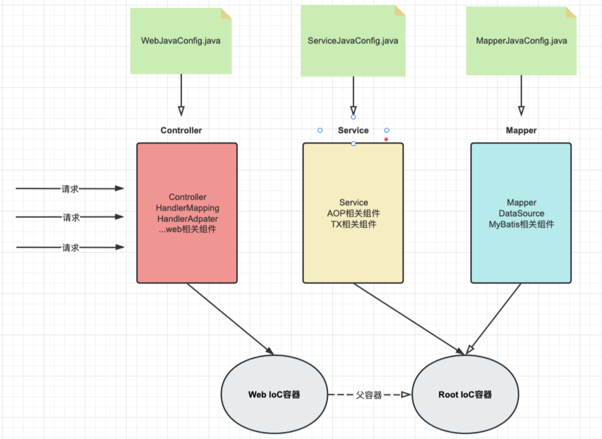
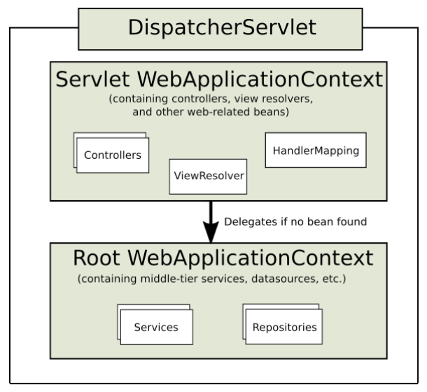
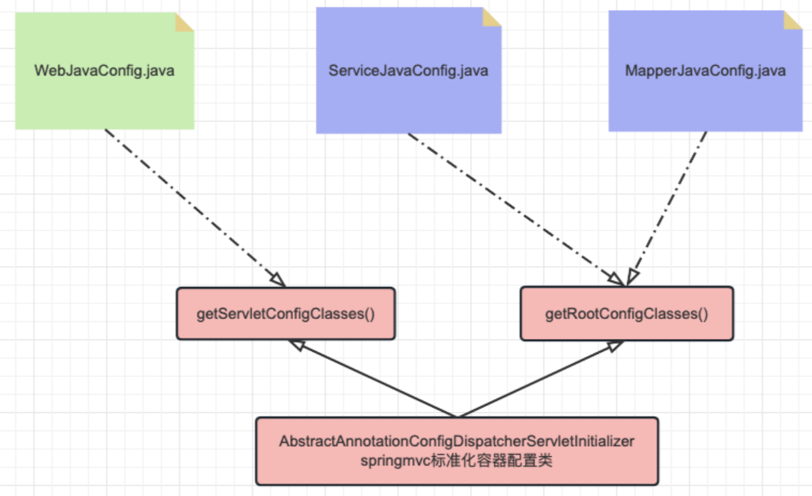
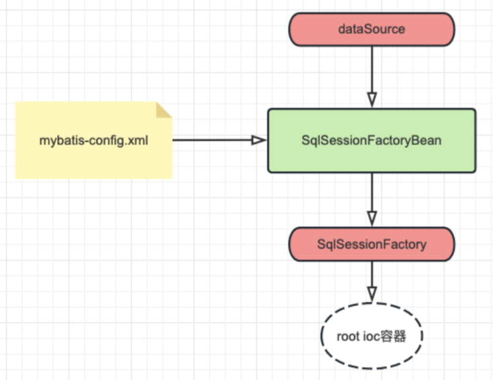
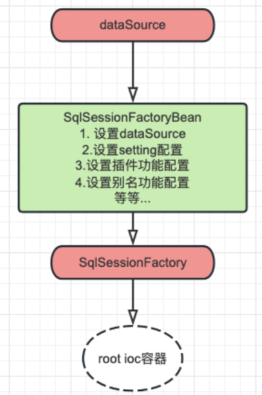

# SSM 整合

**SSM框架内容分为如下几个章节，每个章节对应一个文件：《[Maven](Maven.md)》、《[Spring](Spring.md)》、《[MyBatis](MyBatis.md)》、《[SpringMVC](SpringMVC.md)》、《[SSM整合](SSM整合.md)》、《[SpringBoot](SpringBoot.md)》、《[MyBatis-Plus](MyBatis-Plus.md)》。**


[TOC]

## 第五章：SSM 整合

### 一、SSM 整合理解

#### （1）SSM 整合概述

**微观**：将学习的Spring SpringMVC Mybatis框架应用到项目中：

- SpringMVC 框架负责控制层；
- Spring 框架负责整体和业务层的声明式事务管理；
- MyBatis 框架负责数据库访问层；

**宏观**：Spring 接管一切（将框架核心组件交给 Spring 进行IoC管理），代码更加简洁：

- SpringMVC 管理表述层、SpringMVC 相关组件；
- Spring 管理业务层、持久层、以及数据库相关（DataSource、MyBatis）的组件；
- 使用IoC的方式管理一切所需组件；

**实施**：通过编写配置文件，实现 SpringIoC 容器接管一切组件。

#### （2）SSM 整合核心问题

**SSM 整合需要多少个 IoC 容器？**

两个容器

本质上说，整合就是将三层架构和框架核心API组件交给SpringIoC容器管理。其实一个容器可能就够了，但是我们常见的操作是创建两个IoC容器（web容器和root容器），组件分类管理。

这种做法有以下好处和目的：

1. 分离关注点：通过初始化两个容器，可以将各个层次的关注点进行分离。这种分离使得各个层次的组件能够更好地聚焦于各自的责任和功能；
2. 解耦合：各个层次组件分离装配不同的IoC容器，这样可以进行解耦。这种解耦合使得各个模块可以独立操作和测试，提高了代码的可维护性和可测试性；
3. 灵活配置：通过使用两个容器，可以为每个容器提供各自的配置，以满足不同层次和组件的特定需求。每个配置文件也更加清晰和灵活。

总的来说，初始化两个容器在SSM整合中可以实现关注点分离、解耦合、灵活配置等好处。它们各自负责不同的层次和功能，并通过合适的集成方式协同工作，提供一个高效、可维护和可扩展的应用程序架构。

**每个 IoC 容器对应哪些类型的组件？**



| 容器名   | 盛放组件                                                     |
| -------- | ------------------------------------------------------------ |
| web容器  | web相关组件（controller，springmvc核心组件）                 |
| root容器 | 业务和持久层相关组件（service，aop，tx，dataSource，mybatis，mapper等） |

**IoC 容器之间的关系与调用方向是什么？**

两个无关联 IoC 容器之间的组件无法注入，子 IoC 容器可以单向的注入父 IoC 容器的组件。

web容器是root容器的子容器，父子容器关系：

- 父容器：root容器，盛放service、mapper、mybatis等相关组件；
- 子容器：web容器，盛放controller、web相关组件。

调用流程图解：



**具体配置类的个数与对应容器的关系是什么？**

配置类的数量不是固定的，但是至少要两个，为了方便编写，我们可以三层架构每层对应一个配置类，分别指定两个容器加载即可。

建议配置文件：

| 配置名            | 对应内容                        | 对应容器 |
| ----------------- | ------------------------------- | -------- |
| WebJavaConfig     | controller，springmvc相关       | web容器  |
| ServiceJavaConfig | service，aop，tx相关            | root容器 |
| MapperJavaConfig  | mapper，datasource，mybatis相关 | root容器 |

**IoC 初始化方式与配置位置是什么？**

在web项目下，我们可以选择web.xml和配置类方式进行IoC配置，推荐配置类。

对于使用基于 web 的 Spring 配置的应用程序，建议这样做，如以下示例所示：

```Java
public class MyWebAppInitializer extends AbstractAnnotationConfigDispatcherServletInitializer {

  //指定root容器对应的配置类
  //root容器的配置类
  @Override
  protected Class<?>[] getRootConfigClasses() {
    return new Class<?>[] { ServiceJavaConfig.class,MapperJavaConfig.class };
  }
  
  //指定web容器对应的配置类 webioc容器的配置类
  @Override
  protected Class<?>[] getServletConfigClasses() {
    return new Class<?>[] { WebJavaConfig.class };
  }
  
  //指定dispatcherServlet处理路径，通常为 / 
  @Override
  protected String[] getServletMappings() {
    return new String[] { "/" };
  }
}
```

配置类与容器配置图解：



### 二、SSM 整合配置实战

#### （1）项目准备与依赖添加

数据模型准备：

```mysql
USE lesson;

DROP TABLE IF EXISTS t_emp;

CREATE TABLE `t_emp`(
  emp_id INT AUTO_INCREMENT,
  emp_name CHAR(100),
  emp_salary DOUBLE(10,5),
  PRIMARY KEY(emp_id)
);

INSERT INTO `t_emp`(emp_name,emp_salary) VALUES("tom",200.33);
INSERT INTO `t_emp`(emp_name,emp_salary) VALUES("jerry",666.66);
INSERT INTO `t_emp`(emp_name,emp_salary) VALUES("andy",777.77);
INSERT INTO `t_emp`(emp_name,emp_salary) VALUES("John",888.77);
```

父工程准备：ssm-integration-part；

导入依赖：

```xml
<?xml version="1.0" encoding="UTF-8"?>
<project xmlns:xsi="http://www.w3.org/2001/XMLSchema-instance"
         xmlns="http://maven.apache.org/POM/4.0.0"
         xsi:schemaLocation="http://maven.apache.org/POM/4.0.0 http://maven.apache.org/xsd/maven-4.0.0.xsd">
    <modelVersion>4.0.0</modelVersion>

    <groupId>com.ssh</groupId>
    <artifactId>ssm-integration-part</artifactId>
    <version>1.0-SNAPSHOT</version>
    <packaging>pom</packaging>

    <properties>
        <spring.version>6.0.6</spring.version>
        <jakarta.annotation-api.version>2.1.1</jakarta.annotation-api.version>
        <jakarta.jakartaee-web-api.version>9.1.0</jakarta.jakartaee-web-api.version>
        <jackson-databind.version>2.15.0</jackson-databind.version>
        <hibernate-validator.version>8.0.0.Final</hibernate-validator.version>
        <mybatis.version>3.5.11</mybatis.version>
        <mysql.version>8.0.25</mysql.version>
        <pagehelper.version>5.1.11</pagehelper.version>
        <druid.version>1.2.8</druid.version>
        <mybatis-spring.version>3.0.2</mybatis-spring.version>
        <jakarta.servlet.jsp.jstl-api.version>3.0.0</jakarta.servlet.jsp.jstl-api.version>
        <logback.version>1.2.3</logback.version>
        <lombok.version>1.18.26</lombok.version>
        <maven.compiler.source>17</maven.compiler.source>
        <maven.compiler.target>17</maven.compiler.target>
        <project.build.sourceEncoding>UTF-8</project.build.sourceEncoding>
    </properties>
    <!--
       需要依赖清单分析:
          spring
            ioc/di
              spring-context / 6.0.6
              jakarta.annotation-api / 2.1.1  jsr250
            aop
              spring-aspects / 6.0.6
            tx
              spring-tx  / 6.0.6
              spring-jdbc / 6.0.6

          springmvc
             spring-webmvc 6.0.6
             jakarta.jakartaee-web-api 9.1.0
             jackson-databind 2.15.0
             hibernate-validator / hibernate-validator-annotation-processor 8.0.0.Final

          mybatis
             mybatis  / 3.5.11
             mysql    / 8.0.25
             pagehelper / 5.1.11

          整合需要
             加载spring容器 spring-web / 6.0.6
             整合mybatis   mybatis-spring x x
             数据库连接池    druid / x
             lombok        lombok / 1.18.26
             logback       logback/ 1.2.3
    -->

    <dependencies>
        <!--spring pom.xml依赖-->
        <dependency>
            <groupId>org.springframework</groupId>
            <artifactId>spring-context</artifactId>
            <version>${spring.version}</version>
        </dependency>

        <dependency>
            <groupId>jakarta.annotation</groupId>
            <artifactId>jakarta.annotation-api</artifactId>
            <version>${jakarta.annotation-api.version}</version>
        </dependency>

        <dependency>
            <groupId>org.springframework</groupId>
            <artifactId>spring-aop</artifactId>
            <version>${spring.version}</version>
        </dependency>

        <dependency>
            <groupId>org.springframework</groupId>
            <artifactId>spring-aspects</artifactId>
            <version>${spring.version}</version>
        </dependency>

        <dependency>
            <groupId>org.springframework</groupId>
            <artifactId>spring-tx</artifactId>
            <version>${spring.version}</version>
        </dependency>

        <dependency>
            <groupId>org.springframework</groupId>
            <artifactId>spring-jdbc</artifactId>
            <version>${spring.version}</version>
        </dependency>


        <!--
           springmvc
               spring-webmvc 6.0.6
               jakarta.jakartaee-web-api 9.1.0
               jackson-databind 2.15.0
               hibernate-validator / hibernate-validator-annotation-processor 8.0.0.Final
        -->
        <dependency>
            <groupId>org.springframework</groupId>
            <artifactId>spring-webmvc</artifactId>
            <version>${spring.version}</version>
        </dependency>

        <dependency>
            <groupId>jakarta.platform</groupId>
            <artifactId>jakarta.jakartaee-web-api</artifactId>
            <version>${jakarta.jakartaee-web-api.version}</version>
            <scope>provided</scope>
        </dependency>

        <!-- jsp需要依赖! jstl-->
        <dependency>
            <groupId>jakarta.servlet.jsp.jstl</groupId>
            <artifactId>jakarta.servlet.jsp.jstl-api</artifactId>
            <version>${jakarta.servlet.jsp.jstl-api.version}</version>
        </dependency>

        <dependency>
            <groupId>com.fasterxml.jackson.core</groupId>
            <artifactId>jackson-databind</artifactId>
            <version>${jackson-databind.version}</version>
        </dependency>


        <!-- https://mvnrepository.com/artifact/org.hibernate.validator/hibernate-validator -->
        <dependency>
            <groupId>org.hibernate.validator</groupId>
            <artifactId>hibernate-validator</artifactId>
            <version>${hibernate-validator.version}</version>
        </dependency>
        <!-- https://mvnrepository.com/artifact/org.hibernate.validator/hibernate-validator-annotation-processor -->
        <dependency>
            <groupId>org.hibernate.validator</groupId>
            <artifactId>hibernate-validator-annotation-processor</artifactId>
            <version>${hibernate-validator.version}</version>
        </dependency>


        <!--
          mybatis
               mybatis  / 3.5.11
               mysql    / 8.0.25
               pagehelper / 5.1.11
        -->
        <!-- mybatis依赖 -->
        <dependency>
            <groupId>org.mybatis</groupId>
            <artifactId>mybatis</artifactId>
            <version>${mybatis.version}</version>
        </dependency>

        <!-- MySQL驱动 mybatis底层依赖jdbc驱动实现,本次不需要导入连接池,mybatis自带! -->
        <dependency>
            <groupId>mysql</groupId>
            <artifactId>mysql-connector-java</artifactId>
            <version>${mysql.version}</version>
        </dependency>

        <dependency>
            <groupId>com.github.pagehelper</groupId>
            <artifactId>pagehelper</artifactId>
            <version>${pagehelper.version}</version>
        </dependency>

        <!-- 整合第三方特殊依赖 -->
        <dependency>
            <groupId>org.springframework</groupId>
            <artifactId>spring-web</artifactId>
            <version>${spring.version}</version>
        </dependency>

        <dependency>
            <groupId>org.mybatis</groupId>
            <artifactId>mybatis-spring</artifactId>
            <version>${mybatis-spring.version}</version>
        </dependency>

        <!-- 日志 ， 会自动传递slf4j门面-->
        <dependency>
            <groupId>ch.qos.logback</groupId>
            <artifactId>logback-classic</artifactId>
            <version>${logback.version}</version>
        </dependency>

        <dependency>
            <groupId>org.projectlombok</groupId>
            <artifactId>lombok</artifactId>
            <version>${lombok.version}</version>
        </dependency>

        <dependency>
            <groupId>com.alibaba</groupId>
            <artifactId>druid</artifactId>
            <version>${druid.version}</version>
        </dependency>

    </dependencies>


</project>
```

子工程准备：ssm-integration-1，并转换成WEB项目；

实体类准备：

```java
package com.ssh.pojo;

import lombok.Data;

/**
 * @author 申书航
 * @version 1.0
 */
@Data
public class Employee {

    private Integer empId;
    
    private String empName;

    private Double empSalary;
}
```

日志输出配置文件：`resource/logback.xml`

```xml
<?xml version="1.0" encoding="UTF-8"?>
<configuration debug="true">
    <!-- 指定日志输出的位置，ConsoleAppender表示输出到控制台 -->
    <appender name="STDOUT"
              class="ch.qos.logback.core.ConsoleAppender">
        <encoder>
            <!-- 日志输出的格式 -->
            <!-- 按照顺序分别是：时间、日志级别、线程名称、打印日志的类、日志主体内容、换行 -->
            <pattern>[%d{HH:mm:ss.SSS}] [%-5level] [%thread] [%logger] [%msg]%n</pattern>
            <charset>UTF-8</charset>
        </encoder>
    </appender>

    <!-- 设置全局日志级别。日志级别按顺序分别是：TRACE、DEBUG、INFO、WARN、ERROR -->
    <!-- 指定任何一个日志级别都只打印当前级别和后面级别的日志。 -->
    <root level="DEBUG">
        <!-- 指定打印日志的appender，这里通过“STDOUT”引用了前面配置的appender -->
        <appender-ref ref="STDOUT" />
    </root>

    <!-- 根据特殊需求指定局部日志级别，可也是包名或全类名。 -->
    <logger name="com.ssh.mybatis" level="DEBUG" />

</configuration>
```

#### （2）控制层配置（SpringMVC 整合）

配置类：com.ssh.config/WebMvcJavaConfig

```java
package com.ssh.config;

import org.springframework.context.annotation.ComponentScan;
import org.springframework.context.annotation.Configuration;
import org.springframework.web.servlet.config.annotation.*;

/**
 * @author 申书航
 * @version 1.0
 * 控制层的配置类
 *
 * 1. Controller
 * 2. 全局异常处理器
 * 3. handlerMapping，handlerAdapter
 * 4. 静态资源映射
 * 5. JSP视图解析器前后缀
 * 6. JSON转换器
 * 7. 拦截器
 */
@Configuration
@EnableWebMvc
@ComponentScan("com.ssh.controller")
public class WebMvcJavaConfig implements WebMvcConfigurer {

    // 静态资源映射
    @Override
    public void configureDefaultServletHandling(DefaultServletHandlerConfigurer configurer) {
        configurer.enable();
    }

    // JSP视图解析器前后缀
    @Override
    public void configureViewResolvers(ViewResolverRegistry registry) {
        registry.jsp("/WEB-INF/views/", "jsp");
    }

    // 拦截器
    @Override
    public void addInterceptors(InterceptorRegistry registry) {
//        registry.addInterceptor(new )
//                .addPathPatterns("");
    }
}
```

#### （3）业务层配置（AOP/TX 整合）

配置类：com.ssh.config/ServiceJavaConfig

```java
package com.ssh.config;

import org.springframework.context.annotation.Bean;
import org.springframework.context.annotation.ComponentScan;
import org.springframework.context.annotation.Configuration;
import org.springframework.context.annotation.EnableAspectJAutoProxy;
import org.springframework.jdbc.datasource.DataSourceTransactionManager;
import org.springframework.transaction.TransactionManager;
import org.springframework.transaction.annotation.EnableTransactionManagement;

import javax.sql.DataSource;

/**
 * @author 申书航
 * @version 1.0
 * 业务层配置类：service，AOP，tx等配置
 *
 * 1. service
 * 2. AOP注解支持 aspect
 * 3. 声明式事务管理：对应事务管理器实现，开启事务注解支持
 *
 */
@Configuration
@EnableAspectJAutoProxy
@EnableTransactionManagement
@ComponentScan("com.ssh.service")
public class ServiceJavaConfig {

    @Bean
    public TransactionManager transactionManager(DataSource dataSource) {
        DataSourceTransactionManager dataSourceTransactionManager = new DataSourceTransactionManager();
        dataSourceTransactionManager.setDataSource(dataSource);
        return dataSourceTransactionManager;
    }
}
```

#### （4）持久层配置（MyBatis 整合）

##### 1. MyBatis 整合思路

MyBatis 核心API介绍回顾：

- `SqlSessionFactoryBuilder`

    这个类可以被实例化、使用和丢弃，一旦创建了 `SqlSessionFactory`，就不再需要它了。 
因此 `SqlSessionFactoryBuilder` 实例的最佳作用域是方法作用域（也就是局部方法变量）。 无需 IoC 容器管理。
- `SqlSessionFactory`

    一旦被创建就应该在应用的运行期间一直存在，没有任何理由丢弃它或重新创建另一个实例。 使用 `SqlSessionFactory` 的最佳实践是在应用运行期间不要重复创建多次，因此 `SqlSessionFactory` 的最佳作用域是应用作用域。 需要 IoC 容器管理。
- `SqlSession`

    每个线程都应该有它自己的 `SqlSession` 实例。`SqlSession` 的实例不是线程安全的，因此是不能被共享的，所以它的最佳的作用域是请求或方法作用域。 无需 IoC 容器管理。
- Mapper映射器实例

    映射器是一些绑定映射语句的接口。映射器接口的实例是从 `SqlSession` 中获得的。虽然从技术层面上来讲，任何映射器实例的最大作用域与请求它们的 `SqlSession` 相同。但方法作用域才是映射器实例的最合适的作用域。

    从作用域的角度来说，映射器实例不应该交给 IoC 容器管理。

    但是从使用的角度来说，业务类（service）需要注入mapper接口，所以mapper应该交给 IoC 容器管理。

- 总结
    - 将 `SqlSessionFactory` 实例存储到IoC容器；
    - 将 Mapper 实例存储到IoC容器。

外部数据库连接配置文件：jdbc.properties

```properties
jdbc.username=root
jdbc.password=root
jdbc.url=jdbc:mysql://localhost:3306/lesson
jdbc.driver=com.mysql.cj.jdbc.Driver
```

MyBatis 的 API 实例化需要复杂的过程，过程比较繁琐，为了提高整合效率，MyBatis 提供了提供封装 `SqlSessionFactory` 和Mapper实例化的逻辑的 `FactoryBean` 组件，我们只需要声明和指定少量的配置即可。

- 需要将 `SqlSessionFactory` 和Mapper实例加入到IoC容器；
- 使用 MyBatis 整合包提供的 `FactoryBean` 快速整合。

##### 2. 保留配置文件整合

依然保留 MyBatis 的外部配置文件 `mybatis-config.xml`, 但是数据库连接信息交给Druid连接池配置。缺点是依然需要 `mybatis-config.xml` 文件，进行xml文件解析，效率偏低，不推荐使用。



配置文件：`mybatis-config.xml`

```xml
<?xml version="1.0" encoding="UTF-8" ?>
<!DOCTYPE configuration
        PUBLIC "-//mybatis.org//DTD Config 3.0//EN"
        "http://mybatis.org/dtd/mybatis-3-config.dtd">
<configuration>

    <!-- 数据库连接信息，连接池，Mapper接口包指定无需配置 -->

    <settings>
        <!-- 开启驼峰式映射-->
        <setting name="mapUnderscoreToCamelCase" value="true"/>
        <!-- 开启logback日志输出-->
        <setting name="logImpl" value="SLF4J"/>
        <!--开启resultMap自动映射 -->
        <setting name="autoMappingBehavior" value="FULL"/>
    </settings>

    <typeAliases>
        <!-- 给实体类起别名 -->
        <package name="com.ssh.pojo"/>
    </typeAliases>

    <plugins>
        <plugin interceptor="com.github.pagehelper.PageInterceptor">
            <!--
                helperDialect：分页插件会自动检测当前的数据库链接，自动选择合适的分页方式。
                你可以配置helperDialect属性来指定分页插件使用哪种方言。配置时，可以使用下面的缩写值：
                oracle,mysql,mariadb,sqlite,hsqldb,postgresql,db2,sqlserver,informix,h2,sqlserver2012,derby
                （完整内容看 PageAutoDialect） 特别注意：使用 SqlServer2012 数据库时，
                https://github.com/pagehelper/Mybatis-PageHelper/blob/master/wikis/zh/HowToUse.md#%E5%A6%82%E4%BD%95%E9%85%8D%E7%BD%AE%E6%95%B0%E6%8D%AE%E5%BA%93%E6%96%B9%E8%A8%80
             -->
            <property name="helperDialect" value="mysql"/>
        </plugin>
    </plugins>
</configuration>
```

当你在Spring配置类中添加了`sqlSessionFactoryBean`和`mapperScannerConfigurer`配置方法时，可能会导致`@Value`注解读取不到值为null的问题。这是因为`SqlSessionFactoryBean`和`MapperScannerConfigurer`是基于MyBatis框架的配置，它们的初始化顺序可能会导致属性注入的问题。

`SqlSessionFactoryBean`和`MapperScannerConfigurer`在配置类中通常是用来配置MyBatis相关的Bean，例如数据源、事务管理器、Mapper扫描等。这些配置类通常在`@Configuration`注解下定义，并且使用`@Value`注解来注入属性值。

当配置类被加载时，Spring容器会首先处理Bean的定义和初始化，其中包括`sqlSessionFactoryBean`和`mapperScannerConfigurer`的初始化。在这个过程中，如果`@Value`注解所在的Bean还没有被完全初始化，可能会导致注入的属性值为null。

解决方案：分成两个配置类独立配置，互不影响，数据库提取一个配置类，mybatis提取一个配置类即可解决。

拆分配置：

数据库配置类：

```java
package com.ssh.config;

import com.alibaba.druid.pool.DruidDataSource;
import org.springframework.beans.factory.annotation.Value;
import org.springframework.context.annotation.Bean;
import org.springframework.context.annotation.ComponentScan;
import org.springframework.context.annotation.Configuration;
import org.springframework.context.annotation.PropertySource;

import javax.sql.DataSource;

/**
 * @author 申书航
 * @version 1.0
 */
@Configuration
@PropertySource("classpath:jdbc.properties")
public class DataSourceJavaConfig {

    @Value("${jdbc.url}")
    private String url;

    @Value("${jdbc.username}")
    private String username;

    @Value("${jdbc.password}")
    private String password;

    @Value("${jdbc.driver}")
    private String driver;

    @Bean
    public DataSource dataSource() {
        DruidDataSource dataSource = new DruidDataSource();
        dataSource.setUrl(url);
        dataSource.setUsername(username);
        dataSource.setPassword(password);
        dataSource.setDriverClassName(driver);
        return dataSource;
    }

}
```

MyBatis 配置类：

```java
package com.ssh.config;

import com.alibaba.druid.pool.DruidDataSource;
import org.mybatis.spring.SqlSessionFactoryBean;
import org.mybatis.spring.mapper.MapperScannerConfigurer;
import org.springframework.beans.factory.annotation.Value;
import org.springframework.context.annotation.Bean;
import org.springframework.context.annotation.Configuration;
import org.springframework.context.annotation.PropertySource;
import org.springframework.core.io.ClassPathResource;
import org.springframework.core.io.Resource;

import javax.sql.DataSource;

/**
 * @author 申书航
 * @version 1.0
 * 保留外部配置文件的方法
 * 持久层配置类：连接池，sqlSessionFactory，Mapper代理对象
 *
 * 如果将dataSource和MyBatis的配置文件都放在外部配置文件中，会出现@Value注解无法获取值的问题
 * 这是因为MyBatis的组件优先加载，@Value注解在加载dataSource之前，无法获取值
 * 解决方法：分开配置写到不同的类
 */
@Configuration
public class MapperJavaConfig {

    //将sqlSessionFactory加入到Spring的IOC容器中
    @Bean
    public SqlSessionFactoryBean sqlSessionFactory(DataSource dataSource) {
        SqlSessionFactoryBean sqlSessionFactoryBean = new SqlSessionFactoryBean();

        //指定配置文件等信息：连接池对象，外部MyBatis文件
        sqlSessionFactoryBean.setDataSource(dataSource);
        Resource resource = new ClassPathResource("mybatis-config.xml");
        sqlSessionFactoryBean.setConfigLocation(resource);

        return sqlSessionFactoryBean;
    }

    //将Mapper代理对象加入IoC容器
    @Bean
    public MapperScannerConfigurer mapperScannerConfigurer() {
        //Mapper代理对象的factoryBean
        MapperScannerConfigurer mapperScannerConfigurer = new MapperScannerConfigurer();
        //Mapper接口与mapper.xml文件所在的包的路径
        mapperScannerConfigurer.setBasePackage("com.ssh.mapper");
        return mapperScannerConfigurer;
    }
}
```

##### 3. 完全配置类整合

不在保留mybatis的外部配置文件（xml）, 所有配置信息（settings、插件、别名等）全部在声明 `SqlSessionFactoryBean` 的代码中指定！数据库信息依然使用 `DruidDataSource` 实例替代。优势是全部配置类，避免了XML文件解析效率低问题，推荐使用。



Mapper 配置类：

```java
package com.ssh.config;

import com.github.pagehelper.PageInterceptor;
import org.apache.ibatis.logging.slf4j.Slf4jImpl;
import org.apache.ibatis.session.AutoMappingBehavior;
import org.mybatis.spring.SqlSessionFactoryBean;
import org.mybatis.spring.mapper.MapperScannerConfigurer;
import org.springframework.context.annotation.Bean;
import org.springframework.context.annotation.Configuration;
import org.springframework.core.io.ClassPathResource;
import org.springframework.core.io.Resource;

import javax.sql.DataSource;
import java.util.Properties;

/**
 * @author 申书航
 * @version 1.0
 * 不保留外部配置文件的方法，全部MyBatis配置写到代码中
 * 持久层配置类：连接池，sqlSessionFactory，Mapper代理对象
 *
 */
@Configuration
public class MapperJavaConfigNew {

    //将sqlSessionFactory加入到Spring的IOC容器中
    @Bean
    public SqlSessionFactoryBean sqlSessionFactory(DataSource dataSource) {
        SqlSessionFactoryBean sqlSessionFactoryBean = new SqlSessionFactoryBean();

        //指定配置文件等信息：连接池对象
        sqlSessionFactoryBean.setDataSource(dataSource);

        //指定Mybatis配置文件的功能，使用代码的方式
        org.apache.ibatis.session.Configuration configuration
                = new org.apache.ibatis.session.Configuration();
        //相当于<setting name="mapUnderscoreToCamelCase" value="true"/>
        configuration.setMapUnderscoreToCamelCase(true);
        //相当于日志设置
        configuration.setLogImpl(Slf4jImpl.class);
        //相当于设置自动映射
        configuration.setAutoMappingBehavior(AutoMappingBehavior.FULL);
        sqlSessionFactoryBean.setConfiguration(configuration);

        //相当于别名设置
        sqlSessionFactoryBean.setTypeAliasesPackage("com.ssh.pojo");

        //相当于分页插件配置
        PageInterceptor pageInterceptor = new PageInterceptor();
        Properties properties = new Properties();
        properties.setProperty("helperDialect", "mysql");
        pageInterceptor.setProperties(properties);
        sqlSessionFactoryBean.addPlugins(pageInterceptor);

        return sqlSessionFactoryBean;
    }

    //将Mapper代理对象加入IoC容器
    @Bean
    public MapperScannerConfigurer mapperScannerConfigurer() {
        //Mapper代理对象的factoryBean
        MapperScannerConfigurer mapperScannerConfigurer = new MapperScannerConfigurer();
        //Mapper接口与mapper.xml文件所在的包的路径
        mapperScannerConfigurer.setBasePackage("com.ssh.mapper");
        return mapperScannerConfigurer;
    }
}
```

#### （5）容器初始化配置类

初始化配置类：

```java
package com.ssh.config;

import org.springframework.web.servlet.support.AbstractAnnotationConfigDispatcherServletInitializer;

/**
 * @author 申书航
 * @version 1.0
 * Spring初始化类
 */
public class SpringIoCInit extends AbstractAnnotationConfigDispatcherServletInitializer {

    //rootIoC容器配置类
    @Override
    protected Class<?>[] getRootConfigClasses() {
        return new Class[]{DataSourceJavaConfig.class, MapperJavaConfigNew.class, ServiceJavaConfig.class};
    }

    //WEBIoC容器配置类
    @Override
    protected Class<?>[] getServletConfigClasses() {
        return new Class[]{WebMvcJavaConfig.class};
    }

    //dispatcherServlet的拦截路径
    @Override
    protected String[] getServletMappings() {
        return new String[]{"/"};
    }
}
```

#### （6）整合测试

Mapper 接口：

```java
package com.ssh.mapper;

import com.ssh.pojo.Employee;

import java.util.List;

/**
 * @author 申书航
 * @version 1.0
 */
public interface EmployeeMapper {

    //查询员工全部信息
    List<Employee> queryList();
}
```

Mapper.xml：

```xml
<?xml version="1.0" encoding="UTF-8" ?>
<!DOCTYPE mapper
        PUBLIC "-//mybatis.org//DTD Mapper 3.0//EN"
        "https://mybatis.org/dtd/mybatis-3-mapper.dtd">

<mapper namespace="com.ssh.mapper.EmployeeMapper">

    <select id="queryList" resultType="employee">
        select * from t_emp;
    </select>

</mapper>
```

Service 层：

```java
package com.ssh.service;

import com.ssh.pojo.Employee;

import java.util.List;

/**
 * @author 申书航
 * @version 1.0
 */
public interface EmployeeService {

    List<Employee> findAll();
}
```

Service 实现类：

```java
package com.ssh.service.impl;

import com.ssh.mapper.EmployeeMapper;
import com.ssh.pojo.Employee;
import com.ssh.service.EmployeeService;
import org.springframework.beans.factory.annotation.Autowired;
import org.springframework.stereotype.Service;

import java.util.List;

/**
 * @author 申书航
 * @version 1.0
 */
@Service
public class EmployeeServiceImpl implements EmployeeService {

    @Autowired
    private EmployeeMapper employeeMapper;

    @Override
    public List<Employee> findAll() {
        List<Employee> employees = employeeMapper.queryList();
        return employees;
    }
}
```

Controller 层：

```java
package com.ssh.controller;

import com.ssh.pojo.Employee;
import com.ssh.service.EmployeeService;
import org.springframework.beans.factory.annotation.Autowired;
import org.springframework.stereotype.Controller;
import org.springframework.web.bind.annotation.GetMapping;
import org.springframework.web.bind.annotation.RequestMapping;
import org.springframework.web.bind.annotation.RestController;

import java.util.List;

/**
 * @author 申书航
 * @version 1.0
 */
@RestController
@RequestMapping("emp")
public class EmployeeController {

    @Autowired
    private EmployeeService employeeService;

    @GetMapping("find")
    public List<Employee> find() {
        List<Employee> employees = employeeService.findAll();
        return employees;
    }
}
```

搭建环境测试访问地址即可。

### 三、前后端整合实战

#### （1）前端程序搭建与运行

##### 1. 前端工程导入

Node.js 是前端程序运行的服务器，类似 Java 程序运行的服务器Tomcat；Npm 是前端依赖包管理工具，类似 Maven 依赖管理工具软件。

安装 Node.js 16.16.0 版本：

1. 官网： https://nodejs.org/en/ 
2. 下载后双击.exe文件进行安装，指定安装地址，其他下一步即可；
3. 安装完成后，可以在cmd命令行终端输入 `node -v` 和 `npm -v` 查看 Node.js 和 npm 的版本号。

NPM 全称Node Package Manager，是Node.js包管理工具，是全球最大的模块生态系统，里面所有的模块都是开源免费的；也是Node.js的包管理工具，相当于后端的Maven 。

配置阿里镜像：

```bash
npm config set registry https://registry.npmjs.org/
```

更新 NMP 版本：Node16.16.0对应的npm版本过低，需要升级，更新成9.6.6

```bash
npm install -g npm@9.6.6
```

npm 依赖下载命令：

```bash
npm install 依赖名 / npm install 依赖名@版本
```

##### 2. 前端工程导入

下载前端代码，解压后用 VSCode 打开文件夹，然后启动测试：

```bash
npm install //安装依赖
npm run dev //运行测试
```

接口分析：

1. 学习计划分页查询

```Java
/* 
需求说明
    查询全部数据页数据
请求uri
    schedule/{pageSize}/{currentPage}
请求方式 
    get   
响应的json
    {
        "code":200,
        "flag":true,
        "data":{
            //本页数据
            data:
            [
            {id:1,title:'学习java',completed:true},
            {id:2,title:'学习html',completed:true},
            {id:3,title:'学习css',completed:true},
            {id:4,title:'学习js',completed:true},
            {id:5,title:'学习vue',completed:true}
            ], 
            //分页参数
            pageSize:5, // 每页数据条数 页大小
            total:0 ,   // 总记录数
            currentPage:1 // 当前页码
        }
    }
*/
```
2. 学习计划删除

```Java
/* 
需求说明
    根据id删除日程
请求uri
    schedule/{id}
请求方式 
    delete
响应的json
    {
        "code":200,
        "flag":true,
        "data":null
    }
*/
```
3. 学习计划保存

```Java
/* 
需求说明
    增加日程
请求uri
    schedule
请求方式 
    post
请求体中的JSON
    {
        title: '',
        completed: false
    }
响应的json
    {
        "code":200,
        "flag":true,
        "data":null
    }
*/
```
4. 学习计划修改

```Java
/* 
需求说明
    根据id修改数据
请求uri
    schedule
请求方式 
    put
请求体中的JSON
    {
        id: 1,
        title: '',
        completed: false
    }
响应的json
    {
        "code":200,
        "flag":true,
        "data":null
    }
*/
```

#### （2）后端程序实现与测试

##### 1. 项目准备

准备子工程：ssm-integration-todolist-2

数据库脚本：

```sql
USE lesson;

DROP TABLE IF EXISTS schedule;
CREATE TABLE schedule (
  id INT NOT NULL AUTO_INCREMENT,
  title VARCHAR(255) NOT NULL,
  completed BOOLEAN NOT NULL,
  PRIMARY KEY (id)
);

INSERT INTO schedule (title, completed)
VALUES
    ('学习java', true),
    ('学习Python', false),
    ('学习C++', true),
    ('学习JavaScript', false),
    ('学习HTML5', true),
    ('学习CSS3', false),
    ('学习Vue.js', true),
    ('学习React', false),
    ('学习Angular', true),
    ('学习Node.js', false),
    ('学习Express', true),
    ('学习Koa', false),
    ('学习MongoDB', true),
    ('学习MySQL', false),
    ('学习Redis', true),
    ('学习Git', false),
    ('学习Docker', true),
    ('学习Kubernetes', false),
    ('学习AWS', true),
    ('学习Azure', false);

```

实体类：

```java
package com.ssh.pojo;

import lombok.Data;

/**
 * @author 申书航
 * @version 1.0
 * 计划实体类
 */
@Data
public class Schedule {

    private Integer id;

    private String title;

    private Boolean completed;
}
```

结果返回封装类：

```java
package com.ssh.utils;


/**
 * @author 申书航
 * @version 1.0
 * 返回结果封装类
 */
public class R {

    private int code = 200; //200成功状态码

    private boolean flag = true; //返回状态

    private Object data;  //返回具体数据


    public  static R ok(Object data){
        R r = new R();
        r.data = data;
        return r;
    }

    public static R  fail(Object data){
        R r = new R();
        r.code = 500; //错误码
        r.flag = false; //错误状态
        r.data = data;
        return r;
    }


    public int getCode() {
        return code;
    }

    public void setCode(int code) {
        this.code = code;
    }

    public boolean isFlag() {
        return flag;
    }

    public void setFlag(boolean flag) {
        this.flag = flag;
    }

    public Object getData() {
        return data;
    }

    public void setData(Object data) {
        this.data = data;
    }
}
```

分页工具类：

```java
package com.ssh.utils;

import lombok.AllArgsConstructor;
import lombok.Data;
import lombok.NoArgsConstructor;

import java.util.List;

/**
 * @author 申书航
 * @version 1.0
 */
@Data
@NoArgsConstructor
@AllArgsConstructor
public class PageBean<T> {
    private int currentPage;   // 当前页码

    private int pageSize;      // 每页显示的数据量

    private long total;    // 总数据条数

    private List<T> data;      // 当前页的数据集合
}
```

数据库外部配置文件：`jdbc.properties`

```properties
jdbc.username=root
jdbc.password=root
jdbc.url=jdbc:mysql://localhost:3306/lesson
jdbc.driver=com.mysql.cj.jdbc.Driver
```

日志配置文件：`logback.xml`

```xml
<?xml version="1.0" encoding="UTF-8"?>
<configuration debug="true">
    <!-- 指定日志输出的位置，ConsoleAppender表示输出到控制台 -->
    <appender name="STDOUT"
              class="ch.qos.logback.core.ConsoleAppender">
        <encoder>
            <!-- 日志输出的格式 -->
            <!-- 按照顺序分别是：时间、日志级别、线程名称、打印日志的类、日志主体内容、换行 -->
            <pattern>[%d{HH:mm:ss.SSS}] [%-5level] [%thread] [%logger] [%msg]%n</pattern>
            <charset>UTF-8</charset>
        </encoder>
    </appender>

    <!-- 设置全局日志级别。日志级别按顺序分别是：TRACE、DEBUG、INFO、WARN、ERROR -->
    <!-- 指定任何一个日志级别都只打印当前级别和后面级别的日志。 -->
    <root level="DEBUG">
        <!-- 指定打印日志的appender，这里通过“STDOUT”引用了前面配置的appender -->
        <appender-ref ref="STDOUT" />
    </root>

    <!-- 根据特殊需求指定局部日志级别，可也是包名或全类名。 -->
    <logger name="com.ssh.mybatis" level="DEBUG" />

</configuration>
```

**各种配置类与前一节相同，此处省略：`WebMvcJavaConfig`，`DataSourceJavaConfig`，`ServiceJavaConfig`，`MapperJavaConfigNew`，`SpringMvcInit` 5个配置类。**

##### 2. 功能实现

参数校验实体类更改：

```java
package com.ssh.pojo;

import jakarta.validation.constraints.NotBlank;
import jakarta.validation.constraints.NotNull;
import lombok.Data;

/**
 * @author 申书航
 * @version 1.0
 * 计划实体类
 */
@Data
public class Schedule {

    private Integer id;

    @NotBlank
    private String title;

    @NotNull
    private Boolean completed;
}
```

Controller 层：

```java
package com.ssh.controller;

import com.ssh.pojo.Schedule;
import com.ssh.service.ScheduleService;
import com.ssh.utils.R;
import lombok.extern.slf4j.Slf4j;
import org.springframework.beans.factory.annotation.Autowired;
import org.springframework.validation.BindingResult;
import org.springframework.validation.annotation.Validated;
import org.springframework.web.bind.annotation.*;

/**
 * @author 申书航
 * @version 1.0
 */
@CrossOrigin  //解决跨域问题，允许其他源访问Controller
@RestController
@RequestMapping("schedule")
@Slf4j  //日志输出格式
public class ScheduleController {

    @Autowired
    private ScheduleService scheduleService;

    @GetMapping("/{pageSize}/{currentPage}")
    public R page(@PathVariable int pageSize,
                  @PathVariable int currentPage) {
        R r = scheduleService.page(pageSize, currentPage);

        //slf4j
        log.info("查询的数据为：{}", r);

        System.out.println("r = " + r);
        return r;
    }

    @DeleteMapping("/{id}")
    public R remove(@PathVariable Integer id) {
        R r = scheduleService.remove(id);
        //slf4j
        log.info("删除的数据为：{}", r);
        return r;
    }

    @PostMapping
    public R save(@Validated @RequestBody Schedule schedule,
                  BindingResult bindingResult) {
        if (bindingResult.hasErrors()) {
            return R.fail("参数为空，不能保存！");
        }

        R r = scheduleService.save(schedule);
        return r;

    }

    @PutMapping
    public R update(@Validated @RequestBody Schedule schedule,
                  BindingResult bindingResult) {
        if (bindingResult.hasErrors()) {
            return R.fail("参数为空，不能修改！");
        }

        R r = scheduleService.update(schedule);
        return r;

    }
}
```

Service 接口：

```java
package com.ssh.service;

import com.ssh.pojo.Schedule;
import com.ssh.utils.R;
import org.springframework.stereotype.Service;

/**
 * @author 申书航
 * @version 1.0
 */
@Service
public interface ScheduleService {

    //分页查询
    R page(int pageSize, int currentPage);

    //删除
    R remove(Integer id);

    //保存（插入）
    R save(Schedule schedule);

    //修改
    R update(Schedule schedule);
}
```

Service 实现类：

```java
package com.ssh.service.impl;

import com.github.pagehelper.PageHelper;
import com.github.pagehelper.PageInfo;
import com.ssh.mapper.ScheduleMapper;
import com.ssh.pojo.Schedule;
import com.ssh.service.ScheduleService;
import com.ssh.utils.PageBean;
import com.ssh.utils.R;
import org.springframework.beans.factory.annotation.Autowired;
import org.springframework.stereotype.Service;

import java.util.List;

/**
 * @author 申书航
 * @version 1.0
 */
@Service
public class ScheduleServiceImpl implements ScheduleService {

    @Autowired
    private ScheduleMapper scheduleMapper;

    @Override
    public R page(int pageSize, int currentPage) {
        //分页
        PageHelper.startPage(currentPage, pageSize);

        //查询
        List<Schedule> scheduleList = scheduleMapper.queryList();

        //分页数据装配
        PageInfo<Schedule> info = new PageInfo<>(scheduleList);
        PageBean<Schedule> pageBean = new PageBean<>(currentPage, pageSize, info.getTotal(), info.getList());
        R ok = R.ok(pageBean);

        return ok;
    }

    @Override
    public R remove(Integer id) {
        int rows = scheduleMapper.deleteById(id);

        if (rows > 0) {
            return R.ok(null);
        }
        return R.fail(null);
    }

    @Override
    public R save(Schedule schedule) {
        int rows = scheduleMapper.insert(schedule);

        if (rows > 0) {
            return R.ok(null);
        }

        return R.fail(null);
    }

    @Override
    public R update(Schedule schedule) {
        //判断id不能为null
        if (schedule.getId() == null) {
            return R.fail("id不能为空");
        }

        int rows = scheduleMapper.update(schedule);

        if (rows > 0) {
            return R.ok(null);
        }

        return R.fail(null);
    }
}
```

Mapper 接口：

```java
package com.ssh.mapper;

import com.ssh.pojo.Schedule;

import java.util.List;

/**
 * @author 申书航
 * @version 1.0
 */
public interface ScheduleMapper {

	//分页查询
    List<Schedule> queryList();

    //根据ID删除数据
    int deleteById(Integer id);

    //插入数据
    int insert(Schedule schedule);

    //修改数据
    int update(Schedule schedule);
}
```

`ScheduleMapper.xml`：

```xml
<?xml version="1.0" encoding="UTF-8" ?>
<!DOCTYPE mapper
        PUBLIC "-//mybatis.org//DTD Mapper 3.0//EN"
        "https://mybatis.org/dtd/mybatis-3-mapper.dtd">

<mapper namespace="com.ssh.mapper.ScheduleMapper">

    <select id="queryList" resultType="schedule">
        select * from schedule
    </select>

    <delete id="deleteById">
        delete from schedule where id = #{id}
    </delete>

    <insert id="insert">
        insert into schedule (title, completed) values (#{title}, #{completed});
    </insert>

    <update id="update">
        update schedule set title = #{title}, completed = #{completed} where id = #{id}
    </update>

</mapper>
```

在 Postman 访问测试即可。

##### 3. 前后端连调

为解决跨域问题，需要在 Controller 层加 `@CrossOrigin` 注解，才能使前端数据访问后端数据。

后端部署服务器，前端控制台访问运行 `npm run dev` 命令，启动访问 http://127.0.0.1:5173/#/，即可进行操作。


**Spring 框架后续内容见：《[SpringBoot](SpringBoot.md)》……**

