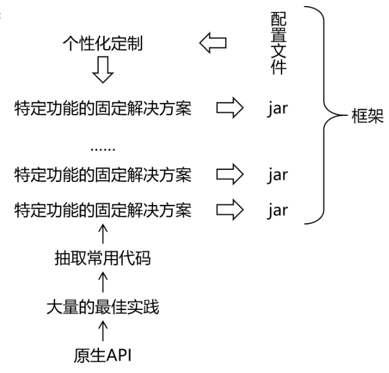
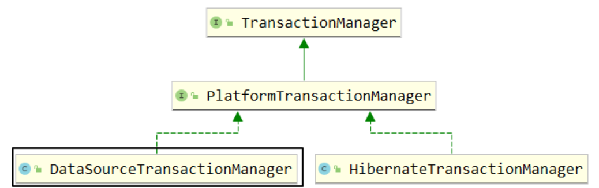

# Spring 框架

**SSM框架内容分为如下几个章节，每个章节对应一个文件：《[Maven](Maven.md)》、《[Spring](Spring.md)》、《[MyBatis](MyBatis.md)》、《[SpringMVC](SpringMVC.md)》、《[SSM整合](SSM整合.md)》、《[SpringBoot](SpringBoot.md)》、《[MyBatis-Plus](MyBatis-Plus.md)》。**


[TOC]

## 第二章：Spring 框架

### 一、Spring 框架概述

#### （1）总体技术体系

##### 1. 架构的分类

单一架构：一个项目，一个工程，导出为一个 war 包，在一个 Tomcat 上运行。


单一架构，项目主要应用技术框架为：Spring , SpringMVC , Mybatis，即 SSM。

分布式架构：一个项目（对应 IDEA 中的一个 project），拆分成很多个模块，每个模块是一个 IDEA 中的一个 module。每一个工程都是运行在自己的 Tomcat 上。模块之间可以互相调用。每一个模块内部可以看成是一个单一架构的应用。


分布式架构，项目主要应用技术框架：SpringBoot (SSM), SpringCloud , 中间件等。

##### 2. 框架的概念

框架（Framework）是一个集成了基本结构、规范、设计模式、编程语言和程序库等基础组件的软件系统，它可以用来构建更高级别的应用程序。框架的设计和实现旨在解决特定领域中的常见问题，帮助开发人员更高效、更稳定地实现软件开发目标。

**框架的优点：**

- 提高开发效率：框架提供了许多预先设计好了的组件和工具，能够帮助开发人员快速进行开发。相较于传统手写代码，在框架提供的规范化环境中，开发者可以更快地实现项目的各种要求。
- 降低开发成本：框架的提供标准化的编程语言、数据操作等代码片段，避免了重复开发的问题，降低了开发成本，提供深度优化的系统，降低了维护成本，增强了系统的可靠性。
- 提高应用程序的稳定性：框架通常经过了很长时间的开发和测试，其中的许多组件、代码片段和设计模式都得到了验证。重复利用这些组件有助于减少bug的出现，从而提高了应用程序的稳定性。
- 提供标准化的解决方案：框架通常是针对某个特定领域的，通过提供标准化的解决方案，可以为开发人员提供一种共同的语言和思想基础，有助于更好地沟通和协作。

**框架的缺点：**

- 学习成本高：框架通常具有特定的语言和编程范式。对于开发人员而言，需要花费时间学习其背后的架构、模式和逻辑，这对于新手而言可能会耗费较长时间。
- 可能存在局限性：虽然框架提高了开发效率并可以帮助开发人员解决常见问题，但是在某些情况下，特定的应用需求可能超出框架的范围，从而导致应用程序无法满足要求。开发人员可能需要更多的控制权和自由度，同时需要在框架和应用程序之间进行权衡取舍。
- 版本变更和兼容性问题：框架的版本发布和迭代通常会导致代码库的大规模变更，进而导致应用程序出现兼容性问题和漏洞。当框架变更时，需要考虑框架是否向下兼容，以及如何进行适当的测试、迁移和升级。
- 架构风险：框架涉及到很多抽象和概念，如果开发者没有足够的理解和掌握其架构，可能会导致系统出现设计和架构缺陷，从而影响系统的健康性和安全性。

站在文件结构的角度理解框架，可以将框架总结：**框架 = jar 包+配置文件**



框架已经对基础的代码进行了封装并提供相应的API，开发者在使用框架是直接调用封装好的API可以省去很多代码编写，从而提高工作效率和开发速度。

#### （2）Spring 概述

##### 1. Spring 与 SpringFramework

Spring 是分层的 JavaSE/EE 应用 full-stack 轻量级开源框架，以 IoC（Inverse Of Control：控制反转）和 AOP（Aspect Oriented Programming：面向切面编程）为内核提供了展现层 SpringMVC 和持久层 Spring JDBC 以及业务层事务管理等众多的企业级应用技术，还能整合众多著名的第三方框架和类库，逐渐成为使用最多的 Java EE 企业应用开源框架。

[Spring 官网](https://spring.io/projects)

广义上的 Spring 泛指以 SpringFramework 为基础的 Spring 技术栈。

经过十多年的发展，Spring 已经不再是一个单纯的应用框架，而是逐渐发展成为一个由多个不同子项目（模块）组成的成熟技术，例如 Spring Framework、Spring MVC、SpringBoot、Spring Cloud、Spring Data、Spring Security 等，其中 Spring Framework 是其他子项目的基础。

这些子项目涵盖了从企业级应用开发到云计算等各方面的内容，能够帮助开发人员解决软件发展过程中不断产生的各种实际问题，给开发人员带来了更好的开发体验。

狭义的 Spring 特指 Spring Framework，通常我们将它称为 Spring 框架。

Spring Framework（Spring框架）是一个开源的应用程序框架，由SpringSource公司开发，最初是为了解决企业级开发中各种常见问题而创建的。它提供了很多功能，例如：依赖注入（Dependency Injection）、面向切面编程（AOP）、声明式事务管理（TX）等。其主要目标是使企业级应用程序的开发变得更加简单和快速，并且Spring框架被广泛应用于Java企业开发领域。

Spring全家桶的其他框架都是以SpringFramework框架为基础。

##### 2. Spring 体系

SpringFramework框架结构图：


| 功能模块       | 功能介绍                                                    |
| -------------- | ----------------------------------------------------------- |
| Core Container | 核心容器，在 Spring 环境下使用任何功能都必须基于 IOC 容器。 |
| AOP&Aspects    | 面向切面编程                                                |
| TX             | 声明式事务管理。                                            |
| Spring MVC     | 提供了面向Web应用程序的集成功能。                           |

##### 3. Spring 的优势

**Spring 的优势：**

- 方便解耦，简化开发：通过 Spring 提供的 IoC 容器，可以将对象间的依赖关系交由 Spring 进行控制，避免硬编码所造成的过度程序耦合。用户也不必再为单例模式类、属性文件解析等这些很底层的需求编写代码，可以更专注于上层的应用。
- AOP 编程的支持：通过 Spring 的 AOP 功能，方便进行面向切面的编程，许多不容易用传统 OOP 实现的功能可以通过 AOP 轻松应付。
- 声明式事务的支持：可以将我们从单调烦闷的事务管理代码中解脱出来，通过声明式方式灵活的进行事务的管理，提高开发效率和质量。
- 方便程序的测试：可以用非容器依赖的编程方式进行几乎所有的测试工作，测试不再是昂贵的操作，而是随手可做的事情。
- 方便集成各种优秀框架：Spring 可以降低各种框架的使用难度，提供了对各种优秀框架（Struts、Hibernate、Hessian、Quartz等）的直接支持。
- 降低 JavaEE API 的使用难度：Spring 对 JavaEE API（如 JDBC、JavaMail、远程调用等）进行了薄薄的封装层，使这些 API 的使用难度大为降低。
- Java 源码是经典学习范例：Spring 的源代码设计精妙、结构清晰、匠心独用，处处体现着大师对 Java 设计模式灵活运用以及对 Java 技术的高深造诣。它的源代码无意是 Java 技术的最佳实践的范例。

**SpringFramework 的优点：**

- 丰富的生态系统：Spring 生态系统非常丰富，支持许多模块和库，如 Spring Boot、Spring Security、Spring Cloud 等等，可以帮助开发人员快速构建高可靠性的企业应用程序。
- 模块化的设计：框架组件之间的松散耦合和模块化设计使得 Spring Framework 具有良好的可重用性、可扩展性和可维护性。开发人员可以轻松地选择自己需要的模块，根据自己的需求进行开发。
- 简化 Java 开发：Spring Framework 简化了 Java 开发，提供了各种工具和 API，可以降低开发复杂度和学习成本。同时，Spring Framework 支持各种应用场景，包括 Web 应用程序、RESTful API、消息传递、批处理等等。
- 不断创新和发展：Spring Framework 开发团队一直在不断创新和发展，保持与最新技术的接轨，为开发人员提供更加先进和优秀的工具和框架。

因此，这些优点使得 Spring Framework 成为了一个稳定、可靠、且创新的框架，为企业级 Java 开发提供了一站式的解决方案。

Spring 使创建 Java 企业应用程序变得容易。它提供了在企业环境中采用 Java 语言所需的一切，支持 Groovy 和 Kotlin 作为 JVM 上的替代语言，并且可以根据应用程序的需求灵活地创建多种架构。从Spring Framework 6.0.6开始，Spring 需要 Java 17+。

### 二、SpringIoC 容器

#### （1）组件与组件管理

##### 1. 组件的概念

一个项目就是由各种组件搭建而成的：


##### 2. Spring 管理组件（Ioc）

IoC（Inversion of Control）是控制反转的意思，IoC 主要是针对对象的创建和调用控制而言的，也就是说，当应用程序需要使用一个对象时，不再是应用程序直接创建该对象，而是由 IoC 容器来创建和管理，即控制权由应用程序转移到 IoC 容器中，也就是“反转”了控制权。这种方式基本上是通过依赖查找的方式来实现的，即 IoC 容器维护着构成应用程序的对象，并负责创建这些对象。

组件可以完全交给 Spring 框架进行管理，Spring框架替代了程序员原有的 new 对象和对象属性赋值动作等。

Spring 具体的组件管理动作包含：

- 组件对象实例化；
- 组件属性属性赋值；
- 组件对象之间引用；
- 组件对象存活周期管理；
- ......

我们只需要编写元数据（配置文件）告知 Spring 管理哪些类组件和他们的关系即可。

注意：组件是映射到应用程序中所有可重用组件的 Java 对象，应该是可复用的功能对象。

- 组件一定是对象；
- 对象不一定是组件。

综上所述，Spring 充当一个组件容器，创建、管理、存储组件，减少了我们的编码压力，让我们更加专注进行业务编写。

**Spring 管理组件的优点：**

- 降低了组件之间的耦合性：Spring IoC 容器通过依赖注入机制，将组件之间的依赖关系削弱，减少了程序组件之间的耦合性，使得组件更加松散地耦合；
- 提高了代码的可重用性和可维护性：将组件的实例化过程、依赖关系的管理等功能交给 Spring IoC容器处理，使得组件代码更加模块化、可重用、更易于维护；
- 方便了配置和管理：Spring IoC容器通过XML文件或者注解，轻松的对组件进行配置和管理，使得组件的切换、替换等操作更加的方便和快捷；
- 交给 Spring 管理的对象（组件），方可享受 Spring 框架的其他功能（AOP，声明事务管理）等。

#### （2）SpringIoC 容器及其实现

##### 1. 普通容器与复杂容器

普通容器：数组，集合等只能用来存储数据，没有更多功能；

复杂容器：Servlet 容器能够管理 Servlet（init,service,destroy）、Filter、Listener 这样的组件，有更多功能，这样的容器为复杂容器。

| 名称       | 时机                                                         | 次数 |
| ---------- | ------------------------------------------------------------ | ---- |
| 创建对象   | 默认情况：接收到第一次请求  修改启动顺序后：Web应用启动过程中 | 一次 |
| 初始化操作 | 创建对象之后                                                 | 一次 |
| 处理请求   | 接收到请求                                                   | 多次 |
| 销毁操作   | Web应用卸载之前                                              | 一次 |

SpringIoC 容器也是一个复杂容器。它们不仅要负责创建组件的对象、存储组件的对象，还要负责调用组件的方法让它们工作，最终在特定情况下销毁组件。

Spring 管理组件的容器，就是一个复杂容器，不仅存储组件，也可以管理组件之间依赖关系，并且创建和销毁组件等。

##### 2. SpringIoC 容器简介

SpringIoC 容器，负责实例化、配置和组装 bean（组件）。容器通过读取配置元数据来获取有关要实例化、配置和组装组件的指令。配置元数据以 XML、Java 注解或 Java 代码形式表现。它允许表达组成应用程序的组件以及这些组件之间丰富的相互依赖关系。

Spring 容器工作原理的高级视图：


应用程序类与配置元数据相结合，您拥有完全配置且可执行的系统或应用程序。

##### 3. SpringIoC 容器接口

`BeanFactory` 接口提供了一种高级配置机制，能够管理任何类型的对象，它是 SpringIoC 容器标准化超接口。

`ApplicationContext` 是 `BeanFactory` 的子接口。它扩展了以下功能：

- 更容易与 Spring 的 AOP 功能集成；
- 消息资源处理（用于国际化）；
- 特定于应用程序给予此接口实现，例如Web 应用程序的 `WebApplicationContext`。

简而言之， `BeanFactory` 提供了配置框架和基本功能，而 `ApplicationContext` 添加了更多特定于企业的功能。 `ApplicationContext` 是 `BeanFactory` 的完整超集。

**ApplicationContext容器实现类**：

| 类型名                               | 简介                                                         |
| ------------------------------------ | ------------------------------------------------------------ |
| `ClassPathXmlApplicationContext`     | 通过读取类路径下的 XML 格式的配置文件创建 IOC 容器对象       |
| `FileSystemXmlApplicationContext`    | 通过文件系统路径读取 XML 格式的配置文件创建 IOC 容器对象（该 `xml` 文件存储在项目外的目录） |
| `AnnotationConfigApplicationContext` | 通过读取 Java 配置类创建 IOC 容器对象                        |
| `WebApplicationContext`              | 专门为 Web 应用准备，基于 Web 环境创建 IOC 容器对象，并将对象引入存入 ServletContext 域中。 |

##### 4. 容器管理配置方式

SpringIoC 容器使用多种形式的配置元数据。此配置元数据表示您作为应用程序开发人员如何告诉 Spring 容器实例化、配置和组装应用程序中的对象。

Spring框架提供了多种配置方式：XML配置方式、注解方式和 Java 配置类方式

- XML配置方式：是Spring框架最早的配置方式之一，通过在XML文件中定义Bean及其依赖关系、Bean的作用域等信息，让Spring IoC容器来管理Bean之间的依赖关系。该方式从Spring框架的第一版开始提供支持。
- 注解方式：从Spring 2.5版本开始提供支持，可以通过在Bean类上使用注解来代替XML配置文件中的配置信息。通过在Bean类上加上相应的注解（如@Component, @Service, @Autowired等），将Bean注册到Spring IoC容器中，这样Spring IoC容器就可以管理这些Bean之间的依赖关系。
- Java配置类方式：从Spring 3.0版本开始提供支持，通过Java类来定义Bean、Bean之间的依赖关系和配置信息，从而代替XML配置文件的方式。Java配置类是一种使用Java编写配置信息的方式，通过@Configuration、@Bean等注解来实现Bean和依赖关系的配置。

当前主要使用配置类+注解方式为主。

##### 5. DI 的概念

依赖注入（DI：Dependency Injection），是指在组件之间传递依赖关系的过程中，将依赖关系在容器内部进行处理，这样就不必在应用程序代码中硬编码对象之间的依赖关系，实现了对象之间的解耦合。在 Spring 中，DI 是通过 XML 配置文件或注解的方式实现的。它提供了三种形式的依赖注入：构造函数注入、`Setter` 方法注入和接口注入。

IOC的作用：降低程序间的耦合（依赖关系）；

DI的作用：依赖关系的管理，依赖都交给spring来维护。

在当前类需要用到其他类的对象，由 Spring 为我们提供，我们只需要在配置文件中说明。

### 三、SpringIoC 的实践应用

#### （1）SpringIoC / DI 的实现步骤

1. **配置元数据（配置）**

	配置元数据，既是编写交给SpringIoC容器管理组件的信息，配置方式有三种。

	基于 XML 的配置元数据的基本结构：

	```xml
	<bean id="组件对象的标识" [1] class="该类的全限定符" [2]>  
		<!-- Bean的配置信息 -->
	</bean>
	```

```XML
<?xml version="1.0" encoding="UTF-8"?>
<!-- 此处要添加一些约束，配置文件的标签并不是随意命名 -->
<beans xmlns="http://www.springframework.org/schema/beans"
  xmlns:xsi="http://www.w3.org/2001/XMLSchema-instance"
  xsi:schemaLocation="http://www.springframework.org/schema/beans
    https://www.springframework.org/schema/beans/spring-beans.xsd">

  <bean id="..." [1] class="..." [2]>  
    <!-- Bean的配置信息 -->
  </bean>

  <bean id="..." class="...">
    <!-- Bean的配置信息 -->
  </bean>
  <!-- 更多 bean 定义 -->
</beans>
```

Spring IoC 容器管理一个或多个组件。这些 组件是使用你提供给容器的配置元数据（例如，以 XML `<bean/>` 定义的形式）创建的。

`<bean />` 标签 == 组件信息声明。

- `id` 属性是标识单个 Bean 定义的字符串。
- `class` 属性定义 Bean 的类型并使用完全限定的类名。

2. **实例化IoC容器**

	提供给 `ApplicationContext` 构造函数的位置路径是资源字符串地址，允许容器从各种外部资源（如本地文件系统、Java `CLASSPATH` 等）加载配置元数据。

	我们应该选择一个合适的容器实现类，进行 IoC 容器的实例化工作：

```Java
//实例化ioc容器,读取外部配置文件,最终会在容器内进行ioc和DI动作
ApplicationContext context = 
           new ClassPathXmlApplicationContext("services.xml", "daos.xml");
```

3. **获取Bean（组件）**

	`ApplicationContext` 是一个高级工厂的接口，能够维护不同 bean 及其依赖项的注册表。通过使用方法 `T getBean(String name, Class<T> requiredType)` ，您可以检索 bean 的实例。

	允许读取 Bean 定义并访问它们，如以下示例所示：

```Java
//创建ioc容器对象，指定配置文件，ioc也开始实例组件对象
ApplicationContext context = new ClassPathXmlApplicationContext("services.xml", "daos.xml");
//获取ioc容器的组件对象
PetStoreService service = context.getBean("petStore", PetStoreService.class);
//使用组件对象
List<String> userList = service.getUsernameList();
```

#### （2）基于 XML 配置方式组件管理

##### 1. 组件信息声明配置（IoC）

Spring IoC 容器管理一个或多个 bean。这些 Bean 是使用您提供给容器的配置元数据创建的（例如，以 XML `<bean/>` 定义的形式）。

定义XML配置文件，声明组件类信息，交给 Spring 的 IoC 容器进行组件管理。


IoC 配置流程：


IoC 配置信息有两种方式：无参构造函数，工厂模式。

创建项目 `ssm-spring-xml-01`，创建子工程 `spring-ioc-xml-01`；

父工程导入相关依赖：

```xml
<?xml version="1.0" encoding="UTF-8"?>
<project xmlns="http://maven.apache.org/POM/4.0.0"
         xmlns:xsi="http://www.w3.org/2001/XMLSchema-instance"
         xsi:schemaLocation="http://maven.apache.org/POM/4.0.0 http://maven.apache.org/xsd/maven-4.0.0.xsd">
    <modelVersion>4.0.0</modelVersion>
    <groupId>com.ssh</groupId>
<artifactId>ssm-spring-part</artifactId>
<version>1.0-SNAPSHOT</version>
<packaging>pom</packaging>
<modules>
    <module>spring-ioc-xml-01</module>
</modules>

<properties>
    <maven.compiler.source>17</maven.compiler.source>
    <maven.compiler.target>17</maven.compiler.target>
    <project.build.sourceEncoding>UTF-8</project.build.sourceEncoding>
</properties>

<dependencies>
    <!-- spring相关依赖
         当引入spring-context时，spring的基础依赖也会引入 -->
    <dependency>
        <groupId>org.springframework</groupId>
        <artifactId>spring-context</artifactId>
        <version>6.0.6</version>
    </dependency>
    <!-- junit5测试 -->
    <dependency>
        <groupId>org.junit.jupiter</groupId>
        <artifactId>junit-jupiter-api</artifactId>
        <version>5.3.1</version>
    </dependency>
</dependencies>
</project>
```

**基于无参构造函数：**

当通过构造函数方法创建一个 bean（组件对象） 时，所有普通类都可以由 Spring 使用并与之兼容。也就是说，正在开发的类不需要实现任何特定的接口或以特定的方式进行编码。只需指定 Bean 类信息就足够了。但是，默认情况下，我们需要一个默认（空）构造函数。

<font color="blue">示例：</font>

组件类：

```java
package com.ssh.ioc_01;

/**
 * @author 申书航
 * @version 1.0
 */
public class HappyComponent {

    public void doWork() {
        System.out.println("Happy Component");
    }
}
```

在 `resource` 创建配置文件 `spring-01.xml`：

- bean标签：通过配置bean标签告诉 IOC 容器需要创建对象的组件信息；
- id属性：bean的唯一标识，方便后期获取 Bean；
- class属性：组件类的全限定符。

注意：要求当前组件类必须包含无参数构造函数。

```xml
<?xml version="1.0" encoding="UTF-8"?>
<beans xmlns="http://www.springframework.org/schema/beans"
       xmlns:xsi="http://www.w3.org/2001/XMLSchema-instance"
       xsi:schemaLocation="http://www.springframework.org/schema/beans http://www.springframework.org/schema/beans/spring-beans.xsd">


    <!-- 1. 使用无参构造函数实例化组件，进行ioc配置
        <bean 一个组件信息 一个组件对象
                id 组件的唯一标识
                class 组件的全类名
    -->

    <!-- 将一个组件类声明两个组件信息，默认是单例模式，会实例化两个对象 -->
    <bean id="happyComponent1" class="com.ssh.ioc_01.HappyComponent" />

    <bean id="happyComponent2" class="com.ssh.ioc_01.HappyComponent" />
</beans>
```

**基于静态工厂方法实例化：**

除了使用构造函数实例化对象，还有一类是通过工厂模式实例化对象。工厂实例化对象分为静态工厂方法和非静态工厂方法。

<font color="blue">示例：</font>

组件类：

```java
package com.ssh.ioc_01;

/**
 * 该类是客户端服务的单例实现
 * @author 申书航
 * @version 1.0
 */
public class ClientService {

    private static ClientService clientService = new ClientService();

    private ClientService() {

    }

    /**
     * 获取客户端服务的唯一实例
     * @return ClientService 实例
     */
    public static ClientService getInstance() {
        return clientService;
    }
}
```

`spring-01.xml`：

```xml
<?xml version="1.0" encoding="UTF-8"?>
<beans xmlns="http://www.springframework.org/schema/beans"
       xmlns:xsi="http://www.w3.org/2001/XMLSchema-instance"
       xsi:schemaLocation="http://www.springframework.org/schema/beans http://www.springframework.org/schema/beans/spring-beans.xsd">

    <!-- 2. 使用静态工厂方法实例化组件，进行ioc配置
        <bean 一个组件信息 一个组件对象
                id 组件的唯一标识
                class 工厂类的全类名
                factory-method 静态工厂方法名
    -->

    <bean id="clientService" class="com.ssh.ioc_01.ClientService" factory-method="getInstance" />
</beans>
```

- class属性：指定工厂类的全限定符；
- factory-method: 指定静态工厂方法，注意，该方法必须是static方法。

**基于实例工厂方法实例化：**

<font color="blue">示例：</font>

组件类：

```java
package com.ssh.ioc_01;

/**
 * @author 申书航
 * @version 1.0
 */
public class ClientServiceImpl {
}
```

```java
package com.ssh.ioc_01;

/**
 * @author 申书航
 * @version 1.0
 */
public class DefaultServiceLocator {

    private static ClientServiceImpl clientServiceImpl = new ClientServiceImpl();

    public ClientServiceImpl getClientServiceInstance() {
        return clientServiceImpl;
    }
}
```

`spring-01.xml`：

```xml
<?xml version="1.0" encoding="UTF-8"?>
<beans xmlns="http://www.springframework.org/schema/beans"
       xmlns:xsi="http://www.w3.org/2001/XMLSchema-instance"
       xsi:schemaLocation="http://www.springframework.org/schema/beans http://www.springframework.org/schema/beans/spring-beans.xsd">

    <!-- 3. 使用实例工厂方法实例化组件，进行ioc配置 -->
    <!-- 配置工厂类的组件信息 -->
    <bean id="defaultServiceLocator" class="com.ssh.ioc_01.DefaultServiceLocator" />
    <!-- 根据工厂对象的实例工厂方法进行实例化组件对象 -->
    <bean id="clientService2" factory-bean="defaultServiceLocator" factory-method="getClientServiceInstance" />
</beans>
```

- factory-bean属性：指定当前容器中工厂 Bean 的名称。
- factory-method:  指定实例工厂方法名。注意，实例方法必须是非static的。

##### 2. 组件依赖注入配置（DI）

通过配置文件，实现 IoC 容器中 Bean 之间的引用（依赖注入DI配置）。

主要有两种注入方式：基于构造函数的依赖注入和基于 Setter 的依赖注入。


**基于构造函数的依赖注入（单个构造参数）：**

基于构造函数的 DI 是通过容器调用具有多个参数的构造函数来完成的，每个参数表示一个依赖项。

<font color="blue">示例：</font>

组件类：

```java
package com.ssh.ioc_02;

/**
 * @author 申书航
 * @version 1.0
 */
public class UserDao {
}
```

```java
package com.ssh.ioc_02;

/**
 * @author 申书航
 * @version 1.0
 */
public class UserService {

    private UserDao userDao;

    public UserService(UserDao userDao) {
        this.userDao = userDao;
    }
}
```

在 `resource` 创建配置文件 `spring-02.xml`：

```xml
<?xml version="1.0" encoding="UTF-8"?>
<beans xmlns="http://www.springframework.org/schema/beans"
       xmlns:xsi="http://www.w3.org/2001/XMLSchema-instance"
       xsi:schemaLocation="http://www.springframework.org/schema/beans http://www.springframework.org/schema/beans/spring-beans.xsd">

    <!-- 引用和被引用的组件必须全在ioc容器中 -->

    <!-- 1. 单个构造参数注入 -->
    <!-- 将对象存放到IOC容器中 -->

    <!-- springioc是高级容器，内部有缓存动作，先创建对象，再注入属性，所以可以打乱顺序 -->
    <bean id="userDao" class="com.ssh.ioc_02.UserDao" />

    <bean id="userService" class="com.ssh.ioc_02.UserService" >
        <!-- 2. 构造参数传值 DI配置
            value: 直接传值
            ref: 引用IOC容器中的对象 bean的Id
        -->
        <constructor-arg ref="userDao" />
    </bean>

</beans>
```

- constructor-arg标签：可以引用构造参数，ref引用其他bean的标识。

**基于构造函数的依赖注入（多构造参数解析）：**

基于构造函数的 DI 是通过容器调用具有多个参数的构造函数来完成的，每个参数表示一个依赖项。

<font color="blue">示例：通过构造函数注入多个参数，参数包含其他bean和基本数据类型。</font>

组件类：

```java
package com.ssh.ioc_02;

/**
 * @author 申书航
 * @version 1.0
 */
public class UserService {

    private UserDao userDao;

    public UserService(UserDao userDao) {
        this.userDao = userDao;
    }

    private int age;

    private String name;

    public UserService(int age, String name, UserDao userDao) {
        this.userDao = userDao;
        this.age = age;
        this.name = name;
    }
}
```

`spring-02.xml`：

```xml
<?xml version="1.0" encoding="UTF-8"?>
<beans xmlns="http://www.springframework.org/schema/beans"
       xmlns:xsi="http://www.w3.org/2001/XMLSchema-instance"
       xsi:schemaLocation="http://www.springframework.org/schema/beans http://www.springframework.org/schema/beans/spring-beans.xsd">

    <!-- 引用和被引用的组件必须全在ioc容器中 -->

    <!-- 多个构造器注入-->
    <bean id="userService1" class="com.ssh.ioc_02.UserService" >
        <!-- 传值方法1：按照构造器的顺序填写值
            value是直接传值  ref是引用IOC容器中的对象 bean的Id
         -->
        <constructor-arg value="18" />
        <constructor-arg value="Tom" />
        <constructor-arg ref="userDao" />
    </bean>

    <bean id="userService2" class="com.ssh.ioc_02.UserService" >
        <!-- 传值方法2：构造器的名字写值，可以不用按顺序（推荐使用）
            value是直接传值  ref是引用IOC容器中的对象 bean的Id name是构造参数的名字
         -->
        <constructor-arg name="name" value="Jon" />
        <constructor-arg name="age" value="20" />
        <constructor-arg name="userDao" ref="userDao" />
    </bean>

    <bean id="userService3" class="com.ssh.ioc_02.UserService" >
        <!-- 传值方法3：按照参数的下标指定填写
            index是参数的下标，构造器参数从左到右，从0开始
            value是直接传值  ref是引用IOC容器中的对象 bean的Id
         -->
        <constructor-arg index="1" value="Jon" />
        <constructor-arg index="0" value="20" />
        <constructor-arg index="2" ref="userDao" />
    </bean>
</beans>
```

- constructor-arg标签：指定构造参数和对应的值；
- constructor-arg标签：name属性指定参数名、index属性指定参数角标、value属性指定普通属性值。

**基于Setter方法依赖注入：**

开发中，除了构造函数注入（DI）更多的使用的 Setter 方法进行注入。

<font color="blue">示例：</font>

组件：

```java
package com.ssh.ioc_02;

/**
 * @author 申书航
 * @version 1.0
 */
public class MovieFinder {
}
```

```java
package com.ssh.ioc_02;

/**
 * @author 申书航
 * @version 1.0
 */

public class SimpleMovieLister {

    private MovieFinder movieFinder;

    private String movieName;

    public void setMovieFinder(MovieFinder movieFinder) {
        this.movieFinder = movieFinder;
    }

    public void setMovieName(String movieName) {
        this.movieName = movieName;
    }
}
```

`spring-02.xml`：

```xml
<?xml version="1.0" encoding="UTF-8"?>
<beans xmlns="http://www.springframework.org/schema/beans"
       xmlns:xsi="http://www.w3.org/2001/XMLSchema-instance"
       xsi:schemaLocation="http://www.springframework.org/schema/beans http://www.springframework.org/schema/beans/spring-beans.xsd">

    <!-- 引用和被引用的组件必须全在ioc容器中 -->
    <!-- Setter方法注入 -->
    <bean id="movieFinder" class="com.ssh.ioc_02.MovieFinder" />

    <bean id="simpleMovieLister" class="com.ssh.ioc_02.SimpleMovieLister" >
        <!--
            name是属性的名字，Setter方法去掉set小写的值
            ref是引用IOC容器中的对象 bean的Id     value是直接传值
        -->
        <property name="movieFinder" value="movieFinder"/>
        <property name="movieName" value="星球大战" />
    </bean>
</beans>
```

- property标签： 可以给setter方法对应的属性赋值；
- property 标签： name属性代表set方法标识、ref代表引用bean的标识id、value属性代表基本属性值。

##### 3. IoC 容器的创建和使用

想要配置文件中声明组件类信息真正的进行实例化成Bean对象和形成Bean之间的引用关系，我们需要声明IoC容器对象，读取配置文件，实例化组件和关系维护的过程都是在IoC容器中实现的。

<font color="blue">示例：</font>

组件：

```java
package com.ssh.ioc_03;

/**
 * @author 申书航
 * @version 1.0
 */
public interface A {

    void doWork();
}
```

```java
package com.ssh.ioc_03;

/**
 * @author 申书航
 * @version 1.0
 */
public class HappyComponent implements A{

    public void doWork() {
        System.out.println("Happy Component");
    }
}
```

在 `resource` 创建配置文件 `spring-03.xml`：

```xml
<?xml version="1.0" encoding="UTF-8"?>
<beans xmlns="http://www.springframework.org/schema/beans"
       xmlns:xsi="http://www.w3.org/2001/XMLSchema-instance"
       xsi:schemaLocation="http://www.springframework.org/schema/beans http://www.springframework.org/schema/beans/spring-beans.xsd">


    <!-- 组件的信息 ioc配置 applicationContext读取 实例化对象 -->
    <bean id="happyComponent" class="com.ssh.ioc_03.HappyComponent" />
</beans>
```

**容器实例化与Bean对象获取：**

```java
package com.ssh.test;

import com.ssh.ioc_03.A;
import com.ssh.ioc_03.HappyComponent;
import org.junit.jupiter.api.Test;
import org.springframework.context.ApplicationContext;
import org.springframework.context.support.ClassPathXmlApplicationContext;

/**
 * @author 申书航
 * @version 1.0
 */
public class SpringIoCTest {

    /**
     * 创建IoC容器，并读取配置文件
     */
    public void createIoC() {
        //创建容器，选择合适的容器
        /**
         * 接口
         *      BeanFactory
         *      ApplicationContext
         *
         * 实现类
         *      可以直接通过构造器实例化
         *      ClassPathXmlApplicationContext      读取类路径下的xml配置文件 classes
         *      FileSystemXmlApplicationContext     读取指定文件的xml配置文件
         *      XmlWebApplicationContext             读取web项目下的配置文件
         *      AnnotationConfigApplicationContext   读取配置类的IoC容器
         */

        //方式1：直接创建容器并且指定配置文件
        //参数可以有多个
        ApplicationContext applicationContext = new ClassPathXmlApplicationContext("spring-03.xml");


        //方式2：先创建IoC容器，再指定配置文件，再刷新
        //源码的配置过程，创建容器和配置文件分开
        ClassPathXmlApplicationContext applicationContext2 = new ClassPathXmlApplicationContext();
        applicationContext2.setConfigLocations("spring-03.xml");
        applicationContext2.refresh();  //刷新容器，调用IoC和DI的流程，这一步必须调用
    }

    /**
     * 从IoC容器中获取Bean
     */
    @Test
    public void getBeanFromIoC() {
        //创建IoC容器
        ClassPathXmlApplicationContext applicationContext2 = new ClassPathXmlApplicationContext();
        applicationContext2.setConfigLocations("spring-03.xml");
        applicationContext2.refresh();  //刷新容器，调用IoC和DI的流程

        //读取IoC容器的组件
        //方法1：直接通过BeanId获取，返回值类型为Object，需要强转（不推荐）
        HappyComponent happyComponent = (HappyComponent) applicationContext2.getBean("happyComponent");
        //方法2：根据BeanId，同时指定Bean类型
        HappyComponent happyComponent2 = applicationContext2.getBean("happyComponent", HappyComponent.class);
        //方法3：直接根据类型获取
        //根据Bean的类型获取，同一个类型在IoC容器中只有一个实例
        //如果IoC容器存在多个Bean类型相同的实例，会抛出异常
        HappyComponent happyComponent3 = applicationContext2.getBean(HappyComponent.class);

        happyComponent3.doWork();

        //IoC容器的配置一定是实现类，但可以根据接口来获取实例：getBean(类型);   instanceOf ioc容器类型 == true
        A happyComponent4 = applicationContext2.getBean(A.class);
        happyComponent4.doWork();

        System.out.println(happyComponent == happyComponent2);
        System.out.println(happyComponent == happyComponent3);
    }
}
```

##### 4. 周期方法配置

周期方法：在组件类中定义的方法，然后当 IoC 容器实例化和销毁组件对象的时候进行调用，可以在周期方法中完成初始化和释放资源等工作。

**周期方法的声明：**

```java
package com.ssh.ioc_04;

/**
 * @author 申书航
 * @version 1.0
 */
public class JavaBean {

    /**
     * 初始化方法必须是void类型，且无参数
     */
    public void init() {
        System.out.println("JavaBean初始化");
    }

    /**
     * 销毁方法
     */
    public void destroy() {
        System.out.println("JavaBean销毁");
    }
}
```

在 `resource` 创建配置文件 `spring-04.xml`：

```xml
<?xml version="1.0" encoding="UTF-8"?>
<beans xmlns="http://www.springframework.org/schema/beans"
       xmlns:xsi="http://www.w3.org/2001/XMLSchema-instance"
       xsi:schemaLocation="http://www.springframework.org/schema/beans http://www.springframework.org/schema/beans/spring-beans.xsd">


    <!--
        init-method = "初始化方法"
        destroy-method = "销毁方法"
        springIoC容器会在对应的时间点调用这两个方法，以实现资源的初始化和销毁，我们可以在其中写业务即可
    -->
    <bean id="javaBean" class="com.ssh.ioc_04.JavaBean" init-method="init" destroy-method="destroy" />
</beans>
```

测试：

```java
package com.ssh.test;

import org.junit.jupiter.api.Test;
import org.springframework.context.ApplicationContext;
import org.springframework.context.support.ClassPathXmlApplicationContext;

/**
 * @author 申书航
 * @version 1.0
 */
public class SpringIoCTest {

    /**
     * 测试IoC容器的初始化方法与销毁方法
     */
    @Test
    public void test_04() {

        //1. 创建IoC容器，就会进行组件的实例化
        ClassPathXmlApplicationContext applicationContext
                = new ClassPathXmlApplicationContext("spring-04.xml");

        //IoC容器去调用初始化和销毁方法
        //2. 正常结束IoC容器，IoC才会调用销毁方法，如果是异常结束，IoC容器来不及调用销毁方法
        applicationContext.close();
    }
}
```

##### 5. 组件作用域

**Bean作用域概念:**

`<bean` 标签声明Bean，只是将Bean的信息配置给SpringIoC容器。

在IoC容器中，这些 `<bean` 标签对应的信息转成Spring内部 `BeanDefinition` 对象，`BeanDefinition` 对象内，包含定义的信息（id,class属性等等）。

这意味着，`BeanDefinition` 与类的概念一样，SpringIoC容器可以可以根据 `BeanDefinition` 对象反射创建多个 Bean 对象实例。

具体创建多少个 Bean 的实例对象，由 Bean 的作用域 Scope 属性指定。

**作用域可选值：**

| 取值      | 含义                                        | 创建对象的时机   | 默认值 |
| --------- | ------------------------------------------- | ---------------- | ------ |
| singleton | 在 IOC 容器中，这个 bean 的对象始终为单实例 | IOC 容器初始化时 | 是     |
| prototype | 这个 bean 在 IOC 容器中有多个实例           | 获取 bean 时     | 否     |

如果是在 `WebApplicationContext` 环境下还会有另外两个作用域（不常用）：

| 取值    | 含义                 | 创建对象的时机 | 默认值 |
| ------- | -------------------- | -------------- | ------ |
| request | 请求范围内有效的实例 | 每次请求       | 否     |
| session | 会话范围内有效的实例 | 每次会话       | 否     |

<font color="blue">示例：</font>

`spring-04.xml`：

```xml
<?xml version="1.0" encoding="UTF-8"?>
<beans xmlns="http://www.springframework.org/schema/beans"
       xmlns:xsi="http://www.w3.org/2001/XMLSchema-instance"
       xsi:schemaLocation="http://www.springframework.org/schema/beans http://www.springframework.org/schema/beans/spring-beans.xsd">


    <!--
        init-method = "初始化方法"
        destroy-method = "销毁方法"
        springIoC容器会在对应的时间点调用这两个方法，以实现资源的初始化和销毁，我们可以在其中写业务即可
    -->
    <bean id="javaBean" class="com.ssh.ioc_04.JavaBean" init-method="init" destroy-method="destroy" />

    <!--
        声明了一个组件信息，默认是单例模式，一个bean -beanDefinition -组件对象
        prototype -多例模式，getBean()每次都会返回一个新的实例
    -->
    <bean id="javaBean2" class="com.ssh.ioc_04.JavaBean2" scope="prototype"/>
</beans>
```

测试：

```java
package com.ssh.test;

import com.ssh.ioc_03.A;
import com.ssh.ioc_03.HappyComponent;
import com.ssh.ioc_04.JavaBean2;
import org.junit.jupiter.api.Test;
import org.springframework.context.ApplicationContext;
import org.springframework.context.support.ClassPathXmlApplicationContext;

/**
 * @author 申书航
 * @version 1.0
 */
public class SpringIoCTest {
    /**
     * 测试IoC容器的初始化方法与销毁方法
     */
    @Test
    public void test_04() {

        //1. 创建IoC容器，就会进行组件的实例化
        ClassPathXmlApplicationContext applicationContext
                = new ClassPathXmlApplicationContext("spring-04.xml");

        JavaBean2 bean1 = applicationContext.getBean(JavaBean2.class);
        JavaBean2 bean2 = applicationContext.getBean(JavaBean2.class);
        System.out.println(bean1 == bean2);

        //IoC容器去调用初始化和销毁方法
        //2. 正常结束IoC容器，IoC才会调用销毁方法，如果是异常结束，IoC容器来不及调用销毁方法
        applicationContext.close();
    }
}
```

##### 6. `FactoryBean` 的特性与使用

`FactoryBean` 接口是Spring IoC容器实例化逻辑的可插拔性点。

用于配置复杂的Bean对象，可以将创建过程存储在 `FactoryBean` 的 `getObject()` 方法。

`FactoryBean<T>` 接口提供三种方法：

```java
//返回此工厂创建的对象的实例。该返回值会被存储到IoC容器
T getObject() throws Exception;

//返回getObject()方法返回的对象类型，如果事先不知道类型，则返回null
Class<?> getObjectType();

//如果此FactoryBean返回单例，则返回true，否则返回false。此方法的默认实现返回 true （注意，lombok插件使用，可能影响效果）
default boolean isSingleton();
```


**`FactoryBean` 的使用场景：**

- 代理类的创建；
- 第三方框架整合；
- 复杂对象实例化等。

<font color="blue">示例：</font>

组件：

```java
package com.ssh.ioc_05;

/**
 * @author 申书航
 * @version 1.0
 */
public class JavaBean {

    private String name;

    public String getName() {
        return name;
    }

    public void setName(String name) {
        this.name = name;
    }

    @Override
    public String toString() {
        return "JavaBean{" +
                "name='" + name + '\'' +
                '}';
    }
}
```

```java
package com.ssh.ioc_05;

import org.springframework.beans.factory.FactoryBean;

/**
 * @author 申书航
 * @version 1.0
 *
 * 实现FactoryBean接口 <返回值泛型>
 */


public class JavaBeanFactory implements FactoryBean<JavaBean> {

    private String value;

    public String getValue() {
        return value;
    }

    public void setValue(String value) {
        this.value = value;
    }

    @Override
    public JavaBean getObject() throws Exception {
        //使用自己的方法实例化
        JavaBean javaBean = new JavaBean();
        javaBean.setName(value);
        return javaBean;
    }

    @Override
    public Class<?> getObjectType() {
        return JavaBean.class;
    }
}
```

`spring-05.xml`：

```xml
<?xml version="1.0" encoding="UTF-8"?>
<beans xmlns="http://www.springframework.org/schema/beans"
       xmlns:xsi="http://www.w3.org/2001/XMLSchema-instance"
       xsi:schemaLocation="http://www.springframework.org/schema/beans http://www.springframework.org/schema/beans/spring-beans.xsd">

    <!--
        id是getObject()方法返回对象的唯一标识符
        工厂Bean的标识符 &id值
        class是标准化工厂类
    -->
    <bean id="javaBean" class="com.ssh.ioc_05.JavaBeanFactory" >
        <!--
            这里的name属性是JavaBeanFactory类的属性名，value属性是属性值
            而不是JavaBean的属性，所以要建立桥接，将value值传入JavaBean
         -->
        <property name="value" value="Tom"/>
    </bean>
</beans>
```

测试：

```java
package com.ssh.test;

import com.ssh.ioc_03.A;
import com.ssh.ioc_03.HappyComponent;
import com.ssh.ioc_04.JavaBean2;
import com.ssh.ioc_05.JavaBean;
import org.junit.jupiter.api.Test;
import org.springframework.context.ApplicationContext;
import org.springframework.context.support.ClassPathXmlApplicationContext;

/**
 * @author 申书航
 * @version 1.0
 */
public class SpringIoCTest {

    /**
     * 读取使用FactoryBean工厂配置的组件对象
     */
    @Test
    public void test_05() {

        //1. 创建IoC容器，就会进行组件的实例化
        ClassPathXmlApplicationContext applicationContext
                = new ClassPathXmlApplicationContext("spring-05.xml");

        //2. 获取Bean对象
        JavaBean javaBean = applicationContext.getBean("javaBean", JavaBean.class);

        System.out.println(javaBean);

        //FactoryBean也会加入IoC容器中，名字为&id
        Object bean = applicationContext.getBean("&javaBean");
        System.out.println(bean);

        applicationContext.close();
    }
}
```

**`FactoryBean` 和 `BeanFactory` 区别：**

`FactoryBean` 是 Spring 中一种特殊的 bean，可以在 `getObject()` 工厂方法自定义的逻辑创建Bean。是一种能够生产其他 Bean 的 Bean。`FactoryBean` 在容器启动时被创建，而在实际使用时则是通过调用 `getObject()` 方法来得到其所生产的 Bean。因此，`FactoryBean` 可以自定义任何所需的初始化逻辑，生产出一些定制化的 bean。

一般情况下，整合第三方框架，都是通过定义 `FactoryBean` 实现。

`BeanFactory` 是 Spring 框架的基础，其作为一个顶级接口定义了容器的基本行为，例如管理 bean 的生命周期、配置文件的加载和解析、bean 的装配和依赖注入等。`BeanFactory` 接口提供了访问 bean 的方式，例如 `getBean()` 方法获取指定的 bean 实例。它可以从不同的来源（例如 Mysql 数据库、XML 文件、Java 配置类等）获取 bean 定义，并将其转换为 bean 实例。同时，`BeanFactory` 还包含很多子类（例如 `ApplicationContext` 接口）提供了额外的强大功能。

总的来说，`FactoryBean` 和 `BeanFactory` 的区别主要在于前者是用于创建 bean 的接口，它提供了更加灵活的初始化定制功能，而后者是用于管理 bean 的框架基础接口，提供了基本的容器功能和 bean 生命周期管理。

##### 7. 基于 XML 方式整合三层框架组件

<font color="blue">示例：搭建一个三层架构案例，模拟查询全部学生（学生表）信息，持久层使用 `JdbcTemplate` 和 `Druid` 技术，使用XML方式进行组件管理。</font>


数据库创建：`ssm_spring_ioc_xml`

```mysql
DROP DATABASE IF EXISTS studb;
create database studb;

use studb;

DROP TABLE IF EXISTS students;

CREATE TABLE students (
  id INT AUTO_INCREMENT NOT NULL PRIMARY KEY,
  name VARCHAR(50) NOT NULL,
  gender VARCHAR(10) NOT NULL,
  age INT,
  class VARCHAR(50)
);

INSERT INTO students (id, name, gender, age, class)
VALUES
  (1, '张三', '男', 20, '高中一班'),
  (2, '李四', '男', 19, '高中二班'),
  (3, '王五', '女', 18, '高中一班'),
  (4, '赵六', '女', 20, '高中三班'),
  (5, '刘七', '男', 19, '高中二班'),
  (6, '陈八', '女', 18, '高中一班'),
  (7, '杨九', '男', 20, '高中三班'),
  (8, '吴十', '男', 19, '高中二班');
	
SELECT * FROM students;
```

项目创建：`spring-ioc-xml-practice-02`

父工程导入依赖：`pom.xml`

```xml
<?xml version="1.0" encoding="UTF-8"?>
<project xmlns="http://maven.apache.org/POM/4.0.0"
         xmlns:xsi="http://www.w3.org/2001/XMLSchema-instance"
         xsi:schemaLocation="http://maven.apache.org/POM/4.0.0 http://maven.apache.org/xsd/maven-4.0.0.xsd">
    <modelVersion>4.0.0</modelVersion>

    <groupId>com.ssh</groupId>
    <artifactId>ssm-spring-part</artifactId>
    <version>1.0-SNAPSHOT</version>
    <packaging>pom</packaging>
    <modules>
        <module>spring-ioc-xml-01</module>
        <module>spring-ioc-xml-practice-02</module>
    </modules>

    <properties>
        <maven.compiler.source>17</maven.compiler.source>
        <maven.compiler.target>17</maven.compiler.target>
        <project.build.sourceEncoding>UTF-8</project.build.sourceEncoding>
    </properties>

    <dependencies>
        <!-- spring相关依赖
             当引入spring-context时，spring的基础依赖也会引入 -->
        <dependency>
            <groupId>org.springframework</groupId>
            <artifactId>spring-context</artifactId>
            <version>6.0.6</version>
        </dependency>
        <!-- junit5测试 -->
        <dependency>
            <groupId>org.junit.jupiter</groupId>
            <artifactId>junit-jupiter-api</artifactId>
            <version>5.3.1</version>
        </dependency>
        <dependency>
            <groupId>mysql</groupId>
            <artifactId>mysql-connector-java</artifactId>
            <version>8.0.25</version>
        </dependency>
        <dependency>
            <groupId>com.alibaba</groupId>
            <artifactId>druid</artifactId>
            <version>1.2.8</version>
        </dependency>
        <dependency>
            <groupId>org.springframework</groupId>
            <artifactId>spring-jdbc</artifactId>
            <version>6.0.6</version>
        </dependency>
    </dependencies>

</project>
```

组件：

```java
package com.ssh.pojo;

/**
 * @author 申书航
 * @version 1.0
 */
public class Student {

    private int id;

    private String name;

    private String gender;

    private int age;

    private String classes;

    public int getId() {
        return id;
    }

    public void setId(int id) {
        this.id = id;
    }

    public String getName() {
        return name;
    }

    public void setName(String name) {
        this.name = name;
    }

    public String getGender() {
        return gender;
    }

    public void setGender(String gender) {
        this.gender = gender;
    }

    public int getAge() {
        return age;
    }

    public void setAge(int age) {
        this.age = age;
    }

    public String getClasses() {
        return classes;
    }

    public void setClasses(String classes) {
        this.classes = classes;
    }

    @Override
    public String toString() {
        return "Student{" +
                "id=" + id +
                ", name='" + name + '\'' +
                ", gender='" + gender + '\'' +
                ", age=" + age +
                ", classes='" + classes + '\'' +
                '}';
    }
}
```

数据库配置文件：`jdbc.properties`：

```properties
url=jdbc:mysql://localhost:3306/studb
driverClassName=com.mysql.cj.jdbc.Driver
username=root
password=root
```

IoC 配置文件：`spring-01`

```xml
<?xml version="1.0" encoding="UTF-8"?>
<beans xmlns="http://www.springframework.org/schema/beans"
       xmlns:xsi="http://www.w3.org/2001/XMLSchema-instance"
       xmlns:context="http://www.springframework.org/schema/context"
       xsi:schemaLocation="http://www.springframework.org/schema/beans http://www.springframework.org/schema/beans/spring-beans.xsd http://www.springframework.org/schema/context https://www.springframework.org/schema/context/spring-context.xsd">

    <!-- 从配置文件中读取数据源配置 -->
    <!--
        <context:property-placeholder location="配置文件1, 配置文件2,..." />
        配置文件必须是.properties格式
    -->
    <context:property-placeholder location="jdbc.properties" local-override="true"/>


    <!-- 定义数据源 -->
    <bean id="dataSource" class="com.alibaba.druid.pool.DruidDataSource" >
        <property name="url" value="${url}" />
        <property name="driverClassName" value="${driverClassName}" />
        <property name="username" value="${username}" />
        <property name="password" value="${password}" />
    </bean>

    <bean id="jdbcTemplate" class="org.springframework.jdbc.core.JdbcTemplate" >
        <property name="dataSource" ref="dataSource" />
    </bean>

</beans>
```

测试：

```java
package com.ssh.jdbc;

import com.alibaba.druid.pool.DruidDataSource;
import com.ssh.pojo.Student;
import org.junit.jupiter.api.Test;
import org.springframework.context.ApplicationContext;
import org.springframework.context.support.ClassPathXmlApplicationContext;
import org.springframework.jdbc.core.BeanPropertyRowMapper;
import org.springframework.jdbc.core.JdbcTemplate;
import org.springframework.jdbc.core.RowMapper;

import java.sql.ResultSet;
import java.sql.SQLException;
import java.util.List;

/**
 * @author 申书航
 * @version 1.0
 */
public class JdbcTemplateTest {

    @Test
    public void testForJava() {

        //实例化对象
        JdbcTemplate jdbcTemplate = new JdbcTemplate();

        /**
         * 简化数据库的crud操作，但是不提供连接池
         * DruidDataSource 负责连接的创建和数据库驱动的注册等
         */

        //创建连接池对象
        DruidDataSource dataSource = new DruidDataSource();
        //设置连接池参数
        dataSource.setUrl("jdbc:mysql://localhost:3306/studb");    //数据库连接地址
        dataSource.setDriverClassName("com.mysql.cj.jdbc.Driver");  //mysql驱动
        dataSource.setUsername("root");
        dataSource.setPassword("root");

        jdbcTemplate.setDataSource(dataSource);

        //调用方法
        //jdbcTemplate.query(); //查询集合
        //jdbcTemplate.queryForObject(); //查询单个对象
        //jdbcTemplate.update(); //更新数据：DDL，DML，DCL等非查询语句
        //jdbcTemplate.batchUpdate(); //批量更新数据
        //jdbcTemplate.execute(); //执行SQL语句
    }

    @Test
    public void testForIoC() {
        //创建IoC容器
        ApplicationContext applicationContext =
                new ClassPathXmlApplicationContext("spring-01.xml");

        //获取jdbcTemplate组件
        JdbcTemplate jdbcTemplate = applicationContext.getBean("jdbcTemplate", JdbcTemplate.class);

        //进行数据库操作
        String sql = "insert into students (name, gender, age, class) values (?, ?, ?, ?)";

        /**
         * String sql 可以带占位符 ? 只能替代指定值，不能替代关键字或容器
         * Object[] args 对应占位符的实际值
         * 返回值 int 受影响的行数
         */
        int rows = jdbcTemplate.update(sql, "张三", "男", 20, "1班");
        System.out.println("受影响的行数：" + rows);

        //查询单条数据
        //根据id查询学生信息
        sql = "select * from students where id =?;";
        /**
         * String sql 可以带占位符 ? 只能替代指定值，不能替代关键字或容器
         * rowMapper 是一个接口，用于将查询结果集转换成对象
         * Object[] args 对应占位符的实际值
         * 返回值 rowMapper 转换后的对象
         */
        Student student1 = (Student) jdbcTemplate.queryForObject(sql, new RowMapper<Object>() {
            @Override
            public Object mapRow(ResultSet rs, int rowNum) throws SQLException {
                //rs 代表查询结果集
                //rowNum 代表当前行号
                Student student = new Student();
                student.setId(rs.getInt("id"));
                student.setName(rs.getString("name"));
                student.setGender(rs.getString("gender"));
                student.setAge(rs.getInt("age"));
                student.setClasses(rs.getString("class"));
                return student;
            }
        }, 1);
        System.out.println("student1: " + student1);

        //查询所有学生数据
        sql = "select id, name, gender, age, class as classes from students;";
        //BeanPropertyRowMapper帮助自动映射结果集到Student对象，要求列名和属性名一致，若不一致需要起别名
        List<Student> studentList = jdbcTemplate.query(sql, new BeanPropertyRowMapper<Student>(Student.class));
        System.out.println("studentList: " + studentList);
    }
}
```

**三层架构的搭建与实现：**

数据访问层：

```java
package com.ssh.dao;

import com.ssh.pojo.Student;

import java.util.List;

/**
 * @author 申书航
 * @version 1.0
 */
public interface StudentDao {

    /**
     * 数据库查询
     * @return
     */
    List<Student> queryAll();
}
```

```java
package com.ssh.dao;

import com.ssh.pojo.Student;
import org.springframework.jdbc.core.BeanPropertyRowMapper;
import org.springframework.jdbc.core.JdbcTemplate;

import java.util.List;

/**
 * @author 申书航
 * @version 1.0
 */
public class StudentDaoImpl implements StudentDao{

    private JdbcTemplate jdbcTemplate;

    //注入JdbcTemplate对象


    public void setJdbcTemplate(JdbcTemplate jdbcTemplate) {
        this.jdbcTemplate = jdbcTemplate;
    }

    @Override
    public List<Student> queryAll() {
        String sql = "select id, gender, name, age, class as classes from students;";
        List<Student> studentList = jdbcTemplate.query(sql, new BeanPropertyRowMapper<>(Student.class));
        return studentList;
    }
}
```

业务逻辑层：

```java
package com.ssh.service;

import com.ssh.pojo.Student;

import java.util.List;

/**
 * @author 申书航
 * @version 1.0
 */
public interface StudentService {

    /**
     * 查询所有学生信息业务
     * @return
     */
    List<Student> findAll();
}
```

```java
package com.ssh.service.impl;

import com.ssh.dao.StudentDao;
import com.ssh.pojo.Student;
import com.ssh.service.StudentService;

import java.util.List;

/**
 * @author 申书航
 * @version 1.0
 */
public class StudentServiceImpl implements StudentService {

    private StudentDao studentDao;

    public void setStudentDao(StudentDao studentDao) {
        this.studentDao = studentDao;
    }

    @Override
    public List<Student> findAll() {
        List<Student> students = studentDao.queryAll();
        System.out.println("studentService:" + students);
        return students;
    }
}
```

界面层：

```java
package com.ssh.controller;

import com.ssh.pojo.Student;
import com.ssh.service.StudentService;

import java.util.List;

/**
 * @author 申书航
 * @version 1.0
 */
public class StudentController {

    private StudentService studentService;

    public void setStudentService(StudentService studentService) {
        this.studentService = studentService;
    }

    public void findAll() {
        List<Student> students = studentService.findAll();
        System.out.println("查询所有学生信息：" + students);
    }
}
```

配置文件：`spring-02`

```xml
<?xml version="1.0" encoding="UTF-8"?>
<beans xmlns="http://www.springframework.org/schema/beans"
       xmlns:xsi="http://www.w3.org/2001/XMLSchema-instance"
       xmlns:context="http://www.springframework.org/schema/context"
       xsi:schemaLocation="http://www.springframework.org/schema/beans http://www.springframework.org/schema/beans/spring-beans.xsd http://www.springframework.org/schema/context https://www.springframework.org/schema/context/spring-context.xsd">

    <context:property-placeholder location="classpath:jdbc.properties" local-override="true"/>

    <!-- druid -->
    <bean id="dataSource" class="com.alibaba.druid.pool.DruidDataSource">
        <property name="url" value="${url}" />
        <property name="driverClassName" value="${driverClassName}" />
        <property name="username" value="${username}" />
        <property name="password" value="${password}" />
    </bean>

    <!-- jdbcTemplate -->
    <bean id="jdbcTemplate" class="org.springframework.jdbc.core.JdbcTemplate" >
        <property name="dataSource" ref="dataSource" />
    </bean>

    <!-- dao 配置 DI jdbcTemplate -->
    <bean id="studentDao" class="com.ssh.dao.StudentDaoImpl" >
        <property name="jdbcTemplate" ref="jdbcTemplate" />
    </bean>

    <!-- service 配置 DI studentDao -->
    <bean id="studentService" class="com.ssh.service.impl.StudentServiceImpl" >
        <property name="studentDao" ref="studentDao" />
    </bean>

    <!-- controller 配置 DI studentService -->
    <bean id="studentController" class="com.ssh.controller.StudentController" >
        <property name="studentService" ref="studentService" />
    </bean>
</beans>
```

测试：

```java
package com.ssh.jdbc;

import com.alibaba.druid.pool.DruidDataSource;
import com.ssh.controller.StudentController;
import com.ssh.pojo.Student;
import org.junit.jupiter.api.Test;
import org.springframework.context.ApplicationContext;
import org.springframework.context.support.ClassPathXmlApplicationContext;
import org.springframework.jdbc.core.BeanPropertyRowMapper;
import org.springframework.jdbc.core.JdbcTemplate;
import org.springframework.jdbc.core.RowMapper;

import java.sql.ResultSet;
import java.sql.SQLException;
import java.util.List;

/**
 * @author 申书航
 * @version 1.0
 */
public class JdbcTemplateTest {

    /**
     * 从IoC容器中获取Controller对象，并调用业务，内部是IoC容器进行组装
     */
    @Test
    public void testQueryAll() {
        //创建ioc容器
        ClassPathXmlApplicationContext applicationContext =
                new ClassPathXmlApplicationContext("spring-02.xml");

        //获取组件对象
        StudentController controller = applicationContext.getBean(StudentController.class);

        //调用业务方法
        controller.findAll();

        //关闭容器
        applicationContext.close();
    }
}
```

#### （3）基于注解方式的组件管理

基于 XML 配置方式有如下问题：

- 注入的属性必须添加setter方法、代码结构乱；
- 配置文件和Java代码分离、编写不是很方便；
- XML配置文件解析效率低。

##### 1. Bean 注解标记与扫描

和 XML 配置文件一样，注解本身并不能执行，注解本身仅仅只是做一个标记，具体的功能是框架检测到注解标记的位置，然后针对这个位置按照注解标记的功能来执行具体操作。

本质上：所有一切的操作都是 Java 代码来完成的，XML 和注解只是告诉框架中的 Java 代码如何执行。

Spring 为了知道程序员在哪些地方标记了什么注解，就需要通过扫描的方式，来进行检测。然后根据注解进行后续操作。

**组件标记注解和区别：**

Spring 提供了以下多个注解，这些注解可以直接标注在 Java 类上，将它们定义成 Spring Bean。

| 注解          | 说明                                                         |
| ------------- | ------------------------------------------------------------ |
| `@Component`  | 该注解用于描述 Spring 中的 Bean，它是一个泛化的概念，仅仅表示容器中的一个组件（Bean），并且可以作用在应用的任何层次，例如 Service 层、Dao 层等。 使用时只需将该注解标注在相应类上即可。 |
| `@Repository` | 该注解用于将数据访问层（Dao 层）的类标识为 Spring 中的 Bean，其功能与 `@Component` 相同。 |
| `@Service`    | 该注解通常作用在业务层（Service 层），用于将业务层的类标识为 Spring 中的 Bean，其功能与 `@Component` 相同。 |
| `@Controller` | 该注解通常作用在控制层（如 SpringMVC 的 Controller），用于将控制层的类标识为 Spring 中的 Bean，其功能与 `@Component` 相同。 |

通过查看源码我们得知，`@Controller`、`@Service`、`@Repository` 这三个注解只是在 `@Component` 注解的基础上起了三个新的名字。

对于 Spring 使用 IOC 容器管理这些组件来说没有区别，也就是语法层面没有区别。所以 `@Controller`、`@Service`、`@Repository` 这三个注解只是给开发人员看的，让我们能够便于分辨组件的作用。

注意：虽然它们本质上一样，但是为了代码的可读性、程序结构严谨，不能随便标记。

<font color="blue">示例：</font>

架构组件：

```java
package com.ssh.ioc_01;

import org.springframework.stereotype.Component;

/**
 * @author 申书航
 * @version 1.0
 *
 * 标记注解 @Component 用于将类标记为 Spring Bean
 * 配置指定包名
 */
@Component
//默认包名为当前类所在包名，默认id为类名小写
//相当于 <bean id="commonComponent" class="com.ssh.ioc_01.CommonComponent"/>
public class CommonComponent {
}
```

```java
package com.ssh.ioc_01;

import org.springframework.stereotype.Repository;

/**
 * @author 申书航
 * @version 1.0
 */
@Repository
public class XxxDao {
}
```

```java
package com.ssh.ioc_01;

import org.springframework.stereotype.Service;

/**
 * @author 申书航
 * @version 1.0
 */
@Service(value = "xxxService")
//也可以设置id属性
public class XxxService {
}
```

```java
package com.ssh.ioc_01;

import org.springframework.stereotype.Controller;

/**
 * @author 申书航
 * @version 1.0
 */
@Controller("xxxController")    //设置id属性缩写
public class XxxController {
}
```

配置文件：`spring-01.xml`

```xml
<?xml version="1.0" encoding="UTF-8"?>
<beans xmlns="http://www.springframework.org/schema/beans"
       xmlns:xsi="http://www.w3.org/2001/XMLSchema-instance"
       xmlns:context="http://www.springframework.org/schema/context"
       xsi:schemaLocation="http://www.springframework.org/schema/beans http://www.springframework.org/schema/beans/spring-beans.xsd http://www.springframework.org/schema/context https://www.springframework.org/schema/context/spring-context.xsd">

    <!--
        base-package 指定扫描的包名，ioc容器会扫描该包及其子包下所有的类，并将其中的bean定义加载到容器中
        如果有多个base-package，可以用逗号分隔
    -->
    <context:component-scan base-package="com.ssh.ioc_01" />

    <!-- 排除掉包注解的bean -->
<!--    <context:component-scan base-package="com.ssh.ioc_01" >-->
<!--        <context:exclude-filter type="annotation" expression="org.springframework.stereotype.Repository"/>-->
<!--    </context:component-scan>-->

    <!-- use-default-filters="false"指定包的所有注解先不生效 -->
    <context:component-scan base-package="com.ssh.ioc_01" use-default-filters="false">
        <!-- 只扫描指定包注解的bean -->
        <context:include-filter type="annotation" expression="org.springframework.stereotype.Service"/>
    </context:component-scan>
</beans>
```

测试：

```java
package com.ssh.test;

import com.ssh.ioc_01.XxxDao;
import org.junit.jupiter.api.Test;
import org.springframework.context.ApplicationContext;
import org.springframework.context.support.ClassPathXmlApplicationContext;

/**
 * @author 申书航
 * @version 1.0
 */
public class SpringIoCTest {


    @Test
    public void testIoc_01() {
        //创建ioc容器
        ClassPathXmlApplicationContext applicationContext =
                new ClassPathXmlApplicationContext("spring-01.xml");

        //获取组件
        XxxDao bean = applicationContext.getBean(XxxDao.class);
        System.out.println("bean = " + bean);

        Object xxxService = applicationContext.getBean("xxxService");
        System.out.println("xxxService = " + xxxService);

        //关闭容器
        applicationContext.close();
    }
}
```

- 注解方式IoC只是标记哪些类要被Spring管理；
- 需要XML方式或者后面讲解Java配置类方式指定注解生效的包；
- 配置方式可以为：注解 （标记）+ XML（扫描）。

##### 2. 组件作用域与周期方法注解

周期方法与作用域的概念见 XML 配置。

<font color="blue">示例：注解配置周期方法与作用域。</font>

组件：注解声明作用域。

```java
package com.ssh.ioc_02;

import org.springframework.beans.factory.config.ConfigurableBeanFactory;
import org.springframework.context.annotation.Scope;
import org.springframework.stereotype.Component;

import javax.annotation.PostConstruct;
import javax.annotation.PreDestroy;

/**
 * @author 申书航
 * @version 1.0
 */
// 注解声明作用域，默认为singleton，即单例模式
@Scope(scopeName = ConfigurableBeanFactory.SCOPE_SINGLETON) // 原型模式
@Component
public class JavaBean {

    /**
     * 初始化方法
     * 无参数，无返回值
     */
    @PostConstruct
    public void init() {
        System.out.println("JavaBean init");
    }

    @PreDestroy
    public void destroy() {
        System.out.println("JavaBean destroy");
    }
}
```

配置文件：`spring-xml`，不需要其他任何声明，全由注解完成。

```xml
<?xml version="1.0" encoding="UTF-8"?>
<beans xmlns="http://www.springframework.org/schema/beans"
       xmlns:xsi="http://www.w3.org/2001/XMLSchema-instance"
       xmlns:context="http://www.springframework.org/schema/context"
       xsi:schemaLocation="http://www.springframework.org/schema/beans http://www.springframework.org/schema/beans/spring-beans.xsd http://www.springframework.org/schema/context https://www.springframework.org/schema/context/spring-context.xsd">

    <context:component-scan base-package="com.ssh.ioc_02" />
</beans>
```

```java
package com.ssh.test;

import com.ssh.ioc_02.JavaBean;
import org.junit.jupiter.api.Test;
import org.springframework.context.ApplicationContext;
import org.springframework.context.support.ClassPathXmlApplicationContext;

/**
 * @author 申书航
 * @version 1.0
 */
public class SpringIoCTest {

    @Test
    public void testIoc_02() {
        ClassPathXmlApplicationContext applicationContext =
                new ClassPathXmlApplicationContext("spring-02.xml");

        JavaBean bean1 = applicationContext.getBean(JavaBean.class);
        JavaBean bean2 = applicationContext.getBean(JavaBean.class);

        System.out.println(bean1 == bean2);

        //这里要注意，多例（原型）不会调用销毁方法，只有单例（默认）才会调用销毁方法
        applicationContext.close();
    }
}
```

##### 3. 引用类型自动装配（DI）

**`@Autowired` 注解：**


根据所需要的组件类型到 IoC 容器中查找：

- 如果能够找到唯一的 bean：直接执行装配；
- 如果完全找不到匹配这个类型的 bean：
	- 默认情况下，`required = true`，装配失败；
	- 也可以修改 `required = false`，这样不会报错，但是定义的组件在后期一定会调用，如果不存在会抛出空指针异常，所以不推荐使用。
- 如果有多个和所需类型匹配的 bean：
	- 没有 `@Qualifier` 注解：根据 `@Autowired` 标记位置成员变量的变量名作为 bean 的 id 进行匹配：
		- 能够找到：执行装配；
		- 找不到：装配失败；
	- 使用 `@Qualifier` 注解：根据 `@Qualifier` 注解中指定的名称作为 bean 的id进行匹配：
		- 能够找到：执行装配；
		- 找不到：装配失败；
	- 使用 `@Resource` 注解：相当于 `@Autowired` + `@Qualifier`。

**`@Resource` 注解：**

- 理解JSR系列注解

	JSR（Java Specification Requests）是Java平台标准化进程中的一种技术规范，而JSR注解是其中一部分重要的内容。按照JSR的分类以及注解语义的不同，可以将JSR注解分为不同的系列，主要有以下几个系列：

	- JSR-175: 这个JSR是Java SE 5引入的，是Java注解最早的规范化版本，Java SE 5后的版本中都包含该JSR中定义的注解。主要包括以下几种标准注解：
		- `@Deprecated`：标识一个程序元素（如类、方法或字段）已过时，并且在将来的版本中可能会被删除。
		- `@Override`：标识一个方法重写了父类中的方法。
		- `@SuppressWarnings`：抑制编译时产生的警告消息。
		- `@SafeVarargs`：标识一个有安全性警告的可变参数方法。
		- `@FunctionalInterface`：标识一个接口只有一个抽象方法，可以作为lambda表达式的目标。
	- JSR-250: 这个JSR主要用于在Java EE 5中定义一些支持注解。该JSR主要定义了一些用于进行对象管理的注解，包括：
		- `@Resource`：标识一个需要注入的资源，是实现Java EE组件之间依赖关系的一种方式。
		- `@PostConstruct`：标识一个方法作为初始化方法。
		- `@PreDestroy`：标识一个方法作为销毁方法。
		- `@Resource.AuthenticationType`：标识注入的资源的身份验证类型。
		- `@Resource.AuthenticationType`：标识注入的资源的默认名称。
	- JSR-269: 这个JSR主要是Java SE 6中引入的一种支持编译时元数据处理的框架，即使用注解来处理Java源文件。该JSR定义了一些可以用注解标记的注解处理器，用于生成一些元数据，常用的注解有：
		- `@SupportedAnnotationTypes`：标识注解处理器所处理的注解类型。
		- `@SupportedSourceVersion`：标识注解处理器支持的Java源码版本。
	- JSR-330: 该JSR主要为Java应用程序定义了一个依赖注入的标准，即Java依赖注入标准（javax.inject）。在此规范中定义了多种注解，包括：
		- `@Named`：标识一个被依赖注入的组件的名称。
		- `@Inject`：标识一个需要被注入的依赖组件。
		- `@Singleton`：标识一个组件的生命周期只有一个唯一的实例。
	- JSR-250: 这个JSR主要是Java EE 5中定义一些支持注解。该JSR包含了一些支持注解，可以用于对Java EE组件进行管理，包括：
		- `@RolesAllowed`：标识授权角色
		- `@PermitAll`：标识一个活动无需进行身份验证。
		- `@DenyAll`：标识不提供针对该方法的访问控制。
		- `@DeclareRoles`：声明安全角色。

	但是你要理解 JSR 是 Java 提供的技术规范，也就是说，他只是规定了注解和注解的含义，JSR并不是直接提供特定的实现，而是提供标准和指导方针，由第三方框架（Spring）和库来实现和提供对应的功能。

**JSR-250 @Resource注解：**

`@Resource` 注解也可以完成属性注入。那它和 `@Autowired` 注解有什么区别？

- `@Resource` 注解是JDK扩展包中的，也就是说属于JDK的一部分。所以该注解是标准注解，更加具有通用性。(JSR-250标准中制定的注解类型。JSR是Java规范提案。)
- `@Autowired` 注解是 Spring 框架自己的。
- `@Resource` 注解默认根据Bean名称装配，未指定name时，使用属性名作为name。通过name找不到的话会自动启动通过类型装配。
- `@Autowired` 注解默认根据类型装配，如果想根据名称装配，需要配合 `@Qualifier` 注解一起用。
- `@Resource` 注解用在属性上、setter方法上。
- `@Autowired` 注解用在属性上、setter方法上、构造方法上、构造方法参数上。

`@Resource` 注解属于JDK扩展包，所以不在JDK当中，需要额外引入以下依赖：【高于JDK11或低于JDK8需要引入以下依赖】

```XML
<dependency>
    <groupId>jakarta.annotation</groupId>
    <artifactId>jakarta.annotation-api</artifactId>
    <version>2.1.1</version>
</dependency>
```

<font color="blue">示例：</font>

组件：

```java
package com.ssh.ioc_03;

import org.springframework.beans.factory.annotation.Autowired;
import org.springframework.beans.factory.annotation.Qualifier;
import org.springframework.stereotype.Controller;

import javax.annotation.Resource;

/**
 * @author 申书航
 * @version 1.0
 */
@Controller
public class UserController {

    //通过Autowired注解注入业务层对象
    //自动装配注解（DI）：
    //1. ioc容器会自动查找并装配依赖对象
    //2. 设置给当前属性DI

    //默认 required = true  即默认必须存在至少一个bean
    //也可以设置required = false，即允许没有bean存在（不推荐使用）
    //定义的Bean后期都会调用，如果不存在，则会抛空指针异常，所以不使用required = false

    //如果有多个Bean，则会报错
    //解决方法：
        //1. 成员属性名指定多个组件时，默认会根据成员属性名查找，所以可以修改成员属性名
        //2. @Qualifier注解指定Bean的名称，@Qualifier(value = "userServiceImpl");
        //Qualifier不能单独使用，必须配合Autowired一起使用
        //3. 使用@Resource(value = "userService")注解

    @Autowired(required = true)
    @Qualifier("newUserServiceImpl")
    private UserService userService;

    @Resource(name = "userServiceImpl")
    //相当于@Autowired + @Qualifier(value = "userServiceImpl")
    private UserService userService2;

//    public void setUserService(UserService userService) {
//        this.userService = userService;
//    }

    public void show() {
        //调用业务层方法
        String s = userService.show();
        System.out.println(s);
    }
}
```

```java
package com.ssh.ioc_03;

import org.springframework.stereotype.Service;

/**
 * @author 申书航
 * @version 1.0
 */
@Service
public interface UserService {

    String show();
}
```

```java
package com.ssh.ioc_03;

import org.springframework.stereotype.Service;

/**
 * @author 申书航
 * @version 1.0
 */
@Service
public class UserServiceImpl implements UserService {

    @Override
    public String show() {
        return "UserServiceImpl show()";
    }
}
```

```java
package com.ssh.ioc_03;

import org.springframework.stereotype.Service;

/**
 * @author 申书航
 * @version 1.0
 * 第二个类型相同的实现类
 */
@Service
public class NewUserServiceImpl implements UserService {

    @Override
    public String show() {
        return "NewUserServiceImpl show()";
    }
}
```

配置文件：`spring-03`

```xml
<?xml version="1.0" encoding="UTF-8"?>
<beans xmlns="http://www.springframework.org/schema/beans"
       xmlns:xsi="http://www.w3.org/2001/XMLSchema-instance"
       xmlns:context="http://www.springframework.org/schema/context"
       xsi:schemaLocation="http://www.springframework.org/schema/beans http://www.springframework.org/schema/beans/spring-beans.xsd http://www.springframework.org/schema/context https://www.springframework.org/schema/context/spring-context.xsd">

    <!--
        ioc容器
        DI注入 xml配置必须有set方法
    -->
<!--    <bean id="userService" class="com.ssh.ioc_03.UserServiceImpl" />-->
<!--    -->
<!--    <bean id="userController" class="com.ssh.ioc_03.UserController" >-->
<!--        <property name="userService" ref="userService"/>-->
<!--    </bean>-->

    <context:component-scan base-package="com.ssh.ioc_03" use-default-filters="true"/>

</beans>
```

测试：

```java
package com.ssh.test;

import com.ssh.ioc_03.UserController;
import org.junit.jupiter.api.Test;
import org.springframework.context.ApplicationContext;
import org.springframework.context.support.ClassPathXmlApplicationContext;

/**
 * @author 申书航
 * @version 1.0
 */
public class SpringIoCTest {

    @Test
    public void testIoc_03() {
        ClassPathXmlApplicationContext applicationContext =
                new ClassPathXmlApplicationContext("spring-03.xml");

        UserController userController = applicationContext.getBean(UserController.class);

        userController.show();
    }
}
```

##### 4. 基本类型属性赋值（DI）

`@Value` 通常用于注入外部化属性。

<font color="blue">示例：</font>

组件：

```java
package com.ssh.ioc_04;

import org.springframework.beans.factory.annotation.Value;
import org.springframework.stereotype.Component;
import org.springframework.stereotype.Controller;

/**
 * @author 申书航
 * @version 1.0
 */
@Component
public class JavaBean {

    /**
     * <bean id="javaBean" class="com.ssh.ioc_04.JavaBean">
     *     <property name="name" value="具体值"/>
     * </bean>
     */
    //方法1：直接赋值
    private String name = "具体值";

    //方法2：注解直接赋值
    //@Value注解直接赋值
    @Value("18")
    private int age;

    //方法3：注解读取外部配置文件的属性值
    //@Value("${变量名:默认值}")
    @Value("${username:root}")
    private String username;
    @Value("${password}")
    private String password;

    @Override
    public String toString() {
        return "JavaBean{" +
                "name='" + name + '\'' +
                ", age=" + age +
                ", username='" + username + '\'' +
                ", password='" + password + '\'' +
                '}';
    }
}
```

配置文件：`jdbc.properties`，`spring-04.xml`

```properties
username=root
password=root
```

```xml
<?xml version="1.0" encoding="UTF-8"?>
<beans xmlns="http://www.springframework.org/schema/beans"
       xmlns:xsi="http://www.w3.org/2001/XMLSchema-instance"
       xmlns:context="http://www.springframework.org/schema/context"
       xsi:schemaLocation="http://www.springframework.org/schema/beans http://www.springframework.org/schema/beans/spring-beans.xsd http://www.springframework.org/schema/context https://www.springframework.org/schema/context/spring-context.xsd">

    <context:component-scan base-package="com.ssh.ioc_04" />

    <context:property-placeholder location="jdbc.properties" local-override="true" />

    <!--
        <property name="" value="${}" />
    -->
</beans>
```

测试：

```java
package com.ssh.test;

import org.junit.jupiter.api.Test;
import org.springframework.context.ApplicationContext;
import org.springframework.context.support.ClassPathXmlApplicationContext;

/**
 * @author 申书航
 * @version 1.0
 */
public class SpringIoCTest {

    @Test
    public void testIoc_04() {
        ClassPathXmlApplicationContext applicationContext =
                new ClassPathXmlApplicationContext("spring-04.xml");

        com.ssh.ioc_04.JavaBean bean = applicationContext.getBean(com.ssh.ioc_04.JavaBean.class);

        System.out.println(bean);
    }
}
```

##### 5. 基于注解和 XML 方式整合三层框架组件

<font color="blue">示例：搭建一个三层架构案例，模拟查询全部学生（学生表）信息，持久层使用JdbcTemplate和Druid技术，使用XML+注解方式进行组件管理。</font>

数据库创建与项目创建和三、（2）7. 的相同。

组件：

```java
package com.ssh.pojo;

/**
 * @author 申书航
 * @version 1.0
 */
public class Student {

    private Integer id;
    private String name;
    private String gender;
    private Integer age;
    private String classes;

    public Integer getId() {
        return id;
    }

    public void setId(Integer id) {
        this.id = id;
    }

    public String getName() {
        return name;
    }

    public void setName(String name) {
        this.name = name;
    }

    public String getGender() {
        return gender;
    }

    public void setGender(String gender) {
        this.gender = gender;
    }

    public Integer getAge() {
        return age;
    }

    public void setAge(Integer age) {
        this.age = age;
    }

    public String getClasses() {
        return classes;
    }

    public void setClasses(String classes) {
        this.classes = classes;
    }

    @Override
    public String toString() {
        return "Student{" +
                "id=" + id +
                ", name='" + name + '\'' +
                ", gender='" + gender + '\'' +
                ", age=" + age +
                ", classes='" + classes + '\'' +
                '}';
    }
}
```

```java
package com.ssh.dao;

import com.ssh.pojo.Student;

import java.util.List;

/**
 * @author 申书航
 * @version 1.0
 */
public interface StudentDao {

    List<Student> queryAll();
}
```

```java
package com.ssh.dao.impl;

import com.ssh.dao.StudentDao;
import com.ssh.pojo.Student;
import org.springframework.beans.factory.annotation.Autowired;
import org.springframework.jdbc.core.BeanPropertyRowMapper;
import org.springframework.jdbc.core.JdbcTemplate;
import org.springframework.stereotype.Repository;

import java.util.List;

/**
 * @author 申书航
 * @version 1.0
 */
@Repository
public class StudentDaoImpl implements StudentDao{

    @Autowired
    private JdbcTemplate jdbcTemplate;

    @Override
    public List<Student> queryAll() {
        String sql = "select id, name, age, gender, class as classes from students;";

        List<Student> studentList =
                jdbcTemplate.query(sql, new BeanPropertyRowMapper<>(Student.class));

        return studentList;
    }
}
```

```java
package com.ssh.service;

import com.ssh.pojo.Student;

import java.util.List;

/**
 * @author 申书航
 * @version 1.0
 */
public interface StudentService {

    List<Student> findAll();
}
```

```java
package com.ssh.service;

import com.ssh.dao.StudentDao;
import com.ssh.pojo.Student;
import org.springframework.beans.factory.annotation.Autowired;
import org.springframework.stereotype.Service;

import java.util.List;

/**
 * @author 申书航
 * @version 1.0
 */
@Service
public class StudentServiceImpl implements StudentService {

    @Autowired
    private StudentDao studentDao;

    @Override
    public List<Student> findAll() {
        List<Student> studentList = studentDao.queryAll();
        return studentList;
    }
}
```

```java
package com.ssh.controller;

import com.ssh.pojo.Student;
import com.ssh.service.StudentService;
import org.springframework.beans.factory.annotation.Autowired;
import org.springframework.stereotype.Controller;

import java.util.List;

/**
 * @author 申书航
 * @version 1.0
 */
@Controller
public class StudentController {

    @Autowired
    private StudentService studentService;

    public void findAll() {
        List<Student> all = studentService.findAll();
        System.out.println("student list: " + all);
    }
}
```

配置文件：`jdbc.properties`，`spring.xml`

```properties
url=jdbc:mysql://localhost:3306/studb
driverClassName=com.mysql.cj.jdbc.Driver
username=root
password=root
```

```xml
<?xml version="1.0" encoding="UTF-8"?>
<beans xmlns="http://www.springframework.org/schema/beans"
       xmlns:xsi="http://www.w3.org/2001/XMLSchema-instance"
       xmlns:context="http://www.springframework.org/schema/context"
       xsi:schemaLocation="http://www.springframework.org/schema/beans http://www.springframework.org/schema/beans/spring-beans.xsd http://www.springframework.org/schema/context https://www.springframework.org/schema/context/spring-context.xsd">

    <!-- 扫描所有注解所在的包 -->
    <context:component-scan base-package="com.ssh" />

    <context:property-placeholder location="jdbc.properties" local-override="true" />

    <!-- 第三方类仍然使用xml配置 -->
    <bean id="dataSource" class="com.alibaba.druid.pool.DruidDataSource" >
        <property name="url" value="${url}" />
        <property name="driverClassName" value="${driverClassName}" />
        <property name="username" value="${username}" />
        <property name="password" value="${password}" />
    </bean>

    <bean id="jdbcTemplate" class="org.springframework.jdbc.core.JdbcTemplate" >
        <property name="dataSource" ref="dataSource" />
    </bean>
</beans>
```

测试：

```java
package com.ssh.ioc;

import com.ssh.controller.StudentController;
import org.junit.jupiter.api.Test;
import org.springframework.context.support.ClassPathXmlApplicationContext;

/**
 * @author 申书航
 * @version 1.0
 */
public class SpringIoCTest {

    @Test
    public void test() {
        ClassPathXmlApplicationContext applicationContext =
                new ClassPathXmlApplicationContext("spring.xml");

        StudentController controller = applicationContext.getBean(StudentController.class);
        controller.findAll();
    }
}
```

#### （4）基于配置类方式的组件管理

注解+XML方式管理组件的问题：

1. 自定义类可以使用注解方式，但是第三方依赖的类依然使用XML方式；
2. XML格式解析效率低。

##### 1. 完全注解开发

Spring 完全注解配置（Fully Annotation-based Configuration）是指通过 Java 配置类代码来配置 Spring 应用程序，使用注解来替代原本在 XML 配置文件中的配置。相对于 XML 配置，完全注解配置具有更强的类型安全性和更好的可读性。

两种方式思维的转化：


##### 2. 配置类与扫描注解

配置类+注解方式（完全注解方式）

**扫描注解：**

`@Configuration` 指定一个类为配置类，可以添加配置注解，替代配置 xml 文件；

`@ComponentScan(basePackages = {"包","包"})` 替代 `<context:component-scan` 标签实现注解扫描；

`@PropertySource("classpath:配置文件地址")` 替代 `<context:property-placeholder` 标签；

配合 IoC/DI 注解，可以进行完整注解开发。

<font color="blue">示例：</font>

组件：

```java
package com.ssh.ioc_01;

import org.springframework.beans.factory.annotation.Autowired;
import org.springframework.stereotype.Controller;

/**
 * @author 申书航
 * @version 1.0
 */
@Controller
public class StudentController {

    @Autowired
    private StudentService studentService;
}
```

```java
package com.ssh.ioc_01;

import org.springframework.stereotype.Service;

/**
 * @author 申书航
 * @version 1.0
 */
@Service
public class StudentService {
}
```

配置类：

```java
package com.ssh.config;

import org.springframework.context.annotation.ComponentScan;
import org.springframework.context.annotation.Configuration;
import org.springframework.context.annotation.PropertySource;

/**
 * @author 申书航
 * @version 1.0
 * java配置类，替代XML配置文件
 *      1. 包扫描注解配置
 *      2. 引用外部配置文件
 *      3. 声明第三方依赖的Bean组件
 */
@Configuration
//@Configuration 代表这是配置类
@ComponentScan("com.ssh.ioc_01")
//@ComponentScan 注解用于指定Spring扫描的包路径
@PropertySource(value = "classpath:jdbc.properties")
//@PropertySource 注解用于加载外部配置文件
public class JavaConfiguration {
}
```

测试：

```java
package com.ssh.test;

import com.ssh.config.JavaConfiguration;
import com.ssh.ioc_01.StudentController;
import org.junit.jupiter.api.Test;
import org.springframework.context.ApplicationContext;
import org.springframework.context.annotation.AnnotationConfigApplicationContext;

/**
 * 测试Spring IoC容器的功能
 * @author 申书航
 * @version 1.0
 */
public class SpringIoCTest {

    @Test
    public void test() {
        //1. 创建Ioc容器
        // 创建一个应用程序上下文，使用Java配置类进行初始化
        ApplicationContext applicationContext =
                        new AnnotationConfigApplicationContext(JavaConfiguration.class);

        // 创建另一个注解配置应用程序上下文实例
        AnnotationConfigApplicationContext applicationContext1 =
                        new AnnotationConfigApplicationContext();
        // 注册Java配置类并刷新容器以应用配置
        applicationContext1.register(JavaConfiguration.class);
        applicationContext1.refresh(); // 刷新容器

        //2. 获取组件
        StudentController bean = applicationContext.getBean(StudentController.class);
        System.out.println(bean);
    }
}
```

##### 3. `@Bean` 注解定义组件

`@Bean` 注释用于指示方法实例化、配置和初始化要由 Spring IoC 容器管理的新对象。对于那些熟悉 Spring 的 `<beans/>` XML 配置的人来说， `@Bean` 注释与 `<bean/>` 元素起着相同的作用。

`@Bean` 注解方法。使用此方法在指定为方法返回值的类型的 `ApplicationContext` 中注册 Bean 定义。缺省情况下，Bean 名称与方法名称相同。

`@Bean` 注解支持指定任意初始化和销毁回调方法，非常类似于 Spring XML 在 `bean` 元素上的 `init-method` 和 `destroy-method` 属性。

可以指定使用 `@Bean` 注释定义的 bean 应具有特定范围。您可以使用在 Bean 作用域部分中指定的任何标准作用域。默认作用域为 `singleton` ，但您可以使用 `@Scope` 注释覆盖此范围。

<font color="blue">示例：将Druid连接池对象存储到IoC容器。</font>

```java
package com.ssh.config;

import com.alibaba.druid.pool.DruidDataSource;
import org.springframework.beans.factory.annotation.Value;
import org.springframework.context.annotation.*;
import org.springframework.jdbc.core.JdbcTemplate;

import javax.sql.DataSource;

/**
 * @author 申书航
 * @version 1.0
 * java配置类，替代XML配置文件
 *      1. 包扫描注解配置
 *      2. 引用外部配置文件
 *      3. 声明第三方依赖的Bean组件
 */
@Configuration
//@Configuration 代表这是配置类
@ComponentScan("com.ssh.ioc_01")
//@ComponentScan 注解用于指定Spring扫描的包路径
@PropertySource(value = "classpath:jdbc.properties")
//@PropertySource 注解用于加载外部配置文件
public class JavaConfiguration {

    @Value("${url}")
    private String url;

    @Value("${driverClassName}")
    private String driverClassName;

    @Value("${username}")
    private String username;

    @Value("${password}")
    private String password;

    /**
     * 方法的返回值类型为bean组件类型或其接口与父类
     * 方法的名字为组件id
     * 方法体可以自定义组件的创建逻辑
     * 最终加上注解@Bean，Spring会自动识别为Bean组件
     *
     * 组件名默认为方法名，可以通过name属性指定组件名
     *
     * 周期方法可以用原有的注解：@PostConstruct + @PreDestroy
     * 也可以用 initMethod 和 destroyMethod 属性指定
     *
     * 作用域：还用@Scope注解
     *
     * 引用其他IoC组件：
     *      直接调用bean方法即可
     *      直接形参变量引入，要求必须有对应的组件，如果有多个Bean组件，可以用形参名称 = 对应的beanId标识
     * @return
     */
    @Bean(name = "dataSource", initMethod = "init", destroyMethod = "close")
    @Scope(scopeName = "ConfigurableBeanFactory.SCOPE_SINGLETON")
    public DruidDataSource druidDataSource() {
        //实现具体的创建逻辑
        DruidDataSource druidDataSource = new DruidDataSource();
        druidDataSource.setDriverClassName(url);
        druidDataSource.setDriverClassName(driverClassName);
        druidDataSource.setUsername(username);
        druidDataSource.setPassword(password);
        return druidDataSource;
    }

    @Bean(name = "dataSource1", initMethod = "init", destroyMethod = "close")
    @Scope(scopeName = "ConfigurableBeanFactory.SCOPE_SINGLETON")
    public DruidDataSource druidDataSource1() {
        //实现具体的创建逻辑
        DruidDataSource druidDataSource = new DruidDataSource();
        druidDataSource.setDriverClassName(url);
        druidDataSource.setDriverClassName(driverClassName);
        druidDataSource.setUsername(username);
        druidDataSource.setPassword(password);
        return druidDataSource;
    }

    @Bean
    public JdbcTemplate jdbcTemplate() {
        JdbcTemplate jdbcTemplate = new JdbcTemplate();
        //需要DataSource对象,容器中的其他组件
        //如果其他组件也是@Bean方法，可以直接调用或者从IoC容器中获取组件
        jdbcTemplate.setDataSource(druidDataSource());
        return jdbcTemplate;
    }

    @Bean
    public JdbcTemplate jdbcTemplate1(DataSource dataSource1, DataSource dataSource) {
        JdbcTemplate jdbcTemplate = new JdbcTemplate();
        //需要DataSource对象,容器中的其他组件
        //在形参列表中声明想要的组件类型，Spring会自动注入
        //该形参组件必须存在，否则会报错
        //如果有多个Bean组件，可以用形参名称等同于对应的beanId标识
        jdbcTemplate.setDataSource(dataSource1);
        return jdbcTemplate;
    }
}
```

##### 4. `@Import` 注解

`@Import` 注释允许从另一个配置类加载 `@Bean` 定义。

此方法简化了容器实例化，因为只需要处理一个类，而不是要求您在构造期间记住可能大量的 `@Configuration` 类。

<font color="blue">示例：</font>

组件：

```java
package com.ssh.config;

import org.springframework.context.annotation.Configuration;
import org.springframework.context.annotation.Import;

/**
 * @author 申书航
 * @version 1.0
 */
// 导入JavaConfigurationB类
@Import(value = JavaConfigurationB.class)
@Configuration
public class JavaConfigurationA {
}
```

```java
package com.ssh.config;

import org.springframework.context.annotation.Configuration;

/**
 * @author 申书航
 * @version 1.0
 */
@Configuration
public class JavaConfigurationB {
}
```

测试：

```java
package com.ssh.test;

import com.ssh.config.JavaConfigurationA;
import com.ssh.config.JavaConfigurationB;
import org.junit.jupiter.api.Test;
import org.springframework.context.ApplicationContext;
import org.springframework.context.annotation.AnnotationConfigApplicationContext;

/**
 * 测试Spring IoC容器的功能
 * @author 申书航
 * @version 1.0
 */
public class SpringIoCTest {

    @Test
    public void test_04() {
        //这里无需注册JavaConfigurationB，因为它被Import进JavaConfigurationA中
        ApplicationContext applicationContext =
                new AnnotationConfigApplicationContext(JavaConfigurationA.class);
    }
}
```

##### 5. 整合搭建测试环境

整合测试环境作用

- 不需要自己创建IOC容器对象了；
- 任何需要的bean都可以在测试类中直接享受自动装配；

需要在父工程导入 `spring-test` 的相关依赖：

```xml
<dependency>
    <groupId>org.springframework</groupId>
    <artifactId>spring-test</artifactId>
    <version>6.0.6</version>
</dependency>
```

<font color="blue">示例：</font>

组件：

```java
package com.ssh.component;

import org.springframework.stereotype.Component;

/**
 * @author 申书航
 * @version 1.0
 */
@Component
public class A {


}
```

```java
package com.ssh.component;

import org.springframework.stereotype.Component;

/**
 * @author 申书航
 * @version 1.0
 */
@Component
public class B {


}
```

配置类：

```java
package com.ssh.config;

import org.springframework.context.annotation.ComponentScan;
import org.springframework.context.annotation.Configuration;

/**
 * @author 申书航
 * @version 1.0
 */
@Configuration
@ComponentScan(basePackages = "com.ssh.component")
public class JavaConfig {
}
```

测试环境：

```java
package com.ssh.test;

import com.ssh.component.A;
import com.ssh.component.B;
import com.ssh.config.JavaConfig;
import org.junit.jupiter.api.Test;
import org.springframework.beans.factory.annotation.Autowired;
import org.springframework.test.context.junit.jupiter.SpringJUnitConfig;

/**
 * @author 申书航
 * @version 1.0
 */
//@SpringJUnitConfig(locations = {指定配置文件}, value = {指定类})
@SpringJUnitConfig(value = JavaConfig.class)
public class SpringIoCTest {

    @Autowired
    private A a;

    @Autowired
    private B b;

    @Test
    public void test() {
        //创建IOC容器
        System.out.println(a);
        System.out.println(b);
    }
}
```

##### 6. 基于配置类和注解方式整合三层框架组件

<font color="blue">示例：搭建一个三层架构案例，模拟查询全部学生（学生表）信息，持久层使用JdbcTemplate和Druid技术，使用注解+配置类方式进行组件管理。</font>


数据库和组件的准备与项目创建和三、（3）5. 的相同。

配置文件：变量名前要加 `jdbc` 或其他限定名，因为要和主机名区分。

```properties
jdbc.url=jdbc:mysql://localhost:3306/studb
jdbc.driverClassName=com.mysql.cj.jdbc.Driver
jdbc.username=root
jdbc.password=root
```

配置类：

```java
package com.ssh.config;

import com.alibaba.druid.pool.DruidDataSource;
import org.springframework.beans.factory.annotation.Value;
import org.springframework.context.annotation.Bean;
import org.springframework.context.annotation.ComponentScan;
import org.springframework.context.annotation.Configuration;
import org.springframework.context.annotation.PropertySource;
import org.springframework.jdbc.core.JdbcTemplate;

import javax.sql.DataSource;

/**
 * @author 申书航
 * @version 1.0
 */
@Configuration
@ComponentScan("com.ssh")
@PropertySource("classpath:jdbc.properties")
// Java配置类，用于配置数据源和JdbcTemplate
public class JavaConfig {

    // 定义数据源bean，使用DruidDataSource
    @Bean
    public DataSource dataSource(@Value("${jdbc.url}") String url,
                                 @Value("${jdbc.driverClassName}") String driverClassName,
                                 @Value("${jdbc.username}") String username,
                                 @Value("${jdbc.password}") String password) {
        DruidDataSource dataSource = new DruidDataSource();
        dataSource.setUrl(url);
        dataSource.setDriverClassName(driverClassName);
        dataSource.setUsername(username);
        dataSource.setPassword(password);
        return dataSource;
    }

    // 定义JdbcTemplate bean，用于数据库操作
    @Bean
    public JdbcTemplate JdbcTemplate(DataSource dataSource) {
        JdbcTemplate jdbcTemplate = new JdbcTemplate();
        jdbcTemplate.setDataSource(dataSource);
        return jdbcTemplate;
    }
}
```

测试：

```java
package com.ssh.test;

import com.ssh.config.JavaConfig;
import com.ssh.controller.StudentController;
import org.junit.jupiter.api.Test;
import org.springframework.context.ApplicationContext;
import org.springframework.context.annotation.AnnotationConfigApplicationContext;

/**
 * @author 申书航
 * @version 1.0
 */
public class SpringIoCTest {

    @Test
    public void test() {
        ApplicationContext applicationContext =
                new AnnotationConfigApplicationContext(JavaConfig.class);

        StudentController controller = applicationContext.getBean(StudentController.class);

        controller.findAll();
    }
}
```

#### （5）三种配置方式总结

##### 1. XML方式配置总结

    1. 所有内容写到 xml 格式配置文件中；
    2. 声明 bean 通过 `<bean`标签；
    3. `<bean` 标签包含基本信息（id,class）和属性信息 `<property name value / ref`；
    4. 引入外部的 properties 文件可以通过 `<context:property-placeholder`；
    5. IoC具体容器实现选择 `ClassPathXmlApplicationContext` 对象。

##### 2. XML+注解方式配置总结

    1. 注解负责标记 IoC 的类和进行属性装配；
    2. xml 文件依然需要，需要通过 `<context:component-scan` 标签指定注解范围；
    3. 标记 IoC 注解：`@Component`，`@Service`，`@Controller`，`@Repository `；
    4. 标记 DI 注解：`@Autowired`，`@Qualifier`，`@Resource`，`@Value`；
    5. IoC具体容器实现选择 `ClassPathXmlApplicationContext` 对象。

##### 3. 完全注解方式配置总结

1. 完全注解方式指的是不使用xml 文件，使用配置类 + 注解实现；
2. xml 文件替换成使用 `@Configuration` 注解标记的类；
3. 标记 IoC 注解：`@Component`，`@Service`，`@Controller`，`@Repository`；
4. 标记 DI 注解：`@Autowired`，`@Qualifier`，`@Resource`，`@Value`；
5. `<context:component-scan` 标签指定注解范围使用 `@ComponentScan(basePackages = {"com.atguigu.components"})` 替代；
6. `<context:property-placeholder` 引入外部配置文件使用`@PropertySource({"classpath:application.properties","classpath:jdbc.properties"})` 替代；
7. `<bean` 标签使用 `@Bean` 注解和方法实现；
8. IoC 具体容器实现选择 `AnnotationConfigApplicationContext` 对象。

### 四、SpringAOP 面向切面编程

#### （1）代理模式补充

**本节只做简单补充，详情见《设计模式》第三章：结构型模式的第六节：代理模式。**

##### 1. 代理模式

代理模式是23种设计模式中的一种，属于结构型模式。它的作用就是通过提供一个代理类，让我们在调用目标方法的时候，不再是直接对目标方法进行调用，而是通过代理类间接调用。让不属于目标方法核心逻辑的代码从目标方法中剥离出来——解耦。调用目标方法时先调用代理对象的方法，减少对目标方法的调用和打扰，同时让附加功能能够集中在一起也有利于统一维护。

| 无代理场景                                                   | 有代理场景                                                   |
| ------------------------------------------------------------ | ------------------------------------------------------------ |
|  |  |

- 代理：将非核心逻辑剥离出来以后，封装这些非核心逻辑的类、对象、方法。
	- 动词：指做代理这个动作，或这项工作；
	- 名词：扮演代理这个角色的类、对象、方法；
- 目标：被代理“套用”了核心逻辑代码的类、对象、方法。

代理在开发中实现的方式具体有两种：静态代理，动态代理。

##### 2. 静态代理

静态代理需要为每一个类都创建一个代理类。

<font color="blue">示例：用户使用计算器接口。</font>

接口与实现类：

```java
package com.ssh;

/**
 * @author 申书航
 * @version 1.0
 */
public interface Calculator {

    int add(int a, int b);

    int sub(int a, int b);

    int mul(int a, int b);

    int div(int a, int b);
}
```

```java
package com.ssh;

/**
 * @author 申书航
 * @version 1.0
 * 目标类
 */
public class CalculatorPureImpl implements Calculator {
    @Override
    public int add(int a, int b) {
        return a + b;
    }

    @Override
    public int sub(int a, int b) {
        return a - b;
    }

    @Override
    public int mul(int a, int b) {
        return a * b;
    }

    @Override
    public int div(int a, int b) {
        return a / b;
    }
}
```

代理类：

```java
package com.ssh.statics;

import com.ssh.Calculator;

/**
 * @author 申书航
 * @version 1.0
 * 代理类
 */
public class StaticProxyCalculator implements Calculator {

    private Calculator calculator;

    public StaticProxyCalculator(Calculator calculator) {
        this.calculator = calculator;
    }

    @Override
    public int add(int a, int b) {
        System.out.println("a = " + a + ", b = " + b);
        int result = calculator.add(a, b);
        System.out.println("result = " + result);
        return result;
    }

    @Override
    public int sub(int a, int b) {
        System.out.println("a = " + a + ", b = " + b);
        int result = calculator.sub(a, b);
        System.out.println("result = " + result);
        return result;
    }

    @Override
    public int mul(int a, int b) {
        System.out.println("a = " + a + ", b = " + b);
        int result = calculator.mul(a, b);
        System.out.println("result = " + result);
        return result;
    }

    @Override
    public int div(int a, int b) {
        System.out.println("a = " + a + ", b = " + b);
        int result = calculator.div(a, b);
        System.out.println("result = " + result);
        return result;
    }
}
```

用户测试：

```java
package com.ssh;

import com.ssh.statics.StaticProxyCalculator;

/**
 * @author 申书航
 * @version 1.0
 */
public class UseAOP {

    public static void main(String[] args) {
        //目标
        Calculator target = new CalculatorPureImpl();

        //代理
        Calculator proxy = new StaticProxyCalculator(target);

        //调用目标方法
        proxy.add(1, 2);
        proxy.sub(1, 2);
        proxy.mul(1, 2);
        proxy.div(1, 2);
    }
}
```

##### 3. 动态代理

静态代理确实实现了解耦，但是由于代码都写死了，完全不具备任何的灵活性。就拿日志功能来说，将来其他地方也需要附加日志，那还得再声明更多个静态代理类，那就产生了大量重复的代码，日志功能还是分散的，没有统一管理。

提出进一步的需求：将日志功能集中到一个代理类中，将来有任何日志需求，都通过这一个代理类来实现。这就需要使用动态代理技术了。

**动态代理技术分类：**

- JDK动态代理：JDK原生的实现方式，需要被代理的目标类必须实现接口。他会根据目标类的接口动态生成一个代理对象，代理对象和目标对象有相同的接口。
- cglib 代理：第三方的实现方式，但已经集成到 Spring 包下了。通过继承被代理的目标类实现代理，所以不需要目标类实现接口。

<font color="blue">示例：</font>

代理类：

```java
package com.ssh.dyn;

import java.lang.reflect.InvocationHandler;
import java.lang.reflect.Method;
import java.lang.reflect.Proxy;
import java.util.Arrays;

/**
 * @author 申书航
 * @version 1.0
 */
public class ProxyFactory {

    private Object target;

    public ProxyFactory(Object target) {
        this.target = target;
    }

    public Object getProxy(){

        /**
         * newProxyInstance()：创建一个代理实例
         * 其中有三个参数：
         * 1、classLoader：加载动态生成的代理类的类加载器
         * 2、interfaces：目标对象实现的所有接口的class对象所组成的数组
         * 3、invocationHandler：设置代理对象实现目标对象方法的过程，即代理类中如何重写接口中的抽象方法
         */
        ClassLoader classLoader = target.getClass().getClassLoader();
        Class<?>[] interfaces = target.getClass().getInterfaces();
        InvocationHandler invocationHandler = new InvocationHandler() {
            @Override
            public Object invoke(Object proxy, Method method, Object[] args) throws Throwable {
                /**
                 * proxy：代理对象
                 * method：代理对象需要实现的方法，即其中需要重写的方法
                 * args：method所对应方法的参数
                 */
                Object result = null;
                try {
                    System.out.println("[动态代理][日志] "+method.getName()+"，参数："+ Arrays.toString(args));
                    result = method.invoke(target, args);
                    System.out.println("[动态代理][日志] "+method.getName()+"，结果："+ result);
                } catch (Exception e) {
                    e.printStackTrace();
                    System.out.println("[动态代理][日志] "+method.getName()+"，异常："+e.getMessage());
                } finally {
                    System.out.println("[动态代理][日志] "+method.getName()+"，方法执行完毕");
                }
                return result;
            }
        };

        /**
         * JDK生成代理对象
         * 第一个参数：类加载器
         * 第二个参数：目标对象实现的所有接口
         * 第三个参数：具体要进行的代理动作：[非核心动作 - 调用目标方法]
         */
        return Proxy.newProxyInstance(classLoader, interfaces, invocationHandler);
    }
}
```

测试：

```java
package com.ssh;

import com.ssh.dyn.ProxyFactory;
import com.ssh.statics.StaticProxyCalculator;

/**
 * @author 申书航
 * @version 1.0
 */
public class UseAOP {

    public static void main(String[] args) {
        //jdk代理
        ProxyFactory factory = new ProxyFactory(target);
        //使用接口值 = 代理对象[]
        Calculator proxy2 = (Calculator) factory.getProxy();
        proxy2.add(1, 2);
    }
}
```

代理方式可以解决附加功能代码干扰核心代码和不方便统一维护的问题。

他主要是将附加功能代码提取到代理中执行，不干扰目标核心代码。

#### （2）面向切面编程（AOP）

##### 1. 面向切面编程思想 AOP

面向切面编程（AOP：Aspect Oriented Programming）：AOP可以说是面向对象编程（OOP：Object Oriented Programming）的补充和完善。OOP引入封装、继承、多态等概念来建立一种对象层次结构，用于模拟公共行为的一个集合。不过OOP允许开发者定义纵向的关系，但并不适合定义横向的关系，例如日志功能。日志代码往往横向地散布在所有对象层次中，而与它对应的对象的核心功能毫无关系对于其他类型的代码，如安全性、异常处理和透明的持续性也都是如此，这种散布在各处的无关的代码被称为横切（cross cutting），在OOP设计中，它导致了大量代码的重复，而不利于各个模块的重用。

AOP技术恰恰相反，它利用一种称为"横切"的技术，剖解开封装的对象内部，并将那些影响了多个类的公共行为封装到一个可重用模块，并将其命名为"Aspect"，即切面。所谓"切面"，简单说就是那些与业务无关，却为业务模块所共同调用的逻辑或责任封装起来，便于减少系统的重复代码，降低模块之间的耦合度，并有利于未来的可操作性和可维护性。

使用AOP，可以在不修改原来代码的基础上添加新功能。

##### 2. AOP 的应用场景

AOP（面向切面编程）是一种编程范式，它通过将通用的横切关注点（如日志、事务、权限控制等）与业务逻辑分离，使得代码更加清晰、简洁、易于维护。AOP可以应用于各种场景，以下是一些常见的AOP应用场景：

- 日志记录：在系统中记录日志是非常重要的，可以使用AOP来实现日志记录的功能，可以在方法执行前、执行后或异常抛出时记录日志。
- 事务处理：在数据库操作中使用事务可以保证数据的一致性，可以使用AOP来实现事务处理的功能，可以在方法开始前开启事务，在方法执行完毕后提交或回滚事务。
- 安全控制：在系统中包含某些需要安全控制的操作，如登录、修改密码、授权等，可以使用AOP来实现安全控制的功能。可以在方法执行前进行权限判断，如果用户没有权限，则抛出异常或转向到错误页面，以防止未经授权的访问。
- 性能监控：在系统运行过程中，有时需要对某些方法的性能进行监控，以找到系统的瓶颈并进行优化。可以使用AOP来实现性能监控的功能，可以在方法执行前记录时间戳，在方法执行完毕后计算方法执行时间并输出到日志中。
- 异常处理：系统中可能出现各种异常情况，如空指针异常、数据库连接异常等，可以使用AOP来实现异常处理的功能，在方法执行过程中，如果出现异常，则进行异常处理（如记录日志、发送邮件等）。
- 缓存控制：在系统中有些数据可以缓存起来以提高访问速度，可以使用AOP来实现缓存控制的功能，可以在方法执行前查询缓存中是否有数据，如果有则返回，否则执行方法并将方法返回值存入缓存中。
- 动态代理：AOP的实现方式之一是通过动态代理，可以代理某个类的所有方法，用于实现各种功能。

综上所述，AOP可以应用于各种场景，它的作用是将通用的横切关注点与业务逻辑分离，使得代码更加清晰、简洁、易于维护。

##### 3. AOP 术语介绍

**横切关注点：**

横切关注点是从每个方法中抽取出来的同一类非核心业务。在同一个项目中，我们可以使用多个横切关注点对相关方法进行多个不同方面的增强。

这个概念不是语法层面天然存在的，而是根据附加功能的逻辑上的需要：有十个附加功能，就有十个横切关注点。

AOP把软件系统分为两个部分：核心关注点和横切关注点。业务处理的主要流程是核心关注点，与之关系不大的部分是横切关注点。横切关注点的一个特点是，他们经常发生在核心关注点的多处，而各处基本相似，比如权限认证、日志、事务、异常等。AOP的作用在于分离系统中的各种关注点，将核心关注点和横切关注点分离开来。

**通知（增强）：**

每一个横切关注点上要做的事情都需要写一个方法来实现，这样的方法就叫通知方法。

- 前置通知：在被代理的目标方法前执行；
- 返回通知：在被代理的目标方法成功结束后执行；
- 异常通知：在被代理的目标方法异常结束后执行；
- 后置通知：在被代理的目标方法最终结束后执行；
- 环绕通知：使用 `try...catch...finally` 结构围绕整个被代理的目标方法，包括上面四种通知对应的所有位置。

```java
try{
	前置
    目标方法执行
    后置
}
catch(){
	异常
}
finally{
	最终
}
```

**连接点 joinpoint：**

这也是一个纯逻辑概念，不是语法定义的。

指那些被拦截到的点。在 Spring 中，可以被动态代理拦截目标类的方法。

**切入点 pointcut：**

定位连接点的方式，或者可以理解成被选中切入的连接点。

是一个表达式，比如 `execution(* com.spring.service.impl.*.*(..))`，符合条件的每个方法都是一个具体的连接点。

**切面 aspect：**

切入点和通知的结合，是一个类。切面是AOP思想的产物。

**目标 target：**

被代理的目标对象。

**代理 proxy：**

向目标对象应用通知之后创建的代理对象。

**织入 weave：**

指把通知应用到目标上，生成代理对象的过程。可以在编译期织入，也可以在运行期织入，Spring 采用后者。

#### （3）SpringAOP 框架简介与基于注解的实现

##### 1. 框架简介与底层技术

**框架介绍：**

AOP一种区别于OOP的编程思维，用来完善和解决OOP的非核心代码冗余和不方便统一维护问题。

代理技术（动态代理|静态代理）是实现AOP思维编程的具体技术，但是自己使用动态代理实现代码比较繁琐。

Spring AOP 框架，基于AOP编程思维，封装动态代理技术，简化动态代理技术实现的框架。SpringAOP 内部帮助我们实现动态代理，我们只需写少量的配置，指定生效范围即可，即可完成面向切面思维编程的实现。

**底层技术组成：**


- 动态代理（InvocationHandler）：JDK原生的实现方式，需要被代理的目标类必须实现接口。因为这个技术要求代理对象和目标对象实现同样的接口。
- cglib：通过继承被代理的目标类实现代理，所以不需要目标类实现接口。
- AspectJ：早期的AOP实现的框架，SpringAOP借用了AspectJ中的AOP注解。

##### 2. 初步实现

<font color="blue">示例：横向插入增强代码：给上文的计算器业务添加日志。</font>

导入依赖：

```xml
<!-- spring-aspects会帮我们传递过来aspectjweaver -->
<dependency>
    <groupId>org.springframework</groupId>
    <artifactId>spring-aop</artifactId>
    <version>6.0.6</version>
</dependency>

<dependency>
    <groupId>org.springframework</groupId>
    <artifactId>spring-aspects</artifactId>
    <version>6.0.6</version>
</dependency>
```

准备接口：

```java
package com.ssh.service;

/**
 * @author 申书航
 * @version 1.0
 */
public interface Calculator {

    int add(int a, int b);

    int sub(int a, int b);

    int mul(int a, int b);

    int div(int a, int b);
}
```

实现类：

```java
package com.ssh.service.impl;

import com.ssh.service.Calculator;
import org.springframework.stereotype.Component;

/**
 * @author 申书航
 * @version 1.0
 * aop容器 - 只针对IoC容器的对象 - 创建代理对象 -> 代理对象存储到IoC容器
 */
@Component
public class CalculatorPureImpl implements Calculator {
    @Override
    public int add(int a, int b) {
        return a + b;
    }

    @Override
    public int sub(int a, int b) {
        return a - b;
    }

    @Override
    public int mul(int a, int b) {
        return a * b;
    }

    @Override
    public int div(int a, int b) {
        return a / b;
    }
}
```

声明切面类：

```java
package com.ssh.advice;

import org.aspectj.lang.annotation.After;
import org.aspectj.lang.annotation.AfterThrowing;
import org.aspectj.lang.annotation.Aspect;
import org.aspectj.lang.annotation.Before;
import org.springframework.stereotype.Component;

/**
 * @author 申书航
 * @version 1.0
 * 增强类内部要存储的代码
 * 1. 定义方法存储增强代码
 *    具体定义几个方法取决于插入位置的个数
 * 2. 使用注解配置，指定插入目标方法的位置
 *    前置 @Before
 *    后置 @AfterReturning
 *    异常 @AfterThrowing
 *    最终 @After
 *    环绕 @Around
 * 3. 配置切点表达式，指定增强的目标方法
 * 4. 补全注解
 *    加入IoC容器：@Component
 *    加入切面：@Aspect = 切点 + 增强方法
 *
 * spring aop 重点是配置 -> jdk | cglib
 *
 * 5. 开启aspect注解的支持
 */
@Component
@Aspect
public class LogAdvice {

    @Before("execution(* com.ssh.service.impl.*.*(..))")
    public void start() {
        System.out.println("方法开始了");
    }

    @After("execution(* com.ssh.service.impl.*.*(..))")
    public void end() {
        System.out.println("方法结束了");
    }

    @AfterThrowing("execution(* com.ssh.service.impl.*.*(..))")
    public void error() {
        System.out.println("方法出错了");
    }
}
```

开启 aspectj 注解支持：

- XML方式：

	```XML
	<?xml version="1.0" encoding="UTF-8"?>
	<beans xmlns="http://www.springframework.org/schema/beans"
	       xmlns:xsi="http://www.w3.org/2001/XMLSchema-instance"
	       xmlns:context="http://www.springframework.org/schema/c" xmlns:aop="http://www.springframework.org/schema/p"
	       xsi:schemaLocation="http://www.springframework.org/schema/beans http://www.springframework.org/schema/beans/spring-beans.xsd">
	
	    <context:component-scan base-package="com.ssh.service"/>
	
	    <!-- 代表支持AspectJ注解配置 -->
	    <aop:aspectj-autoproxy/>
	</beans>
	```

- 注解方式：

	```java
	package com.ssh.config;
	
	import org.springframework.context.annotation.ComponentScan;
	import org.springframework.context.annotation.Configuration;
	import org.springframework.context.annotation.EnableAspectJAutoProxy;
	
	/**
	 * @author 申书航
	 * @version 1.0
	 * 配置类
	 */
	@Configuration
	@ComponentScan("com.ssh")   //需要扫描com.ssh包下面的所有类
	@EnableAspectJAutoProxy //开启aspect的注解支持
	public class JavaConfig {
	
	}
	```

测试：

```java
package com.ssh;

import com.ssh.config.JavaConfig;
import com.ssh.service.Calculator;
import org.junit.jupiter.api.Test;
import org.springframework.beans.factory.annotation.Autowired;
import org.springframework.test.context.junit.jupiter.SpringJUnitConfig;

/**
 * @author 申书航
 * @version 1.0
 */
@SpringJUnitConfig(value = JavaConfig.class)
public class SpringAOPTest {

    @Autowired
    private Calculator calculator;

    @Test
    public void test() {
        int add = calculator.div(2, 1);
        System.out.println(add);
    }
}
```

##### 3. 获取通知细节信息

**JointPoint 接口：**需要获取方法签名、传入的实参等信息时，可以在通知方法声明 `JoinPoint` 类型的形参。

1. JoinPoint 接口通过 `getSignature()` 方法获取目标方法的签名（方法声明时的完整信息）；
2. 通过目标方法签名对象获取方法名；
3. 通过 JoinPoint 对象获取外界调用目标方法时传入的实参列表组成的数组。

**方法返回值：**在返回通知中，通过 `@AfterReturning` 注解的 `returning` 属性获取目标方法的返回值。

**异常对象捕捉：**在异常通知中，通过 `@AfterThrowing` 注解的 `throwing` 属性获取目标方法抛出的异常对象。

<font color="blue">增强示例：</font>

```java
package com.ssh.advice;

import org.aspectj.lang.JoinPoint;
import org.aspectj.lang.annotation.*;
import org.springframework.stereotype.Component;

import java.lang.reflect.Modifier;

/**
 * @author 申书航
 * @version 1.0
 * 定义四个增强方法，获取目标方法的信息，返回值，异常等。
 *
 * 1. 定义方法：增强代码
 * 2. 使用注解指定位置
 * 3. 配置切点表达式选中的方法
 * 4. 配置切面和IoC
 * 5. 开启AspectJ支持
 *
 * 获取目标方法中的信息：
 * 1. 全部增强方法中，获取目标方法的信息(方法名，参数，访问修饰符，所属类的信息...)
 *     (JoinPoint joinPoint)：包含了目标方法的所有信息  import org.aspectj.lang.JoinPoint;
 * 2. 返回的结果：@AfterReturning
 *     (Object result)：result接收返回的结果
 *     @AfterReturning(value = "execution(* com..impl.*.*(..))", returning = "result")
 * 3. 异常：@AfterThrowing
 *     (Throwable e)：e接收异常信息
 *     @AfterThrowing(value = "execution(* com..impl.*.*(..))", throwing = "e")
 */

@Component
@Aspect
public class MyAdvice {

    @Before("execution(* com..impl.*.*(..))")
    public void before(JoinPoint joinPoint) {

        //获取目标方法所属类的信息
        String simpleName = joinPoint.getTarget().getClass().getSimpleName();

        //获取目标方法名
        int modifiers = joinPoint.getSignature().getModifiers(); //获取目标方法的访问修饰符
        String s = Modifier.toString(modifiers);        //将访问修饰符转换为字符串
        String methodName = joinPoint.getSignature().getName(); //获取目标方法名

        //获取目标方法参数
        Object[] args = joinPoint.getArgs();

    }

    @AfterReturning(value = "execution(* com..impl.*.*(..))", returning = "result")
    public void afterReturning(JoinPoint joinPoint, Object result) {

    }

    @After("execution(* com..impl.*.*(..))")
    public void after(JoinPoint joinPoint) {

    }

    @AfterThrowing(value = "execution(* com..impl.*.*(..))", throwing = "e")
    public void afterThrowing(JoinPoint joinPoint, Throwable e) {
        
    }
}
```

##### 4. 切点表达式

AOP切点表达式（Pointcut Expression）是一种用于指定切点的语言，它可以通过定义匹配规则，来选择需要被切入的目标对象。


切点表达式语法：


语法解释：

切点表达式：

- 固定语法：`execution(切点表达式)`

1. 访问修饰符：`public`、`private`、`protected`、`default`

2. 方法返回类型：`void`、`int`、`String`、`Object`等；

	如果不考虑方法的访问修饰符和返回类型，这两位整合一起用 `*` 表示，两位必须同时考虑或者都不考虑。

3. 包的位置：

	- 具体包：`com.ssh.service.impl`
	- 单层模糊匹配：`com.ssh.service.*`   `*` 表示单层模糊
	- 多层模糊匹配：`com..impl`   `..` 表示任意层级
	- `..` 不能开头

4. 类名

	- 具体类：`CalculatorPureImpl`
	- 单层模糊匹配：`*`
	- 不分模糊：`*Impl`

5. 方法名：规则与类名相同；

6. (参数列表)：

	- 无参数：`()`；

	- 一个参数：`(int a)`；

	- 多个参数：`(int a, String b)`；

	- 任意参数：`(..)`    表示有没有都行，有多个也可以；

	- 不分模糊：`(String..)`  表示第一个参数是 `String`，后面的任意参数；

		`(..int)`  表示最后一个参数是 `int`，前面的任意参数；

		`(String..int)`  表示第一个参数是 `String`，后面任意参数，最后一个参数是 `int`。

##### 5. 切点表达式的提取和重用

当多个增强方法的切点表达式相同时，重复写表达式会造成代码冗余，此时可以提取并重用切点表达式。

提取切点表达式有两种方法：

1. 在同一类内部提取：

	```java
	package com.ssh.advice;
	
	import org.aspectj.lang.annotation.*;
	import org.springframework.stereotype.Component;
	
	/**
	 * @author 申书航
	 * @version 1.0
	 * 增强类内部要存储的代码
	 * 1. 定义方法存储增强代码
	 *    具体定义几个方法取决于插入位置的个数
	 * 2. 使用注解配置，指定插入目标方法的位置
	 *    前置 @Before
	 *    后置 @AfterReturning
	 *    异常 @AfterThrowing
	 *    最终 @After
	 *    环绕 @Around
	 * 3. 配置切点表达式，指定增强的目标方法
	 * 4. 补全注解
	 *    加入IoC容器：@Component
	 *    加入切面：@Aspect = 切点 + 增强方法
	 *
	 * spring aop 重点是配置 -> jdk | cglib
	 *
	 * 5. 开启aspect注解的支持
	 */
	@Component
	@Aspect
	public class LogAdvice {
	
	    /**
	     * 切点表达式：
	     *     固定语法：execution(切点表达式)
	     *     1. 访问修饰符：public、private、protected、default
	     *     2. 方法返回类型：void、int、String、Object等
	     *     如果不考虑方法的访问修饰符和返回类型，这两位整合一起用 * 表示，两位必须同时考虑或者都不考虑
	     *     3. 包的位置
	     *         具体包：com.ssh.service.impl
	     *         单层模糊匹配：com.ssh.service.*   *表示单层模糊
	     *         多层模糊匹配：com..impl   ..表示任意层级
	     *         ..不能开头
	     *     4. 类名
	     *         具体类：CalculatorPureImpl
	     *          单层模糊匹配：*
	     *          不分模糊：*Impl
	     *     5. 方法名：规则与类名相同
	     *     6. (参数列表)：
	     *         无参数：()
	     *         一个参数：(int a)
	     *         多个参数：(int a, String b)
	     *         任意参数：(..)    有没有都行，有多个也可以
	     *         不分模糊：(String..)  表示第一个参数是String，后面的任意参数
	     *                 (..int)  表示最后一个参数是int，前面的任意参数
	     *                 (String..int)  表示第一个参数是String，后面任意参数，最后一个参数是int
	     */
	
	    /**
	     * 切点表达式的提取和重用
	     * 1. 在当前类中提取
	     *    定义一个公开的空方法
	     *    注解 @Pointcut()
	     *    增强注解中引用的切点表达式，直接调用方法名
	     *
	     * 2. 创建一个存储切点的类
	     *    单独维护切点表达式
	     *    其他类的切点方法，类的全限定符号，方法名等
	     */
	
	    @Pointcut("execution(* com.ssh.service.impl.*.*(..))")
	    public void pc() {
	
	    }
	
	
	    @Before("pc()")
	    public void start() {
	        System.out.println("方法开始了");
	    }
	
	    @After("pc()")
	    public void end() {
	        System.out.println("方法结束了");
	    }
	
	    @AfterThrowing("pc()")
	    public void error() {
	        System.out.println("方法出错了");
	    }
	}
	```

2. 创建一个存储切点的类：

	MyPointCut：统一管理；

	```java
	package com.ssh.pointcut;
	
	import org.aspectj.lang.annotation.Pointcut;
	import org.springframework.stereotype.Component;
	
	/**
	 * @author 申书航
	 * @version 1.0
	 */
	@Component
	public class MyPointCut {
	
	    @Pointcut("execution(* com.ssh.service.impl.*.*(..))")
	    public void pc() {
	
	    }
	
	    @Pointcut("execution(* com..impl.*.*(..))")
	    public void mypc(){
	
	    }
	}
	```

	MyAdvice：在不同类中引用切点需要用全限定名。

	```java
	package com.ssh.advice;
	
	import org.aspectj.lang.JoinPoint;
	import org.aspectj.lang.annotation.*;
	import org.springframework.stereotype.Component;
	
	import java.lang.reflect.Modifier;
	
	/**
	 * @author 申书航
	 * @version 1.0
	 * 定义四个增强方法，获取目标方法的信息，返回值，异常等。
	 *
	 * 1. 定义方法：增强代码
	 * 2. 使用注解指定位置
	 * 3. 配置切点表达式选中的方法
	 * 4. 配置切面和IoC
	 * 5. 开启AspectJ支持
	 *
	 * 获取目标方法中的信息：
	 * 1. 全部增强方法中，获取目标方法的信息(方法名，参数，访问修饰符，所属类的信息...)
	 *     (JoinPoint joinPoint)：包含了目标方法的所有信息  import org.aspectj.lang.JoinPoint;
	 * 2. 返回的结果：@AfterReturning
	 *     (Object result)：result接收返回的结果
	 *     @AfterReturning(value = "execution(* com..impl.*.*(..))", returning = "result")
	 * 3. 异常：@AfterThrowing
	 *     (Throwable e)：e接收异常信息
	 *     @AfterThrowing(value = "execution(* com..impl.*.*(..))", throwing = "e")
	 */
	
	@Component
	@Aspect
	public class MyAdvice {
	
	    @Before("com.ssh.pointcut.MyPointCut.mypc()")	//引用不同类中的切点表达式要用全类名
	    public void before(JoinPoint joinPoint) {
	
	        //获取目标方法所属类的信息
	        String simpleName = joinPoint.getTarget().getClass().getSimpleName();
	
	        //获取目标方法名
	        int modifiers = joinPoint.getSignature().getModifiers(); //获取目标方法的访问修饰符
	        String s = Modifier.toString(modifiers);        //将访问修饰符转换为字符串
	        String methodName = joinPoint.getSignature().getName(); //获取目标方法名
	
	        //获取目标方法参数
	        Object[] args = joinPoint.getArgs();
	
	    }
	
	    @AfterReturning(value = "com.ssh.pointcut.MyPointCut.mypc()", returning = "result")
	    public void afterReturning(JoinPoint joinPoint, Object result) {
	
	    }
	
	    @After("com.ssh.pointcut.MyPointCut.mypc()")
	    public void after(JoinPoint joinPoint) {
	
	    }
	
	    @AfterThrowing(value = "com.ssh.pointcut.MyPointCut.mypc()", throwing = "e")
	    public void afterThrowing(JoinPoint joinPoint, Throwable e) {
	
	    }
	}
	```

##### 6. 环绕通知

环绕通知对应整个 `try...catch...finally` 结构，包括前面四种通知的所有功能。

<font color="blue">示例：</font>

```java
package com.ssh.advice;

import org.aspectj.lang.ProceedingJoinPoint;
import org.aspectj.lang.annotation.Around;
import org.aspectj.lang.annotation.Aspect;
import org.springframework.stereotype.Component;

/**
 * @author 申书航
 * @version 1.0
 */
@Component
@Aspect
public class TxAroundAdvice {

    /**
     * 环绕通知需要在通知中定义目标方法的执行
     * @param joinPoint 目标方法（获取目标方法信息，多了一个执行方法）
     * @return  目标方法的返回值
     */
    @Around("com.ssh.pointcut.MyPointCut.pc()")
    public Object transaction(ProceedingJoinPoint joinPoint) {

        //保证目标方法的执行即可
        Object[] args = joinPoint.getArgs();
        Object result = null;
        //这里最好用try-catch，而不是直接抛出异常
        try {
            //增强代码 -> before
            System.out.println("事务开启...");
            //执行目标方法
            result = joinPoint.proceed(args);
            //增强代码 -> after
            System.out.println("事务提交...");
        } catch (Throwable e) {
            //必须抛出异常
            System.out.println("事务回滚...");
            throw new RuntimeException(e);
        }

        return result;
    }
}
```

##### 7. 切面优先级设置

相同目标方法上同时存在多个切面时，切面的优先级控制切面的内外嵌套顺序。

- 优先级高的切面：外面；
- 优先级低的切面：里面。


使用 `@Order` 注解可以控制切面的优先级：

- `@Order(较小的数)`：优先级高；
- `@Order(较大的数)`：优先级低。

<font color="blue">示例：</font>

两个增强，前面的计算器接口与实现类省略：

```java
package com.ssh.advice;

import org.aspectj.lang.annotation.*;
import org.springframework.stereotype.Component;

/**
 * @author 申书航
 * @version 1.0
 * 增强类内部要存储的代码
 * 1. 定义方法存储增强代码
 *    具体定义几个方法取决于插入位置的个数
 * 2. 使用注解配置，指定插入目标方法的位置
 *    前置 @Before
 *    后置 @AfterReturning
 *    异常 @AfterThrowing
 *    最终 @After
 *    环绕 @Around
 * 3. 配置切点表达式，指定增强的目标方法
 * 4. 补全注解
 *    加入IoC容器：@Component
 *    加入切面：@Aspect = 切点 + 增强方法
 *
 * spring aop 重点是配置 -> jdk | cglib
 *
 * 5. 开启aspect注解的支持
 */
@Component
@Aspect
//不设置优先级则默认值为最大值，优先级最低
public class LogAdvice {

    @Pointcut("execution(* com.ssh.service.impl.*.*(..))")
    public void pc() {

    }


    @Before("pc()")
    public void start() {
        System.out.println("方法开始了");
    }

    @After("pc()")
    public void end() {
        System.out.println("方法结束了");
    }

    @AfterThrowing("pc()")
    public void error() {
        System.out.println("方法出错了");
    }
}
```

```java
package com.ssh.advice;

import org.aspectj.lang.annotation.AfterReturning;
import org.aspectj.lang.annotation.AfterThrowing;
import org.aspectj.lang.annotation.Aspect;
import org.aspectj.lang.annotation.Before;
import org.springframework.core.annotation.Order;
import org.springframework.stereotype.Component;

/**
 * @author 申书航
 * @version 1.0
 * 使用普通方式进行事务的添加
 */
@Component
@Aspect
@Order(10)	//优先级设置为10
public class TxAdvice {

    @Before("com.ssh.pointcut.MyPointCut.pc()")
    public void begin() {
        System.out.println("事务开始");
    }

    @AfterReturning("com.ssh.pointcut.MyPointCut.pc()")
    public void commit() {
        System.out.println("事务提交");
    }

    @AfterThrowing("com.ssh.pointcut.MyPointCut.pc()")
    public void rollback() {
        System.out.println("事务回滚");
    }
}
```

测试结果：

```txt
事务开始
方法开始了
方法结束了
事务提交
result = 2
```

#### （4）SpringAOP 基于 XML 方式的实现

通常情况下不使用基于 XML 的方式来实现，而是基于注解的方式。

<font color="blue">示例：</font>

接口及实现类见上文。

事务增强：

```java
package com.ssh.advice;

import org.aspectj.lang.JoinPoint;
import org.aspectj.lang.annotation.AfterReturning;
import org.aspectj.lang.annotation.AfterThrowing;
import org.aspectj.lang.annotation.Aspect;
import org.aspectj.lang.annotation.Before;
import org.springframework.core.annotation.Order;
import org.springframework.stereotype.Component;

/**
 * @author 申书航
 * @version 1.0
 * 使用普通方式进行事务的添加
 */
@Component
public class TxAdvice {

    public void begin(JoinPoint joinPoint) {
        System.out.println("事务开始");
    }

    public void commit(Object result) {
        System.out.println("事务提交");
    }

    public void rollback(JoinPoint joinPoint, Throwable e) {
        System.out.println("事务回滚");
    }
}
```

配置文件 `spring02.xml`：

```xml
<?xml version="1.0" encoding="UTF-8"?>
<beans xmlns="http://www.springframework.org/schema/beans"
       xmlns:xsi="http://www.w3.org/2001/XMLSchema-instance"
       xmlns:aop="http://www.springframework.org/schema/aop"
       xmlns:context="http://www.springframework.org/schema/context"
       xsi:schemaLocation="http://www.springframework.org/schema/beans http://www.springframework.org/schema/beans/spring-beans.xsd http://www.springframework.org/schema/aop https://www.springframework.org/schema/aop/spring-aop.xsd http://www.springframework.org/schema/context https://www.springframework.org/schema/context/spring-context.xsd">


<!--    <bean id="txAdvice" class="com.ssh.advice.TxAdvice"/>-->

    <context:component-scan base-package="com.ssh"/>

    <!-- 使用标签进行AOP配置：切面配置，声明切点，位置指定 -->
    <aop:config>

        <!--
            声明切点标签
            相当于@Pointcut
        -->
        <aop:pointcut id="pc" expression="execution(* com..impl.*.*(..))"/>
        <aop:pointcut id="mypc" expression="execution(* com..impl.*.*(..))"/>

        <!--
            声明切面标签
            相当于@Aspect
            ref = 增强对象
            order = 优先级
        -->
        <aop:aspect ref="txAdvice" order="5">
            <!-- begin -> @Before("pc()") -->
            <aop:before method="begin" pointcut-ref="pc"/>

            <!-- commit -> @AfterReturning(value="pc()", returning="result") -->
            <aop:after-returning method="commit" pointcut-ref="pc" returning="result"/>

            <!-- roolback -> @AfterThrowing(value="pc()", throwing="e") -->
            <aop:after-throwing method="rollback" pointcut-ref="pc" throwing="e"/>
        </aop:aspect>

    </aop:config>
</beans>
```

测试：

```java
package com.ssh;

import com.ssh.config.JavaConfig;
import com.ssh.service.Calculator;
import com.ssh.service.impl.CalculatorPureImpl;
import org.junit.jupiter.api.Test;
import org.springframework.beans.factory.annotation.Autowired;
import org.springframework.test.context.junit.jupiter.SpringJUnitConfig;

/**
 * @author 申书航
 * @version 1.0
 */
@SpringJUnitConfig(locations = "classpath:spring02.xml")
public class SpringAOPTest {

    @Autowired
    private Calculator calculator;

    @Test
    public void test() {
        int add = calculator.div(2, 1);
        System.out.println("result = " + add);
    }

}
```

#### （5）SpringAOP 对获取 Bean 的影响

##### 1. 根据类型装配Bean

1. 情景一

	- bean 对应的类没有实现任何接口，根据 bean 本身的类型获取 bean：

		- 测试：IOC容器中同类型的 bean 只有一个；

			正常获取到 IOC 容器中的那个 bean 对象；

		- 测试：IOC 容器中同类型的 bean 有多个；

			会抛出 `NoUniqueBeanDefinitionException` 异常，表示 IOC 容器中这个类型的 bean 有多个；

2. 情景二

	- bean 对应的类实现了接口，这个接口也只有这一个实现类：
		- 测试：根据接口类型获取 bean；
		- 测试：根据类获取 bean；
		- 结论：上面两种情况其实都能够正常获取到 bean，而且是同一个对象；

3. 情景三

	- 声明一个接口，接口有多个实现类，接口所有实现类都放入 IOC 容器：

		- 测试：根据接口类型获取 bean；

		会抛出 `NoUniqueBeanDefinitionException` 异常，表示 IOC 容器中这个类型的 bean 有多个；

		- 测试：根据类获取bean；

		正常；

4. 情景四

	- 声明一个接口，接口有一个实现类，创建一个切面类，对上面接口的实现类应用通知：

		- 测试：根据接口类型获取bean；

		正常；

		- 测试：根据类获取bean；

		无法获取；

原因分析：
    

- 应用了切面后，真正放在IOC容器中的是代理类的对象；
	- 目标类并没有被放到IOC容器中，所以根据目标类的类型从IOC容器中是找不到的；

5. 情景五
	- 声明一个类，创建一个切面类，对上面的类应用通知：
		- 测试：根据类获取 bean，能获取到（cglib技术）；

##### 2. 使用总结

实现了接口的类应用切面：


未实现接口的类应用切面：


如果使用AOP技术，目标类有接口，必须使用接口类型接收IoC容器中代理组件。

### 五、Spring 声明式事务

#### （1）声明式事务概述

##### 1. 编程式事务

编程式事务是指手动编写程序来管理事务，即通过编写代码的方式直接控制事务的提交和回滚。在 Java 中，通常使用事务管理器（如 Spring 中的 `PlatformTransactionManager`）来实现编程式事务。

编程式事务的主要优点是灵活性高，可以按照自己的需求来控制事务的粒度、模式等等。但是，编写大量的事务控制代码容易出现问题，对代码的可读性和可维护性有一定影响。

```java
Connection conn = ...;
  
try {
    // 开启事务：关闭事务的自动提交
    conn.setAutoCommit(false);
    // 核心操作
    // 业务代码
    // 提交事务
    conn.commit();
  
}catch(Exception e){
  
    // 回滚事务
    conn.rollBack();
  
}finally{
  
    // 释放数据库连接
    conn.close();
  
}
```

编程式的实现方式存在缺陷：

- 细节没有被屏蔽：具体操作过程中，所有细节都需要程序员自己来完成，比较繁琐。
- 代码复用性不高：如果没有有效抽取出来，每次实现功能都需要自己编写代码，代码就没有得到复用。

##### 2. 声明式事务

声明式事务是指使用注解或 XML 配置的方式来控制事务的提交和回滚。

开发者只需要添加配置即可， 具体事务的实现由第三方框架实现，避免直接进行事务操作。

使用声明式事务可以将事务的控制和业务逻辑分离开来，提高代码的可读性和可维护性。

区别：

- 编程式事务需要手动编写代码来管理事务
- 而声明式事务可以通过配置文件或注解来控制事务。

##### 3. Spring 事务管理器

1. Spring声明式事务对应依赖：

	- spring-tx: 包含声明式事务实现的基本规范（事务管理器规范接口和事务增强等）；
	- spring-jdbc: 包含DataSource方式事务管理器实现类 `DataSourceTransactionManager`；
	- spring-orm: 包含其他持久层框架的事务管理器实现类例如：Hibernate/Jpa 等；

2. Spring声明式事务对应事务管理器接口：

	

现在要使用的事务管理器是 `org.springframework.jdbc.datasource.DataSourceTransactionManager`，将来整合 JDBC方式、JdbcTemplate方式、Mybatis方式的事务实现。

`DataSourceTransactionManager` 类中的主要方法：

- `doBegin()`：开启事务；
- `doSuspend()`：挂起事务；
- `doResume()`：恢复挂起的事务；
- `doCommit()`：提交事务；
- `doRollback()`：回滚事务。

#### （2）基于注解的声明式事务

##### 1. 准备项目

添加依赖：

```xml
<dependencies>
  <!--spring context依赖-->
  <!--当你引入Spring Context依赖之后，表示将Spring的基础依赖引入了-->
  <dependency>
      <groupId>org.springframework</groupId>
      <artifactId>spring-context</artifactId>
      <version>6.0.6</version>
  </dependency>

  <!--junit5测试-->
  <dependency>
      <groupId>org.junit.jupiter</groupId>
      <artifactId>junit-jupiter-api</artifactId>
      <version>5.3.1</version>
  </dependency>


  <dependency>
      <groupId>org.springframework</groupId>
      <artifactId>spring-test</artifactId>
      <version>6.0.6</version>
      <scope>test</scope>
  </dependency>

  <dependency>
      <groupId>jakarta.annotation</groupId>
      <artifactId>jakarta.annotation-api</artifactId>
      <version>2.1.1</version>
  </dependency>

  <!-- 数据库驱动 和 连接池-->
  <dependency>
      <groupId>mysql</groupId>
      <artifactId>mysql-connector-java</artifactId>
      <version>8.0.25</version>
  </dependency>

  <dependency>
      <groupId>com.alibaba</groupId>
      <artifactId>druid</artifactId>
      <version>1.2.8</version>
  </dependency>

  <!-- spring-jdbc -->
  <dependency>
      <groupId>org.springframework</groupId>
      <artifactId>spring-jdbc</artifactId>
      <version>6.0.6</version>
  </dependency>

  <!-- 声明式事务依赖-->
  <dependency>
      <groupId>org.springframework</groupId>
      <artifactId>spring-tx</artifactId>
      <version>6.0.6</version>
  </dependency>


  <dependency>
      <groupId>org.springframework</groupId>
      <artifactId>spring-aop</artifactId>
      <version>6.0.6</version>
  </dependency>

  <dependency>
      <groupId>org.springframework</groupId>
      <artifactId>spring-aspects</artifactId>
      <version>6.0.6</version>
  </dependency>
</dependencies>
```

外部配置文件：`jdbc.properties`

```properties
ssh.url=jdbc:mysql://localhost:3306/studb
ssh.username=root
ssh.password=root
ssh.driver=com.mysql.cj.jdbc.Driver
```

spring配置类：

```java
package com.ssh.config;

import com.alibaba.druid.pool.DruidDataSource;
import org.springframework.beans.factory.annotation.Value;
import org.springframework.context.annotation.Bean;
import org.springframework.context.annotation.ComponentScan;
import org.springframework.context.annotation.Configuration;
import org.springframework.context.annotation.PropertySource;
import org.springframework.jdbc.core.JdbcTemplate;

import javax.sql.DataSource;

/**
 * @author 申书航
 * @version 1.0
 */
@Configuration
@ComponentScan("com.ssh")
@PropertySource("classpath:jdbc.properties")
public class JavaConfig {

    @Value("${ssh.driver}")
    private String driver;

    @Value("${ssh.url}")
    private String url;

    @Value("${ssh.username}")
    private String username;

    @Value("${ssh.password}")
    private String password;


    //druid连接池
    @Bean
    public DataSource dataSource() {
        DruidDataSource dataSource = new DruidDataSource();
        dataSource.setDriverClassName(driver);
        dataSource.setUrl(url);
        dataSource.setUsername(username);
        dataSource.setPassword(password);
        return dataSource;
    }

    //jdbcTemplate
    @Bean
    public JdbcTemplate jdbcTemplate(DataSource dataSource) {
        JdbcTemplate jdbcTemplate = new JdbcTemplate(dataSource);
        return jdbcTemplate;
    }
}
```

数据组件dao层/Service层：

```java
package com.ssh.dao;

import org.springframework.beans.factory.annotation.Autowired;
import org.springframework.jdbc.core.JdbcTemplate;
import org.springframework.stereotype.Repository;

/**
 * @author 申书航
 * @version 1.0
 */
@Repository // 标注为Spring Bean
public class StudentDao {

    @Autowired
    private JdbcTemplate jdbcTemplate;

    public void updateNameById(String name, Integer id) {
        String sql = "update students set name = ? where id = ?;";
        int rows = jdbcTemplate.update(sql, name, id);
    }

    public void updateAgeById(Integer id, Integer age) {
        String sql = "update students set age = ? where id = ?;";
        jdbcTemplate.update(sql, age, id);
    }
}
```

```java
package com.ssh.service;

import com.ssh.dao.StudentDao;
import org.springframework.beans.factory.annotation.Autowired;
import org.springframework.stereotype.Service;

/**
 * @author 申书航
 * @version 1.0
 */
@Service
public class StudentService {

    @Autowired
    private StudentDao studentDao;

    public void changeInfo() {
        studentDao.updateAgeById(1, 100);
        System.out.println("----------------------------");
        studentDao.updateNameById("测试1", 1);
    }
}
```

测试：

```java
package com.ssh.test;

import com.ssh.config.JavaConfig;
import com.ssh.service.StudentService;
import org.junit.jupiter.api.Test;
import org.springframework.beans.factory.annotation.Autowired;
import org.springframework.test.context.junit.jupiter.SpringJUnitConfig;

/**
 * @author 申书航
 * @version 1.0
 */
@SpringJUnitConfig(JavaConfig.class)
public class SpringTest {

    @Autowired
    public StudentService studentService;

    @Test
    public void test(){
        studentService.changeInfo();
    }
}
```

##### 2. 基本事务控制

配置类：

```java
package com.ssh.config;

import com.alibaba.druid.pool.DruidDataSource;
import org.springframework.beans.factory.annotation.Value;
import org.springframework.context.annotation.*;
import org.springframework.jdbc.core.JdbcTemplate;
import org.springframework.jdbc.datasource.DataSourceTransactionManager;
import org.springframework.transaction.TransactionManager;
import org.springframework.transaction.annotation.EnableTransactionManagement;

import javax.sql.DataSource;

/**
 * @author 申书航
 * @version 1.0
 */
@Configuration
@ComponentScan("com.ssh")
@PropertySource("classpath:jdbc.properties")
//@EnableAspectJAutoProxy     //开启aspectj注解支持
@EnableTransactionManagement     //开启事务管理注解支持
public class JavaConfig {

    @Value("${ssh.driver}")
    private String driver;

    @Value("${ssh.url}")
    private String url;

    @Value("${ssh.username}")
    private String username;

    @Value("${ssh.password}")
    private String password;


    //druid连接池
    @Bean
    public DataSource dataSource() {
        DruidDataSource dataSource = new DruidDataSource();
        dataSource.setDriverClassName(driver);
        dataSource.setUrl(url);
        dataSource.setUsername(username);
        dataSource.setPassword(password);
        return dataSource;
    }

    //jdbcTemplate
    @Bean
    public JdbcTemplate jdbcTemplate(DataSource dataSource) {
        JdbcTemplate jdbcTemplate = new JdbcTemplate(dataSource);
        return jdbcTemplate;
    }

    //事务管理器
    @Bean
    public TransactionManager transactionManager(DataSource dataSource) {
        //内部要进行数据操作，基于连接池
        DataSourceTransactionManager dataSourceTransactionManager = new DataSourceTransactionManager();
        //需要连接池对象
        dataSourceTransactionManager.setDataSource(dataSource);
        return dataSourceTransactionManager;
    }
}
```

服务层：

```java
package com.ssh.service;

import com.ssh.dao.StudentDao;
import org.springframework.beans.factory.annotation.Autowired;
import org.springframework.stereotype.Service;
import org.springframework.transaction.annotation.Transactional;

/**
 * @author 申书航
 * @version 1.0
 */
@Service
public class StudentService {

    @Autowired
    private StudentDao studentDao;


    /**
     * 添加事务：
     *      注解@Transactional
     *      位置在方法或类上
     *      注解在类上时，该类的所有方法都有事务功能
     */

    @Transactional
    public void changeInfo() {
        studentDao.updateAgeById(1, 100);
        int i = 1 / 0;    //模拟异常，测试事务回滚
        //如果测试事务回滚成功，则age字段不会更新为100，否则会更新为100
        System.out.println("----------------------------");
        studentDao.updateNameById("测试1", 1);
    }
}
```

测试及其他组件省略……

##### 3. 事务的只读属性

对一个查询操作来说，如果我们把它设置成只读，就能够明确告诉数据库，这个操作不涉及写操作。这样数据库就能够针对查询操作来进行优化。

事务的默认模式是非只读的，只读模式可以提升查询的效率，如果只需要进行查询操作可以设置只读模式。

**注解语法：**

```java
@Transactional(readOnly = true)
```

在只读模式的事务中进行修改操作会抛出 `Caused by: java.sql.SQLException: Connection is read-only. Queries leading to data modification are not allowed` 异常。

通常情况下，只读操作无需添加事务，但 `@Transactional` 注解通常会通过类添加事务，此时该类的所有方法默认均为非只读模式，如果其中某个方法需要改为只读属性提高查询效率，则可以用该注解。

服务层：

```java
package com.ssh.service;

import com.ssh.dao.StudentDao;
import org.springframework.beans.factory.annotation.Autowired;
import org.springframework.stereotype.Service;
import org.springframework.transaction.annotation.Transactional;

/**
 * @author 申书航
 * @version 1.0
 */
@Service
public class StudentService {

    @Autowired
    private StudentDao studentDao;

    @Transactional
    public void changeInfo() {
        studentDao.updateAgeById(1, 100);
//        int i = 1 / 0;    //模拟异常，测试事务回滚
        //如果测试事务回滚成功，则age字段不会更新为100，否则会更新为100
        System.out.println("----------------------------");
        studentDao.updateNameById("测试1", 1);
    }

    @Transactional(readOnly = true)
    public void getInfo() {
        //只有查询操作才加readOnly = true，否则会抛出异常
    }
}
```

##### 4. 超时时间属性

事务在执行过程中，有可能因为遇到某些问题，导致程序卡住，从而长时间占用数据库资源。而长时间占用资源，大概率是因为程序运行出现了问题（可能是Java程序或MySQL数据库或网络连接等等）。此时这个很可能出问题的程序应该被回滚，撤销它已做的操作，事务结束，把资源让出来，让其他正常程序可以执行。

概括来说就是超时回滚，释放资源。

**注解语法：**

```java
@Transactional(timeout = x)	//x为秒数，超过该时间事务会回滚
```

默认没有时间限制：`timeout = -1`，超时事务会回滚并抛出 `org.springframework.transaction.TransactionTimedOutException` 异常。

服务层：

```java
package com.ssh.service;

import com.ssh.dao.StudentDao;
import org.springframework.beans.factory.annotation.Autowired;
import org.springframework.stereotype.Service;
import org.springframework.transaction.annotation.Transactional;

/**
 * @author 申书航
 * @version 1.0
 */
@Service
public class StudentService {

    @Autowired
    private StudentDao studentDao;

    @Transactional(readOnly = false, timeout = 3)
    public void changeInfo() {
        studentDao.updateAgeById(1, 100);
//        int i = 1 / 0;    //模拟异常，测试事务回滚
        //如果测试事务回滚成功，则age字段不会更新为100，否则会更新为100
        System.out.println("----------------------------");
        try {
            Thread.sleep(4000);
            //等待4秒，模拟事务超时
            //如果测试事务超时成功，则会抛出异常，事务回滚，数据库不会更新
        } catch (InterruptedException e) {
            throw new RuntimeException(e);
        }
        studentDao.updateNameById("测试1", 1);
    }
}
```

##### 5. 事务异常属性

`@Transactional` 注解的事务默认属性是事务发生运行时异常回滚，发生编译时异常不会回滚。

**注解语法：**

```java
@Transactional(rollbackFor = Exception.class)	//控制所有异常都回滚
@Transactional(noRollbackFor = 指定异常.class)	//回滚异常范围内，控制某个异常不回滚
```

服务层：

```java
package com.ssh.service;

import com.ssh.dao.StudentDao;
import org.springframework.beans.factory.annotation.Autowired;
import org.springframework.stereotype.Service;
import org.springframework.transaction.annotation.Transactional;

import java.io.FileInputStream;
import java.io.FileNotFoundException;

/**
 * @author 申书航
 * @version 1.0
 */
@Service
public class StudentService {

    @Autowired
    private StudentDao studentDao;

    @Transactional(readOnly = false, rollbackFor = Exception.class)
    public void changeInfo() throws FileNotFoundException {
        studentDao.updateAgeById(1, 100);
//        int i = 1 / 0;    //模拟异常，测试事务回滚
        //如果测试事务回滚成功，则age字段不会更新为100，否则会更新为100
        System.out.println("----------------------------");

        //这里抛出的异常是IOException，不属于运行时异常，所以不会触发事务回滚
        //设置所有异常回滚后，测试事务异常，如果成功，数据库不会更新
        new FileInputStream("xxxxx");    //模拟文件读取异常，测试事务回滚
        studentDao.updateNameById("测试1", 1);
    }
}
```

测试：

```java
package com.ssh.test;

import com.ssh.config.JavaConfig;
import com.ssh.service.StudentService;
import org.junit.jupiter.api.Test;
import org.springframework.beans.factory.annotation.Autowired;
import org.springframework.test.context.junit.jupiter.SpringJUnitConfig;

import java.io.FileNotFoundException;

/**
 * @author 申书航
 * @version 1.0
 */
@SpringJUnitConfig(JavaConfig.class)
public class SpringTest {

    @Autowired
    public StudentService studentService;

    @Test
    public void test() throws FileNotFoundException {
        studentService.changeInfo();
    }
}
```

##### 6. 事务的隔离级别

数据库事务的隔离级别是指在多个事务并发执行时，数据库系统为了保证数据一致性所遵循的规定。常见的隔离级别包括：

- 读未提交（Read Uncommitted）：事务可以读取未被提交的数据，容易产生脏读（一个事务读取了另一个事务未提交的数据）、不可重复读（一个事务读取了另一个事务提交的修改数据）和幻读（一个事务读取了另一个事务提交的插入数据）等问题。实现简单但不太安全，一般不用。
- 读已提交（Read Committed）：事务只能读取已经提交的数据，可以避免脏读问题，但可能引发不可重复读和幻读。这是 Oracle 的默认隔离级别。
- 可重复读（Repeatable Read）：在一个事务中，相同的查询将返回相同的结果集，不管其他事务对数据做了什么修改。可以避免脏读和不可重复读，但仍有幻读的问题。这是 MySQL 的默认隔离级别。
- 串行化（Serializable）：最高的隔离级别，完全禁止了并发，只允许一个事务执行完毕之后才能执行另一个事务。可以避免以上所有问题，但效率较低，不适用于高并发场景。

不同的隔离级别适用于不同的场景，需要根据实际业务需求进行选择和调整。

**隔离级别设置：**

```java
@Transactional(isolation = Isolation.DEFAULT)	//设置为当前数据库的默认隔离级别
@Transactional(isolation = Isolation.READ_COMMITTED)//设置为读已提交级别
```

##### 7. 事务传播行为


<font color="blue">举例代码：</font>

```java
@Transactional
public void MethodA(){
    // ...
    MethodB();	//在事务A中调用事务B，事务B会加入事务A还是会独立？
    // ...
}

//在被调用的子方法中设置传播行为，代表如何处理调用的事务，是加入，还是新事务等
@Transactional(propagation = Propagation.REQUIRES_NEW)
public void MethodB(){
    // ...
}
```

**设置事务传播行为：**

`@Transactional` 注解通过 `propagation` 属性设置事务的传播行为。它的默认值是：

```java
Propagation propagation() default Propagation.REQUIRED;
```

`propagation` 属性的可选值由 `org.springframework.transaction.annotation.Propagation` 枚举类提供，下面是常用的事务传播行为：

| 名称                 | 含义                                                   |
| -------------------- | ------------------------------------------------------ |
| REQUIRED（推荐使用） | 如果父方法有事务，就加入，如果没有就新建事务，自己独立 |
| REQUIRES_NEW         | 不管父方法是否有事务，都新建事务，都是独立的           |

<font color="red">**在同一个类中，对于 `@Transactional` 注解的方法调用，事务传播行为不会生效。这是因为Spring框架中使用代理模式实现了事务机制，在同一个类中的方法调用并不经过代理，而是通过对象的方法调用，因此 `@Transactional` 注解的设置不会被代理捕获，也就不会产生任何事务传播行为的效果。**</font>

**其他事务传播行为：**（不常用）

- `Propagation.REQUIRED`：如果当前存在事务，则加入当前事务，否则创建一个新事务。
- `Propagation.REQUIRES_NEW`：创建一个新事务，并在新事务中执行。如果当前存在事务，则挂起当前事务，即使新事务抛出异常，也不会影响当前事务。
- `Propagation.NESTED`：如果当前存在事务，则在该事务中嵌套一个新事务，如果没有事务，则与 `Propagation.REQUIRED` 一样。
- `Propagation.SUPPORTS`：如果当前存在事务，则加入该事务，否则以非事务方式执行。
- `Propagation.NOT_SUPPORTED`：以非事务方式执行，如果当前存在事务，挂起该事务。
- `Propagation.MANDATORY`：必须在一个已有的事务中执行，否则抛出异常。
- `Propagation.NEVER`：必须在没有事务的情况下执行，否则抛出异常。

服务层：

```java
package com.ssh.service;

import com.ssh.dao.StudentDao;
import org.springframework.beans.factory.annotation.Autowired;
import org.springframework.stereotype.Service;
import org.springframework.transaction.annotation.Isolation;
import org.springframework.transaction.annotation.Propagation;
import org.springframework.transaction.annotation.Transactional;

import java.io.FileInputStream;
import java.io.FileNotFoundException;

/**
 * @author 申书航
 * @version 1.0
 */
@Service
public class StudentService {

    @Autowired
    private StudentDao studentDao;

    @Transactional(propagation = Propagation.REQUIRED)
    public void changeAge() {
        studentDao.updateAgeById(2, 998);
        //这里设置的是REQUIRED，即当前事务内嵌一个新的事务，如果第一个事务回滚，则第二个事务也会回滚
        //第二个事务报错，如果本事务回滚，数据库不会更新
    }

    @Transactional(propagation = Propagation.REQUIRED)
    public void changeName() {
        studentDao.updateNameById("测试2", 2);
        int i = 1 / 0;    //模拟异常，测试事务回滚
    }
}
```

```java
package com.ssh.service;

import org.springframework.beans.factory.annotation.Autowired;
import org.springframework.stereotype.Service;
import org.springframework.transaction.annotation.Transactional;

/**
 * @author 申书航
 * @version 1.0
 * 父事务
 */
@Service
public class TopService {

    @Autowired
    private StudentService studentService;

    @Transactional
    public void topService() {
        //父事务调用子事务
        studentService.changeAge();
        studentService.changeName();
    }
}
```

测试：

```java
package com.ssh.test;

import com.ssh.config.JavaConfig;
import com.ssh.service.StudentService;
import com.ssh.service.TopService;
import org.junit.jupiter.api.Test;
import org.springframework.beans.factory.annotation.Autowired;
import org.springframework.test.context.junit.jupiter.SpringJUnitConfig;

import java.io.FileNotFoundException;

/**
 * @author 申书航
 * @version 1.0
 */
@SpringJUnitConfig(JavaConfig.class)
public class SpringTest {

    @Autowired
    public StudentService studentService;

    @Autowired
    private TopService topService;

    @Test
    public void test2() {
        topService.topService();
    }
}
```


**Spring 框架后续内容见：《[MyBatis](MyBatis.md)》……**

