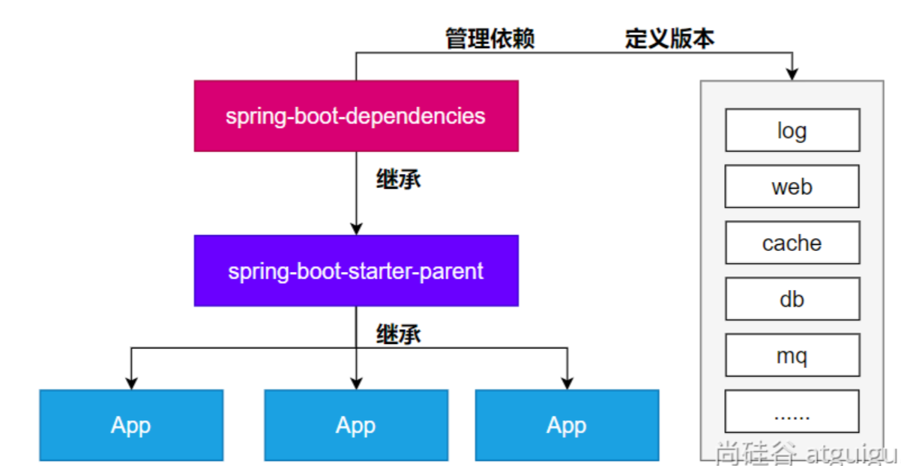
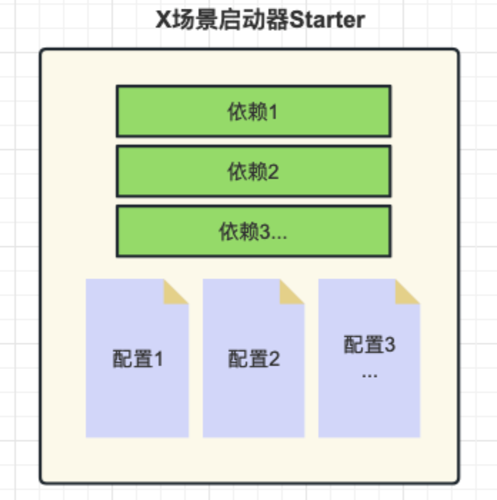
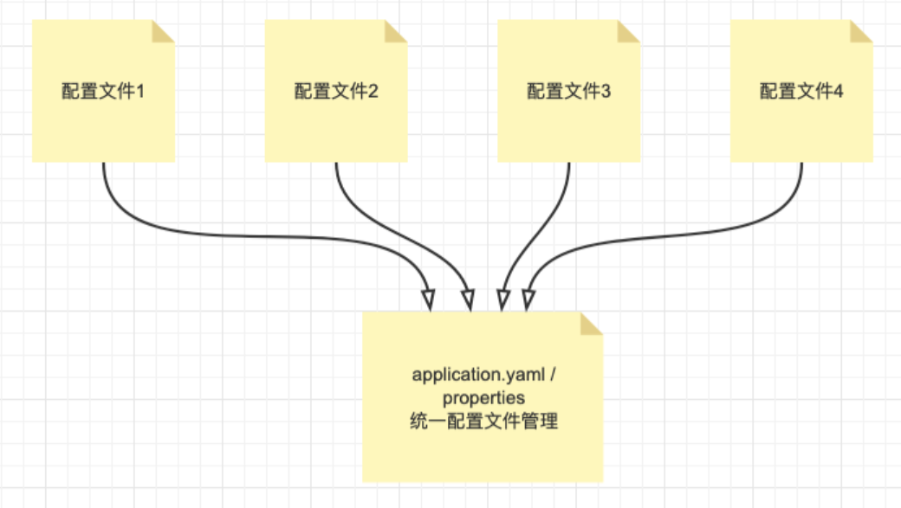

# SpringBoot 框架

**SSM框架内容分为如下几个章节，每个章节对应一个文件：《Maven》、《Spring》、《MyBatis》、《SpringMVC》、《SSM整合》、《SpringBoot》、《MyBatis-Plus》。**

## 第六章：SpringBoot 框架

### 一、SpringBoot3 概述

#### （1）SpringBoot 介绍

[Spring Boot :: Spring Boot](https://docs.spring.io/spring-boot/index.html)

SpringBoot是一种快速启动框架，可以帮我们简单、快速地创建一个独立的、生产级别的 Spring 应用（SpringBoot 底层是 Spring），大多数 SpringBoot 应用只需要编写少量配置即可快速整合 Spring 平台以及第三方技术。

SpringBoot 的主要目标是：

- 为所有 Spring 开发提供更快速、可广泛访问的入门体验；
- 开箱即用，设置合理的默认值，但是也可以根据需求进行适当的调整；
- 提供一系列大型项目通用的非功能性程序（如嵌入式服务器、安全性、指标、运行检查等）；
- 约定大于配置，基本不需要主动编写配置类、也不需要 XML 配置文件。

总结：简化开发，简化配置，简化整合，简化部署，简化监控，简化运维。

#### （2）快速入门 SpringBoot

##### 1. 简单操作

需求：向浏览器发送 `/hello` 请求，返回"Hello,Spring Boot 3!"。

创建空项目：springboot-part；

创建子工程：springboot-base-quick-1；

在子工程导入配置与依赖：

SpringBoot可以帮我们方便的管理项目依赖 , 在Spring Boot提供了一个名为 `spring-boot-starter-parent` 的工程，里面已经对各种常用依赖的版本进行了管理，我们的项目需要以这个项目为父工程，这样我们就不用操心依赖的版本问题了，需要什么依赖，直接引入坐标(不需要添加版本)即可。

为了让Spring Boot帮我们完成各种自动配置，我们必须引入Spring Boot提供的自动配置依赖，我们称为启动器。因为我们是web项目，这里我们引入web启动器，在 `pom.xml` 文件中加入如下依赖：

```xml
<?xml version="1.0" encoding="UTF-8"?>
<project xmlns="http://maven.apache.org/POM/4.0.0"
         xmlns:xsi="http://www.w3.org/2001/XMLSchema-instance"
         xsi:schemaLocation="http://maven.apache.org/POM/4.0.0 http://maven.apache.org/xsd/maven-4.0.0.xsd">
    <modelVersion>4.0.0</modelVersion>

    <parent>
        <!-- spring boot -->
        <groupId>org.springframework.boot</groupId>
        <artifactId>spring-boot-starter-parent</artifactId>
        <version>3.0.5</version>
    </parent>

    <groupId>com.ssh</groupId>
    <artifactId>springboot-base-quick-1</artifactId>
    <version>1.0-SNAPSHOT</version>

    <!-- 导入对应的启动器 -->
    <dependencies>
        <dependency>
            <groupId>org.springframework.boot</groupId>
            <artifactId>spring-boot-starter-web</artifactId>
        </dependency>
    </dependencies>

</project>
```

创建启动类：

```java
package com.ssh;

import org.springframework.boot.SpringApplication;
import org.springframework.boot.autoconfigure.SpringBootApplication;

/**
 * @author 申书航
 * @version 1.0
 */
@SpringBootApplication  // 代表该类是一个Spring Boot的启动类
public class Main {

    public static void main(String[] args) {
        //创建IoC容器，加载配置，启动内置的WEB服务器
        SpringApplication.run(Main.class, args);    //自动创建IoC容器，启动Tomcat服务器
    }
}
```

Controller 层：

```java
package com.ssh.controller;

import org.springframework.web.bind.annotation.GetMapping;
import org.springframework.web.bind.annotation.RequestMapping;
import org.springframework.web.bind.annotation.RestController;

/**
 * @author 申书航
 * @version 1.0
 */
@RestController
@RequestMapping("/hello")
public class HelloController {

    @GetMapping("boot")
    public String hello() {
        return "Hello,Spring Boot 3!";
    }
}
```

访问地址测试即可。

##### 2. 入门总结

**依赖不需要写版本：**

- 每个boot项目都有一个父项目 `spring-boot-starter-parent`；
- parent的父项目是 `spring-boot-dependencies`；
- 父项目版本仲裁中心，把所有常见的jar的依赖版本都声明好了。



**启动器（Starter）的概念：**

Spring Boot提供了一种叫做Starter的概念，它是一组预定义的依赖项集合，旨在简化Spring应用程序的配置和构建过程。Starter包含了一组相关的依赖项，以便在启动应用程序时自动引入所需的库、配置和功能。

主要作用如下：

1. 简化依赖管理：Spring Boot Starter通过捆绑和管理一组相关的依赖项，减少了手动解析和配置依赖项的工作。只需引入一个相关的Starter依赖，即可获取应用程序所需的全部依赖；
2. 自动配置：Spring Boot Starter在应用程序启动时自动配置所需的组件和功能。通过根据类路径和其他设置的自动检测，Starter可以自动配置Spring Bean、数据源、消息传递等常见组件，从而使应用程序的配置变得简单和维护成本降低；
3. 提供约定优于配置：Spring Boot Starter遵循“约定优于配置”的原则，通过提供一组默认设置和约定，减少了手动配置的需要。它定义了标准的配置文件命名约定、默认属性值、日志配置等，使得开发者可以更专注于业务逻辑而不是繁琐的配置细节；
4. 快速启动和开发应用程序：Spring Boot Starter使得从零开始构建一个完整的Spring Boot应用程序变得容易。它提供了主要领域（如Web开发、数据访问、安全性、消息传递等）的Starter，帮助开发者快速搭建一个具备特定功能的应用程序原型；
5. 模块化和可扩展性：Spring Boot Starter的组织结构使得应用程序的不同模块可以进行分离和解耦。每个模块可以有自己的Starter和依赖项，使得应用程序的不同部分可以按需进行开发和扩展。



Spring Boot提供了许多预定义的Starter，例如spring-boot-starter-web用于构建Web应用程序，spring-boot-starter-data-jpa 用于使用JPA进行数据库访问，spring-boot-starter-security 用于安全认证和授权等等。

使用Starter非常简单，只需要在项目的构建文件（例如Maven的pom.xml）中添加所需的Starter依赖，Spring Boot会自动处理依赖管理和配置。

通过使用Starter，开发人员可以方便地引入和配置应用程序所需的功能，避免了手动添加大量的依赖项和编写冗长的配置文件的繁琐过程。同时，Starter也提供了一致的依赖项版本管理，确保依赖项之间的兼容性和稳定性。


spring boot提供的全部启动器地址：

[https://docs.spring.io/spring-boot/docs/current/reference/html/using.html#using.build-systems.starters](https://docs.spring.io/spring-boot/docs/current/reference/html/using.html#using.build-systems.starters)

命名规范：

- 官方提供的场景：命名为：`spring-boot-starter-*`
- 第三方提供场景：命名为：`*-spring-boot-starter`

**`@SpringBootApplication` 注解：**

`@SpringBootApplication` 添加到启动类上，是一个组合注解，他的功效有具体的子注解实现。

```java
@SpringBootConfiguration	//配置类
@EnableAutoConfiguration	//自动加载其他配置类
@ComponentScan				//扫描包，默认扫描当前类所在的包及其子包
public @interface SpringBootApplication {}
```

`@SpringBootApplication` 注解是Spring Boot框架中的核心注解，它的主要作用是简化和加速Spring Boot应用程序的配置和启动过程。

具体而言，`@SpringBootApplication` 注解起到以下几个主要作用：

1. 自动配置：`@SpringBootApplication` 注解包含了 `@EnableAutoConfiguration` 注解，用于启用Spring Boot的自动配置机制。自动配置会根据应用程序的依赖项和类路径，自动配置各种常见的Spring配置和功能，减少开发者的手动配置工作。它通过智能地分析类路径、加载配置和条件判断，为应用程序提供适当的默认配置；
2. 组件扫描：`@SpringBootApplication` 注解包含了 `@ComponentScan` 注解，用于自动扫描并加载应用程序中的组件，例如控制器（Controllers）、服务（Services）、存储库（Repositories）等。它默认会扫描 `@SpringBootApplication` 注解所在类的包及其子包中的组件，并将它们纳入Spring Boot应用程序的上下文中，使它们可被自动注入和使用；
3. 声明配置类：`@SpringBootApplication` 注解本身就是一个组合注解，它包含了 `@Configuration` 注解，将被标注的类声明为配置类。配置类可以包含Spring框架相关的配置、Bean定义，以及其他的自定义配置。通过 `@SpringBootApplication` 注解，开发者可以将配置类与启动类合并在一起，使得配置和启动可以同时发生。

总的来说，`@SpringBootApplication` 注解的主要作用是简化 Spring Boot 应用程序的配置和启动过程。它自动配置应用程序、扫描并加载组件，并将配置和启动类合二为一，简化了开发者的工作量，提高了开发效率。

### 二、SpringBoot3 配置文件

#### （1）统一配置管理概述

SpringBoot工程下，进行统一的配置管理，你想设置的任何参数（端口号、项目根路径、数据库连接信息等等)都集中到一个固定位置和命名的配置文件（`application.properties` 或 `application.yml`）中。

配置文件应该放置在Spring Boot工程的 `src/main/resources` 目录下。这是因为`src/main/resources`目录是Spring Boot默认的类路径（classpath），配置文件会被自动加载并可供应用程序访问。



功能配置参数说明：

[https://docs.spring.io/spring-boot/docs/current/reference/html/application-properties.html#appendix.application-properties](https://docs.spring.io/spring-boot/docs/current/reference/html/application-properties.html#appendix.application-properties)

细节总结：

- 集中式管理配置。统一在一个文件完成程序功能参数设置和自定义参数声明；
- 位置：resources文件夹下，必须命名 application，后缀 .properties 或 .yaml 或  .yml ；
- 如果同时存在 `application.properties` 或 `application.yml(.yaml)` ，properties 的优先级更高；
- 配置基本都有默认值。

#### （2）属性配置文件使用

创建配置文件：`application.properties`

```properties
# application.properties 为统一配置文件
# 内部包含: 固定功能的key,自定义的key
# 此处的配置信息,我们都可以在程序中@Value等注解读取

#使用springboot提供的配置，修改程序的参数，key是固定的
# 设置端口号
server.port=80
# 设置上下文路径
server.servlet.context-path=/testPath

#自定义配置，key自定义，value自定义
ssh.name=申书航
ssh.age=20
```

Controller 层更改：

```java
package com.ssh.controller;

import org.springframework.beans.factory.annotation.Value;
import org.springframework.web.bind.annotation.GetMapping;
import org.springframework.web.bind.annotation.RequestMapping;
import org.springframework.web.bind.annotation.RestController;

/**
 * @author 申书航
 * @version 1.0
 */
@RestController
@RequestMapping("/hello")
public class HelloController {

    @Value("${ssh.name}")
    private String name;

    @GetMapping("boot")
    public String hello() {
        System.out.println(name);
        return "Hello,Spring Boot 3!";
    }
}
```

访问 [http://localhost:80/testPath/hello/boot](http://localhost:80/testPath/hello/boot) 测试。

#### （3）YAML 配置文件

##### 1. YAML 配置文件介绍

YAML（YAML Ain’t Markup Language）是一种基于层次结构的数据序列化格式，旨在提供一种易读、人类友好的数据表示方式。

与`.properties`文件相比，YAML格式有以下优势：

1. 层次结构：YAML文件使用缩进和冒号来表示层次结构，使得数据之间的关系更加清晰和直观。这样可以更容易理解和维护复杂的配置，特别适用于深层次嵌套的配置情况；
2. 自我描述性：YAML文件具有自我描述性，字段和值之间使用冒号分隔，并使用缩进表示层级关系。这使得配置文件更易于阅读和理解，并且可以减少冗余的标点符号和引号；
3. 注释支持：YAML格式支持注释，可以在配置文件中添加说明性的注释，使配置更具可读性和可维护性。相比之下，`.properties`文件不支持注释，无法提供类似的解释和说明；
4. 多行文本：YAML格式支持多行文本的表示，可以更方便地表示长文本或数据块。相比之下，`.properties`文件需要使用转义符或将长文本拆分为多行；
5. 类型支持：YAML格式天然支持复杂的数据类型，如列表、映射等。这使得在配置文件中表示嵌套结构或数据集合更加容易，而不需要进行额外的解析或转换；
6. 更好的可读性：由于YAML格式的特点，它更容易被人类读懂和解释。它减少了配置文件中需要的特殊字符和语法，让配置更加清晰明了，从而减少了错误和歧义。

综上所述，YAML格式相对于`.properties`文件具有更好的层次结构表示、自我描述性、注释支持、多行文本表示、复杂数据类型支持和更好的可读性。这些特点使YAML成为一种有力的配置文件格式，尤其适用于复杂的配置需求和人类可读的场景。然而，选择使用YAML还是`.properties`取决于实际需求和团队的偏好，简单的配置可以使用`.properties`，而复杂的配置可以选择YAML以获得更多的灵活性和可读性。

##### 2. YAML 配置文件语法

1. 数据结构用树形结构呈现，通过缩进来表示层级；
2. 连续的项目（集合）通过减号 ” - ” 来表示；
3. 键值结构里面的key/value对用冒号 ” : ” 来分隔；
4. YAML配置文件的扩展名是 yaml 或 yml。

配置文件：`application.yaml`

```yaml
# yml 文件有层次，可以继承配置文件的格式

server:
  port: 80
  servlet:
    context-path: /boot

# 自定义配置
ssh:
  info:
    age: 20
    name: "申书航"
  user:
    username: "root"
    password: "123456"
    # 集合类型配置
    gfs:
      - a
      - b
      - c
```

#### （3）批量配置文件注入

`@ConfigurationProperties` 是SpringBoot提供的重要注解, 他可以将一些配置属性批量注入到Bean对象。

在类上通过 `@ConfigurationProperties` 注解声明该类要读取属性配置。

`prefix="spring.jdbc.datasource"` 读取属性文件中前缀为 `spring.jdbc.datasource` 的值。前缀和属性名称和配置文件中的 key 必须要保持一致才可以注入成功。

配置文件：`application.yaml`

```yaml
# yml 文件有层次，可以继承配置文件的格式

server:
  port: 808
  servlet:
    context-path: /boot

# 自定义配置
ssh:
  info:
    age: 20
    name: "申书航"
  user:
    username: "root"
    password: "root"
    # 集合类型配置
    gfs:
      - a
      - b
      - c
```

启动类：

```java
package com.ssh;

import org.springframework.boot.SpringApplication;
import org.springframework.boot.autoconfigure.SpringBootApplication;

/**
 * @author 申书航
 * @version 1.0
 * 启动类
 */
@SpringBootApplication
public class Main {

    public static void main(String[] args) {
        SpringApplication.run(Main.class, args);
    }
}
```

创建实体类并批量注入配置文件：

```java
package com.ssh.pojo;

import lombok.Data;
import org.springframework.beans.factory.annotation.Value;
import org.springframework.boot.context.properties.ConfigurationProperties;
import org.springframework.stereotype.Component;

import java.util.List;

/**
 * @author 申书航
 * @version 1.0
 * 用户实体类
 *
 * 读取配置文件
 * 1. @Value：直接在属性上添加
 *      @Value的key值必须写全
 *      @Value只能读取单个值
 * 2. 批量配置读取：@ConfigurationProperties(prefix = "前缀")
 *     读取配置文件中以ssh.user开头的配置，并自动绑定到User实体类中
 *     可以给集合属性赋值
 */
@Data
@Component
@ConfigurationProperties(prefix = "ssh.user")
public class User {

//    @Value("${ssh.user.username}")
    private String username;

//    @Value("${ssh.user.password}")
    private String password;

//    @Value("${ssh.user.gfs}")
    private List<String> gfs;
}
```

Controller 层：

```java
package com.ssh.controller;

import com.ssh.pojo.User;
import org.springframework.beans.factory.annotation.Autowired;
import org.springframework.web.bind.annotation.GetMapping;
import org.springframework.web.bind.annotation.RequestMapping;
import org.springframework.web.bind.annotation.RestController;

/**
 * @author 申书航
 * @version 1.0
 */
@RestController
@RequestMapping("/user")
public class UserController {

    @Autowired
    private User user;

    @GetMapping("/show")
    public User show() {
        return user;
    }
}
```

测试配置文件中的访问地址即可。

#### （4）多环境配置与使用

##### 1. 多环境配置介绍

在Spring Boot中，可以使用多环境配置来根据不同的运行环境（如开发、测试、生产）加载不同的配置。SpringBoot支持多环境配置让应用程序在不同的环境中使用不同的配置参数，例如数据库连接信息、日志级别、缓存配置等。

以下是实现Spring Boot多环境配置的常见方法：

1. 属性文件分离：将应用程序的配置参数分离到不同的属性文件中，每个环境对应一个属性文件。例如，可以创建`application-dev.properties`、`application-prod.properties`和`application-test.properties`等文件。在这些文件中，可以定义各自环境的配置参数，如数据库连接信息、端口号等。然后，在`application.properties`中通过`spring.profiles.active`属性指定当前使用的环境。Spring Boot会根据该属性来加载对应环境的属性文件，覆盖默认的配置。
2. YAML配置文件：与属性文件类似，可以将配置参数分离到不同的YAML文件中，每个环境对应一个文件。例如，可以创建`application-dev.yml`、`application-prod.yml`和`application-test.yml`等文件。在这些文件中，可以使用YAML语法定义各自环境的配置参数。同样，通过`spring.profiles.active`属性指定当前的环境，Spring Boot会加载相应的YAML文件。
3. 命令行参数(动态)：可以通过命令行参数来指定当前的环境。例如，可以使用`--spring.profiles.active=dev`来指定使用开发环境的配置。

通过上述方法，Spring Boot会根据当前指定的环境来加载相应的配置文件或参数，从而实现多环境配置。这样可以简化在不同环境之间的配置切换，并且确保应用程序在不同环境中具有正确的配置。

##### 2. 多环境配置使用

基于上面的方法2来实现：

如果设置了 `spring.profiles.active`，并且和 `application.yaml` 文件有重叠属性，以 `active` 设置优先。

`application.yaml`：

```yaml
# yml 文件有层次，可以继承配置文件的格式

server:
  port: 808
  servlet:
    context-path: /boot

# 自定义配置
ssh:
  info:
    age: 20
    name: "申书航"
  user:
    # 集合类型配置
    gfs:
      - a
      - b
      - c
    username: nameApplication

# 激活外部配置文件，如果外部配置文件的key和本配置文件的key相同，则会覆盖本配置文件的key值
spring:
  profiles:
    active: test, dev # 激活了 application-test 和 application-dev 两个配置文件
```

`application-dev.yaml`：

```yaml
ssh:
  user:
    username: rootdev
```

`application-test.yaml`：

```yaml
ssh:
  user:
    password: 123456test
```

启动类，实体类与 Controller 层均与上面相同，此处省略，测试即可。

### 三、SpringBoot 整合

#### （1）SpringMVC 整合

##### 1. 准备过程

准备项目：springboot-base-springmvc-3

导入依赖：

```xml
<?xml version="1.0" encoding="UTF-8"?>
<project xmlns="http://maven.apache.org/POM/4.0.0"
         xmlns:xsi="http://www.w3.org/2001/XMLSchema-instance"
         xsi:schemaLocation="http://maven.apache.org/POM/4.0.0 http://maven.apache.org/xsd/maven-4.0.0.xsd">
    <modelVersion>4.0.0</modelVersion>

    <parent>
        <groupId>org.springframework.boot</groupId>
        <artifactId>spring-boot-starter-parent</artifactId>
        <version>3.0.5</version>
    </parent>


    <groupId>com.ssh</groupId>
    <artifactId>springboot-base-springmvc-3</artifactId>
    <version>1.0-SNAPSHOT</version>

    <dependencies>
        <dependency>
            <groupId>org.springframework.boot</groupId>
            <artifactId>spring-boot-starter-web</artifactId>
        </dependency>
    </dependencies>

</project>
```

启动类：

```java
package com.ssh;

import org.springframework.boot.SpringApplication;
import org.springframework.boot.autoconfigure.SpringBootApplication;

/**
 * @author 申书航
 * @version 1.0
 * 启动类
 */
@SpringBootApplication
public class Main {

    public static void main(String[] args) {
        SpringApplication.run(Main.class, args);
    }
}
```

Controller 层：

```java
package com.ssh.controller;

import org.springframework.web.bind.annotation.GetMapping;
import org.springframework.web.bind.annotation.RequestMapping;
import org.springframework.web.bind.annotation.RestController;

/**
 * @author 申书航
 * @version 1.0
 */
@RestController
public class HelloController {

    @GetMapping("hello")
    public String ret() {
        return "Hello World";
    }
}
```

##### 2. WEB 相关配置

`application.yaml`：

```yaml
# springmvc 相关的WEB配置

server:
  port: 80  # 端口号默认是8080，这里修改为80
  servlet:
    context-path: /boot  # 设置项目根路径
```

当涉及Spring Boot的Web应用程序配置时，以下是五个重要的配置参数：

1. `server.port`: 指定应用程序的HTTP服务器端口号。默认情况下，Spring Boot使用8080作为默认端口。您可以通过在配置文件中设置`server.port`来更改端口号。
2. `server.servlet.context-path`: 设置应用程序的上下文路径。这是应用程序在URL中的基本路径。默认情况下，上下文路径为空。您可以通过在配置文件中设置`server.servlet.context-path`属性来指定自定义的上下文路径。
3. `spring.mvc.view.prefix`和`spring.mvc.view.suffix`: 这两个属性用于配置视图解析器的前缀和后缀。视图解析器用于解析控制器返回的视图名称，并将其映射到实际的视图页面。`spring.mvc.view.prefix`定义视图的前缀，`spring.mvc.view.suffix`定义视图的后缀。
4. `spring.resources.static-locations`: 配置静态资源的位置。静态资源可以是CSS、JavaScript、图像等。默认情况下，Spring Boot会将静态资源放在`classpath:/static`目录下。您可以通过在配置文件中设置`spring.resources.static-locations`属性来自定义静态资源的位置。
5. `spring.http.encoding.charset`和`spring.http.encoding.enabled`: 这两个属性用于配置HTTP请求和响应的字符编码。`spring.http.encoding.charset`定义字符编码的名称（例如UTF-8），`spring.http.encoding.enabled`用于启用或禁用字符编码的自动配置。

这些是在Spring Boot的配置文件中与Web应用程序相关的一些重要配置参数。根据您的需求，您可以在配置文件中设置这些参数来定制和配置您的Web应用程序。

##### 3. 静态资源处理

在WEB开发中我们需要引入一些静态资源 , 例如 : HTML , CSS , JS , 图片等 , 如果是普通的项目静态资源可以放在项目的webapp目录下。现在使用Spring Boot做开发 , 项目中没有 `webapp` 目录 , 我们的项目是一个jar工程，那么就没有 `webapp`，我们的静态资源该放哪里呢？

**默认的静态资源路径为：**

- `classpath:/META-INF/resources/`；
- `classpath:/resources/；`
- `classpath:/static/`；
- `classpath:/public/`。

我们只要静态资源放在这些目录中任何一个，SpringMVC 都会帮我们处理。 我们习惯会把静态资源放在 `classpath:/static/` 目录下。在 resources 目录下创建 `index.html` 文件。

测试 [http://localhost:80/boot/index.html](http://localhost:80/boot/index.html)；

覆盖路径：

```yaml
# springmvc 相关的WEB配置

server:
  port: 80  # 端口号默认是8080，这里修改为80
  servlet:
    context-path: /boot  # 设置项目根路径

spring:
  web:
    resources:
      static-locations: classpath:/webapp # 设置静态资源文件夹，配置以后默认的静态资源路径就无法访问了
      # 外部在访问静态资源时，不需要写静态资源文件夹
```

在 `webapp` 目录下创建 `register.html` 文件，测试 [http://localhost:80/boot/register.html](http://localhost:80/boot/register.html)

##### 4. 拦截器配置

正常使用配置类，只要保证配置类要在启动类的同包或者子包方可生效。

拦截器定义：

```java
package com.ssh.interceptor;

import jakarta.servlet.http.HttpServletRequest;
import jakarta.servlet.http.HttpServletResponse;
import org.springframework.web.servlet.HandlerInterceptor;

/**
 * @author 申书航
 * @version 1.0
 * 拦截器
 */
public class MyInterceptor implements HandlerInterceptor {

    @Override
    public boolean preHandle(HttpServletRequest request, HttpServletResponse response, Object handler) throws Exception {
        System.out.println("request = " + request + ", handler = " + handler + ", response = " + response);
        return true;
    }
}
```

拦截器配置：

```java
package com.ssh.config;

import com.ssh.interceptor.MyInterceptor;
import org.springframework.context.annotation.Configuration;
import org.springframework.web.servlet.config.annotation.InterceptorRegistry;
import org.springframework.web.servlet.config.annotation.WebMvcConfigurer;

/**
 * @author 申书航
 * @version 1.0
 * 配置类
 */
@Configuration
public class WebMvcConfig implements WebMvcConfigurer {

    @Override
    public void addInterceptors(InterceptorRegistry registry) {
        registry.addInterceptor(new MyInterceptor());
    }
}
```

#### （2）Druid 数据源整合

项目准备：`springboot-base-druid-4`

依赖导入：Druid连接池要用1.2.20以上版本才能与 SpringBoot3兼容。

```xml
<?xml version="1.0" encoding="UTF-8"?>
<project xmlns="http://maven.apache.org/POM/4.0.0"
         xmlns:xsi="http://www.w3.org/2001/XMLSchema-instance"
         xsi:schemaLocation="http://maven.apache.org/POM/4.0.0 http://maven.apache.org/xsd/maven-4.0.0.xsd">
    <modelVersion>4.0.0</modelVersion>

    <parent>
        <groupId>org.springframework.boot</groupId>
        <artifactId>spring-boot-starter-parent</artifactId>
        <version>3.0.5</version>
    </parent>

    <groupId>com.ssh</groupId>
    <artifactId>springboot-base-druid-4</artifactId>
    <version>1.0-SNAPSHOT</version>

    <dependencies>
        <!--  web开发的场景启动器 -->
        <dependency>
            <groupId>org.springframework.boot</groupId>
            <artifactId>spring-boot-starter-web</artifactId>
        </dependency>

        <!-- 数据库相关配置启动器 jdbctemplate 事务相关-->
        <dependency>
            <groupId>org.springframework.boot</groupId>
            <artifactId>spring-boot-starter-jdbc</artifactId>
        </dependency>

        <!-- druid启动器的依赖  -->
        <dependency>
            <groupId>com.alibaba</groupId>
            <artifactId>druid-spring-boot-3-starter</artifactId>
            <version>1.2.20</version>
        </dependency>

        <!-- 驱动类-->
        <dependency>
            <groupId>mysql</groupId>
            <artifactId>mysql-connector-java</artifactId>
            <version>8.0.28</version>
        </dependency>

        <dependency>
            <groupId>org.projectlombok</groupId>
            <artifactId>lombok</artifactId>
            <version>1.18.28</version>
        </dependency>
    </dependencies>

</project>
```

启动类：

```java
package com.ssh;

import org.springframework.boot.SpringApplication;
import org.springframework.boot.autoconfigure.SpringBootApplication;

/**
 * @author 申书航
 * @version 1.0
 * 启动类
 */
@SpringBootApplication
public class Main {

    public static void main(String[] args) {
        SpringApplication.run(Main.class, args);
    }
}
```

实体类：

```java
package com.ssh.pojo;

import lombok.Data;

/**
 * @author 申书航
 * @version 1.0
 * 员工实体类
 */
@Data
public class Employee {

    private Integer empId;

    private String empName;

    private Double empSalary;
}
```

配置文件：

```yaml
spring:
  datasource:
    type: com.alibaba.druid.pool.DruidDataSource  # 使用druid连接池
    # springboot2支持直接配置用户名和密码
#    username: root
#    password: root
    druid:
      url: jdbc:mysql://localhost:3306/lesson
      username: root
      password: root
      driver-class-name: com.mysql.cj.jdbc.Driver
      # 初始化时建立物理连接的个数
      initial-size: 5
      # 连接池的最小空闲数量
      min-idle: 5
      # 连接池最大连接数量
      max-active: 20
      # 获取连接时最大等待时间，单位毫秒
      max-wait: 60000
      # 申请连接的时候检测，如果空闲时间大于timeBetweenEvictionRunsMillis，执行validationQuery检测连接是否有效。
      test-while-idle: true
      # 既作为检测的间隔时间又作为testWhileIdel执行的依据
      time-between-eviction-runs-millis: 60000
      # 销毁线程时检测当前连接的最后活动时间和当前时间差大于该值时，关闭当前连接(配置连接在池中的最小生存时间)
      min-evictable-idle-time-millis: 30000
      # 用来检测数据库连接是否有效的sql 必须是一个查询语句(oracle中为 select 1 from dual)
      validation-query: select 1
      # 申请连接时会执行validationQuery检测连接是否有效,开启会降低性能,默认为true
      test-on-borrow: false
      # 归还连接时会执行validationQuery检测连接是否有效,开启会降低性能,默认为true
      test-on-return: false
      # 是否缓存preparedStatement, 也就是PSCache,PSCache对支持游标的数据库性能提升巨大，比如说oracle,在mysql下建议关闭。
      pool-prepared-statements: false
      # 要启用PSCache，必须配置大于0，当大于0时，poolPreparedStatements自动触发修改为true。在Druid中，不会存在Oracle下PSCache占用内存过多的问题，可以把这个数值配置大一些，比如说100
      max-pool-prepared-statement-per-connection-size: -1
      # 合并多个DruidDataSource的监控数据
      use-global-data-source-stat: true
```

Controller 层：

```java
package com.ssh.controller;

import com.ssh.pojo.Employee;
import org.springframework.beans.factory.annotation.Autowired;
import org.springframework.jdbc.core.BeanPropertyRowMapper;
import org.springframework.jdbc.core.JdbcTemplate;
import org.springframework.web.bind.annotation.GetMapping;
import org.springframework.web.bind.annotation.RequestMapping;
import org.springframework.web.bind.annotation.RestController;

import java.util.List;

/**
 * @author 申书航
 * @version 1.0
 */
@RestController
@RequestMapping("/employee")
public class EmployeeController {

    @Autowired
    private JdbcTemplate jdbcTemplate;

    @GetMapping("/list")
    public List<Employee> list() {
        //数据库
        String sql = "select * from t_emp";

        List<Employee> employeeList = jdbcTemplate.query(sql, new BeanPropertyRowMapper<>(Employee.class));
        return employeeList;

    }
}
```

测试启动即可。

如果 `druid-spring-boot-3-starter` 版本是1.2.18或以下，虽然适配了 SpringBoot3，但缺少自动装配的配置文件，需要手动在 resources 目录下创建文件夹 `META-INF/spring`，在该文件夹下创建文件 `org.springframework.boot.autoconfigure.AutoConfiguration.imports`，文件内容如下：

```txt
com.alibaba.druid.spring.boot3.autoconfigure.DruidDataSourceAutoConfigure
```

#### （3）MyBatis 与 Spring 整合

##### 1. MyBatis 整合

整合MyBatis 需要在启动类添加 `@MapperScan("包名")` 注解，来指定 Mapper 接口的扫描路径。

项目创建：`springboot-base-mybatis-5`；

依赖导入：

```xml
<?xml version="1.0" encoding="UTF-8"?>
<project xmlns="http://maven.apache.org/POM/4.0.0"
         xmlns:xsi="http://www.w3.org/2001/XMLSchema-instance"
         xsi:schemaLocation="http://maven.apache.org/POM/4.0.0 http://maven.apache.org/xsd/maven-4.0.0.xsd">
    <modelVersion>4.0.0</modelVersion>

    <parent>
        <groupId>org.springframework.boot</groupId>
        <artifactId>spring-boot-starter-parent</artifactId>
        <version>3.0.5</version>
    </parent>

    <groupId>com.ssh</groupId>
    <artifactId>springboot-base-mybatis-5</artifactId>
    <version>1.0-SNAPSHOT</version>

    <dependencies>
        <dependency>
            <groupId>org.springframework.boot</groupId>
            <artifactId>spring-boot-starter-web</artifactId>
        </dependency>

        <dependency>
            <groupId>org.mybatis.spring.boot</groupId>
            <artifactId>mybatis-spring-boot-starter</artifactId>
            <version>3.0.1</version>
        </dependency>

        <!-- 数据库相关配置启动器 -->
        <dependency>
            <groupId>org.springframework.boot</groupId>
            <artifactId>spring-boot-starter-jdbc</artifactId>
        </dependency>

        <!-- druid启动器的依赖  -->
        <dependency>
            <groupId>com.alibaba</groupId>
            <artifactId>druid-spring-boot-3-starter</artifactId>
            <version>1.2.20</version>
        </dependency>

        <!-- 驱动类-->
        <dependency>
            <groupId>mysql</groupId>
            <artifactId>mysql-connector-java</artifactId>
            <version>8.0.28</version>
        </dependency>

        <dependency>
            <groupId>org.projectlombok</groupId>
            <artifactId>lombok</artifactId>
            <version>1.18.28</version>
        </dependency>

    </dependencies>
</project>
```

启动类：

```java
package com.ssh;

import org.mybatis.spring.annotation.MapperScan;
import org.springframework.boot.SpringApplication;
import org.springframework.boot.autoconfigure.SpringBootApplication;

/**
 * @author 申书航
 * @version 1.0
 * 启动类
 */
@SpringBootApplication
@MapperScan("com.ssh.mapper")   //指定Mapper接口的扫描路径
public class Main {

    public static void main(String[] args) {
        SpringApplication.run(Main.class, args);
    }
}
```

配置文件：

```yaml
# Druid连接池

spring:
  datasource:
    type: com.alibaba.druid.pool.DruidDataSource
    druid:
      url: jdbc:mysql://localhost:3306/lesson
      username: root
      password: root
      driver-class-name: com.mysql.cj.jdbc.Driver
      # 初始化时建立物理连接的个数
      initial-size: 5
      # 连接池的最小空闲数量
      min-idle: 5
      # 连接池最大连接数量
      max-active: 20
      # 获取连接时最大等待时间，单位毫秒
      max-wait: 60000
      # 申请连接的时候检测，如果空闲时间大于timeBetweenEvictionRunsMillis，执行validationQuery检测连接是否有效。
      test-while-idle: true
      # 既作为检测的间隔时间又作为testWhileIdel执行的依据
      time-between-eviction-runs-millis: 60000
      # 销毁线程时检测当前连接的最后活动时间和当前时间差大于该值时，关闭当前连接(配置连接在池中的最小生存时间)
      min-evictable-idle-time-millis: 30000
      # 用来检测数据库连接是否有效的sql 必须是一个查询语句(oracle中为 select 1 from dual)
      validation-query: select 1
      # 申请连接时会执行validationQuery检测连接是否有效,开启会降低性能,默认为true
      test-on-borrow: false
      # 归还连接时会执行validationQuery检测连接是否有效,开启会降低性能,默认为true
      test-on-return: false
      # 是否缓存preparedStatement, 也就是PSCache,PSCache对支持游标的数据库性能提升巨大，比如说oracle,在mysql下建议关闭。
      pool-prepared-statements: false
      # 要启用PSCache，必须配置大于0，当大于0时，poolPreparedStatements自动触发修改为true。在Druid中，不会存在Oracle下PSCache占用内存过多的问题，可以把这个数值配置大一些，比如说100
      max-pool-prepared-statement-per-connection-size: -1
      # 合并多个DruidDataSource的监控数据
      use-global-data-source-stat: true

#MyBatis配置 彻底抛弃了mybatis-config.xml配置文件，全部配置在application.yaml中
# mapper.xml，settings，别名等

mybatis:
  mapper-locations: classpath:/mappers/*  # mapper.xml文件路径
  type-aliases-package: com.ssh.pojo  # 别名包路径
  configuration:
    map-underscore-to-camel-case: true  # 驼峰命名规则
    auto-mapping-behavior: full  # 自动映射
    log-impl: org.apache.ibatis.logging.slf4j.Slf4jImpl  # 日志实现
```

Mapper 接口：

```java
package com.ssh.mapper;

import com.ssh.pojo.Employee;

import java.util.List;

/**
 * @author 申书航
 * @version 1.0
 */
public interface EmployeeMapper {

    List<Employee> queryAll();
}
```

`EmployeeMapper.xml`：

```xml
<?xml version="1.0" encoding="UTF-8" ?>
<!DOCTYPE mapper
        PUBLIC "-//mybatis.org//DTD Mapper 3.0//EN"
        "https://mybatis.org/dtd/mybatis-3-mapper.dtd">

<mapper namespace="com.ssh.mapper.EmployeeMapper">

    <select id="queryAll" resultType="employee">
        select * from t_emp;
    </select>

</mapper>
```

Controller 层：

```java
package com.ssh.controller;

import com.ssh.mapper.EmployeeMapper;
import com.ssh.pojo.Employee;
import org.springframework.beans.factory.annotation.Autowired;
import org.springframework.web.bind.annotation.GetMapping;
import org.springframework.web.bind.annotation.RequestMapping;
import org.springframework.web.bind.annotation.RestController;

import java.util.List;

/**
 * @author 申书航
 * @version 1.0
 */
@RestController
@RequestMapping("/employee")
public class EmployeeController {

    @Autowired
    private EmployeeMapper mapper;

    @GetMapping
    public List<Employee> query() {
        return mapper.queryAll();
    }
}
```

测试启动即可。

##### 2. 声明式事务整合

声明式事务需要导入的依赖是JDBC的依赖，在前面用到过：

```xml
<dependency>
    <groupId>org.springframework.boot</groupId>
    <artifactId>spring-boot-starter-jdbc</artifactId>
</dependency>
```

直接在业务方法上添加 `@Transactional` 注解即可自动添加声明式事务。

Mapper 接口：

```java
package com.ssh.mapper;

import com.ssh.pojo.Employee;

import java.util.List;

/**
 * @author 申书航
 * @version 1.0
 */
public interface EmployeeMapper {

    List<Employee> queryAll();

    int delete(int empId);
}
```

`EmployeeMapper.xml`：

```xml
<?xml version="1.0" encoding="UTF-8" ?>
<!DOCTYPE mapper
        PUBLIC "-//mybatis.org//DTD Mapper 3.0//EN"
        "https://mybatis.org/dtd/mybatis-3-mapper.dtd">

<mapper namespace="com.ssh.mapper.EmployeeMapper">

    <select id="queryAll" resultType="employee">
        select * from t_emp;
    </select>

    <delete id="delete">
        delete from t_emp where emp_id = #{empId};
    </delete>

</mapper>
```

业务 Service 层：

```java
package com.ssh.service;

import com.ssh.mapper.EmployeeMapper;
import org.springframework.beans.factory.annotation.Autowired;
import org.springframework.stereotype.Service;
import org.springframework.transaction.annotation.Transactional;

/**
 * @author 申书航
 * @version 1.0
 */
@Service
public class EmployeeService {

    @Autowired
    private EmployeeMapper employeeMapper;

    @Transactional
    public void delete() {
        int rows = employeeMapper.delete(4);
        System.out.println(rows);
        int i = 1 / 0;	//模拟错误，事务回滚
    }
}
```

Controller 层：

```java
package com.ssh.controller;

import com.ssh.mapper.EmployeeMapper;
import com.ssh.pojo.Employee;
import com.ssh.service.EmployeeService;
import org.springframework.beans.factory.annotation.Autowired;
import org.springframework.web.bind.annotation.GetMapping;
import org.springframework.web.bind.annotation.RequestMapping;
import org.springframework.web.bind.annotation.RestController;

import java.util.List;

/**
 * @author 申书航
 * @version 1.0
 */
@RestController
@RequestMapping("/employee")
public class EmployeeController {

    @Autowired
    private EmployeeMapper mapper;

    @Autowired
    private EmployeeService employeeService;

    @GetMapping
    public List<Employee> query() {
        employeeService.delete();
        return mapper.queryAll();
    }
}
```

##### 3. Spring AOP 整合

导入依赖：

```xml
<dependency>
    <groupId>org.springframework.boot</groupId>
    <artifactId>spring-boot-starter-aop</artifactId>
</dependency>
```

日志AOP：

```java
package com.ssh.advice;

import org.aspectj.lang.JoinPoint;
import org.aspectj.lang.annotation.Aspect;
import org.aspectj.lang.annotation.Before;
import org.springframework.core.annotation.Order;
import org.springframework.stereotype.Component;

/**
 * @author 申书航
 * @version 1.0
 */
@Component
@Aspect
@Order(5)
public class LogAdvice {

    @Before("execution(* com.ssh.service.*.*(..))")
    public void before(JoinPoint point) {
        String simpleName = point.getTarget().getClass().getSimpleName();
        String className = point.getTarget().getClass().getName();
        String methodName = point.getSignature().getName();
        System.out.println("before " + simpleName + "." + methodName + "() in " + className);
    }
}
```

Service 层：

```java
package com.ssh.service;

import com.ssh.mapper.EmployeeMapper;
import org.springframework.beans.factory.annotation.Autowired;
import org.springframework.stereotype.Service;
import org.springframework.transaction.annotation.Transactional;

/**
 * @author 申书航
 * @version 1.0
 */
@Service
public class EmployeeService {

    @Autowired
    private EmployeeMapper employeeMapper;

    @Transactional
    public void delete() {
        int rows = employeeMapper.delete(4);
        System.out.println(rows);
//        int i = 1 / 0;
    }
}
```

Controller 层：

```java
package com.ssh.controller;

import com.ssh.mapper.EmployeeMapper;
import com.ssh.pojo.Employee;
import com.ssh.service.EmployeeService;
import org.springframework.beans.factory.annotation.Autowired;
import org.springframework.web.bind.annotation.GetMapping;
import org.springframework.web.bind.annotation.RequestMapping;
import org.springframework.web.bind.annotation.RestController;

import java.util.List;

/**
 * @author 申书航
 * @version 1.0
 */
@RestController
@RequestMapping("/employee")
public class EmployeeController {

    @Autowired
    private EmployeeMapper mapper;

    @Autowired
    private EmployeeService employeeService;

    @GetMapping
    public List<Employee> query() {
        employeeService.delete();
//        return mapper.queryAll();
        return null;
    }
}
```

启动测试即可。

#### （4）SpringBoot 项目打包运行

添加打包插件：

在Spring Boot项目中添加 `spring-boot-maven-plugin` 插件是为了支持将项目打包成可执行的可运行jar包。如果不添加 `spring-boot-maven-plugin` 插件配置，使用常规的 `java -jar` 命令来运行打包后的Spring Boot项目是无法找到应用程序的入口点，因此导致无法运行。

```xml
<!--    SpringBoot应用打包插件-->
<build>
    <plugins>
        <plugin>
            <groupId>org.springframework.boot</groupId>
            <artifactId>spring-boot-maven-plugin</artifactId>
        </plugin>
    </plugins>
</build>
```

执行打包：在 Maven 中选择本项目，然后选择生命周期，clear 以后再点击 package 进行打包。

命令启动：

`java -jar`命令用于在Java环境中执行可执行的JAR文件。下面是关于`java -jar`命令的说明：

```bash
命令格式：java -jar  [选项] [参数] <jar文件名>
```

1. `-D<name>=<value>`：设置系统属性，可以通过`System.getProperty()`方法在应用程序中获取该属性值。例如：`java -jar -Dserver.port=8080 myapp.jar`。
2. `-X`：设置JVM参数，例如内存大小、垃圾回收策略等。常用的选项包括：
	- `-Xmx<size>`：设置JVM的最大堆内存大小，例如 `-Xmx512m` 表示设置最大堆内存为512MB。
	- `-Xms<size>`：设置JVM的初始堆内存大小，例如 `-Xms256m` 表示设置初始堆内存为256MB。
3. `-Dspring.profiles.active=<profile>`：指定Spring Boot的激活配置文件，可以通过`application-<profile>.properties`或`application-<profile>.yml`文件来加载相应的配置。例如：`java -jar -Dspring.profiles.active=dev myapp.jar`。

**注意： -D 参数必须要在jar之前，否者不生效。**


**Spring 框架后续内容见：《MyBatis-Plus》……**