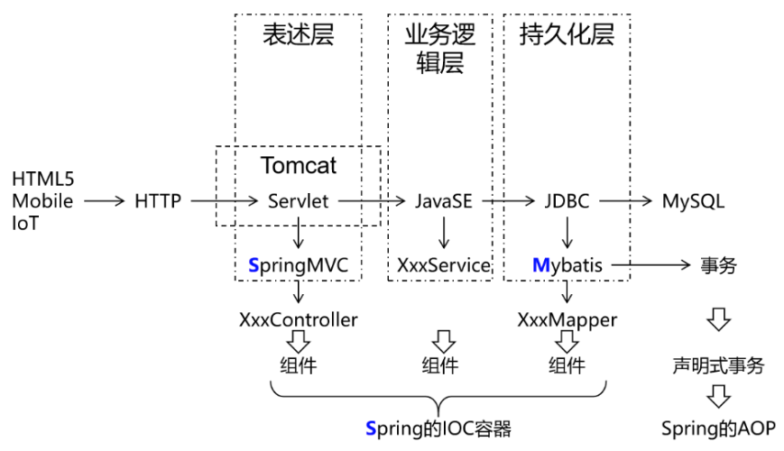
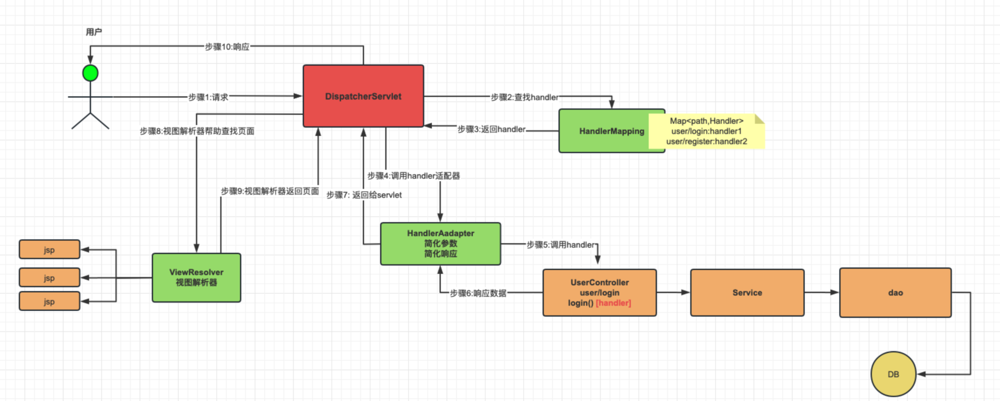
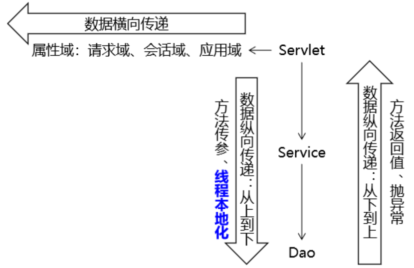
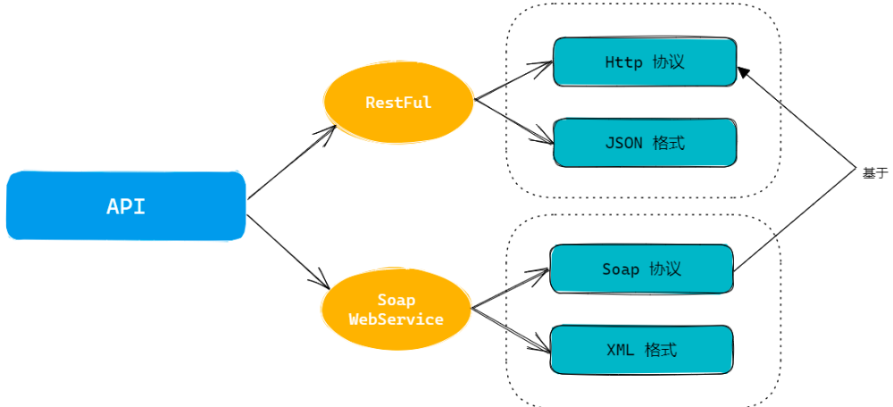
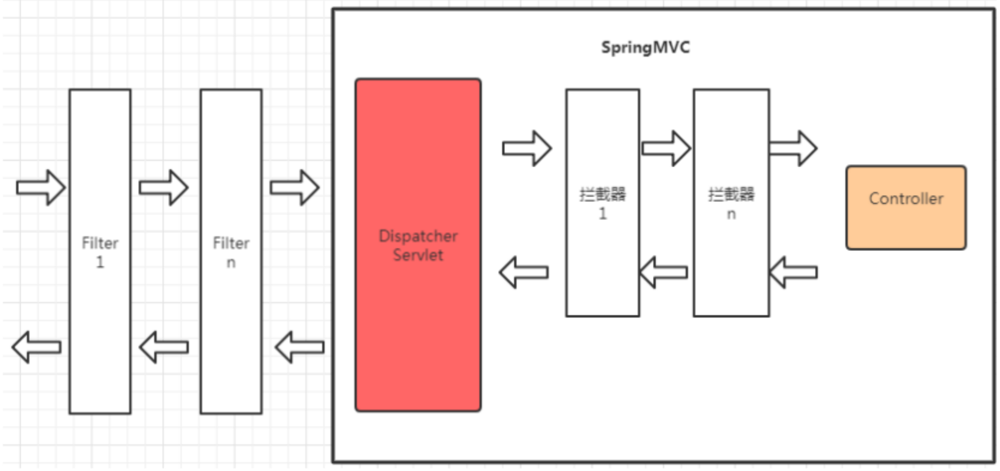

# SpringMVC 框架

**SSM框架内容分为如下几个章节，每个章节对应一个文件：《Maven》、《Spring》、《MyBatis》、《SpringMVC》、《SSM整合》、《SpringBoot》、《MyBatis-Plus》。**

## 第四章：SpringMVC

### 一、SpringMVC 概述

#### （1）SpringMVC 简介

##### 1. SpringMVC 介绍

Spring Web MVC是基于Servlet API构建的原始Web框架，从一开始就包含在Spring Framework中。正式名称“Spring Web MVC”来自其源模块的名称（ `spring-webmvc` ），但它通常被称为“Spring MVC”。

在控制层框架历经Strust、WebWork、Strust2等诸多产品的历代更迭之后，目前业界普遍选择了SpringMVC作为Java EE项目表述层开发的首选方案。之所以能做到这一点，是因为SpringMVC具备如下显著优势：

- Spring 家族原生产品，与IOC容器等基础设施无缝对接；
- 表述层各细分领域需要解决的问题全方位覆盖，提供全面解决方案；
- 代码清新简洁，大幅度提升开发效率；
- 内部组件化程度高，可插拔式组件即插即用，想要什么功能配置相应组件即可；
- 性能卓著，尤其适合现代大型、超大型互联网项目要求。

##### 2. SpringMVC 的作用：

SSM框架构建起单体项目的技术栈需求。其中的SpringMVC负责表述层（控制层）实现简化。

SpringMVC的作用主要覆盖的是表述层，包括请求映射，数据输入，视图界面，请求分发，表单回显，会话控制，过滤拦截，异步交互，文件上传，文件下载，数据校验，类型转换等。



#### （2）核心组件与调用流程

Spring MVC与许多其他Web框架一样，是围绕前端控制器模式设计的，其中中央 `Servlet`  `DispatcherServlet` 做整体请求处理调度。

除了 `DispatcherServlet` SpringMVC还会提供其他特殊的组件协作完成请求处理和响应呈现。

**SpringMVC 处理请求流程：**



**SpringMVC涉及组件理解：**

1. DispatcherServlet :  SpringMVC提供，我们需要使用web.xml配置使其生效，它是整个流程处理的核心，所有请求都经过它的处理和分发。[ CEO ]
2. HandlerMapping：SpringMVC提供，我们需要进行IoC配置使其加入IoC容器方可生效，它内部缓存handler(controller方法)和handler访问路径数据，被DispatcherServlet调用，用于查找路径对应的handler。[秘书]
3. HandlerAdapter：SpringMVC提供，我们需要进行IoC配置使其加入IoC容器方可生效，它可以处理请求参数和处理响应数据数据，每次DispatcherServlet都是通过handlerAdapter间接调用handler，他是handler和DispatcherServlet之间的适配器。[经理]
4. Handler：handler又称处理器，他是Controller类内部的方法简称，是由我们自己定义，用来接收参数，向后调用业务，最终返回响应结果。[打工人]
5. ViewResovler：SpringMVC提供，我们需要进行IoC配置使其加入IoC容器方可生效。视图解析器主要作用简化模版视图页面查找的，但是需要注意，前后端分离项目，后端只返回JSON数据，不返回页面，那就不需要视图解析器。所以，视图解析器，相对其他的组件不是必须的。[财务]

#### （3）快速使用

配置分析：

- DispatcherServlet，设置处理所有请求；
- HandlerMapping，HandlerAdapter，Handler需要加入到IoC容器，供DS调用；
- Handler自己声明（Controller）需要配置到HandlerMapping中供DS查找。

创建项目：`ssm-springmvc-part`

导入依赖：

```xml
<?xml version="1.0" encoding="UTF-8"?>
<project xmlns="http://maven.apache.org/POM/4.0.0"
         xmlns:xsi="http://www.w3.org/2001/XMLSchema-instance"
         xsi:schemaLocation="http://maven.apache.org/POM/4.0.0 http://maven.apache.org/xsd/maven-4.0.0.xsd">
    <modelVersion>4.0.0</modelVersion>

    <groupId>com.ssh</groupId>
    <artifactId>ssm-springmvc-part</artifactId>
    <version>1.0-SNAPSHOT</version>
    <packaging>pom</packaging>
    <modules>
        <module>springmvc-base-quick-1</module>
    </modules>

    <properties>
        <spring.version>6.0.6</spring.version>
        <servlet.api>9.1.0</servlet.api>
        <maven.compiler.source>17</maven.compiler.source>
        <maven.compiler.target>17</maven.compiler.target>
        <project.build.sourceEncoding>UTF-8</project.build.sourceEncoding>
    </properties>

    <dependencies>
        <!-- springioc相关依赖  -->
        <dependency>
            <groupId>org.springframework</groupId>
            <artifactId>spring-context</artifactId>
            <version>${spring.version}</version>
        </dependency>

        <!-- web相关依赖  -->
        <!-- 在 pom.xml 中引入 Jakarta EE Web API 的依赖 -->
        <!--
            在 Spring Web MVC 6 中，Servlet API 迁移到了 Jakarta EE API，因此在配置 DispatcherServlet 时需要使用
             Jakarta EE 提供的相应类库和命名空间。错误信息 “‘org.springframework.web.servlet.DispatcherServlet’
             is not assignable to ‘javax.servlet.Servlet,jakarta.servlet.Servlet’” 表明你使用了旧版本的
             Servlet API，没有更新到 Jakarta EE 规范。
        -->
        <dependency>
            <groupId>jakarta.platform</groupId>
            <artifactId>jakarta.jakartaee-web-api</artifactId>
            <version>${servlet.api}</version>
            <scope>provided</scope>
        </dependency>

        <!-- springwebmvc相关依赖  -->
        <dependency>
            <groupId>org.springframework</groupId>
            <artifactId>spring-webmvc</artifactId>
            <version>${spring.version}</version>
        </dependency>

    </dependencies>


</project>
```

创建子工程：`springmvc-base-quick-1`，并将子工程改为web程序；

控制层：

```java
package com.ssh.controller;

import org.springframework.stereotype.Controller;
import org.springframework.web.bind.annotation.RequestMapping;
import org.springframework.web.bind.annotation.ResponseBody;

/**
 * @author 申书航
 * @version 1.0
 */
@Controller
public class HelloController {

    // 定义一个方法，用于处理请求
    @RequestMapping("/springmvc/hello") //对外访问的地址，到handlerMapping注册的注解
    @ResponseBody  //将返回值直接写入HTTP响应的body中，不经过视图解析器
    public String hello() {
        System.out.println("Hello World!");
        return "success";   //这个字符串会返回给前端
    }
}
```

声明 SpringMVC 涉及组件信息的配置类：

```java
package com.ssh.config;

import org.springframework.context.annotation.Bean;
import org.springframework.context.annotation.ComponentScan;
import org.springframework.context.annotation.Configuration;
import org.springframework.web.bind.annotation.RequestMapping;
import org.springframework.web.servlet.mvc.method.annotation.RequestMappingHandlerAdapter;
import org.springframework.web.servlet.mvc.method.annotation.RequestMappingHandlerMapping;

/**
 * @author 申书航
 * @version 1.0
 * 将Controller配置到IoC容器中
 * 将handlerMapping handlerAdapter加入到IoC容器中
 */
@Configuration
@ComponentScan("com.ssh.controller")
public class MvcConfig {

    @Bean
    public RequestMappingHandlerMapping handlerMapping() {
        return new RequestMappingHandlerMapping();
    }

    @Bean
    public RequestMappingHandlerAdapter handlerAdapter() {
        return new RequestMappingHandlerAdapter();
    }
}
```

基于 Java 的 Spring 配置的应用程序：

```java
package com.ssh.config;

import org.springframework.web.servlet.support.AbstractAnnotationConfigDispatcherServletInitializer;

/**
 * @author 申书航
 * @version 1.0
 * 可以被web项目加载，会初始化IoC容器，会设置dispatcherServlet的地址
 * TODO: SpringMVC提供的接口,是替代web.xml的方案,更方便实现完全注解方式ssm处理!
 * TODO: Springmvc框架会自动检查当前类的实现类,会自动加载 getRootConfigClasses / getServletConfigClasses 提供的配置类
 * TODO: getServletMappings 返回的地址 设置DispatherServlet对应处理的地址
 */
public class SpringMvcInit extends AbstractAnnotationConfigDispatcherServletInitializer {

    //创建Service层和Mapper层的IoC容器
    @Override
    protected Class<?>[] getRootConfigClasses() {
        return new Class[0];
    }

    //设置项目对应的配置类
    @Override
    protected Class<?>[] getServletConfigClasses() {
        return new Class[]{MvcConfig.class};
    }

    //设置springmvc内部自带的servlet的访问路径
    @Override
    protected String[] getServletMappings() {
        return new String[]{"/"};
    }
}
```

配置访问路径，完成启动测试。

### 二、SpringMVC 接收数据

#### （1）访问路径设置

`@RequestMapping` 注解的作用就是将请求的 URL 地址和处理请求的方式（handler方法）关联起来，建立映射关系。

SpringMVC 接收到指定的请求，就会来找到在映射关系中对应的方法来处理这个请求。

**地址声明：**

*   精确地址：一个或多个（`{"地址1","地址2"}`）；
*   模糊地址：`*` 表示任意一层字符串，`**` 表示任意多层字符串；
*   在类上添加注解，代表所有方法访问地址的前缀。类上提取通用的访问地址，方法上是具体的 `handler` 地址，访问：类地址 + 方法地址。

`@RequestMapping` 注解可以用于类级别和方法级别，它们之间的区别如下：

1. 设置到类级别：`@RequestMapping` 注解可以设置在控制器类上，用于映射整个控制器的通用请求路径。这样，如果控制器中的多个方法都需要映射同一请求路径，就不需要在每个方法上都添加映射路径。
2. 设置到方法级别：`@RequestMapping` 注解也可以单独设置在控制器方法上，用于更细粒度地映射请求路径和处理方法。当多个方法处理同一个路径的不同操作时，可以使用方法级别的 `@RequestMapping` 注解进行更精细的映射。

**请求方式指定：**

HTTP 协议定义了八种请求方式，在 SpringMVC 中封装到了下面这个枚举类：

```Java
public enum RequestMethod {
  GET, HEAD, POST, PUT, PATCH, DELETE, OPTIONS, TRACE
}
```

默认情况下：`@RequestMapping("/logout")` 任何请求方式都可以访问。

1. `method` 属性：指定请求方式，可以指定多个；
2. 还有 `@RequestMapping` 的 HTTP 方法特定快捷方式变体：（只能用在方法上，不能用在类上）

	- `@GetMapping`
	- `@PostMapping`
	- `@PutMapping`
	- `@DeleteMapping`
	- `@PatchMapping`

<font color="red">**如果不符合请求方式，则返回405错误。**</font>

<font color="blue">示例：</font>

```java
package com.ssh.requestmapping;

import org.springframework.stereotype.Controller;
import org.springframework.web.bind.annotation.GetMapping;
import org.springframework.web.bind.annotation.PostMapping;
import org.springframework.web.bind.annotation.RequestMapping;
import org.springframework.web.bind.annotation.RequestMethod;

/**
 * @author 申书航
 * @version 1.0
 */
@Controller
@RequestMapping("/user")    // 映射请求的前缀
public class UserController {

    /*
    * @RequestMapping注解用于映射请求，不需要“/”开头
    *
    * 地址写法：
    *   1. 精确地址：一个或多个（{"地址1","地址2"}）
    *   2. 模糊地址：* 任意一层字符串，** 任意多层字符串
    *   3. 在类上添加注解，代表所有方法访问地址的前缀
    * 类上提取通用的访问地址，方法上是具体的handler地址
    * 访问：类地址 + 方法地址
    *
    *   请求方式指定：默认是任何请求方式都可以访问
    *   method：指定请求方式，可以指定多个
    *   如果不符合请求方式，则返回405错误
    *   也可以使用注解指定请求方式：@GetMapping，@PostMapping，@PutMapping，@DeleteMapping等，但是只能在方法上使用
    *
    * */

    @RequestMapping(value = "login", method = RequestMethod.GET)
    @GetMapping
    public String login() {

        return null;
    }

    @RequestMapping(value = "register", method = { RequestMethod.POST, RequestMethod.GET })
    @PostMapping("/register")
    public String register() {

        return null;
    }
}
```

#### （2）接收参数

##### 1. `param` 和 `JSON` 参数比较

在 HTTP 请求中，我们可以选择不同的参数类型，如 `param` 类型和 `JSON` 类型。下面对这两种参数类型进行区别和对比：

1. 参数编码：  

	`param` 类型的参数会被编码为 ASCII 码。例如，假设 `name=john doe`，则会被编码为 `name=john%20doe`。而 `JSON` 类型的参数会被编码为 UTF-8。

2. 参数顺序：  

	`param` 类型的参数没有顺序限制。但是，`JSON` 类型的参数是有序的。`JSON` 采用键值对的形式进行传递，其中键值对是有序排列的。

3. 数据类型：  

	`param` 类型的参数仅支持字符串类型、数值类型和布尔类型等简单数据类型。而 `JSON` 类型的参数则支持更复杂的数据类型，如数组、对象等。

4. 嵌套性：  

	`param` 类型的参数不支持嵌套。但是，`JSON` 类型的参数支持嵌套，可以传递更为复杂的数据结构。

5. 可读性：  

	`param` 类型的参数格式比 `JSON` 类型的参数更加简单、易读。但是，`JSON` 格式在传递嵌套数据结构时更加清晰易懂。

总的来说，`param` 类型的参数适用于单一的数据传递，而 `JSON` 类型的参数则更适用于更复杂的数据结构传递。根据具体的业务需求，需要选择合适的参数类型。在实际开发中，常见的做法是：在 GET 请求中采用 `param` 类型的参数，而在 POST 请求中采用 `JSON` 类型的参数传递。

##### 2. `param` 参数接收

- 直接接收参数：

	在方法中直接传参，`handler` 可以自动接收参数，但是**形参数名和类型与传递参数相同**。如果不传递参数也不会报错（接受值为 null），可以在方法中手动设置默认值。

- `@RequestParam` 注解接受参数：

	可以使用 `@RequestParam` 注释将 Servlet 请求参数（即查询参数或表单数据）绑定到控制器中的方法参数。

	`@RequestParam`使用场景：

	  - 指定绑定的请求参数名；
	  - 要求请求参数必须传递或不必须传递；
	  - 为请求参数提供默认值；

	如果形参名和请求参数名不一致，则需要指定 `value` 属性，**指定后请求参数名必须为指定名，否则会报400错误，**如果一致，则可以省略 `value` 属性；

	**默认必须传递参数，若不传递，会报400错误；**若不必须传递，则设置 `required` 属性为 `false`，并用 `defaultValue` 属性指定默认值；

- 一名多值：

	多选框，提交的数据的时候一个key对应多个值，我们可以使用集合进行接收。

	**使用集合接受值时，必须加 `@RequestParam` 注解，**如果不加注解，会将集合对应的一个字符串直接赋值给集合，会报类型异常500错误，加了注解，则会将集合的 `add()` 方法调用，将请求参数值逐个添加到集合中。

- 实体对象接收：

	若前端想要接收该实体类的各个属性值，首先要准备含有这些属性的实体类，并且该实体类必须有 `getter` 和 `setter` 方法，然后形参传入实体类即可自动接收；若前端不传递值或传递的参数名与属性名不一致，则接收到的是该属性的基本数据类型的默认值。

<font color="blue">示例：</font>

配置类：

```java
package com.ssh.config;

import org.springframework.context.annotation.Bean;
import org.springframework.context.annotation.ComponentScan;
import org.springframework.context.annotation.Configuration;
import org.springframework.web.servlet.mvc.method.annotation.RequestMappingHandlerAdapter;
import org.springframework.web.servlet.mvc.method.annotation.RequestMappingHandlerMapping;

/**
 * @author 申书航
 * @version 1.0
 * 项目的配置类，controller, handlerMapping, handlerAdapter加入IoC容器
 */
@Configuration
@ComponentScan("com.ssh")
public class MvcConfig {

    @Bean
    public RequestMappingHandlerMapping handlerMapping() {
        return new RequestMappingHandlerMapping();
    }

    @Bean
    public RequestMappingHandlerAdapter handlerAdapter() {
        return new RequestMappingHandlerAdapter();
    }
}
```

初始化：

```java
package com.ssh.config;

import org.springframework.web.servlet.support.AbstractAnnotationConfigDispatcherServletInitializer;

/**
 * @author 申书航
 * @version 1.0
 */
public class SpringMvcInit extends AbstractAnnotationConfigDispatcherServletInitializer {
    @Override
    protected Class<?>[] getRootConfigClasses() {
        return new Class[0];
    }


    /**
     * springmvc需要组件的配置类
     * @return
     */
    @Override
    protected Class<?>[] getServletConfigClasses() {
        return new Class[]{MvcConfig.class};
    }

    /**
     * Servlet的url映射
     * @return
     */
    @Override
    protected String[] getServletMappings() {
        return new String[]{"/"};
    }
}
```

实体类：

```java
package com.ssh.pojo;

import lombok.Data;

/**
 * @author 申书航
 * @version 1.0
 */
@Data
public class User {

    private String name;

    private int age;
}
```

Controller 层：

```java
package com.ssh.param;

import com.ssh.pojo.User;
import org.springframework.stereotype.Controller;
import org.springframework.web.bind.annotation.GetMapping;
import org.springframework.web.bind.annotation.RequestMapping;
import org.springframework.web.bind.annotation.RequestParam;
import org.springframework.web.bind.annotation.ResponseBody;

import java.util.List;

/**
 * @author 申书航
 * @version 1.0
 * 接收Param对象参数
 */
@Controller
@RequestMapping("param")
public class ParamController {

    //前端请求/param/data?name=root&age=18
    //直接接收：形参名必须和请求参数名一致，可以不传递参数
    @RequestMapping("data")
    @ResponseBody
    public String data(String name, int age) {
        System.out.println("name:" + name + " age:" + age + " success");
        return "name:" + name + " age:" + age;
    }

    //前端请求/param/data1?account=root&page=23
    //指定account必须传递，page可选参数，给定默认值为1
    //注解指定：指定任意请求的参数名，要求必须传递参数，或者要求不必须传递参数，给定默认值
//    @RequestMapping("data1")
    @GetMapping("data1")
    @ResponseBody
    public String data1(@RequestParam(value = "account") String username,
                        @RequestParam(required = false, defaultValue = "1") int page) {
        //如果形参名和请求参数名不一致，则需要指定value属性，如果一致，则可以省略value属性
        //默认必须传递参数，若不传递，会报400错误
        //若不必须传递，则设置required属性为false，并用defaultValue属性指定默认值
        System.out.println("username:" + username + " page:" + page + " success");
        return "username:" + username + " page:" + page;
    }


    //特殊值

    //一名多值：直接用集合接收
    //前端请求/param/data2?hbs=reading&hbs=swimming&hbs=running
    //如果不加注解，会将集合对应的一个字符串直接赋值给集合，会报类型异常500错误
    //加了注解，则会将集合的add方法调用，将请求参数值逐个添加到集合中
    @GetMapping("data2")
    @ResponseBody
    public String data2(@RequestParam List<String> hbs) {
        System.out.println("hobby:" + hbs + " success");
        return "OK";
    }

    //实体对象接收
    //前端请求/param/data3?name=root&age=18
    //准备一个对应的实体类，并包含getter和setter方法，然后形参传入实体类即可自动接收
    @GetMapping("data3")
    @ResponseBody
    public String data3(User user) {
        System.out.println("user:" + user + " success");
        return user.toString();
    }
}
```

##### 3. 路径参数接收

路径传递参数是一种在 URL 路径中传递参数的方式。在 RESTful 的 Web 应用程序中，经常使用路径传递参数来表示资源的唯一标识符或更复杂的表示方式。而 Spring MVC 框架提供了 `@PathVariable` 注解来处理路径传递参数。

`@PathVariable` 注解允许将 URL 中的占位符映射到控制器方法中的参数。

动态路径：`/参数1/参数2...`，将参数直接传递在路径里，可以缩短路径；

动态路径设置：`@RequestMapping("{参数1}/{参数2}...")`；

接收路径参数：`@PathVariable(value = "参数名", required = true)`，参数可省略，省略规则同 `@RequestParam` 注解；若不加 `@PathVariable` 注解，则默认接收的是Param格式参数。

<font color="blue">示例：</font>

Controller 层：

```java
package com.ssh.path;

import org.springframework.stereotype.Controller;
import org.springframework.web.bind.annotation.PathVariable;
import org.springframework.web.bind.annotation.RequestMapping;
import org.springframework.web.bind.annotation.ResponseBody;

/**
 * @author 申书航
 * @version 1.0
 */
@Controller
@RequestMapping("/path")
@ResponseBody
public class PathController {

    //动态路径：/path/账号/密码
    //前端请求：/path/root/123456

    //动态路径设计：{参数名1}/{参数名2}...
    //接收路径参数：@PathVariable(value = "参数名", required = true)，参数可省略
    //若不加@PathVariable注解，则默认接收的是Param格式参数
    @RequestMapping("{account}/{password}")
    public String login(@PathVariable(value = "account", required = true) String account,
                        @PathVariable String password) {
        System.out.println("account: " + account + " password: " + password);
        return "account: " + account + " password: " + password + " login success!";
    }
}
```

##### 4. JSON 参数接收

前端传递 JSON 数据时，Spring MVC 框架可以使用 `@RequestBody` 注解来将 JSON 数据转换为 Java 对象。`@RequestBody` 注解表示当前方法参数的值应该从请求体中获取，并且需要指定 `value` 属性来指示请求体应该映射到哪个参数上。

Java原生的API只支持路径参数和Param参数，不支持JSON，JSON是前端格式，如果直接传入参数会报405错误。

解决方法：导入JSON处理的依赖，并为handler配置JSON转换器。

<font color="blue">示例：</font>

导入JSON转换器依赖：

```xml
<dependency>
    <groupId>com.fasterxml.jackson.core</groupId>
    <artifactId>jackson-databind</artifactId>
    <version>2.15.0</version>
</dependency>
```

初始化配置类：

```java
package com.ssh.config;

import org.springframework.web.servlet.support.AbstractAnnotationConfigDispatcherServletInitializer;

/**
 * @author 申书航
 * @version 1.0
 */
public class SpringMvcInit extends AbstractAnnotationConfigDispatcherServletInitializer {
    @Override
    protected Class<?>[] getRootConfigClasses() {
        return new Class[0];
    }


    /**
     * springmvc需要组件的配置类
     * @return
     */
    @Override
    protected Class<?>[] getServletConfigClasses() {
        return new Class[]{MvcConfig.class};
    }

    /**
     * Servlet的url映射
     * @return
     */
    @Override
    protected String[] getServletMappings() {
        return new String[]{"/"};
    }
}
```

实体类：

```java
package com.ssh.pojo;

import lombok.Data;

/**
 * @author 申书航
 * @version 1.0
 */
@Data
public class Person {

    private String name;

    private int age;

    private String gender;
}
```

Controller 层：

```java
package com.ssh.json;

import com.ssh.pojo.Person;
import org.springframework.stereotype.Controller;
import org.springframework.web.bind.annotation.PostMapping;
import org.springframework.web.bind.annotation.RequestBody;
import org.springframework.web.bind.annotation.RequestMapping;
import org.springframework.web.bind.annotation.ResponseBody;

/**
 * @author 申书航
 * @version 1.0
 */
@Controller
@RequestMapping("/json")
@ResponseBody
public class JsonController {

    //data -> json post请求 {name, age, gender}
    //使用@RequestBody注解将json数据绑定到Person对象中
    //出现405错误：Java原生的api只支持路径参数和Param参数，不支持JSON，JSON是前端格式
    //解决方法：导入JSON处理的依赖，并为handler配置JSON转换器
    @PostMapping("/data")
    public String data(@RequestBody Person person) {
        System.out.println(person.toString());
        return person.toString();
    }
}
```

在 Postman 上测试JSON：

```json
{
    "name":"张三",
    "age":18,
    "gender":"男"
}
```

##### 5. 接收 Cookie 数据

可以使用 `@CookieValue` 注释将 HTTP Cookie 的值绑定到控制器中的方法参数。

<font color="blue">示例：</font>

Controller 层：

```java
package com.ssh.cookie;

import jakarta.servlet.http.Cookie;
import jakarta.servlet.http.HttpServletResponse;
import org.springframework.stereotype.Controller;
import org.springframework.web.bind.annotation.CookieValue;
import org.springframework.web.bind.annotation.GetMapping;
import org.springframework.web.bind.annotation.RequestMapping;
import org.springframework.web.bind.annotation.ResponseBody;

/**
 * @author 申书航
 * @version 1.0
 */
@Controller
@RequestMapping("/cookie")
@ResponseBody
public class CookieController {

    //前端请求 /cookie/data
    // 读取名为 "cookieName" 的 cookie 值，并将其返回给客户端
    @RequestMapping("/data")
    public String data(@CookieValue(value = "cookieName") String value) {
        System.out.println("value = " + value);
        return value;
    }

    //前端请求 /cookie/save
    // 将名为 "cookieName" 的 cookie 保存到客户端
    @GetMapping("/save")
    public String save(HttpServletResponse response) {
        Cookie cookie = new Cookie("cookieName", "root");
        response.addCookie(cookie);
        return "OK";
    }
}
```

##### 6. 接收请求头数据

可以使用 `@RequestHeader` 批注将请求标头绑定到控制器中的方法参数。

考虑以下带有标头的请求：

```Java
Host                    localhost:8080
Accept                  text/html,application/xhtml+xml,application/xml;q=0.9
Accept-Language         fr,en-gb;q=0.7,en;q=0.3
Accept-Encoding         gzip,deflate
Accept-Charset          ISO-8859-1,utf-8;q=0.7,*;q=0.7
Keep-Alive              300
```

<font color="blue">示例：</font>

Controller 层：

```java
package com.ssh.header;

import org.springframework.stereotype.Controller;
import org.springframework.web.bind.annotation.RequestHeader;
import org.springframework.web.bind.annotation.RequestMapping;
import org.springframework.web.bind.annotation.ResponseBody;

/**
 * @author 申书航
 * @version 1.0
 * 获取请求头信息
 */
@Controller
@RequestMapping("/header")
@ResponseBody
public class HeaderController {

    /**
     * 处理获取Host请求头信息的请求
     * @param host 请求头中的Host信息
     * @return 返回Host信息
     */
    @RequestMapping("/data")
    public String data(@RequestHeader("Host") String host) {
        System.out.println("Host: " + host);
        return host;
    }
}
```

#### （3）原生 API 对象操作

下表描述了支持的控制器方法参数：

| Controller method argument 控制器方法参数                    | Description                                                  |
| ------------------------------------------------------------ | ------------------------------------------------------------ |
| `jakarta.servlet.ServletRequest`, `jakarta.servlet.ServletResponse` | 请求/响应对象                                                |
| `jakarta.servlet.http.HttpSession`                           | 强制存在会话。因此，这样的参数永远不会为 `null` 。           |
| `java.io.InputStream`, `java.io.Reader`                      | 用于访问由 Servlet API 公开的原始请求正文。                  |
| `java.io.OutputStream`, `java.io.Writer`                     | 用于访问由 Servlet API 公开的原始响应正文。                  |
| `@PathVariable`                                              | 接收路径参数注解                                             |
| `@RequestParam`                                              | 用于访问 Servlet 请求参数，包括多部分文件。参数值将转换为声明的方法参数类型。 |
| `@RequestHeader`                                             | 用于访问请求标头。标头值将转换为声明的方法参数类型。         |
| `@CookieValue`                                               | 用于访问Cookie。Cookie 值将转换为声明的方法参数类型。        |
| `@RequestBody`                                               | 用于访问 HTTP 请求正文。正文内容通过使用 `HttpMessageConverter` 实现转换为声明的方法参数类型。 |
| `java.util.Map`, `org.springframework.ui.Model`, `org.springframework.ui.ModelMap` | 共享域对象，并在视图呈现过程中向模板公开。                   |
| `Errors`, `BindingResult`                                    | 验证和数据绑定中的错误信息获取对象                           |

<font color="blue">示例：</font>

```java
package com.ssh.api;

import jakarta.servlet.ServletContext;
import jakarta.servlet.http.HttpServletRequest;
import jakarta.servlet.http.HttpServletResponse;
import jakarta.servlet.http.HttpSession;
import org.springframework.beans.factory.annotation.Autowired;
import org.springframework.stereotype.Controller;

/**
 * @author 申书航
 * @version 1.0
 */
@Controller
public class ApiController {

    @Autowired  //自动注入ServletContext
    private ServletContext servletContext;
    
    public void data(HttpServletRequest req,
                     HttpServletResponse resp,
                     HttpSession session) {
        
        //使用原生对象即可
        //ServletContext：1. 最大的配置文件，可以配置全局参数，比如数据库连接信息等。
        //                2. 全局最大共享域
        //                3. 核心API getRealPath()可以获取项目的绝对路径
        
        //方法1：使用HttpServletRequest或者HttpSession获取ServletContext
        ServletContext context = req.getServletContext();
        ServletContext context2 = session.getServletContext();
        
        //方法2：ServletContext对象会自动装入Spring容器，可以直接通过@Autowired注解注入
        //直接注入即可
    }
    
}
```

#### （4）共享域对象操作

##### 1. 属性共享域

在 JavaWeb 中，共享域指的是在 Servlet 中存储数据，以便在同一 Web 应用程序的多个组件中进行共享和访问。常见的共享域有四种：`ServletContext`、`HttpSession`、`HttpServletRequest`、`PageContext`。

1. `ServletContext` 共享域：`ServletContext` 对象可以在整个 Web 应用程序中共享数据，是最大的共享域。一般可以用于保存整个 Web 应用程序的全局配置信息，以及所有用户都共享的数据。在 `ServletContext` 中保存的数据是线程安全的。
2. `HttpSession` 共享域：`HttpSession` 对象可以在同一用户发出的多个请求之间共享数据，但只能在同一个会话中使用。比如，可以将用户登录状态保存在 `HttpSession` 中，让用户在多个页面间保持登录状态。
3. `HttpServletRequest` 共享域：`HttpServletRequest` 对象可以在同一个请求的多个处理器方法之间共享数据。比如，可以将请求的参数和属性存储在 `HttpServletRequest` 中，让处理器方法之间可以访问这些数据。
4. `PageContext` 共享域：`PageContext` 对象是在 JSP 页面Servlet 创建时自动创建的。它可以在 JSP 的各个作用域中共享数据，包括`pageScope`、`requestScope`、`sessionScope`、`applicationScope` 等作用域。

共享域的作用是提供了方便实用的方式在同一 Web 应用程序的多个组件之间传递数据，并且可以将数据保存在不同的共享域中，根据需要进行选择和使用。



##### 2. `Request` 级别属性共享域

`Request` 提供了几种共享域：原生API，`Model`，`Map`，`ModelAndView` 等。

<font color="blue">示例：</font>

```java
package com.ssh.share;

import jakarta.servlet.ServletContext;
import jakarta.servlet.http.HttpServletRequest;
import jakarta.servlet.http.HttpSession;
import org.springframework.beans.factory.annotation.Autowired;
import org.springframework.stereotype.Controller;
import org.springframework.ui.Model;
import org.springframework.web.bind.annotation.RequestMapping;
import org.springframework.web.bind.annotation.ResponseBody;
import org.springframework.web.servlet.ModelAndView;

import java.util.Map;

/**
 * @author 申书航
 * @version 1.0
 * 共享域对象获取
 */
@Controller
@RequestMapping("/share")
@ResponseBody
public class ShareController {

    @Autowired
    private ServletContext servletContext;

    //原生api：拿到原生对象，就可以调用原生方法执行各种操作
    public void data(HttpServletRequest req, HttpSession session) {

    }

    //springmvc api：request提供了几种共享域
    public void data1(Model model) {
        // 在形参位置声明Model类型变量，用于存储模型数据
        // 将数据存入模型，SpringMVC 会帮我们把模型数据存入请求域
    	// 存入请求域这个动作也被称为暴露到请求域
        model.addAttribute("key", "value");
    }

    public void data2(Map map) {
        map.put("key", "value");
    }

    public ModelAndView data3() {
        // 1.创建ModelAndView对象
        ModelAndView view = new ModelAndView();
        // 2.存入模型数据
        view.addObject("key", "value");
        // 3.设置视图名称
        view.setViewName("视图名，页面名");
        return view;
    }
}
```

##### 3. `Session` 级别属性共享域

```Java
@RequestMapping("/attr/session")
@ResponseBody
public String testAttrSession(HttpSession session) {
    //直接对session对象操作,即对会话范围操作!
    return "target";
}
```

##### 4. `Application` 级别属性共享域

  解释：SpringMVC会在初始化容器的时候，将 `servletContext` 对象存储到 IoC 容器中。

```Java
@Autowired
private ServletContext servletContext;

@RequestMapping("/attr/application")
@ResponseBody
public String attrApplication() {
    
    servletContext.setAttribute("appScopeMsg", "i am hungry...");
    
    return "target";
}
```

### 三、SpringMVC 响应数据

#### （1）`handler` 方法

理解 `handler` 方法的作用和组成：

```Java
/**
 * TODO: 一个controller的方法是控制层的一个处理器,我们称为handler
 * TODO: handler需要使用@RequestMapping/@GetMapping系列,声明路径,在HandlerMapping中注册,供DS查找!
 * TODO: handler作用总结:
 *       1.接收请求参数(param,json,pathVariable,共享域等) 
 *       2.调用业务逻辑 
 *       3.响应前端数据(页面（不讲解模版页面跳转）,json,转发和重定向等)
 * TODO: handler如何处理呢
 *       1.接收参数: handler(形参列表: 主要的作用就是用来接收参数)
 *       2.调用业务: { 方法体  可以向后调用业务方法 service.xx() }
 *       3.响应数据: return 返回结果,可以快速响应前端数据
 */
@GetMapping
public Object handler(简化请求参数接收){
    调用业务方法
    返回的结果 （页面跳转，返回数据（json））
    return 简化响应前端数据;
}
```

总结： 请求数据接收是通过 `handler` 的形参列表，前端数据响应是通过 `handler` 的 `return` 关键字快速处理；SpringMVC 简化了参数接收和响应。

#### （2）页面跳转控制

##### 1. 快速返回模板视图

在 Web 开发中，有两种主要的开发模式：前后端分离和混合开发。

前后端分离模式：

指将前端的界面和后端的业务逻辑通过接口分离开发的一种方式。开发人员使用不同的技术栈和框架，前端开发人员主要负责页面的呈现和用户交互，后端开发人员主要负责业务逻辑和数据存储。前后端通信通过 API 接口完成，数据格式一般使用 JSON 或 XML。前后端分离模式可以提高开发效率，同时也有助于代码重用和维护。

混合开发模式：

指将前端和后端的代码集成在同一个项目中，共享相同的技术栈和框架。这种模式在小型项目中比较常见，可以减少学习成本和部署难度。但是，在大型项目中，这种模式会导致代码耦合性很高，维护和升级难度较大。

对于混合开发，我们就需要使用动态页面技术，动态展示Java的共享域数据。

依赖导入：

```xml
<!-- jsp需要依赖! jstl-->
<dependency>
    <groupId>jakarta.servlet.jsp.jstl</groupId>
    <artifactId>jakarta.servlet.jsp.jstl-api</artifactId>
    <version>3.0.0</version>
</dependency>
```

JSP页面：

```jsp
<%@ page contentType="text/html;charset=UTF-8" language="java" %>
<html>
  <head>
    <title>Title</title>
  </head>
  <body>
        <!-- 可以获取共享域的数据,动态展示! jsp== 后台vue -->
        ${msg}
  </body>
</html>
```

配置JSP视图解析器：

```java
package com.ssh.config;

import org.springframework.context.annotation.ComponentScan;
import org.springframework.context.annotation.Configuration;
import org.springframework.web.servlet.config.annotation.EnableWebMvc;
import org.springframework.web.servlet.config.annotation.ViewResolverRegistry;
import org.springframework.web.servlet.config.annotation.WebMvcConfigurer;

/**
 * @author 申书航
 * @version 1.0
 */
@Configuration
@ComponentScan("com.ssh")
@EnableWebMvc   //json数据处理,必须使用此注解,因为他会加入json处理器
//WebMvcConfigurer springMvc进行组件配置的规范,配置组件,提供各种方法! 前期可以实现
public class MvcConfig implements WebMvcConfigurer {

    //handlerMapping handlerAdapter JSON 转换器
    //配置jsp对应的视图解析器，并指定前后缀
    @Override
    public void configureViewResolvers(ViewResolverRegistry registry) {
        //registry可以快速添加前后缀
        registry.jsp("/WEB-INF/views/", ".jsp");
    }
}
```

初始化SpringMVC：

```java
package com.ssh.config;

import org.springframework.web.servlet.support.AbstractAnnotationConfigDispatcherServletInitializer;

/**
 * @author 申书航
 * @version 1.0
 */
public class SpringMvcInit extends AbstractAnnotationConfigDispatcherServletInitializer {
    @Override
    protected Class<?>[] getRootConfigClasses() {
        return new Class[0];
    }

    @Override
    protected Class<?>[] getServletConfigClasses() {
        return new Class[]{MvcConfig.class};
    }

    @Override
    protected String[] getServletMappings() {
        return new String[]{"/"};
    }
}
```

Controller 层：`handler` 返回视图

```java
package com.ssh.jsp;

import jakarta.servlet.http.HttpServletRequest;
import org.springframework.stereotype.Controller;
import org.springframework.web.bind.annotation.GetMapping;
import org.springframework.web.bind.annotation.RequestMapping;

/**
 * @author 申书航
 * @version 1.0
 */
@Controller
@RequestMapping("/jsp")
public class JspController {

    /**
     * 快速查找视图
     * 1. 方法的返回值是字符串
     * 2. 不能添加@ResponseBody注解，直接返回字符串给浏览器，不走视图解析器
     * 3. 返回值对应视图名称即可
     * @return
     */
    @GetMapping("/index")
    public String index(HttpServletRequest request) {
        request.setAttribute("msg", "Hello JSP");
        System.out.println("JspController.index()");
        return "index";
    }
}
```

##### 2. 转发与重定向

在 Spring MVC 中，Handler 方法返回值来实现快速转发，可以使用 `redirect` 或者 `forward` 关键字来实现重定向。

- 将方法的返回值，设置 String 类型；
- 不能添加 `@ResponseBody` 注解，因为直接返回字符串地址给浏览器，不走视图解析器。
- 转发使用 `forward` 关键字，重定向使用 `redirect` 关键字；
- 关键字：`/路径`；
- 注意：如果是项目下的资源，转发和重定向都一样都是项目下路径。都不需要添加项目根路径。

Controller 层：

```java
package com.ssh.jsp;

import jakarta.servlet.http.HttpServletRequest;
import org.springframework.stereotype.Controller;
import org.springframework.web.bind.annotation.GetMapping;
import org.springframework.web.bind.annotation.RequestMapping;

/**
 * @author 申书航
 * @version 1.0
 */
@Controller
@RequestMapping("/jsp")
public class JspController {

    /**
     * 快速查找视图
     * 1. 方法的返回值是字符串
     * 2. 不能添加@ResponseBody注解，直接返回字符串给浏览器，不走视图解析器
     * 3. 返回值对应视图名称即可
     * @return
     */
    @GetMapping("/index")
    public String index(HttpServletRequest request) {
        request.setAttribute("msg", "Hello JSP");
        System.out.println("JspController.index()");
        return "index";
    }

    /**
     * 转发：
     * 1. 方法返回值写成字符串
     * 2. 不能添加@ResponseBody注解，直接返回字符串给浏览器，不走视图解析器
     * 3. 返回字符串前加上forward:前缀，后面跟要转发的地址
     * 4. 转发只能是项目下的资源，直接忽略ApplicationContext的路径
     * @return
     */
    @GetMapping("forward")
    public String forward() {
        System.out.println("JspController.forward()");
        return "forward:/jsp/index";
    }

    /**
     * 重定向：
     * 1. 方法返回值写成字符串
     * 2. 不能添加@ResponseBody注解，直接返回字符串给浏览器，不走视图解析器
     * 3. 返回字符串前加上redirect:前缀，后面跟要重定向的地址
     * 4. 重定向可以是项目下的资源，也可以是外部的资源，属于二次请求，路径需要完整
     * @return
     */
    //这里重定向到本项目的jsp/index
    @GetMapping("redirect")
    public String redirect() {
        System.out.println("JspController.redirect()");
        return "redirect:/jsp/index";
    }

    //这里重定向到baidu
    @GetMapping("redirect/baidu")
    public String redirectBaidu() {
        System.out.println("JspController.redirect()");
        return "redirect:http://www.baidu.com";
    }
}
```

#### （3）返回 JSON 数据

可以在方法上使用 `@ResponseBody` 注解，用于将方法返回的对象序列化为 JSON 或 XML 格式的数据，并发送给客户端，在前后端分离的项目中使用。`@ResponseBody` 注解可以用来标识方法或者方法返回值，表示方法的返回值是要直接返回给客户端的数据，而不是由视图解析器来解析并渲染生成响应体（`viewResolver` 没用到）。若该类所有方法均需要添加该注解，也可以在类上添加，如果该类还有 `@Controller` 注解，则可以用 `@RestController` 注解合并。

`@ResponseBody` 注解数据直接放入响应体返回，不会走视图解析器，快速查找视图，**此时转发和重定向均不生效。**

<font color="blue">示例：</font>

导入依赖：

```XML
<dependency>
    <groupId>com.fasterxml.jackson.core</groupId>
    <artifactId>jackson-databind</artifactId>
    <version>2.15.0</version>
</dependency>
```

添加JSON数据转换器：

```java
package com.ssh.config;

import org.springframework.context.annotation.ComponentScan;
import org.springframework.context.annotation.Configuration;
import org.springframework.web.servlet.config.annotation.EnableWebMvc;
import org.springframework.web.servlet.config.annotation.ViewResolverRegistry;
import org.springframework.web.servlet.config.annotation.WebMvcConfigurer;

/**
 * @author 申书航
 * @version 1.0
 */
//TODO: SpringMVC对应组件的配置类 [声明SpringMVC需要的组件信息]

//TODO: 导入handlerMapping和handlerAdapter的三种方式
//1.自动导入handlerMapping和handlerAdapter [推荐]
//2.可以不添加,springmvc会检查是否配置handlerMapping和handlerAdapter,没有配置默认加载
//3.使用@Bean方式配置handlerMapper和handlerAdapter
@Configuration
@ComponentScan("com.ssh")
@EnableWebMvc   //json数据处理,必须使用此注解,因为他会加入json处理器
//WebMvcConfigurer springMvc进行组件配置的规范,配置组件,提供各种方法! 前期可以实现
public class MvcConfig implements WebMvcConfigurer {

    //handlerMapping handlerAdapter JSON 转换器
    //配置jsp对应的视图解析器，并指定前后缀
    @Override
    public void configureViewResolvers(ViewResolverRegistry registry) {
        
    }
}
```

实体类：

```java
package com.ssh.pojo;

import lombok.Data;

/**
 * @author 申书航
 * @version 1.0
 */
@Data
public class User {

    private String name;

    private int age;
}
```

Controller 层：

```java
package com.ssh.json;

import com.ssh.pojo.User;
import org.springframework.stereotype.Controller;
import org.springframework.web.bind.annotation.GetMapping;
import org.springframework.web.bind.annotation.RequestMapping;
import org.springframework.web.bind.annotation.ResponseBody;
import org.springframework.web.bind.annotation.RestController;

import java.util.ArrayList;
import java.util.List;

/**
 * @author 申书航
 * @version 1.0
 */
//@Controller
@RequestMapping("/json")
//@ResponseBody    // 使返回的数据以json格式输出
@RestController   // 等同于@Controller + @ResponseBody
public class JsonController {

    @GetMapping("/data")
//    @ResponseBody
    public User data() {
        User user = new User();
        user.setName("Tom");
        user.setAge(25);
        return user;
    }

    @GetMapping("/data1")
//    @ResponseBody
    public List<User> data1() {
        User user = new User();
        user.setName("Tom");
        user.setAge(25);

        List<User> users = new ArrayList<User>();
        users.add(user);
        return users;
    }
}
```

#### （4）返回静态资源处理

静态资源是指资源本身已经是可以直接拿到浏览器上使用的程度了，不需要在服务器端做任何运算、处理。典型的静态资源包括：纯HTML文件、图片、CSS文件、JavaScript文件等。

将静态资源加入 webapp 包下，不要添加至 WEB-INF 包下；

开启静态资源查找：

```java
package com.ssh.config;

import org.springframework.context.annotation.ComponentScan;
import org.springframework.context.annotation.Configuration;
import org.springframework.web.servlet.config.annotation.DefaultServletHandlerConfigurer;
import org.springframework.web.servlet.config.annotation.EnableWebMvc;
import org.springframework.web.servlet.config.annotation.ViewResolverRegistry;
import org.springframework.web.servlet.config.annotation.WebMvcConfigurer;

/**
 * @author 申书航
 * @version 1.0
 */
//TODO: SpringMVC对应组件的配置类 [声明SpringMVC需要的组件信息]

//TODO: 导入handlerMapping和handlerAdapter的三种方式
//1.自动导入handlerMapping和handlerAdapter [推荐]
//2.可以不添加,springmvc会检查是否配置handlerMapping和handlerAdapter,没有配置默认加载
//3.使用@Bean方式配置handlerMapper和handlerAdapter
@Configuration
@ComponentScan("com.ssh")
@EnableWebMvc   //json数据处理,必须使用此注解,因为他会加入json处理器
//WebMvcConfigurer springMvc进行组件配置的规范,配置组件,提供各种方法! 前期可以实现
public class MvcConfig implements WebMvcConfigurer {

    //开启静态资源查找
    @Override
    public void configureDefaultServletHandling(DefaultServletHandlerConfigurer configurer) {
        configurer.enable();
    }
}
```

访问地址即可。

### 四、RESTFul 风格设计

#### （1）RESTFul 风格概述

##### 1. RESTFul 风格简介

RESTful（Representational State Transfer）是一种软件架构风格，用于设计网络应用程序和服务之间的通信。它是一种基于标准 HTTP 方法的简单和轻量级的通信协议，广泛应用于现代的Web服务开发。

通过遵循 RESTful 架构的设计原则，可以构建出易于理解、可扩展、松耦合和可重用的 Web 服务。RESTful API 的特点是简单、清晰，并且易于使用和理解，它们使用标准的 HTTP 方法和状态码进行通信，不需要额外的协议和中间件。

总而言之，RESTful 是一种基于 HTTP 和标准化的设计原则的软件架构风格，用于设计和实现可靠、可扩展和易于集成的 Web 服务和应用程序。



##### 2. RESTFul 风格特点

1. 每一个URI代表1种资源（URI 是名词）；
2. 客户端使用GET、POST、PUT、DELETE 4个表示操作方式的动词对服务端资源进行操作：GET用来获取资源，POST用来新建资源（也可以用于更新资源），PUT用来更新资源，DELETE用来删除资源；
3. 资源的表现形式是XML或者JSON；
4. 客户端与服务端之间的交互在请求之间是无状态的，从客户端到服务端的每个请求都必须包含理解请求所必需的信息。

##### 3. RESTFul 风格设计规范

1. **HTTP协议请求方式要求**

	REST 风格主张在项目设计、开发过程中，具体的操作符合HTTP协议定义的请求方式的语义。

| 操作     | 请求方式 |
| -------- | -------- |
| 查询操作 | GET      |
| 保存操作 | POST     |
| 删除操作 | DELETE   |
| 更新操作 | PUT      |

2. **URL路径风格要求**

	REST风格下每个资源都应该有一个唯一的标识符，例如一个 URI（统一资源标识符）或者一个 URL（统一资源定位符）。资源的标识符应该能明确地说明该资源的信息，同时也应该是可被理解和解释的。

	使用URL+请求方式确定具体的动作，他也是一种标准的HTTP协议请求。

| 操作 | 传统风格                | REST 风格                              |
| ---- | ----------------------- | -------------------------------------- |
| 保存 | /CRUD/saveEmp           | URL 地址：/CRUD/emp 请求方式：POST     |
| 删除 | /CRUD/removeEmp?empId=2 | URL 地址：/CRUD/emp/2 请求方式：DELETE |
| 更新 | /CRUD/updateEmp         | URL 地址：/CRUD/emp 请求方式：PUT      |
| 查询 | /CRUD/editEmp?empId=2   | URL 地址：/CRUD/emp/2 请求方式：GET    |

- 总结

	根据接口的具体动作，选择具体的HTTP协议请求方式

	路径设计从原来携带动标识，改成名词，对应资源的唯一标识即可。

##### 4. RESTFul 风格的优点

1. 含蓄，安全

	使用问号键值对的方式给服务器传递数据太明显，容易被人利用来对系统进行破坏。使用 REST 风格携带数据不再需要明显的暴露数据的名称。

2. 风格统一

	URL 地址整体格式统一，从前到后始终都使用斜杠划分各个单词，用简单一致的格式表达语义。

3. 无状态

	在调用一个接口（访问、操作资源）的时候，可以不用考虑上下文，不用考虑当前状态，极大的降低了系统设计的复杂度。

4. 严谨，规范

	严格按照 HTTP1.1 协议中定义的请求方式本身的语义进行操作。

5. 简洁，优雅

	过去做增删改查操作需要设计4个不同的URL，现在一个就够了。

	| 操作 | 传统风格                | REST 风格                              |
	| ---- | ----------------------- | -------------------------------------- |
	| 保存 | /CRUD/saveEmp           | URL 地址：/CRUD/emp 请求方式：POST     |
	| 删除 | /CRUD/removeEmp?empId=2 | URL 地址：/CRUD/emp/2 请求方式：DELETE |
	| 更新 | /CRUD/updateEmp         | URL 地址：/CRUD/emp 请求方式：PUT      |
	| 查询 | /CRUD/editEmp?empId=2   | URL 地址：/CRUD/emp/2 请求方式：GET    |

6. 通过 URL 地址就可以知道资源之间的关系。它能够把一句话中的很多单词用斜杠连起来，反过来说就是可以在 URL 地址中用一句话来充分表达语义。


#### （2）RESTFul 风格的使用

##### 1. 需求分析

- 数据结构： User {id 唯一标识,name 用户名，age 用户年龄}
- 功能分析
	- 用户数据分页展示功能（条件：page 页数 默认1，size 每页数量 默认 10）
	- 保存用户功能
	- 根据用户id查询用户详情功能
	- 根据用户id更新用户数据功能
	- 根据用户id删除用户数据功能
	- 多条件模糊查询用户功能（条件：keyword 模糊关键字，page 页数 默认1，size 每页数量 默认 10）

##### 2. RESTFul 风格接口设计

| 功能     | 接口和请求方式   | 请求参数                      | 返回值       |
| -------- | ---------------- | ----------------------------- | ------------ |
| 分页查询 | GET  /user       | page=1&size=10                | { 响应数据 } |
| 用户添加 | POST /user       | { user 数据 }                 | {响应数据}   |
| 用户详情 | GET /user/1      | 路径参数                      | {响应数据}   |
| 用户更新 | PUT /user        | { user 更新数据}              | {响应数据}   |
| 用户删除 | DELETE /user/1   | 路径参数                      | {响应数据}   |
| 条件模糊 | GET /user/search | page=1&size=10&keywork=关键字 | {响应数据}   |

RESTFul风格下，不是所有请求参数都是路径传递，可以使用其他方式传递。

- 对于查询用户详情，使用路径传递参数是因为这是一个单一资源的查询，即查询一条用户记录。使用路径参数可以明确指定所请求的资源，便于服务器定位并返回对应的资源，也符合 RESTful 风格的要求。
- 而对于多条件模糊查询，使用请求参数传递参数是因为这是一个资源集合的查询，即查询多条用户记录。使用请求参数可以通过组合不同参数来限制查询结果，路径参数的组合和排列可能会很多，不如使用请求参数更加灵活和简洁。

此外，还有一些通用的原则可以遵循：

- 路径参数应该用于指定资源的唯一标识或者 ID，而请求参数应该用于指定查询条件或者操作参数。
- 请求参数应该限制在 10 个以内，过多的请求参数可能导致接口难以维护和使用。
- 对于敏感信息，最好使用 POST 和请求体来传递参数。

##### 3. 接口实现

实体类：

```java
package com.ssh.pojo;

import lombok.Data;

/**
 * @author 申书航
 * @version 1.0
 */
@Data
public class User {

    private Integer id;

    private String name;

    private Integer age;
}
```

Controller 层：

```java
package com.ssh.controller;

import com.ssh.pojo.User;
import org.springframework.web.bind.annotation.*;

import java.util.List;

/**
 * @author 申书航
 * @version 1.0
 */
@RestController
@RequestMapping("/user")
public class UserController {

    //分页查询
    @GetMapping
    public List<User> page(@RequestParam(required = false, defaultValue = "1") int page,
                           @RequestParam(required = false, defaultValue = "10") int size) {
        System.out.println(page + " " + size);
        return null;
    }

    //添加用户
    @PostMapping
    public User save(@RequestBody User user) {
        return user;
    }

    //用户详情
    @GetMapping("{id}")
    public User detail(@PathVariable Integer id) {
        return null;
    }

    //更新用户
    @PutMapping("{id}")
    public User update(@RequestBody User user) {
        return user;
    }

    //删除用户
    @DeleteMapping("{id}")
    public void delete(@PathVariable Integer id) {

    }

    //条件模糊
    @GetMapping("/search")
    public List<User> search(String keyWords,
                             @RequestParam(required = false, defaultValue = "1") int page,
                             @RequestParam(required = false, defaultValue = "10") int size) {
        return null;
    }
}
```

### 五、SpringMVC 其他扩展

#### （1）全局异常处理机制

##### 1. 异常处理的方式

开发过程中是不可避免地会出现各种异常情况的，例如网络连接异常、数据格式异常、空指针异常等等。异常的出现可能导致程序的运行出现问题，甚至直接导致程序崩溃。因此，在开发过程中，合理处理异常、避免异常产生、以及对异常进行有效的调试是非常重要的。

对于异常的处理，一般分为两种方式：

- 编程式异常处理：是指在代码中显式地编写处理异常的逻辑。它通常涉及到对异常类型的检测及其处理，例如使用 `try-catch` 块来捕获异常，然后在 `catch` 块中编写特定的处理代码，或者在 `finally` 块中执行一些清理操作。在编程式异常处理中，开发人员需要显式地进行异常处理，异常处理代码混杂在业务代码中，导致代码可读性较差。
- 声明式异常处理：则是将异常处理的逻辑从具体的业务逻辑中分离出来，通过配置等方式进行统一的管理和处理。在声明式异常处理中，开发人员只需要为方法或类标注相应的注解（如 `@Throws` 或 `@ExceptionHandler`），就可以处理特定类型的异常。相较于编程式异常处理，声明式异常处理可以使代码更加简洁、易于维护和扩展。

站在宏观角度来看待声明式事务处理：

整个项目从架构这个层面设计的异常处理的统一机制和规范。

使用声明式异常处理，可以统一项目处理异常思路，项目更加清晰明了。

##### 2. 基于注解的异常声明与处理

Controller 层：设置异常

```java
package com.ssh.controller;

import org.springframework.web.bind.annotation.GetMapping;
import org.springframework.web.bind.annotation.RequestMapping;
import org.springframework.web.bind.annotation.RestController;

/**
 * @author 申书航
 * @version 1.0
 */
@RestController
@RequestMapping("user")
public class UserController {

    @GetMapping("data")
    public String date() {
        //空指针异常
        String name = null;
        name.toString();
        return "OK";
    }

    @GetMapping("data1")
    public String data1() {
        //算数异常
        int i = 1 / 0;
        return "OK";
    }
}
```

异常集中处理：

```java
package com.ssh.error;

import org.springframework.web.bind.annotation.ControllerAdvice;
import org.springframework.web.bind.annotation.ExceptionHandler;
import org.springframework.web.bind.annotation.RestControllerAdvice;

/**
 * @author 申书航
 * @version 1.0
 */
//全局异常发生会访问此类
@ControllerAdvice   //可以返回逻辑视图转发和重定向
@RestControllerAdvice   //@ResponseBode直接返回JSON字符串
public class GlobalExceptionHandler {

    @ExceptionHandler(ArithmeticException.class)
    public Object ArithmeticExceptionHandler(ArithmeticException e) {
        //自定义处理异常即可
        String message = e.getMessage();
        System.out.println("ArithmeticException: " + message);
        return message;
    }

    @ExceptionHandler(Exception.class)
    public Object ExceptionHandler(Exception e) {
        //自定义处理异常即可
        String message = e.getMessage();
        System.out.println("Exception: " + message);
        return message;
    }
}
```

配置类省略，访问即可。

#### （2）拦截器

##### 1. 拦截器概述

拦截器 SpringMVC VS 过滤器（Filter） JavaWeb：

- 相似点：
	- 拦截：必须先把请求拦住，才能执行后续操作；
	- 过滤：拦截器或过滤器存在的意义就是对请求进行统一处理；
	- 放行：对请求执行了必要操作后，放请求过去，让它访问原本想要访问的资源；
- 不同点：
	- 工作平台不同：
		- 过滤器工作在 Servlet 容器中；
		- 拦截器工作在 SpringMVC 的基础上；
	- 拦截的范围：
		- 过滤器：能够拦截到的最大范围是整个 Web 应用；
		- 拦截器：能够拦截到的最大范围是整个 SpringMVC 负责的请求；
	- IOC 容器支持：
		- 过滤器：想得到 IOC 容器需要调用专门的工具方法，是间接的；
		- 拦截器：它自己就在 IOC 容器中，所以可以直接从 IOC 容器中装配组件，也就是可以直接得到 IOC 容器的支持。

功能需要如果用 SpringMVC 的拦截器能够实现，就不使用过滤器。



##### 2. 拦截器的使用

拦截器使用前要先定义拦截器。

**定义拦截器语法：**

```java
public class 拦截器名 implements HandlerInterceptor {

    /**
     * 在执行Handler方法之前调用，请求处理之前调用
     * 编码格式设置，登录保护，权限处理等
     * @param request   请求对象
     * @param response  响应对象
     * @param handler   处理器方法对象
     * @return  true表示继续执行，false表示中断执行
     * @throws Exception
     */
    @Override
    public boolean preHandle(HttpServletRequest request, HttpServletResponse response, Object handler) throws Exception {
        
        return true;
    }

    /**
     * 当Handler方法执行之后，但是在渲染视图之前调用，用于处理请求处理之后的事情
     * 这里没有拦截机制，且只有preHandle方法中返回true才会执行
     * 通常是用于结果处理，如敏感词汇检查
     * @param request   请求对象
     * @param response  响应对象
     * @param handler   处理器方法对象
     * @param modelAndView  返回的视图与共享域对象
     * @throws Exception
     */
    @Override
    public void postHandle(HttpServletRequest request, HttpServletResponse response, Object handler, ModelAndView modelAndView) throws Exception {
        
    }

    /**
     * 整体处理完毕之后调用
     * @param request   请求对象
     * @param response  响应对象
     * @param handler   处理器方法对象
     * @param ex        异常对象
     * @throws Exception
     */
    @Override
    public void afterCompletion(HttpServletRequest request, HttpServletResponse response, Object handler, Exception ex) throws Exception {
        
    }
}
```

定义完拦截器以后，要在配置类中设置拦截器。配置拦截器有三种方法：拦截全部请求，拦截指定地址的请求，拦截指定地址范围内某些地址之外的请求。

**配置拦截器语法：**

```java
@Override
public void addInterceptors(InterceptorRegistry registry) {
    //配置拦截器，拦截全部请求
    registry.addInterceptor(new 拦截器名());

    //指定地址拦截配置
    registry.addInterceptor(new 拦截器名())
            .addPathPatterns("/地址");

    //排除拦截配置：排除的地址应该包含于addPathPatterns的地址中，地址以/开头，/**表示任意层级
    registry.addInterceptor(new 拦截器名())
        .addPathPatterns("/地址").excludePathPatterns("/地址");
}
```

多个拦截器的执行顺序：由外向内，先定义的在外部，后定义的在内部；

- `preHandle()` 方法：SpringMVC 会把所有拦截器收集到一起，然后按照配置顺序调用各个 `preHandle()` 方法。
- `postHandle()` 方法：SpringMVC 会把所有拦截器收集到一起，然后按照配置相反的顺序调用各个 `postHandle()` 方法。
- `afterCompletion()` 方法：SpringMVC 会把所有拦截器收集到一起，然后按照配置相反的顺序调用各个 `afterCompletion()` 方法。

<font color="blue">示例：</font>

拦截器类定义：

```java
package com.ssh.interceptor;

import jakarta.servlet.http.HttpServletRequest;
import jakarta.servlet.http.HttpServletResponse;
import org.springframework.web.servlet.HandlerInterceptor;
import org.springframework.web.servlet.ModelAndView;

/**
 * @author 申书航
 * @version 1.0
 */
public class MyInterceptor implements HandlerInterceptor {

    /**
     * 在执行Handler方法之前调用，请求处理之前调用
     * 编码格式设置，登录保护，权限处理等
     * @param request   请求对象
     * @param response  响应对象
     * @param handler   处理器方法对象
     * @return  true表示继续执行，false表示中断执行
     * @throws Exception
     */
    @Override
    public boolean preHandle(HttpServletRequest request, HttpServletResponse response, Object handler) throws Exception {
        System.out.println("request = " + request + "response = " + response + "handler = " + handler);
        return true;
    }

    /**
     * 当Handler方法执行之后，但是在渲染视图之前调用，用于处理请求处理之后的事情
     * 这里没有拦截机制，且只有preHandle方法中返回true才会执行
     * 通常是用于结果处理，如敏感词汇检查
     * @param request   请求对象
     * @param response  响应对象
     * @param handler   处理器方法对象
     * @param modelAndView  返回的视图与共享域对象
     * @throws Exception
     */
    @Override
    public void postHandle(HttpServletRequest request, HttpServletResponse response, Object handler, ModelAndView modelAndView) throws Exception {
        System.out.println("MyInterceptor.postHandle");
    }

    /**
     * 整体处理完毕之后调用
     * @param request   请求对象
     * @param response  响应对象
     * @param handler   处理器方法对象
     * @param ex        异常对象
     * @throws Exception
     */
    @Override
    public void afterCompletion(HttpServletRequest request, HttpServletResponse response, Object handler, Exception ex) throws Exception {
        System.out.println("MyInterceptor.afterCompletion");
    }
}
```

Controller 层：

```java
package com.ssh.controller;

import org.springframework.web.bind.annotation.GetMapping;
import org.springframework.web.bind.annotation.RequestMapping;
import org.springframework.web.bind.annotation.RestController;

/**
 * @author 申书航
 * @version 1.0
 */
@RestController
@RequestMapping("user")
public class UserController {

    @GetMapping("data")
    public String data() {
        //空指针异常
        String name = null;
//        name.toString();
        System.out.println("UserController.data");
        return "OK";
    }

    @GetMapping("data1")
    public String data1() {
        //算数异常
//        int i = 1 / 0;
        System.out.println("UserController.data1");
        return "OK";
    }
}
```

配置拦截器拦截请求的三种方法：

```java
package com.ssh.config;

import com.ssh.interceptor.MyInterceptor;
import org.springframework.context.annotation.ComponentScan;
import org.springframework.context.annotation.Configuration;
import org.springframework.web.servlet.config.annotation.*;

/**
 * @author 申书航
 * @version 1.0
 */
//TODO: SpringMVC对应组件的配置类 [声明SpringMVC需要的组件信息]

//TODO: 导入handlerMapping和handlerAdapter的三种方式
//1.自动导入handlerMapping和handlerAdapter [推荐]
//2.可以不添加,springmvc会检查是否配置handlerMapping和handlerAdapter,没有配置默认加载
//3.使用@Bean方式配置handlerMapper和handlerAdapter
@Configuration
@ComponentScan("com.ssh")
@EnableWebMvc   //json数据处理,必须使用此注解,因为他会加入json处理器
//WebMvcConfigurer springMvc进行组件配置的规范,配置组件,提供各种方法! 前期可以实现
public class MvcConfig implements WebMvcConfigurer {

    //开启静态资源查找
    @Override
    public void configureDefaultServletHandling(DefaultServletHandlerConfigurer configurer) {
        configurer.enable();
    }

    @Override
    public void addInterceptors(InterceptorRegistry registry) {
        //配置拦截器，拦截全部请求
//        registry.addInterceptor(new MyInterceptor());

        //指定地址拦截配置
//        registry.addInterceptor(new MyInterceptor())
//                .addPathPatterns("/user/data");

        //排除拦截配置：排除的地址应该包含于addPathPatterns的地址中，地址以/开头，/**表示任意层级
        registry.addInterceptor(new MyInterceptor())                		 			.addPathPatterns("/user/**").excludePathPatterns("/user/data");
    }
}
```

#### （3）参数校验

##### 1. 校验概述

在 Web 应用三层架构体系中，表述层负责接收浏览器提交的数据，业务逻辑层负责数据的处理。为了能够让业务逻辑层基于正确的数据进行处理，我们需要在表述层对数据进行检查，将错误的数据隔绝在业务逻辑层之外。

JSR 303 是 Java 为 Bean 数据合法性校验提供的标准框架，它已经包含在 JavaEE 6.0 标准中。JSR 303 通过在 Bean 属性上标注类似于 `@NotNull`、`@Max` 等标准的注解指定校验规则，并通过标准的验证接口对 Bean 进行验证。

| 注解                       | 规则                                           |
| -------------------------- | ---------------------------------------------- |
| @Null                      | 标注值必须为 null                              |
| @NotNull                   | 标注值不可为 null                              |
| @AssertTrue                | 标注值必须为 true                              |
| @AssertFalse               | 标注值必须为 false                             |
| @Min(value)                | 标注值必须大于或等于 value                     |
| @Max(value)                | 标注值必须小于或等于 value                     |
| @DecimalMin(value)         | 标注值必须大于或等于 value                     |
| @DecimalMax(value)         | 标注值必须小于或等于 value                     |
| @Size(max,min)             | 标注值大小必须在 max 和 min 限定的范围内       |
| @Digits(integer,fratction) | 标注值值必须是一个数字，且必须在可接受的范围内 |
| @Past                      | 标注值只能用于日期型，且必须是过去的日期       |
| @Future                    | 标注值只能用于日期型，且必须是将来的日期       |
| @Pattern(value)            | 标注值必须符合指定的正则表达式                 |


JSR 303 只是一套标准，需要提供其实现才可以使用。Hibernate Validator 是 JSR 303 的一个参考实现，除支持所有标准的校验注解外，它还支持以下的扩展注解：

| 注解      | 规则                               |
| --------- | ---------------------------------- |
| @Email    | 标注值必须是格式正确的 Email 地址  |
| @Length   | 标注值字符串大小必须在指定的范围内 |
| @NotEmpty | 标注值字符串不能是空字符串         |
| @Range    | 标注值必须在指定的范围内           |


Spring 4.0 版本已经拥有自己独立的数据校验框架，同时支持 JSR 303 标准的校验框架。Spring 在进行数据绑定时，可同时调用校验框架完成数据校验工作。在SpringMVC 中，可直接通过注解驱动 `@EnableWebMvc` 的方式进行数据校验。Spring 的 `LocalValidatorFactoryBean` 既实现了 Spring 的 `Validator` 接口，也实现了 JSR 303 的 `Validator` 接口。只要在Spring容器中定义了一个`LocalValidatorFactoryBean`，即可将其注入到需要数据校验的 Bean 中。Spring本身并没有提供JSR 303的实现，所以必须将JSR 303的实现者的 jar 包放到类路径下。

配置 `@EnableWebMvc` 后，SpringMVC 会默认装配好一个 `LocalValidatorFactoryBean`，通过在处理方法的入参上标注 `@Validated` 注解即可让 SpringMVC 在完成数据绑定后执行数据校验的工作。

**易混总结：**

`@NotNull`、`@NotEmpty`、`@NotBlank` 都是用于在数据校验中检查字段值是否为空的注解，但是它们的用法和校验规则有所不同。

1. `@NotNull`  (包装类型不为 null)

	`@NotNull` 注解是 JSR 303 规范中定义的注解，当被标注的字段值为 null 时，会认为校验失败而抛出异常。该注解不能用于字符串类型的校验，若要对字符串进行校验，应该使用 `@NotBlank` 或 `@NotEmpty` 注解。

2. `@NotEmpty` (集合类型长度大于0)

	`@NotEmpty` 注解同样是 JSR 303 规范中定义的注解，对于 `CharSequence`、`Collection`、`Map` 或者数组对象类型的属性进行校验，校验时会检查该属性是否为 Null 或者 `size()==0`，如果是的话就会校验失败。但是对于其他类型的属性，该注解无效。需要注意的是只校验空格前后的字符串，如果该字符串中间只有空格，不会被认为是空字符串，校验不会失败。

3. `@NotBlank` （字符串，不为null，切不为"  "字符串）

	`@NotBlank` 注解是 Hibernate Validator 附加的注解，对于字符串类型的属性进行校验，校验时会检查该属性是否为 Null 或 “” 或者只包含空格，如果是的话就会校验失败。需要注意的是，`@NotBlank` 注解只能用于字符串类型的校验。

总之，这三种注解都是用于校验字段值是否为空的注解，但是其校验规则和用法有所不同。在进行数据校验时，需要根据具体情况选择合适的注解进行校验。

##### 2. 校验操作

导入依赖：

```xml
<!-- 校验注解 -->
<dependency>
    <groupId>jakarta.platform</groupId>
    <artifactId>jakarta.jakartaee-web-api</artifactId>
    <version>9.1.0</version>
    <scope>provided</scope>
</dependency>
        
<!-- 校验注解实现-->        
<!-- https://mvnrepository.com/artifact/org.hibernate.validator/hibernate-validator -->
<dependency>
    <groupId>org.hibernate.validator</groupId>
    <artifactId>hibernate-validator</artifactId>
    <version>8.0.0.Final</version>
</dependency>
<!-- https://mvnrepository.com/artifact/org.hibernate.validator/hibernate-validator-annotation-processor -->
<dependency>
    <groupId>org.hibernate.validator</groupId>
    <artifactId>hibernate-validator-annotation-processor</artifactId>
    <version>8.0.0.Final</version>
</dependency>
```

实体类与校验注解：

```java
package com.ssh.pojo;

import jakarta.validation.constraints.Email;
import jakarta.validation.constraints.Min;
import jakarta.validation.constraints.NotBlank;
import jakarta.validation.constraints.Past;
import lombok.Data;
import org.hibernate.validator.constraints.Length;

import java.util.Date;

/**
 * @author 申书航
 * @version 1.0
 * 用户实体类
 * name 不为空
 * password 长度大于6
 * email 格式正确的字符串
 * birthday 日期格式正确且为过去日期
 * age >= 1
 */
@Data
public class User {

    @NotBlank   //字符串不能为空且不能为空字符串
    // 集合不能为空用@NotEmpty注解，包装类型不能为空用@NotNull注解
    private String name;

    @Length(min = 6)  //字符串长度大于等于6
    private String password;

    @Min(1)  //整数最小值为1
    private int age;

    @Email  //字符串必须为邮箱格式
    private String email;

    @Past  //日期必须为过去日期
    private Date birthday;
}
```

Controller 层：

```java
package com.ssh.controller;

import com.ssh.pojo.User;
import org.springframework.validation.BindingResult;
import org.springframework.validation.annotation.Validated;
import org.springframework.web.bind.annotation.*;

import java.util.HashMap;
import java.util.Map;

/**
 * @author 申书航
 * @version 1.0
 */
@RestController
@RequestMapping("user")
public class UserController {

    /**
     * 接收用户数据，数据有校验注解，要用@Validated注解校验才能生效
     * Param数据直接生效，JSON数据需要用@RequestBody注解接收
     * 若不符合则会向前端直接抛出异常，需要自定义捕捉错误绑定错误信息
     * BindingResult对象在形参中必须紧挨着校验对象，否则无法绑定错误信息
     * 通过BindingResult对象可以获取到校验错误信息，并进行相应的处理
     * @param user  用户数据
     * @param result 绑定错误信息
     * @return
     */
    @PostMapping("register")
    public Object register(@Validated @RequestBody User user, BindingResult result) {
        //如果BindingResult对象中有错误信息，则进行相应的处理
        if (result.hasErrors()) {
            Map data = new HashMap();
            data.put("code", 400);
            data.put("msg", "参数校验异常");
            return data;
        }

        System.out.println("user = " + user);
        return user;
    }
}
```


**Spring 框架后续内容见：《SSM整合》……**