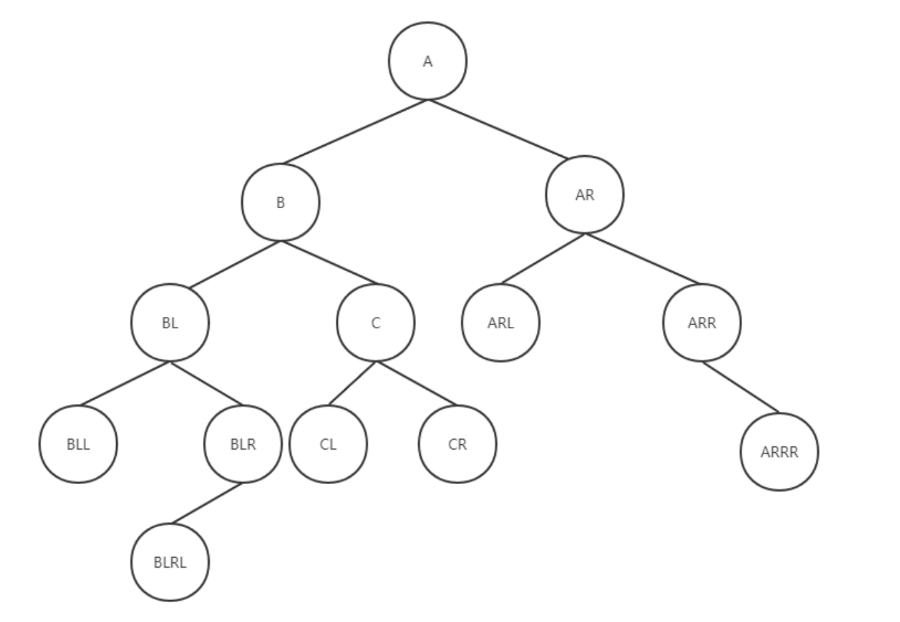
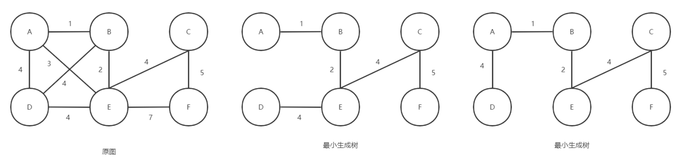
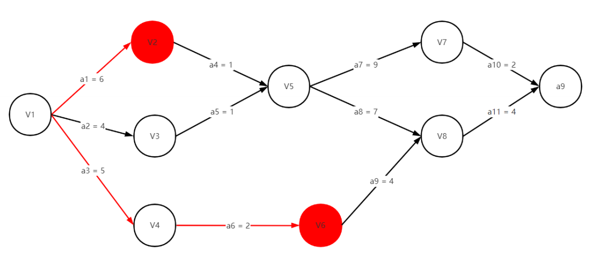

# 数据结构（C++版）

**《数据结构与算法分析》分成两个笔记文件，《数据结构》和《算法分析》。**

## 第一章：数据结构

### 一、线性表

线性表主要分为顺序表和链表。

#### （1）顺序表 

顺序表可用数组实现，链表用结构体和指针实现。 

**顺序表的增删改查代码：**

```c++
#include <bits/stdc++.h>
#define Max 100 
using namespace std;

typedef struct ArrayList {
	int data[Max];
	//int *data
	int maxsize;	//最大容量 
	int size;		//实际容量 
} Array;

//顺序表初始化 
Array initArray()
{
	Array a;
	a.size = 0;
	a.maxsize = Max;
	return a;
}
//末尾增加元素 
void add(Array* a,int x) 
{
	if (a->size < a->maxsize)
	{
		a->data[a->size] = x;
		a->size++;
	}
	else cout<<"该表已满"<<endl; 
}

//第k个位置插入元素x 
void insert(Array* a,int k,int x) 
{
	if (a->size < a->maxsize)
	{
		for (int i = a->size; i >= k; i--) {
			a->data[i+1] = a->data[i];
		}
		a->data[k] = x;
		a->size++;
	}
	else cout<<"该表已满"<<endl; 	
}

//双指针实现删除元素 
void delD(Array* a,int x)
{
	if (a->size == 0) {
		cout<<"空表"<<endl;
		return;
	}
	int fast;	//定义快指针 用来查找数组元素  
	int slow = 1;	//定义慢指针 用来更新数组元素 
	for (fast = 1; fast < a->size; fast++) {
		//如果不等于要删除的数则更新 删除后会自动前移  
		if (a->data[fast] != x) {
			a->data[slow] = a->data[fast];
			slow++;
		}
	} 
	a->size--;
} 

//删除元素x
void del(Array* a,int x)
{
	if (a->size == 0) {
		cout<<"空表"<<endl;
		return;
	}
	int idx = -1;
	for (int i = 1; i < a->size; i++) {
		if (a->data[i] == x) {
			idx = i;
			break;
		}
	}
	if (idx == -1) {
		cout<<x<<"不存在"<<endl;
		return; 
	}
	for (int i = idx; i < a->size; i++) {
		a->data[i] = a->data[i+1];
	}
	a->size--;
}

//输出
void printff(Array a) 
{
	for (int i = 0;i < a.size;i++) {
		cout<<a.data[i]<<" ";
	}
	cout<<endl;
 } 

int main()
{
	Array a;
	a = initArray();
	add(&a,1);
	printff(a);
	add(&a,2);
	printff(a);
	insert(&a,0,3);
	printff(a);
	delD(&a,2);
	printff(a);

    return 0;
}
```

#### （2）链表 

线性表可以在表中任意位置进行增删改查操作。链表无固定大小，随用随取。

链表分为单向链表，双向链表和循环链表。  

##### 1. 单向链表 

单向链表只能往一个方向遍历，如果找一个节点的前一个节点就要重新遍历 ，并且不能逆向遍历。 

**单向链表的操作：**

```c++
#include <bits/stdc++.h>
using namespace std;

typedef struct node{
	int data;			//数据域 
	struct node *next;	//指针域 
}Node,*linklist;

//初始化链表 
linklist initlist()
{
	linklist l = (Node*)malloc(sizeof(Node));
	if (l == NULL) {
		cout<<"内存分配失败"<<endl;
		return NULL;
	}
	else l->next = NULL;
	return l;
}

//头插法 把x插入链表l开头 
//头插法是倒序的 
void head_insert(int x,linklist l)
{
	Node* s = (Node*)malloc(sizeof(Node));
	s->data = x;
	s->next = l->next;
	l->next = s;	
}

//尾插法 把x插入链表l的末尾 
void rear_insert(int x,linklist l)
{
	Node *s = (Node*)malloc(sizeof(Node));
	s->data = x;
	s->next = NULL;
	//遍历找尾节点
	Node *p = l;
	while (p->next != NULL) {
		p = p->next;
	} 
	p->next = s;
}

//中间插入 在y元素的位置后面插入x元素
void mid_insert(int y,int x,linklist l)
{
	Node *s = (Node*)malloc(sizeof(Node));
	s->data = x;
	Node *p = l;
	int a = 0;	//标记是否找到该元素  
	//先查找y元素 
	while (p->next != NULL) {
		p = p->next;
		//如果查找到就插入 
		if (p->data == y) {
			a = 1;
			s->next = p->next;
			p->next = s;
			break;
		}
	}
	if (a == 0) {
		cout<<"未查找到"<<y<<endl; 
		return;
	}
} 

//删除数据为x的节点 
void del(int x,linklist l)
{
	//判断是否为空链表 
	if (l->next == NULL) {
		cout<<"空链表"<<endl;
		return; 
	}
	
	Node *pre = l;	//后指针用来修改 
	Node *p = l->next;//前指针用来查找数据 
	//先找到数据x 
	while (p != NULL && p->data != x) {
		pre = p;
		p = p->next;
	}
	//讨论跳出循环的满足条件  
	if (p == NULL) {
		cout<<"该数据不存在"<<endl;
	}
	else {
		pre->next = p->next;
		free(p);
		p = NULL;
	} 
	
	/* //方法二：在循环里找到就立刻删除  
	while (p != NULL) {
		if (p->data == x) {
			pre->next = p->next;
			free(p);
			p = NULL;
			break;
		}
		else {
			pre = p;
			p = p->next;
		}
	}
	*/
}

//修改数据 把数据k修改成数据x
void update(int k,int x,linklist l)
{
	Node *p = l->next;
	int a = 0;
	while (p != NULL) {
		if (p->data == k) {
			p->data = x;
			a = 1;
			break;
		}
		p = p->next;
	}
	if (a == 0) {
		cout<<"未找到数据"<<k<<endl;
	}	
} 
 
//打印链表
void printff(linklist l) 
{
	Node *p = l->next;
	while (p != NULL) {
		cout<<p->data<<" ";
		p = p->next;
	}
	cout<<endl;
}

int main()
{
	linklist l = initlist();		
	head_insert(1,l);
	head_insert(2,l);
	head_insert(3,l);
	printff(l);
	rear_insert(4,l);
	rear_insert(5,l);
	printff(l);
	mid_insert(4,6,l);
	printff(l);
	del(5,l);
	printff(l);
	update(6,8,l);
	printff(l);
	
	return 0;
}
```

##### 2. 双向链表 

双向链表可以从两个方向遍历，并且在删除元素时不用像单向链表一样遍历找到前一个节点。  

**双向链表的操作：**

```c++
#include <bits/stdc++.h>
using namespace std;

typedef struct node{
	int data;			//数据域 
	struct node *next;	//指针域->存下一个节点的地址 
	struct node *pre;	//指针域->存上一个节点的地址 
}Node,*linklist;

//初始化链表 
linklist initlist()
{
	linklist l = (Node*)malloc(sizeof(Node));
	if (l == NULL) {
		cout<<"内存分配失败"<<endl;
		return NULL;
	}
	else {
		l->next = NULL;
		l->pre = NULL; 
	}
	return l;
}

//头插法 把x插入链表l开头 
//头插法是倒序的 
void head_insert(int x,linklist l)
{
	Node* s = (Node*)malloc(sizeof(Node));
	s->data = x;
	s->next = l->next;
	l->next = s;
	s->pre = l;
	//需要判断下一个节点是否存在：如果s->next为空，则s->next->pre不存在 
	if (s->next != NULL) {
		s->next->pre = s;
	}
}

//尾插法 把x插入链表l的末尾 
void rear_insert(int x,linklist l)
{
	Node *s = (Node*)malloc(sizeof(Node));
	s->data = x;
	s->next = NULL;
	//遍历找尾节点
	Node *p = l;
	while (p->next != NULL) {
		p = p->next;
	} 
	p->next = s;
	s->pre = p; 
}

//中间插入 在y元素的位置后面插入x元素
void mid_insert(int y,int x,linklist l)
{
	Node *s = (Node*)malloc(sizeof(Node));
	s->data = x;
	Node *p = l;
	int a = 0;
	//先查找y元素 
	while (p->next != NULL) {
		p = p->next;
		//如果查找到就插入 
		if (p->data == y) {
			a = 1;
			s->next = p->next;
			s->pre = p;
			p->next->pre = s;
			p->next = s;
			break;
		}
	}
	if (a == 0) {
		cout<<"未查找到"<<y<<endl; 
		return;
	}
} 

//删除数据为x的节点 
void del(int x,linklist l)
{
	//判断是否为空链表 
	if (l->next == NULL) {
		cout<<"空链表"<<endl;
		return; 
	}
	Node *p = l->next;//首元 
	//先找到数据x 
	while (p != NULL && p->data != x) {
		p = p->next;
	}
	if (p == NULL) {
		cout<<"该数据不存在"<<endl;
	}
	else {
		p->pre->next = p->next;
		//需要判断下一个节点是否存在：如果s->next为空，则s->next->pre不存在 
		if (p->next != NULL) {
			p->next->pre = p->pre;
		}
		free(p);
		p = NULL;
	} 
	/* //方法二： 
	while (p != NULL) {
		if (p->data == x) {
			p->pre->next = p->next;
			if (p->next != NULL) {
				p->next->pre = p->pre;
			}
			free(p);
			p = NULL;
			break;
		}
		else {
			p = p->next;
		}
	}
	*/
}

//修改数据 把数据k修改成数据x
void update(int k,int x,linklist l)
{
	Node *p = l->next;
	int a = 0;
	while (p != NULL) {
		if (p->data == k) {
			p->data = x;
			a = 1;
			break;
		}
		p = p->next;
	}
	if (a == 0) {
		cout<<"未找到数据"<<k<<endl;
	}	
} 

//打印链表
void printff(linklist l) 
{
	Node *p = l->next;
	while (p != NULL) {
		cout<<p->data<<" ";
		p = p->next;
	}
	cout<<endl;
}

int main()
{
	linklist l = initlist();		
	head_insert(1,l);
	head_insert(2,l);
	head_insert(3,l);
	printff(l);
	rear_insert(4,l);
	rear_insert(5,l);
	printff(l);
	mid_insert(4,6,l);
	printff(l);
	del(5,l);
	printff(l);
	update(6,8,l);
	printff(l);
	
	return 0;
}
```

##### 3. 循环链表

循环链表分为循环单链表和循环双链表。

循环链表就是把尾指针指向头结点，循环链表也区分头和尾。

**下面是循环双链表的增删改查：**

```c++
#include <bits/stdc++.h>
using namespace std;

typedef struct node{
	int data;			//数据域 
	struct node *next;	//指针域->存下一个节点的地址 
	struct node *pre;	//指针域->存上一个节点的地址 
}Node,*linklist;

//初始化链表 
linklist initlist()
{
	linklist l=(Node*)malloc(sizeof(Node));
	if (l==NULL) {
		cout<<"内存分配失败"<<endl;
		return NULL;
	}
	else {
		//自己指向自己 
		l->next=l;
		l->pre=l; 
	}
	return l;
}

//头插法 把x插入链表l开头 
//头插法是倒序的 
void head_insert(int x,linklist l)
{
	Node* s=(Node*)malloc(sizeof(Node));
	s->data=x;
	s->next=l->next;
	l->next=s;
	s->pre=l;
	s->next->pre=s;
}

//尾插法 把x插入链表l的末尾 
void rear_insert(int x,linklist l)
{
	Node *s=(Node*)malloc(sizeof(Node));
	s->data=x;
	s->next=l;
	l->pre=s;
	//遍历找尾节点
	Node *p=l;
	while (p->next!=l) {
		p=p->next;
	} 
	p->next=s;
	s->pre=p; 
}

//中间插入 在y元素的位置后面插入x元素
void mid_insert(int y,int x,linklist l)
{
	Node *s=(Node*)malloc(sizeof(Node));
	s->data=x;
	Node *p=l;
	int a=0;
	//先查找y元素 
	while (p->next!=l) {
		p=p->next;
		//如果查找到就插入 
		if (p->data==y) {
			a=1;
			s->next=p->next;
			s->pre=p;
			p->next->pre=s;
			p->next=s;
			break;
		}
	}
	if (a==0) {
		cout<<"未查找到"<<y<<endl; 
		return;
	}
} 

//删除数据为x的节点 
void del(int x,linklist l)
{
	//判断是否为空链表 
	if (l->next==l) {
		cout<<"空链表"<<endl;
		return; 
	}
	Node *p=l->next;//首元 
	//先找到数据x 
	while (p!=l && p->data!=x) {
		p=p->next;
	}
	if (p==l) {
		cout<<"该数据不存在"<<endl;
	}
	else {
		p->pre->next=p->next;
		p->next->pre=p->pre;
		free(p);
		p=NULL;
	} 
	/* //方法二： 
	while (p!=l) {
		if (p->data==x) {
			p->pre->next=p->next;
			p->next->pre=p->pre;
			free(p);
			p=NULL;
			break;
		}
		else {
			p=p->next;
		}
	}
	*/
}

//修改数据 把数据k修改成数据x
void update(int k,int x,linklist l)
{
	Node *p=l->next;
	int a=0;
	while (p!=l) {
		if (p->data==k) {
			p->data=x;
			a=1;
			break;
		}
		p=p->next;
	}
	if (a==0) {
		cout<<"未找到数据"<<k<<endl;
	}	
} 

//打印链表
void printff(linklist l) 
{
	Node *p=l->next;
	while (p!=l) {
		cout<<p->data<<" ";
		p=p->next;
	}
	cout<<endl;
}

int main()
{
	linklist l=initlist();		
	head_insert(1,l);
	head_insert(2,l);
	head_insert(3,l);
	printff(l);
	rear_insert(4,l);
	rear_insert(5,l);
	printff(l);
	mid_insert(4,6,l);
	printff(l);
	del(5,l);
	printff(l);
	update(6,8,l);
	printff(l);
	
	return 0;
}
```

#### （3）栈

栈其实也是一种线性表。

<font color="red">**遵循原则：先进后出**</font>

只能在一端进行入栈，出栈操作，不能从中间，栈底操作。 不能进行遍历操作，只能查看栈顶元素，其他元素不可查看。

可以用数组和链表实现。

n个不同的元素按照某种顺序入栈，对应的合法出栈顺序有C<sub>n</sub>个（卡特兰数）：
$$
C_n = \frac{1}{n+1} \ C(n,2n)
$$

##### 1. 顺序栈

顺序栈基于数组实现。

**下面是顺序栈各个操作的代码：**

```c++
#include <bits/stdc++.h>
#define maxx 10
using namespace std;

typedef struct {
	int* data;	//模拟开一维数组 
	int top;	//栈顶（下标） 
}sstack;

//初始化顺序栈 
sstack initsstack()
{
	sstack s;
	s.data=(int*)malloc(sizeof(int)*maxx);
	s.top=-1;
	return s;
}

//入栈操作 栈中内容不一样，地址传参 
void ppush(sstack* s,int k)
{
	//需要判满 
	if (s->top==maxx-1) {
		cout<<"栈满，不能入栈"<<endl;
		return;
	} 
	s->top++;
	s->data[s->top]=k;
}

//出栈操作
void pop(sstack* s) 
{
	//需要判空 
	if (s->top==-1) {
		cout<<"栈空，不能出栈"<<endl;
		return;
	} 
	s->top--;
} 

//查找栈顶元素 
void gettop(sstack s)
{
	//需要判空 
	if (s.top==maxx-1) {
		cout<<"栈空"<<endl;
		return;
	} 
	cout<<s.data[s.top]<<endl;
}

int main()
{
	sstack s=initsstack();
	ppush(&s,1);
	ppush(&s,2);
	ppush(&s,3);
	gettop(s);
	pop(&s);
	pop(&s);
	gettop(s);
	return 0; 
}

```

##### 2. 链栈

链栈基于链表实现。

**下面是关于单向链表栈各个操作的代码：**

```C++
#include <bits/stdc++.h>
using namespace std;

//链栈采用单向链表实现 
typedef struct node{
	int data;
	node* next;
}Node,*sstack;

//初始化链栈 
sstack initstack()
{
	Node* s=(Node*)malloc(sizeof(Node));
	if (s==NULL) {
		cout<<"内存分配失败"<<endl;
		return NULL;
	}
	else {
		s->next=NULL;
		return s;
	}
}

//入栈  采用头插法（可以不用遍历链表） 
void ppush(sstack s,int k)
{
	Node* p=(Node*)malloc(sizeof(Node));
	p->data=k;
	p->next=s->next;
	s->next=p;
}

//出栈 (删除链表头结点)
void pop(sstack s)
{
	//删除前判空 
	if (s->next==NULL) {
		cout<<"栈空，无法出栈"<<endl;
		return;
	}	
	else {
		Node* p=s->next;
		cout<<p->data<<"已出栈"<<endl; 
		s->next=p->next;
		free(p);
		p=NULL;
	}
} 

//查找栈顶元素 
void gettop(sstack s)
{
	//需要判空 
	if (s->next==NULL) {
		cout<<"该栈为空栈"<<endl;
		return;
	}
	else {
		cout<<s->next->data<<endl;
	}
}

int main()
{
	sstack s=initstack();
	ppush(s,1);
	ppush(s,2);
	ppush(s,3);
	gettop(s);
	pop(s);
	pop(s);
	gettop(s);
	return 0; 
}

```

#### （4）队列

队列都属于线性表。

<font color="red">**队列只能从一端（队尾）插入数据，从另一端（队首）删除数据。**</font>

**中间不能进行操作，不能遍历，只能查看队首元素。**

##### 1. 循环队列

顺序队列会造成假溢出的错误，浪费内存空间，所以采用循环队列。

顺序队列和循环队列均用数组实现。循环队列用循环数组实现。 

**下面是循环队列的各个操作代码：**

```C++
#include <bits/stdc++.h>
#define maxx 10
using namespace std;

typedef struct {
	int *data;	//指针模拟开数组 
	int f,r;	//前后端：本质是下标 
	//r为后端数据的下一个下标，f为前端数据的真实下标 
}squeue; 

//初始化循环队列 
squeue initsqueue()
{
	squeue q;
	q.data=(int*)malloc(sizeof(int)*maxx);
	q.f=0;
	q.r=0;
	return q;
}

//入队 
void enqueue(squeue* q,int k)
{
	//判满		牺牲一个内存空间来判满 否则无法判断满还是空 
	//下标从0到maxx-1，一共maxx个元素 
	if (q->f==(q->r+1)%maxx) {
		cout<<"队已满,无法入队"<<endl; 
		return;
	} 
	q->data[q->r]=k;
	q->r=(q->r+1)%maxx;
}

//出队
void dequeue(squeue* q)
{
	//判空
	if (q->r==q->f) {
		cout<<"队已空,无法出队"<<endl;
		return; 
	}	
	cout<<q->data[q->f]<<"已出队"<<endl;
	q->f=(q->f+1)%maxx;
} 

//查看队首元素
void getfront(squeue q)
{
	//判空
	if (q.r==q.f) {
		cout<<"空队"<<endl;
		return; 
	}	
	cout<<q.data[q.f]<<endl;
} 


int main()
{
	squeue q=initsqueue();
	enqueue(&q,1);
	enqueue(&q,2);
	enqueue(&q,3);
	getfront(q);
	dequeue(&q);
	getfront(q);
	return 0; 
}
```

##### 2. 链式队列

链式队列基于链表实现，无须担心溢出问题。

**下面是单向链表链式队列的各个操作的代码：**

```C++
#include <bits/stdc++.h>
using namespace std;

typedef struct qnode{	//链式队列节点 
	int data;	//队列元素 
	qnode* next;//指针域 
}qnode,*lqueue; 

typedef struct linkqueue{	//头尾节点 
	lqueue f,r;		//队首指针是头结点  
}linkqueue;

//初始化链式队列 
void initqueue(linkqueue* q)
{
	q->f=q->r=(qnode*)malloc(sizeof(qnode));
	if (q->f==NULL) {
		cout<<"内存分配失败"<<endl;
	}
	else {
		q->f->next=NULL;
	}
} 

//入队
void enqueue(linkqueue* q,int x)
{
	lqueue s=(lqueue)malloc(sizeof(qnode));
	s->data=x;
	s->next=NULL;
	q->r->next=s;
	q->r=s;
}

//出队 
void dequeue(linkqueue* q)
{
	int x;
	//判空 
	if (q->f->next==NULL) {
		cout<<"队空,无法出队"<<endl; 
	}
	else {
		lqueue p=q->f->next;
		//保存出队元素 
		x=p->data;
		q->f->next=p->next;
		cout<<x<<"已出队"<<endl;
		//如果出队后队空，要修改尾指针 
		if (q->r==p) {
			q->r=q->f;
		}
		free(p);
		p=NULL;
	}
} 

//查看队首元素
void getfront(linkqueue* q)
{
	if (q->f->next==NULL) {
		cout<<"队空"<<endl;
	}
	else cout<<q->f->next->data<<endl;
} 

int main()
{
	linkqueue* q;
	q=(linkqueue*)malloc(sizeof(linkqueue));
	initqueue(q);
	enqueue(q,1);
	enqueue(q,2);
	enqueue(q,3);
	getfront(q);
	dequeue(q);
	dequeue(q);
	dequeue(q);
	dequeue(q);
	enqueue(q,4);
	getfront(q);
	dequeue(q);
	dequeue(q);
	getfront(q);
	return 0; 
}
```

##### 3. 双端队列

​	双端队列的两端均可以进行插入和删除操作。
​	如果双端队列用顺序数组实现，就会造成内存空间浪费，所以双端队列也用循环数组实现。
​	队列插入时应规定第一次插入必须是左（右）端插入，否则会造成数据丢失。

双端队列的作用：**一种结构实现两种结构的功能。**

1. 左插入 + 左删除 == 栈
2. 左插入 + 右删除 == 队列 
3. 左插入只能左删除 + 右插入只能右删除 == 栈底放在一起的两个栈 

**下面是循环双端队列的各个操作的代码：**

```C++
#include <bits/stdc++.h>
#define maxx 10
using namespace std;

//定义双端队列 
typedef struct {
	int *data;	//一维数组 
	int l,r;	//左右指针（下标） 
	int sum;	//计数器(元素个数)---->用来判空判满 
}douqueue;

//初始化双端队列 
douqueue initqueue()
{
	douqueue q;
	q.data=(int*)malloc(sizeof(int)*maxx);		//模拟开一维数组 
	q.l=0;
	q.r=0;
	q.sum=0;
	return q;
}

//规定第一次插入必须为左端插入 
//l指向左端数据的前一个（左边）下标，r为右端数据的真实下标  
 
//左端插入 
void left_insert(douqueue* q,int k)
{
	//判满
	if (q->sum==maxx) {
		cout<<"队列已满"<<endl;
		return;
	}	
	else {
		q->data[q->l]=k;
		q->l=(q->l-1+maxx)%maxx;	//q->l-1可能是负数，所以要加maxx再取模 
		q->sum++;
	}
} 
 
//左端删除 
void left_del(douqueue* q)
{
	int x;	//用来保存已删除的元素 
	//判空 
	if (q->sum==0) {
		cout<<"队列已空"<<endl;
		return;
	} 
	else {
		x=q->data[(q->l+1)%maxx];
		cout<<"删除了"<<x<<endl;
		q->l=(q->l+1)%maxx;
		q->sum--; 
	}
 } 
 
//右端插入 
void right_insert(douqueue* q,int k)
{
	//判满 
	if (q->sum==maxx) {
		cout<<"队列已满"<<endl;
		return;
	}	
	else {
		q->r=(q->r+1)%maxx;
		q->data[q->r]=k;
		q->sum++;
	}
} 
 
//右端删除 
void right_del(douqueue* q)
{
	int x;	
	//判空 
	if (q->sum==0) {
		cout<<"队列已空"<<endl;
		return;
	} 
	else {
		x=q->data[q->r];
		cout<<"删除了"<<x<<endl;
		q->r=(q->r-1+maxx)%maxx;	//q->r-1可能是负数，所以要加maxx再取模 
		q->sum--; 
	}
} 
 
//输出队列元素 
void pri(douqueue q)
{
	//从左到右输出 
	for (int i=(q.l+1)%maxx;i!=q.r+1;i=(i+1)%maxx) {
		cout<<q.data[i]<<" ";
	}	
	cout<<endl;
} 
 
 
int main()
{
	douqueue q=initqueue();
	left_insert(&q,1);
	left_insert(&q,2);
	left_insert(&q,3);
	pri(q);
	right_insert(&q,4);
	right_insert(&q,5);
	pri(q);
	left_del(&q);
	left_del(&q);
	right_del(&q);
	pri(q);
	
	return 0;
}
```

**链式双端队列：**

链式双端队列是用双向链表实现的，该双向链表无头结点，有一个中间节点(与头结点相似)，并且中间节点是要存数据的， 必须先规定中间节点存的数据是第一次左（右）端插入的数据，也就是说规定第一次插入数据必须用左（右）端插入。

**下面是链式双端队列的各个操作的代码：**

```C++
#include <bits/stdc++.h>
using namespace std;

typedef struct Node{
	int data;
	Node* pre;
	Node* next;
}node; 

node* l;	//左指针 
node* r;	//右指针 

//初始化双向链表 
void initqueue()
{
	node* s=(node*)malloc(sizeof(node));
	s->pre=s->next=NULL;
	l=r=s;
} 

//规定第一次插入数据必须为右端插入
//l指向真实的左端数据，r指向右端数据的下一个节点 
//n个数据有n+1个节点 
 
//左端插入 
void  left_insert(int k)
{
	node* s=(node*)malloc(sizeof(node));
	s->data=k;
	s->pre=NULL;
	l->pre=s;
	s->next=l;
	l=s;
}

//右端插入 
void right_insert(int k)
{
	node* s=(node*)malloc(sizeof(node));
	r->data=k;
	r->next=s;
	s->next=NULL;
	s->pre=r;
	r=s; 
} 

//左端删除 
void left_del()
{
	//判空 
	if (l==r) {
		cout<<"表空"<<endl;
		return;
	}	
	node* p=l;
	l=l->next;
	l->pre=NULL;
	cout<<"删除了"<<p->data<<endl;
	free(p);
	p=NULL;
} 

//右端删除 
void right_del()
{
	//判空 
	if (l==r) {
		cout<<"表空 "<<endl;
		return;
	}	
	node* p=r;
	r=r->pre;
	r->next=NULL;
	cout<<"删除了"<<r->data<<endl;
	free(p);
	p=NULL;
} 

//输出队列 
void pri()
{
	node* q=l;
	while (q!=r) {
		cout<<q->data<<" ";
		q=q->next;
	}
	cout<<endl;	
} 
 
int main()
{
	initqueue();
	left_insert(1);
	left_insert(2);
	left_insert(3);
	right_insert(4);
	right_insert(5);
	pri();
	left_del();
	right_del();
	right_del();
	pri();
	return 0;
}
```

#### （5）压缩矩阵

矩阵可以使用二维数组存储，但当矩阵中含有大量重复元素时（稀疏矩阵含有大量0元素），使用二维数组存储会浪费内存空间。这时采用三元组压缩存储矩阵可节省空间。三元组是包含三个元素的结构体，分别是该元素的行号，列号和元素值，将不重复的元素存储至三元组中，组成数据数组，再将数据数组与矩阵的行数，列数和非重复元素值个数组成结构体，即为矩阵结构体。

**压缩矩阵的转置：**

转置矩阵可以新定义一个矩阵t，将原矩阵m转置后存储至t中。主行序存储矩阵时，首先遍历m矩阵的各个非0元素，同时定义指针k遍历m矩阵的列号，也就是t矩阵的行号，当元素的列号与t的行号相等时，将该元素列号与行号互换，存储至t矩阵中。

上面的方法需要时间复杂度为 O(N*M)；运算效率低，此时新定义两个数组num和cpot，num数组表示m矩阵该列有多少个非0元素，cpot数组表示t矩阵该行的第一个非0元素是整个矩阵的第几个非0元素，求出两个数组，即可只遍历一遍就能转置成功。

**下面是压缩矩阵及操作的代码：**

```c++
#include <bits/stdc++.h>
using namespace std;

typedef struct {
    int row;     //行索引 
    int col;     //列索引 
    int value;   //非零元素的值 
}triple;

typedef struct {
    triple *data;   //存储所有非零元素的三元组 
    int rows;       //矩阵的行数 
    int cols;       //矩阵的列数 
    int n;       //非零元素的总数 
}matrix;


//输入数据并判断 
bool inputData(matrix* m, int index)
{
	int row,col,value;
	cout<<"请按照主行序依次输入第"<<index<<"个非零元素的行号，列号和元素值："<<endl;
	cin>>row>>col>>value;
	
	//下标不可越界  
	if (row <= 0 || row > m->rows || col <= 0 || col > m->cols) {
		cout<<"行号或列号错误，请重新输入！"<<endl;
		return false;
	}
	
	//下标不可重复  
	for (int i = 1; i <= m->n; i++) {
		if (m->data[i].row == row && m->data[i].col == col) {
			cout<<"输入错误，输入的下标重复，请重新输入！"<<endl;
			return false;
		}
	} 
	
	//下标不可递减 
	if (row == m->data[index - 1].row && index > 1 && col < m->data[index - 1].col) {
		cout<<"输入错误，下标输入时要递增输入，请重新输入！"<<endl;
		return false; 
	} 
	if (index > 1 && row < m->data[index-1].row) {
		cout<<"输入错误，下标输入时要递增输入，请重新输入！"<<endl;
		return false; 
	}
	
	m->data[index].row = row;
	m->data[index].col = col;
	m->data[index].value = value;
	return true;
} 

//1. 创建矩阵 
matrix* initMatrix()
{
	int rows, cols, n;
	cout<<"请依次输入行数，列数以及非零元素个数：";
	bool flag = false;
	while (!flag) {
		cin>>rows>>cols>>n;
		flag = false;
		if (n > rows * cols) {
			cout<<"输入错误，非零元素个数要小于等于行数乘列数，请重新输入。"<<endl;
		}
		else {
			flag = true;
		}
	} 
	
	matrix* m = (matrix*)malloc(sizeof(matrix));
	if (m == NULL) {
		cout<<"内存分配失败"<<endl;
		return m;
	}
	
	m->rows = rows;
	m->cols = cols;
	m->n = n;
	m->data = (triple*)malloc(sizeof(triple) * n);
	if (m->data == NULL) {
		cout<<"内存分配失败"<<endl;
		return m;
	}
	
	for (int i = 1; i <= n; i++) {
		m->data[i].row = -1;
		m->data[i].col = -1;
	}
	
	for (int i = 1; i <= n; i++) {
		while (!inputData(m,i)) {
			
		}
	}
	
	return m;	
}

//2. 销毁矩阵 
matrix* destroyMatrix(matrix* m)
{
	free(m->data);
	m->data = NULL;
	free(m);
	m = NULL; 
	return m;
}

//3. 输出矩阵 
void printMatrix(matrix* m)
{
	int k = 1;
	for (int i = 1; i <= m->rows; i++) {
		for (int j = 1; j <= m->cols; j++) {
			if (m->data[k].row == i && m->data[k].col == j) {
				cout<<m->data[k].value<<" ";
				k++;
			}
			else {
				cout<<0<<" ";
			}
		}
		cout<<endl;
	}
}

//4. 转置矩阵 
matrix* transMatrix(matrix* m)
{
	matrix* t = (matrix*)malloc(sizeof(matrix));
	t->n = m->n;
	t->data = (triple*)malloc(sizeof(triple) * t->n);
	t->cols = m->rows;
	t->rows = m->cols;
	
	int k = 1;
	for (int i = 1; i <= m->cols; i++) {
		for (int j = 1; j <= m->n; j++) {
			if (m->data[j].col == i) {
				t->data[k].row = m->data[j].col;
				t->data[k].col = m->data[j].row;
				t->data[k].value = m->data[j].value;
				k++;
			}
		}
	}
	
	return t;
}

//5. 快速转置矩阵 
matrix* quickTransMatrix(matrix* m)
{
	matrix* t = (matrix*)malloc(sizeof(matrix));
	t->n = m->n;
	t->data = (triple*)malloc(sizeof(triple) * t->n);
	t->cols = m->rows;
	t->rows = m->cols;
	
	int* num = (int*)calloc(m->cols,sizeof(int));
	int* cpot = (int*)calloc(m->cols,sizeof(int));	
	
	for (int i = 1; i <= m->n; i++) {
		num[m->data[i].col]++;
	}
	
	cpot[1] = 1;
	for (int i = 2; i <= m->cols; i++) {
		cpot[i] = cpot[i-1] + num[i-1];
	}
	
	for (int i = 1; i <= m->n; i++) {
		int index = cpot[m->data[i].col];
		t->data[index].col = m->data[i].row;
		t->data[index].row = m->data[i].col;
		t->data[index].value = m->data[i].value;
		cpot[m->data[i].col]++;
	}
	
	return t;
}

//菜单  
void menu()
{
	cout<<"1. 创建矩阵"<<endl;
	cout<<"2. 销毁矩阵"<<endl;
	cout<<"3. 输出矩阵"<<endl;
	cout<<"4. 转置矩阵"<<endl;
	cout<<"5. 快速转置矩阵"<<endl;
	cout<<"6. 退出"<<endl;
	
	matrix* m = NULL;
	
	while (true) {
		cout<<"请输入操作码：";
		int choice;
		cin>>choice;
		
		if (m == NULL && choice >= 3 && choice <= 5) {
			cout<<"请先创建矩阵"<<endl;
			continue;
		}
		
		switch (choice) {
			case 1:
				if (m != NULL) {
					cout<<"矩阵已创建"<<endl;
				}
				else {
					m = initMatrix();
					if (m == NULL) {
						cout<<"创建失败"<<endl;
					}
					else {
						cout<<"创建成功"<<endl;
					}
				}
				break;
			case 2:
				if (m == NULL) {
					cout<<"矩阵已销毁"<<endl;
				}
				else {
					m = destroyMatrix(m);
					if (m == NULL) {
						cout<<"销毁成功"<<endl; 
					}
					else {
						cout<<"销毁失败"<<endl;
					} 
				}
				break;
			case 3:
				printMatrix(m);
				break;
			case 4:
				m = transMatrix(m);
				cout<<"转置成功"<<endl;
				break;
			case 5:
				m = quickTransMatrix(m);
				cout<<"转置成功"<<endl;
				break;
			case 6:
				cout<<"感谢使用"<<endl;
				return;
			default: 
				cout<<"操作码错误"<<endl; 
		} 
	} 
}

int main()
{
	menu();
	return 0;
} 

/*
3
1
4 4 25
4 4 5
0 5 1
1 1 1
2 3 2
2 3 6
1 1 6
3 1 3
3 4 5
3 2 9
2 3 8
4 2 4
3
4
3
5
3
2
2
3
7
6
*/
```

### 二、树

树：非线性数据结构。 

- 逻辑结构：一对多
- 树型结构是一个具有n个数据的有限集合，每个数据放到一个节点中。 
- 树具有递归性：树中还有树。 
- 子树：原树的子集。  
- 根节点：有且仅有一个的特殊节点,没有前驱,其他n-1个节点均有一个前驱和若干个（包括0）后继。 
- 叶子结点：没有后继的节点 (度为0)。
- 内部节点（根节点 + 其他节点）：有后继的节点。 
- 父子节点：父(双亲)节点，子节点。  
- 兄弟节点：广义兄弟关系，狭义兄弟关系。 

​	广义兄弟关系类似于表兄弟，狭义兄弟关系类似于亲兄弟。

- 节点的度：节点拥有的子树个数。 
- 树的度：所有节点的度的最大值。  
- 一棵树的度是n，就把该树称为n叉树。 
- 树的高度和深度：数值上相等，等于树的层数。 

​    高度：从下往上数	深度：从下往上数。 

普通树的存储结构：双亲表示法，孩子表示法，孩子兄弟表示法（基于递归）。 

#### （1）普通树的存储结构

##### 1. 双亲表示法

​	双亲表示法：基于顺序表实现，表元素由两部分组成。  

​	一部分是数据，另一部分是父亲节点的下标。 

​	根节点父亲节点的下标为 -1。  

​	优缺点：找父亲节点比较方便，找孩子节点比较复杂，要遍历整个顺序表。

**下面是双亲表示法的操作及代码：**

```C++
#include <bits/stdc++.h>
#define maxx 100
using namespace std;

typedef struct TreeNode{
	int data;	//数据 
	int parent;	//双亲节点的下标 
}TreeNode; 

TreeNode t[maxx];	//存树中数据的顺序表 	 
int size;			//树中实际元素个数 
int n;				//n为树中数据的个数 

//查找元素x的下标   
int find(int x)
{
	for (int i=0;i<n;i++) {
		if (t[i].data==x) {
			return i;
		}
	}
}

//查找父亲节点  
void find_fa(int x)
{
	int j;
	for (int i=0;i<n;i++) {
		if (t[i].data==x) {
			j=t[i].parent;
			break;
		}
	}
	if (j==-1) cout<<"该节点为根节点"<<endl;
	else cout<<"父亲节点数据为："<<t[j].data<<endl;
}

//查找孩子节点 
void find_ch(int x)
{
	int xi=find(x);
	cout<<"孩子节点数据为：";
	for (int i=0;i<n;i++) {
		if (t[i].parent==xi) {
			cout<<t[i].data<<" ";
		}
	}
}

int main()
{
	int x,y;
	//输入数据并初始化 
	cin>>n;
	for (int i=0;i<n;i++) {
		cin>>t[i].data;
		t[i].parent=-1;		//初始化双亲节点下标 
	} 
	
	//建立关系 
	for (int i=1;i<n;i++) {		//n个数据有n-1对关系 
		cin>>x>>y;				//x是y的父亲  
		t[find(y)].parent=find(x);
	}
	
	//找x的双亲节点和孩子节点  
	cin>>x;
	find_fa(x);
	find_ch(x);
	
	return 0;
}
```

##### 2. 孩子表示法

孩子表示法：基于顺序表 + 链表实现 

用顺序表存储每个节点的数据，并给每个节点配一个链表来存储孩子节点在顺序表中的位置 


优缺点：找孩子节点方便，找双亲节点复杂,需要遍历整个表。

如果既要找双亲节点，又要找孩子节点，就在数的结构体中加一个数据域，来存放父亲节点数据的下标（把双亲表示法和孩子表示法结合起来）。

**下面是孩子表示法的操作及代码：**

```c++
#include <bits/stdc++.h>
#define maxx 100
using namespace std;

//链表结构体 
typedef struct linkNode{
	int ind;			//数据域：孩子下标 
	linkNode* next; 	//指针域 
}linknode;

//树的结构体 
typedef struct TreeNode{
	char data;
	linknode* l;	//该节点孩子链表的头指针  
}TreeNode; 

//初始化树并存入根节点 
void inittree(TreeNode t[],int n,char x)
{
	t[0].data=x;
	for (int i=0;i<n;i++) {
		t[i].l=NULL;
	}	
} 

//找数据x的下标 一共有n个节点  
int find(TreeNode t[],int n,char x) 
{
	for (int i=0;i<n;i++) {
		if (t[i].data==x) {
			return i;
		}
	}
}

//根据建立的关系插入数据 
void insert(TreeNode t[],int i,char x,char y)
{
	t[i].data=y;
	int xi=find(t,i-1,x);	//此时一共有i个节点，y是第i个节点，所以传参用i-1 
	linknode* s=(linknode*)malloc(sizeof(linknode));
	s->ind=i;
	
	//采用头插法插入数据  
	s->next=t[xi].l;
	t[xi].l=s;
} 

//找x的孩子节点数据  
void find_ch(TreeNode t[],char x,int n)
{
	int xi=find(t,n,x);
	int j;
	linknode* p=t[xi].l;
	if (p==NULL) {
		cout<<x<<"为叶子节点,没有孩子节点"<<endl;
		return;
	}
	else cout<<x<<"的孩子节点数据有:";
	while (p!=NULL) 
	{
		j=p->ind;
		cout<<t[j].data<<" ";
		p=p->next;
	}
	cout<<endl;
}

//找x的双亲节点数据 
void find_fa(TreeNode t[],char x,int n)
{
	int xi=find(t,n,x);
	int flag=0;
	for (int i=0;i<n;i++) {
		linknode* p=t[i].l;
		while (p!=NULL) {
			if (xi==p->ind) {
				flag=1;
				break;
			}
			p=p->next;
		}
		if (flag==1) {
			cout<<x<<"的双亲节点数据为:"<<t[i].data<<endl;
			break;
		}
	}
	if (flag==0) cout<<x<<"为根节点,没有双亲节点"<<endl;
} 

int main()
{
	TreeNode t[maxx];
	int n;	//树中节点数目 
	cin>>n;
	char x,y;
	getchar();		//用来吞掉换行符 
	cin>>x;			//输入根节点 
	inittree(t,n,x);//存储根节点并初始化树
	
	//建立关系 
	for (int i=1;i<n;i++) {
		getchar();
		cin>>x>>y;		//x是y的父亲节点
		insert(t,i,x,y); 
	}
	
	//找x元素的孩子节点数据 
	getchar();
	cin>>x;
	find_ch(t,x,n);
	find_fa(t,x,n);
	
	return 0;
}

/*
10
R
R A
R B
R C
A D
A E
C F
F G
F H 
F K

*/
```

##### 3. 孩子兄弟表示法

孩子兄弟表示法：基于递归和二叉链表存储 

二叉链表有两个指针域，分别指向孩子节点和第一个狭义兄弟节点 

优点：找孩子节点方便，较为灵活，可以实时插入  

**下面是孩子兄弟表示法的操作及代码：**

```C++
#include <bits/stdc++.h>
using namespace std;

//二叉链表的节点结构体 
typedef struct Node{
	char data;
	struct Node* first;		//第一个孩子节点  
	struct Node* bro;		//第一个兄弟节点  
}TNode,*TreeList; 

//初始化二叉链表并存入根节点数据  
TreeList initTree(char root)
{
	TNode* r=(TNode*)malloc(sizeof(TNode));
	r->data=root;
	r->bro=NULL;
	r->first=NULL;
	return r;	
}

//在树r中找到x的所在节点  
/*
	递归思路  
	通过指针p遍历寻找，p初始化为根节点 
	和p的数据对比，如果一样就返回p
	如果不一样，x可能出现在孩子子树中--->在以p->first为根节点的树中找x
	x可能出现在兄弟子树中--->在以p->bro为根节点的树中找x
*/
TNode* find(TreeList r,char x)
{
	//根节点为答案或该树为空树  
	if (r->data==x || r==NULL) {
		return r;
	} 
	
	//如果孩子子树存在，就去孩子子树里找，递归调用  
	if (r->first!=NULL) {
		TNode* ans=find(r->first,x);
		if (ans!=NULL) {
			return ans;
		}
	}
	//如果兄弟子树存在，就去兄弟子树里找，递归调用  
	if (r->bro!=NULL) {
		TNode* ans=find(r->bro,x);
		if (ans!=NULL) {
			return ans;
		}
	}
	//如果兄弟子树也不存在，那就没有x 
	return NULL; 
}

//插入x数据，x数据的父亲节点数据是fx 
void insert(TreeList r,char x,char fx) 
{
	//先找fx所在的节点
	TNode* f=find(r,fx); 
	if (f==NULL) {
		cout<<"父亲节点不存在，插入失败"<<endl;
		return;
	}
	TNode* s=(TNode*)malloc(sizeof(TNode));
	s->data=x; 
	s->first=NULL;
	//判断是否有第一个孩子，如果没有则该节点作为第一个孩子   
	if (f->first==NULL) {
		f->first=s;
		s->bro=NULL;
	}
	//如果有，则作为第一个孩子节点的兄弟节点  
	else {
		//头插法  
		s->bro=f->first->bro;
		f->first->bro=s;
	}
} 

int main()
{
	int n;		//数据个数 
	char d,fd;		//数据 
	cin>>n;
	getchar();
	cin>>d;		//输入根节点数据 
	TreeList r=initTree(d); 
	
	//插入剩下的n-1个数据并建立关系  
	for (int i=2;i<=n;i++) {
		getchar();
		cin>>d>>fd;		//d是要插入的数据，fd是d的父亲节点(fd已经在树中)
		insert(r,d,fd); 
	}
	getchar();
	char x;
	
	//找x的孩子节点数据 
	cin>>x;
	TNode* p=find(r,x);
	TNode* fir=p->first;
	//如果第一个孩子存在，则遍历完兄弟节点  
	if (fir!=NULL) {
		p=fir;
		while (p!=NULL) {
			cout<<p->data<<" ";
			p=p->bro;
		}
	}
	//如果第一个孩子不存在，则没有孩子节点  
	else {
		cout<<"该节点为叶子节点，没有孩子节点"<<endl; 
	}
	return 0;
}

/*
10
A
B A
C A
D A
E B
F B
G B
H D
I D
J E

*/
```

#### （2）二叉树

##### 1. 二叉树的定义

二叉树（BinaryTree）是每个节点最多有两个子树的树结构，二叉树的度不大于2。 
二叉树可以是空集，根可以有空的左子树或者右子树。 

##### 2. 二叉树的特殊分类

1. 斜树：只有左子树或只有右子树的二叉树叫斜树。 

2. 满二叉树：所有分支节点都存在左子树和右子树，并且所有叶子节点均在同一层上。
	一棵深度为k且有 2<sup>k </sup>- 1 个节点的二叉树为满二叉树。 

3. 完全二叉树：满二叉树按顺序编号，从后往前按顺序去掉m个节点(m可以==0)得到的树 。也就是说，一棵深度为k，有n个节点的二叉树中各节点能够与深度为k的顺序编号的满二叉树从1到n标号的节点相对应的树。

	满二叉树是特殊的完全二叉树 。

##### 3. 二叉树的性质

1. 二叉树在第 i 层的节点最多为 2<sup>i-1</sup> 个 （i>=1）。 
2. 深度为k的二叉树最多有 2<sup>k</sup> - 1 个节点（满二叉树）(k>=1)。
3. 深度为k的节点最少有 k 个节点（斜树）。 
4. **在一棵二叉树中，叶子节点的个数n~0~比度为2的节点个数n~2~多1个。** 
			推导：
				总节点数n等于各个度的节点数之和：n=n~0~+n~1~+n~2~;
				总节点数等于所有子节点数与根节点数之和：n=n~0~&times;0+n~1~&times;1+n~2~&times;2+1;
				故：n~0~=n~2~+1.
5. 具有n个节点的完全二叉树的深度为 h=[log~2~(n+1)] (向上取整) 或 h=[log~2~(n)] (向下取整)+1。
6. 一棵深度为 k 的完全二叉树所有叶子节点均出现在第 k 层或第 k-1 层。 
7. 完全二叉树中如果任意节点的右子树最大层次为 i，则其左子树的最大层次为 i 或 i+1。
8. <font color="red">**一棵完全二叉树，各个节点按顺序编号，如果一个节点下标为 i，则它的左子节点下标为 2i，右子节点下标为 2i+1，父亲节点为 i/2。** </font>

##### 4. 二叉树的顺序存储

根据上述性质8，可以用顺序存储来存储完全二叉树。 

如果不是完全二叉树，则通过补齐节点的方式来构造完全二叉树，然后再顺序存储。 

缺点：浪费空间。 	 

**下面是二叉树顺序存储的代码：**

```C++
#include <bits/stdc++.h>
using namespace std;

char data[100];
int size;
int flag;	//flag==0:左孩子，flag==1:右孩子  

int find(char fx) 
{
	for (int i=1;i<=size;i++) {
		if (data[i]==fx) {
			return i;
		}
	}
	return -1;
}

int main()
{
	int n,fx_i,x_i;
	char x,fx;
	cin>>n;
	for (int i=0;i<=n;i++) {
		//初始化为空格  
		data[i]=' ';
	}
	getchar();
	//输入根节点
	cin>>x;
	data[1]=x;
	size=1;
	
	//建立关系并插入数据 
	for (int i=2;i<=n;i++) {
		getchar();
		//fx为x的父亲节点  
		cin>>x>>fx>>flag;
		fx_i=find(fx);
		if (fx_i!=-1) {
			if (flag==0) {
				x_i=fx_i*2;
			}
			else {
				x_i=fx_i*2+1;
			}
			data[x_i]=x;
			size++;
		}
	} 
	getchar();
	cin>>x;
	x_i=find(x);
	cout<<"孩子节点数据为:"<<data[x_i*2]<<" "<<data[x_i*2+1];
	 
	return 0;
}
```

##### 5. 二叉树的链式存储

二叉树的链式存储基于链表 ；

链表有两个指针域和一个数据域 ，指针域分别为该节点的左右两个孩子节点 ；

优缺点：不会造成空间浪费，找孩子节点方便，找父亲节点复杂  。

**下面是二叉树的链式存储代码：**

```C++
#include <bits/stdc++.h>
using namespace std;

//树的结构体  
typedef struct BTNode {
	char data;
	BTNode* left;
	BTNode* right;
}BTNode,*Btree;  

//初始化树,并存入根节点  
Btree initTree(char x)
{
	BTNode *r=(BTNode*)malloc(sizeof(BTNode));
	if (r==NULL) {
		cout<<"分配失败"<<endl;
		return NULL; 
	} 
	else {
		r->data=x;
		r->left=NULL;
		r->right=NULL;
		return r;
	}
} 

//在以r为节点的树中找fx的节点 
BTNode* find(Btree r,char fx)
{
	//如果r为空树或者根节点为所求数据 则返回r  
	if (r==NULL || r->data==fx) {
		//递归出口  
		return r;
	}
	
	//如果左孩子存在就去左子树找  
	if (r->left!=NULL) {
		BTNode* f=find(r->left,fx);
		if (f!=NULL && f->data==fx) {
			return f;
		}
	}
	//如果右子树存在就去右子树里找  
	if (r->right!=NULL) {
		BTNode* f=find(r->right,fx);
		if (f!=NULL && f->data==fx) {
			return f;
		}
	}
	
	//如果找不到就最后返回空  
	return NULL; 
} 

//在以r为根节点的二叉树中插入数据x 
void insert(Btree r,char x,char fx,int flag)
{
	BTNode* f=find(r,fx);
	if (f!=NULL) {
		BTNode* s=(BTNode*)malloc(sizeof(BTNode));
		s->data=x;
		s->left=NULL;
		s->right=NULL;
		if (flag==0) {
			f->left=s;
		}
		else f->right=s;
	} 
} 

int main()
{
	int n;	//节点总数 
	char x,fx;
	int flag;	//标记：==0左孩子，==1右孩子  
	
	cin>>n;
	getchar();
	cin>>x;
	Btree r=initTree(x);
	
	//建立关系并插入子节点  
	for (int i=2;i<=n;i++) {
		getchar();
		//fx是x的父亲节点  
		cin>>x>>fx>>flag; 
		insert(r,x,fx,flag);
	}
	
	getchar();
	cin>>x;
	//找x的左右节点  
	BTNode* p=find(r,x);
	if (p!=NULL && p->left!=NULL) {
		cout<<x<<"的左孩子是："<<p->left->data<<endl;
	}
	if (p!=NULL && p->right!=NULL) {
		cout<<x<<"的右孩子是："<<p->right->data<<endl;
	}
	
	return 0;
}

/*
9
A
B A 0
C A 1
D B 0
E B 1
F C 0
G E 0
H E 1
I F 0

*/
```

##### 6. 二叉树的广度遍历

遍历：沿某条路线周游结构，对每个元素或节点访问一次，且仅访问一次  

二叉树遍历操作：

1. 广度遍历（层次遍历）:从上到下按层遍历 ；
2. 深度遍历：先序遍历，中序遍历，后序遍历 。

在二叉树的链式存储基础上进行广度遍历：  

​	广度遍历思路：把父亲节点存入队列中，然后访问，把所有孩子节点入队，再把父亲节点出队，队列采用链式队列 （单链表） 

**下面是二叉树广度优先搜索的代码：**

```C++
#include <bits/stdc++.h>
using namespace std;

//-----------------------------------------------------------------------
//树的结构体  
typedef struct BTNode {
	char data;
	BTNode* left;	//左孩子  
	BTNode* right;	//右孩子  
}BTNode,*Btree;  

//队列结构体：链式队列（规定存数据而非节点） 
typedef struct qnode {
	char data;	//数据域  
	struct qnode* next;
}qnode,*lqueue;

//队首指针和队尾指针  出队从队首出,入队从队尾入 
lqueue front,rear;

//队列操作-----------------------------------------------------------------
//初始化队列  
void initqueue()
{
	qnode* q=(qnode*)malloc(sizeof(qnode));
	if (q==NULL) {
		cout<<"分配失败"<<endl;
		return;
	}
	front=q;
	rear=q;
	front->next=NULL;
}

//入队操作  
void enqueue(char x)
{
	qnode* s=(qnode*)malloc(sizeof(qnode));
	s->data=x;
	s->next=NULL;
	rear->next=s;
	rear=s;
}

//队列判空操作  
int empty()
{
	if (front->next==NULL) {
		return 0;	//空 
	}
	return 1;
}

//出队操作  
char dequeue()
{
	if (empty()) {
		qnode* q=front->next;
		front->next=q->next;
		char x=q->data;
		if (front->next==NULL) {
			rear=front;
		}
		free(q);
		q=NULL;
		return x;	//返回出队的元素数据  
	}
	else cout<<"队空,无法出队"<<endl;
}

//树的链式存储---------------------------------------------------------------
//初始化树,并存入根节点  
Btree initTree(char x)
{
	BTNode *r=(BTNode*)malloc(sizeof(BTNode));
	if (r==NULL) {
		cout<<"分配失败"<<endl;
		return NULL; 
	} 
	else {
		r->data=x;
		r->left=NULL;
		r->right=NULL;
		return r;
	}
} 

//在以r为节点的树中找fx的节点 
BTNode* find(Btree r,char fx)
{
	//如果r为空树或者根节点为所求数据 则返回r  
	if (r==NULL || r->data==fx) {
		//递归出口  
		return r;
	}
	
	//如果左孩子存在就去左子树找  
	if (r->left!=NULL) {
		BTNode* f=find(r->left,fx);
		if (f!=NULL && f->data==fx) {
			return f;
		}
	}
	//如果右子树存在就去右子树里找  
	if (r->right!=NULL) {
		BTNode* f=find(r->right,fx);
		if (f!=NULL && f->data==fx) {
			return f;
		}
	}
	
	//如果找不到就返回空  
	return NULL; 
} 

//在以r为根节点的二叉树中插入数据x 
void insert(Btree r,char x,char fx,int flag)
{
	BTNode* f=find(r,fx);
	if (f!=NULL) {
		BTNode* s=(BTNode*)malloc(sizeof(BTNode));
		s->data=x;
		s->left=NULL;
		s->right=NULL;
		if (flag==0) {
			f->left=s;
		}
		else f->right=s;
	} 
	else cout<<"未找到该父亲节点"<<endl; 
} 

//------------------------------------------------------------------ 
//层次遍历 
void levelOrderBtree(Btree r)
{
	initqueue();
	if (r==NULL) {
		cout<<"空树"<<endl;
		return;
	}
	//根节点入队  
	enqueue(r->data);
	char x;
	BTNode *q=NULL;
	//队列不空则说明树中还有元素未遍历  
	while (empty()) {
		x=dequeue();
		cout<<x<<" ";
		//将x作为父亲节点  
		q=find(r,x);
		//把x的孩子节点入队  
		if (q->left!=NULL) {
			enqueue(q->left->data);
		}
		if (q->right!=NULL) {
			enqueue(q->right->data);
		}
	}
}

//------------------------------------------------------------------------ 
int main()
{
	int n;	//节点总数 
	char x,fx;
	int flag;	//标记：==0左孩子，==1右孩子  
	
	cin>>n;
	getchar();
	cin>>x;
	Btree r=initTree(x);
	
	//建立关系并插入子节点  
	for (int i=2;i<=n;i++) {
		getchar();
		//fx是x的父亲节点  
		cin>>x>>fx>>flag; 
		insert(r,x,fx,flag);
	}
	
	//开始广度遍历  
	levelOrderBtree(r);
	
	return 0;
}

/*
样例1：
 
9
A
B A 0
C A 1
D B 0
E B 1
F C 0
G E 0
H E 1
I F 0

A B C D E F G H I

样例2： 

9
A
B A 0
E A 1
C B 1
D C 0
F E 1
G F 0
H G 0
K G 1

A B E C F D G H K
*/
```

##### 7. 二叉树的深度遍历

二叉树深度遍历种类及思路： 
	树采用链式存储  

1. 先序遍历顺序：根节点 左子树 右子树  
			递归：根节点-->先序遍历左子树-->先序遍历右子树；
2.  中序遍历顺序：左子树 根节点 右子树；
3.  后序遍历顺序：左子树 右子树  根节点。

有n个节点的二叉树，给定先序遍历序列，共有C<sub>n</sub>个满足条件的二叉树：
$$
C_n = \frac{1}{n+1} \ C(n,2n)
$$
**下面是二叉树的深度优先搜索（递归版）代码：**

```C++
#include <bits/stdc++.h>
using namespace std;

//-------------------------------------------------------------------
//树的结构体  
typedef struct BTNode {
	char data;
	BTNode* left;	//左孩子  
	BTNode* right;	//右孩子  
}BTNode,*Btree; 

//树的链式存储------------------------------------------------------------- 
//初始化树,并存入根节点  
Btree initTree(char x)
{
	BTNode *r=(BTNode*)malloc(sizeof(BTNode));
	if (r==NULL) {
		cout<<"分配失败"<<endl;
		return NULL; 
	} 
	else {
		r->data=x;
		r->left=NULL;
		r->right=NULL;
		return r;
	}
} 

//在以r为节点的树中找fx的节点 
BTNode* find(Btree r,char fx)
{
	//如果r为空树或者根节点为所求数据 则返回r  
	if (r==NULL || r->data==fx) {
		//递归出口  
		return r;
	}
	
	//如果左孩子存在就去左子树找  
	if (r->left!=NULL) {
		BTNode* f=find(r->left,fx);
		if (f!=NULL && f->data==fx) {
			return f;
		}
		
	}
	//如果右子树存在就去右子树里找  
	if (r->right!=NULL) {
		BTNode* f=find(r->right,fx);
		if (f!=NULL && f->data==fx) {
			return f;
		}
	}
	
	//如果找不到就返回空  
	return NULL; 
} 

//在以r为根节点的二叉树中插入数据x 
void insert(Btree r,char x,char fx,int flag)
{
	BTNode* f=find(r,fx);
	if (f!=NULL) {
		BTNode* s=(BTNode*)malloc(sizeof(BTNode));
		s->data=x;
		s->left=NULL;
		s->right=NULL;
		if (flag==0) {
			f->left=s;
		}
		else f->right=s;
	} 
	else cout<<"未找到该父亲节点"<<endl; 
} 

//深度遍历----------------------------------------------------------------- 
//先序遍历  
void preOrder(Btree r)
{
	if (r==NULL) {
		return;
	}
	
	cout<<r->data<<" ";
	
	if (r->left!=NULL) {
		preOrder(r->left);
	} 
	
	if (r->right!=NULL) {
		preOrder(r->right);
	}
}

//中序遍历  
void midOrder(Btree r)
{
	if (r==NULL) {
		return;
	}
	if (r->left!=NULL) {
		midOrder(r->left);
	} 
	cout<<r->data<<" ";
	
	if (r->right!=NULL) {
		midOrder(r->right);
	}
}

//后序遍历  
void rearOrder(Btree r)
{
	if (r==NULL) {
		return;
	}
	if (r->left!=NULL) {
		rearOrder(r->left);
	} 
	if (r->right!=NULL) {
		rearOrder(r->right);
	}
	cout<<r->data<<" ";
}

//------------------------------------------------------------------------- 
int main()
{
	int n;	//节点总数 
	char x,fx;
	int flag;	//标记：==0左孩子，==1右孩子  
	
	cin>>n;
	getchar();
	cin>>x;
	Btree r=initTree(x);
	
	//建立关系并插入子节点  
	for (int i=2;i<=n;i++) {
		getchar();
		//fx是x的父亲节点  
		cin>>x>>fx>>flag; 
		insert(r,x,fx,flag);
	}
	
	//先序遍历 
	cout<<"先序输出为：";
	preOrder(r);
	cout<<endl;
	
	//中序遍历 
	cout<<"中序输出为：";
	midOrder(r);
	cout<<endl;
	
	//后序遍历 
	cout<<"后序输出为：";
	rearOrder(r);
	cout<<endl;
	
	return 0;
}

/*
样例1： 

9
A
B A 0
C A 1
D B 0
E B 1
F C 0
G E 0
H E 1
I F 0

先序输出为：A B D E G H C F I
中序输出为：D B G E H A I F C
后序输出为：D G H E B I F C A

样例2：
 
9
A
B A 0
E A 1
C B 1
D C 0
F E 1
G F 0
H G 0
K G 1

先序输出为：A B C D E F G H K
中序输出为：B D C A E H G K F
后序输出为：D C B H K G F E A
*/
```

深度遍历的非递归形式是用栈来实现的 

栈采用链栈,树采用链式存储  

1. 先序遍历顺序：根节点 左子树 右子树  
2. 中序遍历顺序：左子树 根节点 右子树  
3. 后序遍历顺序：左子树 右子树  根节点 

左子树一定在右子树前面 

**下面是二叉树的深度遍历（非递归版）代码**：

```C++
#include <bits/stdc++.h>
using namespace std;

//树的结构体  
typedef struct BTNode {
	char data;
	BTNode* left;
	BTNode* right;
}BTNode,*Btree;  

//链栈的结构体 
typedef struct stackNode {
	BTNode* data;		//数据域:存入的数据是一个树的节点  
	stackNode* next;	//指针域 
}sstack; 

sstack *s=NULL;

//链栈操作-----------------------------------------------------------------
//初始化链栈 
void initStack()
{
	s=(sstack*)malloc(sizeof(sstack));
	if (s==NULL) {
		cout<<"栈分配失败"<<endl;
		return;
	} 
	s->next=NULL;
}

//入栈操作 
void push(BTNode* k) 
{
	//头插法 
	sstack* p=(sstack*)malloc(sizeof(sstack));
	p->data=k;
	p->next=s->next;
	s->next=p;	
} 

//栈判空操作 
int empty()
{
	if (s->next==NULL) {
		return 0;	//0代表空  
	}	
	return 1;		//1代表不空  
} 

//出栈操作 
BTNode* ppop()  
{
	if (empty()==0) {
		cout<<"栈空，无法出栈"<<endl;
		return NULL;
	}
	//删除首元节点 
	sstack* p=s->next;
	BTNode* k=p->data;
	s->next=p->next;
	free(p);
	p=NULL;
	return k; 
}

//得到栈顶元素操作 
BTNode* get()
{
	if (empty()==0)	{
		cout<<"空栈"<<endl;
		return NULL;
	}
	return s->next->data;
} 

//树的链式存储--------------------------------------------------------------
//初始化树,并存入根节点  
Btree initTree(char x)
{
	BTNode *r=(BTNode*)malloc(sizeof(BTNode));
	if (r==NULL) {
		cout<<"树分配失败"<<endl;
		return NULL; 
	} 
	else {
		r->data=x;
		r->left=NULL;
		r->right=NULL;
		return r;
	}
} 

//在以r为节点的树中找fx的节点 
BTNode* find(Btree r,char fx)
{
	//如果r为空树或者根节点为所求数据 则返回r  
	if (r==NULL || r->data==fx) {
		//递归出口  
		return r;
	}
	
	//如果左孩子存在就去左子树找  
	if (r->left!=NULL) {
		BTNode* f=find(r->left,fx);
		if (f!=NULL && f->data==fx) {
			return f;
		}
		
	}
	//如果右子树存在就去右子树里找  
	if (r->right!=NULL) {
		BTNode* f=find(r->right,fx);
		if (f!=NULL && f->data==fx) {
			return f;
		}
	}
	
	//如果找不到就返回空  
	return NULL; 
} 

//在以r为根节点的二叉树中插入数据x 
void insert(Btree r,char x,char fx,int flag)
{
	BTNode* f=find(r,fx);
	if (f!=NULL) {
		BTNode* s=(BTNode*)malloc(sizeof(BTNode));
		s->data=x;
		s->left=NULL;
		s->right=NULL;
		if (flag==0) {
			f->left=s;
		}
		else f->right=s;
	} 
	else cout<<"未找到该父亲节点"<<endl; 
} 

//深度遍历---------------------------------------------------------------
/*
	先序遍历思路：
	根节点入栈 
	循环：栈非空则出栈，遍历出栈节点k，然后把k的右孩子，左孩子依次入栈  
*/ 
void preOrder(Btree r)
{
	//树判空  
	if (r==NULL) {
		cout<<"空树"<<endl;
		return;
	}
	//初始化栈  
	initStack();
	//根节点入栈 
	push(r);
	//开始循环  
	while (empty()) {
		BTNode* k=ppop();
		cout<<k->data<<" ";
		if (k->right!=NULL) {
			push(k->right);
		}
		if (k->left!=NULL) {
			push(k->left);
		}
	} 
}

/*
	中序遍历思路：
	从根节点开始往左遍历，同时入栈，当走到空节点时栈顶出栈,然后再往右遍历  
*/
void midOrder(Btree r)
{
	//树判空  
	if (r==NULL) {
		cout<<"空树"<<endl;
		return;
	}
	//初始化栈  
	initStack();
	BTNode* node=r;	//用来遍历树中节点  
	BTNode* k=NULL;	//用来保存栈顶元素  
	while (node!=NULL || empty()) {
		if (node!=NULL) {	//一直到左子树底  
			push(node);
			node=node->left;
		}
		else {
			k=ppop();
			cout<<k->data<<" ";		//遍历栈顶  
			node=k->right;	//再遍历右子树  
		}
	}
}

/*
	后序遍历思路：
	从根节点开始往左遍历，同时入栈，当走到空节点时判断栈顶元素的右子树是否存在 
	如果有则遍历右子树，再次返回根节点时，再遍历根节点 
*/
void rearOrder(Btree r)
{
	//树判空  
	if (r==NULL) {
		cout<<"空树"<<endl;
		return;
	}
	//初始化栈  
	initStack();
	BTNode* node=r;		//用来遍历树中节点  
	BTNode* k=NULL;		//用来保存栈顶元素  
	BTNode* pre=NULL;	//用来保存上次遍历的元素 判断是否为右孩子  
	while (node!=NULL || empty()) {
		if (node!=NULL) {
			push(node);
			node=node->left;
		}
		else {
			k=get();
			if (k->right!=NULL && pre!=k->right) {
				node=k->right;
			}
			else {
				k=ppop();
				cout<<k->data<<" ";
				pre=k;
				node=NULL;	//初始化node，方便返回上一层  
			}
		}
	} 
}

//-----------------------------------------------------------------------
int main()
{
	int n;	//节点总数 
	char x,fx;
	int flag;	//标记：==0左孩子，==1右孩子  
	
	cin>>n;
	getchar();
	cin>>x;
	Btree r=initTree(x);
	
	//建立关系并插入子节点  
	for (int i=2;i<=n;i++) {
		getchar();
		//fx是x的父亲节点  
		cin>>x>>fx>>flag; 
		insert(r,x,fx,flag);
	}
	
	//先序遍历 
	cout<<"先序输出为：";
	preOrder(r);
	cout<<endl; 
	
	
	//中序遍历 
	cout<<"中序输出为：";
	midOrder(r);
	cout<<endl; 
	
	//后序遍历 
	cout<<"后序输出为：";
	rearOrder(r);
	cout<<endl; 
	
	return 0;
}

/*
样例1： 

9
A
B A 0
C A 1
D B 0
E B 1
F C 0
G E 0
H E 1
I F 0

先序输出为：A B D E G H C F I
中序输出为：D B G E H A I F C
后序输出为：D G H E B I F C A

样例2：
 
9
A
B A 0
E A 1
C B 1
D C 0
F E 1
G F 0
H G 0
K G 1

先序输出为：A B C D E F G H K
中序输出为：B D C A E H G K F
后序输出为：D C B H K G F E A
*/
```

##### 8. 线索化二叉树

解决问题：

​	1.假设有一棵含n个节点的二叉树，采用链式存储，就有2n个指针域，其中有n+1个指针域为NULL：总指针域-有孩子身份的节点数：2n-(n-1)，造成极大的空间浪费，如何优化？ 
​	2.如何快速得到某个遍历序列中，某个节点的前驱和后继 ？
​	

利用空链域进行线索化：

1. 如果一个节点的左子树为NULL，则将该节点的左指针指向该节点的前驱节点。
2. 如果一个节点的右子树为NULL，则将该节点的右指针指向该节点的后继节点。


基于中(先/后)序遍历构造的线索，称为中(先/后)序线索化。

为了区分指针域指向的是前驱(后继)还是左(右)孩子，要给指针域加标记。

中序线索化找前驱和后继： 

<font color="red">**如果一个节点有左孩子，那么它的前驱为左子树中最靠右的节点。**  </font>

<font color="red">**如果一个节点有右孩子，那么它的后继为右子树中最靠左的节点。**  </font>

先序线索化和后序线索化找前驱和后继不要求掌握(太麻烦)。

优点：中序遍历找到节点的前驱和后继非常方便，不需要遍历整棵树，并且节省空间。 

**下面是二叉树的线索化的代码：**

```C++
#include <bits/stdc++.h>
using namespace std;

//树的结构体  
typedef struct BTNode {
	char data;
	BTNode* left;	//左孩子  
	BTNode* right;	//右孩子  
	int lflag;	//指针域标记：=0指向孩子，=1指向线索  
	int rflag;
}BTNode,*Btree; 
BTNode* pre=NULL;	//声明一个前驱指针，遍历到某节点来保存该节点的前驱节点  

//树的链式存储-------------------------------------------------------------- 
//初始化树,并存入根节点  
Btree initTree(char x)
{
	BTNode *r=(BTNode*)malloc(sizeof(BTNode));
	if (r==NULL) {
		cout<<"分配失败"<<endl;
		return NULL; 
	} 
	else {
		r->data=x;
		r->left=NULL;
		r->right=NULL;
		r->lflag=0;
		r->rflag=0; 
		return r;
	}
} 

//在以r为节点的树中找fx的节点 
BTNode* find(Btree r,char fx)
{
	//如果r为空树或者根节点为所求数据 则返回r  
	if (r==NULL || r->data==fx) {
		//递归出口  
		return r;
	}
	
	//如果左孩子存在就去左子树找  
	if (r->left!=NULL && r->lflag==0) {
		BTNode* f=find(r->left,fx);
		if (f!=NULL && f->data==fx) {
			return f;
		}
		
	}
	//如果右子树存在就去右子树里找  
	if (r->right!=NULL && r->rflag==0) {
		BTNode* f=find(r->right,fx);
		if (f!=NULL && f->data==fx) {
			return f;
		}
	}
	
	//如果找不到就返回空  
	return NULL; 
} 

//在以r为根节点的二叉树中插入数据x 
void insert(Btree r,char x,char fx,int flag)
{
	BTNode* f=find(r,fx);
	if (f!=NULL) {
		BTNode* s=(BTNode*)malloc(sizeof(BTNode));
		s->data=x;
		s->left=NULL;
		s->right=NULL;
		s->lflag=0;		//插入的是孩子  
		s->rflag=0;
		if (flag==0) {
			f->left=s;
		}
		else {
			f->right=s;
		}
	} 
	else cout<<"未找到该父亲节点"<<endl; 
} 

//中序线索化过程------------------------------------------------------------ 
//访问函数:用来线索化  
void visit(Btree r)
{
	if (r->left==NULL) {
		r->left=pre;
		r->lflag=1;
	} 
	if (pre!=NULL && pre->right==NULL) {
		pre->right=r;
		pre->rflag=1;
	}
	
	pre=r;	//访问完成后，前驱指针后移  
	
}

//中序遍历  
void midOrder(Btree r)
{
	if (r==NULL) {
		return;
	}
	
	//先(后)序线索化要判断该左节点是否为孩子节点而不是前驱节点，防止死循环，中序线索化不需要  
	if (r->left!=NULL && r->lflag==0) {
		midOrder(r->left);
	} 
	
	//cout<<r->data<<" ";
	visit(r);	//遍历过程改成线索化  
	
	//先(后)序线索化要判断该右节点是否为孩子节点而不是后继节点，防止死循环，中序线索化不需要 
	if (r->right!=NULL &&  r->rflag==0) {
		midOrder(r->right);
	}
}

//找前驱后继过程------------------------------------------------------------ 
//找数据k中序遍历的前驱节点  
BTNode* find_pre(Btree r,char k)
{
	BTNode* x=find(r,k); 
	//如果该节点没有左孩子，则左指针指向的节点为前驱节点  
	if (x->lflag==1) {
		return x->left;
	}	
	//如果该节点有左孩子，则前驱节点为左子树最靠右的节点，所以直接遍历到最右节点即可  
	else {
		if (x->left==NULL) {
			return NULL;
		}
		BTNode* p=x->left;
		while (p->right!=NULL && p->rflag==0) {
			p=p->right;
		}
		return p;
	}
} 

//找x节点中序遍历的后继节点 
BTNode* find_rear(Btree r,char k)
{
	BTNode* x=find(r,k);
	//如果该节点没有右孩子，则右指针指向的节点为后继节点  
	if (x->rflag==1) {
		return x->right;
	}	
	//如果该节点有右孩子，则后继节点为右子树最靠左的节点，所以直接遍历到最左节点即可  
	else {
		if (x->right==NULL) {
			return NULL;
		}
		BTNode* p=x->right;
		while (p->left!=NULL && p->lflag==0) {
			p=p->left;
		}
		return p;
	}
} 

//----------------------------------------------------------------------- 
int main()
{
	int n;	//节点总数 
	char x,fx;
	int flag;	//标记：==0左孩子，==1右孩子  
	
	cin>>n;
	getchar();
	cin>>x;
	Btree r=initTree(x);
	
	//建立关系并插入子节点  
	for (int i=2;i<=n;i++) {
		getchar();
		//fx是x的父亲节点  
		cin>>x>>fx>>flag; 
		insert(r,x,fx,flag);
	}
	
	//中序线索化  
	midOrder(r); 
	getchar();
	cin>>x;
	
	//找数据x的前驱和后继 
	BTNode* x_pre=find_pre(r,x);
	cout<<"中序遍历："<<endl;
	if (x_pre!=NULL) {
		cout<<"前驱节点数据为:"<<x_pre->data<<endl;
	}
	else {
		cout<<"无前驱节点"<<endl;
	}
	
	BTNode* x_rear=find_rear(r,x);
	if (x_rear!=NULL) {
		cout<<"后继节点数据为:"<<x_rear->data<<endl;
	}
	else {
		cout<<"无后继节点"<<endl;
	}
	
	return 0;
}

/*
样例1： 

9
A
B A 0
C A 1
D B 0
E B 1
F C 0
G E 0
H E 1
I F 0

中序输出为：D B G E H A I F C

样例2：
 
9
A
B A 0
E A 1
C B 1
D C 0
F E 1
G F 0
H G 0
K G 1

中序输出为：B D C A E H G K F
*/ 
```

##### 9. 二叉排序树（BST）

二叉排序树，又称二叉查找树、二叉搜索树（BST：Binary Search Tree）

在二叉树的基础上增加一个顺序性约束：

1. 左子树任意节点数据<根节点数据<右子树所任意节点数据  
2. 左子树任意节点数据>根节点数据>右子树所任意节点数据  
		

二叉排序树的性质：

1. 二叉排序树属于二叉树，具有二叉树所有性质  
2. 对二叉排序树进行中序遍历，所有数据是有序的 

二叉排序树的作用： 在无序的数据中构造二叉排序树， 查找或搜索某个数据最多只需要h次（h为树的高度）
	

BST采用链式存储： 
操作：增加节点(建树)，删除节点，查找数据 

1. 查找：递归/非递归 

2. 建树(插入)：

	（1）如果是空树，直接创建根节点即可 
	（2）如果是非空树，要插入数据x，先创建一个节点p，把x放进去，然后把p节点插入树中 
	（3）先通过查找操作，找到p节点应该在的位置（**该位置一定是叶子结点，也是空结点**），同时记录p的父亲节点pre，最后插入  

3. 删除：

	（1）递归查找要删除的数据x所在的节点
	（2）x所在节点的度为2，找到x的中序遍历的前驱(或后继，哪个都行)节点q，把q的值赋给x，相当于用q代替x，然后此时要删除的节点就是q了，递归调用删除q节点。q节点的度一定小于2。  

	​			<font color="red">**中序遍历中一个节点的前驱为左子树中最靠右的节点**  </font>	

	​			<font color="red">**中序遍历中一个节点的后继为右子树中最靠左的节点** </font>

	（3）x所在节点的度为1，直接将x所在节点free掉，然后让其孩子节点顶替 
	（4）x所在节点度为0,处理方法同上，将孩子看做NULL  

优缺点：可以实现快速查找，但不稳定，如果初始序列特殊，那么构造的树高度会增加，查找次数会增加。 

**下面是二叉排序树的操作及代码：**

```C++
#include <bits/stdc++.h>
using namespace std;

//------------------------------------------------------------------------ 
//BST结构体  
typedef struct BSTnode {
	int data;	//数据域 
	BSTnode *l;	//左孩子  
	BSTnode *r;	//右孩子  
}BSTNode,*BSTree;

//--------------------------------------------------------------------- 
//初始化BST,并把第一个数据插入根节点  
BSTree initBST(int x)
{
	BSTNode* ro=(BSTNode*)malloc(sizeof(BSTNode));
	if (ro==NULL) {
		cout<<"分配失败"<<endl;
		return NULL; 
	}	
	ro->data=x;
	ro->l=NULL;
	ro->r=NULL;
	return ro; 
} 

//插入操作-------------------------------------------------------------- 
//建树时规定顺序性：左子树任意节点数据<根节点数据<右子树所任意节点数据 
//非递归的插入操作，插入后树会改变，所以要有返回值  
BSTree insert(BSTree ro,int x)
{
	BSTNode* p=ro;
	BSTNode* pre=NULL;
	while (p!=NULL) {
		if (x<p->data) {
			pre=p;
			p=p->l;
		}
		else {
			pre=p;
			p=p->r;
		}
	}
	
	BSTNode* s=(BSTNode*)malloc(sizeof(BSTNode));
	s->data=x;
	s->l=NULL;
	s->r=NULL;
	if (s->data<pre->data) {
		pre->l=s;
	}
	else {
		pre->r=s;
	}
	return ro;
}

//递归的插入操作：在以ro为根节点的树中插入数据x，返回插入数据位置的节点  
BSTree insertD(BSTree ro,int x) 
{
	//递归出口：根节点为叶子节点的孩子时表明此时该进行插入操作了  
	if (ro==NULL) {
		BSTNode* s=(BSTNode*)malloc(sizeof(BSTNode));
		s->data=x;
		s->l=NULL;
		s->r=NULL;
		return s;
	}
	if (x<ro->data) {
		ro->l=insertD(ro->l,x);
		return ro;	//插入时左右指针会发生变化，即左右子树会变化，所以要有返回值  
	} 
	else {
		ro->r=insertD(ro->r,x);
		return ro;
	}
} 

//------------------------------------------------------------------------- 
//查找操作数据为x的节点是否存在操作  
void search(BSTree ro,int x)
{
	BSTNode *p=ro;
	while (p!=NULL && p->data!=x) {
		if (p->data>x) {
			p=p->l;
		}
		else if (p->data<x) {
			p=p->r;
		}
	}	
	if (p==NULL) {
		cout<<x<<"不存在"<<endl;
		return;
	}
	else {
		cout<<x<<"存在"<<endl;
	}
} 

//中序遍历操作 
void midOrder(BSTree ro)
{
	if (ro==NULL) {
		return;
	}	
	if (ro->l!=NULL) {
		midOrder(ro->l);
	}
	cout<<ro->data<<" ";
	if (ro->r!=NULL) {
		midOrder(ro->r);
	}
} 

//查找某节点中序遍历前驱节点的操作：找左子树中最靠右的节点  
BSTNode* find(BSTNode* k) 
{
	while (k->r!=NULL) {
		k=k->r;
	}
	return k;
}

//----------------------------------------------------------------------- 
//删除操作：删除以ro为根节点的树中的数据x，返回新树(新子树)的根节点   
BSTree BSTdelete(BSTree ro,int x)
{
	//判空  
	if (ro==NULL) {
		cout<<"空树，无法删除"<<endl;
		return NULL;
	}
		
	//先递归找到要删除数据所在的节点  
	if (x<ro->data) {
		ro->l=BSTdelete(ro->l,x);
	}
	else if (x>ro->data) {
		ro->r=BSTdelete(ro->r,x);
	}
	
	//找到要删除数据所在的节点后判断该节点的度  
	else { 
		if (ro->l!=NULL && ro->r!=NULL) {//度为2 
			//找中序遍历的前驱节点p:子树中最靠右的节点  
			BSTNode *p=find(ro->l);
            //p节点顶替要删除的节点
			ro->data=p->data;
            //递归删除p节点
			ro->l=BSTdelete(ro->l,p->data);			
		}
		else {//度为1或0 
			BSTNode* p=ro;
			if (ro->l==NULL) {
				ro=ro->r;
			}
			else {
				ro=ro->l;
			}
			free(p);
			p=NULL;
		}
	}
	return ro; //返回新树，可以在递归时把子树连上  
} 

//------------------------------------------------------------------------ 
int main()
{
	int n;	//数据个数 
	int a[105];	//初始数据先用数组存储 
	int x; 
	cin>>n;
	for (int i=1;i<=n;i++) {
		cin>>a[i];
	} 
	BSTree root=initBST(a[1]);
	//判断是否建树成功  
	if (root==NULL) {
		cout<<"建树失败"<<endl;
		return 0;
	}
	//插入数据并建树  
	for (int i=2;i<=n;i++) {
		root=insertD(root,a[i]);
	} 
	
	cout<<"中序遍历为：";
	midOrder(root);
	cout<<endl;
	
	//测试查找操作函数  
	cout<<"输入要查找的数据：";
	cin>>x;
	search(root,x);
	
	//测试删除代码  
	cout<<"输入要删除的数据："; 
	cin>>x;
	root=BSTdelete(root,x);
	cout<<"中序遍历为：";
	midOrder(root);
	cout<<endl;
	
	return 0;
}

/*
9
8 3 10 1 6 14 4 7 13
*/
```

##### 10. 二叉平衡树（AVL树）

二叉排序树缺点：不稳定，如果初始序列特殊，那么构造树高度会增加，查找次数会增加。 

优化：
	平衡因子：一个节点的平衡因子等于该节点左右子树的高度差。 
	规定|平衡因子|<=1，引出新的树&rarr;AVL树（二叉平衡树）：为纪念两个提出该树的前苏联科学家而命名。  
	AVL树一定是二叉排序树。  

AVL树：

1. 可以是空树 
2. 若非空，保持顺序性并且任何一个节点的平衡因子绝对值<=1
3. 任何一个节点的子树也是AVL树 

失衡：某节点的平衡因子绝对值>1	 

​		

操作及思路：

1. 查找操作：同BST

2. 插入操作：同BST在AVL中插入数据x，然后判断有没有节点失衡，若有则调整 

3. 判断失衡：计算左右子树的高度差 

4. 调整：

	（1）插入x后，可能失衡的节点有若干个，他们一定是x的长辈节点；  
	（2）先去调整以离x最近的长辈为根的失衡子树&rarr;最小失衡子树；  
	（3）第一个失衡的节点不会是x的父亲节点，因为在插入前AVL树的平衡的；   

	​	  **造成失衡的插入情况有4种：**

	​		  **LL：在左孩子的左子树插入节点：以失衡节点为中心进行右旋**
	


	

	

​	  	**RR：在右孩子的右子树插入节点：以失衡节点为中心进行左旋**


​	
​	
​	
​			**LR：在左孩子的右子树插入节点：以失衡节点的左孩子节点为中心左旋，转化成LL，再以原失衡节点为中心右旋**	
​	
​		  	
​	
​	
​	

​		**RL：在右孩子的左子树插入节点：以失衡节点的右孩子节点为中心右旋，转化成RR，再以原失衡节点为中心左旋**


**<font color="red">左旋方法：</font>**

1. **该节点的右孩子代替此节点的位置** 
2. **右孩子的左子树变成该节点的右子树** 
3. **该节点变成右孩子的左子树** 

**<font color="red">右旋方法：</font>**

1. **该节点的左孩子代替此节点的位置** 
2. **左孩子的右子树变成该节点的左子树** 
3. **该节点变成左孩子的右子树** 	


5. 删除操作:

	​	（1）执行BST树的删除操作 
	​	（2）删除节点x后，可能失衡的节点一定是x的长辈节点 
	​	（3）左子树删除节点相当于右子树插入节点  右子树删除节点相当于左子树插入节点  
	​	（4）判断失衡情况：

	​				 	失衡节点右孩子的右子树h>=左子树h：RR 

	​					 失衡节点右孩子的右子树h<左子树h：RL

	​					 失衡节点左孩子的左子树h>=右子树h：LL

	​					 失衡节点左孩子的左子树h<右子树h：LR

	​	（5）调整失衡节点  
	
	例如，删除下图的B节点：
	
	
	
	
	
	删除后效果：
	
	
	
	

AVL树的缺点：不直观，不能直接看出来一棵树是否为AVL树，动态查找时为了保持平衡需要不停地进行旋转操作，比较麻烦。

**下面是二叉排序树的操作及代码：**

```C++
#include <bits/stdc++.h>
using namespace std;

//--------------------------------------------------------------------- 
//AVL树节点结构体  
typedef struct AVLnode {
	int data;
	AVLnode* l;	//左孩子指针  
	AVLnode* r;	//右孩子指针  
	int h;		//节点高度  
}AVLNode,*AVLTree;

//------------------------------------------------------------------------ 
//插入根节点数据 
AVLTree initAVL(int k)
{
	AVLNode* root=(AVLNode*)malloc(sizeof(AVLNode));
	root->data=k;
	root->l=root->r=NULL;
	root->h=1;
	return root;	
} 

//得到某节点高度的函数 
int get_h(AVLNode* x)
{
	if (x!=NULL) {
		return x->h;
	}
	else {
		return 0;
	}
} 

//左右旋调整---------------------------------------------------------------
//LL调整函数  
AVLTree LL_rotation(AVLTree x) 
{
	//以失衡节点x右旋 
	AVLNode* y=x->l;
	x->l=y->r;
	y->r=x;
	//调整高度 
	x->h=max(get_h(x->l),get_h(x->r))+1;
	y->h=max(get_h(y->l),get_h(y->r))+1;
	return y;
} 

//RR调整函数  
AVLTree RR_rotation(AVLTree x) 
{
	//以失衡节点x左旋 
	AVLNode* y=x->r;
	x->r=y->l;
	y->l=x;
	//调整高度 
	x->h=max(get_h(x->l),get_h(x->r))+1;
	y->h=max(get_h(y->l),get_h(y->r))+1;
	return y;
} 

//LR调整函数  
AVLTree LR_rotation(AVLTree x) 
{
	//先对失衡节点的左孩子左旋  
	x->l=RR_rotation(x->l);
	//然后再对x右旋  
	x=LL_rotation(x);
	return x;
} 

//RL调整函数  
AVLTree RL_rotation(AVLTree x) 
{
	//先对失衡节点的右孩子右旋  
	x->r=LL_rotation(x->r);
	//然后再对x左旋  
	x=RR_rotation(x);
	return x;
} 

//------------------------------------------------------------------------- 
//插入剩下的数据  由于插入后树发生变化，所以要有返回值  
AVLTree insert(AVLTree root,int k)
{//采用二叉排序树的递归版  
	//递归出口  
	if (root==NULL) {
		AVLNode* s=(AVLNode*)malloc(sizeof(AVLNode));
		s->data=k;
		s->l=s->r=NULL;
		s->h=1;
		return s;
	} 
	if (k<root->data) {
		root->l=insert(root->l,k);
		//可能导致左子树高度-右子树高度>1,root可能失衡  
		if (get_h(root->l)-get_h(root->r)>1) { //判断root是否失衡  
			//判断是LL还是LR
			AVLNode* l=root->l;
			//如果数据比左孩子数据小，则是在左孩子的左子树插入 即LL 
			if (k<l->data) { //LL
				root=LL_rotation(root); 
			} 
			//如果数据比左孩子数据大，则是在左孩子的右子树插入 即LR 
			else { //LR
				root=LR_rotation(root); 
			}
		}
	} 
	else {
		root->r=insert(root->r,k);
		//可能导致右子树高度-左子树高度>1,root可能失衡  
		if (get_h(root->r)-get_h(root->l)>1) { //判断root是否失衡  
			//判断是RR还是RL
			AVLNode* r=root->r;
			//如果数据比右孩子数据小，则是在右孩子的左子树插入 即RL 
			if (k<r->data) { //RL 
				root=RL_rotation(root); 
			} 
			//如果数据比右孩子数据大，则是在右孩子的右子树插入 即RR 
			else { //RR
				root=RR_rotation(root); 
			}
		}
	}
	//重新求root高度 
	root->h=max(get_h(root->l),get_h(root->r))+1; 
	//插入及调整结束后返回根节点  
	return root; 
}

//-----------------------------------------------------------------------
//找某节点的中序遍历后继节点  
AVLNode* find_re(AVLNode* p)
{
	while (p->l!=NULL) {
		p=p->l;
	}
	return p;
}

//删除操作 
AVLTree delAVL(AVLTree root,int k)
{
	//判空  
	if (root==NULL) {
		cout<<"空树，无法删除"<<endl;
		return NULL;
	}
	//执行BST树的递归删除  
	if (k<root->data) {
		root->l=delAVL(root->l,k);
		//root失衡  
		if (get_h(root->r)-get_h(root->l)>1) {	//判断是RR还是RL 
			AVLNode* t=root->r;
			if (get_h(t->r)>=get_h(t->l)) {//RR 
				root=RR_rotation(root);
			}
			else {//RL
				root=RL_rotation(root);
			}
		}
	}
	else if (k>root->data) {
		root->r=delAVL(root->r,k);
		//root失衡  
		if (get_h(root->l)-get_h(root->r)>1) {
			AVLNode* t=root->l;
			if (get_h(t->r)>get_h(t->l)) { //LR	
				root=LR_rotation(root);
			}
			else { //LL
				root=LL_rotation(root);
			}
		}
	}
	else { //找到要删除的节点了  
		if (root->l!=NULL && root->r!=NULL) {//度为2  
			//找中序遍历的后继节点:右子树的最靠左的节点  
			AVLNode* re=find_re(root->r);
			root->data=re->data;
			root->r=delAVL(root->r,re->data); 
			//root失衡  
			if (get_h(root->l)-get_h(root->r)>1) {
				AVLNode* t=root->l;
				if (get_h(t->r)>get_h(t->l)) { //LR	
					root=LR_rotation(root);
				}
				else { //LL
					root=LL_rotation(root);
				}
			}
		} 
		else {//度为1或0 
			AVLNode* c=root;
			if (root->l==NULL) {
				root=root->r;
			}
			else {
				root=root->l;
			}
			free(c);
			c=NULL;
			//此时root可能为空   
		}
	}
	if (root!=NULL) {	//root为空就不需要计算高度  
		root->h=max(get_h(root->l),get_h(root->r))+1; 
	}
	
	return root;
} 

//------------------------------------------------------------------------
//中序遍历 同时检查高度  
void midOrder(AVLTree root)
{
	if (root!=NULL) {
		midOrder(root->l);
		cout<<root->data<<" "<<root->h<<endl;
		midOrder(root->r);
	}
} 

//---------------------------------------------------------------------
int main()
{
	int n;	//n个数据 
	int a[105];
	int x;
	cin>>n;
	for (int i=1;i<=n;i++) {
		cin>>a[i];
	} 
	//插入根节点  
	AVLTree root=initAVL(a[1]);
	//建树  
	for (int i=2;i<=n;i++) {
		root=insert(root,a[i]);
	}
	midOrder(root);
	cin>>x;
	//删除x 
	root=delAVL(root,x);
	midOrder(root); 
	return 0;
}

/*
样例1： 
9
8 3 10 1 6 14 4 7 13

样例2：可判断是否为斜树  
8
1 2 3 4 5 6 7 8
*/
```

##### 11. 哈夫曼树

路径长度：

- 节点的路径长度：从根节点到该节点的连接数； 

​	   根节点的路径长度为0

- 树的路径长度：该树中所有路径长度之和 (外路径长度+内路径长度)；
					外部路径长度：该树中所有叶子结点的路径长度之和；  
					内部路径长度：该树中除了叶子节点的内部节点路径长度之和； 
- 权值：该抽象节点代表的真实意义下的某个参数，可正可负可以为0，也可以是小数；   
- 节点的带权路径长度(WPL)：该节点路径长度&times;该节点权值； 
- 树的带权路径长度：该树中所有叶子节点的带权路径长度之和。 


哈夫曼树（霍夫曼树）：给出n个带权节点，使用这n个节点做叶子节点，然后添加内部节点构建二叉树，可以构建出很多不同的二叉树，其中带权路径长度最短的二叉树为哈夫曼树，也叫最优二叉树 。 

<font color="red">**最少需要添加n-1个内部节点 (这些节点度均为2)：由二叉树性质4得 n~0~ = n~2~ + 1；** </font>


构建思路：选两个节点加父亲节点，尽可能让权值小的节点路径长度大 

1. n个节点看成n棵只有根节点的树，选出根节点权值最小的两棵树； 
2. 给这两棵树的跟节点加一个新的父亲节点，权值为两孩子节点权值之和，此时得到一棵新树，树的总数-1； 
3. 循环以上过程，直到只剩一棵树为止。  

构建出来的哈夫曼树形状不唯一，因为左右孩子位置可以互换，但是不同形状WPL最小且唯一。

应用：哈夫曼编码 &rarr; 信息压缩  

信息编码：

1. 定长编码：每个数据编码后占用的二进制位数一样长--->会造成空间浪费。 
2. 变长编码：每个数据编码后占用的二进制位数不一定相同。


​	可以让出现次数多的文本编码短一些，让出现次数少的文本编码多一些，节省空间。 

​	定长编码好破译，变长编码不好破译。   

​	变长编码必须满足前缀属性：**一个字符的编码不能是另一个字符的前缀**。  

​	可靠的变长编码方式：哈夫曼树 
​		将信息放在叶子节点中，该信息出现次数为其权值，然后构建哈夫曼树；从根节点开始，找信息，可以规定向左走为1，向右走为0，最后找到信息叶子节点的路径即为该信息的编码。  

**下面为哈夫曼树编码的代码：**

```C++
#include <bits/stdc++.h>
using namespace std;

//---------------------------------------------------------------------- 
//结构体数组模拟存树 
typedef struct {
	int weight;//权值 
	int l,r;//左右孩子下标 
	int parent;//父亲节点下标 
}HuffmanNode,*HuffmanTree;

//------------------------------------------------------------------------ 
//找权值最小的两个根节点下标 
void findNode(HuffmanTree tree,int n,int *s1,int* s2) 
{
	int minn=0;
	for (int i=1;i<=n;i++) {
		//先找到根节点 以此为比较依据  
		if (tree[i].parent==0) {
			minn=i;
			break;
		}
	}	
	for (int i=1;i<=n;i++) {
		if (tree[i].parent==0 && tree[i].weight<tree[minn].weight) {
			minn=i;
		}
	}
	*s1=minn;	//权值最小的 
	  
	//找权值第二小的节点  
	for (int i=1;i<=n;i++) {
		if (tree[i].parent==0 && i!=(*s1)) {
			minn=i;
			break;
		}
	}
	for (int i=1;i<=n;i++) {
		if (tree[i].parent==0 && tree[i].weight<tree[minn].weight && i!=(*s1)) {
			minn=i;
		}
	}
	*s2=minn;	
}

//构建哈夫曼树  
HuffmanTree initHuffmanTree(int w[],int n)
{
	int m=n*2;	//一共需要2*m-1个节点 0下标位置不用，所以要再加一个 n+n-1+1==2n; 
	//指针模拟开数组  根节点下标为0 
	HuffmanTree tree=(HuffmanTree)malloc(sizeof(HuffmanNode)*m);
	//初始化数组  
	for (int i=1;i<m;i++) {
		tree[i].l=0;	
		tree[i].r=0;	//叶子节点的左右孩子默认为0  
		tree[i].parent=0;
		tree[i].weight=0;
	}
	//初始化n个节点放入数组 
	for (int i=1;i<=n;i++) {
		tree[i].weight=w[i-1];	//w数组的下标从0开始，所以要i-1 
	}
	 
	int s1,s2;//权值最小的两个根节点下标  
	for (int i=n+1;i<m;i++) {
		findNode(tree,i-1,&s1,&s2); //现在一共有i-1个节点  
		tree[i].weight=tree[s1].weight+tree[s2].weight;
		tree[i].l=s1;
		tree[i].r=s2;
		tree[s1].parent=i;
		tree[s2].parent=i;
	}
	return tree;	 
}

//编码操作 
/*
	规定左为0，右为1  
	编码时要从叶子节点往回找，在记录编码时，要倒序存储在数组里 
*/
char** HuffmanCode(HuffmanTree tree,int n)
{
	//指针模拟开二维数组  
	char* temp=(char*)malloc(sizeof(char)*n);	//用于存储编码  
	char** codes=(char**)malloc(sizeof(char*)*n);
	//初始化数组  
	memset(codes,0,sizeof(char*)*n);
	//编码 
	int start;	//用于记录编码开始下标  
	int p;		//用于遍历的指针  
	int fa;		//用于存储p节点的父亲节点下标  
	for (int i=1;i<=n;i++) {
		start=n-1;
		temp[start]='\0';
		p=i;
		fa=tree[p].parent;
		while (fa!=0) {
			start--;
			if (p==tree[fa].l) {
				temp[start]='0';
			}
			else temp[start]='1';
			p=fa;
			fa=tree[p].parent;
		}
		codes[i-1]=(char*)malloc(sizeof(char)*(n-start));
		strcpy(codes[i-1],&temp[start]);
	} 
	free(temp);
	temp=NULL;
	return codes;
} 

//------------------------------------------------------------------------ 
int main()
{
	int w[8]={5,29,7,8,14,23,3,11};	//权值  
	char show[8]={'A','B','C','D','E','F','G','H'};
	//构建哈夫曼树  
	HuffmanTree tree=initHuffmanTree(w,8); 
	//指针模拟开二维数组 
	char** code=HuffmanCode(tree,8); 
	
	for (int i=0;i<8;i++) {
		cout<<show[i]<<" : "<<code[i]<<endl;
	}
	
	return 0;
}
```

### 三、高级搜索树

前面的基础查找算法均在线性结构中查找，在树形结构中查找需要用到高级搜索树。

高级搜索树：二叉排序树（BST），二叉平衡树（AVL树），红黑树，B树，B+树，跳跃表，前缀树（Trie树），R树等。

#### （1）红黑树

##### 1. 红黑树的概念

- AVL树的缺点：
	1. 不直观，无法直接看出一棵树是否为AVL树。
	2. 动态查找时为了保持平衡需要不停地进行旋转操作，比较麻烦。

对于⼀旦涉及到这样的外部存储设备（外存），关于时间复杂度的计算就会发⽣变化，访问某个表/集合元素的时间已经不仅仅是寻找该元素所需比较次数的函数，我们必须考虑对硬盘IO进行操作的时间。由于IO耗时远大于CPU耗时，所以此处评价⼀个数据结构作为索引的优劣最重要的指标就是要尽量减少查找过程中磁盘IO的存取次数。

- 多路平衡查找树（B树）：用于数据库管理或外存管理  
	1. 树中的一个节点中可以保存多个数据，并且一个节点会有多个孩子 
	2. 保证顺序性 
	3. 绝对平衡：所有的叶子节点均在同一层，所有节点的平衡因子均为0

- 2-3树：二叉-三叉树是一棵三路平衡查找树，树的度为3 
	1. 树中包含两类节点，一类是2-节点（节点中有一个数据，可以有两个孩子）， 一类是3-节点（节点中有两个数据，可以有三个孩子或子树：左，中，右） 
	2. 保证顺序性：节点中的所有数据升序排序，2-节点之间按左<根<右排序，
			    3-节点左子树所有元素的值均小于它的父亲结点，中子树所有元素的值都位于父亲结点两个元素之间，右子树所有元素的值均大于它的父亲结点。 
	3. 绝对平衡：所有叶子节点均在一层  


- 2-3-4树：二叉-三叉-四叉树是一棵四路平衡查找树，树的度为4


- B树：表示的是一类树，它允许一个节点可以有多于两个孩子节点，同时，也是自平衡的，叶子节点的高度都是相同的。  
- n阶B树：度为n的B树  
		

为了方便处理高阶B树，用二叉树的形式来表示高阶B树，红黑树就诞生了。 

- 红黑树（BRT：Red_Black-Tree）：将B树中存储多个数据的节点拆分为二叉树，被拆分的节点为红色，其他节点为黑色，这样的树为红黑树，红黑树是一种自平衡的二叉排序树。 


##### **2. 红黑树的性质**

<font color="red">**左根右，根叶黑，不红红，黑路同**</font>

1. 顺序性：具有BST的顺序性。  （左根右）

2. 节点的颜色有红与黑两种，根节点和叶子节点一定是黑色。（根叶黑）

	**（红黑树的叶子节点都是空节点，空节点都是叶子节点，非空节点一定有两个孩子）**

3. 红色节点的父亲节点和孩子节点一定都为黑色，不存在两个相邻的红色节点。（不红红）

4. 任意一个节点到其下面的任意一个节点的路径中所包含的黑色节点的数目是相等的。（黑路同）  
	黑高：从根节点到任意一个叶子节点的简单路径上出现的黑色节点数目 

**其他推论：**

1. 从根节点到叶子节点的最长路径不大于最短路径的2倍。

	证明：红黑树由B树拆分开来，若每个节点均拆分下来一个红节点，那么树的高度最大变成原来的2倍，也就是最大路径，最短路径即为没有节点往下拆分红节点，长度还是原来B树的高度，也就是黑高。

2. 一棵红黑树有n个内部节点，该树的高度h<=2log(n+1)。

	证明：一棵红黑树的黑高为bh，内部节点最少为2<sup>bh</sup>-1（没有红色节点，此时为满二叉树），即n>=2<sup>bh</sup>-1，又因为bh>=h/2，所以h<=2log(n+1)。


##### 3. 红黑树的查找操作

由于红黑树具有顺序性，红黑树的查找与BST的查找相同。

##### **4. 红黑树的插入操作**

插入操作思路：

1. 先将红黑树当成BST 一样插入数据，保证顺序性，数据节点z初始为红色

	​	数据节点初始为红色的原因：如果为黑色，那么插入一定破坏性质4“黑路同”，需要频繁调整。

2. 如果该树为空树，那么插入的数据节点应该作为根节点，直接染成黑色。

3. 如果是非空树，且z节点的父亲节点p为黑色，则没有破坏性质3：“不红红”，不需要调整。

4. 如果z的父亲节点为红色，则破坏性质3“不红红”，需要调整：

​		设插入节点为z，父亲节点为p，爷爷节点为g，叔叔节点为u。初始z为红色，p为红色，g一定为黑色，u有红色或黑色两种情况。

​		（1）u为红色 

​		将u和p均染成黑色，解决“不红红”冲突，在把g染成红色，解决染色造成的子树黑高变化问题，此时由于g节点颜色变化，需要将以g节点为根节点的子树当做新插入的节点继续向上调整。 


​		（2）u为黑色

​		将p染成黑色，此时破坏性质4“黑路同”，需要进行旋转调整：（左右旋转方法见二叉平衡树部分） 

1. **g的左孩子是u，右孩子是p，z是p的左孩子：RL，以p节点为中心右旋，然后交换p和g，再以g节点为中心左旋；**  
2. **g的左孩子是u，右孩子是p，z是p的右孩子：RR，以g节点为中心左旋；** 
3. **g的左孩子是p，右孩子是u，z是p的左孩子：LL，以g节点为中心右旋；** 
4. **g的左孩子是p，右孩子是u，z是p的右孩子：LR，以p节点为中心左旋，然后交换p和g，再以g节点为中心右旋。** 

​	<font color="red">**旋转后再把g染成红色，然后向上调整。**  </font>

##### **5. 红黑树的删除操作**

删除操作思路：

​	在一棵红黑树中删除数据（节点）z 

（一）按照BST删除操作，删除节点z（区分z的度，然后删除）

​	（1）z的度为2，用z的中序遍历后继节点（y节点）替代z，问题转化成删除y节点，y节点的度一定小于2 
​	（2）z的度为1或0，z只有一个孩子（x节点，可能为NULL），直接顶替z的位置  
​	（3）最终的删除操作一定是一个度为1或0的节点，x节点（可能为NULL）顶替y的位置（x是y的唯一孩子节点） 

​	**双黑节点**：把y节点删除后，y的颜色还留下，x顶替y的位置后，x有两层黑色 
​	双黑节点对黑高的贡献为2，红黑树不允许有双黑节点，所以要褪色，相对应的另一个子树就要有黑色节点染红  

（二）通过调整，保持红黑树的性质  

​		y的父亲节点为p，兄弟节点为w，删除后w为x的兄弟节点：  

​			1. y的颜色为红色，那么删除后不破坏红黑树的性质，无需调整。 

​			2. y为黑色时，删除后破坏红黑树性质，需要调整  

​				（1）x为红色 

​			破坏性质3“不红红”和性质4“黑路同”，将x节点染黑，即可解决 

​				（2）x为黑色，此时x为双黑节点  

​						① y是p的右孩子，w是p的左孩子：

​								a）w是黑色，w至少有一个红色的孩子RED，p颜色无所谓：  

​					RED为w的左孩子（或两个孩子均为红色，此时左孩子做为RED）：LL，以p为中心右旋，w变成p的颜色，然后把RED和p染成黑色。


​					RED为w的右孩子（并且w的左孩子为黑色）：LR，以w为中心左旋，w和RED变色并交换指针，转换成LL，再按上述进行操作。

​					**w的两个孩子均为红色时也可以当成LR，但是处理起来更复杂，而且两种情况调整完得到的红黑树可能不一样。**


​						b）w是黑色，w的孩子全为黑色： 

​					w染红，p做新的需要调整的节点x，p如果是红色就直接染黑，否则就是双黑节点继续向上调整。  

​						c）w是红色，w的孩子均为黑色： 

​					以p为中心右旋，w由红色染成黑色，p由黑色染成红色，w原来的右孩子变成新的w，转换成情况a或情况b。  


​				② y是p的左孩子，w是p的右孩子。

​						a）w是黑色，w至少有一个红色的孩子RED，p颜色无所谓：  

​					RED为w的右孩子（或两个孩子均为红色，此时右孩子做为RED）：RR，以p为中心左旋，w变成p的颜色，然后把RED和p染成黑色。


​					RED为w的左孩子（并且w的右孩子为黑色）：RL，以w为中心右旋，w和RED变色并交换指针，转换成RR，再进行上述操作。 

​					**w的两个孩子均为红色时也可以当成RL，但是处理起来更复杂，而且两种情况调整完得到的红黑树可能不一样。**

​						b）w是黑色，w的孩子全为黑色： 

​					w染红，p做新的需要调整的节点x，p如果是红色就直接染黑，否则就是双黑节点继续向上调整。  

​						c）w是红色，w的孩子均为黑色： 

​					以p为中心左旋，w由红色染成黑色，p由黑色染成红色，w原来的左孩子变成新的w，转换成情况a或情况b。  

##### 6. 红黑树操作的代码

**以下是红黑树插入，删除及中序遍历代码：**

```c++
#include <bits/stdc++.h>
using namespace std;
//标记红色与黑色
#define RED 0
#define BLACK 1

//红黑树节点  
typedef struct RBTreeNode {
	int data;	//数据 
	int color;	//颜色 
	RBTreeNode* r;	//右孩子  
	RBTreeNode* l; 	//左孩子  
	RBTreeNode* parent;	//父亲节点  
}RBTNode,*RBTree;

//---------------------------------------------------------------------------------
//创建节点操作   
RBTNode* createNode(int key,RBTNode* p,RBTNode* left,RBTNode* right)
{
	RBTNode* x=(RBTNode*)malloc(sizeof(RBTNode));
	x->data=key;
	x->parent=p;
	x->l=left;
	x->r=right;
	//新创建的节点是红色的  
	x->color=RED;
	return x;
}

//----------------------------------------------------------------------------------
//在以root为根节点的红黑树中，以x节点为中心左旋 
RBTNode* left_rotate(RBTree root,RBTNode* x)
{
	RBTNode* y=x->r;
	x->r=y->l;
	//判断左孩子不为空，因为空节点什么都没有  
	if (x->r!=NULL) {
		x->r->parent=x;
	}
	y->parent=x->parent;
	if (x->parent==NULL) {
		//x为根节点  
		root=y;
	}
	else {
		if (x==x->parent->l) {
			x->parent->l=y;
		}
		else {
			x->parent->r=y;
		}
	}
	//y和x的关系 
	y->l=x;
	x->parent=y;
	return root; 
}


//在以root为根节点的红黑树中，以x节点为中心右旋  
RBTNode* right_rotate(RBTree root,RBTNode* x)
{
	RBTNode* y=x->l;
	x->l=y->r;
	//判断右孩子不为空，因为空节点什么都没有  
	if (x->l!=NULL) {
		x->l->parent=x;
	}
	y->parent=x->parent;
	if (x->parent==NULL) {
		//x为根节点  
		root=y;
	}
	else {
		if (x==x->parent->l) {
			x->parent->l=y;
		}
		else {
			x->parent->r=y;
		}
	}
	//y和x的关系 
	y->r=x;
	x->parent=y;
	return root; 
}

//------------------------------------------------------------------------------
//插入调整函数  
RBTNode* fixup(RBTree root,RBTNode* z)
{
	RBTNode* p=z->parent;
	RBTNode* g=NULL;
	RBTNode* u=NULL;
	while (p!=NULL && p->color==RED) {	//调整终止条件：z调整变成了根节点，或者根节点为黑色  
		g=p->parent;
		if (p==g->r) {	
			u=g->l;		//如果g的右孩子是p，那么u就是左孩子 
			//u为红色 
			if (u!=NULL && u->color==RED) {
				g->color=RED;
				u->color=BLACK;
				p->color=BLACK;
				//把以g节点为根节点的子树当做新插入的节点，继续向上调整  
				z=g;
				p=z->parent;
				continue;
			} 
			//u为黑色  
//			else 
			if (u==NULL || (u!=NULL && u->color==BLACK)) {
				//先判断是否为RL，因为RL可以转换成RR 
				if (z==p->l) {	//RL
					root=right_rotate(root,p);
					RBTNode* t=z;
					z=p;
					p=t;	
					//转换成了RR 
				} 
				//RR情况 
				p->color=BLACK;
				g->color=RED;
				root=left_rotate(root,g); 
			}
		}
		else {
			u=g->r;		//如果g的左孩子是p，那么u就是右孩子 
			//u为红色  
			if (u!=NULL && u->color==RED) {
				g->color=RED;
				u->color=BLACK;
				p->color=BLACK;
				//把以g节点为根节点的子树当做新插入的节点，继续向上调整  
				z=g;
				p=z->parent;
				continue;
			} 
			//u为黑色  
//			else 
			if (u==NULL || (u!=NULL && u->color==BLACK)) {
				//先判断是否为LR，因为LR可以转换成LL 
				if (z==p->r) {	//LR
					root=left_rotate(root,p);
					RBTNode* t=z;
					z=p;
					p=t;	
					//转换成了LL 
				} 
				//LL情况 
				p->color=BLACK;
				g->color=RED;
				root=right_rotate(root,g); 
			}
			
		} 
	} 
	//保证根叶黑  
	root->color=BLACK;
	return root; 
}


//插入操作，把数据key插入到以root为根节点的红黑树中  
RBTree insert(RBTree root,int key)
{
	if (root==NULL) {
		//空树插入，插入的数据要作为根节点 
		root=createNode(key,NULL,NULL,NULL);
		root->color=BLACK;
		return root; 
	}
	//非空树插入 
	//找到key该插入的位置及其父亲节点 
	RBTNode* x=root;	//表示key该插入的位置  
	RBTNode* xp=NULL;	//表示key该插入位置的父亲节点  
	while (x!=NULL) {
		xp=x;
		if (key<x->data) {
			x=x->l;
		}
		else {
			x=x->r;
		}
	}
	//创建新节点保存数据，然后插入新节点  
	RBTNode* z=createNode(key,xp,NULL,NULL);
	if (z->data<xp->data) {
		xp->l=z;
	} 
	else {
		xp->r=z;
	}
	//调整  
	root=fixup(root,z);	
	return root; 
} 

//-------------------------------------------------------------------------------
//在以根为root的红黑树中查找key数据  
RBTNode* search(RBTree root,int key) 
{
	//和二叉搜索树，二叉排序树的查找代码一样 
	//以下是递归版查找 
	if (root==NULL || root->data==key) {
		return root;
	} 
	if (root->data>key) {
		return search(root->l,key);
	}
	else {
		return search(root->r,key);
	}
}

//删除调整操作：代替被删除节点y的节点x，x节点的父亲节点为p  
RBTree delete_fixup(RBTree root,RBTNode* p,RBTNode* x)
{
	RBTNode* w=NULL;	//x节点的兄弟节点  
	//x节点为黑色的调整  
	while (((x==NULL) || (x!=NULL && x->color==BLACK)) && x!=root) {
		//x为p的右孩子，w为p的左孩子 
		if (x==p->r) {
			w=p->l;
			if (w->color==RED) {	//情况c) 
				w->color=BLACK;
				p->color=RED;
				root=right_rotate(root,p);
				w=p->l; 
			}
			//此时w一定是黑色的，转换为情况a)或情况b) 
			//判断情况b)  
			if (((w->l==NULL) || (w->l!=NULL && w->l->color==BLACK)) && ((w->r==NULL) || (w->r!=NULL && w->r->color==BLACK))) {
				w->color=RED;
				//继续向上调整  
				x=p;
				p=x->parent;
			}
			//情况a)  
			else {
				//判断LR，即w的左孩子为黑色   
				if(w->r!=NULL&&w->r->color==RED) {
//				if (w->l==NULL || (w->l!=NULL && w->l->color==BLACK)) {	//两个孩子均为红色也当成LR 
					w->color=RED;
					w->r->color=BLACK;
					root=left_rotate(root,w);
					w=p->l;
				}
				//LL情况 
				w->color=p->color;
				w->l->color=BLACK;
				p->color=BLACK;
				root=right_rotate(root,p);
				break;
			} 
		} 
		//x为p的左孩子，w为p的右孩子 
		else {
			w=p->r;
			if (w->color==RED) {	//情况c) 
				w->color=BLACK;
				p->color=RED;
				root=left_rotate(root,p);
				w=p->l; 
			}
			//此时w一定是黑色的，转换为情况a)或情况b) 
			//判断情况b)  
			if (((w->l==NULL) || (w->l!=NULL && w->l->color==BLACK)) && (w->r==NULL || (w->r!=NULL && w->r->color==BLACK))) {
				w->color=RED;
				//继续向上调整  
				x=p;
				p=x->parent;
			}
			//情况a)  
			else {
				//判断RL，即w的右孩子为黑色   
				if(w->l!=NULL&&w->l->color==RED) {
//				if (w->l==NULL || (w->l!=NULL && w->r->color==BLACK)) {	//两个孩子均为红色也当成RL 
					w->color=RED;
					w->l->color=BLACK;
					root=right_rotate(root,w);
					w=p->r;
				}
				//RR情况 
				w->color=p->color;
				w->r->color=BLACK;
				p->color=BLACK;
				root=left_rotate(root,p);
				break;
			} 
		}
	}
	
	//x是红色的或者x为根节点，直接染黑  
	if (x!=NULL) {
		x->color=BLACK;
	}
	return root; 
}

//在以root为根的红黑树中删除节点y 
RBTree delete_Node(RBTree root,RBTNode* y)
{
	if (y->l!=NULL && y->r!=NULL) {	//y节点度为2  
		//这里找后继节点来替换（y的右子树最靠左的节点） 
		RBTNode* replace=y->r; 
		while (replace->l!=NULL) {
			replace=replace->l;
		}
		y->data=replace->data;
		//删除replace节点，replace节点的度一定小于2 
		y=replace; 	//此时y节点的度为0或1  
	}
	int ycolor=y->color;	//被删除节点的颜色 
	RBTNode* yp=y->parent; 	//被删除节点的父亲节点 
	RBTNode* x=NULL;		//y的孩子节点 
	//将x节点代替y节点 
	//保存x节点  
	if (y->l!=NULL) {
		x=y->l;
	} 
	else {
		x=y->r; 
	}
	//更改代替指针  
	if (x!=NULL) {
		x->parent=yp;
	}
	if (yp!=NULL) {
		if (y==yp->l) {
			yp->l=x;
		}
		else {
			yp->r=x;
		}
	}
	else {
		root=x; 
	}
	//删除y节点  
	free(y);
		
	//如果被删除节点的颜色为黑色，则需要调整  
	if (ycolor==BLACK) {
		root=delete_fixup(root,yp,x); 
	}
		
	return root;
}

//删除以root为根的红黑树的key数据  
RBTree delete_key(RBTree root,int key)
{
	//先找到key数据所在的节点y，然后再把y节点删除  
	RBTNode* y=search(root,key);
	if (y!=NULL) {
		root=delete_Node(root,y);
	} 
	return root;
}

//-------------------------------------------------------------------
//中序遍历以root为根节点的树  
void inOrder(RBTNode* root)
{
	if (root!=NULL) {
		inOrder(root->l);
		//数据和颜色  
		cout<<root->data<<" "<<root->color<<" ";
		if (root->parent!=NULL) {
			//父亲节点数据  
			cout<<root->parent->data<<" "<<endl;
		}
		else {
			//父亲节点不存在  
			cout<<"xx "<<endl;
		}
		inOrder(root->r); 
	}	
} 

int main()
{
	int n;		//数据个数  
	int a[105];	//用来存储数据 
	cin>>n;
	for (int i=1;i<=n;i++) {
		cin>>a[i];
	} 
	//初始化树  
	RBTree root=NULL;
	for (int i=1;i<=n;i++) {
		//插入后不仅子树发生改变，整个树也会改变，所以要有返回值，并且是返回整棵树的根节点  
		root=insert(root,a[i]);
	}
	//中序遍历  
	inOrder(root);
	
	//删除节点z
	int z;
	cout<<"删除删除第一个数据：";
	cin>>z;
	root=delete_key(root,z);
	inOrder(root);
	
	cout<<"删除第二个数据：";
	cin>>z;
	root=delete_key(root,z);
	inOrder(root);
	
	return 0; 
}
/*
9
10 40 30 60 90 70 20 50 80
*/
```

##### 7. 红黑树的应用

1. 大部分自平衡的 BST 的库函数都是用红黑树来实现的，如C++的map和set，JAVA 的 `TreeMap` 和 `TreeSet` 等。
2. 用于实现 Linux 的 CPU 调度，如完全公平调度。
3. 用于 Linux 提供的 `epoll` 多路复用的底层结构，便于快速增加、删除和查找网络连接的节点。

#### （2）B树

##### 1. B树的概念

B树（B-树）：多路平衡查找树。（见红黑树的概念） 

​		在大多数的平衡查找树，比如AVL树和红黑树，都假设所有的数据放在主存当中。 那为什么要使用B-树呢？要解释清楚这⼀点，我们假设我们的数据量达到了 亿级别，主存当中根本存储不下，我们只能以块的形式从磁盘读取数据，与主存的访问时间相比，磁盘 的 I/O 操作相当耗时，而提出 B-树的主要目的就是减少磁盘的 I/O 操作。大多数平衡树的操作（查找、 插入、删除，最大值、最小值等）需要O(h) 次磁盘访问操作，其中h是树的高度。但是对于 B-树而言，树的高度将不再是logn (其中n是树中的结点个数），而是一个我们可控的高度h（通过调整 B-树中 结点所包含的键（你也可以叫做数据库中的索引，本质上就是在磁盘上的一个位置信息）的数目，使得B-树的高度保持⼀个较小的值）。一般而言，B-树的结点所包含的键的数目和磁盘块大小一样，从数个到数千个不等。由于B-树的高度 h 可控（一般远小于logn），所以与AVL树和红黑树相比，B-树的磁盘访问时间将极大地降低。

B树的度也称为B树的阶。 
2-3树：3阶B树 ，2-3-4树：4阶B树 

终端结点：外部结点（叶子结点）均为空结点，内部结点的最后一层结点为终端结点。 


##### 2. B树的性质

m阶B树的性质：

<font color="red">**B树和红黑树一样，叶子结点（外部结点）均为空结点，空结点也均为叶子结点。** </font>

1. 一个内部结点最多有m棵子树（孩子结点），规定最少有ceil[m/2]（向上取整）棵子树，根节点最少有两棵子树。 
2. 一个内部结点内最多有m-1个数据，规定最少有ceil[m/2]-1个数据，根节点最少有一个数据。 
3. 顺序性：中序遍历有序，一个结点内的多个数据是有序的，左边节点中的数据 < 父亲节点中的数据<右边节点的数据。 
4. 绝对平衡：所有叶子结点均在同一层。 

##### 3. B树的查找及遍历操作	

B树的查找与中序遍历操作：与BST类似，先从根节点开始向下递归查找，在一个结点中可以用二分查找， 如果目标数据比当前数据小则继续向下查找，否则向右查找。直到找到或当前数据为空为止。

##### 4. B树的插入操作

（1）回溯插入法  

   1. 先查找需要插入的数据k，一定会查找到一个空结点（叶子结点），该空结点的父亲终端结点x就是k的位置。 

   2. 把数据k插入结点x中，结点x中数据个数上下限[l，r]，l=ceil[m/2]或1（根结点），r=m-1。

   3. 结点x中数据个数+1，如果数据个数=m>r，则需要调整，否则不需要调整。

   4. 调整方法：分裂上传，分裂位置s=ceil[m/2] 

	前一半[1，s-1]留在结点x中，后一半[s+1，m]进入新节点y（x结点父亲结点的新孩子结点），s位置数据上传到x的父亲节点中，此时父亲结点多了一个数据，循环向上调整，直到不需要调整或分裂到根结点为止。

	

（2）主动插入法 

1. 在第一步查找插入位置的同时，把有分裂隐患的结点（数据个数=m-1）提前分裂。 
2. 插入数据k，插入后无需调整。
	优缺点：插入后无需调整，但会造成不必要的分裂，且代码复杂，不要求写代码。 

##### 5. B树的删除操作

1. 查找要删除的数据k及其所在的结点x，结点x中数据个数上下限[l,r]，l=ceil[m/2]或1（根结点），r=m-1。 

2. 如果x结点为非终端结点，找到k中序遍历的前驱或后继数据k1（该数据右子树最靠左的结点的第一个数据），让数据k1覆盖k，转换成删除数据k1（k1一定在终端结点）。 

3. 如果x结点为终端结点，直接删除数据k（顺序表删除）。

4. 删除后x结点数据个数-1，如果数据个数<l，则需要调整，否则不需要调整。

5. 调整：找亲兄弟结点借数据，够借就借，不够借就合并  

	（1）如果存在一个兄弟结点的数据量>l，找该兄弟结点借数据，将兄弟结点的数据移到父亲结点，父亲结点的数据移到x结点。（左兄弟借最大值，右兄弟借最小值）

	（2）如果兄弟结点数据量均==l，就找一个兄弟结点合并，合并该兄弟结点所有数据及其中间的父亲结点数据，此时父亲结点会减少一个孩子结点和一个数据，然后再对父亲结点进行调整，直到父亲结点无需调整或根节点合并完成为止。 	

##### 6. B树操作的代码

以下是B树的查找，插入及删除代码：

```c++
#include <bits/stdc++.h>
using namespace std;

#define m 3 	//B树的阶 
#define M (m+1)/2-1		//B树结点数据个数的下限 
//B树的结点结构 
typedef struct BTNode {
	//一个数据的下标为i，其左孩子的下标为i-1，右孩子下标为i  
	int key[m+1];	//关键字数组，下标从1开始，还要多保存一个   
	BTNode* ptr[m+1];	//孩子指针数组，下标从0开始 
	BTNode* parent;		//父亲指针 
	int keynum;		//该结点中实际的数据个数  
}BTNode,*BTree; 

//查找的结果集 
typedef struct {
	BTNode* pt;		//所在的（应该插入的）结点  
	int i;			//在结点的数据数组key[]中的位置（下标） 
	int tag;		//标记：tag==1 查找成功，tag==0 查找失败  
}Result; 

//插入操作 ----------------------------------------------------------------
//在p结点内查找第一个大于等于k的数据的位置i   
int search(BTNode* p,int k)
{
	int i=1;
	while (i<=p->keynum && k>p->key[i]) {
		i++;
	}
	return i;
} 

//B树查找操作 
void searchBT(BTree t,int key,Result &r)
{
	int i;	//p中第一个大于等于key的位置  
	BTNode* p=t;	//开始遍历 
	BTNode* pf=NULL;	//p的父亲结点 
	int found=0;	//标记是否找到  
	while (p!=NULL && found==0) {
		i=search(p,key); 	//找到p节点中key[]第一个大于key的数据位置  
		if (i<=p->keynum && p->key[i]==key) {	//找到数据条件  
			found=1;
		} 
		else {	//没找到就继续找  
			pf=p;
			p=p->ptr[i-1];
		} 
	} 
	if (found==1) {	//找到了  
		r.pt=p;
		r.i=i;
		r.tag=1;
	}
	else {	//没找到  
		r.pt=pf;
		r.i=i;
		r.tag=0;
	}
}

//初始或分裂上传时创建根节点t，第一个数据为k，k的孩子结点p和ap  
void newRoot(BTree &t,BTNode* p,int k,BTNode *ap)
{
	t=(BTNode*)malloc(sizeof(BTNode));
	t->key[1]=k;
	t->ptr[0]=p;
	t->ptr[1]=ap;
	t->parent=NULL;
	t->keynum=1;
	
	if (p!=NULL) {
		p->parent=t;
	}	
	if (ap!=NULL) {
		ap->parent=t;
	}
}

//在q结点中的key[i]位置插入数据k，以及所对应的孩子结点ap  
void insert(BTree &q,int i,int k,BTNode* ap)
{
	int n=q->keynum;
	for (int j=n;j>=i;j--) {
		q->key[j+1]=q->key[j];
		q->ptr[j+1]=q->ptr[j];
	}
	q->key[i]=k;
	q->ptr[i]=ap;
	if (ap!=NULL) {
		ap->parent=q;
	}
	q->keynum++;
} 

//分裂上传操作：将q结点分裂成q结点和ap结点   
void split(BTree &q,int s,BTree &ap)
{
	//数据下标[s,keynum]给ap，孩子[s,keynum]给ap 
	int n=q->keynum;
	ap=(BTNode*)malloc(sizeof(BTNode)); 
	ap->ptr[0]=q->ptr[s];
	if (q->ptr[s]!=NULL) {
		q->ptr[s]->parent=ap;
	}
	for (int i=s+1,j=1;i<=n;i++,j++) {
		//i来遍历q结点，j来遍历ap结点 
		ap->key[j]=q->key[i];
		ap->ptr[j]=q->ptr[i];
		if (q->ptr[i]!=NULL) {
			q->ptr[i]->parent=ap;
		}
	}
	ap->keynum=n-s;
	q->keynum=s-1;
	ap->parent=q->parent;
}

//在以t为根结点的B树中的q结点的key[i]位置插入key  
//同时q结点的ptr[i]位置插入一个孩子指针  
void insertBT(BTree &t,int k,BTNode* q,int i) 
{
	int x;
	int s;	//分裂的中间位置  
	int finished=0;		//标记是否完成插入  
	int needNew=0;		//是否分裂到根结点  
	BTNode* ap=NULL;
	if (t==NULL) {	//空树插入  
		newRoot(t,NULL,k,NULL);
	} 
	else {
		x=k;	//插入的数据 
		ap=NULL;//插入的NULL孩子 
		//开始分裂上传 
		while (finished==0 && needNew==0) {
			insert(q,i,x,ap);
			if (q->keynum<=m-1) {	//无需分裂，插入结束   
				finished=1;
			} 
			else {	//需要分裂q结点   
				s=(m+1)/2;
				split(q,s,ap);
				x=q->key[s];
				//在q父亲结点中插入关键字x和a孩子结点ap 
				if (q->parent==NULL) {
					needNew=1;
					newRoot(t,q,x,ap);
				} 
				else {
					q=q->parent;
					i=search(q,x);
				}
			}
		} 
	}
}

//顺序打印B树 
void printBT(BTree t,int tab)
{
	//输出时孩子用制表符来区分 
	if (t==NULL) {
		return ;
	} 
	int i;
	for (i=1;i<=tab;i++) {
		cout<<"\t";
	}
	for (i=1;i<=t->keynum;i++) {
		cout<<t->key[i]<<" ";
	}
	cout<<endl;
	for (int i=0;i<=t->keynum;i++) {
		//递归  
		printBT(t->ptr[i],tab+1);
	}
} 

//插入操作框架及判断  
void insertKeyOperation(BTree &t)	//引用传递  
{
	int key;
	Result r;
	while (1) {
		cout<<"插入关键字：";
		cin>>key;
		searchBT(t,key,r);
		if (r.tag==1) {
			//说明该数据在树中已存在，插入违规 
			cout<<"该关键字已存在，不能插入"<<endl; 
		}
		else {
			insertBT(t,key,r.pt,r.i);	//插入key数据 
			cout<<"插入成功，此时B树如下："<<endl; 
			cout<<"-----------------------------------"<<endl;
			printBT(t,1);	//打印B树  
			cout<<endl<<"-----------------------------------"<<endl;
		}
		cout<<"是否继续插入："<<endl;
		char c;
		getchar();
		cin>>c;
		if (c!='y') {
			break;
		} 
	}
} 

//删除操作 --------------------------------------------------------------------------
//两个函数相互调用需要提前声明  
void merge(BTree &lb,BTree &pf,BTree &p,BTree &t,int i);
void restore(BTree &t,BTree &p);

//找p结点中key[i]元素的中序遍历后继结点 
void successor(BTree &p,int &i)
{
	BTNode* x=p->ptr[i];	
	while (x->ptr[0]!=NULL) {
		x=x->ptr[0];
	}
	//顶替数据  
	p->key[i]=x->key[1]; 
	//此时要删除的结点变成x结点 
	p=x;
	i=1;	//此时要删除x结点的第一个数据  
} 

//删除结点p中的key[i]和ptr[i]
void remove(BTree &p,int i)
{
	int j;
	for (j=i;j<p->keynum;j++) {
		p->key[j]=p->key[j+1];
		p->ptr[j]=p->ptr[j+1];
	}
	p->keynum--;
}

//p结点向左右兄弟结点lb和rb借关键字，父亲结点为pf，p是pf的第i个孩子  
void borrow(BTree &p,BTree &lb,BTree &rb,BTree &pf,int i)
{
	if (lb!=NULL && lb->keynum>M) {	//左兄弟够借  
		//先将已有的关键字和孩子往后移  
		for (int j=p->keynum+1;j>0;j--) {
			//先移动关键字  
			if (j>1) {
				p->key[j]=p->key[j-1];
			}
			//孩子要比关键字多移动一次  
			p->ptr[j]=p->ptr[j-1];
		}
		//此时第一个孩子应该是左兄弟的最后一个孩子  
		p->ptr[0]=lb->ptr[lb->keynum];
		if (lb->ptr[lb->keynum]!=NULL) {
			lb->ptr[lb->keynum]->parent=p;
		} 
		lb->ptr[lb->keynum]=NULL;
		
		p->key[1]=pf->key[i];
		pf->key[i]=lb->key[lb->keynum];
		
		lb->keynum--;
		p->keynum++; 
	}
	else {	//右兄弟借（此时左兄弟不够借的时候右兄弟一定够借）  
		p->key[p->keynum+1]=pf->key[i+1];
		pf->key[i+1]=rb->key[1];
		p->ptr[p->keynum+1]=rb->ptr[0];
		if (rb->ptr[0]!=NULL) {
			rb->ptr[0]->parent=p;
		} 
		p->keynum++;
		for (int j=0;j<rb->keynum-1;j++) {
			if (j>0) {
				rb->key[j]=rb->key[j+1];
			}
			rb->ptr[j]=rb->ptr[j+1];
		}
		rb->ptr[rb->keynum]=NULL;
		rb->keynum--;
	}
} 

//合并操作：这里规定将右边的结点合并到左边  
//把p结点合并到lb结点，p结点为pf结点的第i个孩子  
void merge(BTree &lb,BTree &pf,BTree &p,BTree &t,int i)
{
	//把父亲结点的第i个关键字给lb 
	lb->key[lb->keynum+1]=pf->key[i];
	//把p结点的第0个结点给lb
	lb->ptr[lb->keynum+1]=p->ptr[0];
	if (p->ptr[0]!=NULL) {
		p->ptr[0]->parent=lb;
	} 
	lb->keynum++;
	//把p结点的[1，keynum]关键字给lb  
	for (int j=1;j<=p->keynum;j++) {
		lb->key[lb->keynum+j]=p->key[j];
		lb->ptr[lb->keynum+j]=p->ptr[j];
		if (p->ptr[j]!=NULL) {
			p->ptr[j]->parent=lb;
		}
	}
	lb->keynum+=p->keynum;
	pf->ptr[i]=NULL;
	free(p);
	//处理父亲结点 
	for (int j=i;j<pf->keynum;j++) {
		pf->key[j]=pf->key[j+1];
		pf->ptr[j]=pf->ptr[j+1];
	} 
	pf->keynum--;
	if (t==pf) {
		if (pf->keynum==0) {
			for (int j=0;j<=pf->keynum+1;j++) {
				if (pf->ptr[j]!=NULL) {
					t=pf->ptr[j];
					break;
				}
			}
			t->parent=NULL;
		}
	}
	else if (pf->keynum<M) {
		restore(t,pf);
	}
	
} 

//调整操作  
void restore(BTree &t,BTree &p)
{
	BTNode* pf=p->parent;	//指向父亲结点  
	BTNode* lb=NULL;	//左兄弟结点  
	BTNode* rb=NULL;	//右兄弟结点 
	int i;
	//先找到p是pf的第几个孩子  
	for (i=0;i<pf->keynum;i++) {
		if (p==pf->ptr[i]) {
			break;
		}
	} 
	//找到左右兄弟结点  
	if (i>0) {
		lb=pf->ptr[i-1];
	}
	if (i<pf->keynum) {
		rb=pf->ptr[i+1];
	}
	
	if ((lb!=NULL && lb->keynum>M) || (rb!=NULL && rb->keynum>M)) {
		//借关键字  
		borrow(p,lb,rb,pf,i);
	}
	else {	//左右兄弟不够借  
		if (lb!=NULL) {
			//合并左兄弟  
			merge(lb,pf,p,t,i);
		}
		else if (rb!=NULL) {
			i++;	//此时i要保存右兄弟下标  
			merge(p,pf,rb,t,i);
		}
	} 
}

//删除B树中的p结点的key[i]数据 
void deleteBT(BTree &t,BTree &p,int i)
{
	if (p->ptr[i]!=NULL) {	//p不是终端结点  
		//找中序遍历后继结点 
		successor(p,i); 
	}
	//此时p一定是终端结点 
	//删除结点p中的key[i]和ptr[i]（少一个数据就要少一个孩子）
	remove(p,i); 
	if (p->parent==NULL && p->keynum==0) {	//p是根结点或没有关键字了，此时p为空树  
		 t=NULL; 
	}
	if (p->parent!=NULL && p->keynum<M) {	//非根结点且关键字个数小于下限  
		//需要调整  
		restore(t,p); 
	}
} 

//删除思路大纲  
void deleteKeyOperation(BTree t)
{
	int k;
	Result r;	//查找的结果集  
	while (1) {
		cout<<"删除数据："<<endl;
		cin>>k;
		searchBT(t,k,r);
		if (r.tag==1) {	//查找成功  
			//删除 
			deleteBT(t,r.pt,r.i);
			cout<<"删除成功，此时B树如下："<<endl; 
			cout<<"-----------------------------------"<<endl;
			printBT(t,1);	//打印B树  
			cout<<endl<<"-----------------------------------"<<endl;
		}
		else {	//查找失败  
			cout<<"该数据不再B树中，无法删除"<<endl;
		}
		cout<<"是否继续删除"<<endl;
		char c;
		getchar();
		cin>>c;
		if (c!='y') {
			break;
		}
	}
}
//---------------------------------------------------------------------
int main()
{
	BTree t=NULL;	//根节点 
	insertKeyOperation(t); 
	deleteKeyOperation(t); 
    printBT(t,1);
	return 0; 
}
/*
1
y
2
y
3
y
4
y
5
y
6
y
7
y
8
y
9
y
10
n

*/
```

#### （3）B+树

B+树： 

​	B树结点中既存关键字（索引/主键），也存储映射（数据指针）；
​	B+树对于内部非终端结点只存储索引，不存储映射，对于终端结点，既存索引（关键字/主键）也存储映射。
​	同时把终端节点用指针相连，形成链表，这样可以支持区间查找。


**m阶B+树性质：**

1. 顺序性
2. 一个结点中最多有m个关键字，规定最少有ceil(m/2)个关键字，根节点最少有1个关键字；  
3. 一个结点中最多有m个孩子结点，规定最少有ceil(m/2)个孩子结点，根节点最少有1个孩子结点； 
4. 终端结点要包含所有的关键字，终端节点之间要用指针相连：支持区间查询； 
5. 非终端结点中要保存关键字，终端节点保存真实数据。

**B+树的操作：**

1. 查找：
	（1）单点查找：与B树类似，但要找到终端节点才停止； 

​	（2）区间查找：[l，r]，要先对l进行单点查找，然后从l开始，对链表+顺序表进行顺序查找。 

2. 插入：与B树类似，所有数据均需插入到终端结点。 
	（1）先查找需要插入的位置，然后插入，调整； 

	（2）由于上层结点是下层结点的索引，即上层结点中的数据是下层节点中的最大值，如果插入后下载=层节点的最大值发生变化，就要去更新上层结点中的索引。（有的版本是直接去掉最大的索引） 
	​	分裂上传时要复制一份再上传索引，而不是直接上传。

3. 删除：与B树类似 
	（1）查找删除数据； 

	（2）删除； 

	（3）调整：兄弟够借就借，不够借就合并，若最大值发生变化，则需要调整索引。 

B+树代码与B树代码类似。

### 四、图论

#### （1）图的概念

图：非线性的数据结构 

- 逻辑结构：多对多 

- 图的表示:图G由两个集合V(vertex)和E(edge)构成,记G=(V，E)
	V是顶点的有限非空集合，即顶点集合，其元素称为顶点或点，|V|表示顶点数目  
	E是V中顶点组成的无序对构成的边集，其元素称为边(弧)，且同一点可以在E中重复出现多次，|E|表示边数目 
	例：设图G=(V,E)，V={v1,v2,v3,v4}，E={e1,e2,e3,e4,e5,e6}；
		e1=(v1,v2)，e2=(v1,v3)，e3=(v1,v4)，e4=(v2,v3)，e5=(v3,v2)，e6=(v3,v3)；

- 图的分类：

​	标准1：（1）简单图：无自边，无重边的图
​		          （2）非简单图
​	标准2：（1）无向图：代表边的顶点偶对是无序的，关系<v~i~,v~j~>无方向性，用(v~i~,v~j~)表示 
​		          （2）有向图：<v~i~,v~j~>有方向性，v~i~为弧尾(起点)，v~j~为弧头(终点)	 
​		有时候可以将无向图看成有两条方向相反边的有向图
​	标准3：（1）无环图：从任一顶点出发无法经过若干条边回到该顶点的图 
​		  		（2）带环图：从某一顶点出发经过若干条边可以回到该顶点的图
​	标准4：（1）带权图(网)：每条边都有权值的图
​		  		（2）无权图：边无权值的图 
​	标准5：（1）稠密图：当一个图接近完全图的时候，称为稠密图 
​		  		（2）稀疏图：一个图含有较少的边数，称为稀疏图  

- 有向无环图(DAG图)：一个有向图，从任一顶点出发无法经过若干条边回到该顶点，则为有向无环图  

- 完全图:每两个顶点之间都存在一条边 
			完全有向图|E|=n(n-1) 
			完全无向图|E|=n(n-1)/2 
	一般不会出现有向无向混合图，并且一般研究简单图   

- 邻接点和端点：在一个无向图中，若存在一条边(i，j)，则顶点i和j为该边的两个端点，它们互为邻接点
		在一个有向图中，若存在一条边<i，j>，则顶点i和j为该边的两个端点，它们互为邻接点；i为起点，j为终点  

- 度：

	顶点的度：在无向图中，该顶点所具有的边数  
	顶点的入度：在有向图中，以该顶点为起点的边的数量 
	顶点的出度：在有向图中，以该顶点为终点的边的数量  
	有向图中，顶点的入度+出度=顶点的度 
	在一个具有e条边的图中，所有顶点的度之和=2e;

子图：图的子集 

- 路径

	路径(顶点序列)：从顶点i到顶点j的路径是一条序列 
	路径长度：一条路径上经过的边的数目 
	带权路径长度：在带权图中，一条路径上所有边的权值之和  
	简单路径：一条路径除起点和终点可以相同外，其余顶点均不相同的路径  

-  环

	回路(环)：起点和终点相同的路径 
	简单回路(环)：起点和终点相同的简单路径 
	欧拉回路：图中所有边都经过且都只经过一次的回路，其路径长度等于图中所有边的总数  
	哈密尔顿回路：图中所有顶点均经过且都只经过一次的回路 	

- 连通

	连通：在无向图中，若顶点x和y之间存在可相互抵达的路径，则称x与y是连通的 
	连通图：图中任意两点均连通的图，否则为非连通图 
	连通分量：无向图中的极大连通子图为该图的连通分量 
	连通图的连通分量是唯一的，就是它本身  
	非连通图有多个极大连通子图，每个连通分量都是一个连通图 
	极大连通子图此时再加进去一个顶点都会导致它不连通 
	极小连通子图：在连通图的基础上把多余的边都去掉得到的图   
	连通图的生成树：含有该图的全部n个顶点，但只有n-1条边构成的树，是一个极小连通子图  

- 强连通

	强连通：在有向图中，若顶点x和y之间存在可相互抵达的路径，则称x与y是强连通的 
	强连通图：图中任意两点均强连通的图，否则为非强连通图 
	强连通分量：有向图中的极大强连通子图为该图的强连通分量 	 
	强连通图的强连通分量是唯一的，就是它本身  
	非强连通图有多个极大强连通子图，每个强连通分量都是一个强连通图 
	极大强连通子图此时再加进去一个顶点都会导致它不强连通 

图的应用：最小生成树，最短路径，关键路径 

#### （2）图的存储

​	存储结构：边集数组，邻接矩阵，邻接表，十字链表，多重邻接表。

​	边集数组，邻接矩阵，邻接表有向图无向图均适用。

​	十字链表只能存储有向图。

​	多重邻接表只能存储无向图。 

​	刷题一般用链式前向星或邻接矩阵存储，链式前向星本质是邻接表（数组模拟开静态链表）。

##### 	1. 边集数组

边集数组：(很少用)

1. 一维数组：存储顶点数据 v[n] 
2. 一维结构体数组：存储边
3. 结构体中第一个变量为起点，第二个为终点，若是无向图则不用区分 
4. 如果是有权图则再在结构体中加一个权值变量    

#####     2. 邻接矩阵

邻接矩阵：更适合存稠密图和数据范围小的图   

1. 一维数组：存储顶点数据 v[n] 
2. 二维数组(邻接矩阵)：存边 

无向图：e[i] [j]=e[j] [i]=0/1:点v[i]和点v[i]之间是否有边相连，有则为1，没有则为0 
			求v[i]的度即看e[i] [j] (遍历j)各个边是否存在 统计即可   
			缺点：会造成一半的空间浪费 


有向图：e[i] [j]=0/1:点v[i]到点 v[j] 是否有边  
			求v[i]的出度即看e[i] [j] (遍历j)各个边是否存在 统计即可  
			求v[i]的入度即看e[j] [i] (遍历j)各个边是否存在 统计即可      
			求v[i]的度需要将出度与入度相加，由于不存在自边，无需-1 
			若为带权图则把e[i] [j]的值改为权值即可，若无边则e[i] [j]=INF(范围外无穷大的值)


缺点：稀疏图会造成严重的内存浪费  

**下面是邻接矩阵存图的操作及代码：**

```C++
#include <bits/stdc++.h>
using namespace std;

//--------------------------------------------------------------------------
//邻接矩阵存储带权无向图  
#define INF 100000 
char v[105];
int e[105][105];
int n,m;	//点数和边数  

//-------------------------------------------------------------------------
int main()
{
	cin>>n>>m;
	for (int i=1;i<=n;i++) {
		getchar();
		cin>>v[i];
	} 
	//边数组初始化 
	for (int i=1;i<=n;i++) {
		for (int j=1;j<=n;j++) {
			if (i==j) e[i][j]=0;
			else e[i][j]=INF;
		}
	}
	int x,y,w;	//w为权值  
	//给两个下标x,y，表示这两个下标对应的数据之间有边  
	for (int i=1;i<=m;i++) {
		cin>>x>>y>>w;
		e[x][y]=w;
		e[y][x]=w;	
	}
	return 0;
}
```

##### 3. 邻接表

邻接表：

1. 一维数组:存储顶点数据 
2. 链表:存边 
3. 用结构体数组共同存储顶点和对应的边：顺序表+链表   

无向图：由于每个顶点的邻接点数量不确定，所以用一个单链表存储一个顶点的所有邻接点 
			    链表节点之间没有顺序性  
			    v[i]的度=v[i]对应链表中的节点数量 


有向图：链表只用来存储出边，且节点之间没有顺序性  
				v[i]的出度=v[i]对应链表中的节点数量 
			    求v[i]的入度需要遍历所有的链表，统计存的是v[i]的节点个数  


​			    也可以创建逆邻接表用来存储入边邻接点：方便求入度，不方便求出度  
​			    根据需要建立邻接表或**逆邻接表**  


​			    若是带权图则在结构体中加一个变量存储权值 

缺点：

1. 在有向图中只方便求出度或入度的其中一种 
2. 在无向图中一条边会存储两次，浪费空间  

**下面是邻接表存图的操作及代码：**

```C++
#include <bits/stdc++.h>
using namespace std;

//------------------------------------------------------------------------------ 
//带权无向图的邻接表存储 
#define INF 100000

//链表结构体  
typedef struct EdgeNode {
	char adj;	//邻接点存储数据 
	EdgeNode* next;	
	int w;	//权值  
}Edge;

//顶点结构体   
typedef struct VertexNode {
	char data;
	EdgeNode* first;	//链表首地址--->第一个邻接点  
}Vertex;

int n,m;
Vertex v[105];

//----------------------------------------------------------------------------- 
//找x的下标xi  
int find(char x)
{
	for (int i=1;i<=n;i++) {
		if (v[i].data==x) {
			return i;
		}
	}
}

//---------------------------------------------------------------------------- 
int main()
{
	cin>>n>>m;
	char x,y;
	int w;
	int xi,yi;	//x,y的下标  
	for (int i=1;i<=n;i++) {
		getchar();
		cin>>v[i].data;
		//初始化头指针  
		v[i].first=NULL;
	}
	for (int i=1;i<=m;i++) {
		getchar();
		cin>>x>>y>>w;
		//头插法 
		Edge* s1=(Edge*)malloc(sizeof(Edge));
		s1->adj=y;
		s1->w=w;
		xi=find(x);
		s1->next=v[xi].first;
		v[xi].first=s1; 
		
		Edge* s2=(Edge*)malloc(sizeof(Edge));
		s2->adj=x;
		s2->w=w;
		xi=find(y);
		s2->next=v[yi].first;
		v[yi].first=s2; 
	} 
	return 0; 
}
```

##### 4. 十字链表

为解决邻接表存储有向图只能方便求出入度或出度的其中一种的问题，把邻接表改进成十字链表  

十字链表：只存储有向图  且做题一般不用  

1. 一维结构体数组：存储顶点数据及出边链表的头指针和入边链表的头指针 
2. 十字链表节点结构：用于存边 包含弧头数据下标，弧尾数据下标，弧头指针，弧尾指针，权值 

​	求v[i]的入度需要从入边链表头指针遍历链表，为空则停止，统计个数 

​	求v[i]的出度需要从出边链表头指针遍历链表，为空则停止，统计个数 

**下面是十字链表存图的操作及代码：**

```C++
#include <bits/stdc++.h>
using namespace std;
//--------------------------------------------------------------------
//十字链表存储带权有向图  

//十字链表的节点结构 
typedef struct ArcBox {
	int tailvex,headvex;	//弧尾和弧头数据的下标 
	ArcBox* tnext;//相同弧尾的指针  
	ArcBox* hnext;//相同弧头的指针 
	int wi;	//权值  
}Edge; 

//顶点结构体 
typedef struct {
	int data;
	Edge* firstin;	//入边链表头指针  
	Edge* firstout;	//出边链表头指针  
}Vertex;

Vertex v[101];	//顶点结构体数组  
int n,m;		//n个顶点，m条边  

//-------------------------------------------------------------------------- 
int main()
{
	cin>>n>>m;
	for (int i=1;i<=n;i++) {
		cin>>v[i].data;
		//初始化出边入边链表头指针  
		v[i].firstin=v[i].firstout=NULL;
	}
	int x,y,w;
	for (int i=1;i<=m;i++) {
		cin>>x>>y>>w;	//下标为x到下标为y有一条权值为w的边 
		Edge* s=(Edge*)malloc(sizeof(Edge));
		s->wi=w;
		s->headvex=y;
		s->tailvex=x;
		//头插法 把边插入到弧尾的出边链表中  
		s->tnext=v[x].firstout;
		v[x].firstout=s;
		//头插法 把边插入到弧头的入边链表中  
		s->hnext=v[y].firstin;
		v[y].firstin=s;
	} 
	return 0; 
}

```

##### 5. 多重邻接表

为解决邻接表在存储无向图时会造成大量空间浪费的问题，把邻接表改造成邻接多重表。

邻接多重表：只能存储无向图。

1. 一维结构体数组：存储顶点数据和邻接多重表头指针；
2. 邻接多重表节点结构：用于存边，包含两端点数据下标，各个的端点指针，权值。

**下面是邻接多重表存图的操作及代码：**

```C++
#include <bits/stdc++.h>
using namespace std;
//------------------------------------------------------------------------
//邻接多重表存储带权无向图  

//邻接多重表的节点结构 
typedef struct ArcBox {
	int vi,vj;	//端点下标  
	ArcBox* inext;//i端点指针	
	ArcBox* jnext;//j端点指针	 
	int wi;	//权值  
}Edge; 

//顶点结构体 
typedef struct {
	int data;
	Edge* first;	//邻接多重表头指针  
}Vertex;

Vertex v[101];	//顶点结构体数组  
int n,m;		//n个顶点，m条边  

//------------------------------------------------------------------------ 
int main()
{
	cin>>n>>m;
	for (int i=1;i<=n;i++) {
		cin>>v[i].data;
		//初始化出边入边链表头指针  
		v[i].first=NULL;
	}
	int x,y,w;
	for (int i=1;i<=m;i++) {
		cin>>x>>y>>w;	//下标为x到下标为y有一条权值为w的边 
		Edge* s=(Edge*)malloc(sizeof(Edge));
		s->vi=x;
		s->vj=y;
		s->wi=w;
		
		//头插法 把边节点插入到两端点的边链表中  
		s->inext=v[x].first;
		v[x].first=s;
		s->jnext=v[y].first;
		v[y].first=s; 
	} 
	return 0; 
}
```

#### （3）图的遍历

图的遍历：深度优先搜索，广度优先搜索；

##### 1. 图的深度优先搜索

深度优先搜索：

- 左手原则：在没有碰到重复顶点时，分岔路口始终向左走，每路过顶点就做一个记号；   
- 右手原则：在没有碰到重复顶点时，分岔路口始终向右走，每路过顶点就做一个记号；

深搜步骤：

1. 选一个未被访问的节点作为起点开始访问，标记为已访问状态；
2. 搜索v的邻接点，找一个未被访问的邻接点w，访问 w 递归重复1,2；
3. 若v没有邻接点则退回上一步，然后再重复2；

连通图只需一次 DFS 即可遍历完，非连通图则需要多次，要在DFS外面加循环。  

**下面是图的深度优先搜索代码：**

```C++
#include <bits/stdc++.h>
using namespace std;

char v[105];	//顶点数组  
int g[105][105];//边数组  
int n,m;	//n个点，m条边  
int vis[105];//标记已访问数组  vis[i]==1表示下标为i的节点被访问过 

void dfs(int x)
{
	//访问x：这里就直接输出即可  
	cout<<v[x]<<" ";
	vis[x]=1;
	for (int i=0;i<n;i++) {
		if (g[x][i] && vis[i]==0) { //如果g[x][i]==1，则表示下标为i节点是下标为x节点的邻接点 
			dfs(i);
		}
	}
}

int main()
{
	cin>>n>>m;
	getchar();
	//建图  
	for (int i=0;i<n;i++) {
		cin>>v[i];
	} 
	int x,y;
	for (int i=1;i<=m;i++) {
		cin>>x>>y;
		g[x][y]=g[y][x]=1;
	}
	//深搜  
	for (int i=0;i<n;i++) {
		if (vis[i]==0) { //i没被访问过 以i为起点进行DFS 
			dfs(i); 
		} 
	}
	return 0; 
}

/*
9
15
ABCDEFGHI
0 1
0 5
1 6
5 6
2 1
1 8
2 8
6 7
2 3
3 8
3 7
3 4
4 7
4 5
3 6
*/ 
```

##### 2. 图的广度优先搜索

广度优先搜索：

​	层次划分:起点是第一层，起点的邻接点是第二层……第i层的邻接点为第i+1层。 

广搜步骤:

1. 初始化队列 起点v入队 v标记已入队；
2. 队首v出队，访问v，将v的未入队的所有邻接点w入队，w标记已入队；
3. 循环2，直到队空；

BFS可以求无权图中起点到其他任意一点的最短路径。

**下面是图的广度优先搜索的代码：**

```C++
#include <bits/stdc++.h>
using namespace std;

//---------------------------------------------------------------------
//邻接表存储无权无向图 
//队列存储最大值  
#define maxx 105
int n,m;	//n个顶点，m条边 	

//链表节点结构 
typedef struct EdgeNode {
	int adj;	//存邻接点的下标   
	EdgeNode* next;
}Edgenode; 

//顶点结构体  
struct veNode {
	char data;
	Edgenode* first;
}v[105];

int flag[105];	//标记有没有入队  flag[i]==1:下标为i的顶点已入队  
int dist[105];	//dist[i]表示起点到下标为i的顶点的距离  

//循环队列结构体 
typedef struct {
	int d[maxx];	//s数组 
	int f,r; 		//前后端 其中r为后端数据的下一个下标，f为前端数据的真实下标  
}SQueue; 

//队列操作----------------------------------------------------------------
//初始化队列  
void initQueue(SQueue* q)
{
	q->f=q->r=0;
}

//入队操作  
void Push(SQueue* q,int x)
{
	//判满 
	if ((q->r+1)%maxx==q->f) {
		cout<<"队满，无法入队"<<endl;
		return;
	}	
	q->d[q->r]=x;
	q->r=(q->r+1)%maxx;
}

//判空函数 
int isEmpty(SQueue* q)
{
	if (q->f==q->r) {
		return 1;
	}	
	else return 0;
} 

//出队操作  
int popp(SQueue* q)
{
	//判空 
	if (isEmpty(q)==1) {
		cout<<"队空，无法出队"<<endl;
		return -1;
	}	
	int e=q->d[q->f];
	q->f=(q->f+1)%maxx;
	return e;
}

//广搜操作----------------------------------------------------------------- 
void bfs(int x)
{
	int e;	//队首元素  
	SQueue q;
	//初始化队列，队列可能会改变，所以要地址传参  
	initQueue(&q);
	dist[x]=0; 
	//x入队 
	Push(&q,x); 
	flag[x]=1;
	
	while (isEmpty(&q)!=1) {
		e=popp(&q);
		cout<<v[e].data<<" ";
		Edgenode* p=v[e].first;
		//将p的所有未访问的邻接点入队  
		while (p!=NULL) {
			if (flag[p->adj]==0) {
				Push(&q,p->adj);
				dist[p->adj]=dist[e]+1;
				flag[p->adj]=1;
			}
			p=p->next;
		}
	} 
} 

//---------------------------------------------------------------------
int main()
{
	cin>>n>>m;
	getchar(); 
	//建图  
	for (int i=0;i<n;i++) {
		cin>>v[i].data;
		v[i].first=NULL;
	} 
	int x,y;
	//邻接表存储图  
	for (int i=1;i<=m;i++) {
		cin>>x>>y;
		//头插法  
		Edgenode* s1=(Edgenode*)malloc(sizeof(Edgenode));
		s1->adj=y;
		s1->next=v[x].first;
		v[x].first=s1;
		
		Edgenode* s2=(Edgenode*)malloc(sizeof(Edgenode));
		s2->adj=x;
		s2->next=v[y].first;
		v[y].first=s2;
	}
	cout<<"广度遍历：";
	for (int i=0;i<n;i++) {
		if (flag[i]==0) {//如果该节点未被访问则开始广搜 
			bfs(i); 
		}
	} 
	cout<<endl<<"起点到其他点的距离："<<endl;
	for (int i=0;i<n;i++) {
		cout<<v[i].data<<" "<<dist[i]<<endl;
	}
	
	return 0; 
}

/*
9
15
ABCDEFGHI
0 1
0 5
1 6
5 6
2 1
1 8
2 8
6 7
2 3
3 8
3 7
3 4
4 7
4 5
3 6
*/ 
```

#### （4）最小生成树

生成树：连通图的一个生成树是一个极小连通子图，包含图中全部n个节点但只有构成一棵树的n-1条边；  

生成树的性质：

1. 一个连通图可以有多个生成树；
2. 一个连通图的所有生成树包含相同的顶点数和边数； 
3. 生成树中不存在环；
4. 移除生成树中的任意一条边都会导致图不连通，这是生成树的边最少特性； 
5. 在生成树中添加任意一条边都能构成环；
6. 包含n个顶点的无向完全图最多含有n<sup>n-2</sup>个生成树；

最小生成树：带权图的最小生成树即边权值最小的生成树；

一个带权图的最小生成树可能不唯一，但这些最小生成树的边的权值和相等且最小。

 

最小生成树的算法：克鲁斯卡尔算法(Kruskal)，普利姆算法(Prim)。

##### 1. 克鲁斯卡尔算法

问题描述：给定一个带权无向连通图，该图有n个顶点，m条边(m>=n-1)，求出任意一棵最小生成树，即选出n-1条边，使得n个点连通，并且n-1条边权值和最小。  	

克里斯卡尔Kruskal算法（基于贪心算法）：选边。

1. 对所有边的权值升序排序，每次选权值尽可能小的边，选n-1次；
2. 每次选出一条边后，判断该边能不能选。
		判断标准：该边的两个端点不能是已经连通的。

判断端点是否连通：利用最小生成树的性质3，并查集判环（判断该边的两个顶点是否在同一集合中）。

存储方式：边集数组 	

时间复杂度：排序（eloge或e<sup>2</sup>）+ 并查集（路径压缩:eloge）&rarr; 取决于排序的时间复杂度 
适用于边少的图。

**下面是克里斯卡尔算法代码：**

```C++
#include <bits/stdc++.h>
using namespace std;

#define INF 65535

//边集数组结构体  
typedef struct {
	int u,v;	//边的两个端点 
	int w; 		//权值  
}Edge;
Edge e[5005];	//边集数组  
int v[105];		//顶点数组 用于存储顶点数据  
int n,m;		//n个顶点，m条边  

//-------------------------------------------------------------------
//升序排序  
bool cmp(Edge a,Edge b)
{
	return a.w<b.w;
}

//查找根节点操作   
int find(int* f,int z)
{
	while (z!=f[z]) {
		z=f[z];
	}
	return z;
}

//克鲁斯卡尔算法  
void Kruskal()
{
	int f[105];		//并查集数组  用于存储根节点下标  
	for (int i=0;i<n;i++) {
		//初始化并查集数组  
		f[i]=i;
	}
	cout<<"以下是构成最小生成树的边："<<endl;
	int fu,fv,sum=0;	//sum用来统计边数，优化循环  
	for (int i=0;i<m;i++) {
		fu=find(f,e[i].u);
		fv=find(f,e[i].v);
		//如果两端点不在同一集合，那就可以选这条边  
		if (fu!=fv) {
			//合并两端点  
			f[fu]=fv;
			cout<<e[i].u<<" "<<e[i].v<<" "<<e[i].w<<endl;
			sum++;
		}
		if (sum==n-1) break;
	} 
}

//------------------------------------------------------------------------ 
int main()
{
	cin>>n>>m;
	//存顶点  
	for (int i=0;i<n;i++) {	//编号从0~n-1 
		//这里就让所有顶点的数据等于下标了  
		v[i]=i;
	}
	int x,y,w;
	//存边  
	for (int i=0;i<m;i++) {
		cin>>x>>y>>w;	//x,y之间有一条权值为w的边 
		e[i].u=x;
		e[i].v=y;
		e[i].w=w; 
	}
	//按权值升序排序  
	sort(e,e+m,cmp);
//	检验排序是否成功 
//	cout<<endl;
//	for (int i=0;i<m;i++) {
//		cout<<e[i].u<<" "<<e[i].v<<" "<<e[i].w<<endl;
//	} 
	Kruskal(); 
	return 0; 
}

/*
9 15
0 1 3
0 5 4
1 6 6
6 5 7
1 2 8
1 8 5
2 8 2
2 3 12
8 3 11
6 3 14
6 7 9
5 4 18
3 7 6
7 4 1
3 4 10
*/
```

##### 2. 普利姆算法

问题描述：给定一个带权无向连通图，该图有n个顶点，m条边(m>=n-1)，求出任意一棵最小生成树，即选出n-1条边，使得n个点连通，并且n-1条边权值和最小。

点x到生成树的最小距离dist[x]：点x到生成树中有边相连的某点的边的权值(距离) 

​	如果x与生成树中多个点相连，选权值最小的；

​	如果x与生成树中的所有点都不直接相连，则距离为无穷大；

​	如果x在生成树中，则距离为0。

普里姆Prim算法：选点 

1. 将图中的所有顶点分为两类，一类是已经在生成树中的顶点(A类)，剩下的一类(B类)；
2. 起始状态全部为B类顶点，然后选任意一个顶点为起始点，移至A类，并记录该边；
3. 更新所有与刚刚移动的顶点直接相连的顶点的距离(权值)；
4. 找出B类中到A类中顶点之间权值最小的顶点，移至A类；
5. 重复3,4，直到B类没有顶点为止。

存储方式：邻接矩阵或邻接表，但邻接矩阵代码量少。

时间复杂度：O(n<sup>2</sup>)	适用于顶点少的图。

**下面是普里姆算法的代码：**

```C++
#include <bits/stdc++.h>
using namespace std;

//-------------------------------------------------------------------------
#define INF 65535
int g[105][105];	//邻接矩阵存储i和j之间的边的权值   
int dist[105];	//下标为i的点到生成树的最小距离  
int flag[105]; 	//标记顶点类别的数组 flag[i]==1表示下标为i的顶点在生成树中 否则flag[i]==0  
int n,m;		//顶点数和边数  

//--------------------------------------------------------------------
void prim(int x)	//x为起点  
{
	//x加入生成树  
	dist[x]=0;	 
	flag[x]=1;
	//更新生成树外面其他顶点的最小距离  
	for (int i=0;i<n;i++) {
		if (flag[i]==0 && dist[i]>g[x][i]) {
			dist[i]=g[x][i];
		}
	}
	for (int i=1;i<n;i++) {
		int temp=INF;
		int t=-1;
		//找最小生成树最近的顶点 下标为t，最小权值temp 
		for (int j=0;j<n;j++) {
			if (flag[j]==0 && dist[j]<temp) {
				temp=dist[j];
				t=j;
			}
		}
		if (t==-1) {
			cout<<"该图是非连通图，无最小生成树"<<endl;
			break;
		} 
		//t加入生成树中  
		dist[t]=0;
		flag[t]=1;
		cout<<"点"<<t<<",通过权值为"<<temp<<"的边选入生成树中"<<endl;
		//更新其他顶点离生成树的最短距离  
		for (int j=0;j<n;j++) {
			if (flag[j]==0 && dist[j]>g[t][j]) {
				dist[j]=g[t][j];
			}
		}
	}
}

//----------------------------------------------------------------------
int main()
{
	cin>>n>>m;
	for (int i=0;i<n;i++) {	//下标0~n-1
		//初始化邻接矩阵  
		for (int j=0;j<n;j++) {
			g[i][j]=INF;
		}
		//初始化最小距离  
		dist[i]=INF;
	} 
	int x,y,w;
	for (int i=1;i<=m;i++) {
		cin>>x>>y>>w;
		g[x][y]=w;
	} 
	prim(0); 
	return 0; 
}

/*
9 15
0 1 3
0 5 4
1 6 6
6 5 7
1 2 8
1 8 5
2 8 2
2 3 12
8 3 11
6 3 14
6 7 9
5 4 18
3 7 6
7 4 1
3 4 10
*/
```

#### （5）最短路径

源点(起点)：一条路径的第一个顶点。

汇点(终点)：一条路径的最后一个顶点。

最短路径：源点到终点的最短距离。

<font color="red">**非连通图无最短路径，连通图中回路的权值和为负数的图也没有最短路径。**</font>

无权图最短路径：可以看做每条边权值均为1，最短路径直接用BFS求解。

带权图最短路径：最短路径为各边权值之和最小的一条。

最短路径算法：Dijstra算法用于求单源最短路径，Floyd算法用于求多源最短路径&rarr;基于动态规划。

##### 1. 迪杰斯特拉算法

迪杰斯特拉Dijstra算法用于求图中一个顶点到其他每个顶点的最短路径，即单源最短路径算法。  

​	存图方式：邻接矩阵；

​	类似于Prim算法：基于贪心算法选点。


<font color="red">**迪杰斯特拉算法不能出现负边权值。**</font>

初始化：

起点为s；
dist[i]：表示s到i的已知的最短距离，dist[s] = 0；
若i与s直接相连，则 dist[i] = g[s] [i]，否则 dist[i] = INF；

求最短路径：

1. 采用中转点，先找到离起点最短的顶点作为中转点k；
2. 然后找与k直接相连的顶点j，判断s到j的距离和s先到k再到j的距离，最后更新dist[j]，并记录该路径；
3. 重复2，直到所有点被遍历完，dist[i] 更新完毕。

时间复杂度：O(n<sup>2</sup>) 

**下面是迪杰斯特拉算法的代码：**

```C++
#include <bits/stdc++.h>
using namespace std;

//------------------------------------------------------------------------
#define INF 65535
int g[105][105];	//邻接矩阵存储i和j之间的边的权值   
int dist[105];	//表示起点s到i顶点已知的最短距离 
int path[105];	//记录路径，path[i]表示顶点i最小路径中的上一个顶点的下标   
int flag[105]; 	//标记顶点类别的数组 flag[i]==1表示下标为i的顶点已被遍历 否则flag[i]==0  
int n,m;		//顶点数和边数  

//-----------------------------------------------------------------------
//迪杰斯特拉算法  
void Dijstra(int s)
{
	//确定起点路径  
	flag[s]=1;
	dist[s]=0;
	path[s]=s;
	//其他顶点的路径 
	int t=-1; 
	for (int i=1;i<n;i++) {
		int minn=INF;
		for (int j=0;j<n;j++) {
			if (flag[j]==0 && dist[j]<minn) {
				minn=dist[j];
				t=j;
			}
		}
		//找到中转点t，即距离i顶点最近的顶点  
		flag[t]=1;
		//现在t作为中转点去更新与t直接相邻的顶点  
		for (int j=0;j<n;j++) {
			if (flag[j]==0 && dist[j]>dist[t]+g[t][j]) {
				dist[j]=dist[t]+g[t][j];
				path[j]=t;
			}
		} 
	}
}

//------------------------------------------------------------------------
int main()
{
	int s; 			//起点 
	cin>>n>>m;
	for (int i=0;i<n;i++) {	//下标0~n-1
		//初始化邻接矩阵  
		for (int j=0;j<n;j++) {
			if (i==j) g[i][j]=0;
			else g[i][j]=INF;
		}
	} 
	int x,y,w;
	for (int i=1;i<=m;i++) {
		cin>>x>>y>>w;
		g[x][y]=g[y][x]=w;
	} 
	cin>>s;
	//初始化s和与s直接相连的顶点的最小路径  
	dist[s]=0;
	for (int i=0;i<n;i++) {
		dist[i]=g[s][i];
		//初始化路径  
		if (g[s][i]==INF) path[i]=-1;
		else path[i]=s;
	}
	Dijstra(s);
	for (int i=0;i<n;i++) {
		cout<<"起点"<<s<<"到"<<i<<"顶点的最短路径长度是"<<dist[i]<<endl; 
		//倒序输出路径 
		cout<<i<<" ";
		int j=i;
		while (path[j]!=j) {
			cout<<path[j]<<" ";
			j=path[j];
		} 
		cout<<endl;
	} 
	return 0; 
}

/*
9 16
0 1 1 
0 2 5
1 2 3
1 3 7
1 4 5
2 4 1
2 5 7
3 4 2
3 6 3 
4 5 3
4 6 6 
4 7 9
5 7 5
6 7 2
6 8 7
7 8 4
0
*/
```

##### 2. 弗洛伊德算法

迪杰斯特拉算法只能求一个顶点到其他所有顶点的最短路径，而要求任意两点的最短路径要执行n次，时间复杂度达到O(n<sup>3</sup>)，该算法在找最短路径时需要找中转点。 

问题描述：给定一个有向带权图，有n个顶点，m条边，求任意两顶点之间的最短路径。	

弗洛伊德（Floyd）算法：基于动态规划的多源最短路径算法。 

存图方式：邻接矩阵a[i] [j]。 

最终状态描述：当n个顶点均可以做中转点的情况下，顶点i到j的最短路径长度为dp[n] [i] [j]。
初始状态：无中转点，两点之间最短路径为边长，dp[0] [i] [j]=a[i] [j]；
中间状态：经过前k个顶点（1 ~ k）中某个或某些顶点做中转点后，顶点 i 到 j 的最短路径为dp[k] [i] [j]。 

求状态转移方程：已知前k-1个状态，求dp[k] [i] [j]：

顶点i到顶点k中间已经过前k-1个顶点中转，顶点k到顶点j也经过前k-1个顶点中转， 即顶点i和j再经过中转点k后如果比经过前k-1个中转点要短就更新数据。 

<font color="red">**状态转移方程：`dp[k][i][j] = min(dp[k-1][i][k] + dp[k-1][k][j], dp[k-1][i][j])`**</font>

Floyd算法降维优化：
在更新dp[k] [i] [j]时，只需要用到dp[k-1] [] []的数据，1 ~ k-2 的数据不需要，则可以采用滚动二维数组进行降维。dp[i] [j]表示顶点 i 到 j 的最短路径长度。  

时间复杂度：O(n<sup>3</sup>) 

弗洛伊德算法可以允许权值出现负数，但是不能有负权值的回路，而迪杰斯特拉算法不能出现负边权值。

**三维弗洛伊德算法代码如下：**

```C++
#include <bits/stdc++.h>
using namespace std;

#define INF 10000
int n,m;
int a[105][105];

//三维动态规划  
void Floyd1()
{
	int dp[80][80][80];
	//初始化dp数组  
	for (int i=1;i<=n;i++) {
		for (int j=1;j<=n;j++) {
			dp[0][i][j]=a[i][j];
		}
	}
	
	//三层循环的顺序不能改变  
	for (int k=1;k<=n;k++) {	//枚举中转点  
		for (int i=1;i<=n;i++) {	//枚举起点  
			for (int j=1;j<=n;j++) {	//枚举终点  
				dp[k][i][j]=min(dp[k-1][i][j],dp[k-1][i][k]+dp[k-1][k][j]);
			}
		}
	}
	
	for (int i=1;i<=n;i++) {
		for (int j=1;j<=n;j++) {
			if (dp[n][i][j]<INF) {
				cout<<i<<" "<<j<<" "<<dp[n][i][j]<<endl;
			}
			else {
				cout<<i<<" "<<j<<" "<<"不可达"<<endl;
			}
		}
	}
}

int main()
{
	cin>>n>>m;
	//初始化邻接矩阵  
	for (int i=1;i<=n;i++) {
		for (int j=1;j<=n;j++) {
			a[i][j]=INF;
			if (i==j) {
				a[i][j]=0;
			}
		}
	}
	
	int x,y,w;
	for (int i=1;i<=m;i++) {
		cin>>x>>y>>w;	//x到y的边，权值为w  
		a[x][y]=w; 
	} 
	cout<<endl;
	Floyd1(); 
	return 0; 
}
/*
5 7
1 5 10
1 3 1
2 5 5
2 4 1
3 2 1
3 5 7
4 5 1
*/
```

**优化过的二维弗洛伊德算法代码如下：**

```c++
#include <bits/stdc++.h>
using namespace std;

#define INF 10000
int n,m;
int a[105][105];

//二维动态规划  
void Floyd2()
{
	int dp[105][105];
	//初始化dp数组  
	for (int i=1;i<=n;i++) {
		for (int j=1;j<=n;j++) {
			dp[i][j]=a[i][j];
		}
	}
	
	//三层循环的顺序不能改变  
	for (int k=1;k<=n;k++) {	//枚举中转点  
		for (int i=1;i<=n;i++) {	//枚举起点  
			for (int j=1;j<=n;j++) {	//枚举终点  
				dp[i][j]=min(dp[i][j],dp[i][k]+dp[k][j]);
			}
		}
	}
	
	for (int i=1;i<=n;i++) {
		for (int j=1;j<=n;j++) {
			if (dp[n][i][j]<INF) {
				cout<<i<<" "<<j<<" "<<dp[n][i][j]<<endl;
			}
			else {
				cout<<i<<" "<<j<<" "<<"不可达"<<endl;
			}
		}
	}
} 

int main()
{
	cin>>n>>m;
	//初始化邻接矩阵  
	for (int i=1;i<=n;i++) {
		for (int j=1;j<=n;j++) {
			a[i][j]=INF;
			if (i==j) {
				a[i][j]=0;
			}
		}
	}
	
	int x,y,w;
	for (int i=1;i<=m;i++) {
		cin>>x>>y>>w;	//x到y的边，权值为w  
		a[x][y]=w; 
	} 
	cout<<endl;
	Floyd2();
	return 0; 
}
/*
5 7
1 5 10
1 3 1
2 5 5
2 4 1
3 2 1
3 5 7
4 5 1
*/
```

#### （6）拓扑排序与关键路径

##### 1. 拓扑排序

有向无环图(DAG图)：一个有向图，从任一顶点出发无法经过若干条边回到该顶点，则为有向无环图。

活动：所有的工程或者某种流程都可以分为若干个小的子工程或阶段，这些子工程或阶段称为活动。

<font color="red">**任意一个活动的所有前置事件都发生后，该活动才能开始进行。**</font>

事件：瞬间完成的一个动作。

一个活动可能由许多个事件组成。

AOV网(用顶点表示活动的网)：用来表示工程的有向图。

在AOV网中，用顶点表示活动，用弧（边）来表示活动之间的优先关系。

拓扑序列：一个n个顶点的有向图，序列v1,v2…vn满足从顶点vi到vj有一条路径，则在顶点序列中vi必须在vj前。

一个AOV网中的拓扑序列不唯一。  

拓扑排序：对一个有向无环图构造拓扑序列的过程。

拓扑排序最早属于管理学范畴，**并且不属于排序算法。**  

存图方式：邻接表。

拓扑排序流程：

1. 引入一个入度数组，用来记录每个顶点的入度；
2. 引入一个栈，保存所有入度为0的顶点；
3. 找到入度为0的顶点并入栈输出（表示该顶点遍历完成）；
4. 将该顶点出栈，修改入度为-1，并删除以该顶点为弧尾的弧（更新所有该顶点出边邻接点的入度）；
5. 重复3，4步，直到所有顶点全部遍历完成（栈空）。


**下面是拓扑排序的代码：**

```C++
#include <bits/stdc++.h>
using namespace std;

//----------------------------------------------------------------------
//栈的结构体  
typedef struct stackNode {
	int data;
	stackNode* next;
}snode,*sstack;

//邻接表存有向图(未必是无环图)
//链表结构体  
typedef struct edgeNode {
	int data;	//出边邻接点下标  
	edgeNode* next;
}enode;

//顶点数组 
typedef struct vNode {
	char d;
	edgeNode* first;	//链表首地址--->第一个邻接点  
}Graph;

Graph g[105]; 	//邻接表数组  
int n,m;		//n个顶点，m条边 
int ind[105];	//入度数组 表示下标为i的顶点入度的个数 
char topo[105];	//保存拓扑序列的答案数组   

//------------------------------------------------------------------------
//初始化链栈 
sstack inits() 
{
	sstack s=(snode*)malloc(sizeof(snode));
	s->next=NULL;
	return s;
} 

//入栈操作 
sstack ppush(sstack s,int x)
{
	snode* p=(snode*)malloc(sizeof(snode));
	p->data=x;
	p->next=s->next;
	s->next=p;
	return s;
} 

//出栈操作 
sstack ppop(sstack s,int *e)
{
	if (s->next==NULL) {
		cout<<"空栈，无法出栈"<<endl;
		*e=-1;
		return s; 
	}
	snode* p=s->next;
	(*e)=p->data;
	s->next=p->next;
	p->next=NULL;
	free(p);
	p=NULL;
	return s;
} 

//-----------------------------------------------------------------------
//找x的下标  
int find(char x)
{
	for (int i=0;i<n;i++) {
		if (g[i].d==x) {
			return i;
		}
	}
}

//拓扑排序  
int toposort()
{
	sstack s=inits();
	for (int i=0;i<n;i++) {
		//将初始入度为0的顶点入栈  
		if (ind[i]==0) {
			s=ppush(s,i);
		}
	}
	//遍历其他顶点  
	int k=0;	//topo答案数组的下标  
	int e;		//用来保存出栈顶点的下标 
	int flag=1;	//标记是否找到拓扑序列  
	for (int i=1;i<=n;i++) {
		s=ppop(s,&e);
		if (e==-1) {	//栈空 说明带环  
			break; 
		} 
		//存入答案  
		topo[k]=g[e].d;
		k++;
		//更新k的邻接点 
		enode* p=g[e].first;
		int j;
		while (p!=NULL) {
			j=p->data;
			ind[j]--;
			if (ind[j]==0) {
				s=ppush(s,j);
			}
			p=p->next;
		} 
	} 
	return flag;
}

//--------------------------------------------------------------------
int main()
{
	cin>>n>>m;
	for (int i=0;i<n;i++) {
		getchar();
		cin>>g[i].d;
		g[i].first=NULL;
	} 
	char x,y;
	int xi,yi;
	for (int i=1;i<=m;i++) {
		getchar();
		cin>>x>>y;	//x指向y有一条边 
		xi=find(x);
		yi=find(y); 
		//统计y的入度 
		ind[yi]++;		
		//建立关系  
		enode* p=(enode*)malloc(sizeof(enode));
		p->data=yi;
		p->next=g[xi].first;
		g[xi].first=p;
	}
	//标记是否找到拓扑排序  
	int flag=toposort();	
	if (flag) {
		for (int i=0;i<n;i++) {
			cout<<topo[i]<<" ";
		}
		cout<<endl;
	} 
	else {
		cout<<"该图含环，无拓扑序列"<<endl;
	}
	return 0; 
}

/*
6 8
A B C D E F
A B
A C
A D
C B
C E
F D
F E
D E
*/
```

##### 2. 关键路径

关键路径最早属于管理学范畴。

活动是一个完整的流程，可能由许多事件组成，活动有开始和结束。

事件是瞬间发生的，只有发生和不发生，没有开始和结束；事件的发生标志着一个活动可以开始或结束。

AOE网：基于DAG图，用边表示活动，用点表示事件。

源点：入度为0的顶点。

汇点：出度为0的顶点。

关键路径：在AOE网中，有的活动是可以同时进行的，完成工程的最短时间是从源点到汇点的最长路径长度，路径长度最长的的路径即为关键路径。

关键路径不唯一，但长度唯一。

- ETV：事件的最早发生时间，即从源点到顶点的距离最长路径的距离，源点的ETV=0。



事件V2的最早发生时间表示从源点V1出发到达顶点V2经过的路径上的权值之和，从源点V1出发到达顶点V2只经过了权值为6的边，则V2的最早发生时间为6，表示在活动a1完成之后，事件V2才可以开始；同理，事件V6要发生（即最早发生）需要活动a3和活动a6完成之后才可以，故事件V6的最早发生时间为 5 + 2 = 7。其他顶点（事件）的最早发生时间同理可的。需要说明，**事件的最早发生时间⼀定是从源点到该顶点进行计算的。**

- LTV：事件的最晚发生时间，即关键路径长度-该顶点到汇点的最长距离，汇点的LTV[e]=ETV[e]。


前面在谈关键路径的概念时给出了⼀条上图中的关键路径，该关键路径（ V1，V2，V5 ，V7，V9）的长度为18，为什么要提这个长度呢，因为要计算某⼀个事件的最晚发生时间，我们需要从汇点V9进行倒推。计算顶点V2的最晚发生时间为例，已知关键路径的长度为18，事件V2到汇点V9所需要的时间为 1 + 9 + 2 = 12，则事件V2的最晚发生时间为18-12 = 6，这时候我们发现，这和事件V2的最早发生时间不是⼀样吗？的确如此，**对于关键路径上的顶点都满足最早发生时间 ETV 等于最晚发生时间 LTV 的情况，**这也是我们识别关键活动的关键所在。再来计算⼀下事件V6的最晚发生时间，事件V6到汇点V9所需要的时间为 4 + 4 = 8，则事件V6的最晚发生时间为 18 - 8 = 10；相当于说活动a6完成之后，大可以休息3天，再去完成活动a9也不会影响整个工期。

- ETE：活动的最早开始时间，即标志该活动可以开始的事件的最早发生时间。


活动a4要最早开工时间为事件V2的最早发生时间 6；同理，活动a9的最早开工时间为事件v6的最早发生时间 7。**显然活动的最早开始时间就是活动发生前的事件的最早开始时间。**

- LTE：活动的最晚开始时间，即标志活动结束事件的最晚发生时间。


活动的最晚开始时间则是基于事件的最晚发生时间。比如活动a4的最晚开工时间为事件V5的最晚发生时间减去完成活动a4所需时间，即 7 - 1 = 6；活动 a9的最晚开工时间为事件V8的最晚发生时间减去完成活动a9所需时间，即 14 - 4 = 10；

求关键路径即求关键活动组成的路径，**关键活动的最早开始时间(ETE)和最晚开始时间(LTE)是相等的**，而其他活动有冗余时间，即最早开始时间<最晚开始时间 。又因为活动的ETE等于前置事件的ETV，LTE等于后继事件的LTV，所以，**求关键路径只需要找所有ETV和LTV相等的事件。**


基于拓扑序列： 
i顶点的ETV：**`etv[i]=max(etv[i],etv[j]+w);`** ，j为以i为出边邻接点的各个顶点，即j&rarr;w&rarr;i。

基于逆拓扑序列： 
i顶点的LTV：**`ltv[i]=min(ltv[i],ltv[j]-w);`** ，j为以i为入边邻接点的各个顶点，即i&rarr;w&rarr;j。

应用：可用于管理某个工程，最大化节省时间和人力物力财力。  

**下面是求关键路径的代码：**

```C++
#include <bits/stdc++.h>
using namespace std;

//---------------------------------------------------------------------- 
//栈的结构体  
typedef struct stackNode {
	int data;
	stackNode* next;
}snode,*sstack;

//邻接表存有向无环图  
//链表结构体  
typedef struct edgeNode {
	int data;	//出边邻接点下标  
	int w;		//权值  
	edgeNode* next;
}enode;

//顶点数组 
typedef struct vNode {
	char d;
	edgeNode* first;	//链表首地址--->第一个邻接点  
}Graph;

Graph g[105]; 	//邻接表数组  
int n,m;		//n个顶点，m条边 
int ind[105];	//入度数组 表示下标为i的顶点入度的个数 
int topo[105];	//保存拓扑序列的答案下标数组   
int etv[105];	//事件的最早发生时间 
int ltv[105];	//事件的最晚发生时间  

//-----------------------------------------------------------------------
//初始化链栈 
sstack inits() 
{
	sstack s=(snode*)malloc(sizeof(snode));
	s->next=NULL;
	return s;
} 

//入栈操作 
sstack ppush(sstack s,int x)
{
	snode* p=(snode*)malloc(sizeof(snode));
	p->data=x;
	p->next=s->next;
	s->next=p;
	return s;
} 

//出栈操作 
sstack ppop(sstack s,int *e)
{
	if (s->next==NULL) {
		cout<<"空栈，无法出栈"<<endl;
		*e=-1;
		return s; 
	}
	snode* p=s->next;
	(*e)=p->data;
	s->next=p->next;
	p->next=NULL;
	free(p);
	p=NULL;
	return s;
} 

//-----------------------------------------------------------------------
//找x的下标  
int find(char x)
{
	for (int i=0;i<n;i++) {
		if (g[i].d==x) {
			return i;
		}
	}
}

//拓扑排序  
void toposort()
{
	sstack s=inits();
	for (int i=0;i<n;i++) {
		etv[i]=0;
	}
	for (int i=0;i<n;i++) {
		if (ind[i]==0) {
			s=ppush(s,i);
		}
	}
	int e;	//保存栈顶元素的下标 
	int k=0;//topo数组的下标 
	for (int i=1;i<=n;i++) {
		s=ppop(s,&e);
		topo[k]=e;
		k++;
		enode* p=g[e].first;
		int j;	//e的邻接点  
		while (p!=NULL) {
			j=p->data;	//j就是e的一个邻接点 
			etv[j]=max(etv[e]+p->w,etv[j]);
//			if (etv[j]<etv[e]+p->w)
//			{
//				etv[j]=etv[e]+p->w; 	
//			} 
			ind[j]--;
			if (ind[j]==0) {
				s=ppush(s,j);
			}
			p=p->next;
		}
	}
} 

void CriticalPath()
{
	int end=topo[n-1];
	for (int i=0;i<n;i++) {
		ltv[i]=etv[end];
	}
	//基于逆拓扑序列更新ltv 
	int x;
	for (int i=n-2;i>=0;i--) {
		x=topo[i];
		enode* p=g[x].first;
		while (p!=NULL) {
			int j=p->data;	//x---->j 
			ltv[x]=min(ltv[x],ltv[j]-p->w);
//			if (ltv[x]>ltv[j]-p->w) {
//				ltv[x]=ltv[j]-p->w;
//			}
			p=p->next;
		}
	} 
	cout<<"以下是关键路径:"<<endl;
	int ete,lte;	
	for (int i=0;i<n;i++) {
		for (enode* p=g[i].first;p!=NULL;p=p->next) {
			int j=p->data;	//i---->j
			ete=etv[i];
			lte=ltv[j]-p->w;
			if (ete==lte) {
				cout<<g[i].d<<"--->"<<g[j].d<<endl;
			}
		}
	}
}

//----------------------------------------------------------------------- 
int main()
{
	cin>>n>>m;
	for (int i=0;i<n;i++) {
		getchar();
		cin>>g[i].d;
		g[i].first=NULL;
	} 
	char x,y;
	int xi,yi,wi;
	for (int i=1;i<=m;i++) {
		getchar();
		cin>>x>>y>>wi;	//x指向y有一条边 
		xi=find(x);
		yi=find(y); 
		//统计y的入度 
		ind[yi]++;		
		//建立关系  
		enode* p=(enode*)malloc(sizeof(enode));
		p->data=yi;
		p->w=wi;
		p->next=g[xi].first;
		g[xi].first=p;
	}
	toposort();
	CriticalPath();
	
	return 0; 
}

/*
9 11
A B C D E F G H I
A B 6
A C 4
A D 5
B E 1
C E 1
D F 2
E G 9
E H 7
F H 4
G I 2
H I 4
*/
```


**下一章见：《算法笔记》……**