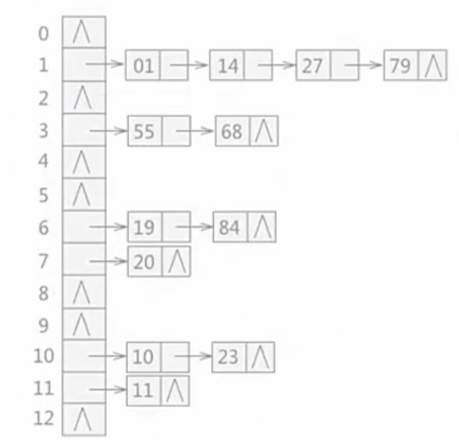

# 算法笔记（C++版）

## 第二章：其他算法与高级数据结构

### 一、排序算法

排序：若干个无序的数据，通过一定的流程，使得数据有序。

**分类与性质：**

就地性：是否开辟新内存。

- 就地排序：不保留原有数据，直接在原有数据的存储方式上排序，空间复杂度O(1) 
- 非就地排序：保留原有数据，另外开辟内存空间保留排序后的数据  

存储：是否调用外存。

- 内部排序：待排序的数据可以一次性加载到内存中，大多数都是内部排序。
- 外部排序：非内部排序，如归并排序 

稳定性：判断排序前后相同数据的相对位置是否发生改变  

- 稳定：不发生变化 
- 不稳定：发生变化 

乱序区：还未排序的区域。
​有序区：已经排好序的区域。

#### （1）基于插入的排序

基于插入的排序有两种：插入排序，希尔排序。

直接插入排序可以通过各种方式进行优化：

1. 折半查找优化&rarr;折半插入排序：将查找操作的顺序查找改为二分查找；
2. 基于循环数组优化&rarr;二路插入排序，由于循环数组较麻烦，所以基本不用。

##### 1. 直接插入排序

直接插入排序：在乱序区里找下一个数据，把该数据按规则直接插入存到有序区里。

时间复杂度：O(n<sup>2</sup>)。

就地排序，具有稳定性。

**以下是直接插入排序的代码：**

```c++
#include <bits/stdc++.h>
using namespace std;

int n;
int a[105];	

void straight_sort()
{
	//初始认为a[1]是有序区  
	for (int i=2;i<=n;i++) {
		int t=a[i];
		int j;
		for (j=i;j>1;j--) {
			if (a[j-1]>t) {
				a[j]=a[j-1]; 
			}
			else break;
		}
		a[j]=t;
	}
}

int main()
{
	cin>>n;
	for (int i=1;i<=n;i++) {
		cin>>a[i];
	}
	straight_sort();
	for (int i=1;i<=n;i++) {
		cout<<a[i]<<" ";
	}
	return 0; 
}
```

##### 2. 希尔排序

由于当需要排序的数据量很小或乱序时已经有许多数据已经排好，那么直接插入排序法效率较高，因此来改进排序算法。  

希尔排序，也叫缩小增量排序。

1.  第一次将n个数据分成d=n/2组，每组元素进行直接插入排序  d为增量  
2.  第二次d1=d/2，分组排序，每组进行直接插入排序 
3.  第三次d2=d2/2，重复上述步骤，直到d==1，进行最后一步希尔排序，也是直接插入排序   

​	增量序列：n/2 n/4 n/8…… 

​	直接插入排序就是增量为1的希尔排序   

​	第i组下标：i，i+d，i+2d，i+3d …… 
​	增量序列不同，时间复杂度也不同，不同数据需要特定的增量序列，一般用希尔增量(n/2)  

​	时间复杂度：O(n<sup>2</sup>) 

​	就地排序 

​	不稳定：当相同的数据划分到不同组时，相对位置可能改变  

**以下是希尔排序代码：**

```c++
#include <bits/stdc++.h>
using namespace std;

int n;
int a[105];	

//希尔排序 
void shell_sort()
{
	int cnt=0;	//记录第几趟排序 
	for (int d=n/2;d>=1;d/=2) {
		cnt++;
		//对每组进行直接插入排序  
		for (int i=1+d;i<=n;i++) {
			int t=a[i];
			int j;
			
			for (j=i;j-d>=1;j-=d) {
				if (t<a[j-d]) {
					a[j]=a[j-d];
				}
				else {
					break;
				}
			}
			a[j]=t;
		}
		cout<<"第"<<cnt<<"趟排序,增量为"<<d<<":";
		for (int i=1;i<=n;i++) {
			cout<<a[i]<<" ";
		}
		cout<<endl;
	} 
} 

int main()
{
	cin>>n;
	for (int i=1;i<=n;i++) {
		cin>>a[i];
	}
	shell_sort(); 
	for (int i=1;i<=n;i++) {
		cout<<a[i]<<" ";
	}
	return 0; 
}
```

#### （2）基于交换的排序

交换排序有两种：冒泡排序，快速排序。

##### 1. 冒泡排序

冒泡排序：乱序区的数据，相邻元素两两比较后进行交换。最多经过n-1趟排序，即可得到有序数组。 

第i趟排序的乱序区：[1,n-i+1] （下标从1开始）。

时间复杂度：O(n<sup>2</sup>)。

就地排序，具有稳定性。

**以下是冒泡排序的代码：**

```c++
#include <bits/stdc++.h>
using namespace std;

int a[109];
int n;
 
void bubble_sort()
{
	//优化标记：如果某一趟已经排好序了，那就退出排序，终止遍历  
	int flag=0;	
	for (int i=1;i<=n-1;i++) {
		flag=0;
		for (int j=1;j<=n-i;j++) {
			if (a[j]>a[j+1]) {
				int t=a[j];
				a[j]=a[j+1];
				a[j+1]=t;
				flag=1; 
			}
		}
		if (flag==0) break;
	}
}

int main()
{
	cin>>n;
	for (int i=1;i<=n;i++) {
		cin>>a[i];
	}
	bubble_sort(); 
	for (int i=1;i<=n;i++) {
		cout<<a[i]<<" ";
	}
	return 0; 
}
```

##### 2. 快速排序

快速排序：先选一个基准数据，把数据按照基准数据划分。

C++语言的sort函数底层逻辑就是快速排序。

例如升序序列，把比基准数小的放到基准数据前面，把比基准数据大的放到基准数据后面，然后基准数两边全是乱序区，在按照上述方法对两个乱序区排序（递归）。  

选基准的方法：

1. 选该乱序区[l,r]的第一个数据a[l]；
2. 选该乱序区[l,r]的最后一个数据a[r]；
3. 选该乱序区[l,r]最中间的数据a[m]，m=(l+r)/2。

将数据按照基准分成两部分的方法：双指针。

1. 先用一个变量暂存基准数，双指针i、j用于找其他数据；
2. 根据基准数据的位置利用双指针找比基准数小（大）的数据，放到基准数位置上；
3. 刚才找到的数据的位置变成基准数位置；
4. 重复2,3，直到i=j，此时i(j)的位置存放基准数，此次交换结束。

2、3步其实是基准数位置与各个数据的位置进行交换。

时间复杂度：O(nlogn)。

就地排序。

不稳定性：相同的数据被划分到了不同区间相对位置可能改变。

```c++
#include <bits/stdc++.h>
using namespace std;

int a[109];
int n;

void quick_sort(int a[],int l,int r)	//对a数组的[l,r]区间进行排序  
{
	//至少有两个元素才能排序  
	if (l<r) {
		int i,j,x;
		i=l;
		j=r;	//双指针初始化
		x=a[l];	//这里选乱序区的第一个元素作为基准数据 
		while (i<j) {
//			第一个数据做基准数据，该位置的数一定比别的数要小，所以先更新尾指针去找比基准数小的数  
			while (i<j && a[j]>x) {
				j--;
			}
			if (i<j) {	//此时因为a[j]<=x跳出循环，找到了交换的数据 
				a[i]=a[j];
				i++; 
			}
//			找完小数据后，找比基准数据大的数  
			while (i<j && a[i]<x) {
				i++;
			}
			if (i<j) {
				a[j]=a[i];
				j--;
			}
		}
		//此时i==j i(j)位置应该存放基准数据  
		a[i]=x; 
		//调用递归 将基准数据前后两个乱序区分别排序 
		quick_sort(a,l,i-1);
		quick_sort(a,i+1,r); 
	}
}

int main()
{
	cin>>n;
	for (int i=1;i<=n;i++) {
		cin>>a[i];
	}
	quick_sort(a,1,n);	
	for (int i=1;i<=n;i++) {
		cout<<a[i]<<" ";
	}
	return 0; 
}
```

#### （3）基于“选择”的排序

基于选择的排序有两种：选择排序，堆排序。

##### 1. 选择排序

选择排序：每一趟排序在乱序区选择最小（大）值，然后与该在的位置交换，一共n-1趟排序。

时间复杂度：O(n<sup>2</sup>)。

就地排序，具有不稳定性。

**以下是选择排序的代码：**

```c++
#include <bits/stdc++.h>
using namespace std;

int n,a[105];

void select_sort()
{
	int minn;	//最小值的下标  
	for (int i=1;i<=n;i++) {
		minn=i;
		for (int j=i;j<=n;j++) {
			if (a[j]<a[minn]) {
				minn=j;
			}
		}
		if (minn!=i) {
			int t=a[minn];
			a[minn]=a[i];
			a[i]=t;
		}
	}
	for (int i=1;i<=n;i++) {
		cout<<a[i]<<" ";
	}
} 

int main()
{
	cin>>n;
	for (int i=1;i<=n;i++) {
		cin>>a[i];
	}
	select_sort();
	return 0; 
}
```

##### 2. 堆排序

堆(Heap)：一种基于完全二叉树的特殊数据结构。

​	大顶堆（最大堆）：根节点的值必须大于该节点孩子节点的值，所有子树都满足该特征；

​	小顶堆（最小堆）：根节点的值必须小于该节点孩子节点的值，所有子树都满足该特征；

​	二叉堆：二叉堆一定是完全二叉树，且不是小顶堆就是大顶堆；

​	根据二叉树性质8，用数组存二叉树。	

升序排序用小顶堆，降序排序用大顶堆。

给一个乱序数组，以完全二叉树方式存储，这里以小顶堆为例：  

1. 调整二叉树为小顶堆：最后一个节点a[n]，父亲节点a[n/2]，数组倒着循环调整，直到下标为1的根节点的子树；
2. 调整子树：自上而下(向下)调整，需要调整的节点a[i]，孩子节点为a[i&times;2-1]，a[i&times;2]，进行交换，使a[i]最小；
3. 升序排序：在小顶堆的基础上循环n次； 
4. 每次循环先输出并删掉根节点，然后最后一个位置的节点代替根节点，再向下调整子树。

堆的插入操作：先让插入的数据当最后一个数据，然后自上而下（向上）调整。

向上调整：以需要调整的数据为孩子节点，向上调整它的父亲节点，通过交换，使孩子节点最大。

时间复杂度：O(nlogn)，向上（下）调整的时间复杂度为O(logn)。

具有不稳定性。

如果直接输出，无需保存已排好序的数据，那就是就地排序，如果要保存有序数据那就是非就地排序，排完序后原数组数据已经变了。  

堆的应用：

1. 堆排序；
2. 优先队列；
3. 图算法的优化：堆优化的迪杰斯特拉算法。

**以下是堆排序及插入的代码：**

```c++
#include <bits/stdc++.h>
using namespace std;

int n,a[105];

//堆的操作------------------------------------------------------------------- 
//向下调整  
void downAdjust(int a[],int i,int n)
{
	int now=i;	//now是需要调整的节点  
	int next;	//next表示now节点最小的孩子节点  
	while (now*2<=n) {	//不越界(有孩子节点)就调整  
		next=now*2;		//先指向左孩子 
		//左右孩子比大小  
		if (next+1<=n && a[next+1]<a[next]) {
			next++;
		}
		if (a[now]<=a[next]) {
			break;		//满足小顶堆  
		}
		int t=a[now];
		a[now]=a[next];
		a[next]=t;
		now=next;	//继续向下调整  
	}
}

//向上调整 
void upAdjust(int a[],int n)
{
	int now;	//需要调整的节点 
	int next;	//now的父亲节点 
	while (now>1) {	//只要不是根节点就需要进行调整 
		next=now/2;
		if (a[next]<=a[now]) {
			break;		//满足小顶堆  
		}		
		int t=a[now];
		a[now]=a[next];
		a[next]=t;
		now=next;	//继续向上调整  
	}	
} 

//堆排序  
void heap_sort()
{
	for (int i=n/2;i>=1;i--) {
		downAdjust(a,i,n);
	}
	
	//插入一个数据 
	n++;
	cin>>a[n];
	upAdjust(a,n); 
	
	int l=n;	//堆里的数据个数 
	for (int i=1;i<=n;i++) {
		cout<<a[1]<<" ";
		a[1]=a[l];
		l--;		//数据个数-1相当于删除节点  
		downAdjust(a,1,l);
	} 
	cout<<endl;
}

int main()
{
	cin>>n;
	for (int i=1;i<=n;i++) {
		cin>>a[i];
	}
	heap_sort();
	return 0; 
}
```

#### （4）归并排序

归并排序：基于分治思想的排序。

分治需要基于递归。

二路归并思路：

1. 计算数组的中间元素m=(r+l)/2，然后将数组分成[l,m]，[m+1,r]两个子序列；
2. 继续将这些子序列分割成更小的子序列，直到不能分割为止（序列中只剩一个元素）；
3. 按分割的规则合并序列，并使每个合并的子序列有序；
4. 合并时用两个指针同时遍历每个子序列，当一个子序列遍历完时，另一个子序列就直接放下来，使合并完的数据有序；

时间复杂度：O(nlogn)

非就地排序，具有稳定性。

**以下是二路归并排序的代码：**

```c++
#include <bits/stdc++.h>
using namespace std;

int n;
int a[105];	

//合并操作  
void merge(int a[],int l,int mid,int r)
{	//对a数组的[l,mid]区间和[mid+1,r]区间合并  
	int t[105];	//用来临时存储合并后的数据 
	int k=0;	//表示t数组的下标，规定下标从0开始  
	int i=l,j=mid+1;	//双指针分别遍历两个序列 
	while (i<=mid && j<=r) {
		if (a[i]<=a[j]) {
			t[k]=a[i];
			k++;
			i++;
		}
		else {
			t[k]=a[j];
			j++;
			k++;
		} 
	} 
    //跳出循环后要进行判断，将没有遍历完的序列直接放下来
	while (i<=mid) {
		t[k]=a[i];
		i++;
		k++;
	}
	while (j<=r) {
		t[k]=a[j];
		j++;
		k++;
	}
	//更新a数组的有序数据  
	for (int i=0;i<k;i++) {
		a[l+i]=t[i];
	}
}

//归并排序  
void merge_sort(int a[],int l,int r)
{	//对a数组的[l,r]区间进行排序  
	if (l<r) {	//说明有两个及以上的元素，还能在分 
		int mid=(r+l)/2;	//中间位置  
		//递归进行再分操作  
		merge_sort(a,l,mid);
		merge_sort(a,mid+1,r);
		//合并  
		merge(a,l,mid,r); 
	}
}

int main()
{
	cin>>n;
	for (int i=1;i<=n;i++) {
		cin>>a[i];
	}
	merge_sort(a,1,n);
	for (int i=1;i<=n;i++) {
		cout<<a[i]<<" ";
	}
	return 0; 
}

/*
5
2 3 1 9 4

10
4 2 8 0 5 7 1 3 9 6
*/ 
```

#### （5）基于统计的排序

基于统计的排序有三种：计数排序，桶排序，基数排序 

统计排序在算法题中有时会出现，需要用到该思想，但代码较复杂，所以不要求掌握代码

##### 1. 计数排序

计数排序：统计每个数据出现的次数，出现了几次就按顺序输出几次  

以上思路只能对非负整数进行排序，如果有负数或小数可以用以下方法解决： 

​	如果有负数，则先要找到最小的负数，然后每个数据都统一加这个数的绝对值，这个值为偏移量  
​	如果有小数，则先找到位数最多的小数，然后每个数都统一乘这个数的数量级的相反数  

时间复杂度：O(n)

缺点：非常浪费空间，用来统计个数的数组要开很大空间 

本来不具有稳定性，但可以变成具有稳定性的，思路如下：

​	再开一个前缀和数组sum，用来存储初始数组每个数据的前缀和，sum[i]表示数据i在新序列中的最后一个位置  

##### 2. 桶排序

桶排序： 规定一个规则，将每个数据按规则分别放进m个桶里，每个桶有n/m个元素，每个桶的数据就形成了相对有序，而桶内的数据是无序的，所以要用任意算法再对桶内的数据进行排序  

例如：

| 8    | 5    | 22   | 15   | 28   | 9    | 45   | 42   | 39   | 19   | 27   | 12   |
| ---- | ---- | ---- | ---- | ---- | ---- | ---- | ---- | ---- | ---- | ---- | ---- |
|      |      |      |      |      |      |      |      |      |      |      |      |

分桶规则：a[i]/10，按照a[i]/10的值来分桶，则能分出以下5个桶：

| 8  5  9 | 15  19  12 | 22  28  27 | 39   | 45  42  [47]() |
| ------- | ---------- | ---------- | ---- | -------------- |
|         |            |            |      |                |

每个桶就做到了相对有序，也就是前一个桶的所有元素都比后面的桶小，最后各个桶内元素进行排序即可。

时间复杂度：基于桶内元素排序的时间复杂度，且规则不同，时间复杂度就不同，合适的数据要用合适的分桶规则。 

##### 3. 基数排序

基数排序：按从最低有效位到最高有效位每位进行计数排序，最高位不够就补0，直到排完位数最多的数即可。  

计数排序是基数排序的一个子过程。

时间复杂度：设d表示最大位数，b表示基础数位，如十进制中b=10，则时间复杂度为O(d(n+b))

### 二、基础查找

静态查找：数据集合稳定，不需要进行添加，删除元素的查找操作。

动态查找：在数据集合进行查找的过程中，需要同时添加或删除元素的查找操作。

关键字（key）：数据元素（或记录）中某个数据项的值，用它可以唯一识别一个数据元素（或记录）。

内查找：整个查找过程中都在内存中进行的查找。

外查找：在查找过程中需要调用外存的查找。

平均查找长度（ASL）：在查找运算中时间主要花费在关键字的比较上，平均需要和给定值进行比较的关键字次数为平均查找次数，计算方法如下：
$$
ASL=\sum_{i=1}^{n} p_ic_i
$$
如果查找成功，那么其中p~i~表示第i个元素被查找的概率，一般情况下，每个元素被查找的概率都相等，即p~i~=1/n；c~i~表示找到第i个元素所需的关键字比较次数。

**同一查找算法查找成功的ASL与查找失败的ASL不一样，需要分别计算。**

ASL是衡量查找算法性能好坏的指标，一个查找算法的ASL越大，则其时间性能越差，反之，一个查找算法的ASL越小，则其时间性能越好。

#### （1）顺序查找

顺序查找也叫线性查找，是最基本的查找技术。从查找表（数组）中的第一个数据开始，逐个进行比较，若某个数据的关键字与给定值的相同，则查找成功；若比较完所有数据还没有相等的，则查找失败。

平均查找长度：

查找成功：若每个数被查找的概率相等，则ASL=(n+1)/2

查找失败：ASL=n+1

时间复杂度：O(n) 

顺序查找代码见数据结构顺序表部分，各种线性表均有顺序查找。

#### （2）二分查找

折半（二分）查找：在<font color="red">**有序表**</font>的基础上，每次和最中间的数据比较，然后排除一半的数据，直到找到为止。 

二分查找利用的是双指针原理。

折半查找不适合用于链式存储，非常不方便。  

时间复杂度：O(logn) 

判定树：二叉树的查找过程可以用一棵二叉树表示，并且该树一定是一棵AVL树。

<font color="red">**不是所有的AVL树都能作为二分查找的判定树**</font>。

**以下是二分查找的代码：**

```c++
#include <bits/stdc++.h>
using namespace std;

int main()
{
	int n,x,a[105],flag=0;
	cin>>n;
	for (int i=1;i<=n;i++) {
		cin>>a[i];
	}
	cin>>x;
	for (int l=1,r=n;l<=r;) {
		int mid=(l+r)/2;
		if (a[mid]==x) {
			cout<<mid;
			flag=1;
			break;
		}
		else if (a[mid]<x) {
			l=mid+1;
		}
		else {
			r=mid-1;
		}
	}
	if (flag==0) cout<<"查找失败";
	return 0; 
}
```

#### （3）分块查找

##### 1. 索引存储结构

​	索引存储结构是在存储数据的同时还建立一个附加的索引表（类似目录）。索引表中的每一项称为索引项，索引项的一般形式为关键字或地址。其中，关键字唯一标识一个节点，地址作为指向该关键字对应节点的指针，也可以是相对地址（比如数组下标）。

​	在索引存储结构中进行关键字查找时先在索引表中快速査找（因为索引表中按关键字有序排列，可 以采⽤折半査找）到相应的关键字，然后通过对应的地址找到主数据表中的元素。

##### 2. 分块查找

分块查找又称索引顺序查找，它吸取了顺序査找和折半査找各自的优点，既有动态结构，又适于快速查找。

由于分块的标准很灵活，不同数据要用不同的分块规则，所以很少用分块查找，不要求掌握代码。

思路：将査找表分为若干子块。块内的元素可以无序，但块之间是有序的，即第⼀个块中的最大关键字小于第二个块中的所有记录的关键字，第二个块中的最大关键字小于第三个块中的所有记录的关键字，, 以此类推。再建立一个索引表，索引表中的每个元素含有各块的最大关键字和各块中的第一个元素的地址，索引表按关键字有序排列。

分块查找的过程分为两步：第一步是在索引表中确定待查记录所在的块，由于索引表是有序的，所以可以顺序查找或折半査找索引表；第二步是在块内顺序查找，块内元素无序。


#### （4）哈希查找

哈希查找：以哈希表为存储方式的查找，可以不用经过排序来达到缩短时间的效果。

哈希存储（散列存储）：在查找表中通过一定的方法推算出目标元素的位置或应该放的位置。  

哈希表：通过哈希的方式构建的查找表。 

哈希函数：用数据作为自变量x，把数据带入公式，求出一个新的值H(x)，这个值就是数据的位置（下标）， 这个位置叫哈希地址。 

哈希碰撞（冲突）：多个数据通过哈希函数算出来的地址相同，就出现了哈希冲突，哈希冲突只能尽可能减少，不能完全避免。
	

- 设计哈希函数方法：直接定址法，数字分析法，平方取中法，除留余数法，折叠法等。

	1. 直接定址法：哈希函数为一次函数。 
		（1）H(key) = key

	​	（2）H(key) = a * key + b		（key为关键字，a，b为常数） 

	2. 数字分析法：关键字由多位数字或字符组成，抽取其中的两位或多位作为地址。 
		数字分析法非常灵活，且需要根据不同数据具体分析，尽可能避免哈希冲突。
	3. 平方取中法：把关键字左平方运算，其结果取最中间两位或多位做哈希地址。
	4. 除留余数法：H(key) = key % p  （p为常数）
		若哈希表长度为m，p <= m，p最好是一个质数，或者是一个不含有20以内的质因数的常数。 

- 处理冲突的方法：开放地址法，链地址法

	以除留余数法为例，来处理哈希碰撞： 

	1. 开放地址法：
		（1）线性探测法：如果 d = key % p 有数据了，那就往后探测 (d+k) % p 是否有数据（k从1开始遍历），直到放入数据为止。 
			聚集现象：冲突的数据会聚集在一起，这样会增加后面的数据产生冲突的概率。

		​	线性探测法会造成聚集现象。

		（2）平方探测法：如果 d = key % p 有数据了，那就往后探测 (d+k<sup>2</sup>) % p 是否有数据（k从1开始遍历），直到放入数据为止。
		（3）双重哈希法：增加一个新的哈希函数：H2(key) 
			如果 d = H1(key) 有数据了，那就往后探测 d + k * H2(key) 是否有数据（k从1开始遍历），直到放入数据为止。 

2. ​	链地址法：将所有产生关键字所对应的数据全部存储在一个线性链表中。

	例如，将{19,14,23,01,68,20,84,27,55,11,10,79}存储至数据中：



- 装填因子：用来描述表中数据的填充率 

$$
装填因子=\frac{数据量}{哈希表长度}
$$

​		**装填因子与冲突产生的概率无关。**

- 减少冲突的方法：
	1. 设计冲突少的哈希函数；
	2. 处理冲突时尽量避免聚集现象。

### 三、基础算法

#### （1）并查集

并查集：基于树的一种算法。

给若干个不相交集合，每个集合内有若干元素，处理集合合并与元素查询操作。

操作：

1. 建立一个并查集，包含若干单元素。

	2. 查询：给两元素 x,y 查询他们是否在一个集合内(根节点fx,fy是否相同)。 
		路径压缩：在查询时就可以将每一个元素的根节点统一。  		
	3. 合并 x,y 所在的集合：
		先查询x,y是否在同一集合内 若 fx==fy 则不需要合并； 
			若fx!=fy,fy做fx的父亲节点。  

用双亲表示法存储树结构，根节点的父亲赋给自己。

**以下是并查集算法：**

```c++
#include <bits/stdc++.h>
using namespace std;

//以下是并查集的经典模版代码  题目见洛谷P1551亲戚  

int f[5001];

//递归找到x的根节点  
int find(int x)
{
	if (f[x]!=x) {
		f[x]=find(f[x]);
		return f[x];
	}
	else return x;
}

int main()
{
	int n,m,q;	//n个元素，m对关系，q次查询  
	int x,y,fx,fy;
	cin>>n>>m>>q;
	//初始化并查集:让所有的节点的父亲节点均为自己   
	for (int i=1;i<=n;i++) {
		f[i]=i;
	} 
	//建立并查集  
	for (int i=1;i<=m;i++) {
		cin>>x>>y;
		fx=find(x);
		fy=find(y);
		if (fx!=fy) {	//合并集合，路径压缩   
			f[fx]=fy;
		}
	}
	//查询操作  
	for (int i=1;i<=q;i++) {
		cin>>x>>y;
		fx=find(x);
		fy=find(y);
		if (fy==fx) {
			cout<<"Yes"<<endl;
		}
		else cout<<"No"<<endl; 
	} 
	return 0;
}

/*
6 5 3
1 2
1 5
3 4
5 2
1 3
1 4
2 3
5 6
*/
```

#### （2）枚举与模拟

枚举是基于已有知识来猜测答案的一种问题求解策略。

枚举的思想是不断地猜测，从可能的答案集合中一一尝试，然后再判断题目的条件是否成立。枚举每一种可能性。

模拟是直接模拟题目中要求的操作来求解。

模拟题目通常具有码量大、操作多的特点。由于它码量大，经常会出现难以查错的情况，如果写错是相当浪费时间的，但是其思路一般较为简单。

枚举和模拟有时候统称为暴力，可以不做严格区分。

**解题步骤：**

1. 找对答案所在的集合；
2. 找出答案成立的条件；
3. 缩小枚举或模拟的范围；
4. 选择合适的枚举顺序。

具体的操作步骤有可能需要自己分析得出。

##### 1. 枚举

<font color="blue">例题： [NOIP 2011 提高组 铺地毯 - 洛谷](https://www.luogu.com.cn/problem/P1003)</font>

在本题的输入格式中，目标位置x，y在最后才输入，这样需要先将所有数据都输入并存储，然后才能进行操作。

将地毯数据存储在数组中，从后往前枚举地毯，如果该地毯覆盖目标位置则该地毯为答案，可直接退出循环。flag变量用于标记是否找到答案，若没有答案则说明该位置没有被覆盖，输出-1。

判断是否覆盖目标位置：`x < a[i] + g[i] && x >= a[i] && y < b[i] + k[i] && y >= b[i]`

时间复杂度：O(n)；

答案代码如下：

```c++
#include <bits/stdc++.h>
using namespace std;

int n;
int x, y;

int main()
{
    //输入所有数据
	cin>>n;
	vector<int> a(n); 
	vector<int> b(n); 
	vector<int> g(n); 
	vector<int> k(n); 
	for (int i = 0; i < n; i++) {
		cin>>a[i]>>b[i]>>g[i]>>k[i];
	}
	cin>>x>>y;
	
	int flag = 0;
    //倒序枚举，容器下标从0开始，但题目的地毯标号从1开始
	for (int i = n-1; i >= 0; i--) {
		if (x < a[i] + g[i] && x >= a[i] && y < b[i] + k[i] && y >= b[i]) {
			cout<<i+1;	//输出地毯编号
			flag = 1;
			break;
		}
	}
	if (flag == 0) {
		cout<<-1;
	}
	return 0;
}
```

##### 2. 模拟

<font color="blue">例题1：[59. 螺旋矩阵 II - 力扣（LeetCode）](https://leetcode.cn/problems/spiral-matrix-ii/description/)</font>

模拟填数的过程，始终按照从左往右，从上到下，从右往左，从下到上的顺序填数，外围边界填充完毕以后，用于标记边界的变量l，r，t，d需要更新。

时间复杂度：O(n<sup>2</sup>)

答案代码如下：

```c++
#include <bits/stdc++.h> 
using namespace std;

vector<vector<int>> generateMatrix(int n) {
	vector<vector<int>> map(n, vector<int>(n));
    int t = 0, l = 0, r = n-1, d = n-1;		//标记边界 
	int num = 1;
	while (num <= n*n) {
		//从左往右填上边界t
		for (int i = l; i <= r; i++) {
			map[t][i] = num;
			num++;
		}
		t++;
		//从上到下填右边界r
		for (int i = t; i <= d; i++) {
			map[i][r] = num;
			num++;
		}
		r--;
		//从右往左填下边界d
		for (int i = r; i >= l; i--) {
			map[d][i] = num;
			num++;
		}
		d--;
		//从下到上填左边界l
		for (int i = d; i >= t; i--) {
			map[i][l] = num;
			num++;
		}
		l++; 
	}
	return map;
}

int main()
{
	int n;
	cin>>n;
	vector<vector<int>> res = generateMatrix(n);
	for (int i = 0; i < n; i++) {
		for (int j = 0; j < n; j++) {
			cout<<res[i][j]<<" ";
		}
		cout<<endl;
	}
	return 0;
}
```

<font color="blue">例题2：[NOIP 2014 提高组 生活大爆炸版石头剪刀布 - 洛谷](https://www.luogu.com.cn/problem/P1328)</font>

数据存储：要将对局的结果整理成二维数组，两人的周期手势用一维数组存储，两数组要对应。二维数组中存储得分。

对于周期性变化用取模来处理，其他模拟即可。

答案代码如下：

```c++
#include <bits/stdc++.h>
using namespace std;

//存储各个手势的输赢得分，赢得1分，输平不得分
int f[5][5] = {
	{0,0,1,1,0},
	{1,0,0,1,0},
	{0,1,0,0,1},
	{0,0,1,0,1},
	{1,1,0,0,0}
};

int na, nb;
int n;

int main()
{
	cin>>n>>na>>nb;
	vector<int> a(na);
	vector<int> b(nb);
	for (int i = 0; i < na; i++) {
		cin>>a[i];
	}
	for (int i = 0; i < nb; i++) {
		cin>>b[i];
	}
	int numa = 0, numb = 0;	//两人的积累分数
	for (int i = 0; i < n; i++) {
		int at = a[i%na], bt = b[i%nb];	//两人此局出的手势
		numa += f[at][bt];
		numb += f[bt][at];
	}
	cout<<numa<<" "<<numb;
	return 0;
}
```

#### （3）前缀和与差分

##### 1. 前缀和

前缀和可以简单理解为数列的前 n 项的和，是一种重要的预处理方式。

前缀和分为一维前缀和与多维前缀和（主要是二维）。

一维前缀和：有 n 个的正整数放到数组 A 里，现在要求一个新的数组 sum，新数组的第 i 个数 sum[i] 是原数组 A 第 1 到第 i 个数的和。

二维前缀和：有 n*m 个的正整数放到二维数组A中,现在要求一个新的二维数组数组 sum，新数组 sum[i] [j]是原数组 A[1] [1] 到A[i] [j]的矩形范围内所有元素的和。

多维前缀和的普通求解方法几乎都是基于容斥原理：

在计数时，必须注意没有重复，没有遗漏。为了使重叠部分不被重复计算，人们研究出一种计数方法，这种方法的基本思想是：先不考虑重叠的情况，把包含于某内容中的所有对象的数目先计算出来，然后再把计数时重复计算的数目排斥出去，使得计算的结果既无遗漏又无重复，这种计数的方法称为容斥原理。

前缀和一般是用来进行数组的预处理，提高后续操作效率的，多用于频繁求区间和。

本节内容数组下标全部从1开始。

<font color="blue">例题1：[B3612 【深进1.例1】求区间和 - 洛谷](https://www.luogu.com.cn/problem/B3612)</font>

一维前缀和推导：

```c++
sum[1] = a[1];
sum[i] = sum[i-1] + a[i];
```

一维数组求区间和：求区间 [i, j] 所有元素的和。

```c++
sum[i-1] = a[1] + a[2] + a[3] + … + a[i-1];
sum[j] = a[1] + a[2] + a[3] + … + a[i-1] + a[i] + a[i+1] + … + a[j];
a[i] + a[i+1] + … + a[j] = sum[j] - sum[i];
```

时间复杂度：O(n+m)；

答案代码如下：

```c++
#include <bits/stdc++.h>
using namespace std;

int n, m;

int main()
{
	cin>>n;
	vector<int> a(n+1);
	vector<int> s(n+1);
	for (int i = 1; i <= n; i++){
		cin>>a[i];
        //这里在输入数据时即可完成求前缀和数组
		s[i] = s[i-1] + a[i];
	}
	cin>>m;
	for (int i = 0; i < m; i++) {
		int l, r;
		cin>>l>>r;
		cout<<s[r] - s[l-1]<<endl;	//求区间和
	}
	return 0;
}
```

<font color="blue">例题2：[P1387 最大正方形 - 洛谷](https://www.luogu.com.cn/problem/P1387)</font>

二维前缀和推导：

sum数组的初始值必须全为0。

```c++
sum[1][1] = a[1][1];
sum[i][j] = sum[i-1][j] + sum[i][j-1] - sum[i-1][j-1] + a[i][j];
```

二维数组求区间矩阵和：求a[x] [y] 到a[i] [j]矩形范围内的元素和（i>x, j>y）

```c++
result = sum[i][j] - sum[i][y-1] - sum[x-1][j] + sum[x-1][y-1];
```

本题思路：

先枚举正方形的边长l（l<=min(n, m)），然后双循环枚举给定矩形的右下角（也可以是左上角），判断正方形内的元素和是否为l<sup>2</sup>，如果是，则该正方形内元素全为1，l的最大值为所求。

时间复杂度：O(nm*min(n, m))；

答案代码如下：

```c++
#include <bits/stdc++.h>
using namespace std;

int n, m;
int ans;

int main()
{
	cin>>n>>m;
	vector<vector<int>> a(n+1, vector<int>(m+1));
	vector<vector<int>> sum(n+1, vector<int>(m+1));
	for (int i = 1; i <= n; i++) {
		for (int j = 1; j <= m; j++) {
			cin>>a[i][j]; 
			sum[i][j] = sum[i-1][j] + sum[i][j-1] - sum[i-1][j-1] + a[i][j];	//这里可以顺便求前缀和数组 
		}
	}
	
	int l = 1;
	while (l <= min(n, m)) {	//枚举边长 
		for (int i = l; i <= n; i++) {
			for (int j = l; j <= m; j++) {	//枚举右下角坐标 
				int x = i - l + 1, y = j - l + 1;	//左上角坐标
				int res = sum[i][j] - sum[x-1][j] - sum[i][y-1] + sum[x-1][y-1];	//区间和
				if (res == l*l) {
					ans = max(ans, l);
					break;		//相同边长的正方形找到一个即可 
				}
			}
		}
		l++;
	}
	cout<<ans;
	return 0;
}
```

##### 2. 差分

差分是一种和前缀和相对的策略，是前缀和的逆运算。

差分数组：前缀和数组的原数组就是该前缀和数组的差分数组。

差分通常用于对数组区间的所有元素频繁进行相同的加减操作。

<font color="blue">例题1：给定一个数组，长度为n，给定操作次数m，每次操作会给出一个区间的左右坐标，对区间内的所有元素进行+1操作，最后返回操作后的原数组。</font>

一维差分数组推导：原数组为sum，差分数组为a；

```c++
a[1] = sum[1];
a[i] = sum[i] - sum[i-1];
```

区间操作：对[l, r]区间内的所有元素+1，返回原数组。

操作后的原数组为newSum；

```c++
如果a[l] + 1，得到的原数组如下：
newSum[1] = a[1] = sum[1];
newSum[2] = a[1] + a[2] = sum[2];
…………
newSum[l] = a[1] + a[2] + … + a[l] + 1 = sum[l] + 1;
newSum[l+1] = a[1] + a[2] + … + a[l] + 1 + a[l+1] + 1 = sum[l+1] + 1;
newSum[l+2] = sum[l+1] + 1;
…………
newSum[n] = sum[n] + 1;

即a[i] + 1，则sum[i] ~ sum[n]都+1
同理，如果a[i] - 1，则sum[i] ~ sum[n]都-1
进行如下操作：
a[l]++;
a[r+1]--;
即可得到：sum[l] ~ sum[r]都+1
最后再求前缀和得到修改后的原数组。
```

时间复杂度：O(n+m)；

完整代码如下：

```c++
#include <bits/stdc++.h>
using namespace std;

int n, m; 

int main()
{
	cin>>n;
	vector<int> sum(n+1);	//原数组 
	vector<int> a(n+1);	//差分数组 
	for (int i = 1; i <= n; i++) {
		cin>>sum[i];
	}
	//求差分数组 
	a[1] = sum[1];
	for (int i = 2; i <= n; i++) {
		a[i] = sum[i] - sum[i-1];
	}
	
	cin>>m;
	for (int i = 0; i < m; i++) {
		int l, r;
		cin>>l>>r;
		a[l]++;
		a[r+1]--;
	}
	
	//求前缀和得到原数组 
	for (int i = 1; i <= n; i++) {
		sum[i] = sum[i-1] + a[i];
		cout<<sum[i]<<" ";
	}
	return 0;
} 
/*
6
1 2 3 4 5 6
3
2 5
1 4
5 6

1 3 4 5 6 6
2 4 5 6 6 6
2 4 5 6 7 7
*/
```

<font color="blue">例题2：[P3397 地毯 - 洛谷](https://www.luogu.com.cn/problem/P3397)</font>

二维差分数组推导：原数组为sum，差分数组为a；

```c++
a[1][1] = sum[1][1];
a[i][j] = sum[i][j] - sum[i][j-1] - sum[i-1][j] + sum[i-1][j-1];
```

区间操作：从sum[x] [y]到sum[i] [j]的矩阵范围内的元素+1；

```c++
a[x][y]+1后，从sum[x][y]到sum[n][m]所有元素均+1;
同理，a[x][y]-1后，从sum[x][y]到sum[n][m]所有元素均-1;
进行如下操作：
a[x][y]++;
a[i+1][j+1]++;
a[i+1][y]--;
a[x][j+1]--;
最后再求前缀和即可得到操作后的原数组
```

本题的初始数组全为0，则差分数组也全为0；

时间复杂度：O(n<sup>2</sup>)；

答案代码如下：

```c++
#include <bits/stdc++.h>
using namespace std;

int n, m;

int main()
{
	cin>>n>>m;
	vector<vector<int>> sum(n+2, vector<int>(n+2));
	vector<vector<int>> a(n+2, vector<int>(n+2));
	for (int i = 0; i < m; i++) {
		int x1, y1, x2, y2;
		cin>>x1>>y1>>x2>>y2;
		a[x1][y1]++;
		a[x2+1][y2+1]++;
		a[x2+1][y1]--;
		a[x1][y2+1]--;
	}
	
	//求前缀和数组
	for (int i = 1; i <= n; i++) {
		for (int j = 1; j <= n; j++) {
			sum[i][j] = sum[i-1][j] + sum[i][j-1] - sum[i-1][j-1] + a[i][j];
			cout<<sum[i][j]<<" ";
		}
		cout<<endl;
	} 
	return 0;
}
```

#### （4）滑动窗口

滑动窗口也叫尺取法，是一种利用双指针遍历获取满足条件的区间（滑动窗口）的线性算法。

一个长度为n的数组一共有n(n+1)/2个子数组（区间），通过枚举每个区间来找答案效率较低，时间复杂度为O(n<sup>2</sup>)。

滑动窗口的过程：枚举r，不断得到合法区间。记[l, r]为一个序列内以r为终点的合法区间（l <= r），然后枚举l，随着l的增大，区间不断缩小，直至不合法为止。

滑动窗口与枚举的区别在于滑动窗口的双指针只能往前走而不会后退，时间复杂度为O(n)。

尺取法需要满足的条件： 区间权值和大小满足随区间长度单调变化，即当一个边界固定时，区间越长区间权值和越小（或越大），**该数组不能同时出现正数和负数**。

<font color="red">**尺取法可以求区间长度最值，满足条件的区间个数，或者是区间长度固定的问题。**</font>

尺取法的优点： 不会去枚举到一定不满足条件的区间，不会枚举到虽然满足条件但一定不是答案的区间。

尺取法比直接暴力枚举区间效率高很多，尤其是数据量大的时候，所以说尺取法是一种高效的枚举区间的方法，是一种技巧，一般用于求取有一定限制的区间个数或最短的区间等等。当然任何技巧都存在其不足的地方，有些情况下尺取法不可行，无法得出正确答案，所以要先判断是否可以使用尺取法再进行计算。

<font color="blue">例题1：[209. 长度最小的子数组 - 力扣（LeetCode）](https://leetcode.cn/problems/minimum-size-subarray-sum/description/)</font>

本题是求满足条件的最短区间长度。

左右指针i, j，快指针j枚举右边界，枚举的同时计算累加和sum，当sum>=target时，开始更新左边界，如果 `sum - nums[i] >= target` 仍然成立，那么更新左边界i和累加和sum，直到不成立为止，记录此时区间的长度，更新答案后再去继续枚举右边界。

初始答案为n+1，因为答案的最大值为n，当nums数组的所有元素和小于目标值时，答案不存在，输出0，此时的初始答案仍然是n+1，以此来判断是否找到合法答案。

时间复杂度：O(n)；

答案代码如下：

```c++
#include <bits/stdc++.h>
using namespace std;

int n, target;

int minSubArrayLen(int target, vector<int>& nums) {
	int i = 0;
    int ans = n + 1, sum = 0;
    for (int j = 0; j < n; j++) {
        sum += nums[j];
        if (sum >= target) {
            while (i < j) {
                if (sum - nums[i] >= target) {
                    sum -= nums[i];
                    i++;
                }
                else {
                    break;
                }
            }
            ans = min(ans, j-i+1);
        }
    }
    if (ans == n+1) return 0;
    return ans;
}

int main()
{
	cin>>n>>target;
	vector<int> nums(n);
	for (int i = 0; i < n; i++) {
		cin>>nums[i];
	}
	cout<<minSubArrayLen(target, nums);
	return 0;
}
```

<font color="blue">例题2：[713. 乘积小于 K 的子数组 - 力扣（LeetCode）](https://leetcode.cn/problems/subarray-product-less-than-k/)</font>

本题是求满足条件的区间个数。

左右指针i, j，快指针j枚举右边界，枚举的同时计算累乘sum，当 `sum >= k` 时，条件不成立，开始更新左边界，同时 `sum /= nums[i];`，直到条件成立，如果以i为左边界，j为右边界的区间成立，那么以j为右边界，x(i<=x<=j)为左边界的所有区间均成立，答案需要更新j-i+1个，更新答案后再去继续枚举右边界。

时间复杂度：O(n)；

答案代码如下：

```c++
#include <bits/stdc++.h>
using namespace std;

int n, k;

int numSubarrayProductLessThanK(vector<int>& nums, int k) {
    int sum = 1;
	int i = 0, j = 0;
	int ans = 0;
	for (j = 0; j < n; j++) {
		sum *= nums[j];
		while (i <= j && sum >= k) {
			sum /= nums[i];
			i++;
		}
		ans += (j-i+1);
	}
	return ans;
}

int main()
{
	cin>>n>>k;
	vector<int> nums(n);
	for (int i = 0; i < n; i++) {
		cin>>nums[i];
	}
	cout<<numSubarrayProductLessThanK(nums, k);
	return 0;
}
```

<font color="blue">例题3：[2379. 得到 K 个黑块的最少涂色次数 - 力扣（LeetCode）](https://leetcode.cn/problems/minimum-recolors-to-get-k-consecutive-black-blocks/description/)</font>

本题的区间长度固定，找到满足条件的区间即可。

先统计第一个区间[0, k-1]的所有'W'的个数，记作初始答案，然后左指针i = 0，右指针j = k，表示区间[0, k-1]，同时更新左右指针，判断blocks[i]和blocks[j]的颜色，并更新该区间内的'W'的个数，记录答案，返回最小值。

时间复杂度：O(n)；

答案代码如下：

```c++
#include <bits/stdc++.h>
using namespace std;

int n, k;
string blocks;

int minimumRecolors(string blocks, int k) {
    int ans = 0;
    int n = blocks.length();
    int i = 0, j = k;
    int c = 0;
    for (int p = 0; p < k; p++) {
    	if (blocks[p] == 'B') {
    		c++;
		}
	}
	ans = k-c;
    while (j < n) {
    	if (blocks[i] == 'B') {
    		c--;
		}
		if (blocks[j] == 'B') {
			c++;
		}
		i++;
		j++;
		ans = min(ans, k-c);
	}
	return ans;
}

int main()
{
	cin>>k>>blocks;
	cout<<minimumRecolors(blocks, k);
	return 0;
}
```

#### （5）二分法

二分算法：在一个有序的数组中折半查找答案。

二分查找通常已知答案所在的区间，以升序数组为例，每次查找数组当前区间的中间元素，如果中间元素刚好是要找的，就结束搜索过程；如果中间元素小于所查找的值，那么左侧的只会更小，不会有所查找的元素，只需到右侧查找；反之同理。

二分算法可以用于**求最小化的最大值（最大化的最小值）以及部分最值问题**，也有一些其他类型的问题（如枚举优化）也可以用二分算法。

<font color="red">**二分算法通常可以提前猜出答案的范围，并且该范围必须有序。**</font>

二分法先找答案所在的范围，然后左右指针分别指向最小值与最大值，折半处理双指针得到中间数据，视作答案，然后判断该答案是否合法（如反推题目的另一个已知条件），再根据答案的合法化与最优解性质调整双指针位置，最终找到最符合要求的答案。

二分法题目的答案代码要注意双指针的更新细节以及循环的终止条件，避免死循环。

##### 1. 最值问题

<font color="blue">例题1：[P1873 COCI 2011/2012 #5EKO / 砍树 - 洛谷](https://www.luogu.com.cn/problem/P1873)</font>

此题是求最值的题目，应该先判断答案范围，答案最小值为0，最大值为树木高度的最大值。

二分查找该区间，得到中间值后检查该答案是否成立，若成立则去寻找更高的答案，若不成立则答案比mid要小，要去更小的范围找答案。

时间复杂度：O(nlog(max(a[i])))；

答案代码如下：

```c++
#include <bits/stdc++.h>
using namespace std;

int n, m;

bool check(vector<int> a, int h)
{
    long long sum = 0;
    for (int i = 0; i < n; i++)
    {
        if (a[i] > h)
        {
            sum += (a[i] - h);
        }
    }
    if (sum >= m)
        return true;
    return false;
}

int main()
{
    cin >> n >> m;
    vector<int> a(n + 1);
    int maxH = 0;
    for (int i = 0; i < n; i++)
    {
        cin >> a[i];
        maxH = max(maxH, a[i]); // 找到树木高度的最大值，即答案范围的最大值
    }

    int i = 0, j = maxH;
    int ans = 0;
    while (i <= j)
    {
        int mid = (i + j) / 2;
        if (check(a, mid)) // 若成立，则mid可能是答案，缩小范围找更大的答案
        {
            ans = mid;
            i = mid + 1;
        }
        else
        {
            // 不成立则答案在更小的范围里
            j = mid - 1;
        }
    }
    cout << ans;
    return 0;
}
```

<font color="blue">例题2：[875. 爱吃香蕉的珂珂 - 力扣（LeetCode）](https://leetcode.cn/problems/koko-eating-bananas/description/)</font>

本题是最值的题目，本题的答案所在的区间：最小值为1， 最大值为香蕉根数的最大值。

答案代码如下：

```c++
#include <bits/stdc++.h>
using namespace std;

int n, h;

bool check(vector<int> piles, int k, int h)
{
    long long sum = 0;
    for (int i = 0; i < n; i++)
    {
        sum += (piles[i] / k);
        if (piles[i] % k != 0) // 吃完一堆的香蕉需要的时间要向上取整
            sum++;
    }
    if (sum <= h)
        return true;
    return false;
}

int minEatingSpeed(vector<int> &piles, int h)
{
    int l = 1, r = 0; // 最小值为1，不能为0
    for (int i = 0; i < n; i++)
    {
        r = max(r, piles[i]); // 最大值为香蕉根数的最大值
    }

    int ans = r; // 初始答案为最大值，该答案一定成立
    // 二分
    while (l <= r)
    {
        int mid = (r + l) / 2;
        if (check(piles, mid, h))
        {
            // 若答案成立则需要找更小的合法答案
            ans = mid;
            r = mid - 1;
        }
        else
        {
            // 若不成立则找更大的答案
            l = mid + 1;
        }
    }
    return ans;
}

int main()
{
    cin >> n >> h;
    vector<int> piles(n + 5);
    for (int i = 0; i < n; i++)
    {
        cin >> piles[i];
    }
    cout << minEatingSpeed(piles, h);
    return 0;
}
```

##### 2. 最大化最小值问题

在问题中，不同情景下对最小值的约束不同，求得的最小值也不同，求不同约束下最小值中的最大值通常使用二分法，求最小化的最大值问题同理。

<font color="blue">例题3：[P2678 [NOIP 2015 提高组] 跳石头 - 洛谷](https://www.luogu.com.cn/problem/P2678)</font>

注意本题“最短跳跃距离尽可能长”，说明了本题为最大化最小值问题。根据题意可以猜出本题答案所在范围为[1, L]，折半取答案mid，然后检查答案是否合法。

双指针检查：now指针指向当前石块，next指针为下一个石块，计算石块间距，如果小于mid则需要移除该石块，移除石块不需要纠结具体移除哪个石块，只需要统计数目。如果达到满足要求的mid所需移除的石块数目超过了m，则答案不合法，需要缩小答案范围，反之则答案合法，去寻找更大的答案。这里用的其实属于贪心算法。

时间复杂度：O(nlog(L))；

答案代码如下：

```c++
#include <bits/stdc++.h>
using namespace std;

int s, n, m;

// 移除石块
bool check(vector<int> d, int x)
{
    int now = 0, nxt = 0; // now是当前石块，nxt是下一个石块
    int sum = 0;          // 达到目标需要移除的石块数目
    while (nxt < n)
    {
        nxt++;
        if (d[nxt] - d[now] < x)
        { // 如果距离小于x，则需要将该石块移除
            // 这里无需考虑具体移除哪个石块，只需统计即可
            sum++;
            if (sum > m) return false;	//答案已经不合法
        }
        else
        {
            now = nxt;
        }
    }
    return true;	//答案合法
}

int main()
{
    int ans = 0;
    cin >> s >> n >> m;
    vector<int> d(n + 5);
    for (int i = 1; i <= n; i++) // 下标从1开始，0表示起点
    {
        cin >> d[i];
    }

    d[n + 1] = s; // 把最后一个石块放入数组
    n++;

    int l = 1, r = s;
    while (l <= r)
    {
        int mid = (l + r) / 2;
        if (check(d, mid))
        { // 答案合法则记录，然后找更大的值
            ans = mid;
            l = mid + 1;
        }
        else
        { // 答案不合法则缩小范围找合法答案
            r = mid - 1;
        }
    }
    cout << ans;
    return 0;
}
```

#### （6）贪心算法

贪心算法是用计算机来模拟一个贪心的人做出决策的过程。这个人十分贪婪，每一步行动总是按某种指标选取最优的操作。而且他目光短浅，总是只看眼前，并不考虑以后可能造成的影响。

贪心法将一个最优决策过程变成一个多步决策过程，并在每步总是做出当前看来最好的选择。贪心算法并不从全局最优上加以考虑，它所做的选择只是在某种意义上的局部最优选择。可想而知，并不是所有的时候贪心法都能获得最优解，所以一般使用贪心法的时候，都要确保自己能证明其正确性，即贪心算法的子问题之间互不影响，且所有子问题最优的情况下全局最优。

通常用于部分求最值问题：分步+局部最优。

<font color="blue">例题1：[P1090 NOIP 2004 提高组\] 合并果子 - 洛谷](https://www.luogu.com.cn/problem/P1090)</font>

一共要搬运n-1次果子，要使得总体力值最小，需要每次合并的体力值尽可能的小，所以每次合并两堆数量最少的果子。

使用C++的STL标准库中的优先队列 `priority_queue` 来实现这一过程，优先队列底层是用堆来实现的，与队列不同的是，弹出数据时会弹出队列中优先级最高的数据，优先级可以自行规定，默认是数据大的优先级高，这里当然需要规定数据小的优先级高。

答案代码如下：

```c++
#include <bits/stdc++.h>
using namespace std;

int n;
long long ans, x, y;
// 声明优先队列，并规定数据小的优先级高
priority_queue<long long, vector<long long>, greater<long long>> q;

int main()
{
    cin >> n;
    for (int i = 0; i < n; i++)
    {
        cin >> x;
        q.push(x);
    }
    for (int i = 0; i < n - 1; i++)
    {
        // 得到优先级最高的两个数
        x = q.top();   // 获取堆顶元素（最小的元素）
        q.pop();       // 删除堆顶元素
        y = q.top();   // 获取堆顶元素（第二小的元素）
        q.pop();       // 删除堆顶元素
        ans += x + y;  // 统计答案
        q.push(x + y); // 将x+y加入堆
    }

    cout << ans;
    return 0;
}
```

<font color="blue">例题2：[P4995 跳跳！ - 洛谷](https://www.luogu.com.cn/problem/P4995)</font>

每块石头只能跳0次，n块石头需要跳跃n次，一共消耗n次体力值，要使总体力值最大，则需要每次消耗的体力值均要尽可能大，即每次选与当前所在石头的高度差值最大的石头跳。先跳到最高的石头，再跳到最低的石头，再跳到次高的石头，再跳到次低的石头……

对石头高度进行排序，然后利用双指针，左指针指向最小的数据，右指针指向最大的数据，计算消耗值然后统计答案，双指针向内更新即可。

答案代码如下：

```c++
#include <bits/stdc++.h>
using namespace std;

int n;
long long ans;

int main()
{
    cin >> n;
    vector<int> h(n + 1);
    for (int i = 1; i <= n; i++)
    {
        cin >> h[i];
    }
    sort(h.begin(), h.end());
    int l = 0, r = n;
    while (l < r)
    {
        ans += (h[r] - h[l]) * (h[r] - h[l]);
        l++;
        ans += (h[r] - h[l]) * (h[r] - h[l]);
        r--;
    }
    cout << ans;
    return 0;
}
```

<font color="blue">例题3：[2611. 老鼠和奶酪 - 力扣（LeetCode）](https://leetcode.cn/problems/mice-and-cheese/description/)</font>

先把所有的奶酪都分给2号，此时总得分为sum2，然后从中选k块给1号，假设选了第i块给1号，则对于第i块的奶酪得分增加了一个差值：r1[i] - r2[i]，此时总得分变为：sum2 + (r1[i] - r2[i])。选k块，则总得分为 sum2 + k 个差值。若使得总得分最大，则需要k个差值最大，所以对差值 r1[i] - r2[i] 排序，选差值最大的k块奶酪给1号。

答案代码如下：

```c++
#include <bits/stdc++.h>
using namespace std;

int miceAndCheese(vector<int> &reward1, vector<int> &reward2, int k)
{
    int n = reward1.size();
    vector<int> d(n);
    int ans = 0;
    for (int i = 0; i < n; i++)
    {
        d[i] = reward1[i] - reward2[i]; // 计算奶酪的差值
        ans += reward2[i];  // 先把所有奶酪给第二个老鼠吃
    }
    sort(d.begin(), d.end(), greater<int>());
    // 贪心
    for (int i = 0; i < k; i++)
    {
        ans += d[i];    
    }
    return ans;
}

int main()
{
    int n, k;
    cin >> n >> k;
    vector<int> reward1(n);
    vector<int> reward2(n);
    for (int i = 0; i < n; i++)
    {
        cin >> reward1[i];
    }
    for (int i = 0; i < n; i++)
    {
        cin >> reward2[i];
    }
    cout << miceAndCheese(reward1, reward2, k);
    return 0;
}
```

#### （7）递归与分治

##### 1. 递归

递归（Recursion），在数学和计算机科学中是指在函数的定义中使用函数自身的方法，在计算机科学中还额外指一种通过重复将问题分解为同类的子问题而解决问题的方法。

递归出口（边界条件）：找全递归终止条件。

递归代码的理解：画递归调用图或递归树。

在写代码的过程中只需考虑函数的功能及其返回的结果即可，不要考虑递归具体是如何展开调用的。

<font color="blue">例题1：[面试题 08.06. 汉诺塔问题 - 力扣（LeetCode）](https://leetcode.cn/problems/hanota-lcci/description/)</font>

当只有一个盘子的时候，只需要将该盘子从起始柱移动到终点柱，这就是递归出口。当需要移动n个盘子时，现将前 n-1 个盘子从起始柱移动到中转柱，再将第n个盘子从起始柱移动到终点柱，最后将前 n-1 个盘子从中转柱移动到终点柱即可，移动n-1个盘子时调用递归。

答案代码如下：

```c++
#include <bits/stdc++.h>
using namespace std;

void move(int n, vector<int> &s, vector<int> &e, vector<int> &h)
{
    if (n == 1)
    {
        // 将最后一个盘子从s移动到e
        int d = s.back();
        s.pop_back();
        e.push_back(d);
        return;
    }

    // 将n-1个盘子从s移动到h
    move(n - 1, s, h, e);
    // 将第n个盘子从s移动到e
    int d = s.back();
    s.pop_back();
    e.push_back(d);
    // 将n-1个盘子从h移动到e
    move(n - 1, h, e, s);
}

void hanota(vector<int> &A, vector<int> &B, vector<int> &C)
{
    int n = A.size();
    move(n, A, C, B);
}

int main()
{
    vector<int> a;
    vector<int> b;
    vector<int> c;
    int n, x;
    cin >> n;
    for (int i = 0; i < n; i++)
    {
        cin >> x;
        a.push_back(x);
    }
    hanota(a, b, c);
    for (int i = 0; i < n; i++)
    {
        cout << c[i] << " ";
    }
    return 0;
}
```

##### 2. 分治

分治（Divide and Conquer），字面上的解释是分而治之，就是把一个复杂的问题分成两个或更多的**相同或不相同的子问题**，子问题相互独立，直到最后子问题可以简单的直接求解，原问题的解即子问题的解的合并，即最优子结构性质。

递归是一种编程技巧，一种解决问题的思维方式；分治算法很大程度上是基于递归的，解决更具体问题的算法思想。

<font color="blue">例题1：[53. 最大子数组和 - 力扣（LeetCode）](https://leetcode.cn/problems/maximum-subarray/description/)</font>

本题可以用动态规划，贪心，分治等方法解题，下面是分治思路：

取中心点m=(l+r)/2。 和最大的区间要么出现在中心点左边，要么出现在中心点右边，要么横跨中心点。所以问题分解为求这三部分的最大区间和，然后取最大值。分成3个独立的小问题，分治。

中心点左边或右边的最大区间和：和原问题相同，递归。

横跨中心点的最大区间和：贪心求解，从中心点往左右两边延伸。从中心点不断往左延申，同时记录最大值lmax；从中心点不断往右延申，同时记录最大值rmax；横跨中心点的最大区间和：lmax+rmax

时间复杂度：O(nlogn)；

答案代码如下：

```c++
#include <bits/stdc++.h>
using namespace std;

// 求跨中间元素的最大子数组和
int maxxmid(vector<int> &nums, int l, int mid, int r)
{
    int rmax = INT_MIN, lmax = INT_MIN;
    int sum = 0;
    for (int i = mid; i >= l; i--)
    {
        sum += nums[i];
        lmax = max(lmax, sum);
    }
    sum = 0;
    for (int i = mid + 1; i <= r; i++)
    {
        sum += nums[i];
        rmax = max(rmax, sum);
    }
    return lmax + rmax;
}

// 递归
int maxx(vector<int> &nums, int l, int r)
{
    if (l == r)
    {
        return nums[l];
    }

    int mid = (l + r) / 2;
    int a1 = maxx(nums, l, mid);
    int a2 = maxx(nums, mid + 1, r);

    int a3 = maxxmid(nums, l, mid, r);
    return max(a1, max(a2, a3));
}

int maxSubArray(vector<int> &nums)
{
    int ans = INT_MIN;
    int n = nums.size();
    ans = maxx(nums, 0, n - 1);
    return ans;
}

int main()
{
    int n, x;
    vector<int> nums;
    cin >> n;
    for (int i = 0; i < n; i++)
    {
        cin >> x;
        nums.push_back(x);
    }
    int ans = maxSubArray(nums);
    cout << ans << endl;
    return 0;
}
```

#### （8）链表

##### 1. 链表操作

<font color="blue">例题1：[206. 反转链表 - 力扣（LeetCode）](https://leetcode.cn/problems/reverse-linked-list/description/)</font>

若带头结点，先将头结点摘下，然后从第一个结点开始，依次摘下每一个结点，摘下后用头插法建立新的链表，最后返回新链表。

上述方案需要占用额外空间，要节省内存则需要采用原地逆置的方法。

定义两个指针： pre 和 cur ，pre在右 cur 在左；每次让 pre 的 next 指向 cur ，实现一次局部反转。局部反转完成之后，pre和 cur 同时往右移动一个位置。循环上述过程，直至 pre到达链表尾部。（注意，在循环过程中，需要记录pre的next，不能丢失结点）

答案代码如下：

```c++
#include <bits/stdc++.h>
using namespace std;

struct ListNode
{
    int val;
    struct ListNode *next;
};

struct ListNode *reverseList(struct ListNode *head)
{
    struct ListNode *cur = NULL;
    struct ListNode *pre = head;
    struct ListNode *t = NULL;
    while (pre != NULL)
    {
        t = pre->next;
        pre->next = cur;
        cur = pre;
        pre = t;
    }
    head = cur;
    return head;
}

int main()
{
    int n, x;
    ListNode *l = NULL;
    ListNode *r = NULL;
    scanf("%d", &n);
    for (int i = 0; i < n; i++)
    {
        scanf("%d", &x);
        ListNode *s = (ListNode *)malloc(sizeof(ListNode));
        s->val = x;
        s->next = NULL;
        if (i == 0)
        {
            l = s;
            r = s;
            continue;
        }
        //尾插法
        r->next = s;
        r = s;
    }
    l = reverseList(l);
    ListNode *p = l;
    //输出
    while (p != NULL)
    {
        printf("%d ", p->val);
        p = p->next;
    }
    return 0;
}
```

<font color="blue">例题2：[LCR 140. 训练计划 II - 力扣（LeetCode）](https://leetcode.cn/problems/lian-biao-zhong-dao-shu-di-kge-jie-dian-lcof/description/)</font>

快慢指针思路：将第一个指针 fast指向链表的第 k+1个节点，第二个指针 slow 指向链表的第一个节点，此时二者之间刚好间隔 k 个节点。此时两个指针同步向后走，当 fast走到链表的尾部空节点时，则此时 slow指针刚好指向链表的倒数第k个节点。

答案代码如下：

```c++
#include <bits/stdc++.h>
using namespace std;

struct ListNode
{
    int val;
    struct ListNode *next;
};

struct ListNode *trainingPlan(struct ListNode *head, int cnt)
{
    struct ListNode *f = head;
    struct ListNode *s = head;
    int t = 1;
    while (f != NULL && t < cnt + 1)
    {
        f = f->next;
        t++;
    }
    while (f != NULL)
    {
        f = f->next;
        s = s->next;
    }
    return s;
}

int main()
{
    int n, x;
    ListNode *l = NULL;
    ListNode *r = NULL;
    scanf("%d", &n);
    for (int i = 0; i < n; i++)
    {
        scanf("%d", &x);
        ListNode *s = (ListNode *)malloc(sizeof(ListNode));
        s->val = x;
        s->next = NULL;
        if (i == 0)
        {
            l = s;
            r = s;
            continue;
        }
        r->next = s;
        r = s;
    }
    int cnt;
    scanf("%d", &cnt);
    ListNode *ans = trainingPlan(l, cnt);
    cout << ans->val;
    return 0;
}
```

##### 2. 静态链表

静态链表：用数组描述的链表，即称为静态链表。

分配一整片连续的内存空间，各个结点集中安置，逻辑结构上相邻的数据元素，存储在指定的一块内存空间中，数据元素只允许在这块内存空间中随机存放，这样的存储结构生成的链表称为静态链表。也就是说静态链表是用数组来实现链式存储结构，静态链表实际上就是一个结构体数组。

定义节点：

```c++
typedef struct {
	int data;	//数据域
	int cur;	//游标
}component;
```

#### （9）栈和队列


### 四、动态规划

#### （1）动态规划基础

- **动态规划概念及分类：**

动态规划（DP）：大问题可以分解成若干个类似的小问题，并且各个问题的解决思路一样，可以通过各个小问题的解最终求得大问题的解。经过分解的小问题不是相互独立的。 

动态规划分类：线性DP，区间DP，状态压缩DP，树型DP，插头DP，数位DP，背包问题等。

- **动态规划的性质：**
	1. 最优子结构性质：当问题的最优解包含了其子问题的最优解时，称该问题具有最优子结构性质。
	2. 重叠子问题性质：动态规划经分解得到的子问题往往不是相互独立的。 

- **什么问题可以用动态规划解：**
	1. 求最优解（最值）：贪心，二分（最大化最小值/最小化最大值），动态规划 
	2. 背包，区间：动态规划。 

- **动态规划代码实现：**
	1. 备忘录写法（记忆化搜索）：基于递归实现，从上到下求解，通常用来分析思路，而不写代码。  
	2. Dptable写法：非递归实现，从下到上求解，更常用。

- **解题思路：**
	1. 确定是否为动态规划问题：具有最优子结构性质 + 重叠子问题性质。
	2. 确定状态（状态数组）： 
		（1）经验：动态规划有许多模版题型；
		（2）由问句改为陈述句，比如第n项的值为x，dp[0/1]为初始状态，dp[n]=x即为最终答案；
		（3）备忘录写法从上到下分析问题。 
	3. 确定状态转移方程：如 `f[i] = f[i-1] + f[i-2]`；
		（1）经验；
		（2）求中间状态法：假设从第0/1个状态到第i-1个状态都是已知的，分析第i个状态如何得到；
		（3）备忘录写法的递归分析中包括求状态转移方程。  
	4. 写代码。

以解斐波那契数列为例的代码：

```c++
#include <bits/stdc++.h>
using namespace std;

//备忘录写法求斐波那契数列 
int f[100];
int fib(int n)
{
	if (f[n]!=-1) {
		return f[n];
	}
	else {
		f[n]=fib(n-1)+fib(n-2);		//状态转移方程
		return f[n];
	}
} 

int main()
{
	int n;
	cin>>n;
	//备忘录写法： 
	f[0]=0;
	f[1]=1;
	for (int i=2;i<=n;i++) {
        //初始赋值为-1表示还未进行备忘操作，即还未求到解
		f[i]=-1;
	}
//	cout<<fib(n);
	//Dptable写法： 
	for (int i=2;i<=n;i++) {
		f[i]=f[i-1]+f[i-2];		//状态转移方程
	} 
	cout<<f[n];
	return 0; 
}
```

#### （2）背包问题

背包问题：给定一些物品，每种物品都有自己的价格和重量（体积），有一个重量（体积）上限为W的背包，选择一些物品放入背包中，使得背包物品价值最大且不超过背包重量上限。

01背包：每种物品只有1个。

完全背包：每种物品可以有多个。

##### 1. 01背包

01背包问题描述：给定n件不可分割的物品和1个背包。物品i的重量是w[i]，其价值为v[i]，背包的容量为c。如何选择装入背包中的物品，使得装入背包中的物品在不超过背包容量的情况下总价值最大？

01背包暴力DFS解法：初始没放物品，搜索每种物品选或不选，如果未超过背包上限则继续搜索，否则剪枝，最终收集背包价值最大值。

**以下是暴力DFS解法代码：**

```c++
#include <bits/stdc++.h>
using namespace std;

int n;	//物品个数 
int v[105];	//物品价值 
int c;	//背包上限 
int w[105];	//物品重量 
int ans=-1;	//收集答案  

//暴力dfs解法  
void dfs(int i,int sumv,int rc)	
    //i为物品编号，即考虑物品i选不选，sumv为目前背包总价值，rc为目前背包剩余重量 
{
	if (i==0) {		//递归出口  
		ans=max(ans,sumv);
		return;
	}
	if (w[i]<=rc) {	//剩余重量能放下i物品，选一下试试  
		dfs(i-1,sumv+v[i],rc-w[i]);
		//也可以不选下面重量不够还会调用一次   
	}
	dfs(i-1,sumv,rc);
}

int main()
{
	cin>>n>>c;
	for (int i=1;i<=n;i++) {
		cin>>v[i]>>w[i];
	} 
	//暴力DFS： 
	dfs(n,0,c); 	
	cout<<ans;	
	return 0; 
}
/*
5 10
6 2
3 5
5 4
4 2
6 3
*/
```

01背包备忘录解法：在上述DFS暴力解法中，有的情况被考虑了多次，引入备忘录dp[i] [j]来记录以考虑过的情况，从1~i物品中选择一些重量不超过j的物品，总价值为dp[i] [j]。 

**以下是备忘录解法代码：**

```c++
#include <bits/stdc++.h>
using namespace std;

int n;	//物品个数 
int v[105];	//物品价值 
int c;	//背包上限 
int w[105];	//物品重量 
int ans=-1;	//收集答案  
int dp[105][105];	//备忘录：从1~i物品中选择一些重量不超过j的物品，总价值为dp[i][j]  

//备忘录解法  
int dfsDP(int i,int rc)	//i为物品编号，即考虑物品i选不选，rc为目前背包剩余重量 
{
	//从前i个物品选若干个，重量不超过rc的最大值 
	if (i==0) {
		return 0;
	} 
	//如果该情况已被考虑过，则启用备忘录直接返回  
	if (dp[i][rc]!=-1) {
		return dp[i][rc];
	}
	//不选i物品 
	dp[i][rc]=dfsDP(i-1,rc); 
	//选第i个物品 
	if (w[i]<=rc) {	//能放下  
	//取选或不选的较大值  
		dp[i][rc]=max(v[i]+dfsDP(i-1,rc-w[i]),dp[i][rc]);	//状态转移方程  
	} 
	return dp[i][rc]; 
}

int main()
{
	cin>>n>>c;
	for (int i=1;i<=n;i++) {
		cin>>v[i]>>w[i];
	} 	

//	备忘录解法： 
	//初始化备忘录  
	for (int i=0;i<=n;i++) {
		for (int j=0;j<=c;j++) {
			dp[i][j]=-1;
		}
	}
	ans=dfsDP(n,c);
	cout<<ans;
	return 0; 
}
```

01背包Dptable解法：双循环i遍历物品，j遍历背包容量，从1~i物品中选择一些重量不超过j的物品，总价值为dp[i] [j]。dp[n] [c]为答案。

**以下是Dptable解法代码：**

```c++
#include <bits/stdc++.h>
using namespace std;

int main()
{
	cin>>n>>c;
	for (int i=1;i<=n;i++) {
		cin>>v[i]>>w[i];
	} 

//	Dptable解法：
	//初始化dp 
	for (int i=0;i<=n;i++) {
		for (int j=0;j<=c;j++) {
			dp[i][j]=0;
		}
	}
	for (int i=1;i<=n;i++) {
		for (int j=1;j<=c;j++) {
			if (w[i]<=j) {
				dp[i][j]=max(dp[i-1][j],dp[i-1][j-w[i]]+v[i]);
			}
			else {
				dp[i][j]=dp[i-1][j];
			}
		}
	} 
	ans=dp[n][c];
	cout<<ans;
	return 0; 
}
```

01背包Dptable解法优化：每次更新dp[i] [j]时，只需要用到dp[i-1] []的数据，dp[1~i-2] []的数据均不需要，即当前状态是由上一层状态得到的，则降为一维滚动数组dp[j]，表示背包容量为j时的价值最大值。

**以下是Dptable解法优化降维代码：**

```c++
#include <bits/stdc++.h>
using namespace std;

int n;	//物品个数 
int v[105];	//物品价值 
int c;	//背包上限 
int w[105];	//物品重量 
int ans=-1;	//收集答案 

int main()
{
	cin>>n>>c;
	for (int i=1;i<=n;i++) {
		cin>>v[i]>>w[i];
	} 
//	Dptable解法的优化：
	int dp[105]={0}; 
	for (int i=1;i<=n;i++) {
		for (int j=c;j>=w[i];j--) {	//倒序枚举，防止一个物品被放入多次  
			if (w[i]<=j) {
				dp[j]=max(dp[j],v[i]+dp[j-w[i]]);
			}
		}
	} 
	ans=dp[c];
	cout<<ans;
	return 0; 
}
```

###   五、字符串算法

**字符串：**

字符串：由若干个字符组成的序列，其中，字符的个数称为字符串长度，含有0个字符的字符串称为空串。下标从0开始。 

C/C++语法中规定字符串末尾有一个隐藏的结束标志'/0'。 	

#### （1）字符串匹配及BF算法

字符串的匹配问题：给定两个字符串：主串T，模式串P；问T中是否包含P，若包含，返回P在T中第一次出现的位置。 

失配：P未匹配上T。 

暴力匹配（BF算法）：双指针 i，j 分别遍历T和P，再用指针k来判断T串从i开始直到 i+pl 的所有字符是否与P串的j位置吻合。

BF算法时间复杂度：O(n*m)，主串与模式串的长度为n和m。  

**以下是BF算法代码：**

```c++
#include <bits/stdc++.h>
using namespace std;

char t[1005],p[1005];
int tl,pl;	//主串和模式串的长度  
int nxt[1005];	 

//BF暴力匹配算法  
void BF()
{
	for (int i=0;i+pl<=tl;i++) {
		int k=i;
		int j=0;
		for (j=0;j<pl;j++) {
			if (t[k]==p[j]) {
				k++;
			} 
			else {
				break;
			}
		}
		if (j>=pl) {	//匹配成功  
			cout<<i;	//返回位置 
			break; 
		}
	}
}

int main()
{
	cin>>t;
	getchar();
	cin>>p;
	tl=strlen(t);
	pl=strlen(p);
	
	BF();
	return 0; 
}
```

#### （2）KMP 算法

##### 1. KMP 算法

KMP算法优化思路：失配时k指针的位置会达到两次，当失配时，遍历主串的指针k不动，不再回退到i+1位置，j指针回退到合适的位置，而不是回退到0。 

求j该回退的合适位置：

第一次k指针达到失配位置时，T串i~1~ ~ k之间的字符与P串前L=k-i~1~个字符完全相同，第二次k指针达到失配位置时，i已经发生改变i~2~（i~1~<i~2~<k），但一定有T串i~2~ ~ k之间的字符（串1）与P串前j个字符（串2）完全相同（不然不会达到第二次失配位置）， 由于T串i~1~ ~ k之间的字符与P串前L=i~1~-k个字符完全相同，所以T串i~2~ ~ k之间的字符与P串L字符前k-i~2~个字符（串3）也相同。即串1，串2，串3都相同。由于串2与串3分别是P串的前后缀子串，所以j为P串的最大相等前后缀子串长度（子串不包括P串本身）。

next数组：next[j]=x，j为失配位置，表示P串中0 ~ j-1这一子串最长相等前后缀子串长度为x（子串不包括P串本身）。

next数组只与P串有关，其中next[1]=0，并且规定next[0]=-1。 

求next数组：用P串中0 ~ j-1这一子串的前一部分匹配后一部分。 

如果下标从1开始，那么next数组每个数据都+1。 

KMP算法时间复杂度：O(n+m)，主串与模式串的长度为n和m。 

**以下是 KMP 算法代码：**

```c++
#include <bits/stdc++.h>
using namespace std;

char t[1005],p[1005];
int tl,pl;	//主串和模式串的长度  
int nxt[1005];	 

//求next数组 
void getnxt()
{
	nxt[0]=-1;
	nxt[1]=0;
	int j=1;	//从j+1==2开始求 
	int k=0;
	while (j+1<pl) {
		if (p[k]==p[j] || k==-1) {
			nxt[j+1]=k+1;
			j++;
			k++;
		}
		else {
			k=nxt[k];
		}
	} 
} 

int KMP() 
{
	getnxt();
	
	int i=0;	//遍历主串 
	int j=0;	//遍历模式串 
	while (i<tl && j<pl) {
		if (t[i]==p[j] || j==-1) {
			i++;
			j++;
		}
		else {
			j=nxt[j];
		}
	} 
	if (j>=pl) {	//模式串已遍历完，已找到  
		return i-j;
	}
	else {
		return -1;
	}
}

int main()
{
	cin>>t;
	getchar();
	cin>>p;
	tl=strlen(t);
	pl=strlen(p);
	int ans=KMP();
	cout<<ans; 	
	return 0; 
}
```

##### 2. KMP 算法的改进

在 KMP 算法中，匹配过程时如果失配，则需要回退至 next 数组位置，如果回退后仍然失配，则需要继续回退，但是如果回退后对应的字符如果与第一次失配的字符相同，即可更改next数组的值，找到其最终回退的位置。改进后的数组为 nextval 数组，该数组也只与模式串有关，与子串无关。

在 next 数组的基础上求出 nextval 数组：

如果 p[i] == p[nxt[i]]，那么 nxtval[i] == nxtval[nxt[i]]；否则 nextval[i] == next[i]。

**以下是改进后的 KMP 算法代码：**

```c++
#include <bits/stdc++.h>
using namespace std;

char t[1005],p[1005];
int tl,pl;	//主串和模式串的长度  
int nxt[1005], nxtval[1005];	 
//-------------------------------------------------------------------

//求next数组 
void getnxt()
{
	nxt[0]=-1;
	nxt[1]=0;
	int j=1;	//从j+1==2开始求 
	int k=0;
	while (j+1<pl) {
		if (p[k]==p[j] || k==-1) {
			nxt[j+1]=k+1;
			j++;
			k++;
		}
		else {
			k=nxt[k];
		}
	} 
} 

//求nextval数组 
void getnxtval()
{
	nxtval[0]=-1;
	for (int i = 1; i <= pl; i++) {
		if (p[i] == p[nxt[i]]) {
			nxtval[i] == nxtval[nxt[i]];
		}
		else {
			nxtval[i] == nxt[i];
		}
	}
	
}

int KMP()
{
	getnxtval();
	
	int i=0;	//遍历主串 
	int j=0;	//遍历模式串 
	while (i < tl && j < pl) {
		if (t[i] == p[j] || j == -1) {
			i++;
			j++;
		}
		else {
			j = nxtval[j];
		}
	} 
	if (j >= pl) {	//模式串已遍历完，已找到  
		return i-j;
	}
	else {
		return -1;
	}
}

int main()
{
	cin>>t;
	getchar();
	cin>>p;
	tl=strlen(t);
	pl=strlen(p);
	
	//答案下标从0开始  
	int ans=KMP();
	cout<<ans<<endl; 
	return 0; 
}
```

### 六、基础数论

#### （1）素数筛

质数，又称素数，是指在大于1的自然数中，除了1和它本身以外不再有其他因数的自然数。即约数只有1以及它本身的数。

0和1既不是质数也不是合数。

素数筛（质数筛）：将1~n之间的质数筛选出来，并保存到一个数组中或者直接输出。

##### 1. 朴素筛法

根据定义，因为质数除了1和本身之外没有其他约数，所以判断n是否为质数，根据定义直接判断从2到n-1是否存在n的约数即可。从2开始枚举到n，判断每个数是否为质数，收集答案即可。

时间复杂度：O(n<sup>2</sup>)；

模板代码如下：

```c++
#include <bits/stdc++.h>
using namespace std;

int ans[1000005], sum = 0;

bool isPrime(int x)
{
    for (int i = 2; i <= x - 1; i++)
    {
        if (x % i == 0)
            return false;
    }
    return true;
}

int main()
{

    int n;
    cin >> n;
    for (int i = 2; i <= n; i++)
    {
        if (isPrime(i))
        {
            sum++;
            ans[sum] = i;
        }
    }
    for (int i = 1; i <= sum; i++)
    {
        cout << ans[i] << " ";
    }
    return 0;
}
```

朴素筛法的优化：

若 `i * j = n`，则i，j都是n的约数，当 `i < j` 时，只需遍历到i即可，无需再遍历j，所以判断质数循环只需遍历到 `sqrt(n)`；并且质数中只有2是偶数，其他质数都是奇数，外循环可以从3开始遍历，并在循环体中修改变量每次+2，数字2需要特判。

时间复杂度：O(n<sup>2/3</sup>)

模板代码如下：

```c++
#include <bits/stdc++.h>
using namespace std;

int ans[1000005], sum = 0;

bool isPrime(int x)
{
    for (int i = 2; i <= sqrt(x); i++)
    {
        if (x % i == 0)
            return false;
    }
    return true;
}

int main()
{

    int n;
    cin >> n;
    sum++;
    ans[sum] = 2;
    for (int i = 3; i <= n; i += 2)
    {
        if (isPrime(i))
        {
            sum++;
            ans[sum] = i;
        }
    }
    for (int i = 1; i <= sum; i++)
    {
        cout << ans[i] << " ";
    }
    return 0;
}
```

##### 2. 埃氏筛法

埃拉托色尼选筛法（the Sieve of Eratosthenes）简称埃氏筛法，是古希腊数学家埃拉托色尼提出的一种筛选法。

基本原理：算术基本定理（唯一分解定理）。

一个合数总是可以分解成若干个质数的乘积，那么如果把质数（最初只知道2是质数）的倍数都去掉，那么剩下的就是质数了。

缺点：一个合数可能会被筛到好几次，比如6是2和3的倍数，则被筛到了两次。

时间复杂度：O(nlog(logn))；

模板代码如下：

```c++
#include <bits/stdc++.h>
using namespace std;

int n; // n <= 10^6
int sum = 0;
int ans[10005];
bool p[1000005]; // 标记数组，0为质数，1为合数

int main()
{
    cin >> n;
    p[1] = 1;
    for (int i = 2; i <= n; i++)
    {
        if (p[i] == 0)
        {
            sum++;
            ans[sum] = i;
            for (int j = 2 * i; j <= n; j += i)
            { // 将i的倍数全部标记为合数
                p[j] = 1;
            }
        }
    }

    for (int i = 1; i <= sum; i++)
    {
        cout << ans[i] << " ";
    }
    return 0;
}
```

##### 3. 欧拉筛法

埃氏筛会将合数标记至少两次，为解决这个缺点，欧拉筛被发明了，欧拉筛也叫线性筛。

算术基本定理（唯一分解定理）：任何合数都能表示为若干质数的乘积，且该分解因式是唯一的。（不考虑顺序性）

原理：规定每个合数只会被它最小的质因数筛去，后面的质因数直接跳过。一个合数一定大于等于最小质因数的平方。

i枚举过程：

| i=   | 素数表       | 筛除的数      | i=   | 素数表                | 筛除的数    |
| ---- | ------------ | ------------- | ---- | --------------------- | ----------- |
| 2    | {2}          | {4}           | 13   | {2,3,5,7,11,13}       | {26,39....} |
| 3    | {2,3}        | {6,9}         | 14   | {2,3,5,7,11,13}       | {28}        |
| 4    | {2,3}        | {8}           | 15   | {2,3,5,7,11,13}       | {30,45}     |
| 5    | {2,3,5}      | {10,15,25}    | 16   | {2,3,5,7,11,13}       | {32}        |
| 6    | {2,3,5}      | {12}          | 17   | {2,3,5,7,11,13,17}    | {34....}    |
| 7    | {2,3,5,7}    | {14,21,35,49} | 18   | {2,3,5,7,11,13,17}    | {36}        |
| 8    | {2,3,5,7}    | {16}          | 19   | {2,3,5,7,11,13,17,19} | {38....}    |
| 9    | {2,3,5,7}    | {18,27}       | 20   | {2,3,5,7,11,13,17,19} | {40}        |
| 10   | {2,3,5,7}    | {20}          | 21   | {2,3,5,7,11,13,17,19} | {42,63}     |
| 11   | {2,3,5,7,11} | {22,33....}   | 22   | {2,3,5,7,11,13,17,19} | {44}        |
| 12   | {2,3,5,7,11} | {24}          | …    | …                     | …           |

时间复杂度：O(n)；

模板代码如下：

```c++
#include <bits/stdc++.h>
using namespace std;

int n; // n <= 10^6
int sum = 0;
int ans[10005];
bool p[1000005]; // 标记数组，0为质数，1为合数

int main()
{
    cin >> n;

    for (int i = 2; i <= n; i++)
    { // 该循环有两个作用：枚举所有数以及枚举每个质数的倍数
        if (p[i] == 0)
        {
            sum++;
            ans[sum] = i;
        }
        for (int j = 1; j <= sum; j++)
        {
            int x = i * ans[j];
            if (x > n)
                break;
            p[x] = 1;
            if (i % ans[j] == 0) // 保证质数只被其最小的质因数标记
                // i == ans[j] * k，x == i * ans[j+1] == ans[j]*ans[j+1]*k;
                // 此时，ans[j+1]不再是最小的质因数
                break;
        }
    }

    for (int i = 1; i <= sum; i++)
    {
        cout << ans[i] << " ";
    }
    return 0;
}
```

#### （2）快速幂

快速幂是用于快速求底数的 n 次幂的方法。

##### 1. 朴素求幂

朴素求法：求a的n次方，直接枚举n，每次结果乘a即可，初始为1。

时间复杂度：O(n)；

**朴素求法：**

```c++
#include <bits/stdc++.h>
using namespace std;

int a, n;
long long sum = 1;

int main()
{
    cin >> a >> n;
	//求a^n
    for (int i = 1; i <= n; i++)
    {
        sum *= a;
    }
    cout << sum;
    return 0;
}
```

##### 2. 快速幂

快速幂优化：求a的n次方

原理：任何正整数都可以写成2<sup>n</sup>相加的形式，类似二进制。

当n为奇数时，a<sup>n</sup> 可以由a*a<sup>n-1</sup>得到，此时n-1为偶数；当n是偶数时，a<sup>n</sup>可以由(a<sup>n/2</sup>)<sup>2</sup>得到。在计算过程中，把幂数拆成了几个2的幂累和的形式，也就是我们把一个十进制的次方数转成了二进制，但是不直接写成二进制形式，而是把二进制形式里为1的部分，写出来做累加。

若变量a始终保存当前指数是2的几次方，即2<sup>0</sup>、2<sup>1</sup>、2<sup>2</sup>以此类推，如果我们以a作为底数，那么到此题中就变成了a<sup>1</sup>、a<sup>2</sup>、a<sup>4</sup>……我们只需要每次进行 `a*=a` 操作即可。

如果该二进制位的值为1，即当前指数为奇数，则应该用累乘变量 sum 乘上当前的 a。当然在循环的最后，和10进制转2进制一样，n需要除以2，只要n不为零这个循环始终执行下去。

时间复杂度：O(logn)；

快速幂模板代码如下：

```c++
#include <bits/stdc++.h>
using namespace std;

int a, n;
long long sum = 1;

int main()
{
    cin >> a >> n;
    //求a^n
    while (n > 0)
    {
        if (n % 2 == 1)
        {
            sum *= a;
        }
        n /= 2;
        a = a * a;
    }
    cout << sum;
    return 0;
}
```

##### 3. 快速幂取模

需要用到快速幂来进行求幂运算的题目，n的范围通常很大，当底数是一个大于1的数时，求幂运算得到的结果通常就会更很大，此时快速幂得到的结果不一定能用长整型存储，所以与快速幂相关的题目通常要求结果对一个较大的质数进行取模（该质数题目会给出），才能得到存储范围内的数。但是如果先得出运算结果再进行取模则仍然会超出范围，所以要变运算变取模（在循环体内取模）。

**取模的运算法则有如下几个性质：**

1. (a + b) % n == (a % n + b % n) % n；
2. (a - b) % n == (a % n - b % n) % n；
3. (a * b) % n == (a % n * b % n) % n；

根据性质3，在循环体中，每次进行相乘运算时都要进行取模，时间复杂度还是O(logn)。

<font color="blue">例题：[P1226 【模板】快速幂 - 洛谷](https://www.luogu.com.cn/problem/P1226)</font>

答案代码如下：

```c++
#include <bits/stdc++.h>
using namespace std;

long long a, n;
long long sum = 1, c;

int main()
{
    cin >> a >> n >> c;
    int x = a, y = n;
    // 计算a^n mod c的结果
    while (n > 0)
    {
        if (n % 2 == 1)
        {
            sum = (sum * a) % c;
        }
        n /= 2;
        a = (a * a) % c;
    }

    cout << x << "^" << y << " mod " << c << "=" << sum;
    return 0;
}
```

#### （3）高精度

高精度也称大数运算，大数是指计算的数值非常大或者对运算的精度要求非常高，用已知的数据类型无法精确表示的数值。

当运算结果非常大时，不能使用高级语言中的任何数据类型存储，则需要转换数组或字符串类型存储（可能含有前导0），数组的元素代表大数的某一位，运算时则需要通过数组元素的运算模拟大数的运算，从而得到结果。高精度运算属于模拟，用一个数组保存一个数字的每一位，然后模拟加减乘除的竖式运算。

##### 1. 高精度加法

初始输入数据为正序输入字符串，但由于竖式计算是从个位开始，即从右往左，所以还需要将输入的两个字符串逆序存储至一个数组中，这样数组左边代表低位，右边代表高位，然后就可以从左往右模拟竖式计算加法。当两个数位数不同时，数组末尾的数字初始化为0，模拟高位的自动补0。计算时需要用一个新数组来保存答案，未出现进位时，直接相加即可，出现进位（该位的结果大于9）则在下一位+1。最后得到的数组再进行逆序处理，去掉前导0即可得到答案。

模板代码如下：

```c++
#include <bits/stdc++.h>
using namespace std;

// 两个不超过10000位的数字相加
int a[10010], b[10010], c[10010];
string s1, s2; // 读取的字符串

int init(int x[]) // 读取数据，并逆序存储，返回数据的位数
{
    string s;
    cin >> s;
    int l = s.size();
    for (int i = 0; i < l; i++)
    {
        x[i] = s[l - i - 1] - '0';
    }
    return l;
}

int main()
{
    int la = init(a);
    int lb = init(b);
    int lc = max(la, lb) + 1;

    // 高精度
    for (int i = 0; i < lc; i++)
    {
        c[i] += a[i] + b[i];
        if (c[i] >= 10)
        { // 进位
            c[i] -= 10;
            c[i + 1]++;
        }
    }

    // 去掉前导0
    while (c[lc] == 0 && lc > 0)
    {
        lc--;
    }
    // 此时lc指向的是最高位
    // 倒序输出
    for (int i = lc; i >= 0; i--)
    {
        cout << c[i];
    }
    return 0;
}
```

##### 2. 高精度减法

减法与加法相似，仍然需要将字符串逆序存储至数组中，但减法结果可能为负数，先要判断两数相减的结果是否为负数（比较位数，若位数相等则比较字符串大小），如果是负数则先输出“-”，然后求其结果的相反数。在高精度运算过程中，各位相减，若需要借位（该位答案小于0），则下一位-1，最后得到答案。

模板代码如下：

```c++
#include <bits/stdc++.h>
using namespace std;

// 两个不超过10000位的数字相减
int a[10010], b[10010], c[10010];
string s1, s2; // 读取的字符串

int init(int x[], string s) // 读取数据，并逆序存储，返回数据的位数
{

    int l = s.size();
    for (int i = 0; i < l; i++)
    {
        x[i] = s[l - i - 1] - '0';
    }
    return l;
}

int main()
{
    cin >> s1 >> s2;
    // 先判断是否为负数
    if (s1.size() < s2.size() || (s1.size() == s2.size() && s1 < s2))
    {
        cout << '-';
        swap(s1, s2);
    }

    // 数据转换
    int la = init(a, s1);
    int lb = init(b, s2);
    int lc = max(la, lb);

    // 高精度
    for (int i = 0; i < lc; i++)
    {
        // 先借位再相减
        if (a[i] < b[i])
        {
            a[i] += 10;
            a[i + 1]--;
        }
        c[i] = a[i] - b[i];

        // // 先相减再借位
        // c[i] += a[i] - b[i];
        // if (c[i] < 0)
        // {
        //     c[i] += 10;
        //     c[i + 1]--;
        // }
    }

    // 去掉前导0
    while (c[lc] == 0 && lc > 0)
    {
        lc--;
    }
    // 此时lc指向的是最高位
    // 倒序输出
    for (int i = lc; i >= 0; i--)
    {
        cout << c[i];
    }

    return 0;
}
```

##### 3. 高精度乘法

高精度乘法与乘法的竖式计算有些不同，在竖式计算中，先用上面的数乘以下面的数的每一位数，在乘的过程中进位，最后相加；而高精度乘法是先得到结果，每位相加，最后再进行进位处理。一个n位的数乘以一个m位的数得到的结果的最大位数为n+m，同理可得，a[i] * b[j] 得到的结果应该加在 c[i+j] 的位置上。

模板代码如下：

```c++
#include <bits/stdc++.h>
using namespace std;

// 两个不超过10000位的正整数相乘
int a[10010], b[10010], c[20010]; // 一个n位的数乘以一个m位的数得到的结果的最大位数为n+m
string s1, s2;

int init(int x[]) // 读取数据，并逆序存储，返回数据的位数
{
    string s;
    cin >> s;
    int l = s.size();
    for (int i = 0; i < l; i++)
    {
        x[i] = s[l - i - 1] - '0';
    }
    return l;
}

int main()
{
    int la = init(a);
    int lb = init(b);
    int lc = la + lb;

    // 高精度运算
    for (int i = 0; i < la; i++)
    {
        for (int j = 0; j < lb; j++)
        {
            c[i + j] += a[i] * b[j];
        }
    }

    // 处理进位
    for (int i = 0; i < lc; i++)
    {
        if (c[i] >= 10)
        {
            c[i + 1] += c[i] / 10;
            c[i] %= 10;
        }
    }

    // 去掉前导0
    while (c[lc] == 0 && lc > 0)
    {
        lc--;
    }

    // 输出
    for (int i = lc; i >= 0; i--)
    {
        cout << c[i];
    }

    return 0;
}
```

##### 4. 高进度除法

除法需要考虑除不尽的情况，这里的除法是指的求商，即结果向下取整。较小的数除以较大的数的结果是0。

大数除以小数，需要先将除数左移（除数*10<sup>n</sup>，逆序存储就是右移），直到除数与被除数位数相等，然后循环进行高精度减法，得到当前位的商，减法得到的最后的差作为下一次循环的被除数，以此类推，最终得到结果；注意减法得到的结果还要在下一轮循环用，所以不需要用新数组存储结果，直接修改被减数即可，这样最后得到的被减数就是余数。一个n位数除以m位数（n >= m），结果最大有 n - m + 1 位。

模板代码如下：

```c++
#include <bits/stdc++.h>
using namespace std;

// 两个不超过10000位的正整数相除，并确保除数不为0
// 数组下标0位置存放该数的位数
int a[10010], b[10010], c[10010]; // 一个n位的数乘以一个m位的数得到的结果的最大位数为n+m

// 逆序存储
void init(int x[])
{
    string s;
    cin >> s;
    x[0] = s.size();
    for (int i = 1; i <= x[0]; i++)
    {
        x[i] = s[x[0] - i] - '0';
    }
}

// 比较两数大小，x>=y返回1，x<y返回0
bool check(int x[], int y[])
{
    if (x[0] > y[0])
        return 1;
    if (x[0] < y[0])
        return 0;
    for (int i = x[0]; i >= 1; i--)
    {
        if (x[i] > y[i])
            return 1;
        if (x[i] < y[i])
            return 0;
    }
    return 1; // x=y;
}

// 减法函数：x-y，保证 x>=y
void getMinus(int x[], int y[])
{
    for (int i = 1; i <= x[0]; i++)
    {
        if (x[i] < y[i])
        {
            x[i] += 10;
            x[i + 1] -= 1;
        }
        x[i] -= y[i];
    }

    // 去掉前导0
    int i = x[0];
    while (x[i] == 0 && i > 1)
    {
        i--;
    }
    x[0] = i; // 新的差的位数
}

int main()
{
    init(a);
    init(b);

    // 去掉前导0
    while (a[a[0]] == 0 && a[0] > 1)
    {
        a[0]--;
    }
    while (b[b[0]] == 0 && b[0] > 1)
    {
        b[0]--;
    }

    // 小数除以大数
    if (check(a, b) == 0)
    {
        cout << 0;
        return 0;
    }

    c[0] = a[0] - b[0] + 1; // c的位数
    // 高精度运算
    for (int i = c[0]; i >= 1; i--)
    {
        // 计算商的每一位数
        int t[10005] = {0};
        // 在除数b后面补i-1个0，使a与b位数对齐，将b存储到t数组中
        for (int j = 1; j <= b[0]; j++) // 枚举b的每一位数
        {
            t[j + i - 1] = b[j];
        }
        t[0] = b[0] + i - 1;
        // 减法模拟除法求商
        while (check(a, t) == 1)
        {
            getMinus(a, t);
            c[i]++; // 每减一次商+1
        }
    }
    
    // 对结果去前导0
    while (c[c[0]] == 0 && c[0] > 1)
    {
        c[0]--;
    }

    // 输出商
    for (int i = c[0]; i >= 1; i--)
    {
        cout << c[i];
    }
    cout << endl;
    // 输出余数
    for (int i = a[0]; i >= 1; i--)
    {
        cout << a[i];
    }

    return 0;
}
```

