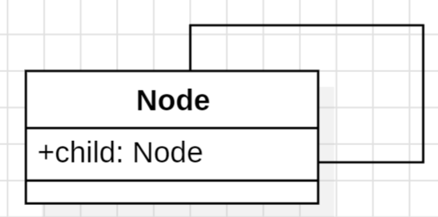
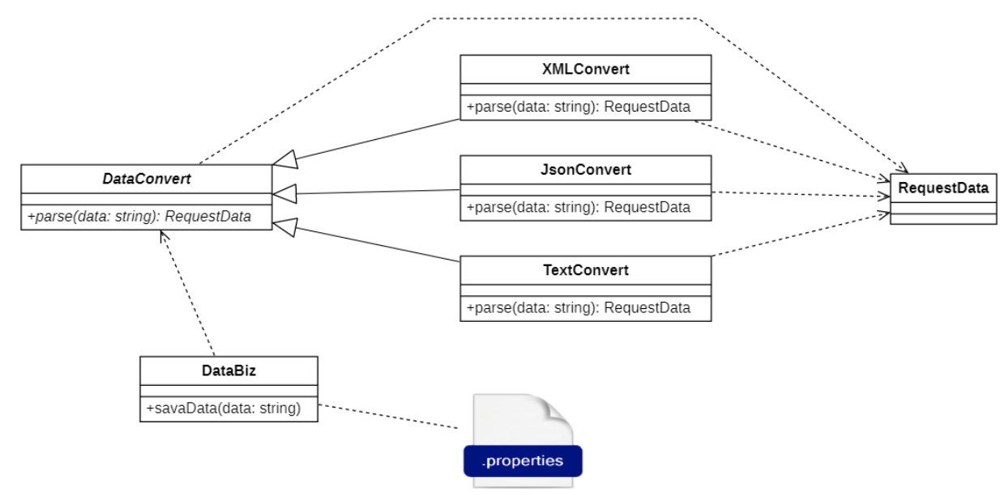
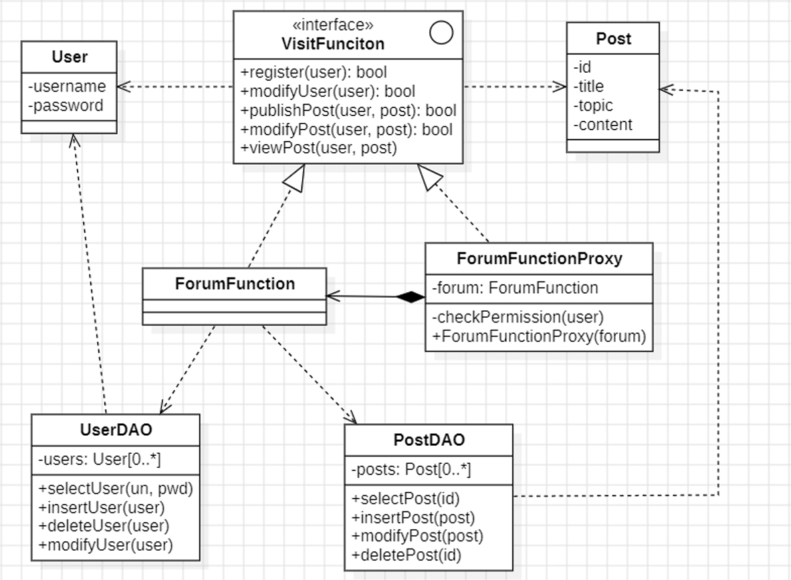

# 设计模式（Java版）

## 第一章：面向对象与设计模式

### 一、面向对象编程

#### （1）面向对象概述

##### 1. 面向对象的概念

面向对象 (Object Oriented) 是软件开发方法，一种编程范式。面向对象是一种对现实世界理解和抽象的方法，是计算机编程技术发展到一定阶段后的产物。

##### 2. 应用领域

面向对象的概念和应用不仅仅局限于程序设计和软件开发，扩展到如数据库系统、交互式界面、应用结构、应用平台、分布式系统等等领域。

##### 3. 对象

- 对象的含义是指具体的某一个事物，即在现实生活中能够看得见摸得着的事物。
- 所有的事务都可以看做对象，常说的“万物皆对象”。
- 在程序中对象是类的实例，类定义了一件事物的抽象特点，类的定义包含了数据的形式以及对数据的操作。

##### 4. 与面向过程的区别

- 面向过程就是分析出解决问题所需要的步骤，然后用函数把这些步骤一步一步实现，使用的时候一个一个依次调用就可以了；
- 面向对象是把构成问题事务分解成各个对象，建立对象的目的不是为了完成一个步骤，而是为了描叙某个事物在整个解决问题的步骤中的行为。

#### （2）面向对象的特性

##### 1. 封装

封装也叫作信息隐藏或者数据访问保护。类通过暴露有限的访问接口，授权外部仅能通过类提供的方式 (或者叫函数)来访问内部信息或者数据。

**优点：**

- 减少耦合：可以独立地开发、测试、优化、使用、理解和修改；
- 减轻维护的负担：可以更容易被理解，并且在调试的时候可以不影响其他模块；
- 有效地调节性能：可以通过剖析来确定哪些模块影响了系统的性能 提高软件的可重用性；
- 降低了构建大型系统的风险：即使整个系统不可用，但是这些独立的模块却有可能是可用的。

##### 2. 抽象

封装主要讲的是如何隐藏信息、保护数据，而抽象讲的是如何隐藏方法的具体实现，让调用者只需要关心方法提供了哪些功能，并不需要知道这些功能是如何实现的。

类的方法是通过编程语言中的“函数”这一语法机制来实现的。通过函数包裹具体的实现逻辑，这本身就是一种抽象。

##### 3. 继承

继承主要有三个作用：

- 表示 IS-A 关系，例如 `Cat` 和 `Animal` 就是一种 IS-A 关系，因此 `Cat` 可以继承自 `Animal`，从而获得 `Animal` 非 `private` 的属性和方法；
- 支持多态特性；
- 代码复用。

过度使用继承，继承层次过深过复杂，就会导致代码可读性、可维护性变差。

##### 4. 多态

多态分为编译时多态和运行时多态。

- 编译时多态主要指方法的重载；
- 运行时多态指程序中定义的对象引用所指向的具体类型在运行期间才确定，运行时多态有三个条件： 
	- 继承
	- 重写
	- 向上转型

### 二、设计模式简介

模式起源于建筑业而非软件业，由 *模式之父——克里斯托弗.亚历山大* 在总结舒适住宅和城市环境的共同认同规律时所归纳出来的。

模式：模式是在特定环境下人们解决某类重复出现问题的一套成功或有效的解决方案。

#### （1）软件模式

软件模式 (Software Patterns)：是将模式的一般概念应用于软件开发领域，即软件开发的总体指导思路或参照样板，软件模式是在一定条件下软件开发问题及其解法。

软件模式并非仅限于设计模式，还包括架构模式、分析模式和过程模式等，实际上，在软件开发生命周期的每一个阶段都存在着一些被认同的模式。

软件模式的基础结构主要由四部分构成：问题描述（待解决的问题是什么）、前提条件（在何种环境或约束条件下使用）、解法（如何解决）和效果（有哪些优缺点）。


软件模式与具体的应用领域无关，也就是说无论你从事的是移动应用开发、桌面应用开发、Web应用开发还是嵌入式软件的开发，都可以使用软件模式。

#### （2）设计模式的发展

在软件模式中，设计模式是研究最为深入的分支，设计模式用于在特定的条件下为一些重复出现的软件设计问题提供合理的、有效的解决方案。

在设计模式领域，狭义的设计模式就是指 GoF 的设计模式中的23种经典设计模式。随着软件开发技术的发展，必将产生更多的设计模式。

从1995年至今，无论是在大型 API 或框架（如 JDK、.Net Framework 等）、轻量级框架（如 Spring、 MyBaits、JUnit 等）、还是应用软件的开发中，设计模式都得到了广泛的应用。只要是支持面向对象的语言，必将涉及到设计模式的运用。

#### （3）设计模式的定义与分类

##### 1. 设计模式的定义

设计模式 (Design Pattern) 是一套被反复使用、多数人知晓的、经过分类编目的、代码设计经验的总结，使用设计模式是为了可重用代码、让代码更容易被他人理解并且保证代码可靠性。

GoF 定义：设计模式是在特定环境下为解决某一软件设计问题提供的一套定制的解决方案，该方案描述了类与对象之间的相互作用。

##### 2. 设计模式的基本要素

设计模式一般包含模式名称、问题、目的、解决方案、效果等组成要素，其中关键要素是模式名称、问题、解决方案和效果。

**模式名称 (Pattern Name)**

通过一两个词来描述模式的问题、解决方案和效果，以便更好地理解模式并方便开发人员之间的交流，绝大多数模式都是根据其功能或模式结构来命名的。 

在学习设计模式的时候建议准确的记忆设计模式的中英文名称，因为有时候在代码实现的时候类名中就会出现模式名称的关键词。

**问题 (Problem)** 

描述了应该在何时使用模式，它包含了设计中存在的问题以及问题存在的原因。有时候，在模式问题描述中可能包含模式使用的一些先决条件，例如在使用组合模式的时候要求系统存在整体和部分的层次结构关系。

**解决方案 (Solution)**

描述了一个设计模式的组成成分，以及这些组成成分之间的相互关系，各自的职责和协作方式，通常解决方案通过 UML 类图和核心代码来进行描述。 对于每一个设计模式用户必须掌握其类图，理解类图中每个角色的意义以及他们之间的关系，同时需要掌握核心代码，以便在开发中使用。

**效果 (Consequences)** 

描述了模式的优缺点以及在使用模式时应权衡的问题。在评价效果的时候一般需要结合面向对象的设计原则来评估。

##### 3. 设计模式的分类

设计模式一般有两种分类方式，我们经常将两种分类方式结合使用。

**根据用途分类：**

可分为创建型 (Creational)，结构型 (Structural) 和行为型 (Behavioral) 三种。

- 创建型模式（5）：主要用于描述如何创建对象。

	包括：单例模式、工厂方法模式、抽象工厂模式、原型模式、建造者模式。

- 结构型模式（7）：主要用于描述如何实现类或对象的组合。

	包括：适配器模式、桥接模式、组合模式、装饰模式、外观模式、享元模式、代理模式。

- 行为型模式（11）：主要用于描述类或对象怎样交互以及怎样分配职责。

	包括：职责链模式、命令模式、解释器模式、迭代器模式、中介者模式、备忘录模式、 观察者模式、状态模式、策略模式、模板方法模式、访问者模式。

**根据范围分类：**

设计模式根据范围（模式主要是用于处理类之间的关系还是对象之间的关系）还可以分为类模式和对象模式。 

- 类模式（4）：处理类和子类之间的关系，这类关系通过继承实现，在编译时就确定下来的一种静态关系。

	包括：工厂方法模式、适配器模式（类）、解释器模式、模板方法模式。

- 对象模式：处理对象之间的关系，这些关系在运行时变化，更具动态性。

	除了类模式以外其他的都是对象模式。


##### 4. 设计模式的优点

1. 它们是从许多优秀的软件系统中总结出的成功的、能够实现可维护性复用的设计方案，有助于我们提高开发和设计效率。
2. 设计模式提供了一套通用的设计词汇和一种通用的形式来方便开发人员之间沟通和交流，有助于提高交流效率。
3. 提高系统的灵活性和可扩展性。
4. 合理使用设计模式并对设计模式的使用情况进行文档化，将有助于别人更快地理解系统。
5. 学习设计模式将有助于初学者更加深入地理解面向对象思想。

#### （4）反模式

##### 1. 反模式的概念

反模式（anti-pattern）指的则是在实践中明显出现，但低效或有待优化的设计模式，是用来解决问题的带有共同性的不良方法。

反模式经过研究分类，能在研发系统尚未投产时被辨认出来，防止日后重蹈覆辙。

##### 2. 反模式的意图

- 反模式其实体现的是一种积极反思的行为。
- 通过对不断出现、糟糕透顶的解决方案反思之后的深刻总结，让我们能够从错误或者失败中学习提高，避免出现相同或类似的问题，提升效率。
- 理解了反模式，有助于我们在实际工作中预防并改正它们。

##### 3. 区分反模式的关键因素

- 行动、过程和结构中一些重复出现的，乍一看有益但最终得不偿失的模式；
- 在实践中证明且可重复的有清晰记录的重构方案。

##### 4. 反模式案例

用23种设计模式编写 `Hello World` :

```java
public class Main {

    public static void main(String[] args) throws InstantiationException, IllegalAccessException {
        //hello=interjection
        //world=object

        System.out.println("We are creational patterns!");

        System.out.println("1. Abstract Factory: ");

        SplitHelloWorldFactory abstractFactory = AbstractFactory.select(AbstractFactory.Type.DesignPattern);
        HelloWorld abstractFactoryHelloWorld = new SplitHelloWorld(abstractFactory.createHelloWorldInterjection(),
                abstractFactory.createHelloWorldObject());
        System.out.println(abstractFactoryHelloWorld.helloWorld());

        System.out.println("2. Builder: ");
        HelloWorld builderHelloWorld = HelloWorldBuilder.builder()
                .interjection("Hello")
                .object("Builder").getHelloWorld();
        System.out.println(builderHelloWorld.helloWorld());

        System.out.println("3. Factory Method: ");
        /**
         * Difference between "abstract factory" and "factory method" is the abstracting point:
         *  1. Abstracting point of abstract factory is factory.
         *  2. Abstracting point of factory method is generated object.
         */
        FactoryMethodHelloWorldFactory factoryMethodHelloWorldFactory = new FactoryMethodHelloWorldFactory();
        HelloWorld factoryMethodHelloWorld = factoryMethodHelloWorldFactory.createHelloWorld();
        System.out.println(factoryMethodHelloWorld.helloWorld());

        System.out.println("4. Prototype: ");
        HelloWorld prototypeHelloWorld = HelloWorldPrototype.PROTOTYPE.clone();
        System.out.println(prototypeHelloWorld.helloWorld());

        System.out.println("5. Singleton: ");
        HelloWorld singletonHelloWorld = HelloWorldSingleton.instance();
        System.out.println(singletonHelloWorld.helloWorld());

        System.out.println("====================================");
        System.out.println("We are structural patterns!");

        System.out.println("6. Adapter: ");
        HelloWorld adapterHelloWorld = new HelloWorldAdapter(new HelloAdapterDesignPattern());
        System.out.println(adapterHelloWorld.helloWorld());

        System.out.println("7. Bridge: ");
        HelloWorld bridgeHelloWorld = new HelloWorldBridge(new DesignPatternWorldImpl());
        //leave bridgeHelloWorld' output to compositeHelloWorld

        System.out.println("8. Composite: ");
        HelloWorld compositeHelloWorld = new CompositeHelloWorld(bridgeHelloWorld, new CompositeHelloWorld.DefaultHelloWorld());
        System.out.println(compositeHelloWorld.helloWorld());

        System.out.println("9. Decorator: ");
        HelloWorldDecorator decoratorHelloWorld = new HelloWorldDecorator(new HelloWorldDecorator.DefaultHelloWorld());
        System.out.println(decoratorHelloWorld.helloDecorator());

        System.out.println("10. Facade: ");
        HelloWorld facadeHelloWorld = HelloWorldFacade.instance().facadeHelloWorld();
        System.out.println(facadeHelloWorld.helloWorld());

        System.out.println("11. Flyweight: ");
        HelloWorld flyWeightHelloWorld = HelloWorldFlyWeightFactory.instance().createHelloWorld("Hello Flyweight!");
        System.out.println(flyWeightHelloWorld.helloWorld());

        System.out.println("12. Proxy: ");
        HelloWorld proxyHelloWorld = new HelloWorldProxy(new HelloWorldProxy.DefaultHelloWorld());
        System.out.println(proxyHelloWorld.helloWorld());

        System.out.println("====================================");
        System.out.println("We are behavioral patterns!");

        System.out.println("13. Chain of Responsibility: ");
        HelloWorldHandler helloWorldChainOfResponsibility = new HelloWorldInterjectionHandler().setNext(new HelloWorldObjectHandler());
        System.out.println(helloWorldChainOfResponsibility.helloWorld());

        System.out.println("14. Command: ");
        Command helloWorldCommand = new HelloWorldPrintCommand();
        helloWorldCommand.execute();

        System.out.println("15. Interpreter: ");
        HelloWorldInterpreter helloWorldInterpreter = new HelloWorldInterpreter();
        helloWorldInterpreter.interpret("println('Hello Interpreter!')");

        System.out.println("16. Iterator: ");
        HelloWorldCharacterIterator helloWorldCharacterIterator = new HelloWorldCharacterIterator("Hello Iterator!".toCharArray());
        while (helloWorldCharacterIterator.hasNext()) {
            System.out.print(helloWorldCharacterIterator.next());
        }
        System.out.println();

        System.out.println("17. Mediator: ");
        HelloWorldInterjection helloWorldInterjection = new HelloWorldInterjection();
        HelloWorldObject helloWorldObject = new HelloWorldObject();
        HelloWorldMediator helloWorldMediator = new HelloWorldMediator(helloWorldInterjection, helloWorldObject);
        helloWorldInterjection.setHelloWorldMediator(helloWorldMediator);
        helloWorldObject.setHelloWorldMediator(helloWorldMediator);
        System.out.println(helloWorldObject.helloWorld());

        System.out.println("18. Memento: ");
        HelloWorldMementoOriginator helloWorldMementoOriginator = new HelloWorldMementoOriginator();
        HelloWorldMementoOriginator.Memento memento = helloWorldMementoOriginator.set("Hello Memento!").saveToMemento();
        helloWorldMementoOriginator.set("Hello Whatever!");
        helloWorldMementoOriginator.restoreFromMemento(memento);
        System.out.println(helloWorldMementoOriginator.helloWorld());

        System.out.println("19. Observer: ");
        Subject subject = new Subject().attach(new HelloWorldObserver());
        subject.notifyObservers();

        System.out.println("20. State: ");
        HelloWorldStateContext helloWorldStateContext = new HelloWorldStateContext();
        HelloWorld stateHelloWorld = helloWorldStateContext.appendWord("Hello").appendWord("State");
        System.out.println(stateHelloWorld.helloWorld());

        System.out.println("21. Strategy: ");
        HelloWorldStrategyContext helloWorldStrategyContext = new HelloWorldStrategyContext(new DesignPatternHelloWorldStrategy());
        System.out.println(helloWorldStrategyContext.helloWorld());

        System.out.println("22. Template Method: ");
        HelloWorld templateMethodHelloWorld = new TemplateMethodHelloWorld();
        System.out.println(templateMethodHelloWorld.helloWorld());

        System.out.println("23. Visitor: ");
        HelloWorldCharacterElements helloWorldCharacterElements = new HelloWorldCharacterElements("Hello Visitor!".toCharArray());
        HelloWorldCharacterVisitor helloWorldCharacterVisitor = new HelloWorldCharacterVisitor();
        helloWorldCharacterElements.accept(helloWorldCharacterVisitor);
        System.out.println(helloWorldCharacterVisitor.helloWorld());

    }
}
```

### 三、统一建模语言

统一建模语言（英语：Unified Modeling Language，缩写 UML）是非专利的第三代建模和规约语言。UML是一种开放的方法，用于说明、可视化、构建和编写一个正在开发的、面向对象的、软件密集系统的 制品的开放方法。UML展现了一系列最佳工程实践，这些最佳实践在对大规模，复杂系统进行建模方面， 特别是在软件架构层次已经被验证有效。

#### （1）UML 概述

##### 1. 模型

在 UML 系统开发中有三个主要的模型：

- 功能模型：从用户的角度展示系统的功能，包括用例图。
- 对象模型：采用对象，属性，操作，关联等概念展示系统的结构和基础，包括类别图、对象图。
- 动态模型：展现系统的内部行为。包括序列图，活动图，状态图。

##### 2. 图

区分UML模型和UML图是非常重要的，UML图是模型中信息的图形表达方式，但是UML模型独立于UML 图存在。

UML 2.2中一共定义了14种图示。


#### （2）类图

类图是一切面向对象方法的核心建模工具。该图描述了系统中对象的类型以及它们之间存在的各种静态关 系。

在UML中类图一般由3部分组成。 

- 第一部分：类名，按照命名规范来定义。
- 第二部分：属性 (Attribute)，属性通常指类的成员变量。

定义格式：

```
[可见性] 属性名:数据类型 [=默认值]
```

- 第三部分：操作 (Operation)，操作通常指类的成员方法。

定义格式：

```
[可见性] 方法名([参数1:数据类型,参数2:数据类型,....]) [:返回值类型]
```

#### （3）类之间的关系

##### 1. 关联关系

关联（Association）关系是一种结构化的关系，用于表示一个类对象与另一个类对象的之间的关系，在代 码中被关联的对象以成员变量的方式体现。

**单向关联：**

<font color="blue">示例：</font>


```java
import java.io.*;
import java.util.*;

public class Address {
    
    public Address() {
    }

    private String city;

    private String provence;
}
```

```java
import java.io.*;
import java.util.*;

public class Person {

    /**
     * Default constructor
     */
    public Person() {
    }
    
    protected int id;
    
    private int age;
   
    public String name;
    
    protected String mail;
    
    protected Address addr;

    /**
     * @param words 
     * @return
     */
    public void speak(String words) {
        // TODO implement here
    }
}
```

**双向关联：**

<font color="blue">示例：</font>


```java
import java.io.*;
import java.util.*;

public class Gift {

    /**
     * Default constructor
     */
    public Gift() {
    }

    private Person person;
}
```

```java
import java.io.*;
import java.util.*;

public class Person {

    /**
     * Default constructor
     */
    public Person() {
    }

    protected int id;

    private int age;

    public String name;

    protected String mail;

    protected Address addr;

    protected Gift gift;

    /**
     * @param words 
     * @return
     */
    public void speak(String words) {
        // TODO implement here
    }
}
```

**自关联：**

类的属性对象包含自己的情况。

<font color="blue">示例：</font>




```java
import java.io.*;
import java.util.*;

public class Node {

    /**
     * Default constructor
     */
    public Node() {
    }
    
    public Node child;
}
```

**多重性关联：**

多重性关联关系又称为重数性（Multiplicity）关联关系，表示关联对象之间存在数量关系。

数量关系符表示如下：

- 1或1..1：表示另一个类的一个对象只与该类的一个对象有关系
- 0..*：表示另一个类的一个对象与该类的零个或多个对象有关系
- 1..*：表示另一个类的一个对象与该类的一个或多个对象有关系
- 0..1：表示另一个类的一个对象没有或只与该类的一个对象有关系
- m..n：表示另一个类的一个对象与该类最少m最多n个对象有关系（m ≤ n）

<font color="blue">示例：</font>


```java
import java.io.*;
import java.util.*;

public class Group {

    /**
     * Default constructor
     */
    public Group() {
    }
    
    public Set<Element> element;
}
```

```java
import java.io.*;
import java.util.*;

public class Element {

    /**
     * Default constructor
     */
    public Element() {
    }
}
```

##### 2. 聚合关系

聚合（Aggregation）关系表示整体与部分的关系，在聚合中成员是整体对象的一部分，成员对象可以脱离整体对象而独立存在。

<font color="blue">示例：</font>


```java
import java.io.*;
import java.util.*;

public class Human1 {

    /**
     * Default constructor
     */
    public Human1() {
    }
    
    public Set<Car> cars;
    
    public Set<House> houses;

}
```

```java
import java.io.*;
import java.util.*;

public class House {

    /**
     * Default constructor
     */
    public House() {
    }
}
```

```java
import java.io.*;
import java.util.*;

public class Car{

    /**
     * Default constructor
     */
    public Car() {
    }
}
```

##### 3. 组合关系

组合（Composition）关系也表示整体与部分的关系，在组合中整体对象可以控制成员对象的生命周期， 一旦整体对象消亡成员对象将消失。

<font color="blue">示例：</font>


```java
import java.io.*;
import java.util.*;

public class Human2 {

    /**
     * Default constructor
     */
    public Human2() {
    }

    public Head head;

    private Body body;
}
```

```java
import java.io.*;
import java.util.*;

public class Head {

    /**
     * Default constructor
     */
    public Head() {
    }
}
```

```java
import java.io.*;
import java.util.*;

public class Body {

    /**
     * Default constructor
     */
    public Body() {
    }
}
```

##### 4. 依赖关系

依赖（Dependency）关系是一种使用关系，在大多数情况下依赖关系体现在某个类方法参数上使用另一 个类的对象作为方法参数。

<font color="blue">示例：</font>


```java
import java.io.*;
import java.util.*;

public class Human3 {

    /**
     * Default constructor
     */
    public Human3() {
    }

    /**
     * @param box
     */
    public void moveBox(Box box) {
        // TODO implement here
    }
}
```

```java
import java.io.*;
import java.util.*;

public class Box {

    /**
     * Default constructor
     */
    public Box() {
    }
}
```

##### 5. 泛化关系

泛化（Generalization）关系也就是继承关系。

<font color="blue">示例：</font>


```java
import java.io.*;
import java.util.*;

public class Human4 {

    /**
     * Default constructor
     */
    public Human4() {
    }
}
```

```java
import java.io.*;
import java.util.*;

public class Student extends Human4 {

    /**
     * Default constructor
     */
    public Student() {
    }
}
```

```java
import java.io.*;
import java.util.*;

public class Teacher extends Human4 {

    /**
     * Default constructor
     */
    public Teacher() {
    }
}
```

##### 6. 接口与实现关系

接口（Interface）之间也可以有与类之间关系类似的继承关系和依赖关系，接口与类之间同时还存在一种 实现（Realization）关系，在这种关系中类实现了接口中所有的操作。

<font color="blue">示例：</font>


```java
import java.io.*;
import java.util.*;

public interface Vehicle {

}
```

```java
import java.io.*;
import java.util.*;

public class Car implements Vehicle{

    /**
     * Default constructor
     */
    public Car() {
    }
}
```

```java
import java.io.*;
import java.util.*;

public class Bus implements Vehicle{

    /**
     * Default constructor
     */
    public Bus() {
    }
}
```

### 四、面向对象设计原则

#### （1）优秀设计的特征

##### 1. 代码复用

无论是开发何种软件产品，成本和时间都最重要的两个维度。

- 较短的开发时间意味着可比竞争对手更早进入市场；
- 较低的开发成本意味着能够留出更多营销资金，因此能更广泛地覆盖潜在客户。

代码复用是减少开发成本时最常用的方式之一。

##### 2. 扩展性

变化是程序员生命中唯一不变的事情。因此在设计程序架构时，所有有经验的开发者会尽量选择支持未来任何可能变更的方式。

在支持可维护性（Maintainability）的同时，提高系统的可复用性（Reusability）是一个至关重要的问题，如何同时提高一个软件系统的可维护性和可复用性是面向对象设计需要解决的核心问题之一。

#### （2）面向对象设计原则

面向对象设计原则为支持可维护性复用而诞生，这些原则蕴含在很多设计模式中，它们是从许多设计方案 中总结出的指导性原则。

每一个设计模式都符合一个或多个设计原则，面向对象设计原则是评价设计模式使用效果的重要指标之一。

常见的设计原则如下图所示：


#### （3）SOLID 原则

##### 1. 单一职责原则

 单一职责原则（Single Responsibility Principle，SRP）：一个对象应该只包含单一的职责，并且该职责被完美的封装在一个类中。

单一原则是最简单的设计原则，它用来控制类的颗粒度大小。

<font color="blue">示例：业务操作系统</font>


上述类图中，`RoleDataOperation` 类承载了数据库连接、数据库数据操作、存档数据业务操作的功能职责，不符合单一职责。

改进如下：


业务操作只包含存档操作，数据库操作 `GameRoleDAO` 为另一个类，并且数据库连接 `DbHelper` 也在另一个类。

##### 2. 开闭原则

开闭原则 (Open-Closed Principle，OCP) ：软件实体应对扩展开放，而对修改关闭。

开闭原则是面向对象的可复用设计的第一块基石，它是最重要的面向对象设计原则。

在开闭原则的定义中，软件实体可以指一个软件模块、一个由多个类组成的局部结构或一个独立的类。开闭原则就是指软件实体尽量在不修改源码的情况下进行扩展。

开闭原则是评价基于某个设计模式设计的系统是否具备灵活性和可扩展性的重要依据。

<font color="blue">示例：刷怪塔</font>


`creatMonster` 方法核心代码如下：

```java
Monster monster;
if (type == 1){
	Boss boss;
	monster = boss;
	//Boss扩展处理
} else if (type == 2){
	Elite elite;
	monster = elite;
	//精英怪扩展处理
} else{
	Soldier soldier;
	monster = soldier;
	//普通怪扩展处理
}
//怪物对象通用处理(初始化数据、添加到对象池)
//...
```

此时如果新增加一种怪物类型，那么就会修改 `creatMonster` 的业务逻辑，不符合开闭原则。

修改如下：


代码调整：

```java
//怪物对象通用处理(初始化数据、添加到对象池)
//...
```

##### 3. 里氏替换原则

严格表述：如果对每一个类型为S的对象 `o1`，都有类型为T的对象 `o2`，使得以T定义的所有程序P在所有的对象 `o1` 代 换 `o2` 时，程序P的行为没有变化，那么类型S是类型T的子类型。

里氏替换原则 (Liskov Substitution Principle, LSP)：所有引用基类（父类）的地方必须能透明地使用其子类的对象。

<font color="red">**在软件中将一个基类对象替换成它的子类对象，程序将不会产生任何错误和异常，反过来则不成立，如果一个软件实体使用的是一个子类对象的话，那么它不一定能够使用基类对象。**</font>

例如有两个类，一个类为 `BaseClass`，另一个是 `SubClass` 类，并且 `SubClass` 类是 `BaseClass` 类的子 类，那么一个方法如果可以接受一个 `BaseClass` 类型的基类对象 `base` 的话，如：`method1(base)`， 那么它必然可以接受一个 `BaseClass` 类型的子类对象 `sub`，`method1(sub)` 能够正常运行。

反过来的代换不成立，如一个方法 `method2` 接受 `BaseClass` 类型的子类对象 `sub` 为参数：`method2(sub)`，那么一般而言不可以有 `method2(base)`，除非是重载方法。

里氏代换原则是实现开闭原则的重要方式之一，由于使用基类对象的地方都可以使用子类对象，因此在程 序中尽量使用基类类型来对对象进行定义，而在运行时再确定其子类类型，用子类对象来替换父类对象。

<font color="blue">示例：下载产品</font>


兼容 LSP 设计原则的 `execute` 方法：

```java
// 创建Audio产品对象
Product audio = new Audio();
audio.setFilePath("audio.mp3");
// 创建Video产品对象
Product video = new Video();
video.setFilePath("video.mp4");
// 呼叫下载方法下载不同的产品
download(audio);
download(video);
```

不兼容 LSP 设计原则的 `execute` 方法：

```java
// 创建Chocolate产品对象
Product chocolate = new Chocolate();
chocolate.setFilePath("Chocolate can not be downloaded.");
// 呼叫下载方法下载巧克力产品
download(chocolate);
```

**常见的 LSP 违规：**

- 子类中的退化方法：如果基类有一个方法，但基类的子类不需要该方法，那么如果子类的作者再次退化该方法，这将是可替代的违规。
- 从子类抛出异常：LSP 违规的另一种形式是向子类添加异常，而基类不希望这样。因为那时基类不能被子类替代。

##### 4. 依赖倒置原则

严格表述：高层模块不应该从低层模块导入任何东西，两者都应该依赖于抽象。抽象不应该依赖于细节，细节应当依赖于抽象。

依赖倒置原则（Dependence Inversion Principle, DIP）：针对接口编程，而不是针对实现编程。

如果说开闭原则是面向对象设计的目标的话，那么依赖倒置原则就是面向对象设计的主要实现机制之一，它是系统抽象化的具体实现。

**依赖倒置原则要求我们在程序代码中传递参数时或在关联关系中，尽量引用层次高的抽象层类，即使用接 口和抽象类进行变量类型声明、参数类型声明、方法返回类型声明，以及数据类型的转换等，而不要用具 体类来做这些事情。**为了确保该原则的应用，一个具体类应当只实现接口或抽象类中声明过的方法，而不 要给出多余的方法，否则将无法调用到在子类中增加的新方法。

在引入抽象层后，系统将具有很好的灵活性，在程序中尽量使用抽象层进行编程，而将具体类写在 配置文件中，这样一来，如果系统行为发生变化，只需要对抽象层进行扩展，并修改配置文件，而 无须修改原有系统的源代码，在不修改的情况下来扩展系统的功能，满足开闭原则的要求。

在实现依赖倒置原则时，我们需要针对抽象层编程，而将具体类的对象通过依赖注入 (Dependency Injection, DI) 的方式注入到其他对象中，依赖注入是指当一个对象要与其他对象发生依赖关系时，通过抽象来注入所依赖的对象。常用的注入方式有三种，分别是：构造注入，设值注入（Setter注入）和接口注入。

- 构造注入是指通过构造函数来传入具体类的对象；
- 设值注入是指通过Setter方法来传入具体类的对象；
- 接口注入是指通过在接口中声明的业务方法来传入具体类的对象。

这些方法在定义时使用的是抽象类型，在运行时再传入具体类型的对象，由子类对象来覆盖父类对象。

<font color="blue">示例：不同文件类型转换</font>


上面示例中 `DataBiz` 是典型的针对具体实现进行编程，因此在数据格式变更的时候就需要反复的修改代码。

下面进行重构：



基于依赖倒置原则，新增一个抽象的转换器 `DataConvert`，`DataBiz` 针对 `DataConvert` 进行编程，然 后根据里氏替换原则，程序运行时对父类进行替换，根据开闭原则，将运行对象指定设置到配置文件中。

在上述重构过程中，我们使用了开闭原则、里氏代换原则和依赖倒转原则，在大多数情况下，这三个设计 原则会同时出现，**开闭原则是目标，里氏代换原则是基础，依赖倒转原则是手段，**它们相辅相成，相互补 充，目标一致，只是分析问题时所站角度不同而已。

##### 5. 接口隔离原则

接口隔离原则 (Interface Segregation Principle，ISP)：客户端不应该依赖那些它不需要的接口。

根据接口隔离原则，当一个接口太大时，我们需要将它分割成一些更细小的接口，使用该接口的客户端仅 需知道与之相关的方法即可。**每一个接口应该承担一种相对独立的角色，不干不该干的事，该干的事都要干。**

在使用接口隔离原则时，我们需要注意控制接口的粒度，接口不能太小，如果太小会导致系统中接口泛 滥，不利于维护；接口也不能太大，太大的接口将违背接口隔离原则，灵活性较差，使用起来很不方便。 一般而言，接口中仅包含为某一类用户定制的方法即可，不应该强迫客户依赖于那些它们不用的方法。

“接口”的两种不同含义：

- 一种是指一个类型所具有的方法特征的集合，仅仅是一种逻辑上的抽象。在 ISP 可以理解成一种角色，一个接口只能代表一种角色，此时也可以称之为“角色隔离原则”；
- 一种是指某种语言具体的“接口”定义，有严格的定义和结构（如Java中的interface）。在 ISP 中表达的意思是指接口仅仅提供客户端需要的行为，客户端不需要的行为则隐藏起来，应当为客户端提 供尽可能小的单独的接口，而不要提供大的总接口。

<font color="blue">示例：文件存储服务商</font>


由于 `Dropbox` 不提供 `createServe` 等方法，`CloudProvider` 接口的职责就不再单一。

根据接口隔离原则重构如下：


#### （4）组合复用原则

组合复用原则 (Composite Reuse Principle, CRP)，又称为组合/聚合复用原则 (Composition/Aggregate Reuse Principle, CARP)：优先使用对象的组合，而不是使用继承来达到复用的目的。

在面向对象设计中，可以通过两种方法在不同的环境中复用已有的设计和实现，即通过组合/聚合关系或通 过继承，但首先应该考虑使用组合/聚合。

组合/聚合可以使系统更加灵活，降低类与类之间的耦合度，一个类的变化对其他类造成的影响相对较少；

其次才考虑继承，在使用继承时，需要严格遵循里氏代换原则，有效使用继承会有助于对问题的理解，降 低复杂度，而滥用继承反而会增加系统构建和维护的难度以及系统的复杂度，因此需要慎重使用继承复 用。

<font color="red">**一般而言，如果两个类之间是“Has-A”的关系应使用组合或聚合，如果是“Is-A”关系可使用继承。**</font>

<font color="blue">示例：</font>


如果在几个维度上扩展一个类 (货物类型 × 发动机类型 × 导航类型) 可能会导致子类的组合爆炸。

每增加一个参数都会增加子类的数量。子类之间有很多重复的代码，因为一个子类不能同时继承两个类。

重构如下：


#### （5）迪米特法则

迪米特法则 (Law Of Demeter, LOD)，又称为最少知识原则 (Least Knowledge Principle, LKP)，即一个对象应当对其他对象尽可能少的了解，其定义有如下几种形式：

- 每一个软件单位对其他单位尽可能少的了解，而且局限于哪些与本单位密切相关的的软件。
- 每个单位应该只和它的朋友们通信，不与陌生人通信。
- 只和直接的朋友通信。

##### 1. 法则目标

如果一个系统符合迪米特法则，那么当其中某一个模块发生修改时，就会尽量少地影响其他模块，扩展会 相对容易，这是对软件实体之间通信的限制，迪米特法则要求限制软件实体之间通信的宽度和深度。

迪米特法则可降低系统的耦合度，使类与类之间保持松散的耦合关系。

##### 2. 狭义的迪米特法则

迪米特法则要求我们在设计系统时，应该尽量减少对象之间的交互，如果两个对象之间不必彼此直接通信，那么这两个对象就不应当发生任何直接的相互作用，如果其中的一个对象需要调用另一个对象的某一个方法的话，可以通过第三者转发这个调用。简言之，就是**通过引入一个合理的第三者来降低现有对象之间的耦合度。**

对于一个对象，其直接朋友包括以下几类：

- 当前对象本身(this)；
- 以参数形式传入到当前对象方法中的对象；
- 当前对象的成员对象；
- 如果当前对象的成员对象是一个集合，那么集合中的元素也都是朋友；
- 当前对象所创建的对象；

不是直接朋友的典型情况：只出现在方法体内部的类对象。

缺点：遵循类之间的迪米特法则会是一个系统的局部设计简化，因为每一个局部都不会和远距离的对象有 直接的关联。但是，这也会造成系统的不同模块之间的通信效率降低，也会使系统的不同模块之间不容易 协调。

<font color="blue">与直接朋友通信案例：班长签到</font>


在 `Teacher` 中对非直接的朋友 `Student` 进行了通信，违背了迪米特法则，下面对其进行重构：


##### 3. 广义的迪米特法则

- 在类的结构设计上，每一个类都应当尽量降低其成员变量和成员函数的访问权限；
- 在类的设计上，只要有可能，一个类型应当设计成不变类；
- 在对其他类的引用上，一个对象对其他对象的引用应当降到最低。

<font color="blue">减少对朋友的了解案例：人使用全自动洗衣机</font>


`Human` 需要调用许多 `WashingMachine` 提供的方法，同时还可以能导致调用顺序错误，违背了迪米特法 则，下面来对其进行重构：


##### 4. 迪米特法则注意事项

- 在类的划分上，应当创建弱耦合的类，类与类之间的耦合越弱，就越有利于实现可复用的目标。
- 在类的结构设计上，每个类都应该降低成员的访问权限。
- 在类的设计上，只要有可能，一个类应当设计成不变的类。
- 在对其他类的引用上，一个对象对其他类的对象的引用应该降到最低。
- 尽量限制局部变量的有效范围，降低类的访问权限。

## 第二章：创建型模式

创建型模式主要用于描述如何创建对象。

### 一、简单工厂模式

#### （1）简单工厂模式概述

简单工厂模式（Simple Factory Pattern）又叫做静态工厂方法模式（Static Factory Method Pattern），并不属于 GoF 的23种设计模式之一，是学习其他工厂模式的的基础。

<font color="blue">官方说明：</font>工厂是一个用于创建其他对象的对象——从形式上讲，工厂是一个函数或方法，它返回不同原型或类型的对象。

提供封装在名为工厂的类中的静态方法，以隐藏实现逻辑并使客户端代码专注于使用而不是初始化新对象。

#### （2）简单工厂模式的结构


在简单工厂模式结构图中包含如下几个角色：

- `Factory`（工厂角色）：工厂角色即工厂类，它是简单工厂模式的核心，**负责实现创建所有产品实例**的内部逻辑；工厂类可以被外界直接调用，创建所需的产品对象；在工厂类中提供了静态的工厂方法 `factoryMethod()`，它的返回类型为抽象产品类型 `Product`。
- `Product`（抽象产品角色）：**它是工厂类所创建的所有对象的父类，封装了各种产品对象的公有方法**，它的引入将提高系统的灵活性，使得在工厂类中只需定义一个通用的工厂方法，因为所有创建的具体产品对象都是其子类对象。
- `ConcreteProduct`（具体产品角色）：它是简单工厂模式的创建目标，所有被创建的对象都充当这个角色的某个具体类的实例。每一个具体产品角色都继承了抽象产品角色，需要实现在抽象产品中声明的抽象方法。

#### （3）简单工厂模式的实现

<font color="blue">示例：有金币和铜币两种硬币，硬币工厂可提供这两种硬币，用户需要在硬币工厂获取硬币。</font>

**类图设计：**


**代码实现：**

```java
package factory_pattern.simple_factory_pattern;

/**
 * 硬币接口
 */
public interface Coin {

    /**
     * 硬币接口需要用描述方法来实现
     * @return
     */
    String getDescription();
}
```

```java
package factory_pattern.simple_factory_pattern;

/**
 * 金币
 */
public class GoldCoin implements Coin {
    @Override
    public String getDescription() {
        return "金币";
    }
}
```

```java
package factory_pattern.simple_factory_pattern;

/**
 * 铜币
 */
public class CopperCoin implements Coin {
    @Override
    public String getDescription() {
        return "铜币";
    }
}
```

```java
package factory_pattern.simple_factory_pattern;

/**
 * 硬币工厂
 */
public class CoinFactory {

    /**
     * 获得硬币
     * @param type 类型
     * @return
     */
    public static Coin getCoin(int type) {
        switch (type) {
            case 1:
                return new GoldCoin();
            case 2:
                return new CopperCoin();
            default:
                throw new IllegalArgumentException("没有该类型的硬币");
        }
    }
}
```

```java
package factory_pattern.simple_factory_pattern;

/**
 * 客户端
 */
public class Client {

    public static void main(String[] args) {
        CoinFactory factory = new CoinFactory();
        Coin coin = factory.getCoin(2);
        System.out.println(coin.getDescription());
    }
}
```

**简单工厂模式案例简化：**


#### （4）简单工厂模式的适用环境

##### 1. 主要优点

- 工厂类包含必要的判断逻辑，可以决定在什么时候创建哪一个产品类的实例，客户端可以免除直接创建产品对象的职责，而仅仅“消费”产品，简单工厂模式实现了对象创建和使用的分离。
- 客户端无须知道所创建的具体产品类的类名，只需要知道具体产品类所对应的参数即可，对于一些复杂的类名，通过简单工厂模式可以在一定程度减少使用者的记忆量。
- 通过引入配置文件，可以在不修改任何客户端代码的情况下更换和增加新的具体产品类，在一定程度上提高了系统的灵活性。

##### 2. 主要缺点

- 由于工厂类集中了所有产品的创建逻辑，职责过重，一旦不能正常工作，整个系统都要受到影响。
- 使用简单工厂模式势必会增加系统中类的个数（引入了新的工厂类），增加了系统的复杂度和理解难度。
- 系统扩展困难，一旦添加新产品就不得不修改工厂逻辑，在产品类型较多时，有可能造成工厂逻辑过于复杂，不利于系统的扩展和维护。（违背了开闭原则）
- 简单工厂模式由于使用了静态工厂方法，造成工厂角色无法形成基于继承的等级结构。

##### 3. 适用环境

在以下情况下可以考虑使用简单工厂模式：

1. 工厂类负责创建的对象比较少，由于创建的对象较少，不会造成工厂方法中的业务逻辑太过复杂。
2. 客户端只知道传入工厂类的参数，对于如何创建对象并不关心。

### 二、工厂方法模式

#### （1）工厂方法模式的概述

简单工厂模式虽然简单，但存在一个很严重的问题，违背了开闭原则。工厂方法模式（Factory Method Pattern），继承了简单工厂模式的优点，同时做出了修改以达到符合开闭原则的要求。

工厂方法模式也被称为虚拟构造器模式（Virtual Constructor Pattern）或多态工厂模式 （Polymorphic Factory Pattern）。

<font color="blue">官方说明：</font>定义一个用于创建对象的接口，让子类决定将哪一个类实例化。工厂方法模式让一个类的实例化延迟到其子类。

在工厂方法模式中，不再提供一个统一的工厂类来创建所有的产品对象，而是针对不同的产品提供不同的工厂，系统提供一个与产品等级结构对应的工厂等级结构。

#### （2）工厂方法模式的结构


在工厂方法模式结构图中包含如下几个角色：

- `Product`（抽象产品）：它是定义产品的接口，是工厂方法模式所创建对象的超类型，也就是产品对象的公共父类。
- `ConcreteProduct`（具体产品）：它实现了抽象产品接口，某种类型的具体产品由专门的具体工厂创建，具体工厂和具体产品之间一一对应。
- `Factory`（抽象工厂）：在抽象工厂类中，声明了工厂方法（Factory Method），用于返回一个产品。抽象工厂是工厂方法模式的核心，所有创建对象的工厂类都必须实现该接口。
- `ConcreteFactory`（具体工厂）：它是抽象工厂类的子类，实现了抽象工厂中定义的工厂方法，并可由客户端调用，返回一个具体产品类的实例。

#### （3）工厂方法模式的实现

<font color="blue">示例：精灵铁匠制造精灵武器，兽人铁匠制造兽人武器，客户端需要从铁匠那里得到武器。</font>

**类图设计：**


**代码实现：**

```java
package factory_pattern.factory_method_pattern;

/**
 * 武器抽象类
 */
public abstract class Weapon {

    /**
     * 展示武器
     */
    public abstract void showWeapon();
}
```

```java
package factory_pattern.factory_method_pattern;

/**
 * 兽人武器
 */
public class OrcWeapon extends Weapon{
    /**
     * 展示武器
     */
    @Override
    public void showWeapon() {
        System.out.println("狼牙棒");
    }
}
```

```java
package factory_pattern.factory_method_pattern;

/**
 * 精灵武器
 */
public class ElfWeapon extends Weapon{
    /**
     * 展示武器
     */
    @Override
    public void showWeapon() {
        System.out.println("弓箭");
    }
}
```

```java
package factory_pattern.factory_method_pattern;

/**
 * 铁匠接口
 */
public interface Blacksmith {
    /**
     * 铁匠制作武器
     * @return
     */
    Weapon makeWeapon();
}
```

```java
package factory_pattern.factory_method_pattern;

/**
 * 精灵铁匠
 */
public class ElfBlacksmith implements Blacksmith {
    /**
     * 制造武器
     * @return
     */
    @Override
    public Weapon makeWeapon() {
        return new ElfWeapon();
    }
}
```

```java
package factory_pattern.factory_method_pattern;

/**
 * 兽人铁匠
 */
public class OrcBlacksmith implements Blacksmith {
    /**
     * 制造武器
     * @return
     */
    @Override
    public Weapon makeWeapon() {
        return new OrcWeapon();
    }
}
```

```java
package factory_pattern.factory_method_pattern;

/**
 * 客户端
 */
public class Client {
    public static void main(String[] args) {
        Blacksmith blacksmith = new ElfBlacksmith();
        Weapon weapon = blacksmith.makeWeapon();
        weapon.showWeapon();
    }
}
```

#### （4）工厂方法模式的适用环境

##### 1. 主要优点

- 在工厂方法模式中，工厂方法用来创建客户所需要的产品，同时还向客户隐藏了哪种具体产品类将被实例化这一细节，用户只需要关心所需产品对应的工厂，无须关心创建细节，甚至无须知道具体产品类的类名。
- 基于工厂角色和产品角色的多态性设计是工厂方法模式的关键。它能够让工厂可以自主确定创建何种产品对象，而如何创建这个对象的细节则完全封装在具体工厂内部。工厂方法模式之所以又被称为多态工厂模式，就正是因为所有的具体工厂类都具有同一抽象父类。
- 在系统中加入新产品时，无须修改抽象工厂和抽象产品提供的接口，无须修改客户端，也无须修改其他的具体工厂和具体产品，而只要添加一个具体工厂和具体产品就可以了，这样，系统的可扩展性也就变得非常好，完全符合“开闭原则”。

##### 2. 主要缺点

- 在添加新产品时，需要编写新的具体产品类，而且还要提供与之对应的具体工厂类，系统中类的个数将成对增加，在一定程度上增加了系统的复杂度，有更多的类需要编译和运行，会给系统带来一些额外的开销。
- 由于考虑到系统的可扩展性，需要引入抽象层，在客户端代码中均使用抽象层进行定义，增加了系统的抽象性和理解难度，且在实现时可能需要用到配置文件、反射等技术，增加了系统的实现难度。

##### 3. 适用环境

在以下情况下可以考虑使用工厂方法模式：

- 客户端不知道它所需要的对象的类。在工厂方法模式中，客户端不需要知道具体产品类的类名，只需要知道所对应的工厂即可，具体的产品对象由具体工厂类创建，可将具体工厂类的类名存储在配置文件或数据库中。
- 抽象工厂类通过其子类来指定创建哪个对象。在工厂方法模式中，对于抽象工厂类只需要提供一个创建产品的接口，而由其子类来确定具体要创建的对象，利用面向对象的多态性和里氏代换原则，在程序运行时，子类对象将覆盖父类对象，从而使得系统更容易扩展。

### 三、抽象工厂模式

#### （1）抽象方法模式的概述

- 产品等级结构：产品等级结构即产品的继承结构，如一个抽象类是手机，其子类有三星、小米、华为，则抽象手机与具体品牌的手机之间构成了一个产品等级结构，抽象手机是父类，而具体品牌的手机是其子类。
- 产品族：在抽象工厂模式中，产品族是指由同一个工厂生产的，位于不同产品等级结构中的一组产品，如小米手机位于手机产品等级结构中、小米笔记本位于笔记本产品等级结构中，小米路由位于路由产品等级结构中，这一系列电子产品就构成了一个产品族。

工厂方法模式通过引入工厂等级结构，解决了简单工厂模式中工厂类职责太重的问题，但由于工厂方法模 式中的每个工厂只生产一类产品，可能会导致系统中存在大量的工厂类，势必会增加系统的开销。此时， 我们可以考虑将一些相关的产品组成一个“产品族”，由同一个工厂来统一生产，这就是抽象工厂模式 （Abstract Factory Pattern）的基本思想。

当系统所提供的工厂生产的具体产品并不是一个简单的对象，而是多个位于不同产品等级结构、属于不同类型的具体产品时就可以使用抽象工厂模式。

<font color="blue">官方说明：</font>抽象工厂模式提供了一种方法来封装一组具有共同主题的单个工厂，而无需指定其具体类。提供一个创建一系列相关或相互依赖对象的接口，而无须指定它们具体的类。

<font color="red">**抽象工厂模式是所有形式的工厂模式中最为抽象和最具一般性的一种形式。**</font>当一个工厂等级结构可以创建出分属于不同产品等级结构的一个产品族中的所有对象时，抽象工厂模式比工厂方法模式更为简单、更有效率。

#### （2）抽象方法模式的结构


在抽象工厂模式结构图中包含如下几个角色：

- `AbstractFactory`（抽象工厂）：它声明了一组用于创建一组产品的方法，每一个方法对应一种产品。
- `ConcreteFactory`（具体工厂）：它实现了在抽象工厂中声明的创建产品的方法，生成一组具体产品，这些产品构成了一个产品族，每一个产品都位于某个产品等级结构中。
- `AbstractProduct`（抽象产品）：它为每种产品声明接口，在抽象产品中声明了产品所具有的业务方法。
- `ConcreteProduct`（具体产品）：它定义具体工厂生产的具体产品对象，实现抽象产品接口中声明的业务方法。

#### （3）抽象方法模式的实现

<font color="blue">示例：要创建一个王国，我们需要具有共同组织的对象。精灵王国需要一个精灵王，精灵城堡和精灵军队，而 兽人王国需要一个兽人国王，兽人城堡和兽人军队。王国中的对象之间存在依赖关系。</font>

**类图设计：**


**代码实现：**

```java
package factory_pattern.abstract_factory_pattern;

/**
 * 城堡接口
 */
public interface Castle {

    String getDescription();
}
```

```java
package factory_pattern.abstract_factory_pattern;

/**
 * 国王接口
 */
public interface King {

    String getDescription();
}
```

```java
package factory_pattern.abstract_factory_pattern;

/**
 * 军队接口
 */
public interface Army {

    String getDescription();
}
```

```java
package factory_pattern.abstract_factory_pattern;

/**
 * 王国工厂接口
 */
public interface KingdomFactory {

    Castle createCastle();
    King createKing();
    Army createArmy();
}
```

```java
package factory_pattern.abstract_factory_pattern.orc;

import factory_pattern.abstract_factory_pattern.Army;
import factory_pattern.abstract_factory_pattern.Castle;

public class OrcArmy implements Army {
    @Override
    public String getDescription() {
        return "兽人军队";
    }
}
```

```java
package factory_pattern.abstract_factory_pattern.orc;

import factory_pattern.abstract_factory_pattern.Castle;

public class OrcCastle implements Castle {
    @Override
    public String getDescription() {
        return "兽人城堡";
    }
}
```

```java
package factory_pattern.abstract_factory_pattern.orc;

import factory_pattern.abstract_factory_pattern.Castle;
import factory_pattern.abstract_factory_pattern.King;

public class OrcKing implements King {
    @Override
    public String getDescription() {
        return "兽王";
    }
}
```

```java
package factory_pattern.abstract_factory_pattern.orc;

import factory_pattern.abstract_factory_pattern.Army;
import factory_pattern.abstract_factory_pattern.Castle;
import factory_pattern.abstract_factory_pattern.King;
import factory_pattern.abstract_factory_pattern.KingdomFactory;

/**
 * 兽人王国工厂
 */
public class OrcKingdomFactory implements KingdomFactory {
    @Override
    public Castle createCastle() {
        return new OrcCastle();
    }

    @Override
    public King createKing() {
        return new OrcKing();
    }

    @Override
    public Army createArmy() {
        return new OrcArmy();
    }
}
```

```java
package factory_pattern.abstract_factory_pattern.elf;

import factory_pattern.abstract_factory_pattern.Castle;
import factory_pattern.abstract_factory_pattern.King;

public class ElfKing implements King {
    @Override
    public String getDescription() {
        return "精灵王";
    }
}
```

```java
package factory_pattern.abstract_factory_pattern.elf;

import factory_pattern.abstract_factory_pattern.Castle;

public class ElfCastle implements Castle {
    @Override
    public String getDescription() {
        return "精灵城堡";
    }
}
```

```java
package factory_pattern.abstract_factory_pattern.elf;

import factory_pattern.abstract_factory_pattern.Army;
import factory_pattern.abstract_factory_pattern.Castle;

public class ElfArmy implements Army {
    @Override
    public String getDescription() {
        return "精灵军队";
    }
}
```

```java
package factory_pattern.abstract_factory_pattern.elf;

import factory_pattern.abstract_factory_pattern.Army;
import factory_pattern.abstract_factory_pattern.Castle;
import factory_pattern.abstract_factory_pattern.King;
import factory_pattern.abstract_factory_pattern.KingdomFactory;

/**
 * 精灵王国接口
 */
public class ElfKingdomFactory implements KingdomFactory {
    @Override
    public Castle createCastle() {
        return new ElfCastle();
    }

    @Override
    public King createKing() {
        return new ElfKing();
    }

    @Override
    public Army createArmy() {
        return new ElfArmy();
    }
}
```

```java
package factory_pattern.abstract_factory_pattern;

import factory_pattern.abstract_factory_pattern.elf.ElfKingdomFactory;
import factory_pattern.abstract_factory_pattern.orc.OrcKingdomFactory;

/*
 * 客户端
 */
public class Client {

    public static void main(String[] args) {
        KingdomFactory factory = new ElfKingdomFactory();
        System.out.println(factory.createCastle().getDescription());
        System.out.println(factory.createKing().getDescription());

        KingdomFactory factory2 = new OrcKingdomFactory();
        System.out.println(factory2.createArmy().getDescription());
    }
}
```

#### （4）“开闭原则”的倾斜性

在抽象工厂模式中，增加新的产品族很方便，但是增加新的产品等级结构很麻烦，抽象工厂模式的这种性质称为“开闭原则”的倾斜性。

对于涉及到多个产品族与多个产品等级结构的系统，其功能增强包括两方面：

- 增加产品族：对于增加新的产品族，抽象工厂模式很好地支持了“开闭原则”，只需要增加具体产品并对应增加一个新的具体工厂，对已有代码无须做任何修改。
- 增加新的产品等级结构：对于增加新的产品等级结构，需要修改所有的工厂角色，包括抽象工厂类，在所有的工厂类中都需要增加生产新产品的方法，违背了“开闭原则”。

#### （5）抽象工厂模式的适用环境

##### 1. 主要优点

- 抽象工厂模式隔离了具体类的生成，使得客户并不需要知道什么被创建。由于这种隔离，更换一个具体工厂就变得相对容易，所有的具体工厂都实现了抽象工厂中定义的那些公共接口，因此只需改变具体工厂的实例，就可以在某种程度上改变整个软件系统的行为。
- 当一个产品族中的多个对象被设计成一起工作时，它能够保证客户端始终只使用同一个产品族中的对象。
- 增加新的产品族很方便，无须修改已有系统，符合“开闭原则”。

##### 2. 主要缺点

增加新的产品等级结构麻烦，需要对原有系统进行较大的修改，甚至需要修改抽象层代码，这显然会带来较大的不便，违背了“开闭原则”。

##### 3. 适用范围

在以下情况下可以考虑使用抽象工厂模式：

- 一个系统不应当依赖于产品类实例如何被创建、组合和表达的细节，这对于所有类型的工厂模式都是很重要的，用户无须关心对象的创建过程，将对象的创建和使用解耦。
- 系统中有多于一个的产品族，而每次只使用其中某一产品族。可以通过配置文件等方式来使得用户可以动态改变产品族，也可以很方便地增加新的产品族。
- 属于同一个产品族的产品将在一起使用，这一约束必须在系统的设计中体现出来。同一个产品族中的产品可以是没有任何关系的对象，但是它们都具有一些共同的约束，如同一操作系统下的按钮和文本框，按钮与文本框之间没有直接关系，但它们都是属于某一操作系统的，此时具有一个共同的约束条件：操作系统的类型。
- 产品等级结构稳定，设计完成之后，不会向系统中增加新的产品等级结构或者删除已有的产品等级结构。

### 四、单例模式

#### （1）单例模式的概述

对于一个软件系统的某些类而言，我们无须创建多个实例。为了节约系统资源，有时需要确保系统中某个类只有唯一一个实例，当这个唯一实例创建成功之后，我们无法再创建一个同类型的其他对象，所有的操作都只能基于这个唯一实例。为了确保对象的唯一性，我们可以通过单例模式（Singleton Pattern）来实现，这就是单例模式的动机所在。

<font color="blue">官方说明：</font>在软件工程中，单例模式是一种软件设计模式，它将类的实例化限制为一个对象。当需要一个对象来协调整个系统的操作时，这很有用。

确保某一个类只有一个实例，并提供一个全局的访问点来访问这个实例。

#### （2）单例模式的结构


单例模式结构图中只包含一个单例角色：

`Singleton`（单例）：在单例类的内部实现只生成一个实例，同时它提供一个静态的 `getInstance()` 工厂方法，让客户可以访问它的唯一实例；为了防止在外部对其实例化，将其构造函数设计为私有；在单例类内部定义了一个 `Singleton` 类型的静态对象，作为外部共享的唯一实例。

#### （3）单例模式的实现

##### 1. 饿汉模式

这种方式最简单，也没有并发问题和效率问题，但是在类加载时就初始化，有些浪费内存，因为有可能这个方法自始至终都不会被调用到，尤其是在一些对外提供的工具包或 `API` 时应该尽量避免这种方式。

**构建方法：**

1. 构造器私有化，防止在外部创建对象；
2. 在类的内部创建对象；
3. 向外暴露一个静态公共方法 `getInstance`。

**静态常量：**

```java
package singleton.hungry.type1;

public class Singleton {

    /**
     * 构造器私有化
     */
    private Singleton() {

    }

    /**
     * 本类内部创建对象实例
     */
    private final static Singleton instance = new Singleton();

    /**
     * 提供一个公共的获得示例的方法
     * @return
     */
    public static Singleton getInstance() {
        return instance;
    }
}
```

```java
package singleton.hungry.type1;

public class SingletonTest {

    public static void main(String[] args) {
        Singleton instance1 = Singleton.getInstance();
        Singleton instance2 = Singleton.getInstance();
        System.out.println(instance1 == instance2);
        System.out.println(instance1.hashCode());
        System.out.println(instance2.hashCode());
    }
}
```

**静态代码块：**

```java
package singleton.hungry.type2;

public class Singleton {

    /**
     * 构造器私有化
     */
    private Singleton() {

    }

    /**
     * 本类内部创建对象实例
     */
    private static Singleton instance;

    /**
     * 在静态代码块中创建案例对象
     */
    static {
        instance = new Singleton();
    }

    /**
     * 提供一个公共的获得示例的方法
     * @return
     */
    public static Singleton getInstance() {
        return instance;
    }
}
```

```java
package singleton.hungry.type2;

public class SingletonTest {

    public static void main(String[] args) {
        Singleton instance1 = Singleton.getInstance();
        Singleton instance2 = Singleton.getInstance();
        System.out.println(instance1 == instance2);
        System.out.println(instance1.hashCode());
        System.out.println(instance2.hashCode());
    }
}
```

##### 2. 懒汉模式

懒汉模式是在第一次使用单例对象时才完成初始化工作。因为此时可能存在多线程竞态环境，如不加锁限制会导致重复构造或构造不完全问题。

**线程不安全的懒汉式：实际开发不使用这种方式。**

```java
package singleton.lazy.insecurity;

public class Singleton {

    private static Singleton instance;

    private Singleton() {

    }

    /**
     * 提供一个静态的静态方法，当用到这个方法时才创建instance
     * @return
     */
    public static Singleton getInstance() {
        if (instance == null) { //还未创建的话才创建该实例
            instance = new Singleton();
        }
        return instance;
    }
}
```

```java
package singleton.lazy.insecurity;

public class SingletonTest {

    public static void main(String[] args) {
        System.out.println("有缺点的懒汉式   线程不安全");
        Singleton instance1 = Singleton.getInstance();
        Singleton instance2 = Singleton.getInstance();
        System.out.println(instance1 == instance2);
        System.out.println(instance1.hashCode());
        System.out.println(instance2.hashCode());
    }
}
```

<font color="red">这种实现方式存在线程安全的问题：</font>

当多线程获取单例时有可能引发竞态条件：第一个线程在 `if` 中判断 `instance` 是空的，于是开始实例化单例；同时第二个线程也尝试获取单例，这个时候判断 `instance` 还是空的，于是也开始实例化单例；这样就会实例化出两个对象，这就是线程安全问题的由来。

**线程安全的懒汉式：**

```java
package singleton.lazy.insecurity;

public class Singleton {

    private static Singleton instance;

    private Singleton() {

    }

    /**
     * 提供一个静态的静态方法，当用到这个方法时才创建instance
     * @return
     */
    //只需在这里加一个synchronized
    public static synchronized Singleton getInstance() {
        if (instance == null) { //还未创建的话才创建该实例
            instance = new Singleton();
        }
        return instance;
    }
}
```

```java
package singleton.lazy.insecurity;

public class SingletonTest {

    public static void main(String[] args) {
        System.out.println("懒汉式   线程安全");
        Singleton instance1 = Singleton.getInstance();
        Singleton instance2 = Singleton.getInstance();
        System.out.println(instance1 == instance2);
        System.out.println(instance1.hashCode());
        System.out.println(instance2.hashCode());
    }
}
```

这种方法效率极低，不推荐使用。

**智能双重检查锁懒汉式（推荐使用）：**

双重检查代码，既解决了线程安全问题，又实现了懒汉加载问题，还解决了同步代码块的低效率问题。这种方式创建的单例模式会被反射破坏。

```java
package singleton.lazy.security;


public class Singleton {

    /**
     * volatile可以让修改值立即更新至主存，可以看成是一个轻量级的synchronized
     */
    private static volatile Singleton instance;

    private Singleton(){
//        synchronized (Singleton.class) {
//            if (instance != null) {
//                throw new RuntimeException("单例对象已经实例化了");
//            }
//            //将初始化对象赋值给静态变量
//            Singleton.instance = this;
//        }
    }

    /**
     * 提供一个静态的共有方法，加入两个if语句，双重检查代码，既解决了线程安全问题，又实现了懒汉加载问题
     * 还解决了同步代码块的低效率问题
     * @return
     */
    public static Singleton getInstance() {
        //懒汉加载
        if(instance == null){
            synchronized (Singleton.class){
                //线程安全
                if (instance == null){
                    instance = new Singleton();
                }
            }
        }
        return instance;
    }
}
```

```java
package singleton.lazy.security;

import lombok.SneakyThrows;

public class ReflectInjection {
    @SneakyThrows
    public static void main(String[] args) {
//        //获取到类定义
//        Class x = Singleton.class;
//        //获取构造器
//        Constructor constructor = x.getDeclaredConstructors()[0];
//        //设置可以访问
//        constructor.setAccessible(true);
//        Singleton o = (Singleton) constructor.newInstance();
//        //获取单例
//        Singleton instance = Singleton.getInstance();
//        //比较单例与初始化的实例
//        if (instance == o) {
//            System.out.println("相同的实例");
//        } else {
//            System.out.println("不同的实例");
//        }

        Singleton instance1 = Singleton.getInstance();
        Singleton instance2 = Singleton.getInstance();
        System.out.println(instance1 == instance2);
        System.out.println(instance1.hashCode());
        System.out.println(instance2.hashCode());
    }
}
```

**静态内部类懒汉式（推荐使用）：**

- 采用 JVM 提供的类装载机制来保证实例化时只有一个线程
- 静态内部类方法在 `Singleton` 类被装载时不会立刻示例化。而是在需要实例化时，调用 `getInstance` 方法才会装载类，从而完成 `Singleton` 的实例化。
- 类的静态属性只会在第一次加载类的时候初始化，所以在这里 JVM 会保证线程的安全性，在类 进行初始化时，别的线程无法进入。

```java
package singleton.lazy.security.type2;


public class Singleton {

    /**
     * volatile可以让修改值立即更新至主存，可以看成是一个轻量级的synchronized
     */
    private static volatile Singleton instance;

    /**
     * 构造器私有化
     */
    private Singleton() {

    }

    /**
     * 静态内部类，其中有一个静态属性
     */
    private static class SingletonInstance {
        private static final Singleton instance = new Singleton();
    }

    /**
     * 提供一个静态公共方法，直接返回该实例
     * @return
     */
    public static Singleton getInstance() {

        return SingletonInstance.instance;
    }
}
```

```java
package singleton.lazy.security.type2;

import lombok.SneakyThrows;

public class SingletonTest {
    @SneakyThrows
    public static void main(String[] args) {
        System.out.println("静态代码块实现懒汉式");
        Singleton instance1 = Singleton.getInstance();
        Singleton instance2 = Singleton.getInstance();
        System.out.println(instance1 == instance2);
        System.out.println(instance1.hashCode());
        System.out.println(instance2.hashCode());
    }
}
```

##### 3. 枚举类型

可避免多线程问题，还能防止反序列化重新创建新的对象。

```java
package singleton.lazy.security;

/**
 * 使用枚举实现单例
 */
public enum SingletonEnum {

    INSTANCE;   //属性
    
    public void sayOK() {
        System.out.println("sayOK");
    }
}
```

```java
package singleton.lazy.security;

import lombok.SneakyThrows;

import java.lang.reflect.Constructor;


public class ReflectInjectionEnum {
    @SneakyThrows
    public static void main(String[] args) {

//        SingletonEnum instance1 = SingletonEnum.INSTANCE;
//        SingletonEnum instance2 = SingletonEnum.INSTANCE;
//        System.out.println(instance1 == instance2);
//        System.out.println(instance1.hashCode());
//        System.out.println(instance2.hashCode());
//
//        instance1.sayOK();

        //获取到类定义
        Class x = SingletonEnum.class;
        //获取构造器
        Constructor constructor = x.getDeclaredConstructors()[0];
        //设置可以访问
        constructor.setAccessible(true);
        SingletonEnum o = (SingletonEnum) constructor.newInstance();
        //获取单例
        SingletonEnum instance = SingletonEnum.INSTANCE;
        //比较单例与初始化的实例
        if (instance == o) {
            System.out.println("相同的实例");
        } else {
            System.out.println("不同的实例");
        }
    }
}
```

运行后会抛出异常，因为枚举类型实现单例模式，不允许反射破坏单例模式。

#### （4）单例模式的适用环境

##### 1. 主要优点

- 单例模式提供了对唯一实例的受控访问。因为单例类封装了它的唯一实例，所以它可以严格控制客户怎样以及何时访问它。
- 由于在系统内存中只存在一个对象，因此可以节约系统资源，对于一些需要频繁创建和销毁的对象单例模式无疑可以提高系统的性能。
- 允许可变数目的实例（多例模式）。基于单例模式我们可以进行扩展，使用与单例控制相似的方法来获得指定个数的对象实例，既节省系统资源，又解决了单例对象共享过多有损性能的问题。

##### 2. 主要缺点

- 由于单例模式中没有抽象层，因此单例类的扩展有很大的困难。
- 单例类的职责过重，在一定程度上违背了“单一职责原则”。因为单例类既充当了工厂角色，提供了工厂方法，同时又充当了产品角色，包含一些业务方法，将产品的创建和产品的本身的功能融合到一起。
- 现在很多面向对象语言（如 Java、C#）的运行环境都提供了自动垃圾回收的技术，因此，如果实例化的共享对象长时间不被利用，系统会认为它是垃圾，会自动销毁并回收资源，下次利用时又将重新实例化，这将导致共享的单例对象状态的丢失。

##### 3. 适用环境

在以下情况下可以考虑使用单例模式：

- 系统只需要一个实例对象，如系统要求提供一个唯一的序列号生成器或资源管理器，或者需要考虑资源消耗太大而只允许创建一个对象。
- 客户调用类的单个实例只允许使用一个公共访问点，除了该公共访问点，不能通过其他途径访问该实例。

### 五、建造者模式

#### （1）建造者模式的概述

<font color="blue">官方说明：</font>建造者模式是一种对象创建软件设计模式，旨在找到伸缩构造器反模式的解决方案。

伸缩性构造的反模式：指通过构造器实现对象构建参数初始化，如果对象属性比较多，导致构造器的参数个数不可控。

将一个复杂对象的构建与它的表示分离，使得同样的构建过程可以创建不同的表示。

#### （2）建造者模式的结构

建造者模式一步一步创建一个复杂的对象，它允许用户只通过指定复杂对象的类型和内容就可以构建它们，用户不需要知道内部的具体构建细节。


在建造者模式结构图中包含如下几个角色：

- `Builder`（抽象建造者）：它为创建一个产品 `Product` 对象的各个部件指定抽象接口，在该接口中一般声明两类方法，一类方法是 `buildPartXXXX()`，它们用于创建复杂对象的各个部件；另一类方法是 `build()`，它们用于返回复杂对象。`Builder` 既可以是抽象类，也可以是接口。 
- `ConcreteBuilder`（具体建造者）：它实现了 `Builder` 接口，实现各个部件的具体构造和装配方法，定义并明确它所创建的复杂对象，也可以提供一个方法返回创建好的复杂产品对象。 
- `Product`（产品角色）：它是被构建的复杂对象，包含多个组成部件，具体建造者创建该产品的内部表示并定义它的装配过程。
- `Director`（指挥者）：指挥者又称为导演类，它负责安排复杂对象的建造次序，指挥者与抽象建造者之间存在关联关系，可以在其 `construct()` 建造方法中调用建造者对象的部件构造与装配方法，完成复杂对象的建造。客户端一般只需要与指挥者进行交互，在客户端确定具体建造者的类型，并实例化具体建造者对象（也可以通过配置文件和反射机制），然后通过指挥者类的构造函数或者 `Setter` 方法将该对象传入指挥者类中。

#### （3）建造者模式的实现

##### 1. 案例1

**类图设计：**


**代码实现：**

```java
package builder_pattern.type1;

public class Human {

    private String type;

    private String region;

    public String getType() {
        return type;
    }

    public void setType(String type) {
        this.type = type;
    }

    public String getRegion() {
        return region;
    }

    public void setRegion(String region) {
        this.region = region;
    }

    @Override
    public String toString() {
        return "Human{" +
                "type='" + type + '\'' +
                ", region='" + region + '\'' +
                '}';
    }
}
```

```java
package builder_pattern.type1;

public abstract class HumanBuilder {

    protected Human human = new Human();
    public abstract HumanBuilder buildType();
    public abstract HumanBuilder buildRegion();
    public Human build() {
        //对象复制
        Human target = new Human();
        target.setType(human.getType());
        target.setRegion(human.getRegion());
        return target;
    }
}
```

```java
package builder_pattern.type1;

public class WhiteManBuilder extends HumanBuilder{
    @Override
    public HumanBuilder buildType() {
        human.setType("白人");
        return this;
    }

    @Override
    public HumanBuilder buildRegion() {
        human.setRegion("欧洲");
        return this;
    }
}
```

```java
package builder_pattern.type1;

public class BlackManBuilder extends HumanBuilder{
    @Override
    public HumanBuilder buildType() {
        human.setType("黑人");
        return this;
    }

    @Override
    public HumanBuilder buildRegion() {
        human.setRegion("非洲");
        return this;
    }
}
```

```java
package builder_pattern.type1;

public class YellowManBuilder extends HumanBuilder{
    @Override
    public HumanBuilder buildType() {
        human.setType("黄种人");
        return this;
    }

    @Override
    public HumanBuilder buildRegion() {
        human.setRegion("亚洲");
        return this;
    }
}
```

```java
package builder_pattern.type1;

public class HumanDirector {

    private HumanBuilder builder;

    public HumanDirector(HumanBuilder builder) {
        this.builder = builder;
    }

    public Human construct() {
        return builder
                .buildType()
                .buildRegion()
                .build();
    }
}
```

```java
package builder_pattern.type1;

public class App {

    public static void main(String[] args) {
        //构建Builder
        BlackManBuilder builder = new BlackManBuilder();
        //创建指挥者
        HumanDirector director = new HumanDirector(builder);
        //创建人类
        Human human = director.construct();
        System.out.println(human);
    }
}
```

##### 2. 案例2

**类图设计：**


**代码实现：**

```java
package builder_pattern.type2.hero;

public class Armor {

}
```

```java
package builder_pattern.type2.hero;

public class HairColor {
    
}
```

```java
package builder_pattern.type2.hero;

public class HairType {
    
}
```

```java
package builder_pattern.type2.hero;

public class Profession {
}
```

```java
package builder_pattern.type2.hero;

public class Weapon {

}
```

```java
package builder_pattern.type2;

import builder_pattern.type2.hero.*;

public class Hero {

    private String name;

    private Profession profession;

    private Armor armor;

    private HairColor hairColor;

    private HairType hairType;

    private Weapon weapon;

    public static class Builder {
        private String name;

        private Profession profession;

        private Armor armor;

        private HairColor hairColor;

        private HairType hairType;

        private Weapon weapon;

        public Builder(String name, Profession profession) {
            this.name = name;
            this.profession = profession;
        }

        public Builder withArmor(Armor armor) {
            this.armor = armor;
            return this;
        }

        public Builder withHairColor(HairColor hairColor) {
            this.hairColor = hairColor;
            return this;
        }

        public Builder withHairType(HairType hairType) {
            this.hairType = hairType;
            return this;
        }

        public Builder withWeapon(Weapon weapon) {
            this.weapon = weapon;
            return this;
        }

        public Hero build() {
            return new Hero(this);
        }
    }

    private Hero(Builder builder) {
        this.name = builder.name;
        this.profession = builder.profession;
        this.armor = builder.armor;
        this.hairColor = builder.hairColor;
        this.hairType = builder.hairType;
        this.weapon = builder.weapon;
    }

    @Override
    public String toString() {
        return "Hero{" +
                "name='" + name + '\'' +
                ", profession=" + profession +
                ", armor=" + armor +
                ", hairColor=" + hairColor +
                ", hairType=" + hairType +
                ", weapon=" + weapon +
                '}';
    }
}
```

```java
package builder_pattern.type2;

import builder_pattern.type2.hero.*;

public class App {

    public static void main(String[] args) {
        Hero hero = new Hero.Builder("张三",new Profession())
                .withWeapon(new Weapon())
                .withArmor(new Armor())
                .withHairColor(new HairColor())
                .withHairType(new HairType())
                .build();
        System.out.println(hero);
    }
}
```

#### （4）建造者模式的适用环境

建造者模式的核心在于如何一步步构建一个包含多个组成部件的完整对象，使用相同的构建过程构建不同的产品，在软件开发中，如果我们需要创建复杂对象并希望系统具备很好的灵活性和可扩展性可以考虑使用建造者模式。

##### 1. 主要优点

- 在建造者模式中，客户端不必知道产品内部组成的细节，将产品本身与产品的创建过程解耦，使得相同的创建过程可以创建不同的产品对象。
- 每一个具体建造者都相对独立，而与其他的具体建造者无关，因此可以很方便地替换具体建造者或增加新的具体建造者，用户使用不同的具体建造者即可得到不同的产品对象。由于指挥者类针对抽象建造者编程，增加新的具体建造者无须修改原有类库的代码，系统扩展方便，符合“开闭原则”。
- 可以更加精细地控制产品的创建过程。将复杂产品的创建步骤分解在不同的方法中，使得创建过程更加清晰，也更方便使用程序来控制创建过程。

##### 2. 主要缺点

- 建造者模式所创建的产品一般具有较多的共同点，其组成部分相似，如果产品之间的差异性很大，例如很多组成部分都不相同，不适合使用建造者模式，因此其使用范围受到一定的限制。
- 如果产品的内部变化复杂，可能会导致需要定义很多具体建造者类来实现这种变化，导致系统变得很庞大，增加系统的理解难度和运行成本。

##### 3. 适用环境

在以下情况下可以考虑使用建造者模式：

- 需要生成的产品对象有复杂的内部结构，这些产品对象通常包含多个成员属性。
- 需要生成的产品对象的属性相互依赖，需要指定其生成顺序。
- 对象的创建过程独立于创建该对象的类。在建造者模式中通过引入了指挥者类，将创建过程封装在指挥者类中，而不在建造者类和客户类中。
- 隔离复杂对象的创建和使用，并使得相同的创建过程可以创建不同的产品。

### 六、原型模式

#### （1）原型模式的概述

<font color="blue">官方说明：</font>原型模式是软件开发中的一种创造设计模式。当要创建的对象类型由原型实例确定时使用，该实例被克隆以生成新对象。

使用原型实例指定要创建的对象的种类，并通过复制此原型来创建新对象，简单来说就是克隆。

首先，应该注意原型模式不是用来获得性能优势的。它仅用于从原型实例创建新对象。

浅克隆：浅克隆是指复制对象时，只复制对象的基本数据类型和引用类型的引用，而不复制引用类型所指向的对象。也就是说，原对象和克隆对象中的引用类型字段指向同一个对象。

**浅克隆的特点：**

- 速度快，因为只复制引用。
- 原对象和克隆对象共享引用类型的对象。

深克隆：深克隆是指不仅复制对象的基本数据类型和引用类型的引用，还会递归地复制引用类型所指向的对象。这样，克隆对象和原对象中的引用类型字段指向不同的对象。

**深克隆的特点：**

- 速度较慢，因为需要递归复制所有引用对象。
- 原对象和克隆对象完全独立，修改一个对象不会影响另一个对象。

#### （2）原型模式的结构


在原型模式结构图中包含如下几个角色：

- `Prototype`（抽象原型类）：它是声明克隆方法的接口，是所有具体原型类的公共父类，可以是抽象类也可以是接口，甚至还可以是具体实现类。
- `ConcretePrototype` （具体原型类）：它实现在抽象原型类中声明的克隆方法，在克隆方法中返回自己的一个克隆对象。
- `Client`（客户类）：让一个原型对象克隆自身从而创建一个新的对象，在客户类中只需要直接实例化或通过工厂方法等方式创建一个原型对象，再通过调用该对象的克隆方法即可得到多个相同的对象。由于客户类针对抽象原型类 `Prototype` 编程，因此用户可以根据需要选择具体原型类，系统具有较好的可扩展性，增加或更换具体原型类都很方便。

注意：浅克隆（浅复制）和深克隆（深复制）之间的区别。

#### （3）原型模式的实现

**类图设计：**


**代码实现：**

##### 1. 浅克隆

```java
package prototype.ex1;

public class Monster {
    private String name;

    private int hp;

    private int attack;

    public Monster(String name, int hp, int attack) {
        this.name = name;
        this.hp = hp;
        this.attack = attack;
    }
}
```

```java
package prototype.ex1;

public class Rewards {

    private int gold;

    public Rewards(int gold) {
        this.gold = gold;
    }
}
```

```java
package prototype.ex1;

public class Level implements Cloneable{

    private String name;

    private String description;

    private Monster[] monsters;

    private Rewards rewards;

    public String getName() {
        return name;
    }

    public void setName(String name) {
        this.name = name;
    }

    public String getDescription() {
        return description;
    }

    public void setDescription(String description) {
        this.description = description;
    }

    public Monster[] getMonsters() {
        return monsters;
    }

    public void setMonsters(Monster[] monsters) {
        this.monsters = monsters;
    }

    public Rewards getRewards() {
        return rewards;
    }

    public void setRewards(Rewards rewards) {
        this.rewards = rewards;
    }

    @Override
    protected Level clone() {
        try {
            return (Level) super.clone();
        } catch (CloneNotSupportedException e) {
            System.err.println("不支持克隆");
            return null;
        }
    }
}
```

```java
package prototype.ex1;

public class Client {

    public static void main(String[] args) {
        //创建原型对象
        Level proto = new Level();
        proto.setName("猴王出世");
        proto.setDescription("让猴王成功出世，可以通关本关卡");
        Monster[] monsters = {
                new Monster("小猴子", 100, 1),
                new Monster("大狮子", 200, 100),
        };
        proto.setMonsters(monsters);
        proto.setRewards(new Rewards(50));
        //克隆
        Level clone = proto.clone();
        //比较克隆结果
        System.out.println(clone == proto);
        System.out.println(clone.getRewards() == proto.getRewards());
        System.out.println(clone.getMonsters()[0] == proto.getMonsters()[0]);
    }
}
```

##### 2. 深克隆

```java
package prototype.ex2;

import java.io.Serializable;

public class Monster implements Serializable {
    private String name;

    private int hp;

    private int attack;

    public Monster(String name, int hp, int attack) {
        this.name = name;
        this.hp = hp;
        this.attack = attack;
    }
}
```

```java
package prototype.ex2;

import java.io.Serializable;

public class Rewards implements Serializable {

    private int gold;

    public Rewards(int gold) {
        this.gold = gold;
    }
}
```

```java
package prototype.ex2;

import java.io.*;

public class Level implements Serializable{

    private String name;

    private String description;

    private Monster[] monsters;

    private Rewards rewards;

    public String getName() {
        return name;
    }

    public void setName(String name) {
        this.name = name;
    }

    public String getDescription() {
        return description;
    }

    public void setDescription(String description) {
        this.description = description;
    }

    public Monster[] getMonsters() {
        return monsters;
    }

    public void setMonsters(Monster[] monsters) {
        this.monsters = monsters;
    }

    public Rewards getRewards() {
        return rewards;
    }

    public void setRewards(Rewards rewards) {
        this.rewards = rewards;
    }

    public Level deepClone() {
        try {
            //将对象写入输入流
            ByteArrayOutputStream bos = new ByteArrayOutputStream();
            ObjectOutputStream oos = new ObjectOutputStream(bos);
            oos.writeObject(this);
            //从输入流中获取对象
            ByteArrayInputStream bis = new ByteArrayInputStream(bos.toByteArray());
            ObjectInputStream ois = new ObjectInputStream(bis);
            Level clone = (Level) ois.readObject();
            //关闭流
            bos.close();
            oos.close();
            bis.close();
            ois.close();
            return clone;

        } catch (Exception e) {
            System.out.println("克隆失败");
            return null;
        }
    }
}
```

```java
package prototype.ex2;

public class Client {

    public static void main(String[] args) {
        //创建原型对象
        Level proto = new Level();
        proto.setName("猴王出世");
        proto.setDescription("让猴王成功出世，可以通关本关卡");
        Monster[] monsters = {
                new Monster("小猴子", 100, 1),
                new Monster("大狮子", 200, 100),
        };
        proto.setMonsters(monsters);
        proto.setRewards(new Rewards(50));
        //克隆
        Level clone = proto.deepClone();
        //比较克隆结果
        System.out.println(clone == proto);
        System.out.println(clone.getRewards() == proto.getRewards());
        System.out.println(clone.getMonsters()[0] == proto.getMonsters()[0]);
    }
}
```

#### （4）原型模式的适用环境

##### 1. 主要优点

- 当创建新的对象实例较为复杂时，使用原型模式可以简化对象的创建过程，通过复制一个已有实例可以提高新实例的创建效率。
- 扩展性较好，由于在原型模式中提供了抽象原型类，在客户端可以针对抽象原型类进行编程，将具体原型实现类写在配置文件中，增加或减少产品类对原有系统都没有任何影响。
- 原型模式提供了简化的创建结构，工厂方法模式常常需要有一个与产品类等级结构相同的工厂等级结构，而原型模式就不需要这样，原型模式中产品的复制是通过封装在原型类中的克隆方法实现的，无须专门的工厂类来创建产品。
- 可以使用深克隆的方式保存对象的状态，使用原型模式将对象复制一份并将其状态保存起来，以便在需要的时候使用（如恢复到某一历史状态），可辅助实现撤销操作。

##### 2. 主要缺点

- 需要为每一个类配备一个克隆方法，而且该克隆方法位于一个类的内部，当对已有的类进行改造时，需要修改源代码，违背了“开闭原则”。
- 在实现深克隆时需要编写较为复杂的代码，而且当对象之间存在多重的嵌套引用时，为了实现深克隆，每一层对象对应的类都必须支持深克隆，实现起来可能会比较麻烦。

##### 3. 适用环境

在以下情况下可以考虑使用原型模式：

- 创建新对象成本较大（如初始化需要占用较长的时间，占用太多的CPU资源或网络资源），新的对象可以通过原型模式对已有对象进行复制来获得，如果是相似对象，则可以对其成员变量稍作修改。
- 如果系统要保存对象的状态（如：加载的配置数据，这类数据通常是只读的），而对象的状态变化很小，或者对象本身占用内存较少时，可以使用原型模式配合备忘录模式来实现。 需要避免使用分层次的工厂类来创建分层次的对象，并且类的实例对象只有一个或很少的几个组合状态，通过复制原型对象得到新实例可能比使用构造函数创建一个新实例更加方便。

## 第三章：结构型模式

结构型模式主要用于描述如何实现类或对象的组合。

### 一、适配器模式

#### （1）适配器模式的概述

适配器模式（Adapter Pattern）可以将一个类的接口和另一个类的接口匹配起来，而无须修改原来的适配者接口和抽象目标类接口，适配器模式也叫包装器（Wrapper）模式。

<font color="blue">官方说明：</font>在软件工程中，适配器模式是一种软件设计模式，它允许将现有类的接口用作另一个接口。它通常用于使现有类与其他类一起工作，而无需修改其源代码。

将类的接口转换为客户端期望的另一个接口。适配器让那些接口不兼容的类可以一起工作。

在适配器模式定义中所提及的接口是指广义的接口，它可以表示一个方法或者方法的集合。

#### （2）适配器模式的结构

根据适配器类与适配者类的关系不同，适配器模式可分为对象适配器和类适配器两种，在对象适配器模式中，适配器与适配者之间是关联关系；在类适配器模式中，适配器与适配者之间是继承（或实现）关系。

##### 1. 对象适配器结构

（推荐使用）


在对象适配器模式结构图中包含如下几个角色：

- `Target`（目标抽象类）：目标抽象类定义客户所需接口，可以是一个抽象类或接口，也可以是具体类。
- `Adapter`（适配器类）：适配器可以调用另一个接口，作为一个转换器，对 `Adaptee` 和 `Target `进行适配，适配器类是适配器模式的核心，在对象适配器中，它通过继承 `Target` 并关联一个 `Adaptee` 对象使二者产生联系。
- `Adaptee` （适配者类）：适配者即被适配的角色，它定义了一个已经存在的接口，这个接口需要适配，适配者类一般是一个具体类，包含了客户希望使用的业务方法，在某些情况下可能没有适配者类的源代码。

##### 2. 类适配器结构


在类适配器模式结构图中包含如下几个角色：

- `Target`（目标抽象类）：目标抽象类定义客户所需接口，如果语言不支持多继承，`Target` 只能是接口类型。
- `Adapter`（适配器类）：适配器可以调用另一个接口，作为一个转换器，对 `Adaptee` 和 `Target` 进行适配，适配器类是适配器模式的核心，在类适配器中，它通过实现 `Target` 接口和继承 `Adaptee` 类来使二者产生联系。
- `Adaptee` （适配者类）：适配者即被适配的角色，它定义了一个已经存在的接口，这个接口需要适配，适配者类一般是一个具体类，包含了客户希望使用的业务方法，在某些情况下可能没有适配者类的源代码。

#### （3）适配器模式的实现

**类图设计：**


**代码实现：**

```java
package adapter_pattern;

// 定义一个接口 RowingBoat，表示划船的行为
public interface RowingBoat {
    // 声明一个方法 row()，用于执行划船操作
    void row();
}
```

```java
package adapter_pattern.boat;

public class FishingBoat {

    public void sail() {
        System.out.println("卖鱼");
    }
}
```

```java
package adapter_pattern.boat;

public class StreamBoat {

    public void surf() {
        System.out.println("冲浪");
    }
}
```

```java
package adapter_pattern;

import adapter_pattern.boat.StreamBoat;

// 适配器类，用于将 StreamBoat 适配为 RowingBoat
public class StreamBoatAdapter implements RowingBoat {
    StreamBoat boat = new StreamBoat();

    // 实现 RowingBoat 接口中的 row 方法，调用 StreamBoat 的 surf 方法
    @Override
    public void row() {
        boat.surf();
    }
}
```

```java
package adapter_pattern;

import adapter_pattern.boat.FishingBoat;

// FishingBoatAdapter 类实现了 RowingBoat 接口
public class FishingBoatAdapter implements RowingBoat{
    FishingBoat boat = new FishingBoat();

    // 重写 row 方法, 使得 FishingBoat 能够通过跨适配器方式来划船
    @Override
    public void row() {
        boat.sail();
    }
}
```

```java
package adapter_pattern;

// 船长类，负责指挥划船
public class Captain {

    RowingBoat rowingBoat;

    // 构造函数，初始化船长和划船工具
    public Captain(RowingBoat rowingBoat) {
        System.out.print("船长在");
        this.rowingBoat = rowingBoat;
    }

    // 划船方法，调用划船工具的划船方法
    public void row() {
        rowingBoat.row();
    }
}
```

```java
package adapter_pattern;

// 应用程序主类
public class App {

    // 程序入口，主方法
    public static void main(String[] args) {
        // 创建一个适配器对象，将钓鱼船适配为划船船
        RowingBoat boat = new FishingBoatAdapter();
        // 创建船长对象，负责操作船只
        Captain captain = new Captain(boat);
        // 船长开始划船
        captain.row();
    }
}
```

#### （4）缺省适配器

缺省适配器模式（Default Adapter Pattern）是适配器模式的一种变体，其应用也较为广泛。

当不需要实现一个接口所提供的所有方法时，可先设计一个抽象类实现该接口，并为接口中每个方法提供一个默认实现（空方法），那么该抽象类的子类可以选择性地覆盖父类的某些方法来实现需求，它适用于不想使用一个接口中的所有方法的情况，又称为单接口适配器模式。

**结构类图：**


在缺省适配器模式中，包含如下三个角色：

- `ServiceInterface`（适配者接口）：它是一个接口，通常在该接口中声明了大量的方法。 
- `ServiceAdapter`（缺省适配器类）：它是缺省适配器模式的核心类，使用空方法的形式实现了在 `ServiceInterface` 接口中声明的方法。通常将它定义为抽象类，因为对它进行实例化没有任何意义。
- `ConcreteService`（具体业务类）：它是缺省适配器类的子类，在没有引入适配器之前，它需要实现适配者接口，因此需要实现在适配者接口中定义的所有方法，而对于一些无须使用的方法也不得不提供空实现。在有了缺省适配器之后，可以直接继承该适配器类，根据需要有选择性地覆盖在适配器类中定义的方法。

#### （5）适配器模式的适用环境

##### 1. 主要优点

无论是对象适配器模式还是类适配器模式都具有如下优点：

- 将目标类和适配者类解耦，通过引入一个适配器类来重用现有的适配者类，无须修改原有结构。 
- 增加了类的透明性和复用性，将具体的业务实现过程封装在适配者类中，对于客户端类而言是透明的，而且提高了适配者的复用性，同一个适配者类可以在多个不同的系统中复用。
- 灵活性和扩展性都非常好，通过使用配置文件，可以很方便地更换适配器，也可以在不修改原有代码的基础上增加新的适配器类，完全符合“开闭原则”。

类适配器模式还有如下优点：

- 由于适配器类是适配者类的子类，因此可以在适配器类中置换一些适配者的方法，使得适配器的灵活性更强。

对象适配器模式还有如下优点：

- 一个对象适配器可以把多个不同的适配者适配到同一个目标；
- 可以适配一个适配者的子类，由于适配器和适配者之间是关联关系，根据“里氏替换原则”，适配者的子类也可通过该适配器进行适配。

##### 2. 主要缺点

类适配器模式的缺点如下：

- 对于 Java、C# 等不支持多重类继承的语言，一次最多只能适配一个适配者类，不能同时适配多个适配者；
- 适配者类不能为最终类，如在 Java 中不能为final类，C# 中不能为sealed类；
- 在 Java、C# 等语言中，类适配器模式中的目标抽象类只能为接口，不能为类，其使用有一定的局限性。

对象适配器模式的缺点如下：

- 与类适配器模式相比，要在适配器中置换适配者类的某些方法比较麻烦。如果一定要置换掉适配者类的一个或多个方法，可以先做一个适配者类的子类，将适配者类的方法置换掉，然后再把适配者类的子类当做真正的适配者进行适配，实现过程较为复杂。

##### 3. 适用环境

在以下情况下可以考虑使用适配器模式：

- 系统需要使用一些现有的类，而这些类的接口（如方法名）不符合系统的需要，甚至没有这些类的源代码。
- 想创建一个可以重复使用的类，用于与一些彼此之间没有太大关联的一些类，包括一些可能在将来引进的类一起工作。

### 二、桥接模式

#### （1）桥接模式的概述

桥接模式（Bridge Pattern）是一种很实用的结构型设计模式，如果软件系统中某个类存在两个独立变化的维度，通过该模式可以将这两个维度分离出来，使两者可以独立扩展，让系统更加符合“单一职责原则”。

<font color="blue">官方说明：</font>桥接模式是软件工程中使用的一种设计模式，旨在 “将抽象与其实现分离，以便两者可以独立变化”。

桥接模式又被称为柄体模式（Handle And Body Pattern），桥接模式用一种巧妙的方式处理多层继承存在的问题，用抽象关联取代了传统的多层继承，将类之间的静态继承关系转换为动态的对象组合关系，使得系统更加灵活，并易于扩展，同时有效控制了系统中类的个数。

#### （2）桥接模式的结构


在桥接模式结构图中包含如下几个角色：

- `Abstraction`（抽象类）：用于定义抽象类的接口，它一般是抽象类而不是接口，其中定义了一个 `Implementor`（实现类接口）类型的对象并可以维护该对象，它与 `Implementor` 之间具有关联关系，它既可以包含抽象业务方法，也可以包含具体业务方法。
- `AbstractionImpl`（抽象类扩充）：扩充由 `Abstraction` 定义的接口，通常情况下它不再是抽象类而是具体类，它实现了在 `Abstraction` 中声明的抽象业务方法，在`AbstractionImpl` 中可以调用在在 `Implementor` 中定义的业务方法。
- `Implementor`（实现类接口）：定义实现类的接口，这个接口不一定要与 `Abstraction` 的接口完全一致，事实上这两个接口可以完全不同，一般而言，`Implementor` 接口仅提供基本操作，而 `Abstraction` 定义的接口可能会做更多更复杂的操作。`Implementor` 接口对这些基本操作进行了声明，而具体实现交给其子类。通过关联关系，在 `Abstraction` 中不仅拥有自己的方法，还可以调用到 `Implementor` 中定义的方法，使用关联关系来替代继承关系。
- `ConcreteImplementor`（具体实现类）：具体实现 `Implementor` 接口，在不同的 `ConcreteImplementor` 中提供基本操作的不同实现，在程序运行时，`ConcreteImplementor` 对象将替换其父类对象，提供给抽象类具体的业务操作方法。

桥接模式是一个非常有用的模式，在桥接模式中体现了很多面向对象设计原则的思想，包括“单一职责原则”、“开闭原则”、“组合复用原则”、“里氏代换原则”、“依赖倒转原则”等。

桥接模式通常会于开发前期进行设计， 使你能够将程序的各个部分独立开来以便开发。 另一方面， 适配器模式通常在已有程序中使用， 让相互不兼容的类能很好地合作。

#### （3）桥接模式的实现

<font color="blue">示例：下面以数据持久化操作来举例。</font>

**类图设计：**


**代码实现：**

```java
package bridge_pattern;

// 持久化实现者接口，定义了数据保存与更新的方法
public interface PersistenceImplementor {

    // 保存数据的方法
    void saveData();

    // 更新数据的方法
    void updateData();
}
```

```java
package bridge_pattern;

// 文件系统类，实现持久化接口
public class FileSystem implements PersistenceImplementor{
    // 保存数据的方法
    @Override
    public void saveData() {
        System.out.println("保存文件到本地磁盘");
    }

    // 更新数据的方法
    @Override
    public void updateData() {
        System.out.println("更新本地磁盘文件");
    }
}
```

```java
package bridge_pattern;

// 数据库持久化实现类
public class DataBase implements PersistenceImplementor{

    // 保存数据到数据库的方法
    @Override
    public void saveData() {
        System.out.println("保存数据到数据库中");
    }

    // 更新数据到数据库的方法
    @Override
    public void updateData() {
        System.out.println("更新数据到数据库中");
    }
}
```

```java
package bridge_pattern;

import java.sql.PreparedStatement;

// 持久化类，使用实现者模式来进行数据的持久化操作
public class Persistence {

    public PersistenceImplementor impl;

    // 构造函数，接受一个持久化实现者作为参数
    public Persistence(PersistenceImplementor impl) {
        this.impl = impl;
    }

    // 保存数据的方法，调用实现者的保存数据操作
    public void saveData() {
        impl.saveData();
    }

    // 更新数据的方法，调用实现者的更新数据操作
    public void updateData() {
        impl.updateData();
    }
}
```

```java
package bridge_pattern;

// 客户端类，演示数据持久化的操作
public class Client {

    // 主方法，程序入口
    public static void main(String[] args) {
        // 创建数据存储对象
        DataBase dataBase = new DataBase();
        // 创建持久化操作对象，传入数据存储对象
        Persistence persistence = new Persistence(dataBase);
        // 保存数据
        persistence.saveData();
        // 更新数据
        persistence.updateData();
    }
}
```

#### （4）桥接模式的适用环境

桥接模式是设计 Java 虚拟机和实现 JDBC 等驱动程序的核心模式之一，应用较为广泛。在软件开发中如果一个类或一个系统有多个变化维度时，都可以尝试使用桥接模式对其进行设计。桥接模式为多维度变化的系统提供了一套完整的解决方案，并且降低了系统的复杂度。

##### 1. 主要优点

- 分离抽象接口及其实现部分：桥接模式使用“对象间的关联关系”解耦了抽象和实现之间固有的绑定关系，使得抽象和实现可以沿着各自的维度来变化。
- 桥接模式可以取代多层继承方案，多层继承方案违背了“单一职责原则”，复用性较差，且类的个数非常多，桥接模式是比多层继承方案更好的解决方法，它极大减少了子类的个数。
- 桥接模式提高了系统的可扩展性，在两个变化维度中任意扩展一个维度，都不需要修改原有系统，符合“开闭原则”。

##### 2. 主要缺点

- 桥接模式的使用会增加系统的理解与设计难度，由于关联关系建立在抽象层，要求开发者一开始就针对抽象层进行设计与编程。
- 桥接模式要求正确识别出系统中两个独立变化的维度，因此其使用范围具有一定的局限性，如何正确识别两个独立维度也需要一定的经验积累。

##### 3. 适用环境

在以下情况下可以考虑使用桥接模式：

- 想要拆分或重组一个具有多重功能的庞杂类（例如能与多个数据库服务器进行交互的类）；
- 希望在几个独立维度上扩展一个类 需要在运行时切换不同实现方法。

### 三、组合模式

#### （1）组合模式的概述

树形结构在软件中随处可见，例如操作系统中的目录结构、应用软件中的菜单、办公系统中的公司组织结构等等，如何运用面向对象的方式来处理这种树形结构是组合模式（Composite Pattern）需要解决的问题。

<font color="blue">官方说明：</font>组合模式描述了在对待一组对象实例的时候，使用以单个对象实例相同的方式对待。组合的目的是将对象“组合”成树形结构，以表示部分——整体层次结构。 通过实现组合模式，客户端可以统一对待各个对象与组合。

组合模式又称为部分-整体（Part-Whole）模式，它将对象组织到树形结构中，可以用来描述整体和部分的关系。

#### （2）组合模式的结构


在组合模式结构图中包含如下几个角色：

- `Component`（抽象构件）：它可以是接口或抽象类，为叶子构件和容器构件对象声明接口，在该角色中可以包含所有子类共有行为的声明和实现。在抽象构件中定义了访问及管理它的子构件的方法，如增加子构件、删除子构件、获取子构件等。
- `Leaf`（叶子构件）：它在组合结构中表示叶子节点对象，叶子节点没有子节点，它实现了在抽象构件中定义的行为。对于那些访问及管理子构件的方法，可以通过异常等方式进行处理。
- `Composite`（容器构件）：它在组合结构中表示容器节点对象，容器节点包含子节点，其子节点可以是叶子节点，也可以是容器节点，它提供一个集合用于存储子节点，实现了在抽象构件中定义的行为，包括那些访问及管理子构件的方法，在其业务方法中可以递归调用其子节点的业务方法。

组合模式的关键是定义了一个抽象构件类，它既可以代表叶子，又可以代表容器，而客户端针对该抽象构件类进行编程，无须知道它到底表示的是叶子还是容器，可以对其进行统一处理。同时容器对象与抽象构件类之间还建立一个聚合关联关系，在容器对象中既可以包含叶子，也可以包含容器，以此实现递归组合，形成一个树形结构。

#### （3）组合模式的实现

<font color="blue">示例：每个句子都由单词组成，而单词又由字符组成。这些对象中的每一个都是可打印的，它们可以在它们之前或之后打印一些东西，就像句子总是以句号结尾，单词总是在前面有空格。</font>

**类图设计：**


**代码实现：**

```java
package composite_pattern;

import java.util.ArrayList;
import java.util.List;

// 抽象类，代表字母组合的基本结构
public abstract class LetterComposite {

    protected List<LetterComposite> children = new ArrayList<>();

    // 添加子字母组合
    public void add(LetterComposite letter) {
        children.add(letter);
    }

    // 统计子字母组合的数量
    public int count() {
        return children.size();
    }

    //打印前缀字符
    protected void printThisBefore() {

    }

    //打印后继字符
    protected void printThisAfter() {

    }

    // 打印字母组合及其子组合
    public void print() {
        printThisBefore();
        children.forEach(LetterComposite::print);
        printThisAfter();
    }
}

// 此类用于实现字母组合的递归结构，子字母组合可以自由添加和管理。
```

```java
package composite_pattern;

// 表示字母的类，继承自字母复合类
public class Letter extends LetterComposite {

    private final char character;

    // 构造函数，初始化字符
    public Letter(char character) {
        this.character = character;
    }

    // 在打印字母之前输出字符
    @Override
    protected void printThisBefore() {
        System.out.print(character);
    }
}
```

```java
package composite_pattern;

import java.util.List;

// 表示一个单词的类，继承自LetterComposite
public class Word extends LetterComposite{

    // 构造函数，接受一个字母列表并将其添加到该单词中
    public Word(List<Word> letters) {
        letters.forEach(this::add);
    }

    // 构造函数，接受一个字符数组并将每个字符转换为字母后添加到该单词中
    public Word(char...letters) {
        for (char one: letters) {
            this.add(new Letter(one));
        }
    }

    // 在打印字母之前打印一个空格
    @Override
    protected void printThisBefore() {
        System.out.print(" ");
    }
}
```

```java
package composite_pattern;

import java.util.List;

// 表示一个句子的类，继承自LetterComposite
public class Sentence extends LetterComposite {

    // 构造函数，接受一个单词列表并将单词添加到句子中
    public Sentence(List<Word> words) {
        words.forEach(this::add);
    }

    // 构造函数，接受多个单词并将单词添加到句子中
    public Sentence(Word... words) {
        for (Word word : words) {
            add(word);
        }
    }

    // 重写方法，在输出句子后打印句号
    @Override
    protected void printThisAfter() {
        System.out.println(".");
    }
}
```

```java
package composite_pattern;

import java.util.ArrayList;
import java.util.Collections;
import java.util.List;

/**
 * @author 申书航
 * @version 1.0
 * 消息类，负责生成不同的消息内容
 */
public class Message {

    /**
     * 创建Hello消息
     * @return 返回一个包含"Hello My World"的句子
     */
    public LetterComposite MessageHello() {
        List<Word> words = new ArrayList<>();
        Collections.addAll(words,
                new Word('H','e','l','l','o'),
                new Word('M','y'),
                new Word('W','o','r','l','d')
                );
        return new Sentence(words);
    }

    /**
     * 创建Nice to meet you消息
     * @return 返回一个包含"Nice To Meet You"的句子
     */
    public LetterComposite MessageNiceToMeetYou() {
        List<Word> words = new ArrayList<>();
        Collections.addAll(words,
                new Word('N','i','c','e'),
                new Word('T','o'),
                new Word('M','e','e','t'),
                new Word('Y','o','u')
                );
        return new Sentence(words);
    }

}
```

```java
package composite_pattern;

/**
 * @author 申书航
 * @version 1.0
 * 客户端类，用于演示消息的发送和打印
 */
public class Client {

    /**
     * 主方法，程序入口
     * 创建消息对象并打印问候消息
     */
    public static void main(String[] args) {
        Message message = new Message();
        message.MessageHello().print();
        message.MessageNiceToMeetYou().print();
    }
}
```

#### （4）组合模式的适用环境

组合模式使用面向对象的思想来实现树形结构的构建与处理，描述了如何将容器对象和叶子对象进行递归组合，实现简单，灵活性好。

##### 1. 主要优点

- 组合模式可以清楚地定义分层次的复杂对象，表示对象的全部或部分层次，它让客户端忽略了层次的差异，方便对整个层次结构进行控制。
- 客户端可以一致地使用一个组合结构或其中单个对象，不必关心处理的是单个对象还是整个组合结构，简化了客户端代码。
- 在组合模式中增加新的容器构件和叶子构件都很方便，无须对现有类库进行任何修改，符合“开闭原则”。
- 组合模式为树形结构的面向对象实现提供了一种灵活的解决方案，通过叶子对象和容器对象的递归组合，可以形成复杂的树形结构，但对树形结构的控制却非常简单。

##### 2. 主要缺点

- 在增加新构件时很难对容器中的构件类型进行限制。

	有时候我们希望一个容器中只能有某些特定类型的对象，例如在某个文件夹中只能包含文本文件，使用组合模式时，不能依赖类型系统来施加这些约束，因为它们都来自于相同的抽象层，在这种情况下，必须通过在运行时进行类型检查来实现，这个实现过程较为复杂。

##### 3. 适用环境

在以下情况下可以考虑使用组合模式：

- 如果你需要实现树状对象结构，可以使用组合模式。

	组合模式为你提供了两种共享公共接口的基本元素类型： 简单叶节点和复杂容器。容器中可以包含 叶节点和其他容器。这使得你可以构建树状嵌套递归对象结构。

- 如果你希望客户端代码以相同方式处理简单和复杂元素， 可以使用该模式。

	组合模式中定义的所有元素共用同一个接口。 在这一接口的帮助下， 客户端不必在意其所使用的对象的具体类。

### 四、装饰模式

#### （1）装饰模式的概述

装饰模式（Decorator Pattern）可以在不改变一个对象本身功能的基础上给对象增加额外的新行为，在现实生活中，这种情况也到处存在。

装饰模式是一种用于替代继承的技术，它通过一种无须定义子类的方式来给对象动态增加职责，使用对象之间的关联关系取代类之间的继承关系。在装饰模式中引入了装饰类，在装饰类中既可以调用待装饰的原有类的方法，还可以增加新的方法，以扩充原有类的功能。

<font color="blue">官方说明：</font>在面向对象编程中，装饰模式是一种设计模式，它允许将行为静态或动态地添加到单个对象中，而不会影响同一类中其他对象的行为。装饰器模式对于遵守单一责任原则通常是有用的，因为它允许将功能划分到具有独特关注区域的类之间。

装饰模式就是动态的给一个对象增加一些额外的职责或功能，同时不能改变其结构。就扩展功能而言，装饰器模式提供了一种比使用子类更灵活的方式。

装饰类和被装饰类可以独立发展，不互相耦合，它是替代继承复用的一种方式，可以动态的扩展一个实例的功能。

装饰模式也叫包装（Wrapper）模式，它可以在不创建更多子类的情况下让对象功能得以扩展。

#### （2）装饰模式的结构


在装饰模式结构图中包含如下几个角色：

- `Component`（抽象构件）：它是具体构件和抽象装饰类的共同父类，声明了在具体构件中实现的业务方法，它的引入可以使客户端以一致的方式处理未被装饰的对象以及装饰之后的对象，实现客户端的透明操作。
- `Concrete Component`（具体构件）：它是抽象构件类的子类，是被装饰的类，用于定义具体的构件对象，实现了在抽象构件中声明的方法，装饰器可以给它增加额外的职责（方法）。
- `Decorator`（抽象装饰类）：它也是抽象构件类的子类，用于给具体构件增加职责，但是具体职责在其子类中实现。它维护一个指向抽象构件对象的引用，通过该引用可以调用装饰之前构件对象的方法，并通过其子类扩展该方法，以达到装饰的目的。
- `Concrete Decorator`（具体装饰类）：它是抽象装饰类的子类，负责向具体构件添加新的职责。每一个具体装饰类都定义了一些新的行为，它可以调用在抽象装饰类中定义的方法，并可以增加新的方法用以扩充对象的行为。

#### （3）装饰模式的实现

##### 1. 案例1

<font color="blue">示例：通常情况下，巨魔是徒手战斗的，在某些情况下我们需要给它穿戴上武器或防具时候，不可能把巨魔清除然后再重新造一个吧。</font>

**类图设计：**


**代码实现：**

```java
package decorator_pattern.ex1;

/**
 * @author 申书航
 * @version 1.0
 *
 * Troll 接口定义了一个怪物的基本行为，包含攻击、防御和血量等属性的方法。
 */
public interface Troll {

    /**
     * 攻击目标 Troll，返回攻击造成的伤害值。
     *
     * @param target 目标 Troll
     * @return 造成的伤害值
     */
    int attack(Troll target);

    /**
     * 对 Troll 造成的伤害值进行处理。
     *
     * @param hitVal 造成的伤害值
     */
    void hit(int hitVal);

    /**
     * 获取攻击力。
     *
     * @return 攻击力
     */
    int getAttackPower();

    /**
     * 设置攻击力。
     *
     * @param ap 攻击力
     */
    void setAttackPower(int ap);

    /**
     * 获取防御力。
     *
     * @return 防御力
     */
    int getDefensePower();

    /**
     * 设置防御力。
     *
     * @param dp 防御力
     */
    void setDefensePower(int dp);

    /**
     * 获取血量。
     *
     * @return 当前血量
     */
    int getHp();
}
```

```java
package decorator_pattern.ex1;

/**
 * 简单的巨魔类，实现了Troll接口
 * @author 申书航
 * @version 1.0
 */
public class SimpleTroll implements Troll {

    private int attack; // 攻击力
    private int defense; // 防御力
    private int hp; // 血量
    private String name; // 名字

    /**
     * 构造函数，初始化简单巨魔的属性
     *
     * @param attack 攻击力
     * @param defense 防御力
     * @param hp 血量
     * @param name 名字
     */
    public SimpleTroll(int attack, int defense, int hp, String name) {
        this.attack = attack;
        this.defense = defense;
        this.hp = hp;
        this.name = name;
    }

    /**
     * 攻击目标巨魔并计算造成的伤害
     *
     * @param target 目标巨魔
     * @return 造成的伤害值
     */
    @Override
    public int attack(Troll target) {
        int damage = this.attack - target.getDefensePower();
        if (damage <= 0) {
            damage = 1;
        }
        target.hit(damage);
        return damage;
    }

    /**
     * 受到伤害，更新血量并输出状态
     *
     * @param damage 受到的伤害值
     */
    @Override
    public void hit(int damage) {
        this.hp -= damage;
        if (this.hp <= 0) {
            System.out.println(name + "已经死了");
        }
        else {
            System.out.println(name + "受到了" + damage + "点伤害，目前的血量为" + this.hp);
        }
    }

    /**
     * 获取当前的攻击力
     *
     * @return 当前攻击力
     */
    @Override
    public int getAttackPower() {
        return this.attack;
    }

    /**
     * 设置新的攻击力
     *
     * @param ap 新的攻击力
     */
    @Override
    public void setAttackPower(int ap) {
        this.attack = ap;
    }

    /**
     * 获取当前的防御力
     *
     * @return 当前防御力
     */
    @Override
    public int getDefensePower() {
        return this.defense;
    }

    /**
     * 设置新的防御力
     *
     * @param dp 新的防御力
     */
    @Override
    public void setDefensePower(int dp) {
         this.defense = dp;
    }

    /**
     * 获取当前的血量
     *
     * @return 当前血量
     */
    @Override
    public int getHp() {
        return this.hp;
    }
}
```

```java
package decorator_pattern.ex1;

/**
 * 装饰器类，扩展了Troll类的功能。
 * @author 申书航
 * @version 1.0
 */
public class DecoratorTroll implements Troll {

    private Troll troll;

    /**
     * 构造函数，接收一个Troll对象。
     * @param troll 被装饰的Troll对象
     */
    public DecoratorTroll(Troll troll) {
        this.troll = troll;
    }

    /**
     * 攻击目标Troll并返回攻击值。
     * @param target 目标Troll
     * @return 攻击值
     */
    @Override
    public int attack(Troll target) {
        return troll.attack(target);
    }

    /**
     * 受到攻击时处理伤害值。
     * @param hitVal 伤害值
     */
    @Override
    public void hit(int hitVal) {
        troll.hit(hitVal);
    }

    /**
     * 获取当前攻击力。
     * @return 当前攻击力
     */
    @Override
    public int getAttackPower() {
        return troll.getAttackPower();
    }

    /**
     * 设置新的攻击力。
     * @param ap 新的攻击力
     */
    @Override
    public void setAttackPower(int ap) {
        troll.setAttackPower(ap);
    }

    /**
     * 获取当前防御力。
     * @return 当前防御力
     */
    @Override
    public int getDefensePower() {
        return troll.getDefensePower();
    }

    /**
     * 设置新的防御力。
     * @param dp 新的防御力
     */
    @Override
    public void setDefensePower(int dp) {
        troll.setDefensePower(dp);
    }

    /**
     * 获取当前生命值。
     * @return 当前生命值
     */
    @Override
    public int getHp() {
        return troll.getHp();
    }
}
```

```java
package decorator_pattern.ex1;

/**
 * @author 申书航
 * @version 1.0
 *
 * 装饰者类，增加攻击能力的Troll。
 */
public class AddAttackTroll extends DecoratorTroll{

    private int noDefense;

    private boolean addAttack;

    /**
     * 构造函数，接收一个Troll对象。
     *
     * @param troll 被装饰的Troll对象
     */
    public AddAttackTroll(Troll troll) {
        super(troll);
    }

    /**
     * 对目标Troll进行攻击，增加攻击逻辑。
     *
     * @param target 攻击的目标Troll
     * @return 造成的伤害值
     */
    @Override
    public int attack(Troll target) {
        int damage = super.attack(target);
        if (damage == 1 && !addAttack) {
            noDefense++;
            if (noDefense > 5) {
                //5次没破防，增加攻击
                System.out.println("需要武器！");
                super.setAttackPower(super.getAttackPower() + 100);
                addAttack = true;
            }
        }
        return damage;
    }
}
```

```java
package decorator_pattern.ex1;

/**
 * 装饰者类，用于在Troll对象上添加防御属性。
 * @author 申书航
 * @version 1.0
 */
public class AddDefenseTroll extends DecoratorTroll{

    private int percentHp;

    private boolean isDefense;

    /**
     * 构造函数，接收一个Troll对象。
     *
     * @param troll 被装饰的Troll对象
     */
    public AddDefenseTroll(Troll troll) {
        super(troll);
        percentHp = (int) (getHp() * 0.2);
    }

    /**
     * 重写hit方法，处理Troll受到攻击的逻辑。
     * 当Troll的生命值低于一定比例时，自动装备防御。
     *
     * @param hitVal 受到的伤害值
     */
    @Override
    public void hit(int hitVal) {
        super.hit(hitVal);
        if (!isDefense && getHp() > 0 && getHp() < percentHp) {
            System.out.println("需要装备！");
            super.setDefensePower(getDefensePower() + 100);
            isDefense = true;
        }
    }
}
```

```java
package decorator_pattern.ex1;

/**
 * 主应用程序类，用于执行游戏逻辑。
 * @author 申书航
 * @version 1.0
 */
public class App {

    public static void main(String[] args) {
        // 创建两个普通的Troll对象
        Troll troll1 = new SimpleTroll(60, 50, 500, "Troll1");
        Troll troll2 = new SimpleTroll(70, 40, 500, "Troll2");

        // 为troll1添加防御特性
        Troll troll3 = new AddDefenseTroll(troll1);

        // 循环进行攻击，直到其中一个Troll的生命值为0
        while (true) {
            troll3.attack(troll2);
            if (troll2.getHp() <= 0) {
                break;
            }
            troll2.attack(troll3);
            if (troll3.getHp() <= 0) {
                break;
            }
        }
        System.out.println("=============================");

        // 创建另外两个普通的Troll对象
        Troll troll4 = new SimpleTroll(40, 50, 500, "Troll4");
        Troll troll5 = new SimpleTroll(70, 40, 500, "Troll5");
        // 为troll4添加攻击特性
        Troll troll6 = new AddAttackTroll(troll4);

        // 循环进行攻击，直到其中一个Troll的生命值为0
        while (true) {
            troll6.attack(troll5);
            if (troll5.getHp() <= 0) {
                break;
            }
            troll5.attack(troll6);
            if (troll6.getHp() <= 0) {
                break;
            }
        }
    }
}
```

##### 2. 案例2

<font color="blue">示例：现有一个简单的手机（ SimplePhone ），在接收到来电的时候只能响铃，现在需要给手机添加新功能，收到来电时候还能产生振动（JarPhone），还能再添加功能，除了响铃、振动外还能发出灯光闪烁，的高级手机（ComplexPhone），使用装饰器模式模拟该手机升级过程。</font>

**类图设计：**


**代码实现：**

```java
package decorator_pattern.ex2;

/**
 * @author 申书航
 * @version 1.0
 * 抽象类 Phone，定义了接收电话的接口
 */
public abstract class Phone {
    /**
     * 抽象方法 incomingCall，允许子类实现接收电话的具体逻辑
     */
    public abstract void incomingCall();
}
```

```java
package decorator_pattern.ex2;

/**
 * @author 申书航
 * @version 1.0
 * 简单手机类，继承自 Phone 类
 */
public class SimplePhone extends Phone{

    /**
     * 接听来电的方法
     */
    @Override
    public void incomingCall() {
        System.out.println("来电话了");
    }
}
```

```java
package decorator_pattern.ex2;

/**
 * @author 申书航
 * @version 1.0
 * 装饰者手机类，继承自Phone类
 */
public class DecoratorPhone extends Phone{

    private final Phone phone;

    /**
     * 构造方法，接收一个Phone对象
     * @param phone 被装饰的手机对象
     */
    public DecoratorPhone(Phone phone) {
        this.phone = phone;
    }

    /**
     * 重写incomingCall方法，调用被装饰对象的incomingCall方法
     */
    @Override
    public void incomingCall() {
        phone.incomingCall();
    }
}
```

```java
package decorator_pattern.ex2;

/**
 * @author 申书航
 * @version 1.0
 * 装饰者模式中的JarPhone类，继承自DecoratorPhone
 */
public class JarPhone extends DecoratorPhone{

    /**
     * 构造函数，接收一个Phone对象并调用父类构造函数
     * @param phone 被装饰的Phone对象
     */
    public JarPhone(Phone phone) {
        super(phone);
    }

    /**
     * 重写incomingCall方法，添加震动功能
     */
    @Override
    public void incomingCall() {
        super.incomingCall();
        System.out.println("震动");
    }
}
```

```java
package decorator_pattern.ex2;

/**
 * @author 申书航
 * @version 1.0
 * 复杂电话类，继承自装饰者电话类，负责实现复杂的电话功能
 */
public class ComplexPhone extends DecoratorPhone{
    /**
     * 构造函数，接收一个电话对象并传递给父类
     *
     * @param phone 传入的电话对象
     */
    public ComplexPhone(Phone phone) {
        super(phone);
    }

    /**
     * 重写来电方法，增加灯光闪烁效果
     */
    @Override
    public void incomingCall() {
        super.incomingCall();
        System.out.println("灯光闪烁");
    }
}
```

```java
package decorator_pattern.ex2;

/**
 * @author 申书航
 * @version 1.0
 *
 * 应用程序的入口类，负责启动程序并演示电话的功能。
 */
public class App {

    /**
     * 主方法，程序执行的起点。
     * 在该方法中创建电话实例并发起来电。
     */
    public static void main(String[] args) {
        Phone phone = new SimplePhone();
        JarPhone jarPhone = new JarPhone(phone);
        ComplexPhone complexPhone = new ComplexPhone(jarPhone);
        complexPhone.incomingCall();
    }
}
```

#### （4）透明与半透明

##### 1. 透明装饰模式

（推荐使用）

在透明装饰模式中，要求客户端完全针对抽象编程，装饰模式的透明性要求客户端程序不应该将对象声明为具体构件类型或具体装饰类型，而应该全部声明为抽象构件类型。对于客户端而言，具体构件对象和具体装饰对象没有任何区别。

透明装饰模式可以让客户端透明地使用装饰之前的对象和装饰之后的对象，无须关心它们的区别，此外，还可以对一个已装饰过的对象进行多次装饰，得到更为复杂、功能更为强大的对象。

上述的两个案例均为透明装饰模式。

##### 2. 半透明装饰模式

（不推荐使用）

透明装饰模式的设计难度较大，而且有时我们需要单独调用新增的业务方法。

为了能够调用到新增方法，我们不得不用具体装饰类型来定义装饰之后的对象，而具体构件类型还是可以使用抽象构件类型来定义，这种装饰模式即为半透明装饰模式。

也就是说，对于客户端而言，具体构件类型无须关心，是透明的；但是具体装饰类型必须指定，这是不明的。

半透明装饰模式可以给系统带来更多的灵活性，设计相对简单，使用起来也非常方便；但是其最大的缺点在于不能实现对同一个对象的多次装饰，而且客户端需要有区别地对待装饰之前的对象和装饰之后的对象。

#### （5）装饰模式的适用环境

##### 1. 注意事项

- 尽量保持装饰类的接口与被装饰类的接口相同，这样，对于客户端而言，无论是装饰之前的对象还是装饰之后的对象都可以一致对待。这也就是说，在可能的情况下，我们应该尽量使用透明装饰模式。
- 尽量保持具体构件类 `ConcreteComponent` 是一个“轻”类，也就是说不要把太多的行为放在具体构件类中，我们可以通过装饰类对其进行扩展。
- 如果只有一个具体构件类，那么抽象装饰类可以作为该具体构件类的直接子类。

##### 2. 主要优点

- 对于扩展一个对象的功能，装饰模式比继承更加灵活性，不会导致类的个数急剧增加。
- 可以通过一种动态的方式来扩展一个对象的功能，通过配置文件可以在运行时选择不同的具体装饰类，从而实现不同的行为。
- 可以对一个对象进行多次装饰，通过使用不同的具体装饰类以及这些装饰类的排列组合，可以创造出很多不同行为的组合，得到功能更为强大的对象。
- 具体构件类与具体装饰类可以独立变化，用户可以根据需要增加新的具体构件类和具体装饰类，原有类库代码无须改变，符合“开闭原则”。

##### 3. 主要缺点

- 使用装饰模式进行系统设计时将产生很多小对象，这些对象的区别在于它们之间相互连接的方式有所不同，而不是它们的类或者属性值有所不同，大量小对象的产生势必会占用更多的系统资源，在一定程序上影响程序的性能。
- 装饰模式提供了一种比继承更加灵活机动的解决方案，但同时也意味着比继承更加易于出错，排错也很困难，对于多次装饰的对象，调试时寻找错误可能需要逐级排查，较为繁琐。

##### 4. 适用环境

- 在不影响其他对象的情况下，以动态、透明的方式给单个对象添加职责。

- 当不能采用继承的方式对系统进行扩展或者采用继承不利于系统扩展和维护时可以使用装饰模式。

- 不能采用继承的情况主要有两类：

	- 第一类是系统中存在大量独立的扩展，为支持每一种扩展或者扩展之间的组合将产生大量的子类，使得子类数目呈爆炸性增长；
- 第二类是因为类已定义为不能被继承（如被 `final` 修饰的类）。

### 五、外观模式

#### （1）外观模式的概述

外观模式（Facade Pattern）是一种使用频率非常高的结构型设计模式，它通过引入一个外观角色来简化客户端与子系统之间的交互，为复杂的子系统调用提供一个统一的入口，降低子系统与客户端的耦合度，且客户端调用非常方便。

<font color="blue">官方说明：</font>外观是一个对象，它为更大的代码（例如类库）提供了简化的接口。

为子系统中的一组接口提供一个统一的入口。外观模式定义了一个高层接口，这个接口使得这一子系统更加容易使用。

外观模式又称为门面模式，它是一种对象结构型模式。外观模式是迪米特法则的一种具体实现，通过引入一个新的外观角色可以降低原有系统的复杂度，同时降低客户类与子系统的耦合度。

#### （2）外观模式的结构


外观模式包含如下两个角色：

- `Facade` （外观）：提供了一种访问特定子系统功能的便捷方式， 其了解如何重定向客户端请求， 知晓如何操作一切活动部件。
- `Additional Facade`（附加外观）：可以避免多种不相关的功能污染单一外观， 使其变成又一个复杂结构。客户端和其他外观都可使用附加外观。
- `Complex Subsystem`（复杂子系统）：由许多个不同对象构成。如果要用这些对象完成有意义的工作，你必须深入了解子系统的实现细节，比如按照正确顺序初始化对象和为其提供正确格式的数据。子系统类不会意识到外观的存在， 它们在系统内运作并且相互之间可直接进行交互。
- `Client`（客户端）：使用外观对象代替对子系统对象的直接调用。

在标准的外观模式结构图中，如果需要增加、删除或更换与外观类交互的子系统类，必须修改外观类或客户端的源代码，这将违背开闭原则，因此可以通过引入**抽象外观类**来对系统进行改进，在一定程度上可以解决该问题。

#### （3）外观模式的实现

<font color="blue">示例：下面是一个矮人挖金矿的过程，使用外观模式来演示其流程。</font>

**类图设计：**


**代码实现：**

```java
package facade_pattern;

import java.util.Arrays;

/**
 * @author 申书航
 * @version 1.0
 * 抽象类，代表矿工的基本行为和属性
 */
public abstract class DwarfMineWorker {

    /**
     * 获取矿工的名字
     * @return 矿工的名字
     */
    public abstract String name();

    /**
     * 矿工的工作行为
     */
    public abstract void work();

    /**
     * 矿工睡觉
     */
    public void goToSleep() {
        System.out.println(name() + "睡觉");
    }

    /**
     * 矿工起床
     */
    public void wakeUp() {
        System.out.println(name() + "起床");
    }

    /**
     * 矿工回家
     */
    public void goHome() {
        System.out.println(name() + "回家");
    }

    /**
     * 矿工进入矿山
     */
    public void goToMine() {
        System.out.println(name() + "进入矿山");
    }

    /**
     * 行为枚举，定义矿工可执行的动作
     */
    enum Action {
        SLEEP, WAKE_UP, GO_HOME, GO_TO_MINE, WORK;
    }

    /**
     * 执行具体的矿工动作，根据传入的行为枚举值
     * @param action 矿工的行为
     */
    private void action(Action action) {
        switch (action) {
            case SLEEP:
                goToSleep();
                break;
            case WAKE_UP:
                wakeUp();
                break;
            case GO_HOME:
                goHome();
                break;
            case GO_TO_MINE:
                goToMine();
                break;
            case WORK:
                work();
                break;
            default:
                System.out.println("不加钱，休想！");
        }
    }

    /**
     * 执行一系列的矿工动作
     * @param actions 一系列矿工的行为
     */
    public void action(Action... actions) {
        Arrays.stream(actions).forEach(this::action);
    }

}
```

```java
package facade_pattern;

/**
 * @author 申书航
 * @version 1.0
 *
 * 矮人隧道挖掘工类，继承自矮人矿工类
 */
public class DwarfTunnelDigger extends DwarfMineWorker{

    @Override
    /**
     * 返回隧道挖掘工的名称
     */
    public String name() {
        return "隧道挖掘工";
    }

    @Override
    /**
     * 实现隧道挖掘工的工作方法
     */
    public void work() {
        System.out.println(name() + "修建隧道");
    }
}
```

```java
package facade_pattern;

/**
 * @author 申书航
 * @version 1.0
 *
 * 矮人挖矿工类，继承自DwarfMineWorker，负责挖掘金币的工作。
 */
public class DwarfGoldDigger extends DwarfMineWorker{
    /**
     * 返回工人的名称。
     *
     * @return 工人名称
     */
    @Override
    public String name() {
        return "挖矿工";
    }

    /**
     * 执行挖掘金币的工作。
     */
    @Override
    public void work() {
        System.out.println(name() + "挖掘金币");
    }
}
```

```java
package facade_pattern;

/**
 * @author 申书航
 * @version 1.0
 *
 * 矮人推车操作员类，继承自矮人矿工。
 */
public class DwarfCartOperator extends DwarfMineWorker{
    @Override
    public String name() {
        return "推车操作员";
    }

    @Override
    public void work() {
        System.out.println(name() + "推车");
    }
}
```

```java
package facade_pattern;

import java.util.Arrays;
import java.util.List;

/**
 * @author 申书航
 * @version 1.0
 *
 * 矮人黄金矿的外观模式类，用于简化矿工的工作流程管理。
 */
public class DwarfGoldMineFacade {

    private final List<DwarfMineWorker> workers;

    public DwarfGoldMineFacade() {
        workers = Arrays.asList(
                new DwarfTunnelDigger(),
                new DwarfGoldDigger(),
                new DwarfCartOperator()
        );
    }

    /**
     * 开始新一天的工作，让所有矿工进行准备和前往矿区。
     */
    public void startNewDay() {
        workers.forEach(worker ->
                worker.action(DwarfMineWorker.Action.WAKE_UP, DwarfMineWorker.Action.GO_TO_MINE));
    }

    /**
     * 挖掘黄金，所有矿工开始工作。
     */
    public void digOutGold() {
        workers.forEach(worker -> worker.action(DwarfMineWorker.Action.WORK));
    }

    /**
     * 结束一天的工作，所有矿工返回家中并休息。
     */
    public void endDay() {
        workers.forEach(worker -> worker.action(DwarfMineWorker.Action.GO_HOME, DwarfMineWorker.Action.SLEEP));
    }
}
```

```java
package facade_pattern;

/**
 * 客户端类，用于测试门面模式
 * @author 申书航
 * @version 1.0
 */
public class Client {

    /**
     * 程序入口，创建门面并执行一系列操作
     * @param args 命令行参数
     */
    public static void main(String[] args) {
        DwarfGoldMineFacade facade = new DwarfGoldMineFacade();
        facade.startNewDay();
        facade.digOutGold();
        facade.endDay();
    }
}
```

#### （4）外观模式的适用环境

##### 1. 主要优点

- 它对客户端屏蔽了子系统组件，减少了客户端所需处理的对象数目，并使得子系统使用起来更加容易。通过引入外观模式，客户端代码将变得很简单，与之关联的对象也很少。
- 它实现了子系统与客户端之间的松耦合关系，这使得子系统的变化不会影响到调用它的客户端，只需要调整外观类即可。
- 一个子系统的修改对其他子系统没有任何影响，而且子系统内部变化也不会影响到外观对象。

##### 2. 主要缺点

- 不能很好地限制客户端直接使用子系统类，如果对客户端访问子系统类做太多的限制则减少了可变性和灵活性。
- 如果设计不当，增加新的子系统可能需要修改外观类的源代码，违背了开闭原则。

##### 3. 适用环境

在以下情况下可以考虑使用外观模式：

- 当要为访问一系列复杂的子系统提供一个简单入口时可以使用外观模式。
- 客户端程序与多个子系统之间存在很大的依赖性。引入外观类可以将子系统与客户端解耦，从而提高子系统的独立性和可移植性。
- 在层次化结构中，可以使用外观模式定义系统中每一层的入口，层与层之间不直接产生联系，而通过外观类建立联系，降低层之间的耦合度。
- 在处理数据时，数据的来源比较多，比如配置文件、网络、其他类等，使用外观隔离多种数据获取的过程。

### 六、代理模式

#### （1）代理模式的概述

##### 1. 代理模式的概念

<font color="blue">官方说明：</font>代理，以其最一般的形式，是一个类，用作其他东西的接口。代理是一个包装器或代理对象，客户端正在调用它来访问幕后的真实服务对象。代理的使用可以简单地转发到真实对象，或者可以提供额外的逻辑。在代理中，可以提供额外的功能，例如，当对真实对象的操作是资源密集型时缓存，或者在调用对真实对象的操作之前检查前提条件。

给某一对象提供一个代理或占位符，并由代理对象来控制对原对象的访问。

代理对象可以在原有代码或原有业务流程不修改的情况下，直接在业务流程中切入新的代码，增加新的功能。

控制对于某个对象的访问必要性，比如有这样一个消耗大量系统资源的巨型对象，你只是偶尔需要使用它， 并非总是需要。

- 使用延迟加载：可以使用延迟加载的方式来解决，当需要用到的时候再初始化对象。
	- 如果这个对象的初始化过程非常麻烦，在不同的客户端都要去做这个初始化，操作非常不方便还会出现很多重复代码。
	- 理想状态将控制对象的代码植入到原始对象，但是如原始对象是第三方库就无能为力了。
- 使用代理对象：新建一个与原服务对象接口相同的代理类， 然后更新应用以将代理对象传递给所有原始对象客户端。 代理类接收到客户端请求后会创建实际的服务对象， 并将所有工作委派给它。

##### 2. 代理模式与其他模式的区别

- 适配器模式能为被封装对象提供不同的接口，代理模式能为对象提供相同的接口。装饰模式则能为对象提供加强的接口。
- 外观模式与代理模式的相似之处在于它们都缓存了一个复杂实体并自行对其进行初始化。代理与其服务对象遵循同一接口，使得自己和服务对象可以互换，在这一点上它与外观模式不同。
- 装饰模式和代理模式有着相似的结构，但是其意图却非常不同。这两个模式的构建都基于组合原则，也就是说一个对象应该将部分工作委派给另一个对象。两者之间的不同之处在于代理通常自行管理其服务对象的生命周期，而装饰的生成则总是由客户端进行控制。

#### （2）代理模式的结构


代理模式包含如下三个角色：

- `ServiceInterface` （服务接口）：声明了服务接口（真实角色和代理角色共有接口）。 这样一来在任何使用真实角色的地方都可以使用代理角色，客户端通常需要针对服务接口进行编程。
- `Service`（服务）：它定义了代理角色所代表的真实对象，在真实角色中实现了真实的业务操作，客户端可以通过代理角色间接调用真实角色中定义的操作。 
- `Proxy`（代理）：包含一个指向服务对象的引用成员变量。 代理完成其任务 （例如延迟初始化、记录日志、访问控制和缓存等）后会将请求传递给服务对象。通常情况下，代理会对其服务对象 的整个生命周期进行管理。
- `Client`（客户端）：能通过同一接口与服务或代理进行交互， 所以你可在一切需要服务对象的代码中使用代理。

#### （3）代理模式的实现

**类图设计：**


**代码实现：**

```java
package proxy_pattern.ex1;

/**
 * @author 申书航
 * @version 1.0
 *
 * 类Wizard表示一个巫师，具有名称属性。
 */
public class Wizard {

    private String name; // 巫师的名称

    /**
     * 构造函数，初始化巫师的名称。
     *
     * @param name 巫师的名称
     */
    public Wizard(String name) {
        this.name = name;
    }

    /**
     * 获取巫师的名称。
     *
     * @return 巫师的名称
     */
    public String getName() {
        return name;
    }

    /**
     * 设置巫师的名称。
     *
     * @param name 新的巫师名称
     */
    public void setName(String name) {
        this.name = name;
    }
}
```

```java
package proxy_pattern.ex1;

/**
 * @author 申书航
 * @version 1.0
 *
 * 此接口定义了法师塔的行为。
 */
public interface WizardTower {

    /**
     * 允许法师进入法师塔。
     *
     * @param wizard 进入法师塔的法师
     */
    void enter(Wizard wizard);
}
```

```java
package proxy_pattern.ex1;

/**
 * @author 申书航
 * @version 1.0
 *
 * 象牙塔类，实现了WizardTower接口，表示一个神秘的塔供法师进入。
 */
public class IvoryTower implements WizardTower{
    @Override
    /**
     * 允许法师进入象牙塔，并打印法师的名字。
     *
     * @param wizard 要进入的法师实例
     */
    public void enter(Wizard wizard) {
        System.out.println(wizard.getName() + "进入象牙塔");
    }
}
```

```java
package proxy_pattern.ex1;

/**
 * @author 申书航
 * @version 1.0
 *
 * WizardTowerProxy类实现了WizardTower接口，通过控制访问来限制
 * 进入WizardTower的法师数量。
 */
public class WizardTowerProxy implements WizardTower {

    private static final int NUM_WIZARDS_ALLOWED = 3;

    private WizardTower wizardTower;

    private int currNumber;

    /**
     * 构造函数，接受一个WizardTower实例并进行初始化。
     *
     * @param wizardTower 需要代理的WizardTower实例
     */
    public WizardTowerProxy(WizardTower wizardTower) {
        this.wizardTower = wizardTower;
    }

    /**
     * 检查当前进入法师的数量是否超过限制。
     *
     * @return 如果未超过限制，返回true；否则返回false。
     */
    private boolean checkAccess() {
        return currNumber < WizardTowerProxy.NUM_WIZARDS_ALLOWED;
    }

    /**
     * 使法师进入WizardTower。如果当前进入法师数量未超过限制，
     * 则允许进入并更新当前数量；否则输出提示信息。
     *
     * @param wizard 试图进入的法师实例
     */
    @Override
    public void enter(Wizard wizard) {
        if (checkAccess()) {
            wizardTower.enter(wizard);
            currNumber++;
        }
        else {
            System.out.println("你已经达到最大限制，不能再进入！");
        }
    }
}
```

```java
package proxy_pattern.ex1;

/**
 * @author 申书航
 * @version 1.0
 * 主应用程序类，演示代理模式的使用。
 */
public class App {

    /**
     * 程序的主入口方法。
     * @param args 命令行参数。
     */
    public static void main(String[] args) {
        WizardTowerProxy proxy = new WizardTowerProxy(new IvoryTower());
        proxy.enter(new Wizard("John"));
        proxy.enter(new Wizard("Jane"));
        proxy.enter(new Wizard("Bob"));
        proxy.enter(new Wizard("Tom"));
    }
}
```

##### 1. 保护代理

保护代理（Protect Proxy）：控制对一个对象的访问，可以给不同的用户提供不同级别的使用权限。

<font color="blue">示例1：在一个论坛中已注册的用户和游客权限不同，已注册的用户拥有发帖、修改注册信息、修改帖子信息等权限；游客只能浏览帖子，没有其他权限。使用保护代理来实现该权限管控。</font>

**类图设计：**



**代码实现：**

```java
package proxy_pattern.dynamic.forum;

import lombok.Data;

/**
 * @author 申书航
 * @version 1.0
 */
@Data
public class User {

    private String username;

    private String password;
}
```

```java
package proxy_pattern.dynamic.forum;

import lombok.Data;

/**
 * @author 申书航
 * @version 1.0
 */
@Data
public class Post {

    private String title;

    private String content;

    private String topic;
}
```

```java
package proxy_pattern.dynamic.forum;

/**
 * @author 申书航
 * @version 1.0
 *
 * 此接口定义了用户访问功能的相关方法。
 */
public interface VisitFunction {

    /**
     * 注册新的用户
     *
     * @param user 要注册的用户
     * @return 返回注册是否成功
     */
    boolean register(User user);

    /**
     * 修改用户信息
     *
     * @param user 要修改的用户
     */
    void modifyUser(User user);

    /**
     * 发布用户的帖子
     *
     * @param user 发布帖子的用户
     * @param post 要发布的帖子
     */
    void publishPost(User user, Post post);

    /**
     * 修改用户发布的帖子
     *
     * @param user 修改帖子的用户
     * @param post 要修改的帖子
     */
    void modifyPost(User user, Post post);

    /**
     * 查看帖子的详细信息
     *
     * @param user 查看帖子的用户
     * @param post 要查看的帖子
     */
    void viewPost(User user, Post post);
}
```

```java
package proxy_pattern.dynamic.forum;

import java.util.ArrayList;
import java.util.List;

/**
 * 用户数据访问对象类
 * 负责对用户的增删查操作
 *
 * @author 申书航
 * @version 1.0
 */
public class UserDAO {

    private final static List<User> USERS = new ArrayList<>();

    /**
     * 根据用户名查询用户
     * @param username 用户名
     * @return 找到的用户，如果不存在则返回null
     */
    public User queryUser(String username) {
        User u = null;
        for (User user : USERS) {
            if (username.equals(user.getUsername())) {
                u = user;
                break;
            }
        }
        return u;
    }

    /**
     * 添加用户
     * @param user 待添加的用户
     * @return 添加成功返回true，用户名已存在则返回false
     */
    public boolean addUser(User user) {
        if (queryUser(user.getUsername()) != null) {
            return false;
        }
        USERS.add(user);
        return true;
    }

    /**
     * 移除用户
     * @param user 待移除的用户
     * @return 移除成功返回true，用户不存在则返回false
     */
    public boolean removeUser(User user) {
        User u = queryUser(user.getUsername());
        if (u != null) {
            USERS.remove(u);
            return true;
        }
        return false;
    }
}
```

```java
package proxy_pattern.dynamic.forum;

/**
 * @author 申书航
 * @version 1.0
 */
public class ForumFunction implements VisitFunction{

    private UserDAO ud = new UserDAO();

    @Override
    public boolean register(User user) {
        return ud.addUser(user);
    }

    @Override
    public void modifyUser(User user) {
        System.out.println("修改数据成功");
    }

    @Override
    public void publishPost(User user, Post post) {
        System.out.println("发帖成功");
    }

    @Override
    public void modifyPost(User user, Post post) {
        System.out.println("修改帖子成功");
    }

    @Override
    public void viewPost(User user, Post post) {
        System.out.println("访问帖子成功");
    }
}
```

```java
package proxy_pattern.dynamic.forum;

import java.lang.reflect.InvocationHandler;
import java.lang.reflect.Method;
import java.lang.reflect.Proxy;

/**
 * 论坛功能代理类，实现动态代理
 * @author 申书航
 * @version 1.0
 */
public class ForumFunctionProxy implements InvocationHandler {
    private final UserDAO ud;
    private final ForumFunction target;

    /**
     * 构造方法，初始化目标对象和用户数据访问对象
     * @param target  目标对象
     */
    private ForumFunctionProxy(ForumFunction target) {
        this.target = target;
        ud = new UserDAO();
    }

    /**
     * 获取代理实例
     * @param target  目标对象
     * @return 返回 VisitFunction 接口的代理对象
     */
    public static VisitFunction getProxy(ForumFunction target) {
        ForumFunctionProxy forumFunctionProxy = new ForumFunctionProxy(target);
        return (VisitFunction) Proxy.newProxyInstance(target.getClass().getClassLoader(), target.getClass().getInterfaces(), forumFunctionProxy);
    }

    /**
     * 代理方法实现，控制访问权限
     * @param proxy  代理类
     * @param method 被调用的方法
     * @param args   方法参数
     * @return 方法执行结果
     * @throws Throwable 可能抛出的异常
     */
    @Override
    public Object invoke(Object proxy, Method method, Object[] args) throws Throwable {
        if (!"register".equals(method.getName()) && !"viewPost".equals(method.getName())) {
            //判断是否有权限
            User u = (User) args[0];
            if (ud.queryUser(u.getUsername()) == null) {
                System.out.println("你没有访问权限");
                return null;
            }
        }
        return method.invoke(target, args);
    }
}
```

```java
package proxy_pattern.dynamic.forum;

/**
 * @author 申书航
 * @version 1.0
 * 主应用程序类，包含程序的入口。
 */
public class App {

    /**
     * 主方法，程序执行的起点。
     * @param args 命令行参数
     */
    public static void main(String[] args) {
        User u = new User();
        u.setUsername("张三");
        ForumFunction forum = new ForumFunction();
        VisitFunction proxy = ForumFunctionProxy.getProxy(forum);
        proxy.viewPost(u,new Post());
        proxy.modifyUser(u);
        proxy.publishPost(u,new Post());
        proxy.register(u);
        proxy.modifyPost(u,new Post());
    }
}
```

##### 2. 远程代理

远程代理(Remote Proxy)是一种常用的代理模式，它使得客户端程序可以访问在远程主机上的对象，远程主机可能具有更好的计算性能与处理速度，可以快速响应并处理客户端的请求。

远程代理可以将网络的细节隐藏起来，使得客户端不必考虑网络的存在。客户端完全可以认为被代理的远程业务对象是在本地而不是在远程，而远程代理对象承担了大部分的网络通信工作，并负责对远程业务方法的调用。

远程代理又称为大使(Ambassador)。

<font color="blue">示例1：模拟网络请求。</font>

**类图设计：**


**代码实现：**

```java
package proxy_pattern.remote;

/**
 * 远程服务接口，定义了远程调用的功能。
 * @author 申书航
 * @version 1.0
 */
public interface RemoteServiceInterface {

    /**
     * 执行远程功能的方法，接受一个整数参数并返回长整型结果。
     * @param val 整数输入值
     * @return 返回长整型结果
     */
    long doRemoteFunction(int val);
}
```

```java
package proxy_pattern.remote;

import java.util.Random;

/**
 * 远程服务类，实现了远程服务接口
 * @author 申书航
 * @version 1.0
 */
public class RemoteService implements RemoteServiceInterface{

    private Random random;

    private static RemoteService service = new RemoteService();

    /**
     * 私有构造函数，初始化随机数生成器
     */
    private RemoteService(){
        random = new Random();
    }

    /**
     * 获取远程服务的实例
     * @return RemoteService 实例
     */
    public static RemoteService getService() {
        return service;
    }

    /**
     * 执行远程功能，返回处理结果
     * @param val 输入值
     * @return 处理结果
     */
    @Override
    public long doRemoteFunction(int val) {
        long waitTime = random.nextInt(1000);
        try {
            Thread.sleep(waitTime);
        } catch (InterruptedException e) {
            e.printStackTrace();
        }
        return waitTime > 500 ? -1 : val * 10;
    }
}
```

```java
package proxy_pattern.remote;

/**
 * @author 申书航
 * @version 1.0
 *
 * ServiceAmbassador 类实现了远程服务接口，通过网络请求实现远程功能代理。
 */
public class ServiceAmbassador implements RemoteServiceInterface{

    private static final int RETRIES = 3; // 重试次数

    private static final int DELAY_MS = 1000; // 重试间隔时间（毫秒）

    /**
     * 检查远程服务的延迟并返回结果。
     * @param val 输入参数
     * @return 远程服务的返回值
     */
    private long checkLatency(int val) {
        long start = System.currentTimeMillis();
        long res = RemoteService.getService().doRemoteFunction(val);
        long end = System.currentTimeMillis() - start;
        System.out.println("执行消耗时间：" + end + "ms");
        return res;
    }


    @Override
    /**
     * 执行远程功能，如果失败则重试指定次数。
     * @param val 输入参数
     * @return 远程服务的返回值，若全部重试失败则返回-1
     */
    public long doRemoteFunction(int val) {
        long res = -1;
        for (int i = 1; i <= RETRIES; i++) {
            res = checkLatency(val);
            if (res != -1) {
                return res;
            }
            else {
                System.out.println("重试第" + i + "次");
                try {
                    Thread.sleep(DELAY_MS);
                } catch (InterruptedException e) {
                    throw new RuntimeException(e);
                }
            }
        }
        return res;
    }
}
```

```java
package proxy_pattern.remote;

/**
 * 客户端类，用于请求服务。
 * @author 申书航
 * @version 1.0
 */
public class Client {

    private ServiceAmbassador serviceAmbassador = new ServiceAmbassador();

    /**
     * 使用服务的方法，根据传入的值进行远程调用并处理结果。
     * @param val 输入值
     * @return 返回服务的结果
     */
    public long useService(int val) {
        long res = serviceAmbassador.doRemoteFunction(val);
        if (res == -1) {
            System.out.println("请求失败" + res);
        }
        else {
            System.out.println("执行结果：" + res);
        }
        return res;
    }

    /**
     * 主方法，用于启动客户端并测试服务的调用。
     * @param args 命令行参数
     */
    public static void main(String[] args) {
        Client client1 = new Client();
        Client client2 = new Client();
        client1.useService(13);
        client2.useService(14);
    }
}
```

<font color="blue">示例2：构建 RMI 服务器。</font>

**类图设计：**


**代码实现：**

```java
package proxy_pattern.remote.ex2.to;

import lombok.Data;

import java.io.Serializable;

/**
 * 请求类，表示一个请求对象
 * @author 申书航
 * @version 1.0
 */
@Data
public class Request implements Serializable {

    private int id; // 请求的唯一标识符

    private String message; // 请求的消息内容
}
```

```java
package proxy_pattern.remote.ex2;

import proxy_pattern.remote.ex2.to.Request;

import java.rmi.Remote;
import java.rmi.RemoteException;

/**
 * @author 申书航
 * @version 1.0
 *
 * IBase64 接口定义了对请求进行编码和解码的方法，支持远程调用。
 */
public interface IBase64 extends Remote {

    /**
     * 对请求进行编码
     *
     * @param request 需要编码的请求
     * @return 编码后的字符串
     * @throws RemoteException 远程调用异常
     */
    String encode(Request request) throws RemoteException;

    /**
     * 解码字符串为请求
     *
     * @param encodeStr 编码后的字符串
     * @return 解码后的请求对象
     * @throws RemoteException 远程调用异常
     */
    Request decode(String encodeStr) throws RemoteException;
}
```

```java
package proxy_pattern.remote.ex2;

import proxy_pattern.remote.ex2.to.Request;

import java.nio.charset.StandardCharsets;
import java.rmi.RemoteException;
import java.util.Base64;

/**
 * @author 申书航
 * @version 1.0
 *
 * MyBase64类实现了IBase64接口，用于对Request对象进行Base64编码和解码。
 */
public class MyBase64 implements IBase64 {
    @Override
    /**
     * 将Request对象进行编码，返回Base64字符串。
     * @param request 要编码的Request对象
     * @return 编码后的Base64字符串
     * @throws RemoteException 远程调用异常
     */
    public String encode(Request request) throws RemoteException {
        String tmp = request.getId() + ":" + request.getId();
        return Base64.getEncoder().encodeToString(tmp.getBytes(StandardCharsets.UTF_8));
    }

    @Override
    /**
     * 将Base64字符串解码为Request对象。
     * @param encodeStr 编码的Base64字符串
     * @return 解码后的Request对象
     * @throws RemoteException 远程调用异常
     */
    public Request decode(String encodeStr) throws RemoteException {
        String tmp = new String(Base64.getDecoder().decode(encodeStr),StandardCharsets.UTF_8);
        String[] split = tmp.split(":");
        Request request = new Request();
        request.setId(Integer.valueOf(split[0]));
        request.setMessage(split[1]);
        return request;
    }
}
```

```java
package proxy_pattern.remote.ex2;

import java.rmi.AlreadyBoundException;
import java.rmi.RemoteException;
import java.rmi.registry.LocateRegistry;
import java.rmi.registry.Registry;
import java.rmi.server.UnicastRemoteObject;

/**
 * @author 申书航
 * @version 1.0
 * 服务端类，用于创建并绑定远程对象的RMI注册服务
 */
public class Serve {

    /**
     * 主方法，程序入口，负责创建远程对象并将其注册到RMI注册表
     * @param args 命令行参数
     */
    public static void main(String[] args) {
        //创建Remote Object
        MyBase64 remote = new MyBase64();
        IBase64 stub = null;
        try {
            stub = (IBase64) UnicastRemoteObject.exportObject(remote, 0);
            //创建注册服务
            Registry registry = LocateRegistry.createRegistry(3000);
            //在注册服务中绑定Remote Object
            registry.bind("base64", stub);
            System.err.println("Server Ready");
        } catch (RemoteException e) {
            throw new RuntimeException(e);
        } catch (AlreadyBoundException e) {
            throw new RuntimeException(e);
        }
    }
}
```

```java
package proxy_pattern.remote.ex2;

import proxy_pattern.remote.ex2.to.Request;

import java.rmi.NotBoundException;
import java.rmi.RemoteException;
import java.rmi.registry.LocateRegistry;
import java.rmi.registry.Registry;

/**
 * 该类是客户端入口，负责与远程服务进行交互。
 * @author 申书航
 * @version 1.0
 */
public class Client {

    /**
     * 主方法，程序的入口点。用于初始化客户端并进行编码和解码请求。
     *
     * @param args  命令行参数（未使用）
     */
    public static void main(String[] args) {
        String host = "localhost";
        int port = 3000;
        //查找到注册的naming节点
        Registry registry = null;
        try {
            registry = LocateRegistry.getRegistry(host, port);
            IBase64 stub = (IBase64) registry.lookup("base64");
            //构建请求数据
            Request request = new Request();
            request.setId(1);
            request.setMessage("你好哇！");
            //调用加密
            String response = stub.encode(request);
            System.out.println("response: " + response);
            //调用解密
            Request decode = stub.decode(response);
            System.out.println(decode);
        } catch (RemoteException e) {
            throw new RuntimeException(e);
        } catch (NotBoundException e) {
            throw new RuntimeException(e);
        }
    }
}
```

##### 3. 虚拟代理

虚拟代理(Virtual Proxy)也是一种常见的代理模式，对于一些占用系统资源较多的或者加载时间长的对象，可以给系统提供一个虚拟代理。

如果加载时间过长，可以在虚拟代理对象中使用多线程执行异步加载；如果系统资源过多，可以在虚拟代理对象中执行延迟加载，使用完成后也可以做资源释放。

**类图设计：**


**代码实现：**

```java
package proxy_pattern.virtual;

/**
 * @author 申书航
 * @version 1.0
 * 容器类，用于显示内容和图形边框。
 */
public class Container {

    /**
     * 显示指定内容，并打印指定高度和宽度的星号图形。
     * @param w 显示的宽度
     * @param h 显示的高度
     * @param content 要显示的内容
     */
    public void showContent(int w, int h, String content) {
        System.out.println(content);
        for (int i = 0; i < h; i++) {
            for (int j = 0; j < w; j++) {
                System.out.print("*");
            }
            System.out.println();
        }
    }
}
```

```java
package proxy_pattern.virtual;

/**
 * @author 申书航
 * @version 1.0
 *
 * 图标接口，定义了图标的基本操作
 */
public interface Icon {

    /**
     * 获取图标的宽度
     * @return 图标宽度
     */
    int getWidth();

    /**
     * 获取图标的高度
     * @return 图标高度
     */
    int getHeight();

    /**
     * 在指定容器中绘制图标
     * @param container 要绘制到的容器
     */
    void paintIcon(Container container);
}
```

```java
package proxy_pattern.virtual;

/**
 * @author 申书航
 * @version 1.0
 * 图片图标类，实现了Icon接口
 */
public class ImageIcon implements Icon {
    @Override
    /**
     * 获取图标的宽度
     * @return 图标宽度
     */
    public int getWidth() {
        return 10;
    }

    @Override
    /**
     * 获取图标的高度
     * @return 图标高度
     */
    public int getHeight() {
        return 10;
    }

    @Override
    /**
     * 在指定容器中绘制图标
     * @param container 容器
     */
    public void paintIcon(Container container) {
        container.showContent(getWidth(), getHeight(), "真实图片");
    }
}
```

```java
package proxy_pattern.virtual;

import static java.lang.Thread.sleep;

/**
 * @author 申书航
 * @version 1.0
 * 虚拟图标类，用于延迟加载真实图标
 */
public class ImageProxy implements Icon{

    private ImageIcon icon; // 存储实际的图标对象

    @Override
    public int getWidth() {
        // 获取图标的宽度
        if (icon != null) {
            return icon.getWidth();
        }
        return 1;
    }

    @Override
    public int getHeight() {
        // 获取图标的高度
        if (icon != null) {
            return icon.getHeight();
        }
        return 1;
    }

    @Override
    public void paintIcon(Container container) {
        // 绘制图标，如果图标未加载则显示默认图标
        if (icon != null) {
            icon.paintIcon(container);
        }
        container.showContent(getWidth(), getHeight(), "默认图标");
        Thread t = new Thread(new Runnable() {

            @Override
            public void run() {
                // 延迟加载真实图标
                icon = new ImageIcon();
                try {
                    sleep(3000); // 暂停3秒模拟加载时间
                } catch (InterruptedException e) {
                    throw new RuntimeException(e);
                }
                icon.paintIcon(container); // 加载完成后绘制实际图标
            }
        });
        t.start(); // 启动新线程进行图标加载
    }
}
```

```java
package proxy_pattern.virtual;

/**
 * @author 申书航
 * @version 1.0
 * 主应用程序类
 */
public class App {

    /**
     * 主方法，程序执行的入口
     * @param args 命令行参数
     */
    public static void main(String[] args) {
        Container container = new Container();
        Icon icon = new ImageIcon();
        icon.paintIcon(container);
    }
}
```

##### 4. Java 动态代理

在传统代理模式中，要求代理类和真实类是预先定义好的，这些类编译后都会生成对应的 `class` 文件，这种方式称为静态代理（Static Proxy）。

动态代理（Dynamic Proxy）可以让系统在运行时，根据具体实际需要来动态创建代理类，让同一个代理类能够代理多个不同的真实类而且可以代理不同的方法，它在事务管理、AOP 等领域中发挥了重要作用。

JDK1.3 开始就提供了对动态代理的支持，使用 Java 语言使用动态代理需要用到一些反射包下面的类。

1. `Proxy` 类

	`Proxy` 类提供了用于手动创建动态代理类和实例对象的方法，它是所创建代理类的父类。

	常用方法如下：

	```java
	//用于返回一个Class类型的代理类。在参数中需要提供类加载器和指定的代理接口数组（与真实类的接口一致）
	public static Class<?> getProxyClass(ClassLoader loader,                                     				Class<?>... interfaces)
	
	//用于返回一个动态代理类实例，
	//第一个参数表示代理类的类加载器；
	//第二个参数表示代理类所实现的接口列表；
	//第三个参数表示指派的调用处理程序类。
	public static Object newProxyInstance(ClassLoader loader,                                      					Class<?>[] interfaces,                                      			InvocationHandler h)
	throws IllegalArgumentException;
	```

2. `InvocationHandler` 接口

	代理程序处理接口，该接口作为代理实例的调用处理者的公共父类。

	该接口声明的方法：

	```java
	//该方法用于处理对代理类实例的方法调用并返回对应结果，当一个代理实例的方法被调用的时候将自动调用该方法。
	//第一个参数表示代理类的实例；
	//第二个参数表示需要代理的方法；
	//第三个参数表示代理方法的参数数组。
	public Object invoke(Object proxy, Method method, Object[] args) throws Throwable;
	```

	动态代理类需要在运行时指定被代理的真实类的接口，客户端在调用动态代理对象的方法时调用请求会将请求自动转发给 `InvocationHandler` 对象的 `invoke` 方法，由 `invoke` 方法来实现对请求的统一处理。

通过使用动态代理可以实现对多个真实类的统一代理和集中控制。

JDK 提供的动态代理只能代理一个或多个接口，如果需要动态代理具体类或抽象类，可以使用 CGLib 工具类。

<font color="blue">示例1：</font>

**类图设计：**


**代码实现：**

```java
package proxy_pattern.dynamic;

/**
 * @author 申书航
 * @version 1.0
 *
 * 抽象用户数据访问对象接口，定义了对用户数据的基本操作。
 */
public interface AbstractUserDAO {

    /**
     * 根据用户ID更新用户信息。
     *
     * @param id 用户的唯一标识符
     * @return 更新是否成功
     */
    boolean updateById(int id);
}
```

```java
package proxy_pattern.dynamic;

/**
 * 文档数据访问对象的抽象接口
 * 提供了对文档的基本操作
 * @author 申书航
 * @version 1.0
 */
public interface AbstractDocumentDAO {

    /**
     * 根据ID删除文档
     * @param id 要删除的文档的ID
     * @return 删除操作是否成功
     */
    boolean deleteById(int id);
}
```

```java
package proxy_pattern.dynamic;

/**
 * 用户数据访问对象类，实现了抽象用户数据访问接口
 * @author 申书航
 * @version 1.0
 */
public class UserDAO implements AbstractUserDAO {
    /**
     * 根据用户 ID 更新用户信息
     * @param id 用户的 ID
     * @return 如果 ID 为 1920，返回 true；否则返回 false
     */
    @Override
    public boolean updateById(int id) {
        return id == 1920;
    }
}
```

```java
package proxy_pattern.dynamic;

/**
 * @author 申书航
 * @version 1.0
 * 文档数据访问对象实现类
 */
public class DocumentDAO implements AbstractDocumentDAO {
    /**
     * 根据ID删除文档
     * @param id 文档的唯一标识符
     * @return 如果ID为996，则删除成功；否则返回false
     */
    @Override
    public boolean deleteById(int id) {
        return id == 996;
    }
}
```

```java
package proxy_pattern.dynamic;

import java.lang.reflect.InvocationHandler;
import java.lang.reflect.Method;
import java.util.Calendar;

/**
 * @author 申书航
 * @version 1.0
 * 该类实现了动态代理中的InvocationHandler接口，用于增强方法调用的日志功能
 */
public class LogHandler implements InvocationHandler {

    private final Object proxyObj;

    /**
     * 构造函数，接收一个被代理的对象
     * @param proxyObj 被代理的对象
     */
    public LogHandler(Object proxyObj) {
        this.proxyObj = proxyObj;
    }

    /**
     * 生成日志前缀字符串，包含当前时间和被代理对象的类名
     * @return 时间和类名组成的字符串
     */
    private String getLogPrefixStr() {
        int h = Calendar.getInstance().get(Calendar.HOUR_OF_DAY);
        int m = Calendar.getInstance().get(Calendar.MINUTE);
        int s = Calendar.getInstance().get(Calendar.SECOND);
        return "[" + h + ":" + m + ":" + s + "] " + proxyObj.getClass().getSimpleName() + " ";
    }

    /**
     * 在方法调用前输出日志信息
     * @param id 用户的ID
     */
    private void beforeInvoke(Object id) {
        System.out.println(getLogPrefixStr() + "你正在为id为" + id + "的用户执行数据操作");
    }

    /**
     * 在方法调用后输出日志信息
     * @param id 用户的ID
     * @param res 方法的返回结果
     */
    private void afterInvoke(Object id, Object res) {
        System.out.println(getLogPrefixStr() + "id为" + id + "的数据操作结果为" + res);
    }

    /**
     * 重写invoke方法，调用被代理对象的方法，并在调用前后输出日志
     * @param proxy 当前代理对象
     * @param method 被调用的方法
     * @param args 方法的参数
     * @return 方法的返回结果
     * @throws Throwable 可能抛出的异常
     */
    @Override
    public Object invoke(Object proxy, Method method, Object[] args) throws Throwable {
        beforeInvoke(args[0]);
        Object res = method.invoke(proxyObj, args);
        afterInvoke(args[0], res);
        return res;
    }
}
```

```java
package proxy_pattern.dynamic;

import java.lang.reflect.InvocationHandler;
import java.lang.reflect.Proxy;

/**
 * @author 申书航
 * @version 1.0
 *
 * Client类用于演示动态代理的用法。
 */
public class Client {

    public static void main(String[] args) {
       // 创建UserDAO的实例并为其创建代理
       AbstractUserDAO ud = new UserDAO();
       InvocationHandler handler = new LogHandler(ud);
       AbstractUserDAO udProxy = (AbstractUserDAO) Proxy.newProxyInstance(
               AbstractUserDAO.class.getClassLoader(), new Class[]{AbstractUserDAO.class}, handler);
       udProxy.updateById(778);

       // 创建DocumentDAO的实例并为其创建代理
       AbstractDocumentDAO dd = new DocumentDAO();
       handler = new LogHandler(dd);
       AbstractDocumentDAO ddProxy = (AbstractDocumentDAO) Proxy.newProxyInstance(
               Proxy.class.getClassLoader(), new Class[]{AbstractDocumentDAO.class}, handler);
       ddProxy.deleteById(996);
    }
}
```

##### 5. 其他代理方式

- 缓冲代理（Cache Proxy）：为某一个目标操作的结果提供临时的存储空间，以便多个客户端可以共享这些结果。
- 智能引用代理（Smart Reference Proxy）：当一个对象被引用时，提供一些额外的操作，例如将对象被调用的次数记录下来等。

#### （4）代理模式的适用环境

代理模式是常用的结构型设计模式之一，它为对象的间接访问提供了一个解决方案，可以对对象的访问进行控制。代理模式类型较多，其中远程代理、虚拟代理、保护代理等在软件开发中应用非常广泛。在 RMI 、EJB 、WEB Service 、Spring AOP 等技术和框架中都使用了代理模式。

##### 1. 主要优点

代理模式的共同优点如下：

- Java 能够协调调用者和被调用者，在一定程度上降低了系统的耦合度。
- 客户端可以针对抽象角色进行编程，增加和更换代理类无须修改源代码，符合开闭原则，系统具有较好的灵活性和可扩展性。

此外，不同类型的代理模式也具有独特的优点：

- 远程代理为位于两个不同地址空间对象的访问提供了一种实现机制，可以将一些消耗资源较多的对象和操作移至性能更好的计算机上，提高系统的整体运行效率。
- 虚拟代理通过一个消耗资源较少的对象来代表一个消耗资源较多的对象，可以在一定程度上节省系统的运行开销。
- 缓冲代理为某一个操作的结果提供临时的缓存存储空间，以便在后续使用中能够共享这些结果，优化系统性能，缩短执行时间。
- 保护代理可以控制对一个对象的访问权限，为不同用户提供不同级别的使用权限。

##### 2. 主要缺点

- 由于在客户端和真实类之间增加了代理对象，因此有些类型的代理模式可能会造成请求的处理速度变慢，例如保护代理。
- 实现代理模式需要额外的工作，而且有些代理模式的实现过程较为复杂，例如远程代理。

##### 3. 适用环境

代理模式的类型较多，不同类型的代理模式有不同的优缺点，它们应用于不同的场合：

- 日志打印，异常处理，事务控制，权限控制等。
- 当客户端对象需要访问远程主机中的对象时可以使用远程代理。
- 当需要用一个消耗资源较少的对象来代表一个消耗资源较多的对象，从而降低系统开销、缩短运行时间时可以使用虚拟代理。
- 当需要为某一个被频繁访问的操作结果提供一个临时存储空间，以供多个客户端共享访问这些结果时可以使用缓冲代理。通过使用缓冲代理，系统无须在客户端每一次访问时都重新执行操作，只需直接从临时缓冲区获取操作结果即可。
- 当需要控制对一个对象的访问权限，为不同用户提供不同级别的访问权限时可以使用保护代理。
- 当需要为一个对象的访问（引用）提供一些额外的操作（比如访问计数，引用次数等）时可以使用智能引用代理。

### 七、享元模式

#### （1）享元模式的概述

##### 1. 享元模式的概念

当一个软件系统在运行时产生的对象数量太多，将导致运行代价过高，带来系统性能下降等问题。享元模式（Flyweight Pattern）是一种解决方案，它通过共享技术实现相同或相似的细粒度的对象复用，从而节约内存空间，提高系统性能。

<font color="blue">官方说明：</font>享元是一种通过与其他类似对象共享尽可能多的数据来最小化内存使用的对象；当简单的重复表示将使用不可接受的内存量时，这是一种使用大量对象的方法。

使用共享可以有效地支持大量细粒度对象。

##### 2. 举例说明

比如有如下一个粒子系统：


在游戏运转的时候，战斗单位不断的产生粒子，会导致内存占用持续增加，因为一个粒子里面包好了非常占用内存的精灵图片，而不巧的是每个相同类型的粒子里面使用精灵图片是相同的，导致相同的资源重复占用内存资源，为了解决这个问题可以使用享元模式来解决。

通过观察 `Particle` 对象我们可以发现颜色和精灵是在同一个粒子对象里面都是一样的，对这些不变的量我们可以称之为内在状态，对于坐标、方向、速度这些在外部进行变动的我们称之为外在状态。


从粒子类中抽出外在状态， 那么我们只需三个不同的对象（子弹、导弹和弹片）就能表示游戏中的所有粒子。 

我们将这样一个仅存储内在状态的对象称为享元。

##### 3. 享元与不可变性

由于享元对象可在不同的情景中使用， 你必须确保其状态不能被修改。 享元类的状态只能由构造函数的参数进行一次性初始化， 它不能对其他对象公开其设置器或公有成员变量。

##### 4. 享元工厂

为了能更方便地访问各种享元，你可以创建一个工厂方法来管理已有享元对象的缓存池。工厂方法从客户端处接收目标享元对象的内在状态作为参数，如果它能在缓存池中找到所需享元，则将其返回给客户端；如果没有找到，它就会新建一个享元，并将其添加到缓存池中。

#### （2）享元模式的结构


在享元模式结构图中包含如下几个角色：

- `Flyweight`（享元）：类包含原始对象中部分能在多个对象中共享的状态。同一享元对象可在许多不同情景中使用。享元中存储的状态被称为“内在状态”。传递给享元方法的状态被称为“外在状 态”。
- `Flyweight Factory`（享元工厂）：会对已有享元缓存池进行管理。有了工厂后，客户端就无需直接创建享元，它们只需调用工厂并向其传递目标享元的一些内在状态即可。工厂会根据参数在之前已创建的享元中进行查找，如果找到满足条件的享元就将其返回；如果没有找到就根据参数新建享元。
- `Context`（情景）：类包含原始对象中各不相同的外在状态。情景与享元对象组合在一起就能表示原始对象的全部状态。
- `Client`（客户端）：负责计算或存储享元的外在状态。在客户端看来，享元是一种可在运行时进行配置的模板对象，具体的配置方式为向其方法中传入一些情景数据参数。

#### （3）享元模式的实现

##### 1. 无外在状态

**类图设计：**


**代码实现：**

```java
package flyweighgt_pattern.ex1;

/**
 * @author 申书航
 * @version 1.0
 *
 * 魔法药水接口，用于定义药水的行为
 * 该接口属于享元模式的一部分，提供了共享药水对象的机制以提高系统性能
 */
public interface Potion {


    /**
     * 饮用药水的方法
     * 具体的药水实现类需要定义药水饮用后的效果
     */
    void drink();
}
```

```java
package flyweighgt_pattern.ex1;

/**
 * 治疗药水类，代表一个具体的药水实现。实现了 Potion 接口。
 * 通过享元模式，可以重用多个相同的治疗药水实例，以节省内存。
 *
 * @author 申书航
 * @version 1.0
 */
public class HealingPotion implements Potion {

    /**
     * 使用治疗药水的方法，打印出当前对象的哈希码以示区分。
     */
    @Override
    public void drink() {
        System.out.println("使用治疗药水" + System.identityHashCode(this));
    }
}
```

```java
package flyweighgt_pattern.ex1;

/**
 * @author 申书航
 * @version 1.0
 */
public class InvisibilityPotion implements Potion {
    @Override
    public void drink() {
        System.out.println("使用永生药水" + System.identityHashCode(this));
    }
}
```

```java
package flyweighgt_pattern.ex1;

/**
 * @author 申书航
 * @version 1.0
 */
public class HolyWaterPotion implements Potion {
    @Override
    public void drink() {
        System.out.println("使用圣水" + System.identityHashCode(this));
    }
}
```

```java
package flyweighgt_pattern.ex1;

/**
 * @author 申书航
 * @version 1.0
 */
public class StrongPotion implements Potion {
    @Override
    public void drink() {
        System.out.println("使用强化药水" + System.identityHashCode(this));
    }
}
```

```java
package flyweighgt_pattern.ex1;

/**
 * @author 申书航
 * @version 1.0
 *
 * 符合享元模式的枚举类，表示不同类型的药水。
 * 享元模式适用于创建大量相似对象以减少内存消耗。
 *
 * 在此例中，使用枚举类型列出了几种药水的类型：
 * - HEALING: 治疗药水
 * - INVISIBILITY: 隐身药水
 * - HOLLY_WATER: 圣水
 * - STRONG: 强效药水
 *
 * 由于我们使用枚举，Java会为每个枚举值创建一个唯一实例，
 * 所以享元模式在此处得到应用，因为相同类型的药水
 * 在内存中只会保留一份实例。
 */
public enum PotionType {
    HEALING, INVISIBILITY, HOLY_WATER, STRONG;
}
```

```java
package flyweighgt_pattern.ex1;

import java.util.EnumMap;
import java.util.Map;

/**
 * 享元模式的工厂类，用于创建和管理药水对象。
 * 该类确保不会创建重复的药水实例，从而节省内存。
 * 实现了单例模式，通过 `getInstance` 方法获取唯一实例。
 *
 * @author 申书航
 * @version 1.0
 */
public class PotionFactory {

    /** 存储已创建的药水对象的映射 */
    private final Map<PotionType, Potion> potions;

    /** 单一实例 */
    private static PotionFactory instance = new PotionFactory();

    /** 私有构造函数，初始化药水映射 */
    private PotionFactory() {
        potions = new EnumMap<>(PotionType.class);
    }

    /**
     * 获取PotionFactory的唯一实例
     * @return PotionFactory的实例
     */
    public static PotionFactory getInstance() {
        return instance;
    }

    /**
     * 根据药水类型获取药水实例
     * 如果药水实例尚未创建，则会新建该药水实例并存入映射中。
     *
     * @param type 药水类型
     * @return 对应类型的药水实例
     */
    public Potion getPotion(PotionType type) {
        // 获取已经创建的药水实例
        Potion potion = potions.get(type);
        // 如果不存在，则创建新的药水实例
        if (potion == null) {
            switch (type) {
                case HEALING:
                    potion = new HealingPotion();
                    break;
                case STRONG:
                    potion = new StrongPotion();
                    break;
                case INVISIBILITY:
                    potion = new InvisibilityPotion();
                    break;
                case HOLY_WATER:
                    potion = new HolyWaterPotion();
                    break;
                default:
                    break;
            }
            // 将新创建的药水实例存入映射中
            potions.put(type, potion);
        }
        return potion; // 返回药水实例
    }
}
```

```java
package flyweighgt_pattern.ex1;

import java.util.Arrays;
import java.util.List;

/**
 * AlchemistShop类代表一个炼金术商店，通过享元模式管理药水的创建和使用。
 *
 * 该类持有两个药水架：底层架(bottomShelf)和顶层架(topShelf)，
 * 它们都使用药水工厂(PotionFactory)来获取药水对象。利用享元模式，
 * 相同类型的药水只会被创建一次，复用已有的药水对象，从而节省内存和提高性能。
 *
 * @author 申书航
 * @version 1.0
 */
public class AlchemistShop {

    // 顶层药水架，存储药水对象
    private final List<Potion> topShelf;

    // 底层药水架，存储药水对象
    private final List<Potion> bottomShelf;

    /**
     * 构造函数，创建一个AlchemistShop对象，
     * 初始化顶层和底层的药水架。
     */
    public AlchemistShop() {
        PotionFactory factory = PotionFactory.getInstance(); // 获取药水工厂实例

        // 初始化底层药水架，获取不同类型的药水
        bottomShelf = Arrays.asList(
                factory.getPotion(PotionType.HEALING),
                factory.getPotion(PotionType.STRONG),
                factory.getPotion(PotionType.INVISIBILITY),
                factory.getPotion(PotionType.STRONG),
                factory.getPotion(PotionType.HOLY_WATER),
                factory.getPotion(PotionType.HEALING),
                factory.getPotion(PotionType.INVISIBILITY)
        );

        // 初始化顶层药水架，获取不同类型的药水
        topShelf = Arrays.asList(
                factory.getPotion(PotionType.HEALING),
                factory.getPotion(PotionType.INVISIBILITY),
                factory.getPotion(PotionType.STRONG),
                factory.getPotion(PotionType.HEALING),
                factory.getPotion(PotionType.STRONG),
                factory.getPotion(PotionType.HOLY_WATER),
                factory.getPotion(PotionType.INVISIBILITY)
        );
    }

    /**
     * 调用该方法喝掉底层和顶层的药水。
     * 通过遍历药水列表，并调用每个药水的drink方法实现。
     */
    public void drinkPotions() {
        System.out.println("喝掉底层的药水");
        bottomShelf.forEach(Potion::drink); // 喝掉底层药水

        System.out.println("喝掉顶层的药水");
        topShelf.forEach(Potion::drink); // 喝掉顶层药水
    }
}
```

```java
package flyweighgt_pattern.ex1;

/**
 * 享元模式示例 - App类
 *
 * 该类是应用的入口点，负责启动程序并创建药剂商店对象，
 * 演示了享元模式在管理相似对象（如药剂）时的使用。
 *
 * 关键点：
 * 1. AlchemistShop类可能内部管理和复用相似的Potion对象（药水）。
 * 2. 通过共享相同的Potion实例，提升内存使用效率，避免重复创建。
 *
 * @author 申书航
 * @version 1.0
 */
public class App {

    public static void main(String[] args) {
        // 创建药剂商店对象
        AlchemistShop alchemistShop = new AlchemistShop();
        // 调用药剂商店中的饮用药水方法
        alchemistShop.drinkPotions();
    }
}
```

##### 2. 有外在状态

**类图设计：**


**代码实现：**

```java
package flyweighgt_pattern.ex2;

/**
 * Potion 接口表示一种享元角色，定义了药水的共同行为。
 * 享元模式的目的是通过共享对象来减少内存的使用，避免重复创建相似的对象。
 * 本接口的具体实现代表了不同类型的药水，每种药水可以被多个炼金术士共享。
 *
 * @author 申书航
 * @version 1.0
 */
public interface Potion {

    /**
     * 炼金术士喝下药水的方法，可能影响炼金术士的状态。
     *
     * @param alchemist 需要饮用药水的炼金术士
     */
    void drink(Alchemist alchemist);

    /**
     * 将药水出售的方法，设定药水的售价。
     *
     * @param price 药水的售价
     */
    void sell(int price);
}
```

```java
package flyweighgt_pattern.ex2;

/**
 * 治愈药水类，具体享元（Flyweight）实现。
 * 该类实现了 Potion 接口，提供药水的具体行为。
 *
 * @author 申书航
 * @version 1.0
 */
public class HealingPotion implements Potion {

    /**
     * 喝药水的方法，增加炼金术师的生命值。
     *
     * @param alchemist 需要喝药水的炼金术师对象
     */
    @Override
    public void drink(Alchemist alchemist) {
        // 增加100点生命值
        alchemist.setHp(alchemist.getHp() + 100);
        System.out.println("恢复100点生命值！");
        System.out.println(alchemist.getName() + System.identityHashCode(this));
    }

    /**
     * 卖药水的方法，输出药水的售价。
     *
     * @param price 药水的价格
     */
    @Override
    public void sell(int price) {
        System.out.println("卖出一瓶治愈药水，价格：" + price + "元。");
    }
}
```

```java
package flyweighgt_pattern.ex2;

/**
 * @author 申书航
 * @version 1.0
 */
public class InvisibilityPotion implements Potion {
    @Override
    public void drink(Alchemist alchemist) {
        alchemist.setVisibility(false);
        System.out.println("隐身药水已喝完，别人看不见你。");
        System.out.println(alchemist.getName() + System.identityHashCode(this));
    }

    @Override
    public void sell(int price) {
        System.out.println("隐身药水售价：" + price + " 元。");
    }
}
```

```java
package flyweighgt_pattern.ex2;

/**
 * @author 申书航
 * @version 1.0
 */
public class HolyWaterPotion implements Potion {

    @Override
    public void drink(Alchemist alchemist) {
        alchemist.setAttack(alchemist.getAttack() + 100);
        System.out.println("神圣药水，攻击力提升100");
        System.out.println(alchemist.getName() + System.identityHashCode(this));
    }

    @Override
    public void sell(int price) {
        System.out.println("神圣药水，价格：" + price);
    }
}
```

```java
package flyweighgt_pattern.ex2;

/**
 * @author 申书航
 * @version 1.0
 */
public class StrongPotion implements Potion {
    @Override
    public void drink(Alchemist alchemist) {
        alchemist.setDefense(alchemist.getDefense() + 100);
        System.out.println("强化药水喝下，防御力提升100");
        System.out.println(alchemist.getName() + System.identityHashCode(this));
    }

    @Override
    public void sell(int price) {
        System.out.println("强化药水售价：" + price);
    }
}
```

```java
package flyweighgt_pattern.ex2;

/**
 * @author 申书航
 * @version 1.0
 *
 * 享元模式（Flyweight Pattern）是一种结构型设计模式，其主要目的是通过共享对象来有效地支持大量细粒度的对象。
 * 在这个示例中，我们定义了一个枚举类型 PotionType，表示不同类型的药水。这些类型在应用中可以被共享，
 * 从而减少内存使用，提高性能。
 *
 * Enum 作为享元对象的一种实现方式，它能够确保所有的实例有且只有一个。
 * 本类定义了四种药水类型：
 *
 * HEALING        - 治疗药水
 * STRONG         - 强力药水
 * HOLY_WATER     - 圣水
 * INVISIBILITY    - 隐形药水
 *
 * 客户端可以通过这些共享的实例来获取所需类型的药水，而不必为每一种药水创建新的对象。
 */
public enum PotionType {
    HEALING, STRONG, HOLY_WATER, INVISIBILITY;
}
```

```java
package flyweighgt_pattern.ex2;

import java.util.EnumMap;
import java.util.Map;

/**
 * @author 申书航
 * @version 1.0
 *
 * PotionFactory 是一个享元工厂类，负责管理和创建不同类型的药水对象。
 * 它采用单例模式，以确保全局只有一个实例。
 */
public class PotionFactory {
    // 存储已创建的药水对象，键为药水类型，值为药水实例
    private final Map<PotionType, Potion> potions;
    private static PotionFactory instance = new PotionFactory(); // 单例实例

    // 私有构造函数，初始化药水映射
    private PotionFactory() {
        potions = new EnumMap<>(PotionType.class); // 使用 EnumMap 存储药水
    }

    // 获取单例实例的方法
    public static PotionFactory getInstance() {
        return instance;
    }

    /**
     * 根据给定的药水类型获取药水实例。
     * 如果不存在对应类型的药水实例，则创建新的实例并缓存起来。
     * @param type 药水类型
     * @return 药水实例
     */
    Potion getPotion(PotionType type) {
        Potion potion = potions.get(type); // 尝试从缓存中获取药水实例
        if (potion == null) { // 如果不存在，则创建新的实例
            switch (type) {
                case HEALING:
                    potion = new HealingPotion(); // 创建治疗药水实例
                    break;
                case STRONG:
                    potion = new StrongPotion(); // 创建强力药水实例
                    break;
                case HOLY_WATER:
                    potion = new HolyWaterPotion(); // 创建圣水药水实例
                    break;
                case INVISIBILITY:
                    potion = new InvisibilityPotion(); // 创建隐形药水实例
                    break;
                default:
                    break;
            }
            potions.put(type, potion); // 将新创建的实例缓存起来
        }
        return potion; // 返回药水实例
    }
}
```

```java
package flyweighgt_pattern.ex2;

import lombok.Data;

import java.util.ArrayList;
import java.util.Arrays;
import java.util.List;

/**
 * @author 申书航
 * @version 1.0
 *
 * Alchemist类表示炼金术师，该类使用享元模式来管理炼金术药水。
 * 享元模式旨在通过共享相同的对象来减少内存消耗，特别是在需要大量相似对象的情况下。
 */
@Data
public class Alchemist {

    private String name; // 炼金术师的名字
    private int hp; // 生命值
    private int defense; // 防御力
    private boolean visibility; // 可见性状态
    private int attack; // 攻击力
    private int gold; // 金币数量
    private final List<Potion> potions; // 存储药水的列表

    /**
     * 构造函数：初始化炼金术师的药水列表。
     * 使用PotionFactory获取具体的药水实例，避免创建重复的药水对象。
     */
    public Alchemist() {
        PotionFactory factory = PotionFactory.getInstance(); // 获取PotionFactory单例
        potions = new ArrayList<>(Arrays.asList(
                factory.getPotion(PotionType.HEALING), // 获取治疗药水
                factory.getPotion(PotionType.STRONG), // 获取强效药水
                factory.getPotion(PotionType.INVISIBILITY), // 获取隐形药水
                factory.getPotion(PotionType.HOLY_WATER), // 获取圣水
                factory.getPotion(PotionType.INVISIBILITY), // 再次获取隐形药水
                factory.getPotion(PotionType.HEALING), // 再次获取治疗药水
                factory.getPotion(PotionType.HOLY_WATER), // 再次获取圣水
                factory.getPotion(PotionType.STRONG) // 再次获取强效药水
        ));
    }

    /**
     * 方法：饮用药水。
     * 从药水列表中饮用前四种药水，并将其从列表中移除。
     */
    public void drinkPotion() {
        for (int i = 0; i < 4; i++) { // 饮用四种药水
            Potion potion = potions.get(0); // 获取列表中的第一种药水
            potion.drink(this); // 调用药水的饮用方法
            potions.remove(potion); // 从列表中移除该药水
        }
    }

    /**
     * 方法：出售药水。
     * 遍历药水列表，将每种药水以固定价格出售，并更新金币数量。
     * 最后清空药水列表。
     */
    public void sellPotion() {
        int price = 100; // 药水的售价
        potions.forEach(potion -> {
            potion.sell(price); // 处理出售逻辑
            gold += price; // 增加金币数量
        });
        potions.clear(); // 清空药水列表
    }
}
```

```java
package flyweighgt_pattern.ex2;

/**
 * 享元模式示例
 * @author 申书航
 * @version 1.0
 *
 * 享元模式是一种结构型设计模式，用于通过共享对象来减少内存使用，提高性能。
 * 在这个示例中，Alchemist（炼金术士）类的实例通过共享其状态（如名字、药水状态等）来实现。
 *
 * App类是程序的入口点，主要演示了如何创建和使用Alchemist对象。
 *
 * 在main方法中，首先创建了一个Alchemist对象并设置名称，然后执行了一些操作（饮用药水、出售药水），
 * 这些操作可能会改变对象的内部状态，并通过打印输出显示状态的变化。
 */
public class App {

    public static void main(String[] args) {
        Alchemist alchemist = new Alchemist(); // 创建炼金术士对象
        alchemist.setName("John Smith"); // 设置炼金术士的名字
        System.out.println(alchemist); // 打印当前状态
        alchemist.drinkPotion(); // 让炼金术士饮用药水
        System.out.println(alchemist); // 打印饮用后的状态
        alchemist.sellPotion(); // 让炼金术士出售药水
        System.out.println(alchemist); // 打印出售后的状态
    }
}
```

#### （4）单纯享元与复合享元

标准的享元模式中既包含可以共享的具体享元类，也包含不可以共享的非共享具体享元类。

##### 1. 单纯享元模式

在单纯享元模式中，所有的具体享元类都是可以共享的，不存在非共享具体享元类。

##### 2. 复合享元模式

将一些单纯享元对象使用组合模式加以组合，还可以形成复合享元对象，这样的复合享元对象本身不能共享，但是它们可以分解成单纯享元对象，而后者则可以共享。


通过复合享元模式，可以确保复合享元类 `CompositeFlyweight` 中所包含的每个单纯享元类 `ConcreteFlyweight` 都具有相同的外在状态，而这些单纯享元的内在状态往往可以不同。如果希望为多个内在状态不同的享元对象设置相同的外在状态，可以考虑使用复合享元模式。

##### 3. 与其他模式联用

- 在享元模式的享元工厂类中通常提供一个静态的工厂方法用于返回享元对象，使用简单工厂模式来生成享元对象。
- 在一个系统中，通常只有唯一一个享元工厂，因此可以使用单例模式进行享元工厂类的设计。享元模式可以结合组合模式形成复合享元模式，统一对多个享元对象设置外在状态。

#### （5）享元模式的适用环境

##### 1. 主要优点

- 如果程序中有很多相似对象， 那么你将可以节省大量内存。
- 享元模式的外在状态相对独立，而且不会影响其内在状态，从而使得享元对象可以在不同的环境中被共享。

##### 2. 主要缺点

- 享元模式使得系统变得复杂，需要分离出内在状态和外在状态，这使得程序的逻辑复杂化。
- 为了使对象可以共享，享元模式需要将享元对象的部分状态外部化，而读取外部状态将使得运行时间变长。

##### 3. 适用环境

- 一个系统有大量相同或者相似的对象，造成内存的大量耗费。
- 对象的大部分状态都可以外部化，可以将这些外部状态传入对象中。
- 在使用享元模式时需要维护一个存储享元对象的享元池，而这需要耗费一定的系统资源，因此，当有需要多次重复使用享元对象时才值得使用享元模式。

## 第四章：行为型模式

行为模式关注系统中对象之间的交互，研究系统在运行时对象之间的相互通信与协作，进一步明确对象的职责。

### 一、职责链模式

#### （1）职责链模式的概述

在很多情况下处理某个请求的对象不止一个，例如大学里的奖学金审批，学长在向辅导员提交审批表之后首先是辅导员签字审批，然后交给系主任审批签字，接着院长审批，最后可能是校长来审批，在这个过程中奖学金申请表可以看出一个请求对象，而不同级别的审批者都可以处理该请求对象，除了辅导员外，学生不需要一一与其他审批者交互，等待结果即可。在审批过程中如果有一个审批者认为不符合，则请求终止；否则继续传递给下一个审批者，直到最后一个审批者来确定是否授予奖学金。

这一个过程构成了处理申请表的链式结构，申请表沿着这条链进行传递，这条链我们可以称为职责链。

职责链可以是直线型、环形也可以是树形结构，最常见的链式直线型。

<font color="blue">官方说明：</font>责任链模式是一种设计模式，由一个命令对象源和一系列处理对象组成。每个处理对象都包含定义它可以处理的命令对象类型的逻辑；其余的被传递给链中的下一个处理对象。

避免一个请求对象的发送者与接收者耦合在一起，让多个对象都有机会处理请求。将接收请求的对象连接成一个链，并且沿着这条链传递请求，直到有一个对象能够处理它为止。

#### （2）职责链模式的结构


在职责链模式结构图中包含如下几个角色：

- `Handler`（抽象处理者）：它定义了一个处理请求的接口，一般设计为抽象类，由于不同的具体处理者处理请求的方式不同，因此在其中定义了抽象请求处理方法。因为每一个处理者的下家还是一个处理者，因此在抽象处理者中定义了一个抽象处理者类型的对象（如结构图中的`successor`），作为其对下家的引用。通过该引用，处理者可以连成一条链。
- `ConcreteHandler`（具体处理者）：它是抽象处理者的子类，可以处理用户请求，在具体处理者类中实现了抽象处理者中定义的抽象请求处理方法，在处理请求之前需要进行判断，看是否有相应的处理权限，如果可以处理请求就处理它，否则将请求转发给后继者；在具体处理者中可以访问链中下一个对象，以便请求的转发。

在职责链模式里，很多对象由每一个对象对其下家的引用而连接起来形成一条链。请求在这个链上传递， 直到链上的某一个对象决定处理此请求。发出这个请求的客户端并不知道链上的哪一个对象最终处理这个请求，这使得系统可以在不影响客户端的情况下动态地重新组织链和分配责任。

需要注意的是职责链模式并不创建职责链，职责链的创建工作必须由系统的其他部分来完成，一般是在使用该职责链的客户端中创建职责链。

#### （3）职责链模式的实现

**类图设计：**


**代码实现：**

```java
package chain_of_responsibility_pattern;

/**
 * 表示请求类型的枚举类
 * @author 申书航
 * @version 1.0
 */
public enum RequestType {

    DEFEND_CASTLE, // 防御城堡
    TORTURE_PRISONER, // 拷问囚犯
    COLLECT_TAX; // 收税
}
```

```java
package chain_of_responsibility_pattern;

import lombok.Data;

/**
 * 代表一个请求的类
 * @author 申书航
 * @version 1.0
 */
@Data
public class Request {

    private RequestType requestType; // 请求的类型

    private String requestDescription; // 请求的描述

    private boolean handled; // 请求是否已处理

    /**
     * 构造函数，初始化请求类型和描述
     * @param requestType 请求的类型
     * @param requestDescription 请求的描述
     */
    public Request(RequestType requestType, String requestDescription) {
        this.requestType = requestType;
        this.requestDescription = requestDescription;
    }

    /**
     * 标记请求为已处理
     */
    public void markHandled() {
        this.handled = true;
    }
}
```

```java
package chain_of_responsibility_pattern;

/**
 * 处理请求的抽象类，定义了处理链中的基本结构和行为
 * @author 申书航
 * @version 1.0
 */
public abstract class RequestHandler {

    private final RequestHandler next;  // 下一个处理者

    /**
     * 构造函数，设置下一个处理者
     *
     * @param next 下一个请求处理者
     */
    protected RequestHandler(RequestHandler next) {
        this.next = next;
    }

    /**
     * 处理请求的方法，调用下一个处理者进行请求处理
     *
     * @param req 请求对象
     * @throws RuntimeException 如果已经到达链的末尾则抛出异常
     */
    public void handleRequest(Request req) {
        if (next == null) {
            throw new RuntimeException("已经到最后了，不能再处理了");
        }
        next.handleRequest(req);
    }

    /**
     * 获取处理者的名称
     *
     * @return 处理者的名称
     */
    public abstract String name();

    /**
     * 打印当前处理者处理请求的日志信息
     *
     * @param req 请求对象
     */
    public void printHandling(Request req) {
        System.out.println(name() + "，执行了“" + req.getRequestDescription() + "”命令");
    }
}
```

```java
package chain_of_responsibility_pattern;

/**
 * 兽人指挥官类，继承自请求处理者，用于处理特定类型的请求。
 * @author 申书航
 * @version 1.0
 */
public class OrcCommander extends RequestHandler{

    /**
     * 构造函数，设置下一个请求处理者。
     * @param next 下一个处理者
     */
    protected OrcCommander(RequestHandler next) {
        super(next);
    }

    /**
     * 返回处理者的名字。
     * @return 处理者的名字
     */
    @Override
    public String name() {
        return "兽人指挥官";
    }

    /**
     * 处理请求的方法，如果请求类型为保卫城堡，则进行处理。
     * @param req 请求对象
     */
    @Override
    public void handleRequest(Request req) {
        if (req.getRequestType() == RequestType.DEFEND_CASTLE) {
            printHandling(req);
            req.markHandled();
            return;
        }
        super.handleRequest(req);
    }
}
```

```java
package chain_of_responsibility_pattern;

/**
 * @author 申书航
 * @version 1.0
 * 该类代表一个兽人官员处理请求的角色，继承自请求处理器。
 */
public class OrcOfficer extends RequestHandler{

    /**
     * 构造函数，初始化下一个请求处理器。
     * @param next 下一个请求处理器
     */
    protected OrcOfficer(RequestHandler next) {
        super(next);
    }

    /**
     * 返回处理请求的角色名称。
     * @return 角色名称
     */
    @Override
    public String name() {
        return "兽人官员";
    }

    /**
     * 处理请求的方法，根据请求类型决定是否处理。
     * @param req 传入的请求
     */
    @Override
    public void handleRequest(Request req) {
        if (req.getRequestType() == RequestType.TORTURE_PRISONER) {
            printHandling(req);
            req.markHandled();
            return;
        }
        super.handleRequest(req);
    }
}
```

```java
package chain_of_responsibility_pattern;

/**
 * @author 申书航
 * @version 1.0
 *
 * 兽人士兵类，继承自请求处理者，负责处理特定类型的请求。
 */
public class OrcSoldier extends RequestHandler{

    /**
     * 构造函数，初始化下一个处理者
     * @param next 下一个请求处理者
     */
    protected OrcSoldier(RequestHandler next) {
        super(next);
    }

    /**
     * 获取当前处理者的名称
     * @return 当前处理者的名称
     */
    @Override
    public String name() {
        return "兽人士兵";
    }

    /**
     * 处理请求的方法
     * @param req 输入的请求对象
     */
    @Override
    public void handleRequest(Request req) {
        if (req.getRequestType() == RequestType.COLLECT_TAX) {
            printHandling(req);
            req.markHandled();
            return;
        }
        super.handleRequest(req);
    }
}
```

```java
package chain_of_responsibility_pattern;

/**
 * @author 申书航
 * @version 1.0
 *
 * 这类代表了一个兽人国王，其负责处理请求的责任链。
 */
public class OrcKing {

    private RequestHandler chain;

    /**
     * 构建请求处理链。
     */
    private void buildChain() {
        chain = new OrcCommander(new OrcOfficer(new OrcSoldier(null)));
    }

    /**
     * 构造函数，初始化请求处理链。
     */
    public OrcKing() {
        buildChain();
    }

    /**
     * 接收请求并通过责任链处理请求。
     *
     * @param req 请求对象
     */
    public void makeRequest(Request req) {
        chain.handleRequest(req);
    }
}
```

```java
package chain_of_responsibility_pattern;

/**
 * @author 申书航
 * @version 1.0
 * 主应用程序类，用于演示责任链模式
 */
public class App {

    /**
     * 主方法，应用程序的入口点
     * @param args 命令行参数
     */
    public static void main(String[] args) {
        OrcKing king = new OrcKing();
        king.makeRequest(new Request(RequestType.DEFEND_CASTLE, "保卫城堡"));
        king.makeRequest(new Request(RequestType.COLLECT_TAX, "收集税收"));
        king.makeRequest(new Request(RequestType.TORTURE_PRISONER, "惩罚囚犯"));
    }
}
```

#### （4）纯与不纯的职责链模式

##### 1. 纯的职责链模式

一个纯的职责链模式要求一个具体处理者对象只能在两个行为中选择一个：要么承担全部责任，要么将责任推给下家，不允许出现某一个具体处理者对象在承担了一部分或全部责任后又将责任向下传递的情况。

在纯的职责链模式中，要求一个请求必须被某一个处理者对象所接收，不能出现某个请求未被任何一个处理者对象处理的情况。在前面的实例中应用的是纯的职责链模式。

##### 2. 不纯的职责链模式

在一个不纯的职责链模式中允许某个请求被一个具体处理者部分处理后再向下传递，或者一个具体处理者处理完某请求后其后继处理者可以继续处理该请求，而且一个请求可以最终不被任何处理者对象所接收。

Java AWT 1.0 中的事件处理模型应用的是不纯的职责链模式，其基本原理如下：

1. 由于窗口组件（如按钮、文本框等）一般都位于容器组件中，因此当事件发生在某一个组件上时，先通过组件对象的 `handleEvent()` 方法将事件传递给相应的事件处理方法，该事件处理方法将处理此事件，然后决定是否将该事件向上一级容器组件传播；
2. 上级容器组件在接到事件之后可以继续处理此事件并决定是否继续向上级容器组件传播，如此反 复，直到事件到达顶层容器组件为止；
3. 如果一直传到最顶层容器仍没有处理方法，则该事件不予处理。

每一级组件在接收到事件时，都可以处理此事件，而不论此事件是否在上一级已得到处理，还存在事件未被处理的情况。显然，这就是不纯的职责链模式，早期的 Java AWT 事件模型（JDK 1.0 及更早）中的这种事件处理机制又叫事件浮升（Event Bubbling）机制。从 Java.1.1 以后，JDK 使用观察者模式代替职责链模式来处理事件。目前，在 JavaScript 中仍然可以使用这种事件浮升机制来进行事件处理（事件冒泡）。

#### （5）职责链模式的适用环境

职责链模式通过建立一条链来组织请求的处理者，请求将沿着链进行传递，请求发送者无须知道请求在何时、何处以及如何被处理，实现了请求发送者与处理者的解耦。在软件开发中，如果遇到有多个对象可以处理同一请求时可以应用职责链模式，例如在Web应用开发中创建一个过滤器Filter)链来对请求数据进行过滤，在工作流系统中实现公文的分级审批等等，使用职责链模式可以较好地解决此类问题。

##### 1. 主要优点

- 职责链模式使得一个对象无须知道是其他哪一个对象处理其请求，对象仅需知道该请求会被处理即可，接收者和发送者都没有对方的明确信息，且链中的对象不需要知道链的结构，由客户端负责链的创建，降低了系统的耦合度。
- 请求处理对象仅需维持一个指向其后继者的引用，而不需要维持它对所有的候选处理者的引用，可简化对象的相互连接。
- 在给对象分派职责时，职责链可以给我们更多的灵活性，可以通过在运行时对该链进行动态的增加或修改来增加或改变处理一个请求的职责。
- 在系统中增加一个新的具体请求处理者时无须修改原有系统的代码，只需要在客户端重新建链即可，从这一点来看是符合“开闭原则”的。

##### 2. 主要缺点

- 由于一个请求没有明确的接收者，那么就不能保证它一定会被处理，该请求可能一直到链的末端都得不到处理；一个请求也可能因职责链没有被正确配置而得不到处理。
- 对于比较长的职责链，请求的处理可能涉及到多个处理对象，系统性能将受到一定影响，而且在进行代码调试时不太方便。
- 如果建链不当，可能会造成循环调用，将导致系统陷入死循环。

##### 3. 适用环境

- 有多个对象可以处理同一个请求，具体哪个对象处理该请求待运行时刻再确定，客户端只需将请求提交到链上，而无须关心请求的处理对象是谁以及它是如何处理的。
- 在不明确指定接收者的情况下，向多个对象中的一个提交一个请求。
- 可动态指定一组对象处理请求，客户端可以动态创建职责链来处理请求，还可以改变链中处理者之间的先后次序。

### 二、命令模式

#### （1）命令模式的概述

##### 1. 命令模式的概念

在软件开发中，我们经常需要向某些对象发送请求（调用其中的某个或某些方法），但是并不知道请求的接收者是谁，也不知道被请求的操作是哪个，此时，我们特别希望能够以一种松耦合的方式来设计软件，使得请求发送者与请求接收者能够消除彼此之间的耦合，让对象之间的调用关系更加灵活，可以灵活地指定请求接收者以及被请求的操作。命令模式（Command Pattern）为此类问题提供了一个较为完美的解决方案。

<font color="blue">官方说明：</font>命令模式是一种行为设计模式，其中对象用于封装执行操作或稍后触发事件所需的所有信息。

将一个请求封装为一个对象，从而让我们可用不同的请求对客户进行参数化，对请求排队或者记录请求日志，以及支持可撤销的操作。

命令模式的别名为动作（Action）模式或事务（Transaction）模式。

##### 2.举例说明

假如你正在开发一款新的文字编辑器，当前的任务是创建一个包含多个按钮的工具栏，并让每个按钮对应编辑器的不同操作。你创建了一个非常简洁的按钮类，它不仅可用于生成工具栏上的按钮，还可用于生成各种对话框的通用按钮。

尽管所有按钮看上去都很相似，但它们可以完成不同的操作（打开、保存、打印和应用等）。你可能使用继承去处理具体的按钮操作逻辑。


这种方式有严重缺陷。首先，你创建了大量的子类，当每次修改基类按钮时，你都有可能需要修改所有子类的代码。再次，可能会存在多个类实现同一个功能的现象（如：保存按钮、保存菜单项按钮，保存快捷键等等），需要复制大量的代码。

怎么解决呢？那就是将 GUI 和业务逻辑功能剥离开来，通过传递数据参数完成交互。

命令模式建议 GUI 对象不直接提交这些请求。你应该将请求的所有细节（例如调用的对象、方法名称和参数列表）抽取出来组成命令类，该类中仅包含一个用于触发请求的方法。

命令对象负责连接不同的 GUI 和业务逻辑对象。此后，GUI 对象无需了解业务逻辑对象是否获得了请求，也无需了解其对请求进行处理的方式。GUI 对象触发命令即可，命令对象会自行处理所有细节工作。如下面的设计方式。


应用命令模式后，我们不再需要任何按钮子类来实现点击行为。我们只需在按钮 `Button` 基类中添加一个成员变量来存储对于命令对象的引用，并在点击后执行该命令即可。

#### （2）命令模式的结构


在命令模式结构图中包含如下几个角色：

- `Command`（抽象命令类）：抽象命令类一般是一个抽象类或接口，在其中声明了用于执行请求的 `execute()` 等方法，通过这些方法可以调用请求接收者的相关操作。
- `ConcreteCommand`（具体命令类）：具体命令类是抽象命令类的子类，实现了在抽象命令类中声明的方法，它对应具体的接收者对象，将接收者对象的动作绑定其中。在实现 `execute()` 方法时，将调用接收者对象的相关操作（Action）。
- `nvoker`（调用者）：调用者即请求发送者，它通过命令对象来执行请求。一个调用者并不需要在设计时确定其接收者，因此它只与抽象命令类之间存在关联关系。在程序运行时可以将一个具体命令对象注入其中，再调用具体命令对象的 `execute()` 方法，从而实现间接调用请求接收者的相关操作。
- `Receiver`（接收者）：接收者执行与请求相关的操作，它具体实现对请求的业务处理。

#### （3）命令模式的实现

##### 1. 案例1

**类图设计：**


**代码实现：**

```java
package command_pattern.ex1;

/**
 * @author 申书航
 * @version 1.0
 * 编辑器类，负责文本的管理和操作
 */
public class Editor {

    private String text; // 存储文本内容

    /**
     * 获取当前文本
     * @return 返回当前文本
     */
    public String getText() {
        return text;
    }

    /**
     * 删除文本，将文本内容清空
     */
    public void delText() {
        this.text = "";
    }

    /**
     * 替换当前文本
     * @param text 替换为的新文本
     */
    public void replaceText(String text) {
        this.text = text;
    }
}
```

```java
package command_pattern.ex1;

/**
 * @author 申书航
 * @version 1.0
 *
 * 抽象命令类，所有具体命令类需继承此类
 */
public abstract class Command {

    protected final Application app;  // 应用程序实例

    protected final Editor editor;    // 编辑器实例

    /**
     * 构造函数，用于初始化应用程序和编辑器实例
     *
     * @param app 应用程序实例
     * @param editor 编辑器实例
     */
    public Command(Application app, Editor editor) {
        this.app = app;
        this.editor = editor;
    }

    /**
     * 抽象方法，定义执行命令的具体操作
     */
    public abstract void execute();
}
```

```java
package command_pattern.ex1;

/**
 * @author 申书航
 * @version 1.0
 * 按钮类，该类用于触发命令
 */
public class Button {

    private final Command command;

    /**
     * 构造函数，初始化按钮的命令
     *
     * @param command 要执行的命令
     */
    public Button(Command command) {
        this.command = command;
    }

    /**
     * 点击按钮时执行命令
     */
    public void click() {
        command.execute();
    }
}
```

```java
package command_pattern.ex1;

/**
 * @author 申书航
 * @version 1.0
 * 该类代表一个快捷键，用于执行命令。
 */
public class ShortCut {

    private final Command command;

    /**
     * 构造方法，用于初始化快捷键与命令的关联。
     *
     * @param command 需要执行的命令
     */
    public ShortCut(Command command) {
        this.command = command;
    }

    /**
     * 当按下快捷键时执行命令。
     */
    public void key() {
        command.execute();
    }
}
```

```java
package command_pattern.ex1;

/**
 * @author 申书航
 * @version 1.0
 * 复制命令类，继承自Command类，用于实现复制功能。
 */
public class CopyCommand extends Command {

    /**
     * 构造函数，初始化CopyCommand对象。
     *
     * @param app 应用程序对象
     * @param editor 编辑器对象
     */
    public CopyCommand(Application app, Editor editor) {
        super(app, editor);
    }

    /**
     * 执行复制操作，将编辑器中的文本复制到剪贴板。
     */
    @Override
    public void execute() {
        app.setClipboard(editor.getText());
    }
}
```

```java
package command_pattern.ex1;

/**
 * @author 申书航
 * @version 1.0
 *
 * CutCommand类实现了对文本剪切操作的命令，继承自Command类。
 */
public class CutCommand extends Command {

    /**
     * 构造函数，初始化CutCommand对象。
     *
     * @param app 应用程序实例
     * @param editor 编辑器实例
     */
    public CutCommand(Application app, Editor editor) {
        super(app, editor);
    }

    /**
     * 执行剪切命令，将编辑器中的文本复制到剪贴板，然后删除编辑器中的文本。
     */
    @Override
    public void execute() {
        app.setClipboard(editor.getText());
        editor.delText();
    }
}
```

```java
package command_pattern.ex1;

/**
 * @author 申书航
 * @version 1.0
 *
 * PasteCommand类负责处理粘贴命令，继承自Command类。
 */
public class PasteCommand extends Command {

    /**
     * 构造函数，初始化PasteCommand对象及其依赖的应用程序和编辑器。
     *
     * @param app 应用程序对象
     * @param editor 编辑器对象
     */
    public PasteCommand(Application app, Editor editor) {
        super(app, editor);
    }

    /**
     * 执行粘贴命令，从剪贴板获取文本并替换编辑器中的文本。
     */
    @Override
    public void execute() {
        editor.replaceText(app.getClipboard());
    }
}
```

```java
package command_pattern.ex1;

import lombok.Data;

import java.util.ArrayList;
import java.util.List;

/**
 * @author 申书航
 * @version 1.0
 * 应用程序类，负责初始化编辑器、按钮和快捷键，并执行命令。
 */
@Data
public class Application {

    private Editor editor;

    private List<Button> buttons;

    private List<ShortCut> shortCuts;

    private String clipboard;

    /**
     * 构造函数，初始化按钮和快捷键列表，调用init方法进行设置。
     */
    public Application() {
        buttons = new ArrayList<Button>();
        shortCuts = new ArrayList<>();
        init();
    }

    /**
     * 初始化编辑器、按钮和快捷键。
     */
    public void init() {
        // 初始化编辑器
        editor = new Editor();
        editor.replaceText("初始文本");
        // 初始化按钮
        buttons.add(new Button(new CopyCommand(this, editor)));
        buttons.add(new Button(new PasteCommand(this, editor)));
        buttons.add(new Button(new CutCommand(this, editor)));
        // 初始化快捷键
        shortCuts.add(new ShortCut(new CopyCommand(this, editor)));
        shortCuts.add(new ShortCut(new PasteCommand(this, editor)));
        shortCuts.add(new ShortCut(new CutCommand(this, editor)));
    }

    /**
     * 执行命令，包括剪切、粘贴和复制。
     */
    public void doCommand() {
        // 按下复制按钮
        shortCuts.get(2).key();
        System.out.println("剪切板内容：" + clipboard);
        System.out.println("文本框内容：" + editor.getText());

        // 按下粘贴按钮
        buttons.get(1).click();
        System.out.println("文本框内容：" + editor.getText());

        // 按下剪切按钮
        editor.replaceText("修改内容");
        buttons.get(0).click();
        System.out.println("剪切板内容：" + clipboard);
        System.out.println("文本框内容：" + editor.getText());
    }

    /**
     * 程序入口，创建Application实例并执行命令。
     */
    public static void main(String[] args) {
        Application app = new Application();
        app.doCommand();
    }
}
```

##### 2. 案例2

<font color="blue">示例：设计一个简单的日志记录程序，用于处理对配置文件的操作，能够将一组命令通过序列化写到日志文件中，并可以通过该日志文件执行批处理。</font>

**类图设计：**


**代码实现：**

```java
package command_pattern.ex2;

import java.io.Serializable;

/**
 * @author 申书航
 * @version 1.0
 * 配置操作类，实现了序列化接口
 */
public class ConfigOperator implements Serializable {

    /**
     * 新增配置的方法
     * @param args 配置参数
     */
    public void add(String args) {
        System.out.println("新增配置：" + args);
    }

    /**
     * 修改配置的方法
     * @param args 配置参数
     */
    public void modify(String args) {
        System.out.println("修改配置：" + args);
    }

    /**
     * 删除配置的方法
     * @param args 配置参数
     */
    public void delete(String args) {
        System.out.println("删除配置：" + args);
    }
}
```

```java
package command_pattern.ex2;

import java.io.Serializable;

/**
 * @author 申书航
 * @version 1.0
 * 命令抽象类，所有具体命令都应继承该类
 */
public abstract class Command implements Serializable {

    protected String name; // 命令名称

    protected String args; // 命令参数

    protected ConfigOperator config; // 配置操作对象

    /**
     * 执行命令的抽象方法，具体实现由子类定义
     */
    public abstract void execute();

    /**
     * 重载的执行方法，允许传入参数
     * @param args 命令参数
     */
    public void execute(String args) {
        this.args = args;
        execute();
    }

    /**
     * 构造方法，初始化命令名称和配置操作对象
     * @param name 命令名称
     * @param config 配置操作对象
     */
    public Command(String name, ConfigOperator config) {
        this.name = name;
        this.config = config;
    }
}
```

```java
package command_pattern.ex2;

/**
 * @author 申书航
 * @version 1.0
 *
 * AddCommand类表示一个执行添加操作的命令。
 */
public class AddCommand extends Command {

    /**
     * 构造函数，用于初始化AddCommand类。
     *
     * @param name 命令的名称
     * @param config ConfigOperator实例，用于执行具体的添加操作
     */
    public AddCommand(String name, ConfigOperator config) {
        super(name, config);
    }

    /**
     * 执行添加操作的方法。
     * 此方法调用ConfigOperator的添加功能。
     */
    @Override
    public void execute() {
        config.add(args);
    }
}
```

```java
package command_pattern.ex2;

/**
 * @author 申书航
 * @version 1.0
 * 删除命令类，继承自Command类
 */
public class DeleteCommand extends Command {

    /**
     * 构造函数，初始化删除命令
     * @param name 命令名称
     * @param config 配置操作对象
     */
    public DeleteCommand(String name, ConfigOperator config) {
        super(name, config);
    }

    /**
     * 执行删除操作
     */
    @Override
    public void execute() {
        config.delete(args);
    }
}
```

```java
package command_pattern.ex2;

/**
 * @author 申书航
 * @version 1.0
 * 修改命令类，负责执行修改操作。
 */
public class ModifyCommand extends Command {

    /**
     * 构造函数，初始化命令名称和配置操作对象。
     *
     * @param name 命令名称
     * @param config 配置操作对象
     */
    public ModifyCommand(String name, ConfigOperator config) {
        super(name, config);
    }

    /**
     * 执行修改操作的方法。
     */
    @Override
    public void execute() {
        config.modify(args);
    }
}
```

```java
package command_pattern.ex2;

import java.io.*;
import java.util.ArrayList;

/**
 * @author 申书航
 * @version 1.0
 * 工具类，用于文件操作，特别是保存和读取命令。
 */
public class FileUtil {

    private static final String FILE_NAME = "config.log";

    /**
     * 将命令列表写入文件
     * @param commands 命令列表
     */
    public static void writeToFile(ArrayList<Command> commands) {
        try(FileOutputStream fos = new FileOutputStream(FILE_NAME);
            ObjectOutputStream oos = new ObjectOutputStream(new BufferedOutputStream(fos))) {
            oos.writeObject(commands);
        } catch (IOException e) {
            System.out.println("保存命令失败");
            e.printStackTrace();
        }
    }

    /**
     * 从文件读取命令列表
     * @return 读取到的命令列表，如果读取失败则返回null
     */
    public static ArrayList readCommand() {
        try(FileInputStream fis = new FileInputStream(FILE_NAME);
            ObjectInputStream ois = new ObjectInputStream(new BufferedInputStream(fis))) {
            return (ArrayList) ois.readObject();
        } catch (Exception e) {
            System.out.println("读取命令失败");
            e.printStackTrace();
            return null;
        }
    }
}
```

```java
package command_pattern.ex2;

import lombok.Setter;

import java.util.ArrayList;

/**
 * @author 申书航
 * @version 1.0
 * 配置设置类，用于管理命令的执行与保存
 */
public class ConfigSetting {

    private final ArrayList<Command> commands;

    @Setter
    private Command currCommand;

    /**
     * 构造函数，初始化命令列表
     */
    public ConfigSetting() {
        commands = new ArrayList<>();
    }

    /**
     * 调用当前命令并执行，传入参数保存到命令列表
     * @param args 执行命令所需的参数
     */
    public void call(String args) {
        currCommand.execute(args);
        commands.add(currCommand);
    }

    /**
     * 保存已执行的命令到文件
     */
    public void save() {
        FileUtil.writeToFile(commands);
    }

    /**
     * 恢复并执行已保存的命令
     */
    public void recover() {
        ArrayList records = FileUtil.readCommand();
        if (records != null) {
            for (Object record : records) {
                ((Command) record).execute();
            }
        }
    }
}
```

```java
package command_pattern.ex2;

/**
 * 客户端类，用于执行命令模式的示例。
 * @author 申书航
 * @version 1.0
 */
public class Client {

    /**
     * 主方法，程序的入口。
     * 在此方法中创建配置设置和命令操作对象，并执行添加、修改、删除命令。
     */
    public static void main(String[] args) {
        ConfigSetting configSetting = new ConfigSetting();
        ConfigOperator configOperator = new ConfigOperator();
        configSetting.setCurrCommand(new AddCommand("添加命令", configOperator));
        configSetting.call("张三");
        configSetting.setCurrCommand(new AddCommand("添加命令", configOperator));
        configSetting.call("李四");
        configSetting.setCurrCommand(new ModifyCommand("修改命令", configOperator));
        configSetting.call("王五");
        configSetting.setCurrCommand(new DeleteCommand("删除命令", configOperator));
        configSetting.call("李四");
        System.out.println("保存日志：");
        configSetting.save();
        System.out.println("加载日志：");
        configSetting.recover();
    }
}
```

##### 3. 命令队列

有时候我们需要将多个请求排队，当一个请求发送者发送一个请求时，将不止一个请求接收者产生响应，这些请求接收者将逐个执行业务方法，完成对请求的处理。此时，我们可以通过命令队列来实现。

命令队列的实现方法有多种形式，其中最常用、灵活性最好的一种方式是增加一个 `CommandQueue` 类，由该类来负责存储多个命令对象，而不同的命令对象可以对应不同的请求接收者。

##### 3. 撤销实现

**类图设计：**


**代码实现：**

```java
package command_pattern.quash;

/**
 * @author 申书航
 * @version 1.0
 * 编辑器类，负责文本的管理和操作
 */
public class Editor {

    private String text; // 存储文本内容

    /**
     * 获取当前文本
     * @return 返回当前文本
     */
    public String getText() {
        return text;
    }

    /**
     * 删除文本，将文本内容清空
     */
    public void delText() {
        this.text = "";
    }

    /**
     * 替换当前文本
     * @param text 替换为的新文本
     */
    public void replaceText(String text) {
        this.text = text;
    }
}
```

```java
package command_pattern.quash;

/**
 * @author 申书航
 * @version 1.0
 *
 * 抽象命令类，定义命令的基本结构和行为
 */
public abstract class Command implements Cloneable{

    protected final Application app;  // 应用程序实例

    protected final Editor editor;    // 编辑器实例

    private String backup;


    /**
     * 构造函数，初始化应用程序和编辑器实例
     *
     * @param app 应用程序实例
     * @param editor 编辑器实例
     */
    public Command(Application app, Editor editor) {
        this.app = app;
        this.editor = editor;
    }


    /**
     * 执行命令的抽象方法，由具体命令实现
     */
    public abstract void execute();

    @Override
    protected Object clone() throws CloneNotSupportedException {
        return super.clone();
    }

    /**
     * 保存当前编辑器的文本内容备份
     */
    public void saveBackup() {
        backup = editor.getText();
    }

    /**
     * 撤销操作，将编辑器的文本恢复到上一个备份
     */
    public void undo() {
        editor.replaceText(backup);
    }
}
```

```java
package command_pattern.quash;

import lombok.Getter;

/**
 * @author 申书航
 * @version 1.0
 * 按钮类，该类用于触发命令
 */
@Getter
public class Button {

    private final Command command;

    /**
     * 构造函数，初始化按钮的命令
     *
     * @param command 要执行的命令
     */
    public Button(Command command) {
        this.command = command;
    }

    /**
     * 点击按钮时执行命令
     */
    public void click() {
        command.execute();
    }
}
```

```java
package command_pattern.quash;

import lombok.Getter;

/**
 * @author 申书航
 * @version 1.0
 * 该类代表一个快捷键，用于执行命令。
 */
@Getter
public class ShortCut {

    private final Command command;

    /**
     * 构造方法，用于初始化快捷键与命令的关联。
     *
     * @param command 需要执行的命令
     */
    public ShortCut(Command command) {
        this.command = command;
    }

    /**
     * 当按下快捷键时执行命令。
     */
    public void key() {
        command.execute();
    }
}
```

```java
package command_pattern.quash;

/**
 * @author 申书航
 * @version 1.0
 * 复制命令类，继承自Command类，用于实现复制功能。
 */
public class CopyCommand extends Command {

    /**
     * 构造函数，初始化CopyCommand对象。
     *
     * @param app 应用程序对象
     * @param editor 编辑器对象
     */
    public CopyCommand(Application app, Editor editor) {
        super(app, editor);
    }

    /**
     * 执行复制操作，将编辑器中的文本复制到剪贴板。
     */
    @Override
    public void execute() {
        app.setClipboard(editor.getText());
    }
}
```

```java
package command_pattern.quash;

/**
 * @author 申书航
 * @version 1.0
 *
 * 切割命令类，用于处理剪切操作
 */
public class CutCommand extends Command {


    /**
     * 构造函数，初始化CutCommand
     * @param app 应用实例
     * @param editor 编辑器实例
     */
    public CutCommand(Application app, Editor editor) {
        super(app, editor);
    }


    /**
     * 执行剪切操作，包括保存备份、设置剪贴板内容和删除编辑器中的文本
     */
    @Override
    public void execute() {
        saveBackup();
        app.setClipboard(editor.getText());
        editor.delText();
    }
}
```

```java
package command_pattern.quash;

/**
 * @author 申书航
 * @version 1.0
 *
 * 粘贴命令类，用于执行粘贴操作
 */
public class PasteCommand extends Command {


    /**
     * 构造函数，初始化粘贴命令
     * @param app 应用程序实例
     * @param editor 编辑器实例
     */
    public PasteCommand(Application app, Editor editor) {
        super(app, editor);
    }


    /**
     * 执行粘贴操作
     * 首先保存当前文本的备份，然后将剪贴板的内容替换到编辑器中
     */
    @Override
    public void execute() {
        saveBackup();
        editor.replaceText(app.getClipboard());
    }
}
```

```java
package command_pattern.quash;

/**
 * @author 申书航
 * @version 1.0
 *
 * UndoCommand类实现了命令模式，负责执行撤销操作。
 */
public class UndoCommand extends Command {

    /**
     * 构造函数，初始化UndoCommand对象。
     *
     * @param app 应用程序实例
     * @param editor 编辑器实例
     */
    public UndoCommand(Application app, Editor editor) {
        super(app, editor);
    }

    /**
     * 执行撤销命令的方法。
     */
    @Override
    public void execute() {
        app.undo();
    }
}
```

```java
package command_pattern.quash;

import java.util.ArrayList;
import java.util.List;

/**
 * @author 申书航
 * @version 1.0
 *
 * 历史命令类，用于存储和管理命令的历史记录
 */
public class HistoryCommand extends Command {

    private final List<Command> commands;

    /**
     * 构造函数，初始化命令列表
     */
    public HistoryCommand() {
        super(null, null);
        commands = new ArrayList<>();
    }

    @Override
    public void execute() {
        // 执行命令的方法，暂未实现
    }

    /**
     * 将命令推入历史记录中
     *
     * @param command 需要被推入历史记录的命令
     */
    public void push(Command command) {
        try {
            Command clone = (Command) command.clone();
            commands.add(clone);
        } catch (CloneNotSupportedException e) {
            throw new RuntimeException(e);
        }
    }

    /**
     * 从历史记录中弹出最近的命令
     *
     * @return 最近的命令，如果历史记录为空，则返回null
     */
    public Command pop() {
        if (commands.isEmpty()) {
            return null;
        }
        Command command = commands.get(0);
        commands.remove(0);
        return command;
    }
}
```

```java
package command_pattern.quash;

import lombok.Data;

import java.util.ArrayList;
import java.util.List;

/**
 * 应用程序类，负责管理编辑器、按钮、快捷键和历史命令。
 * @author 申书航
 * @version 1.0
 */
@Data
public class Application {

    private Editor editor;

    private List<Button> buttons;

    private List<ShortCut> shortCuts;

    private String clipboard;

    private HistoryCommand history;


    public Application() {
        // 构造方法，初始化按钮、快捷键和历史命令
        buttons = new ArrayList<Button>();
        shortCuts = new ArrayList<>();
        history = new HistoryCommand();
        init();
    }


    public void init() {
        // 初始化编辑器
        editor = new Editor();
        editor.replaceText("初始文本");
        // 初始化按钮
        buttons.add(new Button(new CopyCommand(this, editor)));
        buttons.add(new Button(new PasteCommand(this, editor)));
        buttons.add(new Button(new CutCommand(this, editor)));
        // 初始化快捷键
        shortCuts.add(new ShortCut(new CopyCommand(this, editor)));
        shortCuts.add(new ShortCut(new PasteCommand(this, editor)));
        shortCuts.add(new ShortCut(new CutCommand(this, editor)));
    }


    public void doCommand() {
        // 执行命令，包括快捷键和按钮的操作
        ShortCut shortCut = shortCuts.get(2);
        shortCut.key();
        history.push(shortCut.getCommand());

        Button button = buttons.get(1);
        button.click();
        history.push(button.getCommand());
    }

    public void undo() {
        // 撤销最后一步操作
        Command pop = history.pop();
        if (pop != null) {
            System.out.println("撤销前文本内容：" + editor.getText());
            pop.undo();
            System.out.println("撤销后文本内容：" + editor.getText());
        }
    }


    public static void main(String[] args) {
        // 应用程序入口
        Application app = new Application();
        app.doCommand();
        app.undo();
        app.undo();
        app.undo();
    }
}
```

#### （4）命令模式的适用环境

##### 1. 主要优点

- 降低系统的耦合度。由于请求者与接收者之间不存在直接引用，因此请求者与接收者之间实现完全解耦，相同的请求者可以对应不同的接收者，同样，相同的接收者也可以供不同的请求者使用，两者之间具有良好的独立性。
- 新的命令可以很容易地加入到系统中。由于增加新的具体命令类不会影响到其他类，因此增加新的具体命令类很容易，无须修改原有系统源代码，甚至客户类代码，满足“开闭原则”的要求。
- 可以比较容易地设计一个命令队列。
- 为请求的撤销(Undo)和恢复(Redo)操作提供了一种设计和实现方案。

##### 2. 主要缺点

使用命令模式可能会导致某些系统有过多的具体命令类。因为针对每一个对请求接收者的调用操作都需要设计一个具体命令类，因此在某些系统中可能需要提供大量的具体命令类，这将影响命令模式的使用。

##### 3. 适用环境

- 如果你需要通过操作来参数化对象，可使用命令模式。
	- 命令模式可将特定的方法调用转化为独立对象。这一改变也带来了许多有趣的应用：你可以将命令作为方法的参数进行传递、将命令保存在其他对象中，或者在运行时切换已连接的命令等。
- 如果你想要将操作放入队列中、操作的执行或者远程执行操作，可使用命令模式。
	- 同其他对象一样，命令也可以实现序列化（序列化的意思是转化为字符串），从而能方便地写入文件或数据库中。一段时间后，该字符串可被恢复成为最初的命令对象。因此，你可以延迟或计划命令的执行。但其功能远不止如此！使用同样的方式，你还可以将命令放入队列、记录命令或者通过网络发送命令。
- 如果你想要实现操作回滚功能，可使用命令模式。
	- 为了能够回滚操作，你需要实现已执行操作的历史记录功能。命令历史记录是一种包含所有已执行命令对象及其相关程序状态备份的栈结构。

### 三、解释器模式

#### （1）解释器模式的概述

##### 1. 解释器模式的概念

解释器模式（Interpreter Pattern）用于描述如何构成一个简单的语言解释器，主要应用于使用面向对象语言开发的解释器设计，所以在实际开发中很少使用到。

<font color="blue">官方说明：</font>在计算机编程中，解释器模式是一种设计模式，它指定如何评估语言中的句子。基本思想是用专门的计算机语言为每个符号（终端或非终端）设置一个类。语言中句子的语法树是组合模式的实例，用于评估（解释）客户端的句子。

给定一个语言，定义它的文法的一种表示，并定义一个解释器，这个解释器使用该表示来解释语言中的句子。

在解释器模式的定义中所指的"语言"是使用规定格式和语法的代码，就像C、Java 和 C# 等语言无法直接解释类似“1 + 2 + 3 - 4 + 1”这样的字符串（如果直接作为数值表达式时可以解释），我们必须自己定义一套文法规则来实现对这些语句的解释，即设计一个自定义语言。

##### 2. 文法规则

在前面所提到的加法/减法解释器中，每一个输入表达式，例如“1 + 2 + 3 - 4 + 1”，都包含了三个语言单位，可以使用如下文法规则来定义：

```txt
expression ::= value | operation
operation ::= expression '+' expression | expression '-' expression
value ::= an integer	//一个整数值
```

该文法规则包含三条语句：第一条表示表达式的组成方式，其中 `value` 和 `operation` 是后面两个语言单位的定义，每一条语句所定义的字符串如 `operation` 和 `value` 称为语言构造成分或语言单位，符号 `::=` 表示“定义为”的意思，其左边的语言单位通过右边来进行说明和定义，语言单位对应终结符表达式和非终结符表达式。如本规则中的 `operation` 是非终结符表达式，它的组成元素仍然可以是表达式，可以进一步分解，而 `value` 是终结符表达式，它的组成元素是最基本的语言单位，不能再进行分解。

##### 3. 抽象语法树

在计算机科学中，抽象语法树（Abstract Syntax Tree，AST），或简称语法树（Syntax tree），是源每一棵抽象语法树对应一个语言实例，如加法/减法表达式语言中的语句“1 + 2 + 3 - 4 + 1”，可以通过抽象语法树来表示：


在该抽象语法树中，可以通过终结符表达式 `value` 和非终结符表达式 `operation` 组成复杂的语句，每个文法规则的语言实例都可以表示为一个抽象语法树，即每一条具体的语句都可以用类似上图所示的抽象语法树来表示，在图中终结符表达式类的实例作为树的叶子节点，而非终结符表达式类的实例作为非叶子节点，它们可以将终结符表达式类的实例以及包含终结符和非终结符实例的子表达式作为其子节点。

#### （2）解释器模式的结构


在解释器模式结构图中包含如下几个角色：

- `AbstractExpression`（抽象表达式）：在抽象表达式中声明了抽象的解释操作，它是所有终结符表达式和非终结符表达式的公共父类。
- `TerminalExpression`（终结符表达式）：终结符表达式是抽象表达式的子类，它实现了与文法中的终结符相关联的解释操作，在句子中的每一个终结符都是该类的一个实例。通常在一个解释器模式中只有少数几个终结符表达式类，它们的实例可以通过非终结符表达式组成较为复杂的句子。
- `NonterminalExpression`（非终结符表达式）：非终结符表达式也是抽象表达式的子类，它实现了文法中非终结符的解释操作，由于在非终结符表达式中可以包含终结符表达式，也可以继续包含非终结符表达式，因此其解释操作一般通过递归的方式来完成。
- `Context`（环境类）：环境类又称为上下文类，它用于存储解释器之外的一些全局信息，通常它临时存储了需要解释的语句。

在解释器模式中，每一种终结符和非终结符都有一个具体类与之对应，正因为使用类来表示每一条文法规则，所以系统将具有较好的灵活性和可扩展性。对于所有的终结符和非终结符，我们首先需要抽象出一个公共父类，即抽象表达式类。

#### （3）解释器模式的实现

<font color="blue">示例1：实现一个罗马数字转换器。</font>

https://www.luomashuzi.com/

**类图设计：**


**代码实现：**

```java
package interpreter_pattern.ex1;

import lombok.Data;

/**
 * @author 申书航
 * @version 1.0
 *
 * 上下文类，用于存储输入和输出的状态
 */
@Data
public class Context {

    private String input; // 输入字符串

    private int output; // 输出结果

    /**
     * 构造函数，初始化输入字符串
     * @param input 输入字符串
     */
    public Context(String input) {
        this.input = input;
    }
}
```

```java
package interpreter_pattern.ex1;

/**
 * 表达式的抽象类
 * @author 申书航
 * @version 1.0
 */
public abstract class Expression {

    protected abstract String one(); // 返回表示1的字符串

    protected abstract String four(); // 返回表示4的字符串

    protected abstract String five(); // 返回表示5的字符串

    protected abstract String nine(); // 返回表示9的字符串

    protected abstract int multiple(); // 返回对应的倍数

    /**
     * 解释上下文中的输入，并更新输出
     *
     * @param ctx 上下文，包含输入和输出
     */
    public void interpret(Context ctx) {
        //如果输入字符串为空不做处理
        if (ctx.getInput().isEmpty()) {
            return;
        }
        //处理特殊字符位
        if (ctx.getInput().startsWith(four())) {
            ctx.setOutput(ctx.getOutput() + 4 * multiple());
            ctx.setInput(ctx.getInput().substring(2));
        } else if (ctx.getInput().startsWith(five())) {
            ctx.setOutput(ctx.getOutput() + 5 * multiple());
            ctx.setInput(ctx.getInput().substring(1));
        } else if (ctx.getInput().startsWith(nine())) {
            ctx.setOutput(ctx.getOutput() + 9 * multiple());
            ctx.setInput(ctx.getInput().substring(2));
        }
        //处理单位字符位
        while (ctx.getInput().startsWith(one())){
            ctx.setOutput(ctx.getOutput() + multiple());
            ctx.setInput(ctx.getInput().substring(1));
        }
    }
}
```

```java
package interpreter_pattern.ex1;

/**
 * 表达一个罗马数字的具体实现类
 * @author 申书航
 * @version 1.0
 */
public class OneExpression extends Expression {
    @Override
    protected String one() {
        return "I"; // 表示1
    }

    @Override
    protected String four() {
        return "IV"; // 表示4
    }

    @Override
    protected String five() {
        return "V"; // 表示5
    }

    @Override
    protected String nine() {
        return "IX"; // 表示9
    }

    @Override
    protected int multiple() {
        return 1; // 返回该类所表示数字的倍数
    }
}
```

```java
package interpreter_pattern.ex1;

/**
 * @author 申书航
 * @version 1.0
 */
public class TenExpression extends Expression {
    @Override
    protected String one() {
        return "X";
    }

    @Override
    protected String four() {
        return "XL";
    }

    @Override
    protected String five() {
        return "L";
    }

    @Override
    protected String nine() {
        return "XC";
    }

    @Override
    protected int multiple() {
        return 10;
    }
}
```

```java
package interpreter_pattern.ex1;

/**
 * @author 申书航
 * @version 1.0
 */
public class HundredExpression extends Expression {
    @Override
    protected String one() {
        return "C";
    }

    @Override
    protected String four() {
        return "CD";
    }

    @Override
    protected String five() {
        return "D";
    }

    @Override
    protected String nine() {
        return "CM";
    }

    @Override
    protected int multiple() {
        return 100;
    }
}
```

```java
package interpreter_pattern.ex1;

/**
 * @author 申书航
 * @version 1.0
 */
public class ThousandExpression extends Expression {
    @Override
    protected String one() {
        return "M";
    }

    @Override
    protected String four() {
        return " ";
    }

    @Override
    protected String five() {
        return " ";
    }

    @Override
    protected String nine() {
        return " ";
    }

    @Override
    protected int multiple() {
        return 1000;
    }
}
```

```java
package interpreter_pattern.ex1;

import java.util.Arrays;
import java.util.List;

/**
 * @author 申书航
 * @version 1.0
 *
 * 客户端类，负责执行解释器模式中的具体逻辑
 */
public class Client {

    /**
     * 主方法，程序入口
     * 创建表达式树并解析给定的罗马数字字符串
     *
     * @param args 命令行参数
     */
    public static void main(String[] args) {
        // 创建一个解析树，包含不同的罗马数字表达式
        List<Expression> tree = Arrays.asList(
                new ThousandExpression(),
                new HundredExpression(),
                new TenExpression(),
                new OneExpression()
        );

        // 创建上下文对象并传入罗马数字字符串
        Context ctx = new Context("LXXIV");
        // 遍历解析树，解释每个表达式并更新上下文
        for (Expression exp : tree) {
            exp.interpret(ctx);
        }
        // 输出上下文中的结果
        System.out.println(ctx.getOutput());
    }
}
```

<font color="blue">示例2：实现一个字符验证案例，用于验证字符串是否符合词法规则。</font>

**类图设计：**


**代码实现：**

```java
package interpreter_pattern.ex2;

/**
 * 表达式抽象类，所有具体表达式类的父类
 * @author 申书航
 * @version 1.0
 */
public abstract class Expression {

    /**
     * 解释方法，根据上下文判断表达式是否匹配
     * @param ctx 上下文字符串
     * @return 如果匹配则返回true，否则返回false
     */
    public abstract boolean interpret(String ctx);
}
```

```java
package interpreter_pattern.ex2;

import java.util.StringTokenizer;

/**
 * @author 申书航
 * @version 1.0
 * 表示终端表达式的类
 */
public class TerminalExpression extends Expression {

    private final String innerStr;

    /**
     * 构造函数，初始化终端表达式的字符串
     *
     * @param innerStr 终端表达式的字符串
     */
    public TerminalExpression(String innerStr) {
        this.innerStr = innerStr;
    }

    /**
     * 解释方法，检查给定的上下文中是否包含终端表达式的字符串
     *
     * @param ctx 上下文字符串
     * @return 如果上下文中包含终端表达式的字符串，返回true；否则返回false
     */
    @Override
    public boolean interpret(String ctx) {
        StringTokenizer st = new StringTokenizer(ctx);
        while (st.hasMoreTokens()) {
            String token = st.nextToken();
            if (token.equals(innerStr)) {
                return true;
            }
        }
        return false;
    }
}
```

```java
package interpreter_pattern.ex2;

/**
 * @author 申书航
 * @version 1.0
 * 表达式的“与”运算实现类
 */
public class AndExpression extends Expression {

    private final Expression one;

    private final Expression two;

    /**
     * 构造方法，接受两个表达式
     * @param one 第一个表达式
     * @param two 第二个表达式
     */
    public AndExpression(Expression one, Expression two) {
        this.one = one;
        this.two = two;
    }

    /**
     * 解释方法，返回两个表达式的与运算结果
     * @param ctx 上下文字符串
     * @return 如果两个表达式都为真，则返回真；否则返回假
     */
    @Override
    public boolean interpret(String ctx) {
        return one.interpret(ctx) && two.interpret(ctx);
    }
}
```

```java
package interpreter_pattern.ex2;

/**
 * 表示"或"表达式的类，继承自表达式基类
 * @author 申书航
 * @version 1.0
 */
public class OrExpression extends Expression {

    private final Expression one;

    private final Expression two;

    /**
     * 构造函数，用于初始化两个表达式
     * @param one 第一个表达式
     * @param two 第二个表达式
     */
    public OrExpression(Expression one, Expression two) {
        this.one = one;
        this.two = two;
    }

    /**
     * 解释方法，根据上下文进行解释，返回一个布尔值
     * @param ctx 上下文字符串
     * @return 如果任一表达式为真，则返回真
     */
    @Override
    public boolean interpret(String ctx) {
        return one.interpret(ctx) || two.interpret(ctx);
    }
}
```

```java
package interpreter_pattern.ex2;

/**
 * 客户端类，负责构建解释器树并进行解释。
 * @author 申书航
 * @version 1.0
 */
public class Client {

    /**
     * 构建解释器树，返回一个表达式对象。
     * 该树的结构为：((three or (one or two)) and four)
     * @return 返回构建好的表达式
     */
    public Expression buildInterpreterTree() {
        Expression one = new TerminalExpression("one");
        Expression two = new TerminalExpression("two");
        Expression three = new TerminalExpression("three");
        Expression four = new TerminalExpression("four");
        // or1 = (one or two)
        Expression or1 = new OrExpression(one, two);
        // or2 = (three or (one or two))
        Expression or2 = new OrExpression(three, or1);
        // and = ((three or (one or two)) and four)
        Expression and = new AndExpression(or2, four);
        return and;
    }

    /**
     * 主程序入口，创建客户端并执行表达式解释。
     * @param args 命令行参数
     */
    public static void main(String[] args) {
         Client client = new Client();
         Expression expression = client.buildInterpreterTree();
         String ctx = "one two aaa four";
         System.out.println(expression.interpret(ctx));
    }
}
```

#### （4）解释器模式的适用环境

解释器模式为自定义语言的设计和实现提供了一种解决方案，它用于定义一组文法规则并通过这组文法规则来解释语言中的句子。

虽然解释器模式的使用频率不是特别高，但是它在正则表达式、XML文档解释等领域还是得到了广泛使用。与解释器模式类似，目前还诞生了很多基于抽象语法树的源代码处理工具。

##### 1. 主要优点

- 易于改变和扩展文法。由于在解释器模式中使用类来表示语言的文法规则，因此可以通过继承等机制来改变或扩展文法。
- 每一条文法规则都可以表示为一个类，因此可以方便地实现一个简单的语言。
- 实现文法较为容易。在抽象语法树中每一个表达式节点类的实现方式都是相似的，这些类的代码编写都不会特别复杂，还可以通过一些工具自动生成节点类代码。
- 增加新的解释表达式较为方便。如果用户需要增加新的解释表达式只需要对应增加一个新的终结符表达式或非终结符表达式类，原有表达式类代码无须修改，符合“开闭原则”。

##### 2. 主要缺点

- 对于复杂文法难以维护。在解释器模式中，每一条规则至少需要定义一个类，因此如果一个语言包含太多文法规则，类的个数将会急剧增加，导致系统难以管理和维护，此时可以考虑使用语法分析程序等方式来取代解释器模式。
- 执行效率较低。由于在解释器模式中使用了大量的循环和递归调用，因此在解释较为复杂的句子时其速度很慢，而且代码的调试过程也比较麻烦。

##### 3. 适用环境

- 一个语言的文法较为简单。对于复杂的语法，语法的类层次结构变得很大且无法管理。
- 执行效率不是关键问题。最有效的解释器通常不是通过抽象语法树来实现，而是首先将它们翻译成另一种形式。例如，正则表达式经常被转换为状态机。但是即使这样，翻译器也可以通过解释器模式来实现，所以该模式仍然适用。

### 四、迭代器模式

#### （1）迭代器模式的概述

##### 1. 迭代器模式的概念

<font color="blue">官方说明：</font>迭代器模式（Iterator Pattern）是一种设计模式，其中迭代器用于遍历容器并访问容器的元素。

提供一种方法顺序访问一个聚合对象中的各个元素，而又不用暴露该对象的内部表示。

##### 2. 举例说明

集合中需要解决问题：

无论集合的构成方式如何，它都必须提供某种访问元素的方式，便于其他代码使用其中的元素。集合应提供一种能够遍历元素的方式，且保证它不会周而复始地访问同一个元素。

如果你的集合基于列表，遍历实现非常简单，如果是复杂的数据结构（如树），那就不是那么容易，比如：

- 今天需要深度优先算法来遍历树结构；
- 明天需要广度优先算法来遍历树结构；
- 下周则可能会需要其他方式（比如随机存取树中的元素）。

不断向集合中添加遍历算法会模糊其“高效存储数据”的主要职责。此外，有些算法可能是根据特定应用订制的，将其加入泛型集合类中会显得非常奇怪。

另一方面，使用多种集合的客户端代码可能并不关心存储数据的方式。不过由于集合提供不同的元素 访问方式，你的代码将不得不与特定集合类进行耦合。

解决方案：将集合的遍历行为抽取为单独的迭代器对象。

类比现实世界，比如大家想要去某个城市去旅游，这个城市有许多旅游景点，旅游方式可以采用下面的方法：

- 采用自由漫步的方式，一个景点一个景点的去旅游，中途可能会出现绕了很大一个圈子找不到某个旅游景点的情况；
- 也可以买一个便宜的智能虚拟导游程序；
- 还可以雇佣一个对本城市了如指掌的导游，帮你安排行程以及景点激动人心的故事讲解。

自由漫步、虚拟导游、真人导游就是这个由众多景点组合成的集合的迭代器。

迭代器模式又称为游标（Cursor）模式，可以让你能在不暴露集合底层表现形式（列表、栈和树等）的情况下遍历集合中所有的元素。

#### （2）迭代器模式的结构


在迭代器模式结构图中包含如下几个角色：

- `Iterator`（抽象迭代器）：它定义了访问和遍历元素的接口，声明了用于遍历数据元素的方法，在具体迭代器中将实现这些方法。
- `Concrete Iterator`（具体迭代器）：它实现了抽象迭代器接口，完成对聚合对象的遍历，同时在具体迭代器中通过游标来记录在聚合对象中所处的当前位置，在具体实现时，游标通常是一个表示位置的非负整数。
- `Aggregate`（抽象聚合类）：它用于存储和管理元素对象，声明一个 `getIterator()` 方法用于创建一个迭代器对象，充当抽象迭代器工厂角色。
- `Concrete Aggregate`（具体聚合类）：它实现了在抽象聚合类中声明的 `getIterator()` 方法，该方法返回一个与该具体聚合类对应的具体迭代器 `ConcreteIterator` 实例。

#### （3）迭代器模式的实现

<font color="blue">示例1：使用迭代器实现对宝箱中物品的遍历。</font>

**类图设计：**


**代码实现：**

```java
package Iterator_pattern.ex1;

/**
 * 该类代表可用的物品类型枚举，属于迭代器模式中的元素类型。
 * 迭代器模式使得可以通过统一接口遍历集合中的所有元素。
 * 本枚举定义了四种不同类型的物品，以便在游戏或应用程序中进行分类和管理。
 * 
 * 可用的物品类型包括：
 * - ANY: 表示任何物品类型
 * - WEAPON: 表示武器类型的物品
 * - RING: 表示戒指类型的物品
 * - POTION: 表示药水类型的物品
 * 
 * @author 申书航
 * @version 1.0
 */
public enum ItemType {

    ANY,
    WEAPON,
    RING,
    POTION
}
```

```java
package Iterator_pattern.ex1;

import lombok.AllArgsConstructor;
import lombok.Getter;

/**
 * @author 申书航
 * @version 1.0
 * Item类表示一个物品，包含物品类型和名称。
 */
@Getter
@AllArgsConstructor
public class Item {

    private final ItemType type; // 物品类型

    private final String name; // 物品名称

    @Override
    public String toString() {
        return name; // 返回物品名称
    }
}
```

```java
package Iterator_pattern.ex1;

/**
 * @author 申书航
 * @version 1.0
 *
 * ItemIterator接口用于定义迭代器的基本操作。
 */
public interface ItemIterator {

    /**
     * 检查是否还有下一个元素可供访问。
     *
     * @return 如果存在下一个元素，返回true；否则返回false。
     */
    boolean hasNext();

    /**
     * 获取下一个元素。
     *
     * @return 下一个Item对象。
     */
    Item next();
}
```

```java
package Iterator_pattern.ex1;

import lombok.Getter;

import java.util.ArrayList;
import java.util.Arrays;
import java.util.List;

/**
 * @author 申书航
 * @version 1.0
 * 珍藏宝箱类，包含一系列物品并提供迭代器功能
 */
public class TreasureChest {

    @Getter
    private final List<Item> items;

    /**
     * 构造函数，初始化珍藏宝箱中的可获得物品
     */
    public TreasureChest() {
        items = new ArrayList<>(Arrays.asList(
                new Item(ItemType.POTION, "治疗药水"),
                new Item(ItemType.RING, "枯木戒指"),
                new Item(ItemType.WEAPON, "方天画戟"),
                new Item(ItemType.WEAPON, "雌雄双剑"),
                new Item(ItemType.POTION, "强化药水"),
                new Item(ItemType.POTION, "祝福药水"),
                new Item(ItemType.WEAPON, "掩日"),
                new Item(ItemType.RING, "青铜戒指"),
                new Item(ItemType.WEAPON, "渊虹"),
                new Item(ItemType.POTION, "隐身药水")
        ));
    }

    /**
     * 创建一个物品迭代器，根据指定的物品类型返回可用物品的迭代器
     * @param type 要迭代的物品类型
     * @return 物品迭代器
     */
    public ItemIterator iterator(ItemType type) {
        return new TreasureChestItemIterator(this, type);
    }
}
```

```java
package Iterator_pattern.ex1;

/**
 * @author 申书航
 * @version 1.0
 *
 * 珍宝箱物品迭代器类，实现了ItemIterator接口，用于迭代珍宝箱中的物品。
 */
public class TreasureChestItemIterator implements ItemIterator {

    private int idx;

    private final TreasureChest chest;

    private final ItemType type;

    /**
     * 构造函数，初始化珍宝箱和物品类型，并找到下一个可迭代的物品索引。
     *
     * @param chest 珍宝箱对象
     * @param type  物品类型
     */
    public TreasureChestItemIterator(TreasureChest chest, ItemType type) {
        this.chest = chest;
        this.type = type;
        this.idx = -1;
        this.idx = findNext();
    }

    /**
     * 查找下一个符合条件的物品索引。
     *
     * @return 下一个符合条件的物品索引
     */
    private int findNext() {
        if (idx >= chest.getItems().size() - 1) {
            return chest.getItems().size();
        }
        if (type == ItemType.ANY) {
            return idx + 1;
        }
        else {
            int nextIdx = chest.getItems().size();
            for (int i = idx + 1; i < chest.getItems().size(); i++) {
                if (chest.getItems().get(i).getType() == type) {
                    nextIdx = i;
                    break;
                }
            }
            return nextIdx;
        }
    }


    @Override
    /**
     * 检查是否还有下一个物品可以迭代。
     *
     * @return 如果还有下一个物品可迭代，返回true；否则返回false
     */
    public boolean hasNext() {
        return idx != chest.getItems().size();
    }

    @Override
    /**
     * 返回下一个物品并更新索引。
     *
     * @return 下一个物品
     */
    public Item next() {
        Item item = chest.getItems().get(idx);
        this.idx = findNext();
        return item;
    }
}
```

```java
package Iterator_pattern.ex1;

/**
 * @author 申书航
 * @version 1.0
 * 客户端类，用于测试宝箱和物品迭代器
 */
public class Client {

    /**
     * 主方法，程序入口
     * @param args 命令行参数
     */
    public static void main(String[] args) {
        TreasureChest chest = new TreasureChest();
        ItemIterator iterator1 = chest.iterator(ItemType.ANY);
        while (iterator1.hasNext()){
            System.out.println(iterator1.next());
        }
        System.out.println("====================");
        ItemIterator iterator2 = chest.iterator(ItemType.WEAPON);
        while (iterator2.hasNext()){
            System.out.println(iterator2.next());
        }
    }
}
```

<font color="blue">示例2：设计一个逐页迭代器，每次返回指定条数的一页数据，并将该迭代器用于对数据进行分页处理。</font>

**类图设计：**


**代码实现：**

```java
package Iterator_pattern.ex2;

import lombok.Builder;
import lombok.Data;

/**
 * 学生类，用于表示学生的基本信息。
 * @author 申书航
 * @version 1.0
 */
@Data
@Builder
public class Student {

    private int id; // 学生的唯一标识符

    private String name; // 学生的姓名

    private int age; // 学生的年龄

    private int score; // 学生的分数
}
```

```java
package Iterator_pattern.ex2;

import java.util.List;

/**
 * @author 申书航
 * @version 1.0
 *
 * 该接口定义了页面迭代器的基本操作，用于对分页数据进行遍历。
 */
public interface PageIterator<T> {

    /**
     * 获取当前页面的上一个页面数据。
     *
     * @return 上一个页面的数据列表
     */
    List<T> previous();

    /**
     * 获取当前页面的数据。
     *
     * @return 当前页面的数据列表
     */
    List<T> curr();

    /**
     * 获取下一个页面的数据。
     *
     * @return 下一个页面的数据列表
     */
    List<T> next();

    /**
     * 跳转到第一页的数据。
     *
     * @return 第一页的数据列表
     */
    List<T> goFirst();

    /**
     * 跳转到指定索引页的数据。
     *
     * @param pageIndex 页码索引
     * @return 指定页的数据列表
     */
    List<T> goPage(int pageIndex);

    /**
     * 跳转到最后一页的数据。
     *
     * @return 最后一页的数据列表
     */
    List<T> goLast();

    /**
     * 获取总页数。
     *
     * @return 总的页数
     */
    int pages();

    /**
     * 设置每页显示的数据条目数量。
     *
     * @param size 每页的大小
     */
    void setPageSize(int size);
}
```

```java
package Iterator_pattern.ex2;

import lombok.Getter;

import java.util.ArrayList;
import java.util.List;

/**
 * @author 申书航
 * @version 1.0
 * 学生仓库类，负责管理学生信息并提供迭代器
 */
public class StudentRepo {

    @Getter
    private final List<Student> students;

    /**
     * 构造函数，初始化学生列表并添加33名学生
     */
    public StudentRepo() {
        students = new ArrayList<Student>();
        for (int i = 0; i < 33; i++) {
            students.add(new Student.StudentBuilder()
                    .id(i)  // 学生ID从0开始
                    .age(10 + i)    // 学生年龄从10开始
                    .name("Student " + i)   // 学生姓名为"Student" + 学生ID
                    .score(30 + i)  // 学生成绩从30开始
                    .build());  // 创建学生对象并添加到学生列表中
        }
    }

    /**
     * 创建并返回一个学生页面迭代器
     * @return StudentPageIterator 学生页面迭代器
     */
    public PageIterator iterator() {
        return new StudentPageIterator(this);
    }
}
```

```java
package Iterator_pattern.ex2;

import java.util.ArrayList;
import java.util.List;

/**
 * @author 申书航
 * @version 1.0
 * 学生分页迭代器类，用于管理学生数据的分页访问。
 */
public class StudentPageIterator implements PageIterator<Student> {

    private final StudentRepo studentRepo;  // 学生仓库

    private int pageSize = 5;   // 每页显示的学生数量

    private int pageIndex = 1;  // 当前页码

    /**
     * 构造函数，初始化学生仓库。
     * @param studentRepo 学生仓库
     */
    public StudentPageIterator(StudentRepo studentRepo) {
        this.studentRepo = studentRepo;
    }

    /**
     * 查找并返回当前页的数据。
     * @return 当前页的学生列表
     */
    public List<Student> findData() {
        int start = (pageIndex - 1) * pageSize; // 计算当前页的开始位置
        List<Student> temp = new ArrayList<Student>();
        int dataEnd = studentRepo.getStudents().size(); // 数据的结束位置
        int end = Math.min(start + pageSize, dataEnd);  // 计算当前页的结束位置
        for (int i = start; i < end; i++) {
            temp.add(studentRepo.getStudents().get(i));
        }
        return temp;
    }

    @Override
    /**
     * 返回上一页的数据。
     * @return 上一页的学生列表
     */
    public List<Student> previous() {
        int currPi = pageIndex - 1;
        pageIndex = Math.max(currPi, 1);    // 最小页码为1
        return findData();
    }

    @Override
    /**
     * 返回当前页的数据。
     * @return 当前页的学生列表
     */
    public List<Student> curr() {
        return findData();    // 直接返回当前页的数据
    }

    @Override
    /**
     * 返回下一页的数据。
     * @return 下一页的学生列表
     */
    public List<Student> next() {
        int currPi = pageIndex + 1;
        pageIndex = Math.min(pages(), currPi);  // 最大页码为总页数
        return findData();
    }

    @Override
    /**
     * 返回第一页的数据。
     * @return 第一页的学生列表
     */
    public List<Student> goFirst() {
        pageIndex = 1;
        return findData();
    }

    @Override
    /**
     * 跳转到指定页的数据。
     * @param pi 指定页码
     * @return 指定页的学生列表
     */
    public List<Student> goPage(int pi) {
        pi = Math.max(1, pi);    // 最小页码为1
        pi = Math.min(pageSize, pi);    // 最大页码为pageSize
        pageIndex = pi;
        return findData();
    }

    @Override
    /**
     * 返回最后一页的数据。
     * @return 最后一页的学生列表
     */
    public List<Student> goLast() {
        pageIndex = pages();
        return findData();
    }

    @Override
    /**
     * 计算总页数。
     * @return 总页数
     */
    public int pages() {
        int total = studentRepo.getStudents().size();
        int page = total / pageSize;
        if (total % pageSize != 0) {    //多出的数据不足一页
            return page + 1;
        }
        return page;
    }

    @Override
    /**
     * 设置每页显示的学生数量。
     * @param size 每页大小
     */
    public void setPageSize(int size) {
        this.pageSize = size;
    }
}
```

```java
package Iterator_pattern.ex2;

/**
 * @author 申书航
 * @version 1.0
 *
 * 客户端类，负责测试和演示学生存储库的迭代器功能。
 */
public class Client {

    /**
     * 主方法，程序的入口点.
     * 通过创建学生存储库，演示迭代器的各种操作。
     */
    public static void main(String[] args) {
        StudentRepo studentRepo = new StudentRepo();
        PageIterator iterator = studentRepo.iterator();
        iterator.curr().forEach(System.out::println);
        System.out.println();
        iterator.next().forEach(System.out::println);
        System.out.println();
        iterator.goLast().forEach(System.out::println);
        System.out.println();
        iterator.previous().forEach(System.out::println);
        System.out.println();
        iterator.goPage(4).forEach(System.out::println);
        System.out.println();
        iterator.goFirst().forEach(System.out::println);
        System.out.println();
        iterator.setPageSize(8);
        iterator.goLast().forEach(System.out::println);
    }
}
```

#### （4）迭代器模式的适用环境

由于很多编程语言的类库都已经实现了迭代器模式，因此在实际开发中，我们只需要直接使用 Java、C# 等语言已定义好的迭代器即可，迭代器已经成为我们操作聚合对象的基本工具之一。

##### 1. 主要优点

- 它支持以不同的方式遍历一个聚合对象，在同一个聚合对象上可以定义多种遍历方式。在迭代器模式中只需要用一个不同的迭代器来替换原有迭代器即可改变遍历算法，我们也可以自己定义迭代器的子类以支持新的遍历方式。
- 迭代器简化了聚合类。由于引入了迭代器，在原有的聚合对象中不需要再自行提供数据遍历等方法，这样可以简化聚合类的设计。
- 在迭代器模式中，由于引入了抽象层，增加新的聚合类和迭代器类都很方便，无须修改原有代码，满足“开闭原则”的要求。

##### 2. 主要缺点

- 由于迭代器模式将存储数据和遍历数据的职责分离，增加新的聚合类需要对应增加新的迭代器类，类的个数成对增加，这在一定程度上增加了系统的复杂性。
- 抽象迭代器的设计难度较大，需要充分考虑到系统将来的扩展，例如 JDK 内置迭代器 `Iterator` 就无法实现逆向遍历，如果需要实现逆向遍历，只能通过其子类 `ListIterator` 等来实现，而 `ListIterator` 迭代器无法用于操作 `Set` 类型的聚合对象。在自定义迭代器时，创建一个考虑全面的抽象迭代器并不是件很容易的事情。

##### 3. 适用环境

- 当集合背后为复杂的数据结构，且你希望对客户端隐藏其复杂性时（出于使用便利性或安全性的考虑），可以使用迭代器模式。
	- 迭代器封装了与复杂数据结构进行交互的细节，为客户端提供多个访问集合元素的简单方法。这种方式不仅对客户端来说非常方便，而且能避免客户端在直接与集合交互时执行错误或有害的操作，从而起到保护集合的作用。
- 想要减少程序中重复的遍历代码。
	- 重要迭代算法的代码往往体积非常庞大。 当这些代码被放置在程序业务逻辑中时，它会让原始代码的职责模糊不清，降低其可维护性。因此，将遍历代码移到特定的迭代器中可使程序代码更加精炼和简洁。
- 希望代码能够遍历不同的甚至是无法预知的数据结构，可以使用迭代器模式。
	- 该模式为集合和迭代器提供了一些通用接口。如果你在代码中使用了这些接口，那么将其他实现了这些接口的集合和迭代器传递给它时，它仍将可以正常运行。

### 五、中介者模式

#### （1）中介者模式的概述

##### 1. 中介者模式的概念

为了有一个好的面向对象的设计，我们必须创建许多相互交互的类。如果不应用某些原则，最终的框架将以一团糟而告终，其中每个对象都依赖于许多其他对象才能运行。为了避免紧密耦合的框架，我们需要一种机制来促进对象之间的交互，其方式是对象不知道其他对象的存在。

对于那些对象之间存在复杂交互关系的系统，中介者模式（Mediator Pattern）提供了一种简单化复杂交互的解决方案。

<font color="blue">官方说明：</font>中介模式定义了一个对象，该对象封装了一组对象如何交互。使用中介模式，对象之间的通信被封装在中介对象中。对象不再直接相互通信，而是通过中介器进行通信。这减少了通信对象之间的依赖性，从而减少了耦合。

用一个中介对象（中介者）来封装一系列的对象交互，中介者使各对象不需要显式地相互引用，从而使其耦合松散，而且可以独立地改变它们之间的交互。

通过引入中介者来简化对象之间的复杂交互，中介者模式是“迪米特法则”的一个典型应用。

##### 2. 举例说明

**表单验证问题：**

假如在修改用户资料页，有许多表单组件（如：文本框、复选框、列表框、按钮等），某些表单可能会存在联动（如：地址级联菜单、提交后会验证所有表单并显示错误信息），以表单验证为例，如果要完成验证提示功能，你按钮类需要关联页面所有表单元素，随着控件增多维护非常困难，控件之间的耦合度非常高，如果有重复逻辑，也无法复用。

使用中介者模式，来停止组件直接的直接交流。将页面本身作为中介者，页面知道自己所有的子组件，不需要新增依赖关系。之前，当用户点击按钮后，它必须对所有表单元素数值进行校验。而现在它的唯一工作是将点击事件通知给对页面。收到通知后，页面可以自行校验数值或将任务委派给各元素。这样一来，按钮不再与多个表单元素相关联，而仅依赖于页面类。

采用这种方式，中介者模式让你能在单个中介者对象中封装多个对象间的复杂关系网。类所拥有的依赖关系越少，就越易于修改、扩展或复用。

**类比现实世界：**

交通拥挤的时候，通过交警来疏通。如果驾驶员直接相互协商车辆之间的行进顺序，那就是后果可能会打起来吧！

#### （2）中介者模式的结构


在中介者模式结构图中包含如下几个角色：

- `Mediator`（中介者）：接口声明了与组件交流的方法，但通常仅包括一个通知方法。组件可将任意上下文（包括自己的对象）作为该方法的参数，只有这样接收组件和发送者类之间才不会耦合。
- `Component`（组件）：是各种包含业务逻辑的类。每个组件都有一个指向中介者的引用，该引用被声明为中介者接口类型。组件不知道中介者实际所属的类，因此你可通过将其连接到不同的中介者以使其能在其他程序中复用。
- `Concrete Mediator`（具体中介者）：封装了多种组件间的关系。具体中介者通常会保存所有组件的引用并对其进行管理，甚至有时会对其生命周期进行管理。

组件并不知道其他组件的情况。如果组件内发生了重要事件，它只能通知中介者。中介者收到通知后能轻易地确定发送者，这或许已足以判断接下来需要触发的组件了。

对于组件来说，中介者看上去完全就是一个黑箱。发送者不知道最终会由谁来处理自己的请求，接收者也不知道最初是谁发出了请求。

#### （3）中介者模式的实现

<font color="blue">示例：下面以处理 UI 组件之间的关联为例，下面是某个系统的注册页面</font>


页面上有许多组件（如：文本框、提示文本、注册按钮等等），在点击注册的时候我们需要去验证输入，并作出错误提示，如果全部交给注册按钮去验证，将会耦合许多组件。

**类图设计：**


**代码实现：**

```java
package mediator_pattern;

/**
 * @author 申书航
 * @version 1.0
 * 
 * Mediator 接口用于定义中介者的行为
 */
public interface Mediator {

    /**
     * 触发事件的方法
     * @param eventName 事件名称
     * @param comp 触发事件的组件
     */
    void triggerEvent(String eventName, Component comp);
}
```

```java
package mediator_pattern;

import lombok.Getter;
import lombok.Setter;

/**
 * @author 申书航
 * @version 1.0
 * 组件类的抽象基类，定义了组件的基本行为和属性。
 */
public abstract class Component {

    @Getter
    @Setter
    protected String text;

    private final Mediator mediator;

    protected final String name;

    /**
     * 构造方法，初始化中介者和组件名称。
     *
     * @param mediator 中介者实例
     * @param name 组件名称
     */
     Component(Mediator mediator, String name) {
        this.mediator = mediator;
        this.name = name;
    }

    /**
     * 触发事件的方法，调用中介者的相应方法。
     *
     * @param event 事件名称
     */
    public void triggerEvent(String event) {
         mediator.triggerEvent(event, this);
    }

    /**
     * 抽象更新方法，具体组件需实现该方法以响应更新。
     *
     * @param args 可变参数，更新的内容
     */
    public abstract void update(String... args);
}
```

```java
package mediator_pattern;

/**
 * @author 申书航
 * @version 1.0
 * 工具类，用于验证组件的文本内容
 */
public class ValidatorUtil {

    /**
     * 检查组件的文本是否为空
     * @param comp 组件
     * @return 如果组件的文本为空，则返回true；否则返回false
     */
    public static boolean isEmpty(Component comp) {
        return comp.getText() == null || comp.getText().trim().isEmpty();
    }

    /**
     * 检查组件的文本长度是否足够
     * @param comp 组件
     * @param len 最小长度
     * @return 如果组件的文本长度大于等于指定长度，则返回true；否则返回false
     */
    public static boolean isLengthEnough(Component comp, int len) {
        return comp.getText() != null && comp.getText().length() >= len;
    }

    /**
     * 检查组件的文本长度是否在指定范围内
     * @param comp 组件
     * @param min 最小长度
     * @param max 最大长度
     * @return 如果组件的文本长度在指定范围内，则返回true；否则返回false
     */
    public static boolean isLengthRange(Component comp, int min, int max) {
        return comp.getText() != null
                && comp.getText().trim().length() >= min
                && comp.getText().trim().length() <= max;
    }

    /**
     * 检查两个组件的文本是否相等
     * @param comp1 组件1
     * @param comp2 组件2
     * @return 如果两个组件的文本相等，则返回true；否则返回false
     */
    public static boolean isEqual(Component comp1, Component comp2) {
        if (comp1.getText() == null || comp2.getText() == null) {
            return false;
        }
        return comp1.getText().equals(comp2.getText());
    }
}
```

```java
package mediator_pattern;

/**
 * @author 申书航
 * @version 1.0
 *
 * 按钮类，继承自组件类，负责与中介者进行交互
 */
public class Button extends Component {

    /**
     * 构造函数，初始化按钮并设置中介者
     *
     * @param mediator 中介者实例
     * @param name 按钮名称
     */
    Button(Mediator mediator, String name) {
        super(mediator, name);
    }

    @Override
    public void update(String... args) {
        //不做任何处理
    }
}
```

```java
package mediator_pattern;

/**
 * @author 申书航
 * @version 1.0
 *
 * 文本框类，继承自组件类，负责管理文本框的颜色状态
 */
public class TextBox extends Component {

    private String color; // 文本框颜色

    /**
     * 构造方法，初始化文本框并设置中介者与名称
     *
     * @param mediator 中介者对象
     * @param name 文本框名称
     */
    TextBox(Mediator mediator, String name) {
        super(mediator, name);
    }

    /**
     * 更新文本框颜色的方法
     *
     * @param args 颜色参数
     */
    @Override
    public void update(String... args) {
        this.color = args[0];
    }

    /**
     * 重写toString方法，以字符串形式返回文本框信息
     *
     * @return 文本框名称及其当前颜色信息
     */
    @Override
    public String toString() {
        return name + "文本框颜色为：" + color;
    }
}
```

```java
package mediator_pattern;

/**
 * @author 申书航
 * @version 1.0
 *
 * Label类是一个具体的组件，表示界面上的标签，其状态由Mediator调节。
 */
public class Label extends Component {

    private String color; // 标签的颜色

    Label(Mediator mediator, String name) {
        super(mediator, name);
    }

    @Override
    public void update(String... args) {
        //修改提示文字
        this.color = args[0];
        //修改提示内容
        this.text = args[1];
    }

    @Override
    public String toString() {
        // 返回标签的字符串表示，包括名称、颜色和内容
        return name + "文字颜色为：" + color + "，内容为：" + text;
    }
}
```

```java
package mediator_pattern;

/**
 * @author 申书航
 * @version 1.0
 *
 * 页面类，负责用户界面的用户交互和验证。
 */
public class Page implements Mediator{

    private final TextBox username;

    private final TextBox password1;

    private final TextBox password2;

    private final Label lblUsername;

    private final Label lblPassword1;

    private final Label lblPassword2;

    private final Button reg;

    /**
     * 构造函数，初始化界面组件。
     */
    public Page() {
        username = new TextBox(this, "用户名");
        password1 = new TextBox(this, "密码");
        password2 = new TextBox(this, "确认密码");
        lblUsername = new Label(this, "用户名验证提示");
        lblPassword1 = new Label(this, "密码验证提示");
        lblPassword2 = new Label(this, "确认密码验证提示");
        reg = new Button(this, "注册");
    }

    /**
     * 触发事件，处理按钮点击事件和相应的用户输入验证逻辑。
     *
     * @param eventName 事件名称
     * @param comp 触发事件的组件
     */
    @Override
    public void triggerEvent(String eventName, Component comp) {
        if ("click".equals(eventName) && comp instanceof Button) {
            int count = 0;
            // 验证用户名
            if (ValidatorUtil.isEmpty(username)) {
                username.update("红色");
                lblUsername.update("红色", "用户名不能为空");
            }
            else if (!ValidatorUtil.isLengthEnough(username, 8)) {
                username.update("红色");
                lblUsername.update("红色", "用户名长度不能少于8位");
            }
            else {
                username.update("黑色");
                lblUsername.update("绿色", "验证通过");
                count++;
            }

            // 验证密码
            if (ValidatorUtil.isEmpty(password1)) {
                password1.update("红色");
                lblPassword1.update("红色", "密码不能为空");
            }
            else if (!ValidatorUtil.isLengthRange(password1, 6, 15)) {
                password1.update("红色");
                lblPassword1.update("红色", "密码长度必须在6到15位之间");
            }
            else {
                password1.update("黑色");
                lblPassword1.update("绿色", "验证通过");
                count++;
            }

            // 验证确认密码
            if (!ValidatorUtil.isEqual(password1, password2)) {
                password2.update("红色");
                lblPassword2.update("红色", "两次密码输入不一致");
            }
            else {
                password2.update("黑色");
                lblPassword2.update("绿色", "验证通过");
                count++;
            }

            if (count == 3) {
                System.out.println("所有验证通过");
                // 执行后续的注册逻辑
            }
        }
    }

    /**
     * 刷新页面，输出当前组件状态。
     */
    public void refreshPage() {
        System.out.println(username);
        System.out.println(lblUsername);
        System.out.println(password1);
        System.out.println(lblPassword1);
        System.out.println(password2);
        System.out.println(lblPassword2);
        System.out.println();
    }

    /**
     * 测试触发事件的逻辑，模拟用户的行为。
     */
    public void testTrigger() {
        reg.triggerEvent("catch");

        reg.triggerEvent("click");
        refreshPage();

        username.setText("admin");
        reg.triggerEvent("click");
        refreshPage();

        username.setText("admin1234");
        reg.triggerEvent("click");
        refreshPage();

        password1.setText("123");
        reg.triggerEvent("click");
        refreshPage();

        password1.setText("12345678");
        password2.setText("12345679");
        reg.triggerEvent("click");
        refreshPage();

        password2.setText("12345678");
        reg.triggerEvent("click");
        refreshPage();
    }

    /**
     * 程序入口，创建页面并运行测试。
     *
     * @param args 命令行参数
     */
    public static void main(String[] args) {
        Page page = new Page();
        page.testTrigger();
    }
}
```

#### （4）中介者模式的适用环境

中介者模式在事件驱动类软件中应用较为广泛，特别是基于 GUI（Graphical User Interface），图形用户界面）的应用软件，此外，在类与类之间存在错综复杂的关联关系的系统中，中介者模式都能得到较好的应用。

##### 1. 主要优点

- 中介者模式简化了对象之间的交互，它用中介者和同事的一对多交互代替了原来同事之间的多对多交互，一对多关系更容易理解、维护和扩展，将原本难以理解的网状结构转换成相对简单的星型结构。
- 中介者模式可将各同事对象解耦。中介者有利于各同事之间的松耦合，我们可以独立的改变和复用每一个同事和中介者，增加新的中介者和新的同事类都比较方便，更好地符合“开闭原则”。
- 可以减少子类生成，中介者将原本分布于多个对象间的行为集中在一起，改变这些行为只需生成新的中介者子类即可，这使各个同事类可被重用，无须对同事类进行扩展。

##### 2. 主要缺点

- 一段时间后， 中介者可能会演化成为[上帝对象](https://baike.baidu.com/item/上帝对象)。

##### 3. 适用环境

- 当一些对象和其他对象紧密耦合以致难以对其进行修改时，可使用中介者模式。
	- 该模式让你将对象间的所有关系抽取成为一个单独的类， 以使对于特定组件的修改工作独立于其他组件。
- 当组件因过于依赖其他组件而无法在不同应用中复用时，可使用中介者模式。
	- 应用中介者模式后，每个组件不再知晓其他组件的情况。 尽管这些组件无法直接交流， 但它们仍可通过中介者对象进行间接交流。如果你希望在不同应用中复用一个组件， 则需要为其提供一个新的中介者类。
- 如果为了能在不同情景下复用一些基本行为，导致你需要被迫创建大量组件子类时，可使用中介者模式。
	- 由于所有组件间关系都被包含在中介者中，因此你无需修改组件就能方便地新建中介者类以定义新的组件合作方式。

### 六、备忘录模式

#### （1）备忘录模式的概述

<font color="blue">官方说明：</font>备忘录模式（Memento Pattern）是一种软件设计模式，它提供了将对象恢复到其先前状态（通过回滚、撤消、重做等）的能力。

在不破坏封装的前提下捕获一个对象的内部状态，并在该对象之外保存这个状态，这样可以在以后将对象恢复到原先的状态。

备忘录模式提供了一种状态恢复的实现机制，使得用户可以方便地回到一个特定的历史步骤，当新的状态无效或者存在问题时，可以使用暂时存储起来的备忘录将状态复原，当前很多软件都提供了撤销(Undo)操作，其中就使用了备忘录模式。备忘录模式又称为标记（Token）模式。

#### （2）备忘录模式的结构


在备忘录模式结构图中包含如下几个角色：

- `Originator`（原发器）：它是一个普通类，可以创建一个备忘录，并存储它的当前内部状态，也可以使用备忘录来恢复其内部状态，一般将需要保存内部状态的类设计为原发器。
- `Memento`（备忘录）：存储原发器的内部状态，根据原发器来决定保存哪些内部状态。备忘录的设计一般可以参考原发器的设计，根据实际需要确定备忘录类中的属性。需要注意的是，除了原发器本身与负责人类之外，备忘录对象不能直接供其他类使用，原发器的设计在不同的编程语言中实现机制会有所不同，在设计时要考虑封装性。
- `Caretaker`（负责人）：负责人又称为管理者，它负责保存备忘录，但是不能对备忘录的内容进行操作或检查。在负责人类中可以存储一个或多个备忘录对象，它只负责存储对象，而不能修改对象，也无须知道对象的实现细节。

**注意：**

在设计备忘录类时需要考虑其封装性，除了 `Originator` 类，不允许其他类来调用备忘录类 `Memento` 的构造函数与相关方法，如果不考虑封装性，允许其他类调用 `setState()` 等方法，将导致在备忘录中保存的历史状态发生改变，通过撤销操作所恢复的状态就不再是真实的历史状态，备忘录模式也就失去了本身的 意义。

在使用 Java 语言实现备忘录模式时，一般通过将 `Memento` 类与 `Originator` 类定义在同一个包中来实现封装，在 Java 语言中可使用默认访问标识符来定义 `Memento` 类，即保证其包内可见。

#### （3）备忘录模式的实现

<font color="blue">示例：模拟五子棋中的悔棋效果。</font>

**类图设计：**


**代码实现：**

```java
package memento_pattern;

import lombok.Data;

/**
 * @author 申书航
 * @version 1.0
 * 棋子类，表示棋盘上的一个棋子，包含颜色和坐标信息
 */
@Data
public class Chessman {

    private char color; // 棋子的颜色

    private int x; // 棋子在棋盘上的x坐标

    private int y; // 棋子在棋盘上的y坐标

    /**
     * 构造函数，根据给定的y和x坐标初始化棋子
     * @param y 棋子在棋盘上的y坐标
     * @param x 棋子在棋盘上的x坐标
     */
    public Chessman(int y, int x) {
        this.y = y;
        this.x = x;
    }
}
```

```java
package memento_pattern;

/**
 * @author 申书航
 * @version 1.0
 * 棋盘备忘录类，用于保存棋盘状态
 */
public class ChessboardMemento {

    private final char[][] chessmen;

    /**
     * 构造函数，初始化棋盘备忘录
     * @param chessmen 当前棋盘的状态
     */
    ChessboardMemento(char[][] chessmen) {
        this.chessmen = chessmen;
    }

    /**
     * 获取当前棋盘的状态
     * @return 返回棋盘状态
     */
    char[][] getChessmen() {
        return this.chessmen;
    }
}
```

```java
package memento_pattern;

/**
 * 表示棋盘的类
 * @author 申书航
 * @version 1.0
 */
public class Chessboard {

    private final int MAX_ROW = 10;

    private final int MAX_COL = 10;

    private char[][] chessmen;

    // 构造函数，初始化棋盘
    public Chessboard() {
        chessmen = new char[MAX_ROW][MAX_COL];
    }

    // 刷新显示棋盘上的棋子
    public void refreshShow() {
        for (int i = 0; i < MAX_ROW; i++) {
            for (int j = 0; j < MAX_COL; j++) {
                char c = chessmen[i][j];
                if (c == '\0') {
                    System.out.print("□");
                }
                else {
                    System.out.print(c);
                }
            }
            System.out.println();
        }
    }

    // 添加棋子并刷新显示
    public void addChessman(Chessman chessman) {
        chessmen[chessman.getX() - 1][chessman.getY() - 1] = chessman.getColor();
        refreshShow();
    }

    // 保存当前棋盘状态为备忘录
    public ChessboardMemento save() {
        char[][] clone = new char[MAX_ROW][MAX_COL];
        for (int i = 0; i < MAX_ROW; i++) {
            System.arraycopy(chessmen[i], 0, clone[i], 0, MAX_COL);
        }
        return new ChessboardMemento(clone);
    }

    // 从备忘录恢复棋盘状态
    public void restore(ChessboardMemento memento) {
        this.chessmen = memento.getChessmen();
        refreshShow();
    }
}
```

```java
package memento_pattern;

import java.util.Stack;

/**
 * @author 申书航
 * @version 1.0
 * 游戏核心类，负责棋局的管理和玩家的落子操作。
 */
public class GameCore {

    private final Chessboard board;

    private final Stack<ChessboardMemento> mementos;

    private boolean isBlack;

    /**
     * 构造函数，初始化棋盘和备忘录栈。
     */
    public GameCore() {
        board = new Chessboard();
        mementos = new Stack<>();
    }

    /**
     * 玩家落子操作，记录当前状态并添加棋子。
     * @param x 棋子的横坐标
     * @param y 棋子的纵坐标
     */
    public void playChess(int x, int y) {
        //记录上一步
        mementos.push(board.save());
        //执行落子
        Chessman chessman = new Chessman(x, y);
        if (isBlack) {
            chessman.setColor('●');
            System.out.println("黑棋落子：" + x + "," + y);
        }
        else {
            chessman.setColor('○');
            System.out.println("白棋落子：" + x + "," + y);
        }
        board.addChessman(chessman);
        //修改下次落子方
        isBlack = !isBlack;
    }

    /**
     * 撤销上一步操作，将棋盘恢复到之前的状态。
     */
    public void undo() {
        if (mementos.isEmpty()) {
            System.out.println("没有可撤销的操作！");
            return;
        }
        //修改下次落子方为悔棋方
        isBlack = !isBlack;
        //悔棋
        System.out.println((isBlack? "黑棋" : "白棋") + "悔棋");
        ChessboardMemento pop = mementos.pop();
        board.restore(pop);
    }

    /**
     * 程序入口，创建游戏实例并进行一系列棋局操作。
     * @param args 命令行参数
     */
    public static void main(String[] args) {
        GameCore gameCore = new GameCore();
        gameCore.playChess(1, 1);
        gameCore.playChess(1, 2);
        gameCore.undo();
        gameCore.undo();
        gameCore.playChess(2, 1);
        gameCore.playChess(3, 1);
    }
}
```

#### （4）备忘录模式的适用环境

备忘录模式在很多软件的使用过程中普遍存在，但是在应用软件开发中，它的使用频率并不太高，因为现在很多基于窗体和浏览器的应用软件并没有提供撤销操作。

##### 1. 主要优点

- 它提供了一种状态恢复的实现机制，使得用户可以方便地回到一个特定的历史步骤，当新的状态无效或者存在问题时，可以使用暂时存储起来的备忘录将状态复原。
- 备忘录实现了对信息的封装，一个备忘录对象是一种原发器对象状态的表示，不会被其他代码所改动。备忘录保存了原发器的状态，采用列表、堆栈等集合来存储备忘录对象可以实现多次撤销操作。

##### 2. 主要缺点

- 资源消耗过大，如果需要保存的原发器类的成员变量太多，就不可避免需要占用大量的存储空间，每保存一次对象的状态都需要消耗一定的系统资源。

##### 3. 适用环境

- 保存一个对象在某一个时刻的全部状态或部分状态，这样以后需要时它能够恢复到先前的状态，实现撤销操作。
- 防止外界对象破坏一个对象历史状态的封装性，避免将对象历史状态的实现细节暴露给外界对象。

### 七、观察者模式

#### （1）观察者模式的概述

在软件系统中对象并不是孤立存在的，一个对象行为的改变可能会导致一个或多个其他与之存在依赖关系行为发生改变，它们之间将会产生联动，“牵一发而动全局”。为了更好的描述对象之间存在的这种一对多的联动，产生了观察者模式（Observer Pattern）这一解决方案。

<font color="blue">官方说明：</font>观察者模式是一种软件设计模式，其中一个称为主体的对象维护其依赖项列表，称为观察者，并通常通过调用其方法之一自动将任何状态更改通知它们。

定义对象之间的一种一对多的依赖关系，使得每当一个对象状态发生改变时其相关依赖对象都得到通知并被自动更新。

在观察者模式中，发生改变的对象称为观察目标，而被通知的对象称为观察者，一个观察目标可以对应多个观察者，而且这些观察者之间可以没有任何相互联系，可以根据需要增加和删除观察者，使得系统更易于扩展。

观察者模式的别名包括：发布-订阅（Publish/Subscribe）模式、模型-视图（Model/View）模式、源监听器（Source/Listener）模式、从属者（Dependents）模式。

#### （2）观察者模式的结构


在观察者模式结构图中包含如下几个角色：

- `Subject`（抽象目标）：目标又称为主题，它是指被观察的对象。在目标中定义了一个观察者集合，一个观察目标可以接受任意数量的观察者来观察，它提供一系列方法来增加和删除观察者对象，同时它定义了通知方法 `notify()`。目标类可以是接口，也可以是抽象类或具体类。
- `ConcreteSubject`（具体目标）：具体目标是目标类的子类，通常它包含有经常发生改变的数据，当它的状态发生改变时，向它的各个观察者发出通知；同时它还实现了在目标类中定义的抽象业务逻辑方法。如果无须扩展目标类，则具体目标类可以省略。
- `Observer`（抽象观察者）：观察者将对观察目标的改变做出反应，观察者一般定义为接口，该接口声明了更新数据的方法 `update()`，因此又称为抽象观察者。
- `ConcreteObserver`（具体观察者）：在具体观察者中维护一个指向具体目标对象的引用，它存储具体观察者的有关状态，这些状态需要和具体目标的状态保持一致；它实现了在抽象观察者 `Observer` 中定义的 `update()` 方法。通常在实现时，可以调用具体目标类的 `attach()` 方法将自己添加到目标类的集合中或通过 `detach()` 方法将自己从目标类的集合中删除。 

#### （3）观察者模式的实现

**类图设计：**


**代码实现：**

```java
package observe_pattern;

/**
 * @author 申书航
 * @version 1.0
 * 
 * 角色观察接口，提供观察者与被观察者之间的交互方法。
 */
public interface RoleObserve {

    /**
     * 更新角色生命值的方法，接受技能作为参数。
     * 
     * @param skill 角色技能
     */
    void updateHp(RoleSkill skill);

    /**
     * 获取角色阵营的方法。
     * 
     * @return 角色阵营
     */
    int getCamp();
}
```

```java
package observe_pattern;

import lombok.Getter;

import java.util.ArrayList;

/**
 * @author 申书航
 * @version 1.0
 * 角色技能的抽象类，管理观察者并提供通知功能
 */
public abstract class RoleSkill {

    protected final ArrayList<RoleObserve> observes;

    @Getter
    protected int hp;

    /**
     * 构造函数，初始化观察者列表
     */
    public RoleSkill() {
        observes = new ArrayList<>();
    }

    /**
     * 添加观察者
     * @param obs 需要添加的观察者
     */
    public void addTargets(RoleObserve obs) {
        observes.add(obs);
    }

    /**
     * 移除观察者
     * @param obs 需要移除的观察者
     */
    public void removeTargets(RoleObserve obs) {
        observes.remove(obs);
    }

    /**
     * 通知观察者的抽象方法
     * @param obs 被通知的观察者
     */
    public abstract void notify(RoleObserve obs);
}
```

```java
package observe_pattern;

/**
 * @author 申书航
 * @version 1.0
 *
 * 表示一种伤害技能的类，继承自角色技能类。
 */
public class HurtSkill extends RoleSkill{

    /**
     * HurtSkill 构造函数，初始化技能伤害值。
     */
    public HurtSkill() {
        hp = -200;
    }

    /**
     * 通知所有观察者更新他们的生命值。
     * @param obs 触发通知的角色观察者
     */
    @Override
    public void notify(RoleObserve obs) {
        observes.forEach(o -> {
            if (o.getCamp() != obs.getCamp()) {
                o.updateHp(this);
            }
        });
    }

    /**
     * 返回技能的字符串表示。
     * @return 技能名称
     */
    @Override
    public String toString() {
        return "火球";
    }
}
```

```java
package observe_pattern;

/**
 * @author 申书航
 * @version 1.0
 *
 * CureSkill类表示一种恢复技能，继承自RoleSkill类。
 */
public class CureSkill extends RoleSkill{

    /**
     * 构造函数，初始化恢复技能的生命值。
     */
    public CureSkill() {
        hp = 100;
    }

    /**
     * 通知观察者更新其生命值。
     * @param obs 触发通知的观察者角色
     */
    @Override
    public void notify(RoleObserve obs) {
        observes.forEach(o -> {
            if (o.getCamp() == obs.getCamp()) {
                o.updateHp(this);
            }
        });
    }

    /**
     * 返回技能的字符串表示。
     * @return 技能名称
     */
    @Override
    public String toString() {
        return "恢复";
    }
}
```

```java
package observe_pattern;

import lombok.Getter;
import lombok.Setter;

/**
 * 角色类，代表游戏中的角色，负责处理角色的生命值和技能
 * @author 申书航
 * @version 1.0
 */
public class Role implements RoleObserve {

    private final String name; // 角色名称

    private final int camp; // 角色阵营

    @Getter
    private int hp; // 角色生命值

    @Setter
    private RoleSkill skill; // 角色技能

    /**
     * 构造函数，初始化角色的名称、阵营和生命值
     *
     * @param name 角色名称
     * @param camp 角色阵营
     * @param hp   角色初始生命值
     */
    public Role(String name, int camp, int hp) {
        this.name = name;
        this.camp = camp;
        this.hp = hp;
    }

    /**
     * 接收技能的更新，修改角色的生命值
     *
     * @param skill 使用的技能
     */
    @Override
    public void updateHp(RoleSkill skill) {
        //已经死亡
        if (hp <= 0) {
            return;
        }
        //修改hp值
        hp += skill.getHp();
        if (skill.getHp() < 0) {
            System.out.println("受到了" + -skill.getHp() + "的伤害");
        }
        else {
            System.out.println("获得了" + skill.getHp() + "的hp");
        }
        System.out.println("当前hp：" + hp);

        if (hp <= 0) {
            System.out.println(name + "死亡了");
        }
    }

    /**
     * 获取角色的阵营
     *
     * @return 角色阵营
     */
    @Override
    public int getCamp() {
        return camp;
    }

    /**
     * 使用角色技能，并通知相关观察者
     */
    public void useSkill() {
        if (hp <= 0) {
            return;
        }
        System.out.println(name + "使用了" + skill + "技能");
        skill.notify(this);
    }
}
```

```java
package observe_pattern;

import java.util.ArrayList;
import java.util.Random;

/**
 * @author 申书航
 * @version 1.0
 * 游戏核心类，负责游戏逻辑的实现和管理
 */
public class GameCore {

    private final ArrayList<Role> camp1;

    private final ArrayList<Role> camp2;


    /**
     * 构造函数，初始化游戏核心类并调用初始化方法
     */
    public GameCore() {
        camp1 = new ArrayList<>(3);
        camp2 = new ArrayList<>(3);
        init();
    }

    /**
     * 初始化阵营角色的方法
     * @param cureSkill 治疗技能
     * @param hurtSkill 伤害技能
     * @param random 随机数生成器
     * @param name 阵营名称
     * @param camp 阵营编号
     * @param campList 存储角色的列表
     */
    private void initCamp(CureSkill cureSkill, HurtSkill hurtSkill, Random random,
                         String name, int camp,ArrayList<Role> campList) {
        for (int i = 1; i <= 3; i++) {
            Role role = new Role(name + i, camp, 500);
            // 设置技能
            if (random.nextBoolean()) {
                role.setSkill(cureSkill);
            }
            else {
                role.setSkill(hurtSkill);
            }
            // 注册角色到技能中
            hurtSkill.addTargets(role);
            cureSkill.addTargets(role);
            campList.add(role);
        }
    }

    /**
     * 初始化方法，负责创建技能和角色
     */
    private void init() {
        // 初始化技能
        CureSkill cureSkill = new CureSkill();
        HurtSkill hurtSkill = new HurtSkill();
        // 初始化角色
        Random random = new Random();
        initCamp(cureSkill, hurtSkill, random, "红", 1, camp1);
        initCamp(cureSkill, hurtSkill, random, "蓝", 2, camp2);
    }

    /**
     * 移除阵营中已死亡的角色
     * @param camp 阵营角色列表
     */
    private void removeDead(ArrayList<Role> camp) {
        for (int i = 0; i < camp.size(); ) {
            if (camp.get(i).getHp() <= 0) {
                camp.remove(i);
                continue;
            }
            i++;
        }
    }

    /**
     * 进行战斗的方法，模拟两个阵营之间的战斗
     */
    public void fight() {
        int campIndex1 = 0;
        int campIndex2 = 0;

         do {
            camp1.get(campIndex1).useSkill();
            camp2.get(campIndex2).useSkill();

            removeDead(camp1);
            removeDead(camp2);

            campIndex1 = (campIndex1 + 1) % camp1.size();
            campIndex2 = (campIndex2 + 1) % camp2.size();
        } while (camp1.isEmpty() || camp2.isEmpty());
    }

    /**
     * 主方法，程序入口
     * @param args 命令行参数
     */
    public static void main(String[] args) {
        GameCore gameCore = new GameCore();
        gameCore.fight();
    }
}
```

#### （4）JDK 对观察者模式的支持

观察者模式在 Java 语言中的地位非常重要。在 JDK 的 `java.util` 包中，提供了 `Observable` 类以及 `Observer` 接口，它们构成了 JDK 对观察者模式的支持。


在 `java.util.Observer` 接口中只声明一个方法 `update`，它充当抽象观察者，当观察目标的状态发生变化时，该方法将会被调用。在 `Observer` 的子类中将实现 `update()` 方法，即具体观察者可以根据需要具有不同的更新行为。当调用观察目标类 `Observable` 的 `notifyObservers()` 方法时，将执行观察者类中的 `update()` 方法。

我们可以直接使用 `Observer` 接口和 `Observable` 类来作为观察者模式的抽象层，再自定义具体观察者类和具体观察目标类，通过使用 JDK 中的 `Observer` 接口和 `Observable` 类，可以更加方便地在 Java 语言中应用观察者模式。

#### （5）Java 中的事件处理

JDK 1.0 及更早版本的事件模型基于职责链模式，但是这种模型不适用于复杂的系统，因此在 JDK 1.1 及以后的各个版本中，事件处理模型采用基于观察者模式的委派事件模型（Delegation Event Model, DEM），即一个 Java 组件所引发的事件并不由引发事件的对象自己来负责处理，而是委派给独立的事件处理对象负责。

在DEM模型中，目标角色（如界面组件）负责发布事件，而观察者角色（事件处理者）可以向目标订阅它所感兴趣的事件。当一个具体目标产生一个事件时，它将通知所有订阅者。事件的发布者称为事件源（Event Source），而订阅者称为事件监听器（Event Listener），在这个过程中还可以通过事件对象（Event  Object）来传递与事件相关的信息。事件源对象、事件监听对象和事件对象构成了 Java 事件处理模型的三 要素。事件源对象充当观察目标，而事件监听对象充当观察者。

<font color="blue">以按钮点击事件为例：</font>

```java
JButtonbutton = newJButton("注册");
 button.addActionListener(newActionListener() {
 	@Override
 	publicvoidactionPerformed(ActionEvente) {}
 });

 protectedvoidfireActionPerformed(ActionEventevent) {
 	// Guaranteed to return a non-null array
 	Object[] listeners = listenerList.getListenerList();
 	ActionEvente = null;
 	//Process the listeners last to first, notifying
 	//those that are interested in this event
 	for (inti = listeners.length-2; i 0; i-=2) {
 		if (listeners[i] ActionListener.class) {
 			//Lazily create the event:
 			if (e null) {
 				StringactionCommand = event.getActionCommand();
 				if(actionCommand null) {
 					actionCommand = getActionCommand();
                }
 				e = newActionEvent(AbstractButton.this,
 									ActionEvent.ACTION_PERFORMED,
 									actionCommand,
 									event.getWhen(),
 									event.getModifiers());
            }
            ((ActionListener)listeners[i+1]).actionPerformed(e);
        }
    }
}
```

其事件处理流程如下：

1. 当用户单击按钮，将触发一个事件（此时以 `ActionEvent` 类型的动作事件为例），JVM 将产生一个相应的 `ActionEvent` 类型的事件对象，在该事件对象中包含了有关事件和事件源的信息，此时按钮是事件源对象；
2. 将 `ActionEvent` 事件对象传递给事件监听对象 `ActionListener`，最终在 `ActionListener` 实现类的 `actionPerformed()` 方法中，对所发生事件做出相应的处理；
3. 开发人员将 `ActionListener` 接口的实现类对象注册到按钮中，可以通过按钮类的 `addActionListener()` 方法来实现注册；
4. JVM 在触发事件时将调用按钮的 `fireActionPerformed()` 方法，在该方法内部将调用注册到按钮中的事件处理对象的 `actionPerformed()` 方法，实现对事件的处理。

#### （6）观察者模式的适用环境

观察者模式是一种使用频率非常高的设计模式，无论是移动应用、Web应用或者桌面应用，观察者模式几乎无处不在，它为实现对象之间的联动提供了一套完整的解决方案，凡是涉及到一对一或者一对多的对象交互场景都可以使用观察者模式。

##### 1. 主要优点

- 观察者模式可以实现表示层和数据逻辑层的分离，定义了稳定的消息更新传递机制，并抽象了更新接口，使得可以有各种各样不同的表示层充当具体观察者角色。
- 观察者模式支持广播通信，观察目标会向所有已注册的观察者对象发送通知，简化了一对多系统设计的难度。
- 观察者模式满足“开闭原则”的要求，增加新的具体观察者无须修改原有系统代码，在具体观察者与观察目标之间不存在关联关系的情况下，增加新的观察目标也很方便。

##### 2. 主要缺点

- 如果一个观察目标对象有很多直接和间接观察者，通知所有的观察者会花费很多时间。
- 如果在观察者和观察目标之间存在循环依赖，观察目标会触发它们之间进行循环调用，可能导致系统崩溃。
- 观察者模式没有相应的机制让观察者知道所观察的目标对象是怎么发生变化的，而仅仅只是知道观察目标发生了变化。

##### 3. 适用环境

- 当一个对象状态的改变需要改变其他对象时，可使用观察者模式。
- 需要在系统中创建一个触发链，A对象的行为将影响B对象，B对象的行为将影响C对象……，可以使用观察者模式创建一种链式触发机制。

### 八、状态模式

#### （1）状态模式的概述

在软件系统中，有些对象也像水一样具有多种状态，这些状态在某些情况下能够相互转换，而且对象在不同的状态下也将具有不同的行为。如果使用复杂的条件判断语句（如 `if` 或 `switch`）来进行状态的判断和转换操作，这会导致代码的可维护性和灵活性下降，特别是出现新状态的时候代码的扩展性很差，客户端代码也需要进行修改，违反开闭原则。为了更好地对这些具有多种状态的对象进行设计，我们可以使用一种被称之为状态模式（State Pattern）的设计模式。

<font color="blue">官方说明：</font>状态模式是一种行为软件设计模式，它允许对象在其内部状态发生变化时改变其行为。这种模式接近于[有限状态机（FSM）](https://en.wikipedia.org/wiki/Finite-state_machine)的概念。状态模式可以解释为策略模式，它能够通过调用模式接口中定义的方法来切换策略。

允许对象在其内部状态更改时更改其行为。对象将看起来像修改了它的类。

状态模式又名状态对象（Object for States）。

#### （2）状态模式的结构


在状态模式结构图中包含如下几个角色：

- `Context`（环境类）：环境类又称为上下文类，它是拥有多种状态的对象。由于环境类的状态存在多样性且在不同状态下对象的行为有所不同，因此将状态独立出去形成单独的状态类。在环境类中维护一个抽象状态类 `State` 的实例，这个实例定义当前状态，在具体实现时，它是一个 `State` 子类的对象。
- `State`（抽象状态类）：它用于定义一个接口以封装与环境类的一个特定状态相关的行为，在抽象状态类中声明了各种不同状态对应的方法，而在其子类中实现类这些方法，由于不同状态下对象的行为可能不同，因此在不同子类中方法的实现可能存在不同，相同的方法可以写在抽象状态类中。
- `Concrete State`（具体状态类）：它是抽象状态类的子类，每一个子类实现一个与环境类的一个状态相关的行为，每一个具体状态类对应环境的一个具体状态，不同的具体状态类其行为有所不同。

在状态模式的使用过程中，一个对象的状态之间还可以进行相互转换，通常有两种实现状态转换的方式：

- 统一由环境类来负责状态之间的转换：

	```java
	public void changeState() {
	    //判断属性值，根据属性值进行状态转换
	    if (value == 0) {
	        this.setState(new ConcreteStateA());
	    } else if (value == 1) {
	        this.setState(new ConcreteStateB());
	    }
	}
	```

- 由具体状态类来负责状态之间的转换：

	```java
	public void chanState(Context ctx) {
	    //根据环境对象中的属性值进行状态转换
	    if (ctx.getValue() == 1) {
	        ctx.setState(new ConcreteStateB());
	    }
	    else if (ctx.getValue() == 2) {
	        ctx.setState(new ConcreteStateC());
	    }
	}
	```

#### （3）状态模式的实现

<font color="blue">示例：模拟游戏角色状态切换。</font>

**类图设计：**


**代码实现：**

```java
package state_pattern;

/**
 * @author 申书航
 * @version 1.0
 *
 * 抽象类，表示状态模式中的状态
 */
public abstract class State {

    protected final Role role;

    /**
     * 构造函数，用于初始化状态的角色
     *
     * @param role 角色
     */
    public State(Role role) {
        this.role = role;
    }

    /**
     * 进入状态时调用的方法
     */
    public abstract void onEnter();

    /**
     * 执行状态的方法
     */
    public abstract void execute();
}
```

```java
package state_pattern;

import lombok.Builder;
import lombok.Data;
import state_pattern.concrete.AttackState;

/**
 * @author 申书航
 * @version 1.0
 * 角色类，表示游戏中的角色，包含状态、属性和行为
 */
@Data
@Builder
public class Role {

    private State state;

    private String name;

    private int attack;

    private int hp;

    private int speed;

    private int currPos;

    private int targetPos;

    /**
     * 改变角色的状态并执行进入状态的操作
     * @param state 新的状态
     */
    public void changeState(State state) {
        this.state = state;
        this.state.onEnter();
    }

    /**
     * 对目标执行攻击，改变状态为攻击状态
     * @param target 攻击目标
     */
    public void attack(Role target) {
        changeState(new AttackState(this, target));
    }

    /**
     * 更新角色状态，执行当前状态的行为
     */
    public void update() {
        this.state.execute();
    }
}
```

```java
package state_pattern.concrete;

import state_pattern.Role;
import state_pattern.State;

/**
 * @author 申书航
 * @version 1.0
 * 攻击状态类，表示角色处于攻击状态时的行为和状态转移
 */
public class AttackState extends State {

    private Role target;

    /**
     * 构造函数，初始化攻击状态的角色和目标
     * @param role 执行攻击的角色
     * @param target 被攻击的目标角色
     */
    public AttackState(Role role, Role target) {
        super(role);
        this.target = target;
    }

    @Override
    /**
     * 进入攻击状态时调用的方法
     * 打印角色进入攻击状态的信息
     */
    public void onEnter() {
        System.out.println(role.getName() + "进入攻击状态");
    }

    @Override
    /**
     * 执行攻击行为，进行状态转移
     * 打印攻击信息，并切换角色和目标的状态
     */
    public void execute() {
        System.out.println(role.getName() + "攻击了" + target.getName());
        // 切换到站立状态
        role.changeState(new StandState(role));
        // 目标切换至受伤状态
        target.setState(new HurtState(target, role));
    }
}
```

```java
package state_pattern.concrete;

import state_pattern.Role;
import state_pattern.State;

/**
 * @author 申书航
 * @version 1.0
 *
 * StandState 类表示角色的站立状态，继承自 State 类。
 */
public class StandState extends State {

    /**
     * 构造函数，初始化 StandState 对象。
     *
     * @param role 角色对象，表示状态所属的角色。
     */
    public StandState(Role role) {
        super(role);
    }

    /**
     * 进入站立状态时调用的方法，输出角色进入状态的信息。
     */
    @Override
    public void onEnter() {
        System.out.println(role.getName() + "进入站立状态");
    }

    /**
     * 执行站立状态时调用的方法，输出角色正在执行状态的信息。
     */
    @Override
    public void execute() {
        System.out.println(role.getName() + "执行站立状态");
    }
}
```

```java
package state_pattern.concrete;

import state_pattern.Role;
import state_pattern.State;

/**
 * @author 申书航
 * @version 1.0
 *
 * HurtState类表示角色的受伤状态，继承自State类。
 */
public class HurtState extends State {

    private Role sender;

    /**
     * 构造函数，用于初始化HurtState对象。
     *
     * @param role 当前角色
     * @param sender 攻击者角色
     */
    public HurtState(Role role, Role sender) {
        super(role);
        this.sender = sender;
    }

    /**
     * 角色进入受伤状态时的操作。
     */
    @Override
    public void onEnter() {
        System.out.println(role.getName() + "进入了受伤状态");
    }

    /**
     * 执行受伤状态的具体行为，包括计算剩余生命值和状态转换。
     */
    @Override
    public void execute() {
        int restHp = role.getHp() - sender.getAttack();
        restHp = restHp > 0 ? restHp : 0;
        role.setHp(restHp);
        System.out.println(role.getName() + "受到" + sender.getName()
                    + "的攻击，剩余生命值：" + role.getHp());
        if (restHp == 0) {
            role.changeState(new DeadState(role));
        }
        else {
            role.changeState(new StandState(role));
        }
    }
}
```

```java
package state_pattern.concrete;

import state_pattern.Role;
import state_pattern.State;

/**
 * @author 申书航
 * @version 1.0
 *
 * 该类表示角色的死亡状态，继承自状态类。
 */
public class DeadState extends State {

    /**
     * 构造函数，初始化死亡状态。
     *
     * @param role 角色对象
     */
    public DeadState(Role role) {
        super(role);
    }

    /**
     * 进入死亡状态时调用的方法。
     * 输出角色进入死亡状态的消息，并执行死亡状态特定行为。
     */
    @Override
    public void onEnter() {
        System.out.println(role.getName() + "进入死亡状态");
        execute();
    }

    /**
     * 执行死亡状态的特定行为。
     * 输出角色的死亡感慨。
     */
    @Override
    public void execute() {
        System.out.println(role.getName() + "：啊，我死了");
    }
}
```

```java
package state_pattern.concrete;

import state_pattern.Role;
import state_pattern.State;

/**
 * @author 申书航
 * @version 1.0
 * 行走状态类，表示角色在行走状态下的行为和状态转移
 */
public class WalkState extends State {

    /**
     * 构造方法，初始化行走状态
     * @param role 角色实例
     */
    public WalkState(Role role) {
        super(role);
    }

    @Override
    public void onEnter() {
        // 当角色进入行走状态时的操作
        System.out.println(role.getName() + "进入了行走状态");
    }

    @Override
    public void execute() {
        // 执行角色的行走逻辑
        if (role.getCurrPos() < role.getTargetPos()) {
            role.setCurrPos(role.getCurrPos() + role.getSpeed());
            if (role.getCurrPos() > role.getTargetPos()) {
                role.setCurrPos(role.getTargetPos());
            }
            System.out.println(role.getName() + "距离战场还有" + (role.getTargetPos() - role.getCurrPos()) + "m");
        }
        if (role.getCurrPos() == role.getTargetPos()) {
            // 当角色到达目标位置时状态转移
            System.out.println(role.getName() + "到达了战场");
            role.changeState(new StandState(role));
        }
    }
}
```

```java
package state_pattern.concrete;

import state_pattern.Role;
import state_pattern.State;

/**
 * @author 申书航
 * @version 1.0
 * 准备状态类，表示角色的准备状态
 */
public class ReadyState extends State {

    /**
     * 构造函数，初始化角色
     * @param role 需要被赋予状态的角色
     */
    public ReadyState(Role role) {
        super(role);
    }

    /**
     * 进入准备状态时执行的方法
     * 输出角色进入准备状态的信息
     */
    @Override
    public void onEnter() {
        System.out.println(role.getName() + "进入准备状态");
    }

    /**
     * 执行准备状态的方法
     * 输出角色正在准备的信息并切换到行走状态
     */
    @Override
    public void execute() {
        System.out.println(role.getName() + "正在准备...");
        role.changeState(new WalkState(role));
    }
}
```

```java
package state_pattern;

import state_pattern.concrete.DeadState;
import state_pattern.concrete.ReadyState;
import state_pattern.concrete.StandState;

/**
 * @author 申书航
 * @version 1.0
 * 游戏核心类，负责角色之间的战斗逻辑。
 */
public class GameCore {
    /**
     * 进行战斗的方法，创建角色并处理攻击和状态更新。
     */
    public void fight() {
        // 创建角色
        Role role1 = Role.builder().name("吕布").hp(300).attack(100).speed(5).targetPos(20).build();
        Role role2 = Role.builder().name("亚瑟").hp(400).attack(90).speed(4).targetPos(20).build();
        role1.changeState(new ReadyState(role1));
        role2.changeState(new ReadyState(role2));
        // 开始战斗
        boolean isRole1 = true; // 用于轮流攻击
        do {
            if (role1.getState() instanceof StandState && role2.getState() instanceof StandState) {
                if (isRole1) {
                    role1.attack(role2);
                }
                else {
                    role2.attack(role1);
                }
                isRole1 = !isRole1;
            }
            // 更新状态
            System.out.println();
            role1.update();
            role2.update();
            try {
                Thread.sleep(500);
            } catch (InterruptedException e) {
                throw new RuntimeException(e);
            }
        } while (!(role1.getState() instanceof DeadState) && !(role2.getState() instanceof DeadState));
    }

    /**
     * 程序的入口点，创建GameCore实例并启动战斗。
     */
    public static void main(String[] args) {
        GameCore gameCore = new GameCore();
        gameCore.fight();
    }
}
```

#### （4）状态模式的适用环境

在实际开发中，状态模式具有较高的使用频率，在工作流和游戏开发中状态模式都得到了广泛的应用，例如公文状态的转换、游戏中角色状态切换等。

##### 1. 主要优点

- 封装了状态的转换规则，在状态模式中可以将状态的转换代码封装在环境类或者具体状态类中，可以对状态转换代码进行集中管理，而不是分散在一个个业务方法中。
- 将所有与某个状态有关的行为放到一个类中，只需要注入一个不同的状态对象即可使环境对象拥有不同的行为。
- 允许状态转换逻辑与状态对象合成一体，而不是提供一个巨大的条件语句块，状态模式可以让我们避免使用庞大的条件语句来将业务方法和状态转换代码交织在一起。
- 可以让多个环境对象共享一个状态对象，从而减少系统中对象的个数。

##### 2. 主要缺点

- 状态模式的使用必然会增加系统中类和对象的个数，导致系统运行开销增大。
- 状态模式的结构与实现都较为复杂，如果使用不当将导致程序结构和代码的混乱，增加系统设计的难度。
- 状态模式对“开闭原则”的支持并不太好：
	- 增加新的状态类需要修改那些负责状态转换的源代码，否则无法转换到新增状态；
	- 修改某个状态类的行为也需修改对应类的源代码。

##### 3. 适用环境

- 如果对象需要根据自身当前状态进行不同行为，同时状态的数量非常多且与状态相关的代码会频繁变更的话，可使用状态模式。
- 如果某个类需要根据成员变量的当前值改变自身行为，从而需要使用大量的条件语句时，可使用该模式。
- 当相似状态和基于条件的状态机转换中存在许多重复代码时，可使用状态模式。

### 九、策略模式

#### （1）策略模式的概述

在很多情况下，实现某个目标的途径不止一条。比如我们要到一个地方去，可以选择交通方式（如：地铁、公交、骑行、步行等等）有很多种，考虑时间、距离、交通状况来决定那种方式。

在软件开发中，我们也常常会遇到类似的情况，实现某一个功能（如：排序、查找等）有多种算法，可以通过硬编码（Hard Coding）将多种算法集中在一个类中，然后通过下面两种方式来访问算法：

- 在类中提供多个方法来访问某个具体算法；
- 提供一个方法，通过条件语句进行算法选择。

此时如果新增一种算法必将修改算法类，也需要修改客户端代码来调用新的算法。在统一的算法类中封装了大量的算法，代码非常复杂，不易维护和扩展。此时我们可以使用一种设计模式来实现灵活地选择算法，还能方便的增加新的算法，策略模式（Strategy Pattern）应运而生。

<font color="blue">官方说明：</font>在计算机编程中，策略模式（也称为政策模式）是一种行为软件设计模式，可以在运行时选择算法。

定义一系列算法，将每一个算法封装起来，并让它们可以相互替换。策略模式让算法可以独立于使用它的客户端而变化。

每一个封装算法的类都可以称为一种策略，为了保证这些策略在使用时具有一致性，一般会提供一个抽象的策略类来做算法声明。

#### （2）策略模式的结构


在策略模式结构图中包含如下几个角色：

- `Context`（环境类）：环境类是使用算法的角色，它在解决某个问题（即实现某个方法）时可以采用多种策略。在环境类中维持一个对抽象策略类的引用实例，用于定义所采用的策略。
- `Strategy`（抽象策略类）：它为所支持的算法声明了抽象方法，是所有策略类的父类，它可以是抽象类或具体类，也可以是接口。环境类通过抽象策略类中声明的方法在运行时调用具体策略类中实现的算法。
- `Concrete Strategy`（具体策略类）：它实现了在抽象策略类中声明的算法，在运行时，具体策略类将覆盖在环境类中定义的抽象策略类对象，使用一种具体的算法实现某个业务处理。

策略模式是一个比较容易理解和使用的设计模式，策略模式是对算法的封装，它把算法的责任和算法本身分割开，委派给不同的对象管理。

#### （3）策略模式的实现

<font color="blue">示例：模拟一个探险小游戏。</font>

**类图设计：**


**代码实现：**

```java
package strategy_pattern;

/**
 * 此枚举类表示结果类型，包括不同的游戏状态。
 * @author 申书航
 * @version 1.0
 */
public enum ResultType {

    NORMAL,
    WEAK_ENEMY,
    STRONG_ENEMY,
    CLEAR,
    MISTAKE,
    DEAD
}
```

```java
package strategy_pattern;

/**
 * @author 申书航
 * @version 1.0
 *
 * 定义行为接口，所有行为类都需要实现此接口。
 */
public interface IBehavior {

    /**
     * 执行行为并返回结果类型。
     *
     * @return ResultType 行为执行的结果
     */
    ResultType execute();
}
```

```java
package strategy_pattern;

import lombok.Setter;

/**
 * @author 申书航
 * @version 1.0
 *
 * 冒险者类，表示一个具有行为策略的冒险者。
 */
public class Adventurer {

    @Setter
    private IBehavior behavior; // 行为接口的实现类，用于定义冒险者的行为

    /**
     * 构造函数，初始化冒险者的行为。
     *
     * @param behavior 实现了IBehavior接口的行为对象
     */
    public Adventurer(IBehavior behavior) {
        this.behavior = behavior;
    }

    /**
     * 探索方法，调用当前行为的执行方法并返回结果。
     *
     * @return ResultType 探索的结果
     */
    public ResultType explore() {
        return this.behavior.execute();
    }
}
```

```java
package strategy_pattern.impl;

import strategy_pattern.IBehavior;
import strategy_pattern.ResultType;

import java.util.Random;

/**
 * @author 申书航
 * @version 1.0
 *
 * NormalBehavior类实现了IBehavior接口，提供了执行行为的具体实现。
 */
public class NormalBehavior implements IBehavior {

    @Override
    /**
     * 执行方法，根据随机生成的数值判断当前状态并返回结果类型。
     * 状态可能是正常、弱敌或强敌。
     */
    public ResultType execute() {
        Random random = new Random();
        int count = random.nextInt(100);
        if (count < 40) {
            System.out.println("前方一切正常");
            return ResultType.NORMAL;
        }
        if (count < 80) {
            System.out.println("前方有人送装备");
            return ResultType.WEAK_ENEMY;
        }
        System.out.println("前方有强敌，建议躲避");
        return ResultType.STRONG_ENEMY;
    }
}
```

```java
package strategy_pattern.impl;

import strategy_pattern.IBehavior;
import strategy_pattern.ResultType;

import java.util.Random;

/**
 * @author 申书航
 * @version 1.0
 *
 * AggressiveBehavior 类实现了 IBehavior 接口，表示一种进攻行为。
 */
public class AggressiveBehavior implements IBehavior {
    @Override
    /**
     * 执行进攻行为的方法，根据随机结果判断进攻是否成功。
     * @return ResultType 执行结果类型，表示成功或失败。
     */
    public ResultType execute() {
        if (new Random().nextBoolean()) {
            System.out.println("进攻，消灭敌人");
            return ResultType.CLEAR;
        }
        System.out.println("判断错误，敌军强大");
        return ResultType.MISTAKE;
    }
}
```

```java
package strategy_pattern.impl;

import strategy_pattern.IBehavior;
import strategy_pattern.ResultType;

import java.util.Random;

/**
 * @author 申书航
 * @version 1.0
 * 防御行为类，实现了IBehavior接口
 */
public class DefensiveBehavior implements IBehavior {
    @Override
    /**
     * 执行防御行为的方法，根据随机结果决定战斗结果
     * @return 返回结果类型，可能是CLEAR或DEAD
     */
    public ResultType execute() {
        if (new Random().nextBoolean()) {
            System.out.println("防御成功，赶快撤离");
            return ResultType.CLEAR;
        }
        System.out.println("战败，你死了");
        return ResultType.DEAD;
    }
}
```

```java
package strategy_pattern;

import strategy_pattern.impl.AggressiveBehavior;
import strategy_pattern.impl.DefensiveBehavior;
import strategy_pattern.impl.NormalBehavior;

/**
 * @author 申书航
 * @version 1.0
 *
 * Client类负责执行游戏主循环，管理冒险者的行为模式。
 */
public class Client {

    /**
     * main方法是程序的入口，创建冒险者并控制游戏循环。
     */
    public static void main(String[] args) {
        Adventurer adventurer = new Adventurer(new NormalBehavior());
        mainLoop:
        do {
            switch (adventurer.explore()) {
                case DEAD :
                    System.out.println("游戏结束");
                    break mainLoop;
                case CLEAR:
                case STRONG_ENEMY:
                    adventurer.setBehavior(new DefensiveBehavior());
                    break;
                case WEAK_ENEMY:
                    adventurer.setBehavior(new AggressiveBehavior());
                    break;
                case MISTAKE:
                    adventurer.setBehavior(new DefensiveBehavior());
                    break;
                case NORMAL:
                    adventurer.setBehavior(new NormalBehavior());
                    break;
                default:
                    break;
            }
        } while (true);
    }
}
```

#### （4）策略模式的适用环境

策略模式用于算法的自由切换和扩展，它是应用较为广泛的设计模式之一。策略模式对应于解决某一问题的一个算法族，允许用户从该算法族中任选一个算法来解决某一问题，同时可以方便地更换算法或者增加新的算法。只要涉及到算法的封装、复用和切换都可以考虑使用策略模式。

##### 1. 主要优点

- 你可以在运行时切换对象内的算法。
- 你可以将算法的实现和使用算法的代码隔离开来。
- 你可以使用组合来代替继承。
- 你无需对上下文进行修改就能够引入新的策略，符合开闭原则。
- 提供了一种算法的复用机制，由于将算法单独提取出来封装在策略类中，因此不同的环境类可以方便地复用这些策略类。
- 可以避免多重条件选择语句。

##### 2. 主要缺点

- 客户端必须知道所有的策略类，并自行决定使用哪一个策略类。这就意味着客户端必须理解这些算法的区别，以便适时选择恰当的算法。
- 策略模式将造成系统产生很多具体策略类，任何细小的变化都将导致系统要增加一个新的具体策略类。
- 无法同时在客户端使用多个策略类，也就是说，在使用策略模式时，客户端每次只能使用一个策略类，不支持使用一个策略类完成部分功能后再使用另一个策略类来完成剩余功能的情况。

##### 3. 适用环境

- 一个系统需要动态地在几种算法中选择一种，那么可以将这些算法封装到一个个的具体算法类中，然后通过里氏替换原则进行动态切换。
- 一个对象有很多的行为，如果不用恰当的模式，这些行为就只好使用多重条件选择语句来实现。
- 不希望客户端知道复杂的、与算法相关的数据结构，在具体策略类中封装算法与相关的数据结构，可以提高算法的保密性与安全性。

### 十、模板方法模式

#### （1）模板方法模式的概述

在生活中经常有请客到家了吃饭，大概经历的过程包括：邀请→接待→安座→开吃→送客这些步骤，某些步骤可能执行方式不同（如邀请可以通过电话、请帖、微信等），某些步骤执行方式几乎一致（如：接待、安座）。

在软件开发中，经常会类似的情况，某个方法的实现需要多个步骤，其中有些步骤是固定的，而有些步骤并不固定，存在可变性。为了提高代码的复用性和系统的灵活性，可以使用一种称之为模板方法模式（Template Method Pattern）的设计模式来对这类情况进行设计。

<font color="blue">官方说明：</font>模板方法是超类（通常是抽象超类）中的一种方法，并定义了一个对一系列高层步骤的操作框架。这些步骤本身是由与模板方法相同的类中的其他帮助程序方法实现的。

定义一个操作中算法的框架，而将一些步骤延迟到子类中。模板方法模式使得子类可以不改变一个算法的结构即可重新定义该算法的某些特定步骤。

在模板方法模式中，将实现功能的每一个步骤所对应的方法称为基本方法（例如“邀请”、“接待”），而调用这些基本方法同时定义基本方法的执行次序的方法称为模板方法（例如“请客吃饭”）。通过使用模板方法模式，一方面提高了代码的复用性，另一方面还可以利用面向对象的多态性，在运行时选择一种具体子类，实现完整的“请客吃饭” 方法，提高系统的灵活性和可扩展性。

模板方法模式是一种基于继承的代码复用技术，它是一种类行为型模式。

#### （2）模板方法模式的结构

##### 1. 模板方法模式的结构


在模板方法模式结构图中包含如下几个角色：

- `Abstract Class`（抽象类）：会声明作为算法步骤的方法，以及依次调用它们的实际模板方法。算法步骤可以被声明为抽象类型，也可以提供一些默认实现。
- `Concrete Class`（具体类）：可以重写所有步骤，但不能重写模板方法自身。

##### 2. 模板方法

一个模板方法是定义在抽象类中的、把基本操作方法组合在一起形成一个总算法或一个总行为的方法。这个模板方法定义在抽象类中，并由子类不加以修改地完全继承下来。模板方法是一个具体方法，它给出了一个顶层逻辑框架，而逻辑的组成步骤在抽象类中可以是具体方法，也可以是抽象方法。**由于模板方法是具体方法，因此模板方法模式中的抽象层只能是抽象类，而不是接口。**

##### 3. 基本方法

基本方法是实现算法各个步骤的方法，是模板方法的组成部分。基本方法又可以分为三种：抽象方法(Abstract Method)、具体方法(Concrete Method)和钩子方法(Hook Method)。

- 抽象方法：一个抽象方法由抽象类声明、由其具体子类实现。

- 具体方法：一个具体方法由一个抽象类或具体类声明并实现，其子类可以进行覆盖也可以直接继承。

- 钩子方法：一个钩子方法由一个抽象类或具体类声明并实现，而其子类可能会加以扩展。通常在父类中给出的实现是一个空实现作为默认实现。在模板方法模式中，钩子方法有两类：

	- 第一类钩子方法可以与一些具体步骤“挂钩”，以实现在不同条件下执行模板方法中的不同步骤，这类钩子方法的返回类型通常是布尔类型的，这类方法名一般为 `isXXX()`，用于对某个条件进行判断，如果条件满足则执行某一步骤，否则将不执行，如下代码片段所示：

	- ```java
		//模板方法
		public void templateMethod() {
		 	open();
		 	display();	
		    //通过钩子方法来确定某步骤是否执行,默认自动关闭
			if (isClose()) {
		 		close();
		    }
		}
		//钩子方法
		public boolean isClose() {
		 	return true;
		}
		```

	- 还有一类钩子方法就是实现体为空的具体方法，子类可以根据需要覆盖或者继承这些钩子方法。

#### （3）模板方法模式的实现

<font color="blue">示例：通过模板方法模式来模拟旅行过程。</font>

**类图设计：**


**代码实现：**

```java
package template_method_pattern;

/**
 * @author 申书航
 * @version 1.0
 *
 * 抽象类Trip，定义了一次旅行的模板方法，并提供抽象方法以供子类实现具体细节。
 */
public abstract class Trip {

    /**
     * 进行旅行的固定流程，包括交通、三天的活动和返回交通。
     */
    public final void performTrip() {
        goTransport();
        day1();
        day2();
        day3();
        backTransport();
    }

    /**
     * 抽象方法，定义去程的交通方式，由子类实现具体交通方式。
     */
    public abstract void goTransport();

    /**
     * 抽象方法，定义第一天的活动，由子类实现具体活动。
     */
    public abstract void day1();

    /**
     * 抽象方法，定义第二天的活动，由子类实现具体活动。
     */
    public abstract void day2();

    /**
     * 抽象方法，定义第三天的活动，由子类实现具体活动。
     */
    public abstract void day3();

    /**
     * 抽象方法，定义返回的交通方式，由子类实现具体交通方式。
     */
    public abstract void backTransport();

}
```

```java
package template_method_pattern.impl;

import template_method_pattern.Trip;

/**
 * @author 申书航
 * @version 1.0
 *
 * ComboA类实现了Trip抽象类，用于定义一种具体的旅行方案。
 */
public class ComboA extends Trip {
    @Override
    public void goTransport() {
        // 实现出发交通方式
        System.out.println("乘坐飞机出发");
    }

    @Override
    public void day1() {
        // 定义第一天的活动
        System.out.println("去动物园游玩");
    }

    @Override
    public void day2() {
        // 定义第二天的活动
        System.out.println("去海滩度假");
    }

    @Override
    public void day3() {
        // 定义第三天的活动
        System.out.println("去爬山");
    }

    @Override
    public void backTransport() {
        // 实现返回交通方式
        System.out.println("乘坐飞机返回");
    }
}
```

```java
package template_method_pattern.impl;

import template_method_pattern.Trip;

/**
 * @author 申书航
 * @version 1.0
 */
public class ComboB extends Trip {
    @Override
    public void goTransport() {
        System.out.println("乘坐火车出发");
    }

    @Override
    public void day1() {
        System.out.println("去海洋馆游玩");
    }

    @Override
    public void day2() {
        System.out.println("去博物馆参观");
    }

    @Override
    public void day3() {
        System.out.println("去小吃街");
    }

    @Override
    public void backTransport() {
        System.out.println("乘坐火车返回");
    }
}
```

```java
package template_method_pattern;

import template_method_pattern.impl.ComboB;

/**
 * @author 申书航
 * @version 1.0
 * 客户类，用于启动旅行的主要入口
 */
public class Customer {

    /**
     * 主方法，程序执行的入口点
     * 创建一个ComboB实例并执行旅行
     */
    public static void main(String[] args) {
        ComboB trip = new ComboB();
        trip.performTrip();
    }
}
```

#### （4）模板方法模式的适用环境

模板方法模式是基于继承的代码复用技术，它体现了面向对象的诸多重要思想，是一种使用较为频繁的模式。模板方法模式广泛应用于框架设计中，以确保通过父类来控制处理流程的逻辑顺序（如框架的初始化，测试流程的设置等）。

##### 1. 主要优点

- 在父类中形式化地定义一个算法，而由它的子类来实现细节的处理，在子类实现详细的处理算法时并不会改变算法中步骤的执行次序。
- 模板方法模式是一种代码复用技术，它提取了类库中的公共行为，将公共行为放在父类中，而通过其子类来实现不同的行为，它鼓励我们恰当使用继承来实现代码复用。
- 可实现一种反向控制结构，通过子类覆盖父类的钩子方法来决定某一特定步骤是否需要执行。

##### 2. 主要缺点

- 模板方法中的步骤越多， 其维护工作就可能会越困难，此时，可结合桥接模式来进行设计。

##### 3. 适用环境

- 当你只希望客户端扩展某个特定算法步骤，而不是整个算法或其结构时。
- 当多个类的算法除一些细微不同之外几乎完全一样时。
- 各子类中公共的行为应被提取出来并集中到一个公共父类中以避免代码重复。

### 十一、访问者模式

#### （1）访问者模式的概述

集合是在面向对象编程中广泛使用的数据类型。通常，集合包含不同类型的对象，在这种情况下，必须在不知道类型的情况下对所有集合元素执行某些操作。

比如，我们想要操作某一类型的数据对象时，通常的做法是通过使用 `instanceof` 结合 `if` 来确定是否是想要的对象。这种方法不灵活且根本不是面向对象的，在这一点上，我们应该考虑开闭原则，我们可以用抽象类替换 `if` 块，并且每个具体类将实现自己的操作。

为了解决这类问题，就产生了访问者模式（Visitor Pattern）。

<font color="blue">官方说明：</font>访问者设计模式是一种将算法与其运行的对象结构分开的方法。这种分离的实际结果是能够在不修改结构的情况下向现有对象结构添加新操作。

提供一个作用于某对象结构中的各元素的操作表示，它使我们可以在不改变各元素的类的前提下定义作用于这些元素的新操作。

在使用访问者模式时，被访问元素通常不是单独存在的，它们存储在一个集合中，这个集合被称为“对象结构”，访问者通过遍历对象结构实现对其中存储的元素的逐个操作。

访问者模式在遍历对象结构的时候可以采用迭代器实现。

#### （2）访问者模式的结构


在访问者模式结构图中包含如下几个角色：

- `Visitor`（抽象访问者）：接口声明了一系列以对象结构的具体元素为参数的访问者方法。如果编程语言支持重载，这些方法的名称可以是相同的，但是其参数一定是不同的。
- `Concrete Visitor`（具体访问者）：实现了每个由抽象访问者声明的操作，每一个操作用于访问对象结构中一种类型的元素。
- `Element`（抽象元素）：接口声明了一个方法来 “接收” 访问者。 该方法必须有一个参数被声明为访问者接口类型。
- `Concrete Element`（具体元素）：必须实现接收方法。该方法的目的是根据当前元素类将其调用重定向到相应访问者的方法。请注意，即使元素基类实现了该方法，所有子类都必须对其进行重写并调用访问者对象中的合适方法。
- `Object Structure`（对象结构）：对象结构是一个元素的集合，它用于存放元素对象，并且提供了遍历其内部元素的方法。它可以结合组合模式来实现，也可以是一个简单的集合对象，如一个 `List` 对象或一个 `Set` 对象。

其具体执行过程如下：

1. 调用具体元素类的 `accept()` 方法，并将 `Visitor` 子类对象作为其参数；
2. 在具体元素类 `accept()` 方法内部调用传入的 `Visitor` 对象的 `visit()` 方法，将当前具体元素类对象 `this` 作为参数，如 `visitor.visit(this)`；
3. 执行 `Visitor` 对象的 `visit()` 方法，在其中还可以调用具体元素对象的业务方法，如 `e.operation()`。

这种调用机制也称为“双重分派”，正因为使用了双重分派机制，使得增加新的访问者无须修改现有类库代码，只需将新的访问者对象作为参数传入具体元素对象的 `accept()` 方法，程序运行时将回调在新增 `Visitor` 类中定义的 `visit()` 方法，从而增加新的元素访问方式。

对象结构是一个集合，它用于存储元素对象并接受访问者的访问，其典型代码如下：

```java
import java.util.ArrayList;
import java.util.List;

class ObjectStructure {
    // 定义一个集合用于存储元素对象
    private List<Element> list = new ArrayList<>();

    public void accept(Visitor visitor) {
        // 遍历访问集合中的每一个元素
        for (Element e : list) {
            e.accept(visitor);
        }
    }

    public void addElement(Element element) {
        list.add(element);
    }

    public void removeElement(Element element) {
        list.remove(element);
    }
}
```

#### （3）访问者模式的实现

<font color="blue">示例：在应用程序中创建一个报告模块来统计一组用户信息，要求尽可能的详细。</font>

**类图设计：**


**代码实现：**

```java
package visitor_pattern;

/**
 * @author 申书航
 * @version 1.0
 *
 * 访问者接口，用于定义对不同元素的访问操作。
 */
public interface IVisitor {

    /**
     * 访问项目元素的方法。
     *
     * @param item 要访问的项目
     */
    void visit(Item item);

    /**
     * 访问订单元素的方法。
     *
     * @param order 要访问的订单
     */
    void visit(Order order);

    /**
     * 访问客户元素的方法。
     *
     * @param customer 要访问的客户
     */
    void visit(Customer customer);
}
```

```java
package visitor_pattern;

/**
 * @author 申书航
 * @version 1.0
 * 访问者模式中的可访问接口
 */
public interface IVisitable {

    /**
     * 接受一个访问者对象
     * @param visitor 访问者
     */
    void accept(IVisitor visitor);
}
```

```java
package visitor_pattern;

import lombok.Builder;

/**
 * @author 申书航
 * @version 1.0
 *
 * 表示一个商品的类，包含商品的基本信息和访问者模式的方法。
 */
@Builder
public class Item implements IVisitable {

    private String name;

    private int price;

    private int number;

    /**
     * 接受访问者的访问，并调用访问者的相应方法。
     *
     * @param visitor 访问者接口的实现
     */
    @Override
    public void accept(IVisitor visitor) {
        visitor.visit(this);
    }

    /**
     * 显示商品的信息，包括名称、数量和总价。
     */
    public void showInfo() {
        System.out.println(name + "\tx" + number + " \t\t" + number * price);
    }
}
```

```java
package visitor_pattern;

import java.util.ArrayList;

/**
 * @author 申书航
 * @version 1.0
 * 订单类，实现了可访问接口，用于存储和管理订单项。
 */
public class Order implements IVisitable {

    private String id;

    private final ArrayList<Item> items;

    /**
     * 构造函数，初始化订单编号和订单项列表。
     * @param id 订单编号
     */
    public Order(String id) {
        this.id = id;
        this.items = new ArrayList<>();
    }

    @Override
    /**
     * 接受访问者，执行访问操作。
     * @param visitor 访问者实例
     */
    public void accept(IVisitor visitor) {
        visitor.visit(this);
        items.forEach(item -> item.accept(visitor));
    }

    /**
     * 添加订单项到订单中。
     * @param item 要添加的订单项
     * @return 返回当前订单对象
     */
    public Order addItem(Item item) {
        items.add(item);
        return this;
    }

    /**
     * 显示订单信息，包括订单编号和订单项的名称、数量和小计。
     */
    public void showInfo() {
        System.out.println("订单编号：" + id);
        System.out.println("名称 \t数量 \t小计");
    }
}
```

```java
package visitor_pattern;

import java.util.ArrayList;

/**
 * @author 申书航
 * @version 1.0
 *
 * 客户类实现了可访问接口，代表一个顾客及其订单。
 */
public class Customer implements IVisitable{

    private String name;

    private final ArrayList<Order> orders;

    /**
     * 构造函数，初始化顾客姓名和订单列表。
     *
     * @param name 顾客姓名
     */
    public Customer(String name) {
        this.name = name;
        this.orders = new ArrayList<>();
    }

    /**
     * 接受访问者，允许访问者访问客户及其所有订单。
     *
     * @param visitor 访问者
     */
    @Override
    public void accept(IVisitor visitor) {
        visitor.visit(this);
        orders.forEach(order -> order.accept(visitor));
    }

    /**
     * 添加订单到顾客的订单列表中。
     *
     * @param order 要添加的订单
     */
    public void addOrder(Order order) {
        orders.add(order);
    }

    /**
     * 显示顾客信息，包括姓名和订单列表。
     */
    public void showInfo() {
        System.out.println("顾客姓名：" + name);
        System.out.println("顾客订单：");
    }
}
```

```java
package visitor_pattern.impl;

import visitor_pattern.Customer;
import visitor_pattern.IVisitor;
import visitor_pattern.Item;
import visitor_pattern.Order;

/**
 * @author 申书航
 * @version 1.0
 *
 * GeneralReport类实现了IVisitor接口，用于生成客户、订单和商品的报告。
 */
public class GeneralReport implements IVisitor {

    private int totalItems;      // 商品数量统计

    private int totalOrders;     // 订单数量统计

    private int totalCustomers;   // 顾客数量统计

    @Override
    /**
     * 访问商品对象并显示其信息，然后增加商品计数。
     */
    public void visit(Item item) {
        item.showInfo();
        totalItems++;
    }

    @Override
    /**
     * 访问订单对象并显示其信息，然后增加订单计数。
     */
    public void visit(Order order) {
        order.showInfo();
        totalOrders++;
    }

    @Override
    /**
     * 访问顾客对象并显示其信息，然后增加顾客计数。
     */
    public void visit(Customer customer) {
        customer.showInfo();
        totalCustomers++;
    }

    /**
     * 显示统计报告，包括总顾客数，总订单数和总商品数。
     */
    public void displayReport() {
        System.out.println();
        System.out.println("顾客总数: " + totalCustomers);
        System.out.println("订单总数: " + totalOrders);
        System.out.println("商品总数: " + totalItems);
    }
}
```

```java
package visitor_pattern;

import java.util.ArrayList;

/**
 * @author 申书航
 * @version 1.0
 *
 * 客户组类，实现了可访问接口，用于管理客户列表。
 */
public class CustomerGroup implements IVisitable {

    private final ArrayList<Customer> customers;

    /**
     * 构造函数，初始化客户列表。
     */
    public CustomerGroup() {
        this.customers = new ArrayList<>();
    }

    /**
     * 接受访问者，遍历所有客户并调用其接受方法。
     * @param visitor 访问者对象
     */
    @Override
    public void accept(IVisitor visitor) {
        customers.forEach(customer -> customer.accept(visitor));
    }

    /**
     * 添加客户到客户列表中。
     * @param customer 要添加的客户
     */
    public void addCustomer(Customer customer) {
        customers.add(customer);
    }
}
```

```java
package visitor_pattern.impl;

import visitor_pattern.Customer;
import visitor_pattern.CustomerGroup;
import visitor_pattern.Item;
import visitor_pattern.Order;

/**
 * @author 申书航
 * @version 1.0
 * 客户端类，用于演示客户、订单及其报告的创建和访问。
 */
public class Client {

    public static void main(String[] args) {
        //构建客户1
        Customer one = new Customer("张三");
        one.addOrder(new Order("001")
                .addItem(Item.builder().name("大龙虾").number(2).price(20).build())
                .addItem(Item.builder().name("大闸蟹").number(2).price(40).build())
                .addItem(Item.builder().name("皮皮虾").number(2).price(15).build())
        );

        one.addOrder(new Order("002")
                .addItem(Item.builder().name("粉蒸肉").number(2).price(10).build())
                .addItem(Item.builder().name("大肥肠").number(2).price(20).build())
                .addItem(Item.builder().name("红烧肉").number(2).price(20).build())
        );
        //构建客户2
        Customer two = new Customer("李四");
        two.addOrder(new Order("001")
                .addItem(Item.builder().name("酱牛肉").number(4).price(50).build())
                .addItem(Item.builder().name("烤猪蹄").number(5).price(30).build())
                .addItem(Item.builder().name("烧刀子").number(3).price(20).build())
        );
        two.addOrder(new Order("002")
                .addItem(Item.builder().name("五花肉").number(4).price(25).build())
                .addItem(Item.builder().name("里脊肉").number(5).price(20).build())
                .addItem(Item.builder().name("大白菜").number(3).price(2).build())
        );
        //构建客户组
        CustomerGroup customerGroup = new CustomerGroup();
        customerGroup.addCustomer(one);
        customerGroup.addCustomer(two);
        //开始访问
        GeneralReport visitor = new GeneralReport();
        customerGroup.accept(visitor);
        visitor.displayReport();
    }
}
```

#### （4）访问者模式的适用环境

由于访问者模式的使用条件较为苛刻，本身结构也较为复杂，因此在实际应用中使用频率不是特别高。当系统中存在一个较为复杂的对象结构，且不同访问者对其所采取的操作也不相同时，可以考虑使用访问者模式进行设计。在 XML 文档解析、编译器的设计、复杂集合对象的处理等领域访问者模式得到了一定的应用。

##### 1. 主要优点

- 增加新的访问操作很方便。使用访问者模式，增加新的访问操作就意味着增加一个新的具体访问者类，实现简单，无须修改源代码，符合“开闭原则”。
- 将有关元素对象的访问行为集中到一个访问者对象中，而不是分散在一个个的元素类中。类的职责更加清晰，有利于对象结构中元素对象的复用，相同的对象结构可以供多个不同的访问者访问。
- 让用户能够在不修改现有元素类层次结构的情况下，定义作用于该层次结构的操作。

##### 2. 主要缺点

- 增加新的元素类很困难。在访问者模式中，每增加一个新的元素类都意味着要在抽象访问者角色中增加一个新的抽象操作，并在每一个具体访问者类中增加相应的具体操作，这违背了“开闭原则”的要求。
- 破坏封装。访问者模式要求访问者对象访问并调用每一个元素对象的操作，这意味着元素对象有时候必须暴露一些自己的内部操作和内部状态，否则无法供访问者访问。

##### 3. 适用环境

- 一个对象结构包含多个类型的对象，希望对这些对象实施一些依赖其具体类型的操作。在访问者中针对每一种具体的类型都提供了一个访问操作，不同类型的对象可以有不同的访问操作。
- 需要对一个对象结构中的对象进行很多不同的并且不相关的操作，而需要避免让这些操作“污染”这些对象的类，也不希望在增加新操作时修改这些类。访问者模式使得我们可以将相关的访问操作集中起来定义在访问者类中，对象结构可以被多个不同的访问者类所使用，将对象本身与对象的访问操作分离。
- 对象结构中对象对应的类很少改变，但经常需要在此对象结构上定义新的操作。

## 各个模式关系及总结

##### 1. 工厂模式

- 简单工厂→工厂方法：由于简单工厂模式违背开闭原则，当系统复杂的时候不易扩展，使用工厂方法模式来替代简单工厂模式，将对象的构建延迟到子类。
- 工厂方法→抽象工厂：由于工厂方法模式每个工厂类只能生产一种产品，如果产品种类过多会导致工厂类急剧增加，抽象工厂能够构建一个产品族的产品，极大的减少了由于产品种类过多，带来的问题。
- 工厂模式与单例模式：通常情况下工厂方法模式、简单工厂模式会与单例模式结合使用，确保工厂对象唯一。
- 工厂方法与模板方法：工厂方法模式是模板方法的一种特殊形式，工厂方法可以作为模板方法的中 的一个步骤。

##### 2. 单例模式

- 抽象工厂模型、建造者模式、原型模式都可以用单例模式来实现。
- 单例与外观：外观模式类通常可以转换为单例模式类，因为在大部分情况下一个外观对象就足够了。

##### 3. 建造者模式

- 建造者与抽象工厂：建造者关注如何分布生成对象，在生成对象前允许执行一些额外的构造步骤。抽象工厂用于生产一系列相关对象，会返回完整的对象，不需要额外操作。
- 建造者与组合：当你创建复杂的树形结构的时候，结合建造者模式以递归的方式构建。

##### 4. 原型模式

- 原型与工厂方法：原型模式没有继承的特点，但是需要进行复杂原型对象的初始化工作才能使用。工厂方法模式基于继承，但它不需要初始化步骤。
- 原型与抽象工厂：抽象工厂模式通常基于一组工厂方法，这也是它最大的缺点（需要构建与一个继承体系的产品类对应的复杂的工厂类继承体系）。也可以利用原型模式思想，把工厂方法合并到产品类中，就可以合并两个继承体系，其中对应的工厂方法就是 `clone`。
- 原型与组合、装饰：大量使用组合模式和装饰模式的设计，可以考虑搭配原型模式来复制复杂的结构，避免重新构建结构。
- 原型与命令：在使用命令模式保存历史记录的时候，通常利用原型模式构建命令的副本。
- 原型与备忘录：有时候可以把原型模式作为备忘录模式的一个简化版本，其条件是你需要在历史记录中存储的对象的状态比较简单， 不需要链接其他外部资源， 或者链接可以方便地重建。

##### 5. 适配器模式

- 适配器与桥接：桥接模式通常在开发前期完成结构设计，确定可以独立开发的部分。适配器模式通常在已有程序结构的基础上，让互不兼容的类能协同工作。
- 适配器与装饰：适配器可以对已有的对象接口进行修改。装饰能在不改变对象接口的前提下增强对象的功能，此外它还支持递归组合。
- 适配器与外观：外观模式为现有对象定义新的接口，通常作用于多个对象子系统。适配器则是想要将已有的接口运用于系统，通常作用于单个对象。
- 适配器与代理：适配器能为封装对象提供不同的接口。代理模式能为原对象提供相同的接口。

##### 6. 桥接模式

- 桥接与抽象工厂：如果由桥接定义的抽象只能与特定实现结合， 这一模式搭配就非常有用。 在这种情况下， 抽象工厂可以对这些关系进行封装， 并且对客户端代码隐藏其复杂性。
- 桥接与建造者：桥接类负责抽象工作， 各种不同的生成器负责实现工作。

##### 7. 组合模式

- 桥接模式、状态模式和策略模式（在某种程度上包括适配器模式）的接口非常相似。实际上，它们都基于组合模式（即将工作委派给其他对象，不过也各自解决了不同的问题）。
- 组合与职责链：二者可以结合使用，在这种情况下， 叶组件接收到请求后， 可以将请求沿包含全体父组件的链一直传递至对象树的底部。
- 组合与迭代器：可以使用迭代器模式来遍历组合树。
- 组合与访问者：可以使用访问者模式对整个组合树进行操作。
- 组合与享元：可以使用享元模式共享叶节点节省内存。
- 组合与装饰：
	- 二者的结构非常相似，两者都是通过递归组合来组织无限数量的对象。
	- 装饰模式只有一个子组件，它能为被装饰对象添加额外职责，而组合模式仅对其子节点的结果进行求和。
	- 你可以使用装饰器来扩展组合树种特定对象的行为。

##### 8. 装饰模式

- 装饰与职责链：
	- 二者的类结构非常相似，两者都是通过递归组合将需要执行的操作传递给一系列对象。
	- 职责链的管理者可以相互独立地执行一切操作，也可以随时停止请求传递。
	- 装饰可以在遵循基本接口的情况下扩展对象行为，但无法中断请求的传递。
- 装饰与代理：
	- 二者拥有相似的结构，二者构建都是基于组合的原则（一个对象应有一部分工作委派给另一个对象）。
	- 代理通常自行管理其服务对象的生命周期，装饰模式则由客户端进行管控。
- 装饰与策略：装饰模式可以让你更改对象的外表，策略模式则是改变对对象的本质。

##### 9. 外观模式

- 外观与抽象工厂：当只需要对客户端隐藏子系统创建对象方式时，可以使用抽象工厂模式代替外观模式。
- 外观与代理：二者相似之处在于都缓存了一个复杂的实体并对其进行初始化，而代理模式需要遵循与其服务对象保持相同的接口，使得代理对象可以和服务对象进行互换。
- 外观与享元：享元模式用于在相同的资源环境下如何生成大量小型对象，外观模式实现如何用一个对象来代表一个或多个子系统。
- 外观与中介者：
	- 二者的职责类似，都尝试在大量紧耦合的类中起组织作用。
	- 外观的目标为子系统提供一个简单的访问接口，子系统本身感知不到外观的存在，子系统中的类可以直接通讯。
	- 中介者将系统中组件的沟通中心化，各组件都知道中介者的存在，且各组件无法直接通讯。

##### 10. 享元模式

- 享元与单例：
	- 如果能够将对象的所有共享状态简化成一个享元对象，此时二者就是类似的。
	- 单例类只能有一个实体，但享元类可以有多个实体，各实体的内在状态可以不同。
	- 单例对象是可变的，享元对象是不可变的。

##### 11. 职责链模式

- 职责链与命令：
	- 职责链的管理者可以使用命令模式实现，这样你可以对同一个请求执行不同的操作。
	- 也可以把请求自身定义成命令对象，这样可以对不同的请求执行相同链式操作。
- 职责链模式、命令模式、中介者模式以及观察者模式处理发送者与接收者不同的连接方式：
	- 职责链模式按照一定顺序将请求传递给一系列潜在接收者，直到有一个请求者处理为止。
	- 命令模式在发送者与接收者直接建立单向连接。
	- 中介者消除了发送者和接收者的直接连接，强制通过中介对象进行通讯。
	- 观察模式允许接收者动态的订阅和取消接收请求。

##### 12. 命令模式

- 命令与备忘录：二者可以结合来实现撤销操作。在这种情况下，命令用于对目标对象执行各种不同的操作，备忘录用来保存一条命令执行前该对象的状态。
- 命令与策略：
	- 二者看起来类似，它们都能通过某些行为来参数化对象。
	- 可以使用命令模式将任何操作转换成对象，通过转换来延迟操作的执行、将操作放入队列、保存历史命令或发送远程服务命令。
	- 策略模式通常用于描述完成某个事件的不同方式，能够在同一个上下文类中切换算法。

##### 13. 迭代器模式

- 迭代器与工厂方法：二者可以一起使用，用来让子类集合返回不同类型的迭代器，并使得迭代器与集合相匹配。
- 迭代器与备忘录：二者可以一起使用，用来获取当前迭代器的状态，在需要的时候可以进行回滚。
- 迭代器与访问者：二者可以一起使用，用来遍历复杂的数据结构，并对其中的元素执行所需操作，即使这些元素所属的类完全不同。

##### 14. 中介者模式

- 中介者与观察者：
	- 中介者的主要目标是消除一系列系统组件之间的相互依赖。
	- 观察者的目标是在对象之间建立动态的单向连接，使得部分对象可作为其他对象的附属发挥作用。
	- 二者结合使用时，中介者对象担当发布者的角色，其他组件则作为订阅者，可以订阅中介者的事件或取消订阅。此时中介者模式和观察者模式看起来非常类似。
	- 如何区分二者呢？
		- 如果你将所有组件永久性的连接到同一中介者对象中，此时就是使用的中介者模式。
		- 当程序中所有组件都变成了发布者，它们之间建立了动态的连接，这样程序就没有中心化的中介者对象，此时就是使用的观察者模式。

##### 15. 状态模式

- 状态与策略：
	- 状态可以看成策略模式的扩展。
	- 两者都基于组合机制：它们都通过将部分工作委派给 “帮手” 对象来改变其在不同情景下的行为。
		- 策略模式使得这些对象相互之间完全独立，它们不知道其他对象的存在。
		- 状态模式没有限制具体状态之间的依赖， 且允许它们自行改变在不同情景下的状态。

##### 16. 策略模式

- 策略与模板方法：
	- 机制不同：
		- 模板方法模式基于继承机制：它允许你通过扩展子类中的部分内容来改变部分算法。
		- 策略模式基于组合机制：你可以通过对相应行为提供不同的策略来改变对象的部分行为。
	- 范围不同：
		- 模板方法模式在类层次上运作，因此它是静态的。
		- 策略模式在对象层次上运作，因此允许在运行时切换行为。

